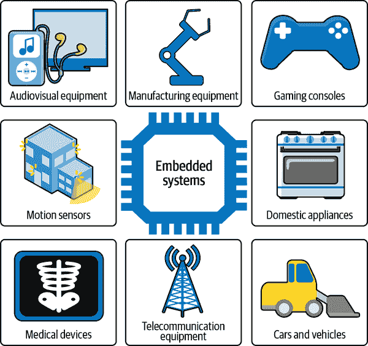
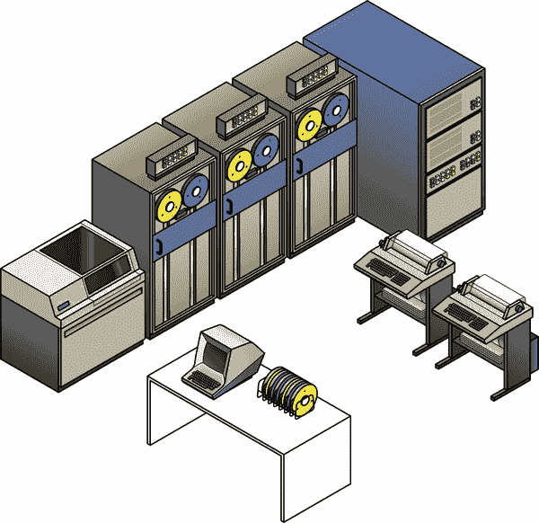
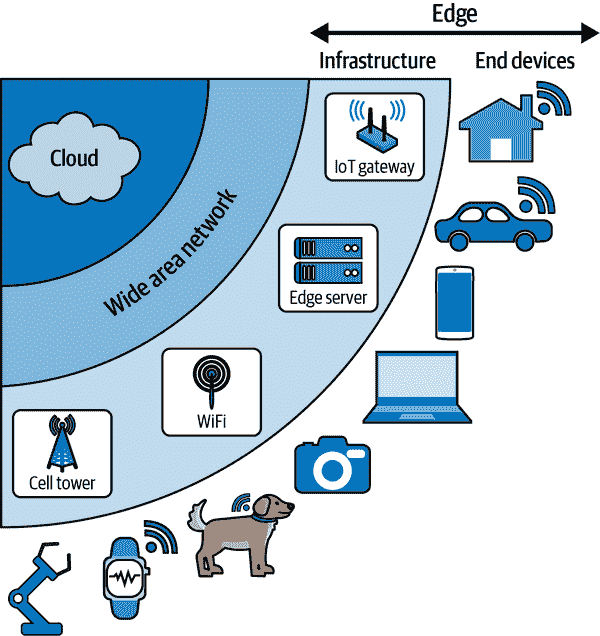
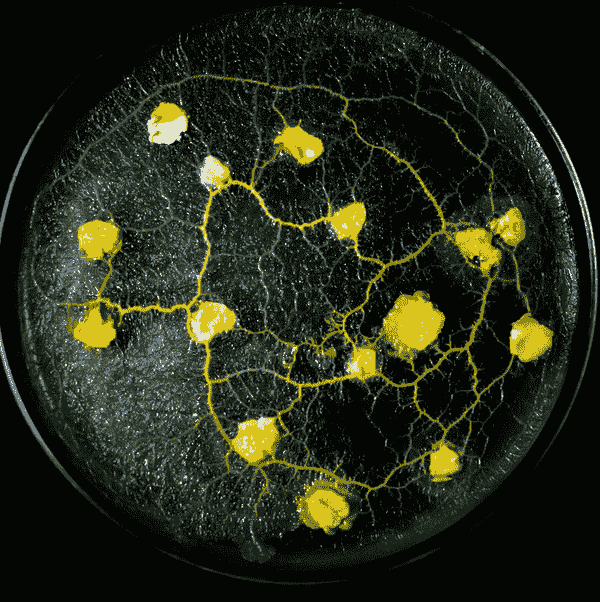
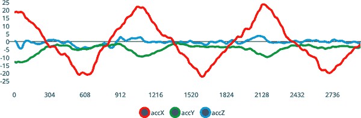
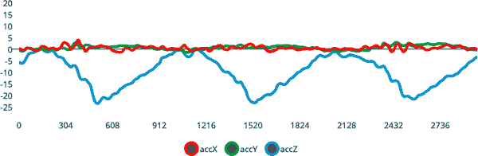
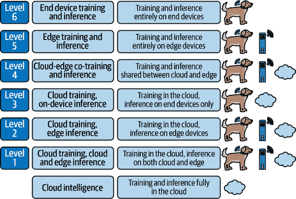
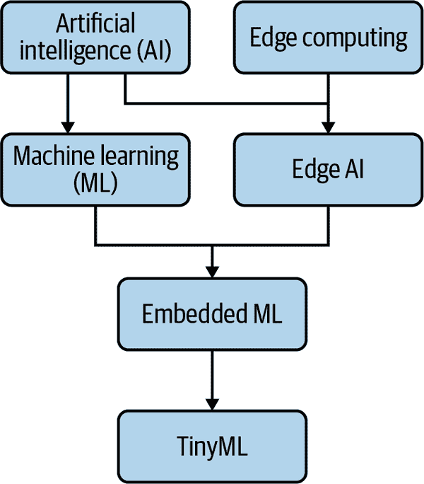

# 第一章：简介边缘人工智能

欢迎登上我们的列车！在本章中，我们将全面了解边缘人工智能的世界。我们将定义关键术语，了解“边缘人工智能”与其他人工智能的不同之处，并探讨一些最重要的应用案例。本章的目标是回答以下两个重要问题：

+   那么，边缘人工智能究竟是什么？

+   我为什么需要它？

# 定义关键术语

每个技术领域都有其自己的术语，边缘人工智能也不例外。事实上，术语*边缘人工智能*就是两个流行术语的结合，融合成一个强大的术语。它经常与其兄弟姐妹*嵌入式机器学习*和*TinyML*一同听到。

在我们继续之前，我们最好花点时间来定义这些术语，并理解它们的含义。因为我们在处理复合术语，让我们首先处理最基本的部分。

## 嵌入式

“嵌入式”是什么？根据您的背景，这可能是我们试图描述的所有术语中最为熟悉的。*嵌入式系统*是控制各种物理设备电子元件的计算机，从蓝牙耳机到现代汽车的发动机控制单元。*嵌入式软件*是在这些系统上运行的软件。图 1-1 展示了嵌入式系统的一些应用场景。



###### 图 1-1。嵌入式系统存在于我们世界的每一个角落，包括家庭和工作场所。

嵌入式系统可以是微小且简单的，比如控制数字手表的微控制器，也可以是庞大而复杂的，比如智能电视内部的嵌入式 Linux 计算机。与笔记本电脑或智能手机等通用计算机不同，嵌入式系统通常用于执行一个特定的、专用的任务。

由于它们驱动了我们大部分现代技术，嵌入式系统非常普及。事实上，仅在 2020 年就有超过 280 亿个微控制器出货¹——这只是嵌入式处理器的一种类型。它们存在于我们的家中、车辆、工厂和城市街道。您可能离嵌入式系统只有几英尺远。

嵌入式系统通常反映其部署环境的限制。例如，许多嵌入式系统需要在电池供电下运行，因此它们设计时考虑了能源效率——可能具有有限的内存或极慢的时钟速率。

嵌入式系统编程是航行在这些限制中的艺术，编写软件以执行所需的任务，同时充分利用有限的资源。这可能非常困难。嵌入式系统工程师是现代世界的默默无闻的英雄。如果你碰巧是其中一位，感谢你的辛勤工作！

## 边缘（以及物联网）

计算机网络的历史是一场巨大的拉锯战。在最初的系统中——房间大小的个人计算机——计算本质上是集中的。有一台机器，那台机器完成所有的工作。

最终，然而，计算机连接到终端设备（如图 1-2 所示），这些设备接管了它们的一些责任。大部分计算是在中央主机中进行的，但一些简单的任务——比如如何在阴极射线管屏幕上渲染字母——是由终端设备的电子部件完成的。



###### 图 1-2\. 主机计算机执行大部分计算，而简单的终端设备处理输入，打印输出并呈现基本图形

随着时间的推移，终端设备变得越来越复杂，接管了以前由中央计算机负责的越来越多的功能。拉锯战开始了！一旦个人电脑发明出来，小型计算机甚至可以在不连接到其他机器的情况下完成有用的工作。绳索已经被拉到了相反的极端——从网络中心到*边缘*。

互联网的增长，以及 Web 应用程序和服务，使得一些真正酷炫的事情成为可能——从流媒体视频到社交网络。所有这些都依赖于计算机连接到逐渐接管越来越多工作的服务器上。在过去的十年中，我们的大部分计算再次变得集中化——这一次在“云”中。当互联网断开连接时，我们现代的计算机并没有太多用处！

但我们用于工作和娱乐的计算机不是我们唯一连接的设备。事实上，据估计，到 2021 年，有 122 亿个各种各样的物品连接到互联网，²创造和消费数据。这个庞大的物体网络被称为物联网（IoT），包括你能想到的一切：工业传感器、智能冰箱、互联网连接的安全摄像头、个人汽车、运输集装箱、健身追踪器和咖啡机。

###### Tip

第一台物联网设备于 1982 年被创造出来。卡内基梅隆大学的学生们 [将一台可口可乐自动售货机连接到 ARPANET](https://oreil.ly/B510Z)——互联网的早期先驱——以便他们能在不离开实验室的情况下检查它是否空了。

所有这些设备都是包含由嵌入式软件工程师编写的软件运行的嵌入式系统。因为它们位于网络边缘，我们也可以称它们为*边缘设备*。在边缘设备上执行计算称为*边缘计算*。

边缘不是一个单一的地方；它更像是一个广阔的区域。位于网络边缘的设备可以彼此通信，它们也可以与远程服务器通信。甚至有些服务器就位于网络边缘。图 1-3 展示了这种情况。



###### 图 1-3\. 位于网络边缘的设备可以与云、边缘基础设施以及彼此通信；边缘应用通常跨越该地图内的多个位置（例如，数据可能从装有传感器的物联网设备发送到本地边缘服务器进行处理）。

能够位于网络边缘有一些重要好处。首先，那里是所有数据的来源！边缘设备是我们与互联网和物理世界之间的链接。它们可以使用传感器根据周围发生的情况收集数据，无论是跑步者的心率还是冷饮的温度。它们可以在本地基于这些数据做出决策并将其发送到其他位置。边缘设备可以访问其他人无法接触的数据。

# 移动电话和平板电脑是边缘设备吗？

作为位于网络边缘的便携式计算机，移动电话、平板电脑甚至个人电脑都是边缘设备。移动电话是最早采用边缘 AI 的平台之一：现代移动电话在许多用途上使用它，从语音激活到智能摄影³。

我们稍后再回到边缘设备（因为它们是本书的焦点）。在此之前，让我们继续定义一些术语。

## 人工智能

哇！这是一个大问题。人工智能（AI）是一个非常伟大的理念，定义起来非常困难。自从人类存在以来，我们就梦想着创造能帮助我们在生存斗争中的智能实体。在现代社会，我们梦想着机器人助手，他们可以协助我们的冒险：超智能的合成思维体将解决我们所有的问题，奇迹般的企业产品将优化我们的业务流程并保证我们迅速晋升。

但要定义 AI，我们必须定义智能——这事实证明特别困难。什么是智能？是指我们能够说话或思考吗？显然不是——只要问问粘菌（参见图 1-4），这是一种没有中枢神经系统的简单生物体，却能解决迷宫问题。



###### 图 1-4。粘菌是单细胞生物，据记录能够通过生物计算过程解迷宫，以寻找食物，如[“粘菌通过梯度化学引诱剂一次通过迷宫”](https://oreil.ly/Ecrq9)（Andrew Adamatzky，arXiv，2011）

由于这不是一本哲学书籍，我们没有时间充分探讨智能的话题。相反，我们想提出一个简单粗暴的定义：

> 智能意味着在正确的时间知道该做什么。

这可能经不起学术辩论，但这对我们来说没问题。它给了我们一个探索这个主题的工具。以下是一些根据我们的定义需要智能的任务：

+   当动物出现在画面中时拍照

+   当司机即将撞车时刹车

+   当机器发出异常声音时通知操作员

+   用相关信息回答问题

+   创作音乐表演的伴奏

+   当有人想洗手时打开水龙头

每一个问题都涉及一个动作（打开水龙头）和一个前提条件（当有人想洗手时）。在它们自己的背景下，大多数这些问题听起来相当简单——但正如任何使用过机场洗手间的人知道的那样，它们并不总是易于解决。

对大多数人来说，执行大多数这些任务相当容易。我们是高度有能力的生物，具有*通用*智能。但较小系统具有*狭窄*智能也能执行这些任务。拿我们的粘菌来说，它可能不明白为什么要解迷宫，但它肯定能做到。

话虽如此，粘菌不太可能也知道什么时候打开水龙头。一般来说，执行一个单一而紧密范围的任务（比如打开水龙头）要比执行完全不同任务集合要容易得多。

创造一种人工*通用*智能，相当于人类，将非常困难——正如几十年来不成功的尝试所示。但创建一个像粘菌水平的东西可能要容易得多。例如，理论上防止司机撞车是相当简单的任务。如果你能访问他们当前的速度和离墙的距离，你可以用简单的条件逻辑做到：

```
current_speed = 10 # In meters per second
distance_from_wall = 50 # In meters
seconds_to_stop = 3 # The minimum time in seconds required to stop the car
safety_buffer = 1 # The safety margin in seconds before hitting the brakes

# Calculate how long we’ve got before we hit the wall
seconds_until_crash = distance_from_wall / current_speed

# Make sure we apply the brakes if we’re likely to crash soon
if seconds_until_crash < seconds_to_stop + safety_buffer:
  applyBrakes()
```

显然，这个简化的例子并未考虑很多因素。但稍微复杂一点，基于这种条件逻辑的现代汽车驾驶辅助系统可以被认为是 AI 的营销策略。⁴

这里有两个要点我们想要表达：第一是智能相当难以定义，许多相当简单的问题需要一定的智能才能解决。第二是实施这种智能的程序不一定需要特别复杂。有时候，粘菌就足够了。

人工智能是什么？简单来说，它是一种基于某种输入做出智能决策的人造系统。创建人工智能的一种方式是利用机器学习。

## 机器学习

机器学习（ML）的核心概念其实很简单。它是一种通过运行数据通过算法来自动发现世界运作模式的方法。

我们经常听到人工智能和机器学习被互换使用，好像它们是同一回事——但实际上并非如此。人工智能并不总是涉及机器学习，机器学习也不总是涉及人工智能。尽管如此，它们可以很好地配合使用！

介绍机器学习的最佳方式是通过一个例子。想象一下，你正在开发一个健身追踪器——这是一个运动员可以佩戴的小手腕带。它包含一个加速度计，告诉你在某一时刻每个轴（x、y 和 z）上发生了多少加速度——如图 1-5 所示。



###### 图 1-5\. 以 6.25 赫兹采样的三轴加速度计输出

为了帮助你的运动员，你想要自动记录他们正在做的活动。例如，一个运动员可能周一跑步一个小时，周二游泳一个小时。

由于我们游泳时的动作与跑步时的动作非常不同，你推测可以根据手腕带加速计的输出区分这些活动。为了收集数据，你向十几名运动员提供了原型手腕带，并让他们执行特定活动——游泳、跑步或什么也不做——同时手腕带记录数据（见图 1-6）。

现在你有了一个数据集，你想要尝试确定一些规则，帮助你理解特定运动员是在游泳、跑步还是放松。一种方法是手动分析和检查数据，看看是否有什么显著特征。也许你注意到跑步涉及某个轴上更快的加速度。你可以利用这些信息编写一些条件逻辑，根据该轴的读数确定活动。

手动分析数据可能会很棘手，通常需要对领域（例如运动过程中的人类运动）有专业知识。与手动分析的替代方法可能是使用机器学习。



###### 图 1-6\. 三轴加速度计输出，显示与图 1-5 不同的活动；每种活动可以通过加速度在每个轴上随时间变化的模式来表征。

通过机器学习方法，您将所有运动员的数据输入训练算法。当提供加速计数据和运动员当前执行的活动信息时，算法尽力学习两者之间的映射关系。这种映射称为*模型*。

希望，如果训练成功，您的新机器学习模型可以接受一个全新的、从未见过的输入——来自特定时间窗口的加速计数据样本——并告诉您运动员正在执行的活动。这个过程被称为*推断*。

理解*新*输入的能力被称为*泛化*。在训练期间，模型已经学习了区分跑步和游泳的特征。然后，您可以在您的健身追踪器中使用该模型来理解新鲜的数据，就像您可能会使用我们之前提到的条件逻辑一样。

存在许多不同的机器学习算法，每种都有其自身的优势和缺点——而机器学习并不总是最适合的工具。本章后面我们将讨论机器学习最有帮助的场景。但一个不错的经验法则是，当我们的数据非常复杂时，机器学习真正发挥作用。

## 边缘人工智能

恭喜，我们终于谈到了我们的第一个复合流行语！边缘人工智能，不出意外地，是边缘设备和人工智能的结合。

正如我们之前讨论过的，边缘设备是提供我们数字和物理世界之间连接的嵌入式系统。它们通常配备传感器，向它们提供周围环境的信息。这使它们可以访问高频率数据的象征性“消防水龙带”。

我们经常被告知数据是我们现代经济的生命线，贯穿我们的基础设施并使组织能够运转。这确实如此，但并非所有数据都是平等的。从传感器获取的数据往往具有非常高的容量，但信息内容相对较低。

想象一下我们在前一节中描述的基于加速计的手腕传感器。加速计能够每秒进行多次读数。每个单独的读数对当前发生的活动告诉我们很少——只有在成千上万次读数的聚合中，我们才能开始理解正在发生的情况。

通常，物联网设备被视为简单的节点，这些节点从传感器收集数据，然后将其传输到中央位置进行处理。这种方法的问题在于，发送如此大量的低价值信息成本极高。连接费用昂贵，而传输数据则消耗大量能量——这对于使用电池供电的物联网设备来说是一个大问题。

由于这个问题，大多数由物联网传感器收集的数据通常被丢弃了。我们收集了大量的传感器数据，但我们无法对其进行任何处理。

边缘 AI 是解决这个问题的方法。与其将数据发送到远处的某个位置进行处理，不如直接在生成数据的设备上进行处理？现在，我们不再依赖于中央服务器，可以在本地做出决策——无需连接。

如果我们仍然希望向上游服务器或云端报告信息，我们可以传输只有重要信息，而不必发送每个传感器读数。这应该会节省大量成本和能量。

有许多不同的方式可以将智能部署到边缘。图 1-7 显示了从云 AI 到完全设备上的智能的连续体。正如我们将在本书后面看到的那样，边缘 AI 可以分布在整个分布式计算架构中——包括一些节点在边缘，其他节点在本地网关或云中。

正如我们所见，人工智能可以意味着许多不同的东西。它可以非常简单：一点人类洞察力编码在一点简单的条件逻辑中。它也可以非常复杂，基于深度学习的最新发展。

边缘 AI 完全相同。在其最基本的层面上，边缘 AI 是关于在网络边缘，靠近数据生成的地方做出一些决策。但它也可以利用一些非常酷的东西。这使我们很好地过渡到下一节！



###### 图 1-7\. 云智能和完全设备智能之间的连续体；这六个级别由[《边缘智能：利用边缘计算铺设人工智能的最后一英里》](https://oreil.ly/8uWK-)（周等人，《IEEE 会议记录》，2019 年）描述。

## 嵌入式机器学习和微型机器学习

嵌入式 ML 是在嵌入式系统上运行机器学习模型的艺术和科学。微型机器学习，或 TinyML，⁵ 是在最受限制的嵌入式硬件上执行这一概念——如微控制器、数字信号处理器和小型可编程逻辑器件（FPGA）。

当我们谈论嵌入式 ML 时，通常指的是机器学习推断——即根据加速度计数据猜测物理活动等过程。训练部分通常仍然在传统计算机上进行。

嵌入式系统通常具有有限的内存。这对于运行许多类型的机器学习模型提出了挑战，这些模型通常对只读存储器（ROM）（用于存储模型）和 RAM（用于处理推断期间生成的中间结果）都有很高的要求。

它们在计算能力方面也经常受到限制。由于许多类型的机器学习模型具有相当高的计算密集型，这也可能会引发问题。

幸运的是，在过去几年中，优化方面取得了许多进展，使得在一些非常小型、低功耗的嵌入式系统上运行相当大型和复杂的机器学习模型成为可能。在接下来的几章中，我们将学习一些这些技术！

嵌入式机器学习通常与其值得信赖的伴侣*数字信号处理*一起部署。在我们继续之前，让我们也来定义这个术语。

## 数字信号处理

在嵌入式世界中，我们经常处理信号的数字表示。例如，加速度计提供了三个轴上加速度的数字值流，数字麦克风则提供了特定时间声音级别的值流。

数字信号处理（DSP）是使用算法来操作这些数据流的实践。当与嵌入式机器学习配对时，我们经常使用 DSP 来在馈送到机器学习模型之前修改信号。有几个原因我们可能想要这样做：

+   清理噪声信号

+   移除由硬件问题引起的尖峰或异常值

+   从信号中提取最重要的信息

+   将数据从时域转换到频率域⁶

DSP 在嵌入式系统中非常常见，以至于嵌入式芯片通常具有常见 DSP 算法的超快硬件实现，以备不时之需。

现在我们对本书中最重要的术语有了扎实的理解。图 1-8 展示了它们在上下文中的关系。



###### 图 1-8。这个图示显示了边缘人工智能中一些最重要的概念，从最一般的概念到最具体的概念。

在下一节中，我们将深入探讨边缘人工智能的主题，并开始分析其成为如此重要技术的原因。

# 为什么我们需要边缘人工智能？

想象一下，今天早晨你在南加州沙漠中的乔舒亚树国家公园进行了一次越野跑步。你一路上一直听着音乐，通过不间断的手机蜂窝连接进行流媒体传输。在山间特别美丽的地方，你拍下了一张照片并发送给你的伴侣。几分钟后，你收到了他们的回复。

在一个即使是最偏远的地方也有某种形式数据连接的世界中，为什么我们需要边缘人工智能？如果互联网强大的服务器只隔着一段无线电信号，那么这些能够自主做出决策的小型设备有何意义呢？考虑到增加了所有这些复杂性，我们难道不是让生活变得更加困难吗？

正如你可能猜到的那样，答案是否定的！边缘人工智能解决了一些真实存在的问题，这些问题否则会阻碍我们的技术更好地服务于人类。我们用来解释边缘人工智能好处的最喜欢的框架是一个听起来不礼貌的记忆法：BLERP。

## 要了解边缘人工智能的好处，只需用 BLERP 记住即可

BLERP？边缘人工智能和视觉联盟的创始人 Jeff Bier，[创建了这个优秀的工具](https://oreil.ly/UY-DG)来表达边缘人工智能的好处。它由五个词组成：

+   带宽

+   延迟

+   经济学

+   可靠性

+   隐私

拥有了 BLERP，任何人都可以轻松记住和解释边缘人工智能的好处。它也很有用，可以作为一个过滤器，帮助决定边缘人工智能是否适合特定应用。

让我们逐字逐句地分析一下。

### 带宽

物联网设备通常捕获比它们能传输的带宽还要多的数据。这意味着它们捕获的绝大部分传感器数据甚至都没有被使用——它们只是被丢弃了！想象一下，一个智能传感器监控工业机器的振动，以确定它是否正常运行。它可能使用简单的阈值算法来理解机器何时振动过多或过少，然后通过低带宽无线连接传达这些信息。

这听起来已经很有用了。但是如果你能识别数据中的模式，这些模式能够提示机器可能即将故障呢？如果我们有大量带宽，我们可以将传感器数据发送到云端，并进行某种分析，以了解故障是否即将发生。

然而，在许多情况下，没有足够的带宽或能量预算来发送持续的数据流到云端。这意味着我们将被迫丢弃大部分传感器数据，尽管这些数据包含有用的信号。

带宽限制非常普遍。这不仅仅涉及到可用的连接性，还涉及到电力问题。网络通信通常是嵌入式系统执行的能量消耗最大的任务，这意味着电池寿命往往是限制性的因素。一些机器学习模型可能需要相当大的计算量，但它们往往比传输信号消耗的能量要少。

这就是边缘人工智能的用武之地。如果我们能在物联网设备本身上运行数据分析，而不必上传数据，那么如果分析显示机器即将故障，我们可以使用有限的带宽发送通知。这比试图传输所有数据要可行得多。

当然，设备没有任何网络连接也是非常常见的！在这种情况下，边缘人工智能使得许多之前不可能的用例成为现实。我们稍后会详细讨论这一点。

### 延迟

数据传输需要时间。即使有大量可用带宽，从设备到互联网服务器的往返时间可能需要数十到数百毫秒。在某些情况下，延迟可以达到分钟、小时或天数——想想卫星通信或存储转发消息。

有些应用程序需要更快的响应。例如，由远程服务器控制移动车辆可能是不切实际的。在车辆导航环境中控制车辆需要方向调整和车辆位置之间的持续反馈。在显著的延迟下，方向调整成为一项主要挑战！

边缘人工智能通过完全消除往返时间来解决这个问题。一个很好的例子是自动驾驶汽车。车辆的人工智能系统在车载计算机上运行。这使得它能够几乎即时地对变化的条件作出反应，比如前方的驾驶员突然刹车。

边缘人工智能作为解决延迟问题的有力工具的一个最具说服力的例子是在机器人空间探索中。火星与地球相距遥远，以光速传播的无线电信号需要*数分钟*才能到达。更糟糕的是，由于行星的排列方式，直接通信通常是不可能的。这使得控制火星探测器非常困难。NASA 通过使用边缘人工智能来解决这个问题——他们的探测器利用复杂的人工智能系统规划任务、导航环境，并在另一个世界的表面搜索生命。如果你有空，甚至可以通过标记数据来帮助未来的火星探测器导航！

### 经济学

连通性成本很高。连接的产品使用起来更昂贵，它们依赖的基础设施也会给制造商带来成本压力。所需带宽越大，成本就越高。对于部署在需要通过卫星进行远程长距离连接的偏远地区的设备来说，情况尤为严峻。

通过在设备上处理数据，边缘人工智能系统减少或避免了通过网络传输和在云中处理数据的成本。这可以解锁许多以前无法实现的用例。

在某些情况下，唯一有效的“连接”方式是派遣人员执行某些手动任务。例如，保护研究人员经常使用摄像机陷阱监测偏远地区的野生动物。这些设备在检测到运动时拍摄照片并将其存储到 SD 卡中。通过卫星互联网上传每张照片成本太高，因此研究人员必须前往他们的摄像机陷阱收集图像并清空存储空间。

由于传统的摄像机陷阱是由动作触发的，它们拍摄了许多不必要的照片——可能是由于风中的树枝、路过的徒步者和研究者不感兴趣的生物而触发。但现在一些团队正在使用边缘 AI 仅识别他们关心的动物，这样他们可以丢弃其他图像。这意味着他们不必频繁飞往荒无人烟之地更换 SD 卡。

在其他情况下，连接成本可能并不是一个问题。但是，对于依赖服务器端 AI 的产品来说，维护服务器端基础设施的成本可能会使您的商业模式变得复杂化。如果您必须支持一大批需要“联系家里”的设备来做决策，您可能会被迫采用订阅模式。您还必须承诺长时间维护服务器，有可能导致您的客户在您决定停止服务时拥有“砖头”设备的风险。⁷

不要低估经济影响。通过减少长期支持成本，边缘 AI 使得许多原本不可行的用例成为可能。

### 可靠性

由设备端 AI 控制的系统比依赖云连接的系统潜在更可靠。当您为设备添加无线连接时，您将增加一个庞大且极其复杂的依赖网络，从链路层通信技术到可能运行应用程序的互联网服务器。

这个谜题的许多部分都超出了您的控制范围，因此即使您做出了所有正确的决定，仍然会面临与构成您分布式计算堆栈的技术相关的可靠性风险。

对于某些应用来说，这可能是可以容忍的。如果您正在构建一个响应语音命令的智能音箱，当用户的家庭互联网连接断开时停止识别命令，用户可能会理解。尽管如此，这仍然可能是一种令人沮丧的体验！

但在其他情况下，安全至关重要。想象一个基于 AI 的系统，监视工业机器以确保其在安全参数内操作。如果互联网断开连接时停止工作，可能会危及人类生命。如果 AI 完全基于设备端，则在连接问题发生时仍然能够正常运行，这样会更安全。

可靠性往往是一种妥协，所需的可靠性水平因用例而异。边缘 AI 可以成为改善产品可靠性的强大工具。虽然 AI 本质上复杂，但它代表了一种不同类型的复杂性，其风险在许多情况下更易于管理。

### 隐私

在过去几年中，许多人不情愿地接受了便利与隐私之间的折衷。理论上来说，如果我们希望我们的技术产品更智能、更有帮助，我们就必须放弃我们的数据。因为智能产品传统上是在远程服务器上做出决策，它们往往会向云端发送大量的传感器数据流。

对于某些应用来说可能是合适的，例如我们可能不担心物联网恒温器将温度数据报告给远程服务器。⁸ 但对于其他应用来说，隐私是一个巨大的问题。例如，许多人可能会犹豫安装一个能连接到互联网的安全摄像头在他们家中。它可能提供一些令人安心的安全性，但是这种交换——让他们最私密空间的实时视频和音频流被广播到互联网上——似乎不值得。即使摄像头的制造商是完全值得信赖的，数据通过安全漏洞暴露的可能性也总是存在。⁹

边缘人工智能提供了一种替代方案。安全摄像头可以利用一些内置智能在主人不在家时识别到入侵者的存在，并以适当的方式通知主人。当数据在嵌入式系统上处理并且从未传输到云端时，用户的隐私得到了保护，滥用的可能性也降低了。

边缘人工智能能够实现隐私，解锁大量令人兴奋的用例。对于安全、工业、儿童保育、教育和医疗应用来说，这是一个特别重要的因素。事实上，由于这些领域涉及到数据安全的严格法规（或客户期望），最好的隐私产品是那些*完全避免*收集数据的产品。

### 使用 BLERP

正如我们将在第二章中看到的，BLERP 可以是理解某个问题是否适合边缘人工智能的便捷工具。并不是每个首字母缩略词的每个字都必须有一个强有力的论证：即使只符合一个或两个标准，如果足够有说服力，也可以证明其用例的合理性。

## 边缘人工智能的益处

边缘人工智能的独特优势提供了一套新工具，可以应用于全球一些最大的问题。保护、医疗和教育领域的技术人员已经开始利用边缘人工智能产生重大影响。以下是一些我们个人特别激动的例子：

+   [智慧公园](https://www.smartparks.org)正在利用[运行机器学习模型的项圈](https://oreil.ly/nyVIm)更好地理解全球野生动物公园中大象的行为。

+   Izoelektro 的[RAM-1](https://oreil.ly/hR-US)利用嵌入式机器学习检测即将发生的电力传输硬件故障，从而帮助防止森林火灾。

+   来自沙特阿拉伯哈利德国王大学的 Mohammed Zubair Shamim 博士正在训练模型，可以利用低成本设备[筛选出患有口腔癌等生命威胁性疾病的患者](https://oreil.ly/ktZq_)。

+   全球各地的学生正在为其本地产业开发解决方案。来自巴西联邦大学工程学院（UNIFEI）的 João Vitor Yukio Bordin Yamashita，利用嵌入式硬件创建了一个系统，用于[识别影响咖啡植物的疾病](https://oreil.ly/gSv-J)。

边缘 AI 的特性使其特别适合应用于全球性问题。由于可靠的连接成本高昂且并非普遍可用，许多当前的智能技术只有在工业化、富裕和良好连接的地区才有利用的价值。通过消除对可靠互联网连接的需求，边缘 AI 增加了访问能力，使得能够受益于这些技术的人群更广泛。

当机器学习成为混合中的一部分时，边缘 AI 通常涉及小型模型，这些模型通常快速且廉价地训练。由于也无需维护昂贵的后端服务器基础设施，边缘 AI 使得资源有限的开发者能够为他们更了解的本地市场构建尖端解决方案。想要了解更多这些机会，请观看[“TinyML 和发展中国家”](https://oreil.ly/csz6p)，这是 Pete Warden 在 TinyML Kenya 会议上的精彩演讲。

正如我们在“隐私”中所看到的，边缘 AI 还为用户提供了改善隐私的机会。在我们网络化的世界中，许多公司将用户数据视为可被提取和挖掘的宝贵资源。消费者和业主通常需要在使用 AI 产品时牺牲他们的隐私，将他们的数据交给未知的第三方。

使用边缘 AI，数据无需离开设备。这使得用户与产品之间能够建立更加信任的关系，让用户拥有对自己数据的所有权。对于设计服务弱势群体的产品，这一点尤为重要，这些群体可能对看似在收集他们数据的服务持怀疑态度。

正如我们将在后面的部分中看到的，要构建道德 AI 系统必须避免许多潜在的陷阱。尽管如此，这项技术为使世界变得更美好提供了巨大的机会。

###### 注意

如果您考虑使用边缘 AI 来解决您社区的问题，作者们很乐意听取您的想法。我们已经支持了许多有影响力的项目，并希望能够找到更多。请发送电子邮件至*hello@edgeaibook.com*联系作者。

## Edge AI 与普通 AI 的关键区别

边缘 AI 是普通 AI 的一个子集，因此许多相同的原则也适用。尽管如此，在考虑边缘设备上的人工智能时，有一些特别需要考虑的事情。以下是我们的主要观点。

### 在边缘进行训练是罕见的。

许多 AI 应用程序由机器学习驱动。大多数情况下，机器学习涉及对模型进行*训练*，以基于一组标记数据进行预测。一旦模型被训练好，就可以用于*推理*：对未曾见过的数据进行新的预测。

当我们谈论边缘 AI 和机器学习时，通常是在谈论*推理*。训练模型需要比推理更多的计算和内存，通常需要一个带标签的数据集。在边缘设备上这些东西很难获得，因为设备资源有限，数据原始且未经过滤。

因此，边缘 AI 中使用的模型通常在部署到设备之前进行训练，使用相对强大的计算和经过清洗和标记的数据集——通常是手动完成的。技术上训练机器学习模型在边缘设备上是可能的，但很少见——主要是由于缺乏需要用于训练和评估的带标签数据。

在设备上训练的两种常见的子类型用于任务如在移动电话上的面部或指纹验证，将一组生物特征映射到特定用户。第二种用于预测维护，在这种情况下，设备上的算法学习机器的“正常”状态，以便在状态异常时采取行动。在“设备上训练”主题中将有更多详细信息。

### 边缘 AI 的重点在于传感器数据

边缘设备的激动人心之处在于它们靠近数据生成的地方。通常，边缘设备配备有传感器，使它们与环境直接连接。边缘 AI 部署的目标是理解这些数据，识别模式，并利用它们做出决策。

由于其特性，传感器数据往往庞大、嘈杂且难以管理。它以高频率到达——潜在地每秒多次。运行边缘 AI 应用程序的嵌入式设备在有限的时间内必须收集这些数据、处理它们、将其馈送到某种 AI 算法中，并根据结果采取行动。这是一个重大挑战，尤其是考虑到大多数嵌入式设备资源有限，无法存储大量数据。

需要处理原始传感器数据的需求使得数字信号处理成为大多数边缘 AI 部署的关键组成部分。在任何有效和高效的实现中，信号处理和 AI 组件必须作为单一系统设计，平衡性能和准确性之间的权衡。

许多传统的机器学习和数据科学工具专注于表格数据，比如公司财务或消费者产品评论。相比之下，边缘 AI 工具专门设计用于处理传感器数据的连续流。这意味着构建边缘 AI 应用程序需要一套全新的技能和技术。

### ML 模型可以变得非常小

边缘设备通常设计成成本和功耗限制较高。这意味着它们通常具有比个人电脑或网络服务器慢得多的处理器和较少的内存。

目标设备的约束意味着，在使用机器学习实现边缘 AI 时，机器学习模型必须相当小。在中端微控制器上，可能只有一百千字节左右的 ROM 可用于存储模型，而一些设备则具有更少的内存。由于较大的模型执行时间更长，设备的慢处理器也会推动开发人员部署较小的模型。

缩小模型涉及一些权衡。首先，较大的模型具有更大的学习能力。当你将模型缩小时，它开始失去一些表示其训练数据集的能力，可能不那么准确。因此，开发嵌入式机器学习应用程序的开发人员必须在模型大小和所需精度之间取得平衡。

存在各种技术用于压缩模型，减小其大小以适应更小的硬件，并减少计算时间。这些压缩技术非常有用，但也会影响模型的准确性——有时是以微妙但风险较大的方式。"压缩与优化"将详细讨论这些技术。

尽管如此，并非所有应用程序都需要大而复杂的模型。那些需要的通常是像图像处理这样的内容，因为解释视觉信息涉及很多细微差别。通常，对于简单的数据，几千字节（甚至更少）的模型就足够了。

### 从反馈中学习是有限的

正如我们将在后面看到的那样，AI 应用是通过一系列迭代的反馈循环构建的。我们做一些工作，测量其表现，然后找出需要改进的地方。

例如，想象一下我们构建了一个健身监控器，可以根据从板载传感器收集的数据估计您的 10K 跑步时间。为了测试它是否工作良好，我们可以等到您真正跑 10K，并查看预测是否正确。如果不正确，我们可以将您的数据添加到我们的训练数据集中，尝试训练一个更好的模型。

如果我们有可靠的互联网连接，这应该不难——我们可以直接将数据上传到我们的服务器上。但边缘 AI 的魔力部分在于我们可以部署智能到连接性有限的设备上。在这种情况下，我们可能没有足够的带宽来上传新的训练数据。在许多情况下，我们甚至可能根本无法上传任何内容。

这对我们的应用程序开发工作流程提出了很大的挑战。当我们在现实世界中的访问有限时，如何确保我们的系统表现良好？当我们几乎无法收集更多数据时，如何改进我们的系统？这是边缘 AI 开发的核心主题，我们将在本书中广泛探讨。

### 计算是多样化和异构的。

大多数服务器端 AI 应用运行在普通的 x86 处理器上，有些还加入了图形处理单元（GPU）来帮助进行深度学习推理。由于 Arm 最近推出了服务器 CPU 和 Google 的 TPUs（张量处理单元）等异类深度学习加速器的存在，多样性稍有增加，但大部分工作负载仍在相当普通的硬件上运行。

相比之下，嵌入式领域包括令人眼花缭乱的设备类型：

+   包括微小的 8 位芯片和高级的 32 位处理器在内的微控制器。

+   运行嵌入式 Linux 的片上系统（SoC）设备。

+   基于 GPU 技术的通用加速器。

+   现场可编程门阵列（FPGA）。

+   固定架构的加速器，可以高速运行单一模型架构。

每个类别都包括来自许多不同制造商的无数设备，每种设备都有独特的构建工具、编程环境和接口选项。这可能会让人感到非常不知所措。

硬件的多样性意味着可能有多个适合任何给定用例的系统。难点在于选择一个！我们将在本书的过程中解决这个挑战。

### “足够好”通常是目标。

对于传统 AI 来说，通常的目标是获取最佳的性能，不管成本如何。在服务器端应用中使用的生产深度学习模型可能达到*几千兆字节*的大小，并依赖强大的 GPU 计算能力能够及时运行。当计算不是问题时，最准确的模型通常是最佳选择。

边缘 AI 的优势伴随着一些严重的限制。边缘设备的计算能力较弱，通常需要在设备性能和准确性之间进行艰难的选择。

这无疑是一个挑战，但并非障碍。在边缘运行 AI 有着巨大的好处，对于大量使用案例来说，即使牺牲一些准确性，仍然能带来显著优势。甚至一点点设备上的智能也比没有要好得多。

目标是构建能充分利用这种“足够好”性能的应用程序——这是 Alasdair Allan 优雅描述的[Capable Computing](https://oreil.ly/W4gDl)方法。成功做到这一点的关键是使用工具，帮助我们理解应用程序在现实世界中的性能，考虑到任何性能惩罚后。我们将会详细讨论这个主题。

### 工具和最佳实践仍在不断发展。

作为一种刚刚开始大规模采用的全新技术，边缘 AI 仍依赖于为大规模服务器端 AI 开发的工具和方法。事实上，大多数 AI 研究仍集中在构建大模型和巨大数据集上。这有几个影响。

首先，正如我们将在第五章中看到的那样，我们经常会使用来自数据科学和机器学习领域的现有开发工具。积极的一面是，这意味着我们可以借鉴一个丰富的已被证明有效的库和框架生态系统。然而，少数现有工具并未优先考虑边缘上重要的事项——如小型模型尺寸、计算效率以及在少量数据上进行训练的能力。我们通常需要额外的工作来实现这些重点。

其次，由于边缘人工智能（edge AI）研究相对较新，我们可能会看到其非常快速的发展。随着这一领域的扩展，越来越多的研究人员和工程师开始关注它，新的提高效率的方法也随之出现——还有构建有效应用程序的最佳实践和技术。这种快速变化的前景使得边缘人工智能成为一个非常令人兴奋的领域。

# 总结

在本章中，我们探讨了定义边缘人工智能的术语，学习了一种用于推理其好处的便捷工具，探讨了将计算移动到边缘如何增加对技术的访问，并概述了使边缘人工智能不同于传统人工智能的因素。

从下一章开始，我们将处理具体内容。准备好学习今天支持边缘人工智能的用例、设备和算法。

¹ 据[Business Wire](https://oreil.ly/xa0o-)报道。

² 预计到 2025 年将增长到 270 亿，根据[IoT Analytics](https://oreil.ly/yMRAF)的数据。

³ 嵌入式工程和移动开发通常是独立的学科。即使在移动设备内部，嵌入式固件和操作系统也与移动应用程序不同。本书侧重于嵌入式工程，因此我们不会过多讨论构建移动应用程序，但我们将涵盖在两种情况下都相关的技术。

⁴ 多年来，人们希望通过工程师手工调整的复杂条件逻辑来实现人工通用智能。结果证明，这比预期的要复杂得多！

⁵ “TinyML”这个术语是 TinyML 基金会的注册商标。

⁶ 这将在“频谱分析”中解释。

⁷ 并非所有的边缘人工智能应用都能免受影响，因为通常需要监控设备并对算法进行更新。尽管如此，在许多情况下，边缘人工智能确实可以减轻维护的负担。

⁸ 即使在这个无伤大雅的例子中，恶意访问你的恒温器数据的人也可以利用它来识别你何时度假，以便闯入你的房子。

⁹ 这种确切的情况在 2022 年曾发生在 Ring 家庭安全系统身上，该系统被发现容易受到攻击（来源于《TechCrunch》，2022 年，《亚马逊的 Ring 悄悄修复了一个使用户摄像头录像面临曝露风险的安全漏洞》）。
