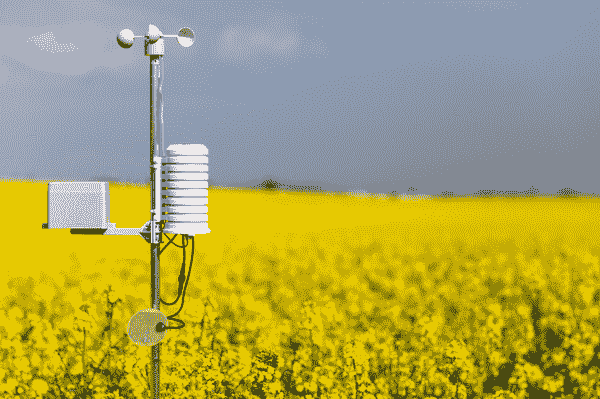
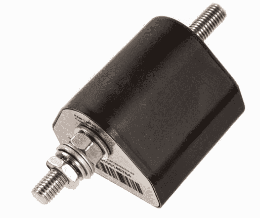
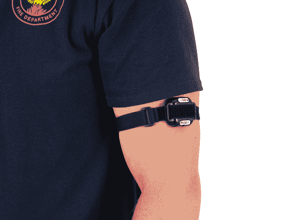
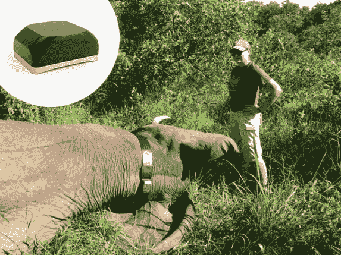

# 第二章：边缘人工智能在现实世界中的应用

我们现在对边缘人工智能的含义以及理论上它为何是一套有用的技术有了基本的了解。在即将到来的章节中，我们将看到这些理论在与现实世界接触时的实际表现。我们将首先检视一些目前已经应用在现场的实际产品。之后，我们将探索边缘人工智能产品的顶级应用领域。最后，我们将更深入地了解使任何产品成功所需的伦理考量。

# 边缘人工智能的常见应用场景

正如我们在前一章学到的，对于拥有大量传感器数据但缺乏计算或连接能力的设备，边缘人工智能尤其有价值。幸运的是，我们几乎在每个地方都能找到这些条件。

在现代城市中，我们似乎从未离开过电源插座或无线接入点。但即使有高带宽网络连接和可靠电力，限制设备的通信和能耗也有巨大的优势。正如我们在“理解边缘人工智能的好处，只需看一看 BLERP”中所见，追求便携性、可靠性、隐私和成本等可取特性，推动产品开发朝向设计以最小化连接和能耗使用量的设备。

尽管我们看似全球互联网普及，但地球上有很多地方的连接性或电力资源仍然有限。截至目前，[地球陆地的 50%相对未受到人类开发](https://oreil.ly/ASced)。只有极少数地球表面有蜂窝网络或无线覆盖，[数十亿人没有可靠的电力访问](https://oreil.ly/kly86)。

但是，除了明显的偏远地区外，在我们最建设的地区中，还有许多被归类为这一类别的隐蔽角落。在我们现代工业供应链中，有些地方提供硬布线的直流电源是不现实的——这时高效的电池供电设备就成了完美的选择（参见图 2-1）。

###### 图 2-1。地球上许多地方都需要电池供电

同时，传感器变得更便宜、更复杂且更节能。通常，即使是简单的嵌入式设备也配备了功能强大的传感器，但由于数据传输至远程处理系统的挑战，这些传感器往往无法充分利用。例如，想象一下一个基本的健身可穿戴设备，它使用加速度计来计步。即使是这种简单设备可能配备有高灵敏度的多轴加速度计，具有非常高的采样率，能记录最微妙的运动。除非设备软件能够解释这些数据，否则大部分数据都会被丢弃：将原始数据发送到另一台设备进行处理将耗费过多能量。

## 绿色田野和棕色田野项目

如上所述的条件几乎无限地提供了部署边缘人工智能的机会。从实际角度来看，将这些机会分为两类可能有所帮助：*绿色田野*和*棕色田野*。这些术语源自城市规划。绿色田野项目指的是在尚未开发的现场进行的项目，该地仍然是一片草坪绿地。棕色田野项目则是指在已开发的现场进行的项目，可能存在某些现有的遗留基础设施。

在边缘人工智能领域，绿色田野项目是硬件和软件从头设计的项目。由于没有现有的硬件，绿色田野项目可以利用最新和最伟大的计算和传感创新，这些我们将在本章后续学习。开发者有更多自由度设计针对他们正在目标的使用案例的理想解决方案。例如，现代手机被设计为包括专门的低功耗数字信号处理硬件，以便它们可以持续监听唤醒词（例如“OK，Google”或“Hey，Siri”），而不会耗尽电池。硬件选择是基于特定的唤醒词检测算法。

相比之下，棕色田野边缘人工智能项目始于原本设计用于其他目的的现有硬件。开发者必须在现有硬件的限制下工作，以为产品赋予人工智能能力。这种方式减少了开发者的自由，但避免了设计新硬件所带来的重大成本和风险。例如，开发者可以通过利用设备现有的嵌入式处理器的空闲周期，向市场上已有的蓝牙音频耳机添加唤醒词检测功能。甚至可以通过固件更新向现有设备添加这种新功能。

绿色田野项目因为能够将最新的边缘人工智能硬件和算法进行配对，从而推动可能性的极限，因此充满了激情。另一方面，棕色田野项目则能够为现有硬件带来新的能力，让客户感到满意，并充分利用现有设计。

## 真实世界产品

理解技术的最佳方式是看它在现实世界中的应用。尽管边缘人工智能仍处于初期阶段，但它已经被广泛应用于各种应用和行业中。以下是三个使用边缘人工智能开发的真实系统的简要概述。也许你自己的工作将在本书的未来版本中被介绍！

### 使用电力线路故障检测预防森林火灾

电力线路横跨广阔的荒野，包括欧洲的古老森林。设备故障可能引发植被火灾。成千上万英里的铁塔和电力线路通常位于非常偏远的地区，电气设备的监测可能会很困难。

Izoelektro 的[RAM-1](https://www.ram-center.com)设备利用边缘人工智能来解决这个问题（图 2-2）。一套传感器监测每个电力塔的条件，包括温度、倾斜和电压，并使用深度学习分类模型（第四章）来识别故障可能正在发展的时候。技术人员可以访问塔并在发生任何火灾危险之前进行修复。该设备具有坚固的结构，设计用于经受多年的极端天气条件。

###### 图 2-2\. Izoelektro 的 RAM-1 设备（来源：[Izoelektro](https://www.ram-center.com)）

在这是边缘人工智能的完美应用的两个主要因素。第一个是荒野地区的连接性不足。实时传输数千个偏远电塔的原始传感器数据将成本高昂。相反，优雅的解决方案是在源头解释传感器数据，并且仅在预测到故障时传输——每月最多大约 250 千字节。设备能够理解哪些数据是需要立即关注的关键数据，在定期批量传输中发送不那么重要的信息。

这种选择性的通信有助于第二个略显反直觉的因素。尽管 RAM-1 安装在电力塔上，但实际上是利用电池供电。这确保了即使电力线路出现故障，它仍然可以继续工作，并且减少了安装的成本和复杂性。由于无线电传输消耗大量能量，RAM-1 避免不必要的传输有助于延长电池寿命。事实上，在边缘人工智能的帮助下，其电池可以持续二十年。

这就是 RAM-1 如何适合 BLERP 模型的方式：

带宽

RAM-1 部署的偏远地区的连接性有限。

延迟

至关重要的是要在故障发生时尽快识别，而不是等待定期数据传输。

经济学

避免不必要的通信可以节省金钱，也意味着设备可以依靠电池供电，从而降低安装成本。

可靠性

依靠电池供电的能力提高了可靠性。

隐私

对于这种使用情况并不是一个主要考虑因素。

### 保护第一响应者的智能可穿戴设备

他们的工作性质意味着消防员经常暴露在高温下，极端的高温条件可能会严重影响他们的长期健康。事实上，根据 FEMA [消防员在执勤中突发心脏事件是导致死亡的主要原因](https://oreil.ly/lG6Hk)。

SlateSafety 的[BioTrac Band](https://oreil.ly/mAWs1)是一款为工人设计的可穿戴设备，如消防员等在极端条件下工作的人士（见图 2-3）。

###### 图 2-3。SlateSafety 的 BioTrac Band（图片来源：[SlateSafety](https://slatesafety.com)）

BioTrac Band 部署在极端环境中，使其成为边缘 AI 的一个极好的用例。

以下是 BioTrac Band 符合 BLERP 模型的情况：

带宽

在消防员工作的极端环境中，连接性有限。

延迟

健康问题是时间关键的，必须立即识别。

经济学

从传感器流式传输原始数据需要昂贵的高带宽连接。

可靠性

即使连接性下降，该设备也能继续警告消防员潜在风险，并且可以长时间运行在小电池上。

隐私

生物信号原始数据可以保留在设备上，只传输关键信息。

### 使用智能颈圈理解象行为

随着对它们自然栖息地的压力增加，野生大象与人类的接触越来越多。

[ElephantEdge](https://oreil.ly/Hehxr) 是一个开源项目，旨在创建一个设计用于帮助研究人员了解大象行为的[追踪项圈](https://oreil.ly/OHig1)（见图 2-4）。该项圈安装在大象的颈部，利用嵌入式传感器和机器学习模型可以提供有关动物位置、健康和活动的见解。这些数据可以用于科学研究——也可以用于提醒人类动物的存在，以避免冲突。

由于设备安装在一只野生大象身上，更换电池是一项困难的任务！边缘 AI 技术通过减少设备消耗的能量来提供帮助。不再传输大量原始传感器数据，配备机器学习的项圈能够传输关于动物活动的高级信息——例如，是否在行走、进食、饮水或进行其他行为。使其能够做到这一点的模型是由与公共数据集合作的公民科学家社区原型制作的。

###### 图 2-4\. OpenCollar Edge 追踪项圈被安装在一只被麻醉的大象身上（来源：[IRNAS](https://www.irnas.eu)）

这些低带宽要求意味着项圈可以利用一种名为 LoRa 的极低功耗无线通信技术。该项圈能够与装备有 LoRa 的卫星通信，每天经过一次，发送自上次传输以来动物活动的摘要。这意味着即使在传统连接受限的地方，系统也可以可靠地工作，但电池预计可以持续五年。

下面是 OpenCollar Edge 如何适配 BLERP 模型的情况：

带宽

大象栖息地的连接有限；设备分析能力使得低能耗无线技术的使用成为可能。

延迟

尽管该设备每天只传输一次，但与需要手动下载的传统追踪项圈相比，这已经非常频繁了。

经济学

该设备通过取代繁重的传统大象监测方法来节省成本。

可靠性

不频繁的传输意味着电池可以持续数年，并且使卫星技术在经济上变得可行，增加了覆盖范围。

隐私

直接追踪大象对当地人不像设置摄像头监视动物活动那样具有侵入性，后者是另一种提议的解决方案。

这三个用例只是可能性的一个小样本。在下一节中，我们将讨论一些一般的高级应用类别。

# 应用类型

在我们现代世界的每个部分都有部署边缘人工智能的机会，从重工业到医疗保健，从农业到艺术。可能性几乎无限！为了更容易讨论，边缘人工智能技术在这些应用中的角色可以分为几个高级别类别：

+   物体跟踪

+   理解和控制系统

+   理解人们和生物

+   生成和转换信号

让我们逐个类别来理解边缘人工智能的应用位置。

## 物体跟踪

从大型集装箱船到个别米粒，我们的文明依赖于物体从一个地方运输到另一个地方。这可能发生在仓库的受控条件下，物品从存储到装运被小心地移动。它也可能发生在最极端的条件下，例如地球表面上天气系统的运动。

跟踪和解读物体的状态，无论是人造还是自然的，都是边缘人工智能的一个关键应用领域。智能传感器可以帮助将物理世界的状态编码成计算机可以理解的形式，从而使我们更好地协调我们的活动。

表 2-1 讨论了涉及物体跟踪的边缘人工智能用例。

表 2-1. 物体跟踪的边缘人工智能用例

| 应用案例 | 主要传感器 |
| --- | --- |
| 使用智能包装监控货物运输过程中的损坏 | 加速计、震动、GPS、温度、湿度 |
| 使用嵌入式摄像头计算商店货架上的产品数量，以便在它们用完之前补货 | 视觉 |
| 分析海洋中塑料废物的运动以便清理 | 视觉 |
| 识别和跟踪海上障碍物，帮助船只避免碰撞 | 雷达 |
| 使用地球物理传感器定位埋藏的自然资源 | 电磁、声学 |

### 物体跟踪的主要优势

目标跟踪通常利用边缘人工智能的连接性和成本相关优势。世界上有许多物体，并不总是在方便的地方。利用低成本、机会主义连接的廉价边缘人工智能传感器，可以提供对供应链中本来过于昂贵而无法监测的间隙的高分辨率可见性。

当然，部署边缘人工智能的确切好处因项目而异。例如，一个使用摄像头监控商店货架存货的系统可能出于隐私考虑使用边缘人工智能。如果使用互联网连接的摄像头监控商店货架，员工可能会感觉自己受到总部的持续监视。但是一个离线工作、仅供商店团队受益的库存跟踪系统可能会成为一个受欢迎的辅助工具。

## 理解和控制系统

我们现代的世界建立在数百万复杂、互连的系统之上——从生产线到交通网络，从气候控制到智能家电。我们的经济福祉与这些系统密切相关。生产中的故障可能造成巨大的时间和金钱损失，而提高效率则可以大幅节省成本、劳动力和排放。

监测、控制和维护复杂系统是边缘人工智能的一个巨大机遇。在边缘做出迅速可靠的决策可以提高系统的响应能力和弹性，对系统状态的精细洞察可以帮助我们更好地规划未来。

一些涉及理解和控制系统的边缘人工智能应用案例可以在表格 2-2 中找到。

表 2-2\. 用于理解和控制系统的边缘人工智能应用案例

| 应用案例 | 主要传感器 |
| --- | --- |
| 监测油井是否需要维护，避免停机并减少泄漏和溢出 | 加速度计、振动、负载、温度、音频、视觉等 |
| 自动驾驶联合收割机，帮助农民快速收割庄稼 | 视觉、GPS |
| 理解和塑造繁忙高速公路上的交通流动，利用可变速限来保持车辆运行 | 视觉、磁力计 |
| 利用传感器反馈指导机械工具操作 | 加速度计、振动、负载 |
| 使用计算机视觉识别生产线上的缺陷产品，改善质量控制并快速识别问题 | 视觉 |
| 使用机器人吸尘器清洁地毯，为房主节省时间 | 视觉、接近、触摸、电流^(a) |
| 使用机器人在仓库中取货，降低劳动成本和工作场所健康风险 | 视觉、接近、触摸、光 |
| 使用流量分析检测计算机网络中的入侵，自动响应安全威胁 | 网络日志^(b) |
| 根据运动过程中的振动估计车辆轮胎磨损 | 加速度计 |
| ^(a) 分析电机电流可用于识别机器人车轮或清洁工具卡住的情况。^(b) 边缘人工智能并非总是需要传感器数据：任何本地可用的数据流都可以作为算法的输入。 |

这是一个非常庞大的应用类别，包括我们所谓的“未来”中许多事物：自动驾驶车辆、工业机器人和智能工厂。它们的共同点在于使用边缘人工智能来监控复杂系统的状态，并在需要变化时提供反馈和控制。

### 理解和控制系统的关键好处

自动监控和控制系统的广泛类别，利用了大多数边缘人工智能的优势。对许多商业应用案例来说，经济性和可靠性尤为重要，低带宽、低延迟解决方案的好处进一步证明了其不同于服务器端系统的合理性。

## 理解人类和生物

生物世界复杂多样，变化迅速。能够实时理解和反应对其具有巨大价值。此类别包括面向人类的技术，如健身追踪手表和教育玩具，以及用于监测自然、农业和微观世界的系统。

这些应用有助于弥合生物学与技术之间的鸿沟，使我们僵硬的计算机系统能够与地球生命的动态灵活世界进行接口交流。随着我们对生物学的理解不断进步，这一领域将继续增长。

Table 2-3 展示了帮助人类与计算机相互理解的边缘人工智能应用实例。

Table 2-3\. 人与边缘人工智能应用实例

| 应用案例 | 主要传感器 |
| --- | --- |
| 在危险环境中警示工人缺少防护装备 | 视觉 |
| 理解人类手势以控制视频游戏 | 视觉、加速度计、雷达 |
| 辨识重症监护病人健康状况恶化并通知医护人员 | 生物信号、医疗设备 |
| 辨识家庭入室贼匪并警报当局 | 视觉、音频、加速度计、磁性传感器 |
| 使用智能手表中的传感器对身体活动进行分类 | 加速度计、GPS、心率 |
| 辨识用户的语音指令并控制家电 | 音频 |
| 计算等待公交车站的人数 | 视觉 |
| 在驾驶员打盹时警告其驾驶车辆 | 视觉 |

我们的世界充满了植物、动物和其他生物。Table 2-4 展示了帮助我们理解这些生物的边缘人工智能应用实例。

Table 2-4\. 涉及生物的边缘人工智能应用实例

| 应用案例 | 主要传感器 |
| --- | --- |
| 通过远程拍摄摄像机发现感兴趣野生动物并通知研究人员 | 视觉、音频 |
| 在无手机信号覆盖的偏远农村地区诊断作物病害 | 视觉、挥发性有机化合物 |
| 辨识海洋哺乳动物发出的声音以追踪它们的活动并了解它们的行为 | 声学 |
| 警示村民正在接近的大象，以避免人类与动物的冲突 | 热成像、视觉 |
| 使用智能项圈对农场动物行为进行分类以了解其健康状况 | 加速度计 |
| 通过监控和控制配备传感器的厨房设备，将食物烹饪至完美 | 视觉、温度、挥发性有机化合物^(a) |
| ^(a) 挥发性有机化合物（VOC）传感器可以检测各种类型的气体。 |

### 了解人类和生物的关键优势

另一个广泛应用的领域涉及人类和生物，利用了 BLERP 模型的各个方面。尽管如此，这是一个隐私尤为重要的类别。有许多应用在技术上可以使用服务器端 AI 实现，但只有在设备上完成时才会被社会接受。

这种现象最广泛的例子是数字个人助理，如苹果的 Siri 或谷歌的 Google 助手。如前所述，个人助理通过使用设备上的模型不断监听唤醒词来工作。只有在检测到唤醒词之后，才会将任何音频流到云端。如果没有设备上的组件，助手就必须不断地将音频流到服务提供商。这与大多数人对隐私的期望不兼容。

通过将功能移到设备上，并避免数据传输，我们释放了巨大的可能性——尤其是在视觉领域，直到最近，这些领域需要运行在云中的大型模型。

## 转换信号

对于计算机来说，我们的世界由信号构成：传感器读数的时间序列，每个描述情境或环境的一小部分。我们先前的应用类别主要集中在解释这些信号并相应地响应它们。来自一个或多个传感器的数据被吸收，并构造一个简单的输出，可以促进人类的解释或用作自动系统的控制信号。

这个最终类别有些不同。有时，与其将原始信号转换为即时决策，我们更希望将一个信号转换为另一个信号（表 2-5）。正如在“数字信号处理”中讨论的那样，数字信号处理是嵌入式应用的重要组成部分。在这些用例中，它不仅仅是一个副产品，而是最终目标。

表 2-5\. 转换信号的边缘 AI 用例

| 用例 | 信号类型 |
| --- | --- |
| 过滤背景噪音以改善手机通话质量 | 音频 |
| 从智能手机拍摄的照片中去除噪音 | 视觉 |
| 生成音乐以配合音乐家的练习 | 音频 |
| 在远程工作会议期间模糊视频流的背景 | 视觉 |
| 从文本生成逼真的人类语音 | 音频 |
| 使用智能手机摄像头将一种书面语言翻译成另一种 | 视觉、文本 |
| 将低分辨率音频上采样，使其听起来更好 | 音频 |
| 使用深度学习压缩视频，以便通过低带宽连接传输 | 视频 |
| 为视觉障碍者创建视觉场景的口头表示 | [音频](https://oreil.ly/LMBbU) |
| 为方便笔记而将口头对话转录成文本 | [音频](https://oreil.ly/LMBbU) |
| 使用廉价传感器的数据来模拟昂贵传感器的输出 | 时序数据 |

### 转换信号的关键优势

由于数字信号随时间变化，该领域的应用通常从边缘 AI 的延迟优势中受益。带宽也特别重要，因为需要访问原始信号；传输转换后的信号通常需要相同或更多的带宽。

另一个转换数据的有趣应用是*虚拟传感器*的概念。在某些情况下，工程或成本限制可能阻止您为设备配备所有想要的传感器。例如，也许您的设计将受益于一个特别精确的传感器，但是该传感器对于生产使用来说过于昂贵。

要解决这个问题，可能可以创建虚拟传感器——一种提供几乎与真实数据相当的信号流的人工数据流。为此，边缘 AI 算法可以处理其他信号（例如，可以结合来自多个较便宜传感器的读数），并尝试根据它们包含的信息重建所需传感器的信号。

例如，在[单眼深度估计](https://oreil.ly/LMBbU)中，模型经过训练以估算从简单图像传感器到物体的距离。这通常需要更昂贵的解决方案，如立体摄像机或基于激光的距离传感器。

我们已经探讨了大多数边缘 AI 应用可以归类到的四个高级别类别。随着边缘 AI 技术的不断发展，我们将看到更多潜在的用例开放。但技术可行性并不自动意味着某事是个好主意。在下一节中，我们将讨论负责任设计的重要性，并了解导致边缘 AI 应用可能带来更多害处而不是好处的一些陷阱。

# 负责任地构建应用程序

本章的第一部分涵盖了一些边缘 AI 最有潜力的应用场景，下一章将提供一个框架来分解问题，并决定是否适合使用边缘 AI 来解决。

但正如我们在“负责任、道德和有效的 AI”中所听到的那样，任何项目在每一步都必须进行分析，以确保其设计和使用是负责任的。这不是一个温暖而模糊的过程，在这个过程中我们给自己一些勾选框就自我表扬，然后继续工作。设计不良的技术产品可能会给产品的最终用户、销售这些产品的企业以及创建这些产品的开发者带来毁灭性的、职业终结性的灾难。

一个例子是[优步自动驾驶汽车部门](https://oreil.ly/UMkXa)。这家共乘公司积极推动开发自动驾驶汽车，聘请业内知名人士，并投资数十亿美元。在急于在真实街道上测试系统时，公司的安全程序存在缺陷，软件效果不佳，导致一名行人悲剧性死亡。这场灾难导致了优步自动驾驶计划的关闭，数百名员工被裁员，自动驾驶汽车部门被以低价卖给了另一家企业。³

如果建造自动驾驶汽车做得好，可能会导致更安全的道路和减少排放。这似乎是一个高尚的使命。但边缘人工智能的复杂环境可能导致难以避免的潜在风险。考虑到这些风险，一个本意良好的技术项目可能变成致命的雷区。

在优步的案例中，他们的自动驾驶汽车遭遇了机器学习系统极为常见的失效模式：它无法理解其训练数据集中未出现的情况。根据国家运输安全委员会的说法，优步的自动驾驶汽车缺乏[“将一个物体分类为行人的能力，除非该物体靠近人行横道”](https://oreil.ly/A-URg)。

有许多因素导致了这样的灾难性失败。开发者的角度来看，把一辆未经过甚至最常见操作条件测试的自动驾驶汽车开上公共道路，显示出了无能和疏忽。在优步的案例中，这直接导致了一个人的死亡和公司部门的失败。我们可能会假设优步自动驾驶软件背后的团队是聪明、能干的人——他们被招募为业界最佳。那么，当构建和部署技术时，这些有能力的人如何会忽略显而易见的问题呢？

不幸的事实是，建造高质量的技术很难，用本质上只能反映部分考虑的技术解决复杂问题更加困难。除了基本的技术挑战之外，作为专业人士，你有责任了解你的技术的局限性，审查你的流程，严格评估你的工作，并在必要时关闭一个项目。一个无意伤害人们的产品是糟糕的产品，无论设计它的团队多么出色。

在商业环境中，你可能会与更关注交付产品而非确保其安全的组织惯性作斗争。但你始终要记住，归根结底，如果忽视你的专业责任，你的生计、声誉和自由都可能受到威胁。更糟糕的是，你可能会造成一个毁了他人生活的产品，并为此终身悔恨。

## 负责任的设计和人工智能伦理

负责任的设计对于构建有效产品至关重要。为确保它获得应有的介绍，作者邀请了[Wiebke（Toussaint）Hutiri](https://wiebketoussaint.com)，荷兰代尔夫特理工大学 Cyber Physical Intelligence Lab 的博士研究员，撰写了以下部分。Wiebke 在应用机器学习和边缘计算交叉领域进行跨学科研究，专注于设计值得信赖的物联网机器学习系统。

在本章前文中描述的有害 AI 失败已使 AI 伦理成为大多数将 AI 集成到其产品中的公司重要考虑因素。对于开发者来说，伦理道德尽管重要，但往往很难知道伦理是什么以及如何将其付诸实践。审视支持产品开发过程的价值观（见下面的侧栏）是将伦理与边缘 AI 开发实际联系起来的一种方式。以价值观为基础，下一步是实践负责任的设计。

要负责任地设计，开发者需要了解其“建筑”材料的限制并掌握其工具。此外，他们需要测量和评估其产品是否符合他们旨在实现的一系列功能和非功能要求。这就是为什么机器学习不像你之前开发的任何硬件或软件应用程序。在机器学习中，数据既是你的“砖块”，也是你的“温度计”。这对边缘 AI 具有独特的后果。

*数据就是你的“砖块”*：对于边缘 AI 应用中的机器学习模型来说，你的训练数据就是你的基石。你的数据质量影响你产品的质量。简单地说，如果训练数据中没有某些内容，你就无法预测它。如果某些内容在训练数据中被低估，你就无法可靠地预测它。如果某些内容在训练数据中被高估，你将主要预测它，而不是其他内容。当你考虑代表性时，重要的是考虑不同子组在目标标签上的分布，而不仅仅是子组的代表性。同样重要的是要考虑子组内目标标签的质量，因为标记错误的训练样本将影响你模型的质量。

*数据就是你的“温度计”*：训练数据是你的砖块，评估数据是“温度计”，用来衡量你的模型。使用不代表应用场景的评估数据，就像使用未校准的温度计测量温度一样。具有高质量的评估数据至关重要。在统计学中，小样本大小需要特殊处理。用于评估机器学习模型的常见指标假定有足够的样本代表性。对于评估数据，重要的是所有类别在标签上的充分代表性，以便你的评估具有统计意义。如果某个类别未在所有目标标签上进行评估，模型的极限就不为人知。

使用数据构建和评估模型有许多含义。例如，数据是历史性的，代表过去而不是未来。数据仅代表时间的一瞬间，而世界在变化。数据特定于其收集的位置和被测量的实体。所有这些都意味着数据只是一个样本，永远不是完整的。不完整的数据是人工智能中偏见和歧视的主要原因，这已经伤害了人们并引起了丑闻。

我们将在第七章深入探讨数据集，从零开始解释所有这些概念。

要减少偏见、避免歧视和评估潜在的不公正，你需要了解设计将被使用的背景：

+   谁将使用你的设计，以及他们将如何使用它？

+   你的设计填补了什么空白？

+   你的设计将在什么环境条件下运行？

+   是否有对手可能试图干扰你产品的运行？

+   如果你的设计不按预期运行会出现什么问题？

比喻地说，你是在一个年降雨 200 天的小镇上用未经烧制的黏土砖建造边缘人工智能吗？还是你已经认真考虑了环境，收集了允许你构建适合环境的结构的训练数据？你的评估数据是一个损坏的设备还是一个精确校准的温度计？

结束这篇关于负责任设计和人工智能伦理的简要介绍时，你可以将一个负责任的开发者看作是*善于使用他们的工具将材料打磨成一种形式，以填补利益相关者希望填补的空白，符合所有受项目影响者共同认可的价值观*。

开始进行负责任设计很容易。了解你的数据限制。了解你模型的限制。与将使用你产品的人交流。如果你从本节只能学到一点，那就是：*KUDOs（了解你的数据，显然）致力于开发负责任的边缘人工智能*。

—— Wiebke（图西特）·胡蒂里，代尔夫特技术大学

## 黑盒子和偏见

边缘人工智能有两个方面特别容易在实践中造成意外伤害：*黑盒子*和*偏见*。

“黑盒子”一词是对不透明系统和理解不透明的一种隐喻。数据输入，决策输出，但导致这些决策的过程在其中是不可理解的。这是现代人工智能的一个常见批评，尤其是深度学习模型，因其难以解剖而著名。一些算法，如随机森林，很容易解释——如果你可以访问模型，你可以阅读其内部以理解它为何做出某些决策。但在设备上情况大不相同。

边缘设备通常是隐形的，这是设计上的选择。它们旨在融入我们建筑环境的背景中；它们嵌入在我们的建筑物、产品、车辆和玩具中。它们是真正的黑盒子；它们的内容是看不见的，通常受到多层安全保护以避免详细检查。

一旦部署到边缘设备上的 AI 算法——无论多么简单——对于任何使用它的人来说都是一个黑盒子。如果设备部署在与其原始开发者预期的不同的现实条件中，甚至他们自己对设备行为的原因了解可能也很有限。

这种情况在多个方面都很危险，取决于你是谁。设备的使用者——购买并安装设备的人——现在依赖于一个他们并不完全了解的系统。他们可能信任设备做出正确的决策，但却不能保证这种信任是合理的。

在 Uber 自动驾驶汽车的例子中，测试司机本应能够在危险情况下进行干预。然而，无论其接受过多少培训，人类操作员都不可能可靠地弥补一个有缺陷的自动化系统。依赖人类干预以避免悲剧的实验设计决策是不负责任的。

行人，一个无辜的旁观者，恰好正在过马路，也成为了模型黑盒特性的受害者。如果他们被警告说靠近的车辆是一个不可靠的自动驾驶原型，他们可能不会选择横穿马路。但是边缘 AI 系统隐藏在一个看似普通的车辆内部，没有提供任何内在的警告。行人没有理由认为这辆车不会像人驾驶的车辆一样行驶。

最后，边缘 AI 的黑盒特性为其开发者带来了风险。例如，想象一下，使用边缘 AI 摄像机陷阱来监测一种入侵物种的种群。可能会出现摄像机漏检的情况——每三只入侵动物中就有一只无法被识别。如果摄像机陷阱部署在偏远地区，可能无法验证摄像机的输出与现实的符合性。研究人员将会低估动物种群的数量——但他们无从知晓，因为原始数据可能已不存在。

与服务器端 AI 不同，后者可以与其处理的原始数据一起部署和监控，边缘 AI 通常专门部署在无法捕获原始数据的情况下。在实践中，这意味着有时开发人员无法直接衡量边缘 AI 应用程序在实地运行时是否正常工作。

在实践中，保护研究人员通过存储所有捕捉到的照片，并在收集存储卡时进行手动审核，直到对系统建立信心为止来解决这一难题——但这需要时间和金钱。如果没有等效的机制可以监控一个应用程序，或者在可用预算内实施这样一个机制不可行，可能无法负责地部署应用程序。

*黑盒子*的危害因*偏见*而加重。在边缘 AI 系统中，偏见导致系统配备了一个不代表真实世界的应用领域模型。如果开发人员不注意已知的偏见来源，系统很可能会出现偏见。最常见的偏见来源有：

人类偏见

所有人都会因为他们的经验而对某种世界观持有偏见（即不理解行人可能会无视交通规则⁵）。

数据偏见

数据集反映了数据收集过程，而非现实（例如，数据集可能只包含人们在人行横道上穿过街道的示例）。

算法偏见

所有 AI 算法都有固有的局限性⁶，它们的选择和调整可能导致偏见（即所选算法可能在夜间远处行人等小而模糊的对象上表现不佳）。

测试偏见

因为真实世界的测试困难且昂贵，通常只涵盖常见情况，导致测试覆盖率存在偏见（即在人工测试过程中进行详尽测试成本高昂，开发人员希望降低成本，因此并未测试关键场景）。

在 AI 系统中很难避免偏见。虽然我们倾向于将这个术语与蓄意、故意的歧视形式联系在一起（比如在招聘过程中故意的性别歧视），但在技术项目中，偏见最常见的原因是对应用背景理解的缺乏，而这种缺乏则被我们的资源限制所放大。

为了减少偏见，开发团队需要接触相关的领域专家，精心收集数据集（即使不能反映真实世界的确切条件），适合任务的算法，以及足够的真实世界测试预算。事实上，许多开发团队只有在由于偏见导致的昂贵失败经历后才开始注意这些问题。

当与黑盒边缘人工智能产品结合时，偏见会造成危险的局面。正如前文所述，用户很可能会认为系统*有效*。他们将相信产品能够正确、安全和合理地运行。由于无法检查其运行机制，他们无法自行测试这一假设。责任完全在开发人员身上，他们必须满足并管理用户的期望。

一个成功的 AI 项目必须意识到自己的局限性，并提供必要的结构来保护用户和公众免受其潜在失败的影响。对于产品背后的团队来说，定义产品将运行的参数并确保用户了解这些参数至关重要。

在本书的过程中，我们将学习确保这种意识并阻止不安全项目部署的框架。这是一个持续的过程，必须从概念化运行到生命周期结束。许多项目将陷入伦理泥沼，因为它们真正的效果被揭示出来——但有些项目从一开始就是错误的。

## 有害而非有益的技术

监控系统在我们现代社会中已经普及，并且公众不经同意就被迫适应它们的存在。将人工智能应用于监控是一个复杂的话题。虽然边缘人工智能潜在地可以用于保护隐私，但也可以用于侵犯人权。

2019 年 11 月，发现一家主要视频监控摄像头供应商 Hikvision 正在[推广一款设计用于分类个人种族的监控摄像头](https://oreil.ly/06M6r)，包括维吾尔人，这是中国少数民族，一直受到政府的严厉镇压。*纽约时报*报道称，中国政府正在试图利用边缘人工智能技术通过外貌识别维吾尔人，并[“记录他们的出入以供搜索和审查”](https://oreil.ly/u2vfr)。

尽管 Uber 的自动驾驶实验因糟糕的工程而导致悲剧，但据本书作者称，Hikvision 的种族识别技术——他们信仰促进个人自由和平等的民主社会——基本上是错误的。

当系统运行完美时，它旨在强化社会对某个群体的偏见。没有办法限制系统的偏见；事实上，这种偏见作为设计的一部分存在。虽然可以说道德是主观的，不同的社会有不同的价值观，但事实是，数百万维吾尔人被这一系统追踪，并且在没有选择的情况下——如果询问，他们可能会拒绝。

这种明显违反道德期望的行为可能显而易见，但人类心理——天真、傲慢或贪婪——使一群聪明人很容易越过道德边界而不考虑可能造成的伤害。其中一个例子是服务 HireVue。旨在降低面试候选人成本，公司使用 HireVue 的产品来分析候选人回答特定问题的录制视频。该公司声称使用 AI 算法评估候选人在特定角色中成功的可能性。

开发 HireVue 的人天真地没有考虑到人类、数据、算法和测试偏见对他们工作的影响。他们的产品用于在招聘决策中使用音频-视觉信息，不可避免地在制定招聘决策时融入了候选人的语音、口音和外貌。这种歧视的明显风险导致了一场诉讼，并引发了公众的强烈反响，导致 HireVue 不得不取消其产品的某些功能并进行[第三方算法审计](https://oreil.ly/R7Dy3)。

另一个需要考虑的方面是，边缘 AI 技术可能被客户用于设计之外的目的，而这些目的可能是不道德的。例如，考虑一个旨在发现濒危物种的边缘 AI 相机陷阱。虽然用于科学研究，但这种相机陷阱很容易被偷猎者重新利用，作为定位他们想捕捉并在黑市上出售的动物的工具。在设计应用程序时考虑这些潜在的“离标”用途至关重要，因为风险可能非常高，超过产品潜在的好处。

### 疏忽的成本

使用人工智能的技术通常设计为深度融入我们的世界，塑造我们与家庭、工作场所、企业、政府及彼此之间的日常互动。这意味着这些系统的失败可能对人们产生深远影响。

本书中没有足够空间对这种情况进行详尽讨论，但这里列举了几个例子：

因疏忽而导致的违规行为

医疗硬件可能会误诊患者，影响其治疗。

监控设备可能会导致不同群体的人遭受更多执法行动，导致司法不公。

教育玩具对某些儿童的表现可能更好，而对其他儿童则可能减少学习机会的获取。

安全设备可能由于未经不同用户群体测试而失效，导致身体受伤。

未加保护的设备可能被犯罪分子利用，促进犯罪活动。

故意的伦理违规行为

强大的 AI 监控可能影响个人隐私。

智能传感器可能被偷猎者用来瞄准濒危野生动物。

装备了边缘 AI 的武器可能增加冲突死亡，并扰乱全球权力平衡。

### 缓解社会危害

本书提供的框架将鼓励您在开发过程中花时间理解您正在构建的东西的社会影响，并基于您的研究结果作出前进/暂停决策。负责任的设计非常依赖于具体的背景，应该系统和持续地减少社会危害，以确保您走在正确的道路上。

构建负责任人工智能应用的最佳实践是组建一个具有技术专长和生活经验多元化观点的产品团队。人类偏见会放大技术偏见，而多元化团队不太可能在他们的集体世界观中存在盲点。如果您的团队很小，重视多样性需要预算时间和金钱，并与更广泛的社区联系，寻找愿意帮助评估您的想法并提供反馈的人，以增加他们的观点。

没有办法对系统的“道德性”进行基准测试。⁷ 相反，我们需要了解支撑系统创建的价值观，包括这些价值观属于谁，以及它们在哪种情境下打算适用。这种意识使我们能够将我们的工作塑造成有益而不是有害的产品。

存在各种公司和服务来帮助指导团队负责任地开发人工智能，或者审计现有的应用程序以防潜在的危害。如果您担心您的工作会被用于有害的“离标使用”，那么您也可以利用一些法律工具。[负责任 AI 许可证](https://www.licenses.ai)（RAIL）是设计用来帮助开发人员限制人工智能产品在有害应用中的法律使用的技术许可证。

通过将 RAIL 附加到他们的产品上，开发人员创造了在特定应用列表中阻止其被滥用的法律依据，这可以扩展到包括开发人员希望包括的任何类别。一些默认禁止选项包括监视、犯罪预测和生成虚假照片。当然，这仅能防止那些认为自己受法律协议约束的实体进行的不道德使用。

最后，有许多免费的高质量在线资源可供您了解更多有关道德和负责任人工智能的内容，并评估您正在进行的工作。为了帮助您入门，这里有一个简短的列表：

+   [伯克利哈斯商学院《人工智能中的偏见缓解指南》](https://oreil.ly/8uXGZ)

+   [谷歌推荐的负责任人工智能实践](https://oreil.ly/SBP-3)

+   [微软的负责任人工智能资源](https://oreil.ly/ZOvEm)

+   [普华永道的负责任人工智能工具包](https://oreil.ly/zZl1N)

+   [谷歌 Brain 的“人+AI 研究（PAIR）”](https://oreil.ly/bco24)

对于当前人工智能原则的详细高级摘要，我们还建议阅读《“原则性人工智能：伦理和基于权利的方法对人工智能原则的映射”》（J. Fjeld 等，Berkman Klein Center 研究出版物，2020 年）的内容（[链接](https://oreil.ly/8BM54)）。

# 总结

在本章中，我们已经对边缘人工智能如何适应我们的世界有了深入理解。我们了解了顶级应用案例、关键优势以及需要应用的关键伦理考虑。

现在我们准备深入了解一些技术细节。在下一章中，我们将了解使边缘人工智能工作的技术。

¹ 我们将很快了解这些内容，在《“条件和启发式”》（链接）中。

² LoRa 是源自“长距离”一词的商标，因为它设计用于长距离、低功耗通信。

³ 该部门的负责人 Anthony Levandowski 因为盗窃知识产权被判处十八个月监禁，这表明伦理问题是一个系统性问题。

⁴ 正如 Adrien Bibal 等人在《“法律要求对机器学习可解释性的影响”》（[链接](https://oreil.ly/jNZ6m)，arXiv，2020 年）中描述的那样。

⁵ 在美国的许多地区，擅自穿越横道是非法的，在这些地区进行了 Uber 实验。

⁶ 机器学习模型具有称为[归纳偏差](https://oreil.ly/TiRok)的属性，反映了它们对世界运作方式的内部假设。选择合适的模型非常重要，因为这种归纳偏差是模型工作所必需的。

⁷ Travis LaCroix 和 Alexandra Sasha Luccioni，《“人工智能伦理的‘基准’的元伦理视角”》（[链接](https://oreil.ly/RS4p1)），arXiv，2022 年。
