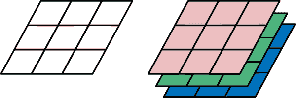
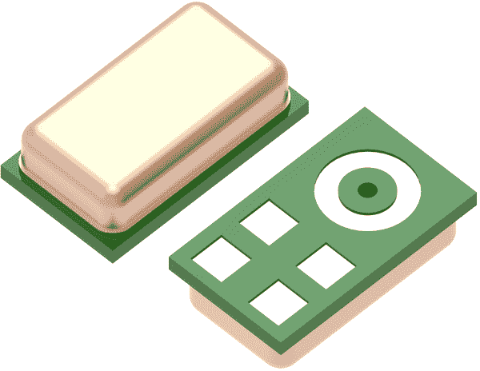
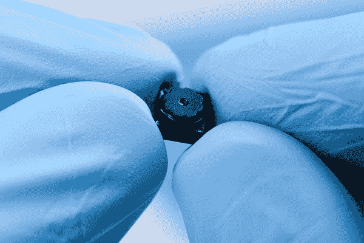
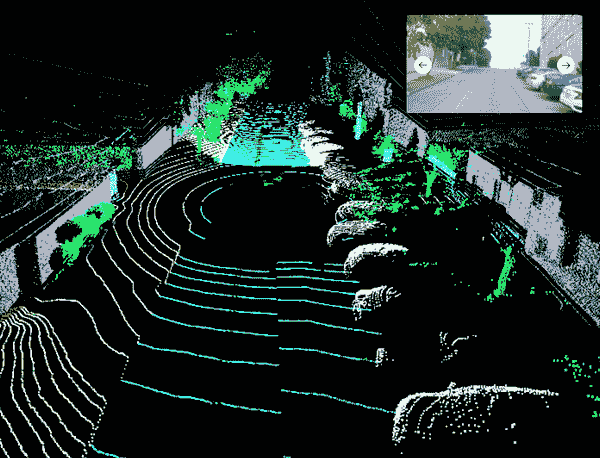
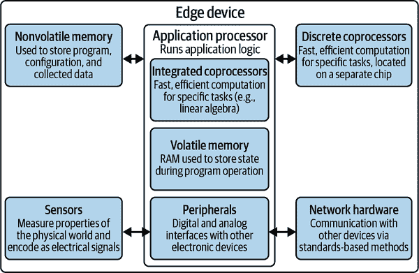
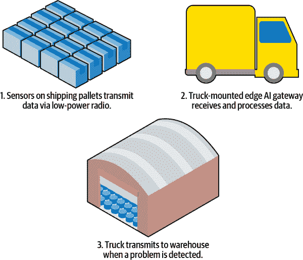
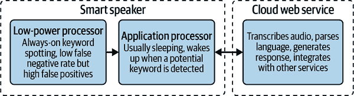

# 第三章：边缘 AI 的硬件

现在是时候了解驱动边缘人工智能应用的设备、算法和优化技术了。本章旨在提供该领域最重要的技术要素的广泛概述。通过本章的学习，您将掌握启动边缘人工智能产品高层规划所需的基本组成部分。

# 传感器、信号和数据源

传感器是为设备提供测量环境并检测人类输入能力的电子组件。它们从极其简单（可信的旧开关和可变电阻器）到令人惊叹的复杂（光探测与测距[LIDAR]和热成像摄像机）不等。传感器为我们的边缘人工智能设备提供了用于做出决策的数据流。

除传感器外，我们的设备还可以利用其他数据源。这些包括数字设备日志、网络数据包和无线电传输等内容。尽管它们起源不同，这些次要数据流可以像 AI 算法的信息来源一样令人兴奋。

不同的传感器以不同的格式提供数据。边缘人工智能应用中常见几种数据格式可概括如下：

时间序列

时间序列数据表示时间内一个或多个值的变化。时间序列可以包含来自同一个物理传感器的多个值，例如，单个传感器组件可能提供温度和湿度的读数。时间序列数据通常通过以特定速率轮询传感器来收集，例如每秒钟某个固定次数，以产生信号。轮询速率称为采样率或频率。通常，会在固定周期内收集单个读数（称为样本），因此两个样本之间的时间间隔始终相同。

其他时间序列可能是非周期性的，这意味着样本不是以恒定的速率收集的。这种情况可能出现在检测特定事件的传感器中，例如，当物体接近一定距离时切换引脚的接近传感器。在这种情况下，通常会捕获事件发生时的确切时间以及传感器值本身。

时间序列可能代表了摘要信息。例如，时间序列可以包括自上一个值以来发生某事的次数。

时间序列数据是边缘人工智能最常见的传感器数据形式。它特别有趣，因为除了传感器值外，信号还包括有关值的时间信息。这在试图理解情况变化时提供了有用的信息。除时间信息外，时间序列数据之所以有价值，是因为它包含了来自同一传感器的多个读数，减少了瞬时异常读数的影响。

时间序列没有典型的频率——它可以从一天一次采样到每秒数百万次采样。

音频

作为时间序列数据的特例，音频信号表示声波在空气中传播时的振荡。它们通常以非常高的频率捕获——每秒数千次。由于听觉是人类的感觉之一，大量的研究和开发致力于使在边缘设备上处理音频数据变得更加容易。

这些技术包括特殊的信号处理算法，使得处理音频数据更加容易，原始形式通常以极高的频率捕获。正如后文所述，音频信号处理非常普遍，以至于很多嵌入式硬件都内置了高效执行此类处理的功能。

边缘 AI 音频处理最广泛的应用之一是语音检测和分类。尽管如此，音频不一定要在人类听觉的频谱内。边缘 AI 设备使用的传感器可以潜在地捕捉超声（高于人类听觉范围的）和次声（低于人类听觉范围的）数据。

图像

图像是表示传感器采集到的整个场景测量数据，而不是单个点的数据。一些传感器，如摄像头，使用一组微小元素一次性捕获整个场景的数据。其他传感器，如激光雷达（LIDAR），通过机械扫描单个传感器元素在一段时间内横跨场景来构建图像。

图像具有两个或更多维度。在典型情况下，它们可以被视为一个“像素”网格，其中每个像素的值代表空间中相应点的某些场景属性。一个基本示例显示在图 3-1 的左侧。网格的大小（例如，96x96 像素）被称为图像的*分辨率*。

一个像素可能有多个值或通道。例如，灰度图像每个像素只有一个值，表示像素的明暗程度，而彩色图像每个像素可能有三个值（在 RGB 模型中），代表三种颜色（红色、绿色和蓝色），可以混合表示可见光谱中的任何其他颜色。这种结构显示在图 3-1 的右侧。

###### 图 3-1\. 左侧的图表示单通道图像的像素；右侧的图表示三通道图像的结构，如 RGB 照片

作为*n*维网格的典型图像表示意味着它们包含有关场景中不同方面的相对接近程度的空间信息。这些信息对于理解场景中包含的内容非常有价值。有整个类别的图像处理和计算机视觉算法利用这些信息。

图像不一定要表示可见光，甚至根本不是光。它们可以表示红外光（通常用于测量场景中部分区域的温度），飞行时间（如激光雷达的情况，它测量光线从场景的每个部分反射回来所需的时间），甚至无线电波（考虑由射电望远镜收集的数据，或雷达屏幕上的数据）。

视频

技术上来说，视频是时间序列数据的另一个特殊案例，因其独特的实用性而值得单独分类。视频是一系列图像，每个图像代表某一时间点场景的快照。作为时间序列，视频具有采样率——尽管在视频的情况下，它通常被称为帧率，因为序列中的每个单独图像称为帧。

视频是一种非常丰富的格式——它既包含空间信息（在每一帧内）又包含时间信息（在每一帧之间）。这种丰富性意味着它倾向于占用大量内存，因此通常需要更强大的计算设备。

## 传感器和信号类型

在市场上有数千种不同类型的传感器。一个良好的分组方式是根据它们的*模态*。根据卡耐基梅隆大学的定义，[模态指的是某事发生或被经历的方式](https://oreil.ly/WaiBM)。从人类的视角来看，我们的视觉、听觉或触觉都有不同的模态。

没有严格定义的传感器模态列表，描述它们的最佳方式可能因行业和应用而异。在接下来的部分中，我们将从广义边缘人工智能的角度探讨一些合理的分组：

+   声学和振动

+   视觉和场景

+   运动和位置

+   力和触觉

+   光学、电磁和辐射

+   环境、生物和化学

边缘设备还可以利用许多非传感器数据源——我们也将讨论这些。

## 声学和振动

“听到”振动的能力使得边缘人工智能设备能够检测到远处运动、振动以及人类和动物的通信效果。这是通过声学传感器完成的，它们测量通过介质传播的振动效应，这些介质可能从空气（如麦克风中的空气）到水（水听器）甚至地面（地听器和地震仪）。

###### 图 3-2。一个表面贴装微机电系统（MEMS）麦克风的 3D 渲染，它存在于许多现代产品中

声学传感器通常提供描述其介质中压力变化的时间序列。声学信号包含各种频率的信息，例如歌声的高音和低音。声学传感器通常在特定频率范围内工作，并且甚至在该范围内也可能对频率没有线性响应。

除了其非线性频率响应之外，声学传感器捕捉高频率的能力取决于其采样率。要准确捕捉高频信号，声学传感器必须具备足够高的采样率。在构建用于声学的边缘 AI 应用时，确保理解您试图测量的信号的特性，并选择适合的传感器硬件。

## 视觉和场景

在边缘 AI 应用中，通常需要 passively 了解周围的环境，而无需触摸它。用于此任务的最常见传感器是图像传感器，从小型低功耗摄像头（如图 3-3 所示）到超高质量的多兆像素传感器不一而足。如前所述，从图像传感器获得的图像被表示为像素值的数组。

###### 图 3-3。一个微小的图像传感器，这种类型的尺寸可能在嵌入式设备中使用

图像传感器使用传感器元素的网格来捕捉光线。在相机中，场景中的光线通过镜头聚焦到传感器上。相机可以成像的区域称为其视场，它取决于镜头和图像传感器的大小。

图像传感器的一些常见变体：

色彩通道

对于可见光，传感器通常可以以灰度或颜色（红色、绿色和蓝色，即 RGB）捕捉数据。

光谱响应

图像传感器对光的波长敏感，可能超出人类视觉的范围。这甚至可能包括红外辐射，使得被称为热成像相机的传感器能够“看到”热量。

像素大小

较大的传感器可以每像素捕获更多的光线，增加其灵敏度。

传感器分辨率

传感器上的元素越多，它能够捕捉的细节就越丰富。

帧率

传感器能够捕捉图像的频率，通常以每秒帧数表示。

由于有时需要对场景进行照明，常见做法是将图像传感器与光发射器配对——包括可见光和不可见光谱的范围。例如，红外 LED 可以与红外敏感相机配对，用于照亮黑暗场景，而不会用可见光打扰人类或动物。

更大、更高分辨率的传感器通常需要更多能量。高分辨率传感器产生大量数据，在较小的边缘 AI 设备上处理可能会很困难。

一个相对较新的图像传感器群体被称为事件摄像机，工作方式略有不同。它们不是以特定帧率捕获整个视野，而是摄像头中的每个像素单独响应亮度变化，但如果没有发生任何事情，则保持沉默。其结果是一系列单个像素变化的时间序列，比较容易让边缘 AI 设备处理，而不是大量的完整帧序列。

另一种有趣的图像传感器称为距离成像传感器。这些传感器允许设备以三维方式成像其周围环境——通常是通过发射光并测量光线反射回来的时间来实现，这种技术称为“飞行时间”。常见的飞行时间传感器技术称为激光雷达（LIDAR）。激光雷达传感器通过扫描周围的环境，测量光线反射回传感器的量来工作。这使它们能够以三维方式可视化一个区域，如图 3-4 所示。

###### 图 3-4。这张来自[PandaSet](https://pandaset.org)开源 LIDAR 数据集的图像显示了一个典型的 LIDAR“点云”，在 3D 可视化中，每个点代表激光测量到的距离；右上角的插图显示了同一场景从图像传感器视角的视图。

激光雷达和其他飞行时间传感器通常比标准图像传感器大得多、更复杂、更昂贵和能量密集。它们产生的大量数据可能难以在边缘设备上处理和存储，这也限制了它们的实用性。激光雷达通常用于制图环境——包括帮助自动驾驶车辆导航世界。

雷达，即无线电探测和测距，偶尔也被边缘设备用来理解三维空间中周围物体的位置，潜在地可以达到长距离。与激光雷达类似，雷达也复杂且能量消耗高——但如果您的使用情况需要，它绝对是一个选择。

## 运动与位置

对于边缘 AI 设备来说，了解它们所处的位置以及可能前往的位置非常有用。幸运的是，有许多不同类型的传感器可以帮助实现这一点。这是一个广泛的类别，从最简单的（机械倾斜开关）到最复杂的（卫星启用的 GPS[全球定位系统]）。总体而言，它们使设备能够理解其在世界中的位置和运动。

这是边缘 AI 应用的典型运动和位置传感器列表：

倾斜传感器

一个机械开关，根据其方向是开还是关。超便宜且易于使用。

加速度计

测量物体沿一个或多个轴的加速度（随时间变化的速度变化），通常在高频率下进行。加速度计是运动感测的瑞士军刀，用于识别从智能手表中的体育活动的特征运动到工业设备中的振动（用于预测性维护）。它们还能通过重力的拉力始终知道下方方向。

陀螺仪

测量物体旋转的速率。通常与加速度计配对，以给出物体在三维空间中运动的图像。

旋转或线性编码器

测量轴或轴承（旋转）或线性机制（例如喷墨打印机头部位置）的确切位置。在机器人学中经常用于捕捉机器人的轮子、肢体和其他附属物的位置。

飞行时间

使用电磁发射（光或无线电）测量传感器到其直线视野内任何物体的距离的传感器。

实时定位系统（RTLS）

使用固定位置周围的多个发射器在建筑物或场地中跟踪个别物体（例如仓库中的托盘）位置的系统。

惯性测量单元（IMU）

使用多个传感器近似设备当前位置的系统，基于其从内部参考框架测量的运动（而不是使用 GPS 等外部信号）。

全球定位系统（GPS）

使用卫星的无源系统，以确定设备的位置，精确到几米。需要设备到多个卫星的视线。

运动和位置通常表示为传感器读数的时间序列。考虑到该类别中的传感器类型数量，对于每个成本和能源预算都有选项。通常情况下，需要绝对位置的置信度越高，涉及的成本和复杂性就越大。

## 力量和触觉

从开关到载荷传感器，力量和触觉传感器帮助边缘人工智能设备测量其环境的物理特性。它们有助于促进用户交互，理解液体和气体的流动，或者测量物体的机械应变。

以下是一些典型的力量和触觉传感器：

按钮和开关

传统开关用作人机交互的简单按钮，同时也作为传感器，提供二进制信号，指示设备何时与某物体碰撞。

电容触摸传感器

测量导电物体（如人类手指）触摸表面的面积。这就是现代触摸屏的工作原理。

应变片和弯曲传感器

测量物体变形程度的传感器，这对于检测物体损坏和制造触觉人机界面设备非常有趣。

载荷传感器

测量施加在它们上面的精确物理负荷量。它们有各种尺寸，从微小的（用于测量小物体的重量）到巨大的（用于测量桥梁和摩天大楼中的应变）。

流量传感器

设计用于测量液体和气体（如管道中的水）的流速。

压力传感器

用于测量气体或液体的压力，无论是环境中的（如大气压力）还是系统内部的（如汽车轮胎内部）。

力和触觉传感器通常简单、能耗低且易于操作。它们的测量结果易于表示为时间序列。在构建触觉用户界面或检测机器人（或其他可以移动的设备）碰撞时特别有用。

## 光学、电磁和辐射

该类别包括设计用于测量电磁辐射、磁场和高能粒子的传感器，以及测量电流和电压等基本电性质。这听起来可能有些奇特，但它包括像测量光的颜色这样熟悉的事物。

这里是一些典型的光学、电磁和辐射传感器：

光传感器

一类传感器，可以检测人眼可见和不可见的各种波长的光。这对于许多事物都很有用，从测量环境光水平到检测光束被阻断时都适用。

颜色传感器

使用光传感器测量表面的精确颜色，这对识别不同类型的物体很有帮助。

光谱传感器

使用光传感器测量材料对各种波长的光的吸收和反射方式，使得边缘人工智能系统能够洞察它们的组成。

磁强计

测量磁场的强度和方向。磁强计的一个子类是数字罗盘，可以指示北方的方向。

感应式接近传感器

使用电磁场检测附近的金属。常用于交通监控中检测车辆。

电磁场（EMF）计

测量电磁场的强度。这包括工业设备无意中发射的电磁场，或者由无线电发射器故意发射的电磁场。

电流传感器

测量电流通过导体的流动量。这对于监控工业设备很有用，因为电流的波动可以提供有关设备运行情况的信息。

电压传感器

测量物体上的电压量。

半导体探测器

测量电离辐射，由极快速运动的粒子组成，通常由放射性物质衰变产生。

与许多其他传感器一样，该类别通常提供一系列测量。虽然对于测量环境条件非常有用，但在这里描述的传感器也可以在检测有意通过设备产生的排放的安排中发挥作用。例如，光传感器可以与走廊另一侧的光发射器配对，以检测某人是否经过。

## 环境、生物和化学

包括许多不同类型传感器的宽泛类别；环境、生物和化学传感使得边缘人工智能设备可以嗅探其周围世界的组成。一些常见类型的传感器包括：

温度传感器

测量设备本身或远处红外辐射源的温度。

气体传感器

存在许多不同的传感器来测量不同气体的浓度。常见的气体传感器包括湿度传感器（用于测量水蒸气）、挥发性有机化合物（VOC）传感器（用于测量常见有机化合物的一部分）和二氧化碳传感器。

颗粒物传感器

测量空气样品中微小颗粒的浓度，并广泛用于监测污染水平。

生物信号传感器

涵盖生物体内存在的各种信号范围，例如测量人类心脏（心电图）和大脑（脑电图）的电活动。

化学传感器

存在许多不同的传感器可用于测量特定化学物质的存在或浓度。

这类传感器通常提供一系列时间序列读数。由于它们需要与环境进行化学和物理交互，有时会难以使用，例如通常需要校准以对已知量的化学物质进行校准，有时传感器需要热身时间才能获取可靠的读数。环境传感器随时间可能会逐渐退化并需要更换是很常见的。

## 其他信号

除了从物理世界收集信号外，许多边缘人工智能设备还可以访问丰富的虚拟数据流。这些数据大致可以分为两组：内省数据，关于设备本身状态的信息；外省数据，关于设备连接的系统和网络的信息。

根据设备的不同，可能会提供各种类型的内部状态。这些可能包括：

设备日志

自设备上电以来跟踪设备的生命周期。这可能提供关于许多不同事物的信息：配置更改、工作周期、中断、错误或您选择记录的其他任何内容。

内部资源利用率

这可能包括可用内存、功耗、时钟速度、操作系统资源以及外设的使用。

通信

设备可以跟踪其物理连接、无线通信、网络配置和活动，以及产生的能量使用情况。

内部传感器

一些设备具有内部传感器；例如，许多系统芯片设备包括温度传感器来监控其 CPU。

内省数据的一个有趣用途是延长电池寿命。锂可充电电池如果持续保持在 100%充电状态可能会损失容量。苹果的 iPhone 使用边缘 AI 功能称为[优化电池充电](https://oreil.ly/rWJbA)，以避免这个问题。它使用设备上的机器学习模型学习用户的充电习惯，然后利用这个模型最大程度地减少电池充满的时间，同时确保用户需要时电池仍然充好电。

外部数据流，来自设备外部的数据，可能包含丰富的信息。以下是一些可能的来源：

来自连接系统的数据

在网络中部署边缘 AI 设备很常见，邻近设备转发的数据可以作为 AI 算法的输入。例如，物联网网关可以利用边缘 AI 处理并基于其节点收集的数据做出决策。

远程命令

边缘 AI 设备可能会接收来自另一个系统或用户的控制指令。例如，无人机的用户可以请求其移动到三维空间中的特定坐标。

来自 API 的数据

边缘 AI 设备可以向远程服务器请求数据，以供其算法使用。例如，配备边缘 AI 的家庭供暖系统可以向在线 API 请求天气预报数据，并利用这些信息来决定何时开启供暖。

网络数据

这可能包括网络结构、路由信息、网络活动，甚至数据包的内容。

一些最有趣的边缘 AI 系统同时利用所有这些数据流。想象一下，一个农业技术系统帮助农民照顾作物。它可能包括远程田间传感器、连接重要在线数据源（如天气预报或化肥价格）以及农民使用的控制界面。作为边缘 AI 系统，它潜在地可以在没有互联网连接的情况下运行，但如果有互联网连接，它可以利用宝贵的信息。

在更复杂的系统架构中，边缘 AI 还可以与服务器端 AI 很好地配对；我们稍后将在本章学习更多相关内容。

# 边缘 AI 处理器

边缘 AI 最令人兴奋的部分之一是应用可以利用的庞大而不断增长的硬件阵列。在本节中，我们将探讨硬件的高级类别，并了解每种硬件适合特定的领域。

我们正处于边缘 AI 硬件的寒武纪爆发期，因此自本书出版以来，可能已经有更多选项。从便宜的低功耗微控制器（所谓的“薄边缘”设备）到基于 GPU 的高速加速器和边缘服务器（称为“厚边缘”），开发者可以找到几乎适用于任何应用的硬件。

## 边缘 AI 硬件架构

硬件系统的*架构*是其组件相互连接的方式。图 3-5 展示了边缘设备的典型硬件架构。

###### 图 3-5\. 边缘设备的架构

设备的核心是*应用处理器*。这是协调应用程序的通用处理器，并默认运行构成其程序的所有算法和逻辑。

在许多情况下，应用处理器将具有*集成的协处理器*：内置的额外硬件，高效执行某些计算。例如，许多处理器具有内置的浮点单元（FPU），设计用于快速执行浮点计算。中高端的微控制器越来越多地集成了可加速边缘 AI 相关函数的硬件，如数字信号处理和线性代数。

应用处理器还集成了*易失性存储器*（如 RAM），在程序执行期间用作工作内存。尽管如此，通常还会有额外的 RAM，它是外部于处理器本身并存在于独立芯片上。

RAM 是非常快速的内存，但它消耗大量能量，并且在设备关闭时其内容会丢失。它非常昂贵，占据大量物理空间，因此通常是非常有限的资源。

应用处理器连接到*非易失性存储器*，通常称为 ROM（只读存储器）或闪存，² 它可以类似地位于芯片内或芯片外（在图 3-5 中显示为芯片外）。非易失性存储器用于存储不经常更改且在系统关闭时需要保留的内容。这可能包括软件程序、用户配置和机器学习模型。读取速度慢，写入速度极其缓慢。

许多设计还包含*离散协处理器*。类似于集成协处理器，这些协处理器存在于芯片外，旨在为特定目的执行快速高效的数学运算。与集成协处理器不同，它们位于芯片外。它们可能比应用处理器更强大（也更耗电），例如，低功耗 SoC 可能与强大的 GPU 组合使用。

处理器的*外设*通过各种标准提供其与世界其他部分的接口。³ 最常见的外设用于连接*传感器*和*网络硬件*。

## 微控制器和数字信号处理器

可以有令人信服的论点认为，微控制器是我们现代世界的基础。它们是从汽车发动机到智能家电的一切的微小廉价计算机。微控制器的生产量惊人；预计 2022 年将有[268.9 亿个运输](https://oreil.ly/d4KPy)——这相当于地球上每个人的三分之一。

# 微控制器（MCUs）

微控制器通常被称为 MCUs，即微控制器单元的缩写。

微控制器通常用于单一用途的应用，如控制机械设备。这意味着它们可以比需要运行多个程序的其他类型的计算机简单得多，例如，它们通常不使用操作系统。

相反，它们的软件（称为*固件*）直接在硬件上运行，并包含驱动任何外设所需的低级指令。⁴ 这可能会使微控制器的软件工程变得非常具有挑战性，但它确实使开发人员在程序运行时对发生的情况有更多的控制。

微控制器的一个显著特点是它们的大部分组件都实现在一块硅片上；这是它们相对低成本的关键。除了处理器外，微控制器通常配备有闪存（用于存储程序和其他有用数据）、RAM（用于在程序执行期间存储状态）以及各种用于通过数字或模拟信号与其他设备（如传感器）通信的技术。

微控制器的世界非常多样化——它们如此宝贵的部分原因是它们可在各种变体中使用，以适应几乎所有可能的情况。在本书的目的下，我们将它们分为三大类：低端、高端和数字信号处理器。

### 低端 MCUs

许多微控制器单元（MCUs）专为低成本、小尺寸和高能效而设计。这种权衡是它们具有有限的计算资源和能力。以下是一些典型的规格：

+   4 位到 16 位架构

+   <100 MHz 的时钟速度

+   2 KB 到 64 KB 的闪存内存

+   64 字节到 2 KB 的 RAM

+   数字输入和输出

+   电流消耗：运行时单位电流在~1.5–5 伏特之间，单位电流为几毫安，等待输入时的单位电流为微安级别

+   成本：大量采购时每个单位一到两美元

许多今天使用的低端 MCU 基于自 1980 年代以来使用的设计。⁵ 尽管技术不断改进，但始终有简单、低成本和低功耗硬件的需求，因此这些芯片仍然存在。它们在许多行业中极为普遍。

低端 MCU 在边缘 AI 方面有一些显著的劣势。由于缺乏内存和计算能力，它们不适合处理大量数据或复杂信号处理。它们通常没有任何浮点算术的硬件实现，这意味着涉及有理数的计算可能会非常缓慢。这些特性限制了它们能够运行的边缘 AI 算法类型。

低端 MCU 的典型应用利用了它们的优势：高可靠性的汽车和医疗设备，以及低成本的家电、小工具和基础设施。一个流行的低端 MCU 是[Atmel 8 位 AVR 平台](https://oreil.ly/Buwcj)。尽管它们是 MCU 世界的重要组成部分，但由于计算能力有限，低端 MCU 可能不是你在边缘 AI 应用中的首选目标。

尽管如此，正如我们在本书第一节中提到的那样，边缘 AI 程序并不总是需要大量计算。低端 MCU 完全能够运行复杂的条件逻辑，这可能已经足够你所需。它们还可以作为联网设备网络的一部分，利用边缘 AI —— 例如，低端 MCU 可以捕获传感器数据并将其传递给更复杂的设备进行决策。

### 高端 MCU

在 MCU 光谱的另一端，今天最强大的微控制器已经具备了足以与上世纪九十年代的个人计算机匹敌的计算能力。在许多情况下，它们仍然能够高效节能。以下是一些典型规格：

+   32 位架构

+   <1000 MHz 时钟速度

+   16 KB 到 2 MB 的闪存

+   2 KB 到 1 MB 的 RAM

+   可选硬件支持更快的数学运算

+   浮点单元（FPU）

+   单指令多数据（SIMD）指令

+   可选多处理器核心

+   数字和模拟输入输出

+   电流消耗：在约 1.5–5 伏特时，从低至几毫安到高达几十毫安；休眠时为微安级

+   成本：每单位从几美元到几十美元不等

高端 MCU 通过更快的时钟速度和 32 位架构显著提高了性能。⁶ 此外，许多 MCU 型号具有硬件支持的一些巧妙技巧，可以增加计算速度。其中之一是 SIMD，允许处理器并行运行多个计算 —— 在运行信号处理和机器学习应用时，这可能非常有帮助。

越来越多的高端 MCU 设计时考虑到边缘 AI 应用。厂商通常提供软件和库，帮助优化设备上高效运行边缘 AI 代码。另一个重要的好处是提供更大量的闪存和 RAM——这对于处理数据和存储大型机器学习模型非常有帮助。

高端 MCU 被广泛应用于从传感和物联网到数字设备、智能家电和可穿戴设备的各种用例中。在撰写本文时，它们代表了嵌入式机器学习的成本、能耗和计算能力的最佳选择。它们具有足够的能力来运行功能强大的深度学习模型——包括可以处理视觉信息的深度学习模型——但它们仍然足够简单，可以非常廉价地嵌入到各种应用中。

基于[Arm Cortex-M 核心](https://oreil.ly/nuhBH)的微控制器非常受欢迎，例如[Nordic nRF52840](https://oreil.ly/uZfax)和[STMicroelectronics STM32H743VI](https://oreil.ly/SGkdC)。还有基于[RISC-V](https://oreil.ly/YpH2r)架构的热门选择，例如[Expressif ESP32](https://oreil.ly/OzsLd)。

随着边缘 AI 的重要性增加，将通用高端微控制器与专为加速深度学习工作负载而设计的专用协处理器配对，正在变得越来越普遍。我们将在“深度学习加速器”中详细介绍这一点。

# 性能特征

一般的高端微控制器可以几乎实时地处理音频，并且可以以每帧约一秒的速度处理低分辨率视频。

### 数字信号处理器（DSP）

一个有趣的子类别，DSP 是专门设计为高效转换数字信号的特殊微控制器。它们的架构设计不是为了通用计算，而是尽可能快地运行特定的算法和数学运算，包括乘积累加和傅里叶变换，我们将在第四章中遇到。

幸运的是，这些数学运算中的许多都对边缘 AI 非常有帮助，无论是用于处理数据还是运行机器学习模型。这使得 DSP 成为一个有价值的工具。DSP 的缺点在于它们不是为通用计算而设计的，这意味着它们可能不适合运行应用程序中非边缘 AI 部分的任务。

如今的高端 MCU 通常具备一些 DSP 的特性，例如 SIMD 指令，可以帮助增加信号处理任务的吞吐量——事实上，一些被描述为“数字信号控制器”，以突出这些能力。然而，专用的 DSP 仍然非常有用。例如，许多包含语音助手（如 Google 助手）的智能手机在 DSP 芯片中运行始终开启的关键词识别模型，而不影响电池寿命。

## 片上系统（SoC）

在微控制器之后，边缘计算的下一个最常见形式是片上系统（SoC）设备。而微控制器是一个经过削减和优化的计算机版本，SoC 设备则试图将整个传统计算机系统的所有功能都压缩到一个芯片中。

不同于微控制器，其软件直接与硬件交互，SoC 设备运行传统操作系统，这些操作系统将大部分硬件抽象化，使开发者完全可以专注于他们的应用程序代码。开发者可以使用与编写服务器和桌面应用程序相同的工具和环境，包括 Python 等高级语言（现代微控制器通常使用 C 或 C++进行编程）。

使用这种易用性有两个成本：效率和复杂性。通常情况下，SoC 比微控制器能耗高得多，这限制了它们的应用领域。它们的能效比仍然比传统的分离外设计算机系统高一个数量级，但在能源使用方面远不及微控制器。这种额外的能源使用可能还会引入热管理问题。

操作系统带来的额外复杂性是 SoC 设备的另一个负担。大量操作系统代码与开发者的应用程序一起运行，这使得在现场保证可靠性变得更加困难。

SoC 往往比微控制器功能更强大，拥有更多特性。以下是一些典型的统计数据：

+   64 位架构

+   >1 GHz 的时钟速度

+   多核处理器

+   外部 RAM 和闪存（通常多个千兆字节）

+   2D 或 3D 图形处理单元

+   无线网络

+   高性能数字输入和输出

+   电流消耗：在约 5 伏特下数百毫安

+   成本：每个单位数十美元

# 性能特征

一般的 SoC 可以以接近实时的方式处理音频和高分辨率视频，使用深度学习技术。

尽管比微控制器效率低得多，SoC 已经带来了革命性的变化。它们允许一台功能强大的通用计算机以极小的形态因子部署。在现代世界中，SoC 无处不在——它们驱动着我们的手机、电视、汽车娱乐系统、工业硬件、安全系统、物联网网关以及几乎所有需要小型计算能力的设备。

它们的强大、灵活性和易用性使它们在边缘人工智能领域尤为重要。开发者可以使用熟悉的工具开发应用程序，这些应用程序运行在 SoC 上，并且拥有足够的内存和处理能力来运行复杂的算法，例如相对较大的深度学习模型。几乎没有哪种边缘人工智能算法不能在 SoC 上运行。易用性使得 SoC 成为原型化边缘人工智能应用程序的绝佳选择，即使最终目标是迁移到更便宜或更高效的硬件上。

知名的 SoC 产品包括[高通骁龙](https://oreil.ly/b0Va-)和[博通 BCM58712](https://oreil.ly/ZbqES)，后者被用于树莓派开发板（见侧边栏“Boards and Devices”）。许多流行的 SoC 基于[Arm Cortex-A](https://oreil.ly/GyNNz)处理器核心。

# 嵌入式 Linux

Linux 已经成为 SoC 设备非常普遍的操作系统选择。它是开源的，这意味着可以免费使用，并且有很多社区支持。能够使用熟悉的 Unix 开发工具使具有 Unix 经验的人轻松处理嵌入式 Linux 系统。

## 深度学习加速器

微控制器和 SoC 通常是通用计算机，它们被设计为尽可能灵活。然而，如果你愿意牺牲一些灵活性，设计能够非常快速运行某些操作的集成电路是可能的。

随着深度学习的出现（见“Deep learning”），在嵌入式设备上，半导体公司已经开始生产可以与微控制器和 SoC 配对的加速器，以使深度学习模型运行更快更高效。深度学习的数学基础是线性代数，因此深度学习加速器，也被称为*神经处理单元*（NPUs），旨在高效执行线性代数运算。

深度学习加速器有各种类型，它们在能源使用和灵活性之间有自己的权衡。在光谱的一端，像[Syntiant 的 NDP10x 系列](https://oreil.ly/XDxoQ)这样的设备具有特定深度学习模型架构的硬件实现（稍后我们将学到更多），可以快速运行，能效极佳。由于算法本身已经融入硅中，这些设备并不十分灵活，但能效非常高。

在光谱的另一端，基于图形处理单元（GPU）技术的设备，如[Nvidia 的 Jetson](https://oreil.ly/MVga8)和[Google 的 Coral](https://coral.ai/products)，提供了巨大的灵活性，可以运行基本上任何类型的深度学习模型。这种灵活性的权衡是它们远不及能源效率高。

在这两端之间，有许多不同类型的设备，具有不同程度的灵活性和效率，比如[Syntiant 的 NDP120](https://oreil.ly/Y9ZeL)或[Arm 的 Ethos-U55](https://oreil.ly/KS_Dv)设计。

某些类型的加速器使用了传统深度学习数学的替代方法。例如，[BrainChip 的 Akida](https://oreil.ly/JgaIv)，描述为神经形态处理器，采用脉冲神经网络（见“Compression and optimization”）提供了一组独特的权衡，包括更高的能效。

# 性能特征

深度学习加速器往往速度极快 —— 您可以期待足够的计算能力以实时处理音频和视频。某些设备甚至可以并行处理多个流。

一般来说，深度学习加速器通常与微控制器或 SoC 配对使用。传统处理器运行应用逻辑，而加速器则运行深度学习工作负载。许多设计将微处理器和加速器合并在一个单一封装中，并提供特殊工具帮助开发人员在它们之间分配处理任务。

初期的深度学习加速器对支持的深度学习模型类型几乎没有选择自由度，但随着领域的成熟，设备变得越来越灵活。我们仍处于非常早期阶段，因此您可以预期随着时间的推移将实现巨大的进步和效率提升。从长远来看，预计能够在微小的电力预算下运行多年的实时视频处理或语言转录，将拥有异常强大的设备。

## FPGA 和 ASIC

要获得最佳的性能和效率优势，设计自己的处理器电路是一种选择。这是困难、耗时和昂贵的，因此不容忽视，但对于某些应用可能是有意义的。

可编程门阵列（FPGAs）是可以根据需求重新编程的硅集成电路，用于实现定制的硬件设计。它们允许工程师创建一个实现特定算法尽可能高效的定制处理器设计，然后将其加载到设备上进行部署。设计使用特殊的硬件描述语言（HDL）编写。

专用集成电路（ASICs）是针对特定应用定制的集成电路。与 FPGAs 不同，它们无法重新编程 —— 它们的逻辑被永久写入硅中。您可以购买为特定目的设计的预设计 ASIC，如[Himax’s WE-I Plus](https://oreil.ly/oI4bv)，或自行设计。

与 ASIC 相比，使用 FPGA 进行开发成本大幅降低，但每个设备的成本更高，以及功耗也更高。公司通常用 FPGA 进行原型设计或小批量生产，而用 ASIC 进行大批量生产。创建 ASIC 的工程成本使它们对大多数公司来说难以企及。

FPGA 开发工具的使用变得更加简单和可访问，但它们在边缘 AI 领域仍然是相对小众的选择。研究人员正在开发能够自动将深度学习模型转换为高效 FPGA 实现的工具，因此随着时间的推移，FPGA 在边缘 AI 中可能会扮演越来越重要的角色。以下是一些当前领域内的有趣项目：

+   谷歌的[CFU Playground](https://oreil.ly/Fhf-9)，帮助开发人员使用 FPGA 创建深度学习加速器

+   [Tensil.ai](https://www.tensil.ai)，一款用于 FPGA 的机器学习模型编译器和硬件生成器

## 边缘服务器

与定制硅相对的另一端，可以在网络边缘运行传统服务器硬件，这些硬件可能与数据中心部署的相同。这些强大的计算机运行全面的服务器操作系统（通常为 Linux 或 Windows），可以像任何其他云服务器一样对待。如果它们具有 AI 特定的加速能力，很可能是通过 GPU 实现的。一些边缘服务器以适合工业环境（如工厂车间）的坚固形式因子出售，而不是数据中心中常见的形式。

边缘服务器的强大意味着它们可以在保持数据在现场的安全、隐私和便利性的同时，提供许多云计算的好处。对于一些应用程序来说，它们可以兼具高性能硬件、低延迟、减少数据泄露风险以及经济使用带宽的优势。

边缘服务器的另一个好处是它们基本上可以被视为标准 IT 基础设施的一部分。这意味着它们可以很好地融入现有 IT 部门的程序和技能。事实上，不久前*所有*商业计算都是使用本地服务器完成的。边缘计算曾经是每个企业的标准。

边缘服务器有两个主要缺点：它们消耗大量能源，并且体积很大。如果你需要大量计算资源便捷地位于现场，这些权衡可能是值得的。然而，它们通常限于建筑物和工厂等固定位置，那里有多余的空间和可靠的电源供应。

如果全尺寸的边缘服务器对你的应用程序来说感觉过于强大（它们可能确实如此），Linux SoCs 提供了一个很好的折衷方案。作为标准 Linux 盒子，IT 部门可以像对待任何其他服务器一样对待它们——但它们以微小、节能的形式提供。

## 多设备架构

边缘人工智能应用并不总是直接在承载实际传感器的设备上实现。有时，使用多设备架构是有道理的。例如，安装在货车上的网关设备可能会使用低功耗无线电将来自一组运输托盘的数据报告回来。网关设备对能源使用的约束较少，并能洞察多个托盘的数据，可以运行复杂的边缘人工智能逻辑来做出数据决策。图 3-8 展示了这种情况可能的外观。

###### 图 3-8\. 常见的架构涉及多个设备

在异构计算中，情况可能变得更加复杂（见侧栏“异构计算”）。单个设备可能包含多种类型的处理器：例如，一个用于运行应用程序代码，另一个用于运行 ML 算法。完整系统可能由许多设备组成，一些设备有多个处理器，在需要时在许多不同点收集和处理数据，具体取决于需要哪些优势。这种解决方案甚至可能涉及云计算。

一个很好的例子是带有语音助手的智能音箱这种架构类型。通常，它们至少有两个处理器。第一个是低功耗的常开芯片，运行 DSP 和机器学习模型，以便在不消耗太多能量的情况下监听唤醒词。

第二个是应用处理器，当常开芯片检测到唤醒词时被唤醒。应用处理器可能会运行更复杂的模型，以便捕捉任何通过常开芯片的误报。这两个处理器共同可以识别唤醒词，而不会通过流式传输私人对话到云端侵犯用户隐私。

一旦确认唤醒词，应用处理器将音频流式传输到云服务器，进行语音识别和自然语言处理，以生成适当的响应。整体流程如图 3-9 所示。

###### 图 3-9。低功耗处理器旨在尽可能捕捉多个潜在的关键词；应用处理器被唤醒以评估任何可能的匹配，并在确认匹配后调用云网络服务。

在设计系统时，不要害怕考虑使用多个设备来解决不同设备类型所涉及的权衡问题。在一些常见情况下，这可能会很有帮助：

+   监控大量个体实体：如果每个实体都使用高端 AI 能力的硬件，成本可能很高。

+   减少能源消耗：传感器由电池供电，需要长时间工作。

+   保护隐私：直接将数据发送到大型设备或云服务器可能违反隐私规范。

+   与旧设备集成：现有传感器或网关可能会被边缘 AI 设备补充，而不是被替换。

## 设备和工作负载

了解每种类型的设备的功能非常重要。表 3-1 提供了一个快速参考，帮助您分析哪些设备能够处理哪些数据类型。它显示每种数据类型在给定设备上的支持级别：*完全*、*有限*或*无*。

请注意，每个类别都很广泛，每个个体设备都是独特的。并非所有高端 MCU 都相同。还值得注意的是，技术前沿进展*迅速*，这个参考资料可能很快就会过时！

Table 3-1\. 数据类型和设备

| 设备类型 | 低频时间序列 | 高频时间序列 | 音频 | 低分辨率图像 | 高分辨率图像 | 视频 |
| --- | --- | --- | --- | --- | --- | --- |
| 低端 MCU | 有限 | 有限 | 无 | 无 | 无 | 无 |
| 高端 MCU | 全部 | 全部 | 全部 | 全部 | 有限 | 有限 |
| 带加速器的高端 MCU | 全部 | 全部 | 全部 | 全部 | 全部 | 有限 |
| DSP | 全部 | 全部 | 全部 | 全部 | 有限 | 有限 |
| SoC | 全部 | 全部 | 全部 | 全部 | 全部 | 全部 |
| 带加速器的 SoC | 全部 | 全部 | 全部 | 全部 | 全部 | 全部 |
| FPGA/ASIC | 全部 | 全部 | 全部 | 全部 | 全部 | 全部 |
| 边缘服务器 | 全部 | 全部 | 全部 | 全部 | 全部 | 全部 |
| 云端 | 全部 | 全部 | 全部 | 全部 | 全部 | 全部 |

# 总结

本章介绍了承载边缘人工智能的关键硬件及其获取数据的传感器。在下一章中，我们将了解使其运行的算法。

¹ 根据[IEEE 754](https://oreil.ly/oGnUz)标准描述。

² 尽管闪存可以重新编程，但在嵌入式环境中仍称为 ROM。

³ 诸如 GPIO、I2C、SPI 和 UART 等外围接口在硬件设计中非常重要，但超出本书的范围。大多数现代嵌入式处理器具有良好的外围支持。

⁴ 固件的另一个特点是，与操作系统不同，固件通常不打算由最终用户修改。

⁵ [Intel 8051](https://oreil.ly/5DV2e)于 1980 年首次开发，并且至今仍在使用。

⁶ 32 位处理器一次可以处理两倍于 16 位处理器的数据量。这意味着数据处理速度更快。同时支持更大容量的 RAM。
