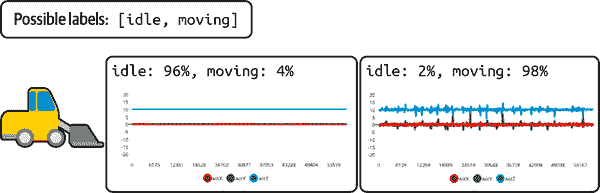

# 第四章：边缘 AI 算法

在边缘 AI 中，有两类重要的算法：特征工程和人工智能。这两种类型都有许多子类别；在本章中，我们将探讨它们的横截面。

目标是从工程角度提供每种算法类型的概述，突出它们的典型用途、优势、劣势以及在边缘硬件部署中的适用性。这将为您在规划实际项目时提供一个起点，我们将在接下来的章节中详细介绍。

# 特征工程

在数据科学中，特征工程是将原始数据转化为统计工具可用的输入的过程，用于描述和建模情况和过程。特征工程涉及使用您的领域专业知识来理解原始数据的哪些部分包含相关信息，然后从周围的噪音中提取该信号。

从边缘 AI 的角度来看，特征工程关乎将原始传感器数据转化为可用信息。特征工程做得越好，AI 算法在尝试解释它时就会越轻松。在处理传感器数据时，特征工程自然会利用数字信号处理算法。它还可以涉及将数据切分成可管理的块。

## 处理数据流

正如我们所见，大多数传感器产生时间序列数据。边缘 AI 应用的目标是获取这些时间序列数据流并理解其含义。

管理流的最常见方法是将时间序列切分成块，通常称为窗口，然后逐个分析这些块。¹ 这会产生一系列结果的时间序列，您可以解释以了解正在发生的事情。图 4-1 显示了如何从数据流中获取窗口。


###### 图 4-1\. 时间序列通常被分成称为窗口的块，逐个进行分析

处理单个数据块需要一定时间 — 我们可以称之为系统的*延迟*。这限制了我们可以多频繁地获取和处理数据窗口的次数。我们可以捕获和处理数据的速率称为系统的*帧率*，通常以每秒可处理的窗口数来表达。帧可以是顺序的，也可以是重叠的，如 图 4-2 所示。


###### 图 4-2\. 根据帧率不同，窗口可能会重叠；对包含事件的数据来说，重叠是有利的，因为这增加了整个事件落入窗口内的机会，而不会被截断。

延迟越低，每个时间段内可以分析的数据窗口就越多。你可以进行的分析越多，结果就越可靠。例如，想象我们正在使用机器学习模型来识别一个命令。如果窗口之间的间隔太大，我们可能会错过口头命令的关键部分，无法识别它（见图 4-3）。


###### 图 4-3\. 如果帧率过低，信号的某些部分将不会被处理；如果你试图检测短暂事件，这可能意味着某些事件被忽略了。

窗口大小的选择非常重要。窗口越大，处理其中数据所需的时间越长。然而，较大的窗口包含了关于信号的更多信息——这意味着它们可能会使信号处理和 AI 算法的生活变得更轻松。在开发系统时，窗口大小和帧率之间的权衡是需要探索的重要内容。

如后文所述，有许多不同的 AI 算法，其中一些对窗口大小的敏感性较大。有些算法（通常是那些在信号中维护内部记忆的算法）能够在非常小的窗口大小下工作良好，而其他一些则需要较大的窗口大小才能正确解析信号。算法的选择还会影响延迟，这也限制了窗口大小。这是窗口大小、延迟和算法选择之间复杂的权衡系统。

窗口处理也适用于视频流：在这种情况下，视频的每个“窗口”是一定数量的静态图像——通常是一个，但一些 AI 算法有可能同时分析多个图像。

处理数据流的更复杂技术属于数字信号处理范畴。这些技术可以与窗口处理结合使用，以生成供 AI 算法使用的数据。

## 数字信号处理算法

有数百种不同的信号处理算法可以帮助消化传感器产生的信号。在本节中，我们将介绍一些对边缘 AI 非常重要的 DSP 算法。

### 重采样

所有时间序列信号都有一个采样率（也称为频率），通常用每秒数据样本数（Hz）来描述。通常需要改变信号的采样率。例如，如果信号产生的数据比你处理它的速度快，可能需要减少信号的速率（称为*降采样*）。另一方面，如果要方便地与另一个频率较高的信号一起分析，可能需要增加信号的速率（*升采样*）。

**下采样**通过“丢弃”一些样本来实现目标频率。例如，如果你丢弃一个 10 Hz（每秒 10 个样本）信号的每一帧，它将成为一个 5 Hz 信号。然而，由于一种称为混叠的现象，以这种方式减少频率可能会导致输出的失真。为了帮助应对这个问题，在进行下采样之前必须删除一些高频信息。这通过低通滤波器来实现，在下一节中描述。

**上采样**是反向操作——新样本被创建并插入以增加信号的频率。例如，如果在一个 10 Hz 信号中的每个样本后插入一个额外的样本，它将变成一个 20 Hz 信号。困难的部分是知道要插入什么！在两个样本之间的时间内实际上发生了什么是无法知道的，但是可以使用称为*插值*的技术来用近似值填补空白。

除了时间序列，图像也可以进行上采样和下采样。在这种情况下，增加或减少的是空间分辨率（每幅图像的像素）。像时间序列重采样一样，图像的调整也需要抗混叠或插值技术。

上采样和下采样都很重要，但在边缘人工智能中更常见的是下采样。传感器通常以固定频率产生输出，将其降采样并获得最适合其信号处理流程的频率，这是很典型的做法。

对于边缘人工智能应用程序，如果您希望将两个具有不同频率的信号合并为单一的时间序列，则上采样大多数情况下是有用的。然而，通过对高频信号进行下采样也可以实现这一点，这可能在计算上更便宜。

### **滤波**

数字滤波器是应用于时间序列信号的函数，以特定的方式转换它。存在许多不同类型的滤波器，它们在为边缘人工智能算法准备数据方面非常有用。

**低通滤波器**旨在允许信号的低频成分通过，同时去除高频成分。滤波器的*截止频率*描述了高频信号将受到影响的频率，而*频率响应*描述了这些信号将受到多大影响。

**高通滤波器**则是相反的操作，允许**高于**截止频率的频率通过，并减弱（降低）低于截止频率的频率。**带通滤波器**结合了两者，允许一定**带宽**内的频率通过，但减弱带外的频率。

在边缘人工智能中，过滤的目的是隔离信号的有用部分，去除不有助于解决问题的部分。例如，语音识别应用可以使用带通滤波器，允许人类语音正常范围内的频率（125 Hz 至 8 kHz），同时拒绝其他频率的信息。这可以使机器学习模型更容易解释语音，而不会被信号中的其他信息分散注意力。

过滤器可以应用于任何类型的数据。例如，如果将低通滤波器应用于图像，则会产生模糊或平滑效果。如果将高通滤波器应用于同一图像，则会“锐化”细节。

一种低通滤波器是*移动平均滤波器*。给定一个时间序列，它计算在一定窗口内数值的移动平均。除了平滑数据外，它还能使单个数值代表一段时间内的广泛信息。

如果计算并堆叠几个具有不同窗口长度的移动平均值，则信号的瞬时快照（包含几个不同移动平均值的信息）可以描述信号在时间窗口和多个不同频率上的变化。这对于特征工程是一种有用的技术，因为它意味着 AI 算法可以使用相对较少的数据点观察到广泛时间窗口内的信号变化。

过滤是一种非常常见的信号处理操作。许多嵌入式处理器提供对某些类型的过滤的硬件支持，这样可以减少延迟和能量消耗。

### 频谱分析

时间序列信号可以称为*时间域*，表示它代表一组变量随时间变化的方式。使用一些常见的数学工具，可以将时间序列信号转换成*频率域*。通过转换获得的数值描述了信号在不同频段上的分布情况，形成一个频谱。

通过将信号切片成多个窄窗口，然后将每个窗口转换成频率域，如图 4-5 所示，可以创建一个描述信号频率随时间变化的图谱。这个图谱被称为频谱图，是机器学习模型非常有效的输入。


###### 图 4-5\. 同一段音频以时间域（顶部）和频率域（底部）表示的波形

频谱图在现实世界的应用中非常常见，特别是在音频领域。将数据分隔成窗口化的频段使得相对简单的模型可以解释它。² 人们甚至可以通过观察频谱图区分单词之间的差异，有些人甚至已经学会了阅读它们。

许多算法可以将信号从时间域转换到频率域，但最常见的是傅立叶变换。这是一个非常常见的操作，并且通常有硬件支持（或至少优化的实现），可用于在嵌入式设备上执行傅立叶变换。

数字信号处理和时间序列分析有大量的算法和技术；它们是工程和研究的主要领域。关于这些主题的一些重要资源包括：

+   [*《科学家和工程师的数字信号处理指南》*](https://oreil.ly/jo0UJ)，作者 Steven W. Smith（加利福尼亚技术出版社，1997）

+   [*《实用时间序列分析》*](https://oreil.ly/NoZrs)，作者 Aileen Nielsen（O’Reilly，2019）

### 图像特征检测

一整套信号处理算法专注于从图像中提取有用的特征³。这些传统上被称为*计算机视觉*算法。一些常见的例子包括：

边缘检测

用于识别图像中的边界（见图 4-6）

角点检测

用于发现图像中具有有趣的二维结构的点

斑点检测

用于识别图像中具有共同特征的区域

脊检测

用于识别图像中的曲线


###### 图 4-6\. 边缘检测算法可找出不同颜色或强度区域之间的边界。

图像特征检测将一个复杂的大图像减少为其内部存在的视觉结构的更紧凑表示。这可能使下游操作的任何 AI 算法更容易处理。

在处理图像时，不总是需要进行特征检测。通常情况下，深度学习模型能够学习提取特征的方法，减少了预处理的效用。然而，在使用其他类型的边缘 AI 算法解释图像数据时，执行特征检测仍然很常见。

[OpenCV 项目](https://opencv.org)提供了一组用于特征检测（以及其他图像处理任务）的库，可在大多数 SoC 设备上运行。对于微控制器，[OpenMV](https://openmv.io)提供了一个开源库，其中包含特征检测算法实现以及专为运行它们而设计的硬件。

## 结合特征和传感器

没有什么能阻止您将几个不同的特征和信号组合作为 AI 算法的输入。例如，您可以计算时间序列的几个移动平均值，并将它们全部传递给机器学习模型。没有硬性规定，所以可以自由实验，并创意性地处理数据。接下来的章节将提供实验框架。

超越从同一信号中组合特征，*传感器融合*是将来自多个传感器的数据集成的概念。例如，边缘 AI 健身追踪器可以结合来自加速度计、陀螺仪和心率传感器的信息，试图检测佩戴者正在进行的运动。

在更复杂的边缘 AI 场景中，传感器甚至不需要集成在同一设备上。想象一下智能气候控制系统，利用分布在建筑物各处的温度和占用传感器来优化空调使用。

传感器融合分为三类：

补充

多个传感器结合，以提供比单一传感器更全面的情况理解，例如我们假设的健身追踪器上的各种传感器。

竞争

多个传感器测量相同的事物，以减少错误测量的可能性，例如，多个冗余传感器监测关键设备的温度。

合作

多个传感器的信息结合，形成原本不可得的信号，例如，两个摄像头产生立体图像，提供深度信息。

传感器融合面临的挑战在于如何将可能以不同速率发生的多个信号结合起来。您应考虑以下内容：

1.  时间信号的对齐。对于许多算法来说，我们打算融合的所有信号以相同的频率采样，并且值反映出同时测量。这可以通过重新采样来实现，例如，将低频信号上采样，使其具有与要融合的高频信号相同的速率。

1.  缩放信号。信号的值必须处于相同的尺度上，以防通常具有较大值的信号压倒通常具有较小值的信号。

1.  数值上结合信号。可以使用简单的数学运算（加法、乘法或平均值）或更复杂的算法，如卡尔曼滤波器（稍后介绍）来完成此操作，或者简单地将数据连接在一起，并将其作为单个矩阵传递给算法。

您可以在特征工程的其他阶段之前或之后执行传感器融合。举个任意的例子：如果您打算融合两个时间序列，您可以选择先对其中一个运行低通滤波器，然后将它们缩放到相同的尺度，通过平均值将两者组合，并将组合后的值转换为频域。不要害怕尝试！

现在我们有一些处理数据的重要工具。在下一节中，我们将探讨能帮助我们理解数据的 AI 算法。

# 人工智能算法

有两种思考 AI 算法的方式。一种是基于功能：它们设计做什么？另一种是基于实施：它们如何工作？这两个方面都很重要。功能对于您正在构建的应用至关重要，而实施在考虑约束时很重要——这通常意味着您的数据集和将要部署到的设备。

## 功能类型的算法

首先，让我们从功能角度看最重要的算法类型。将您试图解决的问题映射到这些算法类型被称为*框架化*，我们将深入探讨第六章中的框架化。

### 分类

分类算法试图解决区分各种*类型*或*类别*事物的问题。这可能意味着：

+   带有加速度计的健身监视器分类步行与跑步

+   一个带有图像传感器的安全系统，分类空房间与有人房间

+   一个野生动物摄像机分类四种不同物种的动物

图 4-7 显示一个分类器在基于加速度计收集的数据的基础上用于确定铲车是空闲还是移动。



###### 图 4-7\. 一个分类器通常输出包含每个可能类别的概率分布

分类可以根据任务的不同方式进行分类：

二元分类

输入属于两个类别中的一个。

多类分类

输入属于超过两个类别中的一个。

多标签分类

输入属于零个或多个任意数量的类。

最常见的分类形式是二元和多类。使用这些分类形式时，您总是需要至少两个类别。即使只有一件事情是您关心的（例如房间里的一个人），您也需要一个代表您*不*关心的一切的类别（例如没有人的房间）。多标签分类相对较少见。

### 回归

回归算法试图提出数字。这可能意味着：

+   一个智能恒温器预测一小时后的温度

+   一个使用摄像头估算食品重量的虚拟秤

+   一个基于声音估算电机转速的虚拟传感器

虚拟传感器，如后两个示例，是回归的一个特别有趣的案例。它们可以使用可用的传感器数据来预测来自不同类型传感器的测量值——而无需实际要求这些传感器存在。

### 对象检测和分割

物体检测算法获取图像或视频，并识别其中特定物体的位置，通常通过绘制*边界框*来实现。它们结合分类和回归，识别特定类型的物体并预测它们的数值坐标，正如在图 4-8 中所见。


###### 图 4-8\. 物体检测模型的常见输出包括绘制在检测到的物体周围的边界框，每个边界框带有个别的置信度分数。

为特定类型的物体存在专门的物体检测算法。例如，姿势估计模型专门设计用于识别人体部位并确定其在图像中的位置，正如在图 4-9 中所示。


###### 图 4-9\. 姿势估计识别人体上的关键点，这些点的位置可以作为其他处理的输入。

分割算法类似于物体检测算法，但它们在像素级别上对图像进行分类。这导致了一个*分割地图*，正如在图 4-10 中所见，它试图标记输入的区域及其内容。


###### 图 4-10\. 这幅街景已经用分割地图标记。不同区域，如人和道路表面，显示为不同的色调。分割算法旨在预测哪些像素属于哪种类型的物体。

这里是一些物体检测和分割的示例用例：

+   一个农场监控器，使用摄像头统计田间动物的数量。

+   一个家庭健身系统，在锻炼期间为人们提供姿势反馈。

+   一个工业摄像头，用于测量容器中填充产品的量。

### 异常检测

异常检测算法能识别信号偏离其正常行为的情况。它们在许多应用中都很有用：

+   一个工业预测性维护系统，能够通过其电流绘制识别电动机开始故障的情况。

+   一个机器人吸尘器，可以通过加速度计识别其行驶在不寻常表面上的情况。

+   一个追踪摄像头，知道何时有未知的动物经过。

异常检测算法对预测性维护非常有用。当与机器学习模型配对时，它们也非常有帮助。如果机器学习模型面对不在其训练集中的输入，则许多模型将产生虚假的随机结果。

为了避免这种情况，可以将 ML 模型与异常检测算法配对，以便在发现“超出分布”的情况时丢弃其虚假结果。某些类型的模型也可以进行“校准”，使其输出表示真实的概率分布，可以用来识别模型不确定性的时候。

### 聚类。

聚类算法尝试根据相似性对输入进行分组，并可以识别输入是否与以前看到的不同。它们经常用于边缘 AI 设备需要从环境中学习的情况，包括异常检测应用程序。例如，考虑以下情况：

+   语音助手能够学习其用户的声音特征。

+   预测性维护应用程序学习“正常”操作状态，并能检测其偏离情况。

+   自动售货机可以根据用户以往的选择推荐饮料。

聚类算法可以在部署后实时学习其聚类，或者事先配置好。 

### 降维。

降维算法接收一个信号并生成一个包含等效信息但占用更少空间的表示。两个信号的表示可以很容易地进行比较。以下是一些示例应用：

+   压缩音频，使远程设备传输声音更便宜。

+   指纹识别，确保指纹匹配设备的所有者。

+   人脸识别，在视频中识别个别面孔。

降维通常与其他 AI 算法一起使用，而不是单独使用。例如，它可以与聚类算法结合使用，以识别复杂数据类型（如音频和视频）中的相似信号。

### 变换。

变换算法接收一个信号并输出另一个信号。以下是一些示例：

+   可识别并消除信号中特定噪音的降噪耳机。

+   汽车倒车摄像头在黑暗或多雨条件下增强图像。

+   语音识别设备接收音频信号并输出转录。

变换算法的输入和输出可能极其不同。在转录的情况下，输入是音频数据流，输出是一系列单词。

# 组合算法。

在同一个应用程序中混合不同类型的算法没有理由不可行。本节稍后我们将探讨组合算法的技术（见“组合算法”）。

## 按实施方式分类的算法类型。

通过功能来探索算法帮助我们理解它们的用途，但从工程角度来看，了解这些功能可以以不同的方式实现是很重要的。例如，有几百种不同的构建分类算法的方法，这是由几十年的计算机科学研究得出的。每种方法都有其独特的优势和弱点，这些弱点会因边缘 AI 硬件的限制而放大。

在接下来的部分，我们将探讨边缘 AI 算法实施的最重要方式。请记住，这并不是详尽无遗的清单——我们关注的是边缘 AI，因此我们专注于在设备上运行良好的技术。

### 条件和启发式

最简单类型的 AI 算法基于条件逻辑：简单的`if`语句导致决策。让我们回顾一下我们在“人工智能”中探讨过的代码片段：

```
current_speed = 10 # In meters per second
distance_from_wall = 50 # In meters
seconds_to_stop = 3 # The minimum time in seconds required to stop the car
safety_buffer = 1 # The safety margin in seconds before hitting the brakes

# Calculate how long we’ve got before we hit the wall
seconds_until_crash = distance_from_wall / current_speed

# Make sure we apply the brakes if we’re likely to crash soon
if seconds_until_crash < seconds_to_stop + safety_buffer:
  applyBrakes()
```

这个简单算法使用一些人为定义的值（`seconds_to_stop`等）进行基本计算，并决定是否刹车。这算得上是 AI 吗？这可能会引发辩论，但答案明确是肯定的。⁴

人工智能的普遍理解是，它是一个创造可以像人类一样思考的机器的追求。工程定义更为现实：AI 允许计算机执行通常需要人类智能的任务。在这种情况下，控制汽车刹车以避免碰撞显然是需要人类智能的任务。20 年前，这被认为是极为令人印象深刻的，但现代车辆中的自动刹车已经成为常见功能。

###### 注意

在你嘲笑`if`语句可以成为人工智能的想法之前，请考虑一下，*决策树*——最流行和有效的机器学习算法类别之一——本质上就是`if`语句。如今，甚至深度学习模型可以作为二元神经网络实现，这本质上也是条件逻辑。智能来自于应用，而不是实现！

我们汽车刹车算法中的条件逻辑实际上是分类的一种实现。给定一个输入（汽车的速度和距离墙壁的距离），算法将情况分类为安全驾驶或即将碰撞。条件逻辑自然用于分类，因为其输出是分类的；一个`if`语句给出两种可能的输出之一。

条件逻辑与*启发式*的概念密切相关。启发式是一种手工制定的规则，可以应用于某种情况，以帮助理解或应对它。例如，我们的汽车刹车算法使用的启发式是，如果距离撞墙不足四秒钟，我们应该刹车。

启发式是人类利用领域知识设计的。这种领域知识可以建立在对现实情况收集的数据上。在这方面，我们看似简单的汽车制动算法可能实际上代表了对现实世界的深入和深入的理解。也许`seconds_to_stop`的值是在进行了数百万美元的碰撞测试后得出的，并且代表了这个常数的理想值。有了这个想法，很容易看出，即使是一个`if`语句也可以代表大量的人类智慧和知识，被捕捉并蒸馏成简单而优雅的代码。

我们的汽车制动示例非常简单，但是当与信号处理配对时，条件逻辑可以做出一些相当复杂的决策。例如，想象一下，您正在构建一个预测维护系统，该系统旨在基于机器发出的声音警报工人机器的健康状态。也许机器在即将故障时会发出特征性的高音响。如果您捕捉音频并使用傅里叶变换将其转换为频域，您可以使用简单的`if`语句来确定何时发生这种尖叫声，并通知工人。

除了`if`语句，您还可以使用更复杂的逻辑根据已知规则解释情况。例如，工业机器可以使用一个手动编码的算法根据内部温度和压力测量来避免损坏，该算法可能会直接计算一个 RPM，使用了被捕捉在代码中的人类洞察力。

如果对您的情况有效，条件逻辑和其他手动编码的算法可以是非常出色的。它易于理解、易于调试和易于测试。不存在未指定行为的风险：代码要么分支一种方式，要么分支另一种方式，并且所有路径都可以通过自动化测试来执行。它运行非常快，并且可以在任何可想象的设备上运行。

启发式方法有两个主要缺点。首先，开发它们可能需要显著的领域知识和编程专业知识。领域知识并非总是可得的——例如，一个小公司可能没有资源进行必要的昂贵研究，以理解系统的基本数学规则。此外，即使拥有领域知识，也不是每个人都具备设计和实现高效代码中的启发式算法所需的专业知识。

第二个大缺点是*组合爆炸*的概念。在一个情况中存在的变量越多，传统计算机算法对其建模就越困难。国际象棋是一个很好的例子：棋子和可能的移动方式如此之多，以至于决定下一步该做什么需要大量的计算。即使是使用条件逻辑构建的最先进的国际象棋计算机也很容易被专业的人类玩家击败。

一些边缘 AI 问题比象棋游戏复杂得多。例如，想象一下尝试手写条件逻辑，以确定相机图像是否显示橙色或香蕉。通过一些技巧（“黄色代表香蕉，橙色代表橙子”），你可能会成功处理一些类别的图像，但是要使其普遍化超出最简单场景是不可能的。

手写逻辑的一个好的经验法则是，你需要处理的数据值越多，要得到令人满意的解决方案就越困难。幸运的是，当手写方法失败时，有很多算法可以介入。

### 经典机器学习

机器学习是创建算法的一种特殊方法。启发式算法是通过手写逻辑基于已知规则创建的，而机器学习算法则通过探索大量数据来发现它们自己的规则。

以下描述来自书籍*TinyML*，介绍了机器学习背后的基本思想：

> 要创建一个机器学习程序，程序员将数据输入到一种特殊的算法中，并让算法发现规则。这意味着作为程序员，我们可以创建根据复杂数据进行预测的程序，而不必完全理解所有复杂性。机器学习算法根据我们提供的数据建立系统的*模型*，通过我们称之为*训练*的过程。该模型是一种计算机程序。我们通过这个模型运行数据来进行预测，这个过程称为*推理*。
> 
> *TinyML*（O’Reilly, 2019）

机器学习算法可以执行本章前述的所有功能任务，从分类到转换。使用机器学习的关键要求是你有一个*数据集*。这是一个大量数据的存储，通常在真实条件下收集，用于训练模型。

通常，在开发过程中需要训练机器学习模型的数据是从尽可能多的来源聚合而来。正如我们将在后面章节看到的那样，一个大而多样的数据集对于处理边缘 AI 尤其是机器学习至关重要。

由于机器学习依赖于大数据集，并且由于*训练*机器学习模型的计算成本高昂，训练部分通常在部署之前进行，*推理*则发生在边缘。在设备上进行机器学习模型的训练是可能的，但由于缺乏数据和有限的计算量，这是一个挑战。

在边缘 AI 中，有两种主要的方法来处理机器学习数据集：

监督学习

数据集已经被专家*标记*，以帮助机器学习算法理解它

无监督学习

算法在没有人类帮助的情况下识别数据中的结构

机器学习存在一个与数据集相关的主要缺点。ML 算法完全依赖于它们的训练数据来知道如何响应输入。只要它们接收到与训练数据类似的输入，它们应该能够良好运作。但是，如果它们接收到一个与其训练数据显著不同的输入，即所谓的*分布外*输入，它们将产生完全无用的输出。

棘手的部分是从输出中没有明显的方法可以告诉一个输入是否是分布外的。这意味着模型总是存在提供无用预测的风险。在处理机器学习时，避免这个问题是一个核心关注点。

有许多不同类型的机器学习算法。*经典*机器学习包括大多数实际应用中使用的算法，主要例外是*深度学习*（我们将在下一节中探讨）。

以下是边缘人工智能中最有用的几种经典机器学习算法。标题指示它们是监督还是无监督算法：

回归分析（监督）

学习输入和输出之间的数学关系以预测连续值。易于训练，运行速度快，数据需求低，高度可解释，但只能学习简单系统。

逻辑回归（监督）

作为一种面向分类的回归分析类型，逻辑回归学习输入值与*类别*输出之间的关系——适用于相对简单的系统。

支持向量机（监督）

使用复杂的数学方法学习比基本回归分析更复杂的关系。数据需求低，运行速度快，能够学习复杂系统，但训练困难且解释性较低。

决策树和随机森林（监督）

使用迭代过程构建一系列`if`语句以预测输出类别或值。易于训练，运行速度快，高度可解释，可以学习复杂系统，但可能需要大量训练数据。

卡尔曼滤波器（监督）

预测给定测量历史的下一个数据点。可以考虑多个变量以提高精度。通常在设备上训练，数据需求低，运行速度快，易于解释，但只能模拟相对简单的系统。

最近邻（无监督）

根据其与已知数据点的相似性对数据进行分类。通常在设备上训练，数据需求低，易于解释，但只能模拟相对简单的系统，处理大量数据点可能会较慢。

聚类（无监督）

学习通过相似性分组输入，但不需要标签。通常在设备上训练，数据需求低，运行速度快，易于解释，但只能模拟相对简单的系统。

经典机器学习算法是解释特征工程管道输出并基于数据做出决策的一组令人难以置信的工具。它们涵盖了从高效到高度灵活的全谱，并且可以执行许多功能性任务。另一个重要的好处是它们往往是可解释的——很容易理解它们如何做出决策。而且根据算法的不同，数据要求可以相当低（深度学习通常需要非常大的数据集）。

经典机器学习算法的多样池（总共有数百种）对边缘人工智能来说既是一种祝福又是一种诅咒。一方面，有许多适合不同情况的算法，这使得理论上可以找到一个特定用例的理想算法。另一方面，庞大的算法集合可能会难以探索。

虽然像[scikit-learn](https://oreil.ly/EI2MV)这样的库使得尝试许多不同算法变得简单，但调整每个算法以实现最佳性能以及解释它们的结果既是一门艺术也是一门科学。此外，如果希望部署到微控制器，可能需要编写自己的高效算法实现——目前并没有多少开源版本可用。

经典机器学习算法的一个主要缺点是它们在能够建模系统复杂性方面遇到了相对低的上限。这意味着为了获得最佳结果，它们通常必须与复杂的特征工程配对——这可能是设计复杂且计算成本高昂的。即使进行了特征工程，在某些任务（例如图像数据的分类）中，经典机器学习算法表现不佳。

话虽如此，经典机器学习算法是做出设备端决策的一套奇妙工具。但如果遇到它们的限制，深度学习可能会提供帮助。

### 深度学习

深度学习是一种专注于神经网络的机器学习类型。这些网络已被证明是非常有效的工具，深度学习已发展成为一个庞大的领域，深度神经网络被应用于许多类型的应用。

###### 注意

本书侧重于从工程视角讨论深度学习算法的重要特性。深度学习的基本机制很有趣，但并非构建边缘人工智能产品所必需的知识。使用现代工具，任何工程师都可以在没有机器学习正式背景的情况下部署深度学习模型。我们将在后续的教程章节中分享一些工具来实现这一点。

深度学习与经典机器学习分享相同的原则。使用数据集训练模型，然后可以在设备上实现推理。模型并非神奇——它只是算法和一组数字的组合，这些数字与输入一起馈送到模型中，以产生期望的输出。

模型中的数字称为*权重*或*参数*，它们是在训练过程中生成的。术语*神经网络*指的是模型将其输入与参数结合的方式，这受到了动物大脑中神经元连接方式的启发。

过去十年中，我们见到的许多人工智能工程的最令人震惊的成就都利用了深度学习模型。以下是一些热门亮点：

+   [AlphaGo](https://oreil.ly/ynHNq)，一个计算机程序，使用深度学习击败了[围棋](https://oreil.ly/LZOWt)，这个曾被认为计算机无法掌握的古老游戏中的最佳选手。

+   [GPT-3](https://oreil.ly/fADs3)，一个能够生成与人类写作难以区分的书面语言的模型。

+   [聚变反应堆控制](https://oreil.ly/7r9_5)，使用深度学习控制聚变反应堆内等离子体的形状。

+   [DALL•E](https://oreil.ly/Gw5gq)，一个能够根据文本提示生成逼真图像和抽象艺术的模型。

+   [GitHub Copilot](https://copilot.github.com)，一种通过自动编写代码来帮助软件工程师的软件。

除了花哨的东西，深度学习在我们算法类型子节中的所有任务中表现出色（见“按功能划分的算法类型”）。它已被证明是灵活、适应性强的，是让计算机理解和影响世界的极其有用的工具。

深度学习模型之所以有效，是因为它们作为*通用函数逼近器*。数学上已经证明，只要你能将某事描述为连续函数，[深度学习网络就可以对其建模](https://oreil.ly/4xX1m)。这基本上意味着，对于任何显示各种输入和期望输出的数据集，都有一个深度学习模型可以将一个转换为另一个。

这种能力的一个非常令人兴奋的结果是，在训练过程中，深度学习模型可以找出如何进行自己的特征工程。如果需要特殊的转换来帮助解释数据，深度学习模型可以潜在地学会如何做到这一点。这并不是说特征工程变得过时了，但它确实减轻了开发人员确保一切完全正确的负担。

深度学习模型之所以如此擅长逼近函数，是因为它们可以拥有非常大量的参数。每个参数使得模型具有更多的灵活性，从而可以描述稍微复杂一些的函数。

这种属性导致了深度学习模型的两个主要缺点。首先，找到所有这些参数的理想值是一个困难的过程。它涉及用大量数据训练模型。数据通常是一种稀有和宝贵的资源，难以获取且昂贵，因此这可能是一个主要障碍。幸运的是，有许多技术可以帮助充分利用有限的数据——我们将在本书的后面部分涵盖它们。

第二个主要缺点是*过拟合*的风险。过拟合是指机器学习模型对数据集学习得*过于*彻底。它完全记忆了数据集，而不是对导致数据输出的一般规则进行建模。这意味着它在未曾见过的数据上表现不佳。

过拟合是所有机器学习模型面临的风险，但对于深度学习模型来说尤为严峻，因为它们可以拥有如此多的参数。每增加一个参数都会使模型稍微具备更多的记忆数据集的能力。

有许多不同类型的深度学习模型。以下是一些在边缘 AI 中最重要的模型：

全连接模型

最简单的深度学习模型类型是全连接模型，由堆叠的*神经元*层组成。全连接模型的输入直接作为一长串数字进行馈送。全连接模型能够学习任何函数，但对其输入中的空间关系（例如，哪些输入值相邻）大多视而不见。

在嵌入式环境中，这意味着它们对离散值非常有效（例如，如果输入特征是关于时间序列的一组统计数据），但对原始时间序列或图像数据的处理效果则不佳。

全连接模型在嵌入式设备上得到了很好的支持，通常可以使用硬件和软件优化。

卷积模型

卷积模型旨在利用其输入中的空间信息。例如，它们可以学习识别图像中的形状或时间序列传感器数据中的结构。这使得它们在嵌入式应用中非常有用，因为空间信息在我们处理的许多信号中都很重要。

像全连接模型一样，卷积模型在嵌入式设备上得到了很好的支持。

序列模型

序列模型最初是为处理数据序列而设计的，比如时间序列信号或甚至书面语言。为了帮助它们识别时间序列中的长期模式，它们通常包含一些内部的“记忆”。

结果表明，序列模型非常灵活，越来越多的证据表明它们在任何需要空间信息重要的信号上都可以非常有效。许多人认为它们最终会取代卷积模型。

当前，在嵌入式设备上，序列模型的支持程度比卷积模型和全连接模型要差一些；提供优化实现的开源库也比较少。这更多是由于惯性而非技术限制，因此这种情况可能会在接下来的几年内发生变化。

嵌入模型

嵌入模型是预训练的深度学习模型，旨在进行维度降低——它将一个复杂的输入表示为一组更小的数字，以在特定上下文中描述它。它们的使用方式类似于信号处理算法：它们生成可以被另一个机器学习模型解释的特征。

对于许多任务，如图像处理（将混乱的大图像转换为其内容的数值描述）或语音识别（将原始音频转换为其内部语音声音的数值描述），都可以使用嵌入模型。

嵌入模型最常见的用途是*迁移学习*，这是一种减少训练模型所需数据量的方法。我们稍后会详细了解这个概念。

嵌入模型可以是完全连接的、卷积的或序列模型，因此它们在嵌入式设备上的支持有所不同，但卷积嵌入模型最为常见。

近年来，深度学习模型才被引入到边缘 AI 硬件中。由于它们通常体积大且需要大量计算资源才能运行，高端 MCU 和 SoC 的出现，具有相对强大的处理器和大量的 ROM 和 RAM，使它们能够迈出这一步。

有可能只用几千字节的内存运行一个小型深度学习模型，但对于执行更复杂任务的模型——从音频分类到物体检测——通常需要数十到数百千字节作为最小要求。

这已经令人印象深刻了，因为传统的服务器端机器学习模型大小从几十兆字节到数百兆字节不等。通过巧妙的优化和限制范围，嵌入模型可以做得更小——我们很快将介绍其中的一些技术。

有多种方式可以在嵌入设备上运行深度学习模型。以下是一个快速总结：

解释器

深度学习解释器，例如[TensorFlow Lite for Microcontrollers](https://oreil.ly/4Q7xN)，使用解释器执行存储为文件的模型。它们灵活且易于使用，但会带来一些计算和内存开销，并且不支持每一种模型类型。

代码生成

代码生成工具，例如[EON](https://oreil.ly/SmT-s)，将训练好的深度学习模型转换为优化的嵌入式源代码。这比基于解释器的方法更高效，且代码易于阅读，因此仍然可以进行调试，但仍不支持每种可能的模型类型。

编译器

类似于[microTVM](https://oreil.ly/0JTaR)的深度学习编译器接收训练好的模型，并生成优化的字节码，可以嵌入到嵌入式应用程序中。它们生成的实现可以非常高效，但不像实际的源代码那样易于调试和维护。它们可以支持解释器和代码生成未明确支持的模型类型。嵌入式硬件供应商通常会提供定制的解释器或编译器，以协助在其硬件上运行深度学习模型。

手工编码

可以通过手工编写代码实现深度学习网络，将来自训练模型的参数值纳入其中。这是一个困难且耗时的过程，但可以完全控制优化，并支持任何模型类型。

在 SoCs 和微控制器之间，部署深度学习模型的环境差异很大。由于 SoCs 运行完整的现代操作系统，它们也支持大多数用于在服务器上运行深度学习模型的工具。这意味着几乎任何类型的模型都可以在 Linux SoC 上运行。尽管如此，模型的延迟会根据模型的架构和 SoC 的处理器而异。

还有专为 SoC 设备设计的解释器。例如，[TensorFlow Lite](https://oreil.ly/pNs5W)提供了工具，允许在 SoCs 上更高效地运行深度学习模型——通常是在智能手机上使用的 SoCs。它们包括优化的深度学习操作实现，利用了某些 SoCs 可用的功能，如 GPU。

集成了深度学习加速器的 SoC 是一个特殊情况。通常，硬件供应商会提供特殊的编译器或解释器，允许模型利用硬件加速功能。加速器通常只加速特定操作，因此加速比取决于模型的架构。

由于微控制器不运行完整的操作系统，无法使用标准工具来运行深度学习模型。相反，像 TensorFlow Lite for Microcontrollers 这样的框架提供了模型支持的基准。它们在操作符支持方面通常落后于标准工具，意味着它们无法运行某些模型架构。

# 运算符和内核

在边缘机器学习中，*运算符*或*内核*是用于运行深度学习模型的特定数学操作的实现。这些术语在其他领域，包括深度学习的其他地方，也有不同的含义。

典型的高端微控制器具有诸如 SIMD 指令之类的硬件特性，这将显著提高深度学习模型的性能。TensorFlow Lite for Microcontrollers 包括多个供应商优化实现的操作符，利用这些指令。与 SoCs 一样，基于微控制器的硬件加速器的供应商通常提供自定义编译器或解释器，允许模型在其硬件上运行。

深度学习的核心优势包括其灵活性、减少特征工程的要求以及利用大量数据的能力，因为模型的高参数数量。深度学习以其逼近复杂系统的能力而著称，不仅能进行简单预测，还能执行生成艺术和准确识别图像中物体等任务。深度学习提供了很大的自由度，研究人员仅仅开始探索其潜力。

深度学习的核心缺点包括高数据需求、易于过拟合的倾向、深度学习模型的相对较大尺寸和计算复杂性，以及训练过程的复杂性。此外，深度学习模型往往难以解释——解释为何它们对一个预测优于另一个预测可能具有挑战性。尽管如此，有工具和技术可以帮助减轻大部分这些缺点。

### 结合算法

单个边缘 AI 应用可以利用多种不同类型的算法。以下是一些典型的使用方式：

集成

*集成*是一组机器学习模型，它们接收相同的输入。它们的输出在数学上结合以做出决策。由于每个 ML 模型都有其自身的优势和劣势，模型的集成通常比其组成部分更精确。集成的缺点是额外的复杂性、内存和计算资源，以存储和运行多个模型。

级联

*级联*是一组依次运行的 ML 模型。例如，在装有内置数字助理的手机中，会不断运行一个小型、轻量级模型以检测任何人类语音的迹象。一旦检测到语音，会唤醒一个更大、计算代价更高的模型，以确定说了什么。

级联是节省能量的好方法，因为它们可以避免不必要的计算。在异构计算环境中，可以在不同处理器上运行级联的各个组成部分。

特征提取器

正如我们之前所学到的，嵌入模型接受高维输入（如图像），并将其精炼为一组描述其内容的数字。嵌入模型的输出可以馈送到另一个模型中，该模型设计用于根据嵌入模型对原始输入的描述进行预测。在这种情况下，嵌入模型被用作*特征提取器*。

如果使用预训练的嵌入模型，这种技术——称为*迁移学习*——可以大幅减少训练模型所需的数据量。模型不需要学习如何解释原始的高维输入，而只需要学习如何解释特征提取器返回的简单输出。

例如，假设你希望训练一个模型，从照片中识别不同物种的鸟类。与其从头开始训练一个完整的模型，你可以使用预训练的特征提取器的输出作为你的模型的输入。这可以减少所需的数据量和训练时间，以获得良好的结果。

许多预训练的深度学习特征提取器都可以在开源许可证下获得。它们通常用于与图像相关的任务，因为可以预训练大型公共图像数据集。

多模型

*多模型*是一个单一模型，同时接受多种类型的数据输入。例如，多模型可以同时接受音频和加速度计数据。这种技术可以用作传感器融合的机制，使用单一模型来结合不同的数据类型。

### 后处理算法

在边缘 AI 设备上，我们通常处理数据流——例如，连续的音频数据时间序列。当我们在这些数据流上运行边缘 AI 算法时，它将产生第二个时间序列，表示随时间变化的算法输出。

这带来了一个问题。我们如何解释这第二个时间序列以做出决策呢？例如，想象我们正在分析音频以检测某人何时说出关键字，以便在产品上触发某些功能。我们*真正想知道的是我们何时听到了这个关键字。

不幸的是，推理结果的时间序列对于此目的并不理想。首先，它包含许多并不代表检测到关键字的事件。为了清理这些数据，我们可以忽略那些其关键字被检测到的置信度低于某个阈值的事件。

其次，模型偶尔（而且短暂地）可能会检测到一个并非实际被说出来的关键字。我们需要过滤掉这些突发事件，以清理我们的输出。这相当于在时间序列上运行低通滤波器。

最后，与其告诉我们*每一次*关键字何时被说出来，原始时间序列告诉我们的是以一定的频率告诉我们当前是否正在说出关键字。这意味着我们需要进行一些输出门控以获取我们真正想要的信息。

清理完原始输出后，我们现在有一个信号告诉我们关键字何时实际被检测到。这是我们可以在应用逻辑中使用的东西，用来控制我们的设备。

在边缘人工智能应用中，这种后处理非常常见。可以根据具体情况确定使用的后处理算法及其特定参数，例如用于考虑匹配的阈值。像 Edge Impulse 的性能校准（在“性能校准”中有介绍）这样的工具，允许开发人员自动发现适合其应用程序的理想后处理算法。

### 失效安全设计

边缘人工智能应用中可能会出现许多问题，因此必须始终采取措施来防止意外问题的发生。

例如，想象一个野生动物摄像机，它使用深度学习模型来识别感兴趣动物的照片，并通过卫星连接上传动物的图像。在正常操作下，它可能每天发送几张照片，数据费用不高。

但是在现场，摄像机硬件可能存在物理问题，例如镜头上的污垢或反射，可能导致拍摄的图像与原始训练数据集中的图像非常不同。这些分布外图像可能会导致深度学习模型的未指定行为，这可能意味着模型开始持续报告感兴趣的动物存在。

这些由于分布外输入引起的误报可能导致通过卫星连接上传数百张图像。这不仅会使摄像机变得无用，而且可能导致大量的数据传输费用。

在现实世界的应用中，无法避免像传感器损坏或算法的意外行为等问题。因此，设计应用程序以具备失效安全性至关重要。这意味着如果系统的一部分出现故障，应用程序将最小化损害。

在不同情况下，最佳方法有所不同。例如，对于野生动物摄像机，建议设置一个速率限制，以防止上传过多照片。在其他应用中，你可能选择完全关闭系统，而不是冒着可能引起损害的风险。

构建失效安全的应用程序是负责任的人工智能和良好工程的重要组成部分。这是任何项目开始时都需要考虑的事项。

## 边缘设备的优化

对于机器学习模型，特别是深度学习模型，通常存在着模型执行任务效果与内存和计算资源消耗之间的权衡。

这种权衡对于边缘人工智能至关重要。边缘设备通常具有计算能力的限制。它们设计用于最小化成本和能源使用，而不是最大化计算能力。同时，它们需要处理实时传感器数据，通常是高频率的，并可能根据数据流中的事件实时作出反应。

更大的机器学习模型往往在复杂任务上表现更好，因为它们有更大的容量——这对学习输入和输出之间复杂关系是有帮助的。这种额外的容量意味着它们可能需要更多的 ROM 和 RAM，并且意味着计算时间更长。额外的计算时间导致更高的功耗，正如我们将在“工作循环”中学到的那样。

在任何应用程序中，找到正确的*任务性能*和*计算性能*之间的平衡是至关重要的。这是一个权衡约束条件的问题。一方面，在给定任务中有性能的最低标准。另一方面，硬件选择会对可用内存、延迟和能耗造成硬性限制。

管理这种权衡是边缘 AI 开发中最困难但也是最吸引人的部分之一。这是使这一领域独特有趣的一部分，也是为边缘 AI 重新设计自动机器学习工具（我们将在“自动化机器学习（AutoML）”中学习）的原因之一。

以下是可以帮助我们在尽可能减少计算要求的同时最大化任务性能的因素之一。

### 算法的选择

每个边缘 AI 算法的内存使用和计算复杂性都有稍微不同的特征。您目标硬件的约束条件应该指导您选择算法。通常，经典机器学习算法比深度学习算法更小更高效。

然而，通常情况下，特征工程算法的计算量远远超过二者，使得在经典机器学习和深度学习之间的选择变得不那么重要。这个规则的例外是图像数据的分析，这通常需要较少的特征工程，但相对较大的深度学习模型。

以下是减少算法选择所需的延迟和内存的常见方法：

+   减少特征工程的复杂性。更多的数学意味着更高的延迟。

+   减少到达 AI 算法的数据量。

+   使用经典机器学习而不是深度学习。

+   在你的设备上，根据哪个运行效率更高，特征工程和机器学习模型之间的复杂性权衡。

+   减少深度学习模型的大小（权重和层数）。

+   选择在您选择的设备上具有加速器支持的模型类型。

### 压缩和优化

有许多优化技术旨在减少给定算法所需的数据量和计算量。以下是一些最重要的类型：

量化

减少算法或模型所需的内存和计算量的一种方法是降低其数值表示的精度。如在“数值类型是如何表示的？”中提到的，有许多不同的计算数值表示方式——有些比其他更精确。

量化是将一组值的精度降低而保留其重要信息的过程。它既可以用于信号处理算法，也可以用于机器学习模型。对于默认具有 32 位浮点权重的深度学习模型而言，这特别有用。通过将权重减少到 8 位整数，可以将模型减少到原来的四分之一大小，通常不会显著降低准确性。

量化的另一个优势是，执行整数运算的代码比执行浮点运算的代码更快、更便携。这意味着量化在许多设备上可以显著加快速度，并且量化算法可以在缺乏浮点单元的设备上运行。

量化是一种有损优化，通常会降低算法的任务性能。在机器学习模型中，可以通过以较低精度进行训练来减少这种影响，从而使模型学会进行补偿。

操作融合

在操作融合中，使用计算感知算法检查深度学习模型运行时使用的运算符。当某些运算符组合在一起使用时，可以用单个*融合*实现替换它们，以最大化计算效率。

操作融合是一种无损技术：它提高了计算性能，而不会降低任务性能。缺点是融合实现仅适用于某些运算符的特定组合，因此其影响在很大程度上取决于模型的架构。

修剪

修剪是在训练深度学习模型期间应用的一种有损技术。它强制模型的许多权重为零，从而创建所谓的*稀疏*模型。理论上，这应该能够加快计算速度，因为任何涉及零权重的乘法将不可避免地得到零。

然而，目前很少有边缘人工智能硬件和软件设计能够利用稀疏权重。未来几年这种情况可能会改变，但目前修剪的主要优势在于稀疏模型更容易压缩，因为它们包含大量相同值的块。这在需要通过空中传送模型时非常有用。

知识蒸馏

知识蒸馏是另一种有损深度学习训练技术，它使得一个大型的“教师”模型能够帮助训练一个更小的“学生”模型以复制其功能。它利用了深度学习模型的权重通常存在大量冗余的事实，这意味着可以找到一个更小但几乎同样有效的等效模型。

知识蒸馏有些繁琐，因此还不是常见的技术，但在未来几年可能会成为最佳实践。

二进制神经网络（BNNs）

BNNs 是深度学习模型，其中每个权重都是一个单一的二进制数。由于计算机上的二进制算术非常快速，二进制神经网络可以运行得非常高效。然而，它们是一种相对较新的技术，用于训练和推断的工具尚未广泛使用。二进制化类似于量化，因此是一种有损技术。

脉冲神经网络（SNNs）

脉冲神经网络是一种人工神经网络，其中网络传输的信号具有时间组件。作为“神经形态”系统，它们设计得更接近生物神经元的工作方式。它们与传统深度学习模型相比有不同的权衡，对某些任务提供了改进的性能和效率。然而，它们需要专门的硬件（加速器形式），以便提供优势。

SNNs 可以直接训练，也可以通过转换过程从传统深度学习模型创建。这个过程可能是有损的。

模型压缩有两个主要的缺点。第一个是运行压缩模型通常需要特定的软件、硬件或二者的组合。这可能限制可以部署压缩模型的设备范围。

第二个缺点更为危险。压缩的有损性质通常导致模型预测性能的微妙下降，很难察觉。精度的降低可能会导致模型在常见情况下表现良好，但在“长尾”少见输入的情况下失去性能。

这个问题可能放大数据集和算法中固有的偏见。例如，如果用于训练 ML 驱动健康可穿戴设备的数据集中，少数群体的示例较少，模型压缩可能导致这些群体的性能下降。由于他们是少数群体，对模型整体准确性的影响可能很难察觉。这使得对数据集中每个子组的系统性能进行评估变得极为重要（见“收集元数据”）。

这个主题有两篇优秀的科学论文，由研究员 Sara Hooker 等人撰写。一篇是[“压缩深度神经网络会忘记什么？”](https://oreil.ly/v3Bvl)，另一篇是[“压缩模型中的偏见特征”](https://oreil.ly/V_cTk)。

## 设备上训练

在绝大多数情况下，用于边缘 AI 的机器学习模型在部署到设备之前进行训练。训练需要大量数据，通常用标签进行注释，并涉及大量计算——相当于每个数据点数百或数千次推断。这限制了设备上训练的实用性，因为边缘 AI 应用本质上受到内存、计算、能量和连接性的严格约束。

尽管如此，在一些场景中进行设备上训练是有意义的。以下是一个概述：

预测性维护

在预测性维护中，常见的设备上训练例子是当监测机器是否正常运行时。可以使用代表“正常”状态的数据来训练一个小型的设备上模型。如果机器的信号开始偏离基线，应用程序可以察觉并采取行动。

只有在可以假设异常信号很少，并且在任何给定时刻机器可能正常运行时，这种用例才可能发生。这使得设备能够将正在收集的数据视为具有隐含的“正常”标签。如果异常状态很常见，那么在任何给定时刻假设状态将变得不可能。

个性化

另一个适合设备上训练的例子是当用户被要求故意提供标签时。例如，一些智能手机使用面部识别作为安全方法。用户设置设备时，会被要求注册他们的面部图像。这些面部图像的数值表示被存储。

这些类型的应用通常使用精心设计的嵌入模型，将原始数据转换为其内容的紧凑数值表示。这些嵌入被设计成欧几里得距离⁵ 能够对应于它们之间的相似性。在我们的面部识别示例中，这使得很容易确定新面孔是否与设置期间存储的表示相匹配：计算新面孔与注册面孔之间的距离，如果足够接近则认为是同一人。

这种个性化形式有效的原因是，通常用于确定嵌入相似性的算法可以非常简单；可以是距离计算或最近邻算法。嵌入模型已经完成了所有的繁重工作。

隐性关联

另一个设备上训练的例子是当标签通过关联可用时。例如，电池管理功能如苹果的[优化电池充电](https://oreil.ly/OzgdM)通过设备上的模型训练来预测用户何时可能在使用他们的设备。一种方法是训练一个预测模型，在给定前几个小时使用记录的情况下，输出在特定时间的使用概率。

在这种情况下，收集和标记训练数据在单个设备上很容易。使用日志在后台收集，根据某些指标（例如屏幕是否被激活）应用标签。时间和日志内容之间的隐含关联允许数据被标记。然后可以训练一个简单的模型。

联邦学习

设备上训练的一个障碍是缺乏训练数据。此外，设备上的数据通常是私密的，用户不希望其被传输。联合学习是一种分布式训练模型的方式，跨多个设备进行，同时保护隐私。部分训练好的模型在设备之间（或者在每个设备与中央服务器之间）传递，而不是传输原始数据。一旦准备就绪，这些部分训练好的模型可以合并并分发回设备。

联合学习看起来很有吸引力，因为它似乎为模型在实地学习和改进提供了一种方式。然而，它也有一些严重的局限性。它需要大量的计算资源和数据传输，这与边缘人工智能的核心优势相抵触。训练过程非常复杂，需要设备端和服务器端的组件，这增加了项目风险。

由于数据未存储在全局，无法验证训练模型在整个部署中的表现良好。从本地设备上传模型存在安全攻击的风险。最重要的是，这并不能解决标签问题。如果没有标记的数据，联合学习就毫无意义。

空中更新

虽然实际上不是一种设备上的训练技术，但在现场更新模型的最常见方式是通过空中更新。可以在实验室中训练新模型，使用从现场收集的数据，并通过固件更新分发到设备上。

这取决于网络通信，并不能解决获取标记数据的问题，但它是随时间保持模型最新的最常见方式。

# 摘要

现在我们已经了解了使边缘人工智能成为可能的关键 AI 算法，以及运行它们的硬件。下一章将介绍将所有内容整合在一起所需的工具和技能。

¹ 块可以是离散的，重叠的，甚至它们之间有间隙。

² 这是因为图 4-5 中显示的原始音频由 44,100 个样本组成，而相应的频谱图只有 3,960 个元素。更小的输入意味着更小的模型。

³ 在图像处理中，特征是关于图像的特定信息，如某些视觉结构的位置。维基百科页面[“特征（计算机视觉）”](https://oreil.ly/-EC-T)列出了许多常见的图像特征。

⁴ 有一个广为人知的现象被称为[“AI 效应”](https://oreil.ly/hcR8Q)，即当 AI 研究人员找到让计算机完成某项任务的方法后，批评者不再认为该任务代表智能。

⁵ 嵌入可以被看作是多维空间中的一个坐标。两个嵌入之间的欧氏距离就是这两个坐标之间的距离。
