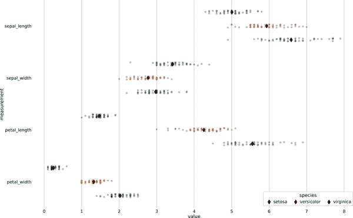
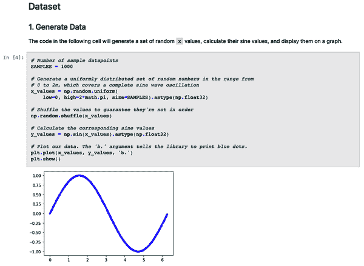
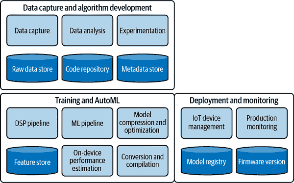
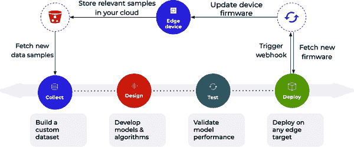
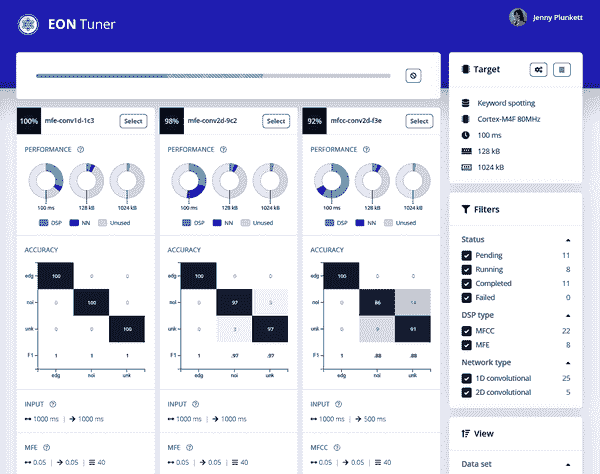

# 第五章：工具与专业知识

边缘 AI 开发工作流包含许多高度技术化的任务，大多数项目将需要由专家团队集中技能和专业知识。

本章的第一部分是建立团队的指南，这个团队将把您的想法变成现实。即使您仍处于早期阶段，了解重要的技能类型和您可能遇到的挑战也是有帮助的。AI 的核心是自动化人类洞察，因此您团队必须具备正确的洞察力。

本章的第二部分，从“工具”开始，旨在帮助您掌握与边缘 AI 工作相关的关键技术工具。如果您的产品开发早期阶段，您可能希望浏览一些细节，然后在想出一些具体想法并准备好开始时，将本章作为参考。

# 构建边缘 AI 团队

边缘 AI 是一种真正完整的技术。作为一个话题，它利用从半导体电子学的物理特性到跨设备和云的高级架构工程的所有知识。它需要在人工智能和机器学习的最前沿方法以及裸金属嵌入式软件工程的最可敬技能方面的专业知识。它利用计算机科学和电气工程的整个历史，一脉相承。

世界上没有人在边缘 AI 的每个子领域都拥有深入的专业知识。相反，这个领域核心的人依赖于组建专家网络，他们可以寻求其他拼图片段的洞察。如果你正在开发边缘 AI 产品，你可能需要为自己做同样的事情。

边缘 AI 团队最佳组合是具备广泛的跨学科知识、直接的问题领域工作经验以及习惯于迭代开发流程的团队。到目前为止，表现最佳的产品都来自那些直接面对他们试图解决的问题的团队：他们利用已有的知识来指导他们的边缘 AI 产品。

一个单一团队不需要在边缘 AI 的每个子领域都有专家。绝对最低要求可能只是两个角色：

+   一个领域专家，深入了解待解决问题

+   一位有经验开发类似目标设备的嵌入式工程师

没有理由这两个角色不能由同一个人来担任。然而，如果没有与机器学习或其他人工智能算法的工作经验，他们将不得不非常依赖于专门设计来引导非机器学习专家进行算法创建过程的端到端平台。

###### 提示

如果您是一个没有嵌入式开发经验的独立开发者，您可以通过在目标硬件上构建一些非人工智能项目来提升您的技能。为了让您的生活更轻松，您可以考虑坚持使用 SoC 级硬件，因为嵌入式 Linux 开发比裸金属开发容易得多。如果您使用端到端边缘人工智能平台，部署您的模型应该相对简单。

决心和一些临时的即兴技能可以走得很远：我们已经看到许多科学研究人员用相对简单的嵌入式技能建立自己的 AI 驱动硬件。

虽然许多问题可以由一个小团队解决，但最复杂的问题需要更多的努力。本章的其余部分列出了可能重要的角色和责任，这将帮助你了解你自己团队的需求。它还讨论了边缘人工智能招聘的挑战。

## 领域专业知识

如我们将在“数据集和领域专业知识”中详细了解的那样，领域专业知识绝对是团队中最重要的组成部分。如果除了领域专业知识和预算之外，您什么都没有，您仍然可以雇用开发人员并建立产品。但是，如果您的团队没有人对您试图解决的问题有深入的理解，您很可能无法解决它。事实上，您可能会尝试解决错误的问题或创建没有人需要的解决方案的机会是相当大的。

在没有领域专业知识的情况下，建立任何质量产品都是困难的，但在没有领域专业知识的情况下建立人工智能产品几乎是不可能的。边缘人工智能的目标是将专家知识提炼成软件，并用它来自动化一个过程。正如我们在本书前面学到的，智能意味着在正确的时间知道正确的事情要做什么。但如果我们自己不知道，我们怎么能构建一个能够做到这一点的系统呢？

如果您自己不是领域专家，您的第一任务是找到一个是的。您的第二个任务是让他们验证您计划构建的解决方案。以下是一些问题可以问他们：

+   您希望解决的问题是否真的存在？

+   如果存在，这是否是一个有用的问题需要解决？

+   是否已经存在解决这个问题的解决方案？

+   您的提议解决方案是否真的有助于解决问题？

+   您的提议解决方案听起来可行吗？

+   如果您构建您的解决方案，领域内的任何人是否愿意购买它？

你应该希望能够向某人提出这些问题，而不必花太多钱：这些是任何真正领域专家在考虑接受工作时会思考的基本问题。即使你不同意，你也应该注意他们的答案。如果一个真正的专家告诉你某事是一个坏主意，那么很可能是有些道理的。

领域专业知识应该是您组织的核心，并成为您核心团队的一部分。您的专家将参与项目的许多方面，使他们成为边缘成员是不可行的。尽管如此，理想的情况是您在组织的每个层次都有领域专家。例如，除了核心专业知识外，您可能还有工程师、董事会成员和顾问，他们都在相关领域有经验。他们的共同见解将帮助您的团队预见和减少风险。

如果你找不到具备所需专业知识的人，你应该在项目启动前中止它。如果没有适当的知识，就无法合乎道德地工作。你的项目可能会违反某个领域的黄金法则，而你却毫无察觉。在你的客户身上测试不合格的功能是不可接受的，正如图 5-1 所明确的那样。在现场性能建立反馈环路非常困难，你很可能不知道出了什么问题。


###### 图 5-1\. 使用客户验证您的解决方案是一个糟糕的主意（[Twitter](https://oreil.ly/jI6HJ)，2022）

如果你确信自己有一个好主意，你可能需要花一些时间发展必要的专业知识。

## 多样性

除了领域专业知识之外，你的团队还应该追求的另一个重要特性是多样性。正如我们在“减少社会伤害”中讨论的那样，防范社会问题的最佳策略之一是建立一个拥有多元视角的团队。

在工作场所多样性方面，将其分为四个核心领域可能会有所帮助：¹

内部

内部多样性反映了一个人出生时不得不面对但并未选择的事物。其中包括年龄、出生国家、种族、族裔、性取向、性别认同、身体能力和人格类型。

外部

外部多样性包括我们在生活中获得的各种因素，不论是受外部因素影响还是出于有意识的选择。一些例子包括社会经济地位、生活经历、教育水平、个人兴趣、家庭状况、所在地和宗教信仰。

组织

组织多样性涉及一个人在组织内的角色。这可能包括他们的工作地点、工作职能、在层级中的级别、薪资水平、资历或雇佣状况。

世界观

世界观多样性与一个人如何看待世界有关。它可以包括伦理框架、政治信仰、宗教信仰、个人哲学和对生活的一般看法。

由于这四个领域的差异，每个人都有不同的经历，使他们的视角独特。这种独特的观点意味着他们会以不同的方式看待同一情况。作为构建技术产品的团队，不同的视角非常宝贵，因为它允许组织从多种不同角度看待问题和提出的解决方案。

这为缺乏多样性的组织提供了显著优势。你将更有能力识别给定情况中的所有细微差别，在制定可能解决方案的空间时有巨大的好处。也许某人的个人经历将转化为一个其他人都没有想到的惊人想法。

更重要的是，多样化的观点将帮助你识别自己产品中的问题。例如，你可能会发现不同的人自然而然地提出评估产品性能的不同标准。有孩子的人更有可能考虑产品在家庭生活中的需求，而有身体残疾的人可能更容易考虑无障碍性。

这并不意味着你的团队成员应该代表这些领域的专家：一个人有残疾并不意味着他们自动成为你的官方无障碍专家，这可能是他们既不想要也没有资格的角色。然而，你的团队拥有多样化的观点意味着他们更有可能考虑到需要引入无障碍专家的*必要性*。

拥有一个多样化的团队还不够：个人必须愿意分享他们的意见，整个组织必须真正倾听他们。建立这种环境的工作超出了本书的范围，但这方面有大量的文献可供参考。一个好的起点是来自谷歌的[心理安全简介](https://oreil.ly/rZYFL)，他们发现个人能够自信发言的团队[效果更好](https://oreil.ly/2LD_i)。

另一个关键点是你应该利用整个组织的各种视角。除了直接参与产品开发的人员外，你应该从每一个可以的人那里获取反馈——从高管到入门级工作人员。这将帮助你避免洞察中的盲点。在许多大型科技公司，员工被鼓励报名测试尚处于开发中的新产品，²这使得开发团队能够获取整个公司的见解。

就像在迭代开发中的所有事情一样，这个过程关键在于建立反馈循环，随着时间的推移帮助改进你的产品。你应该在最早的阶段创建系统，收集你多样化团队的观点，甚至在你还在草拟想法时。

对于一个团队来说，确保包括所有必要的多样化视角并不总是可行的。例如，你可能需要年轻儿童对产品的意见，而这些儿童不太可能是你组织的付费员工！确保这些视角被纳入的方法之一是为在项目期间与这些类型的人进行焦点小组讨论制定预算。

拓宽视野的另一种方式是找到一群多样化的顾问，帮助你做出决策。组建一个结合关键领域专业知识和多样化代表性的顾问委员会，是帮助你做出正确决策的强大工具。他们可以作为审查委员会，帮助你了解是否达成目标或偏离了正确方向。

不管   无论你的团队规模大小，都应该不遗余力地寻求受到你产品影响的人的反馈——这是最具多样性的群体。

## 利益相关者

你项目的利益相关者包括所有可能受影响的个人和社区。这包括你组织内的人员、客户、系统的最终用户，以及可能受到影响的任何人——无论是直接还是间接的。

要使系统有效，并避免造成伤害，必须考虑利益相关者的需求和价值观。例如，如果你的系统将接触公众成员，那么必须将他们视为利益相关者，并且在设计项目时要考虑到他们。

了解利益相关者的需求和价值观的最佳方式是直接询问他们。他们应该在你的开发工作流程中得到代表，从构思到项目结束。

利益相关者可以使用一个已被广泛认可的工具——[利益相关者映射](https://oreil.ly/t7Gv0)进行识别。你应该确保你的团队中有熟悉此过程的人。

## 角色与职责

建立一个产品需要一群人，这一章节的下一个部分概述了一些所需的角色。你的项目可能需要的角色在此未列出；这些只是直接参与边缘 AI 工作流程的最常见角色。

###### 小贴士

你无需为每个角色雇佣单独的人。完全有可能同一个人同时在一个项目中扮演多个角色，且在初期，可能所有的原型制作都由一个人完成。

为了便于消化，我们将按类型划分角色。

### 知识与理解

此类别中的角色对于理解问题并以正确的方式解决它至关重要：

域内专家

在这出戏中扮演重要角色的领域专家带来了对项目领域的深刻理解。虽然产品经理的工作是理解项目如何融入周围的背景（如市场），但领域专家是了解情况科学的人。例如，工业自动化项目可能需要相关工业过程领域的专家，而医疗项目可能需要医学和生物学相关领域的专家。

道德和公平专家

道德和公平的角色是为了避免那些经常导致有害或无效产品的错误类型。他们需要对将用于解决问题的技术有深刻的理解，了解可能出现的各种陷阱，并遵循必须遵循的流程。领域专业知识同样重要，因为道德问题可能与特定领域相关。

### 计划和执行

这些高级角色在从构思到发布及长期支持的过程中对项目的正确路径起着重要指导作用：

产品经理

产品经理负责对产品做出决策：它应该是什么，它应该做什么，以及它应该为谁服务。他们的工作是深入了解问题和市场，并与技术角色合作，设计和实施有效的解决方案。他们通过影响力领导，将不同的线索汇集在一起，编织出符合正确需求的产品。

项目经理

项目管理角色涉及协调跨团队执行复杂任务。例如，项目经理可能会组织收集数据集，这些数据集将用于构建和创建产品。

程序经理

程序经理协调由多个项目组成的高级战略。例如，一家计划在其业务的多个部分中引入边缘人工智能以节省成本的公司可能会使用程序经理来协调这个过程。

### 算法开发

这些角色涉及数据集的探索和算法设计，以及系统评估机制的制定。虽然现在这些工作越来越多由非专家用户在端到端平台上完成，但有些坚实的经验仍然可以避免新手错误的产生：

数据科学家

数据科学角色负责收集、维护和理解支持边缘人工智能项目的数据。他们具有数据清洗、分析和特征工程的技能。这一角色经常涵盖机器学习工作，但也可能与之完全不同。

DSP 工程师

DSP 工程师开发和实现 DSP 算法。他们通常在算法开发和低级编程方面具有强大的技能。在大多数边缘人工智能项目中，DSP 非常重要——除了那些将深度学习与图像数据结合的项目，因为图像通常不经过太多处理即输入。

ML 从业者

机器学习从业者花时间尝试使用 ML 解决问题。ML 从业者将尝试用不同类型的学习算法框架化问题。然后，他们将使用数据集，尝试开发解决问题的算法。他们工作的关键部分是确定如何评估算法及其在实验室和现场的表现。

在边缘人工智能项目中，DSP 工程师和 ML 从业者密切合作，因为 DSP 是复杂形式的特征工程，这是 ML 工作流的关键部分。

### 产品工程

这一系列角色推动产品本身的开发。他们创建硬件和应用代码，并以能够在设备上高效运行的形式实现算法：

硬件工程师

硬件工程师设计驱动产品的硬件。这种设计包括捕获原始数据的传感器以及试图理解数据的处理器，还包括印刷电路板的设计和布局。

硬件工程师与算法开发角色密切合作非常重要，以确保硬件和算法相互支持。这是一个双向的过程：算法设计必须考虑到硬件约束，而硬件设计必须考虑到算法设计。

嵌入式软件工程师

嵌入式软件工程师编写使硬件实现生命的低级代码。他们的代码必须与传感器接口，运行算法，并解释其输出以做出决策。他们实现嵌入式应用程序本身。

嵌入式 ML 工程师

一些嵌入式软件工程师专门专注于机器学习。他们的工作是确保 ML 算法在特定硬件上尽可能高效地运行。他们可能对机器学习背后的数学有深入的了解，并具有低级软件优化经验。他们不一定是数据科学的专家，尽管他们可能能训练简单的 ML 模型。

这是一个非常新的角色，但它与边缘人工智能领域同步增长。

工业设计师

一个工业设计师负责产品的物理设计。这在边缘人工智能领域很重要，因为物理设计决定了传感器数据收集的许多现实情况：将传感器移动到产品的另一个位置可能会完全改变其典型输出，并使数据集立即过时。这意味着工业设计、电子工程和算法开发之间需要进行重要的沟通。

软件工程师

许多项目涉及嵌入空间以外的软件工程。例如，许多边缘 AI 项目涉及服务器端组件。编写这些后端代码需要与开发嵌入式应用程序不同的技能，因此需要不同类型的工程师。

### 技术服务

这些支持性角色帮助保持开发过程的技术方面运行顺利，并管理工具以保持团队的生产力和安全性：

MLOps 工程师

MLOps 工程师负责构建和维护 MLOps 解决方案，这些解决方案由团队其他成员使用。本质上，这是一个[DevOps 角色](https://oreil.ly/kEFI-)，但它需要对边缘 AI 工作流程的过程和要求有深刻理解。

安全从业者

这一角色关注团队、数据和产品的安全需求。它既是一个咨询角色——帮助其他角色理解如何在其工作中保持安全——也是一个主动角色，制定措施来帮助降低安全风险。

质量保证工程师

这一角色帮助设计和实施测试计划，让产品经历其全过程，帮助团队了解产品是否达到设计目标。关于质量保证的更多信息，请参见“现实世界测试”。

## 边缘 AI 的招聘

边缘 AI 开发的一个重要挑战是作为一个非常新的领域，很少有人具有相关工作经验。在撰写本文时，几乎不可能招聘到具有现有边缘 AI 经验的工程师：全球可能只有几百人，大多数人仍在进行他们的第一个激动人心的边缘 AI 项目，并没有足够长的时间来感到不安。

幸运的是，这是一个新领域的事实意味着，即使是经验丰富的工程师，也只有几年的优势。尤其是在边缘 AI 工具化的最新进展方面，特别是端到端平台的形式，极大地降低了进入门槛。边缘 AI 的招聘有两个主要方向需要特定的知识：算法开发和嵌入式工程。

在算法开发的情况下，你可能需要数据科学家和机器学习从业者。一些从业者背景是应用工程，解决行业中的实际问题。其他人可能具有更加学术的背景，研究机器学习背后的原理并提出新技术。

应用从业者在问题框架方面有更多经验，这在边缘 AI 中非常重要。这使得他们成为一个理想选择，特别是作为最初或独立的聘用。尽管如此，学术研究人员仍然可以成为边缘 AI 项目的良好选择。他们可能没有在典型软件开发环境中工作的经验，可能需要更长时间来适应。但是，与应用从业者相比，他们更容易被招聘：他们只是更多。

###### 小贴士

机器学习研究与应用机器学习非常不同，一些机器学习研究人员可能会觉得例行应用现有技术比尝试提出新技术更无聊。确保候选人清楚地了解角色期望，以避免双方的失望非常重要。

数据科学和机器学习领域的一个难点是，不多的人对传感器数据有丰富的经验。虽然视觉是常见的模态，但音频不那么常见，而时间序列传感器数据对大多数从业者来说可能是个谜题：尽管时间序列分析在数据科学中很常见，但通常不是由电子传感器产生的高频时间序列的那种类型。

幸运的是，DSP 工程师与 ML 从业者具有类似的工作流程和工具链，并且他们已经是传感器数据特征工程的专家。DSP 工程师的技能和经验使他们非常适合学习嵌入式机器学习，因此一个潜在的途径是招募 DSP 工程师并让他们学习机器学习的基础知识。由 DSP 工程师和 ML 从业者组成的团队将比任何一种角色单独组成的团队更容易应对挑战。

在嵌入式工程方面，面临的挑战各不相同。虽然与深度学习解释器（或深度学习编译器生成的代码）一起工作通常只是库集成的问题，但嵌入式工程师有时可能需要深入内部来查明问题所在。在这些情况下，对深度学习的一些知识和理解肯定是有帮助的。嵌入式工程师可能还需要负责将模型转换为适合在设备上使用的适当形式，这在一定程度上需要一些机器学习的见解。

嵌入式工程师的另一个常见任务是在软件中实现经典的机器学习模型。目前尚没有一个很好的面向嵌入式的 C++库，但通常很容易将它们移植：高级语言中有简单易懂的参考实现。

不幸的是，找到既有嵌入式工程知识又懂机器学习的工程师在一段时间内将是一个挑战。尽管如此，端到端平台使事情变得容易了许多，最终有经验的嵌入式机器学习工程师的数量会增加。但现在不应该成为阻碍：一位称职的嵌入式工程师应该能够轻松学习今天的工具。

## 学习边缘人工智能技能

在过去几年里，一些关于边缘人工智能学习的优秀资源已经出现。像大多数领域一样，存在理论和实践两方面。理论内容对于那些希望推动该领域发展的人最为有趣，而实践内容对于那些希望构建产品的人更为有帮助。

警告：不要迷失在细枝末节中。许多希望构建 AI 产品的人最终陷入学习的泥潭中，探索每一个可能的兔子洞，而不是真正着手开始他们的项目。事实是，这是一个庞大的领域，你永远无法全部学习。要以行动为导向，学习足够让你迈出下一步的内容，然后重新评估。成功的硬件产品需要团队，因此弄清楚你需要了解的最少信息，然后引入一些专家。

这里是我们推荐的实践和理论内容。

### 实践

本书的最后三章从第十一章开始，详细介绍了边缘 AI 工作流程及三个真实用例：野生动物监测、食品质量保证和消费产品。

完成后，这里还有更多内容：

[嵌入式机器学习导论](https://oreil.ly/ouQyM)（Coursera 课程）

一门旨在实践介绍该主题的高评分在线课程。

[带嵌入式机器学习的计算机视觉](https://oreil.ly/LgjmK)（Coursera 课程）

第一门课的后续课程，专注于视觉。

[规模化应用机器学习（TinyML）](https://oreil.ly/jX-m1)（HarvardX 课程）

这一系列课程聚焦于处理嵌入式 ML 所需的应用技能和全局专业知识。

[*TinyML Cookbook*](https://oreil.ly/Q_Eto)，Gian M. Iodice 著（Packt，2022 年）

一本围绕实用“食谱”展示嵌入式 ML 中各种概念的实用书籍。

[*TinyML*](https://tinymlbook.com)，Pete Warden 和 Daniel Situnayake 著（O’Reilly，2020 年）

一本关于在微控制器上进行嵌入式 ML 的工作介绍，重点放在 TensorFlow Lite for Microcontrollers 上的示例。

[*设计机器学习系统*](https://oreil.ly/aY4Iv)，Chip Huyen 著（O’Reilly，2022 年）

一本关于机器学习开发工作流程的绝妙书籍，针对服务器端应用，但仍然非常相关。

[*制作嵌入式系统*](https://oreil.ly/BQG6z)，Elecia White 著（O’Reilly，2011 年）

开发嵌入式系统的最佳实用入门书籍。

### 理论

这些内容适合想深入研究嵌入式机器学习理论的人群。请记住，这并非成功产品开发的先决条件——所以不要感到害怕或迷失在学习的兔子洞里。³

[微型机器学习（TinyML）](https://oreil.ly/cZoLK)（HarvardX 课程）

这一系列课程与前面提到的应用 TinyML（微型机器学习）有重叠之处，但从绝对基础开始，可能不是你想尽快开始构建的必要条件。

[*The Scientist and Engineer’s Guide to Digital Signal Processing*](https://oreil.ly/Oir2V)，Steven W. Smith 著（California Technical，1997）

一本真正全面的数字信号处理指南，可以免费获取，也有硬皮书版本。对于任何将与 DSP 算法严肃工作的非 DSP 工程师来说都是一个好资源。

[*Hands-On Machine Learning with Scikit-Learn, Keras, and TensorFlow*](https://oreil.ly/tfO2J)，Aurélien Géron 著（O’Reilly，2022）

一本实用机器学习概念和技能的精彩介绍。对于任何将与 ML 算法一起工作的非 ML 工程师来说都是一个好资源。

[*Deep Learning with Python*](https://oreil.ly/G7qW4)，François Chollet 著（Manning，2021）

另一本关于 ML 的绝妙介绍，专注于深度学习算法。

[TinyML 基金会](https://oreil.ly/AdXwm)（YouTube 频道）

TinyML 基金会定期举办关于嵌入式 ML 的演讲。通常内容高度技术化，反映了研究和工程的前沿。

[TinyML 论文和项目](https://oreil.ly/P1YbW)（GitHub 仓库）

这个仓库是与该领域相关的论文和资源的宝库。

# 工具

边缘 AI 的故事是关于工具的故事。在技术方面，大多数用于将人工智能应用于边缘设备的基本组件已经存在了十年以上。然而，这些技术——从功能强大的嵌入式处理器到深度学习模型——在首次可用时往往具有陡峭的学习曲线。

然而，随着时间的推移，我们的全球技术生态系统演变出设计来管理复杂性并改善甚至是最具挑战性技术的可用性的工具。丰富的开源和商业库、框架和产品的组合已经将边缘 AI 带入了普通嵌入式工程师的工具箱。

在过去两三年中，像[TensorFlow Lite for Microcontrollers](https://oreil.ly/oowo5)⁴ 这样的库以及像[Edge Impulse](https://edgeimpulse.com)⁵ 这样的端到端开发平台使得这项技术越过了门槛，实现了大规模采用。

下面的部分将详细介绍我们认为对边缘 AI 最为重要的工具。成功的团队至少应该对它们有所了解。

## 软件工程

大部分边缘 AI 涉及软件开发，因此现代软件工程工具非常重要。以下是一些关键贡献者。

### 操作系统

在开发和部署过程中考虑操作系统非常重要。在开发阶段，您选择的操作系统将决定如何轻松地使用构成边缘 AI 生态系统的极其多样化的软件工具集。两种不同的工程传统之间存在一些轻微冲突。

在嵌入式工程中，使用 Windows 作为操作系统是历史上常见的做法，一些嵌入式工具也是基于此假设编写的。相比之下，数据科学和机器学习的工具通常最适合 Unix 兼容环境，如 Linux 或 macOS。

尽管如此，在实践中这并不是一个巨大的问题。团队中并不需要每个成员都能运行所有的工具：例如，机器学习工程师可能会在 Linux 上训练和优化模型，然后将其交给使用 Windows 的嵌入式工程师。此外，有许多混合环境的工具，比如[Windows 子系统 for Linux](https://oreil.ly/VYaE6)。此外，更近期的嵌入式工具链通常也能在 Unix 环境中正常工作——尽管嵌入式工程师可能仍然更喜欢 Windows 作为熟悉的环境。Edge Impulse 团队的整个团队，包括嵌入式和 ML 工程师，都使用 macOS 和 Linux 虚拟机的组合。

在部署中，操作系统有时会直接用于边缘设备。这些通常是嵌入式 Linux（裁剪版的 Linux，编译用于 SoC 运行）或实时操作系统（RTOS），后者是专门为嵌入式设计的特定操作系统，旨在以最小的开销运行。这两个选项，加上不使用操作系统的选项⁶（对于微控制器来说最常见的情况），都完全兼容边缘人工智能。

### 编程和脚本语言

边缘人工智能最重要的两种编程语言是 Python 和 C++。Python 目前是机器学习的首选语言，得益于大量开源数学和科学计算库，几乎被机器学习研究社区完全采纳。由于 Python 也是通用软件工程的一流语言，它击败了像 R 这样的领域特定语言。⁷ 最重要的两个深度学习框架 TensorFlow 和 PyTorch 都是用 Python 编写的，我们在“数学和科学计算库”中也会遇到一些不可思议的工具。Python 有它的怪癖，但它是开发边缘人工智能算法（从机器学习到 DSP）的正确语言。

C++（发音为*C-plus-plus*）是现代嵌入式软件工程中普遍存在的语言。虽然一些嵌入式平台仅支持 C（一种比 C++更简单且具有一些相似特性的语言），但通常用于边缘人工智能的高端嵌入式设备一般都是用 C++编程的。围绕 C++的生态系统提供了许多工具和库，可以使开发变得更加容易，这很幸运——因为对于大多数基于微控制器的系统来说，C++是唯一的选择。

C++ 是一种低级语言，可以对底层硬件进行大量控制。编写优秀的 C++ 代码需要技能，但其速度比使用高级语言如 Python 写的等效代码要快得多。

###### 注意

Python 库中大部分的数学计算实际上是通过 C++ 在底层实现的：Python 代码只是作为一个方便的包装器。这让开发人员获得了最佳的两个世界。

在开发过程中，你也可能会使用诸如 Bash 这样的脚本语言。它们用于链式连接和自动化复杂工具和脚本，帮助构建应用程序并将其部署到设备上。

在目标方面，与微控制器一起工作时几乎总是会使用 C++。运行完整操作系统的 SoC 通常更加灵活 —— 你可能能够运行高级语言如 Python。权衡之处在于它们比较昂贵且消耗的能源比较多，远超小型设备。

由于大多数目标需要 C++，你需要将任何在高级语言（如 Python）中开发的算法移植以部署你的工作。稍后会介绍一些工具，这样做会更容易，但这并不总是一个简单的过程。

### 依赖管理

现代软件通常有大量依赖项，而 AI 开发将这一点推到了一个新的水平。数据科学和机器学习工具通常需要大量额外的第三方库；安装像 TensorFlow 这样的主要深度学习框架会带来从 Web 服务器到数据库的一切。

在嵌入式方面事情也可以变得复杂，因为信号处理和机器学习算法通常需要复杂、高度优化的数学计算库。此外，嵌入式 C++ 代码的编译和部署通常需要机器上存在一团复杂的依赖关系。

所有这些依赖关系可能是一场绝对的噩梦，管理它们真的是边缘 AI 开发中最具挑战性的部分之一。存在各种技术可以使这一过程更容易，从容器化（参见下一节，“容器化”）到特定语言的环境管理。

对于 Python 来说，其中一个最有帮助的工具称为 [Poetry](https://python-poetry.org)。它旨在简化在单台机器上多个环境中指定、安装和隔离依赖项的过程。⁸ 其他必要的工具包括特定于操作系统的软件包管理系统，如 [aptitude](https://oreil.ly/aCq1n)（Debian GNU/Linux）和 [Homebrew](https://brew.sh)（macOS）。

依赖管理中最糟糕的部分之一出现在尝试将系统的不同部分集成在一起时。例如，使用一个版本的深度学习框架训练的模型可能与稍后发布的推断框架不兼容。这使得在开发过程的早期就对系统进行端到端的测试变得非常重要，以避免后续出现令人不快的意外。

### 容器化

容器化是使用操作系统级技术在被称为*容器*的隔离环境中运行软件。从内部看，容器与运行它的机器完全不同。它可以有不同的操作系统和依赖关系，并且对系统资源的访问受限。

边缘人工智能涉及许多不同的工具链，用于从机器学习到嵌入式开发的各种任务。这些工具链通常具有相互不兼容的依赖关系。例如，两个工具链可能需要完全不同版本的语言解释器。容器化是一个强大的工具，可以使这些不兼容的工具链在单个机器上愉快地共存。

容器通常是无状态且高度可移植的。这意味着你可以将整个费力配置的机器——用一种特殊语法描述——视为执行特定任务的命令行程序。你可以将它们串联起来以执行有用的工作，并且可以轻松地在不同的机器上运行它们，形成分布式计算环境。

同样，也可以在嵌入式设备上运行容器，通常在 SoC 上的嵌入式 Linux 中。尽管涉及一些开销，但这可以是将软件及其依赖关系打包为分发包的有趣方式。

容器化最流行的工具是[Docker](https://www.docker.com)和[Kubernetes](https://kubernetes.io)。Docker 通常用于开发工作站上的本地使用，而 Kubernetes 用于在分布式计算基础设施中运行容器集群。

### 分布式计算

分布式计算是在不同的机器上运行不同进程的概念，这些机器可以位于全球任何地方，并通过互联网连接。与使用单一的高功率主机和超级计算机相比，这是一种更灵活的计算方法，也是现代大多数计算的架构风格的基础。

分布式计算对边缘人工智能至关重要，原因有很多。首先，边缘人工智能就是分布式计算的一个例子！计算是在数据产生的边缘进行的，结果要么在本地使用，要么通过网络发送。

其次，管理数据集、开发算法和训练机器学习模型可能需要大量的计算和存储资源。这使得分布式计算非常适合这些流程的部分。例如，通常会租用一台高性能的远程服务器来训练深度学习模型，而不是购买和维护办公室里的强大机器。

组织和控制分布式计算基础设施的任务被称为*编排*。有许多开源编排工具可用，专为不同的任务设计。[Kubeflow](https://www.kubeflow.org) 是一个为在多台机器上运行机器学习工作负载而设计的编排框架。

### 云服务提供商

类似于[亚马逊网络服务](https://aws.amazon.com)，[谷歌云](https://cloud.google.com)，和[微软 Azure](https://oreil.ly/zXZeB)等企业提供按需分布式计算资源，供愿意支付费用的任何人使用。这种类型的分布式计算被称为“云计算”，因为计算机网络的图表通常使用云符号表示位于本地网络外的资源。

云服务提供商托管全球大部分的网站。他们负责物理硬件和网络配置，使开发人员能够专注于构建应用程序而不是管理设备。他们大量使用容器化技术，允许许多不同的工作负载共存于同一基础设施上。

对于边缘 AI 项目来说，常见的做法是使用云计算来存储数据集、训练机器学习模型，并提供一个后端，使边缘设备能够发送和接收数据。在某些情况下，例如“级联至云”，运行在云服务器上的 AI 算法与运行在边缘设备上的算法协同工作，以提供服务。

## 处理数据

数据是边缘 AI 应用的关键组成部分，存在许多用于收集、存储和处理数据的工具。

### 数据捕获

由于偏远地区通常存在有限的连接性，因此从现场获取数据可能会很困难。两个有用的工具是[数据记录器](https://oreil.ly/0Tl46)和[移动宽带调制解调器](https://oreil.ly/xl0eZ)。

数据记录器是小型设备，旨在捕获和记录现场传感器收集的数据。它们通常具有大量持久存储空间，用于收集传感器读数，并且可以是电池供电或连接到永久电源。使用数据记录器的好处是可以立即开始收集数据，而无需设计和构建自己的硬件。缺点是数据需要手动收集，即通过物理连接到记录器。

移动宽带调制解调器通过蜂窝网络（尽管也可以通过卫星连接）提供无线互联网连接。它们可以从世界上几乎任何地方传输数据，尽管连接性取决于当地的可用性和条件。它们提供即时数据的便利性。然而，数据费用可能相当昂贵，无线通信消耗大量能源，因此并非在所有情况下都可行。

### IoT 设备管理

许多平台用于与 IoT 设备通信、管理其操作并从中收集数据。通常需要将库或 API 集成到您的嵌入式软件中。然后，软件将连接到云服务器，您可以用它来控制设备。

这些平台可以方便地收集传感器数据，特别是在已经使用设备管理软件的现场部署中。

### 数据存储与管理

当你收集数据集时，你需要一个地方来存储它。这可以简单到存储在硬盘上的逗号分隔文件，或者复杂到专门设计用于存储和查询时间序列数据的时间序列数据库。我们将在 “存储和检索数据” 中涵盖其中一些选项。

数据存储解决方案设计用于各种用途。一些旨在在实时查询数据时极为快速，而其他一些则旨在尽可能防止数据丢失。对于边缘 AI 应用程序，通常是批处理模式处理数据，因此性能通常不是最重要的因素。相反，您应该选择适合您收集的数据类型的简单解决方案。

AI 数据集通常存储在文件系统中，根本不使用任何类型的数据库也很常见。文件系统专为此类数据设计，而类似于 Unix 命令行提供的文件系统工具在有效处理这些数据时非常有用。Python 的科学计算生态系统包括许多工具，非常擅长从磁盘读取数据，并帮助您探索和可视化数据。

虽然并不需要高级数据库，但以正确格式存储数据仍然很重要。正如我们将在 “格式化” 中学到的那样，传感器读数本身应以高效紧凑的二进制表示形式（如 [CBOR](https://cbor.io)、[NPY](https://oreil.ly/FdGWo) 或可能是 [TFRecord](https://oreil.ly/5HZPO)）存储，后者专为机器学习训练时的高性能而设计。有关读数的元数据应存储在单独的文件（称为*清单文件*）或简单的数据库中。以这种方式将数据与元数据分开存储，可以使您有效地探索和操作数据集，而无需将大文件全部读入内存。

### 数据管道

数据管道是一个处理原始数据并将其转换为用于特定任务（例如训练机器学习模型）的过程。这是数据工程师自动化数据清洗和整理等任务的方法。典型的数据管道可能会获取原始传感器数据，对其进行过滤，与其他数据结合，并将其写入正确的格式以进行机器学习模型的训练。

存在许多用于定义数据管道的工具，有些比其他工具更复杂。Edge AI 数据管道往往涉及大量相对简单的数据，因此应避免设计用于处理结构化数据（例如存储在关系数据库中的数据）的工具。与查询能力不同，要寻找高吞吐量和足够的灵活性来运行任意信号处理算法。

许多云提供商在其分布式基础设施中提供运行数据管道的功能。一些边缘 AI 的端到端平台将数据管道作为核心功能，并专门为传感器数据的特性设计。

## 算法开发

算法开发是大多数工具复杂性所在；为此过程提供了丰富的软件资源。一些软件比其他软件更适合边缘 AI 应用。

### 数学和科学计算库

Python 社区创造了一些非常出色的软件工程奇迹，以各种开源库的形式进行数学计算和数据分析。其中一些最重要的是：

[NumPy](https://numpy.org)

NumPy 自称为“用 Python 进行科学计算的基础包”，这完全正确。它为大多数基于 Python 的数值计算提供了高性能的支持，并且具有出色的 API，使您可以以最少的努力对大量数字数组执行复杂操作。其文件格式 NPY 是存储传感器数据的便捷方式。

[pandas](https://pandas.pydata.org)

NumPy 对于数组的作用，就像 pandas 对于数据表格一样。它提供了一种几乎神奇直观的语法，用于查询和转换任何可以组织成行和列的信息。Pandas 与 NumPy 兼容，因此您可以使用它来帮助探索您的传感器数据；速度超快。

[SciPy](https://scipy.org)

SciPy 提供了一系列快速实现的算法，这些算法对于科学计算至关重要。它在开发 DSP 算法中被广泛使用，并且是许多其他工具的核心。

[scikit-learn](https://scikit-learn.org/stable)

使用 NumPy 和 SciPy 构建的 scikit-learn 库提供了大量的机器学习算法实现，以及用于提供经过处理的数据并评估其性能所需的工具。其 API 设计使得可以互换地组合其组件，这意味着可以轻松比较和组合不同的算法。它是 Python 中经典机器学习的黄金标准，即使在使用其他框架训练深度学习模型时，其数据处理和评估工具也经常被使用。

### 数据可视化

在处理数据时，可视化是一种必不可少的工具——特别是涉及数字信号的数据。图形和图表使我们能够表示和解释数字信息，否则这些信息将难以理解。Python 生态系统中有一些出色的数据可视化库。它们可能非常复杂，尤其是如果您想要超越提供的默认设置来定制可视化效果时，但一旦掌握它们，它们可以迅速将数列转化为清晰的见解。

最常见的两个库是[Matplotlib](https://matplotlib.org)和[seaborn](https://seaborn.pydata.org)。Matplotlib 提供了许多不同的方法来创建数据可视化；它通常用于创建科学出版物中的图表。其语法可能有点具有挑战性，但由于其广泛流行，通常可以通过快速的网络搜索帮助您解决问题。

Seaborn 是建立在 Matplotlib 之上的，旨在简化一些复杂性，使得像图 5-2 中那样的吸引人的可视化更加容易，而不会陷入复杂的 API 中。它专门设计与 pandas 搭配使用。



###### 图 5-2。该图显示了植物测量数据集中各列的范围和均值；这是[seaborn 示例画廊](https://oreil.ly/uPOl0)中的一个可视化实例。

Seaborn 和 Matplotlib 输出图像文件，但某些可视化库，如[Plotly](https://plotly.com/python)，生成可以动态探索的交互式可视化。

### 交互式计算环境

边缘 AI 开发涉及许多超出常规软件工程上下文的探索。探索性数据分析、数字信号处理和机器学习都涉及尝试不同的想法并快速可视化结果的工作流程。

存在各种交互式环境来实现这一目的。与仅运行脚本并将结果写入文件或必须构建整个 Web 应用程序以表达信息视觉化不同，交互式计算环境允许代码和可视化并存于同一编辑器中。

Python 代码最重要的交互式环境称为 [Jupyter Notebook](https://jupyter.org)。在笔记本中，您可以编写和运行 Python 代码，并且代码的输出会显示在旁边。这包括使用诸如 Matplotlib 等库生成的任何可视化效果，如 图 5-3 所示。



###### 图 5-3\. 来自 Jupyter Notebook 的截图，显示了丰富文本、代码以及代码的输出；所展示的笔记本来自 TensorFlow Lite for Microcontrollers 的 [Hello World 示例](https://oreil.ly/a976F)

这使您能够构建交互式的动态文档，其中包含算法的实现和运行结果。它们既是实验的交互工具，也是展示您所做工作的文档证据。常见的工作流程是在笔记本中尝试算法，直到找到最佳候选者，然后一旦确认代码运行良好，再将其移植到常规的 Python 脚本中。

Jupyter 可以在本地运行，但也有基于 Jupyter 的托管环境。其中之一是 [Google Colab](https://oreil.ly/eA4Mb)，另一个是 [Amazon SageMaker](https://oreil.ly/GxOs-)。这两者都可以免费使用，但如果需要额外计算资源则需付费。

另一个常见的交互式计算环境是 [MATLAB](https://oreil.ly/NJ7Pr)，它结合了类似的交互式环境和自己的编程语言。在学术界和工程领域很常见，但作为需要付费许可的闭源商业产品，相比于软件工程师而言流行度较低。那些有电子工程背景的人通常熟悉 MATLAB，包括 DSP 工程师。

甚至还有一种专门设计用于边缘 AI 的交互式环境。[OpenMV IDE](https://oreil.ly/f0-KB) 是由 OpenMV 团队创建的开源产品，支持机器视觉应用的开发。它能够轻松测试和实现解释视觉信息的算法，随后可以部署到 OpenMV 的硬件设备和其他目标上。OpenMV IDE 的独特之处在于，它可以连接到装有摄像头的硬件设备，并实时显示算法运行的结果。

### 数字信号处理

DSP 算法开发通常在 Python 或 MATLAB 中进行。个别 DSP 工程师通常更喜欢其中的一种环境。

在 Python 中，SciPy 的 [`scipy.signal`](https://oreil.ly/UwJsO) 模块提供了许多重要的 DSP 算法的实现。在 MATLAB 中，[信号处理](https://oreil.ly/X8umU) 和 [图像处理](https://oreil.ly/MYpwC) 工具箱非常有帮助。

MATLAB 拥有一些不错的基于 GUI 的工具，可以减少算法开发所需的编程量，但 Python 的优势在于可以直接与用于训练机器学习模型的工具链兼容，而且是免费的。

越来越受欢迎的第三选择是 [GNU Octave](https://www.octave.org)，旨在成为 MATLAB 的免费开源替代品。

### 深度学习框架

深度学习工具生态系统主要由两个广受欢迎的开源框架主导，均为用于 Python 编写：[TensorFlow](https://tensorflow.org)，由 Google 创建，以及 [PyTorch](https://pytorch.org)，由 Meta 创建。⁹ 每个框架最初都是用于内部训练深度学习模型的系统，并反映了各自赞助商的优先事项。

深度学习框架不同于典型的软件库（如 NumPy 或 scikit-learn），它们试图在单一平台下提供整套工具。TensorFlow 和 PyTorch 都包含用于定义和训练机器学习模型、处理数据、协调分布式系统、部署到不同类型计算平台等系统。

##### 示例 5-1\. 使用 Keras 定义和训练简单的深度学习模型架构，Keras 是 TensorFlow 的高级 API。

```
from tensorflow.keras.models import Sequential
from tensorflow.keras.layers import Dense

# Defining the model architecture
model = Sequential()
model.add(Dense(units=64, activation='relu'))
model.add(Dense(units=10, activation='softmax'))

# Setting up the training process
model.compile(loss='categorical_crossentropy',
              optimizer='sgd',
              metrics=['accuracy'])

# Training the model
model.fit(x_train, y_train, epochs=5, batch_size=32)

# Evaluating the model
loss_and_metrics = model.evaluate(x_test, y_test, batch_size=128)
```

两者工具的历史使得 TensorFlow 成为工业界的主要框架，而 PyTorch 则是深度学习研究人员首选的工具。¹⁰ 其中很大一部分原因是 TensorFlow 生态系统中有更多模型部署选项可用，对于边缘人工智能尤为重要。

在撰写本文时，优化模型效率并将其部署到边缘设备的工具大多都是为了与 TensorFlow 生态系统集成。TensorFlow 和 PyTorch 在模型存储方面有不同的格式，虽然有转换方式，但并非一蹴而就的过程。¹¹ 这意味着目前从事边缘人工智能的大多数机器学习工程师都使用 TensorFlow。

由于 PyTorch 是研究人员的首选框架，许多最新的模型架构首先以 PyTorch 格式发布。这对于使用 TensorFlow 进行部署的工业开发人员可能会感到沮丧。幸运的是，大多数专注于开发适合边缘部署的更小更高效模型的研究人员都在 TensorFlow 生态系统内进行。在视觉对象检测领域，模型不兼容性最令人沮丧，因为对象检测模型的训练代码往往复杂且难以从一个框架移植到另一个框架。

在撰写本文时，TensorFlow 是边缘人工智能开发的最佳框架选择。使用 PyTorch 的开发者在尝试部署模型时将面临复杂且不可靠的转换过程。随着 PyTorch 生态系统的成熟，未来其如何发展将非常有趣。

### 模型压缩和优化

边缘设备通常需要小型、高效的模型 —— 特别是在深度学习的背景下，参数数量和计算需求可能会迅速增长。在“压缩和优化”中，我们学习了一些可用于提升模型性能的各种技术。其中一些技术是在训练过程中应用的，而另一些则是在训练后进行的。

压缩和优化工具通常作为深度学习框架的一部分提供，或者由硬件供应商提供，其硬件支持特定的优化。[TensorFlow Lite 转换器](https://oreil.ly/P5VHY)已成为运算融合和基本量化的事实标准，TensorFlow Lite 模型文件格式在行业内接近成为标准。¹² 同样在 TensorFlow 生态系统中，[TensorFlow 模型优化工具包](https://oreil.ly/ASl_h)提供了一套开源工具，涵盖了其他类型的优化和压缩。

值得记住的是，大多数优化方法在推断时也需要特定的工具支持，后文将在侧边栏“推断和模型优化”中进行详细讨论。目前，最受支持的优化方法是量化，广泛支持 8 位量化运算符实现。其他技术支持较少，其中稀疏性是一个最大的误导：听起来很引人注目，但目前几乎没有硬件支持它。

### 实验跟踪

算法开发是一个迭代的、探索性的过程，在项目的过程中，你可能会尝试数百甚至数千次不同的方法来找到一个可以令人满意的解决方案。保持科学性很重要，系统地测试想法，而不是随意进行修改并希望得到最佳结果。为了实现这一点，您需要一种跟踪实验的系统。

一个典型的实验可能涉及采集特定的数据样本，应用特定的 DSP 算法，使用这些特征训练一个具有独特超参数集的机器学习模型，然后在标准测试数据集上测试该模型。这种情况涉及许多变量：样本的选择、DSP 算法、模型及其参数。

实验追踪工具旨在记录运行的实验、变量设置以及结果。它们试图组织起本来可能是不可靠的、非正式的笔记过程，并努力不漏掉任何细节。实验追踪器还可以存储由实验产生的工件：训练脚本、数据集和训练模型。这有助于在后期理解和重现您的工作。

实验追踪器既可以作为开源包，也可以作为托管的商业产品提供。其中一个最简单的选择是[TensorBoard](https://oreil.ly/nOaGP)，它是 TensorFlow 生态系统的官方部分¹³。TensorBoard 提供了一个简单的 Web 界面，用于可视化和比较训练运行期间收集的日志，并提供了一些非常强大的工具，用于优化和调试训练代码。它对于跟踪基本实验很有用，尽管它并非设计为一个将持续存在项目生命周期的持久性数据存储，且在运行大量试验时表现不佳。

一个更复杂的开源选项是[MLflow](https://mlflow.org)。它是一个复杂的 Web 应用程序，由一个数据库支持，可以追踪实验，存储训练模型，并打包数据科学代码，以便轻松重现实验。它比 TensorBoard 更适合长期使用，并且可以扩展以跟踪成千上万个实验。它没有 TensorBoard 的优化和调试功能，后者仍然是优化训练计算性能的首选工具。

存在许多商业产品可帮助实验追踪。一个显著的选择是[Weights & Biases](https://wandb.ai/site)，它具有简单的 API 和精心设计的 Web 界面（以及许多适合于 MLOps 类别的特性，我们将在“机器学习运营（MLOps）”中探讨）。商业工具的一个好处是你无需托管它们在自己的基础设施上；你只需支付月费，由其他人进行设置和维护，并确保它们的安全性。

### 自动化机器学习（AutoML）

一旦您开始使用软件跟踪实验，从软件中运行它们也是一种简单的步骤。自动机器学习（AutoML）工具旨在自动化迭代探索设计空间的过程。给定数据集和一些约束条件，它们将设计实验来测试不同变量组合，以尝试找到最佳模型或算法。

这个过程被称为*超参数优化*¹⁴，它是找到特定数据集最佳模型的一种高效方法。有许多不同的算法指导超参数优化，从简单的网格搜索（逐个尝试每个可能的变量组合）到像[Hyperband](https://oreil.ly/OOeNa)这样的具名算法，旨在智能控制过程以达到最大效率。

AutoML 并非一个可以为你解决问题的魔法棒。在正确的方式下，仍然需要领域专业知识来框定问题并设置设计空间。AutoML *可以* 做的是在你专注于更有生产力的事情时，消除机器学习工作流程中的猜测和单调乏味。

有些 AutoML 系统仅将设计空间作为输入，并输出要运行的实验列表，而其他一些则更进一步走向 MLOps 领域（参见下一节，“机器学习运维（MLOps）”），通过编排使用分布式计算技术运行实验的过程。一种特别复杂的 AutoML 变体是神经架构搜索（NAS），它将机器学习融入到探索设计空间的过程中。

具体而言，我们推荐 [Ray Tune](https://oreil.ly/8eGs9) 作为一种流行的开源框架，用于超参数调整，能够在您的分布式基础设施中编排运行超参数优化的任务。[Weights & Biases 的 Sweeps](https://oreil.ly/-tRCq) 是一款商业化的托管产品，帮助编排在您自己的硬件上进行实验。

AutoML 在边缘 AI 方面尤为强大。这是因为为边缘设备设计的模型往往小巧且训练速度快，这使得可以尝试许多不同的选项变得容易。这也特别重要，因为在边缘 AI 中，我们优化的不仅仅是模型准确性：我们还需要找到尽可能小、快速和低功耗的模型。

典型的 AutoML 工具不考虑这些因素，但一些端到端的边缘 AI 平台却考虑到了¹⁵。

### 机器学习运维（MLOps）

机器学习工作流程涉及许多活动部分，而 MLOps 则是跟踪它们的全部艺术和科学。它涵盖了本章中我们讨论过的许多类型的工具，从数据存储系统到实验跟踪和 AutoML 能力。

作为一个机器学习项目的工程师，无论你是否意识到，你都在进行 MLOps。即使在最简单的项目中，跟踪数据集、训练脚本和当前最佳模型都可能是一个挑战。在更复杂的项目中，每个工作流部分都在不断地根据反馈循环演变，如果没有有效的工具，掌握进展几乎是不可能的。

一个 MLOps 系统可以由各个组件构建：你可以选择一个工具来管理数据集，另一个工具来跟踪实验，以及另一种工具来存储最佳模型。同样常见的是使用综合框架来处理整个过程的每个阶段。还有可能混合使用综合框架和符合特定需求的各种个别工具。

MLOps 是一个包括许多工具类别的广泛领域，其中一些我们在本章前面已经看过。网站[*ml-ops.org*](https://ml-ops.org)，是理解 MLOps 的好资源，指出 MLOps 包括以下任务：¹⁶

+   数据工程

+   数据、ML 模型和代码的版本控制

+   持续集成和持续交付管道

+   自动化部署和实验

+   模型性能评估

+   在生产中监控模型

由于边缘 AI 是一个新领域，大多数 MLOps 系统设计时假设模型将通过网络服务“服务”，而非部署到边缘设备。边缘 AI 开发的独特性质涉及一些额外任务，包括：

+   从设备和传感器中捕获数据

+   数字信号处理和基于规则的算法

+   估计设备性能¹⁷

+   模型压缩和优化

+   转换和编译以支持边缘设备

+   跟踪当前在现场的模型版本

MLOps 的一个很好的思考方式是将其视为一个“堆栈”：一组软件工具共同工作，以实现边缘 AI 系统的开发、部署和维护。公司 Valohai 提出了一个[MLOps 堆栈模板](https://oreil.ly/MKaon)的概念：一个显示 MLOps 堆栈所有组件如何配合的图表。他们最初的堆栈模板基于服务器端上下文，但图 5-4 展示了适应边缘 ML 的思路。



###### 图 5-4\. 适用于边缘 ML 的堆栈模板；你需要为每个框框找到一个解决方案，并可能根据特定用例选择其他解决方案。

在开发过程中，你可能选择逐步从各种软件组件中组装你的堆栈。另一方面，你可能受益于与专为边缘 AI 设计的综合 MLOps 平台合作，正如我们在“面向边缘 AI 的端到端平台”中所见。

MLOps 是一个广泛的主题，在一本关于边缘 AI 的书中无法完全覆盖。如果你想深入了解，我们推荐以下资源——需要注意的是，大部分 MLOps 内容是为服务器端模型而非边缘 AI 写的：

+   网站[*ml-ops.org*](https://ml-ops.org)。

+   [*介绍 MLOps*](https://oreil.ly/Ycq8b)，作者 Mark Treveil 等人著（O’Reilly，2020）。

+   [Google Cloud 对 MLOps 的介绍](https://oreil.ly/dng28)，一篇优秀的技术文章。

## 在设备上运行算法

设计算法和训练模型需要一组工具，而在设备上高效运行它们则需要另一组工具。这些包括通用的 C++库和针对特定硬件架构优化的高效实现。

### 数学和 DSP 库

提供常见数学运算的各种实现，为 DSP 算法和深度学习运算提供功能。从头开始实现这些基本算法将非常耗时。一些显著的例子包括：

+   快速傅立叶变换，在 DSP 中广泛使用，如[KISS FFT](https://oreil.ly/BPyFl)和[FFTW](https://www.fftw.org)。

+   矩阵乘法库，如[gemmlowp](https://oreil.ly/6hCG3)和[ruy](https://oreil.ly/WSrv4)。

硬件设备通常具有改进常见算法性能的功能。这些功能包含在硬件特定的库中，例如为 Arm 的 Cortex-M 和 Cortex-A 硬件提供了许多流行 DSP 算法的优化实现的[CMSIS DSP 软件库](https://oreil.ly/PkVwj)。

针对深度学习内核也有类似优化的实现，例如[CMSIS NN 软件库](https://oreil.ly/dLOXy)。许多现代处理器架构，包括微控制器和 SoC，都有相应的等效实现。在选择硬件时，应注意优化内核的可用性，因为它们可能导致延迟大幅（10–100 倍）不同。

### 机器学习推断

在边缘设备上运行推断的一种方式是编写定制程序，在目标架构上手动优化实现特定的深度学习模型。然而，这将耗费时间且缺乏灵活性：无法将代码重用于新的应用程序或不同的硬件，如果对模型进行任何更改，就必须修改整个程序。

开发人员已经提出了各种解决方案来避免这个问题。¹⁸ 最常见的方法如下：

解释器

解释器（或*运行时*）是一个程序，它读取描述模型的文件，包括其操作和参数，然后使用一组预先编写的运算符依次执行模型的操作。解释器非常灵活：使用解释器，可以使用相同的几行代码互换地运行任何模型。但这样做会引入一些操作开销，超出模型操作本身所需的范围。解释器消耗额外的 RAM、ROM 和 CPU 周期。

最广泛使用的解释器都来自于 TensorFlow 生态系统。[TensorFlow Lite](https://oreil.ly/vc3-p)最初是为手机设计的，但在许多流行的 SoC 上也能运行，而[TensorFlow Lite for Microcontrollers](https://oreil.ly/OHQ9a)则非常适合微控制器和 DSP。它们都是用 C++ 实现的，但 TensorFlow Lite 提供了 Python 和 Java 的 API 以便使用。它们都受益于由[TensorFlow Lite 转换器](https://oreil.ly/_ryR8)提供的操作融合和量化功能。

解释器使用的内核可以根据目标设备进行切换，因此可以在可用时使用高效优化的内核。这些内核已经为几种常见设备和架构提供。

代码生成编译器

采用代码生成方法，一个生成代码的编译器以模型文件作为输入，并将其转换为一个实现模型的程序。对于操作符支持，程序依赖于一个预先编写的操作符库，按正确顺序调用它们并传递适当的参数。

代码生成提供了与基于解释器的方法许多相同的优点，但消除了解释器本身的大部分开销。代码生成甚至可以利用解释器可用的广泛预编写的操作符：例如，Edge Impulse 的[EON 编译器](https://oreil.ly/GN5oT)兼容 TensorFlow Lite for Microcontrollers 的内核。

字节码编译器

如果编译器了解目标的相关知识，它可以直接生成实现模型的字节码，并在此过程中应用特定于目标的优化。这将导致高效的实现，利用硅片上可用的所有性能增强功能。例如，Synaptics 的[TENSAI Flow 神经网络编译器](https://oreil.ly/1bP6V)专门设计用于编译模型以部署到 Synaptics Katana Edge AI 处理器。

虚拟机

字节码编译器方法的主要缺点是必须为每个要定位的设备编写一个编译器，而编写编译器是一项困难的任务。为了解决这个问题，一些编译器针对所谓的*虚拟机*：一个位于硬件之上的抽象层，提供映射到各种低级处理器功能的指令。

抽象层稍微降低了效率，但好处可能会超过缺点——尽管虚拟机仍然需要移植到新处理器上。这种方法被[Apache TVM](https://tvm.apache.org)采用，它还使用在设备上运行时，可以迭代测试不同实现以找到最高效的方式。

硬件描述语言

一种新兴的趋势是使用特殊的编译器生成硬件描述语言（HDL），这是描述处理器体系结构并用于编程 FPGA 和 ASIC 的代码。使用这些技术，可以在硬件中直接实现模型，这可以非常高效。

[CFU Playground](https://oreil.ly/SzHbP) 和 [Tensil](https://www.tensil.ai) 都是旨在通过这种方法更容易设计定制加速器的开源工具。

替代方法

一些加速器芯片是使用系统编程的，不在代码和编译的正常工作流程之外。例如，一些具有神经网络核心硬件实现的芯片提供了一个接口，通过这个接口可以将模型的权重直接写入到特殊的内存缓冲区，与任何应用程序代码分开。

### 设备端学习

正如我们在“On-Device Training”中学到的，深度学习训练的数据和计算需求意味着设备端训练仍然具有有限的实用性。大多数情况下，“设备端训练”意味着一个简单的方法，例如计算嵌入向量之间的距离，例如确定两个指纹的嵌入是否匹配。

真正的深度学习训练在边缘设备上发生的情况非常罕见。如果您确实有具备所需存储和计算能力的设备——通常是 SoC 或移动电话——[TensorFlow Lite 提供了一些功能](https://oreil.ly/WDBo7)。

问题仍然是很难理解设备端训练的模型是否表现良好。除非有非常充分的理由需要它，否则最好避免设备端深度学习。¹⁹

联邦学习仍然是许多人着迷的话题，但正如我们早前在书中学到的那样，它并不特别适合绝大多数问题。此外，围绕联邦学习的工具仍然比较原始和实验性。²⁰ 许多人觉得被联邦学习吸引，最终浪费时间：一个项目真正需要它的机会非常渺茫。但是，如果你真的有冲动想深入了解，[TensorFlow Federated](https://oreil.ly/6dxOr) 是一个很好的资源。

## 嵌入式软件工程和电子学

边缘 AI 是嵌入式软件工程的一个子领域，与电气工程和电子学密切相关。每个领域都涉及大量的工具和技术——我们没有足够的空间在本书中覆盖它们所有。

相反，我们将逐步介绍在边缘开发 AI 时特别重要的部分。

# 刚刚开始

如果您正在原型化自己的边缘 AI 项目，但没有太多嵌入式经验，[Arduino](https://www.arduino.cc)和[Arduino Pro](https://www.arduino.cc/pro)产品是一个很好的起点。Arduino 已经创建了一个对初学者来说易于使用但又足够强大以构建真实应用程序的嵌入式开发环境——如果您是一位开始使用边缘设备的 ML 工程师，或者是两个领域的新手，这非常完美。Arduino 团队从一开始就理解了边缘 AI 运动的潜力，并为其增长做出了很多贡献。

### 嵌入式硬件工具（Embedded hardware tools）

开发嵌入式软件具有挑战性，因为嵌入式设备的特性。当软件运行在一个有限显示其内部状态方式有限的独立设备上时，调试会更加困难。嵌入式程序必须处理从基本的硬件集成（例如需要为传感器等硬件编写自己的驱动程序）到低级通信协议复杂握手的一切。

因此，嵌入式开发需要一些对其他软件工程师来说可能看起来不寻常的工具。其中一些包括：

+   设备编程器（Device programmers），这些是硬件设备，允许开发者向嵌入式设备上传新程序。它们通常是特定于设备的。

+   调试探针（Debug probes），硬件设备，连接到嵌入式处理器并允许在运行时分析程序。它们也是特定于设备的。

+   USB 到 UART 适配器（USB to UART adapters），在开发者工作站和嵌入式设备之间发送和接收任意数据。它们是通用的。

+   多用表（Multimeters），用于测量电压、电流和电阻，可以帮助理解在程序控制下嵌入式电路的状态。

+   示波器（Oscilloscopes），用于测量设备或 PCB 上的信号，以电压随时间的表达方式。

这些工具对于深入、操作和理解嵌入式设备的状态至关重要。例如，要测试程序是否正常运行，您可以在处理器达到特定点时让其切换特定引脚。然后您可以使用多用表来测量引脚是否已切换。另一种常见的与嵌入式设备通信的方式是通过串行（UART）电缆，它可以在相对较低的频率下发送和接收数据，但足以在合理时间内传输传感器数据。

### 开发板（Development boards）

单独的嵌入式处理器只是包裹在塑料中的一小片砂子。要实际运行它，需要将一小组其他电子组件连接起来。正如我们在“板和设备”中看到的那样，开发板（或开发板）提供了一个方便的即插即用平台，包括嵌入式处理器和各种输入输出，通常还包括一些传感器。

开发板的目标是允许嵌入式工程师评估特定芯片是否适合项目，并允许软件开发在不受硬件开发过程阻碍的情况下继续进行。一旦产品自己的硬件的工作迭代准备好，开发可以转移到那里。但快速原型设计平台（例如[Arduino Pro](https://www.arduino.cc/pro)）是个例外，它们设计用于小批量生产设计。

大多数嵌入式处理器家族都有开发板可用。在选择硬件时，建议获取几个不同的开发板进行实验。例如，您可以尝试在几个不同的开发板上运行您的深度学习模型的早期版本，以了解它们的性能差异。

一些端到端平台（参见“端到端平台用于边缘人工智能”）与开发板深度集成，允许您从其传感器捕获数据或部署和评估模型，而无需编写一行代码。这在开发和测试中非常有用。

### 嵌入式软件工具

对于边缘人工智能的目的，嵌入式软件工程通常指的是 C++开发。这可以在您选择的文本编辑器中完成，但嵌入式处理器供应商通常也会提供他们自己的集成开发环境（IDE），与其硬件完美集成，使上传和调试代码更加简便。

供应商通常会提供 SDK、驱动程序和库，可用于其硬件，以帮助您访问各种处理器功能，但它们的质量不一定很高，通常更像是概念验证而非生产质量的代码。

为了减少需要编写的样板代码量，您可以选择使用实时操作系统（RTOS）。RTOS 提供了简单操作系统的功能，但它作为一堆库代码随您自己的程序一起编译。然后，您可以调用 RTOS API 执行控制外设或执行网络通信等操作。

嵌入式开发经常涉及复杂的工具链：由硬件供应商提供的程序和脚本，用于将代码从文本文件转换为程序，并将其“烧录”到硬件设备上。

工作流程通常如下：

1.  对源代码进行更改。

1.  运行编译器（由处理器供应商提供）和链接器将您的代码转换为二进制文件。

1.  运行脚本将您的代码烧录到嵌入式设备上。

1.  使用串行连接与设备通信并测试您的代码。

当您的代码在设备上运行时，您通常可以使用称为*调试探针*的硬件工具从开发机上检查它。这使您可以像在本地运行代码一样进行调试，设置断点，检查变量并逐步执行代码。

你的代码中有些部分将是通用的 C++代码，可以在开发机上无问题运行，可能以单元测试的形式存在。然而，你也会有大量与处理器特定硬件 API 集成的代码。这些代码无法在开发机上运行——所以你可以选择无所作为，仅在设备上进行测试，或者尝试使用仿真器。

### 仿真器和模拟器

*仿真器* 是一种软件，旨在虚拟复制处理器，可以在开发机上运行嵌入式代码，而不必将其烧录到设备上。它永远无法完美地复制真实硬件——例如，它可能无法以与真实硬件上的程序完全相同的速度运行——但它足够接近，成为一个有价值的工具。

如果你需要确定程序运行速度，例如估算 AI 算法的延迟，精确的周期仿真器将允许你确定在真实硬件上运行的时钟周期数。你可以将这个数字除以时钟速率，得到精确的延迟估计。仿真器实际上不会以那样的速度*运行*，但它将为你提供所需的信息，以便创建估计。

*模拟* 是使用软件模拟整个设备的过程，包括模拟处理器以及它可能连接的所有其他设备，包括传感器和通信硬件。一些模拟器甚至可以表示多处理器板或整个互连设备网络。

并非所有处理器都有仿真器，但[Renode](https://renode.io)是一种功能强大的仿真和模拟环境，支持许多常见的处理器架构，而[Arm 虚拟硬件](https://oreil.ly/iXED4)则允许你在云中仿真 Arm 处理器。

### 嵌入式 Linux

到目前为止，我们提到的大多数专用嵌入式工具都是为微控制器和其他裸金属设备设计的。SoC 和边缘服务器则是另一回事：具有足够的计算能力和内存来托管全功能操作系统，SoC 开发与个人计算机和 Web 服务器的开发更加相似。这是它们的主要优势之一：开发人员不需要那么多专门的技能。

典型的 SoC 将运行 Linux 发行版，并具备所有相关工具和库的帮助。编程可以使用几乎任何语言进行，与其他平台一样存在权衡：低级语言如 C++快速高效，而高级语言如 Python 灵活易用。

谷歌提供了一个[TensorFlow Lite 运行时](https://oreil.ly/VAk82)，为一些流行平台预构建，你可以直接使用 Python 计算库：例如，你可以在应用程序中使用 SciPy 的数字信号处理函数。

嵌入式 Linux 设备甚至可以利用容器化进行部署：嵌入式应用程序可以打包为 Linux 容器，使其易于安装和使用。

在 SoCs 中，通常使用现成的板卡进行生产安装是相对常见的。存在许多设计和销售基于 SoC 的平台的供应商，这些平台设计用于特定应用程序。例如，你可以购买设计用于工业部署的耐用外壳的设备。要部署，只需连接所需的传感器并安装你的应用程序。

在处理 SoCs 时的一个挑战是，尽管使用了熟悉的 Linux 环境，预构建的软件包并不总是可用的。你可能需要习惯于从源代码构建库来使你的应用程序工作，这有时可能会有点复杂。

当与具有完整操作系统的设备一起工作时，考虑安全性是很重要的。运行在 SoC 上的嵌入式 Linux 需要像网络中的任何其他机器一样严格锁定，以避免成为攻击的矢量。不安全的物联网设备因易受黑客攻击而臭名昭著，并被用于攻击其他系统。

### 自动化硬件测试

现代软件工程的最佳实践鼓励使用持续集成测试：每个代码变更都通过一套自动化测试进行测试。创建嵌入式应用程序的自动化测试可能很困难，因为与硬件交互的代码只能在目标设备上测试，而不能在开发机器上测试。

然而，嵌入式设备很容易陷入无法运行测试的状态。例如，如果程序崩溃，则可能无法在不物理干预的情况下重新启动设备。同样，上传新固件可能需要物理干预。

为了解决这个问题，开发人员构建了可以与嵌入式设备交互以便于更轻松测试的自动化硬件测试系统。这些系统是软件和硬件的组合，可以执行诸如刷新新代码、在测试之间对设备进行电源循环，甚至向 I/O 端口或传感器提供输入等操作。

自动化硬件测试系统通常是定制构建的。它们围绕一个主机系统（可能是嵌入式设备本身）构建，该系统连接团队使用的持续集成工具，并连接到打算运行代码的设备。

如果需要测试与传感器的集成，例如应该检测关键词的麦克风，主机系统甚至可能配备可以按需发出关键词的扬声器。

## 边缘 AI 的端到端平台

在理想的情况下，任何具备某个领域专业知识的团队都能够捕捉其知识并将其部署为边缘 AI。深入了解诸如医疗保健、农业、制造业和消费技术等多个领域的人士应能利用他们所知，构建出令人惊叹的 AI 驱动产品。

不幸的是，由于涉及太多的组成部分和学习内容，边缘 AI 开发过程很容易让人感到不知所措。工作流程的大部分精力都集中在非领域知识上，而是集中在构建跨多个前沿领域的复杂产品所需的神秘工程技能，包括机器学习、数字信号处理以及嵌入式硬件上的低级软件工程。

在早期阶段，只有少数偶然具备所有必要技能的技术人员能够使用边缘 AI 技术。然而，过去几年中，涌现出了一个充满活力的工具生态系统，旨在降低准入门槛，使没有机器学习或嵌入式系统背景的人们也能构建出新的优秀产品。

端到端边缘 AI 平台旨在协助开发者完成应用程序开发的整个过程：收集、管理和探索数据集；执行特征工程和数字信号处理；训练机器学习模型；优化嵌入式硬件的算法；生成高效的低级代码；部署到嵌入式系统；并评估在实际数据上的系统性能。这个流程在 图 5-5 中有所总结。



###### 图 5-5\. 使用端到端平台的一个主要优势在于它包含了迭代、数据驱动反馈循环所需的所有组件；话虽如此，最灵活的平台提供了与外部工具集成的接口（图片由 Edge Impulse Inc. 提供）。

端到端平台旨在将 MLOps 原则应用到创建将在嵌入式设备上运行的算法的特定过程中。作为高度集成的工具，它们能够减少开发过程中的大部分摩擦：不再需要花费大量时间让工具链的不同部分协同工作，全面的流程视角提供了有益的指导，大幅降低了风险暴露。

例如，端到端平台可以分析数据集，以帮助用户选择最适合的 ML 模型类型，或者提供关于设备性能的估算，以帮助开发者选择算法或嵌入式处理器。平台可能执行 AutoML，目的是在特定设备上找到信号处理和模型的最佳组合，以及在最大指定延迟或有限功耗预算内进行优化。²¹ 通常有各种预优化的可部署算法或架构可供选择，适用于各种处理器。

平台还可以帮助团队协作。例如，基于云的边缘 AI 平台可以充当团队数据集和工作流工件的中央存储库。API 和可配置的 ML 管道允许团队自动化常规任务：例如，每当有新数据可用时，可以训练、测试和部署模型的新版本。可视化和低代码用户界面使得任何团队成员都能贡献见解，而不仅仅是那些具备现有数据科学或嵌入式工程技能的人。

云端平台还允许开发人员受益于分布式计算，而无需管理自己的系统。例如，数据处理和模型训练可能在由平台管理而非用户管理的强大云服务器上进行。这简化了运行 AutoML 的过程，其中实验可以并行运行，如图 5-6 所示。



###### 图 5-6\. 使用 Edge Impulse 的 [EON Tuner](https://oreil.ly/QP1pZ) 进行的 AutoML 扫描；通过端到端平台，信号处理和机器学习算法的优化可以手牵手进行，包括对设备延迟和内存使用的估计。

最佳端到端平台专注于缩短边缘 AI 工作流中所有反馈环路。它们使快速迭代成为可能，在开发和测试之间来回移动的开销最小化。这样一来，建立成功产品变得更加容易，因为您能够立即检测并在任何问题上进行调整。

传统上，首次在设备上运行算法——使用真实传感器数据——是一个棘手的过程。一些端到端平台为流行的开发板提供预构建的固件，使您能够捕获传感器数据，并在不编写任何代码的情况下部署和测试模型。这使您能够关闭模型开发和实际测试之间的循环。

端到端平台提供的另一个重要优势是能够方便地尝试各种硬件，以找到最合适的解决方案。同一个模型可以通过几次点击以优化的形式部署到多种微控制器、SoC 和 ML 加速器中，使开发团队能够比较性能并确定适合其应用程序的正确选择。手工完成这一过程可能需要数周时间。

AI 生态系统建立在开源工具之上，良好的端到端平台将允许您根据需要继续使用它们；它们将在整个工作流程中与行业标准技术集成，并且不会依赖供应商锁定以保持您作为客户。您应该能够轻松导出您的数据、模型和训练代码，并且可以简单地创建混合 MLOps 堆栈，以整合多个解决方案的部分。

到这一步，值得注意的是，本书的作者丹尼尔和珍妮是[Edge Impulse](https://edgeimpulse.com)的设计和开发团队成员，这是一个极其流行的端到端边缘人工智能开发平台。当推荐者对推荐物有既得利益时，采纳建议就显得尤为重要！因为我们从事端到端工具的开发，所以我们能推荐的选择也是有限的。

希望这本书的历史能够给予一些安心。书中的一位作者丹尼尔曾是[*TinyML*](https://oreil.ly/-_tKt)的共同作者，这本书帮助更广泛的读者了解嵌入式机器学习领域。*TinyML*介绍了使用开源工具构建边缘人工智能软件的过程。虽然有大约 500 页，但它仅涵盖了基础知识，并依赖于读者学习 Python 和 C++。直接使用低级工具并不是一个高效的方法。

编写*TinyML*激发了两位作者尝试为开发者简化生活。丹尼尔随后加入 Edge Impulse 担任创始工程师，他受到公司 CEO 演示的启发，在不到十分钟内构建和部署了一个用于活动分类的深度学习模型。*TinyML*的另一位共同作者皮特·沃登正致力于通过尽可能紧密地集成传感器和机器学习来简化机器学习部署。

# 概要

我们现在已经接触到成功的边缘人工智能项目所需的人员、技能和工具。从下一章开始，我们将通过迭代开发工作流程，探索真实团队用于构建应用程序的旅程。

¹ 请参阅[“四种多样性类型是什么？”](https://oreil.ly/SQ-P9)以获取有关四个核心领域的更多信息。

² 这是“吃自己的狗食”战略的一部分，详见“真实世界测试”。

³ 记住，学习的最佳方式是实践！不要陷入先学习所有理论的常见陷阱。这个领域发展如此迅速，你永远无法希望掌握所有知识。

⁴ 由当时在 Google 的 Pete Warden 创建，他还友好地为本书写了序言。

⁵ 这让本书的作者们印象深刻，足以让我们离开 Google 和 Arm 的工作来投身其中。

⁶ 也称为“裸机”。

⁷ 一种用于统计计算的流行语言，通常不用于数据分析之外的目的。

⁸ 最常见的 Python 依赖管理工具是 [pip](https://oreil.ly/fV_w0) 和 [Conda](https://conda.io); Poetry 是一个相对较新的工具，但非常推荐使用。

⁹ 早期称为 Facebook 时。

¹⁰ 两个框架的历史和比较非常有趣，[AssemblyAI 的这篇精彩博客文章](https://oreil.ly/6c6ta) 很好地总结了这一点。

¹¹ 事实上，即使对于经验丰富的开发者来说，这也可能是一场绝对的噩梦。

¹² 还有其他格式在使用，比如 [ONNX](https://onnx.ai)，但 TensorFlow Lite 格式目前是最流行的。

¹³ TensorBoard 可同时与 TensorFlow 和 PyTorch 配合使用。

¹⁴ 或*超参数调整*。

¹⁵ 在“边缘 AI 的端到端平台”(#end_to_end_platforms) 中首次引入。

¹⁶ 在 *ml-ops.org* 的[ML 运维现状](https://oreil.ly/aGKfQ)中列出。

¹⁷ 包括模型质量和计算性能两方面。

¹⁸ Pete Warden 写了一篇[优秀的博客文章](https://oreil.ly/UbDtm)，详细介绍了这一领域的技术挑战。

¹⁹ Pete Warden 的博客文章，“为什么边缘计算的培训不足？”([`oreil.ly/vo7-R`](https://oreil.ly/vo7-R)) 很好地阐明了这个主题。

²⁰ 尽管随着时间的推移它无疑会得到改善。

²¹ Kanav Anand 等人的论文，“深度学习中的黑魔法：人类技能如何影响网络训练”([`oreil.ly/-TlS9`](https://oreil.ly/-TlS9)) (arXiv, 2020)，显示出先前经验在手动调整机器学习模型时对性能有显著影响，这表明了自动化机器学习工具的价值。

²² Pete Warden 等人的论文，“机器学习传感器”([`oreil.ly/xOtDp`](https://oreil.ly/xOtDp)), arXiv, 2022。
