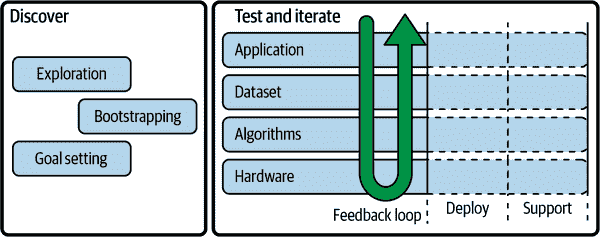
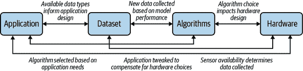

# 第六章：理解和框架问题

接下来的五章提供了使用边缘人工智能的路线图。我们将建立以下最佳实践：

+   通过边缘人工智能的视角查看您想解决的问题

+   构建允许您训练模型和评估算法的数据集

+   设计利用边缘人工智能技术的应用程序

+   通过迭代过程开发有效的应用程序

+   测试边缘人工智能应用程序、部署它们并在现场进行监控

特别是对于本章，我们将首先介绍边缘人工智能项目的高级通用工作流程。这应该让您对如何将所有内容整合在一起有所了解。之后，我们将学习如何评估项目，以确保它们适合边缘人工智能，然后逐步介绍为解决特定问题而选择哪种类型的算法和硬件，以及开始考虑规划我们的实施。

# 边缘人工智能工作流程

与任何复杂的工程项目一样，典型的边缘人工智能项目涉及多条并行运行的工作轨道。图 6-1 将它们放在了背景中。

###### 图 6-1\. 边缘人工智能工作流程，分为“发现”和“测试与迭代”阶段

这个过程大致可以分为两个部分——在图表中标记为*发现*和*测试与迭代*。第一部分，*发现*，涉及深入了解您试图解决的问题、您可用的资源以及可能解决方案的空间。这是您进行前期工作的阶段，找出您想要实现的（以及现实可行的）目标。

第二部分，*测试与迭代*，是一个持续的改进过程，从初始原型到生产就绪应用程序。它跨越开发之前和之后的时间——在机器学习中，您的应用程序永远不会真正*完成*，而是需要在部署到现场后进行监控、支持和迭代。这种持续改进同时发生在项目的所有部分——应用程序、数据集、算法和硬件之间。

在这个过程中最重要的部分是*反馈循环*（参见图 6-2），它实现了持续改进。您在项目的不同方面之间创建的反馈越多，项目的成功可能性就越大。例如，您的模型在不同类型数据上的性能结果可以反馈到数据收集过程中，帮助您构建一个涵盖潜在输入空间的多样且代表性数据集。

在接下来的几章中，我们将覆盖整个工作流程。*发现*阶段在第六章、第七章和第八章中表示，而*测试和迭代*阶段——包括部署和支持——在第九章和第十章中进行讨论。

###### 图 6-2\. 可能的应用程序、数据集、算法和硬件之间的几个反馈循环示例；这四个部分将随着项目的进展而改变和发展，一个方面的任何变化都需要在另一个方面得到体现。

###### 提示

对于任何技术项目的成功（甚至可以说是任何项目的成功），管理风险是至关重要的任务。边缘 AI 项目由于其硬件和软件的结合以及对复杂算法和数据驱动开发的依赖，具有独特的风险性。

在工作流的每个阶段，我们将学习可以帮助您将风险降至最低并提高成功机会的技术。

## 边缘 AI 工作流中的责任 AI

正如我们所学到的，AI 应用程序特别容易传播社会危害。在现实世界中可能导致意外低性能的许多问题类型。这使得对潜在风险及其可能导致伤害的可能性进行仔细分析成为边缘 AI 开发工作流程的关键部分。

在项目开始时进行一次单独的道德审查或在项目结束时进行最终审查是不够的。由于项目过程中将会出现新信息，并且将会做出许多具有下游影响的决策，风险分析需要在整个过程中的每个阶段都进行，以便在需要时进行及时调整。

在本书中，我们将在整个过程的每一步中反思道德设计。您不应将其视为可选的额外部分——这是必要的核心工程和产品管理工作的一部分，对于项目的成功至关重要。与边缘 AI 合作的团队的噩梦情景是，在系统部署到生产后才发现问题。没有人希望对产品召回或实际造成伤害负责。

在开发过程中通过考虑社会因素进行风险分析，我们将最大化在生产之前识别挑战的能力，并提高我们工作的质量。

# 我需要边缘 AI 吗？

人工智能和边缘计算都是复杂的技术，每一个都涉及整个考虑领域。与其中任何一个合作都涉及在能力和复杂性之间进行权衡。对于许多项目来说，复杂性的负担可能超过与它们合作带来的能力优势。

有了这个想法，对于任何潜在的应用程序，了解风险是否值得回报非常重要。答案在很大程度上取决于上下文，包括诸如：

+   应用程序的具体要求

+   将构建它的团队的技能

+   用于工程、数据收集和长期支持的可用预算

+   可用于交付的时间量

在接下来的几节中，我们将详细讨论我们需要问的问题，以便决定项目是否适合边缘 AI 技术。这是一个很好的开始练习，因为它还将为项目发现阶段的许多其他必要考虑提供启示。

###### 警告

虽然尝试寻找边缘 AI 的新机会可能会令人兴奋，但重要的是要开放思维地解决问题，不要假设技术解决方案是正确答案。与其从一开始就试图将边缘 AI 应用于问题中，不如专注于理解问题并设计正确的解决方案来解决它。这个解决方案可能涉及边缘 AI，也可能不涉及。

## 描述问题

描述问题是确定边缘 AI 是否适合解决问题的第一步。您应该试图用几句话和要点总结问题—保持简短并言之有物。一个好的描述应包括：

+   场景的高层次摘要，包括任何现有的解决方案

+   当前面临的问题

+   必须解决的约束条件

在 “深入了解：使用追踪摄像头发现稀有野生动物” 中，我们讨论了边缘 AI 在野生动物监测中的可能应用。以下是我们可能捕捉到的一个用例问题描述示例。

您的问题描述的确切格式并不像内容那样重要。通过捕捉确切的问题和约束条件，我们可以在评估可能的解决方案时考虑它们。

## 我需要部署到边缘吗？

到了这本书的这一点，我们对章节 “理解边缘 AI 的好处，只需 BLERP” 中的模型非常熟悉，用于表达边缘 AI 的好处：

+   带宽

+   延迟

+   经济学

+   可靠性

+   隐私

BLERP 是帮助我们分析问题描述并评估其是否可能从边缘架构中受益的完美工具。做到这一点的好方法是为每个 BLERP 术语创建要点。

为了说明，让我们来探讨 *带宽*：

+   由于成本原因，追踪摄像头无法获得大量带宽。这使得在设备上处理工作变得非常重要。

+   如果我们可以在设备上分析照片，我们可以将生成的信息（比原始图像小得多）发送到云端。

+   这可以帮助避免进入现场收集存储卡的昂贵旅行。

通过思考每个条款的潜在影响，我们开始了解 BLERP 对这个问题的重要性。一旦您完成头脑风暴和总结，您将得到类似下一个 BLERP 分析的内容，取自“深入探讨：使用摄像机监测稀有野生动物”。

在这种情况下，跨多个 BLERP 条款部署边缘可能有明显的好处。在其他情况下，这可能不那么明显——例如，可能并非在每个条款下都有好处。但这并不一定意味着边缘部署不适合。只要在任何一个类别中存在足够强大的好处，都值得进一步考虑。

### 在边缘上表现不佳的事物

在某些情况下，您可能会发现您的问题并不完全适合 BLERP。以下是描述另一个问题的示例。

从描述中可以清楚地看出，这里有一些值得解决的问题：基于成像数据诊断医疗状况对医生来说是一项挑战，患者可能会根据设备或专家的可用性等待诊断结果。也许人工智能可以帮助医生分析图像。

然而，我们需要回答的问题是，是否使用边缘计算来解决这个问题是一个好问题。为了解决这个问题，让我们尝试通过 BLERP（显示在侧边栏中）进行一些潜在好处的头脑风暴。

从表面上看，这些听起来都是令人信服的理由。然而，如果我们深入挖掘一下，很明显大多数这些好处都是可以在*不使用*边缘计算的情况下实现的。因为成像设备位于医院内部，将分析移到潜在资源受限的“边缘”设备上并没有太大好处。相反，我们可以使用标准计算机，无论是连接到医院网络还是云中。¹ 隐私问题可以通过诸如联邦学习等技术来解决，而无需使用任何与边缘人工智能特别相关的工具。

在这种情况下，一个事实是——已经有可靠的网络连接可用，这使得使用边缘计算变得不必要。但为什么不使用呢？在边缘运行计算是否会有所不同？

### 边缘计算的缺点

尽管边缘计算在与人工智能结合使用时可能会带来巨大的好处，但在过去十年中，大多数计算已经转移到云端的原因有很多很好的理由。如果 BLERP 框架没有强调在边缘上进行工作的一些非常好的理由，那么您最好还是在云服务器上进行信息处理。

以下是使边缘应用程序具有挑战性的一些因素：

开发复杂性

编写和维护嵌入式应用程序非常困难，尤其是在较小的目标设备上。您的嵌入式代码越简单越好。即使需要嵌入式设备来收集数据，将更复杂的应用逻辑托管在云端可能也是明智的选择，以简化工程流程。

人员配备

嵌入式开发需要非常具体的技能，虽然云应用可以由多种工程师构建和维护，但寻找嵌入式工程人才可能更加困难。如果您的组织无法获得嵌入式工程人才，将计算资源留在云端可能更为稳妥。

计算资源有限

即使是最强大的边缘设备也远不及具备 GPU 访问权限的强大云服务器。某些应用程序需要大量计算资源，而在现场提供这种计算资源可能并不现实——例如，某些语言模型的大小达到了几个 GB，需要 GPU 才能实现低延迟。

部署复杂性

如果计划在部署后更新应用程序，边缘计算可能会带来一些问题。更新边缘固件可能存在风险——设备可能会因为某个 bug 或不当时的停电而"变砖"。管理安装在设备群中的应用程序版本也可能面临挑战。尽管可以克服这些挑战，但需要投入工程时间。将应用逻辑托管在云端可能更简单，更新起来也更轻松。

硬件和支持成本

部署和支持边缘设备网络可能成本高昂。如果需要带有机器学习工作负载加速功能的高端设备，或者定制用于特定目的的硬件，成本可能会进一步增加。根据应用的不同，使用性能较低的设备收集数据并将其发送到云端进行处理可能更为经济。

灵活性

如果您希望运行的工作负载超出了边缘硬件的能力，或者应用程序发生了重大变化，可能需要购买新硬件来替换旧设备。相比之下，云工作负载可以通过点击按钮进行扩展和修改。

安全性

允许物理访问 AI 算法实现存在一定的安全风险。在某些情况下，云计算可以帮助降低这种风险。本书后面将详细介绍安全性问题。

正如我们在“多设备架构”中看到的，可以将计算分配给边缘设备和云端。这可以是一种有益的方式，特别是当设备部署在可靠连接和电源可用的受控环境中，如家庭或工厂。例如，智能音箱可以通过在边缘进行唤醒词检测来保护隐私，同时仍然从强大的云服务器中获得运行大型、高度复杂的转录和自然语言处理模型的好处。在工业环境中，边缘计算机视觉系统可以在调用云模型之前以极低的延迟识别潜在的制造缺陷，并确定适当的响应。

## 我需要机器学习吗？

正如我们在第一章中学到的，AI 并不总是需要机器学习。作为一个类别，ML 算法具有各种优点和缺点，使它们在某些应用中非常理想，但在其他应用中的效用有限。

###### 警告

在开发过程的早期阶段识别出你的用例是否适合 ML 非常重要。基于 ML 的项目涉及的工作流程大不相同，这将影响你的时间表和预算。

对于给定的边缘 AI 问题，通常需要在机器学习解决方案和基于规则或启发式解决方案之间做出选择。正如我们在“条件和启发式”中学到的，基于规则的系统是由人类使用领域知识设计的。它们可以利用从基本算术到极其复杂的物理方程的任何东西。以下是边缘设备中应用启发式算法的一些例子：

+   水壶在温度达到沸点时自动关闭

+   糖尿病胰岛素泵根据血糖水平分配精确剂量的泵

+   使用传统计算机视觉（参见“图像特征检测”）的驾驶辅助功能，用于识别车道标记并使汽车在其间居中。

+   自动驾驶系统在国际航线上飞行的大型喷气飞机

+   前往火星的太空火箭的导航系统

这些例子从简单到复杂不等，都依赖于领域知识。例如，胰岛素泵的算法基于人类血糖调节系统的知识，而太空火箭的导航系统则基于物理学、空气动力学（至少在部分旅程中）以及车辆的操作特性。

在每种情况下，所涉及的系统都受到严格的规则约束。这些规则可能很复杂，它们的发现可能已经花费了数千年的人类历史，但归根结底，工程师们可以用数学公式相对准确地描述它们。

通常，数字信号处理算法与基于规则的系统结合使用。一点处理可以大有作为，使得可以使用简单的规则对输入做出反应。例如，驾驶辅助功能可能使用 DSP 来进行图像特征检测，将复杂图像转化为表示车道标记的简单向量集。这使得更容易确定是否向左或向右转动汽车。

基于规则系统的优点在于其限制完全可知，这意味着可以证明它们何时有效。启发式算法基于一个被充分理解的系统。可以建立算法在设计模型的基础规则方面的数学正确性。这使它们可靠、可信且安全。

###### 小贴士

如果您的问题有基于规则的解决方案，几乎可以肯定选择它。许多问题可以通过规则和启发式方法以优雅的方式解决，并且它们比机器学习的替代方法更容易开发、支持和解释。它们在计算能力方面要求也通常较低。

ML 听起来很令人兴奋，但在没有明确需求的情况下使用它是有风险的。启发式算法是将人类送上月球的原因之一；你的问题很可能比那还要简单。

不幸的是，并非所有问题都可以通过基于规则的算法解决。回到“条件和启发式”，我们遇到了它们的两个主要弱点：

规则困难到不能被发现。

例如，可能需要大量的研究和开发来发现您复杂、嘈杂、高频传感器数据背后的算法系统。即使可能可以数学描述系统，但在您的预算和时间框架内可能无法达到。

大量变量问题。

例如，可能有太多输入使得基于规则系统变得不可行。这在图像数据中是一个常见问题，它们维度极高且噪声也非常严重。很难编写描述狗外观的方程式。

对于非平凡问题，良好实施的基于规则的算法可能依赖于广泛的研究、领域知识和相关工程技能。这些并不总是适用于给定项目。启发式的弱点为 ML 提供了发光的机会。

### 使用 ML 的理由

虽然基于规则系统通常依赖于它们与之交互的过程的科学理解，但机器学习算法可以通过暴露于数据本身来学习变量之间的关系的近似值。

这肯定可以让生活更加轻松。以下是一些情况，考虑尝试 ML 可能是有道理的顺序：

+   您的情况和数据过于复杂或噪声过多，无法用传统方法建模。

+   需要进行太多的基础研究才能找到基于规则的解决方案。

+   你没有必要实现基于规则的系统所需的领域专业知识。²

如果你发现自己处于这些情况之一，机器学习可以帮助很大。下面的侧边栏提供了一个很好的例子。

事实证明，复杂、嘈杂的数据非常普遍。实际上，大多数现实世界的数据有点混乱！机器学习特别是深度学习模型的优势之一在于，如果提供足够的数据，它们可以学习适应噪声。在训练过程中，模型的参数被调整，以便从数据中滤除噪声，留下重要信息——这些信息可以用来做出决策。

另外，机器学习模型在识别其训练数据中存在的隐藏模式方面表现出色。对于人眼来说是看不见的关系，或者对我们的手工编码规则来说太复杂的关系，在机器学习模型提供足够的训练数据后，可以变得非常清晰。

这些优点使得当面对描述不清晰关系的大量嘈杂数据时，机器学习成为一个不错的选择。然而，机器学习对数据的使用也可能带来一些风险。

### 机器学习的缺点

从工程角度看，机器学习存在三个主要缺点：数据需求、可解释性和偏见。

众所周知，今天的机器学习非常依赖数据。³通常需要大量数据来训练和测试机器学习系统。找到足够的数据并确保其质量是机器学习面临的最大挑战和开支。

数据可能看似充裕——毕竟，我们有填满了几十年物联网传感器数据的“数据仓库”和“数据湖”吗？不幸的是，原始数据并不够。大多数今天的机器学习技术需要经过*标记*的数据，意味着它已被标记为描述其含义的信息。这一繁琐的任务通常由人类完成，这使其昂贵且风险高（因为容易出错）。

另外，机器学习模型只能理解它们之前见过的情况。这使得数据集高度依赖于上下文。如果用不同品牌的数据来训练一个特定类型传感器收集的数据集，模型可能表现不佳。一个国家的典型家庭物品数据集在试图识别另一个国家的物品时可能毫无帮助。

研究正在进行中以减轻这些问题，并取得了令人惊讶的进展，但事实仍然是，机器学习通常需要大量数据。我们将在下一章更多地了解这个主题。

机器学习的第二个重大缺点，*可解释性*，已经在“可解释性和解释性”中提到。虽然有一些高度可解释的机器学习模型，但模型越复杂，确定其作出预测的确切原因就越具挑战性。

这个问题的加剧是因为许多类型的机器学习模型源自统计学，它们并不给出确定性的答案。向基于规则的系统提问，它会给出一个明确的、坚定的回应，其内部运作可以进行双重检查和审查。向深度学习模型提出同样的问题，你会得到一个模糊的概率分布，显示出*潜在*的答案。追溯答案回到系统，你将遇到一团人类理解力无法及的线性代数混乱。

由于它们的概率性质，机器学习模型在处理模糊情况和非明显规则方面表现出色。不幸的是，这也意味着它们的输出具有相同的特性，这对许多应用程序来说是一个挑战。

例如，在医疗技术、汽车和航空航天等领域驱动安全相关设备的代码通常被期望（通过最佳实践和政府监管）是*可以证明*正确的。使用概率模型很难达到这个标准，因为其内部规则只能通过探索和实验得知。

机器学习的第三个重大缺点，*偏见*，是前两个挑战的直接结果。我们在“黑盒子和偏见”中遇到了这个问题。当我们创建机器学习模型时，我们依赖于数据集来训练它们并验证它们的性能。我们的目标是生成一个在现实世界中表现良好的模型。然而，现实世界是一个庞大的地方，在有限的数据集中捕捉到其可能的变化是非常具有挑战性的。

如果我们的数据集只包含所有可能性的一个子集，我们的模型可能无法正确执行其他情况。更糟糕的是，因为在我们的数据集中没有这些其他可能性的任何示例，我们将不知道这实际上是一个问题。我们的模型可能看起来运行良好，实际上却存在重大问题。

更为严重的是，我们的模型不一定会告诉我们它何时遇到麻烦。⁴ 相反，它只会尽力猜测 —— 这可能是灾难性的错误。没有数据来测试它，也没有轻松的方法来分析模型的内部规则并理解可能存在的不足，我们将无法知道是否出现问题，除非我们的应用程序失败。

由于我们永远无法希望在我们的数据集中抽样整个世界，偏见是不可避免的。然而，通过严格理解我们的应用程序，我们可以管理这种风险。然而，在某些情况下，偏见的后果可能非常严重，以至于应用程序根本不适合使用 ML。许多社会所持的价值观认为，不适合将 ML 用于做出某些生死决策，例如由自主武器系统使用所导致的决策。类似地，关于将机器学习用于自动化司法决定（包括判决）的争论也很多。

### 知道何时使用 ML

有一句关于解决问题的常见说法：“如果你只有一把锤子，那一切看起来都像钉子。”机器学习比最闪亮的锤子更加令人兴奋，人们常常试图无处不用它。然而，其复杂性、局限性和固有风险使其在许多情况下并不是一个好选择。Edge Impulse 的首席 ML 工程师 Mat Kelcey 喜欢说“最好的 ML 就是没有 ML”。

使用传统算法解决问题并不丢人。正如我们在“人工智能”章节中所看到的，AI 中的*智能*来自于“在正确的时间知道做正确的事情”。对于你的用户来说，这种知识是嵌入在`if`语句形式中还是深度学习模型中并不重要。

基于这一点，这里有一个检查清单，可以帮助您决定 ML 是否适合您的应用程序：

+   不存在现有的基于规则的解决方案，并且您没有资源去发现一个。

+   您可以访问高质量的数据集或者在预算范围内收集一个。

+   您的系统可以设计为利用模糊的概率预测。

+   您不需要解释系统决策背后的确切逻辑。

+   您的系统不会受到其训练数据之外的输入的影响。

+   你的应用程序可以容忍一定程度的不确定性。

机器学习模型永远不完美。我们之所以使用它们，是因为相比人类智能，它们既便宜又能很好地扩展。一个很大的折衷是，它们可能以出乎意料的方式失败。使用 ML 的决定是关于“它是否足够好？”和“我们能处理它可能产生的错误类型吗？”的问题。

## 实践练习

以下是可能需要使用边缘 AI 的三种场景。针对每一种场景，提出一个问题描述，然后决定是否应该应用边缘计算、机器学习或两者兼而有之。您可能需要进行一些在线研究以充分理解每个场景：

情景 1：施肥应用

一个农产品生产者希望通过减少对农作物施肥的金额和减少环境影响来节省资金。他们不希望简单地在整个田地喷洒肥料，而是希望确定田地中最需要施肥的区域（例如，由于土壤质量的变化），并专门在那些区域施肥。他们可以通过视觉检查生长中的植物来了解是否需要施肥。

场景 2：酒店服务

酒店传统上在白天清洁客房，因为客人可能在外面。然而，如果客人仍然在房间里，他们可能不希望被打扰。一家酒店连锁店希望知道任何客人是否在特定房间内，这样他们的清洁人员就不必敲门，可能会打扰他们。

场景 3：轮胎寿命

车胎会随着时间的推移而磨损，某些类型的磨损可能表明存在机械问题。这种磨损通常在定期维护期间被发现。汽车制造商希望他们的汽车能够自动识别某些类型的轮胎磨损，以便他们可以更早地发现问题。

对于任何这些提示，都没有正确或错误的答案；它们只是提供了一个机会来应用我们迄今为止学到的分析技术。

# 确定可行性

所以，你有一个边缘人工智能项目的想法？你的第一个目标应该是确定它的可行性。有很多事情需要考虑。也许你的项目最好使用服务器端的人工智能，或者也许你的解决方案需要机器学习，但收集数据集并不可行。另外，也许它正是完美的选择！

第一步是尝试为你问题描述中的问题提出一个*理想*的解决方案。如果你试着忘记技术上的限制，高层次地思考，系统应该做什么？

# 先入为主的观念

我们理想解决方案的目的是给我们一个瞄准的目标。如果我们通过认为可行的想法来限制我们的创意搜索，我们可能会错过那些并不立即显而易见但很有前景的解决方案。通过保持*理想*，我们确保不限制自己的创造力。

理想的解决方案还帮助我们避免使用某种技术的诱惑，因为我们对它感到兴奋。这是一个非常常见的陷阱：我们刚刚了解了一些令人着迷的新技术，并一直在寻找一个试用它的借口——因此我们忽视了另一种本应带来更好结果的方法。

一旦我们有了一个理想的解决方案，我们可以从几个角度考虑可行性：

+   道德：是否应该这样做？

+   商业：做这件事是否有价值？

+   数据集：我们有原材料吗？

+   技术：是否可以实现？

对于整体可行性来说，项目需要在所有这四个方面找到最佳点。让我们逐一探讨每个角度，使用一个示例应用来说明。在现实世界中，我们会根据详细的问题描述来制定理想解决方案。为了简化，我们将使用这个简化的陈述。

我们的解决方案无需基于 AI，甚至不一定使用技术。根据具体情境，最佳系统可能是一个人类安保团队。在我们的可行性调查过程中，我们将开始确定合适的人类与技术能力结合的方式，以优雅地解决问题。

## 道德可行性

道德审查是任何可行性分析中最重要的部分之一。由于未考虑技术风险而导致的项目失败可能会浪费大量资金，但由道德问题导致的损害潜力是不可估量的——它很容易会让一家公司声誉扫地，触发惩罚性的监管措施，并直接对人类造成伤害。

“负责任地构建应用程序”介绍了一些可能影响 AI 产品的道德问题。作为可行性分析的一部分，严格探讨和记录可能由您的应用程序引发的任何潜在道德问题至关重要。除了产品本身外，理解来自开发过程的潜在风险也同样重要：数据收集、部署和支持。

这一过程需要您团队的全面参与——由您的道德和领域专家驱动。“多样性”章节中的内容强调了从多个视角获得意见的重要性。

一些关键问题需要问：

+   解决方案可能会对谁造成伤害？ *例如：一些产品（如 AI 武器）旨在直接造成伤害，而其他产品可能通过间接方式或由于与人类利益相关者的疏忽接触而造成伤害。*

+   是否可以在不侵犯个人或社区权利的情况下获取所需数据？ *例如：有些数据集可能无法在不侵犯用户隐私的情况下收集。*

+   是否可能在不损害或侵犯利益相关者权利的情况下测试产品？ *例如：一个提供医疗建议的应用，在测试过程中，如果提供的建议不可靠，可能会造成伤害。*

+   是否已记录潜在风险？如何进行缓解？ *例如：如果一个应用程序产生不正确的预测，可能会造成哪些潜在伤害？*

+   应用程序是否适用于所有潜在用户？ *例如：一个与安全相关的语音检测应用可能对具有地方口音的讲话者效果不佳。*

很难理解项目间接伤害潜力。例如，如果由于人工智能项目而岗位岌岌可危，或者在利润与环境影响之间存在权衡取舍怎么办？拥有广泛的专家顾问团队将帮助您驾驭这些微妙之处。

道德伦理关乎人与过程。减少意外伦理问题风险的一种方法是确保伦理审查由来自不同人群代表性的多样化群体进行，包括专业人士，他们在人工智能系统伦理评估方面具有直接专业知识。

除了您自己的团队，该团队还应包括受产品潜在影响的利益相关者的代表，如“利益相关者”中所述。

虽然可行性分析始于理解道德可行性，但您的长期目标应该是在产品概念化、开发、部署和支持过程中实现持续的伦理审查。在这个阶段进行的工作将通过整个产品生命周期提供帮助。

## 商业可行性

组织问题对项目可行性的影响有两个主要方面。首先，为了使人工智能应用成功，它需要提供明显的好处。在商业背景下，这可能是给客户、管理人员或财务报表带来的好处。在科学背景下，这可能意味着在相同预算下完成更多工作。在任何项目初期，确保如果成功，提议的工作将实际增加真正价值是至关重要的。

其次，组织面临实际限制，这限制了人工智能应用的开发。例如，可能没有足够的预算来收集足够规模的数据集来训练有效的机器学习模型。其他常见的限制包括时间、专业知识和利益相关者的长期支持。

### 证明好处

证明（和展示）边缘人工智能应用的一个特别有效的方式是所谓的*绿野仙踪原型*。在*绿野仙踪*的故事中，主角仙人掌最初被介绍为一个令人印象深刻的超自然存在。然而，后来揭示他只是一个普通人，隐藏在幕布后面，远程控制幻象。

在绿野仙踪原型中，会制作一个人工智能产品的模拟版本。它在表面上是功能性的，但实际上其功能受隐藏的人类行为控制。可以让利益相关者测试和体验这个模拟产品，使人们对它在现实世界中的运作方式有所感觉，并与其他选项进行比较。

这可能是一个非常有帮助的练习。即使在项目的技术部分之外，也可以探索、分析和完善用户体验。如果体验令人印象深刻，这将极大地帮助说服利益相关者认为项目是值得的。如果甚至在人为形式下也无法正常工作，这是一个很好的信号，表明您应该重新审视。

要使任何评估成功，重要的是获得利益相关者对“好”的定义的一致意见。在我们的仓库示例中，这可能意味着设定单个警卫响应入侵所需的最短时间。在测试期间，我们设置了帮助我们监控这些指标的仪器，部署了应用的基线版本（例如，虚假的奥兹巫师应用程序），然后进行评估。

在这个过程中，测试 *当前* 解决方案以及提议的解决方案非常重要。这将清楚地表明所评估的解决方案是否真正有益。这是在开发过程中检查的重要事项，而不仅仅是在开始阶段。

既然我们已经为“好”设定了具体的阈值，甚至可能证明当前解决方案已足够满足利益相关者的需求，这样组织就可以通过*不*采纳基于 AI 的解决方案来节省费用。但如果我们证明有益处，项目就可以自信地继续进行。

### 理解限制条件

当然，除了奥兹巫师原型之外，组织确定新项目的风险、回报和效益的方式有很多种。AI 项目并没有不同，确保您的想法与您所在组织的需求相符将对确保其成功至关重要。

其中一部分是确定您的组织限制条件，并确保它们不会造成任何问题。开发 AI 应用程序时的一些主要限制条件包括：

专业技能

尽管 AI 工程变得越来越容易接触，但在开始之前拥有经验丰富的 AI 专家将有助于降低项目风险。确保您需要的技能在您手边是可用的。

时间表

AI 开发是一个数据驱动的迭代过程，比传统软件工程更具挑战性。确保您有足够的余地处理意外情况，例如在过程的后期发现需要收集更多数据。

预算

AI 开发的三个最昂贵的部分是工资、数据收集和现场测试。如果您是个人或小型组织，训练的计算时间可能会变得显著——尽管通常不会超过几千美元，因为边缘 AI 模型往往很小。

长期支持

正如我们将在第十章中看到的那样，AI 应用需要长期支持才能保持有效性。随着世界的变化，ML 模型和硬编码规则将需要更新和精炼。如果你的项目将会部署超过几个月，了解你的组织是否能够负担得起（并愿意）支持它非常重要。

你是你组织工作方式的专家，你有责任了解它是否能够支持你希望开发的项目。

## 数据集可行性

除了技术可行性外，边缘 AI 应用开发受到可用数据的限制。机器学习以数据需求大而闻名，但即使是手工编码的基于规则的方法，也需要大量数据来开发和测试。⁶

数据收集困难、耗时且昂贵，因此在可行性评估阶段了解项目的数据需求是具有挑战性但至关重要的。理解数据可行性有两个步骤：

1.  估算解决问题所需的数据量

1.  理解你是否能够获得足够的数据

这两个主题都在第七章中有详细讲解。正如我们将要看到的，理解数据需求涉及研究和工程工作。这意味着在项目中投入大量时间之前，你不会知道你的实际数据需求。

在这个阶段，只要有一个大概的想法就可以了，也许基于你通过研究发现的一些先例（正如我们将在第七章中发现的那样）。如果看起来你没有足够的数据，你的项目可能就不可行。在早期阶段排除这一点是至关重要的，以避免开发工作的浪费。

数据问题是 ML 项目失败的主要原因之一，因此如果在可行性检查的这部分中看到负面信号，不要只是抱着侥幸心理希望一切顺利。

## 技术可行性

在第三章和第四章中，我们详细介绍了边缘 AI 最重要的技术。这些材料将是你在尝试理解你的想法的可行性时的一个重要资源。

第一步是将你的想法映射到边缘 AI 概念和方法论中。以下是本书早期出现的一些关键点：

传感器

如何收集你需要的数据？

数据格式

你的传感器将输出什么样的信号？

特征工程

处理原始信号的可用选项有哪些？

处理器

你需要根据成本和能源使用来预算多少计算能力？

连接性

你可以使用哪种类型的通信方式？

问题类型

你是否需要执行分类、回归或其他操作？

基于规则或 ML

是否需要使用机器学习，还是可以采用基于规则或启发式方法？

ML 算法的选择

经典机器学习是否足够，还是需要深度学习模型？

应用架构

您是否需要单个边缘设备，还是需要更复杂的安排？

最后，也是最重要的是，您需要考虑人类因素。您最终的解决方案将是由人和技术共同组成的系统，共同工作。任何技术决策都需要通过人的视角来看待。

到目前为止，现在尝试明确回答所有这些问题还为时过早。相反，理解地去构思几个可能的解决方案是有意义的：先从四五个初步的想法开始，如果容易的话可以捕捉更多。这些想法不必完全深思熟虑，但应该试图捕捉上述的一些要素。

在我们仓库安全环境中的一个示例显示在以下侧边栏中。

### 框定问题

为了全面探索任何 AI 解决方案的技术要求，我们需要能够*框定*我们的问题，即用我们可用的工具来表达我们的问题。在 “算法类型按功能” 中，我们遇到了一系列有用的技术：

+   分类

+   回归

+   目标检测和分割

+   异常检测

+   聚类

+   维度缩减

+   转换

要解决任何问题，我们首先需要将其分解为可以使用这些技术解决的块。一个给定的问题可能需要多种技术来解决。例如，识别未经授权地点的入侵者可能需要同时进行目标检测（用于发现人）和异常检测（用于识别人员在夜间悄悄绕过仓库通道时的异常行为）。

每种技术可能需要不同类型的算法：例如，目标检测可能需要深度学习模型，而异常检测则可以使用经典机器学习。通过将问题分解为这些技术，我们可以更好地理解必须完成的工作的计算负担，这将有助于构思解决方案并帮助确定我们的硬件选择。

任何给定的问题通常可以按多种方式分解（或框定），每种方式都有自己的技术要求。例如，还可能通过降维来发现仓库中的入侵者：我们可以使用嵌入模型描述视野中的任何人员，然后将其嵌入与数据库进行比较，从而识别非员工进入仓库的情况。

这与基于目标检测的系统的技术、数据、业务和道德考虑不同。因此，框定为我们提供了另一个工具，可以探索可能解决方案的空间，并找到适合我们独特需求的东西。

### 设备能力和解决方案选择

对于每个边缘 AI 项目，都有不计其数的硬件选项。例如，我们的仓库安全头脑风暴产生的解决方案可以使用 MCU，在边缘服务器上或在云中实施。每个单独的解决方案都有自己巨大的硬件选择空间——例如，对于基于 MCU 的项目，我们必须从包括数十个硅厂商的列表中选择硬件，每个硅厂商都有数十种芯片，所有这些都可以以无数种方式配置。

从可行性的角度来看，我们需要了解这些硬件选项中哪些是合理的，考虑到我们问题描述中所描述的约束条件。约束条件可能包括成本、内部专业知识、现有的棕地（“绿地和棕地项目”）系统或供应链考虑因素。捕捉这些约束条件将缩小硬件选项的空间和可能解决方案的空间。

在应用约束之后，我们可能会发现没有符合条件的解决方案。例如，在一个棕地项目中，唯一可用的硬件可能没有足够的内存来运行具有适当性能的物体检测模型。

表格 3-1 提供了一个参考，可帮助您了解您的应用是否在可行性范围内，适合您可用的硬件选项。请记住，如果需要更多灵活性，您始终可以将您的应用程序分布在多种设备类型上。我们将在“架构设计”中深入讨论这一点。

## 做出最终决定

在这一点上，我们已经从道德、商业、数据集和技术的角度审查了我们项目的可行性。我们应该有足够的信息来做出决策。如果我们头脑风暴中的任何解决方案看起来都不合适，我们接下来的步骤应该如下：

1.  使用我们在审查过程中确定的新约束条件更新问题描述。

1.  执行新的解决方案头脑风暴，提出一组新的可能解决方案，考虑我们新确定的约束条件。

1.  经过我们的新解决方案的同样可行性审查流程。

就像 AI 中的一切一样，这可能是一个迭代的过程。为了澄清您对约束条件的理解并得出一个有效的解决方案，您可能需要多次重复这些步骤。值得耐心等待，并愿意重新审视您的假设。最终，您可能会得到一个潜在的解决方案，即使它并不是您最初设想的那种。

话虽如此，在某些情况下，您可能根本找不到解决问题的好的边缘 AI 解决方案。如果发生这种情况，请注意原因。也许是出于道德考虑，表明该项目在道德上风险太大而无法考虑。或者，它们可能纯粹是技术性的——这可能意味着在未来某个时间点，随着新硬件和技术的出现，该项目可能变得可行。

无论如何，即使你没有能够找到一个有前景的解决方案，从可行性的角度来探索解决方案空间的过程将是非常有教育意义的。现在，你很可能对这个问题领域，从 AI 的角度来看，比其他任何人都了解得更多了。

如果一个解决方案未通过可行性测试，请抵制继续尝试的诱惑。如果你已经证明这太冒险，试图开发这个项目将导致时间浪费和潜在的危害。

###### 提示

即使知道某个问题没有合理的边缘 AI 解决方案也是有价值的信息；意识到这一点本身就是一种竞争优势。你可能会看到其他组织在追求这个问题上浪费时间，但你将有信心知道他们的努力将会失败，并且你将会在其他方面取得更好的结果。

如果你已经达到这一点，你的项目看起来是可行的，恭喜——现在是时候开始将其变为现实了。

## 规划边缘 AI 项目

边缘 AI 的开发是一个多阶段的过程，涉及迭代开发和潜在无限的任务（如数据收集，作为一个过程永远不会真正完成）。因此，在开发解决方案之前制定计划非常重要。

在“边缘 AI 工作流程”中，我们看到了各种工作流程阶段及其如何通过多种反馈循环相连接。作为一个迭代过程，你可以在每个部分花费任意长的时间。规划的两个最重要的方面是：

+   定义可接受的性能

+   理解时间和资源约束

### 定义可接受的性能

你的规划过程的第一个阶段应该是制定一套具体的标准，以确定你的系统的可接受性能会是怎样的。这必须与利益相关者和伦理分析一起进行，因为性能不佳的系统可能会在这些方面造成风险。

在开发过程中，你的任务是通过迭代过程直到满足关于可接受性能的目标。一旦达到这些目标，你的利益相关者可以自信地签署该项目，知道它运行得足够好。你的目标应该设置得现实——它们需要是可实现的，但也应该以项目能够真正提供价值的方式设置。

我们将学习一些关键的性能指标在“有用的指标”。

### 理解时间和资源约束

理解你拥有的时间和资源约束非常重要，这些资源包括资金、专业知识和硬件。估算开发时间非常困难，尤其是在 AI 项目中更是如此。

由于人工智能开发的迭代性质，传统的瀑布式开发模型将无法很好地运作。相反，您需要在前进的过程中理解和管理风险。一个好的方法是尽快实现端到端的工作能力。

您可以对整个系统及其各个组件进行迭代。您的第一个版本可能是一个“绿野仙踪”原型，使用现成的硬件和简单的逻辑。您可以在此基础上进行迭代，训练一个简单的机器学习模型来取代“绿野仙踪”组件，然后创建一个定制硬件设计。

在整个过程中的每个阶段，您的整个系统都应进行端到端测试，以确定是否符合您定义的性能标准。这样做的一个好处是，它消除了您可能会把所有时间都花在项目的一个阶段上——例如，训练一个模型——而没有留足够的时间进行其他工作的风险。另一个好处是，有时您可能会发现，比您最初设想的更简单的系统已经足以满足您的性能目标。

当我们到达第九章时，我们将更深入地讨论规划的主题。

# 总结

现在我们了解了适用于边缘人工智能项目的一般工作流程，并学习了如何评估问题并生成有希望的解决方案。

在下一章中，我们将继续进行边缘人工智能工作流程的第一部分——收集有效数据集。

¹ 尽管可以认为医院网络上的计算机是边缘设备的一种形式，但许多大型医院拥有现场数据中心，不受边缘计算的典型约束。

² 如我们将看到的那样，领域专业知识在训练和评估机器学习模型中仍然至关重要。然而，基于机器学习的方法潜在地使具有特定问题领域知识的专家能够在不需要在其他领域（如信号处理）寻求过多外部帮助的情况下获得良好的结果。

³ 减少机器学习算法数据需求的努力是机器学习研究中最重要和最吸引人的方向之一。

⁴ 有些技术可以帮助解决这个问题，比如在“异常检测”中提到的技术，尽管它们可能会带来额外的复杂性负担。

⁵ 正如 Bhavik N. Patel 等人在[“人工智能与胸部 X 射线诊断的人机合作”](https://oreil.ly/147IG)中记录的那样（2019 年国家医学图书馆）。

⁶ 即使您正在复制来自教科书的众所周知的算法，您仍然需要通过它来确保您的应用程序能够端到端运行。
