# 第七章：如何构建数据集

数据集是任何边缘 AI 项目的基础。有了一个优秀的数据集，从选择正确的算法到理解硬件要求和评估真实世界性能，工作流中的每个任务都变得更容易，风险也更小。

数据集在机器学习项目中至关重要，数据直接用于模型训练。然而，即使你的边缘 AI 应用程序不需要机器学习，数据仍然至关重要。数据集在选择有效的信号处理技术、设计启发式算法以及在真实条件下测试应用程序时是必需的。

收集数据集通常是任何边缘 AI 项目中最困难、耗时和昂贵的部分。这也是你可能会犯严重且难以检测到的错误，从而使项目注定失败的最有可能的地方。本章旨在介绍当今构建边缘 AI 数据集的最佳实践。这可能是本书中最重要的部分。

# 数据集是什么样子？

每个数据集由许多单独的项目组成，称为*记录*，每个记录包含一个或多个信息片段，称为*特征*。每个特征可能是完全不同的数据类型：数字、时间序列、图像和文本都很常见。这种结构如图 7-1 所示。

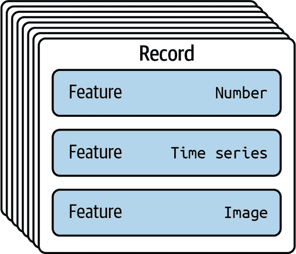

###### 图 7-1\. 一个数据集包含许多记录，每个记录可能包含许多特征；特征可以具有不同的数据类型。

对于数据集的这些组成部分，有许多不同的名称。记录通常被称为*行*、*样本*、*项目*、*示例*或*实例*。特征也被称为*列*或*字段*。¹

许多数据集还包含*标签*，这是一种特殊的特征，指示训练于该数据集的模型的期望输出。例如，分类器返回的类别或对象检测模型返回的边界框。

数据集通常包含一种称为*元数据*的内容。这是描述数据本身的特殊数据。例如，记录可能包含元数据，指示其特征所收集的传感器型号，捕获的精确日期和时间，或组成其特征之一的信号的采样率。

###### 提示

数据集可以以许多不同的方式存储：在文件系统、数据库、云中，甚至是文件柜和纸箱中。

数据集的结构在开发过程中经常会大幅度演变。这可能包括其记录和特征表示的变化。例如，想象一下，你正在构建来自工业机器振动数据的数据集，因为你希望训练一个分类器来区分不同的操作状态。

可以从 10 台不同的机器上捕获 24 小时的数据来开始。在这种情况下，每条记录代表了特定机器的特定时间段。接下来，您可以将这些记录分割成对应于不同操作状态的部分，并添加适当的标签。接着，您可能会对每条记录进行特征工程，创建可以输入到机器学习模型中的额外特征。

# 理想的数据集

理想的数据集具备以下特性：

相关性

您的数据集应包含对您正在尝试解决的问题有用的信息。例如，如果您正在构建一个系统，该系统使用心率传感器数据来估计运动表现，您将需要一个包括心率传感器数据和某种性能指标的数据集。如果您计划使用特定类型的传感器，通常重要的是您的数据集是使用类似设备收集的。如果您正在尝试解决分类问题，重要的是您的数据集包含关于您关心的类别的区分信息。

代表性

要具有代表性，数据集必须包括关于可能在现实世界中遇到的所有不同类型条件的信息。例如，在用于健康监测应用的数据集中，需要包含来自足够广泛的个体的数据，以涵盖可能使用该应用程序的所有不同类型的人群。代表性不足的数据集会导致偏见，如在“黑匣子和偏见”中所述。

平衡性

除了仅仅具有代表性外，理想的数据集还包含了来自所有相关类型条件的良好*平衡*信息。许多类型的机器学习算法在使用平衡数据集时效果最佳，包括深度学习模型。

例如，在美国，有 76%的通勤者使用汽车上下班，而只有 10%的通勤者使用自行车。²如果我们要训练一个模型来计算穿过城市的车辆数量，使用相等量的汽车和自行车数据是很重要的——尽管自行车只占少数。否则，模型可能会更擅长识别汽车而不是自行车。这是偏见进入系统的另一种常见方式。

可靠性

理想的数据集应该保持持续的准确性。它应尽可能少地包含错误，即使有错误，也应均匀地分布在数据中，而不是集中在某些类别中。³ 如果数据中存在噪音（这在传感器应用中很常见），则应该是与真实世界条件下存在的相同类型和大小的噪音。例如，我们可能希望使用音乐样本数据集来训练一个分类模型，以识别不同的音乐流派。在我们的数据集中，每个样本都正确标记了流派，并且样本包含与预期的真实世界条件中相似数量的背景噪音。

良好格式化的

同一数据可以以许多不同的方式进行格式化。例如，图像可以以无限种不同的格式、分辨率和色彩深度表示。在理想的数据集中，数据以最适合您使用的方式进行格式化。至少，数据集在其样本中应具有一致的格式。

良好记录的

理解数据集的来源、采集方式以及所有字段的含义至关重要。如果没有这些信息，您将无法确定数据集是否符合您的需求。例如，假设您希望使用来自互联网的传感器数据集。没有良好的文档，您将无法确定数据的相关性：它可能来自与您打算使用的传感器不等效的传感器。

适当大小的

机器学习模型可以学习几乎任何系统中的隐藏规则，只要它提供足够的数据。例如，您可能希望使用加速度计数据来训练一个模型来识别不同类型的网球击球方式。如果数据集仅包含每种击球方式的少数样本，模型可能难以学习每种击球方式的一般表现。为了概括，可能需要更多的每种击球类型的样本——数量越多越好。

然而，更大的数据集会导致更长的训练时间，并且从技术角度来看，处理起来更加困难。此外，不同的问题需要不同数量的数据来解决，因此对于每个项目来说，进一步收集数据会遭遇收益递减的情况。您的目标应该是收集足够的数据来解决您的问题。

如果您主要用数据集进行测试（而不是训练模型），您可以使用较小的数据集，但重要的是数据集足够大，以代表性和平衡性。

正如您可能预期的那样，创建一个具有所有这些理想特性的数据集是棘手的。在构建数据集时，您可能需要进行一些工作来使其符合要求。

# 评估数据集

在实验室中构建和测试边缘 AI 系统需要一种类型的数据集，而在*真实世界条件*下评估其性能可能需要另一种。第十章将介绍几种评估边缘 AI 系统的方法，并解释如何收集任务所需的正确类型的数据。

每个 AI 项目都涉及将领域专业知识从人类思维中提炼到计算机系统中的过程。构建数据集的过程是这项工作的主要部分。它必须以谨慎、目的明确和深思熟虑的方式进行。好消息是，如果你做对了，成功的机会将大大增加。

# 数据集和领域专业知识

领域专家，也称为主题专家（SMEs），是那些对你试图解决的问题有深入了解的人。无论是什么领域，总有些人对其进行了深入的研究、经验积累并彻底了解该主题。

在解决问题领域中，将领域专业知识视为与处理 AI 算法、信号处理、嵌入式工程或硬件设计所需知识可能不同是很重要的。虽然领域专家可能也具备这些领域的技能，但某人是机器学习专家并不意味着他们自动具备设计 AI 系统解决任何问题的资格。

举例来说，想象一下，你正在为医疗市场构建一款边缘 AI 产品。除了硬件和软件工程师以及精通构建 AI 应用的人员⁴，你的团队还需要包括真正理解你试图解决的医疗问题的领域专家。否则，你将面临建造一个不符合预期工作方式的产品的风险。

数据集和领域专家密切相关。每个 AI 产品都反映了用于开发、训练和测试它的数据集。当产品使用机器学习时，算法直接由数据决定。但即使是手工编码的算法，其表现也取决于用于测试它们的数据。

这意味着你整个项目的结果由你数据集的质量决定。此外，你组织中唯一有资格*理解*这种质量的人就是你的领域专家。他们对你试图解决的问题的深刻了解必须指导数据集的构建和策划。无论你团队中有多少有才华的数据科学专家，如果他们没有对手头问题的适当见解，他们的技能都将是多余的。

本质上，你的数据集在你的产品和组织中作为领域专业知识的主要向量。由于它是使用领域专家的知识构建的，最终它成为了他们知识的数字形式表现——几乎像一个应用程序编程接口(API)，提供对他们捕获的见解的访问。

这种编码知识将被您团队的其他成员用来帮助构建您的应用程序。例如，负责您算法的工程师将使用数据集来调整或训练它们，而负责测试您应用程序的人将使用它来确保它在您需要的所有情况下都能正常运行。

所有这些都使得您必须有足够的领域专业知识。此外，由于您的领域专家不一定是构建和评估数据集的专家，您将需要他们与具有数据科学技能的团队成员密切合作。合作建立有效的数据集是必要的。

但是如果您没有获得领域专业知识怎么办？答案很坦率，也许会不受欢迎。如果您的团队在您的问题领域缺乏专业知识，那么试图构建一个产品将是不负责任的。您不仅缺乏构建有效产品的知识，还缺乏理解是否构建了一个*无效*产品的洞察力。

# 数据、伦理和负责任的人工智能

您的数据集的质量将比任何其他因素更多地塑造您的应用程序的社会影响。不管您如何用心去调查围绕您的项目的伦理问题，并设计一个既有利于人又安全的应用程序，您的数据集的限制将决定您理解和避免无意伤害的能力。

从负责任的人工智能的角度来看，您的数据集提供了两个核心要素：

+   您试图创建的算法系统的原始构建材料

+   理解系统性能的最有力工具

您的数据集是您的系统旨在与之交互的真实世界情况的唯一详细表现。您整个应用程序开发反馈循环都受它的调节。作为原始的构建材料，如果您的数据集在任何方面有所不足，将不可避免地导致您的系统表现不佳。更糟糕的是，同样的缺陷将影响您理解—甚至注意到—系统性能不佳的能力。

对于边缘人工智能项目来说，尤其如此，因为它们的边缘部署性质意味着很难在现场捕捉关于它们在进行中的表现的信息。您的数据集往往代表了您唯一的机会来以真正的精度评估您的模型性能。

有了这个想法，花足够的时间确保这一部分做得正确至关重要。

这场悲剧突显了数据集构建中最大的挑战之一。现实世界的变化多种多样到近乎荒谬的程度。有着接近无限种类的人类、自行车、塑料袋、道路和光照条件。一个数据集不可能捕获到所有这些事物的可能组合。

此外，有许多可能的变体组合，即使领域专家也可能不了解其中一些。例如，即使是城市交通专家被要求识别自动驾驶数据集中需要包含的关键对象，他们可能没有考虑到包裹着塑料袋的自行车的情况。

## 最小化未知因素

正如唐纳德·拉姆斯菲尔德（Donald Rumsfeld）臭名昭著的一句话中所说，在数据集创建中存在“已知未知”和“未知的未知”。建立有效数据集的唯一方法是尽量减少这两者。有两种主要方法可以做到这一点。

第一种，也是最有效的方法是限制模型将要交互的情境范围。一个通用的自动驾驶系统可能被视为数据集构建的噩梦场景。自动驾驶汽车必须在杂乱的现实中穿行，从城市街道到乡村道路，几乎遇到任何可以想象到的情况。你不可能构建一个代表所有这些多样性的数据集。

相比之下，考虑一个受限于高尔夫球场内驾驶的自动驾驶高尔夫车。虽然它仍然可能在球场上遇到自行车，但这种可能性很小——因此，可能更容易构建一个代表正常使用情况下的典型环境的数据集。对于自动驾驶汽车来说，限制范围的原则可能会指导您将车辆操作限制在算法训练的地理区域内。

第二种避免未知因素的方法是提高你的领域专业知识。对于一个情境有更多专业知识可用，可能会减少“未知的未知”。如果 Uber 雇用了更有效的城市交通专家小组来帮助构建和评估他们的数据集，他们可能会避免一场悲剧。

在实际层面上，我们也可以从这一见解中得出一个明确的规则：我们不应在缺乏领域专业知识的情况下为真实世界的应用构建边缘 AI 应用程序。没有领域专业知识，领域的“未知的未知”规模是不受限制的。几乎可以保证我们会遇到它们。

## 确保领域专业知识

现在存在的惊人工具大大降低了训练机器学习模型的门槛。不幸的是，这种情况会诱使开发人员在缺乏领域专业知识的领域构建应用程序。

在 COVID-19 大流行期间，成千上万的研究人员和工程师设计了项目，旨在使用医学影像诊断感染。2021 年发表在*自然机器智能*（5）上的综述识别了 2,212 项此类研究。其中只有 62 项通过了质量审查，没有一个模型被推荐用于潜在的临床使用。发现的主要问题如果能应用临床和机器学习领域的专业知识可能本可以解决。

学术界的同行评审系统为分析和批评试图用 AI 解决问题提供了机制。然而，在工业界没有这样的系统。模型部署在黑盒系统内部，没有随附的文档，并允许与真实世界系统直接交互而无监控。这极大地增加了灾难性问题进入生产的可能性。

我们在边缘 AI 领域工作的人有责任为保证适当的质量建立系统，既在组织内部又通过组织间的协作。重点放在数据集质量和相应的领域知识部署在任何严肃努力的核心。

# 数据中心化机器学习

传统上，机器学习从业者专注于选择最佳的特征工程和学习算法组合，以在特定任务上获得良好性能。在这个框架中，数据集被认为是固定的元素，很少在基本清理之外进行操作。它们提供输入和正确性参考，但不被视为需要调整和微调的东西。

近年来，越来越多的人意识到数据集不应被视为静态对象。数据集的构成对于训练在其上的模型性能有很大影响，从业者已经开始修改数据集以在任务上获得更好的性能。

这种新的思维方式被称为“数据中心化机器学习”。在数据中心化的工作流中，更加注重改进数据集的质量，而不是调整算法参数。

数据中心化的机器学习遵循古老的计算原则[“垃圾进，垃圾出”](https://oreil.ly/NJ8I2)——即如果提供的输入质量低劣，期望计算机程序做出良好决策是不合理的。

数据中心化的工作流和工具帮助开发人员了解其数据的质量及如何解决其中的问题。这可能包括：

+   修复或删除错误标记的样本

+   移除异常值

+   添加特定数据以改善表示

+   重新取样数据以改善平衡

+   添加和移除数据以解决漂移问题

承认所有这些任务都需要领域知识是很重要的。在某些方面，向数据为中心的机器学习的转变是承认领域知识在从机器学习系统中获得满意性能方面的重要性。

###### 注意

漂移是指现实世界随时间变化的概念。数据集和模型必须不断更新以应对这一变化。我们将在本章稍后详细讨论漂移。

数据为中心的方法认为数据集是需要定期维护的活体实体。这种维护是值得的，因为它既减少了训练有效模型所需的算法工作量，又减少了所需的数据量。一个质量高的数据集与较少样本通常比一个具有更多样本的低质量数据集优越。

成功的现实项目通常将数据为中心的方法与自动发现有效算法参数的现代工具结合起来（例如我们在“自动化机器学习（AutoML）”中了解到的 AutoML 系统）。在提供高质量数据的情况下，这些工具可以很好地探索设计空间，并提出有效的模型。

这本书推荐的方法是这样的。它赋予领域专家专注于反映其专业领域的数据，同时将算法调优的苦力工作交给自动化系统。这些自动化系统依赖高质量的数据来评估模型，并选择最适合任务的模型。通过专注于数据集的质量，开发者同时改进了系统的原始输入和评估机制。

# 估算数据需求

在边缘 AI 项目的初始阶段，人们经常问的最常见问题是：“我需要多少数据？”不幸的是，这并不是一个简单的问题。数据需求因项目而异巨大。

通常，机器学习项目的数据需求远高于仅依赖信号处理、启发式和其他手工编码算法的项目。在这些情况下，您主要将数据用于测试——因此，虽然您仍需要足够的数据以保证数据集的代表性，但不需要像许多机器学习算法所需的大量每种类型条件的示例。

理解问题的数据需求最佳方法是寻找先例。是否有解决这类问题的示例，可以让您对所需数据量有所了解？

在这方面，网络是您的最佳伙伴。快速搜索将找到科学论文、基准测试、开源项目和技术博客文章，这些资源可以提供大量见解。例如，网站 [Papers with Code](https://oreil.ly/P8opj) 有一个“最新技术”部分，列出了各种任务的基准数据集以及它们随时间的性能。

如果我们正在开发一个关键词识别应用程序，我们可以查看[Google 语音命令数据集的结果](https://oreil.ly/OuLiV)，在撰写本文时，其准确率已达到 98.37%。深入研究[数据集本身](https://oreil.ly/gLy_i)告诉我们，该任务涉及对 10 个关键词进行分类，数据集中每个关键词有 1.5-4k 次语音发声。如果我们的任务足够相似，这些数字可以给我们一个大致需要多少数据的估计。

另一个好主意是探索您的问题领域中专门设计用于少量数据工作的工具。深度学习模型可能尤其对数据需求严苛：是否有经典的机器学习替代方案可以适应您的用例？如果您的问题需要深度学习，是否有任何预训练的特征提取器可用于通过迁移学习适应您的用例，或者您是否可以使用现有数据集训练一个？

例如，在关键词识别领域，哈佛研究人员的一篇论文[“任何语言的少样本关键词识别”](https://oreil.ly/3conT)（Mazumder 等人，2021 年）提供了证据，表明关键词识别模型只需五个示例和一个大得多的数据集来验证其性能。

表 7-1 提供了一些常见任务训练机器学习模型所需数据量的相对指标。

表 7-1\. 常见任务的数据需求

| 任务 | 相对数据需求 | 备注 |
| --- | --- | --- |
| 时间序列分类 | 低 | 数字信号处理可以完成大部分繁重工作，使得这一任务更容易训练。 |
| 时间序列回归 | 中等 | 由于更精细的标签，这比分类更具挑战性。 |
| 非语音音频分类 | 中等 | 需要多样化的数据来考虑背景噪声和环境声学的多样性。 |
| 语音音频分类 | 低或高 | 通常需要大量数据，但新的少样本技术可以减少这一需求。 |
| 在可见光谱中的图像分类 | 低 | 使用在公共数据集上训练过的模型进行迁移学习使得这一任务相对简单。 |
| 在可见光谱中的目标检测 | 中等 | 虽然可以进行迁移学习，但这比分类更具挑战性。 |
| 非可见光谱的视觉模型 | 高 | 通常不提供迁移学习，增加了数据需求。 |

记住，即使是这些相对需求也是非常粗略的——它们可能因项目而异，这就是为什么很难给出确切的数量。随着新的工具和技术的出现，数据需求将继续发展。任务越常见，就越有可能有信号处理或学习技术可以帮助减少数据需求。

在机器学习中最大的数据集是用于从头开始训练语言模型的大规模文本数据集。这通常不是边缘 AI 中必须处理的任务，这限制了我们需要处理的数据集的上限。

## 一个估算数据需求的实用工作流程

在我们的初步研究之后，下一步是找出工具并开始做一些实验。我们的核心任务是了解在足够的数据情况下，我们选择的特征工程和机器学习流程能否达到足够好的结果。

这项任务自然成为应用开发迭代方法的一部分，我们将在第九章中更详细地介绍。现在，我们将以高层次概述相关任务。

###### 注意

为我们的项目定义“足够好的结果”是一个重要的步骤，将在“方案范围”中探讨。

这里是估算数据需求的基本过程：

1.  捕捉和细化一个小数据集。为了有效地估算数据需求，这个数据集应该满足本章前面描述的理想数据集的所有要求，除了适当的大小。本章的其余部分将帮助您了解将其整理成良好形状所需的过程。

1.  根据你对潜在模型类型的研究，选择一个候选模型。从最简单且合理的模型开始是个好主意，因为简单的模型通常最容易训练。不要陷入只想尝试热门新技术而不排除简单且优雅替代方案的陷阱。

1.  将数据集分成多个大小相同的块。每个块应该具有接近原始数据集的平衡和分布。为了实现这一点，您应该使用分层随机抽样。⁶ 开始时大约有八个块。

1.  在数据集的一个块上训练一个简单的模型，并记录结果的性能指标。使用超参数优化工具可能会有所帮助，正如在“自动化机器学习（AutoML）”中描述的那样，以排除超参数选择的影响。

1.  将另一个块添加到您的训练数据中，这样它现在由两个块的数据组成。再次从头开始训练同样的模型（如果决定使用超参数优化，则继续使用），并再次记录指标。

1.  继续这个过程，添加一块数据，训练模型，收集性能指标，直到使用整个数据集。

1.  在图表上绘制性能指标。它会看起来像图 7-2 中的一个图表。

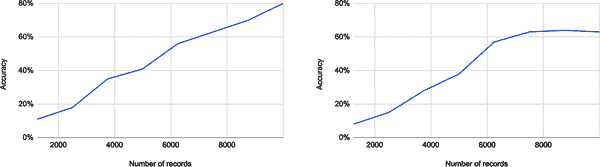

###### 图 7-2\. 每个图表显示性能指标（在本例中为准确性）随记录数的变化。左侧的图表显示添加更多数据可能会导致更好的性能的情况。右侧的图表显示平台期：添加更多相同类型的数据不太可能导致性能显著改善。

在两个图表中，我们可以看到每次添加更多数据时模型的性能都会提高。通过观察曲线的形状，我们可以理解新样本对性能的影响。在左侧的图表中，曲线表明如果我们继续添加数据，性能很可能会继续提高。趋势线提供了一个大致估算所需数据量的方式。

在右侧的图表中，我们可以看到模型已经达到了性能平台期。添加更多相同类型的数据不太可能产生任何效果。在这种情况下，也许值得测试不同的机器学习模型或算法，或者尝试改进我们的特征工程。您还可以考虑通过提高数据集的方式来改进，而不仅仅是增加其大小：也许它包含了大量可以减少的噪声。

当然，这种技术完全依赖于我们数据集是“理想的”这一假设。实际情况是，您的数据集可能存在问题，而您的特征工程和机器学习算法的限制可能会导致随着数据的增加，实际性能无法与趋势线匹配。然而，获得一个大致的数字仍然是有用的——它可以帮助您计划收集更多数据的工作量。

这种技术 *不* 会告诉您您的数据集是否具有代表性、平衡或可靠性。这些部分完全取决于您自己。

# 获取您手上的数据

构建高质量数据集的挑战的一大部分是数据来源本身。以下是一些典型的获取数据的方式：⁷

1.  从头开始收集全新的数据集

1.  将数据收集外包给另一个团队或第三方

1.  使用来自公共数据集的数据

1.  从合作伙伴或合作者处重新利用现有数据

1.  从内部数据存储重新利用现有数据

1.  从先前成功的 AI 项目中重用数据

正如您所见，有多种潜在的选择。然而，对于特定的项目来说，不太可能所有这些选择都可用。例如，如果这是您的第一个边缘 AI 项目，您可能没有任何现有数据可重新利用。

每个数据源代表两个重要事物之间的不同权衡：质量问题的风险和努力（转化为成本）。图 7-3 显示了它们的比较情况。

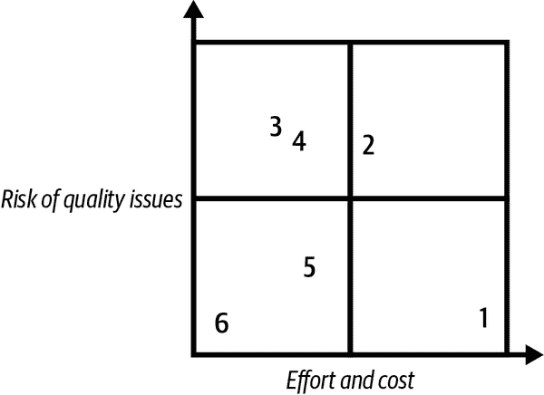

###### 图 7-3\. 按质量风险和努力/成本组织的数据源。

你对数据收集过程的控制越多，就越能保证质量。到目前为止，最佳选择是能够重复使用你过去成功使用过的数据（6）。如果你有幸能够选择这个选项，你已经知道数据的质量，不需要投入太多精力才能重复使用——只要它保持相关性。

组织通常会有现有的数据存储，可以重新用于 AI 项目（5）。在这些情况下，有可能了解数据的质量，因为它是在内部收集的。然而，可能需要一些工作将其整理成 AI 项目所需的形式。例如，制造商可能已经使用现有的物联网系统收集机器数据。在这种情况下，了解数据的来源和收集技术有助于降低风险。然而，这些数据可能并非现成可用，通常需要进行一些清理。现有数据通常缺乏标签，添加标签的成本较高。

数据往往可以从合作伙伴组织或合作者处获得（4）。在这种情况下，由于其他人已经收集了数据，无法保证质量——可能需要进行一些清理才能使其可用。

对公共数据集（3）也是如此，这些数据集通常用于学术研究。公共数据集的优势在于经过多人审核，可能有有用的基准可用，但它们往往要么由低质量数据源拼凑而成且包含大量错误，要么非常小。可能需要进行大量清理才能使用，且可能存在未记录或明显的偏见。⁸

将数据收集外包给你组织中的另一个团队或第三方公司（2）可能是可行的——存在一些公司专门提供数据收集和标记的服务。虽然理论上你对数据收集过程有很大控制权，但仍存在显著风险，因为很难保证第三方会遵循正确的程序。这通常是一种昂贵的方法。

最低风险的方法是亲自动手收集数据（1）。当设计数据集和算法的人与领导数据收集工作的人是同一批人时，误解或未检测到的错误的风险将被最小化（假设他们具备必要的领域知识来做好这项工作）。不幸的是，这也是最昂贵的方法。

## 捕捉边缘数据的独特挑战

使用情况越普遍，您可能越有可能找到易于访问的经过质量审核的数据集。这对许多边缘应用来说是个难题，因为有大量的利基用例和外来传感器。此外，商业实体不倾向于共享其数据集，因为它们代表潜在的竞争优势。

如果您需要收集自己的数据，那么需要解决一些具体的挑战：

连通性和带宽

在带宽和连接性有限的应用中经常使用边缘计算。这意味着在现场收集数据可能会很困难。例如，如果您正在为监控农场动物移动而建立一个 AI 摄像头，您可能希望从田野中收集动物的图像。然而，由于许多农场的偏远位置和缺乏连接性，这可能是不可能的。

要解决这个问题，您可以临时在现场安装网络硬件（例如，在偏远地区可能会使用卫星连接）—或者依赖于*sneakernet*功能。⁹ 这非常昂贵，但可能只需要在项目开始阶段暂时完成。

棕地硬件

正如我们在“绿地和棕地项目”中学到的那样，将边缘 AI 应用部署到现有硬件上是相当普遍的。不幸的是，该硬件并不总是设计用于数据收集。为了成功进行数据收集，棕地硬件需要足够的内存来存储样本，足够的网络能力来上传它们，并且足够的能源预算来允许该过程频繁发生。

要解决这个问题，暂时在现场安装更适合收集数据挑战的新硬件可能是有意义的。专用的工业[数据记录仪](https://oreil.ly/3qfG1)专为此目的而设计，而像[Arduino Pro](https://www.arduino.cc/pro)这样的工业级快速物联网开发平台也很方便使用。

绿地硬件

如果边缘 AI 项目涉及创建新硬件，则可能要过一段时间才能获得可用的工作硬件。这可能是一个重大挑战，因为在硬件开发过程中与数据集和算法开发并行进行非常重要。甚至在完成一些算法开发之前，很难知道需要什么样的硬件。

在这种情况下，尽快获取一些代表性数据非常重要。类似于棕地案例，可能有必要使用快速的物联网开发平台开始收集数据，即使在生产硬件准备好之前也是如此。

传感器差异

有时，目前在现场可用的传感器硬件可能与您计划在新设备中使用的硬件不完全相同。在某些情况下，甚至传感器的放置位置可能有足够的不同，会引起问题。

如果你怀疑传感器差异可能是一个挑战，你应尽早评估传感器数据并确定其是否足够不同以造成问题。如果是这样，你可以使用与处理不充分的既有硬件类似的方法推荐的方法。

标记

在处理边缘 AI 数据时，最大的挑战之一是标签的可用性。例如，假设你正在收集农场动物耳标上的加速度计数据，目标是对其在进食、行走和睡眠之间的时间分配进行分类。即使在收集原始传感器数据相对容易的情况下，将这些数据与动物的实际活动相关联可能是具有挑战性的。如果你已经能够使用数据识别动物的活动，那么你的项目可能就没有必要了！

为了解决这个问题，你可以尝试收集在设计设备正常操作期间可能不可用的额外数据。例如，在初始数据收集期间，你可以选择同时收集加速度计数据和显示动物活动的摄像机视频，并为两者都标记时间戳。然后，你可以使用视频来帮助标记数据。

# 存储和检索数据

当你开始收集数据时，你需要一个地方来存储它。你还需要一个机制，将数据从设备传输到数据存储中，并从数据存储传输到你的训练和测试基础设施。

存储需求因预期数据集大小而大不相同。数据量越大，解决方案就需要越复杂。尽管如此，边缘 AI 数据集通常相对较小，不太可能需要设计用于大规模操作的技术。

在选择解决方案时，最好选择尽可能简单的解决方案。如果你处理的数据量可以轻松适应单台工作站，那么没有必要投资于高级技术。对于便利性而言，你对数据的直接访问越便捷，探索和实验的效果就越好，所以从便捷性的角度来看，最理想的选择总是你的本地文件系统。

表 7-2 提供了各种数据存储解决方案的快速参考，以及每种解决方案的优势和劣势。

表 7-2\. 数据存储解决方案

| 存储类型 | 优势 | 劣势 |
| --- | --- | --- |
| 本地文件系统 | 快速、简单且易于操作 | 没有 API、没有备份、没有分布式训练；最大容量仅为几 TB |
| 网络或云文件系统 | 可供多台机器访问；可以存储大规模数据集 | 比本地文件系统慢；挂载设置复杂 |
| 云对象存储 | 读写数据的简单 API；可以实现大规模存储 | 必须下载数据才能使用 |
| 特征存储 | 数据可以进行版本控制和跟踪；可以存储元数据；可以查询数据 | 必须下载数据才能使用；比简单存储更复杂且更昂贵 |
| 端到端平台 | 特别为边缘 AI 设计；内置数据探索工具；与数据捕获、训练和测试紧密集成 | 比简单存储更昂贵 |

存储在本地文件系统上的数据非常容易使用，并且可以非常快速地访问。即使在使用复杂的云存储时，数据通常也会在训练模型之前复制到本地文件系统。

但是，在没有备份的情况下将所有宝贵数据存储在单台机器上是有风险的。如果数据需要多人访问，这也很不方便。网络共享，包括基于云的文件系统——如 Amazon FSx、Azure Files 和 Google Cloud Filestore——可以解决这个问题。但是，要访问它们相对复杂——它们必须作为驱动器挂载在操作系统中。

云对象存储服务——如 Amazon S3、Azure Blob Storage 和 Google Cloud Storage——提供了 HTTP API，使得数据的进出变得更加简单。这些 API 甚至可以被嵌入式设备使用，从边缘上传数据，假设硬件足够能力。然而，它们的访问速度比驱动器挂载慢，因此通常在使用之前会将数据下载到本地磁盘。

特征存储是数据集存储的一个相对新的趋势。它们旨在提供简单的数据访问和存储 API，以及数据版本控制和查询数据等附加功能。主要提供者的特征存储包括 Amazon SageMaker Feature Store、Azure Databricks Feature Store 和 Google Cloud Vertex AI Feature Store。你还可以在自己的基础设施上托管开源等价物，如 Feast。

现在有几个专门设计用于创建边缘 AI 应用程序的端到端平台。其中一些包括他们自己的数据存储解决方案。这些通常相当于特征存储，但其设计专门用于边缘 AI 项目。它们可能包括用于探索和理解传感器数据的工具，或者提供与嵌入式软件开发工具的集成点。它们被设计为与深度学习工作流程的其他阶段紧密集成。我们在“工具”章节中学到了更多关于这些工具的信息。

## 将数据存入存储中

如果你正在为一个项目捕获传感器数据，那么如何将其存储到你的数据存储中？答案取决于你的具体情况：

现场连接良好

如果你有足够的连接性、带宽和能量直接从边缘设备发送数据，你可以将数据直接推送到 API 中。如果你使用的是为边缘 AI 专门设计的端到端平台，并且其 API 专门设计用于设备上使用，则这样做最容易。

另一个很好的选择是使用物联网平台。您可以使用其专门构建的 API 将数据上传到平台，然后使用另一个系统将数据从物联网平台复制到您的数据集中。

直接从嵌入式设备上传数据到云对象存储不是一个好主意。因为这些 API 并不是为嵌入式使用设计的，它们倾向于使用效率低下的数据结构，而它们的客户端库可能无法适应小型目标。在使用嵌入式 Linux 设备时，这个问题较小，因为它们具有更大的功能和对完整操作系统的访问权限。

现场连接性差或无连接性

如果您缺乏良好的连接性，或者能量预算不足以从网络边缘发送数据，您可能需要安装一些硬件，允许数据在边缘存储并定期收集。

这可能意味着修改您现有的硬件以增加数据存储。这也可能意味着添加另一个独立系统，放置在附近，能够接收并存储由生成数据的设备产生的数据。这个独立系统可以配备更好的连接性，或者可以定期物理收集数据。

## 收集元数据

正如我们之前学到的，理想的数据集需要有良好的文档记录。在设计数据收集系统时，您应该确保尽可能多地捕获有关数据收集环境的上下文信息。

此附加信息，即元数据，可以与传感器数据本身一起包含在您的数据集中。它可能包括诸如：

+   捕获数据的日期和时间

+   收集数据的具体设备

+   使用传感器的确切型号

+   设备在数据收集站点上的位置

+   与数据收集相关的任何人员

元数据可以涉及整个数据集，其任何子集，或者单个记录本身。文章[“数据集数据表”](https://oreil.ly/8cF1f)（Gebru 等人，2018）定义了一种收集描述数据集及其记录子集的文档的标准。尽管这非常有价值且应被视为最佳实践，但在更结构化、粒度更细和可机器读取的基础上收集元数据也具有重大好处。

在许多情况下，您将收集与个体实体相关的数据样本。例如，您可能正在监测特定机器的振动，捕获特定人类发言的关键词样本，或者记录个体农场动物的生物信号数据。

在这些情况下，关键是尽可能多地捕获有关每个单独实体的相关元数据。例如对于一台机器，您可能会捕获：

+   精确的制造和型号

+   机器的生产周期

+   机器安装的地点

+   机器正在使用的工作

对于一个说关键词的人，您可能会尝试捕捉可能影响其语音的任何可想象的属性。例如：

+   身体特征，例如年龄、性别或医疗条件

+   文化特征，例如口音、种族或国籍

+   个人特征，例如职业或收入水平

您应该将这些元数据附加到与之相关的各个样本上。这将允许您根据元数据将您的数据集分成子组。您可以利用这种能力来深入理解两件事：

+   在算法开发过程中，您将了解您的数据集的组成以及您缺少代表性和平衡的地方。

+   在评估您的系统时，您将了解到在数据集的子组中，您的模型存在的弱点。

例如，想象一下，您正在训练一个检测机器故障的模型。通过分析您的元数据，您可能会发现您的大多数数据样本来自特定生产批次的机器。在这种情况下，您可能希望收集来自其他生产批次的数据，以改善数据集的代表性。

在另一种情况下，您可能会使用关键词数据集来评估关键词检测模型。通过交叉引用模型在不同数据样本上的表现与样本的元数据，您可能会发现模型在来自年长者的样本上表现更好。在这种情况下，您可能希望收集更多来自年轻说话者的训练数据，以改善性能。

通过这种方式，元数据有助于降低风险。如果没有样本级元数据，您将对数据集的构成和模型在其中不同组别的表现方式一无所知。当您掌握了关于数据来源的详细信息时，您能够构建更好的产品。

# 确保数据质量

在本章的早些时候，我们列出了理想数据集应具备的属性：

+   相关

+   代表性

+   平衡的

+   可靠的

+   格式良好

+   良好文档化

+   适当大小的

正如我们在“数据中心机器学习”中学到的，高质量的数据集既减少了所需数据量，又减少了算法选择对创建有效系统的影响。当机器学习系统使用良好的数据进行训练和评估时，它们更容易获得有用的结果。

但是，了解数据集质量的最佳方法是什么？事实上，这归结于领域专业知识。如果您对解决的问题领域有深刻的见解，您将能够利用这些见解来帮助评估您的数据。

## 确保代表性数据集

数据集最重要的属性是其代表性。这是因为 AI 算法的目标是模拟真实世界的情况以做出决策。它学习真实世界的唯一机制就是用于训练或设计它的数据集。这意味着如果数据集不具代表性，生成的算法将无法真实反映现实世界。

例如，想象一下，您正在构建一个 AI 系统来帮助识别不同类型的植物病害，使用患病植物的照片。如果您的数据集中没有正确植物的照片或适当的症状，无论其算法多么复杂，您设计的 AI 系统都无法有效。

更糟糕的是，由于数据集还用于评估系统的性能，我们在部署模型到现场之前甚至不知道存在问题。¹¹

这就是领域专业知识的作用所在。如果您是植物疾病的专家，您可以利用自己的知识帮助理解数据集是否代表了真实世界的情况。例如，也许您的数据集缺少受到您希望识别的疾病影响的某些植物物种的照片。

元数据对此过程非常有帮助。如果您的数据集包含指示每张照片中植物物种的元数据，领域专家可以简单地查看物种列表，并立即注意到是否有物种缺失。

另一个使用元数据的有用方法是绘制特定元数据属性在数据中的分布图。例如，您可以选择绘制属于每种物种的样本数量。如果这种分布与现实世界的条件不合理，您可能需要收集更多数据。例如，您可能从一种物种中获得的记录要比另一种物种多得多，如图 7-4 所示。

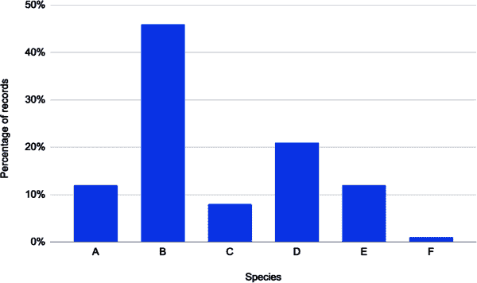

###### 图 7-4。该数据集中某些物种的记录明显多于其他物种。这可能会导致公平性问题；例如，您的算法在物种 B 上的表现可能远远优于物种 F。

除了整体数据集外，重要的是在各个标签中保持代表性。例如，您应确保在试图识别的每一类植物病害中，每种受影响的物种都有同等好的代表性。

如果您的数据集代表个体实体，还应检查确保数据集在这些实体方面平衡。例如，可能某种植物的所有照片来自一个植株，而另一种植物的照片则来自多个植株。

领域专家应该能够帮助确定以这种方式探索的数据轴。但如果没有足够的元数据怎么办？当使用未专门收集为特定项目的数据时，这种情况非常常见。在这种情况下，您将不得不对数据集进行系统性审查。

## 通过抽样审查数据

数据质量审查的挑战在于，特别是在伴随的元数据有限的情况下，往往无法逐个样本地审查每个数据。数据集可能非常庞大，领域专家的时间宝贵（也很昂贵）。

幸运的是，*抽样*为我们提供了一种审查数据的方法，而无需检查每一个项目。对于给定的数据集，记录的足够大的随机样本将具有与更大数据集几乎相同的表示和平衡。这个较小的样本可以被领域专家彻底检查，以了解整个数据集的质量。

棘手的部分在于确定样本需要多大。它必须足够大，以有合理的概率包含我们关心的特征，但又小到可以在合理的时间内审查。

例如，想象一下我们的领域专家正在尝试确定数据集是否包含足够数量的某种植物物种的实例。为了做到这一点，他们可以计算数据样本中该植物物种的实例数量，并计算该物种与其他物种实例之间的比率。但是，需要多大的样本量才能使我们假设样本和整个数据集之间的植物物种比率是等价的呢？

实际上有一个公式可以用来估计样本大小。它看起来像这样：

<math alttext="upper S a m p l e s i z e equals StartFraction left-parenthesis upper Z s c o r e right-parenthesis squared asterisk s t a n d a r d d e v i a t i o n asterisk left-parenthesis 1 minus s t a n d a r d d e v i a t i o n right-parenthesis Over left-parenthesis m a r g i n o f e r r o r right-parenthesis squared EndFraction" display="block"><mrow><mi>S</mi> <mi>a</mi> <mi>m</mi> <mi>p</mi> <mi>l</mi> <mi>e</mi> <mi>s</mi> <mi>i</mi> <mi>z</mi> <mi>e</mi> <mo>=</mo> <mfrac><mrow><msup><mrow><mo>(</mo><mi>Z</mi><mi>s</mi><mi>c</mi><mi>o</mi><mi>r</mi><mi>e</mi><mo>)</mo></mrow> <mn>2</mn></msup> <mo>*</mo><mi>s</mi><mi>t</mi><mi>a</mi><mi>n</mi><mi>d</mi><mi>a</mi><mi>r</mi><mi>d</mi><mi>d</mi><mi>e</mi><mi>v</mi><mi>i</mi><mi>a</mi><mi>t</mi><mi>i</mi><mi>o</mi><mi>n</mi><mo>*</mo><mrow><mo>(</mo><mn>1</mn><mo>-</mo><mi>s</mi><mi>t</mi><mi>a</mi><mi>n</mi><mi>d</mi><mi>a</mi><mi>r</mi><mi>d</mi><mi>d</mi><mi>e</mi><mi>v</mi><mi>i</mi><mi>a</mi><mi>t</mi><mi>i</mi><mi>o</mi><mi>n</mi><mo>)</mo></mrow></mrow> <msup><mrow><mo>(</mo><mi>m</mi><mi>a</mi><mi>r</mi><mi>g</mi><mi>i</mi><mi>n</mi><mi>o</mi><mi>f</mi><mi>e</mi><mi>r</mi><mi>r</mi><mi>o</mi><mi>r</mi><mo>)</mo></mrow> <mn>2</mn></msup></mfrac></mrow></math>

在这个公式中，*误差边界* 表示我们愿意容忍的样本比率与整个数据集比率之间的差异量。通常将其设置为 5%，这意味着我们可以接受我们样本中的比率比整个数据集中的比率高出或低出 2.5%。

Z 分数表达了我们的置信水平，或者说我们需要确信得到的数字实际上会在我们误差边界的范围内。一个合理的置信水平是 95%，这将给我们一个 Z 分数为 1.96，¹² 假设数据集的大小是典型的（超过几万个样本）。

最后，标准偏差表示我们期望数据变化的程度。由于没有办法预先知道这个值，我们可以安全地将其设为 0.5，这样可以最大化样本量。

如果我们将所有这些都整合在一起，我们将得到以下结果：

<math alttext="upper S a m p l e s i z e equals StartFraction left-parenthesis 1.96 right-parenthesis squared asterisk 0.5 asterisk left-parenthesis 1 minus 0.5 right-parenthesis Over left-parenthesis 0.05 right-parenthesis squared EndFraction equals StartFraction 0.9604 Over 0.0025 EndFraction equals 384.16" display="block"><mrow><mi>S</mi> <mi>a</mi> <mi>m</mi> <mi>p</mi> <mi>l</mi> <mi>e</mi> <mi>s</mi> <mi>i</mi> <mi>z</mi> <mi>e</mi> <mo>=</mo> <mfrac><mrow><msup><mrow><mo>(</mo><mn>1</mn><mo lspace="0%" rspace="0%">.</mo><mn>96</mn><mo>)</mo></mrow> <mn>2</mn></msup> <mo>*</mo><mn>0</mn><mo lspace="0%" rspace="0%">.</mo><mn>5</mn><mo>*</mo><mrow><mo>(</mo><mn>1</mn><mo>-</mo><mn>0</mn><mo lspace="0%" rspace="0%">.</mo><mn>5</mn><mo>)</mo></mrow></mrow> <msup><mrow><mo>(</mo><mn>0</mn><mo lspace="0%" rspace="0%">.</mo><mn>05</mn><mo>)</mo></mrow> <mn>2</mn></msup></mfrac> <mo>=</mo> <mfrac><mrow><mn>0</mn><mo lspace="0%" rspace="0%">.</mo><mn>9604</mn></mrow> <mrow><mn>0</mn><mo lspace="0%" rspace="0%">.</mo><mn>0025</mn></mrow></mfrac> <mo>=</mo> <mn>384</mn> <mo lspace="0%" rspace="0%">.</mo> <mn>16</mn></mrow></math>

由于没有部分样本的概念，我们可以将样本量四舍五入至 385。这告诉我们，我们需要随机抽样 385 个项目，以确保我们有 95%的置信度，认为一个物种与另一个物种的比率与我们在随机样本中看到的值相差不超过 5%。

结果表明，这个数字在数据集大小方面并没有太大的变化，至少对于机器学习相关的数据集来说是这样。它对误差边界的变化最为敏感：如果您只希望有 1%的误差边界，那么您将需要审查一个包含 9,604 个项目的样本。Qualtrics 提供了一个[方便的在线计算器](https://oreil.ly/wEjUk)，使实验变得容易。

所有这些都表明，通常随机选择你的数据集中的几百个样本应该足够了。¹³ 这应该是一个可以审查的管理数量，并且还会为您提供一些关于数据集是否具有可接受质量的合理见解。

当然，这假设您正在寻找的子组足够大，可以适应误差边界。例如，如果植物物种占数据的不到 5%，那么在 385 个项目的样本中，我们不太可能找到它。然而，如果您正在寻找代表少数的子组，这仍然是一个有用的结果：它将指导您添加更多数据，最终使得该组在随机抽样中可检测。

## 标签噪声

超越典型性，数据集质量问题的另一个主要来源是所谓的*标签噪声*。标签为我们提供了我们试图用 AI 预测的数值。例如，如果我们正在训练植物病害分类器，一张不健康植物的照片可能会被标记为确切的病害。不过，标签不一定是类别，例如，如果我们正在解决一个回归问题，我们期望数据标记为我们试图预测的数字。

不幸的是，附加到数据的标签并不总是正确的。由于大多数数据都是由人类标记的，错误往往会悄然而入。这些错误可能相当显著。麻省理工学院的一个研究团队发现，在一组常用的公共数据集中，平均有 3.4%的样本标记错误¹⁴—他们甚至[建立了一个网站来展示这些错误](https://oreil.ly/vrWZI)。

标签噪声并非完全是灾难性的。机器学习模型在学习如何应对噪声方面表现得相当不错。但它确实会产生显著影响，¹⁵ 而为了最大限度地提高模型性能，清理嘈杂的标签可能是值得尝试的。边缘 AI 的约束已经在模型性能上投入了很多。清理嘈杂的标签可能会带来比花更多时间在算法设计或模型优化上更高的回报。

识别标签噪声的最简单方法是审查数据的随机样本，但对于大型数据集来说，这就像在干草堆里寻找针一样困难。与随机抽样不同，更明智的做法是更智能地聚焦搜索。

一个好的方法是在一个类内寻找异常值。如果一个样本被错误分类，它可能与其误标记的类中的其他成员显著不同。对于简单的数据，可以使用标准的数据科学工具来轻松实现。对于像图像或音频这样的高维数据，这可能会更具挑战性。

Edge Impulse 使用的端到端边缘 AI 平台对这个问题有一个有趣的解决方案。Edge Impulse 的特征探索器使用无监督降维算法将复杂数据投影到简化的二维空间，其中的接近性与相似性相关。这种方法[使得可以轻松发现异常值](https://oreil.ly/_9-Ny)，如图 7-5 中所示。

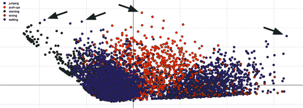

###### 图 7-5\. 每个点代表数据的一个样本，点与点之间的距离代表它们的相似性。异常值，例如用箭头标出的那些，是不寻常的样本。当样本出现在属于其他类别的样本附近时，值得调查，看看它们是否被误标记了。

另一种寻找嘈杂类标签的简单方法是假设一个训练在数据上的模型对分类嘈杂样本的置信度较低。如果训练样本按照训练模型在分配类别时的置信度排序，很可能误标记的样本会出现在列表的底部。

在除分类之外的问题数据集中，标签噪声看起来有所不同。例如，回归数据集中的标签噪声包括目标值中的误差，而在物体检测或分割数据集中的标签噪声意味着边界框或分割图与它们应该围绕的对象不匹配。

标签噪声的检测和缓解是一个持续研究的领域。如果你有一个特别嘈杂的数据集，深入科学文献可能会有所帮助——在[Google 学术](https://scholar.google.com)中快速搜索“label noise”会对你有所裨益。

### 避免标签噪声

标签噪声通常是由于在数据标记过程中的人为错误导致的。人类在进行数据标记等重复性任务时并不擅长产生可靠的结果，即使他们有正确的知识也是如此。此外，有时从数据中并不清楚正确的标签应该是什么。例如，即使是医疗专家在判断一张诊断图像是否显示疾病时也不总是一致的。

在许多情况下，标签错误是对标签任务理解不足的结果。在需要大量标签工作的项目中，提供一个“评分员指南”是很重要的：一本为数据标记者准备的手册。该指南应包括清晰说明准则的示例。在项目的过程中，可以更新任何有趣或不明确的示例。

为了最大限度减少人为错误的影响，使用多个标注者可能是有用的。如果标注者在标签上存在分歧，可以将样本标记为需要进一步检查。如果对于某个样本没有明确的答案，可以使用投票系统来得出确定的标签，或者可以拒绝该样本。正确的操作方式将根据项目的不同而异，并需要应用领域专业知识。

## 常见的数据错误

表示和平衡问题是大的结构性问题，反映了数据集设计的方式，而标签噪声是影响个别样本的收集过程的结果。与标签噪声类似，还有许多常见错误可能会影响到边缘 AI 项目中的数据。以下是一些在边缘 AI 项目中常见的问题：

标签噪声

正如在“标签噪声”中详细描述的那样，由于人为或机器错误，数据标签的问题是常见的。

缺失值

由于各种原因，数据集中的某些记录可能会缺少某些特征的值。例如，数据收集脚本中的错误可能导致值未被写入正确的位置。这种情况非常普遍，而最重要的数据准备任务之一就是找出处理缺失值的最佳方法。

传感器问题

传感器的技术问题可能会导致主要的数据质量问题。影响传感器的常见问题包括过多的噪声、不正确的校准、影响传感器读数的环境条件变化，以及随时间推移导致数值变化的退化。

不正确的值

有时数据集中的值不反映实际测量的内容。例如，传输过程中可能会使读数损坏。

异常值

异常值是远超出预期范围的值。有时异常值可能是自然的，但通常它们是传感器问题或环境条件意外变化的症状。

不一致的缩放

同一个值可以在数字系统中以多种不同的方式表示。例如，温度读数可以是摄氏度或华氏度，传感器值可能已经标准化或未标准化。如果对同一特征的值使用了不同的缩放，比如将两个数据集的数据合并，就会出现问题。

不一致的表示

除了缩放之外，表示方法还有很多其他的变化方式。例如，一个数据点可以被存储为 0 到 1 之间的 16 位浮点值，或者是 0 到 255 之间的 8 位整数。彩色图像中的像素顺序可以是红色、绿色、蓝色，或者是蓝色、绿色、红色。音频文件可以被压缩为 MP3 格式，也可以存在为一组样本的原始缓冲区。不一致的表示方法可能会导致许多困难。重要的是要充分记录这些内容，也许甚至要附加在每个样本中的元数据中。

意外的比率

不一致表示的一个特别讨厌的子类型是采样率不一致。例如，数据集可能包含以 8 kHz（每秒 8000 次）采集的样本和以 16 kHz 采集的样本。如果它们没有被不同处理，它们看起来将包含非常不同的值。当采样率和比特深度的变化结合在一起时尤为糟糕——一眼看去，很难区分 8 kHz 16 位样本和 16 kHz 8 位样本！

不安全的数据

如果你正在从现场收集数据，确保有安全的机制来收集和传输数据至关重要。例如，你可以使用加密方式签名样本，以确保它们在存储之前没有被篡改。如果攻击者能够篡改你的数据，他们可以直接影响最终的算法，从而扭曲你的系统使其偏向他们的利益。

几乎每个人工智能项目都需要处理这些类型错误的工作。在“数据清洗”中，我们将介绍一些用于解决这些问题的方法。

## 漂移和变化

> 万物皆变，无一物常存。
> 
> 爱菲索斯的赫拉克利特，公元前 535-475 年

数据集只是时间的一个快照：它代表了在收集期间系统的状态。由于现实世界随时间而变化，即使是最高质量的数据集也可能变得有些陈旧。这种变化过程以几个术语来描述，包括*漂移*、*概念漂移*和*变化*。

当发生漂移时，数据集不再代表实际系统的当前状态。这意味着使用该数据集开发的任何模型或算法都是基于对系统的错误理解，并且一旦部署后可能表现不佳。

漂移可以以几种不同的方式发生。让我们在一个捕捉工业机器振动的数据集的背景下探讨这些方式：

突然变化

有时候现实世界的条件会突然改变。例如，工人可能会将振动传感器移动到机器的不同部位，从而突然改变了其所感知到的运动特性。

逐渐变化

信号可能会随时间逐渐变化。例如，机器的运动部件随着时间逐渐磨损，慢慢改变其振动的特性。

周期性变化

变化往往会以循环或季节性的形式发生。例如，机器的振动可能会随其所处位置的环境温度变化而变化，而这种温度在夏季和冬季之间会有所不同。

因为变化是不可避免的，漂移是人工智能项目面临的最常见问题之一。它可以发生在从物理配置（如传感器的放置位置）到文化演变（如语言和发音逐渐变化）的任何方面。

管理漂移需要随时间更新您的数据集，我们将在“随时间构建数据集”中更详细地讨论。它还需要监控您模型在实际场景中的性能，这将在接下来的章节中涉及。

由于漂移的存在，边缘人工智能项目永远不会真正“完成” —— 它几乎总是需要在监控或维护方面进行持续努力。

## 错误的不均匀分布

正如我们所见，数据集可能存在许多不同类型的错误。为了获得高质量的数据集，您需要追踪错误并确保它们保持在可接受的水平内。然而，重要的不仅仅是测量错误的存在或缺失，还要考虑它们如何影响数据的不同子集。

例如，假设您正在解决一个具有 10 个类别的平衡数据集的分类问题。通过抽样估计，您的数据集中大约有 1% 的标签噪声：即每 100 个数据样本中有一个标记错误。从算法的角度来看，这可能是可以接受的。也许您已经在数据上训练了一个机器学习模型，并且根据其准确性来看，它似乎是有效的。

但是，如果这 1% 的错误标签并不均匀（或*对称地*）分布在数据集中，而是*不对称地*集中在单一类别中呢？在这个类别中，而不是每 100 个样本中有一个标记错误，而是每*10*个数据项中有一个可能会被错误标记。这可能足以严重影响您模型在这一类别的性能。更糟糕的是，它将影响您测量该类别性能的能力，就像您对其他类别的测量方式一样。

错误也可能在不一定是类别的子群体之间不对称。例如，也许您的数据集包含从三种不同车型收集的数据。如果其中一种车型安装的传感器有问题，那么这些车型的数据可能包含错误。这比错误在类别之间不对称更危险，因为使用标准性能指标来检测其影响要困难得多。

不对称的错误可能会导致算法中的偏差，因为它们对某些子群体的系统性能影响更大。在查找数据中的错误时，您应特别注意考虑来自数据子群体的错误率，即使总体错误水平看似可接受。通常情况下，领域专业知识在确定子群体及其最佳检查方法方面将非常有帮助。

# 准备数据

从原始数据到高质量数据集的过程是一条漫长的道路，包含许多步骤。在接下来的部分，我们将沿着这条道路前行，开始理解这个过程。以下是我们沿途的站点：

+   标注

+   格式化

+   清洗

+   特征工程

+   划分

+   数据增强

其中一项，特征工程，实际上是我们将在第九章中涵盖的算法开发工作的一部分。然而，它在这里值得一提，因为它的结果在优化数据集的过程中如何使用。

我们的旅程里程碑假设您已经收集了一些初始原始数据。您可能还没有完全代表性或平衡的数据集，但您已经有了一个坚实的开始。数据准备过程将指导您在成长和改进数据集的过程中。

## 标记

典型的边缘 AI 数据集反映了一组原始输入（例如一些时间序列传感器数据）与这些输入*含义*的映射。我们的任务通常是构建或训练一系列算法系统，能够自动执行这种映射：当提供一组原始输入时，它告诉我们这些输入的含义。然后，我们的应用程序可以利用这个假设的含义来做出智能决策。

在大多数数据集中，这种*含义*的描述以标签的形式呈现。正如我们所见，创建可靠的算法需要高质量的标签。数据可以通过几种不同的方式进行标记，任何项目可能会结合使用其中的几种方式：

使用特征进行标记

一些数据集使用它们自己的特征进行标记。例如，想象我们正在构建一个虚拟传感器系统——该系统使用几个廉价传感器的信号来预测一个昂贵但成本高昂的传感器的输出。在这种情况下，我们的数据集需要包含来自廉价传感器和昂贵传感器的读数。昂贵传感器的读数将用作标签。

在用作标签之前，特征可能会经过处理。例如，想象我们希望训练一个机器学习模型，根据传感器数据预测是白天还是黑夜。我们可以使用数据集中每行的时间戳，以及数据收集地点的当地日出和日落信息，来确定数据是在白天还是黑夜捕获的。

手动标记

大多数数据集是由人类有意标记的。对于某些数据集来说，这很容易：如果样本是在特定事件期间收集的，它们的标签可能是显而易见的。例如，想象你正在收集车辆的振动数据集，并将其标记为“移动”或“空闲”。在这种情况下，如果你当时坐在车里，你已经知道每个样本应该如何标记。

在其他情况下，标记可能是一个繁琐的手动过程，其中人类需要查看以前未标记的数据集中的每条记录，并确定正确的标签应该是什么。这个过程可能很具挑战性：例如，可能需要一些培训或技能来确定应用正确的标签。在某些情况下，即使是经过良好培训的专家也可能很难就正确的标签达成一致——医学影像数据经常面临这个问题。

即使任务很简单，人类也会自然而然地犯错误。手动标记是数据集质量问题最常见的原因之一。它也是最难检测和纠正的，因此值得确保您做对了。

自动标注

根据您的数据集，可能可以自动应用标签。例如，想象一下您计划训练一个微型的设备上机器学习模型，可以从照片中识别不同物种的动物。您可能已经可以访问一个大型，高度准确的机器学习模型，能够执行此任务，但太大而无法安装在嵌入式设备上。您可以潜在地使用这个大型模型自动标记您的数据集，避免人力劳动的需要。

这种方法可以节省大量时间，但并非总是可行。即使可行，假设自动化系统会出现一些错误并需要一些流程来识别和修正它们也是明智的。

值得记住的是，大型现有模型的标签与您试图训练的模型之间通常存在差异。例如，想象一下您正在构建一个识别野生动物声音的系统。您的目标是部署一个能够识别声音是由鸟类还是哺乳动物发出的微型模型。如果您的大型模型设计用于识别单个物种，那么您将不得不将每个物种映射到“鸟类”或“哺乳动物”标签之一。

辅助标注

可以设计一种混合方法，介于手动和自动化标注之间，既能提供直接的人类洞察力，又能自动完成繁琐的任务。例如，假设你被要求在图像数据集中的特定对象周围绘制边界框。在辅助标注系统中，计算机视觉模型可能会突出显示每个图像中感兴趣的区域，以便您检查并决定哪些需要绘制边界框。

### 并非所有问题都需要标签。

根据您试图解决的问题，您甚至可能不需要标签 — 尽管大多数情况下您会需要。

在“经典机器学习”中，我们遇到了*监督*和*无监督*学习的概念。在监督学习中，机器学习算法学习预测给定一组输入数据的标签。在无监督学习中，模型学习数据的表示，可以在某些其他任务中使用。

无监督算法不需要标签。例如，想象一下我们正在为异常检测训练聚类算法。[¹⁶] 该算法不需要标记数据；它只是尝试学习未标记数据的固有属性。在这种情况下，可以说标签是*隐含的*：因为聚类算法必须在表示正常（非异常）值的数据上进行训练，因此您的训练数据集必须经过精心策划，以确保它仅包含非异常值。

如果您怀疑可能能够使用无监督算法解决问题，应该在流程的早期阶段尝试一下。您可能会发现可以不用标记太多数据，这将大大节省成本、时间和风险。然而，大多数问题可能最终需要使用监督学习。

即使使用无监督算法，通常也很重要拥有一些标记数据用于测试。例如，如果解决异常检测问题，需要获取一些正常值和异常值的示例。这些示例需要标记，以便用于评估模型的性能。

### 半监督学习和主动学习算法

标记是数据集收集中最昂贵和耗时的方面之一。这意味着通常可以访问大量未标记的数据和少量已标记的数据。许多对边缘人工智能感兴趣的组织可能拥有长时间收集的物联网数据存储。这些数据虽然丰富，但却是未标记的。

*半监督学习*和*主动学习*是两种旨在帮助利用这类数据的技术。这两者背后的概念是，模型部分训练于一个小的标记数据集上，可以用来帮助标记更多的数据。

半监督学习，如图 7-6 所示，从一个大的未标记数据集开始。首先，从这个数据集中选择一个小的子集进行标记，并在这些标记记录上训练模型。然后，该模型用于对一批未标记记录进行预测。这些预测结果用于标记数据。其中一些可能是错误的，但没关系。

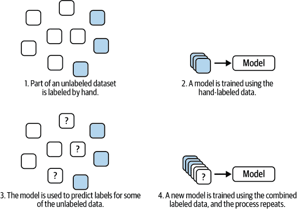

###### 图 7-6\. 半监督学习。

然后，这些新标记的记录与原始标记数据合并，并使用所有这些数据训练新模型¹⁷。新模型应该至少比旧模型好一点，即使它是在旧模型帮助标记数据的基础上训练的。然后重复此过程，逐渐标记更多数据，直到模型足够用于生产。

第二种技术，主动学习，有些不同。该过程，如图 7-7 所示，以同样的方式开始，即一个初始模型在可用的少量标记数据上进行训练。然而，下一步不同。模型不是自动标记随机样本数据，而是帮助*选择*数据集中看起来最有用的一组记录进行标记。然后请领域专家标记这些样本，并训练一个新模型利用它们。

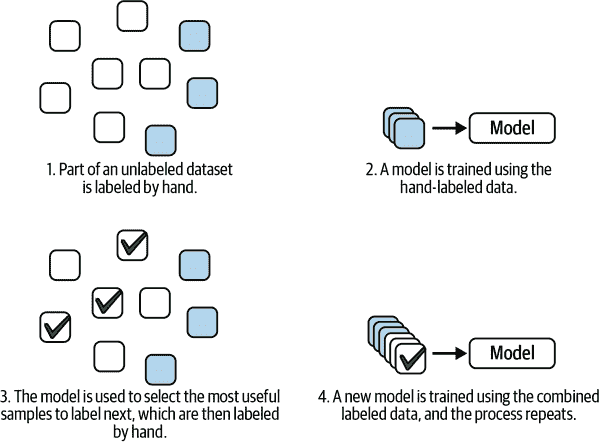

###### 图 7-7\. 主动学习。

选择过程旨在通过识别未标记样本中包含的最有助于模型学习的信息来最大化*信息增益*。两种最常见的选择策略称为*不确定性采样*和*多样性采样*，可以单独或组合使用。

不确定性采样基于*置信度*。如果初始模型在分类记录时显得自信，那么可以假设从该记录中无法获取更多信息用于训练。如果模型对特定记录*不*自信，这表明模型没有见过许多类似样本，并且不知道如何处理它。这些样本对我们来说标记和添加到数据集中是最有影响力的。

多样性采样涉及使用统计技术来理解哪些样本最能代表数据的基本分布。例如，我们可能会尝试找到一种方法来量化任意两个样本之间的相似性。为了选择要标记的新样本，我们会寻找那些与我们现有已标记数据集中的样本看起来最不同的样本。

整个过程——选择少量样本进行标记，将新样本与现有标记样本一起添加到训练数据中，并重新训练模型——将根据需要重复多次，以获得性能良好的模型。

尽管这些技术相对较新，但它们非常有效。关于“标注工具”的部分提供了一些示例，可以帮助您使用它们。

也就是说，主动学习工具是标记过程中偏见的潜在来源。为了评估它们，建议将它们的结果与随机选择的样本的结果进行比较（而不是由您的主动学习工作流程选择的样本）。这将帮助您更好地了解您的主动学习过程正在创建的模型类型。

### 标签偏见

在“标签噪音”中，我们讨论了标签噪音在数据集中的重要问题。标签噪音的一个主要来源是标记过程中的偏见。当这种情况发生时，数据集反映的是进行标记的人和工具的偏见，而不是反映您试图建模的潜在情况。

这只是标记过程中偏见可能影响数据集质量的一种方式。不幸的是，这些类型的问题几乎不可避免。此外，由于数据集是评估系统的最强大工具，因此系统中可能存在的任何偏见可能难以检测。

避免标签质量问题的最佳方法是制定严格的评估标签正确性的程序。这可能包括：

+   利用在主题方面拥有深厚经验的合法领域专家

+   遵循由领域专家建立的详细标记协议

+   依赖多个标注者可以相互检查工作

+   评估你标记数据样本的质量

这将增加标注过程的成本和复杂性。如果生成高质量数据集的成本超出预算承受范围，你的项目可能无法实现。与其发布一个有害系统到生产环境，还不如终止项目。

标注偏见不仅仅存在于手动标记的数据中。如果你使用自动系统帮助标记数据，系统中存在的任何偏见也会反映在你的数据集中。例如，想象一下，你正在使用一个大型预训练模型的输出来帮助标记新数据集中的记录，以训练边缘 AI 模型。如果大型模型在数据集的所有子组中表现不均匀，你的标签也会反映出这些偏见。

### 标记工具

有几种不同类别的工具可以帮助标记数据。最佳选择将根据项目而异：

+   注释工具

+   众包标注

+   辅助和自动标注

+   半监督学习和主动学习

让我们依次探讨每一个。

#### 注释工具

如果你的数据需要人工标注或评估，他们将需要使用某种工具。例如，想象你正在构建一个包含任何动物的照片数据集。你可能需要某种用户界面来显示每张照片，并允许领域专家指定他们看到的动物。

这些工具的复杂性将根据数据的不同而变化。用于图像分类数据集的标注界面将相对简单；它只需显示照片并允许用户指定标签。用于对象检测数据集的界面将需要更复杂：用户将需要绘制围绕他们关心的对象的边界框。

更奇特的数据类型，例如时间序列传感器数据，可能需要更复杂的工具，可以帮助以领域专家能理解的方式可视化数据。

注释工具在与传感器数据集交互中几乎是不可或缺的要求。它们不仅用于标注，还用于可视化和编辑现有的标签，因为评估标签是过程的重要组成部分。

注释工具有开源和商业软件两种。一些需要注意的事项包括：

+   支持你正在处理的数据类型

+   支持你试图解决的问题（例如，分类与回归）

+   协作功能，以便多人可以共同进行标注

+   自动化和本节后面解释的其他功能

#### 众包标注

一个团队通常会有更多需要标注的数据，超出他们内部能够处理的范围。在这种情况下，使用众包标注工具可能会很有用。这些工具允许您定义一个标注任务，然后招募公众成员来帮助完成。帮助标注数据的人可以得到一定的经济补偿，每标注一个样本可能会得到一小笔钱，或者他们可能是志愿者。

众包标注的一大优势在于它可以帮助您快速标注大量数据集，否则可能需要耗费极长的时间。然而，由于标注过程依赖于接受过最低培训的公众成员，您不能依赖任何领域专业知识。

这可能会使一些任务变得不可达：例如，任何需要复杂技术知识的任务。即使是简单的任务，您最终可能会遇到比由领域专家标注数据时更多的质量问题。此外，清晰定义任务的工作量很大，以至于公众成员能够理解。为了取得好的结果，您需要教育标注人员如何准确完成任务。

除了质量问题，还存在机密性问题：如果您的数据集包含敏感、私密或专有信息，众包可能不是一个选项。此外，众包数据集有可能会受到恶意行为者的操控。

#### 辅助和自动化标注

辅助和自动化标注工具使用某种形式的自动化来帮助人类（无论是领域专家还是众包标注人员）快速标注大量数据。在简单的情况下，这可能涉及使用基本信号处理算法来帮助突出感兴趣的区域或建议标签。更复杂的工具可能使用机器学习模型来辅助。以下示例的辅助标注工具来自 Edge Impulse。

首先，[这个目标检测标注工具](https://oreil.ly/IkzTs)使得在一系列图像中绘制边界框更容易。它使用物体跟踪算法来识别后续帧中已标记的物体，如图 7-8 所示。

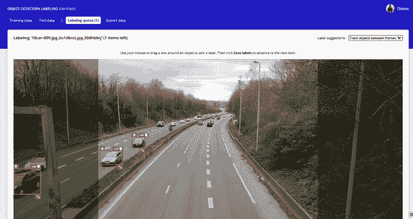

###### 图 7-8\. 在 Edge Impulse 中用于标注的物体跟踪；标记的汽车在连续的帧之间被追踪。

在标注工具的更复杂示例中，[Edge Impulse Studio 中的数据探索器](https://oreil.ly/Qxs5j)使用聚类算法来帮助可视化数据，相似的样本会靠近彼此，让用户能够基于相邻的样本快速标注样本。这显示在图 7-9 中。

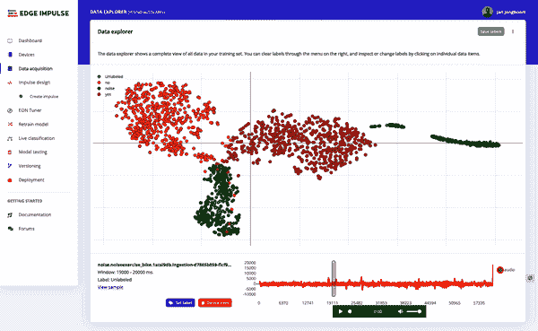

###### 图 7-9\. Edge Impulse 中数据浏览器用于标记关键词识别数据集的截图。

最后，可以使用完整预训练模型来帮助自动标记数据。例如，图 7-10 展示了使用[在公共数据集上预训练的对象检测模型](https://oreil.ly/IZMoT)来标记 80 种已知对象类别的实例。

辅助标记可以通过将工作从人工标记者转移至自动化系统来节省时间和精力。然而，由于自动化系统不太可能完美无缺，不能单独使用——必须有人类“在其中”，以确保质量良好。

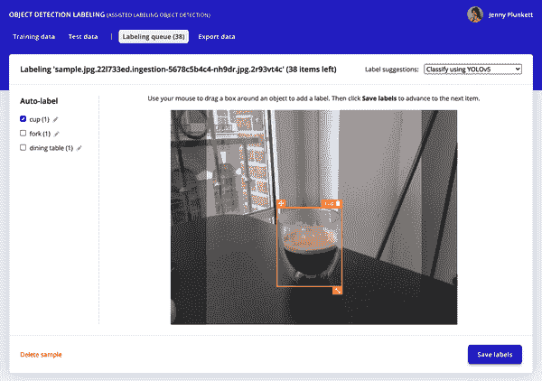

###### 图 7-10\. 可以使用预训练模型自动标记数据，正如 Edge Impulse 中的这一屏幕截图所示。

#### 半监督和主动学习

正如讨论中提到的“半监督和主动学习算法”，存在各种技术可以通过使用部分训练模型来帮助减少标记数据集的负担。这些方法类似于辅助标记，但尤其令人兴奋的是它们可以智能地减少需要进行的标记量。例如，主动学习工具可能建议手动标记数据的一个小子集，以便为其余数据准确提供自动标签。

这两种技术都涉及标记数据子集、训练模型，然后确定下一批数据的标签的迭代过程。经过多次迭代，您将获得一个有效的数据集。

主动学习的一个有趣变体可以在[Edge Impulse Studio 的数据浏览器](https://oreil.ly/sDAif)中找到。数据浏览器可以使用部分训练模型来帮助可视化未标记的数据集作为聚类。¹⁸ 这些聚类可用于引导标记过程，确保聚类是明显的，并且每个聚类至少包含一些标记样本。图 7-11 展示了基于部分训练模型对数据集进行聚类的情况。

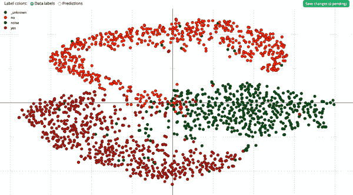

###### 图 7-11\. 根据部分训练模型的输出对数据进行聚类；该可视化可以通过引导标记或识别模糊样本来改善数据质量。

正如我们所见，数据标记对 AI 系统的质量有重大影响。虽然有复杂的工具可用来减少所需的工作量，但标记通常会占据 AI 项目花费的大部分时间。

## 格式化

几乎无限种格式可以用来存储磁盘上的数据。这些范围从简单的二进制表示到专门设计用于训练机器学习模型的特殊格式。

数据准备过程的一部分是将来自不同来源的数据汇集在一起，并确保以方便的方式格式化。例如，您可能需要从物联网平台提取传感器数据，并将其写入二进制格式，以便为模型训练做准备。

每种数据格式都有不同的优缺点。以下是一些常见的变体：

文本格式

类似 CSV（逗号分隔值）和 JSON（JavaScript 对象表示法）的格式将数据存储为文本。例如，CSV 格式将数据存储为以分隔符分隔的文本，通常是逗号（因此得名）或制表符。它非常容易处理，因为您可以使用任何文本编辑器读取和编辑值。然而，文本格式非常低效——文件占用的空间比二进制格式大，并且需要更多的计算开销来访问和处理。

CSV 和 JSON 文件适用于可以完全读入内存的小数据集，但对于必须从磁盘读取的大数据集，最好先将数据转换为二进制格式。

图像和音频文件

图像和音频是常见的数据类型，并有它们自己的典型格式（如 JPEG 图像和 WAV 音频文件）。将图像和音频数据集存储为独立的文件在磁盘上是相当常见的。虽然这不是可能的最快解决方案，在许多情况下这已经足够了。以这种方式存储的数据集有利于易于阅读和修改，而无需任何特殊工具。它们通常与清单文件一起使用（参见提示“清单文件”）。

一些特殊类型的数据，如医疗成像，有其自己的特殊格式，可以编码元数据，如位置和方向。

直接访问二进制格式

二进制数据格式指的是以其本机形式（二进制位序列）存储数据，而不是编码为二级格式（如文本格式）。例如，在二进制格式中，数字`1337`会直接存储在内存中作为二进制值`10100111001`。在文本格式中，由于文本编码的开销，同样的数字可能会以更大的值表示。例如，在名为 UTF-8 的文本编码中，数字`1337`会以比特位`00110001001100110011001100110111`表示。

在直接访问二进制格式中，许多数据记录存储在单个二进制文件中。文件还包含元数据，使得读取它的程序可以理解记录中每个字段的含义。该格式设计成数据集中的任何记录都可以在常数时间内访问。

一些常见的直接访问二进制格式包括 NPY（由 Python 数学计算库 NumPy 使用）和 Apache Parquet。不同的格式有不同的性能权衡，因此选择适合特定情况的格式非常有用。

顺序二进制格式

顺序二进制格式（例如 TFRecord）旨在最大化某些任务（例如训练机器学习模型）的效率。它们以特定的、预设的顺序提供快速访问。

顺序格式可以非常紧凑且读取速度快。然而，它们不像其他数据格式那样易于探索。通常，在训练机器学习模型之前，将数据集转换为顺序格式将作为最后一步进行。它们只在大型数据集中真正使用，其中效率节省显著降低了成本。

# 清单文件

清单文件是一种特殊文件，用作数据集其余部分的索引。例如，图像数据集的清单文件可以列出所有预期在训练期间使用的图像文件的名称。清单文件的常见格式是 CSV。

由于基于文本的清单文件简单且易于使用，这是跟踪数据的便捷方式。创建数据集样本就像随机选择清单文件中的一些行一样简单。

您的数据集通常会在其旅程中占据几种不同的格式。例如，您可能从几个不同的来源获取数据，可能是混合的基于文本和二进制格式。然后，您可以选择将数据聚合在一起并将其存储在直接访问的二进制格式中，然后进行清理和处理。最后，在某些情况下，您可能会选择将相同的数据集转换为顺序二进制格式以进行训练。

## 数据清洗

当您开始将数据集整合到一个通用格式中时，您需要确保其包含的所有值都符合质量一致的标准。在“常见数据错误”中，我们遇到了您将在数据集中看到的主要问题类型。

在收集和整理数据集的任何步骤中，都可能出现错误。以下是不同阶段出现的一些错误示例：

+   由于故障硬件引起的原始传感器数据中的异常值

+   从不同设备聚合数据时的数据格式不一致

+   由于多个来源的数据连接问题导致的缺失值

+   由于特征工程中的错误而导致的不正确值

清理数据集是一个涉及多个步骤的过程：

1.  使用抽样审计数据以识别错误类型（您可以使用“通过抽样审查数据”中讨论的相同方法来抽样）

1.  编写代码以修复或避免您注意到的错误类型

1.  评估结果以证明问题已经被解决

1.  自动化步骤 2，以便您可以修复整个数据集，并将相同的修复方法应用于将来添加的任何新样本。

除非您的数据集非常小（例如，小于 1GB），否则通常应该对数据样本进行操作而不是整个数据集。由于处理大型数据集需要大量时间，使用样本将减少在识别问题、修复问题和评估修复方案之间的反馈循环时间。

一旦您在数据样本上找到满意的修复方法，您可以自信地将修复方法应用于整个数据集。尽管如此，最后一步还是评估整个数据集以确保没有漏掉的问题是一个好主意。

### 审计您的数据集

在“常见数据错误”中列出的问题通常是您会遇到的问题类型。但是，如何确定数据集中存在哪些错误呢？

识别数据清洁问题的最强大工具是允许您将数据集（或其代表样本）视为摘要的工具。这可能意味着创建一个表格，显示特定字段的描述统计和存在的类型。这也可能意味着绘制图表中数值的分布，以便领域专家评估分布是否符合预期。

Python 库[pandas](https://pandas.pydata.org)是探索和总结数据集的绝佳工具。一旦加载到 pandas 数据结构中，即[`DataFrame`](https://oreil.ly/69vWh)，数据集的值可以进行总结。例如，以下命令打印了时间序列值的统计摘要：

```
>>> frame.describe()
            value
count  365.000000
mean     0.508583
std      0.135374
min      0.211555
25%      0.435804
50%      0.503813
75%      0.570967
max      1.500000
```

通过查看统计数据，我们可以看到此时间序列的值集中在 0.5 左右，标准差为 0.13。我们可以利用领域专业知识来判断这些值是否合理。

更好的是，Python 库[Matplotlib](https://matplotlib.org)允许我们可视化我们的数据。例如，我们可以轻松打印一个[直方图](https://oreil.ly/nfCXD)来显示我们的数据框架：

```
plt.hist(frame['value'])
plt.show()
```

结果图显示在图 7-12 中。传感器读数明显形成了正态分布。

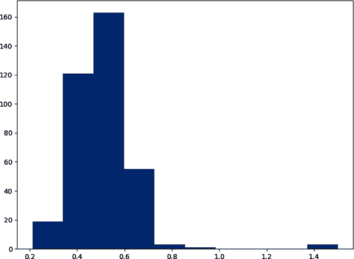

###### 图 7-12。一个示例数据集中数值的直方图。

从直方图中，我们可以看到数据大部分集中在 0.5 左右，但是有一些点的数值约为 1.5。领域专家可以解释这一点，以了解分布是否合适。例如，可能是传感器问题导致一些异常值，这些值并不反映准确的读数。一旦我们确定了问题，我们可以深入挖掘以确定适当的修复方法。

使用常见的数据科学工具（例如 Python 和 R 生态系统中的工具）可以以无限的方式总结数据。在进行边缘 AI 项目的工程师或数据科学家必须能够与领域专家合作，帮助探索数据并识别错误。

### 修正问题

一旦在数据集中发现错误，您将需要采取一些行动。您能够采取的具体行动取决于您发现的错误类型以及您正在收集数据的整体上下文。

这些是处理错误时您可以使用的主要方法：

+   修正值

+   替换值

+   排除记录

另外，一旦解决了数据集中的任何问题，您可能需要解决导致上游问题的问题。

#### 修正值

在某些情况下，可能可以完全修复错误。以下是一些例子：

+   数据格式不一致可能通过转换为正确的格式来解决。

+   如果数据可从其他来源获取，则可以发现并填充缺失值。

+   由于功能工程代码中的错误导致的故障值可以被修复。

通常，只有在原始原始数据仍然可用的情况下，才能完全修复错误。在某些情况下，您仍然可能找不到正确的值。例如，如果一些数据错误地以过低的频率捕获，则将无法恢复原始信号，只能近似。

#### 替换值

如果无法修复错误，仍可能替换为合理值。以下是此类事件发生的一些例子：

+   缺失值可以用整个数据集中该字段的均值替换。

+   异常值可能会被裁剪或调整到合理的值。

+   可以对低频或低分辨率数据进行插值以近似更高的细节。

替代使您能够利用记录，即使其中一些信息是缺失的。然而，作为交换，这将为您的数据集引入一些噪音。一些机器学习算法擅长容忍噪音，但保留的信息是否值得增加的噪音，这是一个基于应用的判断调用。

#### 排除记录

在某些情况下，错误可能是无法挽救的，这将需要您从数据集中丢弃受影响的记录。以下是一些例子：

+   缺失值可能导致记录无法使用。

+   来自故障传感器的数据可能无法修复。

+   一些记录可能来自未达到数据安全标准的来源。

不仅仅是删除有问题的记录，标记它们为有问题的是个好主意，但是把它们存档起来。这样有助于跟踪出现的问题类型和受影响的记录类型。

解决错误的正确方式完全取决于数据集和应用的上下文。为了获得良好的结果，应同时应用领域专业知识和数据科学经验。

### 评估和自动化

在修复数据样本或子集中的错误后，应进行另一次审计。这将有助于捕获您的努力可能无意中引入的任何问题，以及可能被您修复的问题掩盖的问题。例如，您可能仅移除数据集中最严重的异常值，却发现仍存在其他较小但仍值得关注的异常值。

在验证了对子集的修复后，可以将修复应用到整个数据集中。对于大型数据集，您需要将此过程自动化作为数据流程的一部分（参见“数据流水线”）。对更多数据集进行基于抽样的审计，直到您确信问题已得到充分解决。

###### 提示

保留原始未改进的数据集副本，以便在需要时可以回滚。这将帮助您在实验时不必担心犯错和数据丢失。

重要的是要追踪受错误影响的记录类型。错误可能会不成比例地影响数据的某些子组。例如，假设您正在对传感器数据进行分类模型训练。您可能会发现某些传感器读数存在严重问题，需要丢弃相关记录。如果这些问题影响某个类别比其他类别更多，可能会影响分类器的性能。

在此基础上，您应确保在应用任何修复后，数据集仍然具有良好的质量标准（正如我们在“确保数据质量”中探讨的那样）。

要记录数据集中各种类型错误的普遍程度。如果坏记录的比例很高，可能值得在花费大量时间修复损坏之前，尝试修复任何上游原因。

随着数据集的增长，可能会出现新问题。为了帮助识别任何问题，根据您的初始评估创建自动断言是一个好主意。例如，如果您通过删除极端异常值来改进数据集，应该创建一个自动化测试来证明数据集具有预期的变化量。每次添加新记录时运行此测试，以确保捕捉任何新问题。

### 解决平衡问题

到目前为止，我们讨论了如何修复数据集中值的错误。然而，数据集最常见的问题之一是不平衡：各子组的记录数量不均衡。在“确保代表性数据集”中，我们以显示植物疾病图像的数据集为例。在这种情况下，如果数据集中显示某种植物物种图像的数量比其他植物物种多，则可能被认为是不平衡的。

在数据集中解决平衡问题的最佳方法是为低估的子组收集更多数据。例如，我们可以回到现场为低估的植物物种收集更多图像。然而，这并不总是可行的。

如果你必须应付，你可以通过*过采样*低估的组来潜在地解决平衡问题。为此，你可以复制这些组的一些记录，直到所有子组具有相同数量的记录。你还可以通过*欠采样*过度表现的组来丢弃它们的一些记录。

在构建用于训练机器学习模型的数据集时，这种技术可能很有用。由于模型的学习通常是通过整个数据集的聚合损失值来指导的，如果某个子组被低估，它对模型学习的影响就不大。通过采样平衡各个子组的数量可以有所帮助。

然而，如果你的数据量不足以真实反映受影响子组的真实方差，过采样并不能帮助你。例如，如果我们植物数据集中的某个物种仅由单一植物的图像表示，过采样可能不会导致一个表现良好的模型——因为在现实世界中，各个个体植物之间存在大量变化。

你在使用过采样数据评估系统时也应该小心。你的评估结果对于你过采样的子组会更不可靠。

一种与过采样等效的技术是在训练过程中对子组进行*加权*。在这种技术中，每个子组被分配一个权重，该权重控制其对训练或评估过程的贡献。可以为子组分配权重以纠正任何平衡问题。例如，一个低估的子组可能被赋予比高估子组更高的权重。

有些数据集天然存在不平衡。例如，在对象识别数据集中，包含对象的图像区域通常比不包含对象的区域要小。

在这些情况下，当重新采样可能无效时，通常使用加权来增加低估数据对模型训练的贡献。

## 特征工程

大多数边缘 AI 项目都会涉及一些特征工程工作（参见“特征工程”）。这可能只是简单地缩放特征（见侧边栏“特征缩放”）——或者可能涉及极其复杂的 DSP 算法。

由于机器学习模型和其他决策算法是在特征上运行而不是原始数据上运行的，特征工程是数据集准备的重要部分。特征工程将由我们在第九章中遇到的迭代应用开发工作流指导，但在数据集准备阶段建立特征的基线将是必要的。

进行一些初步的特征工程将使您能够按特征而不是仅仅原始数据的方式探索和理解数据集。在此阶段进行特征工程的一些其他重要原因包括：

+   缩放值以便作为机器学习模型的输入

+   合并值（参见“合并特征和传感器”），也许进行传感器融合

+   预先计算 DSP 算法以加快训练速度¹⁹

几乎可以肯定的是，您将希望在开发过程中的某个时候迭代特征工程 — 但您越早开始这项工作，效果会更好。

## 分割您的数据

如我们所见，AI 项目的工作流程涉及算法开发和评估的迭代过程。基于我们即将详细展开的原因，重要的是为数据集设计结构，使其适应这种迭代工作流程。

典型情况下，通过将数据集分为三部分来完成此过程：训练、验证和测试。²⁰ 每个分割的用途如下：

训练

训练分割直接用于开发算法，通常是通过训练机器学习模型来完成。

验证

验证分割用于在迭代开发过程中评估模型。每次开发新迭代时，都会根据验证数据集检查性能。

测试

测试分割“被保留” — 直到项目最后阶段才使用。它用于最终验证模型是否能够在以前未接触过的数据上表现良好。

我们使用单独的分割来检测过拟合。如“深度学习”所讨论的那样，过拟合是指模型在某个特定数据集上学习如何得出正确答案，但这种学习方式并不能泛化到新数据上。

为了识别过拟合，我们可以首先用训练分割训练模型。然后可以测量模型在训练数据和验证数据上的性能。例如，我们可以计算分类模型在每个分割上的准确率：

```
Training accuracy:    95%
Validation accuracy:  94%
```

如果这些数字相似，我们知道我们的模型能够利用从训练分割中学到的知识对未见数据做出准确预测。这正是我们想要的 — 能够*泛化*的能力。然而，如果模型在验证分割上表现*较差*，这表明模型对训练分割过拟合。它能够在之前见过的数据上表现良好，但在新数据上表现不佳：

```
Training accuracy:    95%
Validation accuracy:  76%
```

在验证分割上准确率显著低时，清楚地表明模型在未见数据上表现不佳。这是模型应该改进的强烈信号。

但如果验证分割可以帮助我们检测过拟合，为什么我们还需要测试分割？这是机器学习迭代开发中一个非常有趣的现象。正如我们所知，我们的迭代工作流程包括对算法进行一轮更改，然后在验证分割上测试它们，然后再进行更多的算法更改，试图提高性能。

当我们不断微调和更改我们的模型，以试图在验证分割上取得更好的性能时，我们可能会调整模型到一种*碰巧*在训练和验证数据上工作良好的程度，但在未见数据上表现不佳。

在这种情况下，即使模型并没有直接在验证数据上进行训练，模型也已经对验证数据过拟合。通过我们的迭代过程，关于验证分割的信息已经“泄漏”到模型中：我们反复修改它，这些修改是根据验证分割中的数据得出的，导致了过拟合。

这种现象意味着我们不能完全信任验证分割给我们的信号。幸运的是，测试分割为我们提供了解决这个问题的方法。通过将测试分割保留到我们的过程的最后阶段，当所有迭代都完成时，我们可以得到一个清晰的信号，告诉我们我们的模型*真的*在未见数据上工作。

### 数据如何分割？

数据通常通过随机抽样按比例进行分割。一个常见的标准是首先将数据按 80/20 分割，其中 20%成为测试分割。然后将 80%分割为 80/20，其中 80%成为训练分割，20%成为验证分割。这在图 7-13 中显示。

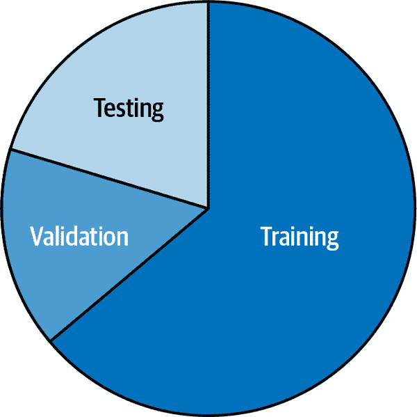

###### 图 7-13。数据集被分割为用于训练、测试和验证的块。

根据您的数据集，使用较少量的数据进行验证和测试分割可能是合理的，保留更多数据用于训练。关键是，每个分割点都是整个数据集的代表样本。如果您的数据方差较低，这可能通过相对较小的样本来实现。

每个数据分割点也应在整个数据集的平衡和多样性方面具有代表性。例如，植物疾病分类数据集的训练、验证和测试分割点应该在不同类型植物疾病之间保持大致相同的平衡。

如果数据集平衡且子组与总样本数的比率较低，则可以通过随机抽样简单实现。然而，如果存在许多不同的子组，或者某些子组少数代表，执行分层抽样可能是一个好主意。在这种技术中，针对每个子组单独执行分割，然后合并。这意味着每个分割点将具有与整体数据集相同的平衡。一个简单的例子在图 7-14 中显示。

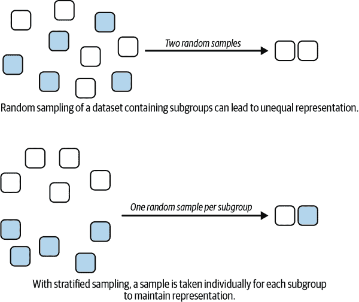

###### 图 7-14\. 当数据集分割时，分层抽样可以帮助保留子群体的分布。

### 分割数据时的陷阱

错误地分割数据将使你无法测量你的应用在未见数据上的表现，这可能导致在现实世界中表现不佳。以下是一些常见的要避免的错误：

精心策划的分割

验证和测试分割应该是整体数据集的代表性样本。手动选择每个分割中包含的记录是大忌。例如，想象一下，你决定将你认为最具挑战性的记录放在训练分割中——理论上这会帮助你的模型学习。

如果这些记录没有包含在测试分割中，你将无法真正了解模型在其上的表现。另一方面，如果你将所有最具挑战性的记录都放在测试分割中，你的模型将无法从它们的训练中受益。

决定哪些记录进入每个分割是随机抽样算法的工作，而不是你手动完成的事情。Python 库 scikit-learn 提供了一套很好的工具来执行数据集分割。

平衡和代表性问题

正如前面讨论的，每个分割具有相同的平衡和代表性非常重要。这适用于分类问题的类别和“非官方”子群体。例如，如果你的数据来自多种不同类型的传感器，你应该考虑执行分层抽样，以确保每个分割中包含来自每种传感器类型的适当比例的数据。

预测过去

对于在时间序列数据上执行预测的模型，情况会变得更加复杂。在现实世界中，我们始终试图基于过去来预测未来。这意味着为了准确评估时间序列模型，我们需要确保它是在较早的值上进行训练，并在稍后的值上进行测试（和验证）。否则，我们可能只是训练了一个可以基于当前值预测过去值的模型——这可能不是我们的初衷。在处理时间序列时，数据沿时间线向后的这种“泄漏”值得在任何时候都要考虑。

重复值

在处理大量数据时，记录很容易出现重复。你的原始数据中可能有重复，或者在分割数据的过程中可能会悄悄插入。任何分割之间的重复都会影响你测量过拟合能力的能力，因此应该避免。

分割变更

如果你尝试使用测试数据集的性能比较多种方法，重要的是每次都使用相同的测试分割。如果每次使用不同的样本集，你将无法确定哪个模型更好——任何变化可能仅仅是分割差异的结果。

增强的测试数据

如果您正在执行数据增强（我们将在下一节学习），只应增强您的训练数据。增强您的验证和测试拆分将削弱它们对真实世界性能的洞察力：您希望它们由纯粹的真实世界数据组成。如果您在增强数据上评估模型，您将无法保证它在非增强数据上的工作效果。

## 数据增强

数据增强是一种旨在帮助充分利用有限数据的技术。它通过向数据集引入模拟自然界中存在的类型变化的随机人工变化来工作。

例如，可以通过修改图像的亮度和对比度、旋转、放大特定区域或以上任意组合来增强图像 — 如图 7-15 所示。

任何类型的数据都可以增强。例如，可以将背景噪声混合到音频中，时间序列可以以许多不同的方式进行转换。增强可以在特征工程之前和之后进行。常见的增强包括：

添加性

整合其他信号，例如来自现实世界的随机噪声或背景噪声

减法

移除或模糊值，或移除时间或频率带的块

几何

旋转、移位、压缩、拉伸或以其他方式空间操作信号

基于过滤器的

通过随机量增加和减少单个值的特性

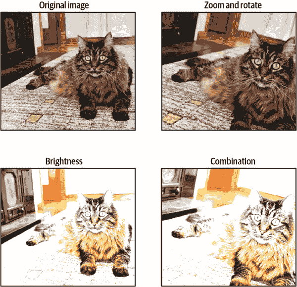

###### 图 7-15。作者的猫以多种不同的方式增强。

增强增加了训练数据的变化量。这可以有助于模型泛化。由于存在大量随机变化，模型被迫学习一般的基础关系，而不是完全记忆整个数据集（这将导致过拟合）。

数据增强只应用于数据集的训练拆分非常重要。增强的记录不应包含在验证或测试数据中，因为目标是评估模型在真实数据上的表现。

数据增强通常是通过库完成的 — 大多数机器学习框架提供了一些内置的数据增强功能，并且许多数据增强协议已经在科学文献中记录并作为开源代码提供。

增强可以通过*在线*或*离线*方式进行。在在线增强中，每次在训练过程中使用记录时都会应用随机变化。这非常好，因为它会导致大量的随机变化。然而，一些增强可能计算成本高昂，因此可能会显著减慢训练速度。

在离线增强中，每条记录都会随机更改特定次数，并将更改后的版本保存为更大的增强数据集。然后使用这个增强数据集来训练模型。由于增强是提前完成的，训练过程速度更快。然而，在使用离线增强时引入的变化较少，因为每条记录创建的变体是有限的（通常是有限的）。

应用于数据集的增强类型可以多种多样，不同的变体可能导致模型表现更好或更差。这意味着增强方案的设计必须成为整体迭代开发工作流程的一部分。这也是为什么增强您的验证或测试数据集是个坏主意的原因之一。如果您这样做了，那么对增强方案的任何更改也会改变您的验证或测试数据。这将阻止您对比不同模型在相同数据集上的性能。

设计适当的增强集是需要领域专业知识的任务。例如，专家应该根据应用程序的背景了解最佳的背景噪声类型以混合到音频数据集中。

## 数据管道

在本章的过程中，我们遇到了一系列应用于数据的任务和考虑因素：

+   捕获

+   存储

+   评估

+   标记

+   格式化

+   审计

+   清洗

+   采样

+   特征工程

+   分割

+   增强

无论您以何种顺序执行这些任务，这一系列任务都可以被视为*数据管道*。您的数据管道始于现场，数据由传感器和应用程序生成。然后将数据带入您的内部系统，在那里它被存储、连接、标记、检查和处理以保证质量，并准备用于训练和评估 AI 应用程序。一个简单的数据管道如图 7-16 所示。


###### 图 7-16\. 用于捕获和处理数据的基本数据管道；每个项目都有一个不同的数据管道，它们的复杂程度可以大不相同。

您应将您的数据管道视为基础设施的重要组成部分。它应该由干净、设计良好的代码实现，并且有良好的文档、版本控制，包括运行它所需的依赖信息。

对数据管道的任何更改都可能对数据集产生重大的下游影响，因此您必须确切了解在初始开发和未来期间正在进行的工作。

噩梦般的情景是，导致数据集创建的过程丢失，因为数据管道未记录或无法再运行。正如我们之前所看到的，数据集代表了领域专业知识的精髓，可以用来创建算法的工件。

如果用于创建该数据集的过程没有记录，那么将不再能够理解其构建中所涉及的决策或工程。这将极大地增加调试导致的 AI 系统问题的难度，并使得即使新数据可用，系统改进也非常困难。

在边缘人工智能中，高度复杂的传感器数据很常见，因此良好跟踪数据管道尤为重要。不幸的是，这种噩梦情景非常普遍！直到最近，随着 MLOps 实践的兴起，从业者们才开始像它们应得的那样重视数据管道。

MLOps，即机器学习运营，是与机器学习项目的操作管理相关的工程领域。我们将在第九章和第十章中全面探讨它。考虑 MLOps 的最重要原因之一是，通过添加新数据和训练更好的模型，可以不断改进 ML 应用程序。这是我们对抗生产 ML 项目的重大敌人——数据漂移的最重要工具。

# 随着时间的推移构建数据集

正如我们在“漂移与偏移”中所看到的，现实世界随时间变化——通常是相当快速的。由于我们的数据集只是时间片段的一个快照，它最终将不再具有代表性。使用陈旧、过时的数据集开发的任何算法将在实地中失效。

抵御数据漂移是你始终应该收集更多数据的一个强有力原因。有了持续涓涓细流的新数据，你可以确保训练和部署最新模型，在实际世界中表现良好。

边缘 AI 算法通常部署到必须容忍较差连接的设备上。这意味着很难测量部署在实地操作设备上的性能。这提供了持续收集数据的另一个关键好处²²。有了新鲜数据，你可以了解到同样算法在实际操作中设备的性能。如果性能开始下降，可能需要更换这些设备。如果没有新鲜数据，你将无法知晓这一点。

除了漂移，拥有更多数据几乎总是有益的。更多数据意味着数据集中更自然的变化，这意味着更能够推广到真实世界条件的优秀模型。

从数据中心的机器学习角度来看，数据收集本身应该是我们迭代开发反馈循环的一部分。如果我们意识到我们的应用程序或模型在某些方面表现不佳，我们可以识别出不同类型的额外数据，以帮助改进它。如果我们有一个良好的系统来持续改进我们的数据集，我们就可以关闭反馈循环，并构建更有效的应用程序。

精心设计的数据管道是实现数据集持续增长的关键工具。如果您有一个可重复运行新数据的管道，将大大减少添加新记录到数据集中所涉及的摩擦。没有可靠的管道，添加新数据可能会过于风险——无法保证它会与原始数据集一致。

# 摘要

创建数据集是边缘人工智能项目从一开始就持续进行的过程，并且从未真正结束。在现代的数据中心工作流程中，数据集将随着您应用程序的设计和需求的演变而发展。它会随着项目中每一步的迭代而改变。

我们将在 第九章 中了解数据集在应用程序开发过程中的角色。在 第八章 中，我们将专注于应用程序的设计方式。

¹ 请记住，数据集级别的样本与任意数字信号中的样本不是同一回事。一个数据集级别的样本（也称为记录）可能包含一个由多个样本组成的特征。作为一个多学科领域，边缘人工智能有很多这些令人困惑的术语冲突！

² 根据 [Statista 2022 全球消费者调查](https://oreil.ly/7qzc8)。

³ 参见 “错误的不均匀分布”。

⁴ 第九章 将更多地讨论构建边缘人工智能产品所需的团队构成。

⁵ Michael Roberts 等人，“使用胸部 X 射线和 CT 扫描检测和预后 COVID-19 的机器学习常见问题和建议”，*Nat Mach Intell* 3(2021): 199–217，[*https://doi.org/10.1038/s42256-021-00307-0*](https://doi.org/10.1038/s42256-021-00307-0)。

⁶ 这个术语在 “数据如何分割？” 中有解释。

⁷ 此外，您可能会发现自己正在结合两个或更多来源的数据。

⁸ 话虽如此，即使是混乱的公共数据集在*评估*算法时也可能会有所帮助——它们可以成为有趣角落案例的良好来源。

⁹ 将数据通过携带存储设备从一个地方传输到另一个地方的古老做法。参见这篇[Wikipedia 文章](https://oreil.ly/gqK1e)。

¹⁰ 在 Sim2Real 项目中，使用合成数据进行训练，并使用真实世界数据进行测试。

¹¹ 在这种情况下，我们的领域可能是字面意义上的，而不是比喻性的！

¹² Z 分数可以在[维基百科托管的](https://oreil.ly/3pKd5)表格中查找。

¹³ 为了确保样本是真正随机的，使用类似[NumPy](https://oreil.ly/fuBiY)提供的采样工具是个好主意。

¹⁴ Curtis G. Northcutt 等人的文章，“Pervasive Label Errors in Test Sets Destabilize Machine Learning Benchmarks”，arXiv，2021 年，[*https://oreil.ly/Zrcu1*](https://oreil.ly/Zrcu1)。

¹⁵ 要了解标签噪声的影响，可以查看 Görkem Algan 和 Ilkay Ulusoy 的文章，“Label Noise Types and Their Effects on Deep Learning”，arXiv，2020 年，[*https://oreil.ly/1LZKl*](https://oreil.ly/1LZKl)。

¹⁶ 参见“异常检测”。

¹⁷ 我们还可以使用某些机制，在训练期间给手动标记的项目更多的权重。

¹⁸ 激活来自模型末端的一层，作为嵌入。

¹⁹ 在训练期间，机器学习模型将多次接触整个数据集。预计算和缓存 DSP 结果可以避免重复在相同数据上运行 DSP 算法，从而节省大量不必要的时间。

²⁰ 有些人可能对这些使用略有不同的术语，但其背后的最佳实践是普遍适用的。

²¹ 由于您的测试分割应该是整个数据集的随机样本，所以很难出去收集一个新的。如果您的测试分割是在其余数据之后收集的，可能代表了略有不同的条件，这会影响您评估的能力。

²² 这假定数据可以以某种方式收集，以避免部署设备面临的连接问题。
