# 第八章：设计边缘人工智能应用

应用程序的设计和开发是将边缘人工智能的所有线索编织在一起的地方。这需要理解我们迄今讨论过的一切，包括问题框架、数据集收集、技术选择以及负责任的人工智能。这些还需要在相关领域设计产品所需的技能和知识，并在软件和硬件上实现设计。

在本章中，我们将详细介绍设计边缘人工智能应用程序的过程，并学习一些在真实应用中使用的最重要的设计模式，这些模式可以应用到您自己的工作中。通过本章的学习，您将对边缘人工智能产品设计的要求感到满意，并准备好开始创建您自己的产品。

设计边缘人工智能应用程序有两个主要部分：产品或解决方案本身以及使其工作的技术架构。这两个部分是相互依存的。产品设计将影响所需的技术架构，而技术的限制将影响设计。

此外，整个设计和实施过程都受到产品部署的现实情况的影响。随着数据的收集、尝试不同方法和在实际条件下测试解决方案，您的设计将需要流动地发展。

这种动态系统需要一个迭代的设计过程，其中解决方案是逐步尝试、调整和改进的。规划这一过程的最佳方式包括对你试图解决的问题以及潜在解决方案空间的深入理解。

硬件产品设计和嵌入式软件架构本身就是一个重要的课题。在本书中，我们将专注于与边缘人工智能相关的设计考虑。

# 产品与体验设计

边缘人工智能产品的目标是解决特定问题。大多数现实世界的问题都有几个组成部分，所有这些部分都必须被考虑在内，才能认为问题已经“解决”：

问题本身

产品如何解决基本问题

人的因素

产品如何满足其用户的期望

更广泛的背景

产品如何符合我们世界的现实情况

为了说明这一点，让我们考虑一个假设的例子。

让我们考虑两种不同的方法来解决跟踪举重锻炼的问题。记住，我们需要解决三个问题：问题本身、人的因素和更广泛的背景。

在我们的第一个解决方案中，运动员佩戴一款配有加速度计的智能手表。每组开始前，他们使用硬件按钮在手表上输入运动类型，并注明所举重量。在进行每组训练时，手表通过 AI 算法来追踪完成的次数，根据加速度计的数据判断何时完成一次重复动作。训练结束后，这些信息会同步到一个移动应用程序供查看。

这是否解决了问题本身？技术上来说，是的——系统允许运动员在没有笔记本的情况下跟踪他们的举重训练。从更广泛的角度来看，这个解决方案似乎也是可以接受的：健身可穿戴设备普及、价格实惠、设计实用，并在社会上被广泛接受。

然而，当考虑到人的因素时，这种设计看起来就没那么吸引人了。我们的设计要求运动员在每组训练之间向他们的智能手表输入一个重量数字。这是否比使用纸质笔记本更优越，令人怀疑。事实上，许多人发现在进行中期训练时与智能设备界面进行交互是很令人沮丧的。

让我们考虑另一个解决方案。能够理解运动员正在进行的动作以及他们所使用的重量，而无需手动输入数据，这将是非常好的。为了实现这一点，我们可以使用一台小型的电池供电摄像头，可以放置在运动员前面的地板上。它将使用计算机视觉技术来计算使用的重量并确定正在进行的动作。

从问题的根本来看，这听起来很棒——它会消除活动跟踪需要使用笔记本的必要性。从人类的角度来看，这是体验的真正改进：运动员可以专注于他们的锻炼，而不必在流程中与智能设备或笔记本交互。

不幸的是，从更广泛的背景来看，这个解决方案可能并不是一个好的选择。许多人在公共健身房进行锻炼，那里有隐私的期望。其他健身房用户不太可能在他们的锻炼期间被智能摄像头“拍摄”而感到舒适。虽然边缘 AI 摄像头可以通过不存储任何视频镜头轻松保护隐私，但向其他健身房用户解释这一点可能会很困难。在被认为是可接受的社会背景下，对于部署一个有效的设计可能会带来困难。

正如我们所见，你的设计必须考虑问题的每个方面是至关重要的。边缘 AI 可以克服许多挑战，但在许多情况下，可用性问题或更广泛的人类背景可能会抵消其好处。

## 设计原则

设计的一个良好方法是通过一套原则来提供对我们的批判性思维结构的支持。Capital One 的机器学习体验设计副总裁 Ovetta Sampson 撰写了一套专门适用于设计中 AI 使用的原则。她自己的话：

> 在 AI 时代，速度、规模和恐惧可以同时成为我们设计产品的组成部分，我们必须将设计从名词转变为一种非常有意图的动词。我们正在进入一个全新的世界。这个世界要求设计师承担更大的责任，对我们设计的智能产品产生的结果、引发的行为以及对人类的影响负责。
> 
> Ovetta Sampson

Sampson 受德国设计师 Dieter Rams 早期一套原则的启发，撰写了她的十大原则，以下包括我们对每一点的解释：

优秀的设计解决复杂问题。

在具有巨大力量但有限资源的时代，我们应专注于解决重要的问题。

优秀的设计促进健康关系。

用户存在于与其他人和其他产品的关系网络中，我们的设计应考虑到这一点。

优秀的设计要求可塑性。

AI 能够提供令人难以置信的定制功能，我们应利用它来构建更可靠地为我们设计的人群工作的更好产品。

优秀的设计使理解公司和服务我产品的公司更容易。

设计应基于对个体用户需求的准确理解，而不是市场部门的需求。

优秀的设计承认偏见。

偏见始终存在，设计师必须有意识地努力减少它，并公开产品的局限性。

优秀的设计防止不诚实。

设计师必须诚实地面对其产品可能带来的负面影响，以避免出现这种情况。

优秀的设计期待意外后果。

AI 系统中的意外后果可能系统地伤害人们，优秀的设计必须承认并绕过这一事实。

优秀的设计促进公平。

AI 可能无意中放大不公平和不正义，但精心设计的 AI 系统可以抵消这种影响。

优秀的设计考虑其对一个联结的生态系统的影响。

AI 部署的人类背景极其复杂多样，优秀的设计必须反映这一点。

优秀的设计有意地将秩序带入混乱中。

AI 产品应使我们的世界更易理解和应对，而不是使其比现在更混乱。

[Sampson 的原文](https://oreil.ly/-4WvU)提供了对每个原则的更深入解释。

这些原则基于这样一个认知：AI 通过规模获得其力量。以前需要人类监督的功能现在可以完全自动化。相关成本的降低意味着这些功能将变得更加普遍，并且对其影响也将比以往更大。

同时，AI 系统的特性意味着由单一工程团队创建的单一实现可能会被数百万完全不同的人广泛使用。这意味着系统中的任何缺陷也会被放大，影响到我们人口的大部分。

在实际操作中：一个差劲的医生可能会在他们的职业生涯中伤害数千名患者，而一个糟糕的医疗 AI 系统可能会伤害数百万人。扩展有害系统的风险是我们在设计边缘 AI 产品时需要如此小心的原因，也是使得像桑普森的原则如此宝贵的原因。

## 解决方案的范围

软件或硬件行业的任何人都可以证明，估算实施产品或功能所需工作量是非常具有挑战性的。同样，人工智能（AI）和机器学习（ML）的开发本质上是不可预测的。高质量数据集的需求和算法开发过程的探索性质使得准确预计项目需要的时间非常困难。

算法开发自然会影响硬件和软件需求。例如，机器学习从业者可能会确定，深度学习模型需要达到一定的大小才能产生可接受的结果。模型的大小将限制其可以部署到的设备类型。这意味着可能需要在进行部分算法开发工作后才能开始硬件开发过程。

AI 开发的额外变量意味着对整个开发过程的正确假设更加困难。很容易低估所需工作量，或者在大量时间和金钱投入后，发现原始计划不足以支撑项目进展，从而不得不重新开始。

AI 开发的性质使得“瀑布”开发模型非常危险。假设你的初始假设总是成立是非常危险的。如果在最后一刻发现美丽的硬件无法运行所需的模型，开发成本将会非常高昂。

那么，如何避免这类问题，并更容易地交付能正常工作的产品呢？关键是限制你的范围。虽然 AI 非常令人兴奋，对于新的应用来说天空是极限，但如果你在一开始就避免野心勃勃，避免犯错误会更容易。

自动驾驶汽车的现实是这一原则的绝佳展示。在 2010 年代中期，许多技术专家认为完全自动化的自动驾驶汽车就在眼前。深度学习革命解锁了巨大进展，车辆的能力从最早的原型跃进了一大步。一个自动驾驶的世界似乎近在咫尺。

不幸的是，虽然已经证明可以制造出一个通常能够做正确事情的自动驾驶汽车，但是在与普通公众进行高速交互时，*通常*并不被认为是可接受的。提高可靠性的最后几个百分点变得越来越难解决。虽然我们很可能会在某个时候看到自动驾驶汽车，但它们还需要几年的时间。

虽然自动驾驶汽车已经停滞不前，但一个相关但更少雄心勃勃的技术集已经变得非常成功，它们现在至少在[三分之一的新车辆](https://oreil.ly/Hz0QK)中存在。高级驾驶辅助系统，或者 ADAS，是一类旨在帮助人类驾驶员在道路上更轻松的技术。它们包括自适应巡航控制、车道居中和碰撞避免等功能。

ADAS 功能，作为边缘人工智能的一个经典应用案例，旨在帮助处理特定的、个别的任务。它们减轻了驾驶员的心理和体力负担，并帮助提高道路安全性。虽然它们的野心不及自动驾驶系统，但它们更有限的范围使它们能够更加成功。

例如，许多现代汽车配备了自适应巡航控制系统，可以在高速公路上接管加速、制动和车道居中。因为系统只需在这种受限环境下工作，所以建造具有 100%可靠性的系统要容易得多。虽然在城市街道上完全不起作用，但这没关系：高速公路驾驶占据了任何长途旅行中最多的时间，所以从驾驶者的角度来看，它几乎和自动驾驶汽车一样好。

通过解决有限的范围，ADAS 系统在今天的车辆中能够获得比自动驾驶系统更多的效用。更重要的是，开发和部署 ADAS 系统的公司能够在真实世界条件下逐步积累他们的专业知识和见解。他们可以在积极参与市场的同时不断改进他们的产品，逐步接近自动驾驶汽车的梦想。

对于任何边缘人工智能产品来说，这种方法是明智的。不要从一开始就追求宏大的理念，而是试图找出小而有用的步骤，这些步骤仍然能够提供真正的价值。确定最小可行产品：一个简单而可实现的好处，确实对用户有帮助。构建一些东西出来，看看它在现实世界中的表现，并从中迭代。

这里有一个具体的例子。想象一下，你正在为一个生产线建立一个质量控制系统。今天，所有的质量检查都是手工完成的。时间和成本的限制使得不可能检查每一个物品，因此只检查随机样本——这意味着一些缺陷可能会通过。

您的长期目标可能是使用边缘 AI 视觉系统自动检查每个项目，确保捕捉所有有缺陷的产品，并节省检查成本。然而，在项目初期可能不清楚是否可以实现这一目标。您的数据集可能没有每种可能缺陷的示例，使得您的系统难以测试。没有办法在不尝试的情况下知道它是否会工作，但失败可能会很昂贵。

让我们退一步，思考问题的范围。虽然捕捉*每一个*缺陷可能是一个很大的挑战，但能够捕捉*一些*缺陷仍然会比目前的情况有所改善，因为我们知道一些缺陷会通过检查。

训练模型以至少在某些时候检测一种特定类型的缺陷（而不是所有可能的缺陷）可能相对简单。如果与当前的手工检查过程结合使用，训练用于捕捉一种缺陷类型的模型仍然可以为工厂提供实际好处。它们虽然不能减少检查成本，但仍然能够捕捉更多的缺陷，并提高产品的平均质量。

通过将范围限制在可实现的范围内，您能够在极大降低风险的同时提供即时价值。在此成功的基础上，没有什么能阻止您对解决方案进行迭代，并逐步实现最初设想的宏伟目标。更好的是，您可能会发现，初始系统提供的价值已足够，无需进一步开发。

## 设定设计目标

在“规划边缘 AI 项目”中，我们了解到需要为我们的应用开发过程设定具体的目标。主要有三种类型的目标：系统目标，反映系统整体性能的目标；技术目标，反映算法元素内部功能的目标；以及您希望系统遵守的价值观。

要有效，目标必须得到利益相关者和领域专家的设计输入（参见“在边缘 AI 团队构建”）。您需要努力确定项目的最小可行性能特征。这些标准将用于评估项目在系统和技术层面的成功。在可能的情况下，它们应该可以使用领域的标准度量指标量化，以便您可以具体衡量您的进展。

设定系统目标的最佳方法是采用评估优先方法。

### 系统目标

边缘 AI 系统很少作为解决问题的首选和唯一解决方案开发。大多数情况下，已经存在解决方案。当我们开发 AI 应用程序时，重要的是我们花时间将我们的解决方案与现有解决方案进行比较，而不仅仅是与自身比较。如果我们只是把我们的系统与自身比较，我们几乎可以保证在开发过程中会看到改进。但要知道我们确实有比其他解决方案更好的解决方案，我们需要与它们进行比较。

这就是为什么“先评估”方法对开发如此有力。在这种方法中，开发过程的第一步是提出一组足够一般的评估指标，以便评估解决问题的任何潜在解决方案的性能——无论是 AI 还是其他。

例如，想象一下，你正在开发一个边缘 AI 应用程序，帮助零售员工知道何时货架为空，需要补货。一种方法是专注于涉及的技术。作为目标，你可能决定你的系统必须能够以 90%的准确率预测何时需要补货。

这听起来很不错：90%的准确率意味着模型在识别货架为空时正确的次数是 10 次中的 9 次，这似乎是合理的。但这个指标只告诉我们算法的原始性能；它并没有给我们任何关于我们的系统是否真正有帮助的见解。它也无法与当前解决方案进行比较：很可能一个员工已经可以在没有任何 AI 帮助的情况下 100%准确地判断货架是否为空或已满！

与其专注于技术指标，不如退一步看看更大的图景。我们系统的真正目标是使零售员工能够保证商店的货架始终有货，以便顾客有足够的产品可以购买。有了这个目标，我们可以选择一个更有意义的指标。一个更好的指标可能是给定货架被产品供应的时间比例。¹作为目标，我们可以说，平均而言，给定货架应该有 90%的时间是有货的。

我们可以将我们当前的系统——员工的手动工作——与我们的目标进行比较。虽然员工很容易确定某个货架是否为空，但他们大部分时间可能非常忙，没有时间检查商店的每个角落，确保每个货架都有货。这可能导致平均库存率为 70%。

现在，我们知道我们当前解决方案的基准性能（70%），以及我们的目标（90%）。这 20%的差距是我们的 AI 解决方案需要帮助弥补的部分。了解当前解决方案及其需要改进的方面可以指导我们的产品设计和开发过程。例如，由于我们知道问题源于员工忙于检查整个商店，我们可能会将设计重点放在确保他们能够在其他职责中轻松接收到空货架通知上。由于我们有一个方便的成功度量标准，我们可以在一些货架上部署一个初始系统，并轻松理解其有效性。

总是有可能通过指标提供的洞见来重新审视我们的假设，并决定以不同的方式解决问题，也许完全不包括 AI。例如，也许修改人员排班来解决问题最终可能更便宜，而不是在每个商店都实施边缘 AI 系统。尽管这是一个非技术性的解决方案，但它对于以评估优先的开发方法仍然是一个胜利。

记住“你就是你所衡量的东西”是很重要的——这意味着您用来量化目标的指标将对您最终选择的方向产生巨大影响。如果您测量的是错误的事物，您将最终浪费时间、金钱和机会，甚至可能使情况变得更糟。如果您能够识别出需要衡量和改进的正确事物，迭代开发的力量意味着您可以产生非凡的影响。

### 技术目标

尽管系统性目标对确保您正在构建正确的东西至关重要，但系统的技术方面也需要有其自己的一套目标。例如，了解 AI 算法当前和目标性能将帮助您将开发工作重点放在适当的领域。

例如，想象你正在为智能家居设备开发关键词识别模型。对于关键词识别模型，性能通常以*误接受率*和*误拒绝率*的组合来表达：这两个数字共同描述模型犯错的可能性。为了确保产品质量，您可以与利益相关者和交互设计师决定将误接受率控制在低于 5%、误拒绝率控制在低于 1%。这些数字将成为您的目标。

下一个任务是确定测试工作的机制。没有一种坚实的目标，提供任何好处，除非你能够测量你朝着这个目标的进展。通常，测试依赖于测试数据集，但在测试数据集上的表现与实际运行中始终存在差异，通常是在理想条件下收集的。

最可靠的指标来自于部署在生产环境中的系统。在这个阶段，确定哪些指标将在实地中可用非常有价值。由于现实世界的数据往往不带标签，因此要衡量实际性能通常是具有挑战性的。如果您难以确定如何在现场测量应用程序的性能，重新考虑项目可能是值得的：没有指标，您将无法知道它是否有效。

您可能正在利用人工智能改进现有系统，在某些情况下，您可能已经有一些用于衡量当前系统的评估指标。无论哪种情况，使用相同的指标来评估当前系统以及拟议的 AI 替代方案都是个好主意。拥有一个标杆来衡量总是很有帮助的。

鉴于人工智能开发的迭代性质，您还应考虑您可用的时间。您的目标应该是提高系统的性能，直到达到您已确定的最低可行性能水平。如果进展停滞不前，您需要决定是尝试不同的方法，还是完全放弃项目。沿途制定性能里程碑可能是有意义的，这样您可以跟踪项目的进展，并确信项目在推进中。

### 基于价值观的设计目标

要构建一个负责任的应用程序，您需要创建代表您希望您的解决方案体现的价值观的设计目标。例如，假设您正在构建一个医学诊断系统。医学专家可能会认为，将具有低于某个阈值的诊断准确度的解决方案投放市场是不负责任的。

因此，您应当与利益相关者和领域专家一致确定产品的最低性能要求。您可以利用这一最低性能来制定一组明确的推进或放弃标准，用于控制项目的发布。

对于价值观不总能达成一致，这也是为何与多元化和代表性强的利益相关者合作如此重要的原因。由于不同群体的人往往有不同的价值观，您达成的共识可能只在特定情境下适用，例如大多数利益相关者所属的文化。如果无法就适当的价值观达成一致，这可能表明您的项目存在伦理风险。

在开发工作流程中，测量和记录描述系统性能的指标至关重要。这些数据将帮助您做出推进或放弃的决策。推动项目完成往往面临着重大的组织和人际压力。记录指标并确定质量的明确书面标准，使您能够将决策脱离个人，纳入组织的流程之中。

这些标准应该延伸到现场部署。能够监控性能并在实际环境中如果系统表现不佳可能终止部署是至关重要的。由于现场可用的度量标准通常比开发阶段可用的更有限，监控可能是一个挑战。关于这个话题，第十章中会详细讨论。

# 长期支持目标

设计过程中另一个关键部分是长期支持计划。大多数 AI 部署在现场部署后需要观察和维护。漂移是不可避免的，随时间推移会导致性能下降。您选择的应用程序和硬件理想情况下应该能够报告一些指标，以帮助您了解漂移发生的速率。

这些见解将帮助您判断何时需要收集更多数据并训练新模型。您的设计目标应包括长期支持产品的目标。关于这个话题，第十章中有更多内容。

# 架构设计

边缘 AI 系统的架构是其组件部分如何组合以创建有效解决方案的方式。任何给定系统都有许多可能的架构方式。每种架构都有其独特的权衡。系统架构师的任务是分析情况并选择最大化技术优势的架构。

本章的下一节将阐述边缘 AI 应用系统架构的基础知识。软件和硬件架构是一个广泛的话题，因此我们将专注于与边缘 AI 相关的部分。我们将建立一个坚实的基础，并提供一套设计模式，可用于解决许多不同的问题。

## 硬件、软件和服务

边缘人工智能应用由三个主要组件组成：硬件、软件和服务。

硬件包括边缘设备本身，其处理器、内存和传感器——我们在第三章中已经遇到的大量多样性。它还包括设备的供电方式以及它们与更广泛世界的通信方式。

软件是赋予系统生命的魔力。它始于允许软件与硬件本身（包括传感器、外围设备和网络设备）进行接口的低级驱动程序。它涵盖了所有可能在设备上运行的信号处理和 AI 算法。最重要的是，它包括解释由 AI 算法输出的信号并确定如何对其进行操作的所有应用逻辑。

服务是边缘 AI 系统可以接口的外部系统。它们可能包括通信网络、无线系统、物联网管理平台、Web API 和云应用：任何位于边缘系统外部并通过某种渠道进行通信的东西。这可能是您自己的基础设施，也可能由第三方提供。

有效的边缘 AI 架构涉及将这三个组件以创造性方式结合起来，以在给定情况下提供最佳的权衡平衡。这需要对问题、约束和领域有深入的理解。这就是为什么在设计过程的这个阶段开始之前进行全面探索非常重要的原因。

您对情况的理解将影响您对硬件、软件和服务的使用。例如，连接性较差的环境可能会迫使您专注于高性能硬件，并且无法享受某些服务的好处。紧密约束的旧设施（参见“绿地和旧地项目”）硬件平台可能会鼓励您在软件使用上更具创造性。对复杂软件和大型模型的需求可能会导致云 AI 服务在您特定应用中发挥重要作用。

在边缘 AI 架构中一些重要的概念我们已经遇到，包括异构计算（参见“异构计算”）和多设备架构（参见“多设备架构”）。这些是我们将遇到的一些最常见架构的关键组成部分。

## 基本应用架构

简单总是一个不错的选择，你应该始终从能够应付的最简单架构开始。图 8-1 显示了典型边缘 AI 应用的结构。

架构的核心是*应用循环*。这是一系列重复步骤，用于捕捉和处理信号，运行 AI 算法，解释其输出，并使用结果做出决策和触发操作。这是一个循环，因为这些步骤会反复运行，设备会不断地接收传感器数据流。

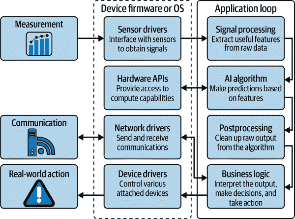

###### 图 8-1\. 边缘 AI 应用架构

应用循环由*设备固件或操作系统*部分支持。² 这些组件在硬件和软件之间提供了一层抽象。它们通常提供便捷的 API，应用循环可以用来控制硬件。典型任务包括从传感器读取数据，发送和接收通信，以及控制连接的设备（如灯光、扬声器和执行器）。

正如我们在 “异构计算” 中看到的那样，许多设备具有多个处理器。在我们的图表中，*硬件 API* 块表示允许在所选处理器上执行计算的抽象层。例如，深度学习模型的操作可以在单独的神经网络核心上进行，以提高速度和效率。

###### 注意

在我们继续之前，回顾一下 “边缘 AI 硬件架构” 也可能是有帮助的，以便记住边缘 AI 硬件的结构方式。

### 基本流程

在最基本的应用中，有一个软件流水线，全部运行在一个设备上，接收传感器数据，进行处理并做出决策。这在 图 8-2 中有所展示。

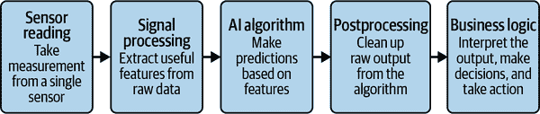

###### 图 8-2\. 基本边缘 AI 应用流程

许多成功的应用程序使用这种流程，这应该是您开发软件架构时的起点。通常，流程中的 AI 算法是一个单独的机器学习模型。例如，智能安全摄像头可能使用这种流程——使用训练用于检测人员的视觉模型——作为触发器发送警报。图 8-3 显示了带有现实世界步骤叠加的相同图表。

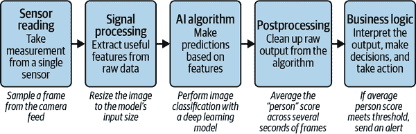

###### 图 8-3\. 应用于智能摄像头设计的基本流程

### 集成流程

另一种常见的方法是使用一组算法或模型，如 “组合算法” 中所述。在这种情况下，相同的传感器数据被输入到多个模型中，这些模型生成相同类型的输出，并将它们的结果组合起来。可能看起来像 图 8-4。

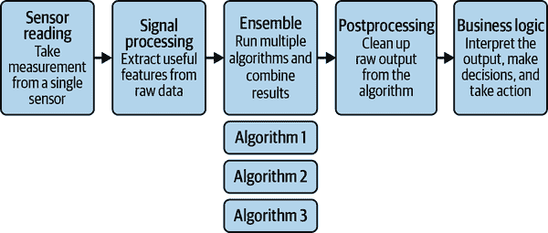

###### 图 8-4\. 一个集成流程

在一个集成系统中，通常所有算法都产生相同类型的输出。例如，您可以创建三种不同类型的图像分类器的集成系统，每种分类器都经过训练以预测图像中是否存在人物。通过组合三种不同类型算法的输出，您可以平均每种算法的优缺点，希望得到比任何单个算法都更少偏见的输出。

### 并行流程

还可以组合执行不同功能的算法。例如，您可以将分类模型与异常检测模型结合起来。异常检测模型的输出被应用程序用于理解输入数据何时超出分布范围，因此分类器不能信任。

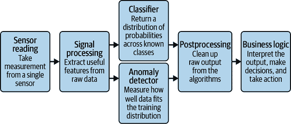

###### 图 8-5\. 并行流程

在并行流程中（参见图 8-5），模型的输出可以在后处理步骤或业务逻辑中合并。例如，如果一个模型的输出用于调节另一个模型的输出（例如我们的分类和异常检测示例中），这种调节可能在后处理步骤中完成。如果多个模型的输出用于驱动业务逻辑决策，则模型的输出将在那里汇集。

并行模型并不一定意味着并行处理（如多任务处理）。许多嵌入式处理器无法进行多线程计算，因此每添加一个模型到管道中可能会增加应用程序的总体延迟和能耗。

### 串行流程

在串行运行模型也可以非常有用。如在图 8-6 中所示的流程中，一个算法的输出被馈送到另一个算法，无论是否经过后处理。

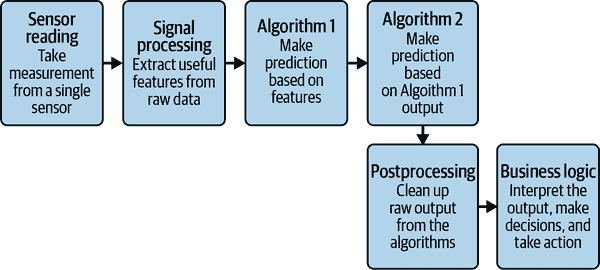

###### 图 8-6\. 串行流程

当您想要使用一个模型从原始输入中提取特征，然后使用另一个模型理解特征变化时，串行流程非常方便。例如，您可以使用姿势估计模型从照片中识别人的手臂和腿的位置，然后将这些位置传递给分类模型以确定他们正在做哪种瑜伽姿势。

### 级联流程

另一种巧妙地使用算法的方法是在级联内部使用。级联流程如图 8-7 所示。

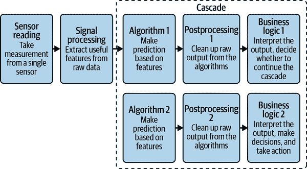

###### 图 8-7\. 级联流程

级联流程旨在最小化推断运行的延迟和能耗成本。例如，想象一个电池供电设备中的始终开启的关键词检测系统。用于关键词检测的模型可能相对较大和复杂，这意味着始终运行它会迅速耗尽电池。

相反，我们可以运行一个更小、更简单的模型，仅用于检测语音。这是我们级联的第一层。检测到语音后，输入会传递到级联的第二层，即完整的关键词检测模型。由于完整的关键词检测模型运行较少，能量得以节省。

级联可以具有任意数量的层。根据应用程序的不同，级联中的每一层可能还具有其独立的信号处理算法。在某些情况下，达到级联的某个阶段甚至可能触发从另一个源获取数据，例如提供更好信号但使用更多能量的高质量麦克风。

通常情况下，调整级联中较早的模型以获得高召回率是有意义的（见“精确度和召回率”），这意味着在决定某物是否潜在匹配时会保守一些。这种配置仍将节约能源，相比于单一大模型，但会降低早期模型的准确性风险，从而避免丢弃有效输入。

### 传感器融合流

到目前为止，我们见过的所有架构都是处理单一输入的。在传感器融合流程中，正如在图 8-8 中所示的那样，来自多个传感器的输入被馈送到同一个 AI 算法中。

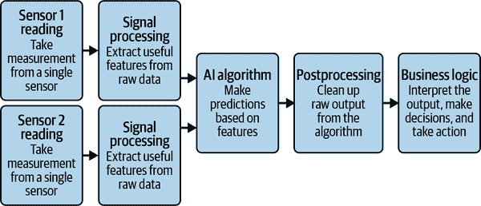

###### 图 8-8\. 传感器融合流

如果使用不同类型的传感器，则每种传感器通常需要其自己的信号处理形式，以创建 AI 算法使用的特征。尽管如此，也有纯信号处理的传感器融合方法。

传感器融合的一个经典示例是在睡眠监测可穿戴设备中，通过心率、体温和运动传感器的信号融合，以精确预测用户的睡眠阶段。传感器融合还可以与本章中见过的任何其他流程结合使用。

## 复杂应用架构和设计模式

基本应用架构可以与硬件架构的变化结合，以产生提供有价值好处的更复杂系统。这些经过验证的设计模式可以应用于许多不同的项目。

### 异构级联

在异构硬件架构中（参见“异构计算”），单个设备内可用多个处理器或协处理器。例如，单个设备可以同时具备节能的中端 MCU 和更强大但功耗更高的高端 MCU。

这种类型的硬件可以与级联流程中编写的软件结合使用（见图 8-9），以实现异构级联。级联的前几层在低端处理器上运行，从而增强节能效果。后续层涉及更复杂的算法，因此在高端处理器上运行。在任何给定时刻，只有一个处理器处于开启状态并消耗大量能量。

不同类型的硬件越来越多地包括为高效运行深度学习模型而设计的加速器。这些硬件可以非常适合运行级联的各个阶段。这种方法在许多关键词识别应用中被使用。

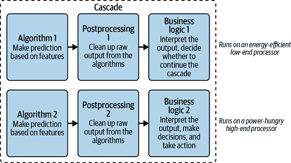

###### 图 8-9\. 异构级联

### 多设备级联

如图 8-10 所示，级联可以跨越多个设备。例如，智能传感器可能会使用简单的机器学习模型检查数据。如果检测到特定状态，它可能会唤醒一个更强大的网关设备，该设备可以更彻底地分析数据。

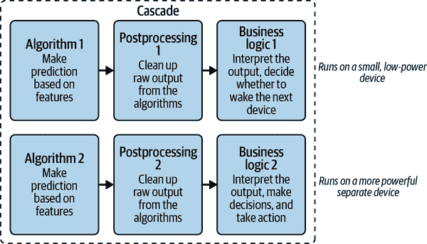

###### 图 8-10\. 多设备级联

第二阶段设备可以使用第一阶段传输的数据，也可以使用自己的传感器捕获新数据。这些设备可能在物理上是不同的，如智能传感器和网关设备。它们也可以作为同一物理产品内的独立 PCB 组合在一起。

在某些情况下，完全分开的产品可以组成级联。例如，廉价的现成摄像陷阱（使用红外传感器检测到运动后拍摄照片）可以作为级联的第一阶段，随后唤醒与相同存储设备连接的强大 SoC，根据其内容选择保留或删除照片。

### 云端级联

在带宽不是问题的地方，级联可以跨越设备和云端。这是智能音箱中的典型模式，配备了数字助理，使用始终开启的关键词检测模型尽可能低延迟地在设备上检测关键词。一旦检测到关键词，它们将后续音频直接流向云端，在那里，一个庞大而复杂的模型（过大以至于无法部署到边缘设备）转录和解释用户的语音。

在图 8-11 中展示了一个复杂的四阶级级联，利用了多个设备上的模型以及云计算。听起来可能有些复杂，但这与现代手机使用的流程相似。

前三个阶段发生在设备上，跨越两个不同的处理器：低功耗始终开启处理器和深度学习加速器。当低功耗处理器上的模型检测到语音时，会唤醒更强大的处理器，用于寻找关键词。如果检测到关键词，设备上的转录模型会尝试将后续音频转换为文本。一旦转录完成，文本被发送到云端，在那里使用大型自然语言处理模型确定其含义并作出响应。

这里的重要折衷在于能量、带宽和隐私，以及云系统的长期维护需求。作为交换，我们可以使用在设备上无法放置的或出于安全考虑不想本地部署的过大模型。重要的是确保这些回报是值得的，因为作为交换，我们正在放弃大部分边缘 AI 的优势。

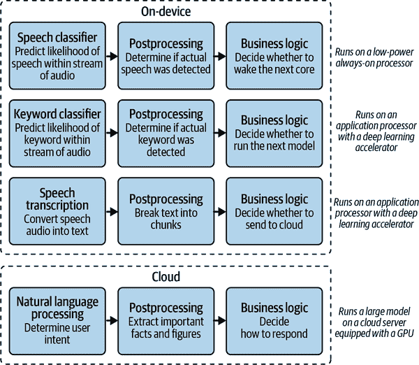

###### 图 8-11\. 用于关键词检测的云端级联

### 智能网关

有时，AI 逻辑可能位于*边缘*附近，但不是在网络的实际叶节点上。例如，物联网传感器网络可以收集有关工厂运行的许多不同类型的数据。没有一个单独的传感器可以访问所有数据，但它们都将其发送回网关设备。

通过在网关设备上运行边缘 AI 算法，可以一起分析所有数据，这可能会更深入地了解整个系统的操作。通过在网关进行处理，传感器可以保持小巧、廉价和高效。它们只需捕获和转发数据；网关可以处理智能功能。

### 人在回路

在某些情况下，允许 AI 算法无约束地做出决策可能并不一定安全。这通常是指糟糕决策风险极其严重的情况。以下是一些鲜明的例子：

+   医疗应用，一个错误的诊断或糟糕的操作程序可能会危及生命

+   有潜力造成伤害的大型机械，如自动驾驶汽车或工厂设备

+   安全和国防应用，可能导致故意伤害的地方

也有许多更微妙的例子。例如，如果 AI 用于执行体育规则——也许分析视频镜头以检测犯规行为——模型中的偏差可能导致对参与者的不公平对待。

这些挑战意味着通常需要设计一个需要人类监督操作的系统。这可以通过不同的方式实现。在一种人在回路架构模型中，人直接参与每一个决策。例如，医疗诊断设备可能会指示患者患有某种疾病，但仍需要医生解释信息并根据自己的判断作出最终决定。

在另一种模型中，人类作为被动观察者，除非他们认为有必要干预。例如，虽然自动驾驶汽车可以自由移动，但驾驶员仍需注意路况，并准备随时接管驾驶。在这种情况下，自动驾驶汽车通常使用 AI 系统来检测驾驶员未注意的情况，以防止其忽视责任。值得注意的是，围绕这种模型是否有效存在重大争议。如果不需要互动，人类往往会失去注意力，这可能会损害他们干预的能力。

在第三种模型中，没有直接的人类监督，但算法决策的样本会发送给人类审计员进行检查。整个过程会被监控以确保可靠性，但在特定活动期间无人能够实时干预。这种方法在应用的长期监控中至关重要，并且将在第十章进一步讨论。

## 使用设计模式进行工作

现在我们已经遇到了各种设计模式，它们应该为你的项目提供一些很好的起点。当然，现实情况并不总是能完美地映射到教科书模式上。不要害怕调整这些想法，以适应你个人情况的需求。

正如我们所学到的，边缘人工智能工作流本质上是迭代的。使用设计模式时采用迭代方法是有帮助的。以下是你可以遵循的逐步工作流程：

1.  确保你花了一些时间探索你的数据集，并理解你可能需要使用的算法类型。

1.  从你能使用的最简单的设计模式开始：通常会是图 8-2，特别是在处理单一设备时。

1.  尝试将你的问题映射到这个模式上；撰写一些文件来描述它，包括图表，并列出其优缺点。

1.  在开发过程中开始迭代，牢记选择的设计模式。

1.  如果看起来可能需要更复杂的东西，请跳到你能接受的下一个最简单的模式。

1.  继续迭代和调整，直到找到一个可行的方案。

不要被诱导去选择一个比你所需更复杂的设计模式。额外的复杂性会拖慢你的开发过程，并创建额外的约束，迫使你朝某个特定路径前进。所有这些都会带来风险，而在人工智能项目中成功的最重要方法是将风险降到最低。

# 设计选择的会计处理

我们针对特定问题提出的设计受我们个人看法的影响，这意味着它们可能会微妙地编码我们自己（或我们团队的）偏见。此外，架构本身具有固有的偏见。架构代表了一系列妥协，这些妥协指导了解决方案的结果朝某个方向发展。这并不一定是故意的；当我们从众多选项中选择一个特定的选项时，这就会发生。

有三种主要类别的偏见，它们源于设计过程（而非数据集）：

产品偏见

产品代表对问题的特定解决方案。根据其性质，它代表了对问题解决方式的看法。它体现了随着这种看法而来的限制和权衡。所有这些都是不可避免的，但重要的是我们承认这导致了偏见。

例如，想象我们正在构建一个智能家居恒温器，它可以根据用户活动预测调整温度的最佳时机。我们可能需要在一个基本架构和一个智能网关架构之间做选择：基本架构包含一个装有高分辨率传感器和强大处理器的单一设备，或者智能网关架构，其中每个房间安装了廉价的低分辨率远程传感器，并通过无线与执行处理的中央枢纽通信。

这些权衡指导我们的产品朝着首选解决方案发展。具有有限视野但传感器优越的系统，很可能在开放式房屋或小公寓中效果更好。具有远程传感器的系统可能在有多个不同房间的房屋中效果更好。

由于每个产品设计都是为特定目的创建的，因此选择最适合解决您正在解决的问题的设计非常重要。如果您正在设计智能家居产品，您可能需要进行一些研究，了解您的目标客户所住房屋的风格。这可以指导您的设计过程，并帮助您选择合适的架构。

算法偏见

算法本身具有固有偏见。与架构一样，每个 AI 算法的设计体现了对广泛问题的特定解决方案。数学家和计算机科学家努力寻找通用工作的算法，适用于许多不同类型的输入，但实际上每种算法都有适合某些问题而不适合其他问题的基本假设。

例如，我们可能正在尝试设计一种农业产品，该产品使用目标检测来计算农场中的动物数量。有许多不同风格的目标检测算法可供选择。其中一种风格是单次检测器（SSD），³ 它使用深度学习模型来预测感兴趣物品周围的精确边界框。另一种风格是更快对象，更多对象（FOMO），⁴ 它使用更简单、更快速的方法来识别对象的中心，但不会绘制边界框。

可以使用任何算法构建有效的产品。尽管如此，不同的算法会做出不同的选择，这些选择将在产品的性能中显而易见。例如，由于它们的损失函数构造方式，SSD 模型更擅长识别较大的物体而不是较小的物体。在生产中，这可能导致产品在放置在较小的田地中效果更好，因为动物更接近并占据更多的图像框架。相比之下，当对象的中心不太靠近时，FOMO 效果最好。这意味着当动物更分散时，它可能效果最好。

与产品偏见一样，选择算法时考虑最终部署的情况非常重要。如果产品将用于大田间的羊群计数，FOMO 可能是正确的选择。如果产品将用于牛舍内的牛计数，SSD 可能是更好的选择。无论哪种情况，您都应确保产品在上市前经过充分测试。

在这里，你的数据集也会影响你的决策。正如我们所见，确保你的数据集代表真实世界条件非常重要。如果你的数据集充分代表了产品在实际使用中可能遇到的情况，“现场”，你将不会被算法偏差所惊讶。如果你的数据集不具有代表性，偏差将是无法检测的，并且你可能发现你的系统表现不佳。

缓解算法偏差的一个有趣方式是使用集成方法，如“组合算法”中所述。使用多种算法的集成将平滑极端情况，使你接近理想的方法。集成方法通常在机器学习竞赛中获胜，目标是在未知数据集上获得高性能。尽管如此，这并不意味着集成方法免于偏差。而且，因为它们涉及运行多个算法，这在边缘设备上可能成本过高。

部署偏差

当一个系统被部署在其设计目的之外时，就会出现这种类型的偏差。一个为解决特定问题而创建的产品在不同上下文中没有被设计的保证。不管开发人员如何努力减少偏差；当应用于与其设计用途不同的情境时，一切打破先前的假设。

例如，考虑一个设计用于监测患者生物信号并预测特定健康状况可能发生的医疗设备。该设备经过精心设计，其固有的权衡与其设计用于预测的健康状况非常匹配。它使用的算法是基于高质量、代表性数据集从具有相同病症的患者中收集而选定的。

该设备在设计用于的病患上可能表现良好。但是，如果医生试图使用它来预测一个呈现类似但细微差异的相关病症呢？

由于产品是围绕原始病症设计的，没有办法在没有大量新数据的广泛测试下知道它在新病症上的工作情况。即使看似对某些患者有效，可能会有其他患者出现悄无声息的失败，危及其生命。医生的偏见，即假设条件足够相似以使产品继续工作，反映在结果中：患者的健康可能会受到威胁。

为了最小化部署偏差，重要的是你的产品使用者理解其设计限制，并且负责任地避免误用。在生死攸关的情况下，例如医疗设备，其中一些可能甚至会被立法规定：设备可能会因具备特定条件而获得法律批准使用，并且没有其他条件，只能由持牌医疗专业人员使用。

公开关于产品运行的信息有巨大的好处。例如，您可以选择分享有关用于创建产品的数据集的关键事实，或者关于您的产品在各种情景下表现的统计数据。这样，用户就可以了解产品的确切性质和局限性，从而更不容易在错误的环境中错误地部署它。

有些产品如此容易被不适当地部署，以至于最好留在草图阶段。例如，2022 年俄罗斯入侵乌克兰导致一些评论员呼吁更多开发自主武器系统⁵。然而，无论是政府还是恐怖组织，不可避免的滥用潜力，无论是在战场上还是在战场外，已经促使许多 AI 从业者承诺不参与致命 AI 的工作。您可以在 [*stopkillerrobots.org*](https://oreil.ly/fMIPF) 上自己做出这个承诺。

## 设计成果

将设计过程看作是产生的工件，这是非常有帮助的。以下三个侧栏阐述了与设计过程的初步探索相关的最常见的注释和文档。

我们开始的过程是理解问题并提出一些潜在解决方案。

我们的下一步是确定可行的解决方案类型。

一旦我们有了我们认为可行的解决方案，我们可以开始创建设计。

# 摘要

由于设计和开发过程在项目进行中是迭代的，所以这些文件都应被视为活动文档——您可以在进展过程中创建新的更新版本。

一旦您有了所有这些材料的早期版本，您可以进行审查，并确保产品看起来仍然可行，并在可接受的风险门槛内。如果情况看起来不错，那么现在是进行积极开发的时候了。

¹ 一个更高级的度量标准可能涉及商店收入，假设更高的收入更好——但这个指标受到更多因素的影响，因此是衡量我们系统有效性的一种更嘈杂的方式。

² 系统使用固件还是操作系统取决于硬件和应用程序，如 “边缘 AI 处理器” 中讨论的那样。

³ 请参见 Wei Lu 等人的 [“SSD: 单次多框检测器”](https://oreil.ly/ZU6-S)，arXiv, 2016 年。

⁴ 请参见 Louis Moreau 和 Mat Kelcey 的 [“宣布 FOMO（更快的对象，更多的对象）”](https://oreil.ly/NdEG-)，Edge Impulse 博客，2022 年 3 月 28 日。

⁵ 如 Melissa Heikkilä在 [“为什么军事 AI 初创公司的业务正在蓬勃发展”](https://oreil.ly/RekGr) 中所述，*MIT Technology Review*, 2022 年 7 月 7 日。
