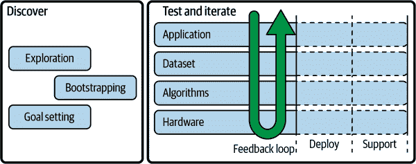
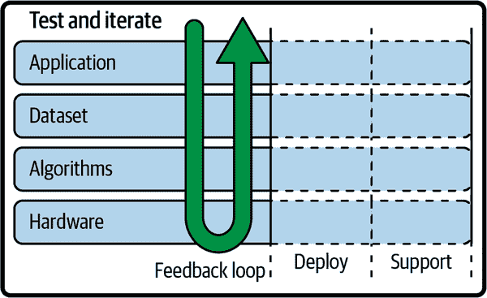
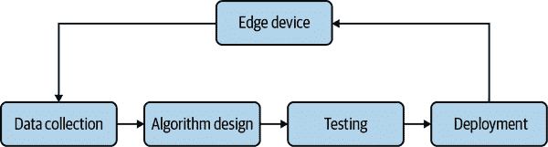
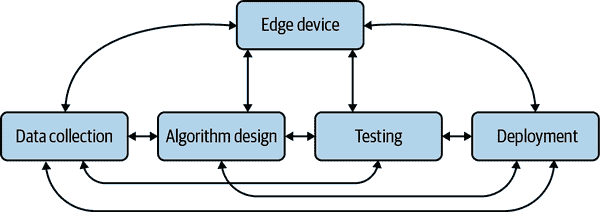

# 第九章：开发边缘 AI 应用

开发边缘 AI 应用是一项重大任务。在本章中，我们将熟悉这个迭代开发模型，该模型有助于在真实项目中成功部署边缘 AI。

# 边缘 AI 开发的迭代工作流程

开发成功应用的过程基本上是简单的：从小处开始，进行增量变更，测量您的进展，并在达到目标时停止。当您引入组成边缘 AI 技术的大量移动部件时，复杂性就会出现。本书的本节旨在提供一个具体的过程，您可以通过该过程最大化成功的机会。

正如我们在“边缘 AI 工作流”中听到的，该工作流背后的核心理念是反馈环的力量。我们的目标是在过程的各个阶段之间创建反馈循环，从而不断改进对问题、解决方案以及最佳匹配方法的理解（如图 9-1 所示）。

尽管这是一个迭代过程，但其中某些部分比其他部分更具迭代性。我们最早处理的步骤——探索、目标设定和引导启动——是我们在进行前期规划时要弄清楚我们想要做什么以及如何可能去做的部分。它们首先在前期规划中出现，然后在定期重新评估中出现，随着新信息的到来：也许是在初始部署之后，或者是当大量新数据显现出来时。

###### 图 9-1\. 反馈环是边缘 AI 工作流的核心，最初在“边缘 AI 工作流”中介绍。

工作流程的中间部分，在*测试和迭代*部分，更加彻底地进行迭代。它们是开发、测试和改进的紧密螺旋的一部分，旨在朝着您设定的任何目标逐步靠近。您可以将它们看作是四个相互影响、朝向满足您需求的并行开发轨道。

部署和支持部分也是迭代的，但与核心部分相比速度较慢。这是它们自身的特性：一旦部署并交付给用户使用，系统的开发注定会放缓。然而，这是最关键的反馈开始到来的阶段，也是你的系统必须开始适应不断变化的现实世界环境的阶段。你越早部署并获取到这些洞察力，效果就会越好。

本章的下一节将详细讲解工作流中的每个主题，并概述一些关键活动和概念。

## 探索

探索是我们开始理解我们试图做什么的方式。它包括我们在第六章中学到的许多工作类型，并包括以下主要任务：

+   描述你试图解决的问题（参见“描述问题”）

+   确定是否需要边缘 AI（参见“我需要部署到边缘吗？”和“我需要机器学习吗？”）

+   弄清项目是否可行（参见“确定可行性”）

+   通过将问题映射到已知方法来定义问题（参见“定义问题”）

+   分析你提出的解决方案可能存在的风险、危害和意外后果（参见“道德可行性”）

+   绘制利益相关者并了解他们的需求和期望（参见“利益相关者”）

+   进行初步数据探索

最后一步在很大程度上取决于你是否有能力此时收集数据集，即使是一个小型和有限的数据集。强烈建议在尝试确定可行性时手头有一些数据：数据在 AI 项目中代表了很大的风险，尽早开始理解它非常关键。

至少应该了解到收集足够数据的难度有多大。这可能是你面临的主要挑战之一，在发现无法获取数据之前进行大量工作是灾难性的。

如果目前无法开始数据探索，应尽早进行。

## 目标设定

目标设定是我们试图描述我们的目标所在的地方。在第 6 和第八章中我们看到了各种目标设定活动。

这一过程包括以下关键组成部分：

+   确定在部署前后将使用的评估指标（参见“设定设计目标”）

+   为你的设计设定系统性目标（参见“系统性目标”）

+   为你的实施设定技术目标（参见“技术目标”）

+   与利益相关者达成价值共识（参见“利益相关者”）

+   创建基于价值观的框架来解释进展（参见“基于价值观的设计目标”）

+   设置评估项目的审查委员会（参见“多样性”）

+   设计测试算法和应用程序的方案

+   规划长期支持目标

+   决定如何决定是否中止项目

目标必须是可衡量的才有意义，因此其中许多项目依赖于具有有效测试和评估系统的过程。这将在第十章中深入讨论。

### 停止项目

边缘人工智能（Edge AI）是一项风险较高的业务，很大一部分项目无法投入生产。这是很自然的，因为开发过程的重要部分是要了解是否真的可以利用现有资源来解决问题。

然而，当我们对一个项目投入了个人、财务和组织资源时，很难判断何时退出。这就是为什么在项目开始时就确立您的最低可行性能特征至关重要的原因。您需要为每种类型的目标（系统性的、技术性的和伦理性的）确定这些最低标准。例如，如果您的系统一旦部署就没有您期望的业务影响，那么拥有高性能算法（按照技术指标）也是无济于事的。

失败是发现和创新迭代过程中的关键部分，特别是涉及人工智能时。重要的是，在投入过多资源之前，识别出开发方向不起作用的时机：尽早失败，快速失败。如果您能早期识别出一个无效的努力，您可以迅速改变目标，避免花费过多时间。

因此，为您的项目设定里程碑和“继续/中止”标准至关重要。在设计和开发的每个阶段，您都应该准备好衡量当前状态，并决定当前方法是否有效，或者是时候尝试其他方法。在早期设定目标阶段写下这些里程碑是个好主意，因为这将迫使您从早期就对项目进行批判性思考。随着进展，您可以随时重新评估您的目标。

有些问题是棘手的，特别是在数据不足时。在这些情况下，您可能不得不做出终止项目的艰难决定。为了避免被这种情况出其不意地打击，您应该在开始之前就了解时间和金钱预算，并制定达到一定进展所愿意投入的限制。如果您看起来还不够接近，您可以做出停止的决定。与其花费整个预算最后一无所获，还不如在半途中停止一个无果的项目并重新规划。

## 启动引导

启动引导（Bootstrapping）是我们从理解问题到第一次迭代解决方案的过程。它涉及到与数据亲密接触并开始构建的过程，这些主题我们在第七章和您正在阅读的本章中都有涉及。关键任务包括：

+   收集最小数据集（见“估计数据需求”）

+   初步尝试确定硬件要求（见“设备能力与解决方案选择”）

+   开发最简单可能的初始算法

+   构建最简单可能的端到端应用程序（见图 8-1）

+   进行一些初步的实地测试和评估（见第十章）

+   对早期原型进行负责任的人工智能审查

我们之前遇到过一些这些概念，但这是我们第一次将整个工作应用程序的所有组件集成在一起。

### 为何引导启动有益

引导启动的目标是快速获得至少有些类似原型的东西，即使它非常有限、不完整并且做出了一些错误的假设。但是，如果可以单独开发组件并在最后将它们集成在一起，为什么要浪费时间在低质量的原型上呢？

纸上谈兵和体验一个实际的技术产品之间存在巨大差异，尤其是当技术设计用于与物理世界互动时。通过迅速实现一个端到端的原型，你将为自己、团队和利益相关者提供机会，让他们尝试并理解它如何解决你试图解决的问题，并在很早之前识别出许多潜在问题。

迭代开发的核心是测试你的假设：迅速确定某个决策是否正确，以便有时间进行调整。你可以（并且必须）在系统的各个组件上进行这样的操作，但对于像边缘人工智能产品这样复杂的东西，你确实需要看到所有部分一起运作。在任何复杂系统中都存在新兴现象和反馈循环，只有在看到它与现实世界互动之后，你才能真正理解它的工作方式。

早期测试的巨大好处不言而喻，能够在产品尚未完全准备好之前进行全面演示也具有巨大的说服力，无论是对利益相关者、潜在客户还是你自己的团队。这可能是解锁完成项目所需的支持和资源的关键。另一方面，如果你发现早期演示并没有说服任何人，这是一个很好的信号，表明你可能需要重新审视设计。

你并不总能在早期阶段创建完整的端到端流程。没关系：你仍然可以从集成系统的任何组件中获益。不过，如果一个项目本质上在最后阶段才能整合，那么它带来的风险程度就要高得多。

### 开发基准算法

在“系统目标”中，我们了解到需要采用评估为先的方法，不断测量我们系统的性能，并与基线进行比较。在许多情况下，有一个现有的非人工智能系统，我们可以测量和比较其性能。无论哪种方式，一旦我们开始开发我们的算法，我们应该立即建立算法性能的基线，以便努力超越它。

要帮助说明这一概念，让我们想象我们正在建立一个系统，以减少生产线上巧克力质量检查所需的时间。我们的宏伟想法是，我们可以训练一个深度学习视觉模型，识别个别巧克力中的特定缺陷，并实时向生产线上的工人提供反馈。

首先要做的是建立我们当前的性能基线。也许质量控制目前是由员工手动完成的，每盒巧克力需要 30 秒。与相关利益相关者一起，我们可能决定我们的目标是将时间缩短到最多 10 秒。

我们的第一个算法——以及支持它的硬件和软件——应该尽可能简单地朝着这个目标前进。例如，与其训练一个复杂的深度学习模型（这将需要收集大量数据集，耗费时间和金钱）来识别许多不同类型的故障，也许我们可以使用一些更简单的计算机视觉技术（如在“图像特征检测”中）来识别单一类型的故障的特征。

这种更简单的算法将更容易作为基本原型实现。然后，我们可以在生产线上尝试它。例如，我们可以设置系统，在质量控制工作的员工发现一个巧克力盒有非常具体的缺陷时发出警报。虽然信息有限，但这些额外的信息可能仍然会让员工的生活更轻松，并节省几秒钟的时间。

现在我们已经使用简单实现的算法基线，我们知道我们必须超越它。在某些情况下，简单的基线可能证明足够有效，这可能会改变我们对必要性的看法。例如，如果节省了足够的时间，放弃收集训练深度学习模型所需的大数据集的开支可能是合理的：我们的利益相关者可能对简单基线的性能非常满意，或者至少是其更精细化的版本。

建立一个简单基线算法的方法有助于防止我们过度设计，即投入大量资源开发复杂解决方案来解决尚未被证明为必要的问题。它还为我们的基于评估的方法提供了坚实的起点，迫使我们建立进行现实评估所需的流程，并允许我们测量相对于现有系统的改进速度。

一个基线还可以帮助确定所需的架构。例如，如果基线能处理大部分输入，最佳整体解决方案可能是一个简单的算法来覆盖大多数输入，再结合一个能够处理更具挑战性输入的复杂 ML 模型级联。

### 我们的第一台硬件

能够评估我们基线算法通常意味着我们已经得到了硬件设计的初始迭代。此时的目标应该是创建一个可部署的东西，这样我们就可以在实地测试它。然而，这并不意味着它必须满足与我们最终产品相同的要求。

计算机硬件的种类可以从通用型到特定应用型。在一个极端，现代个人电脑设计成能够运行几乎任何软件，并且可以与你能想象到的任何硬件集成。在另一个极端，一个基于定制微控制器的板子可能被设计成用于特定产品内的单一功能。

越是通用和功能强大的硬件，开发起来就越容易。这个原则意味着在更强大的系统上（如运行 Linux 的 SoC 开发板（见“片上系统”））原型化通常比在你的团队自行设计的小型、低功耗、特定应用的设备上要快得多。

有了这个想法，通常最好在更通用、功能更强大的硬件上实现产品的第一次迭代，即使这可能会牺牲一些设计目标。例如，可以很容易地在一个 Linux SoC 板上使用一些快速而简陋的 Python 脚本实现我们的巧克力质量控制系统的第一次迭代。

该板子可能比我们长期解决方案中负担得起的要昂贵和耗电，但对于初始原型来说，仍能完成任务——并且开发时间只需一小部分。一旦在更通用的硬件上验证了概念，你将有足够的信心投资于设计一个更小、更高效设备以及调整算法以适应。

### 负责任的 AI 审查

部署和测试我们应用程序的第一个端到端原型，使我们能够开始衡量性能，并更好地想象最终版本在实地的工作方式。这还需要我们进行一些初步的算法开发，通常涉及进一步理解我们的数据集及其限制。

所有这些新发现的额外信息可以帮助我们测试我们在确定道德可行性（如在“道德可行性”中）和陈述基于价值的设计目标（见“基于价值的设计目标”）时所做的一些假设。你应该采取系统化的方法来利用初步测试结果来探索所有这些假设。

例如，在我们为巧克力工厂的质量控制系统设计的情况下，我们可能假设我们的系统能够通过允许员工在相同的时间内完成更多工作来减轻员工的负担。然而，通过探索原型系统的反馈，我们可能会发现系统通过提供信息而不是创建压倒性体验增加了员工的压力，导致了疲劳。这一发现可能会影响我们产品的设计：我们可能决定探索在不造成员工过度负担的情况下如何为他们提供信息的方法。

采用评估优先方法，我们能够收集关于系统性能的关键指标，并根据我们的目标和价值观进行分析。例如，从公平性的角度来看，我们的系统能够对所有员工都运行良好非常重要。通过评估指标，我们可能会发现系统对某些员工的表现优于其他员工（例如，可能提供对某些人难以看清的视觉反馈）。为了捕捉这种洞察力，从一开始就测量和收集相关数据非常重要。

## 测试与迭代

现在我们处于工作流程的核心部分，我们的初步实施通过多次迭代逐步改进。有四个主要的关注领域：应用程序、数据集、算法和硬件。这些在 图 9-2 中显示。

###### 图 9-2\. 工作流程中测试与迭代部分包括四个关注领域：应用程序、数据集、算法和硬件

这些事物各自都是项目的重要组成部分。你可以把它们想象成四个并行发展的兄弟姐妹，相互影响，在环境的反馈中不断地变化。这个环境就是我们工作中有意创建的评估驱动反馈循环。

这四个组成部分共同推进，各自以自己的速度前进，有时受到实际情况的限制，有时受到彼此的影响。例如，数据集收集可能是一个费时的过程，也许需要一段时间才能使数据集足够大，以便训练机器学习模型达到可接受的性能水平。在等待期间，对物理硬件和应用程序代码的工作可能会继续不停。

项目的各个组成部分并没有任何特定的顺序或层次，开发也不是一个轮流进行工作的过程，其中对一个组件进行工作，然后对下一个组件进行工作。相反，开发是并行进行的，通常由不同的工程师或整个团队在每个线程上工作。团队必须定期同步，分享他们当前的进展，并预测是否有任何即将出现的需要解决的障碍。

成功开发的关键在于在每个项目线程和阶段（开发、部署和支持）之间建立反馈循环。

### 反馈循环

在图 9-3 中可视化的 AI 开发经典视图展示了一个简单的逐步反馈循环，从数据收集开始，以部署到设备结束。这是一个诱人的想法，因为它提供了一个易于理解的信息流通过系统的视图。

###### 图 9-3\. 诱人的是将 AI 开发的反馈循环视为一个逐步过程，这是将线性工作流程变为迭代的结果。

然而，正如我们在“边缘 AI 工作流”中所学到的，事实上系统的每个组件之间存在着相互作用。它们之间的动态关系不容易用基本图表来表达。图 9-4 展示了更加真实的系统表达。

###### 图 9-4\. 实际上，AI 开发涉及一个相互反馈的组件网络。

在管理项目时，关键在于确保反馈在整个过程中自由流动，从任意一点到另一点。例如，数据集可能有一些方面（例如原始数据中特定频段的能量），这些方面会影响硬件设计（因为硬件必须能够以足够高的速率进行采样以表示该频率）。反之亦然：如果硬件受限于包括某些传感器，则数据集必须反映这些传感器能够捕捉到的内容。

一些反馈循环比其他的更容易建立。例如，数据集与硬件之间的反馈循环可以通过负责的团队定期交流来创建。另一方面，根据应用程序的不同，将设备部署到现场并进行监控可能非常昂贵。因此，存在各种工具以模拟或近似地“闭合循环”，正如我们将在“性能校准”中讨论的那样。

以下是开发过程中一些最重要的反馈循环：

算法和数据集

算法对数据的要求各不相同。如果有大量数据可用，可以使用多种不同的算法。如果数据较少，则较少的算法能够很好地工作。如果希望使用特定属性的某种算法，则必须收集适当的数据集。

算法和硬件设计

在一个全新项目中，所选算法可能会决定硬件的选择，因为某些硬件可能需要高效运行算法。在既有项目中，现有硬件的约束将限制算法的选择。

算法和现场性能

所选算法将会影响现场的性能——例如，一个更大的机器学习模型可能会提供更好的结果。反过来，现场所需的性能水平可能会推动算法的选择。

数据集和硬件设计

硬件设计通常会影响数据集，因为它可能决定哪些传感器可用于收集数据。或者，如果已有特定数据集，则其所代表的数据类型或来源可能会影响硬件设计。例如，确保使用完全相同型号的传感器可能会很有帮助。

数据集和现场性能

如果现实世界中的表现不佳，可能需要收集更多数据，根据系统存在不足的领域进行引导。如果只有有限的数据可用，可能会迫使您接受比其他情况下更低的现实世界性能。

相反，如果现场性能受限或存在偏差，这将影响您随时间收集的数据和训练的模型。例如，如果大多数使用您产品的人属于某一特定群体，您可能会开始过度拟合其需求的性能。

### 实践中的迭代

迭代的基本思想是您改变某些东西，衡量其对您的目标的影响，然后决定下一步该做什么。在 AI 开发中，这种技术的经典示例是训练机器学习模型时的典型迭代过程。

1.  获得一些数据并将其分割为训练、验证和测试数据集。

1.  在训练数据集上训练一个大型模型，目标是过度拟合数据。²

1.  在验证数据集上测量性能。

1.  调整设置以提高验证性能：添加更多数据、添加正则化或调整模型的类型和大小。

1.  再次训练并测量性能。

1.  一旦模型在验证数据集上表现足够好，就可以在测试数据集上尝试它。

1.  如果工作良好，那很好。如果表现不佳，请将其丢弃并从头开始。

边缘 AI 项目的流程类似，但还包括拼图的硬件和应用部分。例如，您可能会利用类似上述流程的有效算法，然后尝试将其部署到您选择的硬件上，并以实际的方式（例如潜在用户）进行测试。如果有效，很好。如果不起作用，则必须进行更改。

关键在于确保您进行快速测试和迭代。如果您在每次迭代中花费很长时间，那么进行回归（改进变差或某些内容不符合，就像一个太大而不适合可用硬件的模型一样）的惩罚将更大，因为您可能已经浪费了很多时间走向一个无效的路线。

如果您进行快速迭代，每次变更都很小并且立即进行测试，您将永远不会浪费太多时间陷入开发的兔子洞，最终发现与系统其他部分不兼容。

当您有足够大的数据集时，训练一个模型可能需要很长时间（数小时、数天，甚至数周——尽管边缘 AI 的小型模型通常不会花费那么长时间）。当您在一个 48 小时的训练过程结束时，却意识到在您的代码中犯了一个错误，导致生成的模型无用，这真是一场噩梦。

为了缩短每次迭代所需的时间，最好从数据集的子集开始整个过程。例如，您可以从一个 10%分层样本开始（参见图 7-14）。一旦您开始看到这个子集有希望的结果，您可以逐步在将来的迭代中添加更多数据以提高模型的性能。

###### 小贴士

工具可以帮助您完全避免其中的一些问题。例如，专为边缘 AI 设计的自动 ML 工具（参见“自动化机器学习（AutoML）”）可以考虑到硬件约束，以便您永远不会超出规格的风险。

请记住，您不仅会迭代您的模型：您会改变和改进设计的每个部分，从硬件到应用代码。为了了解您的性能如何改变，您需要使用正确的度量标准和评估程序——稍后在“评估边缘 AI 系统”中进行介绍。

在设计过程中设定的目标（参见“技术目标”）将帮助您理解何时停止迭代，无论是因为您不再接近目标，还是因为您已经超越了它。

迭代工作流自然而然地会生成大量的产物：数据集、模型、训练脚本以及它们所带来的所有依赖项。跟踪这些内容非常重要，否则将难以理解您的结果并在未来重现您的工作。正如我们在“机器学习运营（MLOps）”中学到的，MLOps 提供了一个可靠的框架来做这件事。

#### 更新您的计划

在项目进行过程中，您对所要解决的问题及应用的方法的理解可能会发生显著变化。有时候会明显感觉到一个目标是不现实的、误导的或者与解决核心问题无关。如果情况是这样的话，毋需犹豫，将您的利益相关者聚集在一起，重新评估您的目标。

话虽如此，不应期望目标经常变动。相反，如果需要进行调整，您的项目的要求和规格可以根据现有的目标进行调整。

例如，想象一下，您正在设计一款智能门锁，该门锁使用图像传感器和面部识别来控制进入建筑物。项目的目标是实现接近于`0%`的误接受率。在开发过程中，您意识到仅仅使用视觉技术是无法达到这一目标的。您与利益相关者合作，更新项目范围，允许增加额外的传感器以提高系统的可靠性。

您应该将这种发现视为迭代开发过程的自然组成部分。如果您意识到应该稍作调整，不要惊慌——这个过程的目的是让您能够进行调整，从而最终获得成功的产品。

当然，在设计过程中，如果您能够识别出一些可能的风险因素，并制定好应急计划，那就太好了。例如，您可能在设计阶段预测到，仅仅依靠视觉技术可能不足以确保低误接受率，因此提出了一些潜在的替代方案。

###### 警告

确保所有目标和方向的变更都得到所有利益相关者的同意，并向参与项目的所有人清晰地传达，并仔细记录以供将来参考。期望差异可能导致重大的问题，但这是很容易避免的。

### 道德人工智能审查

正如我们所见，项目在迭代开发过程中可能会发生严重的方向变化。这意味着您的迭代过程需要定期对您的工作进行道德审查。您应该调查的事项包括：

+   项目是否按照设计过程中设定的关键性能指标进展顺利（见“基于价值的设计目标”）？如果没有，可能需要采取新的方法。

+   您的道德可行性研究（见“道德可行性”）是否仍然相关，或者您的项目已经发生了变化，需要更新？

+   您是否还拥有足够的数据集和领域专业知识来开始这个项目（见“数据、伦理和负责任的人工智能”）？

+   您的利益相关者是否同意您正在取得进展，或者是否存在任何顾虑？

在这个阶段进行某种形式的第三方伦理审查是一个很好的主意，除了你自己团队进行的伦理分析。在迭代开发期间发现潜在的伦理问题要好得多，因为在这时候仍然可以改变方向，而不是在开发结束或产品已经发货后。

## 部署

迭代开发、部署和支持之间没有明确的界限。相反，项目逐渐向满足其目标发展，直到在某个特定的时刻——希望是在过程的早期——项目的软件部分部署到硬件上，并且硬件放置在现场。这个渐进的过程显示在图 9-5 中（如图 6-1 和 9-2 所示）。

###### 图 9-5。工作流程中的测试和迭代部分逐渐从纯开发发展为开发、部署和支持的混合；反馈循环始终保持

在边缘 AI 的背景下，部署可以意味着两种情况之一：

+   将软件部署到硬件设备上

+   把一组硬件设备部署到现实世界中

在任何情况下，早期和频繁地部署是正确的做法。在第一种情况下，它确保您始终在构建良好协同工作的硬件和软件。在第二种情况下，它确保您将项目开发过程与实际性能之间建立反馈循环。部署绝不能被视为“最后一英里”操作，仅在发布前发生。相反，它是您开发过程的关键部分。

边缘系统的分布式特性非常适合这种方法。通常可以一次性地逐步推出几台设备，仔细控制它们部署的确切位置以及谁将与它们交互。这意味着您可以运送运行原型应用程序的原型设备，并获得实际性能数据，同时将相关风险降到最低。

接近部署的最佳方式是制定一个经过深思熟虑的部署计划。涉及的步骤在“部署边缘 AI 应用”中有详细记录。

## 支持

边缘 AI 项目永远不会真正“完成”。相反，它逐渐进入生命周期的另一个阶段，重点是监控和维护其性能。

这项工作是由于我们在“漂移和变化”中学到的漂移所必需的。因为世界不断变化，几乎不可避免地会导致基于 AI 的产品随时间失效。这使得持续维护是必要的：更新软件以使其与环境中正在发生的变化保持同步。

对边缘 AI 应用的支持在第十章中有详细介绍。支持与评估密切相关，因为评估指标是帮助您了解性能或环境变化的关键。

# 概要

现在我们对整个开发工作流程有了高层次的视图。虽然这是一个很好的总体路线图，但具体的旅程细节将因项目而异。

然而，每个项目共享的一个需求是仔细的部署、评估和支持。这些是我们将在下一章中讨论的主题。

¹ 一本评价极高的涵盖该主题的书是《*用 Python 从零开始的数据科学原理*》（[链接](https://learning.oreilly.com/library/view/data-science-from/9781492041122/)，作者 Joel Grus，O’Reilly 出版，2019 年）。

² 通过旨在过拟合数据，我们可以证明模型具有足够的代表性来对数据进行建模，并且我们的训练流程实际上是有效的。
