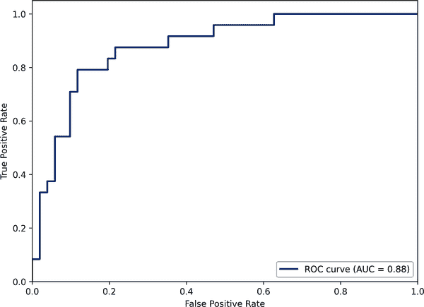

# 第十章：评估、部署和支持边缘 AI 应用

这是本书的最后一个理论章节，我们将涵盖评估、部署和支持边缘 AI 应用的过程。这三件事密切相关，并且在迭代项目中它们在整个开发工作流程中同时进行。

# 评估边缘 AI 系统

评估是成功项目的关键。事实上，没有评估，您无法真正知道您的项目是否成功。虽然它恰好在本书的末尾出现，但它是开发过程中始终存在的事物。甚至可能在开发之前就开始，当您量化希望通过边缘 AI 改进的现有流程的性能时。

请记住，在整个过程中，评估需要与利益相关者和最终用户的参与进行。不同的利益相关者可能具有冲突的评估标准，这取决于他们的个人视角。解决这些冲突的方法是评估的重要部分。

以下是需要进行评估的一些阶段：

检查现有解决方案

大多数时候，我们正在开发边缘 AI 系统来取代我们认为可以更好的传统系统。这使得在流程开始阶段了解现有系统的实际表现非常重要。我们的开发过程的目标将是超越它，而我们无法超越我们没有测量过的东西。

即使没有现有解决方案，构思一个简单的基准也是一个好主意，我们可以力求超越它（正如我们在“开发基准算法”中所见）。这为我们的工作带来了方向和视角，有时，简单的基准最终成为最佳选择。

探索潜在算法

在项目探索阶段，评估是至关重要的，当我们开始了解数据集并尝试不同类型的算法时。这是我们开始专注于看起来有前途的方法的方式。在此阶段，快速方便的评估有助于我们快速进展。

在迭代开发期间

迭代开发过程由评估驱动：我们创建一个解决方案，评估它，并使用评估结果进行调整，以便我们的下一个迭代更好。有许多不同的评估系统正在开发中，我们将在“评估系统的方法”中了解其中一些。

优化前后

当我们部署到边缘设备时，通常需要应用丢失优化技术，以使算法适应我们的内存或延迟约束（见“压缩与优化”）。在优化之前和之后评估性能非常重要，以确定发生了多少损失。即使您认为应用的优化技术不会丢失数据，也应该进行评估——以防优化过程中出现错误导致某种程度的降级。

在真实硬件上

有许多原因会导致您的应用在部署到真实硬件后表现不同。例如，生产硬件的传感器与最初收集数据集时的传感器可能有所不同。或者，在构建用于真实硬件的程序时，与在开发机器上运行时可能有所不同。在部署之前和之后进行评估非常重要，这样您就可以了解是否有任何影响。

在有限的部署期间

通过分阶段部署您的系统总是一个好主意，这样您可以逐步推出系统，以便在扩展之前发现任何问题。这是另一个评估的关键时刻，因为您需要一种方法来衡量系统是否如预期运行。

持续的部署后期

在部署后应持续监控性能，这自然需要进行评估。有关此阶段的更多详细信息，请参阅“部署后监控”。

# 评估与负责任的设计

道德 AI 严重依赖于评估。例如，要检测偏见，理解系统在不同类型输入上的表现至关重要。通过在每个阶段进行评估，可以使您的团队了解到道德关注点可能出现的地方。

## 评估系统的方法

评估边缘 AI 系统有许多方法，在开发过程的不同阶段，不同的机制都会显得重要。它们都需要不同的时间和投入，这可能适用于短期、紧密的反馈循环，也可能适用于更长、更广泛的循环。

以下是一些关键方法。

### 评估各个单独的组件

系统由许多较小的组件组成，评估每个组件的方式各不相同。例如，您的算法流水线可能包括以下内容：

+   窗口化

+   降采样

+   数字信号处理

+   机器学习

+   后处理

+   基于规则的算法

每个这些运动部件都会有自己的评估工具，相关领域的专家会了解如何使用它们。在构建一系列共同工作以提供结果的步骤流水线时，这种评估至关重要。如果你设置了评估系统中各个组件的机制，你将更容易找出任何系统问题的原因。这也将帮助你单独迭代特定组件，因为它们可能由不同的团队拥有。

### 评估集成系统

光知道系统的各个部分能够共同工作还不够，你还需要了解它们作为一个整体是否能够正确运行。否则，新出现的系统性问题可能会影响你的应用表现良好。

例如，你可能有一个机器学习模型和后处理算法，当单独测试时似乎运行良好。然而，当它们链接在一起时，你可能会发现它们表现不佳。

真正理解系统性能需要结合组件级测试和系统性测试。测试集成系统将告诉你系统是否表现不佳，但单独测试是不会提供太多解释的。

### 模拟真实世界的测试

在许多情况下，用于训练的数据集并不真实：它们可能代表一组理想的条件，可能是在实验室中收集的，或者经过精心清理，以呈现最佳的训练数据集。在这样的数据集上进行评估可能会导致误导性的结果。要真正了解性能，有必要在真实世界中测试这些东西。

如果我们能够在点击按钮的同时将所有工作都投入生产中进行测试，那将是很好的。但嵌入式开发的现实情况使这一点不可能。与网络软件工程相比，推送嵌入式应用程序上线需要更多的时间、金钱和风险。这意味着在这方面，嵌入式开发在开发和真实世界性能之间的反馈循环效果不佳。

解决这个问题的一个方法是在开发过程中尽可能地模拟真实世界的条件，以便能够在接近实时的环境中测试算法或应用的变更。这可能涉及收集反映你预期见到的真实世界条件类型的数据集，然后通过完全集成的应用程序构建来运行它。

例如，想象你正在开发一款健身追踪可穿戴设备。可以使用从真实用户身上捕获的数据流进行测试，这些用户戴着只含有传感器的虚拟设备。数据需要由专家进行标记，以便用于评估。

如果真实世界数据难以获取，也可以使用合成数据。可以通过将传统训练数据集的样本层叠在背景噪声样本上，并应用增强来增加数据的差异性，来构建逼真的数据流。这是 Edge Impulse 性能校准功能的一个选项，详见“性能校准”。

在 Amazon 的[Alexa 认证过程](https://oreil.ly/Pvi5L)中，模拟真实世界测试的一个显著例子是硬件产品集成 Alexa 必须符合其关键词识别系统性能的最低标准。性能评估是通过播放来自距离设备一定距离的扬声器的音频剪辑来进行的，且在不同条件下进行。设备必须成功识别包含关键词的剪辑并在不包含关键词时避免激活才能通过。

### 真实世界测试

尽早在真实世界中开始测试系统是最佳选择：尽早拥有硬件时，如果可能的话，甚至在此之前。¹ 真实世界测试主要有两种类型：

+   质量保证测试，您故意让产品进行测试以试图识别任何问题

+   用户可用性测试，允许用户自然地与产品进行交互，以了解其工作效果如何

真实世界测试比某些评估类型更慢更昂贵，但对产品开发至关重要。这也比将产品推向市场然后意识到其无法工作要便宜得多。

#### 质量保证测试

质量保证（QA）是一种系统性的方法，用于探索产品并理解其是否达到适当的质量水平——通常基于产品的设计目标（参见“设置设计目标”）。在开发过程中，QA 工程师设计并实施策略，以行使产品的功能，并试图理解其效果和整体适用性。

QA 是一个拥有自己领域专家的重要领域，对于构建良好产品的过程至关重要。这是一个超出本书范围探讨的大领域，但以下是 QA 专业人员在边缘 AI 项目中的一些重要作用方式：

+   获取原型并尝试发现问题

+   在开发过程中测试单独的组件（例如，关键词识别算法）

+   设计系统和流程，用于在整个工作流程中测试产品

+   认证产品是否达到其设计目标

一旦确定设计目标，QA 过程就会开始，因为负责 QA 角色的人需要为其设计测试系统。理想情况下，QA 将在开发过程中作为评估每个迭代工作的一部分的程序的一部分进行。

#### 用户可用性测试

虽然质量保证（QA）测试专注于有意识地尝试寻找问题，但可用性测试则是观察产品的自然使用，并利用观察结果指导改进。

可用性测试与真实用户一起进行。他们可以是公众成员、潜在客户，或者是您团队或组织内部的人员。关键是他们以一种真实的方式与您的产品互动。

一些可用性测试是在研究中进行的，这些研究会引入人员到一个受控环境，并鼓励他们以特定方式与产品进行交互。其他类型的测试则更自然：例如，测试版测试涉及向用户提供产品的早期版本，让他们可以带走使用一段时间，并提供反馈意见。

最佳计划会因情况而异，但通常可用性研究会在开发过程的早期进行，需要集中的输入以帮助引导项目，而测试则会在稍后进行，当产品接近完成并需要更一般的概述时。

一种有趣的可用性测试类型被称为“dogfooding”（源自“吃自家的狗粮”概念）。这是指组织成员使用他们自己的预发布硬件来理解其可用性并生成反馈。

可用性测试也是一个拥有自己领域专家的领域。这是最昂贵的测试类型，但也是最有价值的：你可以看到你的系统在接近现实情况下的表现。

### 监控已部署系统

一旦系统部署后，了解其性能至关重要。正如我们将在“部署后监控”中看到的，这可能极具挑战性。

## 有用的度量指标

任何类型的定量评估都会产生度量指标：代表产品或组件性能某一方面的关键数字。收集正确的度量非常重要：俗话说，“你衡量的就是你的成果”，如果你选择了错误的价值观，你的迭代过程将朝错误的方向发展。

幸运的是，有很多标准的度量指标与边缘 AI 系统相关；它们对于在连接领域工作的人来说可能很熟悉。以下是一些最重要的指标。

### 算法性能

这些度量在理解 AI 算法性能方面非常有用。它们通常根据算法类型而变化（如“功能算法类型”所述）。

#### 损失

损失是衡量模型预测正确性的一种方式。损失分数越高，预测越不准确。损失指标的确切含义由*损失函数*决定。不同类型问题有标准的损失函数，或者您可以自行设计。损失在某些机器学习模型（如深度学习）的训练过程中被计算和使用。

可以计算单个预测的损失，但通常会计算整个数据集的平均损失。例如，您可以计算验证数据集上的平均损失。

损失没有单位，因此只能相对于自身而言。这使得它成为衡量模型在训练过程中性能变化的好指标，但如果您试图了解模型在现实世界中的工作原理，则不是特别有帮助的度量标准。

在优化机器学习模型的过程中使用损失函数时，重要的是优化损失的改进对应于其他指标的改进。损失函数应根据您尝试解决的问题选择（大多数常见问题有标准损失函数），您的指标应基于相同的问题选择。如果两者不一致，您将得到一个无法解决正确问题的模型。

#### 准确率

分类是一种常见任务，有几种不同的指标用于表达分类器的性能。准确率是其中最简单且最为人熟知的：它只是在给定数据集上正确分类的百分比。

准确率是一种快速了解模型性能的合理方式，但作为单一数值，它掩盖了很多背景信息。例如，单一准确率数值无法告诉我们数据集中各个类别的表现如何。在平衡数据集上的 90%准确率指标听起来令人印象深刻，但在非平衡数据集上（可能包含 90%的一个类别和 10%的另一个类别）可能意味着模型很差劲。

因此，最好将准确率与捕捉更多细微差别的其他指标结合使用，或者至少为每个类别单独计算准确率。

#### 混淆矩阵

混淆矩阵是理解模型表现的强大工具。它是一个简单的表格，显示了如何分类个体样本的方式。例如，图 10-1 显示了来自 Edge Impulse 的截图。

###### 图 10-1\. 显示关键词检测模型结果的混淆矩阵

在图 10-1 中，行标题“NO”、“NOISE”和“YES”代表数据集中三类样本。它们与同名的列标题对应，后者表示分类器识别出的三类。每个单元格中的百分比表示数据集类别（由行标题指示）被分类器识别为特定类别（由列标题指示）的样本比例。

例如，我们可以看到，96.3%的“NO”的实例被正确分类为“NO”，而其中 3.7%被错误分类为“YES”。这种分类结果能帮助我们了解我们的分类器在不同类别间的表现。这比单一的准确度指标更有趣，因为它帮助我们开始了解我们的模型在哪些地方存在问题。

#### 精度和召回率

从混淆矩阵中单个类的角度来看，分类器可能犯的错误有两种不同类型。这两种都是误认身份的情况。

在第一种情况下，一个真正属于该类的成员被误认为属于另一个类。例如，一个用于鸟类识别的智能摄像头可能会误将一只鸟误认为叶子，完全错过了鸟类。

在第二种情况下，一个属于*不同*类别的成员被误认为属于我们关心的类别。例如，我们可能会将一片叶子误认为鸟类。

精度和召回率提供了描述这些错误发生频率的方法。精度告诉我们，我们的模型多频繁地将一片无趣的叶子误认为可爱的鸟类，而召回率描述了我们的模型多频繁地错过本应该识别的鸟类：

<math alttext="精度等于正确识别的鸟的数量 除以 我们认为是鸟的输入总数" display="block"><mrow><mtext>精度</mtext> <mo>=</mo> <mfrac><mrow><mtext>正确识别的鸟的数量</mtext></mrow> <mrow><mtext>我们认为是鸟的输入总数</mtext></mrow></mfrac></mrow></math><math alttext="召回率等于正确识别的鸟的数量 除以 数据集中实际鸟类的数量" display="block"><mrow><mtext>召回率</mtext> <mo>=</mo> <mfrac><mrow><mtext>正确识别的鸟的数量</mtext></mrow> <mrow><mtext>数据集中实际鸟类的数量</mtext></mrow></mfrac></mrow></math>

每个数据集类别都有自己的精度和召回率，但它们也可以表示为所有类别的平均值。这是一个很好的指标，因为它能让我们了解模型犯了哪些类型的错误。（参见 2）

精确率和召回率都表示为介于 0 和 1 之间的数字，其中 1 表示完美，0 表示完全错误。它们通常存在权衡：通过增加一个可以减少另一个。这使它们成为调整的重要指标。

#### 正负率

-   召回率的另一个名称是*真正率*，或者 TPR。它是正确识别正例的速率。还有另外三个缩写，涵盖分类器混淆矩阵中的其他错误可能性。*假正率*（FPR）表示负例（不属于我们关注类别的项目）被错误地标识为我们关心的事物的频率。

<math alttext="真正率等于真正例占数据集中总正例的比率" display="block"><mrow><mtext>真正率</mtext> <mo>=</mo> <mfrac><mrow><mtext>真正例</mtext></mrow> <mrow><mtext>数据集中总正例</mtext></mrow></mfrac></mrow></math><math alttext="假正率等于假正例占数据集中总负例的比率" display="block"><mrow><mtext>假正率</mtext> <mo>=</mo> <mfrac><mrow><mtext>假正例</mtext></mrow> <mrow><mtext>数据集中总负例</mtext></mrow></mfrac></mrow></math>

相反，*真负率*（TNR）描述了正确忽略负例的频率。最后，*假负率*（FNR）描述了属于我们关心的类别的样本被错误地忽略的频率。³

<math alttext="真负率等于真负例占数据集中总负例的比率" display="block"><mrow><mtext>真负率</mtext> <mo>=</mo> <mfrac><mrow><mtext>真负例</mtext></mrow> <mrow><mtext>数据集中总负例</mtext></mrow></mfrac></mrow></math><math alttext="假负率等于假负例占数据集中总正例的比率" display="block"><mrow><mtext>假负率</mtext> <mo>=</mo> <mfrac><mrow><mtext>假负例</mtext></mrow> <mrow><mtext>数据集中总正例</mtext></mrow></mfrac></mrow></math>

这些率都是表达系统区分类别能力的不同方式。它们可以进行折衷以确定与 “置信阈值” 中描述的方式相同的性能。

#### F1 分数和 MCC

有时候，使用单一统计量来描述分类器的性能是很有用的：例如，当比较类似的模型时。这样一个统计量是*F1 分数*，它是通过精确率和召回率分数的调和平均值得到的单一数字：

<math alttext="upper F 1 equals 2 StartFraction normal p normal r normal e normal c normal i normal s normal i normal o normal n dot normal r normal e normal c normal a normal l normal l Over normal p normal r normal e normal c normal i normal s normal i normal o normal n plus normal r normal e normal c normal a normal l normal l EndFraction" display="block"><mrow><msub><mi>F</mi> <mn>1</mn></msub> <mo>=</mo> <mn>2</mn> <mfrac><mrow><mi>precision</mi> <mo>·</mo> <mi>recall</mi></mrow> <mrow><mi>precision</mi> <mo>+</mo> <mi>recall</mi></mrow></mfrac></mrow></math>

尽管方便，F1 分数也有一些局限性。它不包含有关真负例的任何信息——这意味着它不适合用于不平衡的类，因为如果每个类中的项目数量不同，各类之间的 F1 分数将无法比较。

出于这个原因，另一个被称为[*马修斯相关系数* (MCC)](https://oreil.ly/dtn0y)的指标可能是更好的选择。它包含混淆矩阵中的所有方格，因此是模型质量的更好整体指标。

尽管 MCC 更好，但它仍然有其局限性。将整个混淆矩阵转换为单个数字会削弱我们考虑每个单元格的能力。正如我们在“置信阈值”中看到的，每个应用在精确率和召回率之间都有稍微不同的理想平衡。F1 和 MCC 分数使我们无法单独考虑它们——因此，如果我们比较多个模型，我们将无法看到它们之间的某些差异。

#### ROC 和 AUC

正如我们所学到的，通过改变置信阈值可以改变分类器的性能。可以使用*接收者操作特征曲线*或*ROC 曲线*来可视化这种影响，如图 10-2 所示。

由于置信阈值可以用来在真正率（TPR）和假正率（FPR）之间进行权衡，ROC 曲线在任一轴上绘制它们之一。为了计算曲线，需要计算一系列不同置信阈值的 TPR 和 FPR。

该图表非常有用，因为它描述了调整分类器所有选项的情况。我们可以选择曲线上的一个点，该点代表基于我们应用程序需求的权衡。然后，我们将使用相应的置信阈值来控制模型的输出。

###### 图 10-2\. 使用 Matplotlib 绘制的 ROC 曲线

我们还可以使用 ROC 曲线来创建一个单一的度量，描述基于模型获得特定答案正确的概率。它通过计算*曲线下面积*（AUC，在图 10-2 中可见）获得，并且其值从 0 到 1。AUC 为 1 的模型完全正确地预测每个预测结果，而 AUC 为 0.5 的模型有 50/50 的几率预测正确类别。⁴

ROC 是有用的，但它仍然是一个单一统计量，代表一组复杂的行为。因此，如果我们试图了解我们的模型在不同情况下的表现，它仍然没有帮助。在这种情况下，ROC 曲线和混淆矩阵的组合将为我们提供许多有用的见解。

#### 错误度量标准

分类器只是一种模型类型。另一种主要类别，回归模型，有其自己的一组常见度量标准。由于回归模型旨在预测数值，因此理解其性能的最佳方法是使用度量标准，比较其输出值与数据样本标记的值之间的差异。

这里是用于回归模型的一些顶级错误度量标准：

平均绝对误差（MAE）

这个简单的度量标准由误差的平均值组成，其中误差定义为预测值与实际值之间的差异。其计算方法如下：

<math alttext="MAE equals StartFraction sum left-parenthesis error right-parenthesis Over number of samples EndFraction" display="block"><mrow><mtext>MAE</mtext> <mo>=</mo> <mfrac><mtext>sum(error)</mtext> <mrow><mtext>number</mtext><mtext>of</mtext><mtext>samples</mtext></mrow></mfrac></mrow></math>

例如，假设我们已经训练了一个回归模型，用于预测从照片中的苹果的重量。假设苹果的重量以克为单位。在测试模型后，我们计算出一个 MAE 为 10。这意味着平均而言，预测的重量与实际重量相差 10 克。

这种简单性使得 MAE 非常有用。但是，还有一些替代方法可以帮助揭示不同类型的误差。

均方误差（MSE）

均方误差（MSE）与 MAE 非常相似——只是在求和之前将误差平方化：

<math alttext="MSE equals StartFraction sum left-parenthesis squared errors right-parenthesis Over number of samples EndFraction" display="block"><mrow><mtext>MSE</mtext> <mo>=</mo> <mfrac><mrow><mtext>sum(squared</mtext><mtext>errors)</mtext></mrow> <mrow><mtext>number</mtext><mtext>of</mtext><mtext>samples</mtext></mrow></mfrac></mrow></math>

由于我们对误差进行了平方处理，MSE 将始终为正值或零——而大误差将会对其值产生更大影响。这是有帮助的，因为大误差通常比小误差更糟糕，但可能会因 MAE 的简单计算而被欺骗性地抹平。

根均方误差（RMSE）

MSE 的缺点在于，由于它基于平方值，因此比 MAE 更难以解释，后者是以原始单位提供的。通过计算 MSE 的平方根，即 RMSE，我们可以用与标签相同的术语表达它：

<math alttext="RMSE equals StartRoot StartFraction sum left-parenthesis squared errors right-parenthesis Over number of samples EndFraction EndRoot" display="block"><mrow><mtext>RMSE</mtext> <mo>=</mo> <mroot><mfrac><mrow><mtext>sum(squared</mtext><mtext>errors)</mtext></mrow> <mrow><mtext>number</mtext><mtext>of</mtext><mtext>samples</mtext></mrow></mfrac></mroot></mrow></math>

RMSE 具有与 MSE 相同的好处，但更容易解释。不足之处在于，它稍微更复杂一些。

与分类度量标准一样，将模型的性能表达为单一值可能存在风险。您的数据集可能包含不同子群体，它们的性能不同。我们将在“评估技术”中讨论处理此问题的一些策略。

#### 均值平均精度

*均值平均精度*，或 mAP，是用于表达目标检测模型性能的一个相当复杂的度量标准。目标检测模型试图在图像中绘制围绕任何对象的边界框；mAP 考虑了预测边界框与实际边界框的重叠程度——无论是在给定图像内还是跨数据集。它将这一情况与置信区间之类的东西结合起来，以得出一个分数。⁵

mAP 的主要缺点是，虽然它基于框的区域，但它不考虑框的数量。 这意味着即使模型预测了多个框，而实际上只需要一个框，它也可以在 mAP 上得分良好。 尽管如此，它已经成为评估对象检测模型的标准方法。

###### 提示

[`sklearn.metrics` 库](https://oreil.ly/zq0CD)包含大多数上述指标的实现，以及更多。 探索与指标相关的文献，以确定用于您任务的理想指标是值得的。

### 计算性能和硬件性能

边缘人工智能几乎总是涉及管理算法性能和计算性能之间的平衡。 虽然算法性能指标告诉我们算法执行工作的效果如何，但计算和硬件性能指标告诉我们算法运行的速度以及在过程中消耗了哪些资源。

在这些指标的指导下，我们可以在算法复杂性和计算资源之间进行明智的权衡。 例如，给定硬件上特定应用程序所需的延迟可能会影响可以使用的深度学习模型的大小。

以下指标帮助我们了解计算任务的规模以及它对我们硬件的负担。

#### 记忆

内存使用包括 RAM 和 ROM，它们具有相当不同的属性。 ROM 是长期存储算法的地方，包括任何机器学习模型的参数。 RAM 是程序在运行时的工作内存。 任何边缘设备的 RAM 和 ROM（或磁盘空间）都有硬性限制，因此重要的是确保您的算法适合所提供的资源。

算法无法孤立运行； 它必须存在于某种程序中。 程序的其余部分也占用内存 - 因此在考虑 RAM 和 ROM 使用时，您也需要考虑应用程序的其余部分。 在大多数情况下，您最终将得到一个需要您的算法遵循的 RAM 和 ROM 预算，以使其适合应用程序的其余部分。

例如，假设您正在将边缘人工智能添加到一个旧系统中。 您可以分析现有应用程序使用的内存，并决定剩余多少用于新算法。 类似地，在新系统中，您将不得不决定您的 ROM 和 RAM 中有多少预算用于算法与应用程序其他部分。

测量应用程序的 RAM 和 ROM 使用情况并不简单。 在理论上，ROM 看起来相对容易：理论上，嵌入式工程师可以编译一个包含您的算法的简单程序，然后查看输出以确定其大小。 但实际上，您的应用程序所需的依赖项与您的算法所需的依赖项可能会有重叠。 这意味着您的算法在固件的 ROM 使用上可能比看起来少得多。

这意味着估计算法 ROM 使用的最可靠方法是构建完整的应用程序，分别带有和不带有它们。差异告诉你使用了多少 ROM。

深度学习模型往往很大，因此你可能需要缩小模型的大小以适应 ROM 预算。在花费大量时间优化应用程序的其余部分之前，尝试量化你的模型总是一个好主意——由此导致的精度降低通常非常小。

测量 RAM 使用情况要更具挑战性。首先，通常你需要运行算法来确定它。其次，如果你的程序使用的 RAM 过多，可能实际上无法运行。第三，在运行设备上确定 RAM 使用情况将需要某种测试程序或调试器。

测量特定算法 RAM 使用的一个好方法是使用测试程序。该程序首先应该用特定的标记值填充整个内存。然后你可以运行你的算法。运行后，你应该迭代设备的内存并检查其中多少仍然填充有标记值。这个“高水位线”将为你提供内存使用的估计——尽管它不会告诉你最坏情况下的内存使用情况，这可能更高。⁶

你可以潜在地使用这种技术与模拟器估计 RAM 使用，而无需部署到实际设备上。这在开发过程中很方便，并且是某些端到端平台（如 Edge Impulse）中使用的方法。

在带操作系统的设备上，测量 RAM 和 ROM 的使用情况要容易得多，因为你可以直接查询操作系统获取指标。

#### 浮点运算（FLOPs）

浮点运算是涉及两个浮点数的单个计算，而 FLOPS——或*每秒浮点运算次数*——被用作计算能力的度量。

总的 FLOPs 数量有时用来描述计算一个深度学习模型推断所需的工作量。对于服务器端模型来说，这是有道理的，因为计算通常在浮点算术中进行。

鉴于模型的 FLOPs 和处理器的 FLOPS（并忽略令人困惑的缩写），理论上应该能够估计模型的延迟。然而，许多边缘模型是量化的，因此使用整数运算，使得原始模型的 FLOPs 变得不那么相关。此外，嵌入式处理器的制造商通常不报告 FLOPS（或 IOPS，整数等效）。最后，计算模型的 FLOPs 并不总是直截了当的。

总体而言，所有这些使得 FLOPs 在确定边缘 AI 性能方面的用途有限。尽管如此，在遇到时还是值得一提。

#### 延迟

在边缘 AI 的背景下，延迟是运行算法所有部分的总时间。例如，捕获音频窗口、降低采样率、运行 DSP 算法、将结果输入深度学习模型、执行模型并处理输出可能需要 100 毫秒。延迟通常以毫秒或每秒帧数来指定，后者主要用于视觉应用。

延迟取决于所使用的算法、可用的优化以及硬件本身。更快的硬件和更好的优化（例如，描述在“数学和 DSP 库”中的库中提供的优化）会导致较低的延迟——一般来说，机器学习模型越小、越简单，延迟越低。

一些应用程序需要低延迟。例如，如果一个应用程序需要实时响应用户输入，则需要以低延迟运行。在其他情况下，延迟并不那么重要：也许应用程序的响应可以是异步的，不必快速发生。

在某些情况下，低延迟意味着更好的算法性能。例如，一个关键词检测模型每秒运行多次比每秒运行一次更有机会检测到关键词。

测量延迟通常需要访问设备，除非有周期精确的模拟可用（参见“仿真器和模拟器”）。然而，有一些方法可以通过在硬件上对类似工作负载进行基准测试来估算深度学习模型的性能。⁷

#### 占空比

嵌入式应用通常需要限制能源使用，以保护电池寿命。它们通过在接收新数据时定期执行计算，然后在等待下一批数据到达时进入低功耗睡眠模式来实现这一点。

处理器的唤醒/睡眠模式称为其占空比。例如，处理器可能每 200 毫秒唤醒一次以读取某些传感器数据，花费 10 毫秒这样做。然后它可能花费 50 毫秒使用边缘 AI 算法处理数据，然后回到睡眠状态。

在这种情况下，处理器每 200 毫秒唤醒 60 毫秒。在每秒钟中，它将花费 350 毫秒唤醒和处理数据。这将给它一个以百分比表示的占空比，为 35%。

占空比对于确定嵌入式系统的功耗非常重要，因为它决定了处理器消耗的能量。

#### 能源

电池寿命是嵌入式应用中的一个常见问题，因此确定设备的能耗非常重要。它以电流来衡量，通常用毫安（缩写为 mA，也称为毫安）来表示。

嵌入式系统中的每个组件的电流消耗各不相同，这取决于其使用方式。例如，处理器根据当前启用的功能使用的电流多少不等，而传感器在进行测量时可能会消耗更多电流。

因此，在典型使用情况下测量能耗是非常重要的。可能需要长时间监控设备以确定其实际能耗，这可以通过特殊工具如电流监控器或数据记录器来完成。

电池容量以毫安时（mAh）来衡量，表示电池可以支持 1 毫安电流的时间。例如，一块 2,000mAh 的电池可以为 100mA 的设备供电 20 小时。

对于处理器来说，能耗与工作周期紧密相关，后者是延迟的函数。这意味着低延迟算法可以节省能量，因此在设计算法和应用程序时考虑能量使用是非常重要的。

#### 热量

电子元件会产生热量作为废热，这在某些应用中很重要：处理器在计算过程中可能会变热，如果热量无处释放，可能会出现问题。此外，一些元件有最低操作温度要求。

热能以摄氏度来衡量。大多数元件的数据表将提供其操作范围。一些处理器，主要是 SOC，具有内置温度传感器，并且如果它们开始变热可以自动调节性能。MCU 通常没有这种功能，因此如果要监测它们的温度，则需要自行安装传感器。

处理器的工作周期越低，产生的废热能量就越少。这意味着延迟是限制热量排放的工具。

## 评估技术

评估使用了一套技术工具，其中一些我们之前见过，另一些是新的。以下是最重要的项目：

训练、验证和测试数据集分割

正如我们在“数据分割”中学到的，将数据集划分成部分来证明模型在以前未见数据上的表现是至关重要的。大部分评估工作应在验证数据集上完成。

为了保持其价值，只有当你认为已经完成时才应使用你的测试数据集。如果在测试你的测试数据集时发现模型不起作用，你将不得不放弃并从头开始：否则，你会因为调整模型直到在测试数据集上表现良好而在真实数据上表现不佳而面临过拟合的风险。

当然，你可以在开发过程的任何时候捕获更多数据。在可能的情况下，应尽量不断增加整个数据集的样本，以提高训练和评估模型的能力。

交叉验证

将数据拆分用于评估的一个缺点是，模型的表现只能与其训练数据集中的数据一样好。我们之前在“交叉验证”中遇到的交叉验证试图解决这个问题，允许从业者在同一数据集上训练多个模型并比较它们的性能。

要开始，将训练数据集分成训练部分和验证部分。使用训练部分训练模型，然后在验证部分上进行测试。记录度量标准，然后重新组合数据并随机拆分。在新的训练拆分上训练第二个模型，然后在新的验证拆分上评估。这个过程可以任意次数重复——可能是数十次。

该过程的结果是一系列模型，每个模型都在数据的不同子集上进行了训练和验证。可以分析这些模型的度量标准，以了解模型质量是否严重依赖于数据的组成。希望每个模型的表现相似。如果是这样，可以选择表现最佳的模型，并在最终测试中针对测试数据集进行审查。

最常见的交叉验证类型被称为 k 折交叉验证。有关该过程的信息可以在[scikit-learn 文档](https://oreil.ly/5uy5t)中找到。

分析子组

我们在“算法性能”中学到的度量标准可以针对整个数据集、一个拆分或任意数据子组进行计算。这是一个非常强大的工具，特别适用于理解算法公平性。

想象一下，您正在构建一个计算机视觉应用程序来识别不同类型的车辆：汽车、卡车和 SUV。您可以为每个类别计算算法性能度量，这些度量将告诉您该算法在识别每种类型车辆时的表现如何。

不过，通过一些额外信息，您可以超越这一点。例如，如果您的数据集包含每张照片中车辆制造商的元数据，您可以计算每个子组的度量标准。然后，您可以进行分析，确保您的模型对每个子组的表现都同样出色：例如，您可能会发现您的模型在特定品牌的汽车上表现不佳，此时您可以尝试收集更多该品牌的照片以扩充训练数据集。

模型本身并不关心车辆的制造商，只关心高级类型（汽车、卡车或 SUV）。尽管如此，您仍然可以使用关于制造商的信息来更好地评估您的系统。您可以想象，当使用几乎任何数据集进行机器学习公平性研究时，这种类型的技术是多么有用。

度量和分布

数据集中的子群体通常分布不均匀。 例如，假设您正在训练一个分类器以区分类别 A、B 和 C。 您的数据集可能有 60%的样本属于类 A，20%属于类 B，20%属于类 C。

您用于评估的指标应对所有这些类别中的问题都敏感。 例如，准确性指标可能在所有类别中都为 60%。 但是，这个单一数字不能告诉您模型是否正确地获取了所有 A 类，而未获取 B 或 C 类的任何一个。

理解您的指标是否合适的一种方法是通过“评估”一个返回故意糟糕结果且符合数据底层分布的虚假模型。 例如，您可以创建一个随机分类器，将随机的 60%的示例分类为 A，20%为 B，20%为 C。 通过评估这个随机分类器的输出，您可以了解您选择的指标如何传达模型性能的不足。

使用多种指标

对于一个项目，可以测量许多不同的指标。 例如，您可以确定在测试数据集上的准确性、计算延迟和内存使用的数字。 构建有效解决方案通常意味着在多个指标之间取得平衡。 例如，我们可以选择使用一个更简单的模型来减少延迟，但这可能会导致准确性下降。

这些个别指标可能都很重要，但并不总是同等重要。 例如，对于需要高速运行的项目，您可能会将延迟放在准确性之上。 在具有多个子集的数据集中，您可能更关心一个子集的性能而不是另一个。

不同指标的总体权重——您对它们的个别关注程度——是您需要与利益相关者一起确定的事情。

合成测试数据

数据通常难以获得，特别是如果您希望在罕见和不寻常的输入上测试系统。 例如，异常检测系统可能被设计用于捕获实际世界中从未记录过的灾难性故障。

避免这个问题的一种方法是生成合成数据。 合成数据是任何一种人工创建的数据。 这可能意味着取一个真实数据集并扭曲其样本以创建新的数据，或者可能意味着使用某种算法过程生成全新的输入。 例如，我们可以生成一组旨在模拟灾难性故障的输入，以测试我们的异常检测系统。

合成数据可能是一个有用的概念。 它潜在地使您能够获得大量可用于测试或甚至训练模型的标记数据。 但是，并非所有数据都可以伪造，完全依赖合成数据是有风险的，特别是对于评估。

## 评估与负责任人工智能

适当的评估是我们负责任地开发 AI 应用的核心工具之一。如果您能够对应用进行良好评估，就能了解它们在现场和数据集中不同子群体中的表现可能如何。评估得越好，将来在生产中遇到问题的风险就越小。

负责任的设计涉及评估问题解决方案在其环境背景中的匹配性。任何评估的效果取决于您对问题及其操作环境的理解。这就是为什么在评估过程中引入领域专家和利益相关者如此重要的原因。

评估也是迭代开发工作流程的核心。这几乎可以保证，如果您的评估工作不好，您将得不到一个好的产品。您应确保充分重视评估，值得让您的利益相关者、领域专家和咨询委员会多加关注，以确保捕捉尽可能多的细节。

您可能已经注意到，许多评估技术完全依赖于您的数据集。这使得构建您的数据集对于道德 AI 开发至关重要（参见“数据、伦理与负责任 AI”）。在现场进行评估是缓慢且成本高昂的，因此数据集是一种至关重要的工具。

尽管如此，在真实环境中、与真实用户交互时，评估的需求是不可避免的。仅仅通过测试数据来量化算法性能是不够的。关键是要理解整个系统在实际情况下以及与将要使用它的人群之间的工作方式。您需要尽早将这些内容融入工作流程中。

我们已经涵盖了评估模型前部署的部分内容。接下来我们将在“后部署监控”中探讨后部署评估的工具。

# 部署边缘 AI 应用

正如我们在“部署”中提到的，部署最好被视为项目结束时的一个持续过程，而不是单一事件。然而，每次将您的系统的新迭代与现实世界接触时，都存在潜在的重大风险——以及宝贵的新学习。重要的是建立一个能够考虑到这一点的流程。

例如，想象一下您正在部署一款新版本的羊活动分类模型。它可能会产生错误的预测，如果不能迅速识别出来，可能会对农业操作造成负面影响。但这也可能揭示出可以应用到下一轮设计中的新见解——前提是能够捕捉到这些见解。

为确保部署顺利进行、最小化风险并最大化利益，您应该开发并记录一个有意识的过程，以便每次都能遵循。这些任务的所有权很重要；它们应该由您团队的成员跟踪，通常是负责产品开发和运营的人员。

接下来，我们将查看一些您可能包括的关键任务。

## 部署前任务

在部署之前应考虑执行的任务。这些任务应由技术专家的指导、利益相关者的见解以及领域专家的专业知识指导：

确定目标

每次部署都应有清晰的书面目标。例如，您可能会部署更多设备以扩展系统，或者将最新版本的软件部署到已经部署在现场的硬件集。

为了更好地管理风险并提高您测量性能的能力，您应该尽量限制每次部署的目标数量。像任何实验一样，您调整的输入变量越多，就越难理解导致输出变化的原因。

识别关键指标

要理解部署的影响，您需要跟踪描述系统操作的指标。这些指标应包括性能指标（如果可用），以及能够突出任何变化的一般数字—例如输入和输出的分布。

您将使用这些指标来理解您部署的任何变化，并确定您的目标是否已经达到。

性能分析

在部署软件或硬件的新迭代之前，您需要充分了解其可能的性能表现，并且这种性能是否对运行在生产环境中的系统可接受。在实验室中有各种方法来估算性能（其中一种方法在“性能校准”中讨论）—在部署到实地之前，您应该尽可能利用这些方法。

如果一个迭代在实验室中表现不佳，那么在实地环境中也不太可能表现良好。此外，在真实世界的背景下，由于标记数据稀缺，测量性能可能会更加困难，因此您应该充分利用每一种预部署测试机制。

记录可能的风险

每次您将新迭代推向生产环境，都存在一定的风险。在部署之前，重要的是尝试识别可能的风险，了解它们的影响，并考虑如何减轻或恢复这些风险。

如果情况变得糟糕，您可能需要暂停部署或关闭项目以避免造成损害。基于风险，您应该制定一套终止标准（参见“终止标准”），这将帮助您确定何时作出决策。

确定恢复计划

如果由于部署而发生了不良后果，您需要制定一个恢复计划。这可能意味着回滚到系统的早期版本，或者修复由您正在交互的过程中造成的一些损害。

提前准备将使您能够更冒险而不担心灾难。您应该为应对所有已识别可能风险的后果制定计划。

这可能涉及利用您设计的应用程序中的优雅降级策略（参见“优雅降级”）。

部署设计

根据您的目标，您需要设计一个部署工作的策略。例如，您可能需要决定部署哪个软件和硬件版本，部署多少设备以及部署到哪些具体位置。您还需要找出任何必要的自动化措施，以减少部署时间并确保设备间的一致性。IoT 设备管理平台可能在这方面有所帮助。

例如，如果您在世界各地的多个工厂中有设备，您可能会决定将最新软件部署到一个工厂进行测试，以隔离任何风险。或者，您可以在每个工厂部署几台设备，以获取在各种背景下性能表现的横截面视图。最佳策略取决于您的具体情况，找到答案将需要商业和领域专业知识。

如果计划进行广泛部署，进行分阶段的推出总是个好主意：从小部分设备开始，看看情况如何，然后分批次部署其余设备。这将使风险降到最低，并在出现问题时更容易恢复。

检查与价值观的一致性

任何您发布的软件或硬件都必须经过详细审查，以发现潜在的道德问题。分析自上次部署以来所做的任何更改非常重要，以防引入新的问题。此外，您的部署计划本身也应该经过道德分析，并结合领域专业知识。

例如，如果计划进行分阶段推出，值得考虑的是推出是否正在代表用户的典型群体进行。如果在推出的初始阶段没有代表某些用户群体的情况，您可能会错过影响这些群体的问题。

沟通计划

在部署之前、期间和之后，向生产系统通报任何变更至关重要。通过创建沟通计划，您可以确保这一点有效实施。您的目标应该是确保所有可能受到部署影响的人，包括在风险文档中捕捉到的任何潜在意外问题，都知道计划行动、其风险以及可能需要扮演的任何角色。这包括利益相关者和您开发团队的成员。

通信应该是双向的，因为您可能不了解可能影响部署计划的因素。例如，您可能会发现与计划部署时间重叠并影响您试图测量的指标的预定活动。

决策是否前进

一旦所有适当的文档都被汇编好，最后一步是审查并做出是否前进的决策。您可能会确定风险水平过高，或者某些混淆因素意味着应该延迟部署。否则，您可能会决定继续前进。

决策是否前进的重要性在于需要来自利益相关者、领域专家以及您的技术团队的输入，因为他们都对可能被忽视的潜在问题有深入了解。

## 部署中期任务

在部署过程中，除了部署机制本身，您还应考虑以下任务：

双向沟通

您应根据预部署任务中制定的计划，与可能受部署影响的任何人进行清晰沟通。这包括倾听部署期间可能发生并被旁边工作人员注意到的任何潜在问题。

分阶段推出

为了将风险降至最低，部署应该分阶段进行，而不是一次性全部完成。协调这种分阶段推出是一项重要任务。最重要的方面是跟踪在哪里部署了什么，并监控每个阶段可能如何影响您正在跟踪的指标。

在某些情况下，您可能已经在现场使用无法更新的设备。例如，它们可能无法进行固件更新。如果是这种情况，您需要非常小心地跟踪哪些设备使用了哪个固件版本和算法。

监控指标

您需要在部署期间跟踪所有关键指标，并准备在事情进展不顺利时停止或回滚流程。根据预部署工作，您应该了解您所监测的指标预期会如何变化。如果观察到不同的情况，暂停部署并调查发生了什么是一个好主意。如果看起来发生了有害事件，您应该回滚到之前的状态并修复问题。

###### 提示

负责任的人工智能工作流程的核心目标之一是防止造成任何伤害。您的工作之一是预见可能的伤害，并创建一个设计来防止其发生。虽然可能会发生意外事件，但未预料到的伤害事件意味着您的伦理审查流程存在缺陷。

## 后部署任务

在完成分阶段部署后工作并不会立即结束。以下是之后可能需要处理的一些任务：

沟通状态

根据您的沟通计划，您应确保所有受影响者在部署完成后得到更新的状态。他们还应该有一个清晰、持续开放的渠道，通过该渠道可以提醒您观察到系统中的任何意外变化。

部署后监控

在部署结束后一段时间内继续监控系统是明智的。可能会有一些延迟出现的效果。理想情况下，这些类型的风险在风险文档过程中已经得到了识别，并得到了领域专家的帮助。关于监控的更多信息将在“部署后监控”中提供。

部署报告

部署后，您应该编写一份总结报告，其中包括您的原始计划、实际发生的事情以及所采取的任何行动。这份报告将有助于指导未来的部署，并可以与您的利益相关者共享。

这可能听起来很繁忙，但通过系统化地进行部署并记录所做的每一步，您将更少遭受意外问题的困扰。通过多次部署同一项目，您将开始发展出一个需要最少工作并由一套坚实文档描述的高效系统。这个系统将是项目持续支持的重要组成部分。

# 支持边缘人工智能应用程序

部署标志着项目支持阶段的开始。所有技术项目都需要长期支持。从边缘人工智能的角度来看，支持包括随时间跟踪系统的性能。如果发现性能变化，可以采取行动，从更新算法到终止部署。

从伦理角度来看，项目得到良好支持是很重要的。如果一个项目被放弃，或者没有得到适当的监控而被随意进行，可能会造成伤害。漂移（如在“漂移和变化”中看到的）可以将一个方便的小工具变成一个危险的陷阱。如果您不能承诺对项目进行适当的长期支持，那么最好不要首先启动它。

由于边缘人工智能存在时间不长，支持是工作流程中工具和最佳实践方面最不发达的组成部分。一些来自服务器端人工智能的最佳实践可以应用于边缘问题，但其中许多则不行。本章的其余部分将探讨这一领域的挑战和机遇。

## 部署后的监控

长期支持的第一步是监控。一旦您的硬件原型被部署，您就需要开始收集它们操作情况的数据。这可能是一个巨大的挑战，因为有时甚至与设备没有连接。

以下是一些可能的情景：

+   部署设备具有良好的互联网连接，因此可以从现场收集统计数据和数据样本。例如，连接的家用电器可以使用家庭 WiFi 发送大量数据。

+   有足够的有限连接性以获取基本统计数据和指标，但不足以对数据进行采样。例如，部署在偏远油井上的智能传感器可以通过 LoRaWAN 发送少量数据字节，LoRaWAN 是一种用于远距离、低功耗无线通信的技术。

+   没有互联网连接，但用户反馈是可用的。例如，智能野生动物摄像机的用户可以提供有关其是否拍摄到正确动物的反馈。

+   没有互联网连接，也没有用户反馈可用。

如您所见，各种应用程序之间的连接性和获取反馈的能力可能有很大差异。理想情况下，至少应有一定的连接性：在根本无法收集任何反馈的情境中部署，您应该三思，因为这意味着您将完全不知道系统的表现如何。

假设您有一些反馈机制，目标应该是收集关于正在发生的情况尽可能多的信息。

### 部署系统的反馈类型

服务器端机器学习应用程序相对容易。由于它们的所有输入数据都在服务器上可用，因此可以将其记录和存储以供以后分析。例如，想象一个服务器端应用程序，使用计算机视觉从照片中识别特定产品。

由于它位于服务器上，拥有有效的无限存储空间来保留人们上传的照片记录。这意味着开发人员可以浏览和分析模型的预测，确定其是否有效，甚至标记数据并用于训练。

有些应用程序甚至更容易：这些应用程序内置了成功的度量标准。例如，如果您开发了一个推荐用户可能喜欢的产品的算法，您可以通过统计推荐产品被购买的频率来衡量其效果。

这些紧密的反馈循环允许在算法和应用设计上进行迭代和快速改进。但在边缘上并非如此简单。我们通常缺乏对结果的直接洞察力——尽管并非总是如此。我们还没有能力记录模型的输入。由于缺乏即时反馈，我们必须想出一些聪明的方法来理解发生了什么。

#### 数据样本

在理想情况下，我们可以收集原始输入的样本并将其发送回服务器进行存储。这仅在星星完美对齐时才可能：我们需要能源可用性、连接性和带宽的完美组合，以及隐私不重要的用例。

例如，想象一下，我们构建了一个低功耗传感器，设计用于监测货物在运输过程中的处理方式。为了节省能量和成本，它可能缺乏在运输过程中存储或传输数据的能力。这意味着它无法发送原始输入的样本进行分析。

另一个例子，想象一下，我们构建了一个家庭安全摄像头，它使用深度学习模型进行人员检测。如果产品被市场宣传为使用边缘人工智能来保护隐私，那么捕获其输入的样本将是不可行的。

然而，肯定存在足够的能量和连接性的情况，可以发送数据样本。即使资源稀缺，您仍然可以找到方法使其发挥作用。

有些应用程序可以通过采样有限数量的数据创建反馈循环。与其尝试将每个输入都发送到服务器，它们会选择特定的实例。这可以是随机的（例如，每千个中的一个），也可以是周期性的（例如，每天一次），或者可以基于一些智能标准。一个有趣的方法是识别算法对输入感到不确定的时候，例如分类器的类别都不满足置信阈值时，并发送这些输入。因为它们是模型似乎在努力处理的部分，它们可能是最有用的进行分析的部分。

例如，一个成功的边缘人工智能驱动的追踪摄像机通过卫星连接将动物的缩略图发送回服务器。发送完整图像将会太昂贵，但缩略图仍然可以提供有价值的场地信息。

如果降采样后的数据仍然太重，您可能会选择只发送数据的部分。例如，您可以发送灰度图像而不是彩色图像。发送输入的聚合统计数据也可能很有趣：例如，您可以发送时间序列的周期移动平均值而不是整个时间序列。这有助于检测漂移。

通常，您的算法会在将数据馈送到模型之前使用一系列固定的信号处理算法。在这种情况下，由于您了解信号处理算法的行为方式，直接发送处理后的数据通常是可以接受的。处理后的数据通常更小，因此更容易传输。

一旦完全投入生产，您可能无法传输大量数据，但这不应妨碍您在部署的初始阶段访问真实世界的数据。例如，您可能决定在部署的头几个月内支付一些昂贵的连接费用（例如通过蜂窝或卫星调制解调器），以便收集反馈并用于改进系统。

另一种获取数据的替代方法是通过[sneakernet](https://oreil.ly/Bby0S)——让设备将数据记录到本地存储，然后定期出去取回。与支付昂贵的连接费用一样，这可能无法在整个部署中扩展使用，但对于某些设备或特定时间段来说，这是可行的。

#### 分布变化

正如我们在“漂移和变化”中所学到的，真实世界随时间变化——但我们的数据集只代表一个快照。如果我们的数据集不再代表性，我们就有问题，需要及时了解。

最佳方法是收集一个代表当前条件的新数据集，然后将其与我们现有的数据集进行比较。不幸的是，收集和标记数据集非常费时，正如我们所见，从现场发送实际数据样本并不常见。

相反，我们需要某种机制来理解真实世界的数据是否仍然类似于我们的数据集：是否其*分布*已经改变。如果我们看到分布变化超过一点点，很可能发生了一些漂移，我们需要加以考虑。

识别漂移的最简单方法是计算我们数据集的[摘要统计信息](https://oreil.ly/SbIKi)，在设备上计算相同的统计信息，然后进行比较。*摘要统计信息*是代表一组测量值的数值总结。例如，您可以计算特定传感器读数的均值、中位数、标准偏差、峰度或偏度。⁸ 您甚至可以查看多个传感器读数之间的相关性程度。如果您的数据集与设备在现场收集的数据值不同，可能存在问题。

摘要统计只能识别分布中最简单的变化。还有一些更复杂的统计测试可以分析来自两个群体的样本，并确定它们之间的差异程度。这些算法的一些示例可以在[Alibi Detect](https://oreil.ly/bSlZu)的文档中找到，这是一个用于漂移检测（以及其他用途）的开源库。不幸的是，许多这些方法在处理诸如图像和音频频谱图等高维数据时存在困难。

我们在撰写本文时仍需大量工作来了解在边缘设备上使用最佳漂移检测方法。如今，漂移检测通常通过异常检测算法实现（如在“异常检测”中所见）。异常检测模型在训练数据集上进行训练，然后在每个新输入上设备上运行。如果大部分输入被分类为异常，可能存在漂移。端到端平台通常具有一些功能，可以帮助处理这些情况。

监控输入数据（例如传感器收集的图像、时间序列或音频）和分类器生成的概率分布等算法输出的分布变化可能是有趣的。输出中的分布变化可能是漂移的下游迹象。例如，实际数据中的类别平衡可能不同。这可能是您应该改进数据集的迹象。

此外，输出分布的变化可以通知您算法或应用代码中的错误和漏洞。例如，如果您注意到更新后您的模型始终预测相同的类别，可能是引入了错误。问题通常比这更为微妙，但跟踪输入和输出的分布总是明智的做法。

有两种方式可以利用关于潜在分布变化的信息。如果您可以访问某些连接性，您可能能够将分布数据传输到中央服务器进行监控和分析。这将允许您至少在一定程度上与生产过程中发生的情况保持反馈循环。

如果您完全没有任何连接性，您仍然可能利用分布变化的措施来控制应用逻辑。例如，您可能选择拒绝任何不符合预期分布的输入。这可以帮助防止您的应用基于其算法未设计或训练的输入做出决策。

如果您注意到分布变化，通常最佳的做法是收集更多的训练数据，并用它来改进您的算法。我们将在“改进现有应用”中更深入地了解这个工作流程。

#### 应用指标

除了模型的原始输入和输出之外，通过存储或传输一些日志来跟踪应用程序的活动是一个好主意。这可能包括以下内容：

系统日志

例如，设备启动时长、运行时间、功耗和电池寿命

用户活动

包括用户执行的操作、按下的按钮或输入的数据

设备操作

设备自动执行的操作，例如根据算法决策生成输出

回到“人工智能”，我们决定智能的定义是“在正确的时间做正确的事情”。应用指标帮助我们了解系统在部署后是否符合这一说法。通过检查不同类型事件之间的关系，我们可以尝试确定设备是否按照我们预期的方式使用。如果没有，则可能存在问题。

例如，假设我们建立了一台边缘 AI 微波炉，可以使用计算机视觉确定菜肴的最佳烹饪时间。我们对应用程序日志的分析可能显示，用户通常会比估计的烹饪时间略长地运行微波炉。这表明我们的应用程序可能表现不佳，需要进一步调查。

如果您能够从中央服务器访问多台设备的日志，您可以进行跨设备的高级分析。但是根据您的连接级别，您可能无法传输完整的日志集，甚至根本无法传输任何日志。但是，您可能能够发送某种形式的摘要统计数据，描述日志中发生的情况。

例如，您可能提前决定是否值得知道用户是否超过推荐的微波使用时间。然后，您可以将该特定信息发送回进行分析，而无需上传整套日志。

如果无法上传任何数据，您始终可以在设备上记录日志：通过收集设备并物理下载可能会获得它。压缩日志以便在设备上存储或使传输更容易可能会有所帮助。

#### 结果

大多数边缘 AI 系统的目标超出了设备本身的发生。例如，产品可能设计用于降低工业流程的成本，鼓励用户保持健康，或者提高农产品的质量。

有了这个想法，跟踪系统与之交互的任何过程的结果是至关重要的。这将帮助您了解您的项目是否产生了有益的效果。

测量和解释结果对结果的影响需要深入的领域专业知识。该过程需要在系统部署之前开始：您需要测量系统当前的结果，以便有比较的对象。这应该已经是项目初始阶段的一部分。

作为分阶段部署的一部分，您还可以监控结果。如果您在某些地方部署而在其他地方不部署，您希望能够测量结果的差异：还没有进行部署的地方将充当对照组。不过，您应确保考虑到可能导致不同位置之间差异的任何其他因素。

结果的好处在于，一旦部署后，您无需访问设备即可进行测量。不利之处在于，部署与结果之间通常存在延迟，这可能导致反馈循环效果较差。同时，更难考虑外部因素的影响。

#### 用户报告

如果用户与您的产品互动，或者它所影响的系统，您可以潜在地对他们进行调查以获取反馈。这可以是一个很好的反馈来源，因为用户通常是第一批注意到任何好处或问题的人。

重要的是以结构化的方式收集用户反馈，并认识到有许多因素可能导致个人对同一情况得出不同结论。因此，来自许多人的汇总反馈可能比来自少数人的反馈更可靠且更具操作性。如果您没有收集用户反馈的经验，与具有该领域专业知识的专家合作是一个好主意。

值得注意的是，用户并不总是诚实的。员工可能会对重要项目提供负面反馈感到不适，或者他们可能会发现自己处于一种抵制部署的动机下：例如，如果他们觉得项目对他们的工作产生了不良影响。这些都是完全合理和可以理解的原因，因此敏感地对待这些情况至关重要。

## 改进实时应用

迭代开发过程在部署后并未结束，但肯定会发生变化。一旦您的设备投入生产使用，您在进行修改时将会失去一些灵活性。根据您的项目，可能会有技术约束阻止您在应用程序部署后更新。即使具备进行更改的能力，您可能也需要保守行事，以避免破坏用户体验。

### 利用反馈解决问题

在监控期间收集的反馈类型（参见“部署后监控”）可以很好地用于识别和解决问题。反馈有多种类型，每种类型都专注于解决方案的不同方面：

+   数据样本为我们提供了解实时数据演变状态的视角。

+   分布变化还可以提供关于实际数据的洞察，并且它们还可以帮助我们识别算法流水线内部的问题（通过监控输出分布）。

+   应用程序指标为我们提供了在技术层面上理解系统高级运行情况的方式。

+   结果帮助我们全面了解系统的行为方式——以及它是否在解决它旨在解决的问题。

+   用户报告进一步证明了我们产品的整体健康和实用性。

通过收集跨所有这些轴线的反馈，你应该能够追踪到任何问题的原因。例如，你的结果数据可能表明系统在试图解决的问题上没有产生积极影响。为了调查，你可以查看输入和输出分布的变化。如果输入分布与你的数据集中相同，但输出分布与开发过程中观察到的不同，可能是你的算法在设备上的实施存在问题。

观察你正在监测的方面随时间的变化非常重要。你可能会发现，由于季节性（见“表达和时间”），输入分布存在周期性变化，这需要考虑到你的应用程序中。

### 随着时间的推移优化算法

所有环境都会发生漂移，你几乎肯定需要随着时间的推移来改进你的系统以跟上。此外，由于边缘 AI 领域仍在快速发展，新的算法方法可能会在你的部署过程中变得可用。

改进你的算法任务只是你熟悉的开发工作流程的延伸。这是一个由数据驱动的迭代过程。希望通过部署到现场，你已经对真实世界中存在的条件有了更好的理解。例如，监测模型输出分布的差异可能提醒你，在现场存在与你的数据集不同的类平衡。

即使你没有获得这样的信息，你的预部署评估也有望告诉你系统性能的薄弱点。例如，也许你的应用程序在整体人群的某些子群体中表现不佳。

你可以利用这些信息来改善你的数据集。如果幸运的话，你可能能够直接从现场获取数据——尽管这可能受到技术或法律障碍的限制。⁹ 至少，你希望能够意识到需要改进的部分：也许你可以从更好的多样性中获益，或者通过增加特定类别的示例数量来改进。

同样适用于算法。如果你认为另一个算法可能效果更好，你可以像在初始开发过程中一样探索它的潜力。不同之处在于，你现在有一个实时的生产系统可以进行比较。你甚至可以选择在不同设备上部署两个不同版本的算法，以收集关于哪个算法表现更好的数据。

一旦您拥有了改进的算法或应用，您就需要部署它。就像边缘人工智能中的大多数事物一样，这并不总是听起来那么简单。

### 支持多个部署的算法

部署服务器端代码可能只需按下一个按钮，最新版本即可立即供所有用户使用。不幸的是，边缘部署要复杂得多。

人工智能通常被部署到边缘以解决连接性和带宽的挑战。这些挑战可能使部署变得棘手。在多设备部署中，可能不可能同时将应用程序的最新版本推送到每个边缘设备。即使有足够的带宽，某些设备可能不可用：已关机或离线。在某些情况下，出于设计或意外原因，没有办法更新已经部署在现场的设备。

边缘人工智能应用程序的开发和部署方式加剧了情况。在迭代工作流程中的分阶段部署自然会导致在现场出现许多不同的硬件和软件组合，甚至在初始推出后，新设备进入现场时的硬件和软件版本可能比已有的更新。

这意味着在某个时刻，您可能会在生产中拥有一系列应用程序版本。事实上，可能会有几个实体具有不同的版本：

+   设备硬件本身

+   设备上运行的应用固件

+   固件内的算法实现或模型

+   用于训练任何机器学习模型的数据集

+   设备连接到的任何后端 Web 服务

由于不太可能同时更新所有这些内容，因此在任何给定时刻可能在现场部署的工件组合数量巨大。跟踪它们非常重要。如果不清楚在哪里部署了什么，您将失去调试系统的能力。如果每个设备都具有不同的组件混合，而您不确定它们是什么，要找出性能问题的根本原因就非常困难。

为了进行调试和追溯，您需要一个系统来跟踪每个组件在特定位置部署的版本。例如，您可以维护一个数据库，每次更新固件或创建新的硬件迭代时都保持最新。这种功能可以由物联网设备管理软件提供。

在监控指标时，您需要将它们与设备管理平台中的记录关联起来，以便了解哪些组件可能需要关注。

同时管理多个不同版本可能是一场噩梦，因此，您有兴趣尝试限制当前使用的组合。如果您的设备连接到后端，强制实施相对统一的一种方法是要求最低固件版本。缺点是这可能会影响系统的稳健性和可用性。

## 道德与长期支持

世界和我们的应用程序不断发展，因此，长时间以来从道德角度分析我们的系统至关重要。

以下是可以长期影响部署的一些道德问题。

### 性能下降

本章介绍了一些技术，用于随着时间的推移监控和改善性能，这些技术在漂移发生时自然会下降。不幸的是，现实是大多数部署都有有限的有用生命。在某一时刻，要么漂移过大无法克服，要么预算不允许必要的维护。

例如，想象一个旨在识别制造缺陷的系统。随着时间的推移，制造过程的变化可能会产生不同类型的缺陷。如果系统没有更新，新缺陷就不会被发现——可能导致安全隐患。

机器学习模型并不一定知道是否输入了它未经过训练的处理输入。相反，它将继续产生可能完全错误的输出。如果有人依赖您的应用程序执行正确的操作，这可能是灾难性的。如果不再支持硬件，可能没有办法知道存在问题——除了造成一些伤害的事实。

这引发了一个问题：那些已超过其有用寿命的项目会怎么样？事实是，仅仅放弃一个项目在伦理上是不可接受的。相反，您需要计划在项目变得不可行时将会发生什么。一个负责任的设计涵盖了项目的整个生命周期，从摇篮到坟墓。

对于边缘 AI 项目，这包括硬件组件。例如，您可能需要计划处理硬件设备中包含的有害材料，如锂电池。您的硬件可持续吗，还是会带来自身的问题？

### 新信息

部署后，可能会出现新的事实，这可能导致对项目进行道德重新评估。以下是一些例子：

+   发现可能对公平性有害的算法限制

+   发现可能被利用的安全漏洞

+   对问题理解的改进揭示了应用程序中的缺陷

+   边缘 AI 技术的改进使得当前应用过时

+   问题领域的变化使当前应用程序过时

人工智能是一个快速发展的领域，发现现有算法和技术存在问题是很常见的。例如，[对抗攻击](https://oreil.ly/U4rq5)使攻击者能够通过精心构造的输入来操纵机器学习模型，以获得他们期望的输出。通常会发现新的对抗攻击，并且在防御措施被发明和打败之间存在一场小规模的武器竞赛。

还经常发现 AI 技术中的缺陷，可能导致性能受损。例如，《“压缩深度神经网络会忘记什么？”》（Hooker 等人，2021）展示了流行的模型压缩技术如何导致少数类性能损失。随着我们对技术局限性的了解加深，我们可能会发现我们当前部署的系统存在缺陷，使其不适合继续使用。

有时，新的发现会使现有技术过时。在某些情境下，继续使用旧技术可能被视为不道德。例如，假设您有一种医学诊断产品，能以 20%的假阴性率检测出致命疾病。如果竞争团队创建了一个假阴性率为 10%的系统，那些使用您的系统而不是他们的系统的人可能面临更高的死亡风险，因为他们的疾病更不容易被检测到。您可能需要考虑是否继续推广您的产品是否符合伦理。

在某些情况下，新的领域专业知识可能会显露出系统不适用的情况。例如，对人体生理学有更深入的理解可能表明先前足够的健身可穿戴设备实际上给运动员提供了错误的建议。

### 文化规范的演变

社会变化迅速，您可能会发现先前部署的应用程序逐渐超出了可接受的标准。例如，消费者对隐私的期望随时间而变化。今天，消费者接受智能扬声器将录音的对话音频发送到云端进行处理，因为历史上没有其他方法能进行准确的语音识别。

然而，随着设备上的转录变得更加普及，消费者可能会逐渐期待这种方式，并认为服务器端转录是一种过时的概念，违反了他们对隐私保护的期望。

值得注意的是，这种现象也可能反向发生：先前不可接受的概念，如家庭私人区域内的智能摄像头，随着我们向图像数据永不离开设备的系统迈进，可能会变得被容忍。

作为项目的管理者，您应该与领域专家合作，了解文化规范并确保您的应用程序不会违反这些规范。

### 法律标准的变化

法律标准往往与文化规范同步。例如，随着网络隐私期望的发展，像欧盟的《通用数据保护条例》（[来源](https://oreil.ly/EBy2O)）等法律被制定出来，以规范公司处理私人信息的方式。

无论你所处的领域是什么，都应该与领域专家合作，了解你的法律义务，并确保你在处理时符合道德标准。

###### 警告

记住，法律和道德并不一定相同。在某些情况下，你可能在法律上被要求做与你的道德标准不兼容的事情。例如，一些公司受到政府的压力，要求交出加密用户数据的密钥（[来源](https://oreil.ly/dIEyE)）。设计应用程序时请牢记这一点。

# What Comes Next

我们关于长期支持的讨论结束了本书的最后理论部分。恭喜你走到了这一步！

在接下来的三章中，我们将看到我们学到的一切实际应用。每一章都提供了边缘 AI 工作流程在实际用例中的端到端应用，从一个想法开始，到最终产品。

我们希望这些章节既具有信息性又富有启发性。通过本书的学习，你将准备好在实践中应用这些原则。

¹ 如果你可以在官方硬件准备好之前先部署到开发板，你应该这么做。

² 谷歌的机器学习入门课程中对精确率和召回率有很好的解释（[来源](https://oreil.ly/LLXBl)）。

³ *正面*一词通常用*接受*替代，*负面*则用*拒绝*替代。

⁴ AUC 为 0 意味着模型每次预测都是错误的，这对于二元分类器来说意味着你可以简单地翻转预测来获得完美的性能。如果这种情况发生，通常意味着你在某个地方搞错了标签！

⁵ 文章“mAP (mean Average Precision) Might Confuse You!”中对 mAP 有很好的解释（[来源](https://oreil.ly/aJ3Dy)），作者是 Shivy Yohanandan。

⁶ 实际上有三种 RAM 的用途：数据 RAM（或全局 RAM）、堆栈 RAM 和堆 RAM。数据 RAM 的使用在编译时确定，而堆栈和堆的使用在程序运行时可以改变。一些嵌入式程序故意只使用数据 RAM，以避免任何意外。堆栈和堆都需要单独的高水位测试。

⁷ Edge Impulse 使用这种方法在模型开发期间提供延迟估算。

⁸ 这些只是一些摘要统计数据；还有更多选择。

⁹ 如果你预期希望从现场收集数据，这需要成为你产品服务条款的一部分，并且你必须验证客户已同意此条款。
