# 第十一章：使用案例：野生动物监测

现在我们理解了为边缘应用开发机器学习模型的基础知识，我们将首先介绍与野生动物保护和监测相关的使用案例领域。我们将通过本书中第九章中概述的开发工作流程来探讨每个使用案例章节中可能遇到的问题及其相关解决方案。

全球威胁物种的迅速减少是由于各种人类文明影响以及环境原因或灾害。这种减少的主要驱动因素是栖息地的丧失、退化和碎片化¹。这些驱动因素的原因是人类活动，如城市化、农业和资源开采。由于这种减少，许多物种面临灭绝的风险。

越来越多的人工智能和边缘人工智能应用正在开发中，旨在帮助保护野生动物。这些应用程序涵盖从早期检测非法野生动物贸易到监测濒危物种和自动识别偷猎者的各个方面。正如本书中先前讨论的那样，边缘人工智能用于在设备上本地处理数据，而不是在云端处理。这对于野生动物保护至关重要，因为它可以用于在无需互联网连接的偏远地区处理数据。这意味着数据可以快速处理，无需昂贵的基础设施，有助于防止未来的偷猎，从而保护我们星球上最脆弱的物种。

当负责任地使用边缘人工智能时，它可以并且将会对社会和我们的星球产生极其积极的影响。然而，技术和人工智能的作用取决于它们的开发者。因此，它们可以用于善良之用，有时也可能被用于有害和不道德的目的。因此，如何开发和使用它们至关重要，以确保它们的利益大于风险。联合国²和各大科技公司如谷歌³、微软⁴等正在创建倡议，利用他们的资源为社会和环境做出贡献。

一个这样的利用人工智能的例子是一种众所周知和深受研究的保护、识别、监测和追踪濒危物种的方法，*摄像机陷阱*。摄像机陷阱是一个强大的工具，可以用于各种野生动物保护研究和监测目的。它可以用于监测濒危物种、研究动物行为，并评估人类活动对野生动物的影响。这种方法还可以用于检测和跟踪偷猎者，以及监测濒危物种的健康和行为。摄像机陷阱通常与 DNA 分析等其他方法结合使用，以更全面地了解区域内的情况。

# 什么是摄像机陷阱？

摄像机陷阱是一种远程激活的摄像机，用于拍摄动物在其自然栖息地中的照片。摄像机通常由红外（IR）传感器触发，该传感器由动物的运动触发。

摄像机陷阱通常局限于地面上的一个固定位置；摄像机陷阱特别适用于大型地栖动物。因此，这种方法对地球物种的一小部分特别有效，因为摄像机陷阱不适用于水下应用、飞行中的鸟类、迅速移动的小昆虫等。

# 问题探索

“野生动物保护”这一术语对于本章来说涉及的概念过于宽泛，对于仅用一个机器学习模型来解决的问题也过于庞大，因此，对于本书的目的，我们将专注于保护[IUCN 濒危物种红色名录](https://www.iucnredlist.org)中特定动物物种的野生动物保护。

我们还需要探索我们试图解决的问题的难度：什么是成本、旅行、实施、基础设施或政府限制，这些将阻碍为非营利目的创建机器学习模型？

# 解决方案探索

由于濒危物种在自由漫游，白天或夜晚很难被人眼观察到。摄像机陷阱是特别有用的工具，因为它们允许人类在不干扰其自然栖息地的情况下跟踪、计数和识别濒危动物及/或动物的威胁。摄像机陷阱最终允许动物被监视，从而可以在不大幅度影响它们的行为、移动、环境、食物来源等情况下远程保护它们。

保护这些濒危野生动物物种的一个重要步骤是为它们的人类监护人提供可行的信息。这可以采取许多不同的形式。从目标上来看，我们既可以生成一个能够识别对这些特定物种构成威胁并警示人类威胁位置的机器学习模型，也可以识别、计数和/或跟踪动物的位置。这两种方法都达到了同样的目标，为人们提供必要的信息以保护濒危物种。然而，它们需要不同的机器学习类别组合和传感器输入来解决。

# 目标设定

盗猎是非法捕猎、杀戮或困禁动物。盗猎者通常以其肉、角、象牙或皮毛为目标瞄准稀有或濒危动物。盗猎是一个严重的问题，威胁着许多野生动物物种的生存。摄像机陷阱可通过帮助追踪盗猎者的活动并提供用于起诉的证据来减少盗猎。摄像机陷阱还可以通过让盗猎者意识到自己被监视来阻止盗猎：

> 在偏远地区使用相机陷阱有望帮助保护区管理人员提高在其保护景观中检测非法人类活动的率，并通过提供适当的支持证据提高逮捕和起诉的率。⁵
> 
> *生物保护* 文章

相机陷阱也是研究、保护和监测濒危物种的重要工具。它们使研究人员能够在不干扰动物的情况下收集关于动物生态和行为的数据。这些信息可以用来设计保护濒危物种及其栖息地的保护计划。由于相机陷阱数据的广泛获取并不特定于某一物种，这些触发运动可能来自多种不同的物种。⁶

# 解决方案设计

为了避免通过创建一个用于监视濒危物种的相机陷阱系统的机器学习模型而产生许多伦理困境，我们可以通过追踪及监控其环境中的其他入侵物种来促进濒危物种的保护和福利。通过在设备环境中使用相机陷阱监测入侵动物的位置和数量，并将这些信息传达给环境的人类监护者，可以促进濒危动物的保护：当地资源及非自然物种入侵或非自然捕食者将减少，从而使濒危动物种群得以恢复和茁壮成长。

在本书中，我们选择设计和实施一种低成本、高效且易于培训的相机陷阱，以监测您选择的一种入侵动物物种。然而，保护和监测陷阱并不总是需要基于相机的解决方案，通过使用本章和整本书中提出的原则和设计工作流程，可以实施许多其他类型的机器学习模型和应用于保护和监测目的，包括使用音频数据来分类动物呼叫或鸟类叫声，水下音频/雷达来监听海洋声音并跟踪和识别鲸类，等等。

## 现有的解决方案有哪些？

自 1990 年代以来，相机陷阱已被广泛用于商业和保护/监测目的。通过在相机设置上集成运动传感器，当检测到任何运动时，室外野生动物相机将被触发，从相机固定位置的视角获得数千张图片，持续数天或数月。

由于设备本身的网络能力曾经过于耗电，无法集成到远程场地设备中，研究人员需要进入设备所在环境手动检索相机的图像，这有时是一个劳动密集型的任务，取决于相机在野外放置的位置以及位置的偏远程度。一旦图像被检索出来，研究人员需要几周甚至几个月的时间用训练有素的眼睛手动筛查图像，以找到其中的目标物种。

将 AI 整合到相机设备本身中后，研究人员现在能够显著减少定位目标动物/物种所需的时间，因为设备现在在触发移动传感器后捕获的每张图像都有动物出现的概率读数。只有概率最高的图像才会通过网络发送到研究人员的实验室，消除了人类需要亲自进入野外检索相机图像的需求（考虑到环境可能是一个潜在的危险任务），并减少了筛选捕获图像所需的人工工时。

已经有专门用于相机陷阱的具体 AI 工具，从自动检测未标记图像或视频数据流中特定对象到用于后处理、跟踪和计数物种的数据摄入工具。这些工具对研究人员非常有价值，由于相机陷阱是一个经过深入研究和广泛适用的方法，因此有大量这些解决方案可用；只需进行简单的[网络搜索](https://oreil.ly/RSnfF)就可以帮助您找到所有这些预构建解决方案。这些预构建设备各有其优缺点，考虑到尚无可能有一个单一模型能够在我们星球上所有环境中识别和跟踪所有生物物种，我们在本章节不会过多深入讨论这些现有解决方案，而是会通过设计和部署我们自己的相机陷阱来介绍这个过程。

## 解决方案设计方法

我们可以采用多种不同方式来解决我们的问题陈述，并针对每种方法列出以下的优缺点：

识别濒危动物。

如果有足够大的数据集可用，或者有足够的公开可用的动物标记图像，那么训练/测试数据集将很容易整理，随后的模型在设备环境中将具有足够高的准确性。然而，以这种方式框定问题可能会让偷猎者和其他人类威胁轻易地创建出一种本质上是极其精确的狩猎工具，尤其是取决于用于设备所在环境的数据质量。

识别濒危动物的侵入性捕食者。

在研究充分的环境中，通常有大量针对全球各地不同地区的入侵物种的公开数据，包括入侵性捕食者、植物和其他野生动物；这类问题及其解决方案通常对于试图增加濒危动物繁衍成功机会的人们非常有益，因为人类可以利用陷阱数据来发现并清除入侵威胁。

然而，确定在任何给定时间内濒危动物环境中可能出现哪种入侵物种可能是困难的，对动物有害的入侵物种可能是从人类到其他动物或入侵性有毒植物的任何威胁。因此，这里的问题陈述可能有点过于宽泛，无法从各个方面保护濒危动物。

这种方法的另一个缺点是，它要求模型创建者意识到，入侵物种模型仅在被识别的物种确实是目标区域中已验证的入侵物种的环境中才是有用和道德的。这需要机器学习模型开发者方面的诚意努力，以确保其模型的创建确实是在其目标区域中入侵物种的真实情况，并且要求开发者努力限制模型分发到实际上并非入侵性的区域。

此解决方案还要求最终用户确保模型不被用于过度捕猎已识别的威胁，并且符合该地区的狩猎规则和季节性法规以及适用的植物采集/收获/去除规则。

识别偷猎者及其相关威胁。

人类/人物图像识别方法或甚至是人/物体检测模型已经是机器学习模型开发中一个广泛成熟的领域。许多数据集已经存在，用于在低功率和高计算能力计算机上识别摄像头镜头中的人类。然而，与解决此问题相关的许多道德和安全义务。模型开发者必须确保在训练和测试集中使用的数据代表使用情境，并且在版权/公平使用法律下被允许使用。

结果模型还必须仅用于二元分类：是（相机镜头的框架中有人）或否（图像中没有人）。这类似于人体物体检测。这需要开发方面的良好诚意，以确保面部数据、生物特征数据和其他识别信息不被使用或收集。开发者还需确保模型遵守适用于部署模型的地区的众多隐私和数据法律。

识别其他入侵物种。

这种方法在确定哪些其他物种可能对您选择的环境中的濒危物种构成威胁方面提供了许多选项。从植物、昆虫到其他动物，这种模型类型的变化是无穷无尽的，并且全部有助于保护和确保您指定的濒危物种的生存。然而，与尝试识别濒危动物的捕食者时遇到的类似的缺点也是存在的。

在每种方法类型及其产生的解决方案方面都存在许多利弊；你需要使用自己的探索方法为你选择的解决方案制定利弊列表！一个好的第一步是与各种利益相关者和具有你问题及其解决方案的第一手经验的人进行头脑风暴。除了这些利弊外，我们还需要考虑许多因素，以确保负责任的设计，这些我们将在本章后面讨论。

## 设计考虑因素

为了实现支持研究我们选择的野生物种的研究人员，和/或识别和跟踪对我们选择的地区的濒危物种构成威胁的入侵物种的总体目标，从技术角度来看，我们可以使用各种数据源，包括不同类型的传感器和相机（参见表 11-1）。

表 11-1\. 实现各种野生动物保护目标的传感器

| 目标 | 传感器 |
| --- | --- |
| 统计野生环境中的大象数量 | 相机 |
| 根据其呼叫声识别鸟类 | 麦克风 |
| 在海洋中聆听鲸鱼的呼叫声 | 麦克风，HARPs（高频声学记录装置）^(a) |
| 在环境中监测威胁（盗猎者，枪声等） | 麦克风 |
| 追踪和识别盗猎者 | 相机，麦克风 |
| 控制和跟踪常见的外来物种 / 入侵物种 | 相机，麦克风，加速计，多普勒雷达 |
| ^(a) 参见 NOAA 渔业文章，《太平洋群岛的被动声学》](https://oreil.ly/d-yVo)。 |

在所有前述的用例中，典型的机器学习方法，*分类*，被用来；或通过上传一个包含您希望在设备上的新的、看不见的传感器数据输入流中发现的信息的机器学习–训练数据集来实现。要了解各种机器学习算法，请参阅“功能类型的算法类型”。

在选择您的野生动物监测目标和用例时，您还需要考虑如何轻松收集用于训练机器学习模型的大型、强大且高质量的数据集。正如我们在前几章中发现的（特别是在第七章中），您的模型只能与输入数据的质量一样好。例如，如果您希望创建一个识别稀有和濒危鸟类鸣叫的模型，则可能无法获得足够大的数据集来成功训练高度准确的分类模型。

参考“数据集收集”。幸运的是，在互联网时代和广泛可用的研究数据集和合作项目中，模型开发人员能够使用和获取许多现有的图像数据库，以识别特定动物物种，或者下载各种传感器或音频数据集，包括动物鸣叫、语音、环境化学足迹等。“获取数据”讨论了这种数据集收集方法的一些利弊。

同样，考虑设备的位置以及所需环境的传感器：

+   初始数据收集阶段的设备位置

+   设备部署后的位置

+   设备位置的平均天气条件

+   电池供电 vs USB 供电 vs 永久电源线

+   环境要求（例如水、雾、泥土和其他环境因素）可能会阻碍传感器的正常使用或损坏设备

设备可能位于非常偏远的野外；根据用例，它可能需要更多或更少的处理能力，因此需要更多的电池。设备也可以固定在永久电源线上，或者可以是超低功耗，因此可以使用每年或每几年只需更换一次的电池。对于特定的用例或目标环境，永久电源线可能不可行。

还要考虑将模型推理结果返回到某些云平台。根据选择的网络协议类型，这种通信可能会受到能源和功率限制，并且会影响设备在无需人为干预、更换电池等情况下在现场运行的时间长短。如果设备一直在移动，模型需要如何调整以在所有这些环境和情况中工作良好？

## 环境影响

请重新阅读“负责任地构建应用程序”，然后返回本节。我们将讨论解决方案环境影响的具体考虑因素。

模型开发人员还需要考虑他们的设备将如何直接影响其所放置的环境。例如，如果你把一个大型设备放在雨林中只是为了追踪人类活动，那么无论在物理设备上使用了什么措施和附件，该设备很可能本质上是具有侵入性的；然而，我们需要考虑多少动物或濒危物种有可能会因此设备及其推断数据而得到拯救，并权衡利弊。

还需要考虑的其他注意事项和问题包括：

+   目标生物是否本身对安装环境具有入侵性？

+   设备在环境中会有侵入性吗？设备锚定可能会无意中对其他物种、虫子、细菌等产生负面影响。

+   需要多少人来在环境中进行物理安装设备？安装后会产生什么样的旅行和安装足迹？（人类垃圾、足迹、破坏其他动物栖息地等）

+   设备在识别目标物种后如何警示用户或云系统？

+   设备放置在哪里，人类需要多频繁地物理穿越到设备位置？

我们还需要确保设备不会发出不自然或非本地环境的光线、声音、噪音和化学物质。这些因素可能会导致您试图追踪的动物行为异常，从而扭曲您的数据和推理结果。

# 警告！相机陷阱可能会被动物听到和看到⁷

相机陷阱的开发者需要考虑设备在动物环境中可能具有的以下侵入方式：

+   听觉侵入

+   嗅觉侵入

+   学习关联

+   视觉（白天）

+   视觉（夜间）

从环境影响的另一个角度看，如果用于侦测偷猎活动，相机陷阱可能引起伦理困境，并可能对我们试图保护的土地上的当地人造成直接负面影响。有报道称，反偷猎行动已被政府用来排除传统上生活和采集食物的当地少数民族。

任何设计用于惩罚人员的人工智能都存在高滥用风险，因为它可能被用于模型开发者未曾预料的方式，例如，部落被驱逐出其村庄，政府安置“反偷猎者”摄像头以确保他们不会返回，或者威权政权将其用于对付叛乱分子。西方组织提供这种能力也会引起多年来发生过的有害技术转移的回响。⁸

## 引导启动

对于本章，我们将实施一个解决方案，旨在“识别濒危动物的入侵捕食者”（参见“解决方案设计方法”），并设计一个模型来检测和分类动物*Callosciurus finlaysonii*（[芬利松松鼠](https://oreil.ly/JRz_2)），俗称“泰国松鼠”，根据[2022 年 8 月 2 日欧盟列表](https://oreil.ly/fSbmw)在荷兰被认定为入侵物种。本章的作者是荷兰的居民，因此选择了荷兰认证的入侵物种作为此用例的示例。一旦我们收集到了目标捕捉动物的数据集，我们还将添加另一类不包括*Callosciurus finlaysonii*的一般环境图像数据。这两类数据将使我们的图像分类机器学习模型能够识别摄像头在环境中因移动而触发的时刻：摄像头拍摄一张图像，训练好的机器学习模型推断并确定*Callosciurus finlaysonii*在环境中的位置。如果结果图像包含我们的入侵物种，将通过我们选择的网络连接发送给人类或云端进一步处理。

根据[荷兰政府和欧盟](https://oreil.ly/v1XZh)：

> 在意大利，泰国松鼠（*Callosciurus finlaysonii*）啃食树皮，增加了真菌和无脊椎动物感染的几率。在其原产地范围内，泰国松鼠被认为是鸟类蛋的常见捕食者，但在引入区域没有关于这种影响的信息。从树皮上啃食对生态系统服务有负面影响，这对个别树木和整个生产林业都可能具有重要意义。树皮的剥离还可能导致次生污染，例如真菌。这导致在意大利有被砍伐的树木[⁹]。

## 定义您的机器学习类别

表 11-2 展示了用例、传感器和数据输入类型以及机器学习分类的潜在组合，用于收集和标记训练和测试数据集。用例及其相关的类别标签对于我们在本章中使用的机器学习算法类型（特别是“分类”）非常重要。更多信息，请参见“分类”。

Table 11-2\. 各种用例的机器学习分类

| 用例 | 训练数据 | 类别标签 |
| --- | --- | --- |
| 摄像机陷阱 | 图像 | 目标动物、背景环境（有或无其他动物） |
| 音频陷阱 | 麦克风数据 | 目标动物呼叫、环境背景噪音、“其他”动物呼叫（非目标动物呼叫） |
| 动物目标检测 | 图像（带有边界框） | 目标动物 |
| 运动陷阱 | 加速度计、雷达或其他空间信号 | 所需动物的运动 |
| 化学诱捕 | 气体信号 | 环境环境，目标物种化学特征 |

在本章中，我们将选择并建立传统的摄像机陷阱用例，用于机器学习图像分类，使用迁移学习技术回答问题，“我的目标动物是否出现在摄像机的视野中？”我们项目的机器学习类别将是“目标动物”和“背景环境（有或没有其他动物）”，或者更简单地说，“未知”。

# 数据集收集

要获取干净、稳健和有用数据集的技术和具体信息，请参阅“获取数据”的方法。您还可以利用各种策略从多个来源收集数据，以为您的用例创建独特的数据集：

+   结合公共研究数据集

+   将来自多个公共数据集的无动物出现环境图像与标记的目标陷阱动物图像数据集结合起来

+   使用现有的大规模图像数据集，如 COCO（常见上下文中的常见对象）

# 获取公开可用的图像数据集

您始终可以使用看似不相关来源的数据集；例如，如果您的目标入侵物种生活在葡萄牙，但在那个环境中缺乏标记的目标物种图像数据集，您可以找到其他葡萄牙物种的研究数据集，并将其数据用作您的训练/测试数据集中的“非目标入侵物种”。您的目标入侵物种甚至可能存在于这些图像中，您的模型在训练后可以识别，而不会被原始数据集开发者知晓！

## Edge Impulse

Edge Impulse Studio 是一个免费提供的基于云的平台，包含所有工具和代码，用于整个端到端机器学习流程，包括收集和标记高质量的训练/测试数据集，使用各种数字信号处理技术提取数据的最重要特征，设计和训练您的机器学习模型，测试和验证模型的真实世界性能/准确性，并使用易于使用的 Edge Impulse SDK 在各种库格式中部署模型。在本章及本书后续用例章节中，我们将使用 Edge Impulse Studio 来减少我们的模型开发时间以及我们需要编写的代码量，以实现完整的边缘机器学习模型开发流程和随后的部署。

要进一步证明为何使用 Edge Impulse 进行边缘机器学习模型开发，请查看“边缘 AI 的端到端平台”。

要跟随本章节的其余说明，您需要创建一个[免费的 Edge Impulse 账户](https://edgeimpulse.com)。

### 公共项目

本书每个用例章节都包含一个书面教程，以演示和实现所描述用例的完整端到端机器学习模型。但如果您只想直奔主题，查看作者为本章节开发的确切数据和模型的最终状态，可以访问本章节的公共[Edge Impulse 项目](https://oreil.ly/DP1gJ)。

您还可以通过选择 Edge Impulse 页面右上角的克隆按钮直接克隆此项目，包括所有原始训练和测试数据、中间模型信息、训练后模型结果以及所有部署选项（参见图 11-1）。

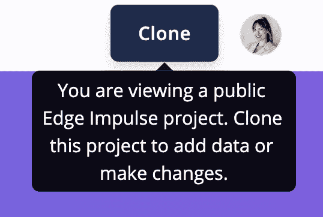

###### 图 11-1\. 克隆 Edge Impulse 公共项目

## 选择您的硬件和传感器

在本书中，我们尽可能地保持设备的中立性，但我们还需要讨论如何使用现成、易于使用的开发套件来创建此用例的解决方案，因为我们假设本章节中概述的教程很可能用于道德、非营利目的，这意味着读者可能会受到嵌入式工程资金、资源、开发人员等的限制。因此，本书旨在尽可能地使硬件选择变得简单、经济和易于获取。

为了快速简便地进行数据摄入和部署，而无需编写任何代码，我们将同时使用 Edge Impulse WebAssembly 库和移动客户端将新数据摄入并将训练后的模型部署到移动电话。对于其他同样简便的部署设备，Edge Impulse 提供了大量[官方支持的平台](https://oreil.ly/stMSR)，从 MCU 到 GPU，其中所有平台都包括可供您使用的开源预写固件。如果您有一台未列为 Edge Impulse 官方支持平台的设备，仍然可以使用该设备，但您需要将部署的 C++ 库和您设备的驱动代码集成到您的应用程序代码中，就像在典型的嵌入式固件开发工作流中一样。

平台选择对本书来说并不重要，因为我们试图确保几乎任何物理设备平台都能实际解决每个用例章节（除了任何内存或延迟限制）。您可以使用树莓派和各种传感器配置解决所有用例章节，并实现本文所讨论的相同目标。

然而，根据使用案例的目标，选择树莓派将迫使您考虑必要的高耗电需求以使树莓派正常运行，但与此相反，这种设备选择可能成本更低且大大减少总软件开发时间（对于单个现场单位而言；当然，如果需要大量相同设备，则树莓派+传感器/摄像头配置可能比 MCU/集成传感器/摄像头解决方案更昂贵，例如）。

### 硬件配置

对于您的主要边缘设备和附加摄像头配件，有无限组合可供选择。在本章中，我们将保持设备不可知性，但假设我们的目标设备类似于[OpenMV Cam H7 Plus](https://oreil.ly/hZddx)（带 RGB 集成摄像头）。

这种通用设置已经暗示了一些限制：我们的摄像陷阱只能在白天可靠工作；输入帧图像的质量可能太低，无法准确识别目标动物的所有实例，如果动物距离镜头太远；您的设备可能会因电池消耗过高而无法长时间无人看管地在野外生存；如果您试图使用灰度捕捉具有特定颜色的动物，则输入图像可能会产生不准确的预测。¹⁰

以下是一些其他摄像头附件选项和要考虑的要求清单，以提高特定环境、使用案例、项目预算等方面的野生动物监测模型的准确性：

+   高质量摄像头

+   低质量摄像头

+   红外线、热成像摄像头

+   灰度与彩色（RGB）输入

+   镜头焦距

+   输入图像像素密度

## 数据收集

使用 Edge Impulse，您可以在项目中上传和标记数据的多种选项：

[Edge Impulse Studio 上传工具](https://oreil.ly/b3url)

网页上传工具允许您直接从计算机上传文件到您的 Edge Impulse 项目中，支持多种文件格式。您还可以根据文件名自动为您的样本标记。

[CLI 上传工具](https://oreil.ly/cxdp4)

CLI 上传工具允许您从计算机的命令行终端直接上传文件到 Edge Impulse 项目，支持多种文件格式和输入选项。您还可以根据文件名自动为您的样本标记。

[摄入 API](https://oreil.ly/myL7K)

编写数据收集脚本，通过简单调用摄入 API，连接您的平台到 Edge Impulse 项目。使用您选择的脚本语言，您可以设置定时器和触发器，以便自动上传图像到您的项目，使用您的[Edge Impulse 项目 API 密钥](https://oreil.ly/623ly)。

[数据源（云存储桶集成）](https://oreil.ly/1QweQ)

直接从您的云数据存储桶中提取数据，并在您的 Edge Impulse 项目中自动触发响应（此功能特别适用于使用主动学习策略随时间改进模型）。

关于 Edge Impulse 数据采集格式的更多细节可以在[Edge Impulse API 参考文档](https://oreil.ly/Z5IzD)中查看。

### 将您的设备直接连接到 Edge Impulse 进行数据收集

有多种方法可以直接从您选择的平台上传数据到您的 Edge Impulse 项目。

如果您选择的设备平台*得到官方支持*，您可以根据[Edge Impulse 开发板文档](https://oreil.ly/ULIdQ)中找到的您目标设备的固件更新指南进行操作。

如果您选择的设备平台*未经官方支持*，请参考[开发平台移植指南](https://oreil.ly/iOo23)，将 Edge Impulse 的[摄取 API](https://oreil.ly/FsCTx)完全集成到您的嵌入式设备固件中（请注意，移植通常耗时且大多数项目不必要，除非您希望您的目标出现在[Edge Impulse 社区论坛页面](https://oreil.ly/xxTwr)上），或者使用[Edge Impulse CLI 串行数据转发器](https://oreil.ly/c9qb0)，快速轻松地通过串行端口或 WebUSB 将数据注入到您的 Edge Impulse 项目中。

您还可以使用手机或计算机直接从设备上的摄像头上传新图像；通过项目的设备标签查看所有设备连接选项（参见图 11-2）。

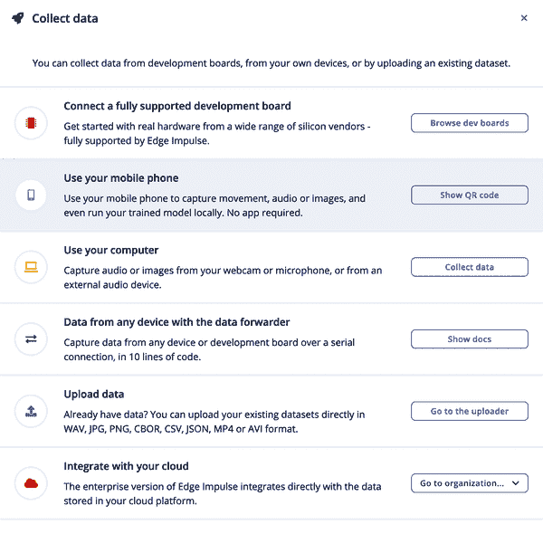

###### 图 11-2. 设备标签中的“收集数据”视图

## iNaturalist

由于大多数人可能没有大量入侵物种图像数据集可供使用，因此我们需要通过第二种数据收集形式来开始我们的入侵动物图像数据集。在本教程中，我们将不会在野外设置设备来收集动物的新的未标记的原始图像，而是将使用社区中已经标记了我们目标物种名称的图像。使用[iNaturalist](https://www.inaturalist.org)，我们将查询他们的数据库以获取包含我们识别的物种图像的数据集，查询此物种名称，并下载具有 iNatural 图像 ID 和每个文件下载的摄影师用户名的数据集。

您将需要一个 iNaturalist 帐户登录[iNaturalist 导出网站](https://oreil.ly/u4m7i)，并处理以下查询。

首先，我们将查询我们期望的捕捉动物物种名称，并在 iNaturalist 中检索一个包含以下列的 CSV 文件：id、user_login、quality_grade、license、url、image_url（见示例 11-1 和图 11-3）。

##### 示例 11-1. 查询 Callosciurus finlaysonii

```
q=Callosciurus+finlaysonii&search_on=names&has%5B%5D=photos
   &quality_grade=any&identifications=any
```

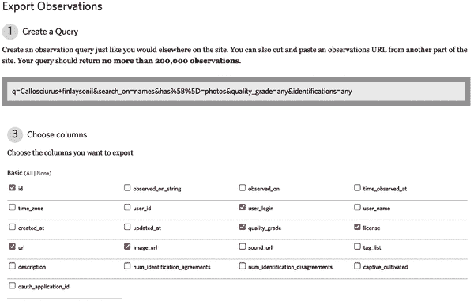

###### 图 11-3\. 选择用于 CSV 文件的列

我们还需要一个图像数据集，其中包括“未知”物种的图像或荷兰环境中不包括*Callosciurus finlaysonii*（或任何动物）的图像。这些“未知”数据将帮助我们训练模型，更准确地预测我们的设备是否拍摄/捕捉到了我们设置的目标动物。使用以下列在 iNaturalist 中查询此类数据：id、user_login、quality_grade、license、url、image_url（参见示例 11-2 和图 11-4）。

##### 示例 11-2\. 查询荷兰地区 ID 7506（荷兰）的未标记图像

```
search_on=place&has[]=photos&quality_grade=any&identifications=any
   &iconic_taxa[]=unknown&place_id=7506
```

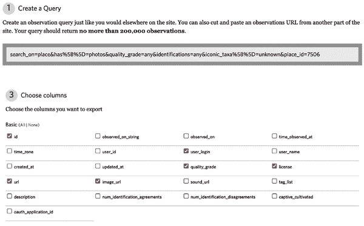

###### 图 11-4\. 选择用于 CSV 文件的列

下载从上述查询中生成的 CSV 文件，并将文件保存到您的计算机上。

现在，使用我们生成的 CSV 文件，使用 示例 11-3 中的 Python 代码下载和保存 iNaturalist 查询的图像到您的计算机，同时也将下载的文件归因于原始 iNaturalist 上传者的用户名。运行脚本两次，一次用于您的陷阱动物图像，另一次用于“未知”图像。将这些文件保存在两个不同的目录中，例如 */unknown/* 和 */animal/*（参见 示例 11-3）。

如果您还没有安装 `requests` 包，您可能需要通过 `pip` 安装它：`python -m pip install requests`。

##### 示例 11-3\. 从 iNaturalist 下载图像的 Python 代码

```
import csv
from pathlib import Path
import requests

directory = Path("unknown")  # Replace directory name, "unknown" or "animal"
directory.mkdir(parents=True, exist_ok=True)

with open("observations-xxx.csv") as f:  # Replace csv filename
    reader = csv.reader(f)
    next(reader, None)  # skip header row
    for data in reader:
        # filename is constructed as id.user_login.extension
        id_, user_login, url = data[0], data[1], data[5]
        extension = Path(url).suffix
        path = directory / f"{id_}.{user_login}{extension}"
        img = requests.get(url).content
        path.write_bytes(img)
```

如果您想要删除图像 URL 中的查询参数（如上文所述），请将 `Path(url).suffix` 替换为 `Path(url.split("?")[0]).suffix`。

根据您的 iNaturalist 查询结果的大小和条目数量，此脚本的运行时间可能会有所不同。对于此用例，建议将 iNaturalist 查询结果限制在 4,000 条以下。您可以通过更改查询设置，仅包括研究质量的图像、来自特定地点 ID 的图像等方式，减少 iNaturalist 查询的输出。您可以通过访问 [iNaturalist 网站](https://oreil.ly/SGCIr)，在 Identify 搜索栏的 Place 文本框中输入一个位置，然后在按下 Go 后，Place ID 值将在 URL 中显示。例如，纽约市的地点 ID 是 674：[*https://www.inaturalist.org/observations/identify?place_id=674*](https://www.inaturalist.org/observations/identify?place_id=674)。

## 数据集限制

即使从 iNaturalist 获取了一个强大的数据集，仍然会出现许多限制。当摄像机记录到未标记动物的多次检测时，无法确定这些图像是代表多个移动个体还是一个个体重复进入摄像头视野区域。¹¹

iNaturalist 也倾向于选择在图像框架内部接近/大的动物图像。这种动物图像的偏差可能会降低实际世界中生成的机器学习模型的准确性，因为近距离的图像倾向于不包括周围环境的大背景，导致模型期望每个动物都靠近摄像头镜头。

为了抵消这种偏差，可能需要采取“主动学习”方法来随着时间的推移改进模型——即，最初部署次优模型以捕捉目标生物的新图像，直接将这些新图像存储在设备上或上传到云存储桶，然后确认图像中的动物位置，标记并将其上传到我们项目的原始训练数据集，最后重新训练模型并重新部署到设备上。

## 数据集许可和法律义务

在创建 Edge Impulse 帐户时，每位 Edge Impulse 用户必须遵守以下使用条款、许可证和政策：

+   [Edge Impulse 隐私政策](https://oreil.ly/Ud6ja)

+   [Edge Impulse 服务条款](https://oreil.ly/0y-PK)

+   [Edge Impulse 负责人工智能许可](https://oreil.ly/rmeaN)

+   [Edge Impulse DMCA（数字千禧年版权法案）政策](https://oreil.ly/a6SwO)

假设您遵守上述规则和条件，一旦您将模型创建并部署到设备上，您无需订阅或支付费用；截至撰写本书时（2022 年），所有免费的 Edge Impulse 用户都可以免费将其模型分发并部署到无数的生产设备上。如果您的数据原本是您自己的，您在整个边缘 AI 模型的生命周期中都保留您的知识产权。

如果您使用从第三方网站（如 iNaturalist）下载的数据集，则需要确保您获取的数据可以重新分发或用于商业用途。有关 iNaturalist 使用条款的更多详细信息可以[在其网站上查看](https://oreil.ly/Thjyc)。

对于任何其他数据集，请确保您在合法、公正和道德的基础上获取、分发和使用数据。许多数据集收集网站会使用像[知识共享](https://oreil.ly/AyCfy)、Apache 等许可证。在用于边缘机器学习模型训练和测试的目的时，您需要在使用这些数据集时做出最佳判断。如果有任何疑问，请通过电子邮件联系数据集所有者或数据收集网站支持团队，以获取有关数据使用要求、归属义务和法律澄清的更多信息。

## 清理您的数据集

因为我们已经从 iNaturalist 下载了我们的图像数据集，并已经使用与其关联的机器学习类别标记了我们的图像，所以在将图像上传到 Edge Impulse 项目之前，我们无需进行太多的数据集清理工作。

然而，如果您有一小部分*标记*图像的数据集和一大部分关联但*未标记*的图像数据集，Edge Impulse 提供名为[“数据浏览器”](https://oreil.ly/uhD9P)的工具，允许您使用预训练模型（参见图 11-5），先前训练过的 impulse 或您的预处理块来批量标记训练或测试数据集中的未标记图像。当然，如果您尚未在数据的较小子集上训练模型，则此工具将无法工作，例如，像 MobileNetV2 那样，唯一的物种名称并未预先训练在现有的 ImageNet 上。您还可以选择两种不同类型的降维技术，t-SNE（适用于较小的数据集）和 PCA（适用于任何数据集大小）。

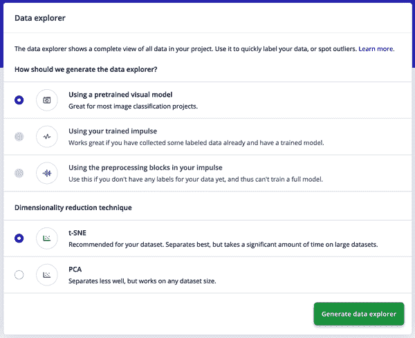

###### 图 11-5\. Edge Impulse Studio 数据浏览器

## 将数据上传到 Edge Impulse

根据 iNaturalist Python 数据下载脚本，将图像上传到您的 Edge Impulse 项目（参见图 11-6），使用 Edge Impulse 项目的网页 GUI，或使用以下[Edge Impulse CLI 上传工具](https://oreil.ly/l_OQo)命令，确保将 `[your-api-key]` 替换为您的 Edge Impulse 项目的 API 密钥，`[label]` 替换为“unknown”或陷阱动物的名称，`[directory]` 替换为您在 iNaturalist Python 脚本中指定的文件目录：

```
$ edge-impulse-uploader --api-key [your-api-key] --label [label] \
   --category split .[directory]/*
```

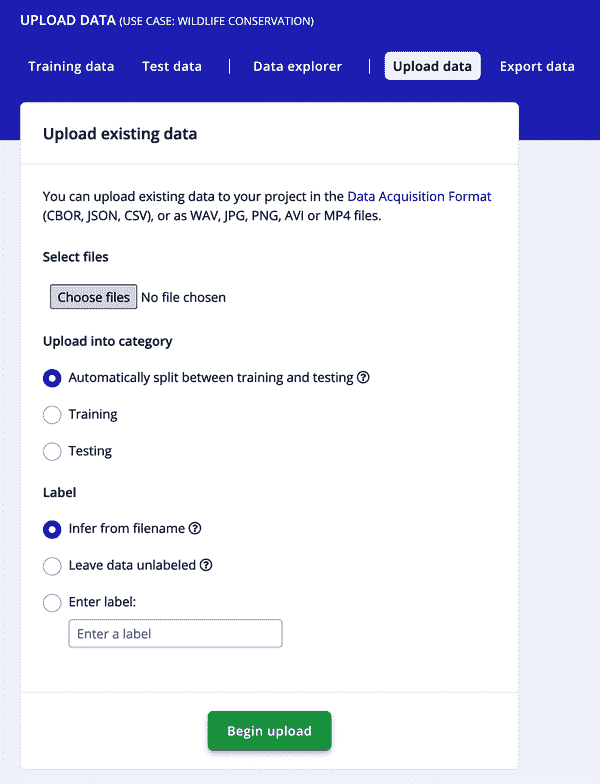

###### 图 11-6\. 将现有数据集上传到 Edge Impulse 网页上传工具

网页 GUI 和上传 CLI 都允许您将上传的图像自动分割为训练和测试数据集，按 80/20 的比例分割（大多数机器学习项目的良好比例）。

# DSP 和机器学习工作流程

现在，我们已将所有图像上传到我们的训练和测试数据集中，我们需要使用数字信号处理（DSP）方法提取我们原始数据的最重要特征，然后训练我们的机器学习模型以识别图像提取特征中的模式。Edge Impulse 将 DSP 和 ML 训练工作流程称为“脉冲设计”。

您的 Edge Impulse 项目的“脉冲设计”选项卡允许您查看和创建全面的端到端机器学习流水线的图形简单概述。最左边是原始数据块，Edge Impulse Studio 将摄取并预处理您的数据；在我们的情况下，对于图像，它将规范化所有图像，使它们具有相同的尺寸，并且如果尺寸不是正方形，则会通过您选择的方法裁剪图像。

接下来是 DSP 块，我们将通过开源数字信号处理脚本提取图像的最重要特征。一旦生成了我们数据的特征，学习块将根据我们期望的架构和配置设置来训练我们的神经网络。

最后，我们可以查看部署输出信息，包括我们希望我们训练过的机器学习模型分类的期望类别。

在 Edge Impulse 项目中，设置您的“Impulse design”选项卡与 Figure 11-7 相同，或通过从各种块弹出窗口中选择来进行设置，然后点击保存脉冲：

图像数据

+   图像宽度：160

+   图像高度：160

+   调整模式：适合最短轴

处理块

+   图像

学习块

+   迁移学习（图像）

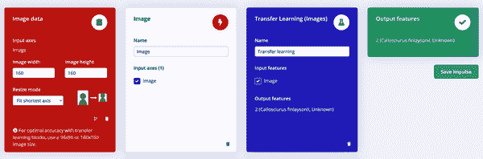

###### 图 11-7\. 脉冲设计选项卡配置

## 数字信号处理块

在本章介绍的项目中，我们将使用 Edge Impulse Studio 默认包含的 Image DSP 算法。我们在“Impulse design”选项卡上选择的这个图像处理块是预先编写的，并可以在平台上免费使用和部署。图像块中使用的代码可以在[Edge Impulse GitHub 仓库“processing-blocks”](https://oreil.ly/jjL2E)中找到。您还可以在“Image feature detection”中了解更多有关 Spectral Analysis 算法的详细信息。

如果您想要为 Edge Impulse Studio 编写自己的定制 DSP 块，可以通过遵循[Edge Impulse 自定义处理块教程](https://oreil.ly/Dx2KJ)使用您选择的语言轻松完成。

然而，如果您决定为应用程序编写自己定制的 DSP 处理块，请注意，您需要编写相应的 C++实现，以便您的模型部署按预期工作在 Edge Impulse SDK 中。在 Edge Impulse Studio 中使用现成的 DSP 块是一个重要优势，因为它可以从数据收集到特征提取再到部署的整个开发时间——您不需要在应用程序端编写任何自定义的 C++代码；一切都已经集成在部署库中，准备好进行编译。

在导航侧边栏的图像选项卡中，将颜色深度保持 RGB，并点击“保存参数”。现在，选择“生成特征”以创建“Feature explorer”的视图（见 Figure 11-8）。

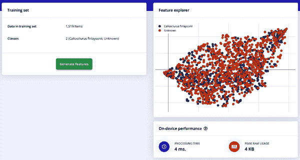

###### 图 11-8\. 图像 DSP 块和特征探索器

## 机器学习块

现在我们准备训练我们的边缘机器学习模型了！在 Edge Impulse 中有多种训练模型的方式，最简单的是可视（或 Web GUI）编辑模式。但是，如果您是机器学习工程师、专家，或者已经具有使用 TensorFlow/Keras 编码的经验，那么您也可以在 Edge Impulse Studio 中的本地或专家模式中编辑您的迁移学习块。

我们可以从“转移学习”选项卡设置项目的神经网络架构和其他训练配置设置。

### 视觉模式

配置和设置我们的机器学习训练设置和神经网络架构的最简单方法是通过 Edge Impulse 的视觉模式，或者在导航栏中选择“冲动设计”下的“转移学习”选项卡时的默认视图。保存带有转移学习块的冲动时，默认应用以下设置（参见图 Figure 11-9）；如果您的项目中这些设置不同，请复制这些设置到您的转移学习块配置中：

+   训练周期数：100

+   学习率：0.0005

+   验证集大小：20%

+   自动平衡数据集：未选中

+   数据增强：未选中

+   神经网络架构：MobileNetV2 96x96 0.35（最终层：16 个神经元，0.1 的丢弃率）

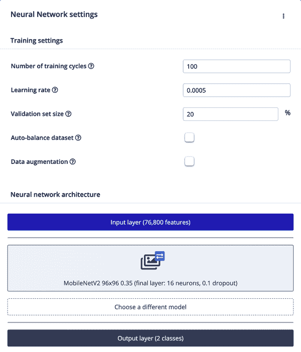

###### 图 11-9\. 默认迁移学习神经网络设置

一旦您输入了这些设置，您只需点击“开始训练”，在神经网络架构配置下方生成您的训练作业，将其发送到 Edge Impulse 服务器上。生成的作业将会精确地训练您的模型，就像在本地计算机上运行 TensorFlow/Keras 脚本一样。通过使用 Edge Impulse，我们无需使用本地计算机的资源，而是利用 Edge Impulse 免费为所有开发者提供的云计算时间。根据您的数据集大小，此训练步骤可能需要一些时间，此时您可以选择“训练输出”视图上的铃铛图标，在作业完成时收到电子邮件通知，并查看训练结果的输出（参见图 11-10 和 11-11）。


###### 图 11-10\. 训练作业通知铃铛图标

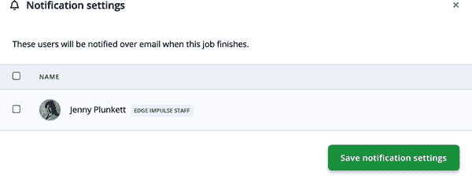

###### 图 11-11\. 配置作业通知设置

当您的模型训练完成后，您可以在“模型 > 最后训练性能”视图中查看迁移学习结果（参见图 Figure 11-12）。

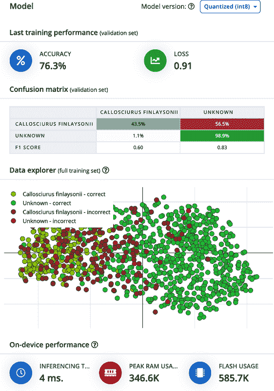

###### 图 11-12\. 默认块配置的迁移学习结果（准确率为 76.3%）

考虑到到目前为止我们所做的一切仅仅是上传了训练和测试数据集，用图像 DSP 块提取了最重要的特征，并使用了默认的块配置设置进行了模型训练，而没有编写任何代码，这些结果还是相当不错的！76.3% 的结果是一个相当不错的初始准确率，考虑到我们对神经网络架构、DSP 块等并没有进行任何自定义配置来适应我们的特定用例。然而，通过使用 Edge Impulse 提供的其他工具，如 EON 调谐器，我们可以进一步提高模型的准确性，下一节将对此进行描述。

# 专家模式

您是机器学习工程师，或者已经知道如何在 Python 中编写 TensorFlow/Keras 代码吗？在 Edge Impulse 中使用专家模式选项，通过点击“神经网络设置”右侧的三点下拉按钮，可以上传您自己的代码或本地编辑现有的块代码，选择[“切换到专家（Keras）模式”](https://oreil.ly/wpEzB)或[“本地编辑块”](https://oreil.ly/sYSIP)。

### EON 调谐器

自动机器学习工具是有价值的工具，可以自动选择和应用最佳的机器学习算法来处理您的数据，并自动调整您的机器学习模型的参数，从而进一步提高其在边缘设备上的性能。Edge Impulse Studio 在您的项目中提供了一个名为 EON 调谐器的自动机器学习工具。EON 调谐器将并行评估许多候选模型架构和 DSP 块（根据您的目标设备和延迟要求进行选择），以帮助您找到最适合您的机器学习应用的性能最佳架构。

在您的 Edge Impulse 项目的 EON 调谐器选项卡中，配置如 图 11-13 所示的设置。

从 EON 调谐器的配置下拉设置中选择以下选项：

+   数据集类别：视觉

+   目标设备：Cortex-M7（或任何其他支持的平台；如果您不使用官方支持的平台，请选择硬件内部结构与您的设备最相似的平台）

+   推断时间（毫秒）：100

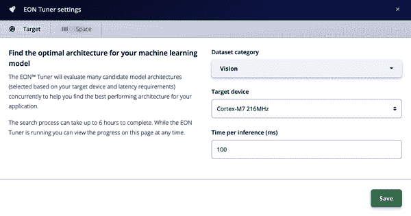

###### 图 11-13\. EON 调谐器配置设置

然后点击“启动 EON 调谐器”，如 图 11-14 所示。


###### 图 11-14\. 启动 EON 调谐器

将 EON 调谐器的结果与默认的边缘脉冲项目中包含的默认图像分类块进行比较，我们可以看到它们之间存在显著差异。通过自动机器学习工具，我们可以更快速、更高效地确定适合我们用例的更佳性能的神经网络架构、DSP 块、参数等。

图 11-15 展示了使用图像 RGB DSP 块和原始“迁移学习”神经网络块的默认块结果，其中 MobileNetV2 96x96 0.35（最终层：16 个神经元，0.1 的丢弃率），100 个训练周期和 0.0005 的学习率。

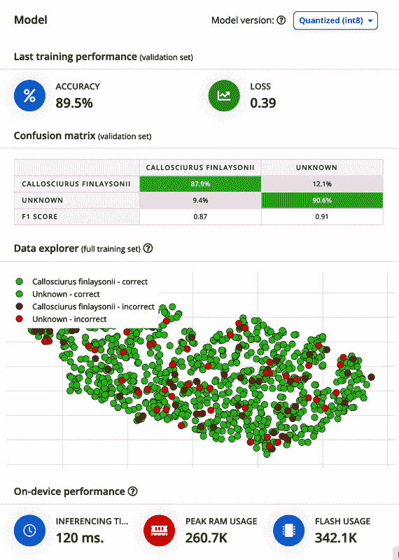

###### 图 11-15\. 使用 EON 调谐器块配置的迁移学习结果（准确率 89.5%）

一旦 EON 调谐器自动机器学习作业完成，我们可以看到结果。对于图 11-16 中显示的 EON 调谐器结果，第一个结果达到了 90%的准确率；然而，由于 RAM 和 ROM 都超出了我们目标硬件规格，我们将选择第二个最佳选项，准确率为 89%。

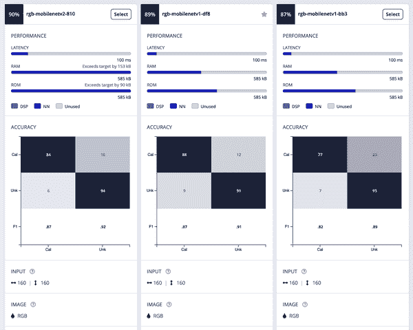

###### 图 11-16\. EON 调谐器结果矩阵（不超过目标 RAM 的最佳结果为 89%准确率）

基于这些结果，我们肯定希望使用 EON 调谐器为我们的用例自动生成的块更新主块信息。在最佳准确率配置旁边，点击选择按钮并更新主模型，如图 11-17 所示。

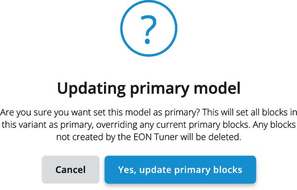

###### 图 11-17\. 使用 EON 调谐器更新主模型

等待 Studio 在您的项目中更新“脉冲设计”块（参见图 11-18），然后点击“迁移学习”，查看您更新的训练模型结果、准确率和延迟计算，如图 11-19 所示。

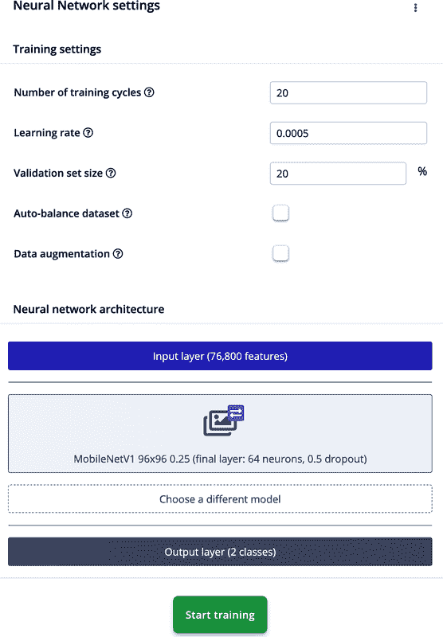

###### 图 11-18\. EON 调谐器神经网络设置

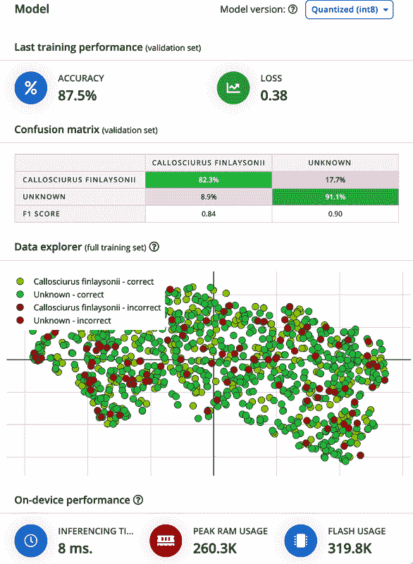

###### 图 11-19\. 使用 EON 调谐器更新的主迁移学习模型

# 测试模型

Edge Impulse 提供多种类型的测试和验证工具，以增加您对训练的机器学习模型或脉冲在实际环境准确性的信心。在完成训练脉冲后，您可以访问项目导航栏上的[“实时分类”](https://oreil.ly/lBG87)和[“模型测试”](https://oreil.ly/gO2EL)选项卡。

# 测试您的音频模型与性能校准

如果您开发了一个音频陷阱，如“深入探讨：利用 Lacuna Space 进行鸟类声音分类演示”所述，则还可以在您的 Edge Impulse 项目中使用[性能校准](https://oreil.ly/B3eQh)模型测试和真实世界性能调谐器。

## 实时分类

从“实时分类”选项卡，您可以测试来自测试数据集的单个测试样本与您训练的模型，或者连接您的设备实时录制新图像和测试样本，然后查看图像的提取特征和结果分类结果和推理预测（参见图 11-20）。

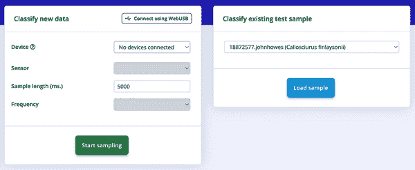

###### 图 11-20\. 实时分类

通过安装的 Edge Impulse 设备固件或通过 Edge Impulse CLI 数据转发器将官方支持的设备连接到“实时分类”选项卡；例如，连接 Arduino Nano 33 BLE Sense 到您的项目，在设备的环境中通过以下 CLI 命令拍摄新的测试图像：`edge-impulse-daemon`。按照 CLI 提示连接您的设备到项目并记录新样本。

或者在“分类现有测试样本”中加载现有的测试数据集图像，以查看该样本的提取特征及您训练模型的预测结果（如图 11-21 所示）。

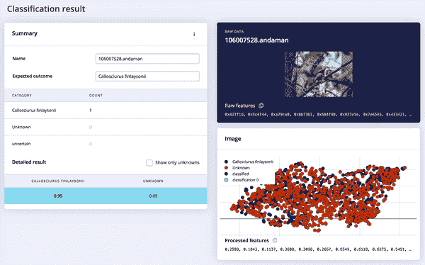

###### 图 11-21\. 实时分类结果

## 模型测试

您还可以通过导航到您项目的[“模型测试”](https://oreil.ly/gPhj3)选项卡，对您的测试数据集进行批量分类，与您训练的模型进行对比（参见图 11-23）。从这里，您可以选择“全部分类”按钮，自动收集测试数据的推理结果和模型预测，并呈现在一个长表格中。您还可以通过单击“设置置信阈值”的三个点下拉按钮在此设置模型推理结果的置信阈值（如图 11-22 所示）。阈值分数决定了对训练的神经网络信任程度。如果置信评分低于您设定的值，样本将被标记为“不确定”。您可以使用带有“不确定”标记的推理结果，通过“主动学习”模型开发策略进一步提高模型的准确性；上传这些不确定图像，标记它们，重新训练您的模型，并重新部署到您的边缘设备！查看图 11-23 以获取模型测试结果。

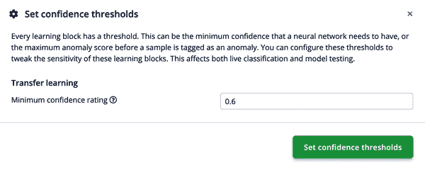

###### 图 11-22\. 设置置信阈值

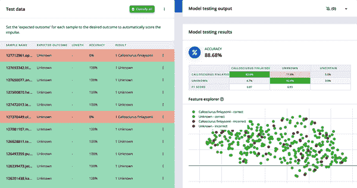

###### 图 11-23\. 模型测试选项卡结果

## 本地测试您的模型

您还可以下载所有中间块结果和训练模型信息，通过任何您希望的方法在本地测试您的模型——例如，使用 Python 脚本进行测试，如您通常为 TensorFlow/Keras 工作流程所做。导航到您的 Edge Impulse 项目的仪表板，查看所有可用的块输出文件，如图 11-24 所示。

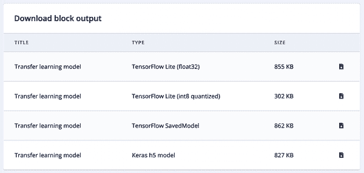

###### 图 11-24\. 下载块输出

# 部署

恭喜！您刚刚完成了收集和标记训练和测试数据集，使用 DSP 块提取数据特征，设计和训练机器学习模型，并使用测试数据集测试模型的过程。现在我们已经拥有了在边缘设备上进行推理所需的所有代码和模型信息，我们需要将预构建的二进制文件刷入设备，或者将 C++库集成到我们的嵌入式应用程序代码中。

选择您的 Edge Impulse 项目的部署选项卡，并按照下一节中的多个部署选项的步骤之一来在边缘设备上运行您训练好的机器学习模型。

## 创建库

为了简化开发体验，Edge Impulse 提供了许多预写的代码示例，用于将部署的模型集成到嵌入式应用固件中。使用官方支持的开发板将允许最快的部署和最少的开发时间，因为您可以将预构建的固件应用程序拖放到开发板上，或者从[Edge Impulse GitHub 组织](https://oreil.ly/rH9iO)克隆板的开源固件存储库，该存储库包含开始嵌入式应用程序开发和调试过程所需的所有设备固件和驱动程序。

如果您将模型部署到“非官方支持”的平台，有许多资源可帮助您将 Edge Impulse SDK 集成到您的应用程序代码中，无论库部署选项如何：

+   [预构建的 Edge Impulse 固件](https://oreil.ly/V3eRI)

+   [将 Edge Impulse SDK 集成到你的应用程序中](https://oreil.ly/yAlgD)

+   [理解 C++库代码并获取模型推理结果](https://oreil.ly/-gPy_)

多数使用“非官方支持”的设备的项目，将使用位于项目部署选项卡“创建库”视图下的 C++库选项部署（见图 11-25）。该 C++库是可移植的，没有外部依赖，并且可以使用任何现代 C++编译器进行编译。

# 自定义处理块

如果你决定在你的 Edge Impulse Studio 项目中使用自定义的 DSP 块，你需要编写 DSP 块的等效 C++实现，并将其集成到 Edge Impulse SDK 代码中。更多信息可以在[Edge Impulse 文档](https://oreil.ly/t1K1_)中找到。

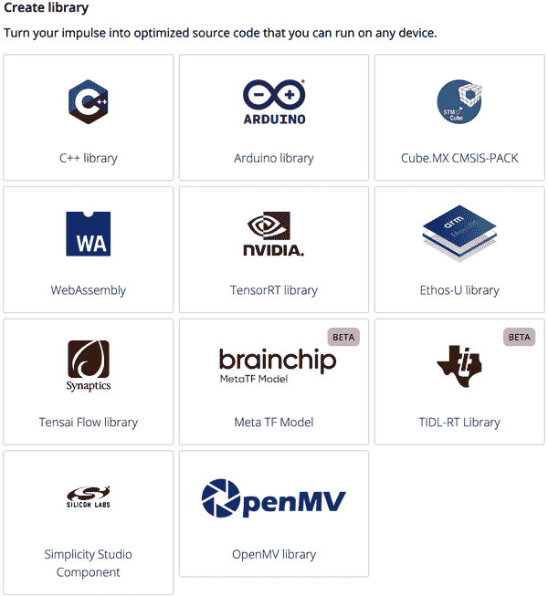

###### 图 11-25\. 创建一个开源库

## 手机和电脑

通过单击 Edge Impulse 的“计算机”和“手机”部署选项，快速将您的模型部署到边缘。这些部署选项利用一个[开源移动客户端固件](https://oreil.ly/4-S9S)，为您训练的脉冲构建一个 WebAssembly 库，可以直接从手机或计算机上的摄像头对全新数据进行分类。如果您在训练/测试数据集中使用默认/集成传感器类型，则此选项非常适合快速模型原型设计和测试，因为您不需要为此部署选项编写任何代码。

对于这个项目，因为我们的训练和测试数据只是图像，我们可以使用手机上的摄像头直接在边缘上测试我们的模型，通过手机的网络浏览器缓存和集成摄像头数据（参见图 11-26）。

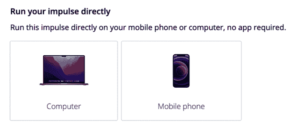

###### 图 11-26\. 直接运行您的脉冲（手机和电脑）

从您项目的部署选项卡中选择“计算机”或“手机”图标，然后点击生成。如果您使用的是手机，请使用手机摄像头扫描生成的 QR 码，并在手机的网络浏览器中打开 URL。允许移动客户端访问您手机的摄像头，并等待项目生成。现在，您可以在手机上直接查看您的训练相机陷阱模型在边缘上运行，并打印您的推理结果！在图 11-27 中查看结果。

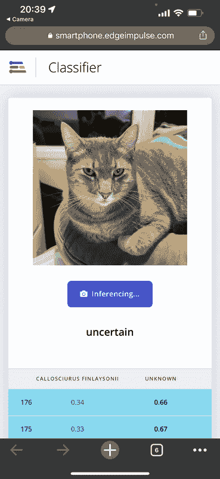

###### 图 11-27\. 在手机部署上运行的相机陷阱模型

## 预构建二进制刷写

从部署选项卡中，在“生成固件”下选择您的官方支持的 Edge Impulse 开发平台，然后选择生成。您还可以选择使用 EON 编译器，它使您可以使用 25-55%更少的 RAM 和高达 35%更少的闪存来运行神经网络，同时保持与 TensorFlow Lite for Microcontrollers 相同的准确性，详见¹²。

然后，按照部署选项中显示的说明，通过拖放或刷写生成的固件应用程序到您的官方支持平台。关于刷写预构建二进制文件的更深入说明可以在您选择的开发平台的[Edge Impulse 文档](https://oreil.ly/llg9B)中找到。

对于这个项目，我们将选择“OpenMV Library”部署选项，在[OpenMV Cam H7 Plus](https://oreil.ly/EfJwe)上运行我们的训练模型，如前文所示图 11-25。

按照 [Edge Impulse 网站上的 OpenMV 部署文档](https://oreil.ly/82tKN) 的说明下载并安装软件先决条件。然后将您的模型固件的下载 ZIP 文件解压并将 *labels.txt* 和 *trained.tflite* 文件拖放或复制到您插入的 OpenMV Cam H7 Plus 的文件系统中。在 OpenMV IDE 中打开 *ei_image_classification.py* 脚本。通过 USB 图标连接到您的 OpenMV Cam 板并运行 Python 脚本，在串行终端视图中查看在边缘上运行的模型推断结果，如 图 11-28 所示。

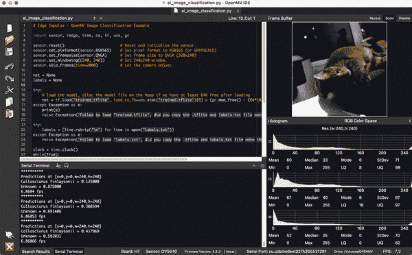

###### 图 11-28\. OpenMV IDE 模型部署到 OpenMV Cam H7 Plus

## 脉冲运行者

您还可以使用 [Edge Impulse CLI](https://oreil.ly/KVUJf) 通过 USB 串行连接到您选择的官方支持平台下载、部署和运行您的模型。或者使用 [Edge Impulse Linux runner](https://oreil.ly/SJZex) 在 Raspberry Pi 4 或其他 Linux 设备上下载、部署和运行 Edge Impulse 模型。

## GitHub 源代码

本章中使用的应用程序源代码，包括来自公共 [Edge Impulse 项目](https://oreil.ly/I_EIA) 的部署库和完成的应用程序代码，可在 [GitHub 仓库](https://oreil.ly/rmE7-) 上查看和下载。

# 迭代和反馈循环

现在您已经将第一次迭代的野生动物监测模型部署到边缘设备，您可能对结果感到满意，并停止在这里进行开发。然而，如果您希望进一步迭代您的模型并随着时间或新获得的设备升级进一步提高准确性，例如，有许多适应和变体需要考虑和改进这个项目：

+   为不同动物添加更多的机器学习类别到您的模型中。

+   创建用于入侵植物物种的相机陷阱而不是动物：用于当地园艺/觅食等目的。

+   使用不同的传感器实现相同的目标 —— 即，使用气体传感器进行野生动物保护陷阱，或将相机训练数据输入从标记图像转换为物种目标检测的边界框（参见 “对象检测和分割”）。

+   使用同样的模型实现*不同*的目标或将其放置在不同的环境中，以改进“未知”类别。

+   利用多种传感器的组合进一步提高模型的准确性 —— 即，相机 + 音频输入，音频 + 气体输入等。

您还可以在 Edge Impulse 中创建多个项目，为多个设备位置创建多个不同的机器学习模型，并对其他捕捉动物进行分类。例如，您可以在初始数据集中为多个动物物种使用相同的撒哈拉沙漠模型，并仅替换主要物种，然后重新训练和部署。这允许您在另一个环境中使用与您用于一个环境相同的模型配置。

# AI for Good

本书始终强调了在道德上使用所描述的机器学习工具和知识的重要性。许多公司已经开始将“技术为善”理念付诸实践——从 Edge Impulse 到 Google，已经建立了许多环境/野生动物保护的努力和承诺：

+   [1% 为地球计划](https://oreil.ly/_xwYK)

+   [Edge Impulse 的承诺](https://oreil.ly/CRH0m) 给地球 1% 的贡献

+   Google, [“鲸鱼歌谣”故事](https://oreil.ly/wtIpX)

+   Microsoft, [AI for Good](https://oreil.ly/o0TGV)

# 相关作品

正如本章所述，摄像陷阱和保护陷阱已经成为研究和道德狩猎实践中已知并广泛采用的设备。接下来的章节描述了关于道德摄像陷阱的各种设备、数据集、研究文章和书籍，用于解决各种濒危物种减少和保护现有种群的问题。

本书还在每页脚注中注明了本章节中摄像陷阱的各种应用、方法、设备和引用的来源，包括研究和商业采用。

## 数据集

在互联网上有许多现有的数据集和数据集收集平台可供此类用例使用。通过简单的谷歌搜索可以找到许多结果；然而，以下是几个适用于我们用例的数据收集平台和研究数据集：

+   [Kaggle 入侵物种监测竞赛](https://oreil.ly/H4Y3N)

+   [外来入侵植物数据集](https://oreil.ly/xfBKr)

+   [iWildcam 2021](https://oreil.ly/76OW4)

+   [亚历山大图书馆标记信息: 生物学与保护; 其他保护数据集列表](https://oreil.ly/-IUvi)

+   [加州理工大学-加州大学圣地亚哥分校 200-2011 年鸟类摄影分类](https://oreil.ly/lLU00)

+   [加州理工摄像陷阱](https://oreil.ly/boZ8q)

再次强调，请确保您在使用每个数据集时都是出于道德目的，并确保您的模型的目标物种在设备安装的位置/地区中不被视为濒危或受威胁。

## 研究

+   Ahumada, Jorge A. 等人 [*Wildlife Insights: A Platform to Maximize the Potential of Camera Trap and Other Passive Sensor Wildlife Data for the Planet*](https://doi.org/10.1017/S0376892919000298). 剑桥大学出版社, 2019.

+   Apps, Peter, 和 John Weldon McNutt. [“摄像机陷阱是否适用？摄像机陷阱性能的严格、可重复和真实测试”](https://doi.org/10.1111/aje.12573)。Wiley Online Library, 2018 年。

+   Fischer, Johannes H. 等人。[“用于鉴定、年龄鉴定、性别鉴定和研究婆罗洲冠雉的摄像机陷阱研究的潜在价值”](https://oreil.ly/udikH)。ResearchGate，2017 年。

+   Jang, Woohyuk, 和 Eui Chul Lee。[“包括外观相似亚种的多类鹦鹉图像分类”](https://doi.org/10.3390/biology10111140)。MDPI，2021 年 11 月 5 日。

+   O’Brien, Timothy G., 和 Margaret F. Kinnaird。[*一图胜千言：摄像机陷阱在鸟类研究中的应用*](https://doi.org/10.1017/S0959270908000348)。Cambridge University Press，2008 年。

+   O’Connell, Allan F. 等人，编辑。[*Camera Traps in Animal Ecology: Methods and Analyses*](https://doi.org/10.1007/978-4-431-99495-4)。Springer Tokyo, 2011 年。

+   Rovero, Francesco 等人。[“哪种摄像机陷阱类型和数量我需要？”](https://doi.org/10.4404/hystrix-24.2-8789) *Hystrix* 24 (2013 年)。

+   Shepley, Andrew 等人。[“使用公共数据源在摄像机陷阱图像中进行自动位置不变动物检测”](https://oreil.ly/FUEJN)。ResearchGate，2021 年。

¹ 查看国家野生生物联合会的文章，[“栖息地丧失”](https://oreil.ly/kpOVl)。

² 查看网站，[“联合国 AI for Good”](https://aiforgood.itu.int)。

³ 查看谷歌的网站，[“AI for Social Good”](https://oreil.ly/8L3BY)。

⁴ 查看微软的网站，[“AI for Good”](https://oreil.ly/8ZLQI)。

⁵ 阿布·纳瑟·莫辛·侯赛因等人，[“评估摄像机陷阱作为提高热带保护区野生动物犯罪检测率工具的效力”](https://doi.org/10.1016/j.biocon.2016.07.023)，《生物保护》201 (2016): 314–19。

⁶ 来自阿布·纳瑟·莫辛·侯赛因等人的文章，《全球摄像机陷阱数据中的穿山甲：生态监测的意义》[*Conservation* 201 (2016): 314–19](https://doi.org/10.1016/j.gecco.2019.e00769)。

⁷ 查看保罗·D·米克等人的文章，[“动物能听到和看到摄像机陷阱”](https://doi.org/10.1371/journal.pone.0110832)。

⁸ 查看《卫报》的这篇文章：[“报告澄清世界自然基金会未参与保护区护林员暴力行为”](https://oreil.ly/JQ2tE)。

⁹ 《泰国松鼠》，荷兰食品安全局，2022 年。

¹⁰ 这篇文章提供了一些更多信息：[Fischer 等人，“用于鉴别、年龄、性别和研究婆罗洲六鸡的摄像机陷阱研究的潜在价值”](https://oreil.ly/id-Bc)。

¹¹ 查看 Neil A. Gilbert 等人的文章，[“基于摄像机陷阱数据的未标记动物丰富度估计”](https://doi.org/10.1111/cobi.13517)。

¹² 查看 Jan Jongboom 的博客文章，[“介绍 EON：神经网络内存减少 55% 和 ROM 减少 35%”](https://oreil.ly/3-kTN)（Edge Impulse，2020）。

¹³ 查看 Aurelien Lequertier 等人的博客文章：[“利用 Lacuna Space 和 The Things Network 在偏远地区进行鸟类分类”](https://oreil.ly/4Rneh)，Edge Impulse，2021。
