# 第十二章：用例：食品质量保证

工业边缘人工智能用于食品质量保证，可以自动检测和修正食品缺陷，预防食品变质。通过训练机器学习模型来识别食品图像中或来自各种工业传感器中指示缺陷的模式来实现。然后将模型部署到边缘设备（如摄像头），以实时自动检测和修正缺陷。这有助于确保食品质量最高，并最小化浪费。

通过使用边缘人工智能，可以通过更有效地监控和管理食品生产和分配来预防食品浪费。例如，如果食品变质，可以使用边缘人工智能跟踪问题并采取纠正措施。在本章中，我们将讨论各种使用边缘人工智能进行食品质量保证的方法，它们的相关传感器和设备配置，以及我们选择的方法和用例解决方案的深入教程。

# 探索问题

“食品质量保证”这个术语在这一章节中涉及的概念过于宽泛，只依靠一个机器学习模型无法解决这样一个庞大的问题；因此，在本书中，我们将侧重于在家庭厨房环境、食品产品制造线或杂货店的冷藏货架上预防和减少食品浪费方面的食品质量保证。

防止食品浪费可以采取多种形式。从目标的角度来看，我们可以生成一个机器学习模型，可以识别食物何时即将变质或已经变质，或者可以创建一个模型，识别食品制造环境或产品处理不当的因素，这些因素会导致食源性疾病的发生。这两种方法都达到了相同的目标，即预防和减少食品浪费，但可能需要不同的机器学习分类和传感器输入的组合来解决。

在智能工厂中部署边缘人工智能设备还可以提高生产率和改善质量。将人工智能引入制造过程可以帮助减少错误并节省时间和金钱。通过使用连接到云端的智能手机，质量控制人员可以从任何地方监控制造过程。通过应用机器学习算法，制造商可以立即检测到错误。¹

# 探索解决方案

工业 4.0，或称为“第四次工业革命”的口头术语，概念化了由于日益增长的互联和智能自动化在 21 世纪引起的技术、行业和社会模式和过程的迅速变化。²

# 工业 4.0 的主要趋势

+   智能工厂

+   预测性维护

+   3D 打印

+   智能传感器（农业和食品行业）

边缘人工智能在食品质量保证中的应用越来越广泛，因为人工智能可以帮助检查食品中的污染物、测试食品的质量，甚至在问题发生之前预测食品安全问题。食品质量保证是一个确保我们消费的食品安全和高质量的过程。这个过程包括多种步骤，如检查食品中的污染物、测试食品的质量，以及保持清洁和安全的食品处理实践。通过遵循这些步骤，我们可以帮助确保我们食用的食品安全且质量良好。

我们可以通过思考和研究现有的问题和导致食品变质、过敏原、交叉污染制造过程等因素来直观地思考如何将边缘人工智能和机器学习应用于食品质量保证问题。通过深入研究这些现有的研究领域和行业，将出现许多与传感器和机械设备相关的问题。通过简单地利用现有的传感器或向现有的机械结构添加一个小型的、微创的微控制器，我们可以识别已建立数据集和传感器配置中的新模式，甚至通过称为“传感器融合”的概念创建全新的传感器（“虚拟传感器”）（参见“组合特征和传感器”）。

# 目标设定

食品安全很重要，因为它有助于确保我们消费的食物不含有害污染物。这些污染物可以来自多种来源，包括细菌、病毒和化学物质。通过遵循食品安全准则，我们可以帮助减少因食用受污染食物而患上食源性疾病的风险。

# 食品变质的因素

有许多因素可能导致食品变质，包括细菌、病毒、真菌、化学物质和其他各种环境因素，包括：

+   外部热/冷

+   内部温度

+   氧气

+   盐

+   湿度

+   废物暴露

+   湿气

+   光线

+   原生动物

人工智能工具在食品质量保证中非常重要，以确保食品生产线上的工人健康和消费者购买的食品产品的安全，同时减少整体食品浪费并减少气候变化和对环境的负面影响。食品质量保证边缘人工智能还代表了一个探索其他有意义社会影响领域的机会，例如帮助那些有食物过敏的人确定哪些食物根据他们自己的个性化过敏矩阵是安全的或不安全的。

# 解决方案设计

在本书中，我们选择设计和实施一种低成本、高效、易于训练的食品质量保证边缘 AI 模型，以减少食品浪费，该模型使用带有气体传感器附件的微控制器。然而，检测食品变质的边缘 AI 模型不仅需要使用气体传感器。通过本章和整本书提出的原则和设计工作流程，可以实现许多其他类型的机器学习模型和应用，用于食品质量保证，包括使用摄像头图像输入来监控食品安全法规和设备，使用各种环境传感器识别各种食源性疾病或过敏原，等等。

## 已经存在哪些解决方案？

食品质量保证一直是许多公司的首要任务；对于依赖易变食品产品在售出之前或变质或变味之前出售的杂货店，任何能够帮助提高利润并减少食品浪费的技术或解决方案都是高价值的投资。Uber 也已经开始利用 AI 的进展来避免食品配送损失，例如[Michelangelo，Uber 的机器学习平台](https://oreil.ly/dtgfZ)。这一模型预测餐食的预计送达时间，并通过实时反馈和估算计算过程的每一部分，帮助送餐司机和餐厅将 Uber Eats 用户的订单从餐厅厨房送到他们的家。

地方政府也对每天浪费的食物数量的预防和减少有很大的利益。联合国粮食及农业组织估计，全球每年浪费了 13 亿吨食物，几乎是所有生产的三分之一。这足以喂养超过 8.15 亿人，四倍于实际需求。

食品质量保证的概念和 AI 解决方案也被应用于帮助那些患有各种食物相关过敏的人。全球最小、最快的消费者食物过敏原传感器，[Allergy Amulet](https://oreil.ly/ECfGo)，允许最终用户收集他们食物的样本，并在几秒钟内接收到是否存在食物过敏原的报告。

## 解决方案设计方法

我们可以通过多种不同的方法来解决我们的问题陈述，以下是其中几种方法的描述：

检测食品变质，无论是消费者还是工业用途。

气体传感器是一种可以检测空气中各种气体存在的设备。它通常用于工业环境中监测危险气体。然而，它也可以用于检测肉类、鱼类或其他特别臭气/气体食品产品即将变质的时候。结合边缘 AI，食品变质设备是工业和家庭环境中减少食物浪费和预防食源性疾病的重要工具。

在冰箱内或食品生产线上安装气体传感器使得 AI 设备用户能尽快了解他们食品的变质状态。传感器可以通过检测空气中的二氧化碳、氨气或其他食物变质时产生的气体水平来工作。通过及早检测这些气体，传感器可以提醒用户或工厂工人在食物污染其他产品之前处理食物。

监测食品安全合规性

在食品行业中，安全与合规是首要任务，并常受到地方政府的监管。确保食品包装线上所有工人穿着适当的食品安全服装，如白大褂、头罩、护目镜和手套，是保护最终消费者的一种方式。计算机视觉模型可以用来跟踪这些信息并识别任何异常。此外，也可以使用音频数据来侦听可能表明食品制备过程存在问题的异常声音。

除了监测适当的生产线服装外，还可以开发模型来跟踪洗手过程，以确保所有工人遵循正确的安全和健康协议。这可以通过音频或其他传感器数据完成。通过跟踪这些数据点，我们可以帮助确保食品制造过程的安全和高效。

监测食品生产质量控制

食品掺假和消费者误导是现代社会不幸的现实。例如，用廉价或低质量的油掺假会严重影响产品中的油质量；在橄榄油中，最常见的掺假品是葵花籽油、玉米油、椰子油和榛子油。为了应对这一问题，在加工的这一部分使用电子鼻检测技术在质量检查方面是一项重大突破。⁵

我们还可以监测食品在整个生产流水线上的温度，从生产到包装到最终的货架存放，或从交付车到顾客手中等等。监测冰箱和冰柜的温度变化以及它们对产品质量的影响（冰晶数量、冷冻烧伤等）以及食物的腐败状态，如是否超过保质期或是否已腐烂，都非常重要。通过实施这些各种质量控制措施，我们可以帮助确保我们消费的食品具有最高可能的质量。

检测交叉污染和食物过敏原

坚果和面筋等过敏原可能导致某些人严重反应，甚至死亡。工厂机器有时会出故障，金属碎片可能会进入食物中。人类对食物的处理也可能引入细菌等污染物。检测食品是否与过敏原接触的方法有几种。首先是检查是否有任何污染的迹象。可以通过观察食物的颜色、质地或气味是否发生变化来进行检查。如果食品的外观或气味与最初包装时不同，可能存在污染。（参见 6）

那么我们如何检测这些潜在问题呢？有几种方法。首先，我们可以查找食物中过敏原的迹象。例如，如果食品成分中列出了坚果或面筋，我们知道它们可能存在于食物中。我们还可以查找金属污染的迹象，如食物中的小金属碎片。最后，我们可以查找人类污染的迹象，如缺少手套或其他保护装备。

先前描述的任何一个用例解决方法都可以帮助确保我们食用的食品安全无污染，促进本章节的用例目标，减少食品浪费，确保总体食品质量，并提高消费者和生产线工人的福祉。

## 设计考虑因素

为了实现防止和减少食品浪费，提高食品生产/储存质量控制和安全问题的总体目标，在技术上，我们可以利用各种数据源，包括许多不同类型的传感器和摄像头（见表 12-1），以达成类似的目标（减少食品浪费和提高食品安全）。

表 12-1. 完成各种食品质量保证目标的传感器

| 目标 | 传感器 |
| --- | --- |
| 发现食品包装泄漏 | 气体、湿度、水位、摄像头 |
| 检查食品是否含有污染物或异物 | 摄像头 |
| 食品熟度和质量控制 | 摄像头、温度、气体 |
| 检测食物变质 | 环境、化学、摄像头 |
| 识别食物过敏原 | 环境、化学、气体 |
| 人类食品安全设备/服装识别 | 摄像头、音频 |
| 检测包装过期日期 | 摄像头 |
| 包装线交叉污染 | 摄像头、化学传感器、热像仪、X 射线、红外线、气体 |

在选择您的食品质量保证目标和使用案例时，您还需要考虑如何轻松收集用于训练机器学习模型的大型、健壮和高质量数据集。正如我们在前几章中发现的那样（尤其是在第七章中），您的模型的好坏取决于输入数据的质量。如果您希望创建一个模型来识别特定工厂中的食品安全服装和设备，您可能无法获得足够大的数据集，从而无法在第一次尝试时成功训练高度准确的分类模型。当然，借助“主动学习”等技术，可以将次优的准确率模型部署到您的工厂，并随着新的摄入数据和设备位置的其他环境背景信息，逐步改进模型。

同样，考虑设备的安装位置以及各种传感器和设备的要求：

+   初始数据收集阶段的设备位置。

+   部署后的设备位置。

+   电池供电与 USB 供电与永久电力线供电。

+   环境要求（即水、雾、灰尘和其他可能影响传感器正常使用或破坏设备的环境因素）。

+   传感器需要多久更换一次：它是否有退化寿命周期？

+   传感器是否需要始终开启以实现标称操作参数（即气体传感器烧入规格）？

+   传感器需要多长时间才能达到标称记录状态、温度升温时间等。

## 环境和社会影响

随着世界人口的增长，我们生产的食品浪费也在增加。据估计，全球生产的食物中超过三分之一被浪费。这意味着每年有 130 亿吨食物被浪费！这不仅是资源的巨大浪费，而且对环境影响巨大。⁷

食品浪费是温室气体排放的主要来源之一。当食物在垃圾填埋场腐烂时，会释放甲烷，这是一种比二氧化碳更强效的气体。减少食品浪费是减少我们对地球影响并减少全球气候变化发展的最简单和最有效的方法之一。⁸

除了环境效益外，减少食品浪费还能对我们的健康产生积极影响。及早发现食品变质或疾病可能消除食物中毒、沙门氏菌和其他食源性疾病的爆发。而减少食物过敏原和交叉污染将改善患有致命食物过敏的人们的生活。

在食品生产线上增加食品安全和质量有利于工人的身体安全和最终消费者的整体健康。质量控制检查员在确保我们所食用食品安全且高质量方面发挥着至关重要的作用。当尽快发现食品质量问题时，我们可以通过识别和清除食物过敏原来减少所有资源的浪费，从而挽救生命。

## 启动引导

与本章中 Benjamin Cabé的“构建人工鼻子”类似，本章将深入探讨食品质量保证的端到端解决方案，特别是通过识别和分类鲑鱼片的购买日期（希望是新鲜的）与变质情况，从而减少食品浪费。一旦我们收集了带有“变质”和“购买日期/新鲜”气体传感器数据样本的数据集，还将收集第三类数据，即我们环境的“环境”环境，以确保我们训练的机器学习模型能够区分靠近设备时鱼类新鲜度变化时产生的气体数据。

这三类将使我们的分类机器学习模型能够识别出食品质量用例中的鱼类种类。边缘设备从目标边缘平台上的气体传感器连续获取原始样本，并经过训练的机器学习模型推断并确定靠近设备的鲑鱼片是否接近其原始购买日期或者已经变质。如果推测结果和气体信号数据表明鲑鱼片已经变质，将通过网络连接发送或者在设备上存储供人类或云端进一步处理。

## 定义您的机器学习类别

Table 12-2 显示了使用案例、传感器和数据输入类型的潜在组合，以及用于收集和标记训练和测试数据集的机器学习类别。这些使用案例及其相关的类标签对我们在本章中使用的机器学习算法类型“分类”至关重要。您可以在“分类”中了解更多信息。

Table 12-2\. 食品质量用例的机器学习类别

| 使用案例 | 训练数据 | 类标签 |
| --- | --- | --- |
| 食品变质检测 | 气体 | 变质、新鲜、环境 |
| 食品安全服装检测 | 图像（带有边界框） | 安全服装或个人防护装备（PPE） |
| 检测包装过期日期 | 图像（带有边界框） | 过期日期 |
| 检测食品包装漏水 | 水位、湿度、湿度 | 正常、漏水 |
| 食品成熟度/质量控制 | 温度、气体 | 成熟、未熟、过熟、环境 |

在本章中，我们将选择并构建一个食品变质检测的使用案例，利用机器学习传感器数据分类，我们项目的机器学习类别将是“变质”，“购买日期”和“环境”。

# 数据集收集

要获取有关如何收集干净、健壮和有用数据集的技术和具体信息，请参阅 “获取数据”。您还可以利用各种策略，从多个来源收集数据，以创建自己独特的用例数据集：

+   结合公共研究数据集

+   使用来自像 Kaggle 这样的社区驱动数据收集网站的现有传感器数据集

+   征集同事的帮助，为您的合作 Edge Impulse 项目收集样本

## Edge Impulse

如 “Edge Impulse” 中描述的，您将需要创建一个 [免费的 Edge Impulse 账户](https://edgeimpulse.com) 来按照本章节中描述的指南操作。

要进一步验证在边缘机器学习模型开发中使用 Edge Impulse 的理由，请查看 “端到端平台用于边缘 AI”。

### Edge Impulse 公开项目

本章的公开 [Edge Impulse 项目](https://oreil.ly/W3_vb) 可供使用。

## 选择您的硬件和传感器

在本书中，我们尽量保持设备无关性，但我们也需要讨论如何使用现成易用的开发工具包来创建这种使用案例的解决方案。因此，本书旨在尽可能地简化硬件选择，使其变得简单、经济和易于访问。

因为 Edge Impulse 已经提供了大量官方支持的开发平台，具有各种集成传感器驱动程序和开源固件，为了这个项目的简单性和我们食品质量保证气体传感器数据的收集，我们将使用 [Arduino Nicla Sense ME](https://oreil.ly/tepYH) 上的 [Bosch BME688](https://oreil.ly/z1BzE) 气体传感器。

### 硬件配置

[Arduino Nicla Sense ME](https://oreil.ly/QrdR1) 上的 BME688 气体传感器可以检测到揮發性有機化合物（VOCs）、揮發性硫化合物（VSCs）以及其他气体，如一氧化碳和氢，范围在每十亿份之一（ppb）。

以下是一些其他传感器类型的列表，可以考虑用来改进您特定环境、使用案例、项目预算等食品质量保证模型的准确性：

+   其他气体：氨、甲烷、氧气、CO[2] 等

+   温度

+   压力

+   湿度

+   雷达

+   空气质量

# 传感器融合

传感器融合是嵌入式系统中的一种流行技术，您可以将来自不同传感器的数据结合起来，以获得更全面或更准确的设备周围世界的视图。更多关于在 “组合特征和传感器” 中组合多个传感器的信息。

## 数据收集

使用 Edge Impulse，有许多选项可用于上传和标记数据到你的项目；许多常见的数据摄取工具已在“数据收集”中描述过。接下来的章节将讨论我们将在本章中用于食品质量保证的特定数据收集工具。

## 数据摄取固件

为了从我们的 Arduino Nicla Sense ME 摄取数据，我们需要从[Arduino CLI](https://oreil.ly/YyOZ6)将一个数据摄取的代码烧录到我们的设备上。

然后，使用[Edge Impulse CLI](https://oreil.ly/rPI3S)，我们将连接我们的设备到我们的项目，并开始从 Nicla Sense 板上的气体传感器录制新的数据样本。

首先，在你的电脑上创建一个新目录，*food*，并创建一个名为*food.ino*的新文件，其中包含示例 12-1 中显示的代码。

##### 示例 12-1\. Arduino 草图，将 Nicla Sense 的气体数据写入串行终端

```
/**
 * Configure the sample frequency. This is the frequency used to send the data
 * to the studio regardless of the frequency used to sample the data from the
 * sensor. This differs per sensors, and can be modified in the API of the sensor
 */
#define FREQUENCY_HZ        10

/* Include ----------------------------------------------------------------- */
#include "Arduino_BHY2.h"

/* Constants --------------------------------------------------------------- */
#define INTERVAL_MS         (1000 / FREQUENCY_HZ)
#define CONVERT_G_TO_MS2    9.80665f

/* Forward declarations ---------------------------------------------------- */
void ei_printf(const char *format, ...);

/* Private variables ------------------------------------------------------- */
static unsigned long last_interval_ms = 0;

Sensor gas(SENSOR_ID_GAS);

void setup() {
    /* Init serial */
    Serial.begin(115200);
    Serial.println("Edge Impulse sensor data ingestion\r\n");

    /* Init & start gas sensor */
    BHY2.begin(NICLA_I2C);
    gas.begin();
}

void loop() {

    BHY2.update();
    delay(INTERVAL_MS);

    ei_printf("%.2f", gas.value());
    ei_printf("\r\n");
}

/**
* @brief      Printf function uses vsnprintf and output using Arduino Serial
*
* @param[in]  format     Variable argument list
*/
void ei_printf(const char *format, ...)
{
    static char print_buf[1024] = { 0 };

    va_list args;
    va_start(args, format);
    int r = vsnprintf(print_buf, sizeof(print_buf), format, args);
    va_end(args);

    if (r > 0) {
        Serial.write(print_buf);
    }
}
```

使用[Arduino CLI](https://oreil.ly/YyOZ6)，编译并上传你的代码到 Arduino Nicla Sense ME 板，如示例 12-2 所示。

##### 示例 12-2\. Arduino CLI 命令

```
$ cd food
$ arduino-cli core install arduino:mbed_nicla
$ arduino-cli lib install Arduino_BHY2
$ arduino-cli lib install ArduinoBLE
$ arduino-cli compile --fqbn arduino:mbed_nicla:nicla_sense --output-dir . --verbose
$ arduino-cli upload --fqbn arduino:mbed_nicla:nicla_sense --input-dir . --verbose
```

## 将数据上传到 Edge Impulse

现在我们已经将数据摄取的代码烧录到 Nicla Sense 板上，使用 Edge Impulse CLI（`edge-impulse-data-forwarder`），登录你的项目并连接你的设备，将从你计算机的串口摄取的数据导入到你的 Edge Impulse 项目（见示例 12-3）。

##### 示例 12-3\. 将 Nicla Sense 连接到你的 Edge Impulse 项目

```
$ edge-impulse-data-forwarder

Edge Impulse data forwarder v1.16.0
Endpoints:
    Websocket: wss://remote-mgmt.edgeimpulse.com
    API:       https://studio.edgeimpulse.com
    Ingestion: https://ingestion.edgeimpulse.com

? Which device do you want to connect to? /dev/tty.usbmodemE53378312 (Arduino)
[SER] Connecting to /dev/tty.usbmodemE53378312
[SER] Serial is connected (E5:33:78:31)
[WS ] Connecting to wss://remote-mgmt.edgeimpulse.com
[WS ] Connected to wss://remote-mgmt.edgeimpulse.com

? To which project do you want to connect this device?
  AI at the Edge / Use Case: Food Quality Assuran [SER] Detecting data frequency...
[SER] Detected data frequency: 10Hz
? 1 sensor axes detected (example values: [9513]). What do you want to call them?
  Separate the names with ',': gas
? What name do you want to give this device? Nicla Sense
[WS ] Device "Nicla Sense" is now connected to project "Use Case: Food Quality
Assurance"
[WS ] Go to https://studio.edgeimpulse.com/studio/115652/acquisition/training
  to build your machine learning model!
```

现在，将你的 Nicla Sense ME 放置在你的腐烂或新鲜（购买日期）食物附近（在这种情况下是鲑鱼），或者放在你房间的环境中。

从你的项目的“数据采集”选项卡下，设置以下设置在“记录新数据”下，然后点击“开始采样”。这将通过串行连接告诉你的 Nicla Sense 板开始录制从板载 BME688 气体传感器获取的 20 分钟（1,200,000 毫秒）数据（见图 12-1）。确保输入设备当前录制配置的相应样本标签：

标签

腐烂的、购买日期或环境

样本长度（毫秒）

1200000

传感器

带有 1 个轴（气体）的传感器

频率

10Hz

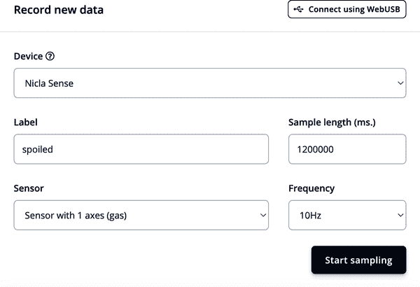

###### 图 12-1\. 数据采集：记录新数据

重复这个过程，直到你的每个机器学习类别的训练数据集和测试数据集之间至少有 20 至 60 分钟的数据（总计）。

# 使用浏览器自动化进行自动采样

你可以在你的网页浏览器的开发者控制台中轻松地通过 JavaScript 调用来创建一个自动化，以自动重新点击 Edge Impulse 项目中的“开始采样”按钮，每 22 分钟（或 1,320,000 毫秒）一次：

```
const delay = ms => new Promise(res => setTimeout(res, ms));
while(1) {
   document.getElementById("input-start-sampling").click();
   await delay(1320000);
};
```

## 清理你的数据集

查看提供在“清理数据集”的提示，然后返回到本章。

由于我们将气体传感器样本记录在 20 分钟的长度中，为了更清楚地查看每个样本的内容，我们将样本分割为多个 30,000 ms 的子样本（在这种情况下是 29,880 ms）。在“数据采集”选项卡中，选择样本的三点下拉菜单，然后点击“分割样本”（见图 12-2）。

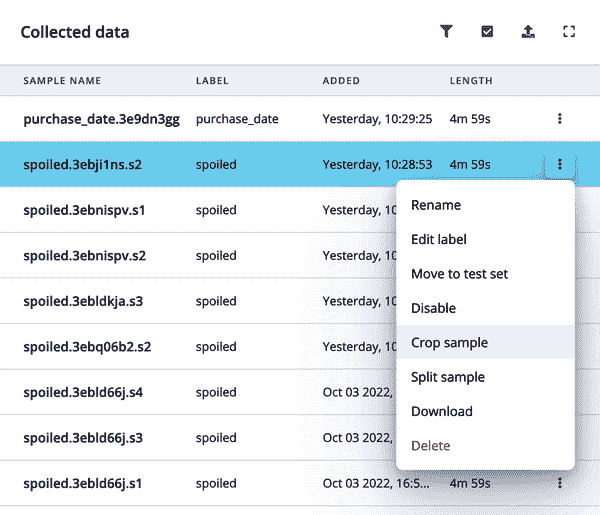

###### 图 12-2\. 数据采集：样本下拉菜单

从“分割样本”视图中，您可以放置大约 30,000 ms 长度的四个子样本；点击“+ 添加样本”以添加更多的分割段，然后点击“分割”（见图 12-3）。

您还可以通过在样本名称旁边的下拉菜单中选择“裁剪样本”选项来裁剪您的样本，如图 12-4 所示。

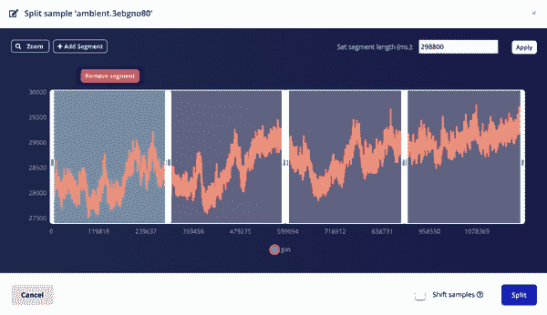

###### 图 12-3\. 数据采集：分割样本

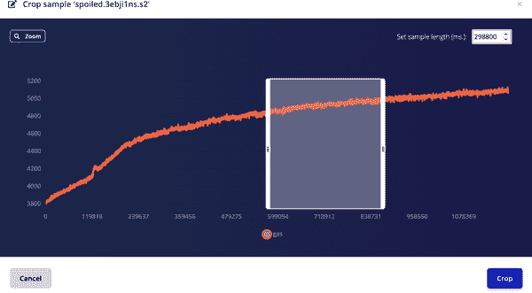

###### 图 12-4\. 数据采集：裁剪样本

## 数据集许可和法律义务

请查看“数据集许可和法律义务”以确定您数据集的许可和法律义务。由于我们直接上传和使用从我们家庭和个人 Nicla Sense 设备通过计算机串口收集的数据，因此我们不需要审查任何数据集许可或法律方面的问题。

然而，如果您同时使用来自公共来源的气体数据或其他传感器数据以及来自设备如 Arduino Nicla Sense ME 的自有气体数据，则在将数据上传到您的训练/测试数据集并使用从该数据训练的结果模型之前，务必审慎查明数据使用规则和归属要求。

# DSP 和机器学习工作流程

现在我们已经将所有图像上传到我们的训练和测试数据集中，我们需要使用数字信号处理（DSP）方法提取原始数据的最重要特征，然后训练我们的机器学习模型来识别传感器数据提取特征中的模式。Edge Impulse 将 DSP 和 ML 训练工作流程称为“脉冲设计”。

您的 Edge Impulse 项目的“脉冲设计”选项卡允许您查看和创建全面端到端机器学习管道的图形简单概述。最左侧是原始数据块，Edge Impulse Studio 将摄入和预处理您的数据，并设置您的窗口增加和大小。如果您上传了从以不同频率记录的设备中获取的样本数据，您还可以从此视图对时间序列数据进行下采样或上采样。

接下来是 DSP 模块，我们将通过开源数字信号处理脚本 Flatten 提取我们的气体数据的最重要特征。一旦生成了数据的特征，学习模块将根据我们的所需架构和配置设置训练我们的神经网络。最后，我们可以查看部署输出信息，包括我们希望训练的机器学习模型分类的所需类别，“购买日期”，“损坏”，和“环境”。

在您的 Edge Impulse 项目中，通过选择“脉冲设计”选项卡与图 12-5 中的相同方式进行设置，或通过从各块弹出窗口中选择设置，然后点击“保存脉冲”：

时间序列数据

+   窗口大小：10000 毫秒。

+   窗口增加：500 毫秒。

+   频率（Hz）：10

+   零填充数据：已检查 [x]

处理模块

+   展开

学习模块

+   分类（Keras）

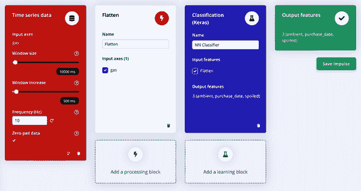

###### 图 12-5\. 脉冲设计配置

## 数字信号处理模块

在本章介绍的项目中，我们将使用 Edge Impulse Studio 中默认包含的数字信号处理算法；此展开处理模块预先编写，并可在平台上免费使用和部署。展开模块中使用的代码可以在[Edge Impulse GitHub 代码库“processing-blocks”](https://oreil.ly/_dSjf)中找到。您还可以在“数字信号处理算法”中了解更多关于各种数字信号处理算法的详细信息。

如果您熟悉编写自己的数字信号处理代码或希望使用自定义的 DSP 模块，请查阅提供的详细信息“数字信号处理模块”。

通过从导航栏中选择展开标签并选择与图 12-6 中显示的相同参数，或通过编辑各复选框和文本输入选择参数，设置您的展开模块，然后点击“保存参数”。

缩放

+   缩放轴：0.001

方法

+   平均值：已检查 [x]

+   最小值：已检查 [x]

+   最大值：已检查 [x]

+   均方根：已检查 [x]

+   标准偏差：已检查 [x]

+   偏度：未检查 [ ]

+   峰度：未检查 [ ]

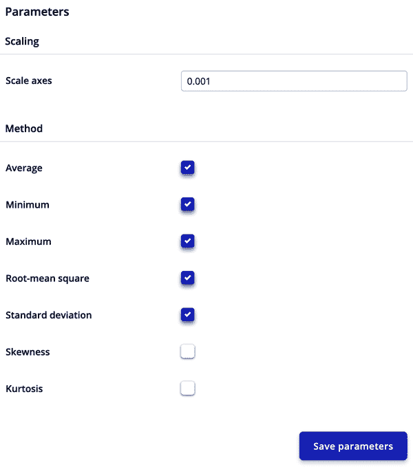

###### 图 12-6\. 展开模块参数配置

现在，点击“生成特征”以查看您数据的特征浏览器（见图 12-7）。

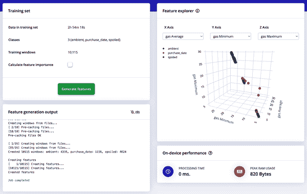

###### 图 12-7\. 展开模块特征浏览器

## 机器学习模块

我们现在准备训练我们的边缘机器学习模型！在 Edge Impulse 中训练模型有多种方式，其中最简单的是可视（或 Web GUI）编辑模式。但是，如果您是机器学习工程师、专家或已经具备使用 TensorFlow/Keras 编码的经验，则还可以在 Edge Impulse Studio 中本地或专家模式中编辑您的迁移学习块。

我们可以在“NN 分类器”选项卡中设置项目的神经网络架构和其他训练配置设置。

### 可视模式

配置和设置我们的机器学习训练设置和神经网络架构的最简单方法是通过 Edge Impulse 的可视模式，或者在导航栏中选择“脉冲设计”下的“NN 分类器”选项卡时的默认视图（见图 12-8）。将这些设置复制到您的神经网络分类器块配置中，然后点击“开始训练”：

+   训练周期数：50

+   学习率：0.0005

+   验证集大小：20%

+   自动平衡数据集：未选中 [ ]

+   神经网络架构：

    +   稠密层（8 个神经元）

    +   稠密层（4 个神经元）

    +   Flatten 层

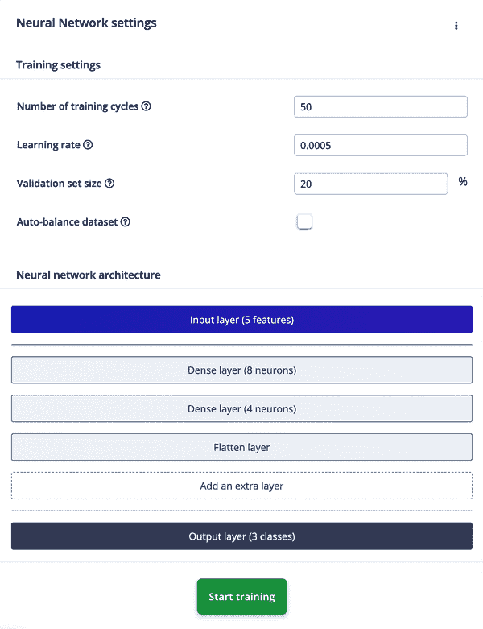

###### 图 12-8\. 神经网络设置

稠密层是全连接层，是神经网络层的最简单形式。我们将其用于从 Flatten DSP 块的输出处理数据。Flatten 层将多维数据转换为单一维度。在返回之前，您需要将卷积层的数据展平。您可以在[Edge Impulse 文档](https://oreil.ly/J57H-)中了解更多关于神经网络架构配置的信息。一旦模型训练完成，您可以在“模型：最后训练表现”视图中查看迁移学习结果（见图 12-9）。

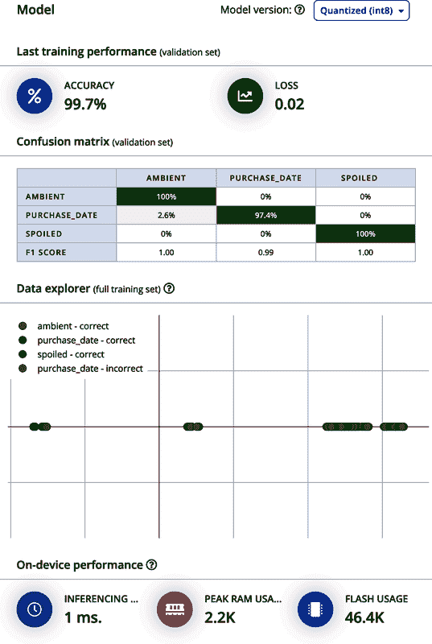

###### 图 12-9\. 模型：最后训练表现

你已经知道如何在 Python 中编写 TensorFlow/Keras 代码了吗？在 Edge Impulse 中使用“专家模式”选项，通过选择“神经网络设置”块标题右侧的三点下拉按钮来上传您自己的代码或本地编辑现有的块代码（见图 12-10）。

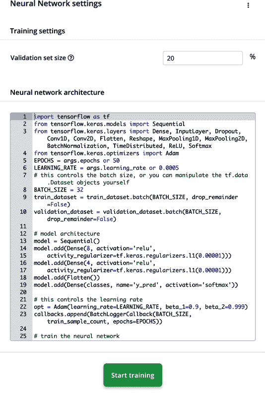

###### 图 12-10\. 专家模式编辑器

# 测试模型

Edge Impulse 中所有模型测试特性的详细描述和说明可以在“测试模型”中找到。

## 实时分类

从“实时分类”选项卡中，您可以直接测试从连接的 Arduino Nicla Sense ME 获取的单个测试样本（见图 12-11 和 12-12）。连接说明在示例 12-3 中描述。

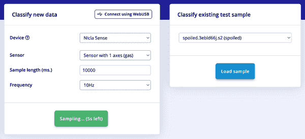

###### 图 12-11\. 使用 Arduino Nicla Sense ME 的实时分类

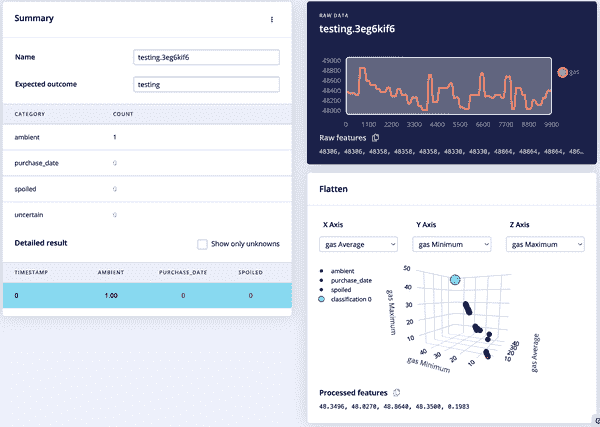

###### 图 12-12\. 带有未标记测试结果的实时分类

或者在“分类现有测试样本”中加载现有的测试数据集图像，以查看该样本的提取特征和您训练模型的预测结果，如图 12-13 所示。

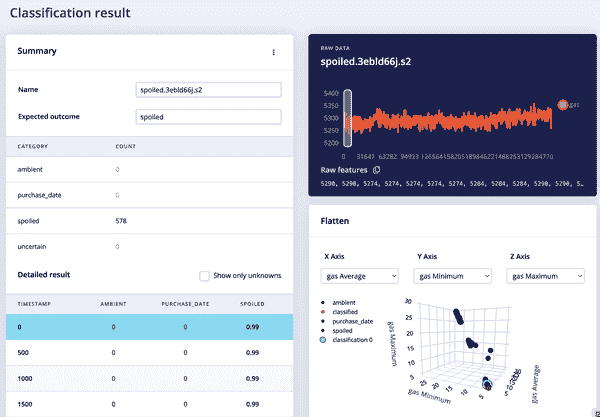

###### 图 12-13\. 使用现有标记测试结果的实时分类

## 模型测试

您还可以通过导航到项目的[“模型测试”选项卡](https://oreil.ly/1Xc63)来批量对您的测试数据集进行分类，并使用您训练模型的结果。了解更多关于该选项卡的信息，请参阅“模型测试”。

选择“全部分类”以获取您训练模型在测试数据集样本上推断结果的矩阵（参见图 12-14）。

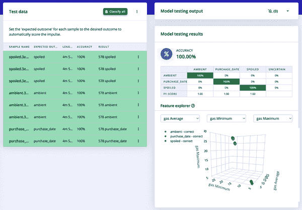

###### 图 12-14\. 模型测试结果

# 部署

恭喜！你刚刚完成了收集和标记训练与测试数据集，通过 DSP 模块提取数据特征，设计和训练机器学习模型，并使用测试数据集测试模型。现在我们已经拥有了在边缘设备上推断所需的所有代码和模型信息，我们需要将预构建的二进制文件刷入设备，或者将 C++ 库集成到我们的嵌入式应用代码中。

选择您 Edge Impulse 项目的部署选项卡，并按照下一节中的一个部署选项的步骤来运行您训练的机器学习模型在您的边缘设备上。还有许多其他部署选项可供选择，其中一些已在“部署”中描述过。

## 预构建二进制文件刷写

在部署选项卡中，选择您正式支持的 Edge Impulse 开发平台下的“构建固件”，然后选择“构建”。您还可以选择打开/关闭 EON 编译器。¹⁰

然后，根据部署选项卡中点击“构建”后显示的说明，将生成的固件应用程序拖放或刷写到您正式支持的平台上。有关在您选择的开发平台上刷写预构建二进制文件的详细说明，请参阅[Edge Impulse 文档](https://oreil.ly/O-ZFY)。

对于这个项目，我们将选择“Arduino 库”部署选项，以在[Arduino Nicla Sense ME](https://oreil.ly/9QfS6)上运行我们的训练模型（如图 12-15 所示）。

根据[Edge Impulse 网站上的 Arduino 部署文档](https://oreil.ly/CmTyr)中的说明，下载并安装软件前提条件。

首先，将下载的 Arduino 库 ZIP 文件导入到 Arduino IDE 中（参见 图 12-16）。

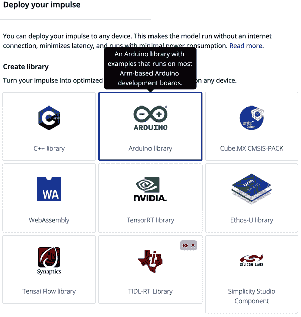

###### 图 12-15\. Arduino 库部署选项

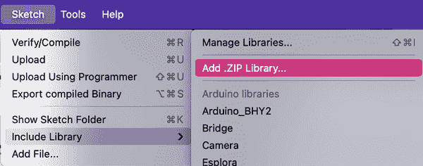

###### 图 12-16\. Arduino IDE：导入 ZIP 库文件

然后，在 Arduino IDE 中打开已部署 Edge Impulse Arduino 库的 Nicla Sense 示例（参见 图 12-17）。

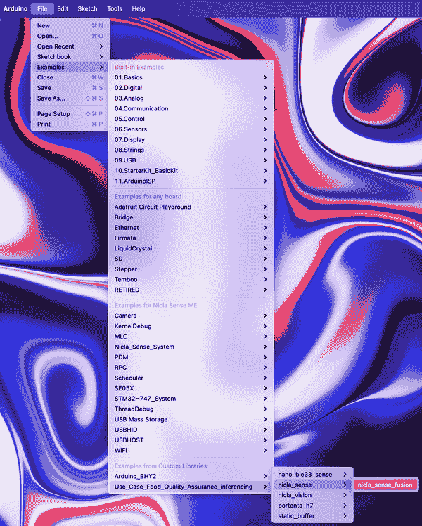

###### 图 12-17\. Arduino IDE：选择 Nicla Sense

现在将 *nicla_sense_fusion.ino* 草图文件保存到计算机的某个位置（参见 图 12-18）。

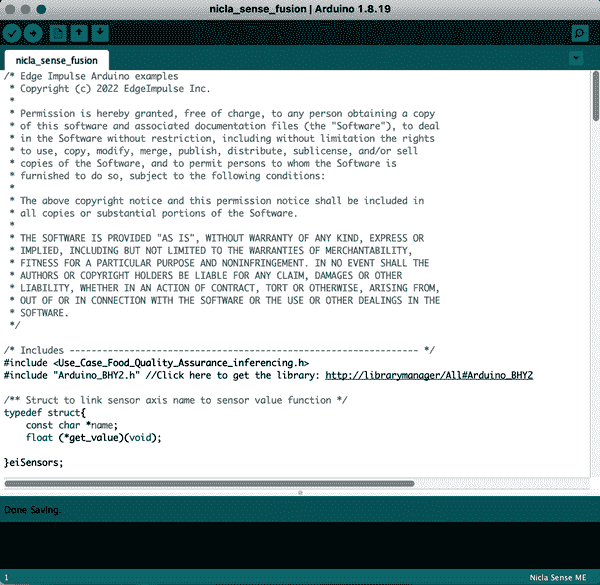

###### 图 12-18\. Arduino IDE：保存 *nicla_sense_fusion.ino* 草图

要么直接从 Arduino IDE 编译并闪存到 Nicla Sense，要么在命令行终端中导航到计算机上存储草图的目录，并运行 Arduino CLI 命令，如 示例 12-4 所示。

##### 示例 12-4\. Arduino CLI 命令，用于闪存推理草图

```
$ cd nicla_sense_fusion
$ arduino-cli compile --fqbn arduino:mbed_nicla:nicla_sense --output-dir . --verbose
$ arduino-cli upload --fqbn arduino:mbed_nicla:nicla_sense --input-dir . --verbose
```

在串行终端上以波特率 115,200 查看直接在 Arduino Nicla Sense ME 上运行的食品质量保证模型推理结果（参见 图 12-19）。

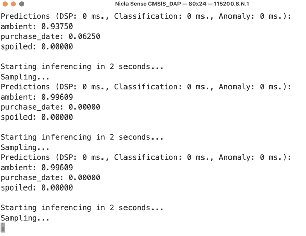

###### 图 12-19\. Arduino Nicla Sense ME 训练模型推理结果

## GitHub 源代码

本章中使用的完整应用程序源代码，包括公共 [Edge Impulse 项目](https://oreil.ly/wPTwd) 中部署的库和完成的应用程序代码，可供查看和下载在 [GitHub](https://oreil.ly/91usE)。

# 迭代和反馈循环

现在您已经部署了食品质量保证模型的第一次迭代，可能对结果感到满意，并决定在此结束开发。但是，如果您希望进一步迭代模型并随时间或新获取的设备升级进一步提高准确性，例如，这个项目有许多适应和改进的变体可供考虑：

+   为模型添加更多机器学习类别，用于不同类型的食品。

+   创建一个设备外壳，确保食品污染物不会影响气体传感器的读数。

+   添加机器学习类别，专门识别食品过期日期后的天数。

+   使用传感器融合将其他传感器轴如温度或湿度添加到输入训练/测试数据样本中（参见 “传感器融合”）。

+   并行或在附近设备上运行多个食品质量保证模型，以实现不相关但类似的目标，例如食品变质和过敏原检测。

# 相关工作

正如本章所述，边缘 AI 是一种新兴技术，广泛应用于从生产线到消费者过敏原检测器的各种食品质量保证设备中。接下来的章节描述了边缘 AI 在食品质量保证中的各种设备、数据集、研究文章和书籍。

本书还记录了各种应用、方法、设备来源和各章节中关于食品质量保证机器学习模型和方法的商业采纳的引用脚注。

## 研究

+   Banús, Núria 等人的 [“深度学习用于热成型食品包装质量控制”](https://oreil.ly/8Oaec)。《科学报告》，2021。

+   Gerina, Federica 等人的 [“通过空气质量传感器数据识别烹饪活动以支持食物日记”](https://oreil.ly/2Dj7L)。SpringerOpen，2020。

+   Hassoun, Abdo 等人的 [“食品质量 4.0：从传统方法到数字化自动化分析”](https://doi.org/10.1016/j.jfoodeng.2022.111216)。《食品工程杂志》，2023。

+   Hemamalini, V. 等人的 [“利用高效图像分割和基于机器学习的系统进行食品质量检验和分级”](https://oreil.ly/1z5z0)。《食品质量杂志》，2022。

+   Ishangulyyev, Rovshen 等人的 [“理解食物损失和浪费——为什么我们会损失和浪费食物？”](https://oreil.ly/Vmwyg)，国家医学图书馆，2019。

+   Iymen, Gokce 等人的 [“基于人工智能的黄油变异识别作为检测食品掺假的模型研究”](https://doi.org/10.1016/j.ifset.2020.102527)。《食品工程杂志》，2020。

+   Jathar, Jayant 等人的 [“利用人工智能进行食品质量保证：一篇综述文章”](https://oreil.ly/9WUim)，ResearchGate，2021。

+   Kaya, Aydin 和 Ali Seydi Keçeli 的 [“传感器故障可容忍的基于机器学习的食品质量预测模型”](https://oreil.ly/eGnDv)，ResearchGate，2020。

+   Kumar, G. Arun 的 [“基于 Arduino 传感器的食品变质检测方法”](https://oreil.ly/ECgqq)。《国际工程与应用科学技术杂志》，2020。

+   Nturambirwe, Jean 等人的 [“利用短波红外高光谱成像学学习苹果潜在瘀伤损伤分类”](https://oreil.ly/2zmhw)，MDPI，2021。

+   Rady, Ahmed 等人的 [“当使用近红外光谱法鉴别不同含过敏原粉末食品时，光强度、传感器高度和光谱预处理方法的影响”](https://oreil.ly/vGyiR)，国家医学图书馆，2019。

+   Sonwani, Ekta 等人的 [“食品变质检测和分析的人工智能方法”](https://oreil.ly/SImft)，国家医学图书馆，2021。

+   Watson, Nicholas J. 等人的 [“智能传感器支持可持续食品和饮料制造”](https://oreil.ly/IaoqI)。Frontiers in Sustainable Systems，2021。

## 新闻和其他文章

+   [机器学习用于自动化食品质量检查](https://oreil.ly/kIdsz)

+   [NIRONE 传感器在食物过敏物检测上展示出有希望的结果](https://oreil.ly/O-GVd)

+   [利用人工智能提高食品质量](https://oreil.ly/OOj3H)

+   [什么是工业 4.0？：工业 4.0 技术如何改变制造业](https://oreil.ly/0YzAK)

+   [对抗食物过敏的最佳技术](https://oreil.ly/mKQyc)

+   [考虑购买智能烤箱？不如选择多功能烤箱](https://oreil.ly/TuZ3P)

¹ 查看 IBM 文章，“什么是工业 4.0？：工业 4.0 技术如何改变制造业”(https://oreil.ly/ZMhe7)。

² 参见维基百科条目[“第四次工业革命”](https://oreil.ly/39viN)。

³ Pini Mandel, [“将人工智能应用于杂货过道”](https://oreil.ly/WrkjE), *食品物流*, 2021。

⁴ [粮食损失和浪费数据库](https://oreil.ly/xe0z6)。

⁵ Ilker Koksal, [“利用人工智能提高食品质量”](https://oreil.ly/kvHri), *福布斯*, 2021。

⁶ Nicholas J. Watson 等，[“可持续食品和饮料制造的智能传感器”](https://oreil.ly/weN5Q), *可持续食品系统前沿*。

⁷ 查看[联合国粮食及农业组织网站](https://oreil.ly/ie2sk)。

⁸ 查看美国农业部文章，“粮食浪费及其与温室气体和气候变化的关联”(https://oreil.ly/AMnGh)。

⁹ 查看[博世关于 BME688 传感器的文章](https://oreil.ly/z1BzE)。

¹⁰ 查看 Jan Jongboom 的博客文章，“介绍 EON：神经网络内存减少达 55%，ROM 减少达 35%”(https://oreil.ly/B6Df7), Edge Impulse, 2020。
