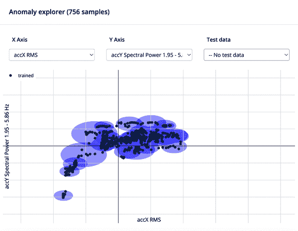

# 第十三章：用例：消费产品

边缘机器学习用于消费电子产品和产品，使设备能够基于数据做出决策，而无需将该数据发送到云端。这可以节省时间和带宽，并且在数据敏感且需要保密时使用。边缘机器学习还可以用于消费者任务，如面部识别、物体检测、语音识别和传感器分类。通过在设备上摄取的消费者数据中分析和识别模式，然后再将其发送到云端进行进一步处理之前，产品可以快速适应用户的需求：展示所需的产品使用情况，向用户提供定制的产品警报等等。

通过使用边缘人工智能，消费产品可以与并利用车载传感器的数据进行几乎无限量的用例集成。例如，自行车可以分析骑行者周围的环境，获取交通信息和影响骑行质量的环境数据，而智能冰箱可以自动检测产品几乎用完并将其添加到购买清单中。在本章中，我们将集思广益，探讨使用边缘人工智能处理消费产品的各种方法、相关的传感器和设备配置，并深入教程展示我们选择的方法和用例解决方案。

# 探索问题

许多消费者技术产品已经不断连接到互联网，如智能家居设备、安全摄像头、可穿戴设备、自动驾驶车辆和无人机。这些设备需要处理大量数据，或者将这些大量数据发送到云平台进行远程处理。边缘机器学习使得这些消费产品能够快速响应环境变化，例如设备已经摄入的大量传感器数据，而无需将其发送到云端进行进一步处理，通常这需要大量时间、电池使用、带宽消耗等。

根据本书学习的技术，为了开发面向终端消费电子产品的边缘机器学习模型是一个极其广泛的任务。为了缩小我们的焦点，我们将讨论多个总体目标，然后深入探讨其中一个实施的例子。一个关于消费者的总体目标的例子是某种方式安抚宠物的产品。从目标角度来看，我们既可以生成一个机器学习模型，分析宠物的水碗并在水快用完时提醒主人，也可以将设备集成到宠物项圈中，检测特定类型的烦扰噪音或声音，然后提供舒缓反馈。这两种方法都实现了同样的目标，通过终端产品设备来安抚宠物，但每种方法可能需要不同的机器学习类和传感器输入组合来解决。

# 目标设定

利用边缘人工智能技术创建有用和高效的消费产品是有益的，因为世界正在发展。消费者将开始期望他们的技术变得越来越智能，但不侵犯他们的数据隐私权。消费产品几乎可以无限地将其板载传感器数据与边缘机器学习模型集成起来。通过将这些板载传感器获得的智能带到边缘人工智能中，消费产品可以实现更好的整体性能、增加的电池续航时间（根据使用案例），以及总体增加的最终用户满意度和用户友好性/可访问性。

# 解决方案设计

在本章中，我们选择为自行车监测设备设计和实施一个低成本、高效和易于训练的边缘人工智能模型，其具备一个板载加速计传感器。然而，用于检测危险和监测骑行者安全的边缘人工智能模型并不仅限于使用加速计。通过本章及本书中介绍的原则和设计工作流程，还可以为自行车监测设备实施许多其他类型的机器学习模型和应用，包括使用摄像头图像输入来监视周围环境信息和潜在的碰撞/交通事故，通过传入音频信号数据识别碰撞等。

## 已有哪些解决方案？

市场上已经存在许多智能、边缘人工智能消费产品，或者最近从原型阶段推出。像[June Oven](https://oreil.ly/W_aZa)和[Haier Series 6](https://oreil.ly/yS58F)这样的智能厨房电器配备了能帮助您从餐饮计划到清洁等方面的人工智能技术。全球的手机用户通过 Apple Watch、Samsung Smartwatch 或 Fitbit 等 AI 可穿戴设备被锁定在他们选择的硬件生态系统中。

健康设备越来越多地为最终用户开发；[Oura Ring](https://ouraring.com)配备有传感器，可跟踪您的睡眠、活动和整体健康状况，帮助您更好地了解日常习惯。许多消费技术产品的未来将包括集成板载传感器和实时边缘人工智能推理，这提高了这些产品的性能、有用性和对最终消费者的吸引力，同时减少其能耗。

## 解决方案设计方法

我们可以通过许多不同的方法来解决我们的问题陈述，并设计一个解决方案，以下是其中一些描述：

宠物安抚器和监视器

作为宠物主人，了解宠物的生命体征和整体健康状况非常重要。通过使用边缘 AI 设备监测宠物的生命体征，您可以及时发现宠物健康或行为的任何变化，并采取适当的措施。有多种传感器输入可供选择，帮助您监测宠物的生命体征，包括摄像头传感器和智能水碗。您还可以使用 AI 动力项圈跟踪宠物的位置和活动水平。这些智能宠物产品可以帮助缓解我们对宠物健康和幸福的焦虑，并给我们带来安心感。

自行车监控器

许多形式的交通工具正在整合边缘 AI 技术，包括自行车，制造商提供各种功能，使通勤更安全和更愉快。通过配备传感器的自行车或附加消费者产品，数据收集的潜力巨大。配备各种传感器配置，自行车可以实时收集地形、天气和交通状况的数据，从而更全面地了解地面和骑行者周围环境的情况。

此外，自行车可以配备传感器，检测是否以不安全或非法的方式骑行，如穿行交通或逆向行驶。还可以集成其他传感器组合，以实现自动防盗检测，从而使骑行体验在城市中心内外更安全。最后，配备后视摄像头或雷达传感器的自行车还可以检测骑行者身后的交通情况，通过提醒用户让路、加速或减速，潜在地避免事故，依赖于来车的动作/信息或视觉障碍¹。

儿童玩具

有三类结合边缘 AI 技术的互动儿童玩具：教育、情感响应、或监测儿童及其环境的健康与安全。教育玩具旨在帮助儿童学习新技能或知识。它们通常采用教育游戏或拼图的形式，可以帮助儿童练习如数数、形状和颜色等技能。情感响应玩具旨在与儿童互动并对其情绪做出响应。这些玩具可以监听音频线索，如尖叫或哭泣声，并且可能识别面部表情或其他与儿童情绪状态相关的视觉线索。安全和健康监测玩具旨在帮助保护儿童的安全和健康。例如，这些玩具可以检测手指即将触摸到热炉灶，或者监测儿童的心率和呼吸。有些玩具甚至配备了 GPS 追踪功能，以防儿童走失，进一步提高了家长的安全感。

然而，边缘人工智能技术的进步要求在与儿童互动的任何玩具、设备或服务中推广非常合理和道德的 AI 使用准则。不幸的是，随着 AI 技术变得越来越复杂，监管变得越来越困难，AI 被用来利用儿童、他们的情感和个人数据的可能性也增加了²。AI 技术的监管是一个复杂的问题，在本章中我们不会详细讨论；然而，许多政府机构和公司正在研究和政策制定这一确切领域，因为这并非易事³。鉴于 AI 技术对儿童使用不当可能造成的潜在危害，有必要采取某种形式的监管⁴。

家电

边缘人工智能启用的家电，如冰箱，可以检测食物是否即将用尽，并自动订购更多，这样你再也不用担心牛奶会用完了。它们还可以跟踪你的饮食习惯，使你了解营养摄入，甚至为你完美地烹饪食物。

但不仅仅是冰箱变得更智能。有各种智能烹饪设备，利用计算机视觉和其他传感器输入来进行视觉大小估算⁵和自动温度控制，完美地烹饪食物。咖啡机利用边缘机器学习根据用户的偏好个性化咖啡。甚至洗衣机也利用机器学习识别不同类型的衣物，并根据推理结果调整洗涤和干燥周期。

先前描述的任何一个用例解决方案都是促进本章设计道德和有价值的消费者产品的消费产品，并确保道德和负责任地使用有关最终用户的数据。

## 设计考虑

为了实现设计有用、道德和可访问的消费者边缘人工智能产品的总体目标，从技术的角度来看，我们可以使用多种数据源，包括许多不同类型的传感器和摄像头，以实现类似的目标（见表 13-1）。

表 13-1\. 每种用例可以使用哪些传感器？

| 目标 | 传感器 |
| --- | --- |
| 自行车手崩溃/盗窃检测器 | 加速度计、音频、雷达、摄像头 |
| 宠物安抚器 | 摄像头、音频、雷达 |
| AI 动力烤箱 | 红外摄像头、温度、气体 |
| 健康监测可穿戴设备 | PPG、心率、心电图、温度、水/汗水水平 |
| 家庭安全和自动化 | 摄像头、音频 |
| 机器人儿童玩具 | 摄像头、音频、加速度计、陀螺仪、雷达 |
| 自动洗衣机 | 摄像头、化学物质、气体、颜色、光强度 |

“获取数据的方法”讨论了进一步的传感器数据收集和数据集收集方法。

此外，在设计过程和头脑风暴会议期间，请考虑以下要点：

+   产品的最终用户是谁？

+   产品的主要利益相关者是谁？

+   这款产品如何可能被恶意或不道德地使用？

+   数据存储在哪里？推理结果是否被发送回云平台？

+   消费者/最终用户如何被告知传感器数据的处理方式，无论是在设备上还是在云端或网络连接中？

## 环境和社会影响

尽管边缘 AI 在消费技术中的进步可以使我们的生活更加便捷，但它也带来了自己的问题，包括大部分人群无法使用或使用有限，使一部分最终用户无法充分享受边缘 AI 技术的进步。制造商试图缓解这些问题的一种方式是制造更加用户友好和可访问的设备。一个例子是，一些公司现在制造的设备可以减少家务劳动的负担。这些设备可以帮助老年人或残疾人完成可能难以完成的任务，如清洁或烹饪。这不仅有助于使他们的生活更加便捷，还可以帮助预防事故或受伤。公司还努力通过提前提醒客户潜在的问题或设备可能需要的维修来减少技术或一般废物。这不仅有助于保持设备的良好工作状态，还可以帮助防止儿童与设备互动时可能发生的伤害。

## 自助启动

本用例章节将深入探讨一个端到端的解决方案，用于创建消费者产品边缘 AI 模型，特别是与一款将通过交通和碰撞警报监视和保护骑自行车者的设备相关的模型。为了创建我们的初始自行车监控模型，我们将从边缘设备的加速度传感器中收集“空闲”、“突然停止”和“正常”机器学习类的样本。

这三类将使我们的分类机器学习模型能够实时识别自行车手正在经历的运动事件类型。边缘设备从加速度计获取连续的原始样本，并且训练好的机器学习模型推断和确定设备检测到的运动是否空闲、执行转弯、经历突然停止（可能是事故的指示），或者在不平坦的地形上行驶。对于结果预测结果、异常分数和加速度计信号数据，如果设备确定异常分数高，或者发生突然停止，这些信息将立即通过音频输出通知或 LED 警告通知设备最终用户，并且数据也将通过网络连接发送或本地存储，以供人类或云端进一步处理。

## 定义您的机器学习类别

表 13-2 展示了用例、传感器和数据输入类型的潜在组合，以及我们在本章中使用的机器学习类别，用于收集和标记训练和测试数据集。用例及其相关的类别标签对于我们在本章中使用的机器学习算法（特别是“分类”和“异常检测”）非常重要。您可以在 “分类” 和 “异常检测” 中了解更多关于这些算法的信息。

表 13-2\. 自行车安全用例的机器学习类别

| 用例 | 训练数据 | 类别标签 |
| --- | --- | --- |
| 检测自行车事故 | 加速度计 | 正常、异常（或已存在的指定“事故”标签） |
| 监视来车 | 摄像头（带有边界框） | 汽车、自行车、摩托车、其他交通对象 |
| 监视自行车手的盲点 | 雷达 | 正常、靠近自行车手的物体 |
| 监听汽车警报、碰撞和其他交通声音 | 音频 | 背景噪音、汽车警报、车祸、汽车鸣笛、人声/喊叫 |

在本章中，我们将选择并建立消费者自行车监控设备用例，用于机器学习传感器数据分类，我们项目的初始机器学习类别将是“空闲”、“突然停止”和“正常”，涉及“检测自行车事故”的最终用例目标。然而，因为您可能不想特别遇到自行车事故来记录和上传这些数据样本，我们将使用机器学习技术分类和异常检测来实现这个用例目标。

# 数据集收集

要了解如何收集干净、健壮和有用的数据集的技术性和具体信息，请参阅 “获取数据”。您还可以利用各种策略，从多个来源收集数据，为您的用例创建独特的数据集：

+   结合公共研究数据集

+   使用来自 Kaggle 等社区驱动的数据收集网站的现有传感器数据集

+   寻求同事帮助，为您的合作 Edge Impulse 项目收集样本

## Edge Impulse

如“Edge Impulse”所述，您需要创建一个[免费的 Edge Impulse 账户](https://edgeimpulse.com)以按照本章描述的说明操作。

要进一步证明使用 Edge Impulse 进行边缘机器学习模型开发的理由，请查阅“面向边缘 AI 的端到端平台”。

### Edge Impulse 公共项目

本书的每个用例章节都包含一个书面教程，演示并完成描述用例的完整端到端机器学习模型。但是，如果您只想直奔主题，查看作者为该章节开发的确切数据和模型的最终状态，可以通过导航到本章节的公共[Edge Impulse 项目](https://oreil.ly/iuJp9)来实现。

您还可以通过选择 Edge Impulse 页面右上角的克隆按钮直接克隆此项目，包括所有原始训练和测试数据、中间模型信息、最终训练模型结果以及所有部署选项（见图 13-1）。

###### 图 13-1\. 克隆 Edge Impulse 公共项目

## 选择您的硬件和传感器

在本书中，我们尽可能保持设备无关性，但我们也需要讨论如何使用现成易用的开发套件来创建此用例的解决方案。因此，本书旨在尽可能使硬件选择变得简单、经济和易获得。

由于 Edge Impulse 已经提供了大量官方支持的开发平台，配备各种集成传感器驱动程序和开源固件，为了这个项目的简便性和我们的自行车消费产品用例中加速计数据的收集，我们将使用我们的[配备 Edge Impulse 移动客户端的手机](https://oreil.ly/RKAWb)和[Nordic Semi Thingy:53](https://oreil.ly/WfU0M)，以及[nRF Edge Impulse 移动电话应用程序](https://oreil.ly/OnTtw)进行数据摄入和模型部署的组合。

但是，如果您没有本章描述的确切硬件，您可以参考[Edge Impulse 文档](https://oreil.ly/zQryl)，寻找其他适用于各种官方支持传感器的适当板卡，以便轻松进行数据摄入和部署。或者您可以自行携带开发平台和传感器组合，一旦为初始传感器数据摄入创建了运行设备固件（最简单的方法是使用[Edge Impulse 数据转发器](https://oreil.ly/MXDZM)），继续按照本章说明操作。

### 硬件配置

Nordic Semi Thingy:53 设备上的加速度计惯性测量单元（IMU）和/或您的手机内部的 IMU 将用于检测自行车上的运动事件，固定在自行车前把手上。

以下是一些其他传感器类型的列表，以提高您的消费者自行车监控模型的准确性，以适应您特定的环境、用例、项目预算等因素：

+   陀螺仪

+   红外线、夜视或热成像摄像头

+   雷达

+   音频

## 数据采集

使用 Edge Impulse，有许多选项可用于将数据上传和标记到您的项目中；许多最常见的数据摄取工具已在“数据采集”中介绍过。接下来的章节将讨论我们将在这一章节中用于消费者产品自行车监控用例的具体数据收集工具。

## 数据摄取固件

要从我们的 Thingy:53 设备摄取数据，我们需要按照文档中的说明[刷新 Edge Impulse 固件](https://oreil.ly/bHbVN)到我们的设备上。然后，使用[Edge Impulse CLI](https://oreil.ly/DSrv7)或者 nRF Edge Impulse 手机应用程序（参见“nRF Edge Impulse 手机应用程序”），我们将连接我们的设备到我们的项目，并开始从 Thingy:53 设备或手机上记录新的加速度计数据样本。

### 手机

上传新的加速度计数据的最简单方法之一是直接将您的手机连接到 Edge Impulse 项目，并从手机的集成 IMU 记录加速度计数据。您可以在[Edge Impulse 文档](https://oreil.ly/UoiqJ)中找到连接您的手机的说明（参见图 13-2）。

###### 图 13-2\. 将手机连接到 Edge Impulse 项目

### nRF Edge Impulse 手机应用程序

首先，为您的[iPhone](https://oreil.ly/2w5nO)或[Android 手机](https://oreil.ly/Q_bVH)下载并安装 Nordic nRF Edge Impulse 应用程序。然后，[按照 Edge Impulse 文档中的说明](https://oreil.ly/orK3a)使用您的 Edge Impulse 账户登录 nRF Edge Impulse 应用程序，并将您的 Thingy:53 连接到您的项目中。

要录制并上传新的数据样本到您的项目中，请点击应用程序右上角的“+”按钮。选择您的传感器，输入样本标签，选择样本长度和频率，然后选择开始采样（见图 13-3）。

###### 图 13-3\. nRF Edge Impulse 手机应用程序数据采集

继续在您的自行车上收集所有三种机器学习类别，“空闲”、“突然停止”和“正常”。在收集数据时，请注意周围环境的安全！

## 清理您的数据集

请查看“清洁数据集”中提供的提示，然后返回到本章。

因为我们记录的气体传感器样本长度为 30 秒（30,000 毫秒），我们将把样本分割成多个 10 秒（10,000 毫秒）长的子样本。从“数据采集”选项卡中，选择一个样本的三点下拉菜单，然后点击“分割样本”。你可以在分割样本视图中放入大约 10,000 毫秒长的三个子样本；点击“+添加段”按钮以添加更多的分割段，然后点击“分割”（见图 13-4）。

###### 图 13-4. 数据采集：分割样本

你还可以通过在样本名称旁边的下拉菜单中选择“裁剪样本”选项，如“清洁数据集”中所述。

## 数据集许可和法律义务

请查阅“数据集许可和法律义务”，以确定你的数据集的许可和法律义务。由于我们直接上传和使用了我们从家中和个人手机或 Nordic Thingy:53 设备（通过计算机的串行端口或[Nordic nRF Edge Impulse 手机应用](https://oreil.ly/VxQKE)）收集的数据，因此我们不需要审查任何数据集许可或法律问题。

然而，如果你除了来自你的手机或 Nordic Thingy:53 等设备的自有数据外，还使用了来自公开数据集的加速度计数据或其他类型的传感器数据，请在将数据上传到训练/测试数据集并使用从这些数据中得出的训练模型之前，进行尽职调查，确定数据使用规则和归属要求。

# DSP 和机器学习工作流程

现在，我们已经将所有的加速度计运动样本上传到我们的训练和测试数据集中，我们需要使用数字信号处理（DSP）方法提取我们原始数据的最重要特征，然后训练我们的机器学习模型来识别传感器数据提取特征中的模式。Edge Impulse 将 DSP 和 ML 训练工作流程称为“脉冲设计”。

你的 Edge Impulse 项目的“脉冲设计”选项卡允许你查看和创建全端到端机器学习流水线的图形简要概述。最左侧是原始数据块，Edge Impulse Studio 将摄入和预处理你的数据，并设置窗口增长和大小。如果你上传了在设备上以不同频率记录加速度计数据的样本数据，你也可以从这个视图中对时间序列数据进行下采样或上采样。

接下来是 DSP 块，我们将通过开源数字信号处理脚本“谱分析”提取我们加速度计数据的最重要特征。一旦生成数据特征，学习块将根据我们所需的架构和配置设置训练我们的神经网络。最后，我们可以看到部署输出信息，包括我们希望我们训练好的机器学习模型分类的期望类别：空闲、突然停止和正常。

在您的 Edge Impulse 项目中，设置您的“脉冲设计”选项卡与 图 13-5 中相同，或通过选择各种块弹出窗口中列出的方式设置，然后点击“保存脉冲”：

时间序列数据

+   窗口大小：5000 毫秒。

+   窗口增加：250 毫秒。

+   频率（Hz）：62.5

+   零填充数据：已选中 [x]

处理块

+   谱分析

学习块

+   分类（Keras）

+   异常检测（K-Means）

###### 图 13-5\. 脉冲设计配置

## 数字信号处理块

对于本章介绍的项目，我们将使用默认包含在 Edge Impulse Studio 中的数字信号处理算法；该谱分析处理块预先编写并可在平台上免费使用和免费部署。谱分析块中使用的代码可以在 [Edge Impulse GitHub 仓库“processing-blocks”](https://oreil.ly/oAvIn) 中找到。您还可以在 “谱分析” 中了解有关谱分析算法的具体信息。

如果您熟悉编写自己的数字信号处理代码或希望使用自定义的 DSP 块，请查看 “数字信号处理块” 中提供的详细信息。

通过从导航栏中选择“谱特征”选项卡并选择与 图 13-6 中相同的参数设置，或者按照以下列出的方式通过编辑各种复选框和文本输入设置您的谱分析块：

过滤器

+   缩放轴：1

+   类型：无

谱功率

+   FFT 长度：16

+   对频谱取对数？：已选中 [x]

+   FFT 帧重叠？：已选中 [x]

###### 图 13-6\. 谱特征块参数

现在点击“保存参数”。为了使用 Edge Impulse 中可用的[高级异常检测功能](https://oreil.ly/bQUyh)，请在“生成特征”视图上选中“计算特征重要性”复选框（参见 图 13-7）。

###### 图 13-7\. 生成带特征重要性的特征

现在，点击“生成特征”以查看您数据的特征探索器和特征重要性列表（参见 图 13-8）。

###### 图 13-8\. 谱特征块：特征探索器

## 机器学习块

我们现在准备训练我们的边缘机器学习模型！在 Edge Impulse 中有多种训练模型的方式，最简单的是可视化（或 web GUI）编辑模式。然而，如果您是机器学习工程师、专家，或者已经具有使用 TensorFlow/Keras 进行编码的经验，那么您还可以在 Edge Impulse Studio 中本地或专家模式中编辑您的迁移学习块。

我们可以从 NN 分类器选项卡设置项目的神经网络架构和其他训练配置设置。

### 可视化模式

配置和设置我们的机器学习训练设置和神经网络架构的最简单方法是通过 Edge Impulse 可视化模式或导航栏中“NN 分类器”选项卡下“脉冲设计”默认视图（见图 13-9）。将这些设置复制到您的神经网络分类器块配置中，然后单击“开始训练”：

+   训练周期数量：30

+   学习率：0.0005

+   验证集大小：20%

+   自动平衡数据集：未选中 [ ]

+   神经网络架构：

    +   稠密层 (20 个神经元)

    +   稠密层 (10 个神经元)

您可以在[Edge Impulse 文档](https://oreil.ly/oMVFd)中了解更多有关神经架构配置的信息。一旦您的模型训练完成，您可以在“模型：最后训练性能”视图中查看迁移学习结果（见图 13-10）。

有关在本地或专家模式中编辑神经网络块的更多信息，请参阅第十一章和第十二章（特别是“机器学习块”一节）。

###### 图 13-9\. 神经网络设置

###### 图 13-10\. 模型：最后训练性能

### 异常检测

神经网络在模式识别方面表现出色，但在面对新的、未见过的数据时会遇到困难。这是因为它们只是针对特定数据集进行训练，所以如果您给它们一些新的东西，它们将无法正确分类它。⁷

了解本章中使用的异常检测技术在“异常检测”一节中的更多信息。

从导航栏中选择“异常检测”选项卡，然后单击“选择建议的轴”按钮，自动选择我们用例的建议特征重要性轴（见图 13-11）。

###### 图 13-11\. 异常检测：选择建议的轴

然后单击“开始训练”，查看生成的“异常探测器”（如图 13-12 所示）。

###### 图 13-12\. 异常检测：异常探测器

# 模型测试

Edge Impulse 中所有模型测试功能的深入详细描述和说明都在“测试模型”中提供。

## 实时分类

在“实时分类”选项卡中，你可以直接从连接的 Nordic Thingy:53 测试单个测试样本（见图 13-13 和图 13-14）。连接说明详见“数据摄取固件”。

###### 图 13-13\. 使用 Nordic Thingy:53 进行实时分类

###### 图 13-14\. 未标记测试结果的实时分类

或加载“分类现有测试样本”中的现有测试数据集图像，以查看该样本提取的特征及您训练模型的预测结果，如图 13-15 所示。

###### 图 13-15\. 使用预先存在的标记测试结果进行实时分类

## 模型测试

你还可以通过转到你项目的[“模型测试”选项卡](https://oreil.ly/Ngn8a)来批量对你的测试数据集进行分类。在“模型测试”中了解更多关于此选项卡的信息。

选择“全部分类”，可以获得你训练模型在测试数据集样本上推理结果的矩阵（见图 13-16）。

###### 图 13-16\. 模型测试选项卡结果

###### 注意

虽然此处的模型测试结果选项卡在实际应用中看起来不太乐观，因为我们只上传了几分钟的训练数据，但随着上传的数据越多，模型在实际世界和我们的测试数据集上的表现会越好。你可以在第 9 章中了解更多关于改进模型并实现消费产品生产就绪模型的信息。

# 部署

恭喜！你刚刚完成了收集和标记训练和测试数据集，通过 DSP 模块提取数据特征，设计和训练机器学习模型，并使用测试数据集测试模型。现在我们已经获得在边缘设备上推断所需的所有代码和模型信息，需要将预构建的二进制文件烧录到设备上，或将 C++库集成到嵌入式应用程序代码中。

选择 Edge Impulse 项目的部署选项卡，并按照下一节中的多种部署选项的步骤运行您的训练机器学习模型在边缘设备上。还有许多其他部署选项可供选择，其中一些已在“部署”中描述过。

## 预构建二进制文件烧录

从部署选项卡中，在“构建固件”下选择您官方支持的 Edge Impulse 开发平台，然后选择构建。您还可以选择开启/关闭 EON 编译器。⁸

然后，按照部署选项卡中点击“构建”后显示的说明，将生成的固件应用程序拖放或刷入您官方支持的平台上。可以在[Edge Impulse 文档](https://oreil.ly/socrt)中找到有关刷写预构建二进制文件的更详细说明。

## GitHub 源代码

本章使用的完整应用程序源代码，包括来自公共[Edge Impulse 项目](https://oreil.ly/rKSDT)的部署库和完成的应用程序代码，可供查看和下载[GitHub 存储库](https://oreil.ly/bjJw1)。

# 迭代和反馈循环

现在您已经部署了食品质量保证模型的第一次迭代，也许您对结果感到满意，并在此结束开发。然而，如果您希望进一步迭代您的模型，并随时间或新获得的设备升级进一步提高准确性，例如，有许多适应和变体可以考虑和改进这个项目：

+   重新设计设备，使其对碰撞更敏感（用更敏感的传感器或更高端的 CPU 替换本指南中使用的硬件）。

+   利用积极学习策略来改进本模型中使用的算法、DSP 和机器学习神经网络。在第九章和第十章中还描述了更多策略。

+   上传更多现有模型类的训练和测试数据，并创建新的类来训练您的模型。

+   定期评估设备性能，并根据时间做出改进；你的模型只能与训练数据记录的位置/环境一样好。

+   自行车的车把上可以安装摄像头而不是加速计。

+   将安装在自行车上的设备位置从车把移到头部，并观察设备的表现。

# 相关作品

正如本章所述，边缘人工智能是一种新兴技术，广泛应用于各种消费产品，从监测孩子健康的玩具，到监测即将到来的交通和潜在事故的自行车，再到自动烹饪您的食物至完美熟度的家用电器。接下来的章节描述了关于消费产品边缘人工智能的各种新闻文章、产品、研究文章和书籍。

本书还在每一页的脚注中注明了各种应用、方法、设备以及来自各种研究和消费产品的引用。

## 研究

+   [数字儿童游戏：保护儿童免受人工智能影响](https://oreil.ly/0RRNY)，联合国新闻，2021 年。

+   [WEF 儿童人工智能](https://oreil.ly/aHH3E)，世界经济论坛，2022 年。

+   [儿童数据的良好治理](https://oreil.ly/9Dy2B)，联合国儿童基金会。

+   [FTC：儿童隐私](https://oreil.ly/6v-hh)

+   [儿童在线隐私保护规则（“COPPA”）](https://oreil.ly/RP-BI)

+   [“通过儿童权利视角审视人工智能技术”](https://oreil.ly/etUlC)。欧盟科技中心，2022 年。

+   [欧盟人工智能法案](https://oreil.ly/ERfTX)

+   Fosch-Villaronga, E.等人的文章，[“玩具故事还是儿童故事？将儿童及其权利置于人工智能革命的前沿”](https://oreil.ly/FlrVc)。SpringerLink，2021 年。

+   Morra, Lia 等人的文章，[“消费电子产品中的人工智能”](https://oreil.ly/58KzE)。IEEE，2020 年。

+   Sane, Tanmay U.等人的文章，[“农作物收获机器人中的人工智能和深度学习应用：一项调查”](https://oreil.ly/tNhwh)。IEEE，2021 年。

+   Mohanty, Saraju P.的文章，[“智能消费电子产品的人工智能：在边缘还是云端？”](https://oreil.ly/pZToK) *IEEE 消费电子杂志*，2019 年。

+   Go, Hanyoung 等人的文章，[“旅游和酒店业机器人的机器学习：交互技术接受模型（iTAM）——尖端”](https://oreil.ly/dxShS)。Emerald Insight，2020 年。

+   Xu, Tiantian 等人的文章，[“基于物联网的边缘计算共享单车系统需求预测的混合机器学习模型”](https://oreil.ly/UKtYx)。IEEE，2020 年。

+   [自行车后视雷达](https://oreil.ly/AI9cL)，Edge Impulse。

+   Silva, Mateus C.等人的文章，[“可穿戴边缘人工智能在生态环境中的应用”](https://oreil.ly/MdkaY)。MDPI，2021 年。

+   Kakadiya, Rutvik 等人的文章，[“基于智能监控的 AI 自动抢劫/盗窃检测”](https://oreil.ly/SDPYG)。IEEE，2019 年。

+   Ogu, Reginald Ekene 等人的文章，[“利用物联网的人工智能进行高级计量基础设施异常检测”](https://oreil.ly/Iesae)。ResearchGate，2021 年。

## 新闻和其他文章

+   [“人工智能在消费品公司中的潜力”](https://oreil.ly/IOYQR)。Deloitte，2022 年。

+   [“消费品：通过边缘人工智能增加产品创新和收入”](https://oreil.ly/ZEn7F)。Gartner，2021 年。

+   [“与边缘人工智能创新”](https://oreil.ly/I-lhF)。Gartner，2019 年。

+   [“边缘机器学习：从 PoC 到真实世界的 AI 应用”](https://oreil.ly/x_0ja)。Strong，2021 年。

+   [“杜卡迪和联想继续合作引领摩托 GP 创新”](https://oreil.ly/YcOrE)。BusinessWire，2022 年。

¹ 查看 Edge Impulse 的文章，[“自行车后视雷达”](https://oreil.ly/12O4I)。

² 参见联合国新闻的文章，[“数字儿童游戏：保护儿童免受人工智能影响”](https://oreil.ly/2rc83)。

³ 查看联合国儿童基金会的文章，[“儿童数据的良好治理”。](https://oreil.ly/EzNvZ)

⁴ 查看来自世界经济论坛的[“儿童的人工智能”](https://oreil.ly/aHH3E)。

⁵ 查看 Edge Impulse 博客的[“使用 Edge Impulse 中的视觉回归从照片估算重量”](https://oreil.ly/qfZxT)。

⁶ 查看来自世界经济论坛的[“儿童的人工智能”](https://oreil.ly/aHH3E)。

⁷ 查看来自 Edge Impulse 的文章[“异常检测（K-Means）”](https://oreil.ly/kGM6C)。

⁸ 查看 Edge Impulse 博客的[“介绍 EON：神经网络内存减少高达 55%，ROM 减少 35%”](https://oreil.ly/kXvlt)。
