# 第一章：介绍 TensorFlow

要创建人工智能(AI)，机器学习(ML)和深度学习是一个很好的起点。然而，当开始时，很容易被各种选项和新术语所淹没。本书旨在为程序员揭开神秘面纱，带您编写代码来实现机器学习和深度学习的概念，并构建更像人类行为的模型，例如计算机视觉、自然语言处理（NLP）等场景。因此，它们成为一种合成的或人工的智能形式。

但是当我们提到*机器学习*时，实际上指的是什么现象呢？让我们快速看看这个，从程序员的角度来考虑，在我们进一步深入之前。在此之后，本章将向您展示如何安装行业工具，从 TensorFlow 本身到您可以编写和调试 TensorFlow 模型的环境。

# 什么是机器学习？

在深入探讨机器学习的方方面面之前，让我们考虑它是如何从传统编程中演变而来的。我们将从研究传统编程的定义开始，然后考虑它存在局限的情况。接着我们将看到机器学习是如何演进来应对这些情况的，从而开启了实现新场景的新机会，并解锁了人工智能的许多概念。

传统编程涉及我们编写规则，用编程语言表达，作用于数据并给出答案。这几乎适用于任何可以用代码编程的地方。

例如，考虑像流行的打砖块游戏一样的游戏。代码确定球的运动、得分以及各种赢得或输掉游戏的条件。想象一下球撞击砖块的情景，就像图 1-1 中的代码一样。

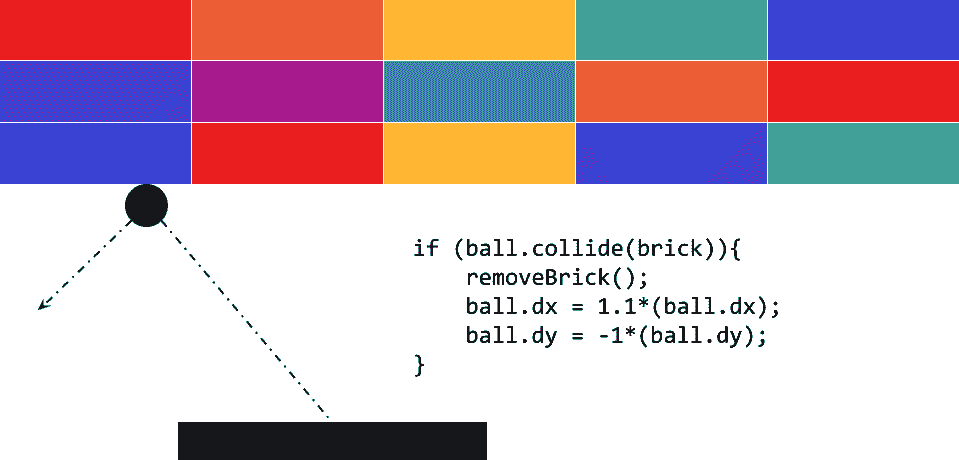

###### 图 1-1 打砖块游戏中的代码

在这里，球的运动可以由其`dx`和`dy`属性决定。当它撞击到砖块时，砖块被移除，球的速度增加并改变方向。代码作用于游戏情况的数据。

或者考虑一个金融服务场景。你有关于公司股票的数据，比如当前价格和当前收益。你可以用类似于图 1-2 中的代码来计算一个有价值的比率，称为 P/E（即价格除以收益）。

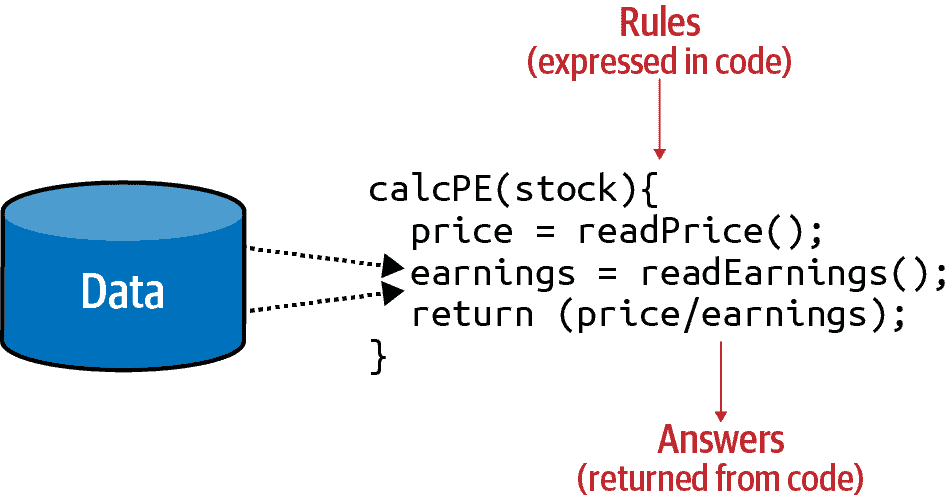

###### 图 1-2 金融服务场景中的代码

你的代码读取价格，读取收益，并返回前者除以后者的值。

如果我试图用一个单一的图表来概括传统编程，它可能看起来像图 1-3。

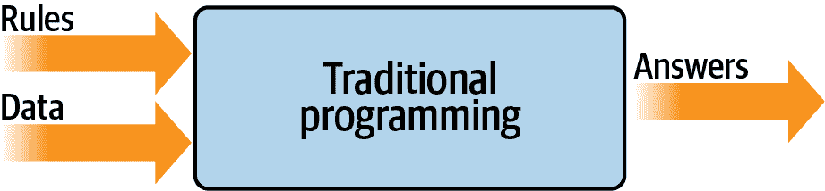

###### 图 1-3 传统编程的高层视图

正如你所见，你可以看到用编程语言表达的规则。这些规则作用于数据，结果是答案。

# 传统编程的局限性

自从其诞生以来，图 1-3 的模型一直是发展的支柱。但它有一个固有的限制：只有能够推导出规则的情景才能被实施。其他情景怎么办？通常因为代码太复杂而无法开发。编写处理它们的代码是不可能的。

例如，考虑活动检测。能够检测我们活动的健身监测器是一种新近的创新，不仅因为廉价和小型硬件的可用性，而且还因为处理检测的算法以前是不可行的。让我们探讨一下原因。

图 1-4 展示了一个简单的步行活动检测算法。它可以考虑个人的速度。如果速度低于特定值，我们可以确定他们可能在步行。

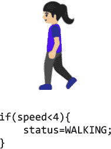

###### 图 1-4\. 活动检测算法

考虑到我们的数据是速度，我们可以扩展到检测他们是否在跑步（图 1-5）。

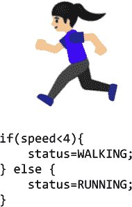

###### 图 1-5\. 扩展跑步算法

正如你所见，根据速度，如果速度低于特定值（比如说，4 英里每小时），我们可能会说这个人正在步行，否则他们在跑步。这还算有点用。

现在假设我们想要将其扩展到另一种流行的健身活动，骑行。算法可能类似于 图 1-6。

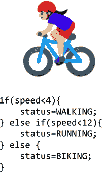

###### 图 1-6\. 扩展骑行算法

我知道这个算法很幼稚，因为它只检测速度——有些人跑得比其他人快，而且你可能在下坡跑得比在上坡骑自行车快，例如。但总体来说，它仍然有效。但是，如果我们想要实现另一种情景，比如高尔夫（图 1-7）会发生什么？


###### 图 1-7\. 如何编写高尔夫算法？

我们现在陷入困境。我们如何确定某人正在高尔夫运动？这个人可能会走一段路，停下来做一些活动，再走一段路，再停下来等等。但我们如何确定这是高尔夫？

我们使用传统规则检测这一活动的能力已经遇到了瓶颈。但也许有更好的方法。

进入机器学习。

# 从编程到学习

让我们回顾一下我们用来演示传统编程的图示(图 1-8)。在这里，我们有作用于数据并给我们答案的规则。在我们的活动检测场景中，数据是该人移动的速度；从中我们可以编写规则来检测他们的活动，无论是走路、骑车还是跑步。当涉及高尔夫运动时，我们遇到了困难，因为我们无法想出规则来确定该活动的样子。


###### 图 1-8\. 传统编程流程

但是如果我们在这个图表上翻转轴会发生什么？如果我们不是制定*规则*，而是提供*答案*，并且在数据的基础上找到可能的规则呢？

图 1-9 展示了这个样子。我们可以通过这个高级别的图表来定义*机器学习*。

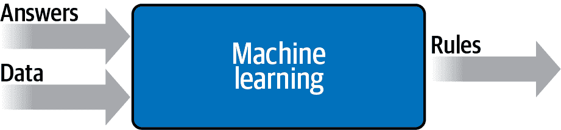

###### 图 1-9\. 改变轴以获得机器学习

那么这意味着什么呢？现在我们不再需要我们来找出规则，我们得到了有关我们场景的大量数据，我们对这些数据进行了标记，计算机可以找出使一个数据匹配特定标签、另一个数据匹配不同标签的规则。

那么这对于我们的活动检测场景会如何工作呢？嗯，我们可以查看所有关于此人提供数据的传感器。如果他们有一个可穿戴设备可以检测诸如心率、位置、速度等信息—并且如果我们在他们进行不同活动时收集了大量这些数据的实例—我们最终会得到一种数据描述“这是走路的样子”，“这是跑步的样子”，诸如此类 (图 1-10)。

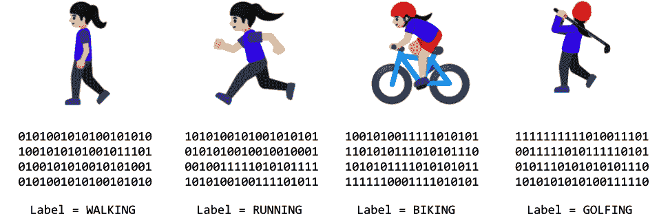

###### 图 1-10\. 从编码到机器学习：收集和标记数据

现在我们作为程序员的工作从找出规则转变为确定活动，编写能够将数据与标签匹配的代码。如果我们能做到这一点，那么我们可以用代码实现更多的场景。机器学习是一种使我们能够做到这一点的技术，但是为了开始，我们需要一个框架—这就是 TensorFlow 登场的地方。在接下来的部分，我们将看看它是什么以及如何安装它，然后在本章后面的部分，您将编写第一个学习两个值之间模式的代码，就像在上一场景中一样。这是一个简单的“Hello World”场景，但它具有用于极为复杂的场景的相同基础代码模式。

人工智能领域广泛而抽象，涵盖了使计算机思考和行动方式与人类相似的所有内容。人类采用新行为的一种方式是通过示例学习。因此，机器学习学科可以被视为发展人工智能的入口。通过它，机器可以学会像人类一样看待事物（称为*计算机视觉*领域），阅读文本（自然语言处理），以及更多。在本书中，我们将介绍使用 TensorFlow 框架的机器学习基础知识。

# 什么是 TensorFlow？

TensorFlow 是一个用于创建和使用机器学习模型的开源平台。它实现了许多常见的机器学习算法和模式，使你不需要学习所有底层的数学和逻辑，从而能够专注于你的场景。它面向从业余爱好者、专业开发人员，以及推动人工智能边界的研究人员。重要的是，它还支持将模型部署到 Web、云、移动和嵌入式系统中。本书将涵盖这些场景中的每一个。

TensorFlow 的高级架构可以在图 1-11 中看到。

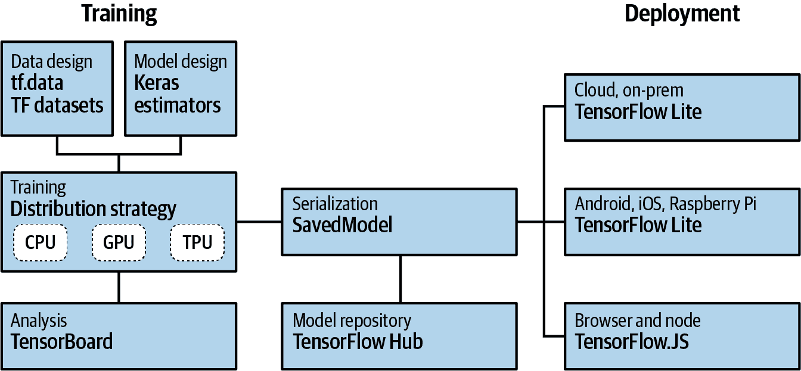

###### 图 1-11\. TensorFlow 高级架构

创建机器学习模型的过程称为*训练*。这是计算机使用一组算法来学习输入及其之间的区别的过程。例如，如果你想让计算机识别猫和狗，你可以使用大量猫和狗的图片来创建一个模型，计算机将使用该模型来尝试弄清楚是什么使得一只猫是猫，一只狗是狗。一旦模型训练好了，将其用于识别或分类未来输入的过程称为*推断*。

因此，为了训练模型，你需要支持几件事情。首先是一组用于设计模型本身的 API。使用 TensorFlow 有三种主要方式来做到这一点：你可以手动编写所有代码，即你自己找出计算机学习的逻辑然后实现在代码中（不推荐）；你可以使用内置的*估计器*，这些是已经实现的神经网络，你可以自定义；或者你可以使用 Keras，这是一个高级 API，允许你在代码中封装常见的机器学习范例。本书主要将关注在创建模型时使用 Keras API。

有许多方法可以训练模型。大多数情况下，您可能只会使用单个芯片，无论是中央处理单元（CPU）、图形处理单元（GPU）还是一种称为*张量处理单元*（TPU）的新型设备。在更高级的工作和研究环境中，可以使用跨多个芯片的并行训练，使用*分布策略*跨多个芯片进行训练。TensorFlow 也支持这种方式。

任何模型的生命线是其数据。正如之前讨论的那样，如果您想创建一个能够识别猫和狗的模型，它需要使用大量猫和狗的示例进行训练。但是您如何管理这些示例呢？随着时间的推移，您会发现，这往往比模型本身的创建需要更多的编码工作。TensorFlow 提供了 API 来尝试简化这个过程，称为 TensorFlow 数据服务。为了学习，它们包括许多预处理的数据集，您可以用一行代码就可以使用。它们还为您提供处理原始数据以便更容易使用的工具。

除了创建模型外，您还需要能够将它们交给用户使用。为此，TensorFlow 包含了用于*服务*的 API，您可以通过 HTTP 连接为云或 Web 用户提供模型推断。为了在移动设备或嵌入式系统上运行模型，TensorFlow 提供了 TensorFlow Lite，该工具支持在 Android 和 iOS 上以及基于 Linux 的嵌入式系统（如树莓派）上进行模型推断。TensorFlow Lite 的一个分支称为 TensorFlow Lite Micro（TFLM），也提供了对微控制器的推断，通过一个名为 TinyML 的新兴概念。最后，如果您想为浏览器或 Node.js 用户提供模型，TensorFlow.js 可以训练和执行模型。

接下来，我将向你展示如何安装 TensorFlow，以便您可以开始创建和使用 ML 模型。

# 使用 TensorFlow

在本节中，我们将介绍三种主要的安装和使用 TensorFlow 的方法。首先，我们将讲解如何在开发者框中使用命令行安装它。然后，我们将探讨如何使用流行的 PyCharm 集成开发环境（IDE）安装 TensorFlow。最后，我们将看看 Google Colab 以及如何在浏览器中使用基于云的后端访问 TensorFlow 代码。

## 在 Python 中安装 TensorFlow

TensorFlow 支持使用多种语言创建模型，包括 Python、Swift、Java 等。在本书中，我们将专注于使用 Python，因为它由于对数学模型的广泛支持而成为机器学习的事实标准语言。如果您还没有 Python，我强烈建议您访问[Python](https://www.python.org)来快速上手，以及[learnpython.org](https://www.learnpython.org)来学习 Python 语法。

对于 Python，有许多安装框架的方法，但 TensorFlow 团队支持的默认方法是使用`pip`。

因此，在您的 Python 环境中，安装 TensorFlow 就像使用以下命令一样简单：

```
pip install tensorflow
```

请注意，从 2.1 版本开始，默认安装 TensorFlow 的是 GPU 版本。在此之前，使用的是 CPU 版本。因此，在安装之前，请确保您有一个支持的 GPU 和所有必需的驱动程序。有关详细信息，请参阅[TensorFlow](https://oreil.ly/5upaL)。

如果您没有所需的 GPU 或驱动程序，仍然可以在任何 Linux、PC 或 Mac 上安装 TensorFlow 的 CPU 版本：

```
pip install tensorflow-cpu
```

一旦您开始运行，可以使用以下代码测试您的 TensorFlow 版本：

```
import tensorflow as tf
print(tf.__version__)
```

您应该看到与图 1-12 类似的输出。这将打印当前运行的 TensorFlow 版本——在这里，您可以看到安装的版本为 2.0.0。

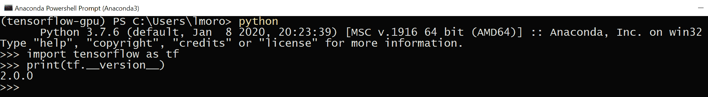

###### 图 1-12\. 在 Python 中运行 TensorFlow

## 在 PyCharm 中使用 TensorFlow

我特别喜欢使用[PyCharm 的免费社区版本](https://www.jetbrains.com/pycharm)来构建使用 TensorFlow 的模型。PyCharm 有许多有用之处，但我最喜欢的之一是它简化了虚拟环境的管理。这意味着您可以拥有与特定项目相关的工具版本（例如 TensorFlow 的不同版本）的 Python 环境。因此，例如，如果您想在一个项目中使用 TensorFlow 2.0，而在另一个项目中使用 TensorFlow 2.1，您可以通过虚拟环境将它们分开，并且在切换时无需处理安装/卸载依赖项。此外，使用 PyCharm，您可以对您的 Python 代码进行逐步调试——这对于刚开始使用的人尤为重要。

例如，在图 1-13 中，我有一个名为 *example1* 的新项目，并且我指定要使用 Conda 创建一个新环境。当我创建项目时，我将拥有一个干净的新虚拟 Python 环境，可以在其中安装任何我想要的 TensorFlow 版本。

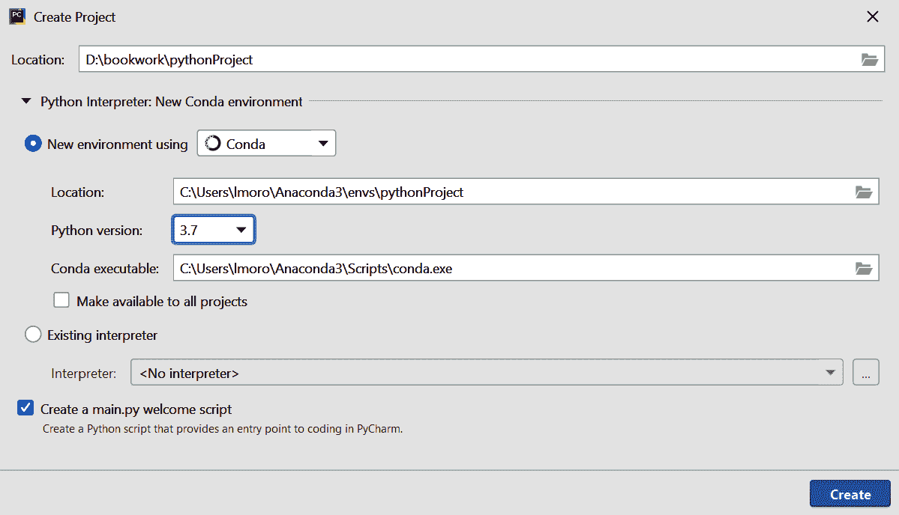

###### 图 1-13\. 使用 PyCharm 创建新的虚拟环境

创建项目后，您可以打开“文件”→“设置”对话框，并从左侧菜单中选择“项目：*<your project name>*”条目。然后，您将看到更改项目解释器和项目结构设置的选项。选择“项目解释器”链接，您将看到您正在使用的解释器，以及安装在该虚拟环境中的包的列表（图 1-14）。

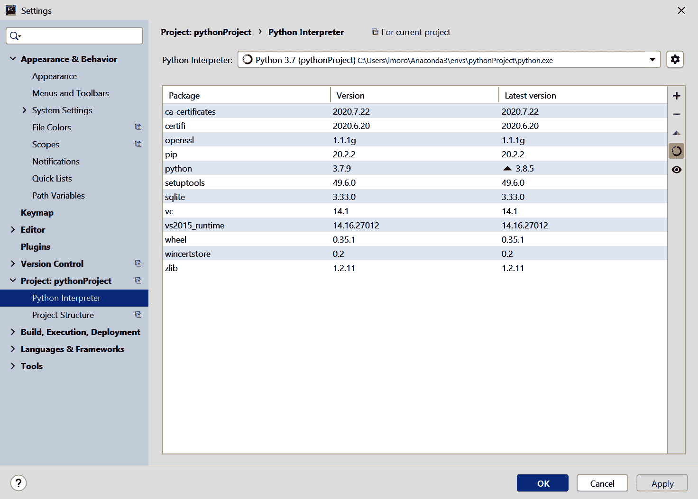

###### 图 1-14\. 向虚拟环境添加包

点击右侧的 + 按钮，会弹出对话框显示当前可用的包。在搜索框中输入“tensorflow”，您将看到所有包含“tensorflow”名称的可用包（Figure 1-15）。

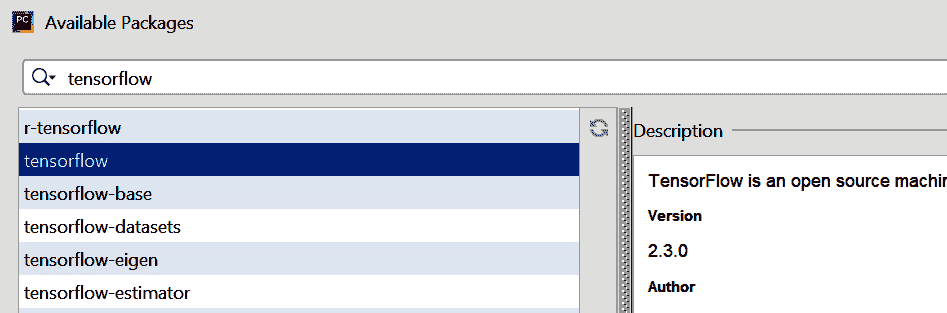

###### Figure 1-15\. 使用 PyCharm 安装 TensorFlow

一旦选择了 TensorFlow 或任何其他要安装的包，并点击安装包按钮，PyCharm 将完成剩下的工作。

一旦安装了 TensorFlow，您现在可以在 Python 中编写和调试 TensorFlow 代码了。

## 在 Google Colab 中使用 TensorFlow

另一个选项，也许是最简单的入门方法，是使用[Google Colab](https://colab.research.google.com)，这是一个托管的 Python 环境，您可以通过浏览器访问。Colab 的真正好处在于它提供 GPU 和 TPU 后端，因此您可以免费使用先进硬件来训练模型。

当访问 Colab 网站时，您将有选项打开之前的 Colab 或开始一个新的笔记本，如 Figure 1-16 所示。


###### Figure 1-16\. 开始使用 Google Colab

点击“New Python 3 Notebook”链接将打开编辑器，在这里你可以添加代码或文本窗格（Figure 1-17）。你可以通过点击左边窗格的播放按钮（箭头）来执行代码。

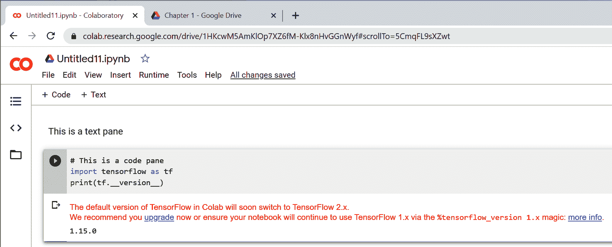

###### Figure 1-17\. 在 Colab 中运行 TensorFlow 代码

始终建议检查 TensorFlow 的版本，如此处所示，以确保您运行的是正确的版本。通常情况下，Colab 内置的 TensorFlow 版本可能比最新版本要旧一两个版本。如果是这种情况，您可以像之前展示的那样，通过使用如下代码块来更新它：

```
!pip install tensorflow==2.1.0
```

一旦运行此命令，您当前在 Colab 中的环境将使用所需版本的 TensorFlow。

# 机器学习入门

正如我们在本章早些时候看到的那样，机器学习范式是一种在其中有数据，数据被标记，然后你想找出将数据与标签匹配的规则的场景。展示这种情况的最简单的代码可能是这样的。考虑这两组数字：

```
X = –1, 0, 1, 2, 3, 4
Y = –3, –1, 1, 3, 5, 7
```

X 和 Y 值之间存在关系（例如，如果 X 是 –1，则 Y 是 –3，如果 X 是 3，则 Y 是 5，等等）。你能看出来吗？

几秒钟后，你可能会发现这里的模式是 Y = 2X – 1\. 如何得出这个结果？不同的人有不同的方法，但我通常听到的观察是 X 在其序列中增加 1，而 Y 增加 2；因此，Y = 2X +/– 一些东西。然后他们看 X = 0 时 Y = –1，所以他们推测答案可能是 Y = 2X – 1\. 接下来他们看其他数值，发现这个假设“符合”，答案就是 Y = 2X – 1。

这与机器学习过程非常相似。让我们看一下一些 TensorFlow 代码，你可以编写一个神经网络来帮你完成这个过程。

这是使用 TensorFlow Keras API 的完整代码。如果现在还不明白，不要担心；我们会逐行解释：

```
import tensorflow as tf
import numpy as np
from tensorflow.keras import Sequential
from tensorflow.keras.layers import Dense

model = Sequential([Dense(units=1, input_shape=[1])])
model.compile(optimizer='sgd', loss='mean_squared_error')

xs = np.array([-1.0, 0.0, 1.0, 2.0, 3.0, 4.0], dtype=float)
ys = np.array([-3.0, -1.0, 1.0, 3.0, 5.0, 7.0], dtype=float)

model.fit(xs, ys, epochs=500)

print(model.predict([10.0]))
```

让我们从第一行开始。你可能听说过神经网络，并且可能看到过用互连神经元层解释它们的图示，有点像图 1-18。

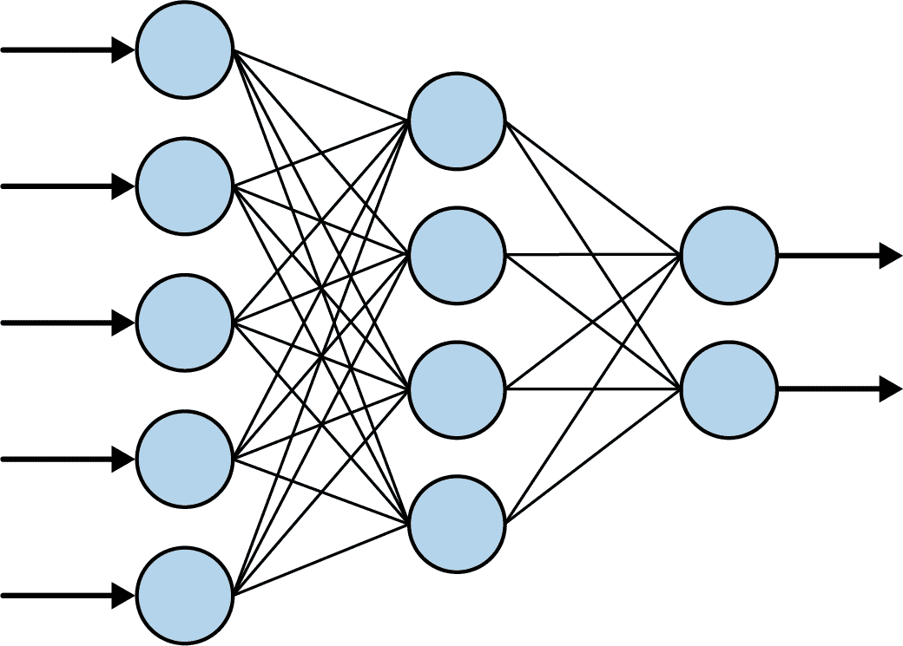

###### 图 1-18\. 一个典型的神经网络

当你看到这样的神经网络时，请将每个“圆圈”视为*神经元*，并将每个圆圈列视为*层*。因此，在图 1-18 中，有三层：第一层有五个神经元，第二层有四个，第三层有两个。

如果我们回顾我们的代码，只看第一行，我们将看到我们在定义最简单可能的神经网络。只有一个层，它只包含一个神经元：

```
model = Sequential([Dense(units=1, input_shape=[1])])
```

在使用 TensorFlow 时，你使用 `Sequential` 定义你的层。在 `Sequential` 内部，你然后指定每一层的样子。我们只有一行在我们的 `Sequential` 内部，所以我们只有一层。

然后，你使用 `keras.layers` API 定义层的样子。有很多不同类型的层，但在这里我们使用了 `Dense` 层。`Dense`意味着一组完全（或密集）连接的神经元，这就是你在图 1-18 中看到的，其中每个神经元与下一层中的每个神经元连接。这是最常见的层类型。我们的 `Dense` 层指定了 `units=1`，所以我们在整个神经网络中只有一个密集层和一个神经元。最后，当你指定神经网络的*第一*层（在这种情况下，它是我们唯一的层）时，你必须告诉它输入数据的形状是什么。在这种情况下，我们的输入数据是我们的 X，它只是一个单一的值，所以我们指定它的形状。

接下来的一行是真正有趣的开始。让我们再看一遍：

```
model.compile(optimizer='sgd', loss='mean_squared_error')
```

如果你之前有机器学习的经验，你可能看到它涉及大量的数学。如果你多年没做过微积分，它可能看起来像是个门槛。这是数学涉及的部分——它是机器学习的核心。

在这种情况下，计算机*完全不知道*X 和 Y 之间的关系。因此它会猜测。例如，它猜测 Y = 10X + 10。然后它需要衡量这个猜测是好是坏。这就是*损失函数*的工作。

当 X 为–1, 0, 1, 2, 3 和 4 时，它已经知道答案，因此损失函数可以将这些与猜测关系的答案进行比较。如果它猜测 Y = 10X + 10，则当 X 为–1 时，Y 将为 0。那里的正确答案是–3，所以有点偏离。但当 X 为 4 时，猜测答案是 50，而正确答案是 7。那相差甚远。

掌握了这些知识后，计算机就可以进行另一次猜测。这就是*优化器*的工作。这是使用大量微积分的地方，但是使用 TensorFlow，这些可以对你隐藏起来。你只需选择适合不同情景的优化器来使用。在这种情况下，我们选择了一个称为`sgd`的优化器，即*随机梯度下降*——一种复杂的数学函数，当给定值、先前的猜测以及计算出的误差（或损失）时，可以生成另一个值。随着时间的推移，它的工作是最小化损失，并通过这种方式使猜测的公式越来越接近正确答案。

接下来，我们只需将我们的数字格式化为层所期望的数据格式。在 Python 中，有一个名为 Numpy 的库可以被 TensorFlow 使用，在这里我们将我们的数字放入一个 Numpy 数组中，以便于对它们进行处理：

```
xs = np.array([-1.0, 0.0, 1.0, 2.0, 3.0, 4.0], dtype=float)
ys = np.array([-3.0, -1.0, 1.0, 3.0, 5.0, 7.0], dtype=float)
```

然后*学习*过程将以`model.fit`命令开始，就像这样：

```
model.fit(xs, ys, epochs=500)
```

您可以将其理解为“将 X 适配到 Y，并尝试 500 次”。因此，在第一次尝试时，计算机将猜测关系（例如 Y = 10X + 10），并测量该猜测的好坏程度。然后将这些结果馈送给优化器，优化器将生成另一个猜测。这个过程将重复进行，逻辑是随着时间的推移，损失（或错误）将逐渐减少，结果“猜测”将变得越来越好。

图 1-19 展示了在 Colab 笔记本中运行时的截图。看看随时间变化的损失值。

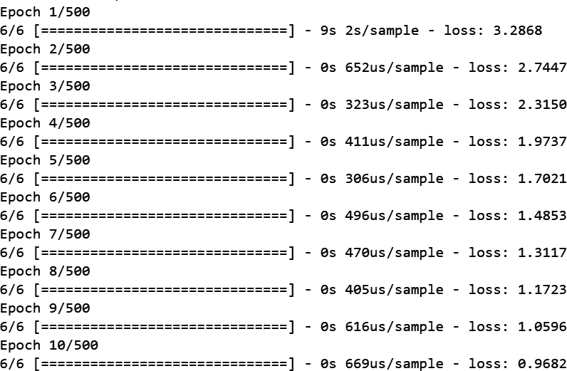

###### 图 1-19。训练神经网络

我们可以看到，在前 10 个时期内，损失从 3.2868 降到了 0.9682。也就是说，仅经过 10 次尝试，网络的性能比初始猜测好了三倍。接下来看看在第 500 个时期时会发生什么（图 1-20）。

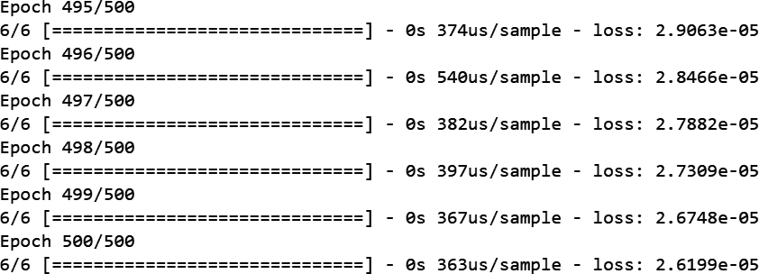

###### 图 1-20。训练神经网络——最后五个时期

现在我们可以看到损失为 2.61 × 10^(-5)。损失已经变得非常小，以至于模型几乎已经弄清楚了数字之间的关系是 Y = 2X - 1。*机器*已经*学会*了它们之间的模式。

我们的最后一行代码然后使用训练好的模型来进行类似这样的预测：

```
print(model.predict([10.0]))
```

###### 注意

*预测* 一词通常在处理 ML 模型时使用。不过不要把它看作是对未来的预测！之所以使用这个术语，是因为我们处理了一定程度的不确定性。回想一下我们之前讨论的活动检测场景。当人以某个速度移动时，她很 *可能* 是在走路。同样地，当模型学习到两者之间的模式时，它会告诉我们答案 *可能* 是什么。换句话说，它正在 *预测* 答案。 （稍后你还将了解 *推理*，在那里模型从多个答案中选择一个，并 *推断* 它已经选择了正确的答案。）

当我们要求模型预测 X 为 10 时，你认为答案会是什么？你可能会立即想到 19，但那是不正确的。它将选择一个与 19 *非常接近* 的值。这有几个原因。首先，我们的损失不是 0，它仍然是一个非常小的数量，因此我们应该期望任何预测答案都会有一个非常小的偏差。其次，神经网络仅基于少量数据进行了训练——在这种情况下只有六对 (X,Y) 值。

该模型中只有一个神经元，该神经元学习了一个 *权重* 和一个 *偏差*，使得 Y = WX + B。这看起来完全像我们想要的关系 Y = 2X – 1，其中我们希望它学到 W = 2 和 B = –1\. 考虑到该模型仅使用六项数据进行了训练，不可能期望答案恰好是这些值，但会非常接近它们。

运行代码以查看你会得到什么结果。我在运行时得到的是 18.977888，但你的答案可能略有不同，因为当神经网络首次初始化时存在随机元素：你的初始猜测将与我的略有不同，也会与第三个人的不同。

## 查看网络学到了什么

显然，这是一个非常简单的情景，我们在其中匹配 X 到 Y 在线性关系中。如前所述，神经元有权重和偏差参数，它们学习使单个神经元能够很好地学习到这样的关系：即当 Y = 2X – 1 时，权重为 2，偏差为 –1\. 使用 TensorFlow，我们实际上可以查看学到的权重和偏差，只需简单修改我们的代码如下：

```
import tensorflow as tf
import numpy as np
from tensorflow.keras import Sequential
from tensorflow.keras.layers import Dense

`l0` `=` `Dense``(``units``=``1``,` `input_shape``=``[``1``]``)`
model = Sequential([l0])
model.compile(optimizer='sgd', loss='mean_squared_error')

xs = np.array([-1.0, 0.0, 1.0, 2.0, 3.0, 4.0], dtype=float)
ys = np.array([-3.0, -1.0, 1.0, 3.0, 5.0, 7.0], dtype=float)

model.fit(xs, ys, epochs=500)

print(model.predict([10.0]))
`print``(``"``Here is what I learned: {}``"``.``format``(``l0``.``get_weights``(``)``)``)`
```

不同之处在于我创建了一个名为 `l0` 的变量来保存 `Dense` 层。然后，在网络完成学习后，我可以打印出该层学到的值（或权重）。

在我的案例中，输出如下所示：

```
Here is what I learned: [array([[1.9967953]], dtype=float32), 
array([-0.9900647], dtype=float32)]
```

因此，X 和 Y 之间学到的关系是 Y = 1.9967953X – 0.9900647。

这相当接近我们预期的结果（Y = 2X – 1），我们可以认为它甚至更接近现实，因为我们 *假设* 这种关系将适用于其他值。

# 总结

这就是你的第一个机器学习“Hello World”了。你可能会觉得，对于确定两个值之间的线性关系来说，这似乎有些杀鸡用牛刀。你的想法没错。但酷的是，我们在这里创建的代码模式，也是用于更复杂场景的相同模式。你将在第二章中看到这些，我们将探索一些基本的计算机视觉技术——机器将学会“看”图片中的模式，并识别其中的内容。
