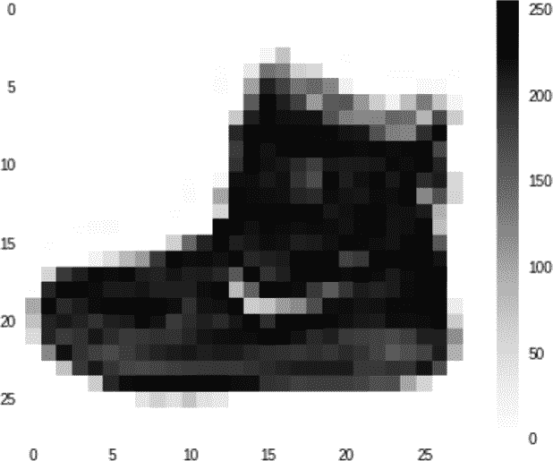

# 第二章：介绍计算机视觉

上一章介绍了机器学习的基础知识。你看到了如何使用神经网络开始编程，将数据与标签匹配，以及从那里推断可以用来区分物品的规则。一个逻辑的下一步是将这些概念应用到计算机视觉中，在那里我们将让一个模型学习如何识别图片中的内容，以便它可以“看到”其中的内容。在这一章中，你将使用一个流行的服装项目数据集构建一个模型，该模型能够区分它们之间的差异，从而“看到”不同类型的服装。

# 识别服装项目

对于我们的第一个例子，让我们考虑如何在图像中识别服装。例如，考虑图 2-1 中的物品。


###### 图 2-1. 服装示例

这里有许多不同的服装项目，你可以识别它们。你理解什么是衬衫，或者外套，或者连衣裙。但是如果要向从未见过服装的人解释这些，你该如何做？鞋子呢？这张图片中有两只鞋子，但你该如何向别人描述呢？这也是我们在第一章中谈到的基于规则的编程可能遇到困难的另一个领域。有时用规则描述某些事物是不可行的。

当然，计算机视觉也不例外。但考虑一下你是如何学会识别所有这些物品的——通过看到许多不同的例子，并且获得它们使用方式的经验。我们能否用同样的方法来训练计算机呢？答案是肯定的，但有一定的限制。让我们首先看一个例子，介绍如何教会计算机识别服装，使用一个名为 Fashion MNIST 的知名数据集。

## 数据：Fashion MNIST

对于学习和基准算法的基础数据集之一是由 Yann LeCun、Corinna Cortes 和 Christopher Burges 创建的 Modified National Institute of Standards and Technology（MNIST）数据库。这个数据集包含 70,000 张 0 到 9 的手写数字图像。图像为 28 × 28 灰度图像。

[Fashion MNIST](https://oreil.ly/31Nzu) 被设计成 MNIST 的一个直接替代品，它具有相同数量的记录，相同的图像尺寸和相同数量的类别——因此，与数字 0 到 9 的图像不同，Fashion MNIST 包含 10 种不同类型的服装的图像。你可以在图 2-2 中看到数据集内容的示例。在这里，每种服装项目类型都有三行。


###### 图 2-2. 探索 Fashion MNIST 数据集

它有各种不错的服装，包括衬衫、裤子、连衣裙和各种类型的鞋子。正如您可能注意到的，它是单色的，因此每张图片由一定数量的像素组成，其值在 0 到 255 之间。这使得数据集更容易管理。

您可以看到数据集中特定图像的特写在图 2-3 中。



###### 图 2-3\. Fashion MNIST 数据集中的图像特写

就像任何图像一样，它是像素的矩形网格。在这种情况下，网格大小为 28 × 28，每个像素只是一个值，其范围在 0 到 255 之间，如前所述。现在让我们看看如何将这些像素值与我们之前看到的函数结合起来使用。

# 视觉神经元

在第 1 章中，您看到了一个非常简单的情景，其中一台机器获得了一组 X 和 Y 值，并且学会了它们之间的关系是 Y = 2X - 1。这是通过一个非常简单的只有一层和一个神经元的神经网络完成的。

如果您将其以图形方式绘制出来，它可能看起来像图 2-4。

每张图像都是一组 784 个值（28 × 28），其值在 0 到 255 之间。它们可以是我们的 X。我们知道我们的数据集中有 10 种不同类型的图像，所以让我们把它们视为我们的 Y。现在我们想学习当 Y 是 X 的函数时函数的样子。


###### 图 2-4\. 单个神经元学习线性关系

鉴于每个图像有 784 个 X 值，并且我们的 Y 将在 0 到 9 之间，很显然我们不能像之前那样做 Y = mX + c。

但是我们*可以*让多个神经元一起工作。每个神经元将学习*参数*，当我们将所有这些参数的组合函数一起工作时，我们可以看到我们是否能将这种模式匹配到我们想要的答案（图 2-5）。


###### 图 2-5\. 扩展我们的模式以获取更复杂的例子

此图表顶部的框可以视为图像中的像素，或者我们的 X 值。当我们训练神经网络时，我们将这些加载到一层神经元中——图 2-5 显示它们只加载到第一个神经元中，但值加载到每个神经元中。考虑每个神经元的权重和偏置（m 和 c）是随机初始化的。然后，当我们总结每个神经元输出的值时，我们将得到一个值。这将对输出层中的*每个*神经元执行，因此神经元 0 将包含像素累加到标签 0 的概率值，神经元 1 对应标签 1，依此类推。

随着时间的推移，我们希望将该值与所需的输出值匹配——对于这幅图像，我们可以看到其标签是数字 9，即展示在图 2-3 中的脚踝靴。换句话说，这个神经元应该是所有输出神经元中值最大的一个。

鉴于有 10 个标签，随机初始化应该能在大约 10%的时间内得到正确答案。从那里，损失函数和优化器可以在每个时代逐步调整每个神经元的内部参数，以改进这 10%。因此，随着时间的推移，计算机将学会“看到”是什么使鞋子成为鞋子或服装成为服装。

# 设计神经网络

现在让我们看看这在代码中是什么样子。首先，我们将看看在图 2-5 中展示的神经网络的设计：

```
model = keras.Sequential([
    keras.layers.Flatten(input_shape=(28, 28)),
    keras.layers.Dense(128, activation=tf.nn.relu),
    keras.layers.Dense(10, activation=tf.nn.softmax)
])
```

如果你记得，在第一章中，我们有一个`Sequential`模型来指定我们有许多层。它只有一层，但在这种情况下，我们有多个层。

第一个`Flatten`不是一个神经元层，而是一个输入层规范。我们的输入是 28 × 28 的图像，但我们希望它们被视为一系列数值，就像图 2-5 顶部的灰色框中的那样。`Flatten`将那个“方形”值（一个 2D 数组）转换成一条线（一个 1D 数组）。

接下来的`Dense`是一个神经元层，我们正在指定我们想要 128 个神经元。这是在图 2-5 中展示的中间层。你经常会听到这样的层被描述为*隐藏层*。位于输入和输出之间的层对调用者是不可见的，因此术语“隐藏”用于描述它们。我们请求 128 个神经元以随机初始化其内部参数。通常在这一点上我会被问到的问题是“为什么是 128？”这完全是任意的——没有固定的神经元数量规则。在设计层时，您需要选择适当数量的值以使您的模型真正学习。更多的神经元意味着它会运行得更慢，因为它必须学习更多的参数。更多的神经元也可能导致网络非常擅长识别训练数据，但在识别以前没有见过的数据时可能不那么好（这称为*过拟合*，我们稍后在本章中讨论）。另一方面，更少的神经元意味着模型可能没有足够的参数来学习。

需要一些时间的实验来选择正确的值。这个过程通常被称为*超参数调整*。在机器学习中，超参数是用来控制训练的值，而不是被训练/学习的神经元的内部值，这些被称为参数。

您可能注意到该层还指定了一个*激活函数*。激活函数是在该层中每个神经元上执行的代码。TensorFlow 支持多种激活函数，但在中间层中非常常见的一种是`relu`，即*修正线性单元*。它是一个简单的函数，如果大于 0 则返回该值。在这种情况下，我们不希望负值传递到下一层，可能影响求和函数，所以我们可以简单地使用`relu`激活该层，而不是编写大量的`if-then`代码。

最后，还有另一个`Dense`层，这是输出层。这有 10 个神经元，因为我们有 10 个类别。这些神经元每个都将得到一个概率，即输入像素匹配该类别，所以我们的任务是确定哪一个具有最高的值。我们可以循环遍历它们来选择那个值，但`softmax`激活函数会为我们完成这个任务。

因此，现在当我们训练我们的神经网络时，目标是我们可以输入一个 28×28 像素数组，中间层的神经元将有权重和偏置（m 和 c 值），当组合时将这些像素匹配到 10 个输出值中的一个。

## 完整的代码

现在我们已经探讨了神经网络的架构，让我们来看看用 Fashion MNIST 数据训练的完整代码：

```
import tensorflow as tf
data = tf.keras.datasets.fashion_mnist

(training_images, training_labels), (test_images, test_labels) = data.load_data()

training_images  = training_images / 255.0
test_images = test_images / 255.0

model = tf.keras.models.Sequential([
            tf.keras.layers.Flatten(input_shape=(28, 28)),
            tf.keras.layers.Dense(128, activation=tf.nn.relu),
            tf.keras.layers.Dense(10, activation=tf.nn.softmax)
        ])

model.compile(optimizer='adam',
              loss='sparse_categorical_crossentropy',
              metrics=['accuracy'])

model.fit(training_images, training_labels, epochs=5)
```

让我们逐步走过这段文字。首先是一个方便的快捷方式来访问数据：

```
data = tf.keras.datasets.fashion_mnist
```

Keras 有许多内置数据集，您可以像这样用一行代码访问。在这种情况下，您不必处理下载 70,000 张图片、将它们分割为训练和测试集等问题，只需一行代码就可以搞定。这种方法已经得到了改进，使用一个名为[TensorFlow 数据集](https://oreil.ly/gM-Cq)的 API，但在这些早期章节中，为了减少您需要学习的新概念数量，我们将仅使用`tf.keras.datasets`。

我们可以调用它的`load_data`方法来返回我们的训练集和测试集，就像这样：

```
(training_images, training_labels), 
(test_images, test_labels) = data.load_data()
```

Fashion MNIST 被设计为有 60,000 张训练图像和 10,000 张测试图像。所以，从`data.load_data`返回的将是一个包含 60,000 个 28×28 像素数组的`training_images`数组，以及一个包含 60,000 个值（0-9）的`training_labels`数组。类似地，`test_images`数组将包含 10,000 个 28×28 像素数组，而`test_labels`数组将包含 10,000 个值，范围在 0 到 9 之间。

我们的任务将是以类似的方式将训练图像适配到训练标签，就像我们在第一章中将 Y 适配到 X 一样。

我们将保留测试图像和测试标签，这样网络在训练时不会看到它们。这些可以用来测试网络在之前未见数据上的有效性。

接下来的几行代码可能看起来有点不寻常：

```
training_images  = training_images / `255.0`
test_images = test_images / `255.0`
```

Python 允许您使用此表示在整个数组上执行操作。请记住，我们图像中的所有像素都是灰度的，值在 0 到 255 之间。因此，除以 255 可确保每个像素由一个在 0 到 1 之间的数字表示。这个过程称为*归一化*图像。

为什么归一化数据对训练神经网络更好的数学原理超出了本书的范围，但请记住，在 TensorFlow 中训练神经网络时，归一化将改善性能。通常情况下，处理非归一化数据时，您的网络将无法学习，并且将会出现严重的错误。从第一章中的 Y = 2X - 1 示例可以看出，该数据不需要进行归一化，因为它非常简单，但是尝试使用 X 值不同的不同 Y 值进行训练，您将会看到它迅速失败！

接下来我们定义组成我们模型的神经网络，如前所述：

```
model = tf.keras.models.`Sequential`([
            tf.keras.layers.`Flatten`(input_shape=(`28`, `28`)),
            tf.keras.layers.`Dense`(`128`, activation=tf.nn.relu),
            tf.keras.layers.`Dense`(`10`, activation=tf.nn.softmax)
        ])
```

当我们编译我们的模型时，我们像以前一样指定损失函数和优化器：

```
 model.compile(optimizer=`'``adam``'`,
              loss=`'``sparse_categorical_crossentropy``'`,
              metrics=[`'``accuracy``'`])
```

在这种情况下，损失函数称为*稀疏分类交叉熵*，它是内置于 TensorFlow 中的损失函数库中的一员。再次选择使用哪种损失函数本身就是一门艺术，随着时间的推移，您将学会在哪些场景中使用最佳。这个模型与我们在第一章中创建的模型之间的一个主要区别是，这里不是我们试图预测一个单一的数字，而是我们正在选择一个*类别*。我们的服装物品将属于 10 个服装类别之一，因此使用*分类*损失函数是正确的选择。稀疏分类交叉熵是一个不错的选择。

选择优化器也是如此。`adam` 优化器是随机梯度下降 (`sgd`) 优化器的进化版，已被证明更快更高效。由于我们处理 60,000 张训练图像，我们能获得的任何性能提升都将是有帮助的，所以这里选择了它。

您可能会注意到代码中还有一行新的指定我们要报告的指标。在这里，我们想要报告网络的准确性，因为我们正在训练。在第一章中的简单示例只报告了损失，我们通过减少损失来解释网络正在学习。在这种情况下，更有用的是查看网络如何学习，即它将返回正确匹配输入像素与输出标签的频率。

接下来，我们将通过五个周期将训练图像拟合到训练标签来训练网络：

```
model.fit(training_images, training_labels, epochs=`5`)
```

最后，我们可以做一些新的事情——使用一行代码来评估模型。我们有一组 10,000 张图像和测试标签，可以将它们传递给训练好的模型，让它预测每张图像的内容，并将其与实际标签进行比较，然后汇总结果：

```
model.evaluate(test_images, test_labels)
```

# 训练神经网络

执行代码，你将看到网络逐个 epoch 进行训练。在运行训练后，你将看到类似于以下内容的结果：

```
`58016`/`60000` [=====>.] - ETA: `0``s` - loss: `0.2941` - accuracy: `0.8907`
`59552`/`60000` [=====>.] - ETA: `0``s` - loss: `0.2943` - accuracy: `0.8906`
`60000`/`60000` [] - `2``s` `34``us`/sample - loss: `0.2940` - accuracy: `0.8906`
```

请注意，现在它报告准确率。所以在这种情况下，使用训练数据，我们的模型在只经过五个 epochs 后的准确率约为 89%。

但是测试数据呢？在我们的测试数据上执行`model.evaluate`的结果会看起来像这样：

```
`10000`/`1` [====] - `0``s` `30``us`/sample - loss: `0.2521` - accuracy: `0.8736`
```

在这种情况下，模型的准确率为 87.36%，考虑到我们只训练了五个 epochs，这还算不错。

你可能会想为什么测试数据的准确率*低于*训练数据。这是非常常见的现象，仔细想想就明白了：神经网络实际上只知道如何将其训练过的输入与相应的输出进行匹配。我们希望，如果提供足够的数据，它能够从所见的例子中进行泛化，“学习”出鞋子或裙子的外观。但总会有一些它从未见过的与其所知不同的例子会让它感到困惑。

例如，如果你的成长经历中只见过运动鞋，那对你来说运动鞋就是鞋子的样子，当你第一次看到高跟鞋时可能会感到有些困惑。从你的经验来看，它可能是一只鞋，但你并不确定。这是一个类似的概念。

# 探索模型输出

现在模型已经训练好了，我们通过测试集也有了它的准确度，让我们来稍微探索一下它：

```
classifications = model.predict(test_images)
`print`(classifications[`0`])
`print`(test_labels[`0`])
```

我们将通过`model.predict`传递测试图像来获得一组分类。然后，让我们看看如果我们打印出第一个分类结果并将其与测试标签进行比较会得到什么：

```
`[`1.9177722e-05  1.9856788e-07  6.3756357e-07  7.1702580e-08  5.5287035e-07
 1.2249852e-02  6.0708484e-05  7.3229447e-02  8.3050705e-05  9.1435629e-01`]`
9
```

你会注意到分类结果返回给我们一个值数组。这些是 10 个输出神经元的值。标签是衣物的实际标签，本例中是`9`。浏览一下数组——你会看到一些值非常小，而最后一个值（数组索引 9）远远最大。这些是图像与特定索引处标签匹配的概率。所以，神经网络报告的是图像在索引 0 处是标签 9 的概率为 91.4%。我们知道它是标签 9，所以它预测正确了。

试试不同的值，看看模型哪里预测错误。

# 更长时间的训练——发现过拟合

在这种情况下，我们只训练了五个 epochs。也就是说，我们通过整个训练循环，神经元被随机初始化，根据它们的标签进行检查，通过损失函数来衡量性能，然后由优化器更新了五次。我们得到的结果非常不错：训练集准确率为 89%，测试集准确率为 87%。那么，如果我们训练更长时间会发生什么呢？

尝试将其更新为训练 50 个 epochs 而不是 5 个。在我的情况下，我在训练集上得到了这些准确率数据：

```
`58112`/`60000` [==>.] - ETA: `0``s` - loss: `0.0983` - accuracy: `0.9627`
`59520`/`60000` [==>.] - ETA: `0``s` - loss: `0.0987` - accuracy: `0.9627`
`60000`/`60000` [====] - `2``s` `35``us`/sample - loss: `0.0986` - accuracy: `0.9627`
```

这特别令人兴奋，因为我们的表现要好得多：96.27% 的准确率。对于测试集，我们达到了 88.6%：

```
[====] - `0``s` `30``us`/sample - loss: `0.3870` - accuracy: `0.8860`
```

所以，我们在训练集上有了很大的改进，而在测试集上只有小幅改进。这可能表明，如果我们训练我们的网络更长时间，结果会更好——但并非总是如此。网络在训练数据上表现更好，但不一定是一个更好的模型。事实上，准确率数字的分歧表明它已经过度专门化于训练数据，这个过程通常称为 *过拟合*。在构建更多神经网络时，这是需要注意的问题，而在你阅读本书的过程中，你将学习到一些避免这种情况的技巧。

# 停止训练

到目前为止，在每种情况下，我们都硬编码了我们训练的 epochs 数量。虽然这样做是有效的，但我们可能希望训练直到达到期望的准确率，而不是不断尝试不同的 epochs 数量，重新训练直到达到我们想要的值。例如，如果我们想要在训练集上达到 95% 的准确率而不知道需要多少 epochs，我们该怎么做？

最简单的方法是在训练上使用 *callback*。让我们看看使用回调函数的更新代码：

```
`import` tensorflow `as` tf

`class` myCallback(tf.keras.callbacks.`Callback`):
  `def` on_epoch_end(self, epoch, logs={}):
    `if`(logs.get(`'``accuracy``'`)>`0.95`):
      `print`(`"``\n``Reached 95``%` `accuracy so cancelling training!``"`)
      self.model.stop_training = `True`

callbacks = myCallback()
mnist = tf.keras.datasets.fashion_mnist

(training_images, training_labels), 
(test_images, test_labels) = mnist.load_data()

training_images=training_images/`255.0`
test_images=test_images/`255.0`

model = tf.keras.models.`Sequential`([
        tf.keras.layers.`Flatten`(),
        tf.keras.layers.`Dense`(`128`, activation=tf.nn.relu),
	    tf.keras.layers.`Dense`(`10`, activation=tf.nn.softmax)
])

model.compile(optimizer=`'``adam``'`, 
               loss=`'``sparse_categorical_crossentropy``'`, 
               metrics=[`'``accuracy``'`])

 model.fit(training_images, training_labels, epochs=`50`, 
           callbacks=[callbacks])
```

让我们看看这里发生了什么变化。首先，我们创建了一个名为 `myCallback` 的新类。它接受 `tf.keras.callbacks.Callback` 作为参数。在其中，我们定义了 `on_epoch_end` 函数，它将给我们提供这个 epoch 的日志详情。在这些日志中有一个准确率值，所以我们所要做的就是看它是否大于 0.95（或 95%）；如果是，我们可以通过设置 `self.model.stop_training = True` 来停止训练。

一旦我们指定了这一点，我们创建一个 `callbacks` 对象，作为 `myCallback` 函数的一个实例。

现在看看 `model.fit` 语句。你会看到我已经更新为训练 50 个 epochs，并添加了一个 `callbacks` 参数。我将 `callbacks` 对象传递给它。

在训练过程中，每个 epoch 结束时，回调函数将被调用。所以在每个 epoch 结束后你会检查一下，在大约 34 个 epochs 后，你会看到你的训练结束了，因为训练已经达到了 95% 的准确率（由于初始随机初始化的不同，你的数字可能会有所不同，但它很可能非常接近 34）：

```
`56896`/`60000` [====>..] - ETA: `0``s` - loss: `0.1309` - accuracy: `0.9500`
`58144`/`60000` [====>.] - ETA: `0``s` - loss: `0.1308` - accuracy: `0.9502`
`59424`/`60000` [====>.] - ETA: `0``s` - loss: `0.1308` - accuracy: `0.9502`
`Reached` `95`% accuracy so cancelling training!
```

# 摘要

在第一章中，你学习了机器学习是如何通过神经网络将特征与标签匹配来进行复杂的模式匹配。在这一章中，你将这一过程推向了更高的水平，超越了单个神经元，学会了如何创建你的第一个（非常基础的）计算机视觉神经网络。由于数据的限制，它有些受限。所有的图像都是 28 × 28 的灰度图像，服装物品居中在框架内。这是一个很好的开端，但这只是一个非常受控制的情景。要在视觉方面做得更好，我们可能需要计算机学习图像的特征，而不仅仅是原始像素。

我们可以通过一种叫做*卷积*的过程来实现这一点。在下一章中，你将学习如何定义卷积神经网络来理解图像的内容。
