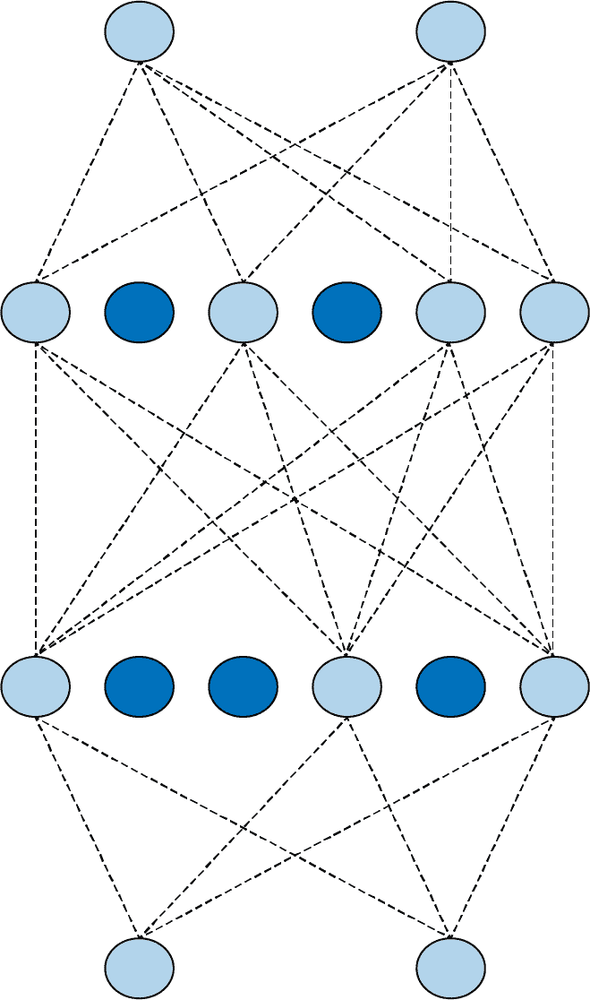

# 第三章：超越基础知识：检测图像中的特征

在第二章中，您学习了如何通过创建一个简单的神经网络，将 Fashion MNIST 数据集的输入像素与表示 10 种服装类型（或类别）的标签进行匹配，从而开始计算机视觉。虽然您创建的网络在检测服装类型方面相当不错，但显然也存在一个缺陷。您的神经网络是在小型单色图像上训练的，每个图像只包含一件服装，并且该服装位于图像的中心。

要将模型提升到下一个水平，您需要能够检测图像中的*特征*。例如，与其仅仅查看图像中的原始像素，如果我们能够有一种方法来将图像过滤成构成元素，会怎么样呢？匹配这些元素，而不是原始像素，将有助于更有效地检测图像的内容。考虑我们在上一章中使用的 Fashion MNIST 数据集——当检测到鞋子时，神经网络可能会被聚集在图像底部的大量暗像素激活，它会将其视为鞋子的鞋底。但是当鞋子不再居中且填满整个框架时，这种逻辑就不成立了。

检测特征的一种方法源自摄影和您可能熟悉的图像处理方法论。如果您曾使用过像 Photoshop 或 GIMP 这样的工具来增强图像，那么您正在使用一种对图像像素起作用的数学滤波器。这些滤波器的另一个名称是*卷积*，通过在神经网络中使用这些滤波器，您将创建一个*卷积神经网络*（CNN）。

在本章中，您将学习如何使用卷积来检测图像中的特征。然后，您将深入探讨基于图像内部特征分类图像。我们将探索增强图像以获取更多特征和迁移学习以利用他人学习的预先存在的特征，并简要探讨使用辍学来优化您的模型。

# 卷积

卷积简单来说是一组权重的滤波器，用于将一个像素与其邻居相乘，从而得到像素的新值。例如，考虑来自 Fashion MNIST 的踝靴图像及其像素值，如图 3-1 所示。


###### 图 3-1. 带有卷积的踝靴

如果我们看一下选择区域中间的像素，我们可以看到它的值为 192（请记住，Fashion MNIST 使用单色图像，像素值从 0 到 255）。上方和左侧的像素值为 0，正上方的像素值为 64，依此类推。

如果我们在同样的 3×3 网格中定义一个滤波器，如下所示的原始值下方，我们可以通过计算一个新值来转换该像素。我们通过将网格中每个像素的当前值乘以滤波器网格中相同位置的值，并将总和起来来实现这一点。这个总和将成为当前像素的新值。然后我们对图像中的所有像素重复此操作。

因此，在这种情况下，虽然选择中心像素的当前值为 192，但应用滤波器后的新值将为：

```
new_val = (-1 * 0) + (0 * 64) + (-2 * 128) + 
     (.5 * 48) + (4.5 * 192) + (-1.5 * 144) + 
     (1.5 * 142) + (2 * 226) + (-3 * 168)
```

这等于 577，这将成为该像素的新值。在图像的每个像素上重复此过程将给我们一个经过滤波的图像。

让我们考虑在更复杂的图像上应用滤波器的影响：内置于 SciPy 中用于简单测试的[攀升图像](https://oreil.ly/wgDN2)。这是一幅 512×512 的灰度图像，显示两个人正在爬楼梯。

在左侧使用具有负值、右侧具有正值和中间为零的滤波器将会除去图像中的大部分信息，除了垂直线条，如您在图 3-2 中所见。


###### 图 3-2。使用滤波器获取垂直线条

同样，对滤波器进行小的更改可以强调水平线条，如在图 3-3 中所示。


###### 图 3-3。使用滤波器获取水平线条

这些例子还显示图像中信息的减少，因此我们可以潜在地*学习*一组减少图像到特征的滤波器，并且这些特征可以像以前一样匹配标签。以前，我们*学习*了用于神经元中匹配输入与输出的参数。同样，可以随着时间的推移学习最佳的滤波器来匹配输入与输出。

当与*池化*结合使用时，我们可以减少图像中的信息量同时保持特征。我们接下来会探讨这一点。

# 池化

池化是在保持图像内容语义的同时消除图像中的像素的过程。最好通过视觉方式来解释。图 3-4 展示了*最大*池化的概念。


###### 图 3-4。演示最大池化

在这种情况下，将左侧的方框视为单色图像中的像素。然后，我们将它们分组为 2×2 的数组，因此在这种情况下，16 个像素被分成四个 2×2 的数组。这些被称为*池*。

然后，我们选择每个组中的*最大*值，并将它们重新组合成一个新的图像。因此，左侧的像素减少了 75%（从 16 到 4），每个池中的最大值构成了新图像。

图 3-5 展示了从图 3-2 获取的上升版本，在应用了最大池化后增强了垂直线条。


###### 图 3-5\. 垂直滤波器和最大池化后的上升

注意过滤后的特征不仅得到了保留，而且进一步增强了。同时，图片的尺寸从 512 × 512 变为了 256 × 256——原始尺寸的四分之一。

###### 注意

还有其他池化的方法，如*min*池化，它从池中取最小像素值，以及*average*池化，它取池中所有值的平均值。

# 实现卷积神经网络

在第二章中，你创建了一个识别时尚图片的神经网络。为了方便起见，这里是完整的代码：

```
`import` tensorflow `as` tf
data = tf.keras.datasets.fashion_mnist

(training_images, training_labels), (test_images, test_labels) = data.load_data()

training_images = training_images / `255.0`
test_images = test_images / `255.0`

model = tf.keras.models.`Sequential`([
      tf.keras.layers.`Flatten`(input_shape=(`28`, `28`)),
      tf.keras.layers.`Dense`(`128`, activation=tf.nn.relu),
      tf.keras.layers.`Dense`(`10`, activation=tf.nn.softmax)
    ])

model.compile(optimizer=`'``adam``'`,
       loss=`'``sparse_categorical_crossentropy``'`,
       metrics=[`'``accuracy``'`])

model.fit(training_images, training_labels, epochs=`5`)
```

要将这个转换为卷积神经网络，我们只需在模型定义中使用卷积层。我们还会添加池化层。

要实现卷积层，你将使用`tf.keras.layers.Conv2D`类型。这个类型接受多个参数，包括在层中使用的卷积数目、卷积的大小、激活函数等。

例如，这里是一个作为神经网络输入层的卷积层：

```
tf.keras.layers.`Conv2D`(`64`, (`3`, `3`), activation=`'``relu``'`, 
            input_shape=(`28`, `28`, `1`)),
```

在这种情况下，我们希望该层学习 64 个卷积。它将随机初始化这些卷积，随着时间的推移，会学习到最适合匹配输入值与标签的滤波值。`(3, 3)`指示了滤波器的大小。之前展示了 3 × 3 的滤波器，这里也是我们在指定的大小。这是最常见的滤波器大小；你可以根据需要进行更改，但通常会看到像 5 × 5 或 7 × 7 这样的奇数轴，因为滤波器会从图像的边缘移除像素，稍后你会看到这一点。

`activation`和`input_shape`参数与之前相同。由于我们在这个示例中使用 Fashion MNIST，因此形状仍然是 28 × 28。但请注意，由于`Conv2D`层设计用于多色彩图像，我们将第三个维度指定为 1，因此我们的输入形状是 28 × 28 × 1。彩色图像通常会将第三个参数设置为 3，因为它们存储为 R、G 和 B 的值。

这里展示了如何在神经网络中使用池化层。通常，在卷积层之后立即进行这样的操作：

```
tf.keras.layers.`MaxPooling2D`(`2`, `2`),
```

在图 3-4 的示例中，我们将图片分割成 2 × 2 的池，并且每个池中选择最大值。这个操作可以通过参数化来定义池的大小。这里展示的是池的参数——`(2, 2)`表示我们的池是 2 × 2 的。

现在让我们来探索使用 CNN 处理 Fashion MNIST 的完整代码：

```
`import` tensorflow `as` tf
data = tf.keras.datasets.fashion_mnist

(training_images, training_labels), (test_images, test_labels) = data.load_data()

training_images = training_images.reshape(`60000`, `28`, `28`, `1`)
training_images = training_images / `255.0`
test_images = test_images.reshape(`10000`, `28`, `28`, `1`)
test_images = test_images / `255.0`

model = tf.keras.models.`Sequential`([
      tf.keras.layers.`Conv2D`(`64`, (`3`, `3`), activation=`'``relu``'`, 
                  input_shape=(`28`, `28`, `1`)),
      tf.keras.layers.`MaxPooling2D`(`2`, `2`),
      tf.keras.layers.`Conv2D`(`64`, (`3`, `3`), activation=`'``relu``'`),
      tf.keras.layers.`MaxPooling2D`(`2`,`2`),
      tf.keras.layers.`Flatten`(),
      tf.keras.layers.`Dense`(`128`, activation=tf.nn.relu),
      tf.keras.layers.`Dense`(`10`, activation=tf.nn.softmax)
    ])

model.compile(optimizer=`'``adam``'`,
       loss=`'``sparse_categorical_crossentropy``'`,
       metrics=[`'``accuracy``'`])

model.fit(training_images, training_labels, epochs=`50`)

model.evaluate(test_images, test_labels)

classifications = model.predict(test_images)
`print`(classifications[`0`])
`print`(test_labels[`0`])
```

在这里有几点需要注意。还记得之前我提到过图像的输入形状必须与`Conv2D`层所期望的匹配，并且我们将其更新为一个 28 × 28 × 1 的图像吗？数据也必须相应地进行重新整形。28 × 28 是图像中的像素数量，1 是颜色通道的数量。通常情况下，灰度图像的颜色通道数为 1，彩色图像的颜色通道数为 3（红、绿、蓝），数字表示该颜色的强度。

因此，在归一化图像之前，我们还需要将每个数组重新整形以具有额外的维度。以下代码将我们的训练数据集从 60,000 个图像（每个 28 × 28，因此是一个 60,000 × 28 × 28 的数组）更改为 60,000 个图像，每个为 28 × 28 × 1：

```
training_images = training_images.reshape(`60000`, `28`, `28`, `1`)
```

我们然后对测试数据集执行相同的操作。

还要注意，在原始的深度神经网络（DNN）中，我们在将输入传递到第一个`Dense`层之前通过了一个`Flatten`层。但在这里的输入层中我们已经失去了这一点—而是直接指定了输入形状。请注意，在进行卷积和池化后，在`Dense`层之前，数据将被压平。

将这个网络与第第二章展示的网络在相同数据上进行相同的 50 个 epoch 训练，我们可以看到准确率显著提高。前一个例子在 50 个 epoch 中的测试集准确率达到了 89%，而这个例子在大约 24 或 25 个 epoch 中就能达到 99% 的准确率。因此我们可以看出，向神经网络添加卷积确实提高了其对图像进行分类的能力。接下来让我们看一下图像在网络中经历的过程，以便更好地理解其工作原理。

# 探索卷积网络

您可以使用 `model.summary` 命令来检查您的模型。当您在我们一直在工作的时尚 MNIST 卷积网络上运行它时，您将看到类似这样的输出：

```
Model: "sequential"
_________________________________________________________________
Layer (type)                 Output Shape       Param # 
=================================================================
conv2d (Conv2D)              (None, 26, 26, 64) 640    
_________________________________________________________________
max_pooling2d (MaxPooling2D) (None, 13, 13, 64) 0     
_________________________________________________________________
conv2d_1 (Conv2D)            (None, 11, 11, 64) 36928   
_________________________________________________________________
max_pooling2d_1 (MaxPooling2 (None, 5, 5, 64)   0     
_________________________________________________________________
flatten (Flatten)            (None, 1600)       0     
_________________________________________________________________
dense (Dense)                (None, 128)        204928  
_________________________________________________________________
dense_1 (Dense)              (None, 10)         1290   
=================================================================
Total params: 243,786
Trainable params: 243,786
Non-trainable params: 0
```

让我们首先看一下输出形状列，以了解这里发生了什么。我们的第一层将有 28 × 28 的图像，并对它们应用 64 个滤波器。但由于我们的滤波器是 3 × 3 的，图像周围将会丢失 1 个像素的边框，从而将我们的整体信息减少到 26 × 26 像素。考虑图 3-6。如果我们将每个方框看作图像中的像素，我们可以进行的第一个可能的滤波器从图表的第二行和第二列开始。在图表的右侧和底部也会发生同样的情况。


###### 图 3-6\. 运行滤波器时丢失像素

因此，当一个 A × B 像素形状的图像通过一个 3 × 3 的滤波器时，其形状将变为 (A–2) × (B–2) 像素。同样地，一个 5 × 5 的滤波器会使其变为 (A–4) × (B–4) 像素，依此类推。由于我们使用的是一个 28 × 28 的图像和一个 3 × 3 的滤波器，我们的输出现在将是 26 × 26。

之后的池化层是 2 × 2，所以图像的尺寸将在每个轴上减半，然后变为（13 × 13）。接下来的卷积层将进一步减少至 11 × 11，然后池化，向下取整，将使图像变为 5 × 5。

因此，当图像通过两个卷积层后，结果将是许多 5 × 5 的图像。有多少？我们可以在 Param #（参数）列中看到。

每个卷积都是一个 3 × 3 的滤波器，再加上一个偏置。还记得我们之前的密集层，每一层都是 Y = mX + c 的形式吗？这非常相似，只不过因为滤波器是 3 × 3，所以有 9 个参数需要学习。考虑到我们定义了 64 个卷积，我们将有 640 个总体参数（每个卷积有 9 个参数加一个偏置，总共是 10 个，总共有 64 个）。

`MaxPooling`层不会学习任何东西，它们只是减少图像大小，因此那里没有学习到的参数——因此报告为 0。

接下来的卷积层有 64 个过滤器，但每个过滤器都与*前*的 64 个过滤器相乘，每个过滤器有 9 个参数。每个新的 64 个过滤器都有一个偏置，因此我们的参数数量应为(64 × (64 × 9)) + 64，这给出了网络需要学习的 36,928 个参数。

如果这让你感到困惑，试着将第一层的卷积次数更改为某个数字——例如 10。你会看到第二层的参数数量变为 5,824，即(64 × (10 × 9)) + 64)。

当我们通过第二个卷积层时，我们的图像是 5 × 5，并且有 64 个。如果我们把这个乘起来，现在我们有 1,600 个值，我们将把它们馈送到 128 个神经元的密集层中。每个神经元都有一个权重和一个偏置，我们有 128 个神经元，所以网络将学习的参数数量是((5 × 5 × 64) × 128) + 128，给我们 204,928 个参数。

我们最后的密集层有 10 个神经元，接收前一个 128 个神经元的输出，因此学习到的参数数量将为(128 × 10) + 10，即 1,290。

然后，总参数数是所有这些参数的总和：243,786。

训练这个网络要求我们学习最佳的这些 243,786 个参数集，以匹配输入图像和它们的标签。这是一个较慢的过程，因为参数更多，但正如我们从结果中看到的，它也建立了一个更准确的模型！

当然，对于这个数据集，我们仍然有限制，即图像是 28 × 28 的单色图像，并且居中。接下来，我们将看看如何使用卷积来探索一个更复杂的数据集，包括马和人的彩色图片，然后尝试确定图像中是否包含其中一种。在这种情况下，主题不会像时尚 MNIST 那样总是居中显示，因此我们将依赖卷积来识别独特的特征。

# 建立一个 CNN 来区分马和人

在本节中，我们将探索比时尚 MNIST 分类器更复杂的场景。我们将扩展我们对卷积和卷积神经网络的了解，以尝试对那些特征位置不总是相同的图像内容进行分类。我为此创建了马或人类数据集。

## 马或人类数据集

本节的数据集包含了一千多个 300 × 300 像素的图像，大约一半是马，一半是人类，展示了不同的姿势。你可以在图 3-7 中看到一些示例。


###### 图 3-7\. 马和人类

你可以看到，主体的朝向和姿势各不相同，图像的构图也有所不同。以两匹马为例，它们的头部朝向不同，一匹放大显示整个动物，而另一匹则放大显示头部和部分身体。同样，人物的光线不同，皮肤色调不同，姿势也各异。男子双手叉腰，而女子则伸出双手。图像还包括背景，如树木和海滩，因此分类器必须确定图像的哪些部分是决定马是马、人是人的重要特征，而不受背景影响。

虽然先前的例子，如预测 Y = 2X – 1 或分类小型单色服装图像，*可能*可以通过传统编码实现，但显然这要困难得多，你已经跨入机器学习解决问题的领域。

一个有趣的副产品是这些图像都是计算机生成的。理论上，发现在计算机生成图像中的特征应该也适用于真实图像。你将在本章后面看到这个理论实际效果如何。

## Keras 的 ImageDataGenerator

到目前为止，你一直在使用的时尚 MNIST 数据集带有标签。每个图像文件都有一个关联的文件，其中包含标签详细信息。许多基于图像的数据集没有这种标签，马或人类数据集也不例外。相反，图像被分类到每种类型的子目录中。在 TensorFlow 的 Keras 中，一个名为 `ImageDataGenerator` 的工具可以利用这种结构来*自动*为图像分配标签。

要使用 `ImageDataGenerator`，你只需确保你的目录结构有一组带有命名子目录，每个子目录作为一个标签。例如，马或人类数据集提供了一组 ZIP 文件，一个是训练数据（1000 多张图像），另一个是验证数据（256 张图像）。当你下载并解压它们到用于训练和验证的本地目录时，请确保它们的文件结构类似于图 3-8 中的结构。

下面是获取训练数据并将其提取到适当命名的子目录中的代码，如图所示：

```
`import` urllib.request
`import` zipfile

url = `"``https://storage.googleapis.com/laurencemoroney-blog.appspot.com/`
                                            `horse``-``or``-``human``.``zip``"`
file_name = `"``horse-or-human.zip``"`
training_dir = `'``horse-or-human/training/``'`
urllib.request.urlretrieve(url, file_name)

zip_ref = zipfile.`ZipFile`(file_name, `'``r``'`)
zip_ref.extractall(training_dir)
zip_ref.close()
```


###### 图 3-8。确保图像位于命名的子目录中

下面是获取训练数据并将其提取到适当命名的子目录中的代码，如图所示：

```
`import` urllib.request
`import` zipfile

url = `"``https://storage.googleapis.com/laurencemoroney-blog.appspot.com/`
                                            `horse``-``or``-``human``.``zip``"`
file_name = `"``horse-or-human.zip``"`
training_dir = `'``horse-or-human/training/``'`
urllib.request.urlretrieve(url, file_name)

zip_ref = zipfile.`ZipFile`(file_name, `'``r``'`)
zip_ref.extractall(training_dir)
zip_ref.close()
```

这只是下载训练数据的 ZIP 文件，并将其解压缩到一个目录*horse-or-human/training*中（我们将很快处理下载验证数据）。这是将包含图像类型子目录的父目录。

现在，要使用`ImageDataGenerator`，我们只需使用以下代码：

```
`from` tensorflow.keras.preprocessing.image `import` `ImageDataGenerator`

`# All images will be rescaled by 1./255`
train_datagen = `ImageDataGenerator`(rescale=`1`/`255`)

train_generator = train_datagen.flow_from_directory(
  training_dir,
  target_size=(`300`, `300`),
  class_mode=`'``binary``'`
)
```

首先，我们创建一个名为`train_datagen`的`ImageDataGenerator`实例。然后，我们指定它将从一个目录中流动生成训练过程中的图像。目录是之前指定的*training_dir*。我们还指定了一些关于数据的超参数，比如目标大小——在这种情况下是 300 × 300 像素，类别模式是`binary`。如果只有两种类型的图像（就像这种情况），通常模式是`binary`，如果超过两种则是`categorical`。

## 《马或人的 CNN 架构》

当设计用于分类图像的架构时，此数据集与 Fashion MNIST 数据集之间有几个重要的区别需要考虑。首先，图像要大得多——300 × 300 像素，因此可能需要更多的层。其次，图像是全彩色的，而不是灰度的，所以每个图像将有三个通道而不是一个。第三，只有两种图像类型，因此我们可以使用只有一个输出神经元的二元分类器，其中一个类逼近 0，另一个逼近 1。在探索这种架构时，请记住这些考虑因素：

```
`model` `=` `tf``.``keras``.``models``.`Sequential`(``[`
 `tf``.``keras``.``layers``.`Conv2D`(``16``,` `(``3``,``3``)``,` `activation``=``'``relu``'` , 
              input_shape=(`300``,` `300``,` `3``)``)``,`
 `tf``.``keras``.``layers``.`MaxPooling2D`(``2``,` `2``)``,`
 `tf``.``keras``.``layers``.`Conv2D`(``32``,` `(``3``,``3``)``,` `activation``=``'``relu``'`),
 `tf``.``keras``.``layers``.`MaxPooling2D`(``2``,``2``)``,`
 `tf``.``keras``.``layers``.`Conv2D`(``64``,` `(``3``,``3``)``,` `activation``=``'``relu``'`),
 `tf``.``keras``.``layers``.`MaxPooling2D`(``2``,``2``)``,`
 `tf``.``keras``.``layers``.`Conv2D`(``64``,` `(``3``,``3``)``,` `activation``=``'``relu``'`),
 `tf``.``keras``.``layers``.`MaxPooling2D`(``2``,``2``)``,`
 `tf``.``keras``.``layers``.`Conv2D`(``64``,` `(``3``,``3``)``,` `activation``=``'``relu``'`),
 `tf``.``keras``.``layers``.`MaxPooling2D`(``2``,``2``)``,`
 `tf``.``keras``.``layers``.`Flatten`(``)``,`
 `tf``.``keras``.``layers``.`Dense`(``512``,` `activation``=``'``relu``'``)``,`
 `tf``.``keras``.``layers``.`Dense`(``1``,` `activation``=``'``sigmoid``'``)`
`]``)`
```

这里有几点需要注意。首先，这是第一层。我们定义了 16 个 3 × 3 的滤波器，但图像的输入形状是(300, 300, 3)。请记住，这是因为我们的输入图像是 300 × 300，并且是彩色的，所以有三个通道，而不是像我们之前使用的单色 Fashion MNIST 数据集中的一个通道。

另一端，请注意输出层只有一个神经元。这是因为我们使用的是二元分类器，如果我们使用 sigmoid 函数激活它，我们可以获得二元分类的结果。sigmoid 函数的目的是将一组值朝向 0，另一组值朝向 1，这非常适合二元分类。

接下来，请注意我们堆叠了几个更多的卷积层。我们之所以这样做，是因为我们的图像源非常大，我们希望随着时间的推移有许多更小的图像，每个都突出显示特征。如果我们查看`model.summary`的结果，我们将看到这一点在实际中的运作方式：

```
=================================================================
conv2d (Conv2D)              (None, 298, 298, 16)  448    
_________________________________________________________________
max_pooling2d (MaxPooling2D) (None, 149, 149, 16)  0     
_________________________________________________________________
conv2d_1 (Conv2D)            (None, 147, 147, 32)  4640   
_________________________________________________________________
max_pooling2d_1 (MaxPooling2 (None, 73, 73, 32)    0     
_________________________________________________________________
conv2d_2 (Conv2D)            (None, 71, 71, 64)    18496   
_________________________________________________________________
max_pooling2d_2 (MaxPooling2 (None, 35, 35, 64)    0     
_________________________________________________________________
conv2d_3 (Conv2D)            (None, 33, 33, 64)    36928   
_________________________________________________________________
max_pooling2d_3 (MaxPooling2 (None, 16, 16, 64)    0     
_________________________________________________________________
conv2d_4 (Conv2D)            (None, 14, 14, 64)    36928   
_________________________________________________________________
max_pooling2d_4 (MaxPooling2 (None, 7, 7, 64)      0     
_________________________________________________________________
flatten (Flatten)            (None, 3136)          0     
_________________________________________________________________
dense (Dense)                (None, 512)           1606144  
_________________________________________________________________
dense_1 (Dense)              (None, 1)             513    
=================================================================
Total params: 1,704,097
Trainable params: 1,704,097
Non-trainable params: 0
_________________________________________________________________
```

注意，通过卷积层和池化层处理数据后，最终变为 7 × 7 个项目。理论上，这些将是激活的特征图，相对简单，仅包含 49 个像素。然后可以将这些特征图传递给密集神经网络，以将它们与相应的标签匹配。

当然，这会导致我们比之前的网络拥有更多的参数，因此训练速度会变慢。通过这种架构，我们将学习 170 万个参数。

要训练网络，我们将需要使用损失函数和优化器对其进行编译。在这种情况下，损失函数可以是二元交叉熵损失函数，因为只有两类，正如其名称所示，这是为这种情况设计的损失函数。我们可以尝试一个新的优化器，*均方根传播*（`RMSprop`），它接受一个学习率（`lr`）参数，允许我们调整学习率。以下是代码：

```
`model``.``compile``(``loss``=`'binary_crossentropy'`,`
 `optimizer``=``RMSprop``(``lr``=``0.001``)``,`
 `metrics``=``[`'accuracy'`]``)`
```

我们通过使用`fit_generator`并将之前创建的`training_generator`传递给它进行训练：

```
history = model.fit_generator(
  train_generator,
  epochs=`15`
)
```

这个示例将在 Colab 上运行，但如果您想在自己的机器上运行它，请确保使用 `pip install` pillow 安装了 `Pillow` 库。

注意，使用 TensorFlow Keras，您可以使用`model.fit`将训练数据拟合到训练标签上。当使用生成器时，旧版本要求您使用`model.fit_generator`。TensorFlow 的较新版本将允许您使用任何一种方式。

在仅 15 个 epoch 中，这种架构在训练集上给我们提供了非常令人印象深刻的 95%+ 的准确率。当然，这仅限于训练数据，并不能说明在网络之前没有见过的数据上的表现。

接下来，我们将使用生成器添加验证集，并测量其性能，以便为我们提供模型在实际生活中的表现提供良好的指标。

## 将验证添加到马或人类数据集

要添加验证，您需要一个与训练集分开的验证数据集。在某些情况下，您将获得一个主数据集，需要自行分割，但在马或人的情况下，有一个可以下载的单独验证集。

###### 注意

您可能会想为什么我们在这里谈论的是验证数据集，而不是测试数据集，它们是否相同。对于像前几章中开发的简单模型，将数据集分为两部分，一部分用于训练，一部分用于测试，通常就足够了。但对于像我们正在构建的这样更复杂的模型，您需要创建单独的验证集和测试集。它们有什么区别呢？*训练*数据是用于教网络如何将数据和标签匹配在一起的数据。*验证*数据在您训练网络时用于查看网络在以前未见过的数据上的表现*，即它不用于将数据与标签匹配，而是用于检查拟合的效果如何。*测试*数据在训练后用于查看网络在以前从未见过的数据上的表现。有些数据集自带三分法分割，其他情况下，您需要将测试集分成验证集和测试集两部分。在这里，您将下载一些额外的图像来测试模型。

您可以使用与训练图像相似的代码来下载验证集，并将其解压缩到不同的目录中：

```
validation_url = `"``https://storage.googleapis.com/laurencemoroney-blog.appspot.com`
                                                `/``validation``-``horse``-``or``-``human``.``zip``"`

validation_file_name = `"``validation-horse-or-human.zip``"`
validation_dir = `'``horse-or-human/validation/``'`
urllib.request.urlretrieve(validation_url, validation_file_name)

zip_ref = zipfile.`ZipFile`(validation_file_name, `'``r``'`)
zip_ref.extractall(validation_dir)
zip_ref.close()
```

一旦您有了验证数据，您可以设置另一个`ImageDataGenerator`来管理这些图像：

```
validation_datagen = `ImageDataGenerator`(rescale=`1`/`255`)

validation_generator = train_datagen.flow_from_directory(
  validation_dir,
  target_size=(`300`, `300`),
  class_mode=`'``binary``'`
)
```

要让 TensorFlow 为您执行验证，您只需更新`model.fit_generator`方法，指示您想使用验证数据来逐个 epoch 测试模型。您可以通过使用`validation_data`参数并传递刚刚构建的验证生成器来实现这一点：

```
history = model.fit_generator(
  train_generator,
  epochs=`15`,
  validation_data=validation_generator
)
```

训练了 15 个 epochs 后，您应该看到您的模型在训练集上达到了 99%+ 的准确率，但在验证集上只有约 88%。这表明模型出现了过拟合，就像我们在前一章中看到的一样*。*

尽管它训练的图像数量很少，而且这些图像多种多样，但性能并不差。您开始因为缺乏数据而遇到瓶颈，但有一些技术可以提高模型的性能。我们将在本章后面探讨这些技术，但在此之前让我们看看如何*使用*这个模型。

## 测试马或人类图像

能够构建模型当然很好，但当然您也想尝试一下。在我开始我的 AI 之旅时，我主要的挫折之一是，我可以找到很多代码来展示如何构建模型，以及这些模型的表现图表，但很少有代码可以帮助我自己检验模型的性能。我会尽量避免在本书中重复这种情况！

使用 Colab 可能是测试模型最简单的方法。我在 GitHub 上提供了一个《马或人类》的笔记本，您可以直接在[Colab](http://bit.ly/horsehuman)中打开。

一旦你训练好了模型，你将看到一个称为“运行模型”的部分。在运行之前，找几张马或人类的图片并下载到你的电脑上。[Pixabay.com](http://Pixabay.com)是一个非常好的免费图像网站。最好先准备好你的测试图片，因为在你搜索时节点可能会超时。

图 3-9 展示了我从 Pixabay 下载用于测试模型的几张马和人类的图片。


###### 图 3-9\. 测试图片

当它们被上传时，正如你在图 3-10 中所看到的，模型正确地将第一张图像分类为人类，第三张图像分类为马，但是中间的图像尽管明显是人类，却被错误地分类为马！


###### 图 3-10\. 执行模型

你也可以同时上传多张图片，让模型为它们所有做出预测。你可能注意到它倾向于过拟合到马的一面。如果人类没有完全摆好姿势——也就是说，你看不到他们的全身——它可能会偏向马的一面。这就是这种情况发生的原因。第一个人类模型摆好了姿势，图像类似于数据集中许多姿势的样本，因此能够正确分类她。第二个模型面对相机，但只有她的上半身在图像中。没有训练数据看起来像这样，所以模型无法正确识别她。

现在让我们来探索代码，看看它在做什么。也许最重要的部分就是这一段：

```
img = image.load_img(path, target_size=(`300`, `300`))
x = image.img_to_array(img)
x = np.expand_dims(x, axis=`0`)
```

在这里，我们正在从 Colab 写入的路径加载图像。请注意，我们指定目标尺寸为 300 × 300。上传的图像可以是任何形状，但如果要将它们输入模型，它们*必须*是 300 × 300，因为这是模型训练识别的尺寸。因此，第一行代码加载图像并将其*调整大小*为 300 × 300。

下一行代码将图像转换为 2D 数组。然而，模型期望一个 3D 数组，如模型架构中的`input_shape`所示。幸运的是，Numpy 提供了一个`expand_dims`方法来处理这个问题，并允许我们轻松地向数组添加新的维度。

现在我们有了一个 3D 数组中的图像，我们只需确保它被垂直堆叠，以便与训练数据的形状相同：

```
image_tensor = np.vstack([x])
```

有了我们格式正确的图像，分类就变得很容易：

```
classes = model.predict(image_tensor)
```

模型返回一个包含分类的数组。因为在这种情况下只有一个分类，所以实际上是一个包含数组的数组。你可以在图 3-10 中看到这一点，在第一个（人类）模型中它看起来像`[[1.]]`。

现在只需要检查该数组中第一个元素的值。如果大于 0.5，我们就在看一个人：

```
`if` classes[`0`]>`0.5`:
  `print`(fn + `"` `is a human``"`)
 `else`:
  `print`(fn + `"` `is a horse``"`)
```

在这里有几个重要的观点需要考虑。首先，即使网络是在合成的计算机生成的图像上训练的，它在识别真实照片中的马或人方面表现出色。这可能是一个好处，因为你可能不需要成千上万张照片来训练一个模型，而可以相对廉价地用 CGI 来完成。

但是这个数据集也展示了你将面临的一个根本性问题。你的训练集不可能希望能够代表模型在野外可能面对的*每一种*情况，因此模型总会在某种程度上对训练集过度专注。这里展示的一个清晰简单的例子是，在图 3-9 中心的人被错误分类。训练集中没有包含这种姿势的人物，因此模型没有“学到”人可以看起来像那样。结果，它有可能将该图像视为马，而在这种情况下确实如此。

解决方案是什么？一个明显的解决方案是增加更多的训练数据，包括那些在特定姿势下的人和最初未被代表的其他数据。但并非总是可能的。幸运的是，在 TensorFlow 中有一个巧妙的技巧，你可以使用它来虚拟扩展你的数据集——它被称为*图像增强*，我们接下来会探讨这个技术。

# 图像增强

在前一节中，你构建了一个基于相对较小数据集训练的马或人分类器模型。因此，你很快开始遇到一些问题，比如无法正确分类一些之前未见过的图像，例如因为训练集中没有包含人物在那个姿势下的图像而导致误分类。

处理这类问题的一种方法是使用图像增强技术。这种技术的核心思想是，在 TensorFlow 加载数据时，它可以通过一些转换来修改现有数据，从而创建额外的新数据。例如，请看图 3-11。尽管数据集中没有类似右侧女性的内容，但左侧的图像有些相似。


###### 图 3-11\. 数据集相似性

因此，如果你能够例如在训练时放大左侧图像，如图 3-12，你将增加模型正确分类右侧图像为人的几率。


###### 图 3-12\. 放大训练集数据

以类似的方式，你可以通过各种其他变换来扩展训练集，包括：

+   旋转

+   水平移位

+   垂直移位

+   剪切

+   放大

+   翻转

因为你一直在使用`ImageDataGenerator`来加载图像，你已经看到它已经进行了一个转换，即当它像这样对图像进行了标准化：

```
train_datagen = `ImageDataGenerator`(rescale=`1`/`255`)
```

`ImageDataGenerator`中也轻松获得其他的转换方法，例如，你可以做这样的事情：

```
`train_datagen` `=` ImageDataGenerator`(`
 `rescale``=``1.``/``255``,`
 `rotation_range``=``40``,`
 `width_shift_range``=``0.2``,`
 `height_shift_range``=``0.2``,`
 `shear_range``=``0.2``,`
 `zoom_range``=``0.2``,`
 `horizontal_flip``=``True``,`
 `fill_mode``=``'``nearest``'`
`)`
```

在这里，除了重新缩放图像以进行标准化之外，您还在进行以下操作：

+   随机将每个图像向左或向右旋转最多 40 度

+   将图像垂直或水平平移最多 20%

+   将图像剪切最多 20%

+   将图像放大最多 20%

+   随机水平或垂直翻转图像

+   在移动或剪切后使用最近邻填充任何丢失的像素

当您使用这些参数重新训练时，您会注意到训练时间更长，因为所有的图像处理。此外，由于以前过度拟合大部分统一的数据集，您的模型准确性可能不如以前那样高。

在我的情况下，当使用这些增强技术进行训练时，我的准确率从 99%下降到了 85%，在 15 个 epochs 后，验证准确率略高，达到了 89%。（这表明模型略有*欠拟合*，因此参数可能需要稍作调整。）

那么图 3-9 中先前误分类的图像怎么样？这次它分类正确了。由于图像增强，训练集现在对于模型来说已经足够覆盖，以便了解这个特定的图像也是一个人类（见图 3-13）。这只是一个数据点，并不一定代表真实数据的结果，但这是朝着正确方向迈出的一小步。


###### 图 3-13\. 放大的女性现在被正确分类

如您所见，即使是像马或人这样的相对较小的数据集，您也可以开始构建一个相当不错的分类器。使用更大的数据集可以进一步提升这一过程。另一种改进模型的技术是使用已经在其他地方学习过的特征。许多研究人员使用庞大的资源（数百万张图片）和经过数千类别训练的庞大模型共享了他们的模型，利用所谓的*迁移学习*，您可以使用这些模型学到的特征并将其应用到您的数据上。接下来我们将探讨这一点！

# 迁移学习

正如我们在本章中已经看到的那样，使用卷积来提取特征可以成为识别图像内容的强大工具。然后，将生成的特征图馈送到神经网络的密集层中，将其与标签匹配，从而给出一种更准确的确定图像内容的方式。使用这种方法，结合简单、快速训练的神经网络和一些图像增强技术，我们构建了一个模型，当在一个非常小的数据集上进行训练时，它在区分马和人方面的准确率达到了 80-90%。

但是我们可以使用一种称为迁移学习的方法来进一步改进我们的模型。迁移学习背后的思想很简单：不是从头开始学习我们数据集的一组滤波器，为什么不使用在比我们能够“负担得起”的更大数据集上学习的一组滤波器？我们可以将这些放入我们的网络中，然后使用预先学习的滤波器训练我们的数据集的模型。例如，我们的马或人类数据集只有两类。我们可以使用一个已经为一千个类别预训练的现有模型，但在某个时候，我们将不得不丢弃一些现有网络并添加层，以便让我们有一个两类分类器。

图 3-14 展示了像我们这样的分类任务的 CNN 架构可能看起来像什么。我们有一系列卷积层，这些层导致一个密集层，然后导致一个输出层。


###### Figure 3-14\. 卷积神经网络架构

我们已经看到，使用这种架构我们能够构建一个相当不错的分类器。但是通过迁移学习，如果我们能够从另一个模型中获取预先学习的层，并且将它们冻结或锁定，以便它们不能再训练，然后像在图 3-15 中那样将它们放在我们的模型顶部，那会怎么样？


###### Figure 3-15\. 通过迁移学习从另一个架构获取层

当我们考虑到，一旦它们被训练，所有这些层都只是一组数字，指示着滤波器值、权重和偏差以及已知的架构（每层的滤波器数、滤波器大小等），重用它们的想法就非常简单了。

让我们看看这在代码中的表现。有许多已经来自各种来源的预训练模型。我们将使用来自谷歌的流行的 Inception V3 模型的第三版，该模型在名为 ImageNet 的数据库中训练了一百多万张图像。它有数十个层，并且可以将图像分类为一千个类别。有一个保存了预训练权重的模型可供使用。要使用它，我们只需下载权重，创建一个 Inception V3 架构的实例，然后像这样加载权重：

```
`from` `tensorflow.keras.applications.inception_v3` `import`  InceptionV3

`weights_url` `=` `"``https://storage.googleapis.com/mledu-`
`datasets``/``inception_v3_weights_tf_dim_ordering_tf_kernels_notop``.``h5``"`

`weights_file` `=` `"``inception_v3.h5``"`
`urllib``.``request``.``urlretrieve``(``weights_url``,` `weights_file``)`

`pre_trained_model` `=` InceptionV3`(``input_shape``=``(``150``,` `150``,` `3``)``,`
 `include_top``=``False``,`
 `weights``=``None``)`

`pre_trained_model``.``load_weights``(``weights_file``)`
```

现在我们有一个完整的预训练 Inception 模型。如果你想检查它的架构，可以这样做：

```
pre_trained_model.summary()
```

请注意——它非常庞大！不过，浏览一下它，看看各层及其名称是很有用的。我喜欢使用名为`mixed7`的那个，因为它的输出很好很小——7 × 7 的图像——但请随意尝试其他选项。

接下来，我们将冻结整个网络，使其不可重新训练，然后设置一个变量，指向`mixed7`的输出，作为我们希望裁剪的网络位置。我们可以使用以下代码来实现这一点：

```
`for` layer `in` pre_trained_model.layers:
  layer.trainable = `False`

last_layer = pre_trained_model.get_layer(`'``mixed7``'`)
`print`(`'``last layer output shape:` `'`, last_layer.output_shape)
last_output = last_layer.output
```

请注意，我们打印最后一层的输出形状，并且您将看到此时我们获得了 7 × 7 的图像。这表明，当图像通过`mixed7`层时，来自滤波器的输出图像大小为 7 × 7，因此它们非常易于管理。再次强调，您不必选择特定的层；欢迎您尝试其他层。

现在让我们看看如何在这之下添加我们的密集层：

```
# Flatten the output layer to 1 dimension
`x` `=` `layers``.``Flatten``(``)``(``last_output``)`
# Add a fully connected layer with 1,024 hidden units and ReLU activation
`x` `=` `layers``.``Dense``(``1024``,` `activation``=``'``relu``'``)``(``x``)`
# Add a final sigmoid layer for classification
`x` `=` `layers``.``Dense``(``1``,` `activation``=``'``sigmoid``'``)``(``x``)`
```

只需创建一组来自最后输出的平坦层，因为我们将把结果馈送到密集层中。然后，我们添加一个包含 1,024 个神经元的密集层，以及一个包含 1 个神经元的输出密集层。

现在，我们可以简单地定义我们的模型，即我们预训练模型的输入，然后是我们刚刚定义的`x`。然后，我们按照通常的方式进行编译：

```
model = `Model`(pre_trained_model.input, x)

model.compile(optimizer=`RMSprop`(lr=`0.0001`),
       loss=`'``binary_crossentropy``'`,
       metrics=[`'``acc``'`])
```

在这个架构上训练模型 40 个 epoch 后，准确率达到了 99%以上，验证准确率达到了 96%以上（见图 3-16）。


###### 图 3-16\. 使用迁移学习训练马或人分类器

这里的结果比我们以前的模型要好得多，但您可以继续微调和改进它。您还可以探索模型在更大的数据集上的工作方式，比如来自 Kaggle 的著名[Dogs vs. Cats](https://www.kaggle.com/c/dogs-vs-cats)数据集。这是一个包含 25,000 张猫和狗图片的极为多样的数据集，通常被主体部分遮挡——例如，如果它们被人类抱着。

使用与之前相同的算法和模型设计，您可以在 Colab 上使用 GPU 每个 epoch 大约 3 分钟来训练 Dogs vs. Cats 分类器。对于 20 个 epoch，这相当于大约 1 小时的训练时间。

在像图 3-17 中那样非常复杂的图片上进行测试时，这个分类器全部正确。我选择了一张狗耳朵像猫的图片，以及一张背对着的狗的图片。这两张猫的图片都是非典型的。


###### 图 3-17\. 正确分类的不寻常的狗和猫

当加载到模型中时，位于右下角的那只猫，眼睛闭着，耳朵朝下，舌头伸出，正在洗爪，其结果显示在图 3-18 中。您可以看到，它给出了一个非常低的值（4.98 × 10^(–24)），这表明网络几乎可以确定它是一只猫！


###### 图 3-18\. 分类洗爪的猫

您可以在本书的[GitHub 代码库](https://github.com/lmoroney/tfbook)中找到 Horses or Humans 和 Dogs vs. Cats 分类器的完整代码。

# 多类别分类

到目前为止，所有的例子中，你一直在构建*二元*分类器——即在两个选项之间进行选择（马或人类，猫或狗）。当构建多类分类器时，模型几乎相同，但有一些重要的不同之处。不再是一个 sigmoid 激活的单个神经元，或者两个二进制激活的神经元，你的输出层现在将需要*n*个神经元，其中*n*是你想分类的类别数。你还必须将损失函数更改为适合多类别的函数。例如，对于到目前为止在本章中构建的二元分类器，你的损失函数是二元交叉熵，如果要将模型扩展到多个类别，则应改用分类交叉熵。如果你使用`ImageDataGenerator`来提供图像，标签将自动完成，因此多个类别将与二元类别相同——`ImageDataGenerator`将根据子目录的数量进行标记。

比如说，考虑石头剪刀布游戏。如果你想训练一个数据集来识别不同的手势，你需要处理三个类别。幸运的是，这里有一个[简单的数据集](https://oreil.ly/VHhmS)，你可以用来做这个。

这里有两个下载：一个是训练集，包含许多不同的手，大小、形状、颜色以及指甲油等细节各异；另一个是测试集，同样包含多样化的手，但没有在训练集中出现过的。

你可以在图 3-19 中看到一些示例。


###### 图 3-19\. 石头/剪刀/布手势示例

使用数据集很简单。下载并解压缩它——排序后的子目录已经在 ZIP 文件中存在——然后用它初始化一个`ImageDataGenerator`：

```
!wget --no-check-certificate \
 https://storage.googleapis.com/laurencemoroney-blog.appspot.com/rps.zip \
 -O /tmp/rps.zip
local_zip = `'``/tmp/rps.zip``'`
zip_ref = zipfile.`ZipFile`(local_zip, `'``r``'`)
zip_ref.extractall(`'``/tmp/``'`)
zip_ref.close()
TRAINING_DIR = `"``/tmp/rps/``"`
training_datagen = `ImageDataGenerator`(
  rescale = `1.`/`255`,
  rotation_range=`40`,
  width_shift_range=`0.2`,
  height_shift_range=`0.2`,
  shear_range=`0.2`,
  zoom_range=`0.2`,
  horizontal_flip=`True`,
  fill_mode=`'``nearest``'`
)
```

注意，但是，当你从这里设置数据生成器时，你必须指定类别模式为分类，以便`ImageDataGenerator`可以使用超过两个子目录：

```
train_generator = training_datagen.flow_from_directory(
  TRAINING_DIR,
  target_size=(150,150),
 `class_mode``=``'``categorical``'`
)
```

在定义模型时，要注意输入和输出层，确保输入匹配数据的形状（在本例中为 150 × 150），输出匹配类别数（现在是三个）：

```
model = tf.keras.models.Sequential([
  # Note the input shape is the desired size of the image: 
  # 150x150 with 3 bytes color
  # This is the first convolution
  tf.keras.layers.Conv2D(64, (3,3), activation='relu',`input_shape``=``(``150``,` `150``,` `3``)``)``,`
  tf.keras.layers.MaxPooling2D(2, 2),
  # The second convolution
  tf.keras.layers.Conv2D(64, (3,3), activation='relu'),
  tf.keras.layers.MaxPooling2D(2,2),
  # The third convolution
  tf.keras.layers.Conv2D(128, (3,3), activation='relu'),
  tf.keras.layers.MaxPooling2D(2,2),
  # The fourth convolution
  tf.keras.layers.Conv2D(128, (3,3), activation='relu'),
  tf.keras.layers.MaxPooling2D(2,2),
  # Flatten the results to feed into a DNN
  tf.keras.layers.Flatten(),
  # 512 neuron hidden layer
  tf.keras.layers.Dense(512, activation='relu'),
 `tf``.``keras``.``layers``.``Dense``(``3``,` `activation``=``'``softmax``'``)`
])
```

最后，在编译模型时，确保使用分类损失函数，如分类交叉熵。二元交叉熵不适用于超过两类：

```
model.compile(`loss` `=` `'``categorical_crossentropy``'`, optimizer='rmsprop', 
       metrics=['accuracy'])
```

训练过程与之前相同：

```
history = model.fit(train_generator, epochs=`25`, 
          validation_data = validation_generator, verbose = `1`)
```

测试预测代码需要进行一些更改。现在有三个输出神经元，它们将为预测的类输出接近 1 的值，对于其他类输出接近 0 的值。请注意，所使用的激活函数是`softmax`，这将确保所有三个预测的总和为 1。例如，如果模型对某些事物感到非常不确定，可能会输出 0.4, 0.4, 0.2，但如果它对某些事物非常确定，可能会得到 0.98, 0.01, 0.01。

同时使用`ImageDataGenerator`时，请注意类是按字母顺序加载的——因此，虽然您可能期望输出神经元按游戏名称的顺序排列，但实际上顺序将是 Paper，Rock，Scissors。

在 Colab 笔记本中尝试预测的代码如下所示。这与您之前看到的非常相似：

```
`import` numpy `as` np
`from` google.colab `import` files
`from` keras.preprocessing `import` image

uploaded = files.upload()

`for` fn `in` uploaded.keys():

  `# predicting images`
  path = fn
  img = image.load_img(path, target_size=(`150`, `150`))
  x = image.img_to_array(img)
  x = np.expand_dims(x, axis=`0`)

  images = np.vstack([x])
  classes = model.predict(images, batch_size=`10`)
  `print`(fn)
  `print`(classes)
```

请注意，它不会解析输出，只会打印类。图 3-20 展示了其使用情况。


###### 图 3-20。测试石头/纸/剪刀分类器

您可以从文件名中看出图像的内容。*Paper1.png* 最终变成了`[1, 0, 0]`，意味着第一个神经元被激活，其他两个没有被激活。类似地，*Rock1.png* 变成了`[0, 1, 0]`，第二个神经元被激活，而*Scissors2.png* 则是`[0, 0, 1]`。请记住，神经元按照标签的字母顺序排列！

一些可用于测试数据集的图像可以[下载](https://oreil.ly/dEUpx)。当然，您也可以尝试您自己的图像。请注意，训练图像都是在纯白色背景下完成的，因此如果您拍摄的照片背景有很多细节，可能会产生一些混淆。

# Dropout 正则化

在本章的前面部分，我们讨论了过拟合问题，即网络可能对特定类型的输入数据过于专门化，而对其他数据表现不佳。一种克服这个问题的技术是使用*dropout 正则化*。

当神经网络进行训练时，每个单独的神经元都会对后续层中的神经元产生影响。随着时间的推移，特别是在更大的网络中，一些神经元可能会变得过于专门化，这可能会导致整个网络变得过于专门化并导致过拟合。此外，相邻的神经元可能会具有相似的权重和偏差，如果没有监控，这可能会导致模型过于专门化于这些神经元激活的特征。

例如，考虑图 3-21 中的神经网络，其中有 2、6、6 和 2 个神经元层。中间层的神经元可能会具有非常相似的权重和偏差。


###### 图 3-21。一个简单的神经网络

在训练过程中，如果移除了随机数量的神经元并忽略它们，它们对下一层神经元的贡献会被暂时阻断（图 3-22）。



###### 图 3-22\. 带有随机失活的神经网络

这降低了神经元过度专门化的可能性。网络仍然会学习相同数量的参数，但它应该更擅长泛化，即对不同的输入更具弹性。

###### 注意

Nitish Srivastava 等人在其 2014 年的论文 [“Dropout: A Simple Way to Prevent Neural Networks from Overfitting”](https://oreil.ly/673CJ) 中提出了失活的概念。

要在 TensorFlow 中实现失活，您可以像这样使用简单的 Keras 层：

```
tf.keras.layers.Dropout(`0.2`),
```

这将在指定层中随机删除指定百分比的神经元（这里是 20%）。请注意，可能需要一些实验才能找到适合您网络的正确百分比。

作为展示这一点的简单示例，请考虑来自第二章的时尚 MNIST 分类器。我将更改网络定义，添加更多层，如下所示：

```
model = tf.keras.models.`Sequential`([
      tf.keras.layers.`Flatten`(input_shape=(`28`,`28`)),
      tf.keras.layers.`Dense`(`256`, activation=tf.nn.relu),
      tf.keras.layers.`Dense`(`128`, activation=tf.nn.relu),
      tf.keras.layers.`Dense`(`64`, activation=tf.nn.relu),
      tf.keras.layers.`Dense`(`10`, activation=tf.nn.softmax)
    ])
```

对这个进行 20 个 epoch 的训练，在训练集上达到了约 94% 的准确率，在验证集上约为 88.5%。这是过拟合的潜在迹象。

在每个密集层后引入失活看起来像这样：

```
model = tf.keras.models.Sequential([
 tf.keras.layers.Flatten(input_shape=(28,28)),
 tf.keras.layers.Dense(256, activation=tf.nn.relu),
 **tf.keras.layers.**Dropout(0.2),
 tf.keras.layers.Dense(128, activation=tf.nn.relu),
 **tf.keras.layers.**Dropout(0.2),
 tf.keras.layers.Dense(64, activation=tf.nn.relu),
 **tf.keras.layers.**Dropout(0.2),
 tf.keras.layers.Dense(10, activation=tf.nn.softmax)
 ])
```

当该网络在相同数据上相同时期训练时，训练集上的准确率下降到约 89.5%。验证集上的准确率保持大致相同，约为 88.3%。这些值更接近彼此；引入失活不仅表明了过拟合的发生，还表明使用失活可以通过确保网络不过于专注于训练数据来消除这种歧义。

设计神经网络时，请记住在训练集上获得良好结果并不总是件好事。这可能是过拟合的迹象。引入随机失活可以帮助您解决这个问题，这样您可以在其他领域优化网络，而不会因为虚假的安全感而影响效果。

# 摘要

本章向您介绍了使用卷积神经网络实现计算机视觉的更高级方法。您了解了如何使用卷积来应用能够从图像中提取特征的滤波器，并设计了第一个神经网络来处理比 MNIST 和时尚 MNIST 数据集更复杂的视觉场景。您还探索了改进网络准确性和避免过拟合的技术，如图像增强和失活的使用。

在我们进一步探讨其他情景之前，在第四章中，你将会对 TensorFlow Datasets 有所了解，这是一项使得你更容易获取用于训练和测试网络的数据的技术。在本章中，你下载了 ZIP 文件并提取了图像，但这并非总是可能的。使用 TensorFlow Datasets，你将能够通过标准 API 访问大量数据集。
