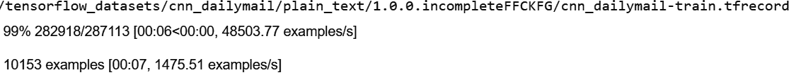
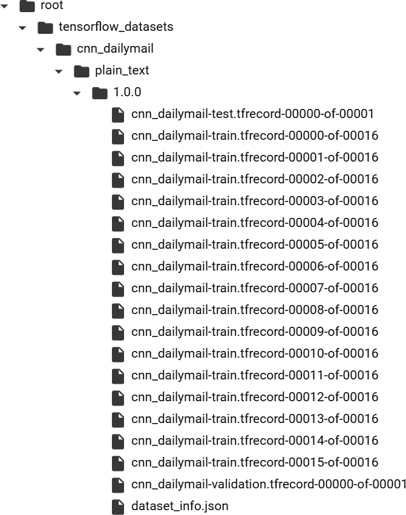
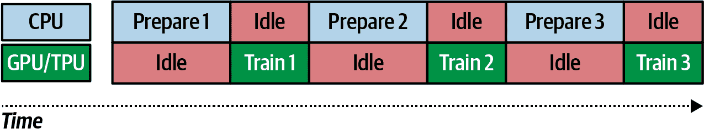
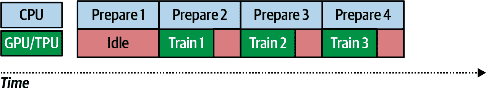

# 第四章：使用 TensorFlow Datasets 进行公共数据集

在本书的前几章中，你使用了各种数据来训练模型，从与 Keras 捆绑的时尚 MNIST 数据集，到基于图像的 Horses or Humans 和 Dogs vs. Cats 数据集，后者作为 ZIP 文件提供，你需要下载并预处理。你可能已经意识到，获取数据来训练模型有很多不同的方式。

然而，许多公共数据集在你开始考虑模型架构之前，需要你掌握许多不同的领域特定技能。TensorFlow Datasets（TFDS）的目标是以易于消费的方式暴露数据集，其中包括获取数据和将其转换为 TensorFlow 友好 API 的所有预处理步骤。

您已经在第一章和第二章中稍微了解了 Keras 如何处理 Fashion MNIST 的这个想法。回顾一下，你只需要这样做就能获取数据：

```
data = tf.keras.datasets.fashion_mnist

(training_images, training_labels), (test_images, test_labels) = 
data.load_data()
```

TFDS 基于这一理念，不仅极大地扩展了可用数据集的数量，还增加了数据集类型的多样性。[可用数据集列表](https://oreil.ly/zL7zq)不断增长，涵盖以下类别：

音频

语音和音乐数据

图像

从简单的学习数据集（如 Horses or Humans）到用于糖尿病视网膜病变检测等高级研究数据集

目标检测

COCO、Open Images 等

结构化数据

泰坦尼克号幸存者、亚马逊评论等

摘要

CNN 和*每日邮报*的新闻、科学论文、wikiHow 等

文本

IMDb 评论、自然语言问题等

翻译

各种翻译训练数据集

视频

Moving MNIST、Starcraft 等

###### 注意

TensorFlow Datasets 与 TensorFlow 是分开安装的，请务必在尝试任何样本之前安装它！如果您使用 Google Colab，它已经预安装。

本章将介绍 TFDS 以及如何使用它来大大简化训练过程。我们将探讨基础的 TFRecord 结构以及它如何提供无论底层数据类型如何都通用的功能。您还将了解如何使用 TFDS 进行提取-转换-加载（ETL）模式，这可以有效地训练大量数据的模型。

# 开始使用 TFDS

让我们通过一些简单的示例来演示如何使用 TFDS，以说明它如何为我们提供数据的标准接口，无论数据类型如何。

如果需要安装，可以使用`pip`命令：

```
pip install tensorflow-datasets
```

安装完成后，您可以使用`tfds.load`访问数据集，只需传递所需数据集的名称。例如，如果您想使用 Fashion MNIST，可以使用以下代码：

```
`import` tensorflow `as` tf
`import` tensorflow_datasets `as` tfds
mnist_data = tfds.load(`"``fashion_mnist``"`)
`for` item `in` mnist_data:
  `print`(item)
```

确保检查从 `tfds.load` 命令返回的数据类型——打印项目的输出将是数据中本地可用的不同分割。在这种情况下，它是一个包含两个字符串 `test` 和 `train` 的字典。这些是可用的分割。

如果您想将这些分割加载到包含实际数据的数据集中，您可以简单地在 `tfds.load` 命令中指定您想要的分割，就像这样：

```
`mnist_train` `=` `tfds``.``load``(``name``=`"fashion_mnist"`,` `split``=`"train"`)`
`assert` `isinstance``(``mnist_train``,` `tf``.``data``.``Dataset``)`
`print``(``type``(``mnist_train``)``)`
```

在这个例子中，您将看到输出是一个 `DatasetAdapter`，您可以通过迭代来检查数据。这个适配器的一个很好的特性是，您可以简单地调用 `take(1)` 来获取第一条记录。让我们这样做来检查数据的样子：

```
`for` item `in` mnist_train.take(`1`):
  `print`(type(item))
  `print`(item.keys())
```

第一个 `print` 的输出将显示每条记录中项目的类型是一个字典。当我们打印这些键时，我们将看到在这个图像集中类型是 `image` 和 `label`。因此，如果我们想要检查数据集中的一个值，我们可以做如下操作：

```
`for` item `in` mnist_train.take(`1`):
  `print`(type(item))
  `print`(item.keys())
  `print`(item[`'``image``'`])
  `print`(item[`'``label``'`])
```

您将看到图像的输出是一个 28 × 28 的值数组（在 `tf.Tensor` 中）从 0 到 255，表示像素强度。标签将以 `tf.Tensor(2, shape=(), dtype=int64)` 的形式输出，表明这个图像在数据集中属于类别 2。

在加载数据集时，还可以使用 `with_info` 参数获取关于数据集的信息，如下所示：

```
mnist_test, info = tfds.load(name=`"``fashion_mnist``"`, with_info=`"``true``"`)
`print`(info)
```

打印信息将提供有关数据集内容的详细信息。例如，对于 Fashion MNIST，您将看到类似于以下输出：

```
tfds.core.DatasetInfo(
    name='fashion_mnist',
    version=3.0.0,
    description='Fashion-MNIST is a dataset of Zalando's article images
      consisting of a training set of 60,000 examples and a test set of 10,000
      examples. Each example is a 28x28 grayscale image, associated with a
      label from 10 classes.',
    homepage='https://github.com/zalandoresearch/fashion-mnist',
    features=FeaturesDict({
        'image': Image(shape=(28, 28, 1), dtype=tf.uint8),
        'label': ClassLabel(shape=(), dtype=tf.int64, num_classes=10),
    }),
    total_num_examples=70000,
    splits={
        'test': 10000,
        'train': 60000,
    },
    supervised_keys=('image', 'label'),
    citation="""@article{DBLP:journals/corr/abs-1708-07747,
 author    = {Han Xiao and
 Kashif Rasul and
 Roland Vollgraf},
 title     = {Fashion-MNIST: a Novel Image Dataset for Benchmarking 
 Machine Learning
 Algorithms},
 journal   = {CoRR},
 volume    = {abs/1708.07747},
 year      = {2017},
 url       = {http://arxiv.org/abs/1708.07747},
 archivePrefix = {arXiv},
 eprint    = {1708.07747},
 timestamp = {Mon, 13 Aug 2018 16:47:27 +0200},
 biburl    = {https://dblp.org/rec/bib/journals/corr/abs-1708-07747},
 bibsource = {dblp computer science bibliography, https://dblp.org}
 }""",
    redistribution_info=,
)
```

在其中，您可以查看诸如分割（如前所示）和数据集中的特征以及额外信息（如引用、描述和数据集版本）的详细信息。

# 使用 TFDS 与 Keras 模型

在 第二章 中，您看到如何使用 TensorFlow 和 Keras 创建一个简单的计算机视觉模型，使用了来自 Keras 的内置数据集（包括 Fashion MNIST），并且使用了如下简单的代码：

```
mnist = tf.keras.datasets.fashion_mnist

(training_images, training_labels), 
(test_images, test_labels) = mnist.load_data()
```

当使用 TFDS 时，代码非常相似，但有一些小的改变。Keras 数据集给了我们在 `model.fit` 中可以直接使用的 `ndarray` 类型，但是在 TFDS 中，我们需要做一些转换工作：

```
(training_images, training_labels), 
(test_images, test_labels) =  
tfds.as_numpy(tfds.load(`'``fashion_mnist``'`,
                         split = [`'``train``'`, `'``test``'`], 
                         batch_size=-`1`, 
                         as_supervised=`True`))
```

在这种情况下，我们使用 `tfds.load`，将 `fashion_mnist` 作为所需数据集传递。我们知道它有训练和测试分割，因此将它们作为数组传递将返回包含图像和标签的数据集适配器数组。在调用 `tfds.load` 中使用 `tfds.as_numpy` 会将它们作为 Numpy 数组返回。指定 `batch_size=-1` 给我们返回*所有*数据，而 `as_supervised=True` 确保我们得到返回的元组（输入、标签）。

一旦我们完成了这些更改，我们基本上就获得了与 Keras 数据集中相同的数据格式，只有一点不同——TFDS 中的形状是 (28, 28, 1)，而在 Keras 数据集中是 (28, 28)。

这意味着代码需要做一些更改，以明确指定输入数据的形状为 (28, 28, 1)，而不是 (28, 28)：

```
`import` tensorflow `as` tf
`import` tensorflow_datasets `as` tfds

(training_images, training_labels), (test_images, test_labels) =  
tfds.as_numpy(tfds.load(`'``fashion_mnist``'`, split = [`'``train``'`, `'``test``'`], 
batch_size=-`1`, as_supervised=`True`))

training_images = training_images / `255.0`
test_images = test_images / `255.0`

model = tf.keras.models.`Sequential`([
    tf.keras.layers.`Flatten`(input_shape=(`28`,`28`,`1`)),
    tf.keras.layers.`Dense`(`128`, activation=tf.nn.relu),
    tf.keras.layers.`Dropout`(`0.2`),
    tf.keras.layers.`Dense`(`10`, activation=tf.nn.softmax)
])

model.compile(optimizer=`'``adam``'`,
              loss=`'``sparse_categorical_crossentropy``'`,
              metrics=[`'``accuracy``'`])

model.fit(training_images, training_labels, epochs=`5`)
```

对于更复杂的例子，你可以查看在第三章中使用的 Horses or Humans 数据集。这也可以在 TFDS 中找到。这是用它来训练模型的完整代码：

```
`import` tensorflow `as` tf
`import` tensorflow_datasets `as` tfds

data = tfds.load(`'``horses_or_humans``'`, split=`'``train``'`, as_supervised=`True`)

train_batches = data.shuffle(`100`).batch(`10`)

model = tf.keras.models.`Sequential`([
    tf.keras.layers.`Conv2D`(`16`, (`3`,`3`), activation=`'``relu``'`, 
                           input_shape=(`300`, `300`, `3`)),
    tf.keras.layers.`MaxPooling2D`(`2`, `2`),
    tf.keras.layers.`Conv2D`(`32`, (`3`,`3`), activation=`'``relu``'`),
    tf.keras.layers.`MaxPooling2D`(`2`,`2`),
    tf.keras.layers.`Conv2D`(`64`, (`3`,`3`), activation=`'``relu``'`),
    tf.keras.layers.`MaxPooling2D`(`2`,`2`),
    tf.keras.layers.`Conv2D`(`64`, (`3`,`3`), activation=`'``relu``'`),
    tf.keras.layers.`MaxPooling2D`(`2`,`2`),
    tf.keras.layers.`Conv2D`(`64`, (`3`,`3`), activation=`'``relu``'`),
    tf.keras.layers.`MaxPooling2D`(`2`,`2`),
    tf.keras.layers.`Flatten`(),
    tf.keras.layers.`Dense`(`512`, activation=`'``relu``'`),
    tf.keras.layers.`Dense`(`1`, activation=`'``sigmoid``'`)
])

model.compile(optimizer=`'``Adam``'`, loss=`'``binary_crossentropy``'`,
metrics=[`'``accuracy``'`])

history = model.fit(train_batches, epochs=`10`)
```

如你所见，这非常简单：只需调用 `tfds.load`，传递你想要的分割（在本例中为 `train`），然后在模型中使用它。数据被批处理和洗牌以使训练更有效。

Horses or Humans 数据集被分成了训练集和测试集，因此如果你想在训练时验证模型，你可以像这样从 TFDS 加载一个单独的验证集：

```
val_data = tfds.load(`'``horses_or_humans``'`, split=`'``test``'`, as_supervised=`True`)
```

你需要对其进行分批处理，就像对训练集做的那样。例如：

```
validation_batches = val_data.batch(`32`)
```

然后，在训练时，将验证数据指定为这些批次。你还必须显式地设置每个 epoch 使用的验证步数，否则 TensorFlow 将抛出错误。如果不确定，就像这样设置为 `1`：

```
history = model.fit(train_batches, epochs=`10`,
validation_data=validation_batches, validation_steps=`1`)
```

## 加载特定版本

所有存储在 TFDS 中的数据集都使用 *MAJOR.MINOR.PATCH* 编号系统。此系统的保证如下。如果更新 *PATCH*，则调用返回的数据相同，但底层组织可能已更改。任何更改对开发者来说都是不可见的。如果更新 *MINOR*，则数据仍然不变，除了每条记录可能有额外的特征（非破坏性更改）。另外，对于任何特定的切片（见“使用自定义拆分”），数据将保持不变，因此记录不会重新排序。如果更新 *MAJOR*，则记录的格式及其位置可能会有所更改，因此特定的切片可能会返回不同的值。

当你检查数据集时，你会看到不同版本的可用性，例如，[`cnn_dailymail` 数据集](https://oreil.ly/673CJ) 就是一个例子。如果你不想使用默认的版本，在撰写本文时版本为 3.0.0，而是想使用早期的版本，比如 1.0.0，你可以像这样加载：

```
data, info = tfds.load(`"``cnn_dailymail:1.0.0``"`, with_info=`True`)
```

注意，如果你在使用 Colab，检查它所使用的 TFDS 版本总是一个好主意。在撰写本文时，Colab 预配置为 TFDS 2.0，但加载数据集时（包括 `cnn_dailymail` 数据集）可能会出现一些错误，在 TFDS 2.1 及更高版本中已修复了这些问题，因此请务必使用其中一个版本，或者至少安装它们到 Colab，而不要依赖内置的默认设置。

# 使用映射函数进行增强

在第三章中，你看到了使用 `ImageDataGenerator` 提供模型训练数据时可用的有用增强工具。也许你会想知道在使用 TFDS 时如何实现同样的效果，因为你不再像以前那样从子目录流动图像。实现这一点——或者任何其他形式的转换——的最佳方式是在数据适配器上使用映射函数。让我们看看如何做到这一点。

早些时候，我们通过 TFDS 加载了 Horses or Humans 数据，并像这样为其创建了批次：

```
data = tfds.load(`'``horses_or_humans``'`, split=`'``train``'`, as_supervised=`True`)

train_batches = data.shuffle(`100`).batch(`10`)
```

要进行变换并将其映射到数据集，你可以创建一个*映射函数*。这只是标准的 Python 代码。例如，假设你创建了一个名为`augmentimages`的函数，并让它进行一些图像增强，就像这样：

```
`def` augmentimages(image, label):
  image = tf.cast(image, tf.float32)
  image = (image/`255`)
  image = tf.image.random_flip_left_right(image)
  `return` image, label
```

然后，你可以将其映射到数据上，创建一个名为`train`的新数据集：

```
train = data.map(augmentimages)
```

然后，在创建批次时，从`train`而不是`data`中进行，像这样操作：

```
train_batches = train.shuffle(`100`).batch(`32`)
```

你可以看到在`augmentimages`函数中有一个图像左右随机翻转的操作，使用的是`tf.image.random_flip_left_right(image)`。`tf.image`库中有许多函数可用于增强；详细信息请参阅[文档](https://oreil.ly/H5LZh)。

## 使用 TensorFlow 插件

[TensorFlow 插件](https://oreil.ly/iwDv9)库包含更多你可以使用的函数。某些函数在`ImageDataGenerator`增强中（例如`rotate`）只能在这里找到，因此查看一下是个好主意。

使用 TensorFlow 插件非常简单——你只需用以下命令安装该库：

```
pip install tensorflow-addons
```

完成后，你可以将插件混合到你的映射函数中。以下是一个例子，展示了从先前映射函数中使用`rotate`插件的情况：

```
`import` tensorflow_addons `as` tfa

`def` augmentimages(image, label):
  image = tf.cast(image, tf.float32)
  image = (image/`255`)
  image = tf.image.random_flip_left_right(image)
  image = tfa.image.rotate(image, `40`, interpolation=`'``NEAREST``'`)
  `return` image, label
```

# 使用自定义分片

到目前为止，你用来构建模型的所有数据都已经预先分为训练集和测试集。例如，对于 Fashion MNIST，分别有 60,000 条和 10,000 条记录。但如果你不想使用这些分割怎么办？如果你想根据自己的需要分割数据怎么办？这就是 TFDS 的一个非常强大的方面之一——它配备了一个 API，可以精细地控制你如何分割数据。

实际上，当你像这样加载数据时，你已经见过它：

```
data = tfds.load(`'``cats_vs_dogs``'`, split=`'``train``'`, as_supervised=`True`)
```

注意`split`参数是一个字符串，在这种情况下，你要求的是`train`分片，这恰好是整个数据集。如果你熟悉[Python 切片表示法](https://oreil.ly/Enqzq)，你也可以使用它。这种表示法可以总结为在方括号内定义你所需的切片，如下所示：`[<start>: <stop>: <step>]`。这是一种非常复杂的语法，为你提供了极大的灵活性。

例如，如果你想要`train`的前 10,000 条记录作为训练数据，你可以省略`<start>`，只需调用`train[:10000]`（一个有用的助记法是将前导冒号读作“第一个”，因此这将读作“训练前 10,000 条记录”）：

```
data = tfds.load(`'``cats_vs_dogs``'`, split=`'``train[:10000]``'`, as_supervised=`True`)
```

你也可以使用`%`来指定分片。例如，如果你想要使用前 20%的记录进行训练，可以像这样使用`:20%`：

```
data = tfds.load(`'``cats_vs_dogs``'`, split=`'``train[:20``%``]``'`, as_supervised=`True`)
```

你甚至可以有些疯狂，将这些分割方法结合起来。也就是说，如果你希望你的训练数据是前一千条记录和最后一千条记录的组合，你可以这样做（其中 `-1000:` 表示“最后 1,000 条记录”，`:1000` 表示“前 1,000 条记录”）：

```
data = tfds.load(`'``cats_vs_dogs``'`, split=`'``train[-1000:]+train[:1000]``'`, 
                 as_supervised=`True`)
```

Dogs vs. Cats 数据集没有固定的训练、测试和验证分割，但是使用 TFDS，创建自己的数据集非常简单。假设你希望分割为 80%，10%，10%。你可以像这样创建三个集合：

```
`train_data` `=` `tfds``.``load``(`'cats_vs_dogs'`,` `split``=`'train[:80%]'`,` 
 `as_supervised``=``True``)` 
`validation_data` `=` `tfds``.``load``(`'cats_vs_dogs'`,` `split``=`'train[80%:90%]'`,` 
 `as_supervised``=``True``)` 
`test_data` `=` `tfds``.``load``(`'cats_vs_dogs'`,` `split``=`'train[-10%:]'`,` as_supervised=`True``)`
```

一旦你有了它们，你可以像任何命名分割一样使用它们。

一个注意事项是，由于返回的数据集不能被用来查询其长度，通常很难检查你是否正确分割了原始集合。要查看分割中有多少条记录，你必须遍历整个集合并逐个计数。这里是你刚刚创建的训练集的代码：

```
train_length = [i `for` i,_ `in` enumerate(train_data)][-`1`] + `1`
`print`(train_length)
```

这可能是一个缓慢的过程，所以只有在调试时才使用它！

# 理解 TFRecord

当你使用 TFDS 时，你的数据被下载并缓存在磁盘上，这样每次使用时就不需要重新下载。TFDS 使用 TFRecord 格式进行缓存。如果你仔细观察下载数据的过程，你将看到这一点——例如，图 4-1 展示了如何下载、洗牌并将`cnn_dailymail`数据集写入 TFRecord 文件。



###### 图 4-1\. 作为 TFRecord 文件下载 cnn_dailymail 数据集

这是 TensorFlow 中存储和检索大量数据的首选格式。它是一个非常简单的文件结构，顺序读取以获得更好的性能。在磁盘上，文件的结构非常直接，每个记录由一个表示记录长度的整数、其循环冗余检查（CRC）、数据的字节数组和该字节数组的 CRC 组成。记录被连接成文件，然后在大型数据集的情况下进行分片。

例如，图 4-2 展示了从`cnn_dailymail`下载后如何将训练集分片成 16 个文件。

要查看一个更简单的例子，下载 MNIST 数据集并打印其信息：

```
data, info = tfds.load(`"``mnist``"`, with_info=`True`)
`print`(info)
```

在信息中，你将看到其特征存储如下：

```
features=`FeaturesDict`({
    `'``image``'`: `Image`(shape=(`28`, `28`, `1`), dtype=tf.uint8),
    `'``label``'`: `ClassLabel`(shape=(), dtype=tf.int64, num_classes=`10`),
}),
```

类似于 CNN/DailyMail 的例子，该文件下载到*/root/tensorflow_datasets/mnist/<version>/files*。

你可以像这样加载原始记录作为`TFRecordDataset`：

```
`filename``=`"/root/tensorflow_datasets/mnist/3.0.0/
                                   mnist-test.tfrecord-00000-of-00001"
`raw_dataset` `=` `tf``.``data``.``TFRecordDataset``(``filename``)`
`for` `raw_record` `in` `raw_dataset``.``take``(``1``)``:`

`print`(repr(raw_record))
```

请注意，根据您的操作系统，文件名的位置可能会有所不同。



###### 图 4-2\. 检查 cnn_dailymail 的 TFRecords

这将打印出记录的原始内容，就像这样：

```
<tf.Tensor: shape=(), dtype=string,
numpy=b"\n\x85\x03\n\xf2\x02\n\x05image\x12\xe8\x02\n\xe5\x02\n\xe2\x02\x89PNG\r
\n\x1a\n\x00\x00\x00\rIHDR\x00\x00\x00\x1c\x00\x00\x00\x1c\x08\x00\x00\x00\x00Wf
\x80H\x00\x00\x01)IDAT(\x91\xc5\xd2\xbdK\xc3P\x14\x05\xf0S(v\x13)\x04,.\x82\xc5A
q\xac\xedb\x1d\xdc\n.\x12\x87n\x0e\x82\x93\x7f@Q\xb2\x08\xba\tbQ0.\xe2\xe2\xd4\x
b1\xa2h\x9c\x82\xba\x8a(\nq\xf0\x83Fh\x95\n6\x88\xe7R\x87\x88\xf9\xa8Y\xf5\x0e\x
8f\xc7\xfd\xdd\x0b\x87\xc7\x03\xfe\xbeb\x9d\xadT\x927Q\xe3\xe9\x07:\xab\xbf\xf4\
xf3\xcf\xf6\x8a\xd9\x14\xd29\xea\xb0\x1eKH\xde\xab\xea%\xaba\x1b=\xa4P/\xf5\x02\
xd7\\\x07\x00\xc4=,L\xc0,>\x01@2\xf6\x12\xde\x9c\xde[t/\xb3\x0e\x87\xa2\xe2\
xc2\xe0A<\xca\xb26\xd5(\x1b\xa9\xd3\xe8\x0e\xf5\x86\x17\xceE\xdarV\xae\xb7_\xf3
I\xf7(\x06m\xaaE\xbb\xb6\xac\r*\x9b$e<\xb8\xd7\xa2\x0e\x00\xd0l\x92\xb2\xd5\x15\
xcc\xae'\x00\xf4m\x08O'+\xc2y\x9f\x8d\xc9\x15\x80\xfe\x99[q\x962@CN|i\xf7\xa9!=\
\xab\x19\x00\xc8\xd6\xb8\xeb\xa1\xf0\xd8l\xca\xfb]\xee\xfb]*\x9fV\xe1\x07\xb7\xc
9\x8b55\xe7M\xef\xb0\x04\xc0\xfd&\x89\x01<\xbe\xf9\x03*\x8a\xf5\x81\x7f\xaa/2y\x
87ks\xec\x1e\xc1\x00\x00\x00\x00IEND\xaeB`\x82\n\x0e\n\x05label\x12\x05\x1a\x03\
n\x01\x02">
```

这是一个包含记录详细信息及校验和等内容的长字符串。但如果我们已经了解了特征，我们可以创建一个特征描述，并用它来解析数据。以下是代码：

```
# Create a description of the features
`feature_description` `=` `{`
  `'``image``'``:` `tf``.``io``.``FixedLenFeature``(``[``]``,` `dtype``=``tf``.``string``)``,`
  `'``label``'``:` `tf``.``io``.``FixedLenFeature``(``[``]``,` `dtype``=``tf``.``int64``)``,`
`}`

`def` `_parse_function``(``example_proto``)``:`
  # Parse the input `tf.Example` proto using the dictionary above
  `return` `tf``.``io``.``parse_single_example``(``example_proto``,` `feature_description``)`

`parsed_dataset` `=` `raw_dataset``.``map``(``_parse_function``)`
`for` `parsed_record` `in` `parsed_dataset``.``take``(``1``)``:`
  `print``(``(``parsed_record``)``)`
```

这个输出更加友好！首先，您可以看到图像是一个`Tensor`，它包含一个 PNG 格式的图像。PNG 是一种压缩图像格式，其头部由`IHDR`定义，图像数据位于`IDAT`和`IEND`之间。如果仔细观察字节流，您也可以看到它们。还有存储为`int`类型并包含值`2`的标签：

```
{'image': <tf.Tensor: shape=(), dtype=string,
numpy=b"\x89PNG\r\n\x1a\n\x00\x00\x00\**`rIHDR`**\x00\x00\x00\x1c\x00\x00\x00\x1c\x08\
x00\x00\x00\x00Wf\x80H\x00\x00\x01)**`IDAT`**(\x91\xc5\xd2\xbdK\xc3P\x14\x05\xf0S(v\x1
3)\x04,.\x82\xc5Aq\xac\xedb\x1d\xdc\n.\x12\x87n\x0e\x82\x93\x7f@Q\xb2\x08\xba\tb
Q0.\xe2\xe2\xd4\xb1\xa2h\x9c\x82\xba\x8a(\nq\xf0\x83Fh\x95\n6\x88\xe7R\x87\x88\x
f9\xa8Y\xf5\x0e\x8f\xc7\xfd\xdd\x0b\x87\xc7\x03\xfe\xbeb\x9d\xadT\x927Q\xe3\xe9\
x07:\xab\xbf\xf4\xf3\xcf\xf6\x8a\xd9\x14\xd29\xea\xb0\x1eKH\xde\xab\xea%\xaba\x1
b=\xa4P/\xf5\x02\xd7\\\x07\x00\xc4=,L\xc0,>\x01@2\xf6\x12\xde\x9c\xde[t/\xb3\x0e
\x87\xa2\xe2\xc2\xe0A<\xca\xb26\xd5(\x1b\xa9\xd3\xe8\x0e\xf5\x86\x17\xceE\xdarV\
xae\xb7_\xf3AR\r!I\xf7(\x06m\xaaE\xbb\xb6\xac\r*\x9b$e<\xb8\xd7\xa2\x0e\x00\xd0l
\x92\xb2\xd5\x15\xcc\xae'\x00\xf4m\x08O'+\xc2y\x9f\x8d\xc9\x15\x80\xfe\x99[q\x96
2@CN|i\xf7\xa9!=\xd7
\xab\x19\x00\xc8\xd6\xb8\xeb\xa1\xf0\xd8l\xca\xfb]\xee\xfb]*\x9fV\xe1\x07\xb7\xc
9\x8b55\xe7M\xef\xb0\x04\xc0\xfd&\x89\x01<\xbe\xf9\x03*\x8a\xf5\x81\x7f\xaa/2y\x
87ks\xec\x1e\xc1\x00\x00\x00\**`x00IEND`**\xaeB`\x82">, 'label': <tf.Tensor: shape=(),
dtype=int64, numpy=**`2`**>}
```

在这一点上，您可以读取原始的 TFRecord 并使用像 Pillow 这样的 PNG 解码器库将其解码为 PNG。

# TensorFlow 中管理数据的 ETL 过程

ETL 是 TensorFlow 在训练中使用的核心模式，无论规模如何。在本书中，我们一直在探索小规模、单机模型构建，但相同的技术也可以用于跨多台机器进行大规模训练，使用海量数据集。

*提取阶段* 是 ETL 过程的一部分，当原始数据从存储位置加载并准备好可以转换的方式时。*转换* 阶段是当数据以适合或改进用于训练的方式进行操作时。例如，批处理、图像增强、映射到特征列等逻辑可以被视为此阶段的一部分。*加载* 阶段是当数据加载到神经网络进行训练时。

考虑到训练马匹或人类分类器的完整代码，如下所示。我已经添加了注释，显示了提取、转换和加载阶段的位置：

```
`import` tensorflow `as` tf
`import` tensorflow_datasets `as` tfds
`import` tensorflow_addons `as` tfa

`# MODEL DEFINITION START #`
model = tf.keras.models.`Sequential`([
    tf.keras.layers.`Conv2D`(`16`, (`3`,`3`), activation=`'``relu``'`, 
                           input_shape=(`300`, `300`, `3`)),
    tf.keras.layers.`MaxPooling2D`(`2`, `2`),
    tf.keras.layers.`Conv2D`(`32`, (`3`,`3`), activation=`'``relu``'`),
    tf.keras.layers.`MaxPooling2D`(`2`,`2`),
    tf.keras.layers.`Conv2D`(`64`, (`3`,`3`), activation=`'``relu``'`),
    tf.keras.layers.`MaxPooling2D`(`2`,`2`),
    tf.keras.layers.`Conv2D`(`64`, (`3`,`3`), activation=`'``relu``'`),
    tf.keras.layers.`MaxPooling2D`(`2`,`2`),
    tf.keras.layers.`Conv2D`(`64`, (`3`,`3`), activation=`'``relu``'`),
    tf.keras.layers.`MaxPooling2D`(`2`,`2`),
    tf.keras.layers.`Flatten`(),
    tf.keras.layers.`Dense`(`512`, activation=`'``relu``'`),
    tf.keras.layers.`Dense`(`1`, activation=`'``sigmoid``'`)
])
model.compile(optimizer=`'``Adam``'`, loss=`'``binary_crossentropy``'`, 
              metrics=[`'``accuracy``'`])
`# MODEL DEFINITION END #`

`# EXTRACT PHASE START #`
data = tfds.load(`'``horses_or_humans``'`, split=`'``train``'`, as_supervised=`True`)
val_data = tfds.load(`'``horses_or_humans``'`, split=`'``test``'`, as_supervised=`True`)
`# EXTRACT PHASE END`

`# TRANSFORM PHASE START #`
`def` augmentimages(image, label):
  image = tf.cast(image, tf.float32)
  image = (image/`255`)
  image = tf.image.random_flip_left_right(image)
  image = tfa.image.rotate(image, `40`, interpolation=`'``NEAREST``'`)
  `return` image, label

train = data.map(augmentimages)
train_batches = train.shuffle(`100`).batch(`32`)
validation_batches = val_data.batch(`32`)
`# TRANSFORM PHASE END`

`# LOAD PHASE START #`
history = model.fit(train_batches, epochs=`10`, 
                    validation_data=validation_batches, validation_steps=`1`)
`# LOAD PHASE END #`
```

使用这个过程可以使您的数据管道对数据和底层架构的变化更不易受到影响。当您使用 TFDS 提取数据时，不管数据是小到可以放入内存，还是大到简单的机器无法容纳，都会使用相同的底层结构。`tf.data`转换的 API 也是一致的，因此您可以使用类似的 API，无论底层数据源如何。当然，一旦转换完成，加载数据的过程也是一致的，无论您是在单个 CPU、GPU、GPU 集群甚至 TPU Pod 上进行训练。

然而，如何加载数据会对您的训练速度产生巨大影响。让我们接下来看看这一点。

## 优化加载阶段

让我们更仔细地看一下在训练模型时的提取-转换-加载过程。我们可以考虑数据的提取和转换可以在任何处理器上完成，包括 CPU。实际上，在这些阶段使用的代码执行任务，如下载数据、解压缩以及逐条记录地处理它们，不是 GPU 或 TPU 的用途，因此这些代码可能最终还是在 CPU 上执行。然而，当涉及到训练时，你可以从 GPU 或 TPU 中获得很大的好处，因此如果可能的话，在这个阶段使用 GPU 或 TPU 是有意义的。因此，在你可以使用 GPU 或 TPU 的情况下，最好将工作负载分配到 CPU 和 GPU/TPU 之间，提取和转换在 CPU 上进行，加载在 GPU/TPU 上进行。

假设你正在处理一个大型数据集。假设数据集如此之大，以至于你必须分批准备数据（即进行提取和转换），你将会得到类似于在 图 4-3 中展示的情况。在准备第一批数据时，GPU/TPU 是空闲的。当第一批数据准备好后，可以将其发送到 GPU/TPU 进行训练，但此时 CPU 则处于空闲状态，直到训练完成，然后才能开始准备第二批数据。这里存在大量的空闲时间，因此我们可以看到这里有优化的空间。



###### 图 4-3\. 在 CPU/GPU 上训练

逻辑解决方案是并行进行工作，准备和训练并行进行。这个过程称为*管道化*，并且在 图 4-4 中有所示。



###### 图 4-4\. 管道化

在这种情况下，当 CPU 准备第一批数据时，GPU/TPU 再次没有工作可做，因此它是空闲的。当第一批数据准备好后，GPU/TPU 可以开始训练，但与此同时，CPU 将准备第二批数据。当然，训练批次 *n* – 1 和准备批次 *n* 所需的时间不会总是相同。如果训练时间更快，您将在 GPU/TPU 上有空闲时间。如果更慢，则 CPU 将有空闲时间。选择正确的批次大小可以帮助您在这里进行优化——而且由于 GPU/TPU 的时间可能更昂贵，您可能希望尽可能减少其空闲时间。

当我们从使用 Keras 中的简单数据集（如时尚 MNIST）转到使用 TFDS 版本时，您可能注意到必须在训练之前对它们进行批处理。这就是为什么：管道化模型被设计成无论数据集有多大，您都将继续使用其上的 ETL 的一致模式。

## 并行化 ETL 以提高训练性能

TensorFlow 为您提供了所有并行化提取和转换过程所需的 API。让我们使用狗 vs. 猫和底层的 TFRecord 结构来探索它们的样子。

首先，您使用 `tfds.load` 来获取数据集：

```
train_data = tfds.load(`'``cats_vs_dogs``'`, split=`'``train``'`, with_info=`True`)
```

如果你想使用底层的 TFRecords，你需要访问下载的原始文件。由于数据集很大，在版本 4.0.0 中分成了多个文件（8 个）。

你可以创建这些文件的列表，并使用 `tf.Data.Dataset.list_files` 加载它们：

```
`file_pattern` `=` 
 `f`'/root/tensorflow_datasets/cats_vs_dogs/4.0.0/cats_vs_dogs-train.tfrecord*'
`files` `=` `tf``.``data``.``Dataset``.``list_files``(``file_pattern``)`
```

一旦你有了这些文件，可以使用 `files.interleave` 将它们加载到数据集中，就像这样：

```
train_dataset = files.interleave(
                     tf.data.`TFRecordDataset`, 
                     cycle_length=`4`,
                     num_parallel_calls=tf.data.experimental.AUTOTUNE
                )
```

这里有一些新概念，让我们花点时间来探索它们。

`cycle_length` 参数指定同时处理的输入元素数量。因此，马上你将看到从磁盘加载时解码记录的映射函数。因为 `cycle_length` 设置为 `4`，所以此过程将同时处理四条记录。如果不指定此值，则将根据可用 CPU 核心数来推导。

当设置 `num_parallel_calls` 参数时，将指定要执行的并行调用数。在这里使用 `tf.data.experimental.AUTOTUNE` 会使你的代码更具可移植性，因为该值是动态设置的，根据可用的 CPU。与 `cycle_length` 结合使用时，你正在设置最大并行度。因此，例如，如果在自动调整后将 `num_parallel_calls` 设置为 `6`，`cycle_length` 设置为 `4`，那么将有六个单独的线程，每个线程一次加载四条记录。

现在提取过程已经并行化，让我们来探索数据转换的并行化。首先，创建加载原始 TFRecord 并将其转换为可用内容的映射函数，例如将 JPEG 图像解码为图像缓冲区：

```
`def` read_tfrecord(serialized_example):
  feature_description={
      `"``image``"`: tf.io.`FixedLenFeature`((), tf.string, `"``"`),
      `"``label``"`: tf.io.`FixedLenFeature`((), tf.int64, -`1`),
  }
  example = tf.io.parse_single_example(
       serialized_example, feature_description
  )
  image = tf.io.decode_jpeg(example[`'``image``'`], channels=`3`)
  image = tf.cast(image, tf.float32)
  image = image / `255`
  image = tf.image.resize(image, (`300`,`300`))
  `return` image, example[`'``label``'`]
```

正如你所看到的，这是一个典型的映射函数，没有做任何特定的工作来并行执行。在调用映射函数时，将会执行这些工作。这是如何做到的：

```
cores = multiprocessing.cpu_count()
`print`(cores)
train_dataset = train_dataset.map(read_tfrecord, num_parallel_calls=cores)
train_dataset = train_dataset.cache()
```

首先，如果你不想自动调整，可以使用 `multiprocessing` 库来获取你的 CPU 数量。然后，在调用映射函数时，将这个数字作为你想要进行的并行调用的数量传递进去。就是这么简单。

`cache` 方法将在内存中缓存数据集。如果你有大量的 RAM 可用，这将是一个非常有用的加速。尝试在 Colab 中使用 Dogs vs. Cats 很可能会因为数据集不适合内存而导致虚拟机崩溃。此后，如果可用，Colab 基础设施将为你提供一个新的、更高 RAM 的机器。

加载和训练也可以并行化。除了对数据进行洗牌和分批处理外，你还可以根据可用的 CPU 核心数量进行预取。以下是代码：

```
train_dataset = train_dataset.shuffle(`1024`).batch(`32`)
train_dataset = train_dataset.prefetch(tf.data.experimental.AUTOTUNE)
```

一旦你的训练集全部并行化，就可以像以前一样训练模型：

```
model.fit(train_dataset, epochs=`10`, verbose=`1`)
```

当我在 Google Colab 中尝试时，我发现这些额外的并行化 ETL 过程的代码将训练时间缩短到每个时期约 40 秒，而没有这些代码则为 75 秒。这些简单的更改几乎使我的训练时间减少了一半！

# 摘要

本章介绍了 TensorFlow Datasets，这是一个库，为您提供了从小型学习数据集到用于研究的大规模数据集的访问权限。您看到它们如何使用通用的 API 和通用格式来帮助减少您编写的代码量，以获取数据访问权限。您还学习了如何使用 ETL 过程，这是 TFDS 设计的核心，并特别探讨了并行化数据的提取、转换和加载，以改善训练性能。在下一章中，您将把学到的知识应用到自然语言处理问题中。
