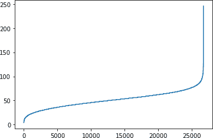
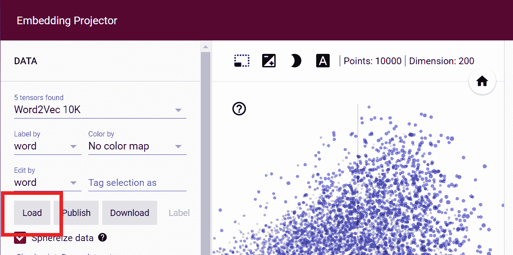

# 第六章：利用嵌入使情感可编程

在第五章中，您看到如何将单词编码为标记。然后，您看到如何将充满单词的句子编码为充满标记的序列，根据需要进行填充或截断，以得到一个形状良好的数据集，可以用来训练神经网络。在所有这些过程中，都没有对单词的*含义*进行任何建模。虽然确实不存在能够完全数值化包含意义的编码，但存在相对的编码。在本章中，您将学习到这些内容，特别是*嵌入*的概念，其中在高维空间中创建向量以表示单词。这些向量的方向可以随着单词在语料库中的使用而学习。然后，当您获得一个句子时，您可以研究单词向量的方向，将它们加起来，并从总体方向中确定句子的情感作为其单词的产品。

在本章中，我们将探讨它的工作原理。使用来自第五章的讽刺数据集，您将构建嵌入以帮助模型检测句子中的讽刺。您还将看到一些很酷的可视化工具，帮助您理解语料库中的单词如何映射到向量，以便您可以看到哪些单词决定了整体分类。

# 从单词中建立意义

在深入探讨用于嵌入的高维向量之前，让我们尝试通过一些简单的例子来可视化如何从数字中推导出含义。考虑这个：使用来自第五章的讽刺数据集，如果您将组成讽刺标题的所有单词编码为正数，而将组成现实标题的单词编码为负数，会发生什么？

## 一个简单的例子：积极与消极

举例来说，数据集中的这则讽刺性标题：

```
christian bale given neutered male statuette named oscar
```

假设我们词汇表中的所有单词都以值 0 开始，我们可以为这个句子中的每个单词的值添加 1，那么我们将得到这样：

```
{ "christian" : 1, "bale" : 1, "given" : 1, "neutered": 1, "male" : 1, 
  "statuette": 1, "named" : 1, "oscar": 1}
```

###### 注意

请注意，这与您在上一章中进行的单词*标记化*不同。您可以考虑用表示它的标记替换每个单词（例如，“christian”），该标记从语料库编码而来，但我现在保留这些单词以便阅读。

然后，在下一步中，考虑一个普通的标题，而不是一个讽刺的标题，比如这个：

```
gareth bale scores wonder goal against germany
```

因为这是一种不同的情感，我们可以从当前每个单词的值中减去 1，所以我们的值集将如下所示：

```
{ "christian" : 1, "bale" : 0, "given" : 1, "neutered": 1, "male" : 1,
  "statuette": 1, "named" : 1, "oscar": 1, "gareth" : -1, "scores": -1,
  "wonder" : -1, "goal" : -1, "against" : -1, "germany" : -1}
```

请注意，讽刺的“bale”（来自“christian bale”）通过非讽刺的“bale”（来自“gareth bale”）进行了偏移，因此其分数最终为 0。重复这个过程成千上万次，您将得到一个巨大的单词列表，根据它们在语料库中的使用得分。

现在想象一下，我们想要确定这句话的情感：

```
neutered male named against germany, wins statuette!
```

使用我们现有的价值集，我们可以查看每个单词的分数并将它们加起来。我们将得到一个分数为 2，这表明（因为它是正数）这是一个讽刺性的句子。

###### 注意

关于“bale”，在 Sarcasm 数据集中出现了五次，其中两次出现在普通标题中，三次出现在讽刺标题中，因此在这样的模型中，“bale”一词在整个数据集中得分为-1。

## 深入一点：向量

希望前面的例子帮助您理解建立一种单词*相对*含义的心理模型，通过其与同一“方向”中其他单词的关联。在我们的例子中，虽然计算机不理解单词的含义，但它可以将已知讽刺标题中的标记单词向一个方向移动（通过添加 1），并将已知普通标题中的标记单词向另一个方向移动（通过减去 1）。这给我们带来了对单词含义的基本理解，但是它丢失了一些细微差别。

如果我们增加方向的维度以捕获更多信息会怎么样？例如，假设我们查看简·奥斯汀小说*傲慢与偏见*中的字符，考虑性别和贵族的维度。我们可以将前者绘制在 x 轴上，将后者绘制在 y 轴上，向量的长度表示每个字符的财富（图 6-1）。


###### 图 6-1\. 傲慢与偏见中的字符作为向量

从图表的检查中，您可以推断出关于每个字符的相当多的信息。其中三个是男性。达西先生非常富有，但他的贵族身份不清楚（他被称为“先生”，不像较少富裕但显然更高贵的威廉·卢卡斯爵士）。另一个“先生”本内特先生显然不是贵族，经济上有困难。他的女儿伊丽莎白·本内特与他相似，但是女性。在我们的例子中，另一个女性角色凯瑟琳夫人是贵族，极其富有。达西先生和伊丽莎白之间的浪漫引发了紧张局势——*偏见*来自向较不贵族的向量的贵族一侧。

正如这个例子所示，通过考虑多个维度，我们可以开始看到单词（这里是角色名称）中的真实含义。再次强调，我们不是谈论具体的定义，而是基于轴线和单词向量之间关系的*相对*含义。

这导致我们引入了*嵌入*的概念，它仅仅是在训练神经网络时学习到的一个单词的向量表示。接下来我们将深入探讨这一点。

# TensorFlow 中的嵌入

正如您在`Dense`和`Conv2D`中看到的那样，`tf.keras`使用层来实现嵌入。这创建了一个查找表，将从整数映射到嵌入表，表中的内容是表示由该整数标识的单词的向量的系数。因此，在前一节中的*傲慢与偏见*示例中，*x*和*y*坐标将为我们提供书中特定字符的嵌入。当然，在真实的 NLP 问题中，我们将使用远比两个维度多得多。因此，向量空间中向量的方向可以被视为编码单词的“含义”，具有类似向量的单词——即大致指向同一方向的单词——可以被认为与该单词相关。

嵌入层将被随机初始化——也就是说，向量的坐标将完全随机起始，并将在训练过程中使用反向传播进行学习。训练完成后，嵌入将大致编码单词之间的相似性，使我们能够根据这些单词的向量方向识别出某种程度相似的单词。

这些都非常抽象，所以我认为理解如何使用嵌入的最佳方法是动手尝试一下。我们从使用来自第五章的 Sarcasm 数据集的讽刺检测器开始。

## 构建使用嵌入的讽刺检测器

在第五章中，您加载并对称为讽刺检测的新闻标题数据集进行了一些预处理（简称为 Sarcasm）。到最后，您已经得到了训练数据、测试数据和标签的列表。这些可以像这样转换为 TensorFlow 训练使用的 Numpy 格式：

```
`import` numpy `as` np
training_padded = np.array(training_padded)
training_labels = np.array(training_labels)
testing_padded = np.array(testing_padded)
testing_labels = np.array(testing_labels)
```

这些是使用具有指定最大词汇量和词汇表外标记的标记器创建的：

```
tokenizer = `Tokenizer`(num_words=vocab_size, oov_token=oov_tok)
```

要初始化嵌入层，您需要词汇量和指定的嵌入维度：

```
tf.keras.layers.`Embedding`(vocab_size, embedding_dim),
```

这将为每个单词初始化一个`embedding_dim`点的数组。例如，如果`embedding_dim`为`16`，则词汇表中的每个单词将被分配一个 16 维向量。

随着网络通过将训练数据与其标签匹配进行学习，这些维度将随时间通过反向传播进行学习。

接下来的重要步骤是将嵌入层的输出馈送到密集层中。与使用卷积神经网络时类似，最简单的方法是使用池化。在这种情况下，将嵌入的维度平均化以生成一个固定长度的输出向量。

例如，考虑这个模型架构：

```
model = tf.keras.`Sequential`([
    tf.keras.layers.`Embedding`(`10000`, `16`),
    tf.keras.layers.`GlobalAveragePooling1D`(),
    tf.keras.layers.`Dense`(`24`, activation=`'``relu``'`),
    tf.keras.layers.`Dense`(`1`, activation=`'``sigmoid``'`)
])
model.compile(loss=`'``binary_crossentropy``'`,
              optimizer=`'``adam``'`,metrics=[`'``accuracy``'`])
```

在这里定义了一个嵌入层，并给出了词汇量（`10000`）和嵌入维度`16`。让我们通过`model.summary`查看网络中的可训练参数数量：

```
Model: "sequential_2"
_________________________________________________________________
Layer (type)                 Output Shape              Param # 
=================================================================
embedding_2 (Embedding)      (None, None, 16)          160000    
_________________________________________________________________
global_average_pooling1d_2 ( (None, 16)                0         
_________________________________________________________________
dense_4 (Dense)              (None, 24)                408       
_________________________________________________________________
dense_5 (Dense)              (None, 1)                 25        
=================================================================
Total params: 160,433
Trainable params: 160,433
Non-trainable params: 0
_________________________________________________________________
```

由于嵌入层的词汇量为 10,000 个词，并且每个词都将成为一个 16 维的向量，所以可训练的参数总数将为 160,000。

平均池化层没有可训练的参数，因为它只是对其前的嵌入层的参数进行平均，得到一个单一的 16 值向量。

然后将其馈送到 24 神经元的密集层中。请记住，密集神经元实际上是使用权重和偏差来计算的，因此它将需要学习(24 × 16) + 16 = 408 个参数。

然后，该层的输出被传递到最终的单神经元层，那里将会有(1 × 24) + 1 = 25 个需要学习的参数。

如果我们训练这个模型，在 30 个 epoch 之后，我们将会得到一个相当不错的准确率，超过 99%—但是我们的验证准确率只会约为 81%（图 6-2）。


###### 图 6-2\. 训练准确率与验证准确率

考虑到验证数据很可能包含训练数据中不存在的许多词，这个曲线看起来是合理的。然而，如果你查看 30 个 epoch 中的训练与验证损失曲线，你会发现一个问题。尽管你会期望看到训练准确率高于验证准确率，但一个明显的过拟合指标是，虽然验证准确率随时间略有下降（在图 6-2 中），但其损失却急剧增加，如图 6-3 所示。


###### 图 6-3\. 训练损失与验证损失

类似这样的过拟合在 NLP 模型中很常见，这是由于语言的某种不可预测性质导致的。在接下来的几节中，我们将探讨如何使用多种技术来减少这种影响。

## 减少语言模型的过拟合

过拟合发生在网络过于专注于训练数据时，其中一部分原因是网络变得非常擅长匹配训练集中存在但验证集中不存在的“噪声”数据中的模式。由于这种特定的噪声在验证集中不存在，网络越擅长匹配它，验证集的损失就会越严重。这可能导致你在图 6-3 中看到的损失不断升高。在本节中，我们将探讨几种泛化模型和减少过拟合的方法。

### 调整学习率

可能导致过拟合的最大因素是优化器的学习率过高。这意味着网络学习得*太快*。例如，对于这个例子，编译模型的代码如下：

```
model.compile(loss='binary_crossentropy',
              optimizer='adam', metrics=['accuracy'])
```

优化器简单地声明为`adam`，这将调用具有默认参数的 Adam 优化器。然而，该优化器支持多个参数，包括学习率。你可以将代码修改为以下内容：

```
adam = tf.keras.optimizers.Adam(learning_rate=0.0001, 
                                 beta_1=0.9, beta_2=0.999, amsgrad=False)

model.compile(loss='binary_crossentropy',
              optimizer=adam, metrics=['accuracy'])
```

默认学习率的数值通常为 0.001，但现在已经降低了 90%，变为 0.0001。`beta_1` 和 `beta_2` 的值保持它们的默认值，`amsgrad` 也是如此。`beta_1` 和 `beta_2` 必须介于 0 和 1 之间，通常都接近于 1。Amsgrad 是 Adam 优化器的另一种实现方式，由 Sashank Reddi、Satyen Kale 和 Sanjiv Kumar 在论文 [“On the Convergence of Adam and Beyond”](https://arxiv.org/abs/1904.09237) 中介绍。

这种显著降低的学习率对网络产生了深远影响。图 6-4 展示了网络在 100 个时期内的准确率。可以在前 10 个时期中看到较低的学习率，网络似乎没有学习，直到它“突破”并开始快速学习。


###### 图 6-4\. 使用较低学习率的准确率

探索损失（如图 6-5 所示），我们可以看到，即使在前几个时期准确率没有提升的情况下，损失却在下降，因此如果你逐个时期观察，可以确信网络最终会开始学习。


###### 图 6-5\. 使用较低学习率的损失

虽然损失确实开始显示与 图 6-3 中看到的过拟合曲线相同的情况，但发生的时间要晚得多，并且速率要低得多。到了第 30 个时期，损失约为 0.45，而在 图 6-3 中使用较高学习率时，损失超过了这个数值的两倍。尽管网络花费更长的时间才能达到良好的准确率，但损失更少，因此你对结果更有信心。在这些超参数下，验证集上的损失在大约第 60 个时期开始增加，此时训练集达到了 90% 的准确率，而验证集约为 81%，显示出我们有一个非常有效的网络。

当然，仅仅调整优化器然后宣布胜利是很容易的，但你可以使用一些其他方法来改进模型，你将在接下来的几节中看到。因此，我重新使用默认的 Adam 优化器，以便调整学习率不会掩盖这些其他技术带来的好处。

### 探索词汇量

“讽刺数据集”处理的是单词，因此如果你探索数据集中的单词，特别是它们的频率，你可能会找到一些有助于解决过拟合问题的线索。

标记器通过其`word_counts`属性为你提供了一种方法。如果你打印它，你会看到类似于这样的内容，一个包含单词和单词计数元组的`OrderedDict`：

```
wc=tokenizer.word_counts
print(wc)

OrderedDict([('former', 75), ('versace', 1), ('store', 35), ('clerk', 8), 
     ('sues', 12), ('secret', 68), ('black', 203), ('code', 16),...
```

单词的顺序是根据它们在数据集中出现的顺序确定的。如果查看训练集中的第一个标题，它是关于一名前凡赛斯店员的讽刺性标题。停用词已被移除；否则你会看到大量像 "a" 和 "the" 这样的单词。

鉴于它是一个 `OrderedDict`，你可以按单词体积的降序对其进行排序：

```
from collections import OrderedDict
newlist = (OrderedDict(sorted(wc.items(), key=lambda t: t[1], reverse=True)))
print(newlist)

OrderedDict([('new', 1143), ('trump', 966), ('man', 940), ('not', 555), ('just',
430), ('will', 427), ('one', 406), ('year', 386),
```

如果你想绘制这个图，可以迭代列表中的每个项目，并将 *x* 值设为当前的序数（第一个项目为 1，第二个项目为 2，依此类推）。然后 *y* 值将是 `newlist[item]`。然后可以使用 `matplotlib` 绘制出来。以下是代码：

```
xs=[]
ys=[]
curr_x = `1`
`for` item `in` newlist:
  xs.append(curr_x)
  curr_x=curr_x+`1`
  ys.append(newlist[item])

plt.plot(xs,ys)
plt.show()
```

结果显示在 图 6-6 中。


###### 图 6-6\. 探索词频

这个“曲棍球”曲线向我们展示，很少有单词被多次使用，而大多数单词很少使用。但每个单词的权重是相等的，因为每个单词在嵌入中都有一个“入口”。考虑到我们相对较大的训练集与验证集相比，我们最终处于这样一种情况：训练集中存在许多在验证集中不存在的单词。

在调用 `plt.show` 前，可以通过改变绘图的坐标轴来放大数据。例如，为了查看 x 轴上单词 300 到 10,000 的体积，以及 y 轴上从 0 到 100 的比例，可以使用以下代码：

```
plt.plot(xs,ys)
plt.axis([`300`,`10000`,`0`,`100`])
plt.show()
```

结果显示在 图 6-7 中。


###### 图 6-7\. 单词 300 到 10,000 的频率

尽管语料库中有超过 20,000 个单词，但代码仅设置为训练 10,000 个。但如果我们看一下位置在 2,000 到 10,000 的单词，这些单词占我们词汇量的超过 80%，我们会发现它们在整个语料库中的使用次数少于 20 次。

这可能解释了过拟合的原因。现在考虑如果将词汇量改为两千并重新训练会发生什么。图 6-8 显示了准确度指标。现在训练集的准确率约为 82%，验证集的准确率约为 76%。它们之间更接近，没有发散，这表明我们已经成功减少了大部分过拟合。


###### 图 6-8\. 使用两千词汇量的准确率

这在 图 6-9 的损失图中有所体现。验证集上的损失在上升，但比之前缓慢得多，因此减少词汇量的大小，以防止训练集过拟合低频词，似乎是有效的。


###### 图 6-9\. 使用两千词汇量的损失

值得尝试不同的词汇大小，但记住你也可能会有过小的词汇量并且对此过拟合。你需要找到一个平衡点。在这种情况下，我选择了选择出现 20 次或更多次的单词纯属随意。

### 探索嵌入维度

例如，这个例子中，嵌入维度选择了 16。在这种情况下，单词被编码为 16 维空间中的向量，它们的方向表示它们的整体含义。但是 16 是一个好的数字吗？我们的词汇表中只有两千个单词，这可能稍微偏高，导致方向的稀疏性较高。

嵌入大小的最佳实践是使其成为词汇大小的四次方根。2000 的四次方根是 6.687，因此让我们看看如果将嵌入维度改为 7 并重新训练 100 个时期会发生什么。

您可以在 图 6-9 中看到准确性的结果。训练集的准确性稳定在约 83%，验证集在约 77%。尽管有些波动，线条仍然相当平坦，显示模型已经收敛。这与 图 6-6 中的结果并没有太大不同，但减少嵌入维度允许模型训练速度提高 30%。


###### 图 6-10\. 七维度的训练与验证准确率

图 6-11 显示了训练和验证的损失。虽然最初似乎在第 20 个时期损失正在上升，但很快就趋于平稳。再次，这是一个好的迹象！


###### 图 6-11\. 七维度的训练与验证损失

现在维度已经降低，我们可以稍微调整模型架构。

### 探索模型架构

在前几节的优化之后，模型架构现在如下所示：

```
model = tf.keras.`Sequential`([
    tf.keras.layers.`Embedding`(`2000`, `7`),
    tf.keras.layers.`GlobalAveragePooling1D`(),
    tf.keras.layers.`Dense`(`24`, activation=`'``relu``'`),
    tf.keras.layers.`Dense`(`1`, activation=`'``sigmoid``'`)
])
model.compile(loss=`'``binary_crossentropy``'`,
              optimizer=`'``adam``'`,metrics=[`'``accuracy``'`])
```

一个值得注意的事情是维度——`GlobalAveragePooling1D` 层现在仅发出七个维度，但它们被馈送到具有 24 个神经元的密集层，这有些过度。让我们看看当这减少到仅有八个神经元并训练一百个时期时会发生什么。

您可以看到在 图 6-12 中的训练与验证准确率。与使用 24 个神经元的 图 6-7 相比，总体结果相似，但波动已经被平滑处理（可以从线条的不那么崎岖看出）。训练速度也有所提升。


###### 图 6-12\. 降低密集架构的准确性结果

同样地，图 6-13 中的损失曲线显示了类似的结果，但是凹凸性降低了。


###### 图 6-13\. 减少的密集架构损失结果

### 使用 dropout

一种常见的减少过拟合的技术是向密集神经网络添加 dropout。我们在第三章中探讨过卷积神经网络的这一方法。虽然直接看看它对过拟合的影响是很诱人的，但在这种情况下，我想等到词汇量、嵌入大小和架构复杂性得到解决。这些变化通常会比使用 dropout 更大地影响结果，并且我们已经看到了一些不错的结果。

现在我们的架构已经简化为中间密集层仅有八个神经元，dropout 的效果可能会被最小化，但让我们仍然探讨一下。这是模型架构的更新代码，添加了 0.25 的 dropout（相当于我们八个神经元中的两个）：

```
model = tf.keras.Sequential([
    tf.keras.layers.Embedding(vocab_size, embedding_dim),
    tf.keras.layers.GlobalAveragePooling1D(),
    tf.keras.layers.Dense(8, activation='relu'),
 `tf``.``keras``.``layers``.``Dropout``(``.``25``)``,`
    tf.keras.layers.Dense(1, activation='sigmoid')
])
```

图 6-14 显示了在训练了一百个 epochs 后的准确性结果。

这一次我们看到训练准确率正在超过先前的阈值，而验证准确率正在缓慢下降。这表明我们正在进入过拟合的领域。通过探索图 6-15 中的损失曲线，这一点得到了确认。


###### 图 6-14\. 添加了 dropout 的准确率


###### 图 6-15\. 添加了 dropout 的损失

这里你可以看到模型正在回到先前随时间增加的验证损失模式。虽然情况没有以前那么糟糕，但它正在朝着错误的方向发展。

在这种情况下，当神经元很少时，引入 dropout 可能不是一个正确的想法。但是对于比这个更复杂的架构，仍然有必要考虑它，所以一定要记住它。

### 使用正则化

*正则化* 是一种技术，通过减少权重的极化来帮助防止过拟合。如果某些神经元的权重过重，正则化会有效地对其进行惩罚。总体来说，正则化主要有两种类型：*L1* 和 *L2*。

L1 正则化通常被称为*套索*（最小绝对收缩和选择算子）正则化。它有效地帮助我们在计算层结果时忽略零或接近零的权重。

L2 正则化通常被称为*岭*回归，因为它通过取平方来使值分离。这倾向于放大非零值与零或接近零值之间的差异，产生了岭效应。

这两种方法也可以结合起来，有时被称为*弹性*正则化。

对于像我们考虑的这种 NLP 问题，L2 正则化最常用。它可以作为`Dense`层的一个属性添加，使用`kernel_regularizers`属性，并采用浮点值作为正则化因子。这是另一个可以实验以改进模型的超参数！

这里有一个例子：

```
model = tf.keras.Sequential([
    tf.keras.layers.Embedding(vocab_size, embedding_dim),
    tf.keras.layers.GlobalAveragePooling1D(),
    tf.keras.layers.Dense(8, activation='relu', 
 `kernel_regularizer` `=` `tf``.``keras``.``regularizers``.``l2``(``0.01``)``)``,`
    tf.keras.layers.Dense(1, activation='sigmoid')
])
```

在像这样简单的模型中添加正则化的影响并不特别大，但它确实在一定程度上平滑了我们的训练损失和验证损失。这可能对于这种情况来说有点过度，但是像 dropout 一样，了解如何使用正则化来防止模型过度特化是个好主意。

### 其他优化考虑

尽管我们所做的修改大大改进了模型并减少了过拟合，但还有其他超参数可以进行实验。例如，我们选择将最大句子长度设置为一百，但这纯粹是任意选择，可能并不是最优的。探索语料库并查看更好的句子长度是个好主意。这里有一段代码片段，它查看句子的长度并按从低到高排序进行绘制：

```
xs=[]
ys=[]
current_item=`1`
`for` item `in` sentences:
  xs.append(current_item)
  current_item=current_item+`1`
  ys.append(len(item))
newys = sorted(ys)

`import` matplotlib.pyplot `as` plt
plt.plot(xs,newys)
plt.show()
```

这个结果显示在图 6-16 中。



###### 图 6-16. 探索句子长度

在总语料库中，少于 200 个句子的长度超过 100 个单词，所以通过选择这个作为最大长度，我们引入了很多不必要的填充，并影响了模型的性能。将其减少到 85 仍将保持 26000 个句子（99%+）完全没有填充。

## 使用模型进行句子分类

现在您已经创建了模型，对其进行了训练并对其进行了优化，以消除引起过度拟合的许多问题，下一步是运行模型并检查其结果。为此，请创建一个新句子的数组。例如：

```
`sentences` `=` `[`"granny starting to fear spiders in the garden might be real"`,` 
             "game of thrones season finale showing this sunday night"`,` 
             "TensorFlow book will be a best seller"`]`
```

然后，这些可以使用创建词汇表时使用的相同标记器进行编码。使用这个很重要，因为它包含了网络训练时使用的单词的标记！

```
sequences = tokenizer.texts_to_sequences(sentences)
`print`(sequences)
```

打印语句的输出将是前面句子的序列：

```
[[1, 816, 1, 691, 1, 1, 1, 1, 300, 1, 90], 
 [111, 1, 1044, 173, 1, 1, 1, 1463, 181], 
 [1, 234, 7, 1, 1, 46, 1]]
```

这里有很多`1`个标记（“<OOV>”），因为像“in”和“the”这样的停用词已从字典中删除，而“granny”和“spiders”之类的词并不在字典中出现。

在您可以将序列传递给模型之前，它们需要在模型期望的形状中——即所需的长度中。您可以像训练模型时那样使用`pad_sequences`来做到这一点：

```
padded = pad_sequences(sequences, maxlen=max_length, 
                       padding=padding_type, truncating=trunc_type)
print(padded)
```

这将输出长度为`100`的句子序列，因此第一个序列的输出将是：

```
[   1  816    1  691    1    1    1    1  300    1   90    0    0    0
    0    0    0    0    0    0    0    0    0    0    0    0    0    0
    0    0    0    0    0    0    0    0    0    0    0    0    0    0
    0    0    0    0    0    0    0    0    0    0    0    0    0    0
    0    0    0    0    0    0    0    0    0    0    0    0    0    0
    0    0    0    0    0    0    0    0    0    0    0    0    0    0
    0    0    0    0    0    0    0    0    0    0    0    0    0    0
    0    0]
```

这是一个非常短的句子！

现在句子已经被分词并填充以适应模型对输入维度的期望，是时候将它们传递给模型并获得预测结果了。这样做就像这样简单：

```
`print`(model.predict(padded))
```

结果将以列表形式返回并打印出来，高值表示可能是讽刺。这是我们示例句子的结果：

```
`[``[`0.7194135 `]`
 `[`0.02041999`]`
 `[`0.13156283`]``]`
```

第一句的高分（“granny starting to fear spiders in the garden might be real”），尽管有很多停用词并被填充了大量零，表明这里有很高的讽刺水平。另外两个句子的分数要低得多，表明其中讽刺的可能性较低。

# 可视化嵌入

要可视化嵌入，您可以使用一个名为[嵌入投影仪](http://projector.tensorflow.org)的工具。它预装有许多现有数据集，但在本节中，您将看到如何使用刚刚训练的模型数据来使用这个工具进行可视化。

首先，您需要一个函数来反转单词索引。当前它以单词作为标记，以键作为值，但需要反转以便我们有单词值来在投影仪上绘制。以下是实现此操作的代码：

```
reverse_word_index = dict([(`value`, key) 
`for` (key, `value`) `in` word_index.items()])
```

您还需要提取嵌入向量中的权重：

```
e = model.layers[`0`]
weights = e.get_weights()[`0`]
`print`(weights.shape)
```

如果您遵循本章节中的优化，输出将是`(2000,7)`—我们使用了一个包含 2000 个单词的词汇表，并且嵌入的维度为 7。如果您想探索一个单词及其向量细节，可以使用如下代码：

```
`print`(reverse_word_index[`2`])
`print`(weights[`2`])
```

这将产生以下输出：

```
`new`
[ `0.8091359`   `0.54640186` -`0.9058702`  -`0.94764805` -`0.8809764`  -`0.70225513`
  `0.86525863`]
```

因此，“new”这个词由一个具有这七个系数的向量表示在其轴上。

嵌入投影仪使用两个制表符分隔值（TSV）文件，一个用于向量维度，一个用于元数据。此代码将为您生成它们：

```
`import` io

out_v = io.open(`'``vecs.tsv``'`, `'``w``'`, encoding=`'``utf-8``'`)
out_m = io.open(`'``meta.tsv``'`, `'``w``'`, encoding=`'``utf-8``'`)
`for` word_num `in` range(`1`, vocab_size):
  word = reverse_word_index[word_num]
  embeddings = weights[word_num]
  out_m.write(word + `"``\n``"`)
  out_v.write(`'``\t``'`.`join`([str(x) `for` x `in` embeddings]) + `"``\n``"`)
out_v.close()
out_m.close()
```

如果您正在使用 Google Colab，您可以使用以下代码或从文件窗格下载 TSV 文件：

```
`try`:
  `from` google.colab `import` files
`except` `ImportError`:
  `pass`
`else`:
  files.download(`'``vecs.tsv``'`)
  files.download(`'``meta.tsv``'`)
```

一旦您拥有它们，您可以按下投影仪上的“加载”按钮来可视化嵌入，如图 6-17 所示。

在生成的对话框中建议使用向量和元数据 TSV 文件，然后单击投影仪上的“球化数据”。这将导致单词在球体上聚类，并清晰地显示此分类器的二元特性。它仅在讽刺和非讽刺句子上进行了训练，因此单词倾向于朝向一个标签或另一个聚类（图 6-18）。



###### 图 6-17\. 使用嵌入投影仪


###### 图 6-18\. 可视化讽刺嵌入

屏幕截图无法真实展示其效果；您应该亲自尝试！您可以旋转中心球体并探索每个“极点”上的单词，以查看它们对整体分类的影响。您还可以选择单词并在右侧窗格中显示相关单词。玩得开心，进行实验。

# 使用来自 TensorFlow Hub 的预训练嵌入

训练自己的嵌入的另一种选择是使用已经预训练并打包为 Keras 层的嵌入。在[TensorFlow Hub](https://tfhub.dev)上有许多这样的资源供你探索。需要注意的是，它们还可以为你包含分词逻辑，因此你不必像之前那样处理分词、序列化和填充。

TensorFlow Hub 在 Google Colab 中预安装，因此本章中的代码将直接运行。如果你想在自己的机器上安装它作为依赖项，你需要按照[说明](https://oreil.ly/_mvxY)安装最新版本。

例如，对于讽刺数据，你可以省去所有的分词、词汇管理、序列化、填充等逻辑，只需在拥有完整句子集和标签后执行如下操作。首先，将它们分为训练集和测试集：

```
training_size = `24000`
training_sentences = sentences[`0`:training_size]
testing_sentences = sentences[training_size:]
training_labels = labels[`0`:training_size]
testing_labels = labels[training_size:]
```

一旦你拥有这些，你可以像这样从 TensorFlow Hub 下载一个预训练层：

```
`import` tensorflow_hub `as` hub

 hub_layer = hub.`KerasLayer`(
    `"``https://tfhub.dev/google/tf2-preview/gnews-swivel-20dim/1``"`, 
    output_shape=[`20`], input_shape=[], 
     dtype=tf.`string`, trainable=`False`
)
```

这将使用从 Swivel 数据集中提取的嵌入，该数据集在 130 GB 的 Google News 上训练。使用这一层将编码你的句子，对它们进行分词，并使用从 Swivel 学习的单词嵌入进行编码，然后*将你的句子编码成一个单一的嵌入*。值得记住这最后一部分。到目前为止，我们一直使用的技术是仅使用单词编码，并基于它们来分类内容。使用这样的层时，你将获得整个句子聚合成一个新编码的效果。

然后，你可以通过使用这一层而不是嵌入层来创建模型架构。这里有一个使用它的简单模型：

```
model = tf.keras.`Sequential`([
    hub_layer,
    tf.keras.layers.`Dense`(`16`, activation=`'``relu``'`),
    tf.keras.layers.`Dense`(`1`, activation=`'``sigmoid``'`)
])

adam = tf.keras.optimizers.`Adam`(learning_rate=`0.0001`, beta_1=`0.9`, 
                                beta_2=`0.999`, amsgrad=`False`)

model.compile(loss=`'``binary_crossentropy``'`,optimizer=adam, 
              metrics=[`'``accuracy``'`])
```

这个模型将在训练中迅速达到峰值准确度，并且不会像我们之前看到的那样过拟合。50 个 epochs 中的准确度显示训练和验证非常一致（图 6-19）。


###### 图 6-19\. 使用 Swivel 嵌入的准确度指标

损失值也是一致的，显示我们拟合得非常好（图 6-20）。


###### 图 6-20\. 使用 Swivel 嵌入的损失指标

然而，值得注意的是，总体准确率（约为 67%）相对较低，考虑到硬币翻转的几率为 50%！这是由于所有基于单词的嵌入被编码成基于句子的嵌入所导致的——在讽刺标题的情况下，似乎单个单词对分类有很大影响（见图 6-18）。因此，虽然使用预训练的嵌入可以实现更快的训练且减少过拟合，你也应理解它们的实际用途，并且它们并不总是适合你的场景。

# 摘要

在本章中，你建立了第一个模型来理解文本中的情感。它通过获取来自第五章的分词文本并将其映射到向量来实现这一目标。然后，利用反向传播，它学习了每个向量的适当“方向”，根据包含该向量的句子的标签。最后，它能够利用所有单词集合的向量来建立对句子情感的理解。你还探索了优化模型以避免过拟合的方法，并看到了表示单词的最终向量的清晰可视化。虽然这是分类句子的一个不错的方法，但它仅仅把每个句子视为一堆单词。没有固有的序列参与其中，而单词出现的顺序在确定句子真实含义方面非常重要，因此我们可以看看是否可以通过考虑序列来改进我们的模型是个好主意。在下一章中，我们将探索引入一种新的层类型——*循环*层，这是循环神经网络的基础。你还将看到另一个预训练嵌入，称为 GloVe，它允许你在迁移学习场景中使用基于单词的嵌入。
