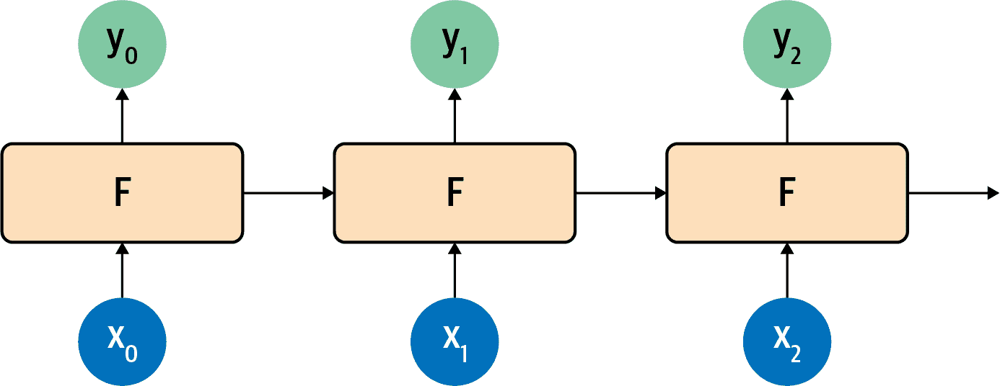

# 第七章：用于自然语言处理的递归神经网络

在第五章中，您看到了如何对文本进行标记化和序列化，将句子转换为可以输入神经网络的数字张量。然后在第六章中，您通过研究嵌入来扩展了这一概念，这是一种使具有相似含义的词汇聚集在一起的方法，以便计算情感。这种方法非常有效，正如您通过构建讽刺分类器所看到的那样。但是，这也有其局限性，即句子不仅仅是词汇的集合——词汇的顺序通常会决定其整体含义。形容词可以增加或改变它们旁边的名词的含义。例如，“蓝色”从情感角度来看可能毫无意义，同样“天空”也是如此，但是当您将它们组合成“蓝天”时，通常会产生一种明确的积极情感。有些名词可能会修饰其他名词，比如“雨云”、“写字桌”、“咖啡杯”。

要考虑到这样的序列，需要一种额外的方法，那就是在模型架构中考虑*递归*。在本章中，您将看到不同的实现方式。我们将探索如何学习序列信息，以及如何利用这些信息来创建一种更能理解文本的模型：*递归神经网络*（RNN）。

# 循环的基础

要理解递归如何工作，让我们首先考虑到目前为止在本书中使用的模型的局限性。最终，创建一个模型看起来有点像图 7-1。您提供数据和标签，并定义一个模型架构，模型学习适合数据与标签的规则。然后这些规则作为 API 提供给您，以便将来预测数据的标签。


###### 图 7-1。模型创建的高级视图

但正如您所看到的，数据是作为整体存在的。没有细化的过程，也没有努力去理解数据发生的顺序。这意味着，“蓝色”和“天空”在“今天我感到忧郁，因为天空是灰色”和“今天我很开心，天空很美丽”这样的句子中没有不同的含义。对于我们来说，这些词的使用差异是显而易见的，但是对于一个使用这里显示的架构的模型来说，实际上是没有差异的。

那么我们该如何解决这个问题呢？让我们首先探索递归的本质，然后您就能看到基本的 RNN 是如何工作的。

考虑一下著名的斐波那契数列。如果您对它不熟悉，我已经将一些放在图 7-2 中。


###### 图 7-2。斐波那契数列的前几个数字

这个序列背后的思想是，每个数字都是前两个数字的和。所以如果我们从 1 和 2 开始，下一个数字是 1 + 2，即 3。然后是 2 + 3，即 5，然后是 3 + 5，即 8，依此类推。

我们可以将这放在计算图中得到 Figure 7-3。


###### Figure 7-3\. Fibonacci 序列的计算图表示

在这里，你可以看到我们将 1 和 2 输入函数，得到 3 作为输出。我们将第二个参数（2）传递到下一个步骤，并将它与前一个步骤的输出（3）一起输入函数。这样得到的输出是 5，并将其与前一个步骤的第二个参数（3）一起输入函数得到 8。这个过程无限进行下去，每个操作都依赖于前面的操作。左上角的 1 在整个过程中“存活”。它是传入第二次操作的 3 的一部分，是传入第三次操作的 5 的一部分，依此类推。因此，1 的某些本质在整个序列中得到了保留，尽管它对整体值的影响逐渐减弱。

这类似于递归神经元的结构。你可以在 Figure 7-4 中看到典型的递归神经元表示。


###### Figure 7-4\. 一个递归神经元

一个值 x 在时间步中被输入到函数 F 中，通常标记为 x[t]。这产生该时间步的输出 y[t]，通常标记为 y[t]。它还产生一个传递到下一个步骤的值，由从 F 到自身的箭头表示。

如果你看看时间步中的递归神经元如何在一起工作，这一点就会更清楚，你可以在 Figure 7-5 中看到。



###### Figure 7-5\. 时间步中的递归神经元

在这里，对 x[0]进行操作得到 y[0]和传递的值。下一步得到该值和 x[1]，产生 y[1]和传递的值。接下来的步骤中，获取该值和 x[2]，产生 y[2]和传递的值，依此类推。这与我们在斐波那契序列中看到的情况类似，我总是觉得这是一个很好的助记符，帮助记住 RNN 的工作原理。

# 扩展语言的递归

在前一节中，您看到了一个递归神经网络如何在多个时间步长上操作，以帮助在序列中保持上下文。确实，在本书的后面，RNNs 将用于序列建模。但是，当涉及到语言时，使用简单的 RNN（如图 7-4 中的递归神经元 和图 7-5 中的时间步骤中的递归神经元）可能会忽略一个细微差别。就像之前提到的斐波那契数列示例一样，随着时间的推移，所携带的上下文量会逐渐减少。在步骤 1 的神经元输出的影响在步骤 2 时很大，在步骤 3 时较小，在步骤 4 时更小，依此类推。因此，如果我们有一个句子如“今天天气很好，有美丽的蓝色<something>”，单词“蓝色”对下一个单词的影响很大；我们可以猜测下一个单词可能是“天空”。但是来自句子更早部分的上下文呢？例如，考虑句子“I lived in Ireland, so in high school I had to learn how to speak and write<something>。”。

那个<something>是盖尔语，但真正给我们提供上下文的词是“Ireland”，它在句子中要远得多。因此，为了能够识别<something>应该是什么，需要一种能够在更长距离上保留上下文的方法。RNN 的短期记忆需要变长，在承认这一点的基础上，对架构的改进被发明出来，称为*长短期记忆*（LSTM）。

我不会详细讨论 LSTM 如何工作的底层架构，但图 7-6 中显示的高级图表传达了主要观点。要了解更多关于内部操作的信息，请查看 Christopher Olah 的优秀[博文](https://oreil.ly/6KcFA)。

LSTM 架构通过添加“单元状态”来增强基本的 RNN，使得不仅可以在步骤与步骤之间，而且可以跨整个步骤序列中保持上下文。请记住这些是神经元，像神经元一样学习，这确保了重要的上下文会随着时间学习。


###### 图 7-6 LSTM 架构的高级视图

LSTM 的一个重要部分是它可以是双向的——时间步骤既可以向前迭代，也可以向后迭代，因此可以在两个方向上学习上下文。详见图 7-7 中的高级视图。


###### 图 7-7 LSTM 双向架构的高级视图

这样，从 0 到*number_of_steps* 的方向进行评估，以及从*number_of_steps* 到 0 进行评估。在每个步骤中，*y* 结果是“前向”传递和“后向”传递的汇总。您可以在图 7-8 中看到这一点。


###### 图 7-8 双向 LSTM

在每个时间步考虑每个神经元为 F0、F1、F2 等。时间步的方向显示在这里，所以前向方向的 F1 计算是 F1(->)，反向方向是(<-)F1。这些值被聚合以给出该时间步的 y 值。此外，细胞状态是双向的。这对于管理句子中的上下文非常有用。再次考虑句子“I lived in Ireland, so in high school I had to learn how to speak and write <something>”，你可以看到<something>是通过上下文词“Ireland”来限定为“Gaelic”。但如果情况反过来：“I lived in <this country>，so in high school I had to learn how to speak and write Gaelic”？通过反向遍历句子，我们可以了解<this country>应该是什么。因此，使用双向 LSTM 对于理解文本中的情感非常强大（正如你将在第八章中看到的，它们对于生成文本也非常强大！）。

当然，使用 LSTM 时有很多复杂的情况，特别是双向 LSTM，所以期望训练速度较慢。这时候值得投资一块 GPU，或者至少在 Google Colab 上使用托管的 GPU。

# 使用 RNN 创建文本分类器

在第六章中，你尝试使用嵌入创建了一个 Sarcasm 数据集的分类器。在那种情况下，单词在汇总之前被转换为向量，然后被送入密集层进行分类。当使用 RNN 层如 LSTM 时，你不会进行汇总，可以直接将嵌入层的输出馈送到递归层。当涉及到递归层的维度时，你经常会看到的一个经验法则是它与嵌入维度相同。这并非必需，但可以作为一个很好的起点。请注意，虽然在第六章中我提到嵌入维度通常是词汇量的四分之一根号，但当使用 RNN 时，你通常会看到这个规则被忽略，因为这会使递归层的大小太小。

因此，例如，在第六章中你开发的 Sarcasm 分类器的简单模型架构可以更新为使用双向 LSTM：

```
model = tf.keras.Sequential([
    tf.keras.layers.Embedding(vocab_size, embedding_dim),
 `tf``.``keras``.``layers``.``Bidirectional``(``tf``.``keras``.``layers``.``LSTM``(``embedding_dim``)``)``,`
    tf.keras.layers.Dense(24, activation='relu'),
    tf.keras.layers.Dense(1, activation='sigmoid')
])
```

损失函数和分类器可以设置为这个（请注意学习率为 0.00001，或者 1e–5）：

```
adam = tf.keras.optimizers.Adam(learning_rate=0.00001, 
                                beta_1=0.9, beta_2=0.999, amsgrad=False)

model.compile(loss='binary_crossentropy',
              optimizer=adam, metrics=['accuracy'])
```

当你打印出模型架构摘要时，你会看到像这样的内容。注意词汇表大小为 20,000，嵌入维度为 64。这使得嵌入层有 1,280,000 个参数，双向层将有 128 个神经元（64 个前向，64 个后向）：

```
Layer (type)                 Output Shape              Param # 
=================================================================
embedding_11 (Embedding)     (None, None, 64)          1280000   
_________________________________________________________________
bidirectional_7 (Bidirection (None, 128)               66048     
_________________________________________________________________
dense_18 (Dense)             (None, 24)                3096      
_________________________________________________________________
dense_19 (Dense)             (None, 1)                 25        
=================================================================
Total params: 1,349,169
Trainable params: 1,349,169
Non-trainable params: 0
_________________________________________________________________
```

图 7-9 显示了使用这个模型在 30 个 epochs 上训练的结果。

正如您所见，网络在训练数据上的准确率迅速上升至 90%以上，但验证数据在大约 80%处趋于平稳。这与我们之前得到的数据类似，但检查图 7-10 中的损失图表表明，尽管在 15 个 epoch 后验证集的损失出现了分歧，但与第六章中的损失图表相比，使用了 2 万个词而非 2 千个词后，它也趋于平缓并降至了较低的值。


###### 图 7-9\. LSTM 30 个 epoch 的准确率


###### 图 7-10\. LSTM 30 个 epoch 的损失

不过，这仅使用了单个 LSTM 层。在下一节中，您将看到如何使用堆叠 LSTMs，并探讨其对分类此数据集准确性的影响。

## 堆叠 LSTMs

在上一节中，您看到如何在嵌入层后使用 LSTM 层来帮助分类讽刺数据集的内容。但是 LSTMs 可以相互堆叠，许多最先进的自然语言处理模型都使用了这种方法。

使用 TensorFlow 堆叠 LSTMs 非常简单。您只需像添加`Dense`层一样添加它们作为额外的层，但所有层都需要将其`return_sequences`属性设置为`True`，直到最后一层为止。以下是一个例子：

```
model = tf.keras.Sequential([
    tf.keras.layers.Embedding(vocab_size, embedding_dim),
    tf.keras.layers.Bidirectional(tf.keras.layers.LSTM(embedding_dim, 
	`return_sequences``=``True`)),
    tf.keras.layers.Bidirectional(tf.keras.layers.LSTM(embedding_dim)),
    tf.keras.layers.Dense(24, activation='relu'),
    tf.keras.layers.Dense(1, activation='sigmoid')
])
```

最后一层也可以设置`return_sequences=True`，在这种情况下，它将返回模型输出的序列值而不是单个值给密集层进行分类。这在解析模型输出时非常方便，稍后我们将讨论。模型架构将如下所示：

```
Layer (type)                 Output Shape              Param # 
=================================================================
embedding_12 (Embedding)     (None, None, 64)          1280000   
_________________________________________________________________
bidirectional_8 (Bidirection (None, None, 128)         66048     
_________________________________________________________________
bidirectional_9 (Bidirection (None, 128)               98816     
_________________________________________________________________
dense_20 (Dense)             (None, 24)                3096      
_________________________________________________________________
dense_21 (Dense)             (None, 1)                 25        
=================================================================
Total params: 1,447,985
Trainable params: 1,447,985
Non-trainable params: 0
_________________________________________________________________
```

添加额外的层将使我们大约有 100,000 个额外的参数需要学习，增加约 8%。因此，这可能会减慢网络的速度，但如果有合理的好处，成本相对较低。

在训练了 30 个 epoch 后，结果如图 7-11 所示。虽然验证集的准确率保持平稳，但检查损失（图 7-12）却讲述了不同的故事。


###### 图 7-11\. 堆叠 LSTM 架构的准确率

如您在图 7-12 中所见，尽管训练和验证的准确率看起来都很好，但验证损失迅速上升，这是过拟合的明显迹象。


###### 图 7-12\. 堆叠 LSTM 架构的损失

过拟合（由于训练准确性向 100% 上升，同时损失平稳下降，而验证准确性相对稳定且损失急剧增加）是模型过于专注于训练集的结果。与 第六章 中的示例一样，这表明如果仅查看准确性指标而不检查损失，就很容易陷入错误的安全感中。

### 优化堆叠 LSTM

在 第六章 中，您看到减少学习率是减少过拟合非常有效的方法。值得探索一下，这是否对循环神经网络也会产生积极的影响。

例如，以下代码将学习率从 0.00001 减少了 20%，变为 0.000008：

```
adam = tf.keras.optimizers.Adam(`learning_rate``=``0.000008`, 
  beta_1=0.9, beta_2=0.999, amsgrad=False)

model.compile(loss='binary_crossentropy',
  optimizer=adam,metrics=['accuracy'])
```

图 7-13 展示了这一点对训练的影响。看起来差别不大，尽管曲线（特别是对于验证集）稍微平滑一些。


###### 图 7-13\. 堆叠 LSTM 的准确性随降低学习率的影响

尽管初步观察 图 7-14 同样显示由于降低学习率而对损失的影响较小，但值得更仔细地观察。尽管曲线形状大致相似，但损失增长速率显然更低：经过 30 个 epoch 后，损失约为 0.6，而较高学习率时接近 0.8。调整学习率超参数确实值得研究。


###### 图 7-14\. 减少学习率对堆叠 LSTM 的损失的影响

### 使用 dropout

除了改变学习率参数外，在 LSTM 层中使用 dropout 也是值得考虑的。它的工作原理与密集层完全相同，正如在 第三章 中讨论的那样，随机删除神经元以防止邻近偏差影响学习。

Dropout 可以通过 LSTM 层上的参数实现。以下是一个示例：

```
model = tf.keras.Sequential([
    tf.keras.layers.Embedding(vocab_size, embedding_dim),
    tf.keras.layers.Bidirectional(tf.keras.layers.LSTM(embedding_dim,
	return_sequences=True, `dropout``=``0.2`)),
    tf.keras.layers.Bidirectional(tf.keras.layers.LSTM(embedding_dim,
	`dropout``=``0.2`)),
    tf.keras.layers.Dense(24, activation='relu'),
    tf.keras.layers.Dense(1, activation='sigmoid')
])
```

注意，在实施 dropout 后会显著减慢训练速度。在我的情况下，使用 Colab，每个 epoch 的时间从约 10 秒增加到约 180 秒。

准确性结果可以在 图 7-15 中看到。


###### 图 7-15\. 使用 dropout 的堆叠 LSTM 的准确性

正如您所见，使用 dropout 对网络的准确性影响不大，这是好事！总是担心失去神经元会使模型表现更差，但正如我们在这里看到的那样，情况并非如此。

正如你在图 7-16 中所见，损失也有积极的影响。

虽然曲线明显分开，但它们比之前更接近，验证集的损失在约 0.5 左右趋于平缓。这比之前看到的 0.8 显著更好。正如这个例子所示，dropout 是另一种可以用来提高基于 LSTM 的 RNN 性能的方便技术。


###### 图 7-16\. 使用 dropout 的 LSTM 的损失曲线

探索这些技术以避免过拟合您的数据，以及我们在第六章 中介绍的预处理数据的技术。但有一件事我们还没有尝试过——一种迁移学习的形式，您可以使用预先学习的词嵌入，而不是尝试学习您自己的。我们将在接下来探讨这个问题。

# 使用 RNNs 的预训练嵌入

在所有先前的例子中，您收集了用于训练集的完整单词集，然后用它们训练嵌入。这些最初是聚合的，然后被输入到稠密网络中，在这一章中，您探索了如何使用 RNN 来改进结果。在这样做的同时，您受限于数据集中的词汇及其嵌入如何使用从该数据集的标签中学习。

回想一下第四章，我们讨论了迁移学习。如果，你可以使用预先学习的嵌入，而不是自己学习嵌入，那会怎样呢？研究人员已经把词语转换为向量，并且这些向量是经过验证的，一个例子是由斯坦福大学的杰弗里·彭宁顿、理查德·索切尔和克里斯托弗·曼宁开发的[GloVe（全球词向量表示）模型](https://oreil.ly/4ENdQ)。

在这种情况下，研究人员分享了各种数据集的预训练词向量：

+   一个从维基百科和 Gigaword 中取词的 60 亿令牌、40 万字词汇、50、100、200 和 300 维度的集合

+   来自常见爬网的 4200 亿令牌、190 万字词汇、300 维度

+   一个来自常见爬网的 8400 亿令牌、220 万字词汇、300 维度

+   一个来自 Twitter 爬 20 亿推文的 270 亿令牌、120 万字词汇、25、50、100 和 200 维度

鉴于这些向量已经预先训练，您可以简单地在您的 TensorFlow 代码中重复使用它们，而不是从头开始学习。首先，您需要下载 GloVe 数据。我选择使用 270 亿令牌和 120 万字词汇的 Twitter 数据。下载是一个包含 25、50、100 和 200 维度的存档。

为了使您更容易，我已经托管了 25 维度版本，并且您可以像这样将其下载到 Colab 笔记本中：

```
!wget --`no`-check-certificate \
    https://storage.googleapis.com/laurencemoroney-blog.appspot.com
 `/``glove``.``twitter``.``27``B``.``25``d``.``zip` `\`
    -O /tmp/glove.zip
```

这是一个 ZIP 文件，所以您可以像这样解压它，得到一个名为*glove.twitter.27b.25d.txt*的文件：

```
# Unzip GloVe embeddings
`import` `os`
`import` `zipfile`

`local_zip` `=` `'``/tmp/glove.zip``'`
`zip_ref` `=` `zipfile``.``ZipFile``(``local_zip``,` `'``r``'``)`
`zip_ref``.``extractall``(``'``/tmp/glove``'``)`
`zip_ref``.``close``(``)`
```

文件中的每个条目都是一个单词，后跟为其学习的维度系数。使用这种方法的最简单方式是创建一个字典，其中键是单词，值是嵌入。您可以像这样设置此字典：

```
glove_embeddings = dict()
f = open(`'``/tmp/glove/glove.twitter.27B.25d.txt``'`)
`for` line `in` f:
    values = line.split()
    word = values[`0`]
    coefs = np.asarray(values[`1`:], dtype=`'``float32``'`)
    glove_embeddings[word] = coefs
f.close()
```

在这一点上，您可以简单地使用单词作为键来查找任何单词的系数集。例如，要查看“frog”的嵌入，您可以使用：

```
glove_embeddings[`'`frog`'`]
```

有了这个资源，您可以像以前一样使用标记器获取您的语料库的单词索引，但现在您可以创建一个新的矩阵，我将其称为*嵌入矩阵*。这将使用 GloVe 集合的嵌入（从`glove_embeddings`中获取）作为其值。因此，如果您检查数据集中的单词索引的单词，就像这样：

```
`{`'<OOV>'`:` `1``,` 'new'`:` `2``,` … 'not'`:` `5``,` 'just'`:` `6``,` 'will'`:` `7`
```

然后，嵌入矩阵中的第一行应该是“<OOV>”的 GloVe 系数，下一行将是“new”的系数，依此类推。

您可以使用以下代码创建该矩阵：

```
embedding_matrix = np.zeros((vocab_size, embedding_dim))
`for` word, index `in` tokenizer.word_index.items():
    `if` index > vocab_size - `1`:
        `break`
    `else`:
        embedding_vector = glove_embeddings.`get`(word)
        `if` embedding_vector `is` `not` `None`:
            embedding_matrix[index] = embedding_vector
```

这只是创建一个具有所需词汇大小和嵌入维度的矩阵。然后，对于标记器的每个单词索引中的每个项，您从`glove_embeddings`中查找系数，并将这些值添加到矩阵中。

然后，通过设置`weights`参数将嵌入层改为使用预训练的嵌入，并通过设置`trainable=False`来指定不训练该层：

```
model = tf.keras.Sequential([
    tf.keras.layers.Embedding(vocab_size, embedding_dim, 
`weights``=``[``embedding_matrix``]``,` `trainable``=``False`),
    tf.keras.layers.Bidirectional(tf.keras.layers.LSTM(embedding_dim, 
                                  return_sequences=True)),
    tf.keras.layers.Bidirectional(tf.keras.layers.LSTM(embedding_dim)),
    tf.keras.layers.Dense(24, activation='relu'),
    tf.keras.layers.Dense(1, activation='sigmoid')
])
```

现在您可以像以前一样进行训练。但是，您需要考虑您的词汇量大小。在上一章中，为了避免过拟合，您进行了优化，目的是避免使学习低频词汇的嵌入变得过度负担，您通过使用较小的经常使用的单词词汇来避免过拟合。在这种情况下，由于单词嵌入已经在 GloVe 中学习过，您可以扩展词汇表，但要扩展多少？

首先要探索的是您的语料库中有多少单词实际上在 GloVe 集合中。它有 120 万个单词，但不能保证它*所有*都有您的单词。

所以，这里有一些代码可以进行快速比较，以便您可以探索您的词汇量应该有多大。

首先让我们整理一下数据。创建一个 X 和 Y 的列表，其中 X 是单词索引，如果单词在嵌入中则 Y=1，否则为 0。此外，您可以创建一个累积集合，在每个时间步骤计算单词的商。例如，索引为 0 的单词“OOV”不在 GloVe 中，所以它的累积 Y 为 0。下一个索引处的单词“new”在 GloVe 中，所以它的累积 Y 为 0.5（即到目前为止一半的单词在 GloVe 中），您可以继续以此方式统计整个数据集：

```
xs=[]
ys=[]
cumulative_x=[]
cumulative_y=[]
total_y=`0`
`for` word, index `in` tokenizer.word_index.items():
  xs.append(index)
  cumulative_x.append(index)
  `if` glove_embeddings.`get`(word) `is` `not` `None`:
    total_y = total_y + `1`
    ys.append(`1`)
  `else`:
    ys.append(`0`)
  cumulative_y.append(total_y / index)
```

然后，您可以使用以下代码将 X 与 Y 进行绘制：

```
`import` matplotlib.pyplot `as` plt
fig, ax = plt.subplots(figsize=(`12`,`2`))
ax.spines[`'``top``'`].set_visible(`False`)

plt.margins(x=`0`, y=`None`, tight=`True`)
`#plt.axis([13000, 14000, 0, 1])`
plt.fill(ys)
```

这将为您提供一个词频图，看起来类似于图 7-17。


###### 图 7-17\. 词频图

正如您在图表中所见，密度在 10,000 和 15,000 之间发生变化。这使您可以粗略检查，大约在第 13,000 个 token 处，不在 GloVe 嵌入中的单词频率开始超过在其中的单词。

如果您然后绘制 `cumulative_x` 对 `cumulative_y`，您可以更好地理解这一点。这是代码：

```
`import` matplotlib.pyplot `as` plt
plt.plot(cumulative_x, cumulative_y)
plt.axis([`0`, `25000`, .`915`, .`985`])
```

您可以在 图 7-18 中查看结果。


###### 图 7-18\. 绘制单词索引频率对 GloVe 的影响

您现在可以调整 `plt.axis` 中的参数来放大，以找到不在 GloVe 中的单词开始超过那些在 GloVe 中的单词的拐点。这是您设置词汇表大小的良好起点。

使用这种方法，我选择了词汇量为 13,200（而不是之前的 2,000，以避免过拟合），以及这种模型架构，其中 `embedding_dim` 是 `25`，因为我使用的是 GloVe 集：

```
model = tf.keras.`Sequential`([
    tf.keras.layers.`Embedding`(vocab_size, embedding_dim, 
weights=[embedding_matrix], trainable=`False`),
    tf.keras.layers.`Bidirectional`(tf.keras.layers.LSTM(embedding_dim, 
return_sequences=`True`)),
    tf.keras.layers.`Bidirectional`(tf.keras.layers.LSTM(embedding_dim)),
    tf.keras.layers.`Dense`(`24`, activation=`'``relu``'`),
    tf.keras.layers.`Dense`(`1`, activation=`'``sigmoid``'`)
])
adam = tf.keras.optimizers.`Adam`(learning_rate=`0.00001`, beta_1=`0.9`, beta_2=`0.999`,
amsgrad=`False`)
model.compile(loss=`'``binary_crossentropy``'`,optimizer=adam, metrics=[`'``accuracy``'`])
```

将其训练 30 个 epoch 可以获得一些出色的结果。准确性显示在 图 7-19 中。验证准确性非常接近训练准确性，表明我们不再过拟合。


###### 图 7-19\. 使用 GloVe 嵌入的堆叠 LSTM 准确性

这一点得到了损失曲线的支持，如 图 7-20 所示。验证损失不再发散，表明尽管我们的准确性只有约 73%，但我们可以相信模型在这个程度上是准确的。


###### 图 7-20\. 使用 GloVe 嵌入的堆叠 LSTM 损失

将模型训练更长时间显示出非常相似的结果，并表明尽管过拟合开始在大约第 80 个 epoch 发生，但模型仍然非常稳定。

准确性指标 (图 7-21) 显示出一个训练良好的模型。

损失指标 (图 7-22) 显示大约在第 80 个 epoch 开始发散，但模型仍然适合。


###### 图 7-21\. 使用 GloVe 嵌入的堆叠 LSTM 准确性在 150 个 epoch 上


###### 图 7-22\. 使用 GloVe 嵌入的堆叠 LSTM 在 150 个 epoch 上的损失

这告诉我们，这个模型是早期停止的一个好候选，您只需训练 75–80 个 epoch 就可以得到最佳结果。

我用 *The Onion* 的标题测试了它，这是 Sarcasm 数据集中讽刺标题的来源，与其他句子进行了对比，如下所示：

```
`test_sentences` `=` `[`"It Was, For, Uh, Medical Reasons, Says Doctor To Boris Johnson,
Explaining Why They Had To Give Him Haircut"`,`

"It's a beautiful sunny day"`,`

"I lived in Ireland, so in high school they made me learn to speak and write in
Gaelic"`,`

"Census Foot Soldiers Swarm Neighborhoods, Kick Down Doors To Tally Household
Sizes"`]`
```

这些标题的结果如下 —— 请记住，接近 50%（0.5）的值被视为中性，接近 0 的值为非讽刺，接近 1 的值为讽刺：

```
[[`0.8170955` ]
 [`0.08711044`]
 [`0.61809343`]
 [`0.8015281` ]]
```

第一句和第四句，摘自*The Onion*，显示出 80%以上的讽刺可能性。关于天气的声明强烈地不是讽刺（9%），而关于在爱尔兰上高中的句子被认为可能是讽刺的，但置信度不高（62%）。

# 摘要

本章向您介绍了递归神经网络，它们在设计中使用面向序列的逻辑，并且可以帮助您理解句子中的情感，这不仅基于它们包含的单词，还基于它们出现的顺序。您了解了基本的 RNN 工作原理，以及 LSTM 如何在此基础上进行改进，从而能够长期保留上下文。您利用这些内容改进了自己一直在研究的情感分析模型。然后，您深入探讨了 RNN 的过拟合问题以及改进技术，包括利用预训练嵌入进行迁移学习。在第八章中，您将利用所学知识探索如何预测单词，并从中创建一个为您写诗的文本生成模型！
