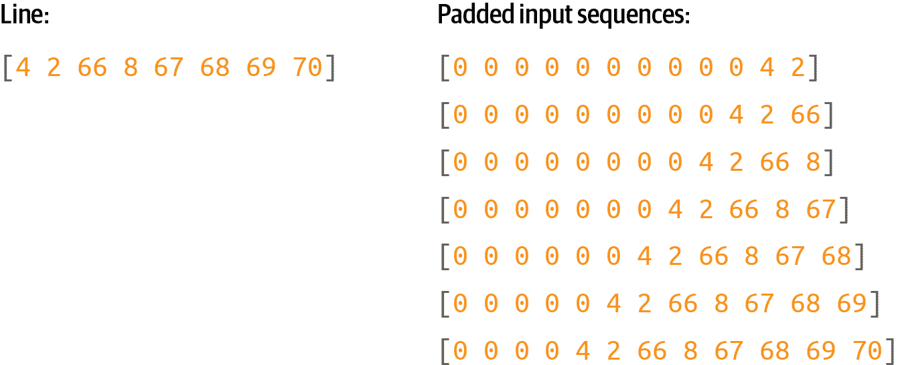

# 第八章：使用 TensorFlow 创建文本

+   *你什么都不知道，琼·雪诺*

+   *他所驻扎的地方*

+   *无论是在科克还是在蓝鸟的儿子那里*

+   *航行到夏天*

+   *旧甜长和喜悦的戒指*

+   *所以我会等待野生的小姑娘去世*

这段文字是由一个在小语料库上训练的非常简单的模型生成的。我稍微增强了它，通过添加换行和标点，但除了第一行外，其余都是由你将在本章学习如何构建的模型生成的。提到*野生的小姑娘去世*有点酷——如果你看过琼·雪诺来自的那部剧，你会明白为什么！

在过去的几章中，你看到如何使用基于文本的数据来使用 TensorFlow，首先将其标记化为可以由神经网络处理的数字和序列，然后使用嵌入来模拟使用向量的情感，最后使用深度和递归神经网络来分类文本。我们使用了 Sarcasm 数据集，一个小而简单的数据集，来说明所有这些是如何工作的。在本章中，我们将转换方向：不再分类现有文本，而是创建一个能够*预测*文本的神经网络。给定一个文本语料库，它将尝试理解其中的词语模式，以便在给出一个称为*种子*的新文本时，预测下一个应该出现的词语。一旦有了这个预测，种子和预测的词语将成为新的种子，然后可以预测下一个词语。因此，当神经网络在文本语料库上训练完成后，它可以尝试以类似的风格编写新的文本。为了创建上面的诗歌片段，我收集了许多传统爱尔兰歌曲的歌词，用它们来训练神经网络，并用它来预测词语。

我们会从简单开始，用少量文字来说明如何建立预测模型，最终会创建一个含有更多文字的完整模型。之后，你可以尝试一下，看它能创造出怎样的诗歌！

要开始，你必须对待这段文本有所不同，与你迄今为止所做的不同。在前几章中，你将句子转换为序列，然后根据其中标记的嵌入进行分类。

在创建用于训练这种预测模型的数据时，还有一个额外的步骤，需要将序列转换为*输入序列*和*标签*，其中输入序列是一组词，标签是句子中的下一个词。然后你可以训练一个模型来将输入序列与它们的标签匹配，以便未来的预测可以选择接近输入序列的标签。

# 将序列转换为输入序列

在预测文本时，你需要用一个带有相关标签的输入序列（特征）来训练神经网络。将序列与标签匹配是预测文本的关键。

因此，例如，如果在你的语料库中有句子“今天有美丽的蓝天”，你可以将其分割为“今天有美丽的蓝”作为特征，“天空”作为标签。然后，如果你对文本“今天有美丽的蓝”进行预测，它很可能是“天空”。如果在训练数据中你还有“昨天有美丽的蓝天”，同样方式分割，如果你对文本“明天会有美丽的蓝色”进行预测，那么很可能下一个词是“天空”。

给定大量的句子，训练使用单词序列及其下一个单词作为标签的模型，可以快速建立起一个预测模型，在文本的现有体系中预测出句子中最可能的下一个单词。

我们将从一个非常小的文本语料库开始——这是一首传统爱尔兰歌曲的摘录，这首歌的部分歌词如下：

+   *在阿西镇有位杰里米·兰尼根*

+   *一直打到他一文不名。*

+   *他的父亲去世了，使他重新成为一个男子汉。*

+   *留给他一块农场和十英亩地。*

+   *他为亲朋好友举办了一场盛大的派对*

+   *谁在到达墙壁时没有忘记他，*

+   *如果你愿意听，我会让你的眼睛闪闪发亮，*

+   *在兰尼根的舞会上的争执和混乱。*

+   *我自己确实得到了自由邀请，*

+   *对于所有的好女孩和好男孩，我可能会问，*

+   *仅仅一分钟内，亲朋好友都来了，*

+   *像蜜蜂围着一桶酒快乐地跳舞。*

+   *朱迪·奥达利，那位可爱的小帽匠，*

+   *她给我眨了一下眼睛让我去找她，*

+   *我很快和佩吉·麦吉利根一起到了，*

+   *刚好赶上兰尼根的舞会。*

创建一个包含所有文本的单个字符串，并将其设置为您的数据。使用`\n`表示换行。然后，这个语料库可以像这样轻松加载和分词化：

```
tokenizer = `Tokenizer`()

data=`"``In the town of Athy one Jeremy Lanigan` `\n` `Battered away ... ...``"`
corpus = data.lower().split(`"``\n``"`)

tokenizer.fit_on_texts(corpus)
total_words = len(tokenizer.word_index) + `1`
```

此过程的结果是用它们的标记值替换单词，如图 8-1 所示。


###### 图 8-1\. 句子分词

要训练一个预测模型，我们应该在这里进一步进行一步操作——将句子分割成多个较小的序列，例如，我们可以有一个由前两个标记组成的序列，另一个由前三个标记组成，依此类推（图 8-2）。


###### 图 8-2\. 将序列转换为多个输入序列

要做到这一点，您需要逐行遍历语料库中的每一行，并使用`texts_to_sequences`将其转换为标记列表。然后，您可以通过循环遍历每个标记并制作一个包含所有标记的列表，来拆分每个列表。

这里是代码：

```
input_sequences = []
`for` line `in` corpus:
    token_list = tokenizer.texts_to_sequences([line])[`0`]
    `for` i `in` range(`1`, len(token_list)):
        n_gram_sequence = token_list[:i+`1`]
        input_sequences.append(n_gram_sequence)

`print`(input_sequences[:`5`])
```

一旦你有了这些输入序列，你可以将它们填充成常规形状。我们将使用预填充（图 8-3）。



###### 图 8-3\. 填充输入序列

为此，你需要找到输入序列中最长的句子，并将所有内容填充到该长度。以下是代码：

```
max_sequence_len = max([len(x) `for` x `in` input_sequences])

input_sequences = np.array(pad_sequences(input_sequences, 
                            maxlen=max_sequence_len, padding=`'``pre``'`))
```

最后，一旦你有一组填充的输入序列，你可以将它们分为特征和标签，其中标签只是输入序列中的最后一个令牌（图 8-4）。


###### 图 8-4\. 将填充序列转换为特征（x）和标签（y）

在训练神经网络时，你将要将每个特征与其对应的标签匹配。例如，[0 0 0 0 4 2 66 8 67 68 69] 的标签将是 [70]。

这是分离输入序列中标签的代码：

```
xs, labels = input_sequences[:,:-`1`],input_sequences[:,-`1`]
```

接下来，你需要对标签进行编码。目前它们只是令牌—例如，在图 8-4 的顶部的数字 2。但是如果你想要在分类器中使用令牌作为标签，它将必须映射到一个输出神经元。因此，如果你要分类 *n* 个单词，每个单词都是一个类，你将需要 *n* 个神经元。这里控制词汇量的大小非常重要，因为你拥有的单词越多，你就需要更多的类。回想一下在第 2 和第三章中，当你用 Fashion MNIST 数据集对时尚物品进行分类时，你有 10 种类型的服装？那就需要在输出层有 10 个神经元。在这种情况下，如果你想预测多达 10,000 个词汇单词，你将需要一个包含 10,000 个神经元的输出层！

此外，你需要对标签进行独热编码，以便它们与神经网络的期望输出匹配。考虑到图 8-4。如果神经网络被输入 X，其中包含一系列 0，然后是一个 4，你希望预测结果是 2，但网络是通过具有 *词汇量* 个神经元的输出层来实现这一点，其中第二个神经元具有最高的概率。

要将标签编码为一组 Y，然后用于训练，你可以使用 `tf.keras` 中的 `to_categorical` 实用程序：

```
ys = tf.keras.utils.to_categorical(labels, num_classes=total_words)
```

你可以在图 8-5 中看到这一点。


###### 图 8-5\. 独热编码标签

这是一种非常稀疏的表示方法，如果你有大量的训练数据和大量的可能单词，内存消耗会非常快！假设你有 100,000 个训练句子，词汇量为 10,000 个词，你需要 1,000,000,000 字节来存储标签！但如果我们要设计我们的网络来分类和预测单词，这就是我们不得不采取的方式。

# 创建模型

现在让我们创建一个可以用这些输入数据进行训练的简单模型。它将只包括一个嵌入层，然后是一个 LSTM，再后面是一个稠密层。

对于嵌入，你将需要每个单词一个向量，因此参数将是单词总数和你想要嵌入的维度数。在这种情况下，我们单词不多，因此八个维度应该足够了。

你可以使 LSTM 双向运行，步骤数可以是序列的长度，即我们的最大长度减 1（因为我们取出了末尾的一个标记来作为标签）。

最后，输出层将是一个密集层，参数为单词的总数，由 softmax 激活。该层中的每个神经元将是下一个单词与该索引值的单词匹配的概率：

```
`model` `=` Sequential`(``)`
`model``.``add``(`Embedding`(``total_words``,` `8``)``)`
`model``.``add``(`Bidirectional`(``LSTM``(``max_sequence_len``-``1``)``)``)`
`model``.``add``(`Dense`(``total_words``,` `activation``=``'``softmax``'``)``)`
```

编译模型时，使用像分类交叉熵这样的分类损失函数和像 Adam 这样的优化器。你也可以指定你想要捕捉的指标：

```
`model``.``compile``(``loss``=`'categorical_crossentropy'`,` 
               `optimizer``=`'adam'`,` `metrics``=``[`'accuracy'`]``)`
```

这是一个非常简单的模型，没有太多的数据，所以你可以训练很长时间——比如 1,500 个时期：

```
history = model.fit(xs, ys, epochs=`1500`, verbose=`1`)
```

在经过 1,500 个时期后，你会发现它已经达到了非常高的准确率（图表 8-6）。


###### 图表 8-6\. 训练准确率

当模型达到大约 95%的准确率时，我们可以确信，如果我们有一段它已经见过的文本，它会大约 95%的时间准确地预测下一个单词。然而，请注意，当生成文本时，它将不断看到以前未曾见过的单词，因此尽管有这么好的数字，你会发现网络很快就会开始生成毫无意义的文本。我们将在下一节中探讨这一点。

# 生成文本

现在你已经训练出一个能够预测序列中下一个单词的网络，接下来的步骤是给它一段文本序列，并让它预测下一个单词。让我们看看如何实现这一点。

## 预测下一个单词

你将首先创建一个称为种子文本的短语。这是网络将基于其生成所有内容的初始表达式。它将通过预测下一个单词来完成这一操作。

从网络已经*看到*的短语开始，“在阿西镇”：

```
`seed_text` `=` "in the town of athy"
```

接下来你需要使用`texts_to_sequences`对其进行标记化。即使只有一个值，它也会返回一个数组，因此取该数组中的第一个元素：

```
token_list = tokenizer.texts_to_sequences([seed_text])[`0`]
```

然后你需要填充该序列，使其与训练时使用的数据形状相同：

```
token_list = pad_sequences([token_list], 
                            maxlen=max_sequence_len-`1`, padding=`'``pre``'`)
```

现在，你可以通过在标记列表上调用`model.predict`来预测该标记列表的下一个单词。这将返回语料库中每个单词的概率，因此将结果传递给`np.argmax`以获取最有可能的一个：

```
predicted = np.argmax(model.predict(token_list), axis=-`1`)
`print`(predicted)
```

这应该会给你一个值`68`。如果你查看单词索引，你会发现这是单词“one”：

```
'town'`:` `66``,` 'athy'`:` `67``,` 'one'`:` `68``,` 'jeremy'`:` `69``,` 'lanigan'`:` `70``,`
```

你可以通过搜索单词索引项目直到找到`predicted`并将其打印出来，在代码中查找它：

```
`for` word, index `in` tokenizer.word_index.items():
    `if` index == predicted:
        `print`(word)
        `break`
```

因此，从文本“在阿西镇”开始，网络预测下一个单词应该是“one”—如果你查看训练数据，这是正确的，因为歌曲以以下行开始：

+   ***在阿西镇** 一个杰里米·拉尼根*

+   -   *打击直到他没了一磅*

现在您已确认模型正在工作，您可以发挥创造力，并使用不同的种子文本。例如，当我使用种子文本“甜美的杰里米看到了都柏林”时，它预测的下一个单词是“然后”。（选择这段文本是因为所有这些词汇都在语料库中。您应该期望在这种情况下，至少在开始时，对预测单词的预期结果更为准确。）

## 合并预测以生成文本

在前一节中，您看到了如何使用模型预测给定种子文本的下一个单词。现在，要让神经网络创建新文本，只需重复预测，每次添加新单词即可。

例如，稍早时，当我使用短语“甜美的杰里米看到了都柏林”时，它预测下一个单词将是“然后”。您可以通过在种子文本后附加“然后”来扩展此过程，以获取“甜美的杰里米看到了都柏林然后”，并获得另一个预测。重复此过程将为您生成一个由 AI 创建的文本字符串。

这是前一节更新的代码，它执行了多次循环，次数由`next_words`参数设置：

```
seed_text = "sweet jeremy saw dublin"
next_words=10

for _ in range(next_words):
    token_list = tokenizer.texts_to_sequences([seed_text])[0]
    token_list = pad_sequences([token_list], 
 maxlen=max_sequence_len-1, padding='pre')
    predicted = model.predict_classes(token_list, verbose=0)
    output_word = ""

    for word, index in tokenizer.word_index.items():
        if index == predicted:
            output_word = word
            break
    seed_text += " " + output_word

print(seed_text)
```

这最终会创建一个类似这样的字符串：

```
sweet jeremy saw dublin then got there as me me a call doing me
```

它迅速陷入了胡言乱语。为什么呢？首先，训练文本的主体非常小，因此可用的上下文非常有限。其次，序列中下一个单词的预测取决于序列中的前一个单词，如果前几个单词匹配不好，即使是最佳的“下一个”匹配也会有很低的概率。当您将此添加到序列并预测其后的下一个单词时，它的概率会更高——因此，预测的单词看起来似乎是半随机的。

因此，例如，“甜美的杰里米看到了都柏林”中的所有单词虽然都存在于语料库中，但它们从未按照那种顺序出现过。在进行第一次预测时，选择了“然后”作为最可能的候选词，其概率相当高（89%）。当它被添加到种子中以得到“甜美的杰里米看到了都柏林然后”，我们得到了另一句在训练数据中未见过的短语，因此预测将最高概率赋予了单词“got”，概率为 44%。继续向句子添加单词会降低在训练数据中的匹配概率，因此预测准确性会降低——导致预测的单词具有更随机的“感觉”。

这导致了人工智能生成的内容随着时间的推移变得越来越荒谬。例如，看看优秀的科幻短片[*Sunspring*](https://oreil.ly/hTBtJ)，这部片子完全由基于 LSTM 的网络编写，就像您正在构建的这个网络，训练于科幻电影剧本。模型被给予种子内容，并被要求生成新的剧本。结果令人捧腹，您将看到，虽然初始内容是有意义的，但随着电影的进行，变得越来越难以理解。

# 扩展数据集

你可以很简单地将用于硬编码数据集的相同模式扩展到使用文本文件。我提供了一个文本文件，里面包含约 1700 行来自多首歌曲的文本，供你进行实验。稍作修改，你就可以使用这个文本文件代替单一的硬编码歌曲。

要在 Colab 中下载数据，请使用以下代码：

```
!wget --no-check-certificate \
    https://storage.googleapis.com/laurencemoroney-blog.appspot.com/ \
    irish-lyrics-eof.txt-O /tmp/irish-lyrics-eof.txt
```

然后你可以简单地从中加载文本到你的语料库中，像这样：

```
data = open('/tmp/irish-lyrics-eof.txt').read()
corpus = data.lower().split("\n")
```

然后你的其余代码就可以正常工作了！

将其训练一千个时期会使准确率达到约 60%，曲线趋于平缓（图 8-7）。


###### 图 8-7\. 在更大的数据集上训练

再次尝试“在阿西镇”的短语，预测得到“one”，但这次只有 40%的概率。

对于“甜美的杰里米看到了都柏林”，预测的下一个词是“drawn”，概率为 59%。预测接下来的 10 个单词：

```
sweet jeremy saw dublin drawn and fondly i am dead and the parting graceful
```

看起来好了一点！但我们能进一步改进吗？

# 改变模型架构

你可以改变模型的架构来改进它，使用多个堆叠的 LSTM。这很简单 —— 只需确保在第一个 LSTM 上设置`return_sequences`为`True`。这里是代码：

```
model = Sequential()
model.add(Embedding(total_words, 8))
model.add(Bidirectional(LSTM(max_sequence_len-1, `return_sequences``=``'``True``'`)))
`model``.``add``(``Bidirectional``(``LSTM``(``max_sequence_len``-``1``)``)``)`
model.add(Dense(total_words, activation='softmax'))
model.compile(loss='categorical_crossentropy', optimizer='adam', 
			  metrics=['accuracy'])
history = model.fit(xs, ys, epochs=1000, verbose=1)
```

你可以看到这对一千个时期的训练的影响在图 8-8 中，它与先前的曲线没有显著不同。


###### 图 8-8\. 添加第二个 LSTM 层

在使用之前相同的短语进行测试时，这一次在“在阿西镇”后，我得到了“more”作为下一个词，概率为 51%，而在“甜美的杰里米看到了都柏林”后，我得到了“cailín”（盖尔语中的“女孩”）的概率为 61%。同样地，在预测更多单词时，输出很快就变得支离破碎了。

这里有一些例子：

```
sweet jeremy saw dublin cailín loo ra fountain plundering that fulfill
you mccarthy you mccarthy down

you know nothing jon snow johnny cease and she danced that put to smother well
i must the wind flowers
dreams it love to laid ned the mossy and night i weirs
```

如果你得到了不同的结果，别担心 —— 你没有做错任何事情，但神经元的随机初始化会影响最终的得分。

# 改进数据

有一个小技巧，你可以用来扩展这个数据集的大小，而不添加任何新的歌曲，称为数据的“窗口化”。现在，每首歌的每一行都被读作一个单独的行，然后转换为输入序列，正如你在图 8-2 中看到的那样。虽然人类阅读歌曲时是逐行进行的，以听到韵律和节奏，但模型不必如此，尤其是在使用双向 LSTM 时。

所以，与其处理“在阿西镇，一个名叫杰里米·兰尼根”的这行，然后处理下一行（“击打直到他一文不剩”），我们可以将所有行视为一段长连续文本。我们可以创建一个*n*个单词的“窗口”来处理这段文本，然后移动窗口一个单词以获取下一个输入序列（图 8-9）。


###### 图 8-9\. 一个移动的单词窗口

在这种情况下，可以通过增加输入序列的数量来产生更多的训练数据。将窗口移动到整个文本语料库上，我们可以得到((*number_of_words* – *window_size*) × *window_size*)个输入序列，我们可以用来训练。

代码非常简单——在加载数据时，我们可以直接从语料库中的单词创建“句子”，而不是将每个歌词行分割为“句子”：

```
window_size=10
sentences=[]
alltext=[]
data = open('/tmp/irish-lyrics-eof.txt').read()
corpus = data.lower()
words = corpus.split(" ")
range_size = len(words)-max_sequence_len
for i in range(0, range_size):
    thissentence=""
    for word in range(0, window_size-1):
        word = words[i+word]
        thissentence = thissentence + word
        thissentence = thissentence + " "
    sentences.append(thissentence)
```

在这种情况下，因为我们不再有句子，而是创建与移动窗口大小相同的序列，`max_sequence_len`就是窗口的大小。完整的文件被读取，转换为小写，并使用字符串分割分成一个单词数组。然后，代码循环遍历单词，并将每个从当前索引到当前索引加上窗口大小的单词构造句子，将每个新构造的句子添加到句子数组中。

在训练时，您会注意到额外的数据使每个时期变得更慢，但结果大大改善，并且生成的文本降入胡言乱语的速度明显减慢。

这是一个引起我注意的例子——尤其是最后一行！

+   *你什么都不知道，琼·雪已经离开*

+   *和年轻人和玫瑰和广阔*

+   *到我爱的地方我会玩*

+   *咖哩的心*

+   *墙壁上，我看到一个小小的整洁小镇*

有许多超参数可以尝试调整。改变窗口大小将改变训练数据的数量——较小的窗口大小可以产生更多的数据，但给标签的词将更少，所以如果设置得太小，最终会得到毫无意义的诗歌。您还可以改变嵌入的维度、LSTM 的数量或用于训练的词汇量大小。考虑到百分比准确度并非最佳衡量标准——您需要对生成的诗歌“意义”的主观评估——没有硬性的规则可以确定您的模型是否“好”。

例如，当我尝试使用窗口大小为 6 时，将嵌入的维度增加到 16，将 LSTM 的数量从窗口大小（即 6）改为 32，并提高 Adam 优化器的学习率时，我得到了一个漂亮、平滑的学习曲线（图 8-10），并且一些诗歌开始变得更有意义了。


###### 图 8-10\. 使用调整后的超参数的学习曲线

当使用“甜脆的杰里米看到都柏林”作为种子（记住，种子中的所有单词都在语料库中），我得到了这首诗：

+   *甜脆的杰里米看到都柏林*

+   *猛击，傻瓜*

+   *所有看守来了*

+   *如果你爱从凳子上站起来*

+   *渴望去，我经过了我的年迈父亲*

+   *如果你能访问新的罗斯*

+   *英勇的话，我会做*

+   *她的商品的力量*

+   *和她的装备*

+   *和她的卡利科衬衫*

+   *她开始了那一个晚上*

+   *清晨的雨*

+   *在铁路和十字路口*

+   *我走过我疲惫的道路*

+   *穿越沼泽和高地*

+   *我疲惫的双脚*

+   *是好的天堂*

尽管“whack fol”这个短语对许多读者来说可能毫无意义，但在一些爱尔兰歌曲中经常听到，有点像“la la la”或“doobie-doobie-doo”。我真正喜欢的是一些*后来*的短语保留了某种意义，比如“她的好和她的装备的力量，以及她的卡里古布衬衫”—但这可能是由于过度拟合到已存在于语料库中的短语。例如，从“oer railroad ties…”到“我疲惫的双脚”直接取自一首名为“Pontchartrain 湖”的歌曲，该歌曲包含在语料库中。如果您遇到此类问题，最好降低学习速率，可能减少 LSTM 的数量。但最重要的是，进行实验并享受乐趣！

# 基于字符的编码

在过去的几章中，我们一直在讨论使用基于单词的编码的 NLP。我发现这样更容易入门，但在生成文本时，您可能还想考虑基于字符的编码，因为语料库中独特*字符*的数量往往比独特*词*的数量少得多。因此，您的输出层中可以有更少的神经元，并且您的输出预测分布在更少的概率上。例如，当查看[莎士比亚全集](https://oreil.ly/XW_ab)的数据集时，您会看到整个集合中只有 65 个唯一的字符。因此，当您进行预测时，与爱尔兰歌曲数据集中的 2700 个单词的下一个单词的概率相比，您只需查看 65 个。这使得您的模型变得简单一些！

字符编码的另一个好处是包括了标点符号字符，因此可以预测换行等。例如，当我使用在莎士比亚语料库上训练的 RNN 来预测接下来跟随我最喜欢的*权力的游戏*台词的文本时，我得到了：

+   伊格利特：

+   你什么都不知道，乔恩·雪诺。

+   晚安，我们将证明那些身体的仆人

+   **叛徒是这些我的：**

+   **所以在这个 resceins 中希望在这个 diswarl 他的身体，**

+   我不能判断是否上诉。

+   梅内尼乌斯：

+   为什么，这是 pompetsion。

+   理查德二世国王：

+   我认为他让她想起了我的想法；

+   她不会：忍受你的束缚：

+   我祈祷，他会做到，

+   我们将不会为你的爱而得名，你的结束

她将他视为叛徒并想要捆绑他(“diswarl his body”)的方式很酷，但我不知道“resceins”是什么意思！如果你看过这个节目，这是情节的一部分，所以也许莎士比亚在没有意识到的情况下表达了某种观点！

当然，我确实认为当我们使用像莎士比亚的文本作为我们的训练数据时，我们倾向于更加宽容，因为语言已经有些不熟悉。

与爱尔兰歌曲模型一样，输出很快就会变成毫无意义的文本，但玩起来仍然很有趣。要自己尝试一下，请查看[Colab](https://oreil.ly/cbz9c)。

# 摘要

在这一章中，我们探讨了如何使用训练过的基于 LSTM 的模型进行基本文本生成。你看到了如何将文本分割为训练特征和标签，使用单词作为标签，并创建一个模型，当给定种子文本时，可以预测下一个可能的单词。你通过迭代来改进模型以获得更好的结果，探索了传统爱尔兰歌曲的数据集。你还看到了如何通过使用莎士比亚文本的示例，可能通过基于字符的文本生成来改进这一过程。希望这是一个有趣的介绍，展示了机器学习模型如何合成文本！
