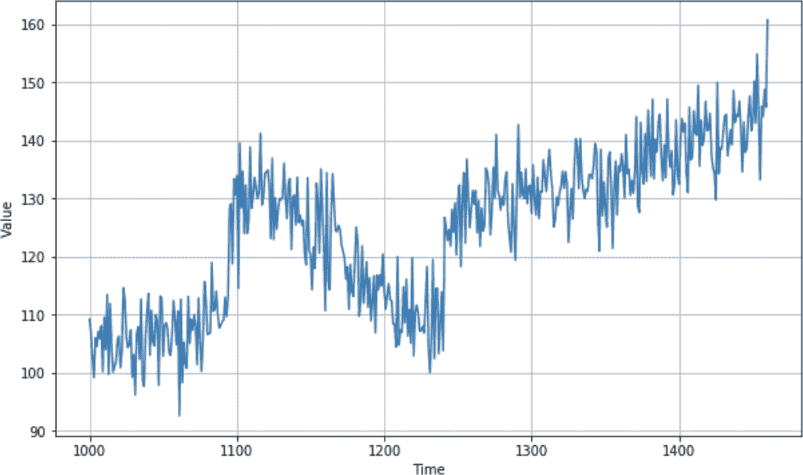
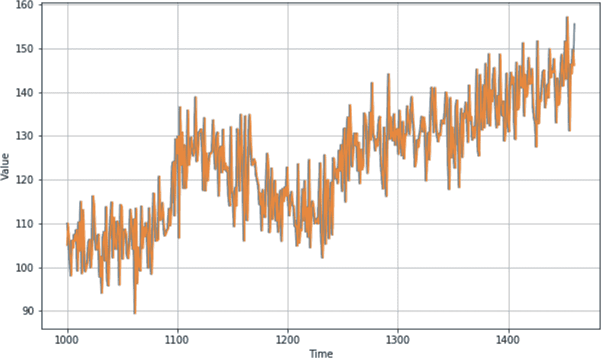

# 第九章：理解序列和时间序列数据

时间序列无处不在。你可能在天气预报、股票价格以及像摩尔定律（图 9-1）这样的历史趋势中见过它们。如果你对摩尔定律不熟悉，它预测微芯片上的晶体管数量大约每两年翻一番。几乎 50 年来，它已被证明是计算能力和成本未来的准确预测者。


###### 图 9-1\. 摩尔定律

时间序列数据是一组随时间间隔的值。当绘制时，x 轴通常是时间性质的。通常在时间轴上会绘制多个值，比如在这个例子中，晶体管数量是一个绘图，而来自摩尔定律的预测值是另一个。这被称为*多变量*时间序列。如果只有一个值，例如随时间变化的降雨量，那就称为*单变量*时间序列。

在摩尔定律的影响下，预测变得简单，因为存在一个固定且简单的规则，使我们能够粗略地预测未来——这一规则已经持续了大约 50 年。

那么像图 9-2 中的时间序列呢？



###### 图 9-2\. 真实世界时间序列

虽然这个时间序列是人为创建的（稍后在本章中你将看到如何做到这一点），但它具有像股票图表或季节性降雨等复杂真实世界时间序列的所有属性。尽管看似随机，时间序列具有一些共同属性，这些属性对设计能够预测它们的机器学习模型非常有帮助，如下一节所述。

# 时间序列的共同属性

尽管时间序列可能看起来随机和嘈杂，通常存在可预测的共同属性。在本节中，我们将探讨其中一些。

## 趋势

时间序列通常沿特定方向移动。在摩尔定律的情况下，很容易看出随着时间推移，y 轴上的值增加，并且存在向上的趋势。在图 9-2 中的时间序列中也存在向上的趋势。当然，并非总是如此：有些时间序列可能随时间大致保持水平，尽管存在季节性变化，而其他时间序列则呈下降趋势。例如，在预测每个晶体管价格的反向版本中就是如此。

## 季节性

许多时间序列随时间的重复模式具有周期性，这些重复以称为*季节*的规则间隔发生。例如，天气中的温度。我们通常每年有四个季节，夏季温度最高。因此，如果你绘制几年的天气数据，你会看到每四个季节发生一次高峰，这给了我们季节性的概念。但这种现象不仅限于天气——例如，考虑图 9-3，这是一个显示网站流量的图表。


###### 图 9-3\. 网站流量

它是逐周绘制的，您可以看到定期的低谷。您能猜到它们是什么吗？本例中的网站为软件开发人员提供信息，并且正如您所预期的那样，周末其流量较少！因此，这个时间序列每周有五天高峰和两天低谷的季节性。数据绘制了几个月，圣诞节和新年假期大致位于中间，所以您可以看到额外的季节性。如果我将其绘制多年，您将清楚地看到年底的额外低谷。

季节性在时间序列中表现出多种方式。例如，零售网站的流量可能在周末达到高峰。

## 自相关

在时间序列中可能会看到的另一个特征是事件后的可预测行为。您可以在图 9-4 中看到这一点，在那里有明显的峰值，但在每个峰值后，有确定性的衰减。这被称为*自相关*。

在这种情况下，我们可以看到一组特定的行为，这些行为是重复的。自相关可能隐藏在时间序列模式中，但它们具有固有的可预测性，因此包含许多自相关的时间序列可能是可预测的。


###### 图 9-4\. 自相关

## 噪声

如其名称所示，噪声是时间序列中一组看似随机的扰动。这些扰动导致了高度的不可预测性，可以掩盖趋势、季节性行为和自相关。例如，图 9-5 展示了从图 9-4 中得到的同样的自相关，但添加了一些噪声。突然间，很难看出自相关并预测数值。


###### 图 9-5\. 添加噪声的自相关序列

鉴于所有这些因素，让我们探讨如何在包含这些属性的时间序列上进行预测。

# 预测时间序列的技术

在我们深入探讨基于机器学习的预测——接下来几章的主题之前——我们将探讨一些更为天真的预测方法。这些方法将使您能够建立一个可以用来衡量您的机器学习预测准确性的基线。

## 创建基线的天真预测

预测时间序列最基本的方法是说，在时间 *t* + 1 处的预测值与时间 *t* 的值相同，实质上将时间序列向前推移一个周期。

让我们从创建具有趋势、季节性和噪声的时间序列开始：

```
def plot_series(time, series, format="-", start=0, end=None):
    plt.plot(time[start:end], series[start:end], format)
    plt.xlabel("Time")
    plt.ylabel("Value")
    plt.grid(True)

def trend(time, slope=0):
    return slope * time

def seasonal_pattern(season_time):
    """Just an arbitrary pattern, you can change it if you wish"""
    return np.where(season_time < 0.4,
                    np.cos(season_time * 2 * np.pi),
                    1 / np.exp(3 * season_time))

def seasonality(time, period, amplitude=1, phase=0):
    """Repeats the same pattern at each period"""
    season_time = ((time + phase) % period) / period
    return amplitude * seasonal_pattern(season_time)

def noise(time, noise_level=1, seed=None):
    rnd = np.random.RandomState(seed)
    return rnd.randn(len(time)) * noise_level

time = np.arange(4 * 365 + 1, dtype="float32")
baseline = 10
series = trend(time, .05)  
baseline = 10
amplitude = 15
slope = 0.09
noise_level = 6

# Create the series
series = baseline + trend(time, slope) 
                  + seasonality(time, period=365, amplitude=amplitude)
# Update with noise
series += noise(time, noise_level, seed=42)
```

绘制后，您会看到类似图 9-6 的情况。


###### 图 9-6\. 显示趋势、季节性和噪声的时间序列

现在您已经有了数据，您可以像任何数据源一样将其分割为训练集、验证集和测试集。当数据存在某种季节性时，正如在这种情况下所看到的，将系列拆分时，确保每个拆分中都有完整的季节是个好主意。因此，例如，如果您想将数据在图 9-6 中拆分为训练集和验证集，一个很好的分割点可能是在时间步 1,000 处，这样您就可以获得从步 1,000 开始的训练数据和步 1,000 之后的验证数据。

实际上在这里不需要分割数据，因为您只是进行了一个简单的天真预测，其中每个值*t*只是前一步*t* – 1 处的值。但是为了在接下来的几个图中进行说明，我们将放大从时间步 1,000 开始的数据。

要从分割的时间段开始预测系列，其中您希望分割的期间在变量`split_time`中，您可以使用以下代码：

```
naive_forecast = series[split_time - `1`:-`1`]
```

图 9-7 显示了验证集（从时间步 1,000 开始，可以通过将`split_time`设置为`1000`来获得）与天真预测的叠加。



###### 图 9-7\. 时间序列的天真预测

看起来还不错 —— 值之间存在一定的关系，并且随着时间的推移，预测似乎与原始值紧密匹配。但是如何衡量准确性呢？

## 测量预测准确性

有多种方法可以衡量预测准确性，但我们将集中在两种上：*均方误差*（MSE）和*平均绝对误差*（MAE）。

使用 MSE，您只需获取时间*t*处预测值与实际值之间的差值，平方（以去除负值），然后计算所有这些值的平均值。

对于 MAE，您计算预测值与时间*t*处的实际值之间的差值，取其绝对值以去除负值（而不是平方），然后计算所有这些值的平均值。

基于我们的合成时间序列创建的天真预测，您可以像这样获取 MSE 和 MAE：

```
`print`(keras.metrics.mean_squared_error(x_valid, naive_forecast).numpy())
`print`(keras.metrics.mean_absolute_error(x_valid, naive_forecast).numpy())
```

我得到了 MSE 为 76.47 和 MAE 为 6.89。与任何预测一样，如果能减少误差，就能提高预测的准确性。接下来我们将看看如何实现这一点。

## 不那么天真：使用移动平均线进行预测

先前的天真预测将时间*t*处的值取为时间*t*的预测值。使用移动平均线类似，但不只是取*t* – 1 处的值，而是取一组值（比如 30 个），求其平均值，并将其设置为时间*t*处的预测值。以下是代码：

```
  `def` moving_average_forecast(series, window_size):
  `"""Forecasts the mean of the last few values.`
 `If window_size=1, then this is equivalent to naive forecast"""`
  forecast = []
  `for` time `in` range(len(series) - window_size):
    forecast.append(series[time:time + window_size].mean())
  `return` np.array(forecast)

moving_avg = moving_average_forecast(series, `30`)[split_time - `30`:]

plt.figure(figsize=(`10`, `6`))
plot_series(time_valid, x_valid)
plot_series(time_valid, moving_avg)
```

图 9-8 显示了移动平均线与数据的图表。


###### 图 9-8\. 绘制移动平均线

当我绘制这个时间序列时，得到的 MSE 和 MAE 分别为 49 和 5.5，因此预测明显有所改善。但这种方法没有考虑趋势或季节性，因此我们可能可以通过一些分析进一步改进。

## 改进移动平均分析

鉴于该时间序列的季节性为 365 天，您可以使用一种称为*differencing*的技术来平滑趋势和季节性，它只是从*t*时刻减去*t - 365*时刻的值。这将使图表变平。以下是代码：

```
diff_series = (series[`365`:] - series[:-`365`])
diff_time = time[`365`:]
```

您现在可以计算这些值的移动平均，并添加回过去的值：

```
diff_moving_avg = 
    moving_average_forecast(diff_series, `50`)[split_time - `365` - `50`:]

diff_moving_avg_plus_smooth_past = 
    moving_average_forecast(series[split_time - `370`:-`360`], `10`) + 
    diff_moving_avg
```

当您绘制图表时（参见图 9-9），您已经可以看到预测值有所改善：趋势线非常接近实际值，尽管噪音已经平滑化。季节性似乎有效，趋势也是如此。


###### 图 9-9\. 改进的移动平均

通过计算均方误差（MSE）和平均绝对误差（MAE）来确认这一印象，在本例中分别为 40.9 和 5.13，显示了预测结果的明显改进。

# 总结

本章介绍了时间序列数据及其常见属性。您创建了一个合成时间序列，并学习了如何开始进行简单的预测。从这些预测中，您使用均方误差和平均绝对误差建立了基准度量。这是从 TensorFlow 中的一个不错的转换，但在下一章中，您将回到使用 TensorFlow 和机器学习，看看能否进一步改进您的预测！
