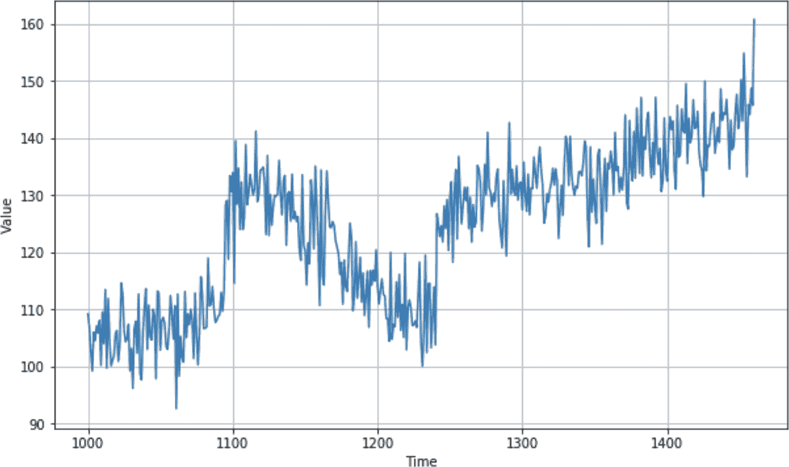

# 第十章：创建用于预测序列的 ML 模型

第九章介绍了序列数据和时间序列的属性，包括季节性、趋势、自相关性和噪声。您创建了一个合成序列用于预测，并探索了如何进行基本的统计预测。在接下来的几章中，您将学习如何使用 ML 进行预测。但在开始创建模型之前，您需要了解如何为训练预测模型结构化时间序列数据，这将创建我们称之为*窗口数据集*的内容。

要理解为什么需要这样做，请考虑您在第九章中创建的时间序列。您可以在图 10-1 中看到其图表。



###### 图 10-1\. 合成时间序列

如果您想在时间*t*预测某个值，您将希望将其预测为时间*t*之前值的函数。例如，假设您希望预测时间步骤 1,200 的时间序列值，作为前 30 个时间步骤的函数。在这种情况下，从时间步骤 1,170 到 1,199 的值将确定时间步骤 1,200 的值，如图 10-2 所示。


###### 图 10-2\. 前值影响预测

现在开始看起来很熟悉：您可以将从 1,170 到 1,199 的值视为*特征*，并将 1,200 处的值视为*标签*。如果您可以使数据集的一定数量的值成为特征，并使后续的值成为标签，并且对数据集中的每个已知值执行此操作，那么您将获得一组非常不错的特征和标签，可用于训练模型。

在为来自第九章的时间序列数据集做这些操作之前，让我们创建一个非常简单的数据集，具有相同的属性，但数据量要小得多。

# 创建窗口数据集

`tf.data`库包含许多用于数据操作的有用 API。您可以使用这些 API 创建一个基本数据集，其中包含 0 到 9 的数字，模拟一个时间序列。然后，您将把它转换为窗口数据集的开端。以下是代码：

```
`dataset` `=` `tf``.``data``.``Dataset``.``range``(`10`)`
`dataset` `=` `dataset``.``window``(`5`,` `shift``=`1`,` `drop_remainder``=``True``)`
`dataset` `=` `dataset``.``flat_map``(``lambda` `window``:` `window``.``batch``(`5`)``)`
`for` `window` `in` `dataset``:`
  `print``(``window``.``numpy``(``)``)`
```

首先，它使用一个范围创建数据集，这简单地使数据集包含值 0 到*n* – 1，其中*n*在本例中为 10。

接下来，调用`dataset.window`并传递一个参数`5`，指定将数据集分割成五个项目的窗口。设置`shift=1`会导致每个窗口向前移动一个位置：第一个窗口将包含从 0 开始的五个项目，下一个窗口将包含从 1 开始的五个项目，依此类推。将`drop_remainder`设置为`True`指定，一旦它接近数据集末尾并且窗口小于所需的五个项目，它们应该被丢弃。

给定窗口定义，可以进行数据集分割的过程。您可以使用`flat_map`函数来完成这个过程，在本例中请求一个包含五个窗口的批次。

运行这段代码将得到以下结果：

```
[`0` `1` `2` `3` `4`]
[`1` `2` `3` `4` `5`]
[`2` `3` `4` `5` `6`]
[`3` `4` `5` `6` `7`]
[`4` `5` `6` `7` `8`]
[`5` `6` `7` `8` `9`]
```

但是之前您看到，我们希望从中创建训练数据，其中有*n*个值定义一个特征，并且后续的值提供一个标签。您可以通过添加另一个 lambda 函数来完成这个操作，该函数将每个窗口分割为最后一个值之前的所有内容，然后是最后一个值。这会生成一个`x`和一个`y`数据集，如下所示：

```
dataset = tf.data.Dataset.range(10)
dataset = dataset.window(5, shift=1, drop_remainder=True)
dataset = dataset.flat_map(lambda window: window.batch(5))
`dataset` `=` `dataset``.``map``(``lambda` `window``:` `(``window``[``:``-``1``]``,` `window``[``-``1``:``]``)``)`
for x,y in dataset:
  print(x.numpy(), y.numpy())
```

现在结果与您期望的一致。窗口中的前四个值可以被视为特征，后续的值是标签：

```
[`0` `1` `2` `3`] [`4`]
[`1` `2` `3` `4`] [`5`]
[`2` `3` `4` `5`] [`6`]
[`3` `4` `5` `6`] [`7`]
[`4` `5` `6` `7`] [`8`]
[`5` `6` `7` `8`] [`9`]
```

而且因为这是一个数据集，它也可以通过 lambda 函数支持洗牌和分批处理。在这里，它已经被洗牌和批处理，批处理大小为 2：

```
dataset = tf.data.Dataset.range(10)
dataset = dataset.window(5, shift=1, drop_remainder=True)
dataset = dataset.flat_map(lambda window: window.batch(5))
dataset = dataset.map(lambda window: (window[:-1], window[-1:]))
`dataset` `=` `dataset``.``shuffle``(``buffer_size``=``10``)`
`dataset` `=` `dataset``.``batch``(``2``)``.``prefetch``(``1``)`
for x,y in dataset:
  print("x = ", x.numpy())
  print("y = ", y.numpy())
```

结果显示，第一个批次有两组`x`（分别从 2 和 3 开始）及其标签，第二个批次有两组`x`（分别从 1 和 5 开始）及其标签，依此类推：

```
x =  [[`2` `3` `4` `5`]
 [`3` `4` `5` `6`]]
y =  [[`6`]
 [`7`]]

x =  [[`1` `2` `3` `4`]
 [`5` `6` `7` `8`]]
y =  [[`5`]
 [`9`]]

x =  [[`0` `1` `2` `3`]
 [`4` `5` `6` `7`]]
y =  [[`4`]
 [`8`]]
```

使用这种技术，您现在可以将任何时间序列数据集转换为神经网络的训练数据集。在下一节中，您将探讨如何从第九章的合成数据中创建训练集。从那里，您将继续创建一个简单的 DNN，该网络经过训练可以用于预测未来的值。

## 创建时间序列数据集的窗口化版本

回顾一下，在上一章中使用的代码来创建一个合成的时间序列数据集：

```
`def` trend(time, slope=`0`):
    `return` slope * time

`def` seasonal_pattern(season_time):
    `return` np.where(season_time < `0.4`,
                    np.cos(season_time * `2` * np.pi),
                    `1` / np.exp(`3` * season_time))

`def` seasonality(time, period, amplitude=`1`, phase=`0`):
    season_time = ((time + phase) % period) / period
    `return` amplitude * seasonal_pattern(season_time)

`def` noise(time, noise_level=`1`, seed=`None`):
    rnd = np.random.`RandomState`(seed)
    `return` rnd.randn(len(time)) * noise_level

time = np.arange(`4` * `365` + `1`, dtype=`"``float32``"`)
series = trend(time, `0.1`)
baseline = `10`
amplitude = `20`
slope = `0.09`
noise_level = `5`

series = baseline + trend(time, slope) 
series += seasonality(time, period=`365`, amplitude=amplitude)
series += noise(time, noise_level, seed=`42`)
```

这将创建一个类似于图 10-1 的时间序列。如果您想要进行更改，请随意调整各种常量的值。

一旦您有了这个系列，您可以像前一节中的代码一样将其转换为窗口化的数据集。这里定义为一个独立的函数：

```
`def` windowed_dataset(series, window_size, 
                      batch_size, shuffle_buffer):
  dataset = tf.data.`Dataset`.from_tensor_slices(series)
  dataset = dataset.window(window_size + `1`, shift=`1`, 
                            drop_remainder=`True`)
  dataset = dataset.flat_map(`lambda` window: 
                               window.batch(window_size + `1`))
  dataset = dataset.shuffle(shuffle_buffer).map(
                             `lambda` window: 
                               (window[:-`1`], window[-`1`]))
  dataset = dataset.batch(batch_size).prefetch(`1`)
  `return` dataset
```

请注意，它使用了`tf.data.Dataset`的`from_tensor_slices`方法，该方法允许您将一个系列转换为`Dataset`。您可以在[TensorFlow 文档](https://oreil.ly/suj2x)中了解更多关于这个方法的信息。

现在，要获取一个可用于训练的数据集，您可以简单地使用以下代码。首先，将系列分为训练集和验证集，然后指定细节，如窗口大小、批量大小和洗牌缓冲区大小：

```
split_time = `1000`
time_train = time[:split_time]
x_train = series[:split_time]
time_valid = time[split_time:]
x_valid = series[split_time:]
window_size = `20`
batch_size = `32`
shuffle_buffer_size = `1000`
dataset = windowed_dataset(x_train, window_size, batch_size, 
                           shuffle_buffer_size)
```

现在要记住的重要一点是，你的数据是一个`tf.data.Dataset`，因此可以轻松地将其作为单个参数传递给`model.fit`，`tf.keras`会照顾其余的工作。

如果你想查看数据的样子，可以用这样的代码来做：

```
dataset = windowed_dataset(series, window_size, `1`, shuffle_buffer_size)
`for` feature, label `in` dataset.take(`1`):
  `print`(feature)
  `print`(label)
```

这里将`batch_size`设置为`1`，只是为了使结果更易读。你将得到类似这样的输出，其中一个数据集在批次中：

```
`tf``.`Tensor`(`
`[``[``75.38214`  `66.902626`  `76.656364`  `71.96795`  `71.373764`  `76.881065`  `75.62607`
  `71.67851`  `79.358665`  `68.235466`  `76.79933`  `76.764114`  `72.32991`  `75.58744`
  `67.780426`  `78.73544`  `73.270195`  `71.66057`  `79.59881`  `70.9117` `]``]``,` 
  `shape``=``(``1``,` `20``)``,` `dtype``=``float32``)`
`tf``.`Tensor`(``[``67.47085``]``,` `shape``=``(``1``,``)``,` `dtype``=``float32``)`
```

第一批数字是特征。我们将窗口大小设置为 20，因此这是一个 1 × 20 的张量。第二个数字是标签（在这种情况下为 67.47085），模型将尝试将特征拟合到标签。你将在下一节看到它是如何工作的。

# 创建和训练一个 DNN 来拟合序列数据

现在，你已经有了一个`tf.data.Dataset`中的数据，使用`tf.keras`创建神经网络模型变得非常简单。让我们首先探索一个看起来像这样的简单 DNN：

```
dataset = windowed_dataset(series, window_size, 
                            batch_size, shuffle_buffer_size)

model = tf.keras.models.`Sequential`([
    tf.keras.layers.`Dense`(`10`, input_shape=[window_size], 
                           activation=`"``relu``"`), 
    tf.keras.layers.`Dense`(`10`, activation=`"``relu``"`), 
    tf.keras.layers.`Dense`(`1`)
])
```

这是一个超级简单的模型，有两个稠密层，第一个接受`window_size`的输入形状，然后是一个包含预测值的输出层。

该模型使用了与之前相同的损失函数和优化器。在这种情况下，损失函数被指定为`mse`，代表均方误差，通常用于回归问题（最终就是这种问题！）。对于优化器，`sgd`（随机梯度下降）是一个很好的选择。我不会在这本书中详细讨论这些函数类型，但是任何关于机器学习的良好资源都会教你它们——Andrew Ng 在 Coursera 的开创性 [深度学习专项课程](https://oreil.ly/A8QzN) 就是一个很好的起点。SGD 有学习率（`lr`）和动量的参数，它们调整优化器的学习方式。每个数据集都不同，所以控制是很重要的。在下一节中，你将看到如何确定最佳值，但是现在，只需像这样设置它们：

```
model.compile(loss=`"``mse``"`,optimizer=tf.keras.optimizers.SGD(
                                                          lr=`1e-6`, 
                                                          momentum=`0.9`))
```

训练过程只需调用`model.fit`，将数据集传递给它，并指定训练的周期数即可：

```
model.fit(dataset,epochs=`100`,verbose=`1`)
```

在训练过程中，你会看到损失函数报告一个起初很高但会稳步下降的数字。这是前 10 个周期的结果：

```
Epoch 1/100
45/45 [==============================] - 1s 15ms/step - loss: 898.6162
Epoch 2/100
45/45 [==============================] - 0s 8ms/step - loss: 52.9352
Epoch 3/100
45/45 [==============================] - 0s 8ms/step - loss: 49.9154
Epoch 4/100
45/45 [==============================] - 0s 7ms/step - loss: 49.8471
Epoch 5/100
45/45 [==============================] - 0s 7ms/step - loss: 48.9934
Epoch 6/100
45/45 [==============================] - 0s 7ms/step - loss: 49.7624
Epoch 7/100
45/45 [==============================] - 0s 8ms/step - loss: 48.3613
Epoch 8/100
45/45 [==============================] - 0s 9ms/step - loss: 49.8874
Epoch 9/100
45/45 [==============================] - 0s 8ms/step - loss: 47.1426
Epoch 10/100
45/45 [==============================] - 0s 8ms/step - loss: 47.5133
```

# 评估 DNN 的结果

一旦你有了训练好的 DNN，你可以开始用它进行预测。但要记住，你有一个窗口化的数据集，因此，对于给定时间点的预测是基于它之前的若干时间步的值。

换句话说，由于你的数据是一个名为`series`的列表，要预测一个值，你必须将模型值从时间 *t* 到时间 *t* + `window_size` 传递给它。然后它会给你预测的下一个时间步的值。

例如，如果你想预测时间步 1,020 的值，你需要从时间步 1,000 到 1,019 的值，并用它们来预测序列中的下一个值。要获取这些值，你可以使用以下代码（注意，你要指定为`series[1000:1020]`，而不是`series[1000:1019]`！）：

```
`print`(series[`1000`:`1020`])
```

然后，要获取步骤 1,020 的值，你只需像这样使用 `series[1020]`：

```
`print`(series[`1020`])
```

要获取该数据点的预测值，然后将系列传递给 `model.predict`。然而，请注意，为了保持输入形状一致，你需要 `[np.newaxis]`，像这样：

```
`print`(model.predict(series[`1000`:`1020`][np.newaxis]))
```

或者，如果你想要更通用的代码，你可以使用这个：

```
`print`(series[start_point:start_point+window_size])
`print`(series[start_point+window_size])
`print`(model.predict(
      series[start_point:start_point+window_size][np.newaxis]))
```

请注意，这一切都假设窗口大小为 20 个数据点，这是相当小的。因此，你的模型可能会缺乏一些准确性。如果你想尝试不同的窗口大小，你需要再次调用 `windowed_dataset` 函数重新格式化数据集，然后重新训练模型。

这是在从 1,000 开始并预测下一个值时该数据集的输出：

```
`[`109.170746  106.86935  102.61668  99.15634  105.95478  104.503876
  107.08533  105.858284  108.00339  100.15279  109.4894  103.96404
  113.426094  99.67773  111.87749  104.26137  100.08899  101.00105
  101.893265  105.69048 `]`

106.258606
 `[``[`105.36248`]``]`
```

第一个张量包含值列表。接下来，我们看到 *实际* 的下一个值为 106.258606。最后，我们看到 *预测* 的下一个值为 105.36248。我们得到了一个合理的预测，但如何测量随时间的准确性？我们将在下一节中探讨这个问题。

# 探索总体预测

在前面的部分中，你看到了如何通过采用窗口大小（在本例中为 20）的先前一组值并将它们传递给模型来获取特定时间点的预测值。要查看模型的整体结果，你将不得不对每个时间步骤做同样的事情。

你可以像这样使用一个简单的循环来完成：

```
forecast = []
for time in range(len(series) - window_size):
  forecast.append(
    model.predict(series[time:time + window_size][np.newaxis]))
```

首先，你创建一个名为 `forecast` 的新数组，用于存储预测值。然后，对于原始系列中的每个时间步长，你调用 `predict` 方法并将结果存储在 `forecast` 数组中。对于数据的前 *n* 个元素，你无法这样做，其中 *n* 是 `window_size`，因为在那时你没有足够的数据来进行预测，因为每次预测都需要前 *n* 个先前的值。

当这个循环结束时，`forecast` 数组将包含从时间步长 21 开始的预测值。

如果你回想一下，你还将数据集在时间步骤 1,000 处分成了训练集和验证集。因此，对于接下来的步骤，你也应该只取从此时间点开始的预测。由于你的预测数据已经错位了 20 个（或者你的窗口大小是多少），你可以将其拆分并将其转换为一个 Numpy 数组，像这样：

```
forecast = forecast[split_time-window_size:]
results = np.array(forecast)[:, `0`, `0`]
```

现在它与预测数据的形状相同，所以你可以像这样将它们相互绘制：

```
plt.figure(figsize=(`10`, `6`))

plot_series(time_valid, x_valid)
plot_series(time_valid, results)
```

绘图看起来会像 图 10-3。


###### 图 10-3\. 绘制预测值对比图

从快速的视觉检查中，你可以看到预测并不差。它通常会跟随原始数据的曲线。当数据发生快速变化时，预测需要一些时间来赶上，但总体上并不差。

然而，仅凭肉眼观察曲线很难准确。最好有一个良好的度量标准，在第九章中，你学到了一个——MAE（平均绝对误差）。现在，你已经有了有效的数据和结果，可以使用以下代码来测量 MAE：

```
tf.keras.metrics.mean_absolute_error(x_valid, results).numpy()
```

数据中引入了随机性，因此你的结果可能会有所不同，但当我尝试时，得到了 MAE 值为 4.51。

你可以说，尽可能准确地获取预测结果，然后将其最小化成为最小化 MAE 的过程。有一些技术可以帮助你做到这一点，包括明显的更改窗口大小。我让你去尝试一下，但在接下来的章节中，你将对优化器进行基本的超参数调整，以改善神经网络的学习效果，并了解这对 MAE 的影响。

# 调整学习率

在前面的例子中，你可能还记得，你使用了一个如下所示的优化器来编译模型：

```
model.compile(loss=`"``mse``"`,
              optimizer=tf.keras.optimizers.SGD(lr=`1e-6`, momentum=`0.9`))
```

在这种情况下，你使用了一个学习率为 1 × 10^(–6)。但这似乎是一个非常随意的数字。如果你改变它会怎样？你应该如何去改变它？需要大量的实验来找到最佳的学习率。

`tf.keras` 为你提供的一项功能是一个回调函数，帮助你随着时间调整学习率。你在第二章早些时候学习过回调函数——在那里，你使用一个回调函数在每个 epoch 结束时取消训练，当准确率达到预期值时。

你也可以使用回调函数来调整学习率参数，将该参数的值与适当 epoch 的损失绘制在一起，从而确定最佳的学习率使用。

要做到这一点，只需创建一个 `tf.keras.callbacks.LearningRateScheduler`，并让它使用所需的起始值填充 `lr` 参数。以下是一个例子：

```
`lr_schedule` `=` `tf``.``keras``.``callbacks``.`LearningRateScheduler`(`
  `lambda` `epoch``:` `1e-8` `*` `10``*``*``(``epoch` `/` `20``)``)`
```

在这种情况下，你将从 1e–8 开始学习率，并在每个 epoch 增加一个小量。到完成一百个 epochs 时，学习率将增加到约 1e–3。

现在，你可以使用学习率为 1e–8 初始化优化器，并指定在 `model.fit` 调用中使用此回调函数：

```
optimizer = tf.keras.optimizers.SGD(lr=1e-8, momentum=0.9)
model.compile(loss="mse", optimizer=optimizer)
 history = model.fit(dataset, epochs=100, 
                    **`callbacks=[lr_schedule]`**, verbose=0)
```

正如你使用了 `history=model.fit`，训练历史已经为你存储好了，包括损失。你可以像这样将其与每个 epoch 的学习率绘制在一起：

```
lrs = `1e-8` * (`10` ** (np.arange(`100`) / `20`))
plt.semilogx(lrs, history.history[`"``loss``"`])
plt.axis([`1e-8`, `1e-3`, `0`, `300`])
```

这只是使用与 lambda 函数相同的公式设置 `lrs` 值，并在 1e–8 到 1e–3 之间绘制其与损失的关系。图 10-4 展示了结果。


###### 图 10-4\. 绘制损失与学习率的关系

因此，虽然之前你将学习率设置为 1e–6，但看起来 1e–5 的损失更小，所以现在你可以回到模型中，并用 1e–5 重新定义它作为新的学习率。

在训练模型之后，您可能会注意到损失有所减少。在我的情况下，学习率为 1e-6 时，最终损失为 36.5，但学习率为 1e-5 时，损失降至 32.9。然而，当我对所有数据运行预测时，结果是图表在图 10-5 中，可以看到看起来有点偏差。


###### 图 10-5\. 调整后的学习率图表

当我测量 MAE 时，结果为 4.96，所以它略有退步！话虽如此，一旦您确定了最佳学习率，您可以开始探索其他优化网络性能的方法。一个简单的起点是窗口的大小——预测 1 天的 20 天数据可能不足够，所以您可能希望尝试 40 天的窗口。另外，尝试增加训练的 epochs 数。通过一些实验，您可能可以将 MAE 降到接近 4，这还算不错。

# 使用 Keras 调参工具进行超参数调优

在上一节中，您看到了如何为随机梯度下降损失函数进行粗略的学习率优化。这确实是一个非常粗糙的尝试，每隔几个 epochs 更改一次学习率并测量损失。它也受到损失函数每个 epoch 之间已经改变的影响，因此您可能实际上并没有找到最佳值，而是一个近似值。要真正找到最佳值，您需要对每个潜在值进行完整 epochs 的训练，然后比较结果。这仅仅是一个超参数——学习率。如果您想找到最佳的动量或调整其他事物，如模型架构——每层多少个神经元，多少层等等——您可能需要测试成千上万个选项，并且跨所有这些进行训练将是很难编码的。

幸运的是，[Keras 调参工具](https://oreil.ly/QDFVd)使这相对容易。您可以使用简单的`pip`命令安装 Keras 调参工具：

```
!pip install keras-tuner
```

然后，您可以使用它来参数化您的超参数，指定要测试的值范围。Keras 调参器将训练多个模型，每个可能的参数集合一个，评估模型到您想要的指标，然后报告排名靠前的模型。我不会在这里详细介绍工具提供的所有选项，但我会展示如何为这个特定模型使用它。

假设我们想要尝试两件事，第一件事是模型架构中输入神经元的数量。一直以来，您的模型架构是 10 个输入神经元，后面跟着一个 10 个神经元的隐藏层，然后是输出层。但是如果增加更多的神经元在输入层，例如 30 个，网络能否表现更好呢？

回想一下，输入层的定义如下：

```
tf.keras.layers.`Dense`(`10`, input_shape=[window_size], activation=`"``relu``"`),
```

如果您想测试不同于硬编码的 10 的值，您可以设置它循环遍历一些整数，就像这样：

```
tf.keras.layers.Dense(units=hp.Int('units', min_value=10, max_value=30, step=2), 
                      activation='relu', input_shape=[window_size])
```

在这里，您定义该层将使用多个输入值进行测试，从 10 开始，以步长 2 增加到 30。现在，不再是仅训练一次模型并查看损失，Keras Tuner 将训练该模型 11 次！

此外，在编译模型时，您将`momentum`参数的值硬编码为`0.9`。请回顾一下模型定义中的此代码：

```
optimizer = tf.keras.optimizers.SGD(lr=`1e-5`, momentum=`0.9`)
```

您可以通过使用`hp.Choice`结构将此更改为循环浏览几个选项。以下是一个示例：

```
optimizer=tf.keras.optimizers.SGD(hp.`Choice`(`'``momentum``'`, 
                                  values=[.`9`, .`7`, .`5`, .`3`]), 
                                  lr=`1e-5`)
```

这提供了四种可能的选择，因此，当与先前定义的模型架构结合使用时，您将循环浏览 44 种可能的组合。Keras Tuner 可以为您完成这些操作，并报告表现最佳的模型。

要完成设置，请首先创建一个为您构建模型的函数。以下是更新后的模型定义：

```
`def` build_model(hp):
  model = tf.keras.models.`Sequential`()
  model.add(tf.keras.layers.`Dense`(
     units=hp.`Int`(`'``units``'`, min_value=`10`, max_value=`30`, step=`2`), 
                 activation=`'``relu``'`, input_shape=[window_size]))
  model.add(tf.keras.layers.`Dense`(`10`, activation=`'``relu``'`))
  model.add(tf.keras.layers.`Dense`(`1`))

  model.compile(loss=`"``mse``"`, 
                optimizer=tf.keras.optimizers.SGD(hp.`Choice`(`'``momentum``'`, 
                                               values=[.`9`, .`7`, .`5`, .`3`]), 
                                               lr=`1e-5`))

  `return` model
```

现在，安装了 Keras Tuner 后，您可以创建一个`RandomSearch`对象来管理该模型的所有迭代：

```
tuner = `RandomSearch`(build_model, 
                     objective=`'``loss``'`, max_trials=`150`, 
                     executions_per_trial=`3`, directory=`'``my_dir``'`, 
                     project_name=`'``hello``'`)
```

请注意，您通过传递先前描述的函数来定义模型。超参数参数（`hp`）用于控制哪些值会发生变化。您指定`objective`为`loss`，表示您希望最小化损失。您可以使用`max_trials`参数限制要运行的试验总数，并使用`executions_per_trial`参数指定要训练和评估模型的次数（从而在某种程度上消除随机波动）。

要启动搜索，只需调用`tuner.search`，就像调用`model.fit`一样。以下是代码：

```
tuner.search(dataset, epochs=`100`, verbose=`0`)
```

使用本章中您一直在工作的合成系列运行此操作，然后将会根据您定义的选项尝试所有可能的超参数来训练模型。

当完成时，您可以调用`tuner.results_summary`，它将显示基于目标的前 10 个试验结果：

```
tuner.results_summary()
```

您应该会看到像这样的输出：

```
`Results` summary
|-`Results` `in` my_dir/hello
|-`Showing` `10` best trials
|-`Objective`(name=`'``loss``'`, direction=`'``min``'`)
`Trial` summary
|-`Trial` ID: dcfd832e62daf4d34b729c546120fb14
|-`Score`: `33.18723194615371`
|-`Best` step: `0`
`Hyperparameters`:
|-momentum: `0.5`
|-units: `28`
`Trial` summary
|-`Trial` ID: `02``ca5958ac043f6be8b2e2b5479d1f09`
|-`Score`: `33.83273440510237`
|-`Best` step: `0`
`Hyperparameters`:
|-momentum: `0.7`
|-units: `28`
```

从结果中，您可以看到最佳损失得分是在动量为 0.5 和输入单元为 28 时实现的。您可以通过调用`get_best_models`来检索此模型和其他前几个模型，并指定您想要的数量——例如，如果您想要前四个模型，可以这样调用：

```
tuner.get_best_models(num_models=`4`)
```

然后，您可以测试这些模型。

或者，您可以使用学到的超参数从头开始创建一个新模型，就像这样：

```
dataset = windowed_dataset(x_train, window_size, batch_size, 
                           shuffle_buffer_size)

model = tf.keras.models.`Sequential`([
    tf.keras.layers.`Dense`(`28`, input_shape=[window_size], 
                           activation=`"``relu``"`), 
    tf.keras.layers.`Dense`(`10`, activation=`"``relu``"`), 
    tf.keras.layers.`Dense`(`1`)
])

optimizer = tf.keras.optimizers.SGD(lr=`1e-5`, momentum=`0.5`)
model.compile(loss=`"``mse``"`, optimizer=optimizer)
history = model.fit(dataset, epochs=`100`,  verbose=`1`)
```

当使用这些超参数进行训练并对整个验证集进行预测时，我得到了一个类似于图 10-6 的图表。


###### 图 10-6\. 使用优化后的超参数的预测图表

在这次计算中，平均绝对误差（MAE）为 4.47，比原始结果 4.51 略有改善，并且比上一章节的统计方法（结果为 5.13）有了很大的提升。这是通过将学习速率改为 1e-5 实现的，这可能并不是最佳选择。使用 Keras 调参器，你可以调整类似这样的超参数，调整中间层的神经元数量，甚至尝试不同的损失函数和优化器。试一试，看看是否能改进这个模型！

# 摘要

在本章中，你对时间序列的统计分析进行了处理（来自第九章），并应用机器学习试图做出更好的预测。机器学习真正关键在于模式匹配，正如预期的那样，通过首先使用深度神经网络来识别模式，然后使用 Keras 调参器调整超参数来改进损失并提高准确性，你成功将平均绝对误差降低了近 10%。在第十一章，你将超越简单的深度神经网络，探索使用递归神经网络预测序列值的影响。
