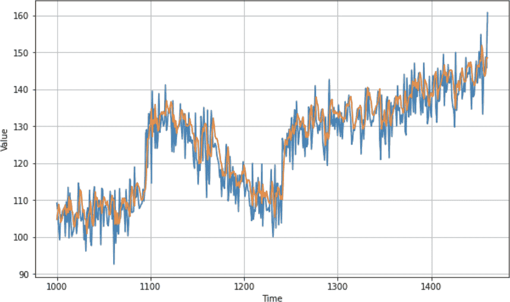

# 第十一章：使用序列模型的卷积和递归方法

最近的几章介绍了序列数据。您看到了如何首先使用统计方法，然后是基本的机器学习方法和深度神经网络来预测它。您还探索了如何使用 Keras 调谐器调整模型的超参数。在本章中，您将看到可能进一步增强您使用卷积神经网络和递归神经网络预测序列数据能力的其他技术。

# 序列数据的卷积

在第三章中，您介绍了卷积，其中 2D 滤波器通过图像以修改它并可能提取特征。随着时间的推移，神经网络学会了哪些滤波器值有效匹配修改后的像素到它们的标签，有效地从图像中提取特征。相同的技术可以应用于数值时间序列数据，但有一个修改：卷积将是一维而不是二维。

例如，考虑图 11-1 中的数字序列。


###### 图 11-1\. 一系列数字

1D 卷积可以如下操作。考虑卷积是一个 1 × 3 的滤波器，滤波器值分别为-0.5, 1 和 -0.5。在这种情况下，序列中的第一个值将丢失，第二个值将从 8 转换为-1.5，如图 11-2 所示。


###### 图 11-2\. 使用数字序列的卷积

滤波器将跨值进行步幅，计算新值。例如，在下一个步幅中，15 将被转换为 3，如图 11-3 所示。


###### 图 11-3\. 1D 卷积中的额外步幅

使用这种方法，可以提取数值之间的模式并学习成功提取它们的过滤器，这与图像中的卷积在像素上提取特征的方式非常相似。在这种情况下没有标签，但可以学习最小化总体损失的卷积。

## 编写卷积

在编写卷积之前，您需要调整在前一章中使用的窗口数据集生成器。这是因为在编写卷积层时，您需要指定维度。窗口数据集是单维度的，但未定义为 1D 张量。这只需在`windowed_dataset`函数的开头添加一个`tf.expand_dims`语句，如下所示：

```
def windowed_dataset(series, window_size, batch_size, shuffle_buffer):
 `series` `=` `tf``.``expand_dims``(``series``,` `axis``=``-``1``)`
  dataset = tf.data.Dataset.from_tensor_slices(series)
  dataset = dataset.window(window_size + 1, shift=1, drop_remainder=True)
  dataset = dataset.flat_map(lambda window: window.batch(window_size + 1))
  dataset = dataset.shuffle(shuffle_buffer).map(
                 lambda window: (window[:-1], window[-1]))
  dataset = dataset.batch(batch_size).prefetch(1)
  return dataset
```

现在您有了修改后的数据集，可以在之前的密集层之前添加一个卷积层：

```
dataset = windowed_dataset(x_train, window_size, batch_size, shuffle_buffer_size)

model = tf.keras.models.`Sequential`([
    tf.keras.layers.`Conv1D`(filters=`128`, kernel_size=`3`,
                           strides=`1`, padding=`"``causal``"`,
                           activation=`"``relu``"`,
                           input_shape=[`None`, `1`]),
    tf.keras.layers.`Dense`(`28`, activation=`"``relu``"`), 
    tf.keras.layers.`Dense`(`10`, activation=`"``relu``"`), 
    tf.keras.layers.`Dense`(`1`),
])

optimizer = tf.keras.optimizers.SGD(lr=`1e-5`, momentum=`0.5`)
model.compile(loss=`"``mse``"`, optimizer=optimizer)
history = model.fit(dataset, epochs=`100`, verbose=`1`)
```

在`Conv1D`层中，您有许多参数：

`filters`

是您希望该层学习的滤波器数量。它会生成这些数量，并随着学习过程调整以适应数据。

`kernel_size`

是滤波器的大小 —— 之前我们演示了一个具有值 -0.5、1、-0.5 的滤波器，这将是一个大小为 3 的内核尺寸。

`strides`

这是滤波器在扫描列表时采取的“步长”。通常为 1。

`padding`

决定了关于列表的行为，关于从哪一端丢弃数据。一个 3×1 的滤波器将“丢失”列表的第一个和最后一个值，因为它无法计算第一个的先前值或最后一个的后续值。通常在序列数据中，您会在这里使用`causal`，它只会从当前和前两个时间步中获取数据，永远不会从未来获取。因此，例如，一个 3×1 的滤波器将使用当前时间步和前两个时间步的数据。

`activation`

是激活函数。在这种情况下，`relu` 意味着有效地拒绝来自层的负值。

`input_shape`

一如既往，这是数据输入网络的形状。作为第一层，您必须指定它。

使用此进行训练将会得到一个与之前相同的模型，但是为了从模型中获得预测，由于输入层已经改变了形状，您需要适当修改您的预测代码。

此外，与其基于先前窗口逐个预测每个值，您实际上可以获得整个系列的单个预测，如果您正确将系列格式化为数据集的话。为了简化事情，这里有一个辅助函数，它可以基于模型预测整个系列，指定窗口大小：

```
`def` model_forecast(model, series, window_size):
    ds = tf.data.`Dataset`.from_tensor_slices(series)
    ds = ds.window(window_size, shift=`1`, drop_remainder=`True`)
    ds = ds.flat_map(`lambda` w: w.batch(window_size))
    ds = ds.batch(`32`).prefetch(`1`)
    forecast = model.predict(ds)
    `return` forecast
```

如果您想使用模型来预测此系列，您只需将系列传递进去，并添加一个新的轴来处理需要额外轴的层。您可以这样做：

```
forecast = model_forecast(model, series[..., np.newaxis], window_size)
```

并且您可以使用预先确定的分割时间仅将此预测拆分为验证集的预测：

```
results = forecast[split_time - window_size:-`1`, -`1`, `0`]
```

结果与系列的绘图见图 11-4。

在这种情况下，MAE 是 4.89，稍微比之前的预测差一些。这可能是因为我们没有适当调整卷积层，或者简单地说，卷积并没有帮助。这是您需要对您的数据进行的实验类型。

请注意，此数据具有随机元素，因此数值会在不同会话之间发生变化。如果您使用来自第十章的代码，然后单独运行此代码，当然会有随机波动影响您的数据和平均绝对误差。



###### 图 11-4. 卷积神经网络与时间序列数据预测

但是在使用卷积时，总是会有一个问题：为什么选择我们选择的参数？为什么是 128 个滤波器？为什么是大小为 3×1 的内核？好消息是，你可以使用[Keras 调优器](https://oreil.ly/doxhE)进行实验，如之前所示。接下来我们将探索这一点。

## 尝试 Conv1D 超参数

在前面的部分中，你看到了一个硬编码了参数的 1D 卷积，比如滤波器数量、内核大小、步幅数等。当用它训练神经网络时，似乎 MAE 稍微上升，所以我们没有从 Conv1D 中获得任何好处。这在你的数据中可能并非总是如此，但这可能是由于次优的超参数。因此，在本节中，你将看到 Keras 调优器如何为你优化它们。

在这个例子中，你将尝试调整滤波器数量、内核大小和步幅大小的超参数，保持其他参数不变：

```
def build_model(hp):
    model = tf.keras.models.Sequential()
    model.add(tf.keras.layers.Conv1D(
        `filters``=``hp``.``Int``(``'``units``'``,``min_value``=``128``,` `max_value``=``256``,` `step``=``64``)`, 
 `kernel_size``=``hp``.``Int``(``'``kernels``'``,` `min_value``=``3``,` `max_value``=``9``,` `step``=``3``)`,
 `strides``=``hp``.``Int``(``'``strides``'``,` `min_value``=``1``,` `max_value``=``3``,` `step``=``1``)``,`
        padding='causal', activation='relu', input_shape=[None, 1]
    ))

    model.add(tf.keras.layers.Dense(28, input_shape=[window_size], 
                                    activation='relu'))

    model.add(tf.keras.layers.Dense(10, activation='relu'))

    model.add(tf.keras.layers.Dense(1))

    model.compile(loss="mse", 
                   optimizer=tf.keras.optimizers.SGD(momentum=0.5, lr=1e-5))
    return model
```

滤波器值将从 128 开始，然后以 64 的增量向上增加到 256。内核大小将从 3 开始，以 3 的步长增加到 9，步幅将从 1 开始增加到 3。

这里有很多值的组合，所以实验需要一些时间才能运行。你也可以尝试其他更改，比如使用一个更小的起始值作为`filters`，看看它们的影响。

这里是进行搜索的代码：

```
tuner = `RandomSearch`(build_model, objective=`'``loss``'`, 
                      max_trials=`500`, executions_per_trial=`3`, 
                      directory=`'``my_dir``'`, project_name=`'``cnn-tune``'`)

tuner.search_space_summary()

tuner.search(dataset, epochs=`100`, verbose=`2`)
```

当我运行实验时，我发现 128 个滤波器，大小为 9 和步幅为 1，给出了最佳结果。所以，与初始模型相比，改变滤波器大小是最大的不同之处——这在有这么大量数据的情况下是有道理的。使用大小为 3 的滤波器，只有直接的邻居对应用滤波器的结果产生影响，而使用大小为 9 的滤波器，更远的邻居也会对结果产生影响。这将需要进一步的实验，从这些值开始尝试更大的滤波器大小，也许是更少的滤波器。我会留给你看看是否可以进一步改进模型！

将这些值插入模型架构，你将得到以下结果：

```
dataset = windowed_dataset(x_train, window_size, batch_size, 
                            shuffle_buffer_size)

model = tf.keras.models.`Sequential`([
    tf.keras.layers.`Conv1D`(filters=`128`, kernel_size=`9`,
                           strides=`1`, padding=`"``causal``"`,
                           activation=`"``relu``"`,
                           input_shape=[`None`, `1`]),
    tf.keras.layers.`Dense`(`28`, input_shape=[window_size], 
                           activation=`"``relu``"`), 
    tf.keras.layers.`Dense`(`10`, activation=`"``relu``"`), 
    tf.keras.layers.`Dense`(`1`),
])

optimizer = tf.keras.optimizers.SGD(lr=`1e-5`, momentum=`0.5`)
model.compile(loss=`"``mse``"`, optimizer=optimizer)
history = model.fit(dataset, epochs=`100`,  verbose=`1`)
```

在使用这个模型进行训练后，与早期创建的简单 CNN 和原始 DNN 相比，模型的准确性有了提高，给出了图 11-5。


###### 图 11-5\. 优化的 CNN 预测

这导致了一个 MAE 值为 4.39，略优于我们在不使用卷积层时得到的 4.47。进一步尝试 CNN 的超参数可能会进一步改善结果。

在卷积之外，我们在使用 RNN 进行自然语言处理的章节中探索的技术，包括 LSTM，在处理序列数据时可能会非常有用。由于它们的本质，RNN 设计用于维持上下文，因此先前的值可能会影响后续的值。接下来，你将探索在序列建模中使用它们。但首先，让我们从合成数据集转移到真实数据。在这种情况下，我们将考虑天气数据。

# 使用 NASA 天气数据

时间序列天气数据的一个很好的资源是[NASA 戈达德太空研究所（GISS）表面温度分析](https://oreil.ly/6IixP)。如果你点击[站点数据链接](https://oreil.ly/F9Hmw)，在页面的右侧你可以选择一个气象站获取数据。例如，我选择了西雅图塔科马（SeaTac）机场，并被带到了图 11-6 中的页面。


###### 图 11-6\. GISS 的表面温度数据

你可以在本页面底部看到一个链接，用于下载月度 CSV 数据。选择此链接，将会下载一个名为*station.csv*的文件到你的设备上。如果你打开这个文件，你会看到它是一个包含年份和每列是一个月份的数据网格，就像图 11-7 中所示。


###### 图 11-7\. 数据探索

由于这是 CSV 数据，在 Python 中处理起来非常容易，但是像处理任何数据集一样，注意数据的格式。读取 CSV 时，通常是逐行读取，每一行通常都包含你感兴趣的一个数据点。在这种情况下，每行至少有 12 个感兴趣的数据点，因此在读取数据时需要考虑这一点。

## 在 Python 中读取 GISS 数据

读取 GISS 数据的代码如下所示：

```
def get_data():
    data_file = "/home/ljpm/Desktop/bookpython/station.csv"
    f = open(data_file)
    data = f.read()
    f.close()
    lines = data.split('\n')
    header = lines[0].split(',')
    lines = lines[1:]
    temperatures=[]
    for line in lines:
        if line:
            linedata = line.split(',')
            linedata = linedata[1:13]
            for item in linedata:
                if item:
                    temperatures.append(float(item))

    series = np.asarray(temperatures)
    time = np.arange(len(temperatures), dtype="float32")
    return time, series
```

这将会在指定的路径中打开文件（当然你的路径可能会不同），并将其作为一组行读取，其中行分隔是换行符（`\n`）。然后它将循环遍历每一行，忽略第一行，并在逗号字符上将它们分割成一个名为`linedata`的新数组。此数组中从 1 到 13 的项目将指示为字符串的一月到二月的值。这些值被转换为浮点数并添加到名为`temperatures`的数组中。一旦完成，它将被转换为一个名为`series`的 Numpy 数组，并创建一个与`series`大小相同的名为`time`的另一个 Numpy 数组。由于它是使用`np.arange`创建的，因此第一个元素将是 1，第二个是 2，依此类推。因此，这个函数将返回从 1 到数据点数的步长的`time`，以及作为该时间数据的`series`。

现在如果你需要一个归一化的时间序列，你可以简单地运行这段代码：

```
time, series = get_data()
mean = series.mean(axis=`0`)
series-=mean
std = series.std(axis=`0`)
series/=std
```

这可以像以前一样分成训练集和验证集。根据数据的大小选择分割时间点 —— 在这个案例中我有大约 840 个数据项，所以我在 792 处进行了分割（保留了四年的数据点用于验证）：

```
split_time = `792`
time_train = time[:split_time]
x_train = series[:split_time]
time_valid = time[split_time:]
x_valid = series[split_time:]
```

因为数据现在是一个 Numpy 数组，你可以像之前一样使用相同的代码来创建窗口数据集，用于训练神经网络：

```
window_size = `24`
batch_size = `12`
shuffle_buffer_size = `48`
dataset = windowed_dataset(x_train, window_size, 
                           batch_size, shuffle_buffer_size)
valid_dataset = windowed_dataset(x_valid, window_size, 
                                 batch_size, shuffle_buffer_size)
```

这应该使用与本章前面的卷积网络相同的 `windowed_dataset` 函数，增加一个新的维度。当使用 RNN、GRU 和 LSTM 时，你需要按照那种形状准备数据。

# 用于序列建模的 RNN

现在你已经将 NASA CSV 中的数据转换成了一个窗口数据集，相对来说很容易创建一个用于训练预测器的模型（但要训练一个*好的*模型有点难！）。让我们从一个简单的、天真的模型开始，使用 RNN。以下是代码：

```
model = tf.keras.models.`Sequential`([
    tf.keras.layers.`SimpleRNN`(`100`, return_sequences=`True`, 
                              input_shape=[`None`, `1`]),
    tf.keras.layers.`SimpleRNN`(`100`),
    tf.keras.layers.`Dense`(`1`)
])
```

在这种情况下，使用了 Keras 的 `SimpleRNN` 层。RNN 是一类强大的神经网络，适用于探索序列模型。你在第七章中首次见到它们，当时你在研究自然语言处理。我不会在这里详细介绍它们的工作原理，但如果你感兴趣并跳过了那一章，现在可以回头看看。值得注意的是，RNN 具有一个内部循环，遍历序列的时间步长，同时保持它已经看到的时间步的内部状态。`SimpleRNN` 将每个时间步的输出馈送到下一个时间步中。

你可以使用与之前相同的超参数来编译和拟合模型，或者使用 Keras 调优器来找到更好的参数。为简单起见，你可以使用以下设置：

```
optimizer = tf.keras.optimizers.SGD(lr=`1.5e-6`, momentum=`0.9`)
model.compile(loss=tf.keras.losses.`Huber`(), 
               optimizer=optimizer, metrics=[`"``mae``"`])

 history = model.fit(dataset, epochs=`100`,  verbose=`1`,
                     validation_data=valid_dataset)
```

甚至一百个 epoch 就足以了解它如何预测数值。图 11-8 显示了结果。


###### 图 11-8\. SimpleRNN 的结果

如你所见，结果相当不错。在峰值处可能有些偏差，在模式意外更改时（例如时间步骤 815 和 828），但总体来说还不错。现在让我们看看如果我们将其训练 1,500 个 epoch 会发生什么（图 11-9）。


###### 图 11-9\. 训练了 1,500 个 epoch 的 RNN

没有太大的不同，只是一些峰值被平滑了。如果你查看验证集和训练集上损失的历史记录，看起来像是 图 11-10。


###### 图 11-10\. SimpleRNN 的训练和验证损失

如你所见，训练损失和验证损失之间有良好的匹配，但随着 epoch 的增加，模型开始在训练集上过拟合。也许最佳的 epoch 数应该在五百左右。

其中一个原因可能是数据是月度天气数据，具有很强的季节性。另一个原因是训练集非常大，而验证集相对较小。接下来，我们将探索使用更大的气候数据集。

## 探索更大的数据集

[KNMI 气候探索器](https://oreil.ly/J8CP0)允许您探索世界各地许多位置的详细气候数据。我下载了一个[数据集](https://oreil.ly/OCqrj)，包括从 1772 年到 2020 年的英格兰中部地区的每日温度读数。这些数据的结构与 GISS 数据不同，日期作为字符串，后跟一些空格，然后是读数。

我已经准备好了数据，剥离了标题并删除了多余的空格。这样用像这样的代码很容易阅读：

```
def get_data():
    data_file = "tdaily_cet.dat.txt"
    f = open(data_file)
    data = f.read()
    f.close()
    lines = data.split('\n')
    temperatures=[]
    for line in lines:
        if line:
            linedata = line.split(' ')
            temperatures.append(float(linedata[1]))

    series = np.asarray(temperatures)
    time = np.arange(len(temperatures), dtype="float32")
    return time, series
```

此数据集中有 90,663 个数据点，因此，在训练模型之前，请确保适当地拆分它。我使用了 80000 的拆分时间，留下 10663 条记录用于验证。还要适当更新窗口大小、批处理大小和洗牌缓冲区大小。这里是一个示例：

```
window_size = `60`
batch_size = `120`
shuffle_buffer_size = `240`
```

其他都可以保持不变。正如你在图 11-11 中所看到的，在经过一百个周期的训练后，预测与验证集的绘图看起来非常不错。


###### 图 11-11\. 预测与真实数据的绘图

这里有大量的数据，所以让我们放大到最近一百天的数据（图 11-12）。


###### 图 11-12\. 一百天数据的结果

虽然图表通常遵循数据的曲线，并且大致上正确地捕捉了趋势，但在极端端点处相差很远，所以还有改进的空间。

还要记住，我们对数据进行了归一化处理，因此虽然我们的损失和 MAE 可能看起来很低，但这是因为它们基于归一化值的损失和 MAE，这些值的方差远低于实际值。因此，显示损失小于 0.1 的图 11-13，可能会让你产生一种错误的安全感。


###### 图 11-13\. 大数据集的损失和验证损失

要对数据进行反归一化，您可以执行归一化的逆操作：首先乘以标准偏差，然后加回均值。在那一点上，如果您希望，您可以像之前一样计算预测集的实际 MAE。

# 使用其他递归方法

除了`SimpleRNN`，TensorFlow 还有其他递归层类型，如门控递归单元（GRUs）和长短期记忆层（LSTMs），在第七章中讨论。如果要尝试，可以使用本章节始终使用的基于`TFRecord`的架构来简单地插入这些 RNN 类型。

所以，例如，如果您考虑之前创建的简单朴素 RNN：

```
model = tf.keras.models.`Sequential`([
    tf.keras.layers.`SimpleRNN`(`100`, input_shape=[`None`, `1`], 
                              return_sequences=`True`),
    tf.keras.layers.`SimpleRNN`(`100`),
    tf.keras.layers.`Dense`(`1`)
])
```

将其替换为 GRU 变得如此简单：

```
model = tf.keras.models.`Sequential`([
    tf.keras.layers.GRU(`100`, input_shape=[`None`, `1`], return_sequences=`True`),
    tf.keras.layers.GRU(`100`),
    tf.keras.layers.`Dense`(`1`)
])
```

使用 LSTM，情况类似：

```
model = tf.keras.models.`Sequential`([
    tf.keras.layers.LSTM(`100`, input_shape=[`None`, `1`], return_sequences=`True`),
    tf.keras.layers.LSTM(`100`),
    tf.keras.layers.`Dense`(`1`)
])
```

值得尝试这些层类型以及不同的超参数、损失函数和优化器。并没有一种适合所有情况的解决方案，因此在任何特定情况下，最适合您的将取决于您的数据以及您对该数据预测的需求。

# 使用 Dropout

如果您在模型中遇到过拟合问题，在训练数据的 MAE 或损失明显优于验证数据时，您可以使用 dropout。如在第三章中讨论的，在计算机视觉环境下，使用 dropout 时，随机忽略相邻神经元以避免熟悉偏差。当使用 RNN 时，还有一个*递归丢失*参数可供使用。

有什么不同？回想一下，当使用 RNN 时，通常有一个输入值，神经元计算一个输出值和一个传递到下一个时间步的值。Dropout 会随机丢弃输入值。递归丢失会随机丢弃传递到下一步的递归值。

例如，考虑在图 11-14 中显示的基本递归神经网络架构。


###### 图 11-14\. 递归神经网络

在这里，您可以看到不同时间步骤的层的输入（*x*）。当前时间是*t*，显示的步骤是*t* – 2 至*t* + 1。还显示了相同时间步骤的相关输出（*y*）。通过时间步骤传递的递归值由虚线表示，并标记为*r*。

使用*dropout*会随机丢弃*x*输入。使用*递归丢失*会随机丢弃*r*递归值。

您可以从更深入的数学角度了解递归丢失的工作原理，详见 Yarin Gal 和 Zoubin Ghahramani 撰写的论文[“A Theoretically Grounded Application of Dropout in Recurrent Neural Networks”](https://arxiv.org/pdf/1512.05287.pdf)。

在使用递归丢弃时需要考虑的一件事由 Gal 在他围绕 [深度学习中的不确定性](https://arxiv.org/abs/1506.02142) 的研究中讨论过，他证明了应该在每个时间步骤应用相同的丢弃单元模式，并且在每个时间步骤应用类似的恒定丢弃掩码。虽然丢弃通常是随机的，但 Gal 的工作已经融入了 Keras，因此在使用 `tf.keras` 时，建议保持其研究推荐的一致性。

要添加丢弃和递归丢弃，您只需在您的层上使用相关参数。例如，将它们添加到早期的简单 GRU 中将如下所示：

```
model = tf.keras.models.Sequential([
    tf.keras.layers.GRU(100, input_shape=[None, 1], return_sequences=True, 
                         **dropout=0.1, recurrent_dropout=0.1**),
    tf.keras.layers.GRU(100, **`dropout=0.1, recurrent_dropout=0.1`**),
    tf.keras.layers.Dense(1),
])
```

每个参数都接受一个介于 0 和 1 之间的值，表示要丢弃的值的比例。值为 0.1 将丢弃 10% 的必需值。

使用丢弃的 RNNs 通常需要更长时间才能收敛，因此请确保为它们进行更多的 epoch 进行测试。图 11-15 显示了在每层设置为 0.1 的丢弃和递归丢弃下，训练前述的 GRU 过程中的结果。


###### 图 11-15\. 训练带有丢弃的 GRU

正如您所看到的，损失和 MAE 在大约 300 个 epoch 之前迅速下降，之后继续下降，但噪声相当明显。当使用丢弃时，您经常会看到这种损失中的噪声，这表明您可能希望调整丢弃的数量以及损失函数的参数，如学习率。正如您在 图 11-16 中看到的，这个网络的预测形状相当不错，但是有改进的空间，即预测的峰值远低于实际峰值。


###### 图 11-16\. 使用带有丢弃的 GRU 进行预测

正如您在本章中所看到的，使用神经网络预测时间序列数据是一个困难的任务，但通过调整它们的超参数（特别是使用 Keras Tuner 等工具）可以是改善模型及其后续预测的强大方式。

# 使用双向 RNNs

在分类序列时考虑的另一种技术是使用双向训练。这一开始可能看起来有些反直觉，因为您可能会想知道未来值如何影响过去值。但请记住，时间序列值可能包含季节性，即值随时间重复，并且当使用神经网络进行预测时，我们只是进行复杂的模式匹配。鉴于数据重复，可以在未来值中找到数据如何重复的信号。当使用双向训练时，我们可以训练网络试图识别从时间 *t* 到时间 *t* + x 的模式，以及从时间 *t* + x 到时间 *t* 的模式。

幸运的是，编写这个很简单。例如，考虑前一节中的 GRU。要使其双向，只需将每个 GRU 层包装在`tf.keras.layers.Bidirectional`调用中。这将在每一步上有效地两次训练——一次是原始顺序的序列数据，一次是反向顺序的数据。然后将结果合并，再进行下一步。

以下是一个例子：

```
model = tf.keras.models.Sequential([
    `tf``.``keras``.``layers``.``Bidirectional`(
        tf.keras.layers.GRU(100, input_shape=[None, 1],return_sequences=True, 
                            dropout=0.1, recurrent_dropout=0.1)),
    `tf``.``keras``.``layers``.``Bidirectional`(
        tf.keras.layers.GRU(100, dropout=0.1, recurrent_dropout=0.1)),
    tf.keras.layers.Dense(1),
])
```

使用带有丢失的双向 GRU 训练时间序列的结果图示在图 11-17 中展示。正如你所看到的，这里没有主要的差异，MAE 最终也相似。然而，对于更大的数据系列，你可能会看到相当大的准确度差异，而且调整训练参数——特别是`window_size`，以获取多个季节——可能会产生相当大的影响。


###### 图 11-17\. 使用双向 GRU 进行训练

这个网络在标准化数据上的 MAE 约为 0.48，主要是因为它在高峰值上表现不佳。使用更大的窗口和双向性重新训练会产生更好的结果：它的 MAE 显著降低至约 0.28（图 11-18）。


###### 图 11-18\. 更大窗口，双向 GRU 结果

如你所见，你可以尝试不同的网络架构和不同的超参数来提高整体预测效果。理想选择非常依赖于数据，因此你在本章学到的技能将帮助你处理特定的数据集！

# 总结

在本章中，你探索了不同的网络类型来构建用于预测时间序列数据的模型。你在简单的 DNN（来自第十章）的基础上增加了卷积，并尝试了简单 RNN、GRU 和 LSTM 等递归网络类型。你看到了如何调整超参数和网络架构来提高模型的准确性，并且实践了处理一些真实世界数据集，包括一组包含数百年温度读数的大型数据集。现在你已准备好开始构建适用于各种数据集的网络，并对如何优化它们有了很好的理解！
