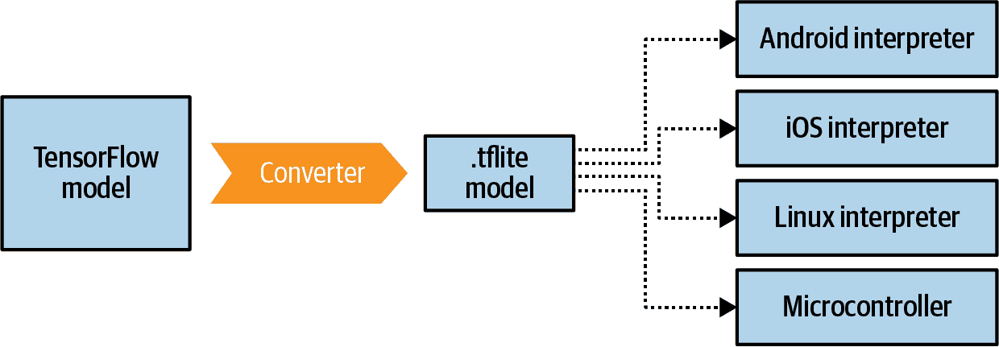
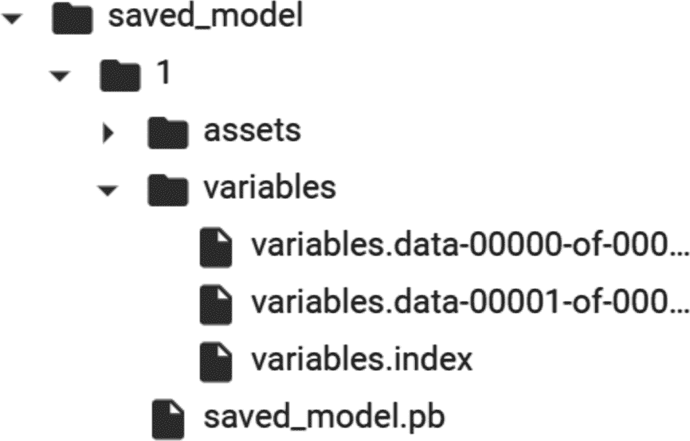
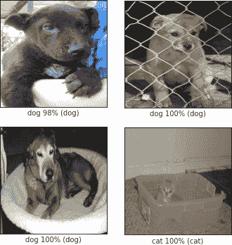

# 第十二章：TensorFlow Lite 简介

到目前为止，本书的所有章节都在探索如何使用 TensorFlow 创建机器学习模型，这些模型可以提供计算机视觉、自然语言处理和序列建模等功能，而无需明确编程规则。相反，使用标记数据，神经网络能够学习区分一件事物与另一件事物的模式，然后可以将其扩展为解决问题。在本书的其余部分，我们将转向并查看*如何*在常见场景中使用这些模型。第一个、最明显且可能最有用的主题是如何在移动应用程序中使用模型。在本章中，我将介绍使在移动（和嵌入式）设备上进行机器学习成为可能的基础技术：TensorFlow Lite。然后，在接下来的两章中，我们将探讨在 Android 和 iOS 上使用这些模型的场景。

TensorFlow Lite 是一套工具，用于补充 TensorFlow，实现两个主要目标。第一个目标是使您的模型适用于移动设备。这通常包括减小模型的大小和复杂性，尽可能少地影响其准确性，以使它们在像移动设备这样受电池限制的环境中更好地工作。第二个目标是为不同的移动平台提供运行时，包括 Android、iOS、移动 Linux（例如，树莓派）和各种微控制器。请注意，您不能使用 TensorFlow Lite 来*训练*模型。您的工作流程将是使用 TensorFlow 进行训练，然后*转换*为 TensorFlow Lite 格式，然后使用 TensorFlow Lite 解释器加载和运行它。

# 什么是 TensorFlow Lite？

TensorFlow Lite 最初是针对 Android 和 iOS 开发者的 TensorFlow 移动版本，旨在成为他们需求的有效 ML 工具包。在计算机或云服务上构建和执行模型时，电池消耗、屏幕大小和移动应用程序开发的其他方面不是问题，因此当针对移动设备时，需要解决一组新的约束条件。

第一个是移动应用程序框架需要*轻量级*。移动设备的资源远远有限于用于训练模型的典型机器。因此，开发人员不仅需要非常小心地使用应用程序所需的资源，还需要使用应用程序框架的资源。实际上，当用户浏览应用商店时，他们会看到每个应用程序的大小，并根据其数据使用情况决定是否下载。如果运行模型的框架很大，而且模型本身也很大，这将增加文件大小，并使用户失去兴趣。

框架还必须是*低延迟*的。在移动设备上运行的应用程序需要表现良好，否则用户可能会停止使用它们。只有 38%的应用程序被使用超过 11 次，意味着 62%的应用程序被使用 10 次或更少。事实上，所有应用程序中有 25%仅被使用一次。高延迟，即应用程序启动慢或处理关键数据慢，是导致这种放弃率的一个因素。因此，基于 ML 的应用程序需要加载快速并执行必要的推断。

与低延迟合作，移动框架需要一个*高效的模型格式*。在强大的超级计算机上训练时，模型格式通常不是最重要的信号。正如我们在早期章节中看到的，高模型准确度、低损失、避免过拟合等是模型创建者追求的指标。但是在移动设备上运行时，为了轻量化和低延迟，模型格式也需要考虑在内。到目前为止，我们所见的神经网络中的大部分数学都是高精度的浮点运算。对于科学发现来说，这是必不可少的。但是对于在移动设备上运行来说，可能并非如此。一个移动友好的框架将需要帮助您处理这种权衡，并为您提供必要的工具以便必要时转换您的模型。

在设备上运行您的模型具有一个重要的好处，即它们无需将数据传递给云服务以进行推断。这导致*用户隐私*以及*能量消耗*的改善。不需要使用无线电发送数据并接收预测的 WiFi 或蜂窝信号是好事，只要在设备上的推断不会在功耗方面成本过高。出于显而易见的原因，保持数据在设备上以运行预测也是一个强大且越来越重要的功能！（在本书的后面我们将讨论*联邦学习*，这是一种设备本地和基于云的混合机器学习方法，既能享受两全其美，又能保持隐私。）

因此，考虑到所有这些，TensorFlow Lite 应运而生。正如前面提到的，它不是一个用于*训练*模型的框架，而是一套补充工具，专门设计用于满足移动和嵌入式系统的所有限制。

它应该广泛被视为两个主要部分：一个转换器，将您的 TensorFlow 模型转换为*.tflite*格式，缩小并优化它，以及一套解释器，用于各种运行时环境（图 12-1）。



###### 图 12-1\. TensorFlow Lite 套件

解释器环境还支持其特定框架内的加速选项。例如，在 Android 上支持[神经网络 API](https://oreil.ly/wXjpm)，因此 TensorFlow Lite 可以在支持该 API 的设备上利用它。

请注意，并非每个 TensorFlow 中的操作（或“op”）目前都受到 TensorFlow Lite 或 TensorFlow Lite 转换器的支持。在转换模型时可能会遇到此问题，建议查看[文档](https://oreil.ly/otEIp)获取详细信息。本章后面的一个有用的工作流程是，获取一个现有的移动友好型模型，并为您的场景使用迁移学习。您可以在[TensorFlow 网站](https://oreil.ly/s28gE)和[TensorFlow Hub](https://oreil.ly/U8siI)上找到与 TensorFlow Lite 优化工作的模型列表。

# 演练：创建并将模型转换为 TensorFlow Lite

我们将从逐步演练开始，展示如何创建一个简单的 TensorFlow 模型，将其转换为 TensorFlow Lite 格式，然后使用 TensorFlow Lite 解释器。在这个演练中，我将使用 Linux 解释器，因为它在 Google Colab 中很容易获取。在第十三章中，您将看到如何在 Android 上使用这个模型，在第十四章中，您将探索如何在 iOS 上使用它。

回到第一章，您看到了一个非常简单的 TensorFlow 模型，学习了两组数字之间的关系，最终得到 Y = 2X - 1。为方便起见，这里是完整的代码：

```
l0 = `Dense`(units=`1`, input_shape=[`1`])
model = `Sequential`([l0])
model.compile(optimizer=`'``sgd``'`, loss=`'``mean_squared_error``'`)

xs = np.array([-`1.0`, `0.0`, `1.0`, `2.0`, `3.0`, `4.0`], dtype=float)
ys = np.array([-`3.0`, -`1.0`, `1.0`, `3.0`, `5.0`, `7.0`], dtype=float)

model.fit(xs, ys, epochs=`500`)

`print`(model.predict([`10.0`]))
`print`(`"``Here is what I learned: {}``"`.format(l0.get_weights()))
```

一旦训练完成，如您所见，您可以执行`model.predict[x]`并得到预期的`y`。在前面的代码中，`x=10`，模型将返回一个接近 19 的值。

由于这个模型体积小、易于训练，我们可以将其作为示例，演示转换为 TensorFlow Lite 的所有步骤。

## 第 1 步。保存模型

TensorFlow Lite 转换器支持多种不同的文件格式，包括 SavedModel（推荐）和 Keras H5 格式。在这个示例中，我们将使用 SavedModel。

要实现这一点，只需指定一个目录来保存模型，并调用`tf.saved_model.save`，将模型和目录传递给它：

```
`export_dir` `=` 'saved_model/1'
`tf``.``saved_model``.``save``(``model``,` `export_dir``)`
```

模型将保存为资产和变量以及一个*saved_model.pb*文件，如图 12-2 所示。



###### 图 12-2。SavedModel 结构

一旦您拥有了保存的模型，您就可以使用 TensorFlow Lite 转换器将其转换。

###### 注意

TensorFlow 团队建议使用 SavedModel 格式以确保在整个 TensorFlow 生态系统中的兼容性，包括未来与新 API 的兼容性。

## 第 2 步。转换并保存模型

TensorFlow Lite 转换器位于`tf.lite`包中。您可以调用它来通过首先使用`from_saved_model`方法调用它，并传递包含保存模型的目录，然后调用其`convert`方法来转换保存的模型：

```
# Convert the model.
`converter` `=` `tf``.``lite``.``TFLiteConverter``.``from_saved_model``(``export_dir``)`
`tflite_model` `=` `converter``.``convert``(``)`
```

然后，使用`pathlib`保存新的*.tflite*模型：

```
`import` pathlib
tflite_model_file = pathlib.`Path`(`'``model.tflite``'`)
tflite_model_file.write_bytes(tflite_model)
```

此时，你已经有一个名为 *.tflite* 的文件，可以在任何解释器环境中使用。稍后我们将在 Android 和 iOS 上使用它，但现在，让我们在基于 Python 的解释器中使用它，这样你就可以在 Colab 中运行它。这个相同的解释器也可以在嵌入式 Linux 环境中使用，比如树莓派！

## 步骤 3\. 加载 TFLite 模型并分配张量

下一步是将模型加载到解释器中，分配张量以将数据输入到模型进行预测，然后读取模型输出的预测结果。从程序员的角度来看，这是使用 TensorFlow Lite 与使用 TensorFlow 的巨大区别。在 TensorFlow 中，你可以简单地说 `model.predict(*something*)` 并得到结果，但因为 TensorFlow Lite 不会像 TensorFlow 那样有许多依赖项，特别是在非 Python 环境中，你现在必须变得更加低级，处理输入和输出张量，格式化数据以适应它们，并以对设备有意义的方式解析输出。

首先，加载模型并分配张量：

```
interpreter = tf.lite.`Interpreter`(model_content=tflite_model)
interpreter.allocate_tensors()
```

然后，你可以从模型中获取输入和输出的详细信息，以便开始理解它期望的数据格式，以及它将返回给你的数据格式：

```
input_details = interpreter.get_input_details()
output_details = interpreter.get_output_details()
`print`(input_details)
`print`(output_details)
```

你将得到大量输出！

首先，让我们检查输入参数。请注意 `shape` 设置，它是一个类型为 `[1,1]` 的数组。还请注意类别，它是 `numpy.float32`。这些设置将决定输入数据的形状和格式：

```
`[``{`'name'`:` 'dense_input'`,` 'index'`:` `0``,` 'shape'`:` `array``(``[``1``,` `1``]``,` `dtype``=``int32``)``,` 
  'shape_signature'`:` `array``(``[``1``,` `1``]``,` `dtype``=``int32``)``,` 'dtype'`:` `<``class`  
  'numpy.float32'`>,` 'quantization'`: (``0.0``,` `0``),` 'quantization_parameters'`:` 
  `{`'scales'`:` `array``(``[``]``,` `dtype``=``float32``)``,` 'zero_points'`:` `array``(``[``]``,` `dtype``=``int32``)``,` 
  'quantized_dimension'`:` `0``}``,` 'sparsity_parameters'`:` `{``}``}``]`
```

因此，为了格式化输入数据，如果你想预测 `x=10.0` 对应的 `y`，你需要像这样使用代码定义输入数组的形状和类型：

```
to_predict = np.array([[`10.0`]], dtype=np.float32)
`print`(to_predict)
```

在这里 `[1,1]` 的数组周围有双括号，可能会引起一些混淆——我在这里使用的助记符是说这里有 1 个列表，给了我们第一组 `[]`，而该列表只包含一个值，即 `[10.0]`，因此得到 `[[10.0]]`。可能会让人困惑的是形状定义为 `dtype=int32`，而你使用的是 `numpy.float32`。`dtype` 参数是定义形状的数据类型，而不是包含在该形状中封装的列表的内容。对于这个，你将使用类别。

输出细节非常相似，你需要关注的是其形状。因为它也是一个类型为 `[1,1]` 的数组，你可以期待答案也会像输入 `[[x]]` 一样是 `[[y]]`：

```
`[``{`'name'`:` 'Identity'`,` 'index'`:` `3``,` 'shape'`:` `array``(``[``1``,` `1``]``,` `dtype``=``int32``)``,` 
  'shape_signature'`:` `array``(``[``1``,` `1``]``,` `dtype``=``int32``)``,` 'dtype'`:` `<``class`  
  'numpy.float32'`>,` 'quantization'`: (``0.0``,` `0``),` 'quantization_parameters'`:` 
  `{`'scales'`:` `array``(``[``]``,` `dtype``=``float32``)``,` 'zero_points'`:` `array``(``[``]``,` `dtype``=``int32``)``,` 
  'quantized_dimension'`:` `0``}``,` 'sparsity_parameters'`:` `{``}``}``]`
```

## 步骤 4\. 执行预测

要使解释器执行预测，你需要将输入张量设置为要预测的值，并告诉它使用哪个输入值：

```
interpreter.set_tensor(input_details[`0`][`'``index``'`], to_predict)
interpreter.invoke()
```

输入张量是使用输入详细信息数组的索引来指定的。在这种情况下，您有一个非常简单的模型，只有一个单独的输入选项，因此它是`input_details[0]`，您将在索引处进行处理。输入详细信息项目 0 只有一个索引，索引为 0，并且它希望一个形状为`[1,1]`，如前所述。因此，您将`to_predict`值放入其中。然后使用`invoke`方法调用解释器。

然后，您可以通过调用`get_tensor`并提供您要读取的张量的详细信息来读取预测：

```
tflite_results = interpreter.get_tensor(output_details[`0`][`'``index``'`])
`print`(tflite_results)
```

同样，只有一个输出张量，因此它将是`output_details[0]`，您指定索引以获取其下的详细信息，这将具有输出值。

因此，例如，如果您运行此代码：

```
to_predict = np.array([[`10.0`]], dtype=np.float32)
`print`(to_predict)
interpreter.set_tensor(input_details[`0`][`'``index``'`], to_predict)
interpreter.invoke()
tflite_results = interpreter.get_tensor(output_details[`0`][`'``index``'`])
`print`(tflite_results)
```

您应该看到如下输出：

```
[[`10.`]]
[[`18.975412`]]
```

其中 10 是输入值，18.97 是预测值，非常接近于 19，当 X = 10 时为 2X - 1。为什么不是 19，请参阅第一章！

鉴于这只是一个非常简单的例子，让我们来看看接下来的一些稍微复杂的东西——在一个知名的图像分类模型上使用迁移学习，然后将其转换为 TensorFlow Lite。从那里，我们还能更好地探索优化和量化模型的影响。

# 演示：转移学习图像分类器并转换为 TensorFlow Lite

在本节中，我们将从第三章和第四章的 Dogs vs. Cats 计算机视觉模型中构建一个使用迁移学习的新版本。这将使用来自 TensorFlow Hub 的模型，因此如果您需要安装它，可以按照[网站上的说明](https://www.tensorflow.org/hub)进行操作。

## 第 1 步：构建并保存模型

首先，获取所有数据：

```
`import` numpy `as` np
`import` matplotlib.pylab `as` plt

`import` tensorflow `as` tf
`import` tensorflow_hub `as` hub
`import` tensorflow_datasets `as` tfds

`def` format_image(image, label):
    image = tf.image.resize(image, IMAGE_SIZE) / `255.0`
    `return`  image, label

(raw_train, raw_validation, raw_test), metadata = tfds.load(
    `'``cats_vs_dogs``'`,
    split=[`'``train[:80``%``]``'`, `'``train[80``%``:90``%``]``'`, `'``train[90``%``:]``'`],
    with_info=`True`,
    as_supervised=`True`,
)

num_examples = metadata.splits[`'``train``'`].num_examples
num_classes = metadata.features[`'``label``'`].num_classes
`print`(num_examples)
`print`(num_classes)

BATCH_SIZE = `32`
train_batches = 
raw_train.shuffle(num_examples // `4`)
.map(format_image).batch(BATCH_SIZE).prefetch(`1`)

validation_batches = raw_validation.map(format_image)
.batch(BATCH_SIZE).prefetch(`1`)
test_batches = raw_test.map(format_image).batch(`1`)
```

这将下载 Dogs vs. Cats 数据集，并将其分割为训练、测试和验证集。

接下来，您将使用来自 TensorFlow Hub 的`mobilenet_v2`模型创建一个名为`feature_extractor`的 Keras 层：

```
module_selection = (`"``mobilenet_v2``"`, `224`, `1280`) 
handle_base, pixels, FV_SIZE = module_selection

MODULE_HANDLE =`"``https://tfhub.dev/google/tf2-preview/{}/feature_vector/4``"`
.format(handle_base)

IMAGE_SIZE = (pixels, pixels)

feature_extractor = hub.`KerasLayer`(MODULE_HANDLE,
                                   input_shape=IMAGE_SIZE + (`3`,), 
                                   output_shape=[FV_SIZE],
                                   trainable=`False`)
```

现在您已经有了特征提取器，可以将其作为神经网络的第一层，并添加一个输出层，其神经元数量与类别数量相同（在本例中为两个）。然后您可以编译并训练它：

```
`model` `=` `tf``.``keras``.`Sequential`(``[`
 `feature_extractor``,`
 `tf``.``keras``.``layers``.`Dense`(``num_classes``,` `activation``=``'``softmax``'``)`
 `]``)`

`model``.``compile``(``optimizer``=``'``adam``'``,`
 `loss``=``'``sparse_categorical_crossentropy``'``,`
 `metrics``=``[``'``accuracy``'``]``)`

`hist` `=` `model``.``fit``(``train_batches``,`
 `epochs``=``5``,`
 `validation_data``=``validation_batches``)`
```

只需五个训练周期，这应该给出一个在训练集上达到 99%准确度，在验证集上超过 98%的模型。现在您只需简单地保存模型即可：

```
`CATS_VS_DOGS_SAVED_MODEL` `=` "exp_saved_model"
`tf``.``saved_model``.``save``(``model``,` `CATS_VS_DOGS_SAVED_MODEL``)`
```

一旦您有了保存的模型，您可以进行转换。

## 第 2 步：将模型转换为 TensorFlow Lite

如前所述，您现在可以取出保存的模型并将其转换为*.tflite*模型。您将其保存为*converted_model.tflite*：

```
converter = tf.lite.`TFLiteConverter`.from_saved_model(CATS_VS_DOGS_SAVED_MODEL)
tflite_model = converter.convert()
tflite_model_file = `'``converted_model.tflite``'`

`with` open(tflite_model_file, `"``wb``"`) `as` f:
    f.write(tflite_model)
```

一旦您有了文件，您可以使用它实例化一个解释器。完成此操作后，您应该像以前一样获取输入和输出详细信息。将它们加载到名为`input_index`和`output_index`的变量中。这使得代码更易读！

```
interpreter = tf.lite.`Interpreter`(model_path=tflite_model_file)
interpreter.allocate_tensors()

input_index = interpreter.get_input_details()[`0`][`"``index``"`]
output_index = interpreter.get_output_details()[`0`][`"``index``"`]

predictions = []
```

数据集中有很多测试图像在`test_batches`中，所以如果您想取其中的一百张图像并对它们进行测试，可以这样做（可以自由更改`100`为任何其他值）：

```
test_labels, test_imgs = [], []
`for` img, label `in` test_batches.take(`100`):
    interpreter.set_tensor(input_index, img)
    interpreter.invoke()
    predictions.append(interpreter.get_tensor(output_index))
    test_labels.append(label.numpy()[`0`])
    test_imgs.append(img)
```

在早期读取图像时，它们通过称为`format_image`的映射函数重新格式化，以便在训练和推断中都具有正确的大小，因此现在您所需做的就是将解释器的张量设置为输入索引处的图像。调用解释器后，您可以获取输出索引处的张量。

如果您想查看预测与标签的比较情况，可以运行如下代码：

```
score = `0`
`for` item `in` range(`0`,`99`):
    prediction=np.argmax(predictions[item])
    label = test_labels[item]
    `if` prediction==label:
        score=score+`1`

`print`(`"``Out of 100 predictions I got` `"` + str(score) + `"` `correct``"`)
```

这应该会给你一个 99 或 100 的正确预测分数。

您还可以使用此代码将模型的输出与测试数据进行可视化：

```
`for` index `in` range(`0`,`99`):
    plt.figure(figsize=(`6`,`3`))
    plt.subplot(`1`,`2`,`1`)
    plot_image(index, predictions, test_labels, test_imgs)
    plt.show()
```

您可以在图 12-3 中看到这些结果的一些内容。（请注意，所有代码都可以在书的[GitHub 仓库](https://github.com/lmoroney/tfbook)中找到，所以如果需要的话，请去那里查看。）



###### 图 12-3\. 推断结果

这只是普通的、转换后的模型，没有为移动设备添加任何优化。接下来，您将探索如何为移动设备优化此模型。

## 步骤 3\. 优化模型

现在您已经看到了训练、转换和使用 TensorFlow Lite 解释器的端到端过程，接下来我们将看看如何开始优化和量化模型。

第一种优化类型，称为*动态范围量化*，是通过在转换器上设置`optimizations`属性来实现的，在执行转换之前进行设置。以下是代码：

```
converter = tf.lite.>TFLiteConverter.from_saved_model(CATS_VS_DOGS_SAVED_MODEL)
`converter``.``optimizations` `=` `[``tf``.``lite``.``>``Optimize``.``DEFAULT``]`

tflite_model = converter.convert()
tflite_model_file = >'converted_model.tflite'

>with open(tflite_model_file, >"wb") >as f:
    f.write(tflite_model)
```

在撰写本文时有几个可用的优化选项（稍后可能会添加更多）。这些选项包括：

`OPTIMIZE_FOR_SIZE`

执行优化，使模型尽可能小。

`OPTIMIZE_FOR_LATENCY`

执行优化，尽量减少推断时间。

`DEFAULT`

找到在大小和延迟之间的最佳平衡。

在这种情况下，此步骤之前模型的大小接近 9 MB，但之后仅为 2.3 MB，几乎减少了 70%。各种实验表明，模型可以缩小至原来的 4 倍，速度提高 2 到 3 倍。然而，根据模型类型的不同，可能会出现精度损失，因此如果像这样量化，建议对模型进行全面测试。在这种情况下，我发现模型的精度从 99%降至约 94%。

您可以使用*完整整数量化*或*float16 量化*来优化这个模型，以利用特定的硬件优势。完整整数量化将模型中的权重从 32 位浮点数更改为 8 位整数，这对模型的大小和延迟（尤其是对于较大的模型）可能会产生巨大影响，但对准确性的影响相对较小。

要获得完整的整数量化，您需要指定一个代表性数据集，告诉转换器大致可以期待什么范围的数据。更新代码如下：

```
converter = tf.lite.TFLiteConverter.from_saved_model(CATS_VS_DOGS_SAVED_MODEL)

converter.optimizations = [tf.lite.Optimize.DEFAULT]

`def` `representative_data_gen``(``)``:`
 `for` `input_value``,` `_` `in` `test_batches``.``take``(``100``)``:`
 `yield` `[``input_value``]`

`converter``.``representative_dataset` `=` `representative_data_gen`
`converter``.``target_spec``.``supported_ops` `=` `[``tf``.``lite``.``OpsSet``.``TFLITE_BUILTINS_INT8``]`

tflite_model = converter.convert()
tflite_model_file = 'converted_model.tflite'

with open(tflite_model_file, "wb") as f:
    f.write(tflite_model)
```

拥有这些代表性数据使得转换器能够在数据通过模型时检查，并找到最佳的转换点。然后，通过设置支持的操作（在这种情况下设置为`INT8`），可以确保精度仅在模型的这些部分进行量化。结果可能是一个稍大一些的模型——在这种情况下，使用`convertor.optimizations`时从 2.3 MB 增加到了 2.8 MB。然而，精确度提高到了 99%。因此，通过遵循这些步骤，您可以将模型的大小减少约三分之二，同时保持其准确性！

# 摘要

在本章中，您了解了 TensorFlow Lite，并看到它是如何设计来使您的模型能够在比开发环境更小、更轻的设备上运行的。这些设备包括移动操作系统如 Android、iOS 和 iPadOS，以及移动 Linux 环境，比如树莓派和支持 TensorFlow 的微控制器系统。您构建了一个简单的模型，并使用它来探索转换工作流程。然后，您通过一个更复杂的例子来学习，使用迁移学习重新训练现有模型以适应您的数据集，将其转换为 TensorFlow Lite，并对移动环境进行优化。在下一章中，您将深入探讨如何使用基于 Android 的解释器在您的 Android 应用中使用 TensorFlow Lite。
