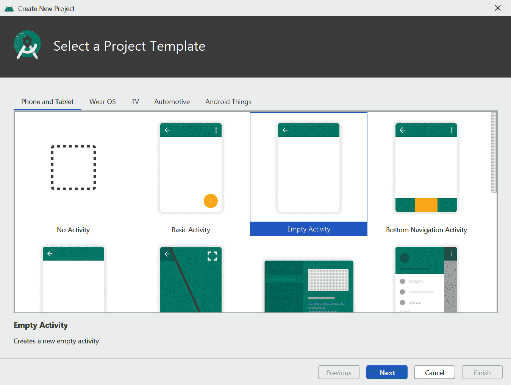
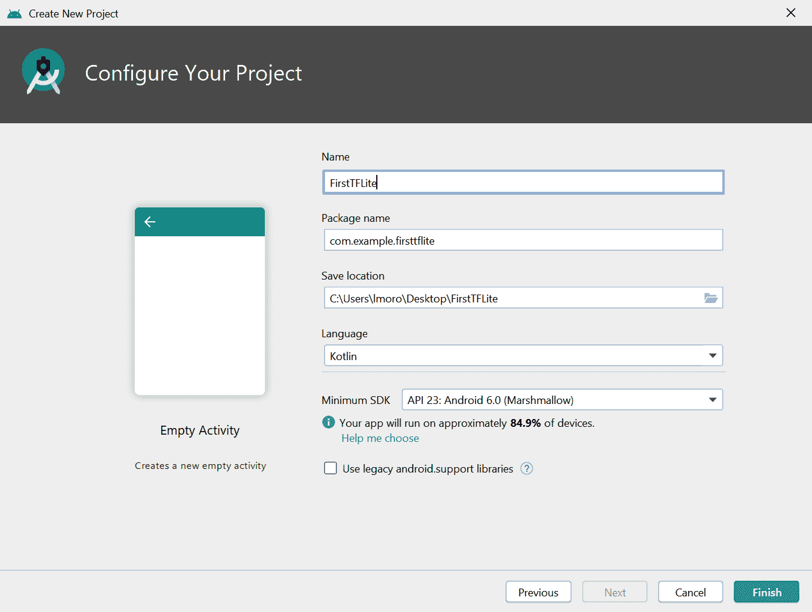
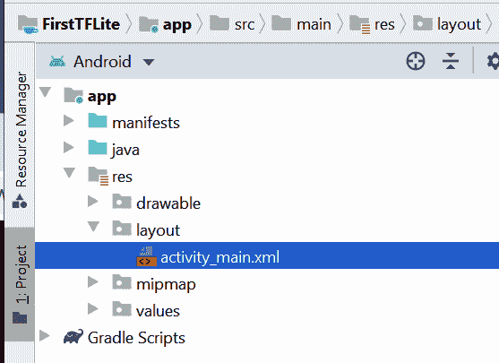
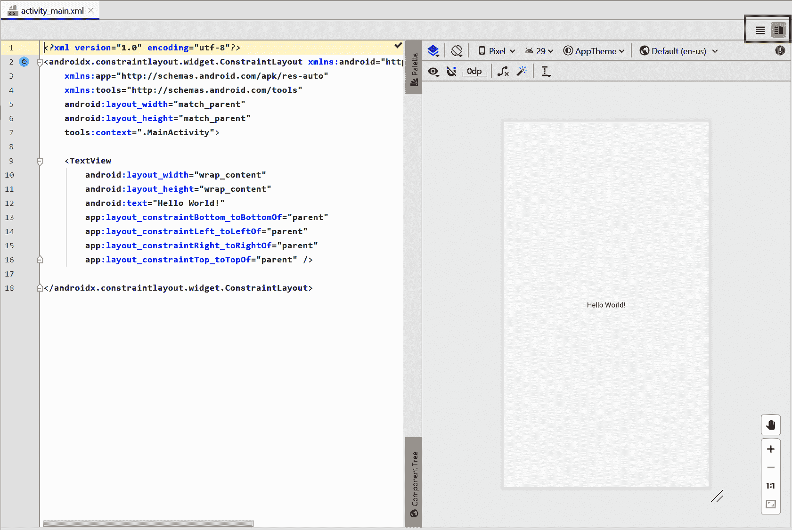
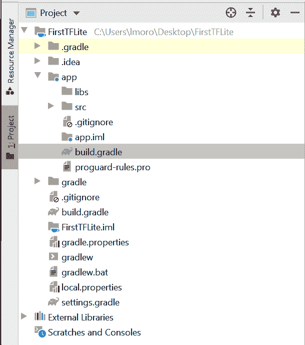
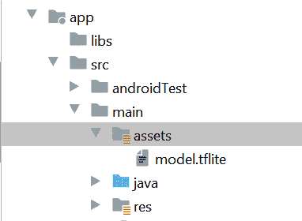
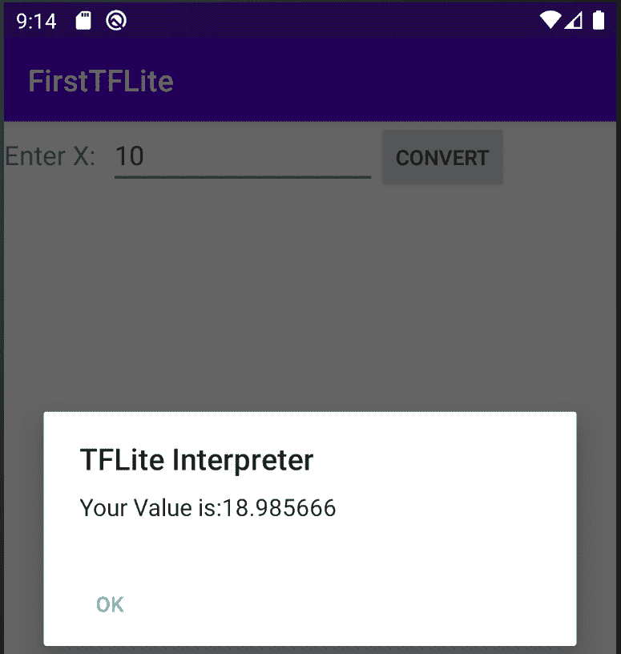
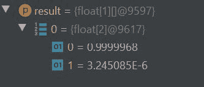

# 第十三章：在 Android 应用中使用 TensorFlow Lite

第十二章向你介绍了 TensorFlow Lite，一套工具，帮助你将模型转换为移动或嵌入式系统可消费的格式。在接下来的几章中，你将了解如何在各种运行时环境中使用这些模型。在这里，你将看到如何创建使用 TensorFlow Lite 模型的 Android 应用程序。我们将从快速探索用于创建 Android 应用程序的主要工具开始：Android Studio。

# 什么是 Android Studio？

Android Studio 是一个集成开发环境（IDE），用于开发 Android 应用程序，适用于各种设备，从手机和平板电脑到电视、汽车、手表等等。在本章中，我们将专注于用于手机应用程序的使用。它可以免费[下载](https://developer.android.com/studio)，并且适用于所有主要操作系统。

Android Studio 给你提供的一个好处是 Android 模拟器，这样你就可以在不需要实体设备的情况下测试应用。在本章中，你将会广泛使用它！传统上，Android 应用是使用 Java 编程语言构建的，但最近 Google 在 Android Studio 中引入了 Kotlin，而你将在本章中使用这种语言。

# 创建你的第一个 TensorFlow Lite Android 应用程序

如果你还没有安装 Android Studio，请立即安装。设置、更新和准备好所有内容可能需要一些时间。在接下来的几页中，我将逐步指导你创建一个新应用，设计其用户界面，添加 TensorFlow Lite 依赖项，然后为推理编写代码。这将是一个非常简单的应用程序——你在其中输入一个值，它执行推理并计算 Y = 2X – 1，其中 X 是你输入的值。对于这样简单的功能来说，这有点大材小用，但是这样一个应用程序的脚手架几乎与更复杂的应用程序的相同。

## 步骤 1：创建一个新的 Android 项目

一旦你安装好了 Android Studio，可以通过 File → New → New Project 创建一个新应用，这将打开创建新项目对话框（图 13-1）。



###### 图 13-1：在 Android Studio 中创建一个新项目

如 图 13-1 所示，选择空活动（Empty Activity）。这是最简单的 Android 应用程序，几乎没有任何预先存在的代码。点击“Next”将进入配置项目对话框（图 13-2）。



###### 图 13-2：配置你的项目

在这个对话框中，如示例所示，将名称设置为 *FirstTFLite*，并确保语言为 Kotlin。最小 SDK 级别可能会默认为 API 23，如果你喜欢，可以保持不变。

当你完成后，请按完成。Android Studio 现在将为您的应用程序创建所有的代码。Android 应用程序需要大量文件。您创建的单个活动有一个布局文件（XML 格式），定义其外观，以及一个关联的 *.kt*（Kotlin）源文件。还有几个配置文件定义应用程序的构建方式，应用程序应使用的依赖项，以及其资源、资产等等。即使对于这样一个非常简单的应用程序，一开始可能会感到非常压制。

## 步骤 2\. 编辑您的布局文件

在屏幕左侧，您将看到项目资源管理器。确保顶部选择了 Android，并找到 *res* 文件夹。在其中找到 *layout* 文件夹，在其中您会找到 *activity_main.xml*（参见图 13-3）。



###### 图 13-3\. 查找您的活动设计文件

双击它以打开它，您将看到 Android Studio 布局编辑器。这为您提供了访问用户界面的视觉表示，以及显示定义的 XML 编辑器。您可能只会看到其中之一，但如果想同时看到两者（我建议这样做！），可以使用位于图 13-4 右上角的三个突出显示的按钮。它们依次提供仅 XML 编辑器，带有 XML 编辑器和可视化设计师的分屏视图，以及仅可视化设计师。还请注意直接在这些按钮下方的属性选项卡。它允许您编辑任何单个用户界面元素的属性。随着您构建更多的 Android 应用程序，您可能会发现使用可视化布局工具从控件面板拖放项目到设计表面，并使用属性窗口设置布局宽度等更容易。



###### 图 13-4\. 在 Android Studio 中使用布局编辑器

正如您在图 13-4 中所见，您将拥有一个非常基本的 Android 活动，其中包含一个单独的 `TextView` 控件，显示“Hello World”。将活动的所有代码替换为以下内容：

```
<?xml version=`"1.0"` encoding=`"utf-8"`?>
`<``LinearLayout` `xmlns``:``tools`=`"http://schemas.android.com/tools"`
        `android``:``orientation`=`"vertical"`
 `xmlns``:``android`=`"http://schemas.android.com/apk/res/android"` 
 `android``:``layout_height`=`"match_parent"` 
 `android``:``layout_width`=`"match_parent"``>`

    `<``LinearLayout`
        `android``:``layout_width`=`"match_parent"`
        `android``:``layout_height`=`"wrap_content"``>`

        `<``TextView`
            `android``:``id`=`"@+id/lblEnter"`
            `android``:``layout_width`=`"wrap_content"`
            `android``:``layout_height`=`"wrap_content"`
            `android``:``text`=`"Enter X:` "
            `android``:``textSize`=`"18sp"``>``<``/``TextView``>`

        `<``EditText`
            `android``:``id`=`"@+id/txtValue"`
            `android``:``layout_width`=`"180dp"`
            `android``:``layout_height`=`"wrap_content"`
            `android``:``inputType`=`"number"`
            `android``:``text`=`"1"``>``<``/``EditText``>`

        `<``Button`
            `android``:``id`=`"@+id/convertButton"`
            `android``:``layout_width`=`"wrap_content"`
            `android``:``layout_height`=`"wrap_content"`
            `android``:``text`=`"Convert"``>`

        `<``/``Button``>`
    `<``/``LinearLayout``>`
`<``/``LinearLayout``>`
```

在这段代码中需要注意的重要事项是 `android:id` 字段，特别是对于 `EditText` 和 `Button`。可以更改它们，但如果更改了，稍后在编写代码时需要使用相同的值。我分别称它们为 `txtValue` 和 `convertButton`，因此在代码中注意这些值！

## 步骤 3\. 添加 TensorFlow Lite 依赖项

TensorFlow Lite 并不是 Android API 的一部分，因此当您在 Android 应用中使用它时，需要让环境知道您将导入外部库。在 Android Studio 中，可以通过 Gradle 构建工具实现此目的。此工具允许您通过描述 JSON 文件 *build.gradle* 来配置您的环境。对于新的 Android 开发者来说，这可能一开始有点令人困惑，因为 Android Studio 实际上提供了两个 Gradle 文件。通常这些被描述为“项目级” *build.gradle* 和“应用级” *build.gradle*。第一个文件位于项目文件夹中，后者位于 *app* 文件夹中（因此它们的名称），正如您可以在图 13-5 中看到的那样。

您需要编辑应用级文件，如图 13-5 中所示。该文件包含应用程序的依赖细节。打开它，并进行两处编辑。首先是在依赖项部分添加一个 `implementation` 来包含 TensorFlow Lite 库：

```
implementation 'org.tensorflow:tensorflow-lite:0.0.0-nightly'
```

###### 注意

您可以在[TensorFlow Lite 文档](https://oreil.ly/ncLNY)中获取此依赖项的最新版本号。



###### 图 13-5\. 选择您的 build.gradle 文件

第二个编辑要求您在 `android{}` 部分内创建一个新的设置，如下所示：

```
android{
...
    aaptOptions {
        noCompress "tflite"
    }
...
}
```

此步骤防止编译器压缩您的 *.tflite* 文件。Android Studio 编译器会编译资源以使其更小，从而减少从 Google Play 商店下载的时间。但是，如果 *.tflite* 文件被压缩，TensorFlow Lite 解释器将无法识别它。为确保不会被压缩，您需要将 `aaptOptions` 设置为对 *.tflite* 文件不进行压缩。如果使用了其他扩展名（有些人只使用 *.lite*），请确保在此处设置正确。

您现在可以尝试构建您的项目。TensorFlow Lite 库将被下载并链接。

## 步骤 4\. 添加您的 TensorFlow Lite 模型

在第十二章中，您创建了一个非常简单的模型，该模型从一组训练的 X 和 Y 值推断出 Y = 2X – 1，将其转换为 TensorFlow Lite，并将其保存为 *.tflite* 文件。您需要在此步骤中使用该文件。

首先要做的是在您的项目中创建一个 *assets* 文件夹。要执行此操作，请在项目资源管理器中导航到 *app/src/main* 文件夹，右键单击 *main* 文件夹，然后选择新建文件夹。将其命名为 *assets*。将在训练模型后下载的 *.tflite* 文件拖放到该目录中。如果之前没有创建此文件，您可以在本书的[GitHub 仓库](https://github.com/lmoroney/tfbook)中找到它。

完成后，项目资源管理器应该看起来像图 13-6。如果*assets*文件夹尚未具有特殊的资产图标，不要担心；这将在 Android Studio 下一次构建后更新。



###### 图 13-6。将模型添加为资产

现在所有的架构工作都完成了，是时候开始编码了！

## 第 5 步。编写活动代码以使用 TensorFlow Lite 进行推理

尽管你使用的是 Kotlin，但你的源文件位于*java*目录中，可以在图 13-6 中看到。打开这个文件夹，你会看到一个包含你的包名的文件夹。在其中，你应该会看到*MainActivity.kt*文件。双击此文件以在代码编辑器中打开它。

首先，你需要一个帮助函数，从*assets*目录中加载 TensorFlow Lite 模型：

```
private fun loadModelFile(assetManager: AssetManager, 
                                        modelPath: String): ByteBuffer {
    val fileDescriptor = assetManager.openFd(modelPath)
    val inputStream = FileInputStream(fileDescriptor.fileDescriptor)
    val fileChannel = inputStream.channel
    val startOffset = fileDescriptor.startOffset
    val declaredLength = fileDescriptor.declaredLength
    return fileChannel.map(FileChannel.MapMode.READ_ONLY, 
                           startOffset, declaredLength)
}
```

因为*.tflite*文件实际上是一个包含权重和偏差的压缩二进制数据块，解释器将使用它来构建内部神经网络模型，在 Android 术语中它是一个`ByteBuffer`。此代码将加载`modelPath`处的文件并将其作为`ByteBuffer`返回。

然后，在你的活动中，在类级别（即类声明的下方，不在任何类函数内），你可以添加模型和解释器的声明：

```
`private` lateinit `var` tflite : `Interpreter`
`private` lateinit `var` tflitemodel : `ByteBuffer`
```

因此，在这种情况下，执行所有工作的解释器对象将被称为`tflite`，而你将加载到解释器中作为`ByteBuffer`的模型将被称为`tflitemodel`。

接下来，在`onCreate`方法中（当活动创建时调用），添加一些代码来实例化解释器并加载`model.tflite`到其中：

```
`try`{
    tflitemodel = loadModelFile(`this`.assets, `"model.tflite"`)
    tflite = `Interpreter`(tflitemodel)
} catch(ex: `Exception`){
    ex.printStackTrace()
}
```

此外，在`onCreate`中，还要添加与你将与之交互的两个控件的代码——`EditText`，在其中你将输入一个值，以及`Button`，在其中你将按下以进行推理：

```
`var` convertButton: `Button` = findViewById<`Button`>(R.id.convertButton)
convertButton.setOnClickListener{
    doInference()
}
txtValue = findViewById<`EditText`>(R.id.txtValue)
```

你还需要在类级别声明`EditText`以及`tflite`和`tflitemodel`，因为它将在下一个函数中被引用。你可以用以下方式做到这一点：

```
`private` lateinit `var` txtValue : `EditText`
```

最后，是执行推理的时候了。你可以使用一个名为`doInference`的新函数来完成这个操作：

```
`private` `fun` doInference(){
}
```

在这个函数中，你可以从输入中收集数据，将其传递给 TensorFlow Lite 进行推理，然后显示返回的值。

`EditText`控件，你将在其中输入数字，将提供给你一个字符串，你需要将其转换为浮点数：

```
`var` userVal: `Float` = txtValue.text.toString().toFloat()
```

正如你在第十二章中所记得的，当向模型提供数据时，你需要将其格式化为一个 Numpy 数组。由于 Numpy 是一个 Python 构造，不支持在 Android 上使用，但在这种情况下可以使用`FloatArray`。即使你只传入一个值，它仍然需要在一个数组中，大致相当于一个张量：

```
`var` inputVal: `FloatArray` = floatArrayOf(userVal)
```

模型将返回一串字节流，需要进行解释。如您所知，模型输出的是一个浮点值，考虑到一个浮点数占用 4 个字节，您可以设置一个 4 字节的`ByteBuffer`来接收输出。字节可以按多种方式排序，但您只需使用默认的本机顺序：

```
`var` outputVal: `ByteBuffer` = `ByteBuffer`.allocateDirect(`4`)
outputVal.order(`ByteOrder`.nativeOrder())
```

要执行推理，您需要在解释器上调用`run`方法，传递输入和输出值。然后它将从输入值读取，并将结果写入输出值：

```
tflite.run(inputVal, outputVal)
```

输出写入`ByteBuffer`，其指针现在位于缓冲区的末尾。要读取它，您需要将其重置为缓冲区的开头：

```
outputVal.rewind()
```

现在您可以将`ByteBuffer`的内容作为浮点数读取：

```
`var` f:`Float` = outputVal.getFloat()
```

如果您希望将此显示给用户，您可以使用`AlertDialog`：

```
`val` builder = AlertDialog.Builder(`this`)
with(builder)
{
    setTitle(`"TFLite Interpreter"`)
    setMessage(`"Your Value is:$f"`)
    setNeutralButton(`"OK"`, `DialogInterface`.`OnClickListener` {
        dialog, id -> dialog.cancel()
    })
    show()
}
```

现在运行应用程序并自行尝试！您可以在图 13-7 中看到结果。



###### 图 13-7\. 在模拟器中运行解释器

# 超越“Hello World”—处理图像

正如您在过去的几页中所看到的，构建 Android 应用涉及大量的脚手架，并且 TensorFlow Lite 解释器需要代码和配置才能正确初始化。现在您已经解决了这个问题，如果您想创建其他使用 TensorFlow Lite 的 Android 应用程序，您将会经历基本相同的过程。您将遇到的唯一主要区别在于，需要以模型理解的方式格式化输入数据，并以相同的方式解析输出数据。因此，例如，在第十二章中，您构建了一个狗与猫模型，允许您输入猫或狗的图像，并得到推理结果。该模型要求输入一张尺寸为 224 × 224 像素、三个颜色通道且已归一化的图像——这就需要弄清楚如何从 Android 图像控件获取图像并进行格式化，以便神经网络能够理解它！

例如，让我们从图 13-8 中的图像开始，这是一张狗的简单图像，尺寸为 395 × 500 像素。


###### 图 13-8\. 狗的图像进行解释

您需要做的第一件事是将其调整为模型训练时的 224 × 224 像素大小。在 Android 中可以使用`Bitmap`库来完成这个任务。例如，您可以创建一个新的 224 × 224 位图：

```
`val` scaledBitmap = `Bitmap`.createScaledBitmap(bitmap, 224, 224, `false`)
```

（在这种情况下，`bitmap`包含应用程序加载的原始图像资源。完整的应用程序可在书的[GitHub 存储库](https://github.com/lmoroney/tfbook)中找到。）

现在，尺寸正确后，你需要协调 Android 中图像的结构与模型期望的结构相符。如果你回忆一下，在本书早些时候训练模型时，你把图像作为归一化的张量值输入。例如，像这样的图像会是（224，224，3）：224 × 224 是图像尺寸，3 是颜色深度。这些值也都被归一化到 0 到 1 之间。

所以，总结一下，你需要 224 × 224 × 3 个 0 到 1 之间的浮点值来表示这幅图像。要将它存储在一个`ByteArray`中，其中 4 个字节组成一个浮点数，你可以使用这段代码：

```
`val` byteBuffer = `ByteBuffer`.allocateDirect(`4` * `2``2``4` * `2``2``4` * `3`)
byteBuffer.order(`ByteOrder`.nativeOrder())
```

另一方面，我们的 Android 图像将每个像素存储为一个 32 位整数的 RGB 值。这可能看起来像是对于特定像素的 0x0010FF10。前两个值是透明度，你可以忽略它们，剩下的是 RGB；即 0x10 表示红色，0xFF 表示绿色，0x10 表示蓝色。到目前为止，你一直在做的简单归一化只是将 R、G、B 通道值除以 255，这将给你红色的 0.06275，绿色的 1，蓝色的 0.06275。

所以，为了进行这种转换，让我们首先将我们的位图转换为一个 224 × 224 整数数组，并复制像素。你可以使用`getPixels` API 来实现这一点：

```
`val` intValues = `IntArray`(`2``2``4` * `2``2``4`)
scaledbitmap.getPixels(intValues, `0`, `2``2``4`, `0`, `0`, `2``2``4`, `2``2``4`)
```

现在，你需要遍历这个数组，逐个读取像素并将其转换为归一化的浮点数。你将使用位移来获取特定的通道。例如，考虑之前的值 0x0010FF10。如果你将其向右移动 16 位，你将得到 0x0010（FF10 部分将被“丢弃”）。然后，如果你对其进行 0xFF 的“与”操作，你将得到 0x10，保留底部的两个数字。类似地，如果你向右移动 8 位，你将得到 0x0010FF，并对其进行“与”操作将得到 0xFF。这是一种允许你快速轻松地剥离出组成像素的相关位的技术。你可以在整数上使用`shr`操作来实现这一点，比如`input.shr(16)`表示“将输入向右移动 16 个像素”：

```
`var` pixel = `0`
`for` (i `in` `0` until INPUT`_`SIZE) {
    `for` (j `in` `0` until INPUT`_`SIZE) {
        `val` input = intValues[pixel++]
        byteBuffer.putFloat(((input.shr(`1``6`)  and `0``xFF`) / 255))
        byteBuffer.putFloat(((input.shr(`8`) and `0``xFF`) / 255))
        byteBuffer.putFloat(((input and `0``xFF`)) / 255))
    }
}
```

与之前一样，当涉及到输出时，你需要定义一个数组来保存结果。它不一定*必须*是一个`ByteArray`；实际上，如果你知道结果通常是浮点数，你可以定义类似于`FloatArray`的东西。在这种情况下，使用猫狗模型，你有两个标签，模型架构在输出层定义了两个神经元，包含了类别猫和狗的相应属性。因此，为了读取结果，你可以定义一个结构来包含类似于这样的输出张量：

```
`val` result = `Array`(`1`) { `FloatArray`(`2`) }
```

请注意，它是一个包含两个项目数组的单一数组。回想一下，当使用 Python 时，你可能会看到像`[[1.0 0.0]]`这样的值——这里是一样的。`Array(1)`定义了包含数组`[]`，而`FloatArray(2)`是`[1.0 0.0]`。这可能有点令人困惑，但希望你在编写更多 TensorFlow 应用时能习惯！

与之前一样，你可以使用`interpreter.run`来解释：

```
interpreter.run(byteBuffer, result)
```

现在，您的结果将是一个包含两个值数组的数组。您可以在 Android 调试器中看到它的样子，如图 13-8 所示。



###### 图 13-9\. 解析输出值

在创建 Android 移动应用程序时，这是除了创建模型之外，您必须考虑的最复杂部分。Python 如何表示值，特别是使用 Numpy，可能与 Android 的方式非常不同。您将不得不创建转换器，以重新格式化数据，使其适应神经网络期望的数据输入，并且您必须了解神经网络使用的输出模式，以便解析结果。

# TensorFlow Lite 示例应用程序

TensorFlow 团队提供了许多开源示例应用程序，您可以解析这些应用程序，从而了解它们如何从本章中构建的基础上工作。它们包括（但不限于）以下内容：

图像分类

从设备摄像头读取输入并对多达一千种不同的物品进行分类。

对象检测

从设备摄像头读取输入，并为检测到的对象提供边界框。

姿势估计

查看摄像机中的图像并推断它们的姿势。

语音识别

识别常见的口头命令。

手势识别

为手势训练模型并在摄像头中识别它们。

智能回复

接收输入消息并生成回复。

图像分割

类似于对象检测，但预测图像中每个像素属于哪个类。

风格转移

将新的艺术风格应用于任何图像。

数字分类器

识别手写数字。

文本分类

使用在 IMDb 数据集上训练的模型，识别文本中的情感。

问答

使用双向编码器表示转换（BERT），自动回答用户查询！

您可以在[Awesome TFLite repo](https://oreil.ly/Rxpbx)的 GitHub 上找到另一个经过精心筛选的应用程序列表。

# 摘要

在本章中，您体验了如何在 Android 上使用 TensorFlow Lite。您了解了 Android 应用程序的结构以及如何将 TensorFlow Lite 集成到其中。您学会了如何将模型实现为 Android 资产，以及如何加载和在解释器中使用它。最重要的是，您了解到需要将基于 Android 的数据（如图像或数字）转换为模型中使用的输入数组，并学会如何解析输出数据，认识到它也是在`ByteBuffer`中有效映射的张量。您详细了解了几个示例，展示了如何做到这一点，希望这使您能够处理其他场景。在下一章中，您将再次执行此操作，但这次是在使用 Swift 的 iOS 上。
