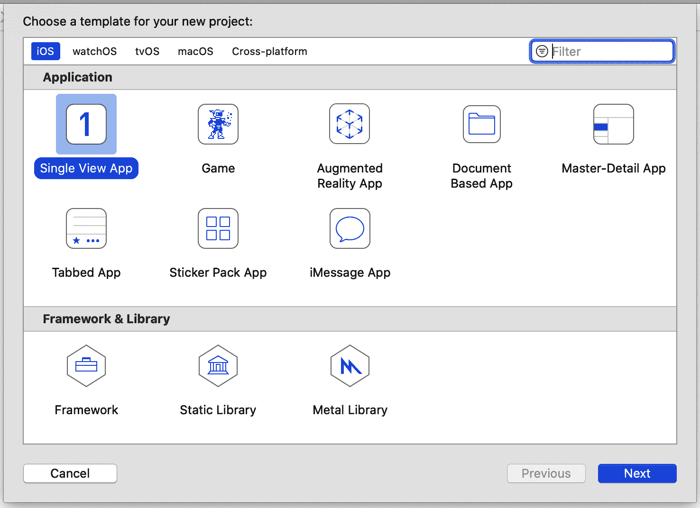

# 第十五章：第二步是将 TensorFlow Lite 添加到它中去。



如果您想要按照本章的示例进行操作，您需要一台 Mac 电脑，因为开发工具 Xcode 仅在 Mac 上可用。如果您还没有安装它，可以从 App Store 安装。它将为您提供一切所需，包括 iOS 模拟器，您可以在其中运行 iPhone 和 iPod 应用程序，而无需物理设备。

# 使用 Xcode 创建您的第一个 TensorFlow Lite 应用程序

第十二章向您介绍了 TensorFlow Lite 及如何将 TensorFlow 模型转换为可在移动设备上使用的高效紧凑格式。在第十三章中，您将探索创建使用 TensorFlow Lite 模型的 Android 应用程序。在本章中，您将使用 iOS 执行相同的操作，创建几个简单的应用程序，并了解如何使用 Swift 编程语言对 TensorFlow Lite 模型进行推断。

## 图 14-1。在 Xcode 中创建一个新的 iOS 应用程序


之后，您将被要求选择您的新项目的选项，包括应用程序的名称。称其为*firstlite*，确保语言是 Swift，用户界面是 Storyboard（见图 14-2）。

要向 iOS 项目添加依赖项，您可以使用一种称为[CocoaPods](https://cocoapods.org)的技术，这是一个具有数千个库的依赖管理项目，可以轻松集成到您的应用程序中。为此，您需要创建一个称为 Podfile 的规范文件，其中包含有关您的项目及您想要使用的依赖项的详细信息。这是一个简单的文本文件*Podfile*（无扩展名），您应该将其放在与 Xcode 为您创建的*firstlite.xcodeproj*文件相同的目录中。其内容如下：

###### 打开 Xcode 并选择文件 → 新建项目。您将被要求选择新项目的模板。选择 Single View App，这是最简单的模板（见图 14-1），然后点击下一步。

图 14-2。选择您的新项目的选项

###### 第十四章。在 iOS 应用程序中使用 TensorFlow Lite

点击“下一步”以创建一个基本的 iOS 应用程序，可以在 iPhone 或 iPad 模拟器上运行。

## 步骤 1。创建一个基本的 iOS 应用程序

步骤 2。将 TensorFlow Lite 添加到您的项目中

```
# Uncomment the next line to define a global platform for your project
`platform` `:``ios``,` `'``12.0``'`

`target` `'``firstlite``'` `do`
  # Comment the next line if you're not using Swift and don't want to 
  # use dynamic frameworks
 `use_frameworks``!`

  # Pods for ImageClassification
 `pod` `'``TensorFlowLiteSwift``'`
`end`
```

关键部分是这一行 `pod 'TensorFlowLiteSwift'`，表示需要将 TensorFlow Lite Swift 库添加到项目中。

接下来，使用终端切换到包含 Podfile 的目录，并执行以下命令：

```
pod install
```

依赖项将被下载并添加到项目中，存储在名为 *Pods* 的新文件夹中。您还将添加一个 *.xcworkspace* 文件，如 图 14-3 所示。将来使用这个文件打开项目，而不是 *.xcodeproj* 文件。


###### 图 14-3\. 运行 pod install 后的文件结构

您现在拥有一个基本的 iOS 应用程序，并已添加了 TensorFlow Lite 依赖项。下一步是创建用户界面。

## 第 3 步\. 创建用户界面

Xcode 故事板编辑器是一个可视化工具，允许您创建用户界面。打开工作区后，您将在左侧看到一列源文件。选择 *Main.storyboard*，并使用控件面板，您可以将控件拖放到 iPhone 屏幕的视图上（见 图 14-4）。


###### 图 14-4\. 向故事板添加控件

如果找不到控件面板，可以通过点击屏幕右上角的 + 号（在 图 14-4 中突出显示）来访问它。使用它，添加一个标签，并将文本更改为“输入数字”。然后再添加一个文本，“结果在这里”。添加一个按钮，并将其标题更改为“Go”，最后添加一个文本字段。将它们排列得与 图 14-4 中看到的类似即可。它不必漂亮！

现在，控件已布局完成，您希望能够在代码中引用它们。在故事板术语中，您可以使用 *outlets*（当您希望访问控件以读取或设置其内容时）或 *actions*（当您希望在用户与控件交互时执行某些代码时）来实现这一点。

最简单的连接方法是将屏幕分成两部分，一边是故事板，另一边是支持其下的 *ViewController.swift* 代码。您可以通过选择分屏控制（在 图 14-5 中突出显示），点击一侧选择故事板，然后点击另一侧选择 *ViewController.swift* 来实现这一点。


###### 图 14-5\. 分割屏幕

完成后，你可以通过拖放开始创建输出口和动作。在这个应用中，用户在文本字段中输入数字，点击 Go，然后对其值进行推断。结果将呈现在标签上，标签上写着“结果在这里”。

这意味着你需要读取或写入两个控件，从文本字段读取用户输入的内容，并将结果写入“结果显示区”标签。因此，你需要两个 outlet。要创建它们，按住 Ctrl 键，将控件从 storyboard 拖动到 *ViewController.swift* 文件中，并将其放置在类定义的正下方。将会出现一个弹出窗口要求你定义它（图 14-6）。


###### 图 14-6\. 创建一个 outlet

确保连接类型为 Outlet，并创建一个文本字段的 outlet，名为 `txtUserData`，以及一个标签的 outlet，名为 `txtResult`。

接下来，将按钮拖到 *ViewController.swift* 文件中。在弹出窗口中，确保连接类型为 Action，事件类型为 Touch Up Inside。使用此操作定义一个名为 `btnGo` 的 action（图 14-7）。


###### 图 14-7\. 添加一个 action

此时你的 *ViewController.swift* 文件应该看起来像这样—注意 `IBOutlet` 和 `IBAction` 的代码：

```
`import` `UIKit`

`class` `ViewController`: `UIViewController` {
    @`IBOutlet` `weak` `var` txtUserData: `UITextField`!

    @`IBOutlet` `weak` `var` txtResult: `UILabel`!
    @`IBAction` `func` btnGo(`_` sender: `Any`) {
    }
    `override` `func` viewDidLoad() {
        `super`.viewDidLoad()
        `/``/` `Do` `any` `additional` `setup` `after` `loading` `the` `view``.`
    }
}
```

现在 UI 部分已经准备好，接下来的步骤将是创建处理推理的代码。不将其放在与 `ViewController` 逻辑相同的 Swift 文件中，而是放在一个单独的代码文件中。

## 步骤 4\. 添加并初始化模型推理类

为了将 UI 与底层模型推理分离，你将创建一个新的 Swift 文件，其中包含一个名为 `ModelParser` 的类。这里将完成将数据输入模型、运行推理，然后解析结果的所有工作。在 Xcode 中，选择文件 → 新建文件，并选择 Swift 文件作为模板类型（图 14-8）。


###### 图 14-8\. 添加一个新的 Swift 文件

将其命名为 *ModelParser*，确保选中将其定向到 firstlite 项目的复选框（图 14-9）。


###### 图 14-9\. 将 ModelParser.swift 添加到你的项目中

这将在你的项目中添加一个 *ModelParser.swift* 文件，你可以编辑它以添加推理逻辑。首先确保文件顶部的导入包括 `TensorFlowLite`：

```
`import`  Foundation
`import`  TensorFlowLite
```

将模型文件的引用传递给这个类，*model.tflite*，你还没有添加它，但很快会添加：

```
`typealias`  FileInfo `=` `(``name``:` String`,` `extension``:` String`)`

`enum`  ModelFile `{`
  `static`  `let` `modelInfo``:` FileInfo `=` `(``name``:` `"``model``"``,` `extension``:` `"``tflite``"``)`
`}`
```

此 `typealias` 和 `enum` 使得代码更加紧凑。稍后你将看到它们的使用。接下来，你需要将模型加载到解释器中，因此首先将解释器声明为类的私有变量：

```
`private` `var` interpreter: `Interpreter`
```

Swift 要求变量进行初始化，您可以在`init`函数中完成此操作。下面的函数将接受两个输入参数。第一个是您刚刚声明的`FileInfo`类型的`modelFileInfo`。第二个是要用于初始化解释器的线程数`threadCount`，我们将其设置为`1`。在此函数中，您将创建对先前描述的模型文件的引用（*model.tflite*）：

```
`init`?(modelFileInfo: `FileInfo`, threadCount: `Int` = `1`) {
 `let` modelFilename = modelFileInfo.name

  `guard` `let` modelPath = `Bundle`.main.path
  (
    forResource: modelFilename,
    ofType: modelFileInfo.`extension`
 `)`
  `else` {
    print(`"``Failed to load the model file``"`)
    `return` `nil`
  }
```

一旦获取了捆绑中模型文件的路径，即可加载它：

```
`do`
  {
    interpreter = `try` `Interpreter`(modelPath: modelPath)
  }
  `catch` `let` error
  {
    print(`"``Failed to create the interpreter``"`)
 `return` `nil`
  }
```

## 第 5 步。执行推断

在`ModelParser`类中，您可以进行推断。用户将在文本字段中键入一个字符串值，该值将转换为浮点数，因此您需要一个函数，接受一个浮点数，将其传递给模型，运行推断并解析返回值。

首先创建一个名为`runModel`的函数。您的代码需要捕获错误，因此以`do{`开头：

```
`func` runModel(withInput input: `Float`) -> `Float`? {
    `do`{
```

接下来，您需要在解释器上分配张量。这将初始化并准备好进行推断：

```
    `try` interpreter.allocateTensors()
```

然后，您将创建输入张量。由于 Swift 没有`Tensor`数据类型，您需要直接将数据写入`UnsafeMutableBufferPointer`中的内存。您可以指定其类型为`Float`，并写入一个值（因为只有一个浮点数），从名为`data`的变量的地址开始。这将有效地将浮点数的所有字节复制到缓冲区中：

```
    `var` data: `Float` = input
      `let` buffer: `UnsafeMutableBufferPointer`<`Float`> = 
 `UnsafeMutableBufferPointer`(start: &data, count: `1`)
```

有了缓冲区中的数据，您可以将其复制到输入 0 处的解释器中。因为只有一个输入张量，所以可以将其指定为缓冲区：

```
    `try` interpreter.copy(`Data`(buffer: buffer), toInputAt: `0`)
```

要执行推断，您需要调用解释器：

```
    `try` interpreter.invoke()
```

只有一个输出张量，因此可以通过获取索引为 0 的输出来读取它：

```
    `let` outputTensor = `try` interpreter.output(at: `0`)
```

类似于输入值时处理低级内存，这是不安全的数据。它是由`Float32`值的数组组成（虽然只有一个元素，但仍需视为数组），可以像这样读取它：

```
    `let` results: [`Float32`] = 
          `Float32` ?? []
```

如果您不熟悉`??`语法，这意味着将输出张量复制到`Float32`数组中，并在失败时使其成为空数组。为使此代码正常工作，您需要实现一个`Array`扩展；稍后将显示其完整代码。

一旦将结果放入数组中，第一个元素将是您的结果。如果失败，只需返回`nil`：

```
    `guard` `let` result = results.first `else` {
        `return` `nil`
      }
      `return` result
    }
```

函数以`do{`开头，因此您需要捕获任何错误，将其打印出来，并在这种情况下返回`nil`：

```
  `catch` {
      print(error)
      `return` `nil`
    }
  }
}
```

最后，在*ModelParser.swift*中，您可以添加处理不安全数据并将其加载到数组中的`Array`扩展：

```
extension  `Array` `{`
  init`?``(``unsafeData``:` `Data``)` `{`
  guard `unsafeData``.``count` `%` `MemoryLayout``<``Element``>``.``stride` `==` `0`
  else `{` return  `nil` `}`
 `#`if `swift(>=``5``.``0``)`
  self `=` `unsafeData``.``withUnsafeBytes` `{`
 `.`init`(``$``0``.``bindMemory``(``to``:` `Element``.`self`)``)`
 `}`
 `#`else
  self `=` `unsafeData``.``withUnsafeBytes` `{`
 `.`init`(``UnsafeBufferPointer``<``Element``>``(`
 `start``:` `$``0``,`
 `count``:` `unsafeData``.``count` `/` `MemoryLayout``<``Element``>``.``stride`
 `)``)`
 `}`
 `#endif` `// swift(>=5.0)`
 `}`
`}`
```

如果您想直接从 TensorFlow Lite 模型中解析浮点数，这是一个方便的帮助器。

现在，解析模型的类已经完成，下一步是将模型添加到您的应用程序中。

## 第 6 步。将模型添加到您的应用程序中

要将模型添加到应用程序中，您需要在应用程序中创建一个*models*目录。在 Xcode 中，右键单击*firstlite*文件夹，选择新建组（图 14-10）。将新组命名为*models*。


###### 图 14-10\. 向应用程序添加新组

您可以通过训练来自第十二章的简单 Y = 2X - 1 示例来获取模型。如果您尚未拥有它，可以使用该书的 GitHub 仓库中的 Colab。

一旦您转换了模型文件（名为*model.tflite*），您可以将其拖放到刚刚添加的模型组中。选择“需要时复制项目”，并确保将其添加到目标*firstlite*中，勾选其旁边的框（图 14-11）。


###### 图 14-11\. 将模型添加到您的项目中

模型现在将会在您的项目中，并可用于推断。最后一步是完成用户界面逻辑——然后您就可以开始了！

## 步骤 7\. 添加 UI 逻辑

之前，您创建了包含 UI 描述的 storyboard，并开始编辑包含 UI 逻辑的*ViewController.swift*文件。由于推断的大部分工作现在已经被转移到`ModelParser`类中，因此 UI 逻辑应该非常轻量级。

首先，通过添加一个私有变量来声明`ModelParser`类的实例：

```
`private` `var` modelParser: `ModelParser`? =
    `ModelParser`(modelFileInfo: `ModelFile`.modelInfo)
```

以前，您在名为`btnGo`的按钮上创建了一个动作。当用户触摸该按钮时，将更新为执行名为`doInference`的函数：

```
@`IBAction` `func` btnGo(`_` sender: `Any`) {
  doInference()
}
```

接下来，您将构建`doInference`函数：

```
`private` `func` doInference() {
```

用户将输入数据的文本字段称为`txtUserData`。读取此值，如果为空，则将结果设置为`0.00`，并且不进行任何推断操作：

```
`guard` `let` text = txtUserData.text, text.count > `0` `else` {
    txtResult.text = `"``0.00``"`
    `return`
  }
```

否则，请将其转换为浮点数。如果转换失败，请退出该函数：

```
`guard` `let` value = `Float`(text) `else` {
    `return`
  }
```

如果代码已经到达这一点，现在可以运行模型，将输入传递给它。`ModelParser`将会做剩下的工作，并返回一个结果或`nil`。如果返回值为`nil`，则将退出该函数：

```
`guard` `let` result = `self`.modelParser?.runModel(withInput: value) `else` {
    `return`
  }
```

最后，如果您已经到达这一步，那么您就有了一个结果，因此可以通过将浮点数格式化为字符串加载到标签（称为`txtResult`）中：

```
txtResult.text = `String`(format: `"``%.2f``"`, result)
```

就这样！模型加载和推断的复杂性由`ModelParser`类处理，使得您的`ViewController`非常轻量级。为方便起见，这里是完整的清单：

```
`import` `UIKit`

`class` `ViewController`: `UIViewController` {
  `private` `var` modelParser: `ModelParser`? =
      `ModelParser`(modelFileInfo: `ModelFile`.modelInfo)
  @`IBOutlet` `weak` `var` txtUserData: `UITextField`!

  @`IBOutlet` `weak` `var` txtResult: `UILabel`!
  @`IBAction` `func` btnGo(`_` sender: `Any`) {
    doInference()
  }
  `override` `func` viewDidLoad() {
    `super`.viewDidLoad()
    `/``/` `Do` `any` `additional` `setup` `after` `loading` `the` `view``.`
  }
  `private` `func` doInference() {

    `guard` `let` text = txtUserData.text, text.count > `0` `else` {
      txtResult.text = `"``0.00``"`
      `return`
    }
    `guard` `let` value = `Float`(text) `else` {
      `return`
    }
    `guard` `let` result = `self`.modelParser?.runModel(withInput: value) `else` {
      `return`
    }
    txtResult.text = `String`(format: `"``%.2f``"`, result)
  }

}
```

您现在已经完成了使应用程序工作所需的所有操作。运行它，您应该在模拟器中看到它。在文本字段中输入一个数字，按下按钮，您应该在结果字段中看到一个结果，如图 14-12 所示。


###### 图 14-12\. 在 iPhone 模拟器中运行应用程序

尽管这对于一个非常简单的应用程序来说是一个漫长的旅程，但它应该提供了一个很好的模板，帮助您理解 TensorFlow Lite 的工作原理。在本教程中，您看到了如何：

+   使用 pods 添加 TensorFlow Lite 依赖项。

+   向您的应用程序添加 TensorFlow Lite 模型。

+   将模型加载到解释器中。

+   访问输入张量，并直接将其写入内存。

+   从输出张量中读取内存，并将其复制到像浮点数组这样的高级数据结构中。

+   通过 storyboard 和视图控制器将所有内容连接到用户界面。

在下一节中，您将超越这个简单的场景，看看如何处理更复杂的数据。

# 超越“Hello World”—处理图像

在前面的示例中，您看到了如何创建一个完整的应用程序，使用 TensorFlow Lite 进行非常简单的推断。但是，尽管应用程序很简单，将数据输入模型并解析模型输出的过程可能有点不直观，因为您在处理低级的位和字节。随着您涉及更复杂的情况，如管理图像，好消息是这个过程并不会变得太复杂。

考虑您在第十二章中创建的 Dogs vs. Cats 模型。在本节中，您将看到如何使用训练有素的模型创建一个 Swift iOS 应用程序，该应用程序可以根据猫或狗的图像推断出图像中的内容。该书的完整应用代码可以在 [GitHub 仓库](https://github.com/lmoroney/tfbook) 中找到。

首先，回想一下图像的张量有三个维度：宽度、高度和颜色深度。例如，当使用基于 Dogs vs. Cats 移动样本的 MobileNet 架构时，尺寸为 224 × 224 × 3 ——每个图像为 224 × 224 像素，并且颜色深度为 3 字节。请注意，每个像素由介于 0 和 1 之间的值表示，指示该像素在红色、绿色和蓝色通道上的强度。

在 iOS 中，图像通常表示为 `UIImage` 类的实例，该类具有一个有用的 `pixelBuffer` 属性，返回图像中所有像素的缓冲区。

在 `CoreImage` 库中，有一个 `CVPixelBufferGetPixelFormatType` API，可以返回像素缓冲区的类型：

```
`let` sourcePixelFormat = `CVPixelBufferGetPixelFormatType`(pixelBuffer)
```

这通常是一个带有 alpha（即透明度）、红色、绿色和蓝色通道的 32 位图像。但是，有多种变体，通常这些通道的顺序不同。您需要确保它是这些格式之一，否则如果图像存储在不同的格式中，则其余代码将无法工作：

```
assert(sourcePixelFormat == kCVPixelFormatType`_32`ARGB ||
  sourcePixelFormat == kCVPixelFormatType`_32`BGRA ||
  sourcePixelFormat == kCVPixelFormatType`_32`RGBA)
```

因为期望的格式是 224 × 224，即正方形，下一步最好的做法是裁剪图像到其中心的最大正方形，使用 `centerThumbnail` 属性，然后将其缩小到 224 × 224：

```
`let` scaledSize = `CGSize`(width: `224`, height: `224`)
`guard` `let` thumbnailPixelBuffer = 
    pixelBuffer.centerThumbnail(ofSize: scaledSize) 
`else` {
  `return` `nil`
}
```

现在您已将图像调整大小为 224 × 224，下一步是删除 alpha 通道。请记住，该模型是在 224 × 224 × 3 上训练的，其中 3 是 RGB 通道，因此没有 alpha 通道。

现在你有了一个像素缓冲区，需要从中提取 RGB 数据。这个辅助函数通过查找 alpha 通道并切片来帮助你实现这一点：

```
`private` `func` rgbDataFromBuffer(`_` buffer: `CVPixelBuffer`,
                                byteCount: `Int`) -> `Data`? {

  `CVPixelBufferLockBaseAddress`(buffer, .readOnly)
  `defer` { `CVPixelBufferUnlockBaseAddress`(buffer, .readOnly) }
  `guard` `let` mutableRawPointer = 
 `CVPixelBufferGetBaseAddress`(buffer) 
 `else` {
 `return` `nil`
  }

 `let` count = `CVPixelBufferGetDataSize`(buffer)
  `let` bufferData = `Data`(bytesNoCopy: mutableRawPointer,
                          count: count, deallocator: .`none`)

  `var` rgbBytes = `Float`
  `var` index = `0`

  `for` component `in` bufferData.enumerated() {
    `let` offset = component.offset
    `let` isAlphaComponent = (offset % alphaComponent.baseOffset) == 
     alphaComponent.moduloRemainder

    `guard` !isAlphaComponent `else` { `continue` }

     rgbBytes[index] = `Float`(component.element) / `255`.`0`
    index += `1`
  }

  `return` rgbBytes.withUnsafeBufferPointer(`Data`.`init`)

}
```

此代码使用名为`Data`的扩展，将原始字节复制到数组中：

```
`extension` `Data` {
  `init`<T>(copyingBufferOf array: [T]) {
    `self` = array.withUnsafeBufferPointer(`Data`.`init`)
  }
}
```

现在你可以将刚刚创建的缩略图像素缓冲区传递给`rgbDataFromBuffer`：

```
`guard` `let` rgbData = rgbDataFromBuffer(
    thumbnailPixelBuffer,
    byteCount: `224` * `224` * `3`
    ) 
`else` {
  print(`"``Failed to convert the image buffer to RGB data.``"`)
  `return` `nil`
}
```

现在你有了模型期望格式的原始 RGB 数据，你可以直接复制到输入张量中：

```
`try` interpreter.allocateTensors()
`try` interpreter.copy(rgbData, toInputAt: `0`)
```

然后，你可以调用解释器并读取输出张量：

```
`try` interpreter.invoke()
outputTensor = `try` interpreter.output(at: `0`)
```

在狗与猫的情况下，输出是一个包含两个值的浮点数组，第一个值表示图像是猫的概率，第二个值表示图像是狗的概率。这与之前看到的结果代码相同，并使用了上一个示例中的相同`Array`扩展：

```
`let` results = `Float32` ?? []
```

正如你所见，尽管这是一个更复杂的示例，但相同的设计模式仍然适用。你必须了解模型的架构，以及原始输入和输出格式。然后，你必须按照模型期望的方式结构化输入数据，通常意味着获取写入缓冲区的原始字节，或者至少模拟使用数组。接着，你必须读取模型输出的原始字节流，并创建一个数据结构来保存它们。从输出的角度来看，这几乎总是类似于本章中看到的一样——一个浮点数数组。有了你实现的辅助代码，你已经完成了大部分工作！

# TensorFlow Lite 示例应用

TensorFlow 团队已经构建了大量的示例应用，并不断增加。掌握本章学到的知识，你将能够探索这些应用并理解它们的输入/输出逻辑。截至撰写本文时，iOS 平台上有以下示例应用：

图像分类

读取设备的摄像头，并对多达一千种不同物品进行分类。

物体检测

读取设备的摄像头，并为检测到的物体提供边界框。

姿势估计

查看摄像头中的图像，并推断它们的姿势。

语音识别

识别常见的口头命令。

手势识别

为手势训练一个模型，并在摄像头中识别它们。

图像分割

类似于物体检测，但预测图像中每个像素属于哪个类别。

数字分类器

识别手写数字。

# 总结

在本章中，您学习了如何将 TensorFlow Lite 整合到 iOS 应用程序中，通过全面的步骤演示构建一个简单应用程序，使用解释器调用模型进行推理。特别是，您看到处理模型时必须对数据进行低级处理，确保您的输入与模型预期的匹配。您还看到了如何解析模型输出的原始数据。这只是将机器学习引入 iOS 用户手中的长期而有趣的旅程的开端。在下一章中，我们将摆脱原生移动开发，看看如何使用 TensorFlow.js 在浏览器上训练和运行模型推理。
