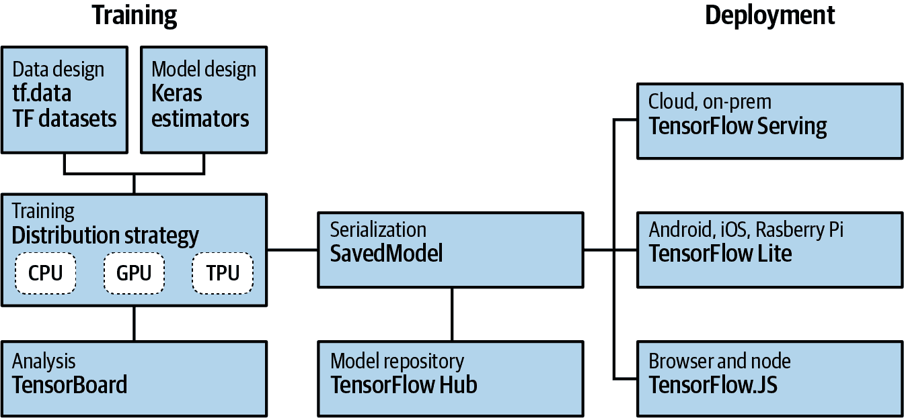
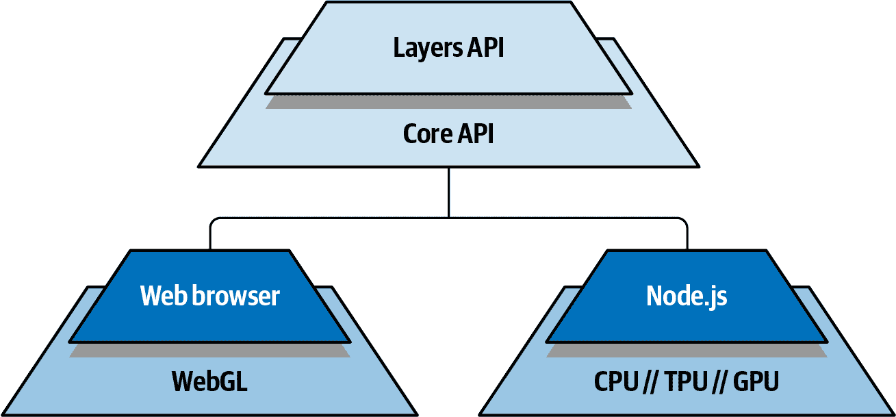
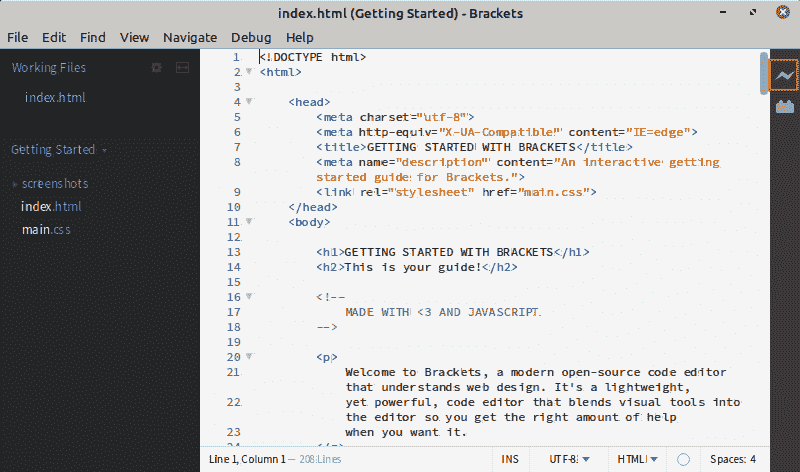
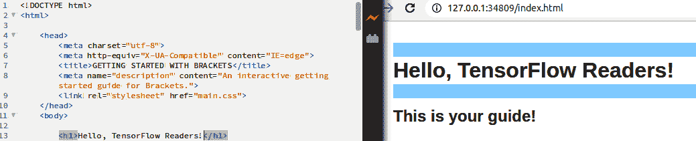
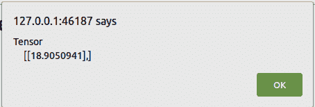
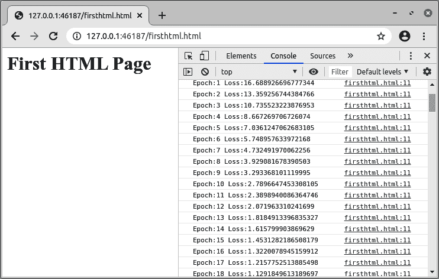
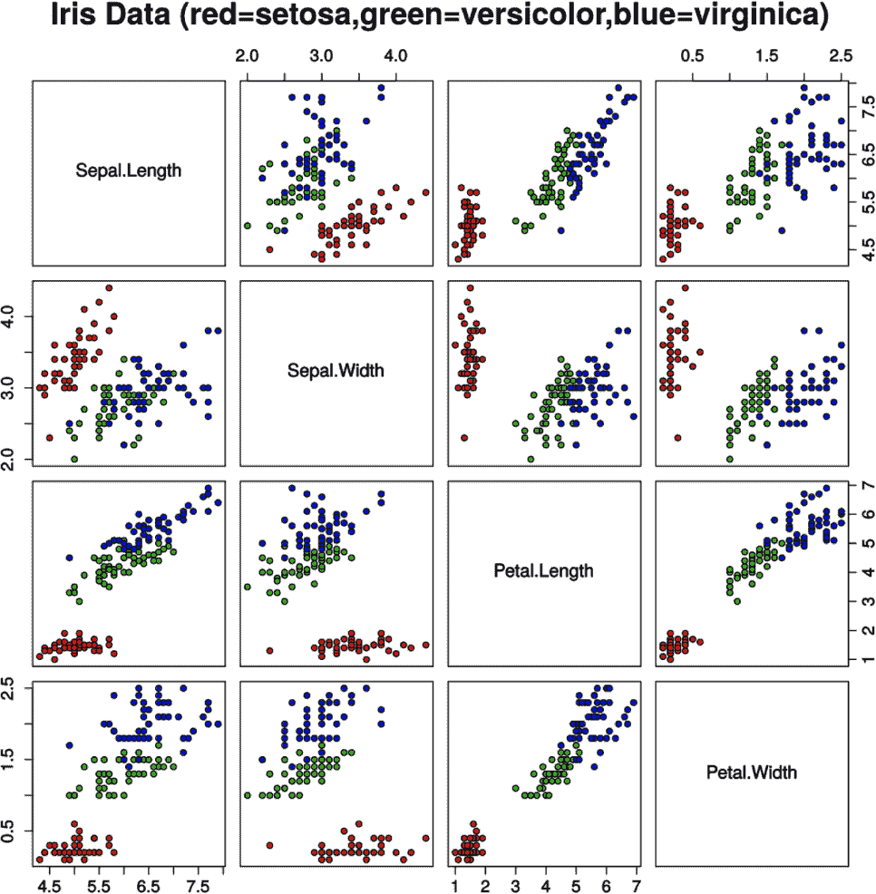

# 第十五章：TensorFlow.js 简介

除了 TensorFlow Lite，它可以在原生移动或嵌入式系统上运行，TensorFlow 生态系统还包括 TensorFlow.js，它允许您使用流行的 JavaScript 语言在浏览器中直接开发 ML 模型，或在 Node.js 上的后端使用。它允许您训练新模型并对其进行推断，并包括工具，可让您将基于 Python 的模型转换为与 JavaScript 兼容的模型。在本章中，您将介绍 TensorFlow.js 如何适应整体生态系统以及其架构的概述，并学习如何使用一个与浏览器集成的免费开源 IDE 构建您自己的模型。

# 什么是 TensorFlow.js？

TensorFlow 生态系统总结在图 15-1 中。它包括一套用于*训练*模型的工具，一个用于*预先存在*模型和层的存储库，以及一组技术，允许您为最终用户*部署*模型以获益。

与 TensorFlow Lite（第 12–14 章）和 TensorFlow Serving（第十九章）类似，TensorFlow.js 主要位于图表的右侧，因为虽然它主要用作模型的运行时，但也可用于训练模型，并且在这项任务中应被视为一流语言，与 Python 和 Swift 并驾齐驱。TensorFlow.js 可以在浏览器中运行或在像 Node.js 这样的后端上运行，但出于本书的目的，我们将主要关注浏览器。



###### 图 15-1\. TensorFlow 生态系统

TensorFlow.js 如何通过浏览器进行训练和推断的架构显示在图 15-2 中。



###### 图 15-2\. TensorFlow.js 高级架构

作为开发者，您通常会使用 Layers API，在 JavaScript 中提供类似 Keras 的语法，使您可以在 JavaScript 中使用您在本书开头学到的技能。这是由 Core API 支持的，正如其名称所示，在 JavaScript 中提供核心 TensorFlow 功能。除了为 Layers API 提供基础外，它还通过转换工具包允许您重用现有的基于 Python 的模型，将其转换为基于 JSON 的格式以便轻松消费。

核心 API 可以在 Web 浏览器中运行，并利用基于 WebGL 的 GPU 加速，或者在 Node.js 上运行，在这种环境配置下，除了 CPU 外，还可以利用 TPU 或 GPU 加速。

如果你不熟悉 HTML 或 JavaScript 的网页开发，不要担心；本章将作为入门指南，为你提供足够的背景帮助你构建你的第一个模型。虽然你可以使用任何你喜欢的 web/JavaScript 开发环境，但我推荐一款称为[Brackets](http://brackets.io)的新用户。在下一节中，你将看到如何安装它并使其运行，之后你将构建你的第一个模型。

# 安装和使用 Brackets IDE

Brackets 是一个免费的开源文本编辑器，非常适合网页开发者，特别是新手，因为它与浏览器集成得非常好，允许你本地提供文件以便测试和调试。通常，在设置网页开发环境时，这是棘手的部分。编写 HTML 或 JavaScript 代码很容易，但如果没有服务器将它们提供给浏览器，要真正测试和调试它们是困难的。Brackets 可在 Windows、Mac 和 Linux 上使用，所以无论你使用哪种操作系统，体验应该是类似的。对于本章，我在 Mint Linux 上试用了它，效果非常好！

安装并运行 Brackets 后，你会看到类似于图 15-3 的入门页面。在右上角，你会看到一个闪电图标。



###### 图 15-3\. Brackets 欢迎页面

点击它，你的网页浏览器将启动。当你在 Brackets 中编辑 HTML 代码时，浏览器将实时更新。例如，如果你修改第 13 行的代码：

```
`<h1``>`GETTING STARTED WITH BRACKETS`</h1>`
```

切换到其他东西，比如：

```
`<h1``>`Hello, TensorFlow Readers!`</h1>`
```

你会看到浏览器中的内容实时更改以匹配你的编辑，如图 15-4 所示。



###### 图 15-4\. 浏览器中的实时更新

我发现这对于在浏览器中进行 HTML 和 JavaScript 开发非常方便，因为它让环境尽量不干扰你，让你可以专注于代码。尤其是在机器学习等许多新概念中，这是非常宝贵的，因为它帮助你在没有太多干扰的情况下工作。

在入门页面上，你会注意到你只是在一个普通的目录中工作，Brackets 从中提供文件。如果你想使用自己的目录，只需在文件系统中创建一个目录并打开它。你在 Brackets 中创建的新文件将从那里创建和运行。确保它是你有写访问权限的目录，这样你就可以保存你的工作！

现在你已经搭建好开发环境，是时候在 JavaScript 中创建你的第一个机器学习模型了。我们将回到我们的“Hello World”场景，训练一个能够推断两个数字之间关系的模型。如果你从头开始阅读这本书，你可能已经多次看到这个模型，但它仍然是一个有用的模型，可以帮助你理解在 JavaScript 编程时需要考虑的语法差异！

# 构建你的第一个 TensorFlow.js 模型

在浏览器中使用 TensorFlow.js 之前，你需要将 JavaScript 托管在一个 HTML 文件中。创建一个文件，并使用以下基本 HTML 结构填充它：

```
<html>
<head></head>
<body>
  <h1>`First HTML Page`</h1>
</body>
</html>
```

然后，在 `<head>` 部分和 `<body>` 标签之前，你可以插入一个 `<script>` 标签，指定 TensorFlow.js 库的位置：

```
<script src="https://cdn.jsdelivr.net/npm/@tensorflow/tfjs@latest"></script>
```

如果现在运行页面，TensorFlow.js 将被下载，但你不会看到任何影响。

接下来，在第一个 `<script>` 标签的下方立即添加另一个 `<script>` 标签。在其中，你可以创建一个模型定义。请注意，虽然它与在 Python 中使用 TensorFlow 的方式非常相似（详细信息请参阅第一章），但也有一些差异。例如，在 JavaScript 中，每一行都以分号结束。还有，诸如 `model.add` 或 `model.compile` 这类函数的参数使用 JSON 表示法。

这个模型是熟悉的“Hello World”模型，由单个神经元组成的单层。它将使用均方误差作为损失函数，并使用随机梯度下降作为优化器进行编译：

```
<script lang=`"js"`>        
    `const` model = tf.sequential();
    model.add(tf.layers.dense({units: `1`, inputShape: [`1`]}));
    model.compile({loss:`'meanSquaredError'`, optimizer:`'sgd'`});
```

接下来，你可以添加数据。这与 Python 有些不同，Python 使用 Numpy 数组。当然，在 JavaScript 中这些不可用，所以你将使用 `tf.tensor2d` 结构。它很接近，但有一个关键的区别：

```
const xs = tf.tensor2d([-1.0, 0.0, 1.0, 2.0, 3.0, 4.0], [6, 1]);
const ys = tf.tensor2d([-3.0, -1.0, 2.0, 3.0, 5.0, 7.0], [6, 1]);
```

注意，除了值列表外，你还有第二个数组，用于定义第一个数组的*形状*。因此，你的 `tensor2d` 初始化为一个 6 × 1 的值列表，后跟一个包含 `[6,1]` 的数组。如果你要输入七个值，则第二个参数将是 `[7,1]`。

要进行训练，你可以创建一个名为 `doTraining` 的函数。这将使用 `model.fit` 训练模型，并且与之前一样，它的参数将以 JSON 列表的格式进行格式化：

```
  `a``s``y``n``c` `f``u``n``c``t``i``o``n` doTraining(model){
    `c``o``n``s``t` history = 
        `a``w``a``i``t` model.fit(xs, ys, 
                        { epochs: `5``0``0`,
                          callbacks:{
                              onEpochEnd: `a``s``y``n``c`(epoch, logs) =>{
                                  console.log(`"Epoch:"` 
                                              + epoch 
                                              + `" Loss:"` 
                                              + logs.loss);
                                  }
                              }
                        });
}
```

这是一个异步操作——训练会花费一段时间——因此最好将其创建为异步函数。然后，你可以`await` `model.fit`，将 epochs 数作为参数传递进去。你也可以指定一个回调函数，在每个 epoch 结束时输出损失。

最后要做的就是调用这个 `doTraining` 方法，将模型传递给它，并在训练完成后报告结果：

```
  doTraining(model).then(() => {
    alert(model.predict(tf.tensor2d([`10`], [`1`,`1`])));
});
```

这会调用 `model.predict`，将单个值传递给它以获取预测结果。因为它使用了一个 `tensor2d` 以及要预测的值，你还必须传递第二个参数，这个参数是第一个数组的形状。所以要预测 10 的结果，你创建一个包含该值的数组的 `tensor2d`，然后传递该数组的形状。

为方便起见，这里是完整的代码：

```
<html>
<head></head>
<script src=`"https://cdn.jsdelivr.net/npm/@tensorflow/tfjs@latest"`></script>
<script lang=`"js"`>
    `async` `function` doTraining(model){
        `const` history = 
            `await` model.fit(xs, ys, 
                            { epochs: `500`,
                              callbacks:{
                                  onEpochEnd: `async`(epoch, logs) =>{
                                      console.log(`"Epoch:"` 
                                                  + epoch 
                                                  + `" Loss:"` 
                                                  + logs.loss);

                                  }
                              }
                            });
    }
    `const` model = tf.sequential();
    model.add(tf.layers.dense({units: `1`, inputShape: [`1`]}));
    model.compile({loss:`'meanSquaredError'`, 
                   optimizer:`'sgd'`});
    model.summary();
    `const` xs = tf.tensor2d([-`1.0`, `0.0`, `1.0`, `2.0`, `3.0`, `4.0`], [`6`, `1`]);
    `const` ys = tf.tensor2d([-`3.0`, -`1.0`, `2.0`, `3.0`, `5.0`, `7.0`], [`6`, `1`]);
    doTraining(model).then(() => {
        alert(model.predict(tf.tensor2d([`10`], [`1`,`1`])));
    });
</script>
<body>
    <h1>`First` HTML `Page`</h1>
</body>
</html>
```

当你运行这个页面时，看起来好像什么都没有发生。等待几秒钟，然后会出现一个对话框，类似于图 15-5 中显示的那个。这是一个警告对话框，显示了对 `[10]` 的预测结果。



###### 图 15-5\. 训练后推理的结果

在对话框显示之前有那么长时间的停顿可能会让人感到有些不安 —— 正如你可能已经猜到的那样，模型在那段时间内正在训练。回想一下，在 `doTraining` 函数中，你创建了一个回调函数，将每个时期的损失写入控制台日志中。如果你想看到这个，可以使用浏览器的开发者工具来查看。在 Chrome 中，你可以通过点击右上角的三个点，选择“更多工具” → “开发者工具”，或者按 Ctrl-Shift-I 来访问这些工具。

一旦你拥有了它们，选择窗格顶部的控制台并刷新页面。当模型重新训练时，你将看到每个时期的损失（见图 15-6）。



###### 图 15-6\. 在浏览器的开发者工具中探索每个时期的损失

现在你已经完成了第一个（也是最简单的）模型，准备构建一个稍微复杂一点的东西。

# 创建一个鸢尾花分类器

最后一个例子非常简单，所以接下来让我们来处理一个稍微复杂一点的例子。如果你做过任何与机器学习相关的工作，你可能听说过鸢尾花数据集，这是一个学习机器学习的完美选择。

数据集包含 150 个数据项，每个数据项有四个描述三种花类的属性。这些属性是萼片长度和宽度，以及花瓣长度和宽度。当它们相互对比时，可以看到清晰的花类簇群（见图 15-7）。



###### 图 15-7\. 在鸢尾花数据集中绘制特征（来源：Nicoguaro，可在[维基媒体公共资源](https://oreil.ly/zgf7c)上找到）

图 15-7 显示了这个问题的复杂性，即使是像这样的简单数据集也是如此。如何使用规则分离三种类型的花？花瓣长度与花瓣宽度的图表接近，*Iris setosa*样本（红色）与其他样本非常不同，但蓝色和绿色的样本交织在一起。这使得它成为 ML 中的理想学习集：它很小，所以训练快速，您可以用它来解决基于规则的编程很难解决的问题！

您可以从[UCI 机器学习库](https://oreil.ly/aIVGp)下载数据集，或使用书中的[GitHub 仓库](https://oreil.ly/91b40)中的版本，我已将其转换为 CSV 以便在 JavaScript 中更轻松地使用。

CSV 文件如下所示：

```
sepal_length,sepal_width,petal_length,petal_width,species
5.1,3.5,1.4,0.2,setosa
4.9,3,1.4,0.2,setosa
4.7,3.2,1.3,0.2,setosa
4.6,3.1,1.5,0.2,setosa
5,3.6,1.4,0.2,setosa
5.4,3.9,1.7,0.4,setosa
4.6,3.4,1.4,0.3,setosa
5,3.4,1.5,0.2,setosa
...
```

每种花的四个数据点是前四个值。标签是第五个值，是`setosa`、`versicolor`或`virginica`中的一个。CSV 文件的第一行包含列标签。记住这一点，以后会有用！

要开始，请像以前一样创建一个基本的 HTML 页面，并添加`<script>`标签以加载 TensorFlow.js：

```
<html>
<head></head>
`<script` `src=``"https://cdn.jsdelivr.net/npm/@tensorflow/tfjs@latest"``>``</script>`
<body>
  <h1>`Iris Classifier`</h1>
</body>
</html>
```

要加载 CSV 文件，TensorFlow.js 提供了`tf.data.csv` API，您可以向其提供一个 URL。这还允许您指定哪一列是标签。因为我准备的 CSV 文件的第一行包含列名，您可以指定哪一列包含标签，本例中是`species`，如下所示：

```
`<script` `lang=`"js"`>`
  `async`  `function` `run(){`
  `const` `csvUrl =` 'iris.csv'`;`
  `const` `trainingData = tf.data.csv(csvUrl, {`
 `columnConfigs: {`
 `species: {`
 `isLabel:` `true`
 `}`
 `}`
 `});`
```

标签是字符串，您实际上不希望用神经网络训练它们。这将是一个多类分类器，具有三个输出神经元，每个神经元包含输入数据代表相应花种的概率。因此，标签的独热编码非常适合。

这样，如果您将`setosa`表示为[1, 0, 0]，表明您希望该类的第一个神经元被激活，将`virginica`表示为[0, 1, 0]，`versicolor`表示为[0, 0, 1]，则您有效地定义了每个类的最终层神经元应如何行为的模板。

因为您使用了`tf.data`加载数据，您可以使用一个映射函数来单独处理`xs`（特征）和`ys`（标签）。因此，要保持特征不变并对标签进行独热编码，可以编写如下代码：

```
  `const` convertedData =
    trainingData.map(({xs, ys}) => {
        `const` labels = [
            ys.species == `"``setosa``"` ? `1` : `0`,
            ys.species == `"``virginica``"` ? `1` : `0`,
            ys.species == `"``versicolor``"` ? `1` : `0`
        ] 
        `return`{ xs: `Object`.values(xs), ys: `Object`.values(labels)};
    }).batch(`10`);
```

注意标签存储为三个值的数组。除非物种与给定字符串匹配，否则每个值默认为 0，此时它将是 1。因此，`setosa`将被编码为[1, 0, 0]，依此类推。

映射函数将保持`xs`不变，并对`ys`进行独热编码。

您现在可以定义您的模型了。输入层的形状是特征的数量，即 CSV 文件中的列数减去 1（因为其中一列代表标签）：

```
`const` numOfFeatures = (`await` trainingData.columnNames()).length - `1`;

`const` model = tf.sequential();
model.add(tf.layers.dense({inputShape: [numOfFeatures], 
                           activation: `"``sigmoid``"`, units: `5`}))

model.add(tf.layers.dense({activation: `"``softmax``"`, units: `3`}));
```

您的最终层有三个单元，因为训练数据中有三个进行了独热编码的类。

接下来，你将指定损失函数和优化器。因为这是一个多类别分类器，确保你使用类别交叉熵等分类损失函数。你可以使用 `tf.train` 命名空间中的 `adam` 优化器，并传递学习率等参数（这里是 `0.06`）：

```
`model``.``compile``(``{``loss``:` "categoricalCrossentropy"`,` 
 `optimizer``:` `tf``.``train``.``adam``(``0.06``)``}``)``;`
```

因为数据格式化为数据集，你可以使用 `model.fitDataset` 进行训练，而不是 `model.fit`。要进行一百轮的训练并在控制台捕获损失，可以使用如下的回调函数：

```
`await` model.fitDataset(convertedData, 
                       {epochs:`100`,
                        callbacks:{
                            onEpochEnd: `async`(epoch, logs) =>{
                                console.log(`"``Epoch:` `"` + epoch + 
                                 `"` `Loss:` `"` + logs.loss);
                            }
                        }});
```

在模型训练完成后，要测试模型，你可以将值加载到 `tensor2d` 中。不要忘记，在使用 `tensor2d` 时，还必须指定数据的形状。在这种情况下，要测试四个值的集合，你可以像这样在 `tensor2d` 中定义它们：

```
`const` testVal = tf.tensor2d([`4.4`, `2.9`, `1.4`, `0.2`], [`1`, `4`]);
```

然后，你可以通过将其传递给 `model.predict` 来获取预测值：

```
`const` prediction = model.predict(testVal);
```

你将会得到一个类似这样的张量值：

```
`[``[`0.9968228`,` 0.00000029`,` 0.0031742`]``,``]`
```

要获取最大值，你可以使用 `argMax` 函数：

```
tf.argMax(prediction, axis=`1`)
```

对于前述数据，这将返回 `[0]`，因为位置 0 的神经元具有最高的概率。

要将其解包为一个值，你可以使用 `.dataSync`。这个操作会同步从张量中下载一个值。它会阻塞 UI 线程，所以在使用时要小心！

下面的代码会简单地返回 `0` 而不是 `[0]`：

```
`const` pIndex = tf.argMax(prediction, axis=`1`).dataSync();
```

然后，为了将其映射回带有类名的字符串，你可以使用以下代码：

```
`const` `classNames` `=` `[`"Setosa"`,` "Virginica"`,` "Versicolor"`]``;`
`alert``(``classNames``[``pIndex``]``)`
```

现在你已经学会了如何从 CSV 文件加载数据，将其转换为数据集，然后从该数据集拟合模型，以及如何运行模型的预测。你已经准备好尝试其他自选数据集，进一步磨练你的技能了！

# 总结

本章向你介绍了 TensorFlow.js 及其在浏览器中训练模型和执行推断的用法。你了解了如何使用开源的 Brackets IDE 来编写和在本地 Web 服务器上测试你的模型，并用它来训练你的第一个两个模型：一个“Hello World”线性回归模型和一个基本的鸢尾花数据集分类器。这些都是非常简单的场景，但在 第十六章 中，你将把事情推向更高的水平，看看如何使用 TensorFlow.js 训练计算机视觉模型。
