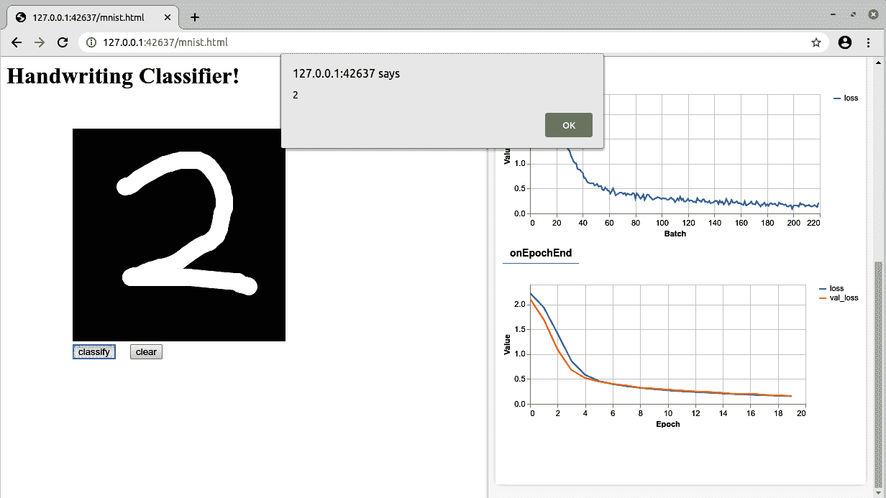
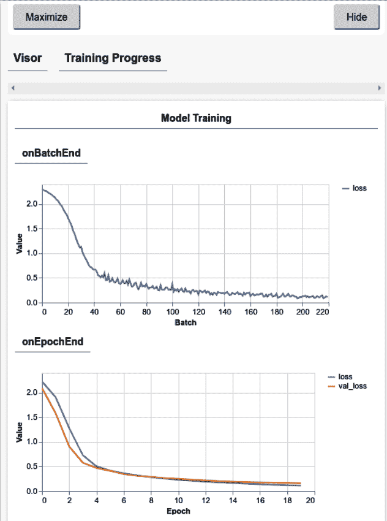
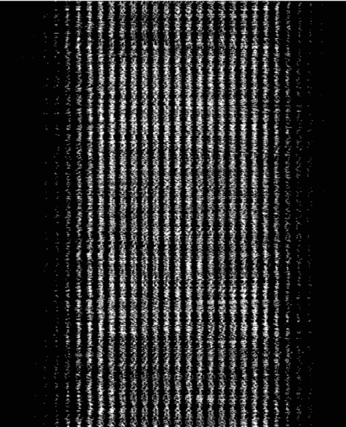
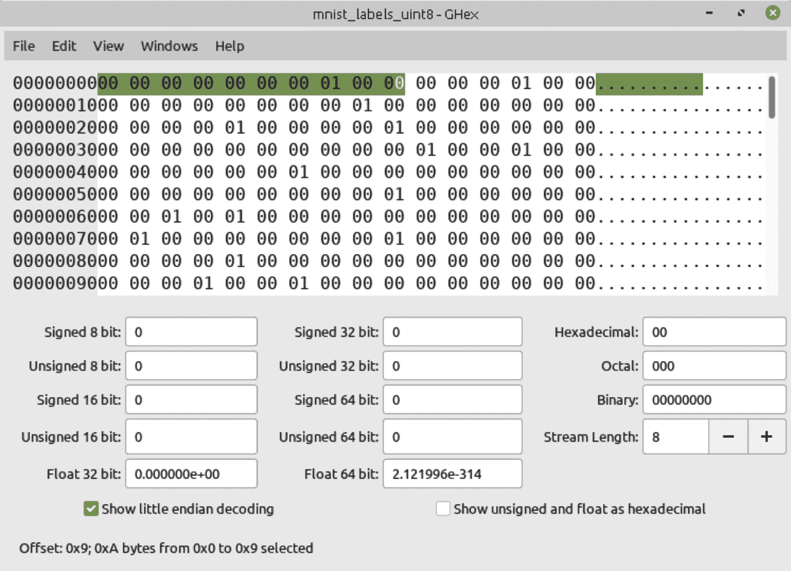

# 第十六章：TensorFlow.js 中的计算机视觉编码技术

在第二章和第三章中，您看到 TensorFlow 如何用于创建计算机视觉模型，可以训练识别图像内容。本章中，您将使用 JavaScript 完成同样的任务。您将构建一个在浏览器中运行并基于 MNIST 数据集训练的手写识别器。您可以在图 16-1 中看到它。



###### 图 16-1\. 浏览器中的手写识别器

当您使用 TensorFlow.js 工作时，特别是在浏览器中构建应用程序时，有一些关键的实施细节需要注意。其中可能最大且最重要的是如何处理训练数据。在浏览器中，每次打开 URL 的资源时，都会进行一次 HTTP 连接。您可以使用此连接传递命令到服务器，服务器会返回结果供您解析。在机器学习中，通常会有大量的训练数据，例如在 MNIST 和 Fashion MNIST 的情况下，即使它们是小型学习数据集，每个仍包含 70,000 张图像，这将产生 70,000 次 HTTP 连接！您将在本章后面看到如何处理这些情况。

此外，正如您在上一章节看到的那样，即使对于像 Y = 2X – 1 这样非常简单的情况，除非您打开调试控制台，否则在训练周期中似乎没有任何操作。在调试控制台中，您可以看到逐个周期的损失情况。如果您在训练需要较长时间的更复杂的任务时，很难理解正在进行的情况。幸运的是，有内置的可视化工具可供使用，如图 16-1 右侧所示；您还将在本章中探索它们。

在 JavaScript 中定义卷积神经网络时，也需要注意一些语法上的差异，我们在前一章中已经提到了一些。我们将从考虑这些方面开始。如果您需要关于 CNN 的复习，请参阅第三章。

# TensorFlow 开发人员的 JavaScript 考虑事项

在构建类似于本章节中的 JavaScript 应用程序时，有一些需要考虑的重要事项。JavaScript 与 Python 非常不同，因此，尽管 TensorFlow.js 团队努力使体验尽可能接近“传统”TensorFlow，但还是存在一些变化。

第一点是*语法*。虽然在许多方面，JavaScript 中的 TensorFlow 代码（特别是 Keras 代码）与 Python 中的非常相似，但在参数列表中使用 JSON 是一个显著的语法差异，正如前一章中提到的那样。

接下来是*同步性*。特别是在浏览器中运行时，当训练时不能锁定 UI 线程，而是需要异步执行许多操作，使用 JavaScript 的`Promise`和`await`调用。本章不打算深入教授这些概念；如果你还不熟悉它们，可以将它们视为异步函数，这些函数在返回之前不会等待执行完毕，而是会自行执行并在完成后“回调”你。`tfjs-vis`库被创建来帮助你调试使用 TensorFlow.js 异步训练模型时的代码。可视化工具在浏览器中提供了一个独立的侧边栏，不会干扰当前页面，在其中可以绘制诸如训练进度之类的可视化内容；我们将在“使用回调进行可视化”中进一步讨论它们。

*资源使用*也是一个重要的考虑因素。因为浏览器是一个共享环境，你可能同时打开多个标签页进行不同的操作，或者在同一个 Web 应用中执行多个操作。因此，控制你使用的内存量是很重要的。ML 训练可能会消耗大量内存，因为需要大量数据来理解和区分将特征映射到标签的模式。因此，你应该注意在使用后进行整理。`tidy` API 就是为此设计的，并且应该尽可能使用：将一个函数包装在`tidy`中确保所有未被函数返回的张量都将被清理并释放内存。

虽然不是 TensorFlow API，但 JavaScript 中的`arrayBuffer`是另一个方便的构造。它类似于`ByteBuffer`，用于像低级内存一样管理数据。在机器学习应用中，通常最容易使用非常稀疏的编码，就像你已经在 one-hot 编码中看到的那样。记住，在 JavaScript 中处理可能是线程密集型的，你不希望锁定浏览器，所以更容易使用不需要处理器解码的稀疏数据编码。在本章的示例中，标签是以这种方式编码的：对于每个 10 个类别，其中 9 个将具有一个 0 × 00 字节，另一个表示该特征的匹配类将具有一个 0 × 01 字节。这意味着每个标签使用了 10 字节，或 80 位，作为编码人员，你可能认为只需要 4 位来编码 1 到 10 之间的数字。但当然，如果你这样做，你将不得不解码结果——对于这么多的标签，解码将会进行 65000 次。因此，使用`arrayBuffer`轻松表示的稀疏编码文件可能更快，尽管文件大小较大。

还值得一提的是`tf.browser`的 API，用于处理图像非常有用。在撰写时，有两种方法，`tf.browser.toPixels`和`tf.browser.fromPixels`，顾名思义，用于在浏览器友好格式和张量格式之间转换像素。稍后当您想要绘制一幅图并让模型解释时，将会用到这些。

# 在 JavaScript 中构建 CNN

当使用 TensorFlow Keras 构建任何神经网络时，您定义了许多层。对于卷积神经网络，通常会有一系列卷积层，然后是池化层，其输出被展平并馈入密集层。例如，这是为分类 MNIST 数据集而定义的 CNN 示例，回到第三章：

```
model = tf.keras.models.`Sequential`([
    tf.keras.layers.`Conv2D`(`64`, (`3`, `3`), activation=`'relu'`, 
                           input_shape=(`28`, `28`, `1`)),
    tf.keras.layers.`MaxPooling2D`(`2`, `2`),
    tf.keras.layers.`Conv2D`(`64`, (`3`, `3`), activation=`'relu'`),
    tf.keras.layers.`MaxPooling2D`(`2`,`2`),
    tf.keras.layers.`Flatten`(),
    tf.keras.layers.`Dense`(`128`, activation=tf.nn.relu),
    tf.keras.layers.`Dense`(`10`, activation=tf.nn.softmax)])
```

让我们逐行分解如何在 JavaScript 中实现这一点。我们将首先将模型定义为`sequential`：

```
model = tf.sequential();
```

接下来，我们将第一层定义为学习 64 个滤波器的 2D 卷积，核大小为 3×3，输入形状为 28×28×1。这里的语法与 Python 非常不同，但您可以看到相似之处：

```
model.add(tf.layers.conv2d({inputShape: [`28`, `28`, `1`], 
          kernelSize: `3`, filters: `64`, activation: `'relu'`}));
```

下一层是一个`MaxPooling2D`，池大小为 2×2。在 JavaScript 中实现如下：

```
model.add(tf.layers.maxPooling2d({poolSize: [`2`, `2`]}));
```

随后是另一个卷积层和最大池化层。区别在于这里没有输入形状，因为它不是一个输入层。在 JavaScript 中看起来像这样：

```
model.add(tf.layers.conv2d({filters: `64`, 
          kernelSize: `3`, activation: `'relu'`}));

model.add(tf.layers.maxPooling2d({poolSize: [`2`, `2`]}));
```

在此之后，输出被展平，在 JavaScript 中的语法如下：

```
model.add(tf.layers.flatten());
```

模型随后由两个密集层完成，一个具有 128 个神经元，激活函数为`relu`，输出层有 10 个神经元，激活函数为`softmax`：

```
model.add(tf.layers.dense({units: `128`, activation: `'relu'`}));

model.add(tf.layers.dense({units: `10`, activation: `'softmax'`}));
```

正如您所见，JavaScript 的 API 看起来与 Python 非常相似，但存在语法上的差异，这可能是陷阱：API 的名称遵循驼峰命名约定，但以小写字母开头，正如 JavaScript 所期望的那样（即`maxPooling2D`而不是`MaxPooling2D`），参数在 JSON 中定义，而不是以逗号分隔的列表等等。在编写 JavaScript 中的神经网络时，请注意这些差异。

为了方便起见，这里是模型的完整 JavaScript 定义：

```
model = tf.sequential();

model.add(tf.layers.conv2d({inputShape: [`28`, `28`, `1`], 
          kernelSize: `3`, filters: `8`, activation: `'relu'`}));

model.add(tf.layers.maxPooling2d({poolSize: [`2`, `2`]}));

model.add(tf.layers.conv2d({filters: `16`, 
          kernelSize: `3`, activation: `'relu'`}));

model.add(tf.layers.maxPooling2d({poolSize: [`2`, `2`]}));

model.add(tf.layers.flatten());

model.add(tf.layers.dense({units: `128`, activation: `'relu'`}));

model.add(tf.layers.dense({units: `10`, activation: `'softmax'`}));
```

同样地，当编译模型时，请考虑 Python 和 JavaScript 之间的差异。这是 Python 的示例：

```
  `model``.``compile``(``optimizer``=`'adam'`,`
 `loss``=`'sparse_categorical_crossentropy'`,`
 `metrics``=``[`'accuracy'`]``)`
```

相应的 JavaScript 如下：

```
model.compile(
{  optimizer: tf.train.adam(), 
       loss: `'categoricalCrossentropy'`, 
       metrics: [`'accuracy'`]
});
```

尽管它们非常相似，但请记住参数的 JSON 语法（*参数*：*值*，而不是*参数*=*值*）以及参数列表用大括号（{}）括起来。

# 使用回调进行可视化

在 Chapter 15 中，当您训练简单的神经网络时，每个 epoch 结束时将损失记录到控制台。然后，您可以使用浏览器的开发者工具查看控制台中损失随时间的变化。更高级的方法是使用专为浏览器开发而创建的 [TensorFlow.js 可视化工具](https://oreil.ly/VJ3t5)。这些工具包括用于报告训练指标、模型评估等的工具。可视化工具显示在浏览器窗口的另一个区域，不会干扰页面的其余部分。这个区域的术语叫做*视觉器*。它默认显示模型架构。

要在页面中使用 `tfjs-vis` 库，您可以通过以下脚本引入它：

```
`<``script`  `src``=`"https://cdn.jsdelivr.net/npm/@tensorflow/tfjs-vis"`>``<``/``s``c``r``i``p``t``>`
```

然后，在训练时查看可视化，您需要在 `model.fit` 调用中指定一个回调。以下是一个示例：

```
`return` model.fit(trainXs, trainYs, {
    batchSize: BATCH_SIZE,
    validationData: [testXs, testYs],
    epochs: `20`,
    shuffle: `true`,
 `callbacks``:` `fitCallbacks`
});
```

回调函数被定义为 `const`，使用 `tfvis.show.fitCallbacks`。它接受两个参数——一个容器和所需的度量标准。这些也是使用 `const` 定义的，如下所示：

```
`const` `metrics` `=` `[`'loss'`,` 'val_loss'`,` 'accuracy'`,` 'val_accuracy'`]``;`
 `const` `container` `=` `{` `name``:` 'Model Training'`,` `styles``:` `{` `height``:` '640px' `}``,` 
                    `tab``:` 'Training Progress' `}``;`
 `const` `fitCallbacks` `=` `tfvis``.``show``.``fitCallbacks``(``container``,` `metrics``)``;`
```

`container const` 包含定义可视化区域的参数。所有可视化默认显示在单个选项卡中。通过使用 `tab` 参数（此处设置为“训练进度”），您可以将训练进度分割到单独的选项卡中。Figure 16-2 展示了运行时可视化区域中前述代码的效果。

接下来，让我们探讨如何管理训练数据。如前所述，通过 URL 连接处理成千上万的图像会导致浏览器冻结 UI 线程，这是不好的。但在游戏开发领域有一些技巧可以借鉴！



###### 图 16-2\. 使用可视化工具

# 使用 MNIST 数据集进行训练

在 TensorFlow.js 中处理数据训练的一个有用方法是将所有图像合并成一个单独的图像，通常称为*精灵表*。这种技术在游戏开发中常用，游戏的图形存储在单个文件中，而不是多个较小的文件，以提高文件存储效率。如果我们将所有训练图像存储在单个文件中，只需打开一个 HTTP 连接即可一次性下载它们。

出于学习目的，TensorFlow 团队已经从 MNIST 和 Fashion MNIST 数据集创建了精灵表，我们可以在这里使用。例如，MNIST 图像可在名为 [*mnist_images.png*](https://oreil.ly/8-Cgl) 的文件中找到（参见 Figure 16-3）。



###### 图 16-3\. mnist_images.png 的一部分，通过图像查看器查看

如果你探索这幅图像的尺寸，你会发现它有 65,000 行，每行有 784（28 × 28）个像素。如果这些尺寸看起来很熟悉，你可能会记得 MNIST 图像是 28 × 28 的单色图像。因此，你可以下载这幅图像，逐行读取它，然后将每行分割成一个 28 × 28 像素的图像。

你可以通过加载图像的方式在 JavaScript 中完成这一操作，然后定义一个画布，在这个画布上你可以绘制从原始图像中提取出的单独的行。然后，这些画布中的字节可以被提取到一个数据集中，你将用它来进行训练。这可能看起来有点复杂，但考虑到 JavaScript 是一种在浏览器中使用的技术，它并不是真正为这样的数据和图像处理而设计的。话虽如此，它的工作效果非常好，而且运行速度非常快！然而，在我们深入讨论之前，你还应该看一下标签以及它们是如何存储的。

首先，设置训练和测试数据的常量，记住 MNIST 图像有 65,000 行，每行一个图像。训练数据和测试数据的比例可以定义为 5:1，由此可以计算出训练元素的数量和测试元素的数量：

```
`const` IMAGE_SIZE = `784`;
`const` NUM_CLASSES = `10`;
`const` NUM_DATASET_ELEMENTS = `65000`;

`const` TRAIN_TEST_RATIO = `5` / `6`;

`const` NUM_TRAIN_ELEMENTS = `Math`.floor(TRAIN_TEST_RATIO * NUM_DATASET_ELEMENTS);
`const` NUM_TEST_ELEMENTS = NUM_DATASET_ELEMENTS - NUM_TRAIN_ELEMENTS;
```

请注意，所有这些代码都在这本书的[repo](https://github.com/lmoroney/tfbook)中，所以请随意从那里进行调整！

接下来，你需要为将用于保存雪碧表的图像控件和用于切片的画布创建一些常量：

```
`const` img = `new` `Image`();
`const` canvas = document.createElement(`'canvas'`);
`const` ctx = canvas.getContext(`'2d'`);
```

要加载图像，你只需将`img`控件设置为雪碧表的路径：

```
img.src = MNIST_IMAGES_SPRITE_PATH;
```

图像加载后，你可以设置一个缓冲区来保存其中的字节。图像是一个 PNG 文件，每个像素有 4 个字节，因此你需要为缓冲区预留 65,000（图像数量）× 768（28 × 28 图像中的像素数）× 4（每个像素的 PNG 字节数）个字节。你不需要逐个图像分割文件，而是可以分块处理。像这样指定`chunkSize`来一次取五千个图像：

```
img.onload = () => {
    img.width = img.naturalWidth;
    img.height = img.naturalHeight;

    `const` datasetBytesBuffer =
        `new` `ArrayBuffer`(NUM_DATASET_ELEMENTS * IMAGE_SIZE * `4`);

    `const` chunkSize = `5000`;
    canvas.width = img.width;
    canvas.height = chunkSize;
```

现在可以创建一个循环来逐个处理图像的块，为每个块创建一组字节并将其绘制到画布上。这将把 PNG 解码到画布中，使你能够从图像中获取原始字节。由于数据集中的单个图像是单色的，PNG 将具有相同级别的 R、G 和 B 字节，因此你可以任意取其中的一个：

```
`for` (`let` i = `0`; i < NUM_DATASET_ELEMENTS / chunkSize; i++) {
    `const` datasetBytesView = `new` `Float32Array`(
        datasetBytesBuffer, i * IMAGE_SIZE * chunkSize * `4`,
        IMAGE_SIZE * chunkSize);
    ctx.drawImage(
        img, `0`, i * chunkSize, img.width, chunkSize, `0`, `0`, img.width,
        chunkSize);

    `const` imageData = ctx.getImageData(`0`, `0`, canvas.width, canvas.height);

    `for` (`let` j = `0`; j < imageData.data.length / `4`; j++) {
        `// All channels hold an equal value since the image is grayscale, so`
        `// just read the red channel.`
        datasetBytesView[j] = imageData.data[j * `4`] / `255`;
    }
}
```

现在可以将这些图像加载到一个数据集中：

```
`this`.datasetImages = `new` `Float32Array`(datasetBytesBuffer);
```

与图像类似，标签存储在[单个文件](https://oreil.ly/l4Erh)中。这是一个具有标签稀疏编码的二进制文件。每个标签由 10 个字节表示，其中一个字节的值为 01，表示该类别。这更容易通过可视化进行理解，请看一下图 16-4。

这显示了文件的十六进制视图，并突出显示了前 10 个字节。在这里，第 8 字节是 01，而其他全部为 00。这表明第一个图像的标签为 8。考虑到 MNIST 具有 10 个类别，表示数字 0 到 9，我们知道第八个标签对应数字 7。



###### 图 16-4\. 探索标签文件

因此，除了逐行下载和解码图像的字节之外，您还需要解码标签。通过获取 URL 并解码标签成整数数组，可以将这些标签与图像一起下载，并使用 `arrayBuffer` 完成解码：

```
`const` labelsRequest = fetch(MNIST_LABELS_PATH);
`const` [imgResponse, labelsResponse] =
    `await` `Promise`.all([imgRequest, labelsRequest]);

`this`.datasetLabels = `new` `Uint8Array`(`await` labelsResponse.arrayBuffer());
```

标签编码的稀疏性极大简化了代码—通过这一行代码，您可以将所有标签获取到缓冲区中。如果您想知道为什么标签使用这种低效的存储方法，那是一种权衡：更复杂的存储方法但更简单的解码！

然后，可以将图像和标签拆分为训练集和测试集：

```
`this`.trainImages =
    `this`.datasetImages.slice(`0`, IMAGE_SIZE * NUM_TRAIN_ELEMENTS);
`this`.testImages = `this`.datasetImages.slice(IMAGE_SIZE * NUM_TRAIN_ELEMENTS);

`this`.trainLabels =
    `this`.datasetLabels.slice(`0`, NUM_CLASSES * NUM_TRAIN_ELEMENTS);
`this`.testLabels =
    `this`.datasetLabels.slice(NUM_CLASSES * NUM_TRAIN_ELEMENTS);
```

对于训练，数据也可以进行批处理。图像将以 `Float32Array` 的形式存在，而标签则以 `UInt8Array` 的形式存在。然后将它们转换为称为 `xs` 和 `labels` 的 `tensor2d` 类型：

```
nextBatch(batchSize, data, index) {
    `const` batchImagesArray = `new` `Float32Array`(batchSize * IMAGE_SIZE);
    `const` batchLabelsArray = `new` `Uint8Array`(batchSize * NUM_CLASSES);

    `for` (`let` i = `0`; i < batchSize; i++) {
        `const` idx = index();

        `const` image =
            data[`0`].slice(idx * IMAGE_SIZE, idx * IMAGE_SIZE + IMAGE_SIZE);
        batchImagesArray.`set`(image, i * IMAGE_SIZE);

        `const` label =
            data[`1`].slice(idx * NUM_CLASSES, idx * NUM_CLASSES + NUM_CLASSES);
        batchLabelsArray.`set`(label, i * NUM_CLASSES);
    }

    `const` xs = tf.tensor2d(batchImagesArray, [batchSize, IMAGE_SIZE]);
    `const` labels = tf.tensor2d(batchLabelsArray, [batchSize, NUM_CLASSES]);

    `return` {xs, labels};
}
```

训练数据可以使用此批处理函数返回所需批处理大小的随机训练批次：

```
nextTrainBatch(batchSize) {
    `return` `this`.nextBatch(
        batchSize, [`this`.trainImages, `this`.trainLabels], () => {
            `this`.shuffledTrainIndex =
                (`this`.shuffledTrainIndex + `1`) % `this`.trainIndices.length;
            `return` `this`.trainIndices[`this`.shuffledTrainIndex];
        });
}
```

测试数据可以像训练数据一样进行批处理和洗牌。

现在，为了准备训练，您可以设置一些要捕获的指标参数，可视化效果的外观，以及批处理大小等细节。要获取用于训练的批次，请调用 `nextTrainBatch` 并将 Xs 重塑为正确的张量大小。然后可以对测试数据做完全相同的操作：

```
const metrics = ['loss', 'val_loss', 'accuracy', 'val_accuracy'];
const container = { name: 'Model Training', styles: { height: '640px' }, 
                    tab: 'Training Progress' };
const fitCallbacks = tfvis.show.fitCallbacks(container, metrics);

const BATCH_SIZE = 512;
const TRAIN_DATA_SIZE = 5500;
const TEST_DATA_SIZE = 1000;

const [trainXs, trainYs] = tf.tidy(() => {
    const d = data.nextTrainBatch(TRAIN_DATA_SIZE);
    return [
        d.xs.reshape([TRAIN_DATA_SIZE, 28, 28, 1]),
        d.labels
    ];
});

const [testXs, testYs] = tf.tidy(() => {
    const d = data.nextTestBatch(TEST_DATA_SIZE);
    return [
        d.xs.reshape([TEST_DATA_SIZE, 28, 28, 1]),
        d.labels
    ];
});
```

请注意 [`tf.tidy`](https://oreil.ly/Q3xlz) 调用。在 TensorFlow.js 中，这将像其名称所示地整理，清除除了函数返回的所有中间张量。在浏览器中使用 TensorFlow.js 时，这是非常重要的，以防止内存泄漏。

现在，一切都设置好了，可以很容易地进行训练，提供训练数据 Xs 和 Ys（标签），以及验证数据 Xs 和 Ys：

```
`return` model.fit(trainXs, trainYs, {
    batchSize: BATCH_SIZE,
    validationData: [testXs, testYs],
    epochs: `20`,
    shuffle: `true`,
    callbacks: fitCallbacks
});
```

在训练过程中，回调函数会在监控器中为您提供可视化效果，就像您在 图 16-1 中看到的那样。

# 在 TensorFlow.js 中对图像进行推断

要运行推断，您首先需要一张图像。在 图 16-1 中，您看到了一个界面，用户可以手绘图像并进行推断。这使用了一个设置为 280 × 280 的画布：

```
rawImage = document.getElementById(`'canvasimg'`);
ctx = canvas.getContext(`"2d"`);
ctx.fillStyle = `"black"`;
ctx.fillRect(`0`,`0`,`280`,`280`);
```

注意，画布被称为 `rawImage`。用户绘制图像后（相关代码在本书的 GitHub 存储库中），可以使用 `tf.browser.fromPixels` API 获取其像素，然后在其上运行推断：

```
`var` raw = tf.browser.fromPixels(rawImage,`1`);
```

它是 280 × 280 的图像，所以需要调整大小为 28 × 28 以进行推断。可以使用 `tf.image.resize` API 完成这项工作：

```
`var` resized = tf.image.resizeBilinear(raw, [`28`,`28`]);
```

模型的输入张量为 28 × 28 × 1，因此需要扩展维度：

```
`var` tensor = resized.expandDims(`0`);
```

现在，你可以使用`model.predict`并传递张量来进行预测。模型的输出是一组概率值，因此你可以使用 TensorFlow 的`argMax`函数选择最大的一个：

```
`var` prediction = model.predict(tensor);
`var` pIndex = tf.argMax(prediction, `1`).dataSync();
```

包括页面所有的 HTML、绘图函数的 JavaScript 以及 TensorFlow.js 模型的训练和推断的全部代码都可以在该书的[GitHub 存储库](https://github.com/lmoroney/tfbook)中找到。

# 摘要

JavaScript 是一种非常强大的基于浏览器的语言，可以用于许多场景。在本章中，你已经了解了在浏览器中训练基于图像的分类器所需的步骤，然后将其与用户可以绘制的画布结合在一起。然后可以将输入解析为可以进行分类的张量，并将结果返回给用户。这是一个有用的演示，整合了 JavaScript 编程的许多要素，展示了在训练中可能遇到的一些约束，例如需要减少 HTTP 连接数，并且如何利用内置解码器处理数据管理，正如你在稀疏编码标签中看到的那样。

你可能并不总是想在浏览器中训练新模型，而是想重用你在 Python 中使用 TensorFlow 创建的现有模型。在下一章中，你将探索如何做到这一点。
