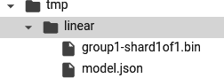
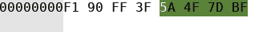
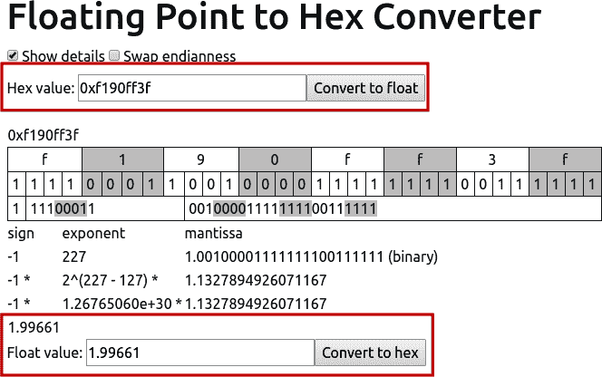
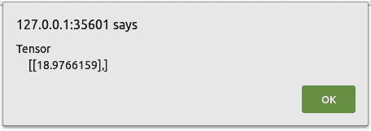
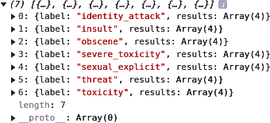
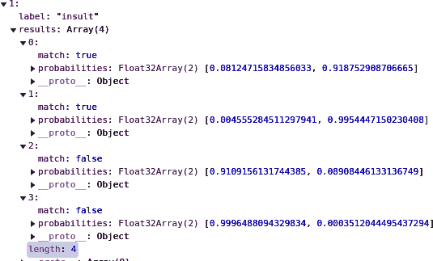
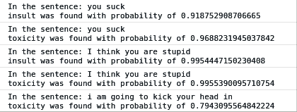
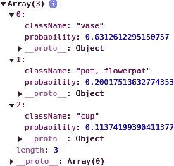
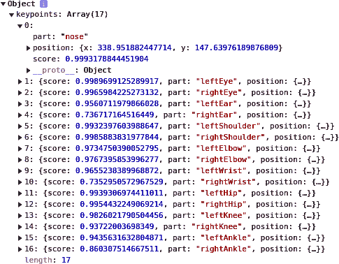
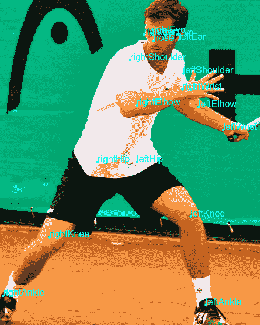

# 第十七章：重用和转换 Python 模型为 JavaScript

在浏览器中训练是一个强大的选择，但您可能并不总是希望这样做，因为涉及的时间。正如您在第 15 和 16 章节中所看到的，即使是训练简单的模型也可能会锁定浏览器一段时间。虽然有进度的可视化有所帮助，但体验仍不是最佳的。这种方法有三种替代方案。第一种是在 Python 中训练模型，然后将其转换为 JavaScript。第二种是使用已经在其他地方训练并以 JavaScript 准备格式提供的现有模型。第三种是使用迁移学习，介绍见 第 3 章。在这种情况下，已在一个场景中学习的特征、权重或偏差可以转移到另一个场景，而不是进行耗时的重新学习。我们将在本章中涵盖前两种情况，然后在 第 18 章中您将看到如何在 JavaScript 中进行迁移学习。

# 将基于 Python 的模型转换为 JavaScript

使用 TensorFlow 训练过的模型可以使用基于 Python 的 `tensorflowjs` 工具转换为 JavaScript。您可以使用以下命令安装这些工具：

```
!pip install tensorflowjs
```

例如，考虑我们在整本书中一直在使用的以下简单模型：

```
`import` numpy `as` np
`import` tensorflow `as` tf
`from` tensorflow.keras `import` `Sequential`
`from` tensorflow.keras.layers `import` `Dense`

l0 = `Dense`(units=`1`, input_shape=[`1`])
model = `Sequential`([l0])
model.compile(optimizer=`'``sgd``'`, loss=`'``mean_squared_error``'`)

xs = np.array([-`1.0`, `0.0`, `1.0`, `2.0`, `3.0`, `4.0`], dtype=`float`)
ys = np.array([-`3.0`, -`1.0`, `1.0`, `3.0`, `5.0`, `7.0`], dtype=`float`)

model.fit(xs, ys, epochs=`500`, verbose=`0`)

`print`(model.predict([`10.0`]))
`print`(`"``Here is what I learned: {}``"`.format(l0.get_weights()))
```

可以使用以下代码将训练好的模型保存为保存的模型：

```
tf.saved_model.save(model, '/tmp/saved_model/')
```

保存模型目录后，您可以通过传递输入格式给 TensorFlow.js 转换器来使用它——在本例中是一个保存的模型——以及保存模型目录的位置和 JSON 模型的所需位置：

```
!tensorflowjs_converter \
    --input_format=keras_saved_model \
    /tmp/saved_model/ \
    /tmp/linear
```

JSON 模型将在指定的目录（在本例中为 */tmp/linear*）中创建。如果您查看此目录的内容，您还会看到一个二进制文件，本例中称为 *group1-shardof1.bin*（见 图 17-1）。此文件包含了网络学习的权重和偏差，以高效的二进制格式存储。



###### 图 17-1\. JS 转换器的输出

JSON 文件包含描述模型的文本。例如，在 JSON 文件中，您将看到如下设置：

```
"weightsManifest"`:` `[`
   `{`"paths"`:` `[`"group1-shard1of1.bin"`]``,` "weights"`:` `[``{`"name"`:` "dense_2/kernel"`,` "shape"`:` `[``1``,` `1``]``,` "dtype"`:` "float32"`}``,` 
 `{`"name"`:` "dense_2/bias"`,` "shape"`:` `[``1``]``,` "dtype"`:` "float32"`}``]``}`
`]``}`
```

这指示了保存权重和偏差的 *.bin* 文件的位置及其形状。

如果您在十六进制编辑器中检查 *.bin* 文件的内容，您会看到其中有 8 个字节（见 图 17-2）。



###### 图 17-2\. *.bin* 文件中的字节

当我们的网络使用单个神经元学习得到 Y = 2X – 1 时，网络学到了一个单一的权重作为 `float32`（4 字节），以及一个单一的偏差作为 `float32`（4 字节）。这 8 个字节被写入了 *.bin* 文件中。

如果您回顾一下代码的输出：

```
Here is what I learned: [array([[1.9966108]], dtype=float32), 
array([-0.98949206], dtype=float32)]
```

然后，您可以使用类似[浮点数转十六进制转换器](https://oreil.ly/cLNPG)（图 17-3）的工具将权重（1.9966108）转换为十六进制。



###### 图 17-3\. 将浮点值转换为十六进制

您可以看到，权重 1.99661 被转换为十六进制 F190FF3F，在十六进制文件的前 4 个字节中的值是来自图 17-2。如果您将偏差转换为十六进制，您将看到类似的结果（请注意，您需要交换字节序）。

## 使用转换后的模型

一旦您有了 JSON 文件及其关联的 *.bin* 文件，您可以轻松在 TensorFlow.js 应用中使用它们。要从 JSON 文件加载模型，您需要指定托管模型的 URL。如果您正在使用 Brackets 的内置服务器，它将位于 127.0.0.1:*<port>*。在指定此 URL 后，您可以使用命令 `await tf.loadLayersModel(URL)` 加载模型。以下是一个例子：

```
`const` `MODEL_URL` `=` 'http://127.0.0.1:35601/model.json'`;`
`const` `model` `=` `await` `tf``.``loadLayersModel``(``MODEL_URL``)``;`
```

您可能需要将 35601 更改为您的本地服务器端口。*model.json* 文件和 *.bin* 文件需要在同一个目录中。

如果您想使用该模型进行预测，您可以像以前一样使用 `tensor2d`，传递输入值及其形状。因此，在这种情况下，如果您想预测值为 10.0，您可以创建一个包含 `[10.0]` 作为第一个参数和 `[1,1]` 作为第二个参数的 `tensor2d`：

```
`const` input = tf.tensor2d([`10.0`], [`1`, `1`]);
`const` result = model.predict(input);
```

为方便起见，这是用于该模型的整个 HTML 页面：

```
`<``html``>`
`<``head``>`
`<``script` `src`=`"``https://cdn.jsdelivr.net/npm/@tensorflow/tfjs@latest``"``>``<``/``script``>`
`<``script``>`
    `async` `function` run(){
        `const` MODEL_URL = `'``http://127.0.0.1:35601/model.json``'`;
        `const` model = `await` tf.loadLayersModel(MODEL_URL);
        console.log(model.summary());
        `const` input = tf.tensor2d([`10.0`], [`1`, `1`]);
        `const` result = model.predict(input);
        alert(result);
    }
    run();
`<``/``script``>`
`<``body``>`
`<``/``body``>`
`<``/``html``>`
```

当您运行页面时，它将立即加载模型并显示预测结果。您可以在图 17-4 中看到这一点。



###### 图 17-4\. 推理输出

很显然，这是一个非常简单的例子，其中模型二进制文件仅为 8 个字节，易于检查。但愿这个例子有助于帮助您理解 JSON 和二进制表示如何紧密相关。当您转换自己的模型时，您会看到更大的二进制文件——最终只是从您的模型中获取的二进制编码的权重和偏差，就像您在这里看到的那样。

在下一节中，您将看到一些已经使用此方法转换过的模型，以及如何在 JavaScript 中使用它们。

# 使用预转换的 JavaScript 模型

除了能将您的模型转换为 JavaScript，您还可以使用预转换的模型。TensorFlow 团队已经为您创建了几种这样的模型供您尝试，您可以在[GitHub](https://oreil.ly/FOoe5)找到这些模型。这些模型适用于不同的数据类型，包括图像、音频和文本。让我们来探索一些这些模型以及您如何在 JavaScript 中使用它们。

## 使用毒性文本分类器

TensorFlow 团队提供的文本模型之一是[毒性分类器](https://oreil.ly/fJTNg)。它接受一个文本字符串，并预测其是否包含以下类型的毒性：

+   身份攻击

+   侮辱

+   猥亵

+   严重毒性

+   性别露骨

+   威胁

+   一般毒性

它是在[Civil Comments 数据集](https://oreil.ly/jUtEQ)上训练的，包含超过两百万条根据这些类型标记的评论。使用它非常简单。你可以像这样在加载 TensorFlow.js 时同时加载模型：

```
`<script`  `src``=`"https://cdn.jsdelivr.net/npm/@tensorflow/tfjs@latest"`>``</script>`
`<script`  `src``=`"https://cdn.jsdelivr.net/npm/@tensorflow-models/toxicity"`>``</script>`
```

一旦你有了这些库，你可以设置一个阈值，超过这个阈值的句子将被分类。默认为 0.85，但你可以像这样改变它，加载模型时指定一个新的数值：

```
`const` threshold = `0.7`;
toxicity.load(threshold).`then`(model => {
```

然后，如果你想分类一个句子，你可以将它放入一个数组中。多个句子可以同时进行分类：

```
`const` `sentences` `=` `[`'you suck'`,` 'I think you are stupid'`,` 'i am going to kick your head in'`,` 
  'you feeling lucky, punk?'`]``;`

`model``.``classify``(``sentences``)``.``then``(``predictions` `=``>` `{`
```

此时，你可以解析`predictions`对象来获取结果。它将是一个包含七个条目的数组，每个条目对应一个毒性类型（Figure 17-5）。



###### Figure 17-5\. 毒性预测的结果

在每个句子的结果中都包含对每个类别的结果。例如，如果你查看项目 1，对于侮辱，你可以展开它来探索结果，你会看到有四个元素。这些是每个输入句子对应该类型毒性的概率（Figure 17-6）。

概率被测量为[负面，正面]，所以第二个元素中的高值表明该类型的毒性存在。在这种情况下，“你很糟糕”这句话被测量为有 0.91875 的侮辱概率，而“我要踢你的头”，虽然有毒，但侮辱概率很低，只有 0.089。

要解析这些内容，你可以循环遍历`predictions`数组，循环遍历结果中的每一种侮辱类型，然后按顺序遍历它们的结果，以找出每个句子中识别的毒性类型。你可以通过使用`match`方法来做到这一点，如果预测值高于阈值，它将是正面的。



###### Figure 17-6\. 探索毒性结果

这是代码：

```
`for`(sentence=`0`; sentence<sentences.length; sentence++){
  `for`(toxic_type=`0`; toxic_type<`7`; toxic_type++){
    `if`(predictions[toxic_type].results[sentence].match){
      console.log(`"``In the sentence:` `"` + sentences[sentence] + `"``\n``"` +
                   predictions[toxic_type].label +
                   `"` `was found with probability of` `"` +
                   predictions[toxic_type].results[sentence].probabilities[`1`]);
    }
  }
}
```

你可以在 Figure 17-7 中看到这个结果。



###### Figure 17-7\. 毒性分类器对样本输入的结果

因此，如果你想在你的网站上实现某种毒性过滤器，你可以像这样用很少的代码来做到！

另一个有用的快捷方式是，如果你不想捕捉所有七种毒性，你可以指定一个子集，就像这样：

```
`const` labelsToInclude = ['identity_attack', 'insult', 'threat'];
```

然后在加载模型时指定此列表和阈值：

```
toxicity.load(threshold, labelsToInclude).`then`(model => {}
```

当然，该模型也可以在 Node.js 后端使用，如果你想在后端捕捉和过滤毒性。

## 在浏览器中使用 MobileNet 进行图像分类

除了文本分类库，存储库还包括一些用于图像分类的库，如[MobileNet](https://oreil.ly/OTRUU)。MobileNet 模型被设计为小巧和节能，同时在分类一千种图像类别时也非常准确。因此，它们有一千个输出神经元，每个都是图像包含该类别的概率。因此，当您将图像传递给模型时，将返回一个包含这些类别的一千个概率的列表。但是，JavaScript 库会为您抽象出来，按优先顺序选择前三个类，并仅提供这些类。

这是来自[完整类列表](http://bit.ly/mobilenet-labels)的摘录：

```
`00`: background
`01`: tench
`02`: goldfish
`03`: great white shark
`04`: tiger shark
`05`: hammerhead
`06`: electric ray
```

要开始，您需要加载 TensorFlow.js 和`mobilenet`脚本，就像这样：

```
`<``script` `src``=``"`https://cdn.jsdelivr.net/npm/@tensorflow/tfjs@latest`"``>` `<``/``script``>`
`<``script` `src``=``"`https://cdn.jsdelivr.net/npm/@tensorflow-models/mobilenet@1.0.0`"``>` 
```

要使用模型，您需要提供一张图像。最简单的方法是创建一个``标签并加载图像到其中。您还可以创建一个`<div>`标签来容纳输出：

```
<`body`>
    <`img` `id`="`img`"  `src`="`coffee.jpg`"></`img`>
    <`div` `id`="`output`" `style`="`font-family`:`courier`;`font-size`:`24``px`;`height=``300``px`">
    </`div`>
</`body`>
```

要使用模型来对图像进行分类，您只需加载它并将``标签的引用传递给分类器：

```
`const` img = `document`.getElementById(`'``img``'`);
`const` outp = `document`.getElementById(`'``output``'`);
mobilenet.load().then(model => {
    model.classify(img).then(predictions => {
        console.log(predictions);
    });
});
```

这会将输出打印到控制台日志中，看起来像图 17-8。



###### 图 17-8\. 探索 MobileNet 输出

输出作为预测对象也可以解析，因此您可以遍历它并像这样选择类名和概率：

```
for(var i = 0; i<predictions.length; i++){
    outp.innerHTML += "<`br`/>" + predictions[i].className + " : " 
     + predictions[i].probability;
}
```

图 17-9 显示了浏览器中样本图像与预测结果并排的情况。


###### 图 17-9\. 图像分类

为了方便起见，这里是这个简单页面的完整代码清单。要使用它，您需要在相同的目录中有一张图像。我使用的是*coffee.jpg*，但您当然可以替换图像并更改``标签的`src`属性以分类其他内容：

```
<html>
<head>
<script src="https://cdn.jsdelivr.net/npm/@tensorflow/tfjs@latest"> </script>
<script src="https://cdn.jsdelivr.net/npm/@tensorflow-models/mobilenet@1.0.0"> 
</script>
</head>
<body>
    </img>
    <div id="output" style="font-family:courier;font-size:24px;height=300px">
    </div>
</body>
<script>
    const img = document.getElementById('img');
    const outp = document.getElementById('output');
    mobilenet.load().then(model => {
        model.classify(img).then(predictions => {
            console.log(predictions);
            for(var i = 0; i<predictions.length; i++){
                outp.innerHTML += "<br/>" + predictions[i].className + " : " 
                + predictions[i].probability;
            }
        });
    });
</script>
</html>
```

## 使用 PoseNet

另一个由 TensorFlow 团队预先转换为您的有趣库是[姿势网络](https://oreil.ly/FOoe5)，它可以在浏览器中实时估计姿势。它接收一张图像并返回图像中 17 个身体标志点的集合：

+   鼻子

+   左右眼

+   左右耳

+   左右肩膀

+   左右肘部

+   左右手腕

+   左右臀部

+   左右膝盖

+   左右脚踝

对于一个简单的场景，我们可以看一下在浏览器中估计单个图像的姿势。要做到这一点，首先加载 TensorFlow.js 和`posenet`模型：

```
<`head`>
    <`script` `src`="`https://cdn.jsdelivr.net/npm/@tensorflow/tfjs`"></`script`>
    <`script` `src`="`https://cdn.jsdelivr.net/npm/@tensorflow-models/posenet`">
    </`script`>
</`head`>
```

在浏览器中，您可以将图像加载到``标签中，并创建一个画布，在此画布上可以绘制身体标志点的位置：

```
<`div`><`canvas` `id`='`cnv`'  `width`='`661px`'  `height`='`656px`'/></`div`>
<`div`><`img` `id`='`master`'  `src`="`tennis.png`"/></`div`>
```

要获取预测结果，您只需获取包含图片的图像元素，并将其传递给`posenet`，调用`estimateSinglePose`方法：

```
`var` imageElement = `document`.getElementById(`'``master``'`);
posenet.load().then(`function`(net) {
    `const` pose = net.estimateSinglePose(imageElement, {});
    `return` pose;
}).then(`function`(pose){
    `console`.log(pose);
    drawPredictions(pose);
})
```

这将返回名为`pose`的对象中的预测结果。这是一个包含身体部位关键点的数组（见图 17-10）。



###### 图 17-10\. 姿势返回的位置

每个项目包含一个部位的文本描述（例如，`nose`），一个带有位置的(*x*, *y*)坐标的对象，以及指示正确识别标志物的置信度值`score`。例如，在图 17-10 中，标志物`nose`被识别的可能性为 0.999。

然后，您可以使用这些信息在图像上绘制标志物。首先将图像加载到画布中，然后可以在其上绘制： 

```
`var` canvas = `document`.getElementById(`'``cnv``'`);
`var` context = canvas.getContext(`'``2d``'`);
`var` img = `new` `Image`()
img.src=`"``tennis.png``"`
img.onload = `function`(){
    context.drawImage(img, `0`, `0`)
    `var` centerX = canvas.width / `2`;
    `var` centerY = canvas.height / `2`;
    `var` radius = `2`;
```

然后，您可以循环遍历预测结果，检索部位名称和(*x*,*y*)坐标，并使用以下代码在画布上绘制它们：

```
`for`(i=`0`; i<pose.keypoints.length; i++){
    part = pose.keypoints[i].part
    loc = pose.keypoints[i].position;
    context.beginPath();
    context.font = `"``16px Arial``"`;
    context.fillStyle=`"``aqua``"`
    context.fillText(part, loc.x, loc.y)
    context.arc(loc.x, loc.y, radius, `0`, `2` * `Math`.`PI`, `false`);
    context.fill();
}
```

然后，在运行时，您应该看到类似于图 17-11 的内容。



###### 图 17-11\. 估算和绘制图像上的身体部位位置

您还可以使用`score`属性来过滤掉错误的预测。例如，如果您的图片只包含一个人的面部，您可以更新代码以过滤掉低概率的预测，以便专注于相关的关键部位：

```
`for`(i=`0`; i<pose.keypoints.length; i++){
    `if`(pose.keypoints[i].score>`0.1`){
    // Plot the points
    }
}
```

如果图像是某人面部的特写，您不希望绘制肩膀、脚踝等部位。这些部位的得分可能很低但非零，如果不将它们过滤掉，它们会被绘制在图像的某个地方——由于图像并不包含这些标志物，这显然是一个错误！

图 17-12 显示了一张面部图像，已过滤掉低概率的标志物。请注意，因为 PoseNet 主要用于估算身体姿势而非面部，所以没有口部标志物。


###### 图 17-12\. 在面部使用 PoseNet

PoseNet 模型还提供了许多其他功能——我们仅仅触及了可能性的表面。您可以在浏览器中使用网络摄像头进行实时姿势检测，编辑姿势的准确性（低准确度的预测可能更快），选择优化速度的架构，检测多个人体的姿势等等。

# 总结

本章介绍了如何使用 TensorFlow.js 与 Python 创建的模型，可以通过训练自己的模型并使用提供的工具转换，或者使用现有模型。在转换过程中，您看到了`tensorflowjs`工具创建了一个包含模型元数据的 JSON 文件，以及一个包含权重和偏置的二进制文件。很容易将模型导入为 JavaScript 库，并直接在浏览器中使用它。

你随后查看了一些已经为你转换的现有模型的示例，以及如何将它们整合到你的 JavaScript 代码中。你首先尝试了毒性模型，用于处理文本以识别和过滤有毒评论。然后，你探索了使用 MobileNet 模型进行计算机视觉，以预测图像的内容。最后，你看到了如何使用 PoseNet 模型来检测图像中的身体地标并绘制它们，包括如何过滤低概率分数，以避免绘制看不见的地标。

在第十八章，你将看到另一种重用现有模型的方法：迁移学习，即利用现有的预训练特征，并将其应用到你自己的应用程序中。
