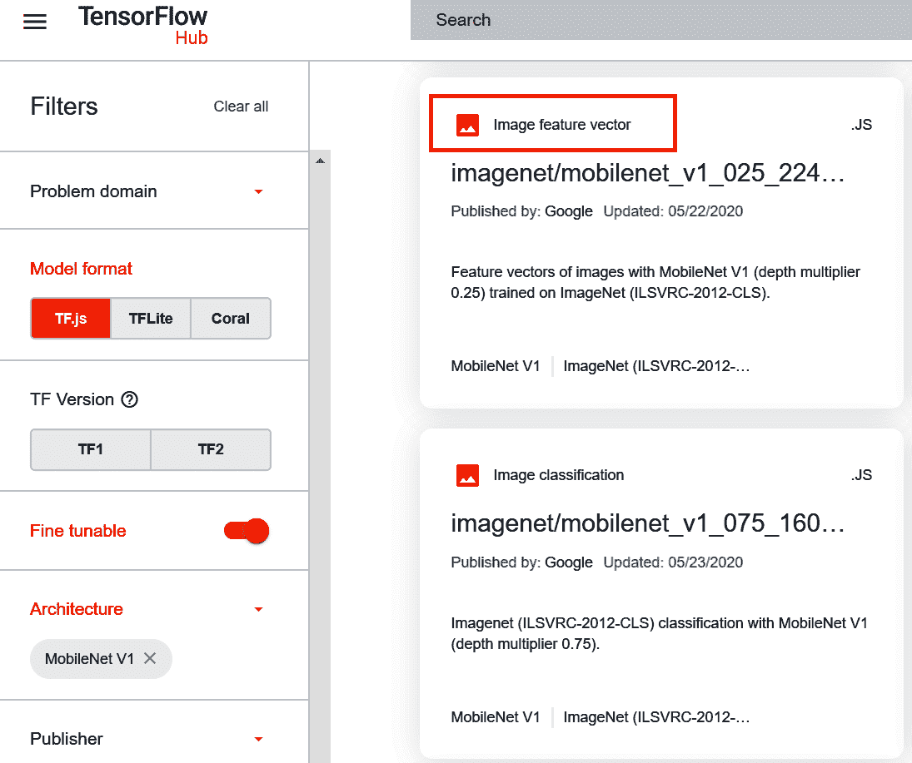

# 第十八章：JavaScript 中的迁移学习

在第十七章中，你探讨了两种将模型转换到 JavaScript 的方法：转换基于 Python 的模型和使用 TensorFlow 团队提供的预先存在的模型。除了从头开始训练，还有一种选择：迁移学习，即之前为一个场景训练过的模型，可以重复使用其部分层次。例如，用于计算机视觉的卷积神经网络可能已经学习了多层滤波器。如果它是在大型数据集上训练的，以识别多个类别，那么它可能有非常通用的滤波器，可以用于其他情景。

使用 TensorFlow.js 进行迁移学习时，有多种选择，取决于预先存在的模型如何分布。可能性主要分为三类：

+   如果模型有一个*model.json*文件，通过使用 TensorFlow.js 转换器将其转换为基于层的模型，你可以探索层次，选择其中之一，并使其成为你训练的新模型的输入。

+   如果模型已转换为基于图的模型，例如 TensorFlow Hub 中常见的模型，你可以连接其特征向量到另一个模型，以利用其学习到的特征。

+   如果模型已封装为 JavaScript 文件以便于分发，该文件将为你提供一些方便的快捷方式，用于通过访问嵌入或其他特征向量进行预测或迁移学习。

在本章中，你将探索这三种方法。我们将从检查如何访问 MobileNet 中的预先学习层开始，这是你在第十七章中用作图像分类器的模型，并将其添加到你自己的模型中。

# 从 MobileNet 进行迁移学习

MobileNet 架构定义了一个[模型家族](https://oreil.ly/yl3ka)，主要用于设备上的图像识别。它们是在 ImageNet 数据集上训练的，该数据集包含超过 1000 万张图片，分为 1000 个类别。通过迁移学习，你可以使用它们预先学习的滤波器，并更改底部密集层，以适应你自己的类别，而不是原始模型训练时的 1000 个类别。

要构建一个使用迁移学习的应用程序，你需要遵循以下几个步骤：

1.  下载 MobileNet 模型并确定要使用的层次。

1.  创建自己的模型架构，其输入为 MobileNet 的输出。

1.  将数据收集到可用于训练的数据集中。

1.  训练模型。

1.  运行推断。

通过构建一个从网络摄像头捕捉 Rock/Paper/Scissors 手势图像的浏览器应用程序，你将经历所有这些步骤。然后，该应用程序使用这些图像来训练一个新模型。该模型将使用 MobileNet 的预先学习层，并在其下方添加一组新的密集层用于你的类别。

## 步骤 1. 下载 MobileNet 并确定要使用的层次

TensorFlow.js 团队在 Google Cloud Storage 上托管了许多预转换的模型。如果你想自己尝试，你可以在这本书的 GitHub repo 中找到一个[URL 列表](https://oreil.ly/I6ykm)。这里有几个 MobileNet 模型，包括你将在本章中使用的一个(*mobilenet_v1_0.25_224/model.json*)。

要探索这个模型，创建一个新的 HTML 文件并命名为*mobilenet-transfer.html*。在这个文件中，你会加载 TensorFlow.js 和一个名为*index.js*的外部文件，稍后你会创建它：

```
<`html`>
  <`head`>
    <`script` `src`="`https://cdn.jsdelivr.net/npm/@tensorflow/tfjs@latest`">  
    </`script`>
  </`head`>
  <`body`></`body`>
  <`script` `src`="`index.js`"></`script`>
</`html`>
```

接下来，创建前面 HTML 文件所引用的*index.js*文件。这将包含一个异步方法，用于下载模型并打印其摘要：

```
`async` `function` init(){
 `const` url = `'https://storage.googleapis.com/tfjs- models/tfjs/mobilenet_v1_0.25_224/model.json'`

 `const` mobilenet = `await` tf.loadLayersModel(url);
  `console`.log(mobilenet.summary())
}

init()
```

如果你在控制台中查看`model.summary`输出并向下滚动，你会看到类似于图 18-1 的内容。


###### 图 18-1。MobileNet JSON 模型的 model.summary 输出

使用 MobileNet 进行迁移学习的关键是寻找*激活*层。正如你所看到的，底部有两个激活层。最后一个有一千个输出，对应于 MobileNet 支持的一千个类别。因此，如果你想要学习的激活层，特别是学习的卷积滤波器，可以寻找在此之上的激活层，并注意它们的名称。如你在图 18-1 中所见，模型中最后一个激活层，在最终层之前，被称为`conv_pw_13_relu`。如果你想进行迁移学习，你可以使用它（或者实际上，在它之前的任何激活层）作为模型的输出。

## 第二步。使用 MobileNet 的输出创建你自己的模型架构

在设计模型时，通常会设计所有的层，从输入层开始，到输出层结束。通过迁移学习，你将从要转移的模型传递输入，并创建新的输出层。考虑到图 18-2，这是 MobileNet 的粗略高级架构。它接收尺寸为 224 × 224 × 3 的图像，并将它们通过神经网络架构传递，输出一千个值，每个值代表图像包含相关类别的概率。


###### 图 18-2。MobileNet 的高级架构

之前你查看了该架构的内部并识别了最后的激活卷积层，称为`conv_pw_13_relu`。你可以看到在图 18-3 中包含这一层的架构是什么样子的。

MobileNet 架构仍然识别一千个类别，而其中没有您要实现的类别（手势游戏“石头剪刀布”中的手势）。您需要一个新模型，该模型经过训练可以识别这三个类别。您可以从头开始训练它，并学习所有能够帮助您区分它们的滤波器，正如前几章所示。或者，您可以从 MobileNet 中获取预学习的滤波器，使用直到 `conv_pw_13_relu` 的架构，并将其提供给一个仅分类三个类别的新模型。请参见 图 18-4 的抽象化过程。


###### 图 18-3\. 高级 MobileNet 架构展示 conv_pw_13_relu


###### 图 18-4\. 从 conv_pw_13_relu 转移学习到新架构

要在代码中实现这一点，您可以将您的 *index.js* 更新如下：

```
`let` mobilenet

`async` `function` loadMobilenet() {
  `const` mobilenet = `await` tf.loadLayersModel(`url`);
  `const` layer = mobilenet.getLayer(`'conv_pw_13_relu'`);
  `return` tf.model({inputs: mobilenet.inputs, outputs: layer.output});
}

`async` `function` init(){
  mobilenet = `await` loadMobilenet()
  model = tf.sequential({
  layers: [
    tf.layers.flatten({inputShape: mobilenet.outputs[`0`].shape.slice(`1`)}),
    tf.layers.dense({ units: `100`, activation: `'relu'`}),
    tf.layers.dense({ units: `3`, activation: `'softmax'`})
  ]
  });
  `console`.log(model.summary())
}

init()
```

`mobilenet` 的加载已经放入了自己的异步函数中。一旦模型加载完成，可以使用 `getLayer` 方法从中提取 `conv_pw_13_relu` 层。然后该函数将返回一个模型，其输入设置为 `mobilenet` 的输入，输出设置为 `conv_pw_13_relu` 的输出。这由 图 18-4 中的右向箭头进行可视化。

一旦此函数返回，您可以创建一个新的序列模型。请注意其中的第一层——它是 `mobilenet` 输出的扁平化（即 `conv_pw_13_relu` 输出），然后进入一个包含一百个神经元的密集层，再进入一个包含三个神经元的密集层（分别对应石头、剪刀和布）。

如果您现在对这个模型进行 `model.fit`，您将训练它识别三个类别——但与其从头学习识别图像中的所有滤波器不同，您可以使用之前由 MobileNet 学到的滤波器。但在此之前，您需要一些数据。接下来的步骤将展示如何收集这些数据。

## 步骤 3\. 收集和格式化数据

对于本示例，您将使用浏览器中的网络摄像头捕获手势“石头/剪刀/布”的图像。从网络摄像头捕获图像的数据超出了本书的范围，因此这里不会详细介绍，但在这本书的 GitHub 仓库中有一个名为 *webcam.js* 的文件（由 TensorFlow 团队创建），可以为您处理所有这些。它从网络摄像头捕获图像，并将它们以 TensorFlow 友好的格式返回为批处理图像。它还处理了浏览器所需的所有来自 TensorFlow.js 的清理代码，以避免内存泄漏。以下是该文件的一部分示例：

```
capture() {
  `return` tf.tidy(() => {
    `// Read the image as a tensor from the webcam <video> element.`
    `const` webcamImage = tf.browser.fromPixels(`this`.webcamElement);
    `const` reversedImage = webcamImage.reverse(`1`);
    `// Crop the image so we're using the center square of the rectangle.`
    `const` croppedImage = `this`.cropImage(reversedImage);
    `// Expand the outermost dimension so we have a batch size of 1.`
    `const` batchedImage = croppedImage.expandDims(`0`);
    `// Normalize the image between -1 and 1\. The image comes in between`
    `// 0-255, so we divide by 127 and subtract 1.`
    `return` batchedImage.toFloat().div(tf.scalar(`127`)).sub(tf.scalar(`1`));
  });
}
```

您可以通过简单的 `<script>` 标签将此 *.js* 文件包含在您的 HTML 中：

```
<script src=`"webcam.js"`></script>
```

您可以更新 HTML，使用一个 `<div>` 来容纳来自网络摄像头的视频预览，用户将选择捕获石头/剪刀/布手势样本的按钮，以及输出捕获样本数量的 `<div>`。应如下所示：

```
<html>
  <head>
    <script src=`"https://cdn.jsdelivr.net/npm/@tensorflow/tfjs@latest"`> 
    </script>
    <script src=`"webcam.js"`></script>
  </head>
  <body>
    <div>
      <video autoplay playsinline muted id=`"wc"` width=`"224"` height=`"224"`/>
    </div>
    <button type=`"button"` id=`"0"` onclick=`"handleButton(this)"`>Rock</button>
    <button type=`"button"` id=`"1"` onclick=`"handleButton(this)"`>Paper</button>
    <button type=`"button"` id=`"2"` onclick=`"handleButton(this)"`>Scissors</button>
      <div id=`"rocksamples"`>Rock Samples:</div>
      <div id=`"papersamples"`>Paper Samples:</div>
      <div id=`"scissorssamples"`>Scissors Samples:</div>
  </body>
  <script src=`"index.js"`></script>
</html>
```

然后，您只需在您的 *index.js* 文件顶部添加一个 `const` 来初始化具有 HTML 中 `<video>` 标签 ID 的网络摄像头：

```
`const` webcam = `new` `Webcam`(`document`.getElementById(`'wc'`));
```

然后，您可以在 `init` 函数中初始化网络摄像头：

```
`await` webcam.setup();
```

运行页面现在将为您提供一个带有网络摄像头预览的页面，以及三个按钮（参见 图 18-5）。


###### 图 18-5\. 使网络摄像头预览正常工作

请注意，如果您看不到预览，请查看 Chrome 状态栏顶部突出显示的图标。如果它有一条红线，您需要允许浏览器使用网络摄像头，然后您应该能看到预览。接下来，您需要做的是捕获图像，并将其放入使您在第 2 步中创建的模型训练变得容易的格式中。

由于 TensorFlow.js 无法利用像 Python 那样的内置数据集，您将不得不自己创建数据集类。幸运的是，这并不像听起来那么困难。在 JavaScript 中，创建一个名为 *rps-dataset.js* 的新文件。构造一个带有标签数组的对象，如下所示：

```
`class` `RPSDataset` {
  constructor() {
    `this`.labels = []
  }
}
```

每次从网络摄像头捕获一个新的石头/剪刀/布手势示例时，您都希望将其添加到数据集中。可以通过 `addExample` 方法实现这一点。示例将作为 `xs` 添加。请注意，这不会添加原始图像，而是通过截断的 `mobilenet` 对图像进行分类。稍后您将看到这一点。

第一次调用此函数时，`xs` 将为 `null`，因此您将使用 `tf.keep` 方法创建 `xs`。正如其名称所示，此方法防止在 `tf.tidy` 调用中销毁张量。它还将标签推送到构造函数中创建的 `labels` 数组中。对于后续调用，`xs` 将不为 `null`，因此您将 `xs` 复制到 `oldX` 中，然后将示例连接到其中，使其成为新的 `xs`。然后，您将标签推送到 `labels` 数组中，并且丢弃旧的 `xs`：

```
addExample(example, label) {
  `if` (`this`.xs == `null`) {
    `this`.xs = tf.keep(example);
    `this`.labels.push(label);
  } `else` {
    `const` oldX = `this`.xs;
    `this`.xs = tf.keep(oldX.concat(example, `0`));
    `this`.labels.push(label);
    oldX.dispose();
  }
}
```

遵循这种方法，您的标签将成为一个值数组。但是要训练模型，您需要将它们作为一个独热编码数组，因此您需要向数据集类添加一个辅助函数。此 JavaScript 将 `labels` 数组编码为 `numClasses` 参数指定的类数：

```
encodeLabels(numClasses) {
  for (var i = 0; i < this.labels.length; i++) {
    if (this.ys == null) {
      this.ys = tf.keep(tf.tidy(
          () => {`return` `tf``.``oneHot`(
              tf.tensor1d([this.labels[i]]).toInt(), numClasses)}));
    } else {
      const y = tf.tidy(
          () => {`return` `tf``.``oneHot`(
              tf.tensor1d([this.labels[i]]).toInt(), numClasses)});
      const oldY = this.ys;
      this.ys = tf.keep(oldY.concat(y, 0));
      oldY.dispose();
      y.dispose();
    }
  }
}
```

关键在于 `tf.oneHot` 方法，正如其名称所示，它将给定的参数编码为独热编码。

在您的 HTML 中，您已添加了三个按钮，并指定它们的 `onclick` 调用一个名为 `handleButton` 的函数，如下所示：

```
<button type=`"button"` id=`"0"` onclick=`"handleButton(this)"`>Rock</button>
<button type=`"button"` id=`"1"` onclick=`"handleButton(this)"`>Paper</button>
<button type=`"button"` id=`"2"` onclick=`"handleButton(this)"`>Scissors</button>
```

你可以在*index.js*脚本中实现这个功能，通过打开元素 ID（石头、剪刀和布分别是 0、1 或 2），将其转换为标签，捕获网络摄像头图像，调用`mobilenet`的`predict`方法，并使用你早先创建的方法将结果作为示例添加到数据集中：

```
`function` handleButton(elem){
  label = parseInt(elem.id);
  `const` img = webcam.capture();
 `dataset``.``addExample``(``mobilenet``.``predict``(``img``)``,` `label``)``;`
}
```

在继续之前，确保你理解了`addExample`方法。虽然你*可以*创建一个捕获原始图像并将其添加到数据集的数据集，但请回忆图 18-4。你用`conv_pw_13_relu`的输出创建了`mobilenet`对象。通过调用`predict`，你将得到该层的输出。如果你回顾一下图 18-1，你会看到输出是[?, 7, 7, 256]。这在图 18-6 中有总结。


###### 图 18-6\. mobilenet.predict 的结果

请记住，使用 CNN，随着图像通过网络的进展，会学习到多个滤波器，并且这些滤波器的结果会乘以图像。它们通常被池化并传递到下一层。通过这种架构，当图像到达输出层时，你将得到 256 个 7 × 7 的图像，这些是所有滤波器应用的结果。然后可以将这些图像馈送到密集网络中进行分类。

你也可以添加代码以更新用户界面，计算添加的样本数。我这里为了简洁起见省略了它，但都在 GitHub 仓库中。

不要忘记使用`<script>`标签将*rps-dataset.js*文件添加到你的 HTML 中：

```
<script src=`"rps-dataset.js"`></script>
```

在 Chrome 开发者工具中，你可以添加断点并观察变量。运行你的代码，添加一个对`dataset`变量的观察，并在`dataset.addExample`方法上设置一个断点。点击石头/剪刀/布中的一个按钮，你将看到数据集被更新。在图 18-7 中，你可以看到在我点击这三个按钮后的结果。


###### 图 18-7\. 探索数据集

注意`labels`数组设置为 0、1、2 表示三种标签。它还没有进行独热编码。此外，在数据集中，你可以看到一个包含所有收集数据的 4D 张量。第一个维度（3）是收集的样本数。随后的维度（7, 7, 256）是来自`mobilenet`的激活。

现在你有了一个可以用来训练模型的数据集。在运行时，你可以让用户点击每个按钮来收集每种类型的样本数量，然后将其馈送到你为分类指定的密集层中。

## 步骤 4\. 训练模型

这个应用程序将通过一个按钮来训练模型。一旦训练完成，你可以按一个按钮开始模型在网络摄像头中看到的内容进行预测，并按另一个按钮停止预测。

将以下 HTML 添加到您的页面以添加这三个按钮，并添加一些 `<div>` 标签来保存输出。请注意，这些按钮调用名为 `doTraining`、`startPredicting` 和 `stopPredicting` 的方法：

```
<`button` `type`="`button`"  `id`="`train`"  `onclick`="`doTraining()`"> Train Network </`button`>
<`div` `id`="`dummy`"> Once training is complete, click 'Start Predicting' to see predictions
  and 'Stop Predicting' to end </`div`>
<`button` `type`="`button`"  `id`="`startPredicting`"  `onclick`="`startPredicting()`"> Start Predicting </`button`>
<`button` `type`="`button`"  `id`="`stopPredicting`"  `onclick`="`stopPredicting()`"> Stop Predicting </`button`>
<`div` `id`="`prediction`"></`div`>
```

在您的 *index.js* 中，您可以添加一个名为 `doTraining` 的方法并填充它：

```
function doTraining(){
  train();
}
```

在 `train` 方法内部，您可以定义模型架构，对标签进行独热编码并训练模型。请注意，模型中的第一层的 `inputShape` 已定义为 `mobilenet` 的输出形状，而您之前已将 `mobilenet` 对象的输出指定为 `conv_pw_13_relu`：

```
`async` `function` train() {
  dataset.ys = `null`;
  dataset.encodeLabels(`3`);
  model = tf.sequential({
    layers: [
      tf.layers.flatten({inputShape: mobilenet.outputs[`0`].shape.slice(`1`)}),
      tf.layers.dense({ units: `100`, activation: `'relu'`}),
      tf.layers.dense({ units: `3`, activation: `'softmax'`})
    ]
  });
  `const` optimizer = tf.train.adam(`0.0001`);
  model.compile({optimizer: optimizer, loss: `'categoricalCrossentropy'`});
  `let` loss = `0`;
  model.fit(dataset.xs, dataset.ys, {
    epochs: `10`,
    callbacks: {
      onBatchEnd: `async` (batch, logs) => {
        loss = logs.loss.toFixed(`5`);
        `console`.log(`'LOSS: '` + loss);
      }
    }
  });
}
```

这将训练模型进行 10 个 epochs。您可以根据模型中的损失情况自行调整。

在 *init.js* 中早些时候，您定义了模型，但是最好将其移到这里并将 `init` 函数仅用于初始化。因此，您的 `init` 应该如下所示：

```
`async` `function` init(){
  `await` webcam.setup();
  mobilenet = `await` loadMobilenet()
}
```

在此时，您可以在网络摄像头前练习做出石头/剪刀/布手势。按适当的按钮来捕获给定类别的示例。每个类别重复约 50 次，然后按“Train Network”按钮。几秒钟后，训练将完成，您将在控制台中看到损失值。在我的情况下，损失从约 2.5 开始，最终降至 0.0004，表明模型学习良好。

请注意，每个类别的 50 个样本足够了，因为当我们将示例添加到数据集时，我们添加了 *activated* 的示例。每个图像为我们提供 256 个 7 × 7 的图像以供馈送到密集层，因此，150 个样本为我们提供了总共 38,400 个用于训练的项目。

现在您已经有了一个训练好的模型，可以尝试使用它进行预测！

## 第 5 步：使用模型进行推断

完成第 4 步后，您应该拥有一个能够提供完全训练好的模型的代码。您还创建了用于启动和停止预测的 HTML 按钮。这些按钮配置为调用 `startPredicting` 和 `stopPredicting` 方法，因此现在应创建它们。每个方法只需将一个 `isPredicting` 布尔值设置为 `true` 或 `false`，分别用于确定是否要进行预测。然后它们调用 `predict` 方法：

```
`function` startPredicting(){
  isPredicting = `true`;
  predict();
}

`function` stopPredicting(){
  isPredicting = `false`;
  predict();
}
```

`predict` 方法可以使用您训练好的模型。它将捕获网络摄像头输入，并通过调用 `mobilenet.predict` 方法获取激活值。然后，一旦获取了激活值，它就可以将它们传递给模型以进行预测。由于标签是独热编码的，您可以在预测结果上调用 `argMax` 来获取可能的输出：

```
`async` `function` predict() {
  `while` (isPredicting) {
    `const` predictedClass = tf.tidy(() => {
      `const` img = webcam.capture();
      `const` activation = mobilenet.predict(img);
      `const` predictions = model.predict(activation);
      `return` predictions.as1D().argMax();
    });
    `const` classId = (`await` predictedClass.data())[`0`];
    `var` predictionText = `""`;
    `switch`(classId){
      `case` `0`:
        predictionText = `"I see Rock"`;
        `break`;
      `case` `1`:
        predictionText = `"I see Paper"`;
        `break`;
      `case` `2`:
        predictionText = `"I see Scissors"`;
        `break`;
    }
    `document`.getElementById(`"prediction"`).innerText = predictionText;

    predictedClass.dispose();
    `await` tf.nextFrame();
  }
}
```

结果为 0、1 或 2，然后您可以将该值写入预测 `<div>` 并进行清理。

注意这取决于 `isPredicting` 布尔值，因此您可以通过相关按钮打开或关闭预测功能。现在当您运行页面时，您可以收集样本、训练模型并进行推断。查看 Figure 18-8 的示例，它将我的手势分类为剪刀！


###### 图 18-8\. 使用训练模型在浏览器中运行推理

从这个示例中，您看到了如何为迁移学习构建您自己的模型。接下来，您将探索一种使用存储在 TensorFlow Hub 中的基于图形的模型的替代方法。

# 从 TensorFlow Hub 进行迁移学习

[TensorFlow Hub](https://www.tensorflow.org/hub) 是一个可重复使用的 TensorFlow 模型在线库。许多模型已经转换为 JavaScript 版本供您使用，但是在进行迁移学习时，您应该寻找“图像特征向量”模型类型，而不是完整的模型本身。这些模型已经被剪枝以输出学习到的特征。这里的方法与上一节示例中的方法略有不同，那里是从 MobileNet 输出激活值，然后将其转移到您的自定义模型中。相反，*特征向量* 是表示整个图像的一维张量。

要找到要试验的 MobileNet 模型，请访问 TFHub.dev，选择 TF.js 作为您想要的模型格式，并选择 MobileNet 架构。您将看到许多可用的模型选项，如图 18-9 所示。



###### 图 18-9\. 使用 TFHub.dev 查找 JavaScript 模型

找到一个图像特征向量模型（我使用 025_224），并选择它。在模型详细信息页面的“示例用法”部分，您将找到如何下载图像的代码，例如：

```
`tf``.``loadGraphModel``(`"https://tfhub.dev/google/tfjs-model/imagenet/
    mobilenet_v1_025_224/feature_vector/3/default/1"`,` `{` `fromTFHub``:` `true` `}``)`
```

您可以使用此功能来下载模型，以便检查特征向量的维度。这里是一个简单的 HTML 文件，其中包含此代码，用于对称为 *dog.jpg* 的图像进行分类：

```
<html>
<head>
<script src=`"https://cdn.jsdelivr.net/npm/@tensorflow/tfjs@latest"`> </script>   
</head>
<body>
  
</body>
</html>
<script>
`async` `function` run(){
  `const` img = `document`.getElementById(`'img'`);
  model = `await` tf.loadGraphModel(`'https://tfhub.dev/google/tfjs-model/imagenet/`
 `mobilenet_v1_025_224/feature_vector/3/default/1'`, {fromTFHub: `true`});
  `var` raw = tf.browser.fromPixels(img).toFloat();
  `var` resized = tf.image.resizeBilinear(raw, [`224`, `224`]);
  `var` tensor = resized.expandDims(`0`);
  `var` result = `await` model.predict(tensor).data();
  `console`.log(result)
}

run();

</script>
```

当您运行此代码并查看控制台时，您将看到此分类器的输出（如图 18-10）。如果您使用与我相同的模型，则应看到其中有 256 个元素的 `Float32Array`。其他 MobileNet 版本可能具有不同大小的输出。


###### 图 18-10\. 探索控制台输出

一旦您知道图像特征向量模型的输出形状，您就可以将其用于迁移学习。因此，例如，对于石头/剪刀/布的示例，您可以使用类似于图 18-11 中的架构。


###### 图 18-11\. 使用图像特征向量进行迁移学习

现在，您可以通过更改从何处以及如何加载模型，并修改分类器以接受图像特征向量而不是先前的激活特征来编辑您的迁移学习石头/剪刀/布应用程序的代码。

如果您想从 TensorFlow Hub 加载您的模型，只需像这样更新 `loadMobilenet` 函数：

```
`async` `function` loadMobilenet() {
  `const` mobilenet = 
 `await` tf.loadGraphModel(`"https://tfhub.dev/google/tfjs-model/imagenet/`
 `mobilenet_v1_050_160/feature_vector/3/default/1"`, {fromTFHub: `true`})
  `return` mobilenet
}
```

然后，在您的`train`方法中，您定义分类模型时，更新它以接收来自图像特征向量的输出（`[256]`）到第一层。以下是代码：

```
model = tf.sequential({
  layers: [
    tf.layers.dense({ `inputShape``:` `[``256``]`, units: 100, activation: 'relu'}),
    tf.layers.dense({ units: 3, activation: 'softmax'})
  ]
});
```

请注意，对于不同的模型，这种形状会有所不同。如果没有为您发布，您可以使用类似之前显示的 HTML 代码来查找它。

一旦完成，您就可以在 TensorFlow Hub 模型上使用 JavaScript 进行迁移学习！

# 使用来自 TensorFlow.org 的模型

[JavaScript 开发者的模型另一个来源](https://oreil.ly/Xw8lI)是 TensorFlow.org（见图 18-12）。这里提供的模型，如图像分类、物体检测等，可立即使用。点击任何链接都会带您进入一个包装了基于图的模型的 JavaScript 类的 GitHub 仓库，使其使用变得更加容易。

对于[MobileNet](https://oreil.ly/OTRUU)，您可以像这样使用包含`<script>`的模型：

```
`<script` `src=`"https://cdn.jsdelivr.net/npm/@tensorflow-models/mobilenet@1.0.0"`>`
`</script>`
```


###### 图 18-12\. 在[TensorFlow.org](http://TensorFlow.org)上浏览模型

如果您看一下代码，您会注意到两件事。首先，标签集编码在 JavaScript 内部，为您提供了一种方便的查看推理结果的方式，无需进行第二次查找。您可以在这里看到代码片段：

```
`var` `i``=``{` `0``:`"tench, Tinca tinca"`,` `1``:`"goldfish, Carassius auratus"`,` `2``:`"great white shark, white shark, man-eater, man-eating shark, Carcharodon
 carcharias"`,` `3``:`"tiger shark, Galeocerdo cuvieri"
...
```

此外，文件底部还有来自 TensorFlow Hub 的许多模型、层和激活，您可以将它们加载到 JavaScript 变量中。例如，对于 MobileNet 的版本 1，您可能会看到像这样的条目：

```
>n={"1.00">:
>{>.25>:"`>https://tfhub.dev/google/imagenet/mobilenet_v1_025_224/classification/1`">,
 "0.50">:"`>https://tfhub.dev/google/imagenet/mobilenet_v1_050_224/classification/1`">,
>.75>:"`>https://tfhub.dev/google/imagenet/mobilenet_v1_075_224/classification/1`">,
"1.00">:"`>https://tfhub.dev/google/imagenet/mobilenet_v1_100_224/classification/1`"
>}
```

值 0.25、0.50、0.75 等是“宽度乘数”值。这些用于构建更小、计算量较少的模型；您可以在引入架构的[原始论文](https://oreil.ly/95NIb)中找到详细信息。

代码提供了许多便捷的快捷方式。例如，当在图像上运行推理时，请将以下列表与稍早显示的列表进行比较，其中您使用 MobileNet 获取了狗图像的推理结果。以下是完整的 HTML 代码： 

```
<html>
<head>
<script src=`"https://cdn.jsdelivr.net/npm/@tensorflow/tfjs@latest"`> 
</script> 
<script src=`"https://cdn.jsdelivr.net/npm/@tensorflow-models/mobilenet@1.0.0"`> 
</script>
</head>
<body>
  
</body>
</html>
<script>
`async` `function` run(){
  `const` img = `document`.getElementById(`'img'`);
  mobilenet.load().then(model => {
    model.classify(img).then(predictions => {
      `console`.log(`'Predictions: '`);
      `console`.log(predictions);
    });

  });
}

run();

</script>
```

请注意，您不必预先将图像转换为张量以进行分类。这段代码更加清晰，允许您专注于预测。要获取嵌入，您可以像这样使用`model.infer`而不是`model.classify`：

```
embeddings = model.infer(img, embedding=`true`);
`console`.log(embeddings);
```

因此，如果您愿意，可以使用这些嵌入从 MobileNet 创建一个迁移学习场景。

# 摘要

在本章中，您了解了从现有基于 JavaScript 的模型进行迁移学习的各种选项。由于存在不同的模型实现类型，因此也有多种访问它们以进行迁移学习的选项。首先，您看到了如何使用 TensorFlow.js 转换器创建的 JSON 文件来探索模型的层，并选择其中一层进行迁移。第二个选项是使用基于图形的模型。这是 TensorFlow Hub 上首选的模型类型（因为它们通常提供更快的推断），但您会失去一些选择从哪一层进行迁移学习的灵活性。当使用这种方法时，您下载的 JavaScript 捆绑包不包含完整的模型，而是截断为特征向量输出。您可以将其从这里转移到您自己的模型中。最后，您了解了如何使用 TensorFlow 团队在[TensorFlow.org](http://TensorFlow.org)上提供的预包装 JavaScript 模型，这些模型包括用于访问数据、检查类别以及获取模型的嵌入或其他特征向量的辅助函数，以便用于迁移学习。

总的来说，我建议采用 TensorFlow Hub 的方法，并在可用时使用具有预构建特征向量输出的模型——但如果没有，了解 TensorFlow.js 具有足够灵活的生态系统以允许以多种方式进行迁移学习也是很好的。
