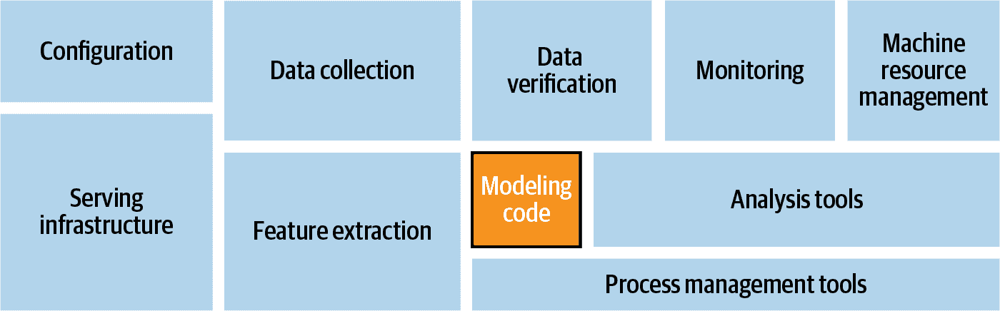
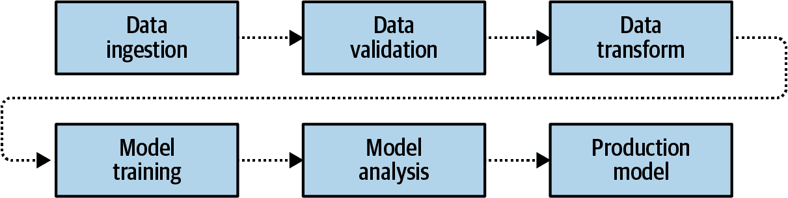
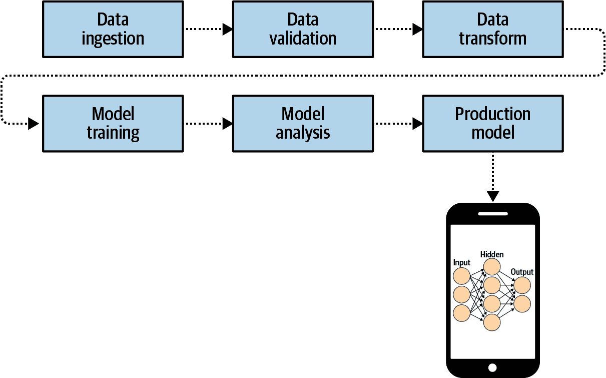
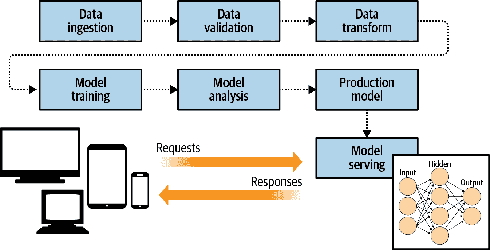
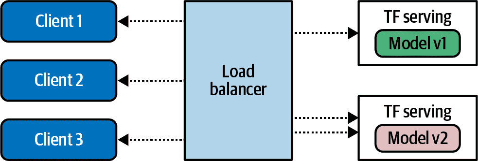
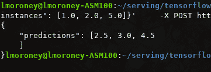

# 第十九章：使用 TensorFlow Serving 进行部署

在过去的几章中，你已经研究了模型的部署表面——在 Android 和 iOS 上以及在 Web 浏览器中。另一个明显的模型部署地点是服务器，这样你的用户可以将数据传递到你的服务器，并使用你的模型进行推理并返回结果。这可以通过 TensorFlow Serving 来实现，它是一个简单的模型“包装器”，提供 API 界面以及生产级可扩展性。在本章中，你将会介绍 TensorFlow Serving 以及如何使用它来部署和管理简单模型的推理。

# 什么是 TensorFlow Serving？

本书主要侧重于创建模型的代码，虽然这本身是一个庞大的工作，但它只是在使用机器学习模型进行生产时所需的整体图景中的一小部分。正如你在图 19-1 中所看到的那样，你的代码需要与配置代码、数据收集、数据验证、监控、机器资源管理、特征提取以及分析工具、流程管理工具和服务基础设施并存。

TensorFlow 的这些工具生态系统称为*TensorFlow Extended*（TFX）。除了本章中涵盖的服务基础设施之外，我不会深入探讨 TFX 的其他方面。如果你想进一步了解它，可以参考 Hannes Hapke 和 Catherine Nelson（O'Reilly）的书籍[*Building Machine Learning Pipelines*](https://oreil.ly/iIYGm)。



###### 图 19-1\. ML 系统的系统架构模块

机器学习模型的流程总结在图 19-2 中。



###### 图 19-2\. 机器学习生产流水线

流程要求首先收集和摄取数据，然后进行验证。一旦数据“干净”，则将其转换为可以用于训练的格式，包括适当地进行标记。从这里开始，模型可以进行训练，一旦完成，它们将被分析。在测试模型准确性、查看损失曲线等时，你已经在做这些了。一旦满意，你就拥有了一个生产模型。

一旦你拥有了该模型，你可以将其部署到移动设备上，例如使用 TensorFlow Lite（图 19-3）。

TensorFlow Serving 通过提供基础设施来托管你的模型在服务器上，符合这种架构。客户端可以使用 HTTP 将请求传递到此服务器，并带有数据负载。数据将被传递到模型，模型将进行推理，获取结果，并将其返回给客户端（图 19-4）。



###### 图 19-3\. 将生产模型部署到移动设备



###### 图 19-4\. 将模型服务架构添加到管道中

这种类型的架构的一个重要特征是，您还可以控制客户端使用的模型版本。例如，当模型部署到移动设备时，可能会出现模型漂移，即不同的客户端使用不同的版本。但是在基础架构中提供服务时（如 图 19-4 所示），您可以避免这种情况。此外，这也使得可以尝试不同的模型版本，其中一些客户端将从一个版本的推断中获取结果，而其他客户端则从其他版本中获取结果（图 19-5）。



###### 图 19-5\. 使用 TensorFlow Serving 处理多个模型版本

# 安装 TensorFlow Serving

TensorFlow Serving 可以使用两种不同的服务器架构安装。第一种是 `tensorflow-model-server`，它是一个完全优化的服务器，使用平台特定的编译器选项适用于各种架构。通常情况下，这是首选的选项，除非您的服务器机器没有这些架构。另一种选择是 `tensorflow-model-server-universal`，它使用基本优化进行编译，应该适用于所有机器，并在 `tensorflow-model-server` 不起作用时提供一个良好的备用选项。您可以使用多种方法安装 TensorFlow Serving，包括使用 Docker 或直接使用 `apt` 安装软件包。接下来我们将看看这两个选项。

## 使用 Docker 进行安装

使用 Docker 可能是快速启动和运行的最简单方法。要开始，请使用 `docker pull` 获取 TensorFlow Serving 软件包：

```
docker pull tensorflow/serving
```

一旦您完成了这一步骤，可以从 GitHub 克隆 TensorFlow Serving 代码：

```
git clone https://github.com/tensorflow/serving
```

这包括一些样本模型，包括一个名为 Half Plus Two 的模型，给定一个值，将返回该值的一半加二。为此，请先设置一个名为 `TESTDATA` 的变量，其中包含样本模型的路径：

```
TESTDATA="$(pwd)/serving/tensorflow_serving/servables/tensorflow/testdata"
```

现在可以从 Docker 镜像中运行 TensorFlow Serving：

```
docker run -t --rm -p 8501:8501 \
 -v "$TESTDATA/saved_model_half_plus_two_cpu:/models/half_plus_two" \
 -e MODEL_NAME=half_plus_two \
 tensorflow/serving &
```

这将在 8501 端口实例化一个服务器——本章后面会详细介绍如何做这个——并在该服务器上执行模型。然后，您可以通过 *http://localhost:8501/v1/models/half_plus_two:predict* 访问该模型。

要传递要进行推断的数据，您可以将包含这些值的张量 POST 到此 URL。以下是使用 `curl` 的示例（如果在开发机器上运行，请在单独的终端中运行）：

```
curl -d '{"instances": [1.0, 2.0, 5.0]}' \
 -X  POST http://localhost:8501/v1/models/half_plus_two:predict
```

您可以在 图 19-6 中查看结果。



###### 图 19-6\. 运行 TensorFlow Serving 的结果

虽然 Docker 镜像确实很方便，但你可能也希望完全控制地直接在你的机器上安装它。接下来你将学习如何做到这一点。

## 直接在 Linux 上安装

无论你使用的是 `tensorflow-model-server` 还是 `tensorflow-model-server-universal`，软件包名称都是一样的。所以，在开始之前最好先删除 `tensorflow-model-server`，以确保你获得正确的软件包。如果你想在自己的硬件上尝试这个，我在 GitHub 仓库中提供了 [一个 Colab 笔记本](https://oreil.ly/afW4a) 与代码：

```
apt-get remove tensorflow-model-server
```

然后，将 [TensorFlow 软件包源](https://oreil.ly/wpIF_) 添加到你的系统中：

```
echo "deb http://storage.googleapis.com/tensorflow-serving-apt stable
     tensorflow-model-server tensorflow-model-server-universal" | tee
     /etc/apt/sources.list.d/tensorflow-serving.list && \ curl
     https://storage.googleapis.com/tensorflow-serving-apt/tensorflow-
     serving.release.pub.gpg | apt-key add -
```

如果你需要在本地系统上使用 `sudo`，你可以像这样操作：

```
**sudo** echo "deb http://storage.googleapis.com/tensorflow-serving-apt stable
tensorflow-model-server tensorflow-model-server-universal" | **`sudo`** tee
/etc/apt/sources.list.d/tensorflow-serving.list && \ curl
https://storage.googleapis.com/tensorflow-serving-apt/tensorflow-
serving.release.pub.gpg | **sudo** apt-key add -
```

接下来，你需要更新 `apt-get`：

```
apt-get update
```

一旦完成这一步骤，你可以使用 `apt` 安装模型服务器：

```
apt-get install tensorflow-model-server
```

你可以通过以下方式确保你有最新版本：

```
apt-get upgrade tensorflow-model-server
```

软件包现在应该已经准备好使用了。

# 构建和提供模型

在本节中，我们将详细介绍创建模型、准备模型以进行服务、使用 TensorFlow Serving 部署模型以及运行推理的完整过程。

你将使用我们在整本书中都在探索的简单的“Hello World”模型：

```
xs = np.array([-`1.0`,  `0.0`, `1.0`, `2.0`, `3.0`, `4.0`], dtype=float)
ys = np.array([-`3.0`, -`1.0`, `1.0`, `3.0`, `5.0`, `7.0`], dtype=float)

model = tf.keras.Sequential([tf.keras.layers.Dense(units=`1`, input_shape=[`1`])])

model.compile(optimizer=`'``sgd``'`, loss=`'``mean_squared_error``'`)

history = model.fit(xs, ys, epochs=`500`, verbose=`0`)

print(`"``Finished training the model``"`)

print(model.predict([`10.0`]))
```

当要求预测 Y 为 10.0 时，这应该会快速训练并给出大约 18.98 的结果。

接下来，模型需要被保存。你将需要一个临时文件夹来保存它：

```
`import` tempfile
`import` os
`MODEL_DIR` = tempfile.gettempdir()
version = `1`
export_path = os.path.join(`MODEL_DIR`, str(version))
print(export_path)
```

在 Colab 中运行时，这应该会给出类似 `/tmp/1` 的输出。如果你在自己的系统上运行，可以将其导出到任何你想要的目录，但我喜欢使用临时目录。

如果在你保存模型的目录中有任何东西，最好在继续之前将其删除（避免这个问题是我喜欢使用临时目录的原因之一！）。为确保你的模型是主模型，你可以删除 `export_path` 目录的内容：

```
`if` os.path.isdir(export_path):
   print(`'``\n``Already saved a model, cleaning up``\n``'`)
   !rm -r {export_path}
```

现在你可以保存模型了：

```
model.save(export_path, save_format=`"``tf``"`)

print(`'``\n``export_path = {}``'`.format(export_path))
!ls -l {export_path}
```

完成后，请查看目录的内容。列表应该显示类似于这样的内容：

```
`INFO`:tensorflow:Assets written to: /tmp/`1`/assets

export_path = /tmp/`1`
total `48`
drwxr-xr-x `2` root root  `4096` May `21` `14`:`40` assets
-rw-r--r-- `1` root root `39128` May `21` `14`:`50` saved_model.pb
drwxr-xr-x `2` root root  `4096` May `21` `14`:`50` variables
```

TensorFlow Serving 工具包括一个名为 `saved_model_cli` 的实用程序，可用于检查模型。你可以使用 `show` 命令调用它，给它模型的目录以获取完整的模型元数据：

```
!saved_model_cli show --dir {export_path} --all
```

请注意，`!` 用于 Colab 表示一个 shell 命令。如果你在使用自己的机器，这是不必要的。

此命令的输出将非常长，但将包含如下详细信息：

```
signature_def['serving_default']:
 The given SavedModel SignatureDef contains the following input(s):
 inputs['dense_input'] tensor_info:
 dtype: DT_FLOAT
 shape: (-1, 1)
 name: serving_default_dense_input:0
 The given SavedModel SignatureDef contains the following output(s):
 outputs['dense'] tensor_info:
 dtype: DT_FLOAT
 shape: (-1, 1)
 name: StatefulPartitionedCall:0
```

注意 `signature_def` 的内容，在这种情况下是 `serving_default`。稍后你会需要它们。

请注意，输入和输出都有定义的形状和类型。在这种情况下，每个都是浮点数，形状为（–1, 1）。你可以有效地忽略 –1，只需记住模型的输入是浮点数，输出也是浮点数。

如果你在使用 Colab，你需要告诉操作系统模型目录的位置，以便在从 bash 命令运行 TensorFlow Serving 时，系统能够知道该位置。这可以通过操作系统中的环境变量来完成：

```
os.environ["MODEL_DIR"] = MODEL_DIR
```

要使用命令行运行 TensorFlow 模型服务器，你需要一些参数。首先，你将使用`--bg`开关确保命令在后台运行。`nohup`命令代表“不挂断”，请求脚本继续运行。然后，你需要指定一些参数给`tensorflow_model_server`命令。`rest_api_port`是你想在其上运行服务器的端口号。在这里，设置为`8501`。然后，使用`model_name`开关为模型命名——这里我称之为`helloworld`。最后，使用`model_base_path`将服务器传递到模型保存在`MODEL_DIR`操作系统环境变量的路径中。这是代码：

```
%%bash --bg
nohup tensorflow_model_server \
  --rest_api_port=8501 \
  --model_name=helloworld \
  --model_base_path="${MODEL_DIR}" >server.log 2>&1
```

在脚本的末尾，有代码将结果输出到`server.log`。在 Colab 中，其输出将简单地是这样：

```
Starting job # 0 in a separate thread.
```

你可以使用以下方法进行检查：

```
!tail server.log
```

检查此输出，你应该看到服务器成功启动，并显示一个提示，说明它正在*localhost:8501*导出 HTTP/REST API：

```
2020-05-21 14:41:20.026123: I tensorflow_serving/model_servers/server.cc:358]
Running gRPC ModelServer at 0.0.0.0:8500 ...
[warn] getaddrinfo: address family for nodename not supported
2020-05-21 14:41:20.026777: I tensorflow_serving/model_servers/server.cc:378]
**`Exporting HTTP/REST API at:localhost:8501`** ...
[evhttp_server.cc : 238] NET_LOG: Entering the event loop ...
```

如果失败，你应该会看到有关失败的通知。如果发生这种情况，你可能需要重新启动系统。

如果你想测试服务器，你可以在 Python 中这样做：

```
`import` json
xs = np.array([[`9.0`], [`10.0`]])
data = json.dumps({`"``signature_name``"`: `"``serving_default``"`, `"``instances``"`: 
       xs.tolist()})
print(data)
```

要向服务器发送数据，你需要将其格式化为 JSON 格式。因此在 Python 中，你需要创建一个 Numpy 数组，其中包含你要发送的值——在这种情况下是两个值的列表，9.0 和 10.0。每个值本身都是一个数组，因为，正如你之前看到的那样，输入形状是（-1,1）。单个值应发送到模型，因此如果要发送多个值，应该是一个列表的列表，内部列表只包含单个值。

在 Python 中使用`json.dumps`创建有效负载，其中包含两个名称/值对。第一个是调用模型的签名名称，在本例中为`serving_default`（正如你之前检查模型时所看到的）。第二个是`instances`，这是你要传递给模型的值列表。

打印这个将显示你的有效负载是什么样的：

```
{"signature_name": "serving_default", "instances": [[9.0], [10.0]]}
```

你可以使用`requests`库调用服务器进行 HTTP POST 请求。注意 URL 结构。模型被称为`helloworld`，你想要运行它的预测。POST 命令需要数据，即你刚创建的有效负载，还需要一个头部规范，告诉服务器内容类型为 JSON：

```
`import` requests
headers = {`"``content-type``"`: `"``application/json``"`}
json_response = 
    requests.post(`'``http://localhost:8501/v1/models/helloworld:predict``'`, 
    data=data, headers=headers)

print(json_response.text)
```

响应将是一个包含预测的 JSON 有效负载：

```
{
    "predictions": [[16.9834747], [18.9806728]]
}
```

## 探索服务器配置

在前面的示例中，您创建了一个模型，并通过从命令行启动 TensorFlow Serving 来提供它。您使用参数来确定要提供哪个模型，并提供诸如应在哪个端口上提供它的元数据。TensorFlow Serving 通过配置文件为您提供了更多高级的服务选项。

模型配置文件遵循名为 `ModelServerConfig` 的 protobuf 格式。在此文件中最常用的设置是 `model_config_list`，其中包含多个配置。这允许您拥有多个模型，每个模型都以特定的名称提供服务。例如，与其在启动 TensorFlow Serving 时指定模型名称和路径，您可以像这样在配置文件中指定它们：

```
 model_config_list {
  config {
    name: '2x-1model'
    base_path: '/tmp/2xminus1/'
  }
  config {
    name: '3x+1model'
    base_path: '/tmp/3xplus1/'
  }
}
```

现在，如果您使用此配置文件启动 TensorFlow Serving，而不是使用模型名称和路径的开关，您可以将多个 URL 映射到多个模型。例如，这个命令：

```
%%bash --bg
nohup tensorflow_model_server \
  --rest_api_port=8501 \
  --model_config=/path/to/model.config >server.log 2>&1
```

现在您可以向 `<server>:8501/v1/models/2x-1model:predict` 或 `<server>:8501/v1/models/3x+1model:predict` 发送 POST 请求，TensorFlow Serving 将处理加载正确的模型，执行推理并返回结果。

模型配置还可以允许您针对每个模型指定版本详细信息。例如，如果您将先前的模型配置更新为以下内容：

```
model_config_list {
  config {
    name: '2x-1model'
    base_path: '/tmp/2xminus1/'
    model_version_policy: {
      specific {
        versions : 1
        versions : 2
      }
    }
  }
  config {
    name: '3x+1model'
    base_path: '/tmp/3xplus1/'
    model_version_policy: {
      all : {}
    }
  }
}
```

这将允许您服务第一个模型的版本 1 和 2，并且第二个模型的所有版本。如果您不使用这些设置，那么将会使用在`base_path`中配置的版本，或者如果未指定，则使用模型的最新版本。此外，第一个模型的特定版本可以被赋予显式名称，例如，您可以通过分配这些标签来指定版本 1 为主版本，版本 2 为测试版。以下是更新后的配置来实现这一点：

```
model_config_list {
  config {
    name: '2x-1model'
    base_path: '/tmp/2xminus1/'
    model_version_policy: {
      specific {
        versions : 1
        versions : 2
      }
    }
 version_labels {
 key: 'master'
 value: 1
 }
 version_labels {
 key: 'beta'
 value: 2
 }
  }
  config {
    name: '3x+1model'
    base_path: '/tmp/3xplus1/'
    model_version_policy: {
        all : {}
    }
  }
}
```

现在，如果您想要访问第一个模型的测试版本，可以这样做：

```
<server>:8501/v1/models/2x-1model/versions/beta
```

如果您想要更改模型服务器配置，而不需要停止和重新启动服务器，您可以让它定期轮询配置文件；如果它检测到变化，您将获得新的配置。例如，假设您不再希望主版本是版本 1，而是希望它是 v2。您可以更新配置文件以考虑此更改，如果服务器已经使用了 `--model_config_file_poll_wait_seconds` 参数启动，如下所示，一旦达到超时时间，新的配置将被加载：

```
%%bash --bg
nohup tensorflow_model_server \
  --rest_api_port=8501 \
  --model_config=/path/to/model.config
  **--model_config_file_poll_wait_seconds=60** >server.log 2>&1
```

# 总结

在本章中，你首次接触了 TFX。你看到任何机器学习系统都有远超出仅构建模型的组件，并学习了其中一个组件——TensorFlow Serving，它提供模型服务能力——如何安装和配置。你探索了如何构建模型，为其准备服务，将其部署到服务器，然后使用 HTTP POST 请求进行推断。之后，你研究了使用配置文件配置服务器的选项，查看了如何使用该文件部署多个模型及其不同版本。在下一章中，我们将朝着不同的方向前进，看看如何通过联邦学习管理分布式模型，同时保护用户隐私。
