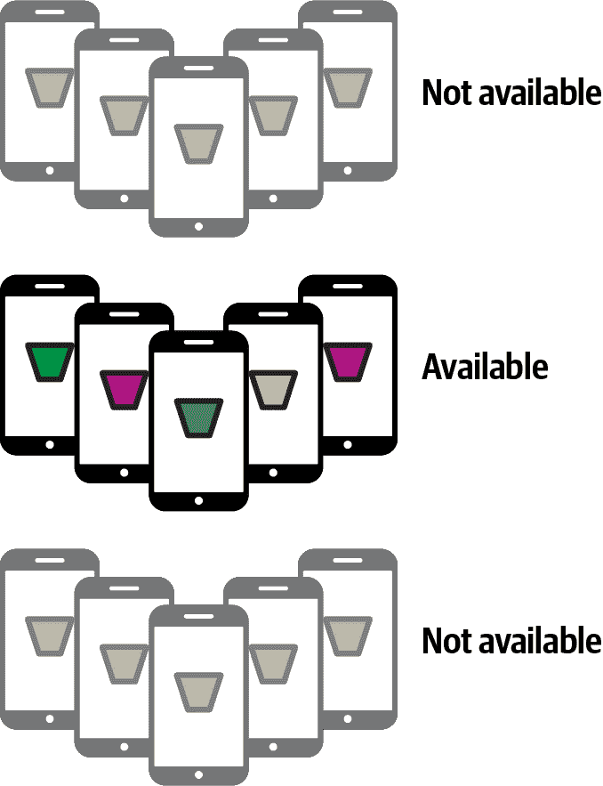

# 第二十章：AI 伦理、公平性与隐私

在本书中，您已经通过 TensorFlow 生态系统中提供的 API 接口进行了程序员的讲解，以训练多种任务的模型并将这些模型部署到多个不同的平台上。正是这种*训练*模型的方法，使用标记数据而不是显式编程逻辑，这是机器学习以及人工智能革命的核心。

在 第一章 中，我们将这对程序员所涉及的变化概括成了一个图表，如 图 20-1 所示。


###### 图 20-1. 传统编程与机器学习对比

这带来了一个新的挑战。使用源代码，可以通过逐步执行和探索代码来检查系统的工作原理。但是，当您构建一个模型时，即使是一个简单的模型，其结果是一个包含模型内部学习参数的二进制文件。这些参数可以是权重、偏置、学习到的滤波器等。因此，它们可能非常晦涩，导致难以理解其作用和工作原理。

如果我们作为一个社会开始依赖训练模型来帮助我们进行计算任务，那么了解模型工作方式的透明度对我们非常重要——因此，作为 AI 工程师，了解以道德、公平和隐私为构建目标是非常重要的。有很多内容需要学习，以至于可以填满几本书，因此在本章中我们只是触及了皮毛，但我希望这能为您提供一个良好的入门，帮助您了解所需知识。

最重要的是，以用户公平为目标构建系统并不是一件新事情，也不是虚伪的表现或政治正确。无论任何人对工程整体公平性重要性的感受如何，这一章的一个不可争议的事实是：从工程角度来看，构建既 *公平* 又 *道德* 的系统是正确的做法，并将帮助您避免未来的技术债务。

# 程序公平性

尽管最近机器学习和人工智能的进展使道德和公平的概念成为关注焦点，但需要注意的是，不平等和不公平在计算机系统中一直是关注的话题。在我的职业生涯中，我看到过许多例子，其中系统在设计某个场景时没有考虑到公平性和偏见的整体影响。

考虑这个例子：您的公司拥有客户数据库，并希望推出一项营销活动，以在已识别增长机会的特定邮政编码区域中更多地接触客户。为此，公司将向该邮政编码区域中已经连接但尚未购买任何产品的人员发送折扣券。您可以编写如下 SQL 来识别这些潜在客户：

```
`SELECT` * `from` Customers `WHERE` `ZIP`=target_zip `AND` `PURCHASES`=`0`
```

这看起来可能是非常合理的代码。但考虑一下该邮政编码的人口统计数据。如果那里的大多数居民是特定种族或年龄段的人，你可能会过度针对某个人群，或更糟糕的是，通过给某个种族提供折扣而对另一个种族不做任何优惠来进行歧视。随着时间的推移，持续这样的目标定位可能导致一个对社会人口统计数据不平衡的客户基础，最终将你的公司局限在主要服务于社会某个细分市场的境地。

这里还有一个例子——这件事真的发生在我身上！回到 第一章，我使用了几个表情符号来演示活动检测的机器学习概念（见 图 20-2）。


###### 图 20-2\. 表示机器学习的表情符号

这背后有一个故事，几年前开始。我有幸访问东京，当时我开始学习跑步。我在城市的一位好友邀请我绕着皇宫跑步。她发了一条带有几个表情符号的短信，看起来像是 图 20-3。


###### 图 20-3\. 包含表情符号的文本

文本包含两个表情符号，一个是跑步的女性，另一个是跑步的男性。我想回复并发送相同的表情符号，但是我使用的是桌面聊天应用程序，它没有现代的能力从列表中选择表情符号。如果你想要一个表情符号，你必须输入一个简码。

当我输入简码（running）时，我得到男性表情符号。但如果我想要女性表情符号，似乎没有办法做到。经过一番谷歌搜索，我发现可以通过输入 (running)+♀ 来获得女性表情符号。然后问题来了，如何输入 ♀？

这取决于操作系统，但例如在 Windows 上，你必须按住 Alt 键并在数字键盘上输入 12。在 Linux 上，你必须按下左 Ctrl-Shift-U，然后输入该符号的 Unicode 码，即 2640。

要获得女性表情符号需要这么多的工作，更不用说隐含声明一个女性表情符号是一个男性符号，通过添加 ♀ 来修改成女性。这不是包容性编程。但它是如何产生的呢？

考虑一下表情符号的历史。当它们首次使用时，它们只是文本中的字符，是侧面视图键入的，例如 :) 表示微笑或 ;) 表示眨眼，或者我个人最喜欢的 *:) ，看起来像 Sesame Street 中的 Ernie。它们本质上是无性别的，因为它们的分辨率很低。由于表情符号（或表情符号）从字符演变为图形，它们通常是单色的“小人”类型插图。名称中的线索就在这里——小*人。随着图形的改进，特别是在移动设备上，表情符号变得更加清晰。例如，在最初的 iPhone OS（2.2）中，跑步表情符号（重命名为“人物跑步”）看起来像这样：。

随着图形的进一步改进和屏幕像素密度的增加，表情符号继续演变，到 iOS 13.3 时看起来像图 20-4。


###### 图 20-4\. iOS 13.3 中的人物跑步表情符号

在工程方面，除了改进图形外，保持*向后兼容性*也非常重要——因此，如果您的软件的早期版本使用简码（running）来表示小人跑步，那么具有更丰富图形的后续版本可以为您提供这样一个图形，现在非常明显是一个男性在跑步。

考虑一下这在伪代码中会是什么样子：

```
if shortcode.contains("(running)"){
  showGraphic(personRunning)
}
```

这是良好设计的代码，因为它在图形变化时保持了向后兼容性。您永远不需要为新屏幕和新图形更新代码；您只需更改`personRunning`资源即可。但是对于您的最终用户来说，*效果*会发生变化，因此您随后确定您还需要有一个女性跑步表情符号以保持公平。

但是您不能使用相同的简码，也不想破坏向后兼容性，因此您必须修改您的代码，也许类似于这样：

```
if shortcode.contains("(running)"){
  if(shortcode.contains("+♀")){
 showGraphic(womanRunning);
 } else {
 showGraphic(personRunning);
 }
}
```

从编码的角度来看，这是有道理的。你可以提供额外的功能而不会破坏向后兼容性，而且很容易记住——如果你想要一个女性跑步者，你可以使用女性金星符号。但生活并不仅仅是从编码的角度来看，正如这个例子所示。这样的工程设计导致了运行时环境对大部分人口的使用案例增加了过多的摩擦。

从一开始，在创建表情符号时并未考虑到性别平等所产生的技术债务，直到今天仍然存在，像这样的解决方案仍然存在。查看 Emojipedia 上的[女性跑步页面](https://oreil.ly/o6O8g)，您会看到这个表情符号被定义为零宽连接器（ZWJ）序列，将人物跑步、ZWJ 和金星符号组合在一起。尝试为最终用户提供正确的女性跑步表情符号体验的唯一方法是实施解决方案。

幸运的是，现在许多提供表情符号的应用程序使用选择器，你可以从菜单中选择表情符号，而不是输入简码，这个问题已经在某种程度上隐藏起来。但它仍然潜藏在表面之下，虽然这个例子相当微不足道，但我希望它能展示出过去未考虑公平性或偏见的决策如何在后续产生影响。不要为了现在的利益牺牲你的未来！

因此，回到人工智能和机器学习。因为我们正处在应用类型新时代的黎明时期，对于你考虑应用程序使用的所有方面至关重要。你希望尽可能地确保公平性内置。你还希望尽可能避免偏见。这是正确的做法，可以帮助避免未来解决方案的技术债务。

# 机器学习中的公平性

机器学习系统是数据驱动的，而不是代码驱动的，因此识别偏见和其他问题区域成为理解你的数据的问题。需要工具来帮助你探索数据，看看它如何通过模型流动。即使你有优秀的数据，一个工程不良的系统也可能导致问题。以下是一些在构建机器学习系统时需要考虑的提示，可以帮助你避免这些问题：

确定机器学习是否真的必要

当新趋势冲击技术市场时，通常存在施加压力的情况来实施这些趋势。投资者、销售渠道或其他地方往往会推动你展示自己是前沿并使用最新最好的技术。因此，你可能被要求将机器学习整合到你的产品中。但如果这并非必要呢？如果为了满足这个非功能性需求，你却因为机器学习不适合这项任务，或者因为虽然它可能在未来有用，但你现在没有足够的数据覆盖率，而把自己逼入死胡同呢？

我曾参加过一个学生竞赛，参赛者挑战使用生成对抗网络（GANs）生成图像，根据脸部的上半部分预测下半部分的样子。那是在 COVID-19 之前的流感季节，许多人戴着口罩，体现了日本人的经典风度。他们的想法是看看是否能预测口罩下面的脸部。为此，他们需要访问面部数据，所以他们使用了带有年龄和性别标签的 IMDb 数据集中的[面部图像](https://oreil.ly/uUIV6)。问题在于？考虑到数据来源是 IMDb，这个数据集中绝大多数的面孔并不是日本人。因此，他们的模型在预测*我的*脸时表现出色，但对他们自己的脸却不够准确。在没有足够数据覆盖的情况下，匆忙推出机器学习解决方案会导致产生偏见的解决方案。这只是一个展示竞赛，他们的工作非常出色，但它也是一个很好的提醒：在没有真正需要的情况下或者没有足够的数据来构建适当的模型时，急于将机器学习产品推向市场，可能会导致建立偏见模型并承担未来严重的技术债务的风险。

从第一天起设计并实施度量标准。

或者说，从零开始，因为我们都是程序员。特别是，如果您正在修改或升级非机器学习系统以添加机器学习功能，则应尽可能跟踪当前系统的使用情况。考虑之前的表情符号故事作为一个例子。如果人们早早地意识到——因为女性跑步者和男性跑步者一样多——拥有一个男性跑步者表情符号是一个用户体验的错误，那么问题可能根本就不会出现。您应该始终尝试了解用户的需求，以便在为机器学习设计数据导向架构时，确保您有足够的覆盖范围来满足这些需求，并可能预测未来的趋势并超前应对。

构建一个最小可行模型并进行迭代。

在您设定任何部署机器学习模型到系统中的期望之前，您应该尝试构建一个最小可行模型*。机器学习和人工智能并非万能解决方案。在手头的数据基础上，构建一个能让您开始将机器学习应用到系统中的最小可行产品（MVP）。它能胜任工作吗？您有获取更多所需数据以扩展系统的路径吗？同时保持公平对待所有用户？一旦有了您的 MVP，进行迭代、原型设计，并继续测试，而不是仓促投入生产。

确保您的基础设施支持快速重新部署。

无论您将模型部署到使用 TensorFlow Serving 的服务器，使用 TensorFlow Lite 的移动设备，还是使用 TensorFlow.js 的浏览器中，都需要注意如何在需要时重新部署模型的能力。如果遇到失败的情况（不仅仅是偏见），能够快速部署新模型而不会影响到最终用户的体验是非常重要的。例如，使用 TensorFlow Serving 的配置文件允许您定义多个带有命名值的模型，以便快速在它们之间进行切换。对于 TensorFlow Lite，您的模型被部署为一个资产，因此不需要将其硬编码到应用程序中，您可以让应用程序检查互联网上是否有更新版本的模型，并在检测到更新时进行更新。此外，通过抽象运行推断的代码（例如避免硬编码的标签），可以帮助您避免重新部署时的回归错误。

# 公平性工具

有一个不断增长的工具市场，用于理解训练模型使用的数据、模型本身以及模型推断的输出。我们将在这里探讨一些当前可用的选项。

## 什么是工具？

我最喜欢的之一是来自 Google 的 What-If 工具。它的目标是让您无需编写大量代码即可检查 ML 模型。通过这个工具，您可以同时检查数据和模型对该数据的输出。它有一个[演示](https://oreil.ly/sRv23)，使用基于 1994 年美国人口普查数据集的约 30,000 条记录的模型进行训练，该模型旨在预测一个人的收入可能是多少。例如，想象一下，这被一家抵押贷款公司用来确定一个人是否有能力偿还贷款，从而决定是否授予他们贷款。

工具的一部分允许您选择一个推断值，并查看导致该推断的数据集中的数据点。例如，请参考图 20-5。

此模型返回一个从 0 到 1 的低收入概率，其中数值低于 0.5 表示高收入，高于 0.5 表示低收入。这位用户的得分为 0.528，在我们的假设抵押贷款申请场景中，可能因收入过低而被拒绝。通过这个工具，你实际上可以改变用户的一些数据，比如他们的年龄，然后看看推断结果会如何改变。在这个人的情况下，将他们的年龄从 42 岁改变到 48 岁，使得他们的得分跨过了 0.5 的门槛，结果从贷款申请的“拒绝”变成了“接受”。请注意，除了年龄之外，用户的任何其他信息都没有改变。这表明模型可能存在年龄偏见的强烈信号。

What-If 工具允许您尝试各种信号，包括性别、种族等详细信息。为了避免单一情况成为主导因素，导致您修改整个模型以防止一个客户问题，而非模型本身，该工具包含寻找最接近反事实的能力。也就是说，它找到一组最接近的数据，导致不同的推断，以便您开始深入研究数据（或模型架构），以查找偏见。


###### 图 20-5\. 使用 What-If 工具

我在这里只是触及了 What-If 工具可以做的一部分，但我强烈建议您去了解它。网站上有很多[示例](https://oreil.ly/NQPB6)，展示了您可以使用它做什么。正如其名称所示，它提供了在部署之前测试“假设”场景的工具。因此，我相信它可以成为您机器学习工具箱中的重要组成部分。

## Facets

[Facets](https://oreil.ly/g7fQM) 是一个可以通过可视化为您提供数据深入洞察的工具，可以补充 What-If 工具的作用。Facets 的目标是帮助您了解数据集中各个特征的值分布情况。如果您的数据分成多个子集用于训练、测试、验证或其他用途，这将特别有用。在这种情况下，您可能很容易陷入一个数据集中某个分割对某个特定特征偏向的情况，导致您拥有一个有缺陷的模型。该工具可以帮助您确定每个分割中每个特征是否有足够的覆盖度。

例如，使用与上一个示例中相同的美国人口普查数据集和 What-If 工具进行简单检查显示，训练/测试分割非常好，但使用资本收益和资本损失特征可能会对训练产生偏倚影响。请参见图 20-6，当检查分位数时，大交叉点在除这两个特征外的所有特征上非常平衡。这表明这些值的大多数数据点为零，但数据集中有一些值明显较高。在资本收益的情况下，您可以看到训练集的 91.67% 为零，其余值接近 100,000。这可能会导致您的训练产生偏差，并可视为调试信号。这可能会导致您的人口中的一小部分产生偏向性。


###### 图 20-6\. 使用 Facets 探索数据集

Facets 还包括一种称为 Facets Dive 的工具，可让您根据多个轴可视化数据集的内容。它可以帮助识别数据集中的错误，甚至是现有的偏见，以便您知道如何处理它们。例如，请参见图 20-7，在此图中，我按目标、教育水平和性别拆分数据集。


###### 图 20-7\. 使用 Facets 进行深入分析

红色表示“预测高收入”，从左到右是教育水平。在几乎所有情况下，男性有高收入的概率都大于女性，特别是在较高的教育水平下，这种对比变得非常明显。例如看看 13-14 列（相当于学士学位）：数据显示男性高收入者的比例远高于同等教育水平的女性。虽然模型中还有许多其他因素来决定收入水平，但在高度受教育的人群中出现这样的差异很可能是模型中偏见的指标。

为了帮助您识别这些功能，以及使用 What-If 工具，我强烈建议使用 Facets 来探索您的数据和模型输出。

这两个工具都来自 Google 的 People + AI Research（PAIR）团队。我建议您收藏[他们的网站](https://oreil.ly/Asc1P)以获取最新发布的信息，以及[People + AI Guidebook](https://oreil.ly/0k_jn)来帮助您遵循以人为本的 AI 方法。

# 联邦学习

当您的模型部署并分发后，它们有巨大的机会在基于整个用户群体使用情况的基础上持续改进。例如，具有预测文本的设备键盘必须从每个用户那里学习以提高效果。但是有一个问题——为了模型学习，需要收集数据，而未经用户同意收集数据来训练模型，尤其是这种涉及到隐私的行为可能会是一种巨大的侵犯。并不是每个用户输入的每个字都应该被用来改进键盘预测，因为那样每封电子邮件、每条短信的内容都会被外部第三方知晓。因此，为了实现这种学习方式，需要采用一种技术来保护用户隐私，同时分享数据的有价值部分。这通常被称为*联邦学习*，我们将在本节中探讨它。

联邦学习的核心思想是用户数据*永远*不会发送到中央服务器。而是使用像以下各节中概述的过程。

## -   步骤 1\. 确定可用于训练的设备

首先，您需要确定一组适合进行训练工作的用户。考虑对用户进行设备上训练的影响至关重要。要确定设备是否可用，请权衡诸如设备是否已在使用中或是否已连接电源等因素（参见图 20-8）。



###### 图 20-8\. 识别可用设备

## -   步骤 2\. 确定适合用于训练的设备

其中一些设备可能不太适合。它们可能没有足够的数据，可能最近没有使用过等等。基于您的训练标准，可能有多个因素会决定适合性。基于这些因素，您将不得不将可用设备过滤成一组*适合的*可用设备（参见图 20-9）。


###### 图 20-9\. 选择适合的可用设备

## 步骤 3\. 将可训练模型部署到您的训练集

现在，您已经确定了一组适合的可用设备，可以将模型部署到这些设备上（参见图 20-10）。模型将在设备上进行训练，这就是为什么那些当前未被使用且已插入（以避免电池耗尽）的设备是合适的选择家庭使用的原因。*请注意，目前没有公共 API 可以在 TensorFlow 中进行设备端训练。* 您可以在 Colab 中测试这个环境，但在撰写本文时还没有 Android/iOS 的等效方案。


###### 图 20-10\. 将新的训练模型部署到设备

## 步骤 4\. 将训练结果返回给服务器

请注意，在个体设备上训练模型所使用的*数据*永远不会离开该设备。但是，模型学习到的权重、偏差和其他参数可以离开设备。可以在此添加另一层安全性和隐私性（详见“使用联邦学习进行安全聚合”）。在这种情况下，每个设备学习到的值可以传递给服务器，服务器随后可以将它们聚合回主模型，有效地创建一个具有每个客户端分布式学习的新版本模型（参见图 20-11）。


###### 图 20-11\. 从客户学习中创建新的主模型

## 步骤 5\. 将新的主模型部署到客户端

然后，随着客户端可用于接收新的主模型，它可以被部署到它们，以便每个人都可以访问新功能（参见图 20-12）。

遵循这种模式将使您拥有一个概念框架，在这个框架中，您可以从所有用户的经验中训练一个集中模型，而不会通过将数据发送到您的服务器来侵犯他们的隐私。相反，训练的一个子集直接在他们的设备上完成，并且该训练的*结果*是离开设备的唯一内容。接下来描述的方法称为*安全聚合*，可以通过混淆提供额外的隐私保护层。


###### 图 20-12\. 新的主模型部署到所有客户端

## 使用联邦学习进行安全聚合

先前的步骤演示了联邦学习的概念框架。这可以与安全聚合的概念结合起来，以在从客户端到服务器的传输过程中进一步混淆学习到的权重和偏差。其背后的想法很简单。服务器将设备配对到另一个设备组成伙伴系统。例如，考虑 图 20-13，其中有多个设备，每个设备都有两个伙伴。每对伙伴都会接收相同的随机值，用作混淆其发送的数据的乘数。


###### 图 20-13\. 伙伴设备

在这里，第一个设备与第二个设备配对，由暗色三角形指示。这些数值在合并时会互相抵消：所以，暗色的“向下”三角形可能是 2.0，而暗色的“向上”可能是 0.5。当它们相乘时，结果为 1。类似地，第一个设备与第三个设备配对。每个设备都有两个“伙伴”，设备上的数字与另一设备上的对应。

特定设备的数据，由 图 20-14 中的圆圈表示，可以在发送到服务器之前与随机因子结合。


###### 图 20-14\. 使用安全聚合将数值发送到服务器

服务器了解发送给伙伴的数值后，可以取消这些数值，只获取有效载荷。数据在传输到服务器时，会被密钥混淆。

## 使用 TensorFlow Federated 进行联邦学习

[TensorFlow Federated (TFF)](https://oreil.ly/dLgJu) 是一个开源框架，在模拟服务器环境中提供联邦学习功能。在撰写本文时，它仍处于实验阶段，但值得关注。TFF 设计有两个核心 API。第一个是联邦学习 API，为您的现有模型添加了联邦学习和评估功能的一组接口。例如，它允许您定义受分布式客户端学习值影响的分布式变量。第二个是联邦核心 API，在功能编程环境中实现了联邦通信操作。它是如 Google 键盘 [Gboard](https://arxiv.org/pdf/1811.03604.pdf) 等现有部署方案的基础。

我不会在本章详细介绍如何使用 TFF，因为它仍处于早期阶段，但我鼓励您查看它，以便为设备上的联邦学习库成熟的那一天做好准备！

# 谷歌的 AI 原则

TensorFlow 是由谷歌工程师基于公司产品和内部系统中的许多现有项目开发的。在其开源后，发现了许多机器学习新路径，并且在机器学习和人工智能领域的创新速度惊人。考虑到这一点，谷歌决定发布一份[公开声明](https://ai.google/principles)，概述其关于如何创建和使用人工智能的原则。这些原则是负责任采纳的良好指导方针，值得探索。总之，这些原则包括：

对社会有益

人工智能的进步是变革性的，随着这种变化的发生，目标是考虑所有社会和经济因素，仅在总体上可能的好处超过可预见的风险和不利因素时才进行推进。

避免创建或强化不公平的偏见

如本章讨论的那样，偏见可以轻易地渗入任何系统。人工智能——特别是在它转变行业的情况下——为消除现有偏见提供了机会，同时确保不会产生新的偏见。应当谨记这一点。

为安全性而建立和测试

谷歌继续发展强大的安全与保障实践，以避免人工智能带来的意外伤害。这包括在受限环境中开发人工智能技术，并在部署后持续监控其运行。

对人负责

目标是构建受适当人类指导和控制的人工智能系统。这意味着必须始终提供适当的反馈、申诉和相关解释的机会。支持这一点的工具将是生态系统中至关重要的一部分。

纳入隐私设计原则

人工智能系统必须纳入确保充分隐私和告知用户其数据使用方式的保障措施。应当明确提供通知和同意的机会。

维护高科学卓越标准

当技术创新在科学严谨性和对开放探讨与协作的承诺下进行时，其表现最佳。如果人工智能要帮助揭示关键科学领域的知识，它应当努力达到这些领域期望的科学卓越标准。

提供符合这些原则的用途

尽管这一点可能显得有些元信息，但重要的是强调这些原则并不孤立存在，也不仅仅适用于构建系统的人员。它们也旨在为您构建的系统如何被使用提供指导。意识到某人可能以您未曾预期的方式使用您的系统是件好事，因此为您的用户设立一套原则也是非常必要的！

# 摘要

最后，这本书就要告一段落了。对我来说，写作过程是一段令人惊奇而有趣的旅程，希望你在阅读中找到了价值！你已经走过了漫长的路程，从机器学习的“Hello World”开始，逐步构建了你的第一个计算机视觉、自然语言处理和序列建模系统等等。你已经在从移动设备到网络和浏览器的各个地方部署模型，并且在本章中，我们通过一瞥了解了如何以一种审慎和有益的方式使用你的模型，以及为什么要这样做。你看到了偏见在计算中是一个问题，尤其在人工智能中可能是一个巨大的问题，但同时也看到了现在是一个机会，因为这个领域正处于起步阶段，我们有机会尽可能地在前沿消除这些问题。我们探讨了一些可用的工具来帮助你完成这一任务，并且你对联邦学习有了初步了解，以及它如何可能成为移动应用开发的未来。

非常感谢你和我一起分享这段旅程！期待听到你的反馈，并尽我所能回答任何问题。
