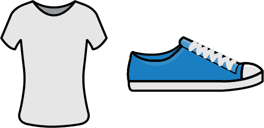
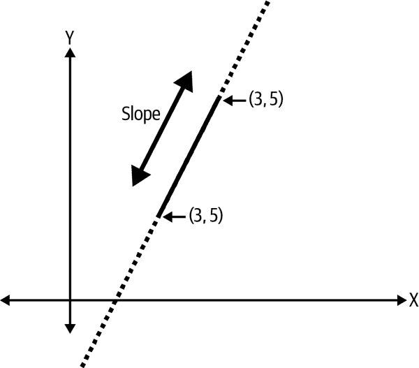
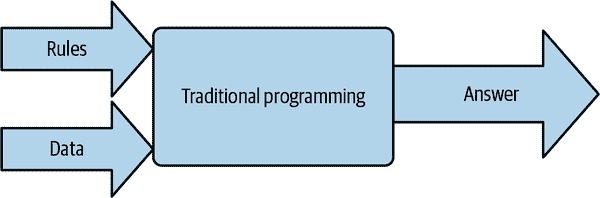
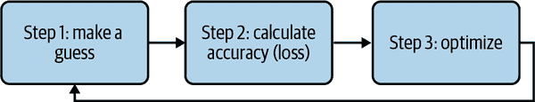
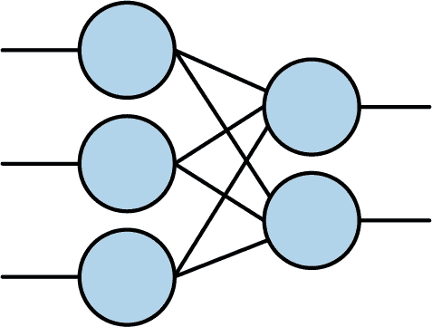
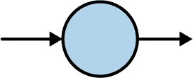
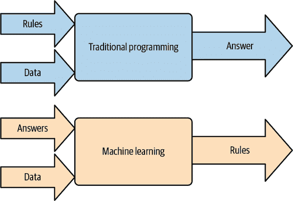

# 第一章：人工智能与机器学习简介

你可能拿起这本书是因为对人工智能（AI）、机器学习（ML）、深度学习以及所有承诺最新和最伟大突破的新技术感到好奇。欢迎！在本书中，我的目标是解释一些关于 AI 和 ML 如何运作的知识，以及如何利用 TensorFlow Lite、ML Kit 和 Core ML 等技术在你的移动应用中使用它们。我们会从本章开始，轻松地建立起我们在描述人工智能、机器学习、深度学习等时实际上*指的是*什么。

# 什么是人工智能？

根据我的经验，人工智能（AI）已经成为历史上最基本误解的技术之一。也许这个误解的原因在于其名称——人工智能唤起了*智能*的*人工*创造。也许它广泛在科幻小说和流行文化中使用的原因，AI 通常用来描述一个看起来和听起来像人类的机器人。我记得《星际迷航：下一代》中的 Data 角色就是人工智能的典范，他的故事引导他追求成为人类，因为他聪明且自我意识，但缺乏情感。像这样的故事和角色可能塑造了人工智能的讨论。其他如电影和书籍中的邪恶 AI 则导致了对 AI 潜在危险的恐惧。

鉴于 AI 经常被看作这些方式，很容易得出结论，它们定义了 AI。然而，这些都不是人工智能的实际定义或例子，至少在当今的术语中不是。它不是智能的人工创造——而是智能*外观*的人工创造。当你成为 AI 开发者时，你并不是在构建一个新的生命形式——你正在编写与传统代码不同的代码，它可以非常宽松地模拟智能对某事物的反应方式。这的一个常见例子是使用深度学习进行*计算机视觉*，在这里，你不是编写试图通过大量的 if...then 规则解析像素来理解图像内容的代码，而是可以通过“观察”大量样本来*学习*图像的内容是什么。

所以，例如，假设你想编写代码来区分一件 T 恤和一只鞋（图 1-1）。



###### 图 1-1\. 一件 T 恤和一只鞋

你会怎么做呢？嗯，你可能想要寻找特定的形状。T 恤上平行的明显垂直线，以及身体轮廓，是它是 T 恤的一个明显信号。靠近底部的粗横线，也就是鞋底，是它是鞋子的一个很好的指示。但是，要编写很多代码来检测这些特征。而且这只是一般情况下的情况——当然，对于非传统设计，比如开衫 T 恤，会有很多例外情况。

如果你要求一个智能生物在鞋子和 T 恤之间做选择，你会怎么做呢？假设它以前从未见过它们，你会向它展示许多鞋子的例子和许多 T 恤的例子，它会自己弄清楚什么让鞋子成为鞋子，什么让 T 恤成为 T 恤。你不需要给它很多*规则*来告诉它哪个是哪个。*人工*智能的工作方式与此类似。与其弄清楚所有这些规则并将它们输入计算机以区分它们，你向计算机展示大量 T 恤和鞋子的例子，它会自己弄清楚如何区分它们。

但计算机不会单独完成这项任务。它需要你编写的代码来完成。那些代码看起来和感觉起来与你通常编写的代码*非常*不同，而计算机用来学习区分的框架并不需要你自己来编写。已经有几个为此目的而存在的框架。在这本书中，你将学习如何使用其中之一，*TensorFlow*，来创建像我刚提到的那种应用程序！

TensorFlow 是一个端到端开源平台，用于机器学习。在本书中，你将广泛使用它的许多部分，从创建使用 ML 和深度学习的模型，到将它们转换为适合移动设备的格式并在 TensorFlow Lite 上执行，再到使用 TensorFlow-Serving 提供服务。它还支持诸如 ML Kit 之类的技术，提供许多常见模型作为*即插即用的场景*，并提供围绕移动场景设计的高级 API。

正如你在阅读本书时会看到的那样，AI 的技术并不特别新颖或激动人心。相对*新*的是，以及使当前 AI 技术爆发成为可能的是，增加的低成本计算能力，以及大量数据的可用性。拥有这两者对于使用机器学习构建系统至关重要。但为了演示这个概念，让我们从小处开始，这样更容易理解。

# 什么是机器学习？

在前述场景中，你可能注意到我提到过智能生物会查看大量 T 恤和鞋子的例子，并试图找出它们之间的区别，这样一来，它就*学会*了如何区分它们。它以前从未接触过这些，因此通过被*告知*这些是 T 恤和鞋子来获取了关于它们的新知识。有了这些信息，它就能继续学习新的东西。

在以同样的方式编写计算机程序时，术语*machine learning*被使用。与人工智能类似，这种术语可能会给人一种错误印象，即计算机是一个像人类一样学习的智能实体，通过学习、评估、理论化、测试，然后记忆。在非常表面的层面上，它确实如此，但它的工作方式比人类大脑的方式要平凡得多。

换句话说，机器学习可以简单地描述为让代码函数自行找出它们自己的参数，而不是由人类程序员提供这些参数。它们通过试验和错误来找出这些参数，并通过智能优化过程来减少总体错误，从而推动模型朝着更高的准确性和性能前进。

现在这有点啰嗦，所以让我们看看实际操作中是什么样子。

## 从传统编程转向机器学习

要详细了解机器学习编码与传统编码的核心区别，让我们通过一个例子来说明。

考虑描述一条线的函数。你可能还记得这个来自高中几何学的知识：

```
y = Wx + B
```

这说明了对于某物体是一条线，线上每个点 y 都可以通过将 x 乘以 W 值（权重）并加上 B 值（偏差）来推导得到。

（注意：人工智能文献往往非常数学化。如果你刚开始接触，这些可能显得有些多余。这是我在本书中使用的极少数数学示例之一！）

现在，假设你给出了这条线上的两个点，假设它们在 x = 2，y = 3 和 x = 3，y = 5。我们如何编写代码来找出描述连接这两点的线的 W 和 B 的值？

让我们从 W 开始，我们称之为权重，但在几何学中，它也被称为斜率（有时候也称为梯度）。参见图 1-2。



###### 图 1-2\. 可视化斜率的线段

计算它很容易：

```
W = (y2-y1)/(x2-x1)
```

因此，如果我们填写，我们可以看到斜率是：

```
W = (5-3)/(3-2) = (2)/(1) = 2
```

或者，在代码中，在这种情况下使用 Python：

```
def get_slope(p1, p2):
  W = (p2.y - p1.y) / (p2.x - p1.x)
  return W
```

这个函数有点奇怪。它很天真，因为它忽略了当两个 x 值相同时的除零情况，但现在就这样继续吧。

好的，所以我们现在已经找出了 W 值。为了得到线的函数，我们还需要找出 B 值。回到高中几何学，我们可以使用其中一个点作为例子。

所以，假设我们有：

```
y = Wx + B
```

我们还可以说：

```
B = y - Wx
```

我们知道当 x = 2，y = 3 时，W = 2，我们可以回填这个函数：

```
B = 3 - (2*2)
```

这导致我们得出 B 是 −1。

再次，在代码中，我们将写：

```
def get_bias(p1, W):
    B = p1.y - (W * p1.x)
    return B
```

因此，现在，为了确定在给定 x 的线上的任何点，我们可以很容易地说：

```
def get_y(x, W, B):
  y = (W*x) + B
  return y
```

或者，对于完整的列表：

```
def get_slope(p1, p2):
    W = (p2.y - p1.y) / (p2.x - p1.x)
    return W

def get_bias(p1, W):
    B = p1.y - (W * p1.x)
    return B

def get_y(x, W, B):
    y = W*x + B

p1 = Point(2, 3)
p2 = Point(3, 5)

W = get_slope(p1, p2)
B = get_bias(p1, W)

# Now you can get any y for any x by saying:
x = 10
y = get_y(x, W, B)
```

从这些中，我们可以看到当 x 是 10 时，y 将是 19。

你刚刚经历了一个典型的编程任务。您有一个问题需要解决，而您可以通过弄清楚 *规则* 并将其表达为代码来解决问题。在给定两个点时，有一个 *规则* 可以计算出 W，然后您创建了该代码。然后，一旦您弄清楚了 W，再使用 W 和一个单一点来计算 B 时，会产生另一个规则。然后，一旦您有了 W 和 B，您可以编写另一个规则，根据 W、B 和给定的 x 计算 y。

这就是传统编程，现在常常被称为基于规则的编程。我喜欢在 图 1-3 中总结这一点的图解。



###### 图 1-3\. 传统编程

在其最高层次上，传统编程涉及创建作用于 *数据* 的 *规则* 并为我们提供 *答案*。在前面的场景中，我们有了数据——线上的两个点。然后，我们找出了作用于这些数据以找出该线方程的规则。然后，给定这些规则，我们可以获得新数据项的答案，以便我们可以，例如，绘制那条线。

在这种情况下，程序员的核心工作是 *找出规则*。这是您为任何问题带来的价值—将其分解为定义它的规则，然后用编程语言表达这些规则。

但您可能无法轻易表达这些规则。考虑之前的场景，当我们想要区分 T 恤和鞋子时。人们并非总能想出其规则，然后将这些规则表达为代码。这就是机器学习可以帮助的地方，但在我们进入计算机视觉任务的机器学习之前，让我们考虑机器学习如何用于计算这条线的方程，如我们之前拟定的那样。

## 机器如何学习？

鉴于前面的情景，您作为程序员找出组成线的规则，计算机实现了这些规则，现在让我们看看机器学习方法将会有何不同。

让我们从理解机器学习代码的结构开始。虽然这在很大程度上是一个“Hello World”问题，但代码的整体结构非常类似于您在更复杂的问题中看到的代码。

我喜欢绘制一个高级架构，概述使用机器学习来解决这样的问题。记住，在这种情况下，我们会有 x 和 y 值，所以我们想要弄清楚 W 和 B，以便有一条线性方程；一旦我们有了这个方程式，我们就可以根据 x 来获取新的 y 值。

### 步骤 1：猜测答案

是的，你没看错。首先，我们不知道答案可能是什么，所以一个猜测与其他任何答案一样好。在实际情况下，这意味着我们将为 W 和 B 选择随机值。稍后我们会以更多的智能回到这一步，所以后续值不会是随机的，但我们将从纯粹的随机开始。因此，例如，让我们假设我们的第一个“猜测”是 W = 10 和 B = 5。

### 步骤 2: 测量我们猜测的准确性

现在我们有了 W 和 B 的值，我们可以将它们用在我们已知的数据上，看看我们的猜测有多好或多坏。因此，我们可以使用 y = 10x + 5 来计算每个 x 值的 y，将这个 y 与“正确”值进行比较，并据此推断我们的猜测有多好或多坏。显然，在这种情况下，我们的猜测非常糟糕，因为我们的数字会大大偏离。稍后我们会详细介绍这一点，但现在我们意识到我们的猜测非常糟糕，并且我们有一个衡量指标。这通常被称为*损失*。

### 步骤 3: 优化我们的猜测

现在我们有了一个猜测，并且我们对该猜测结果（或损失）有了了解，这些信息可以帮助我们创建一个新的、更好的猜测。这个过程称为*优化*。如果你以前看过任何涉及到 AI 编码或训练的内容，而且涉及数学较多，那么很可能你正在看优化过程。在这里，使用一种称为*梯度下降*的高级微积分过程可以帮助我们进行更好的猜测。虽然我在这里不会详细讨论这些内容，而且了解优化工作原理是一个有用的技能，但事实上，像 TensorFlow 这样的框架已经为你实现了它们，所以你可以直接使用它们。随着时间的推移，你可以深入研究这些内容，以便为更复杂的模型调整它们的学习行为。但是现在，你可以放心地使用内置优化器。完成这一步后，你只需返回步骤 1。重复这个过程，从定义上来说，帮助我们随着时间和许多循环，找出参数 W 和 B。

这就是为什么这个过程被称为*机器学习*。随着时间的推移，通过做出猜测，找出该猜测有多好或多坏，根据这些情报优化下一个猜测，然后重复这个过程，计算机将“学习”参数 W 和 B（或其他任何东西），然后，它将*找出*构成我们线条的规则。从视觉上看，这可能看起来像图 1-4。



###### 图 1-4\. 机器学习算法

### 在代码中实现机器学习

这是很多描述，也是很多理论。现在让我们看看这在代码中的样子，这样你就可以亲自看到它运行了。这段代码一开始可能对你来说有些陌生，但随着时间的推移，你会掌握它的。我喜欢把这称为机器学习的“Hello World”，因为你使用一个非常基础的神经网络（稍后我会解释一下）来“学习”给定线上几个点时的参数 W 和 B。

这是代码（此代码示例的完整笔记本可在本书的 GitHub 中找到）：

```
model = Sequential(Dense(units=1, input_shape=[1]))
model.compile(optimizer='sgd', loss='mean_squared_error')

xs = np.array([-1.0, 0.0, 1.0, 2.0, 3.0, 4.0], dtype=float)
ys = np.array([-3.0, -1.0, 1.0, 3.0, 5.0, 7.0], dtype=float)

model.fit(xs, ys, epochs=500)

print(model.predict([10.0]))
```

###### 注意

这是使用 TensorFlow Keras API 编写的。Keras 是一个开源框架，旨在通过高级 API 使模型的定义和训练更加容易。它在 2019 年与 TensorFlow 2.0 的发布中与 TensorFlow 紧密集成。

让我们逐行探讨一下。

首先是*模型*的概念。在创建关于数据细节的代码时，我们通常使用术语“模型”来定义结果对象。在这种情况下，模型大致相当于之前编码示例中的`get_y()`函数。这里不同的是，模型不需要自己提供 W 和 B。它将根据给定的数据自行计算它们，因此你只需向它询问 y 并给它一个 x，它就会给出它的答案。

因此，我们的第一行代码看起来像这样——它正在定义模型：

```
model = Sequential(Dense(units=1, input_shape=[1]))
```

但是剩下的代码是什么呢？好吧，让我们从单词`Dense`开始，你可以在第一组括号内看到它。你可能已经看过类似于图 1-5 的神经网络的图片。



###### 图 1-5\. 基础神经网络

你可能会注意到，在图 1-5 中，左侧的每个圆圈（或神经元）都连接到右侧的每个神经元。每个神经元都以密集的方式连接到每个其他神经元。因此得名为`Dense`。此外，左侧有三个堆叠的神经元，右侧有两个堆叠的神经元，这些形成了序列中非常明显的“层”，其中第一“层”有三个神经元，第二“层”有两个神经元。

所以让我们回到代码中：

```
model = Sequential(Dense(units=1, input_shape=[1]))
```

这段代码表示我们想要一系列的层（`Sequential`），在括号内，我们将定义这些层的序列。序列中的第一个将是`Dense`，指示一个像图 1-5 中的神经网络。没有定义其他层，因此我们的`Sequential`只有一层。这一层只有一个单元，由`units=1`参数表示，该单元的输入形状只是一个单一的值。

因此，我们的神经网络看起来像图 1-6。



###### 图 1-6\. 最简单的可能神经网络

这就是为什么我喜欢称之为神经网络的“Hello World”。它只有一个层，该层只有一个神经元。就是这样。因此，通过这行代码，我们已经定义了我们的模型架构。让我们继续下一行：

```
model.compile(optimizer='sgd', loss='mean_squared_error')
```

这里我们在指定*内置*函数来计算损失（记住第 2 步，我们想看看我们的猜测有多好或多坏）和优化器（第 3 步，我们生成一个新的猜测），以便我们可以改进神经元内 W 和 B 的参数。

在这种情况下，`'sgd'`代表“随机梯度下降”，这超出了本书的范围；总之，它使用微积分和均方误差损失来找出如何最小化损失，一旦损失被最小化，我们应该有准确的参数。

接下来，让我们定义我们的数据。两个点可能不足以，所以我扩展到六个点作为示例：

```
xs = np.array([-1.0, 0.0, 1.0, 2.0, 3.0, 4.0], dtype=float)
ys = np.array([-3.0, -1.0, 1.0, 3.0, 5.0, 7.0], dtype=float)
```

`np`代表“NumPy”，这是一个在数据科学和机器学习中常用的 Python 库，使数据处理非常简单。你可以在[*https://numpy.org*](https://numpy.org)了解更多关于 NumPy 的信息。

我们将创建一个 x 值及其对应的 y 值的数组，这样当 x = −1 时，y 将为−3；当 x 为 0 时，y 为−1，依此类推。快速检查显示，你可以看到 y = 2x − 1 在这些值上成立。

接下来让我们执行之前提到的循环 —— 进行猜测，测量那个损失值有多好或多坏，优化以获得新的猜测，并重复。在 TensorFlow 术语中，这通常被称为*拟合* —— 即我们有 x 和 y，我们想要将 x 拟合到 y，或者换句话说，找出给定 x 时正确 y 的规则，使用我们拥有的示例。`epochs=500`参数简单地表示我们将重复这个循环 500 次：

```
model.fit(xs, ys, epochs=500)
```

当你运行像这样的代码（如果你对此不太熟悉，稍后在本章中你会看到如何做到这一点），你将看到如下输出：

```
Epoch 1/500
1/1 [==============================] - 0s 1ms/step - loss: 32.4543
Epoch 2/500
1/1 [==============================] - 0s 1ms/step - loss: 25.8570
Epoch 3/500
1/1 [==============================] - 0s 1ms/step - loss: 20.6599
Epoch 4/500
1/1 [==============================] - 0s 2ms/step - loss: 16.5646
Epoch 5/500
1/1 [==============================] - 0s 1ms/step - loss: 13.3362
```

注意`loss`值。单位并不重要，但重要的是它在变小。记住，损失越低，模型表现越好，其答案也会越接近你的预期。所以第一次猜测的损失为 32.4543，但到第五次猜测时，这个值已降至 13.3362。

如果我们然后查看我们 500 次中的最后 5 个周期，并探索损失：

```
Epoch 496/500
1/1 [==============================] - 0s 916us/step - loss: 5.7985e-05
Epoch 497/500
1/1 [==============================] - 0s 1ms/step - loss: 5.6793e-05
Epoch 498/500
1/1 [==============================] - 0s 2ms/step - loss: 5.5626e-05
Epoch 499/500
1/1 [==============================] - 0s 1ms/step - loss: 5.4484e-05
Epoch 500/500
1/1 [==============================] - 0s 4ms/step - loss: 5.3364e-05
```

它小了很多，大约是 5.3 x 10^(-5)的量级。

这表明神经元找出的 W 和 B 的值只有微小的差异。虽然不是零，所以我们不应期望得到确切的正确答案。例如，假设我们给它 x = 10，如下所示：

```
print(model.predict([10.0]))
```

答案不会是 19，而是一个非常接近 19 的值，通常大约是 18.98。为什么？原因有两个。首先，像这样的神经网络处理概率而不是确定性，所以它找出的 W 和 B 是高度可能正确但可能不是 100%准确的。第二个原因是我们只给了神经网络六个点。虽然这六个点*是*线性的，但这并不证明我们可能预测的每个其他点都在这条线上。数据可能会偏离这条线……这种情况的概率非常低，但并非零。我们没有*告诉*计算机这是一条直线，我们只是要求它找出与 x 和 y 相匹配的规则，而它找到的看起来像是一条直线但并不能保证是一条直线。

当处理神经网络和机器学习时，有一点需要注意——你将会处理到这样的概率！

方法名称中也包含了我们模型的提示——请注意，我们没有要求它*计算* x = 10.0 时的 y，而是要*预测*它。在这种情况下，预测（通常称为推断）反映了模型将根据其所知来尝试确定值将会是什么，但它可能并不总是正确的。

## 比较机器学习与传统编程

回顾图 1-3，描述传统编程的方式是：你为给定的情景找出规则，将其表达为代码，让代码作用于数据，得出答案。机器学习非常类似，只是过程的某些部分是反向的。参见图 1-7。



###### 图 1-7\. 从传统编程到机器学习

机器学习的关键区别在于，你*不需要弄清楚规则*！相反，你提供答案和数据，机器会为你找出规则。在前面的例子中，我们为一些给定的 x 值（即数据）提供了正确的 y 值（即答案），计算机找出了适合将 x 映射到 y 的规则。我们没有进行任何几何、斜率计算、截距或类似的操作。机器找出了符合 x 和 y 的模式。

这是机器学习与传统编程的**核心**和**重要**区别，也是围绕机器学习所有兴奋的原因，因为它开辟了全新的应用场景。其中一个例子是计算机视觉——正如我们之前讨论的，尝试编写*规则*来区分 T 恤和鞋子之间的差异将会非常困难。但是让计算机找出如何匹配另一个使这种情景成为可能，并且从那里开始，更重要的场景——如解释 X 光或其他医学扫描图像，检测大气污染等——也变得可能。事实上，研究表明，在许多情况下，使用这些类型的算法和足够的数据已经使计算机在特定任务上与人类一样好，有时甚至更好。为了好玩，可以查看[这篇博文](https://oreil.ly/D2Ssu)，其中谷歌的研究人员使用预先诊断的视网膜图像对神经网络进行训练，并让计算机找出确定每种诊断的因素。随着时间的推移，计算机已经能够像最优秀的专家一样进行不同类型的糖尿病性视网膜病变的诊断！

# 在移动设备上构建和使用模型

在这里，您看到了一个非常简单的示例，展示了如何从基于规则的编程过渡到机器学习来解决问题。但是，如果您无法将其交付给用户，那么解决问题就没有多大用处了，而借助于在运行 Android 或 iOS 的移动设备上的 ML 模型，您将正好做到这一点！

这是一个复杂而多样的领域，在本书中，我们将通过多种不同的方法来为您简化这一过程。

例如，您可能已经有一个现成的解决方案，可以为您解决问题，而您只是想学习如何做到这一点。我们将覆盖像面部检测这样的场景，其中一个模型将为您检测图片中的面部，而您希望将其集成到您的应用程序中。

此外，还有许多场景不需要从头开始构建模型，设计架构并进行漫长而费力的训练。经常可以使用一种称为**迁移学习**的场景，这是您可以利用预先存在的模型的部分并重新利用它们的地方。例如，大型科技公司和顶尖大学的研究人员可以访问您可能无法访问的数据和计算能力，并已经利用这些来构建模型。他们与世界分享了这些模型，以便它们可以被重复使用和重新利用。您将在本书中广泛探讨这一点，从第二章开始。

当然，你可能还有需要从头开始构建自己模型的场景。这可以通过 TensorFlow 来完成，但我们在这里只是轻描淡写地提及一下，而是集中于移动场景。这本书的合作伙伴，《*面向编程人员的 AI 与机器学习*》，重点讲解这种场景，从基本原理开始教授你如何从零开始为各种情况构建模型。

# 摘要

在这一章中，你将会对人工智能和机器学习有所了解。希望这能帮助你剖析炒作，从程序员的角度看清楚这一切真正的本质，从而识别出 AI 和 ML 可以极其有用和强大的场景。你详细了解了机器学习的工作原理以及计算机如何通过“循环”学习如何将值彼此拟合，匹配模式并“学习”将它们组合在一起的规则。从那里开始，计算机可以有些智能地行动，这使我们得以借用“人工”智能这一术语。你还学习了与成为机器学习或人工智能程序员相关的术语，包括模型、预测、损失、优化、推断等等。

从第三章开始，你将会使用这些示例将机器学习模型实现到移动应用程序中。但首先，让我们探索构建一些更多模型的过程，看看这一切是如何运作的。在第二章中，我们将研究构建一些更复杂的计算机视觉模型！
