# 第二章：计算机视觉简介

虽然本书并非旨在教授你所有架构和训练机器学习模型的基础知识，但我确实想涵盖一些基本情景，以使本书仍然可以作为独立学习的一部分。如果你想了解更多有关使用 TensorFlow 创建模型的过程，请参考我的书籍，*AI and Machine Learning for Coders*，由 O'Reilly 出版，如果你想深入了解，Aurelien Geron 的优秀著作 [*Hands-on Machine Learning with Scikit-Learn, Keras, and TensorFlow*](https://www.oreilly.com/library/view/hands-on-machine-learning/9781492032632/)（O'Reilly）是必读的！

在本章中，我们将超越你在第一章中创建的非常基础的模型，并且探讨两种更复杂的模型，这些模型涉及计算机视觉——即计算机如何“看见”物体。类似于“人工智能”和“机器学习”这些术语，术语“计算机视觉”和“看见”可能会让人误解模型的基本运作方式。

计算机视觉是一个广阔的领域，针对本书和本章的目的，我们将狭义地专注于几个核心情景，在这些情景中，我们将使用技术来解析图像的内容，无论是标记图像的主要内容，还是在图像中找到物品。

这并不真正涉及“视觉”或“看见”，而更多地是使用结构化算法，允许计算机解析图像的像素。当计算机将单词解析为独立字符串时，它并不“理解”图像的含义！

如果我们试图使用传统的基于规则的方法来执行这个任务，即使对于最简单的图像，我们也会得到许多行代码。在这里，机器学习是一个关键角色；正如你将在本章中看到的那样，通过使用我们在第一章中的相同代码模式，但稍微深入一些，我们可以创建能够仅用几行代码解析图像内容的模型。所以让我们开始吧。

# 使用神经元进行视觉处理

在你在第一章编写的示例中，你看到了神经网络如何在给定线上某些点的示例时，“拟合”自身以符合线性方程的期望参数。从视觉上表示，我们的神经网络可以看起来像图 2-1。

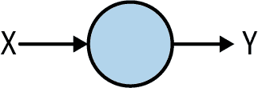

###### 图 2-1\. 使用神经网络将 X 拟合到 Y

这是可能的最简单的神经网络，只有一个层，该层只有一个神经元。

###### 注意

事实上，在创建该示例时我稍作作弊，因为密集层中的神经元本质上是线性的，它们学习一个权重和一个偏置，所以一个神经元足以表示线性方程！

但是当我们编写代码时，请回忆我们创建了一个`Sequential`，并且该`Sequential`包含一个`Dense`，就像这样：

```
model = Sequential(Dense(units=1))
```

如果我们希望拥有更多层，我们可以使用相同的代码模式；例如，如果我们想要表示像图 2-2 中的神经网络，这将非常容易实现。

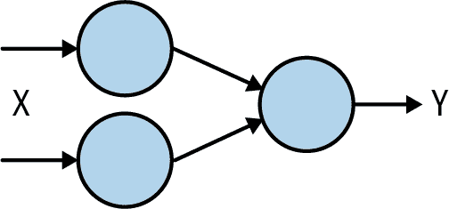

###### 图 2-2\. 稍微更高级的神经网络

首先，让我们考虑图 2-2 中的图表元素。每个垂直排列的神经元都应被视为一个*层*。图 2-3 向我们展示了该模型中的层。

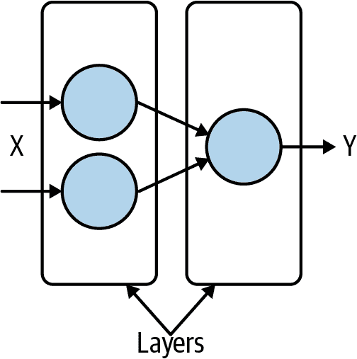

###### 图 2-3\. 神经网络中的层

要编写这些代码，我们只需将它们列在`Sequential`定义中，更新我们的代码如下：

```
model = Sequential(
            [Dense(units=2),
             Dense(units=1)])
```

我们只需将层定义为逗号分隔的列表，并将其放在`Sequential`中，如你所见，这里有一个包含两个单位的`Dense`，后跟一个包含一个单位的`Dense`，我们得到了图 2-3 中展示的架构。

但在这些情况下，我们的*输出*层只有一个单一值。输出处有一个神经元，鉴于该神经元只能学习一个权重和一个偏差，对于理解图像内容来说并不是很有用，因为即使是最简单的图像也包含了太多内容，无法仅通过单一值来表示。

那么，如果我们在输出上有*多个*神经元会怎么样？考虑一下图 2-4 中的模型。

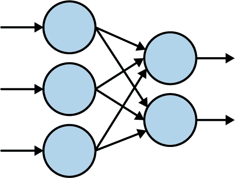

###### 图 2-4\. 具有多个输出的神经网络

现在我们有多个输入和多个输出。为了设计能够识别和解析图像内容的东西（你会回忆起，这就是我们定义计算机视觉的方式），如果我们将输出神经元分配给我们想要识别的类别会怎么样呢？

我们是什么意思呢？很像学习一门语言，你需要逐字逐句学习，所以在学习如何解析图像时，我们必须限制计算机能够“看到”的事物数量。因此，例如，如果我们想要从简单开始，并让计算机识别猫和狗之间的差异，我们可以创建这样一个包含两种图像类型（猫或狗）的“词汇表”，并为每个类型分配一个输出神经元。这里通常使用术语*类*，请不要与面向对象编程中的类概念混淆。

因为你要让模型识别的“类别”数量是固定的，所以通常使用的术语是*分类*或*图像分类*，你的模型也可能被称为*分类器*。

所以，要识别猫或狗，我们可以更新图 2-4，使其看起来像图 2-5。

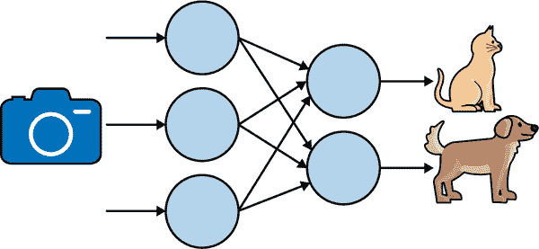

###### 图 2-5\. 更新以适应猫或狗

所以我们将一张图片输入神经网络，最后它有两个神经元。这些神经元将分别输出一个数字，我们希望这个数字表示网络认为它“看到”了一只狗或一只猫。这种方法可以扩展到其他类别，所以如果你想识别不同的动物，那么你只需添加表示它们类别的额外输出神经元。但让我们暂时只保持两个。

现在我们的问题变成了，如何表示我们的数据，以便计算机开始将我们的输入图像与我们期望的输出神经元匹配？

一种方法是使用称为 *one-hot encoding* 的东西。起初，这看起来有点繁琐和浪费，但当你理解其背后的概念以及它如何匹配神经网络架构时，它开始变得合理。这种编码背后的理念是拥有一个大小等于我们类别数的值数组。这个数组中的每个条目都是零，除了表示你想要的类别的那个条目，你将它设置为 1。

所以，例如，如果你看 图 2-5，有两个输出神经元——一个代表猫，一个代表狗。因此，如果我们想要表示“猫的样子”，我们可以表示为 [1,0]，类似地，如果我们想要表示“狗的样子”，我们可以编码为 [0,1]。此时，你可能会想到当你识别更多类别时，比如 1,000 个类别，每个数据标签都会有 999 个 0 和一个单独的 1，这看起来是多么浪费。

这绝对不是高效的，但在训练模型时，你只会暂时存储这样的数据图像，而在完成后你可以有效地丢弃它们。你的模型的输出层将有与此编码匹配的神经元，因此当你读取它们时，你会知道哪些代表哪个类别。

所以，如果我们更新我们的图表，从 图 2-5 这里更新了猫和狗的样式编码，然后如果我们输入一张猫的图像，我们希望输出看起来像这些编码，就像 图 2-6。

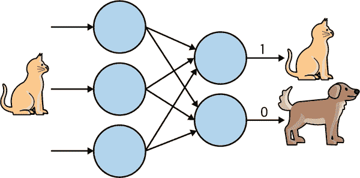

###### 图 2-6\. 使用 one-hot 编码标记一只猫

现在神经网络的行为符合我们的期望。我们输入一张猫的图片，输出神经元响应编码 [1,0] 表示它“看到”了一只猫。这为我们提供了可以用来训练网络的数据表示的基础。因此，例如，如果我们有一堆猫和狗的图像，并相应地标记这些图像，那么随着时间的推移，神经网络可能会“适应”这些输入内容和这些标签，使得未来的图像输出相同。

实际上，输出神经元会输出一个介于 0 和 1 之间的值，而这也恰好是一个*概率*值。因此，如果你用一个独热编码标签训练图像的神经网络，并输出每个类别一个神经元，你最终会得到一个能解析图像并返回它所能看到的东西概率列表的模型，就像图 2-7 一样。


###### 图 2-7\. 解析图像内容

在这里，你可以看到模型确定它正在看一只香蕉的概率为 98.82%，而看到格兰尼史密斯苹果或无花果的概率较小。虽然很明显这是一根香蕉，但当这款应用看图时，它正在从图像中提取特征，其中一些特征可能也存在于苹果中，比如皮肤质地或颜色。

因此，你可以想象，如果你想训练一个能看的模型，你需要大量的图像示例，并且这些图像需要按类别标记。幸运的是，有一些基本数据集限定了范围，使得学习变得简单，接下来我们将从头开始构建一个分类器。 

## 你的第一个分类器：识别衣物

作为我们的第一个例子，让我们考虑如何在图像中识别衣物。例如，考虑图 2-8 中的物品。


###### 图 2-8\. 衣物示例

这里展示了多种不同的衣物，你可以认出它们。你知道什么是衬衫，或者外套，或者裙子。但是如果要向从未见过衣物的人解释，你该如何描述鞋子？这张图里有两只鞋，但你要如何描述给别人听？这也是我们之前在第一章提到的基于规则的编程可能失败的另一个领域。有时候用规则来描述某些事物是不可行的。

当然，计算机视觉也不例外。但是想一想你是如何学会认识所有这些物品的——通过看大量不同的例子，并获得它们使用方式的经验。我们能否用同样的方式教会计算机？答案是肯定的，但有限制。让我们来看一个第一个示例，如何教计算机识别衣物，使用一个名为时尚 MNIST 的知名数据集。

## 数据：时尚 MNIST

用于学习和基准测试算法的基础数据集之一是由 Yann LeCun、Corinna Cortes 和 Christopher Burges 创建的 Modified National Institute of Standards and Technology（MNIST）数据库。该数据集包含了 70,000 张 0 到 9 的手写数字图像。这些图像是 28 × 28 的灰度图像。

[时尚 MNIST](https://oreil.ly/GmmUB)旨在成为 MNIST 的替代品，记录数、图像尺寸和类别数都与其相同——因此，与数字 0 到 9 的图像不同，时尚 MNIST 包含 10 种不同类型的服装图像。

您可以在 图 2-9 中看到数据集内容的示例。这里，每种服装类型都有三行。

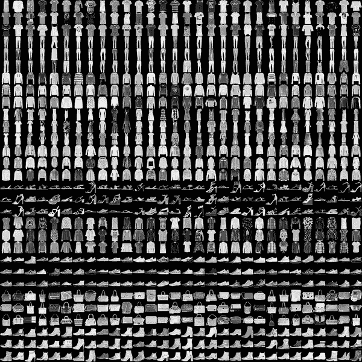

###### 图 2-9\. 探索时尚 MNIST 数据集

它包含了各种服装，包括衬衫、裤子、连衣裙和各种类型的鞋子！正如您可能注意到的那样，它是灰度的，因此每张图片由一定数量的像素组成，其值在 0 到 255 之间。这使得数据集更容易管理。

您可以在 图 2-10 中看到数据集中特定图像的放大视图。

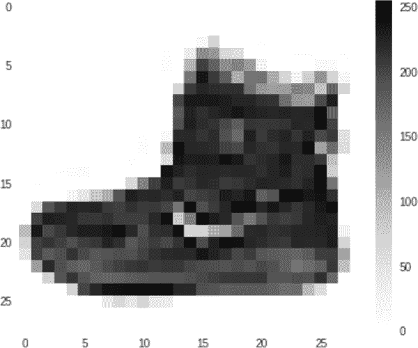

###### 图 2-10\. 时尚 MNIST 数据集中图像的放大视图

就像任何图像一样，它是一个矩形像素网格。在这种情况下，网格尺寸为 28 × 28，每个像素只是介于 0 到 255 之间的值，如前所述。

## 用于解析时尚 MNIST 的模型架构

现在让我们看看如何将这些像素值与先前看到的计算机视觉架构结合使用。

您可以在 图 2-11 中看到这一表示。请注意，时尚 MNIST 中有 10 类服装，因此我们需要一个包含 10 个神经元的输出层。请注意，为了更容易适应页面，我已经旋转了架构，使得 10 个神经元的输出层位于底部，而不是右侧。

“上面”的神经元数量，当前设置为 20 以适应页面，可能会随着您编写代码而改变。但是，我们的想法是将图像的像素馈送到这些神经元中。

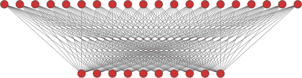

###### 图 2-11\. 用于识别时尚图像的神经网络架构

鉴于我们的图像是矩形的，尺寸为 28 × 28 像素，我们需要以与图层中神经元表示方式相同的方式来表示它，即一维数组，因此我们可以遵循所谓的“展平”图像的过程，这样它就变成了 784 × 1 的数组。然后它与输入神经元具有类似的“形状”，因此我们可以开始将其馈送进去。参见 图 2-12。请注意，由于来自 图 2-10 的踝靴图像在时尚 MNIST 中是类别“9”，我们还将通过说这是应该点亮的神经元来进行训练。我们从 0 开始计数，因此类别 9 的神经元是 图 2-12 中最右侧的第 10 个。现在，“Dense”这个层类型的术语之所以得到这个名称，应该更加直观了！

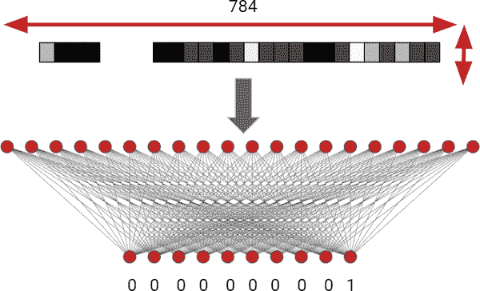

###### 图 2-12\. 使用时尚 MNIST 训练神经网络

鉴于训练集中有 60,000 张图像，在 第 1 章 中提到的训练循环将会发生。首先，网络中的每个神经元将被随机初始化。然后，对于这 60,000 个带标签的图像中的每一个，将进行分类。这次分类的准确性和损失将帮助优化器调整神经元的值，然后我们再次尝试，依此类推。随着时间的推移，神经元内部的权重和偏置将被调整以匹配训练数据。现在让我们在代码中来探索这一点。

## 编码时尚 MNIST 模型

先前描述的模型架构在这里展示：

```
model = Sequential(
    [Flatten(input_shape=(28,28)),
     Dense(20, activation=tf.nn.relu),
     Dense(10, activation=tf.nn.softmax)])
```

就是这么简单！这里有一些新概念，让我们来探索一下。

首先，我们可以看到我们使用了 `Sequential`。回想一下，这允许我们使用列表定义网络中的层。列表中的每个元素定义了一个层类型（在本例中是一个 `Flatten`，后跟两个 `Dense` 层），以及关于层的细节，如神经元数量和激活函数。

第一层是：

```
Flatten(input_shape=(28,28))
```

这展示了层的部分功能——你不仅可以使用它们定义模型架构，还可以将功能封装在层内。因此，这里你的输入形状从 28 × 28 扁平化为 784 × 1，以便输入到神经网络中。

在此之后，你有两个层，正如我们在 图 2-12 中展示的，一个具有 20 个神经元的 `Dense` 层，以及另一个具有 10 个神经元的 `Dense` 层。

但这里也有一些新东西——`activation` 参数。这定义了一个激活函数，它在处理层的末尾执行。激活函数可以帮助网络识别更复杂的模式，并改变信息在层与层之间流动的行为，有助于网络更好地学习和更快地学习。

它们是可选的，但它们非常有用，通常建议使用。

在 20 个神经元的层上，激活函数是 `tf.nn.relu`，其中 *relu* 代表“修正线性单元”。这是一个相当花哨的术语，实际上等同于——如果值小于零，则将其设置为零；否则保持不变。有点像：

```
if val<0:
   return 0
else:
   return val
```

它如何帮助的是，如果任何一个层中的神经元返回一个 *负* 值，那可能会取消另一个神经元的 *正* 值，从而忽略它所学到的内容。因此，我们在每次迭代中不需要对每个神经元进行大量检查，而是在层上简单地使用激活函数来执行。

同样，输出层具有一个称为`softmax`的激活函数。这里的想法是，我们的输出层有 10 个神经元。理想情况下，它们应该全部为零，除了其中一个神经元为 1，表示我们的类别。实际情况很少发生，每个神经元都会有一个值。最大的那个值将是我们输入图像分类的最佳候选项。然而，为了报告一个*概率*，我们希望每个神经元的值加起来为 1，并且它们的值应该经过适当的缩放。我们可以简单地在层上应用`softmax`激活函数来处理这些，而不需要编写处理代码！

这只是模型架构。现在让我们来探索完整的代码，包括获取数据、编译模型，然后进行训练：

```
import tensorflow as tf

data = tf.keras.datasets.mnist
(training_images, training_labels), (val_images, val_labels) = data.load_data()

training_images  = training_images / 255.0
val_images = val_images / 255.0

model = tf.keras.models.Sequential(
            [tf.keras.layers.Flatten(input_shape=(28,28)),
            tf.keras.layers.Dense(20, activation=tf.nn.relu),
            tf.keras.layers.Dense(10, activation=tf.nn.softmax)])

model.compile(optimizer='adam',
              loss='sparse_categorical_crossentropy',
              metrics=['accuracy'])

model.fit(training_images, training_labels, epochs=20)
```

还记得之前我提到过传统编码解析图像内容的方式吗，即使是像 Fashion MNIST 这样简单的图像，也可能需要成千上万行代码来处理，但机器学习只需要几行代码就可以完成？好了，这里它们就是！

首先要获取数据。Fashion MNIST 数据集已经集成在 TensorFlow 中，所以我们可以这样轻松地获取它：

```
data = tf.keras.datasets.fashion_mnist
(training_images, training_labels), (val_images, val_labels) = data.load_data()
```

执行完这行代码后，`training_images`将包含我们的 60,000 个训练图像，`training_labels`将包含它们对应的标签。此外，`val_images`和`val_labels`将包含 10,000 个图像及其对应的标签。在训练时，我们不会使用它们，这样我们就可以得到一组神经网络以前没有“见过”的数据，从而探索它的有效性。

接下来是这些行：

```
training_images  = training_images / 255.0
val_images = val_images / 255.0
```

在 Python 中使用 NumPy 非常强大，如果你将一个数组除以一个值，那么数组中的每个项目都将被该值除以。但是为什么我们要除以 255 呢？

这个过程称为*归一化*，这是一个相当花哨的术语，意味着将一个值设置为介于 0 和 1 之间的某个值。我们的像素值介于 0 和 255 之间，因此通过除以 255，我们将它们归一化。为什么要归一化呢？在`Dense`中的数学运算最好在值介于 0 和 1 之间时进行，这样当值较大时错误不会显著增加。你可能还记得在第一章中的 y = 2x − 1 的例子中我们没有进行归一化。那是一个不需要归一化的简单例子，但大多数情况下，在将数据馈送到神经网络之前，你需要对数据进行归一化！

然后，在定义模型架构之后，你编译模型，指定损失函数和优化器：

```
model.compile(optimizer='adam',
              loss='sparse_categorical_crossentropy',
              metrics=['accuracy'])
```

这些与您在第一章中使用的`sgd`和`mean_squared_error`不同。 TensorFlow 有一个这些函数的库，通常可以从中选择进行实验，并看看哪种对您的模型效果最好。 这里有一些约束条件，最显著的是`loss`函数。 鉴于该模型将具有多个输出神经元，并且这些神经元为我们提供输出的类别或*类别*，我们将希望使用*分类*损失函数有效地对它们进行测量，因此我选择了`sparse_categorical_crossentropy`。 理解这些函数的工作原理超出了本书的范围，但是尝试不同的损失函数和优化器是很好的。 对于优化器，我选择了`adam`，这是`sgd`的增强版本，内部调整自身以获得更好的性能。

还要注意，我使用了另一个参数—`metrics=['accuracy']`—这要求 TensorFlow 在训练时报告准确性。 因为我们正在进行分类模型训练，我们希望分类器告诉我们它认为它看到了什么，因此我们可以使用基本准确性，即它在猜测中有多少训练图像“正确”，并在此基础上报告损失值。 通过在编译时指定指标，TensorFlow 将向我们报告这些。

最后，我们可以将训练值与训练数据拟合：

```
model.fit(training_images, training_labels, epochs=20)
```

我将其设置为通过将`epochs`设置为 20 来进行整个训练循环（进行猜测，评估和测量损失，优化，重复），并要求将训练图像与训练标签拟合。

在训练过程中，您将看到如下输出：

```
Epoch 1/20
1875/1875 [=====================] - 2s 1ms/step - loss: 0.4214 - accuracy: 0.8844
Epoch 2/20
1875/1875 [=====================] - 2s 1ms/step - loss: 0.2237 - accuracy: 0.9356
Epoch 3/20
1875/1875 [=====================] - 2s 1ms/step - loss: 0.1897 - accuracy: 0.9450
```

注意准确率：仅经过三个循环，训练集的准确率已经达到 94.5％！ 我使用 Google Colab 进行了训练，我们可以看到每个循环，尽管处理了 60,000 张图像，但仅需两秒。 最后，您将看到值为 1875/1875，并且您可能想知道它们是什么？ 在训练过程中，您不必一次处理一张图像，TensorFlow 支持批处理以加快速度。 Fashion MNIST 默认每个批次包含 32 张图像，因此每次一批次地进行训练。 这为您提供了 1875 批次的图像，以组成 60,000 张图像（即 60,000 除以 32 = 1875）。

当您达到第 20 个 epoch 时，您将看到准确率已经超过 97％：

```
Epoch 19/20
1875/1875 [=====================] - 2s 1ms/step - loss: 0.0922 - accuracy: 0.9717
Epoch 20/20
1875/1875 [=====================] - 2s 1ms/step - loss: 0.0905 - accuracy: 0.9722
```

因此，仅需几行代码和不到一分钟的训练，您现在拥有了一个可以以超过 97％的准确率识别 Fashion MNIST 图像的模型。

还记得之前您还留了 10,000 张图片作为验证数据集吗？现在可以将它们传递给模型，看看模型如何解析它们。请注意，它以前从未见过这些图片，所以这是测试您的模型真实准确性的一个好方法——如果它能够高准确度地分类之前未见过的图片。您可以通过调用`model.evaluate`来实现这一点，将图片和标签传递给它：

```
model.evaluate(val_images, val_labels)
313/313 [=====================] - 0s 872us/step - loss: 0.1320 - accuracy: 0.9623
```

从这里您可以看到，您的模型在之前未见过的数据上准确率达到了 96%，这告诉您您有一个非常好的模型来预测时尚数据。机器学习中的一个概念叫做*过拟合*，您希望在这里避免它。过拟合是指当您的模型在理解其训练数据方面表现非常出色时，在理解其他数据方面表现不佳。这将通过训练准确率和验证准确率之间的较大差异来指示。可以将其类比为如果您教会一个智能体高跟鞋是什么，但只向它展示过高跟鞋。那么它会“认为”所有鞋子都是高跟鞋，如果随后向它展示一双运动鞋，它就会对高跟鞋过拟合。在神经网络中也要避免这种实践，但我们可以看到我们在这里的训练和验证准确率之间只有很小的差异！

这向您展示了如何创建一个简单的模型来学习如何“看到”图像的内容，但它依赖于非常简单的单色图像，其中数据是图片中唯一的东西，并位于图像框架的中心。识别真实世界图像的模型需要比这个模型复杂得多，但可以使用一种称为“卷积神经网络”的东西来构建它们。详细介绍它们的工作原理超出了本书的范围，但请查阅本章开头提到的其他书籍，以获取更详尽的覆盖范围。

但有一件事情*确实*可以做，而不必进一步深入了解模型架构类型，那就是所谓的*迁移学习*，我们将在接下来探讨它。

# 计算机视觉的迁移学习

考虑之前讨论过的 Fashion MNIST 的架构，如图 2-12 所示。尽管其设计用于分类的数据相对简单，但它已经看起来相当复杂和复杂。然后，将其扩展到更大的图像、更多的类别、颜色和其他复杂程度。您将需要设计非常复杂的架构来处理它们。例如，表 2-1 描述了一种被称为*MobileNet*的架构的层，正如其名称所示，它旨在对移动设备友好，低耗电高性能。

表 2-1\. MobileNet 描述

| 输入 | 运算符 | *t* | *c* | *n* | *s* |
| --- | --- | --- | --- | --- | --- |
| 224² × 3 | 卷积层 | – | 32 | 1 | 2 |
| 112² × 32 | 瓶颈层 | 1 | 16 | 1 | 1 |
| 112² × 16 | 瓶颈层 | 6 | 24 | 2 | 2 |
| 56² × 24 | 瓶颈层 | 6 | 32 | 3 | 2 |
| 28² × 32 | 瓶颈层 | 6 | 64 | 4 | 2 |
| 14² × 64 | 瓶颈层 | 6 | 96 | 3 | 1 |
| 14² × 96 | 瓶颈层 | 6 | 160 | 3 | 2 |
| 7² × 160 | 瓶颈层 | 6 | 320 | 1 | 1 |
| 7² × 320 | 1x1 卷积 | – | 1280 | 1 | 1 |
| 7² × 1280 | avgpool 7x7 | – | – | 1 | – |
| 1 × 1 × 1280 | 1x1 卷积 | – | k | – |   |

在这里，您可以看到有许多层，主要是“瓶颈”类型（使用卷积），它们接收尺寸为 224 × 224 × 3 的彩色图像（图像为 224 × 224 像素，需要三个字节的颜色），并将其分解为称为“特征向量”的 1,280 个值。然后，这些向量可以馈送到一个分类器中，用于 MobileNet 模型的 1,000 张图像。它被设计用于与为 ImageNet 大规模视觉识别挑战（ILSVRC）创建的一个版本的[ImageNet 数据库](https://oreil.ly/qnBpY)一起工作，该数据库使用 1,000 类图像。

设计和训练这样的模型是一个非常复杂的任务。

但是，即使您希望将其用于识别*不同*于其训练识别的 1,000 种图像，*重复使用*模型和它学到的内容也是可能的。

逻辑是这样的：如果像 MobileNet 这样的模型，经过数十万张图像的训练来识别成千上万个类别，效果非常好，那么它已经非常有效地*通常*能够识别图像中的内容。如果我们采用它在内部参数中学到的值，并将其应用于*不同*的图像集合，由于其通用性，它们很可能会表现得非常好。

所以，例如，如果我们回到表 2-1，并且说我们想创建一个仅能识别三种不同图像类别的模型，而不是已经识别的 1,000 个类别，那么我们可以使用 MobileNet 学到的所有内容来获得 1,280 个特征向量，并将它们馈送到我们自己的仅含三个神经元的输出层，用于我们的三类。

幸运的是，由于*TensorFlow Hub*的存在，这非常容易实现，它是一个预训练模型和模型架构的存储库。

您可以通过导入 TensorFlow Hub 来在您的代码中包含它：

```
import tensorflow_hub as hub
```

所以，例如，如果我想使用 MobileNet v2，我可以使用这样的代码：

```
model_handle =
  "https://tfhub.dev/google/imagenet/mobilenet_v2_035_224/feature_vector/4"
```

这里我定义我想使用 MobileNet 并获取其特征向量。在 TensorFlow Hub 中，有许多不同类型的 MobileNet 架构，以不同的方式进行调整，导致 URL 中的`035_224`之类的数字。我在这里不会详细介绍它们，但 224 表示我们要使用的图像尺寸。回到表 2-1，您会看到 MobileNet 图像为 224 × 224。

重要的是，我想加载一个已经从 Hub 训练好的模型。它输出特征向量，我可以对其进行分类，所以我的模型会像这样：

```
feature_vector = hub.KerasLayer(model_handle, trainable=False,
                               input_shape=(224, 224, 3))

model = tf.keras.models.Sequential([
  feature_vector,
  tf.keras.layers.Dense(3, activation = 'softmax'),
])
```

请注意第一行中的 `trainable=False` 设置。这意味着我们将重用模型，但不会对其进行任何编辑，只是使用它已经学到的知识。

因此，我的模型实际上只有两行代码。它是一个 `Sequential` 模型，包含特征向量，后跟一个包含三个神经元的 `Dense` 层。在使用 MobileNet 和 ImageNet 数据进行多小时训练后学到的所有内容现在都可以用于我的用途；我不需要重新训练！

使用此方法和豆子数据集，该数据集可以对植物中的三种豆类病进行分类，我现在可以用这个非常简单的代码创建一个分类器，即使识别非常复杂的图像。图 2-13 显示了其输出，获取该输出的代码可以在本书的下载中找到。

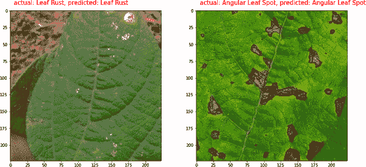

###### 图 2-13\. 使用迁移学习处理复杂图像

鉴于通过迁移学习快速构建非常复杂模型所带来的强大功能，本书中模型创建的主要重点将是使用迁移学习。希望这是一个有用的介绍！

# 摘要

在本章中，您将了解计算机视觉的简介，并了解其真正含义——编写代码来帮助计算机解析图像内容。您将学习如何设计神经网络以识别多个类别，在从零开始构建一个可以识别 10 种时尚物品的网络之前。接下来，您将了解到迁移学习的概念，即可以使用已在数百万张图像上预训练过的现有模型来识别多种类别，并使用它们的内部变量来应用到您的场景中。从中您将看到如何从 TensorFlow Hub 下载模型并在极少的代码行中重复使用它们提供的非常复杂的模型。例如，您将看到一个用仅定义了两个层的模型编写的植物豆病分类器！这将是本书中您主要使用的方法论，因为从现在开始的重点将是在移动应用中*使用*模型。我们将在第三章中开始这段旅程，介绍 ML Kit，这是一个框架，可以帮助您在 Android 和 iOS 上快速原型或使用即插即用的机器学习场景。
