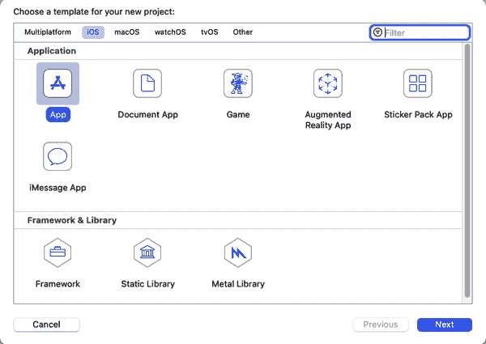

# 第三章：介绍 ML Kit

在这本书的前两章中，你已经了解了机器学习和深度学习的基础，构建了一些基本模型。接下来的书籍内容，你将转变方向，探索如何在移动设备上实现模型。一个强大的工具包，可以让你实现预先存在的模型（即即插即用的场景），以及自定义模型，就是 Google 的 ML Kit。在本章中，你将探索如何使用 ML Kit 在 Android 或 iOS 设备上运行模型。模型将保持在设备上，为用户带来速度和隐私优势。

###### 注意

如果你对如何为 Android 和 iOS 实现附加库不是特别熟悉，我强烈建议你详细阅读本章内容。我会在这里详细讲解，并且后续章节将参考本章。

ML Kit 可以应用于三种主要场景：

+   即插即用的解决方案中，ML Kit 中已经存在的模型可以实现你需要的功能

+   使用通用模型快速原型化特定任务；例如，如果你想构建一个视觉应用程序，但是还没有符合你需求的模型，想确定它是否可行于你的设备上

+   构建使用像我们在第二章中探索的自定义模型的应用程序

在本章中，我将探讨一些即插即用的解决方案，这样你就可以理解如何在应用程序中快速启动和运行 ML 模型。在随后的章节中，我们将探讨如何最初使用 ML Kit 原型化视觉和自然语言处理（NLP）场景，然后构建自定义模型并实现它们。

我认为通过动手操作学习要比讨论大量背景信息更容易，所以让我们直接开始，探索如何使用 ML Kit 构建一些应用程序，首先从 Android 和 iOS 上的人脸检测应用程序开始。

# 在 Android 上构建人脸检测应用程序

在接下来的几页中，你将学习如何构建一个应用程序，使用一个预训练的 ML 模型进行人脸检测，该模型可以立即使用，无需进一步训练。你可以看到一个例子，在一张图片中检测单个人脸，参见图 3-1。


###### 图 3-1 检测图片中的单个人脸

同样的模型（因此也是简单的应用程序）也可以识别图片中的多个人脸；你可以在图 3-2 中看到这一点。我觉得这特别令人印象深刻，因为如果你看前景中的女性，她的脸转向摄像机，我们只能看到她的侧脸，但模型仍然能够检测到！


###### 图 3-2 检测图像中的多个人脸

让我们看看如何在 Android 上开始创建这样一个应用程序！

## 步骤 1：使用 Android Studio 创建应用程序

本教程的其余部分将使用 Android Studio，并期望您至少具有基本的工具知识，以及使用 Kotlin 进行 Android 应用程序开发的知识。如果您对此不熟悉，建议您参加 Google 的免费课程 [使用 Kotlin 进行 Android 开发](https://oreil.ly/bOja4)。如果您还没有安装 Android Studio，可以从 [*https://developer.android.com/studio/*](https://developer.android.com/studio/) 下载。

第一步将是使用 Android Studio 创建一个应用程序。因此，当您使用 File → New 命令时，将会弹出一个对话框，要求您选择一个项目模板（见 图 3-3）。

选择空白活动模板，然后点击下一步。

下一个对话框（配置您的项目）将要求您输入项目的名称、位置和语言。在这里使用任何适合您的选项，但为了使命名空间与我的代码相同，您可能想要使用名称 FD 和包名 *com.example.fd*，如 图 3-4 中所示。


###### 图 3-3\. 在 Android Studio 中开始一个新的应用程序


###### 图 3-4\. 配置项目

点击完成，Android Studio 将创建一个带有单个空活动的样板应用程序。我们可以使用这个应用程序来构建人脸检测器。

## 步骤 2: 添加和配置 ML Kit

Android Studio 允许您使用 [Gradle 构建工具](https://gradle.org) 添加外部库。起初可能会有点混乱，因为您的项目中有 *两个* Gradle 文件，一个定义了项目的整体构建基础设施，另一个是您的应用程序的构建.gradle 文件。要添加 ML Kit，您使用后者——您的应用程序的 build.gradle。在 IDE 中，您会看到类似 图 3-5 的 Gradle 脚本文件夹，因此请注意，第二个条目是模块：app。


###### 图 3-5\. 探索您的 Gradle 脚本

打开 build.gradle 文件，位于模块：app 中，您将看到许多配置条目。在底部右侧，您将看到一个名为 dependencies 的部分。这里包含多个 `implementation`、`testImplementation` 和 `androidTestImplementation` 条目。您可以在这里添加您的依赖项，例如 ML Kit 人脸检测的实现细节如下所示：

```
dependencies {
    implementation fileTree(dir: 'libs', include: ['*.jar'])
    implementation "org.jetbrains.kotlin:kotlin-stdlib-jdk7:$kotlin_version"
    implementation 'androidx.appcompat:appcompat:1.2.0'
    implementation 'androidx.core:core-ktx:1.3.1'
    implementation 'androidx.constraintlayout:constraintlayout:2.0.1'
    testImplementation 'junit:junit:4.12'
    androidTestImplementation 'androidx.test.ext:junit:1.1.2'
    androidTestImplementation 'androidx.test.espresso:espresso-core:3.3.0'
    // Use this dependency to bundle the model with your app
    implementation 'com.google.mlkit:face-detection:16.0.2'
}
```

版本可能与您的情况有所不同——这些是撰写时的最新版本，并注意，您仅需添加前一清单中的 *最后* 一行，用于定义 ML Kit 人脸检测的实现。

## 步骤 3: 定义用户界面

我们将尽可能保持简单，以便尽快进入人脸检测代码！因此，在 Android Studio 中找到 res 文件夹，在其中查看 layout，然后看到 *activity_main.xml*，如 图 3-6 所示。这是一个 XML 文件，声明了您的用户界面将如何显示！


###### 图 3-6\. 查找活动声明

当你打开它时，你可能会看到一个布局编辑器，布局很简单，只包含文本“Hello World”。通过在屏幕右上角选择“code”图标，切换到编辑器的代码视图。然后你应该会看到类似这样的布局的 XML 代码：

```
<?xml version="1.0" encoding="utf-8"?>
<androidx.constraintlayout.widget.ConstraintLayout

    android:layout_width="match_parent"
    android:layout_height="match_parent"
    tools:context=".MainActivity">

    <TextView
        android:layout_width="wrap_content"
        android:layout_height="wrap_content"
        android:text="Hello World!"
        app:layout_constraintBottom_toBottomOf="parent"
        app:layout_constraintLeft_toLeftOf="parent"
        app:layout_constraintRight_toRightOf="parent"
        app:layout_constraintTop_toTopOf="parent" />

</androidx.constraintlayout.widget.ConstraintLayout>
```

删除中间的 TextView 条目，并更新为一个新的 Button 和 ImageView，使得清单看起来像这样：

```
<?xml version="1.0" encoding="utf-8"?>
<androidx.constraintlayout.widget.ConstraintLayout

    android:layout_width="match_parent"
    android:layout_height="match_parent"
    tools:context=".MainActivity">

    <Button
        android:id="@+id/btnTest"
        android:layout_width="wrap_content"
        android:layout_height="wrap_content"
        android:text="Button" />

    <ImageView
        android:id="@+id/imageFace"
        android:layout_width="match_parent"
        android:layout_height="match_parent" />

</androidx.constraintlayout.widget.ConstraintLayout>
```

现在你有一个非常基本的用户界面，包含一个按钮和一个图像。你可以将图像加载到 ImageView 中，当你按下按钮时，它将调用 ML Kit 来检测 ImageView 中图像中的人脸，并绘制指示其位置的矩形。

## 步骤 4：将图像作为资产添加

Android Studio 默认不为你创建一个资产文件夹，所以你需要手动创建一个来从中加载图像。最简单的方法是在项目的文件结构上进行操作。找到代码所在的文件夹，在*app/src/main*文件夹内创建一个名为*assets*的目录。Android Studio 会将其识别为你的资产目录。将一些图片复制到这里（或者直接使用我 GitHub 上的图片），它们就可以使用了。

当你完成配置并且正确设置时，Android Studio 会将该文件夹识别为资产文件夹，你可以浏览它。参见图 3-7。


###### 图 3-7\. 设置你的资产

现在你已经准备好开始编码了，让我们从使用默认图片设置用户界面开始。

## 步骤 5：使用默认图片加载用户界面

在你的*MainActivity.kt*文件中，你应该看到一个名为`onCreate`的函数。当活动创建时会调用此函数。在这里，在`setContentView`行的下面，添加以下代码：

```
val img: ImageView = findViewById(R.id.imageFace)
// assets folder image file name with extension
val fileName = "face-test.jpg"

// get bitmap from assets folder
val bitmap: Bitmap? = assetsToBitmap(fileName)
bitmap?.apply{
    img.setImageBitmap(this)
}
```

这将创建一个对你在布局中添加的 ImageView 控件的引用，并将其命名为`img`。然后它获取名为*face-test.jpg*的文件，并使用名为`assetsToBitmap`的帮助函数从资产文件夹加载它，你马上就会看到这个函数。一旦位图准备就绪，它将调用`apply`，允许你在位图加载时执行代码，并将`img`的图像位图属性设置为位图，从而将图像加载到 ImageView 中。

从资产文件夹加载位图的帮助函数在这里：

```
// helper function to get bitmap from assets
fun Context.assetsToBitmap(fileName: String): Bitmap?{
    return try {
        with(assets.open(fileName)){
            BitmapFactory.decodeStream(this)
        }
    } catch (e: IOException) { null }
}
```

###### 注意

对于这个示例，帮助函数位于活动内部。对于更大的应用程序，良好的编程实践会将类似这样的帮助函数放在一个可用的帮助类中。

这简单地打开资产，并使用`BitmapFactory`将图像内容流式传输到可为空的`Bitmap`中。如果你运行应用程序，它现在看起来会像图 3-8。


###### 图 3-8\. 运行应用程序

我们可以看到这非常基础，只有一个图像和一个按钮，但至少我们的图像已经加载到了 ImageView 中！接下来我们将编写按钮，并让它调用 ML Kit 的人脸检测器！

## 第 6 步：调用人脸检测器

[人脸检测 API](https://oreil.ly/CPJWS)有许多您可以调用的选项，这些选项可通过`FaceDetectorOptions`对象访问。我不会在这里详细介绍所有可用的选项——您可以查看文档来了解——但在调用 API 之前，您需要设置要使用的选项。这是使用`FaceDetectorOptions.Builder()`对象完成的，以下是一个示例：

```
val highAccuracyOpts = FaceDetectorOptions.Builder()
    .setPerformanceMode(FaceDetectorOptions.PERFORMANCE_MODE_FAST)
    .build()
```

这里有许多选项，您可以设置不同面部的标志性地标或分类，比如睁眼或闭眼，但由于我们只是做一个边界框，我选择了一组简单的选项，只需快速完成！（如果您希望更精确，可以使用`PERFORMANCE_MODE_ACCURATE`，这通常会花费更长时间，并且在场景中存在多个面时可能表现更好。）

接下来，您将使用这些选项创建检测器的实例，并将其传递给位图。由于位图是可空类型（即`Bitmap?`），并且`InputImage.fromBitmap`不会接受可空类型，因此您需要在`bitmap`后面加上`!!`以使其识别。以下是代码：

```
val detector = FaceDetection.getClient(highAccuracyOpts)
val image = InputImage.fromBitmap(bitmap!!, 0)
```

您可以通过调用`detector.process`并将其传递给您的图像来获取检测器的结果。如果成功，您将获得其`onSuccessListener`的回调，其中将包含一系列面部。如果失败，您将获得一个`onFailureListener`，您可以使用它来跟踪异常：

```
val result = detector.process(image)
    .addOnSuccessListener { faces ->
        // Task completed successfully
        // ...
        bitmap?.apply{
            img.setImageBitmap(drawWithRectangle(faces))
        }
    }
    .addOnFailureListener { e ->
        // Task failed with an exception
        // ...
    }
```

在`onSuccessListener`中，您可以再次使用`bitmap?.apply`调用一个函数，但这次您可以将图像位图设置为调用名为`drawWithRectangle`的函数的返回值，将面部列表传递给它。这将获取位图并在其上绘制矩形。您将在下一步中看到这一点。

但首先，请将所有这些代码添加到`onCreate`中，作为按钮的`onClickListener`的一部分。以下是完整的代码：

```
val btn: Button = findViewById(R.id.btnTest)
        btn.setOnClickListener {
            val highAccuracyOpts = FaceDetectorOptions.Builder()
                .setPerformanceMode(FaceDetectorOptions.PERFORMANCE_MODE_FAST)
                .build()

            val detector = FaceDetection.getClient(highAccuracyOpts)
            val image = InputImage.fromBitmap(bitmap!!, 0)
            val result = detector.process(image)
                .addOnSuccessListener { faces ->
                    // Task completed successfully
                    // ...
                    bitmap?.apply{
                        img.setImageBitmap(drawWithRectangle(faces))
                    }
                }
                .addOnFailureListener { e ->
                    // Task failed with an exception
                    // ...
                }
        }
```

## 第 7 步：添加边界框

成功时，人脸检测 API 将向其调用者返回一系列面部，而在前面的步骤中，您获取了此列表并将其传递给了`bitmap?.apply`函数，请求将图像位图设置为从名为`drawWithRectangle`的函数返回的结果。让我们在这里探讨一下：

```
fun Bitmap.drawWithRectangle(faces: List<Face>):Bitmap?{
    val bitmap = copy(config, true)
    val canvas = Canvas(bitmap)
    for (face in faces){
        val bounds = face.boundingBox
        Paint().apply {
            color = Color.RED
            style = Paint.Style.STROKE
            strokeWidth = 4.0f
            isAntiAlias = true
            // draw rectangle on canvas
            canvas.drawRect(
                bounds,
                this
            )
        }
    }
    return bitmap
}
```

该函数将复制用于调用它的位图，然后使用该位图初始化一个`Canvas`。然后，对于面部列表中的每个面部，它可以调用`boundingBox`属性以获取该面部的矩形对象。真正不错的是，ML Kit 已经将此矩形按比例缩放到您的图像上，您无需进行进一步的解码。

那么，在这种情况下，你可以直接调用一个`Paint()`对象，使用它的`apply`方法定义一个矩形，并使用`canvas.drawRect`来绘制它。Canvas 是用你的位图初始化的，所以矩形将会在其上绘制。

它将为所有其他面部重复此过程，并在完成后返回具有矩形标记的新位图。由于这是用于应用于 ImageView 中的主位图的（参见“第 6 步：绘制边界框”），新位图将被写入 ImageView 并更新 UI。你可以在图 3-9 中看到结果。


###### 图 3-9\. 带有边界框的您的应用程序

如果你想尝试其他图片，只需将它们添加到 assets 文件夹中，并将第 5 步中的此行更改为所需工作的图片文件名：

```
val fileName = "face-test.jpg"
```

现在，您已经创建了使用即插即用的 ML Kit 模型检测人脸的第一个 Android 应用程序！此 API 还可以执行许多其他操作，包括查找脸部的标志点，如眼睛和耳朵，检测轮廓，并分类眼睛是否睁开，人是否微笑等等。您已经准备好开始了，所以尽情增强这个应用程序吧。

在本章的其余部分，我们将转而看看如何构建相同的应用程序，但是在 iOS 上！

# 为 iOS 构建人脸检测器应用程序

现在让我们探索如何使用 ML Kit 的人脸检测构建一个非常相似的 iOS 应用程序。对于 iOS，您需要使用 Mac 计算机作为开发者工作站，以及 Xcode 环境进行编码、调试和测试。

## 第 1 步：在 Xcode 中创建项目

要开始，请启动 Xcode 并选择新项目。你会看到新项目模板对话框，类似于图 3-10

确保在屏幕顶部选择 iOS，然后将 App 作为应用程序类型。点击下一步，会要求你填写一些细节。除了产品名称，保留所有默认设置；在我的案例中，我称之为 firstFace，但你可以使用任何你喜欢的名称。只需确保将界面保持为 Storyboard，生命周期为 UIKit App Delegate，并将语言设置为 Swift，如图 3-11 所示。

点击下一步后，Xcode 将为您创建一个模板项目。此时应关闭 Xcode，因为您需要在 IDE 之外进行一些配置，然后开始编码。您将在下一步看到如何使用 Cocoapods 添加 ML Kit 库。



###### 图 3-10\. 新应用模板


###### 图 3-11\. 选择项目选项

## 第 2 步：使用 CocoaPods 和 Podfiles

在 iOS 开发中管理依赖项的常见技术是[CocoaPods](https://cocoapods.org)。这在某种程度上类似于前几章中看到的 Android 部分中的 Gradle 文件，并且旨在尽可能简化处理依赖文件。您将通过一个 Podfile 使用 CocoaPods，该文件定义了要添加到应用程序中的依赖项。

在本章中，我不会详细介绍 CocoaPods，但请确保已安装并准备好使用，否则您将无法继续进行本示例，因为它严重依赖于使用 CocoaPods 将 ML Kit 集成到您的 iOS 应用程序中。

在创建项目时，它存储在一个与项目名称相同的目录中。例如，在我的情况下，我将其称为 firstFace 并将其存储在桌面上。在该文件夹中包含一个名为*firstFace.xcodeproj*的 Xcode 项目文件和一个名为*firstFace*的文件夹。

在项目文件夹中，与*.xcodeproj*文件并列，创建一个名为 Podfile 的新文本文件，没有扩展名。编辑此文件的内容，使其如下所示——将`firstFace`更改为您的项目名称：

```
platform :ios, '10.0'

target 'firstFace' do
        pod 'GoogleMLKit/FaceDetection'
        pod 'GoogleMLKit/TextRecognition'
end
```

然后，使用终端进入项目文件夹（它应包含*.xcproject*文件），并输入`**pod install**`。如果执行正确，您应该看到类似图 3-12 的内容。

###### 注意

在编写本书时，基于 M1 芯片的 Mac 相对较少。一些测试者在执行`pod install`时遇到了问题，并出现了*ffi_c.bundle*的错误。为了解决这些问题，请确保您使用的是最新版本的 CocoaPods，或者使用[已记录的解决方法](https://oreil.ly/BqxCx)。

这将下载依赖项并将它们安装在名为*firstFace.xcworkspace*的新工作空间中。今后可以使用它来加载您的工作。因此，现在，您可以在终端中输入`**open firstFace.xcworkspace**`。


###### 图 3-12\. 运行`pod install`

## 第 3 步：创建用户界面

我们将构建我们可以构建的最简单的应用程序，但它仍然需要一些 UI 元素。为了使其尽可能基本，这些将是一个 ImageView 和一个 Button。因此，打开 Xcode（打开 *.xcworkspace* 文件，如前一节所示），找到项目中的*Main.storyboard*文件，并使用 View → Show Library 打开工具库。

您将看到一个 UI 元素列表，如图 3-13 所示。


###### 图 3-13\. 添加 UI 元素

使用此方法，并且在编辑器中激活*Main.storyboard*时，将 ImageView 和 Button 拖放到故事板的设计表面上。完成后，您的 IDE 应该看起来像图 3-14。


###### 图 3-14\. 您的主故事板

从编辑器菜单中，您应该看到一个称为 Assistant 的条目，如果选择它，将在视觉编辑器的旁边或下方打开一个代码窗口。

按住 Ctrl 键，将按钮拖动到 `class ViewController` 下方的代码中，会弹出一个窗口。参见 图 3-15。


###### 图 3-15\. 在 Xcode 中连接 UI 与代码

在连接设置中，选择 Action，在名称字段中输入 buttonPressed，然后按 Connect 按钮。

以下代码将为您生成：

```
@IBAction func buttonPressed(_ sender: Any) {
}
```

类似地，按住 Ctrl 键，将 UIImageView 控件拖动到代码窗口中，当出现来自 图 3-15 的窗口时，保持连接设置为 Outlet，但将名称设置为 imageView，然后点击连接。这将生成如下代码：

```
@IBOutlet weak var imageView: UIImageView!
```

注意这里的 `IB` 代表“Interface Builder”，因此你已经创建了一个 Interface Builder *action*，当按钮被按下时将运行，以及一个 Interface Builder *outlet*，允许你通过 `imageView` 引用或设置 UIImageView 元素的内容。

接下来，让我们将女士面部的 JPEG 图像作为资源添加到应用程序中。只需将其拖放到 Xcode 项目资源管理器中即可完成。在 Finder 中找到图片，将其拖放到 Xcode 左侧面板的代码文件区域。会弹出一个对话框询问“选择添加这些文件的选项”。接受默认设置并点击完成。

你应该会在项目中看到这个文件（在本例中我称其为 *face1.jpg*）作为资源。参见 图 3-16。


###### 图 3-16\. 将文件添加到项目中

现在可以通过在 `viewDidLoad()` 函数中添加代码来将图片加载到 `imageView` 中：

```
override func viewDidLoad() {
    super.viewDidLoad()
    // Do any additional setup after loading the view.
    imageView.image = UIImage(named: "face1.jpg")

}
```

现在你可以运行应用程序，它将展示一个非常简单的 UI，只有一个图片和一个按钮。但你会知道它是有效的！

###### 注意

iOS 模拟器提供了一个可以模拟 iOS 设备的环境。在撰写本文时，某些第三方库在 M1 Mac 上的模拟器中不受支持。因此，你可以选择在设备上运行，或者选择“我的 Mac - iPad 设计”运行时。本章其余部分的屏幕截图均来自此目标系统，运行在 M1 Mac Mini 上。

用户界面元素的最后部分将是一个视图，可用于向图像添加注释，例如人脸的边界框。我们将使用代码完成这一步骤，因此，请将以下内容添加到 *ViewController.swift* 文件中：

```
/// An overlay view that displays detection annotations.
private lazy var annotationOverlayView: UIView = {
  precondition(isViewLoaded)
  let annotationOverlayView = UIView(frame: .zero)
  annotationOverlayView.translatesAutoresizingMaskIntoConstraints =
      false
  return annotationOverlayView
}()
```

这将仅仅给我们一个视图，在主视图加载后加载其余 UI 元素（请注意先决条件）。

然后可以通过更新 `viewDidLoad` 方法，将此覆盖视图加载并激活在 `imageView` 上层显示，如下所示：

```
override func viewDidLoad() {
    super.viewDidLoad()
    // Do any additional setup after loading the view.
    imageView.image = UIImage(named: "face1.jpg")
    imageView.addSubview(annotationOverlayView)
    NSLayoutConstraint.activate([
      annotationOverlayView.topAnchor.constraint(equalTo:
imageView.topAnchor),
      annotationOverlayView.leadingAnchor.constraint(equalTo:
imageView.leadingAnchor),
      annotationOverlayView.trailingAnchor.constraint(equalTo:
imageView.trailingAnchor),
      annotationOverlayView.bottomAnchor.constraint(equalTo:
imageView.bottomAnchor),
    ])
}
```

现在我们已经创建了整个用户界面，包括用于图片的 UIImageView，供用户按下的按钮，以及用于呈现边界框的注释覆盖层，我们准备开始编写将使用 ML Kit 检测面部的逻辑。接下来将看到这一部分。

## 步骤 4：添加应用程序逻辑

当用户按下按钮时，我们希望调用 ML Kit，将图像传递给它，获取指示人脸位置的边界框的详细信息，然后在视图上呈现它。让我们逐步看如何编写这个过程。

首先，您需要导入 ML Kit 库：

```
import MLKitFaceDetection
import MLKitVision
```

接下来，让我们设置 ML Kit 人脸检测器。为此，您首先需要创建一个`FaceDetectorOptions`对象，并设置一些其属性。在这种情况下，我们只会执行一些基本选项——获取所有人脸轮廓，并要求它提供快速性能：

```
private lazy var faceDetectorOption: FaceDetectorOptions = {
  let option = FaceDetectorOptions()
  option.contourMode = .all
  option.performanceMode = .fast
  return option
}()
```

然后，一旦我们有了选项，我们可以使用它们来实例化一个`faceDetector`：

```
private lazy var faceDetector =
    FaceDetector.faceDetector(options: faceDetectorOption)
```

在这一点上，您可能会注意到您的代码会因为找不到`FaceDetectorOptions`而出错。没关系，这只是意味着它们在您尚未引用的库中。您可以通过在代码顶部添加一些导入来修复它。这些将为您提供 ML Kit 人脸检测库以及一般计算机视觉的辅助库：

```
import MLKitFaceDetection
import MLKitVision
```

回想一下，您之前创建了一个 Interface Builder 动作，当用户按下按钮时将执行它。让我们从这里开始，并让它在用户触摸按钮时运行一个自定义函数（您马上就会创建）。

```
@IBAction func buttonPressed(_ sender: Any) {
    runFaceContourDetection(with: imageView.image!)
}
```

现在，我们可以编写此函数——它的工作是接收图像并将其传递给人脸检测器。一旦人脸检测器完成其工作，它就能处理返回的内容。因此，我们可以使函数非常简单：

```
func runFaceContourDetection(with image: UIImage) {
  let visionImage = VisionImage(image: image)
  visionImage.orientation = image.imageOrientation
  faceDetector.process(visionImage) { features, error in
    self.processResult(from: features, error: error)
  }
}
```

到目前为止，您还没有编写`processResult`函数，所以 Xcode 会给出警告。不用担心——您接下来会实现它。

为了使 ML Kit 能够识别多种不同类型的对象，模式是将所有图像转换为`VisionImage`对象。此对象支持多种格式的构建，我们在这里从`UIImage`开始。我们将首先创建一个`VisionImage`实例，并将其方向设置为与原始图像相同。然后，我们使用之前创建的人脸检测器对象处理图像。这将返回特征和/或错误，因此我们可以将*它们*传递给名为`processResult`的函数。

因此，这是`processResult`的代码（通过删除错误处理进行了缩写，生产应用程序中不应该这样做！），它的工作是从 ML Kit 的人脸检测器获取细节：

```
func processResult(from faces: [Face]?, error: Error?) {
    guard let faces = faces else {
      return
    }
    for feature in faces {
      let transform = self.transformMatrix()
      let transformedRect = feature.frame.applying(transform)
      self.addRectangle(
        transformedRect,
        to: self.annotationOverlayView,
        color: UIColor.green
      )
    }
}
```

请注意，由 ML Kit 返回的边界框的坐标与 iOS 用户界面中图像的坐标不同，原因包括它们基于图像的分辨率，而不是屏幕上渲染的像素数量，以及诸如纵横比之类的因素。因此，需要创建一个`transformMatrix`函数来在 ML Kit 返回的坐标和屏幕上的坐标之间进行转换。这用于创建`transformedRect`——它将是屏幕坐标中人脸的框架。最后，将向`annotationOverlayView`添加一个矩形，它将为我们框出人脸。

辅助函数的完整代码——转换矩形坐标并将其应用于覆盖层——在此处：

```
private func transformMatrix() -> CGAffineTransform {
  guard let image = imageView.image else
    { return CGAffineTransform() }
  let imageViewWidth = imageView.frame.size.width
  let imageViewHeight = imageView.frame.size.height
  let imageWidth = image.size.width
  let imageHeight = image.size.height

  let imageViewAspectRatio = imageViewWidth / imageViewHeight
  let imageAspectRatio = imageWidth / imageHeight
  let scale =
    (imageViewAspectRatio > imageAspectRatio)
    ? imageViewHeight / imageHeight : imageViewWidth / imageWidth

  let scaledImageWidth = imageWidth * scale
  let scaledImageHeight = imageHeight * scale
  let xValue = (imageViewWidth - scaledImageWidth) / CGFloat(2.0)
  let yValue = (imageViewHeight - scaledImageHeight) / CGFloat(2.0)

  var transform = CGAffineTransform.identity.translatedBy(
                                      x: xValue, y: yValue)
  transform = transform.scaledBy(x: scale, y: scale)
  return transform
}

private func addRectangle(_ rectangle: CGRect, to view: UIView, color: UIColor) {
  let rectangleView = UIView(frame: rectangle)
  rectangleView.layer.cornerRadius = 10.0
  rectangleView.alpha = 0.3
  rectangleView.backgroundColor = color
  view.addSubview(rectangleView)
}
```

这将为您提供所需的所有代码。正如您所见，其中大部分实际上是用于用户界面逻辑——转换坐标、绘制矩形等。人脸检测相对简单——在 `runFaceContourDetection` 函数中只需三行代码！

运行应用程序并按下按钮应该像在图 3-17 中那样框住脸。


###### 图 3-17\. iOS 上的人脸框架

再次强调，这只是一个非常简单的示例，但该模式非常典型，适用于更复杂的应用程序。ML Kit 的目标是尽可能简化应用程序开发中的 ML 部分，希望此应用程序的人脸检测部分能证明这一点。

# 总结

在本章中，您简要介绍了如何在移动应用程序中使用 ML Kit 进行移动机器学习。您看到了如何在 Android 和 iOS 上使用它来构建一个非常简单的应用程序，该应用程序检测给定图像中的面部并在该面部上绘制一个矩形。重要的是，您看到了如何通过在 Android 上使用 Gradle 和在 iOS 上使用 CocoaPods 来包含 ML Kit。在接下来的几章中，我们将更深入地探讨每个平台上一些常见的场景，首先是在使用 Android 的第四章中进行视觉应用程序。
