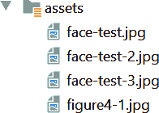
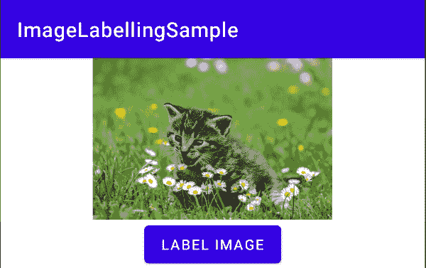
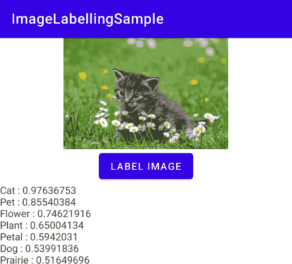
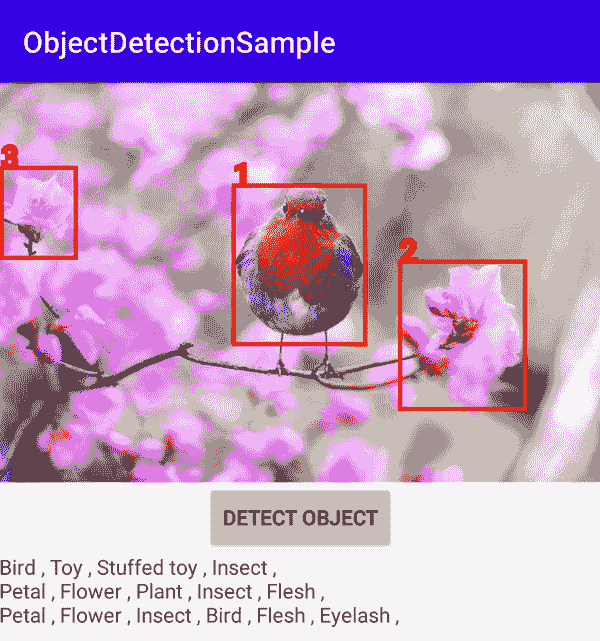
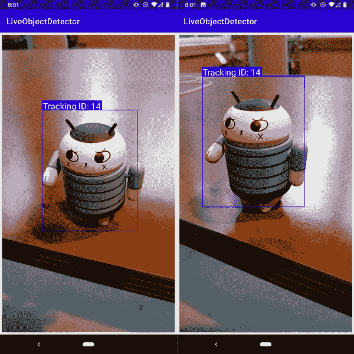

# 第四章：计算机视觉应用程序与 ML Kit 在 Android 上

第三章向你介绍了 ML Kit 及其如何在移动应用程序中用于人脸检测。但是 ML Kit 不仅仅如此——它还能让你快速原型化常见的视觉场景、托管自定义模型或实施其他即插即用的解决方案场景，例如条形码检测。在这一章中，我们将探讨 ML Kit 中提供的一些模型，以提供计算机视觉场景，包括图像标签化、分类以及静态和动态图像中的对象检测。我们将在 Android 上使用 Kotlin 作为编程语言进行这些操作。第六章将使用 Swift 来实现 iOS 开发中的相应内容。

# 图像标签化和分类

图像分类的概念在机器学习领域是众所周知的，并且是计算机视觉的基石。简单来说，图像分类发生在你向计算机展示一幅图像时，它告诉你图像包含的内容。例如，你向它展示一张猫的图片，就像图 4-1 中的那样，它会将其标记为猫。

在 ML Kit 中进行图像标签化会进一步扩展，并为你提供图像中看到的物体列表及其概率级别，因此，与图 4-1 只显示一只猫不同，它可能会显示它看到了猫、花、草、雏菊等等。

让我们来探索如何创建一个非常简单的 Android 应用程序来标记这张图片！我们将使用 Android Studio 和 Kotlin。如果你还没有它们，你可以在 [*https://developer.android.com/studio/*](https://developer.android.com/studio/) 下载它们。


###### 图 4-1\. 一张猫的图片

## 第一步：创建应用程序并配置 ML Kit

如果你还没有阅读过第三章，或者对于如何启动并运行 Android 应用程序不太熟悉，我建议你现在去看看！一旦你创建了应用程序，你需要像第三章中演示的那样编辑你的 build.gradle 文件。但在这种情况下，你需要添加图像标签库，而不是添加人脸检测库，如下所示：

```
dependencies {
    implementation "org.jetbrains.kotlin:kotlin-stdlib:$kotlin_version"
    implementation 'androidx.core:core-ktx:1.2.0'
    implementation 'androidx.appcompat:appcompat:1.2.0'
    implementation 'com.google.android.material:material:1.1.0'
    implementation 'androidx.constraintlayout:constraintlayout:2.0.4'
    testImplementation 'junit:junit:4.+'
    androidTestImplementation 'androidx.test.ext:junit:1.1.2'
    androidTestImplementation 'androidx.test.espresso:espresso-core:3.2.0'
    implementation 'com.google.mlkit:image-labeling:17.0.1'
}
```

一旦完成这些步骤，Android Studio 可能会要求你同步，因为你的 Gradle 文件已更改。这将触发包含新的 ML Kit 依赖项的构建。

## 第二步：创建用户界面

我们将为这个应用程序创建一个非常简单的超级简单的用户界面，以便我们可以直接开始使用图像标签。在 Android View 中的 res->layout 目录中，你会看到一个名为 *activity_main.xml* 的文件。如果这不熟悉，请参考第三章。

更新 UI 以包含一个线性布局，其中包括一个 ImageView、一个 Button 和一个 TextView，就像这样：

```
<?xml version="1.0" encoding="utf-8"?>
<androidx.constraintlayout.widget.ConstraintLayout

    android:layout_width="match_parent"
    android:layout_height="match_parent"
    tools:context=".MainActivity">

    <LinearLayout
        android:layout_width="match_parent"
        android:layout_height="wrap_content"
        android:orientation="vertical"
        app:layout_constraintStart_toStartOf="parent"
        app:layout_constraintTop_toTopOf="parent">

        <ImageView
            android:id="@+id/imageToLabel"
            android:layout_width="match_parent"
            android:layout_height="match_parent"
            android:layout_gravity="center"
            android:adjustViewBounds="true"
        />
        <Button
            android:id="@+id/btnTest"
            android:layout_width="wrap_content"
            android:layout_height="wrap_content"
            android:text="Label Image"
            android:layout_gravity="center"/>
        <TextView
            android:id="@+id/txtOutput"
            android:layout_width="match_parent"
            android:layout_height="wrap_content"
            android:ems="10"
            android:gravity="start|top" />
    </LinearLayout>
</androidx.constraintlayout.widget.ConstraintLayout>
```

在运行时，ImageView 将加载一张图像，当用户按下按钮时，ML Kit 将被调用以获取显示图像的图像标签数据。结果将在 TextView 中呈现。稍后您可以在 图 4-3 中看到这一点。

## 步骤 3: 添加图片作为资源

在您的项目中，您需要一个资产文件夹。如果您对此步骤不熟悉，请返回第三章，在那里您将逐步了解该过程。一旦您有了一个资产文件夹并添加了一些图像，您将在 Android Studio 中看到它们。参见 图 4-2。



###### 图 4-2\. 资产文件夹中的图像

## 步骤 4: 将图像加载到 ImageView 中

现在让我们来写一些代码吧！我们可以转到 *MainActivity.kt* 文件，并在其中添加一个扩展，使我们能够从资产文件夹加载图像作为位图：

```
fun Context.assetsToBitmap(fileName: String): Bitmap?{
    return try {
        with(assets.open(fileName)){
            BitmapFactory.decodeStream(this)
        }
    } catch (e: IOException) { null }
}
```

然后，更新由 Android Studio 为您创建的 `onCreate` 函数，以根据其 ID 查找 ImageView 控件，并将位于资产文件夹中的图像加载到其中：

```
val img: ImageView = findViewById(R.id.imageToLabel)
// assets folder image file name with extension
val fileName = "figure4-1.jpg"
// get bitmap from assets folder
val bitmap: Bitmap? = assetsToBitmap(fileName)
bitmap?.apply {
    img.setImageBitmap(this)
}
```

您现在可以运行应用程序，测试它是否正确加载图像。如果正确，您应该会看到类似于 图 4-3 的内容。



###### 图 4-3\. 运行带有加载图像的应用程序

按钮目前不会做任何事情，因为我们还没有编写代码。接下来让我们来做这件事吧！

## 步骤 5: 编写按钮处理程序代码

让我们从编写代码开始，获取可以表示文本视图（用于输出标签）和按钮本身的变量：

```
val txtOutput : TextView = findViewById(R.id.txtOutput)
val btn: Button = findViewById(R.id.btnTest)
```

现在我们有了按钮，我们可以为它创建一个按钮处理程序。这可以通过键入 `btn.setOnClickListener` 来实现；自动完成将为您创建一个存根函数。然后，您可以使用以下完整代码来进行图像标签处理。接下来我们将逐步讲解它：

```
btn.setOnClickListener {
          val labeler =
            ImageLabeling.getClient(ImageLabelerOptions.DEFAULT_OPTIONS)
          val image = InputImage.fromBitmap(bitmap!!, 0)
          var outputText = ""
          labeler.process(image).addOnSuccessListener { labels ->
                     // Task completed successfully
                     for (label in labels) {
                          val text = label.text
                          val confidence = label.confidence
                          outputText += "$text : $confidence\n"
                     }
                     txtOutput.text = outputText
          }
       .addOnFailureListener { e ->
                        // Task failed with an exception
                        // ...
       }
}
```

当用户点击按钮时，此代码将使用默认选项从 ML Kit 中创建一个图像标签处理器，如下所示：

```
val labeler = ImageLabeling.getClient(ImageLabelerOptions.DEFAULT_OPTIONS)
```

一旦完成此操作，它将使用此代码从位图（用于显示图像）创建一个图像对象（可以由 ML Kit 理解）：

```
val image = InputImage.fromBitmap(bitmap!!, 0)
```

标签处理器将被调用来处理图像，并添加了两个监听器。*成功* 监听器在处理成功时触发，*失败* 监听器在处理失败时触发。当图像标签处理器成功时，它将返回一个*标签*列表。这些标签将具有一个文本属性，其中包含描述标签的文本，以及一个置信度属性，其值从 0 到 1，表示标签存在的概率。

因此，在成功监听器中，代码将遍历标签列表，并将文本和置信度添加到名为 `outputText` 的变量中。完成后，它可以将 TextView 的文本属性（现在称为 `txtOutput`）设置为 `outputText` 变量的值：

```
for (label in labels) {
          val text = label.text
          val confidence = label.confidence
          outputText += "$text : $confidence\n"
}
txtOutput.text = outputText
```

就是这么简单。使用本章早些时候的猫图像运行应用程序，您将会得到类似于 图 4-4 的输出。



###### 图 4-4\. 标记本章前面的图像

## 下一步

ML Kit 内置的图像标记模型能够识别图像中的超过 400 个类别。在撰写本文时，共有 447 个类别，但这可能会改变。ML Kit 的完整标签映射发布在 [*https://developers.google.com/ml-kit/vision/image-labeling/label-map*](https://developers.google.com/ml-kit/vision/image-labeling/label-map)*.* 如果您想训练一个模型来识别*不同*的类别，您将使用 TensorFlow，在第九章中我们将探讨这一点。

# 物体检测

上一节向您展示了如何进行图像分类和标记，在这种情况下，计算机能够检测图像中的*内容*，但不一定能确定物体在图像中的*位置*。这里使用了*对象检测*的概念。在这种情况下，当您将图像传递给对象检测器时，您将获得一个包含*边界框*的对象列表，这些边界框可用于确定物体可能在图像中的位置。ML Kit 的默认对象检测模型非常擅长在图像中检测物体，但它只能分类五种类别之后，您需要使用自定义模型。然而，当与图像标记（前一节）结合使用时，您可以获得图像中各个物体的分类标签！您可以在图 4-5 中看到一个示例。



###### 图 4-5\. 执行物体检测

让我们一步一步来看。

## 步骤 1: 创建应用程序并导入 ML Kit

创建应用程序时要像之前一样创建一个单视图应用程序。我们将尽量保持与您已经构建的图像标记应用程序相似，以便事物看起来更加熟悉。

完成后，请编辑您的 build.gradle 文件，以像这样同时使用物体检测和图像标记：

```
implementation 'com.google.mlkit:object-detection:16.2.2'
implementation 'com.google.mlkit:image-labeling:17.0.1'
```

###### 注意

您的版本号可能不同，请检查最新版本信息 [*https://developers.google.com/ml-kit*](https://developers.google.com/ml-kit)*.*

## 步骤 2: 创建活动布局 XML

该活动的布局文件非常简单，与之前看到的完全相同。您将拥有一个 LinearLayout，用于布局 ImageView、Button 和 TextView。ImageView 将显示图像，Button 将运行物体检测和标记代码，TextView 将呈现标签的结果。而不是在此重新列出代码，只需使用与前面示例相同的布局代码。

## 步骤 3: 将图像加载到 ImageView 中

与之前一样，您将使用扩展来从资产文件夹加载图像到 ImageView 中。为方便起见，我在此重复了执行此操作的代码：

```
// extension function to get bitmap from assets
fun Context.assetsToBitmap(fileName: String): Bitmap?{
    return try {
        with(assets.open(fileName)){
            BitmapFactory.decodeStream(this)
        }
    } catch (e: IOException) { null }
}
```

像之前一样创建一个资产文件夹，并在其中放置一些图像。对于图 4-5 中的屏幕截图，我使用了来自[Pixabay](https://oreil.ly/TnCR6)的图像，并将其重命名为*bird.jpg*以便于代码处理。

然后，在`onCreate`函数中，你可以使用前面的扩展函数从资产中获取图像，并像这样加载到你的位图中：

```
val img: ImageView = findViewById(R.id.imageToLabel)
// assets folder image file name with extension
val fileName = "bird.jpg"
// get bitmap from assets folder
val bitmap: Bitmap? = assetsToBitmap(fileName)
bitmap?.apply {
    img.setImageBitmap(this)
}
```

你也可以像这样设置按钮和 TextView 控件：

```
val txtOutput : TextView = findViewById(R.id.txtOutput)
val btn: Button = findViewById(R.id.btnTest)
```

## 第 4 步：设置对象检测选项

在本节中，您将使用多个 ML Kit 类。以下是导入：

```
import com.google.mlkit.vision.common.InputImage
import com.google.mlkit.vision.label.ImageLabeling
import com.google.mlkit.vision.label.defaults.ImageLabelerOptions
import com.google.mlkit.vision.objects.DetectedObject
import com.google.mlkit.vision.objects.ObjectDetection
import com.google.mlkit.vision.objects.defaults.ObjectDetectorOptions
```

ML Kit 对象检测器提供了多种进行对象检测的方法，这些方法由`ObjectDetectorOptions`对象控制。我们将在其最简单的模式之一中使用它，即基于单个图像进行检测并启用在该图像中检测多个对象的功能。

```
val options =
        ObjectDetectorOptions.Builder()
        .setDetectorMode(ObjectDetectorOptions.SINGLE_IMAGE_MODE)
        .enableMultipleObjects()
        .build()
```

对象检测器是一个强大的 API，还可以执行诸如在视频流中跟踪对象等操作——从帧到帧检测和维护它们。这超出了我们在本书中所做的范围，但您可以在[ML Kit 文档](https://oreil.ly/kluVJ)中了解更多信息。

模式选项用于确定此操作，你可以在此示例中了解更多关于`SINGLE_IMAGE_MODE`的信息[*https://oreil.ly/WFSZD*](https://oreil.ly/WFSZD)。

此外，对象检测器可以启用以检测场景中最显著的对象或所有对象。我们在这里设置为检测多个对象（使用`.enableMultipleObjects()`），因此我们可以看到多个项目，如图 4-5 所示。

另一个常见选项是启用分类。由于默认对象检测器只能检测五类对象，并为它们提供非常通用的标签，我在这里没有打开它，而是使用了本章前面讨论的图像标签 API“自己动手”标记对象。如果您想使用超过五类基本对象，可以使用自定义 TensorFlow 模型，我们将在第九章到第十一章中探讨使用自定义模型。

## 第 5 步：处理按钮交互

当用户触摸按钮时，您将希望调用对象检测器，获取其响应，并从中获取图像中对象的边界框。稍后我们还将使用这些边界框将图像裁剪为由边界框定义的子图像，以便传递给标签器。但现在，让我们先实现对象检测处理程序。它应该看起来像这样：

```
btn.setOnClickListener {
            val objectDetector = ObjectDetection.getClient(options)
            var image = InputImage.fromBitmap(bitmap!!, 0)
            objectDetector.process(image)
                    .addOnSuccessListener { detectedObjects ->
                        // Task completed successfully
                    }
                    .addOnFailureListener { e ->
                        // Task failed with an exception
                        // ...
                    }
        }
```

因此，类似于您之前对图像标签化所做的操作，模式是使用选项创建对象检测 API 的实例。然后，您将位图转换为`InputImage`，并使用对象检测器处理它。

成功时返回检测到的对象列表，或者失败时返回异常对象。

`onSuccessListener`返回的`detectedObjects`将包含关于对象的详细信息，包括其边界框。接下来，让我们创建一个函数在图像上绘制边界框。

## 步骤 6：绘制边界框

最简单的方法是扩展`Bitmap`对象，使用`Canvas`在其上绘制矩形。我们将检测到的对象传递给它，以便它可以建立边界框，并从那里在位图的顶部绘制它们。

这是完整的代码：

```
fun Bitmap.drawWithRectangle(objects: List<DetectedObject>):Bitmap?{
    val bitmap = copy(config, true)
    val canvas = Canvas(bitmap)
    var thisLabel = 0
    for (obj in objects){
        thisLabel++
        val bounds = obj.boundingBox
        Paint().apply {
            color = Color.RED
            style = Paint.Style.STROKE
            textSize = 32.0f
            strokeWidth = 4.0f
            isAntiAlias = true
            // draw rectangle on canvas
            canvas.drawRect(
                    bounds,
                    this
            )
            canvas.drawText(thisLabel.toString(),
                            bounds.left.toFloat(),
                            bounds.top.toFloat(), this )
        }

    }
    return bitmap
}
```

代码将首先创建位图的副本，并基于它创建一个新的`Canvas`。然后，它将遍历所有检测到的对象。

ML Kit 返回的对象的边界框位于`boundingBox`属性中，因此您可以使用以下代码获取其详细信息：

```
val bounds = obj.boundingBox
```

然后，可以使用`Paint`对象在画布上绘制边界框，如下所示：

```
canvas.drawRect(
       bounds,
           this
)
```

代码的其余部分只处理诸如矩形的颜色、文本的大小和颜色等事务，文本只包含一个数字，如您在图 4-5 中看到的那样，我们按照检测顺序在框上写下 1、2、3。

然后，您可以像这样在`onSuccessListener`中调用此函数：

```
bitmap?.apply{
    img.setImageBitmap(drawWithRectangle(detectedObjects))
}
```

因此，在 ML Kit 成功返回后，您现在会在图像上看到绘制的边界框。考虑到对象检测器的限制，您将不会为这些框获得非常有用的标签，因此在下一步中，您将看到如何使用图像标签调用来获取边界框内内容的详细信息。

## 步骤 7：标记对象

简单起见，基本模型仅处理五个非常通用的类别来标记图像内容。您可以使用训练更多类别的自定义模型，或者您可以使用简单的多步解决方案。该过程很简单——您已经有了边界框，所以创建一个*新*的临时图像，其中仅包含边界框内的内容，将其传递给图像标签器，然后获取结果。对于每个边界框（因此每个对象）重复此过程，您将获得每个检测到对象的详细标签！

这是完整的代码：

```
fun getLabels(bitmap: Bitmap,
              objects: List<DetectedObject>, txtOutput: TextView){
    val labeler = ImageLabeling.getClient(ImageLabelerOptions.DEFAULT_OPTIONS)
    for(obj in objects) {
        val bounds = obj.boundingBox
        val croppedBitmap = Bitmap.createBitmap(
            bitmap,
            bounds.left,
            bounds.top,
            bounds.width(),
            bounds.height()
        )
        var image = InputImage.fromBitmap(croppedBitmap!!, 0)

        labeler.process(image)
            .addOnSuccessListener { labels ->
                // Task completed successfully
                var labelText = ""
                if(labels.count()>0) {
                    labelText = txtOutput.text.toString()
                    for (thisLabel in labels){
                        labelText += thisLabel.text + " , "
                    }
                    labelText += "\n"
                } else {
                    labelText = "Not found." + "\n"
                }
                txtOutput.text = labelText.toString()
            }
    }
}
```

此代码循环遍历每个检测到的对象，并使用边界框创建一个名为`croppedBitmap`的新位图。然后，它将使用设置为默认选项的图像标签器（称为`labeler`）处理该新图像。在成功返回后，它将获得多个标签，然后将这些标签写入以逗号分隔的字符串中，该字符串将在`txtOutput`中呈现。我注意到，即使成功标记，有时也会返回一个空的标记列表，因此我添加了代码，仅在返回的标签中存在标签时才构造字符串。

要调用此函数，只需将此代码添加到`onSuccessListener`中，用于对象检测调用，在调用代码设置位图上的矩形之后立即添加：

```
getLabels(bitmap, detectedObjects, txtOutput)
```

###### 注意

运行此代码时，您正在进行多个异步调用，首先是对象检测器，然后是图像标签器。因此，按下按钮后，您可能会看到延迟行为。您可能会首先看到绘制的边界框，然后几分钟后更新标签列表。Android 和 Kotlin 提供了许多异步功能，以使用户体验更好，但这超出了本书的范围，因为我想保持示例简单，并专注于 ML Kit 中现有功能的使用。

# 在视频中检测和跟踪对象

ML Kit 对象检测器还可以在视频流上运行，使您能够在视频中检测对象并在连续视频帧中跟踪该对象。例如，请参阅图 4-6，我在场景中移动相机，Android 小人不仅被检测到，并给出了边界框，还分配了跟踪 ID。虽然对象保持在视野中，但根据新位置，后续帧会获得不同的边界框，但跟踪 ID 保持不变——也就是说，尽管由于放置在帧内和不同的摄像头角度而看起来不同，但它被识别为*同一*对象。

在本节中，我们将探讨如何使用 ML Kit 构建这样的应用程序。请注意，要测试此功能，您应该使用物理设备——将摄像头移动以跟踪设备的性质不适合使用模拟器。

像这样构建应用程序还有很多步骤不是 ML 特定的，比如处理 CameraX、使用覆盖层以及在帧之间管理绘制框等等，我在本章不会深入讨论，但书籍下载包含了您可以剖析的完整代码。



###### 图 4-6。使用基于视频的对象检测器

## 探索布局

自然地，像前述应用程序这样的布局比我们看到的要复杂一些。它需要您绘制相机预览，然后在预览的顶部绘制边界框，这些边界框在您移动相机以跟踪对象时几乎实时更新。在此应用程序中，我使用了 CameraX，这是 Android 中的一个支持库，旨在更轻松地使用相机——确实如此！您可以在[*https://developer.android.com/training/camerax*](https://developer.android.com/training/camerax)了解更多关于 CameraX 的信息。

重复前面创建新 Android 应用程序的步骤。准备就绪后，打开布局文件并进行编辑。对于这样的应用程序，您需要使用 FrameLayout，通常只用于单个项目，以阻挡屏幕的特定区域，但我喜欢在像这样的情况下使用它，其中我有两个项目，但一个将完全覆盖另一个：

```
<FrameLayout android:layout_width="fill_parent"
    android:layout_height="fill_parent"
    android:layout_weight="2"
    android:padding="5dip"
    tools:ignore="MissingConstraints">
    <androidx.camera.view.PreviewView
        android:id="@+id/viewFinder"
        android:layout_width="fill_parent"
        android:layout_height="fill_parent"
        android:layout_weight="1"
        android:layout_gravity="center" />
    <com.odmlbook.liveobjectdetector.GraphicOverlay
        android:id="@+id/graphicOverlay"
        android:layout_gravity="center"
        android:layout_width="wrap_content"
        android:layout_height="wrap_content" />
</FrameLayout>
```

在 FrameLayout 内，第一个控件是`androidx.camera.view.PreviewView`，在此控件上将呈现来自相机的视频流。在其上方是一个名为`GraphicOverlay`的自定义控件，正如其名称所示，它在预览的顶部提供一个可以绘制图形的覆盖层。这个覆盖层控件已经从[开源 ML Kit 示例](https://oreil.ly/csyn9)中进行了适配。

注意，在列表中我称呼了`GraphicOverlay com.odmlbook.liveobjectdetector.GraphicOverlay`；这是因为前面 Google 示例中的`GraphicOverlay`直接添加到了我的应用程序中，并且我正在使用我的应用程序命名空间。你可能会有不同的命名空间，因此请确保使用你的 GraphicOverlay 的正确命名。

我将布局保持尽可能简单，以便你可以专注于对象检测的各个方面——所以基本上就是这样——CameraX 的预览，在其上是一个 GraphicOverlay，你可以在这个 GraphicOverlay 上绘制边界框。稍后你会看到更多相关内容。

## GraphicOverlay 类

在布局中，你看到了一个自定义的`GraphicOverlay`类。这个类的作用是管理一组图形对象——包括边界框及其标签，并在画布上绘制它们。需要注意的一点是，通常情况下，你会在相机预览（以相机分辨率显示）和放置在其上方的画布（以屏幕分辨率显示）之间遇到坐标差异，就像在这种情况下一样。因此，可能还需要进行坐标转换，以便在预览上方的适当位置进行绘制。你可以在`GraphicOverlay`类中找到用于管理逐帧操作时绘制图形性能的代码。边界框，表示为图形对象，将简单地在`onDraw`事件中添加：

```
    @Override
    protected void onDraw(Canvas canvas) {
        super.onDraw(canvas);

        synchronized (lock) {
            updateTransformationIfNeeded();

            for (Graphic graphic : graphics) {
                graphic.draw(canvas);
            }
        }
    }
```

## 捕获相机

使用 CameraX 时，你会访问一个相机提供者，该提供者允许你在其上设置各种子提供者，包括*surface*提供者，让你定义预览放置的位置，以及*analyzer*，让你对来自相机的帧进行处理。这些对我们的需求非常合适——surface 提供者可以提供预览窗口，而 analyzer 可以用于调用 ML Kit 对象检测器。在应用程序的`MainActivity`中，你会在这段代码中找到这一点（在`startCamera()`函数中）。

首先，我们设置预览视图（注意，布局列表中的控件称为`viewFinder`），以渲染来自相机的帧流：

```
val preview = Preview.Builder()
    .build()
    .also {
        it.setSurfaceProvider(viewFinder.surfaceProvider)
    }
```

接下来是图像分析器。CameraX 会逐帧调用这个函数，让你能够对图像进行某种处理。这非常适合我们的需求。当你调用`setAnalyzer`时，你会指定一个处理分析的类。在这里，我指定了一个名为`ObjectAnalyzer`的类，正如其名称所示，它将使用对象检测 API 与帧一起使用：

```
val imageAnalyzer = ImageAnalysis.Builder()
    .setBackpressureStrategy(ImageAnalysis.STRATEGY_KEEP_ONLY_LATEST)
    .build()
    .also {
        it.setAnalyzer(cameraExecutor, ObjectAnalyzer(graphicOverlay))
    }
```

然后，一旦你拥有了这些，你可以将它们绑定到相机的生命周期中，以便 CameraX 知道要使用它们来渲染预览并管理逐帧处理：

```
cameraProvider.bindToLifecycle(
    this, cameraSelector, preview, imageAnalyzer
)
```

你可以在 CameraX 文档中了解有关使用 CameraX 的相机应用程序生命周期的更多信息。我只想在这里强调一下在使用它进行对象检测时的重要部分。

## 对象分析器类

这个类的完整代码在[书籍的代码库](https://oreil.ly/WIQMR)中。我建议你克隆它并使用它来理解如何在视频中跟踪对象的对象分析工作。本节只显示代码的重要部分，并不能真正用于编码！

之前你看到，你可以钩入 CameraX 的分析器能力来进行对象检测，并且我们指定了一个叫做`ObjectAnalyzer`的类来处理它。我们还将对这个类的图形叠加引用传递给了它。

一个分析器类必须重写`ImageAnalysis.Analyzer`，因此这个类的签名应该看起来像这样：

```
public class ObjectAnalyzer(graphicOverlay: GraphicOverlay) :
                            ImageAnalysis.Analyzer {}
```

这个类的工作是进行对象检测，所以我们需要像以前一样创建我们的`ObjectDetector`实例：

```
val options =
           ObjectDetectorOptions.Builder()
                   .setDetectorMode(ObjectDetectorOptions.STREAM_MODE)
                   .enableMultipleObjects()
                   .enableClassification()
                   .build()
   val objectDetector = ObjectDetection.getClient(options)
```

请注意检测器模式设置的不同之处，虽然是`ObjectDetectorOptions.STREAM_MODE`——现在它正在使用*流模式*，因为我们将向其传送图像。这将启用我们在图 4-6 中看到的对象跟踪功能，即使由于相机放置的不同而看起来不同，它也会“记住”相同的对象。

当你创建一个像这样的分析器类时，你需要重写函数`analyze`，它接受一个代表图像的`ImageProxy`对象。为了使用 CameraX 图像与图像代理，你需要进行一些处理来管理旋转等问题。这里我不会详细说明，但需要重点管理的是，如果相机以横向或纵向模式提供帧，则我们需要通知叠加层有关图像的适当高度和宽度，并在必要时翻转它们——以便 ML Kit API 始终以相同的方向接收图像：

```
if (rotationDegrees == 0 || rotationDegrees == 180) {
    overlay.setImageSourceInfo(
        imageProxy.width, imageProxy.height, isImageFlipped
    )
} else {
    overlay.setImageSourceInfo(
        imageProxy.height, imageProxy.width, isImageFlipped
    )
}
```

然后，我们可以将帧传递给对象检测器，如果成功，回调将像以前一样检测到对象。在这一点上，我们应该清除叠加层，然后为每个检测到的对象向叠加层添加新的图形对象。这些图形对象是该应用程序中的自定义类。马上你会看到它们。完成后，我们在叠加层上调用`postInvalidate()`，这将触发叠加层的重绘：

```
objectDetector.process(frame)
    .addOnSuccessListener { detectedObjects ->
    overlay.clear()
          for (detectedObject in detectedObjects){
               val objGraphic = ObjectGraphic(this.overlay, detectedObject)
               this.overlay.add(objGraphic)
          }
          this.overlay.postInvalidate()
}
```

## 对象图形类

由于边界框由三个元素组成——框本身、标签的文本和标签的背景，所以不仅仅是单独绘制每一个，而是使用一个单一的类来表示每一个。这个类将使用从 ML Kit 返回的 `detectedObject` 进行初始化，因此我们可以获取跟踪 ID 和边界框的坐标。`ObjectGraphic` 类管理所有这些——您可以在前面的代码中看到它的使用，其中使用覆盖层和 `detectedObject` 创建了它的一个新实例。

## 将所有内容整合

通常情况下，这种应用的工作方式如下。使用 CameraX，您指定预览表面和分析器。分析器调用 ML Kit 对象检测器，并启用流模式。返回的检测到的对象用于创建表示边界框的对象，并将其添加到覆盖层上。这使用了 ML Kit 中的通用模型，因此分类方面并不多，只是检测到一个对象，并为该对象分配了一个 ID。要进一步对每个检测到的对象进行分类，您需要一个自定义模型，在 第九章 中我们将讨论这一点。

# 摘要

使用 ML Kit 为 Android 构建使用视觉的应用非常简单。在本章中，您探索了几种使用内置通用模型的情景，包括图像分类和标记，其中计算机可以确定单个图像的内容，以及对象检测，其中可以检测到图像中的多个对象，并通过边界框确定它们的位置。您在本章中总结了一个简短的探讨，说明如何将此扩展到视频——不仅可以*检测*对象，还可以实时跟踪对象。所有这些情景都是基于 ML Kit 中的通用内置模型，但可以轻松扩展为自定义模型。我们将在 第九章 中进一步探讨这一点。
