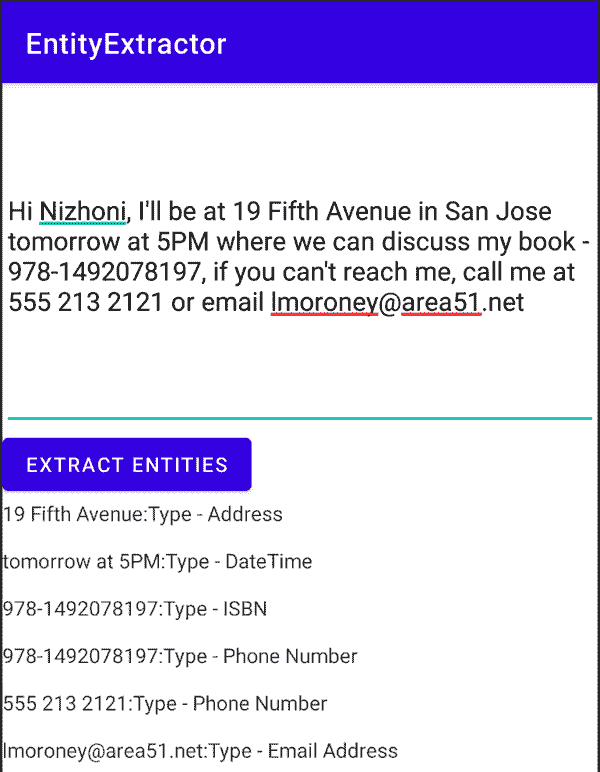
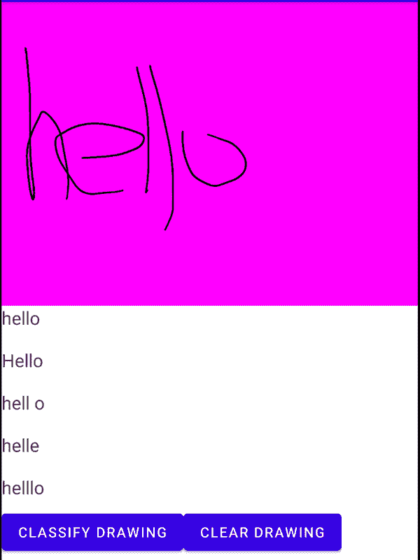
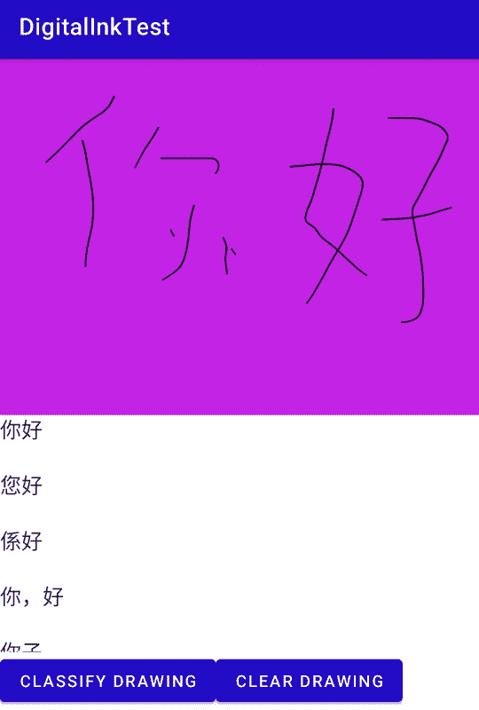

# 第五章：使用 ML Kit 在 Android 上进行文本处理应用程序

或许机器学习中最大的两个领域是计算机视觉和自然语言处理。在第四章中，您已经了解到一些常见的计算机视觉场景，这些场景已经在 ML Kit 中为您定义好了模型。在本章中，您将探索一些自然语言处理的场景，包括如何从数字墨水中识别文本、对消息进行智能回复以及从文本中提取地址等实体。这些都是特定场景的现成模型。如果您想创建使用其他自然语言处理模型的应用程序，例如文本分类，您将需要使用 TensorFlow Lite 创建自己的模型，然后在移动设备上实现它们。我们将在后面的章节中探讨这一点。

# 实体提取

在给定大量文本时，从中提取重要信息可能是一项困难的任务。通常，遵循特定结构的信息，例如地址，可能在一个国家是可预测的，但在另一个国家可能有很大不同，因此，采用基于规则的方法获取信息可能需要大量编码工作。

例如，请考虑图 5-1，我已向我的朋友 Nizhoni 发送了一条包含一些细节的消息。作为人类，我们可以从中提取有价值的信息，比如“明天下午 5 点”，理解它是日期和时间。但编写代码来做到这一点确实很困难。试图编写能够理解不同国家日期格式的代码已经很难了，例如，5/2 可能是 5 月 2 日或 2 月 5 日，具体取决于您所在的地区，并且尝试从如“明天”这样的文本中提取信息更加困难！虽然 ML 可能不是这个问题的完美解决方案，但它确实有助于减少您需要编写的用于常见场景的代码量。



###### 图 5-1。从文本中提取实体

正如您在文本下面所看到的那样，生成了一个包含找到的实体的列表。例如，“明天下午 5 点”被提取为日期时间。其他如电话号码和电子邮件地址也被正确提取。通常一个值会匹配多个模式，例如，书的 ISBN 号以三位数开头，这与电话号码的模式匹配，因此被检测为两个实体！

考虑到这一点，ML Kit 具有实体提取 API，可以创建一个可以读取如此数据的应用程序，包括地址、电话号码、电子邮件等。我们将在本节中探讨如何创建这样的应用程序。

## 开始创建应用程序

我假设您已经按照第三章中所示的步骤创建了一个新应用程序。如果没有，请先从那里开始。与之前一样，使用 Android Studio 创建一个新的单视图应用程序。找到应用程序级别的 build.gradle 文件，并将实体提取库与其一起添加：

```
implementation 'com.google.mlkit:entity-extraction:16.0.0-beta1'
```

请注意，在撰写本文时，实体提取是一个测试版产品，可能存在一些错误。此外，如果您正在遵循此文档，请务必查看 ML Kit 文档中实体提取站点的[最新版本](https://oreil.ly/DP4WI)。

## 创建活动的布局

我们将应用程序保持非常简单，以便专注于实体提取 API，因此您可以从图 5-1 中看到它只有三个控件：一个用于输入文本的，一个用于触发提取的按钮，以及一个用于呈现 API 检测结果的文本字段。

这将使布局的 XML 保持非常简单：

```
<?xml version="1.0" encoding="utf-8"?>
<androidx.constraintlayout.widget.ConstraintLayout

    android:layout_width="match_parent"
    android:layout_height="match_parent"
    tools:context=".MainActivity">

    <LinearLayout
        android:layout_width="match_parent"
        android:layout_height="match_parent"
        android:orientation="vertical">

    <EditText
        android:id="@+id/txtInput"
        android:inputType="textMultiLine"
        android:singleLine="false"
        android:layout_width="match_parent"
        android:layout_height="240dp"/>

    <Button
        android:id="@+id/btnExtract"
        android:layout_width="wrap_content"
        android:layout_height="wrap_content"
        android:text="Extract Entities" />

    <TextView
        android:id="@+id/txtOutput"
        android:text=""
        android:layout_width="match_parent"
        android:layout_height="match_parent"/>

    </LinearLayout>
</androidx.constraintlayout.widget.ConstraintLayout>
```

EditText 字段设置为多行（通过使用 `singleLine="false"`），以便我们可以输入更像文本消息或推文的文本。所有三个控件都封装在 LinearLayout 中，以便我们可以垂直分布它们。

## 编写实体提取代码

当使用实体提取 API 时，您将遵循四个阶段：

1.  通过创建客户端来初始化提取器

1.  通过下载模型来准备提取器

1.  使用提取器通过文本进行注释

1.  解析推断出的注释

让我们逐一查看这些。

首先，通过创建客户端来初始化提取器。由于提取器可以跨多种语言工作，因此它被设计为每种语言一个模型，因此在初始化时，您可以通过指定语言来选择正确的模型。例如，如果您想使用英语，您可以使用以下代码：

```
val entityExtractor = EntityExtraction.getClient(
        EntityExtractorOptions.Builder(EntityExtractorOptions.ENGLISH)
                .build())
```

对于其他语言，您可以使用内置符号将 `EntityExtractorOptions` 设置为支持的语言。截至撰写本文时，支持 15 种语言，您可以查看[文档](https://oreil.ly/aS55g)来查看完整的设置。

请注意，设置*语言*不会设置*居住地*。它们被分开保存，因为同一语言的不同地方可能会有不同的做法。例如，在美国和英国都使用*英语*，但它们使用日期的方式不同。举个日期的例子，例如在美国，5/2 是 5 月 2 日，而在英国，它是 2 月 5 日。您将在下载模型*之后*配置这一点。

要下载模型，您将调用 `downloadModelIfNeeded()` 方法，这是一个异步方法，并将通过成功或失败的监听器回调您。我发现最简单的方法是使用一个布尔值，根据模型下载的成功或失败来设置为 true 或 false。

这里有一个例子：

```
fun prepareExtractor(){
    entityExtractor.downloadModelIfNeeded().addOnSuccessListener {
        extractorAvailable = true
    }
    .addOnFailureListener {
        extractorAvailable = false
    }
}
```

一旦您有了提取器，您可以通过使用文本以及任何所需的选项（如语言环境）来构建一个 `EntityExtractionParams` 对象来使用它。

这是使用默认参数的示例：

```
val params = EntityExtractionParams.Builder(userText).build()
entityExtractor.annotate(params)
                .addOnSuccessListener { result: List<EntityAnnotation> ->
                ...
```

或者，如果你愿意，例如在创建参数时设置地区，可以这样做。以下是一个示例：

```
val locale = Locale("en-uk")
val params = EntityExtractionParams.Builder(userText)
                .setPreferredLocale(locale)
                .build()
```

###### 注意

你可以在[ML Kit 文档网站](https://oreil.ly/5A3yJ)了解更多关于`EntityExtractionParams`对象的信息并探索可用的参数。

当你使用给定的参数调用标注方法时，在成功监听器中你会得到一个`EntityAnnotation`对象的列表作为结果。每个实体标注对象都将包含多个实体，每个实体都将包含一个字符串，其中包含与实体类型匹配的原始文本内的文本，以及实体类型本身。例如，在 Figure 5-1 中的文本“lmoroney@area51.net”，实体提取器将提取该文本，并将其放入类型为“email”的实体中。ML Kit 网站上有许多不同的可用实体类型——你可以在那里查看[支持实体的完整列表](https://oreil.ly/Tzxt7)。

所以，例如，我们可以用如下代码处理文本：

```
entityExtractor.annotate(params)
    .addOnSuccessListener { result: List<EntityAnnotation> ->
        for (entityAnnotation in result) {
            outputString += entityAnnotation.annotatedText
            for (entity in entityAnnotation.entities) {
                outputString += ":" + getStringFor(entity)
            }
            outputString += "\n\n"
        }
        txtOutput.text = outputString
    }
```

在这里，实体提取器被调用以用参数标注文本；在成功监听器中，每个实体标注将枚举其实体，并对每个实体调用`getStringFor`助手方法来获取字符串。

这种方法只是创建一个包含实体类型和定义该实体的原始字符串部分的字符串（因此，例如，之前可能会将“lmoroney@area51.net”作为电子邮件切片出来），因此助手方法将生成类似“Type - Email: lmoroney@area51.net”的字符串。

这是代码：

```
private fun getStringFor(entity: Entity): String{
        var returnVal = "Type - "
        when (entity.type) {
            Entity.TYPE_ADDRESS -> returnVal += "Address"
            Entity.TYPE_DATE_TIME -> returnVal += "DateTime"
            Entity.TYPE_EMAIL -> returnVal += "Email Address"
            Entity.TYPE_FLIGHT_NUMBER -> returnVal += "Flight Number"
            Entity.TYPE_IBAN -> returnVal += "IBAN"
            Entity.TYPE_ISBN -> returnVal += "ISBN"
            Entity.TYPE_MONEY -> returnVal += "Money"
            Entity.TYPE_PAYMENT_CARD -> returnVal += "Credit/Debit Card"
            Entity.TYPE_PHONE -> returnVal += "Phone Number"
            Entity.TYPE_TRACKING_NUMBER -> returnVal += "Tracking Number"
            Entity.TYPE_URL -> returnVal += "URL"
            else -> returnVal += "Address"
        }
        return returnVal
    }
```

## 将所有内容整合在一起

唯一剩下的工作就是处理用户界面代码，捕获输入文本，初始化提取器，并在用户按下按钮时调用实体提取。

所以，在你的`MainActivity`中，你可以像这样更新模块变量和`onCreate`：

```
val entityExtractor = EntityExtraction.getClient(
        EntityExtractorOptions.Builder(EntityExtractorOptions.ENGLISH)
                .build())
var extractorAvailable:Boolean = false
lateinit var txtInput: EditText
lateinit var txtOutput: TextView
lateinit var btnExtract: Button
override fun onCreate(savedInstanceState: Bundle?) {
    super.onCreate(savedInstanceState)
    setContentView(R.layout.activity_main)
    txtInput = findViewById(R.id.txtInput)
    txtOutput = findViewById(R.id.txtOutput)
    btnExtract = findViewById(R.id.btnExtract)
    prepareExtractor()
    btnExtract.setOnClickListener {
        doExtraction()
    }
}
```

`prepareExtractor`助手函数只是确保提取器模型可用：

```
fun prepareExtractor(){
    entityExtractor.downloadModelIfNeeded().addOnSuccessListener {
        extractorAvailable = true
    }
    .addOnFailureListener {
        extractorAvailable = false
    }
}
```

当用户按下按钮时，将调用`doExtraction()`，该方法处理提取过程并更新输出：

```
fun doExtraction(){
        if (extractorAvailable) {
            val userText = txtInput.text.toString()
            val params = EntityExtractionParams.Builder(userText)
                .build()
            var outputString = ""
            entityExtractor.annotate(params)
                .addOnSuccessListener { result: List<EntityAnnotation> ->
                    for (entityAnnotation in result) {
                        outputString += entityAnnotation.annotatedText
                        for (entity in entityAnnotation.entities) {
                            outputString += ":" + getStringFor(entity)
                        }
                        outputString += "\n\n"
                    }
                    txtOutput.text = outputString
                }
                .addOnFailureListener {
                }
        }
    }
```

对于这个应用就是这样了！这是一个非常简单的应用，我只想让你快速了解和使用实体提取。你可以利用提取出的实体来创建有用的功能——比如使用 Android Intents 在你的设备上启动其他应用程序。例如，当用户点击提取出的地址时启动地图应用，或者启动电话应用进行电话呼叫等。这种类型的实体提取还支持智能助理，如 Google Assistant、Siri 或 Alexa。

# 手写和其他识别

在触摸设备上识别手写是一个常见的场景，在这种场景中，您可以在表面上绘制笔画，然后将这些笔画转换为文本。因此，例如，请考虑图 5-2，在这里我创建了一个非常简单的应用程序来识别我的可怕的手写。



###### 图 5-2\. 使用 ML Kit 识别手写

让我们探讨构建这样一个应用程序所需的步骤。

## 启动应用程序

与之前一样，使用 Android Studio 创建一个新的单视图应用程序（详细信息请参阅第三章）。编辑应用程序的 build.gradle 文件，添加依赖项以使用 ML Kit 的数字墨水识别库：

```
implementation 'com.google.mlkit:digital-ink-recognition:16.1.0'
```

这些库通过单独的模型支持许多不同的语言，因此它们需要下载模型才能供您使用。这意味着您需要更新您的 Android 清单，以允许访问 Internet 和存储，否则应用程序将无法访问模型：

```
<uses-permission android:name="android.permission.ACCESS_NETWORK_STATE" />
<uses-permission android:name="android.permission.INTERNET" />
<uses-permission android:name="android.permission.WRITE_EXTERNAL_STORAGE" />
```

接下来，您将探索如何实现一个表面，您将在其上绘制您的手写。

## 创建绘图表面

最简单的方法是创建一个自定义视图，其中包含一个 Canvas，用作绘图表面。

###### 注意

我不会在这里详细介绍如何将所有内容组合在一起——代码在本书的 GitHub 中——但重要的是，在屏幕上捕获用户的笔画并在 Canvas 上绘制它们时，您还需要将它们添加到 ML Kit 的笔画构建器对象中，然后可以用于构建 Ink 对象，这是模型将接受和解析的对象。您还可以在[*https://developer.android.com/guide/topics/ui/custom-components*](https://developer.android.com/guide/topics/ui/custom-components)*.*中了解更多关于自定义视图的信息。

在用户界面上绘制时，通常需要实现三种方法——`touchStart()`，当用户首次触摸屏幕时；`touchMove()`，当他们在屏幕上拖动手指或触笔时；以及`touchUp()`，当他们从屏幕上移开手指或触笔时。这三种方法共同形成一个笔画。所有这三种方法都由视图上的`onTouchEvent`方法捕获，因此我们可以根据检测到的动作调用它们，例如：

```
override fun onTouchEvent(event: MotionEvent): Boolean {
    motionTouchEventX = event.x
    motionTouchEventY = event.y
    motionTouchEventT = System.currentTimeMillis()

    when (event.action) {
        MotionEvent.ACTION_DOWN -> touchStart()
        MotionEvent.ACTION_MOVE -> touchMove()
        MotionEvent.ACTION_UP -> touchUp()
    }
    return true
}
```

因此，当触摸开始时，我们希望做两件事情。首先，启动路径（用于在屏幕上绘制手写笔迹），并将其移动到当前触摸点。然后，我们将在 ML Kit 中创建一个新的`strokeBuilder`，捕获当前点和当前时间，以便创建一个 ML Kit 可以后续解析的`Ink`对象：

```
private fun touchStart() {
    // For drawing on the screen
    path.reset()
    path.moveTo(motionTouchEventX, motionTouchEventY)
    // Initialize the stroke to capture the ink for MLKit
    currentX = motionTouchEventX
    currentY = motionTouchEventY
    strokeBuilder = Ink.Stroke.builder()
    strokeBuilder.addPoint(Ink.Point.create(motionTouchEventX,
                                            motionTouchEventY,
                                            motionTouchEventT))
}
```

当用户在屏幕上划动手指时，将调用`touchMove()`函数。首先会更新用于屏幕更新的`path`变量，然后更新`strokeBuilder`，以便当前笔画可以转换为 ML Kit 识别的`Ink`对象：

```
private fun touchMove() {
    val dx = Math.abs(motionTouchEventX - currentX)
    val dy = Math.abs(motionTouchEventY - currentY)
    if (dx >= touchTolerance || dy >= touchTolerance) {
        path.quadTo(currentX, currentY, (motionTouchEventX + currentX) / 2,
                              (motionTouchEventY + currentY) / 2)
        currentX = motionTouchEventX
        currentY = motionTouchEventY
     // Update the Stroke Builder so ML Kit can understand the ink
        strokeBuilder.addPoint(Ink.Point.create(motionTouchEventX,
                                                motionTouchEventY,
                                                motionTouchEventT))
        extraCanvas.drawPath(path, paint)
    }
    invalidate()
}
```

最后，当用户从表面上移开手指时，将调用触摸结束事件。在这一点上，我们应该重置路径，这样下次在屏幕上绘制时，我们会重新开始。对于 ML Kit，我们应该通过在用户移开手指的位置添加一个最后的点来结束笔划，然后将完成的笔划（从按下开始，移动时绘制，到放开结束）添加到我们的墨迹中使用 `inkBuilder`：

```
private fun touchUp() {
    strokeBuilder.addPoint(Ink.Point.create(motionTouchEventX,
                                            motionTouchEventY,
                                            motionTouchEventT))
    inkBuilder.addStroke(strokeBuilder.build())
    path.reset()
}
```

随着时间的推移，当你在屏幕上创建笔划时，`inkBuilder` 将在其笔划集合中记录它们。

当你想要从 `inkBuilder` 获取所有笔划时，可以通过调用其 `build` 方法来实现，就像这样：

```
fun getInk(): Ink{
    val ink = inkBuilder.build()
    return ink
}
```

对于可以下载的代码，我在 `CustomDrawingSurface` 视图中实现了所有这些功能，然后可以像这样将其添加到活动布局中：

```
<com.odmlbook.digitalinktest.CustomDrawingSurface
    android:id="@+id/customDrawingSurface"
    android:layout_width="match_parent"
    android:layout_height="300dp" />
```

## 使用 ML Kit 解析墨迹

在前面的部分中，你看到了一个自定义的绘图表面，用户可以在上面写字，他们的笔划被捕获到一个 `Ink` 对象中。然后，可以使用 ML Kit 将这个 `Ink` 对象解释为文本。具体步骤如下：

1.  初始化一个模型标识符对象，包含你想要使用的模型的规格，例如，模型能够识别的语言。

1.  从模型标识符构建一个模型的引用。

1.  使用远程模型管理器对象下载模型。

1.  从模型创建一个识别器对象。

1.  将墨迹传递给识别器并解析返回的结果。

因此，在托管生成墨迹的自定义绘图表面的活动中，你需要完成所有这些步骤。让我们看看这在实践中是什么样子。

首先，`initializeRegonition()` 函数将创建一个 `DigitalInkRecognitionModelIdentifier` 实例，并用它构建一个指向模型的引用，然后下载该模型：

```
fun initializeRecognition(){
    val modelIdentifier: DigitalInkRecognitionModelIdentifier? =
        DigitalInkRecognitionModelIdentifier.fromLanguageTag("en-US")
    model = DigitalInkRecognitionModel.builder(modelIdentifier!!).build()
    remoteModelManager.download(model!!, DownloadConditions.Builder().build())
}
```

注意 `fromLanguageTag` 方法，我传递了 `en-US` 作为语言代码。正如你所期望的，这将实现模型识别英文/美国文本。想要获取完整代码列表，请查看 ML Kit [数字墨水示例应用程序](https://oreil.ly/tHRS3)，他们在这里有连接到 ML Kit 的代码，可以下载当前支持的所有代码列表。

一旦远程模型管理器下载了模型，你就可以用它来对你的墨迹笔画进行推断。因此，你首先要通过从 ML Kit 的 `DigitalInkRecognition` 对象调用 `getClient` 方法来创建一个识别器，并将你刚刚指定和下载的模型作为构建识别器的所需模型传递进去：

```
recognizer = DigitalInkRecognition.getClient(
                       DigitalInkRecognizerOptions.builder(model!!).build() )
```

然后，你可以从之前创建的绘图表面获取墨迹：

```
val thisInk = customDrawingSurface.getInk()
```

然后，你可以在你的识别器上调用 `recognize` 方法，将墨迹传递给它。ML Kit 将通过成功或失败的监听器回调给你结果：

```
recognizer.recognize(thisInk)
                .addOnSuccessListener { result: RecognitionResult ->
                    var outputString = ""
                    txtOutput.text = ""
                    for (candidate in result.candidates){
                        outputString+=candidate.text + "\n\n"
                    }
                    txtOutput.text = outputString
                }
                .addOnFailureListener { e: Exception ->
                    Log.e("Digital Ink Test", "Error during recognition: $e")
                }
```

成功后，你将获得一个包含多个结果候选项的“result”对象。在这种情况下，我只是遍历它们并输出它们。它们已按照它们匹配你的笔划的可能性进行了预排序。

因此，参考图 5-2，你可以看到我的笔划很可能是“hello”（小写 h），然后是“Hello”，最后是“hell o”，第二个“l”和“o”之间有一个空格。

鉴于支持的多种语言，这为你提供了一个非常强大的工具，可以理解用户的输入，如果你想为手写创建一个接口的话！

例如，看看我在图 5-3 中尝试写“你好”时的精彩表现，以及应用程序如何将其解析为正确的字符！



###### 图 5-3\. 使用中文语言模型

# 对话的智能回复

另一个你可以使用的即插即用模型示例是智能回复模型。借助它，你可以向模型提供对话的内容，它可以推断出可能的回复。你可能已经在许多网站和应用程序中看到过它的使用，如果你想知道如何实现它，这个 API 将为你提供一个很好的起点。

你可以在图 5-4 中看到它的运行情况。


###### 图 5-4\. 使用智能回复

在这里，我模拟了我和朋友的一次对话，我们在讨论早餐。她问我一个问题：“只喝咖啡，还是你想吃点东西？”当我按下生成回复按钮时，推荐的答案是“当然，听起来不错。”虽然它并没有真正回答问题，但作为一个相当不错的回复，因为它捕捉到了我的用语——当被问及是否想见面时，我的回答是“当然，你想要什么？”所以现在生成的短语也以“当然”开头。

让我们看看这个应用是如何构建的。

## 启动应用程序

如前所述，创建一个带有单个活动的新应用程序。如果你不熟悉，可以参考第三章中的步骤。

完成后，你可以通过将以下内容添加到你的 build.gradle 文件来包含智能回复库：

```
implementation 'com.google.mlkit:smart-reply:16.1.1'
```

Gradle 同步后，库将准备就绪，你可以开始编码。

## 模拟一次对话

智能回复 API 需要传递一个对话，并且对话的最后一个元素*不能*是你在说话。要创建一个对话，你可以使用`TextMessage`类型来表示对话中的每个条目，并将它们添加到一个`ArrayList`中。可以通过调用`createForLocalUser`或`createForRemoteUser`方法来为本地用户（你自己）或远程用户（你的朋友）创建这种类型。非常重要的是调用正确的方法，这样 API 才能区分你和其他人，并且能够基于你的用语生成智能回复。

我写了这样的代码来初始化模拟对话：

```
// Class level variables
var outputText = ""
var conversation : ArrayList<TextMessage> = ArrayList<TextMessage>()

fun initializeConversation(){
        val friendName: String = "Nizhoni"
        addConversationItem("Hi, good morning!")
        addConversationItem("Oh, hey -- how are you?", friendName)
        addConversationItem("Just got up, thinking of heading out for breakfast")
        addConversationItem("Want to meet up?",friendName)
        addConversationItem("Sure, what do you fancy?")
        addConversationItem("Just coffee, or do you want to eat?", friendName)
        conversationView.text = outputText
    }

    private fun addConversationItem(item: String){
        outputText += "Me : $item\n"
        conversation.add(TextMessage.createForLocalUser(
                                     item, System.currentTimeMillis()))
    }

    private fun addConversationItem(item: String, who: String){
        outputText += who + " : " + item + "\n"
        conversation.add(TextMessage.createForRemoteUser(
                                     item, System.currentTimeMillis(),who))
    }
```

`initializeConversation()`方法只需调用`addConversationItem`并传递字符串，以及一个可选的第二个参数，其中包含我的朋友的名字。然后，我重载了`addConversationItem`，如果只传递了一个字符串，则添加当前用户的`TextMessage`，或者如果传递了两个字符串，则添加远程用户的`TextMessage`。

`outputText`是稍后将添加到 TextView 的对话文本。

现在，我们有了由为本地或远程用户创建的`TextMessage`组成的对话，我们可以使用它来生成预测的下一条文本。

## 生成智能回复

在本书的 GitHub 仓库中可以找到图示为 Figure 5-4 的应用程序。在该屏幕截图中，您可以看到一个生成回复按钮——要获得智能回复，您只需在此按钮的`OnClickListener`中使用`SmartReply.getClient()`初始化智能回复客户端。

您将您的对话传递给其`suggestReplies`方法，如果推断成功，您将收到一个结果对象：

```
val smartReplyGenerator = SmartReply.getClient()

smartReplyGenerator.suggestReplies(conversation)
                    .addOnSuccessListener { result ->
}
```

此结果对象包含一个建议列表，每个建议都包含一个带有建议文本的`text`属性。因此，例如，您可以将`EditText`控件的内容设置为排名最高的回复，如下所示：

```
txtInput.setText(result.suggestions[0].text.toString())
```

或者，如果您愿意，您可以遍历每一个并生成某种选择器，用户可以选择他们想要采纳的建议。

# 总结

在本章中，您了解了如何在多种场景下开始使用已经为您提供了 ML 模型或一组模型的情况下处理文本。您首先查看了如何从完整的字符串中提取常见的实体，如地址和电话号码。然后，您探索了一个应用如何捕捉用户的手写，并且 ML Kit 模型可以将该手写转换为文本。最后，您快速浏览了 Smart Reply，以便您可以创建一个应用程序，该应用程序使用 ML 为对话提供建议的回复！

所有这些都是现成的模型，但它们可以为您的应用程序提供一个非常好的起点，进入机器学习。逻辑的下一步是将其扩展为使用您自己数据创建的自定义模型——我们将在第八章中开始探索这一点。在第六章和第七章中，您将涵盖与之前两章相同的领域，但专注于使用 Swift 在 iOS 上启动相同的视觉和文本场景！
