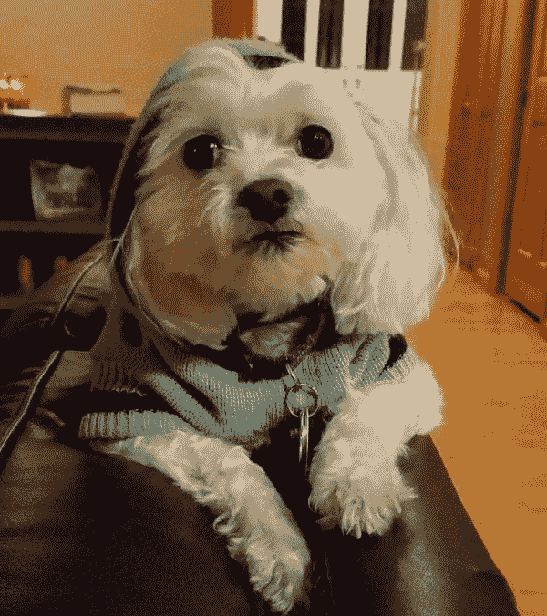
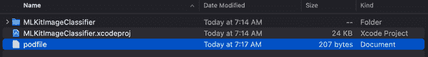
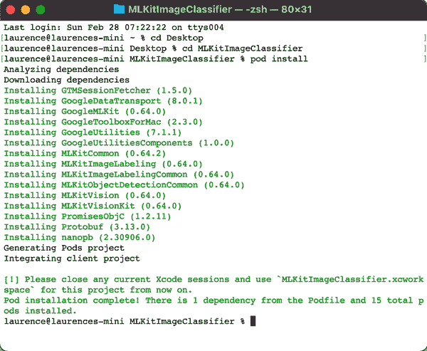
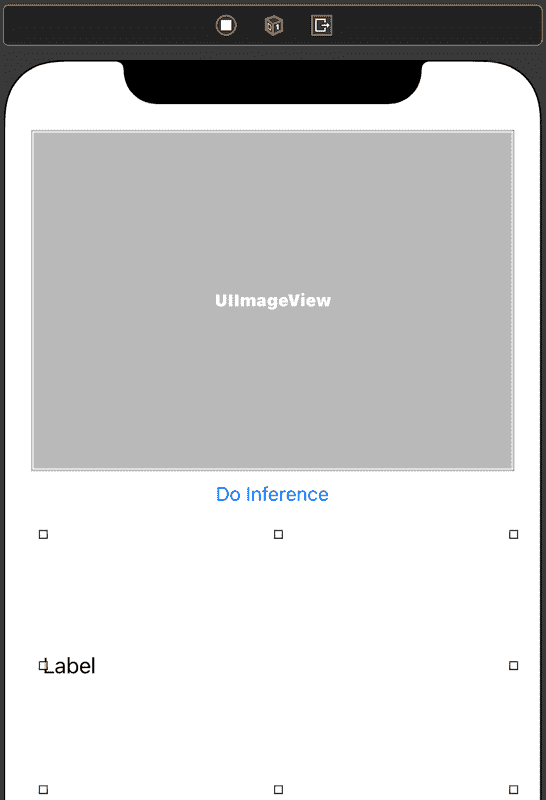
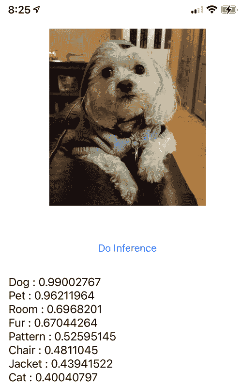
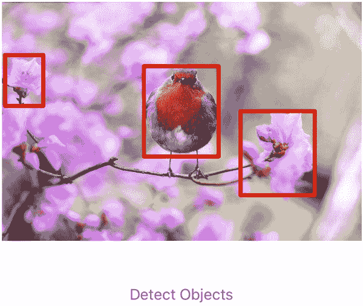
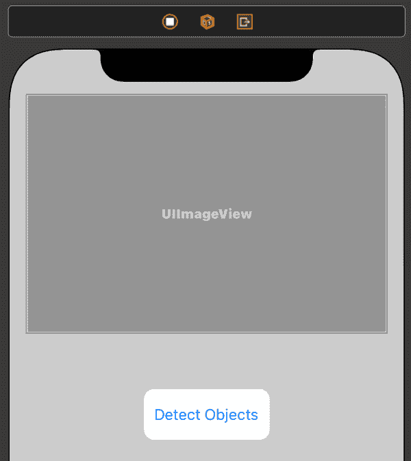
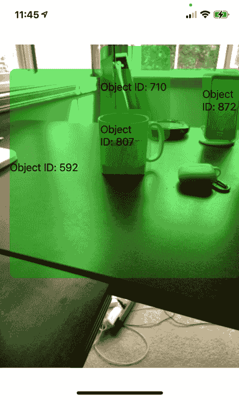

# 第六章：计算机视觉应用程序与 iOS 上的 ML Kit

第 3 章介绍了 ML Kit 及其在移动应用程序中进行人脸检测的用途。在第 4 章中，我们还介绍了如何在 Android 设备上执行更复杂的场景——图像标签和分类，以及静态图像和视频中的对象检测。在本章中，我们将看到如何在 iOS 中使用 ML Kit 执行相同的场景，使用 Swift 语言。让我们从图像标签和分类开始。

# 图像标签和分类

计算机视觉的一个核心概念是图像分类，您向计算机提供一张图像，计算机会告诉您图像包含的内容。在最高级别上，您可以给它一张狗的图片，比如图 6-1，它会告诉您图像中包含一只狗。

ML Kit 的图像标签功能进一步扩展了这一点，它将为您提供一张图片中“看到”的物品列表，每个物品都附带概率级别。因此，对于图 6-1 中的图片，它不仅会看到一只狗，还可能看到一只宠物、一个房间、一件夹克等等。在 iOS 上构建这样的应用程序非常简单，让我们一步步来探索。

###### 注意

在撰写本文时，ML Kit 的 pod 在运行 Mac 上的 iOS 模拟器时可能会出现一些问题。应用程序仍然可以在设备上运行，并且还可以在 Xcode 中的“My Mac（专为 iPad 设计）”运行时设置下运行。



###### 图 6-1\. iPhone 图像分类的示例图片

## 步骤 1：在 Xcode 中创建应用程序

您将使用 Xcode 创建应用程序。在 Xcode 中使用应用程序模板，确保您的界面类型为 Storyboard，语言为 Swift。如果您对这些步骤不熟悉，请参阅第 3 章，我们在其中详细介绍了这些步骤。为应用程序取任何您喜欢的名字，但在我的情况下，我使用了 MLKitImageClassifier 作为名称。完成后，关闭 Xcode。在下一步中，您将添加一个 pod 文件，安装后它会提供一个新文件以打开 Xcode。

## 步骤 2：创建 Podfile

此步骤要求您的开发环境中已安装 CocoaPods。CocoaPods 是一个依赖管理工具，可帮助您轻松向 iOS 应用程序添加第三方库。由于 ML Kit 来自 Google，并未集成到 Xcode 中，因此您需要通过 CocoaPods 将其作为“pod”添加到任何应用程序中。您可以在[*http://cocoapods.org*](http://cocoapods.org)找到 CocoaPods 的安装说明，并在我们逐步示例中为您提供选择适当 pod 的代码。

在创建项目的目录中，添加一个新文件。命名为*podfile*，没有扩展名。保存后，您的项目目录结构应如图 6-2 所示。



###### 图 6-2\. 将 Podfile 添加到项目文件夹中

编辑此文件的内容，使其如下所示：

```
platform :ios, '10.0'

target 'MLKitImageClassifier' do
        pod 'GoogleMLKit/ImageLabeling'
end
```

注意以`target`开头的行。在`target`后面，应该用引号括起来你的项目名称，前面的案例中是`MLKitImageClassifier`，但如果你使用了其他名称，请确保修改代码以适应你的项目名称。

完成并保存后，请使用 Terminal 导航到该文件夹。输入命令`**pod install**`。您应该看到类似图 6-3 的输出。



###### 图 6-3\. 安装图像分类器 CocoaPod

最后，注意到末尾要求您从现在开始使用*.xcworkspace*文件。当您在步骤 1 中创建项目时，您将使用*.xcproject*文件在 Xcode 中打开它。这些文件无法处理通过 pods 包含的外部库，但*.xcworkspace*可以。因此，今后应该使用该文件。现在使用 Xcode 打开它吧！

## 第三步：设置 Storyboard

*main.storyboard*文件将包含您应用程序的用户界面。在其中添加一个 UIImage 视图，并将其属性设置为 Aspect Fit。然后，添加一个按钮控件，并将其文本更改为“Do Inference”。最后，添加一个 UILabel，并使用属性检查器将其 Lines 属性设置为“0”，以确保它将具有多行文本。调整标签的大小以确保有足够的空间。完成后，您的 Storyboard 应该类似于图 6-4。



###### 图 6-4\. 创建简单的 Storyboard

接下来，您需要为图像和标签控件创建 outlet，并为按钮创建一个 action。您可以通过打开一个独立的窗口，将控件拖动到*ViewController.swift*文件中来完成此操作。如果您对此不熟悉，请参考第三章中的详细示例。

或许会感到困惑，不知道何时需要 outlet，何时需要 action，所以我喜欢这样思考。如果你想要读取或设置控件的属性，则需要一个“outlet”。因此，例如，我们需要*读取*图像视图控件的内容以传递给 ML Kit 进行分类。您还需要*写入*标签的内容以渲染结果。因此，它们都需要设置一个 outlet，并且该 outlet 的名称是您在代码中引用这些控件的方式。当您需要响应用户对控件进行操作，例如按下按钮时，您将需要一个“action”。当您将控件拖放到代码编辑器时，将提供使用 outlet 或 action 的选项，因此现在为 UIImageView 和 Label 创建 outlet，并分别命名为`imageView`和`lblOutput`。然后为按钮创建一个 action。您可以将此操作命名为`doInference`。

当您完成时，您的*ViewController.swift*文件应该如下所示：

```
import UIKit

class ViewController: UIViewController {

    @IBOutlet weak var imageView: UIImageView!
    @IBOutlet weak var lblOutput: UILabel!
    @IBAction func doInference(_ sender: Any) {
    }
    override func viewDidLoad() {
        super.viewDidLoad()
        // Do any additional setup after loading the view.
    }

}
```

接下来你将编辑以实现图像分类代码。不过，在此之前，你需要一个要分类的图像！你可以从文件系统中选择任何图像并将其拖到 Xcode 中。将其拖放到你的项目中，与你的 Storyboard 文件位于同一文件夹中。你会得到一个对话框让你选择选项。保持默认设置，但确保“添加到目标”旁边的复选框被选中以确保图像被编译到你的应用程序中，这样在运行时就可以加载它。

## 第四步：编辑视图控制器代码以使用 ML Kit

现在你的应用程序什么都做不了，图片还没有加载，也没有编写处理按钮按下的代码。让我们在本节中逐步构建该功能。

首先，为了加载图像，你可以在应用程序第一次启动时添加到`viewDidLoad`函数中的代码。这只需简单地在`imageView`上设置`.image`属性即可：

```
// On view did load we only need to initialize the image,
// so we can do that here
override func viewDidLoad() {
    super.viewDidLoad()
    // Do any additional setup after loading the view.
    imageView.image = UIImage(named:"fig6-1dog.jpg")
}
```

如果你现在启动应用程序，图片会被渲染，但不会发生太多其他事情。通常用户会按下按钮，你需要对该操作做出响应。你已经设置了`doInference`动作，所以让它调用一个名为`getLabels`的函数，使用`imageView`中的图片作为参数：

```
@IBAction func doInference(_ sender: Any) {
    getLabels(with: imageView.image!)
}
```

Xcode 会抱怨因为你还没有实现这个函数。没关系，你接下来会做这件事。这个函数的作用是获取图像的内容并传递给 ML Kit 以获取一组标签。因此，在你编写代码之前，确保你已经引用了相关的 ML Kit 库。在你的*ViewController.swift*文件顶部添加这些行：

```
// Import the MLKit Vision and Image Labeling libraries
import MLKitVision
import MLKitImageLabeling
```

要使用 ML Kit 进行图像标记，您需要完成以下任务：

+   将图像转换为 VisionImage 类型。

+   设置图像标签器的选项并使用这些选项进行初始化。

+   调用图像标签器并捕获异步回调。

因此，首先将图像转换为`VisionImage`，你将编写如下代码：

```
    let visionImage = VisionImage(image: image)
    visionImage.orientation = image.imageOrientation
```

然后，通过设置一些选项来初始化标签器。在这种情况下，你可以简单地使用置信度阈值的选项。虽然它可以标记图像中的许多物体，但目标是返回超过某个概率的标签。例如，图像在 Figure 6-1 中，尽管是一只狗，但实际上有超过 0.4 的概率（即 40%）也是一只猫！因此，你可以将置信度阈值设置为 0.4 来查看：

```
    let options = ImageLabelerOptions()
    options.confidenceThreshold = 0.4
    let labeler = ImageLabeler.imageLabeler(options: options)
```

现在，你有了一个标签器和一个以所需格式的图像，你可以将其传递给标签器。这是一个异步操作，因此在处理过程中不会锁定用户界面。相反，你可以指定一个回调函数，在推理完成时调用它。标签器将返回两个对象：“labels”用于推理结果，“error”如果失败。然后，你可以将它们传递给自己的函数（在这种情况下称为`processResult`）来处理它们：

```
    labeler.process(visionImage) { labels, error in
        self.processResult(from: labels, error: error)
    }
```

为方便起见，这里是整个`getLabels func`：

```
// This is called when the user presses the button
func getLabels(with image: UIImage){
    // Get the image from the UI Image element
    // and set its orientation
    let visionImage = VisionImage(image: image)
    visionImage.orientation = image.imageOrientation

    // Create Image Labeler options, and set the
    // threshold to 0.4 so we will ignore all classes
    // with a probability of 0.4 or less
    let options = ImageLabelerOptions()
    options.confidenceThreshold = 0.4

    // Initialize the labeler with these options
    let labeler = ImageLabeler.imageLabeler(options: options)

    // And then process the image, with the
    // callback going to self.processresult
    labeler.process(visionImage) { labels, error in
        self.processResult(from: labels, error: error)
 }
}
```

标签器完成其工作后，将调用`processResult`函数。如果你输入了前面的代码，Xcode 可能会抱怨找不到此函数。因此，让我们接着实现它！

ML Kit 返回的标签集合是一个`ImageLabel`对象的数组。因此，你需要让你的函数使用该类型作为`from`参数。这些对象有一个`text`属性，其中包含标签描述（例如，`cat`），还有一个置信度属性，表示图像匹配该标签的概率（例如，0.4）。因此，你可以遍历该集合并使用以下代码构建包含这些值的字符串。然后，它将把`lblOutput`文本设置为你构建的字符串。以下是完整代码：

```
// This gets called by the labeler's callback
func processResult(from labels: [ImageLabel]?, error: Error?){
    // String to hold the labels
    var labeltexts = ""
    // Check that we have valid labels first
    guard let labels = labels else{
        return
    }
    // ...and if we do we can iterate through
    // the set to get the description and confidence
    for label in labels{
        let labelText = label.text + " : " +
                        label.confidence.description + "\n"
        labeltexts += labelText
    }
    // And when we're done we can update the UI
    // with the list of labels
    lblOutput.text = labeltexts
}
```

一切就是这样！当你运行应用程序并按下按钮时，你会看到类似于图 6-5 的东西。

你可以看到，虽然 ML Kit 非常确定它在看一只狗，但它也有 40% 的可能性是一只猫！

显而易见，这是一个超级简单的应用程序，但希望它展示了如何在 iOS 上仅使用几行代码快速简便地使用 ML Kit 进行图像标记！



###### 图 6-5\. 在狗图片上使用此应用程序进行推断

# iOS 中的物体检测与 ML Kit

接下来，让我们探索一个类似的场景，像图像分类一样，我们再进一步。不仅让设备识别图像中的*什么*，让它也能识别图像中的*哪里*，使用边界框为用户绘制。

例如，看看图 6-6。这个应用程序看到这张图片，并检测到其中的三个对象。



###### 图 6-6\. iOS 中的物体检测应用

## 步骤 1：开始

创建这个应用程序非常简单。像以前一样创建一个新的 iOS 应用程序。在新项目设置对话框中使用 Swift 和故事板，给它任何你喜欢的名字。在这种情况下，我将我的项目命名为*MLKitObjectDetector*。

在项目目录中，你将创建一个 Podfile，就像在前面的部分中所做的那样，但这次你将指定要使用 ML Kit 的物体检测库，而不是图像标签库。你的 Podfile 应该看起来像这样：

```
platform :ios, '10.0'
# Comment the next line if you're not using Swift and don't want to use dynamic
# frameworks
use_frameworks!

target 'MLKitObjectDetector' do
        pod 'GoogleMLKit/ObjectDetection'
end
```

注意，目标设置应为您在 Xcode 中创建的项目名称（在我的情况下，我使用了 *MLKitObjectDetector*），并且 pod 应为 *GoogleMLKit/ObjectDetection*。

当完成时，运行 `**pod install**` 下载所需的依赖项，然后将为您创建一个新的 *.xcworkspace* 文件。打开此文件以继续。

## 步骤 2: 在 Storyboard 上创建您的用户界面

这个应用比图像标注应用更简单，因为它只有两个用户界面元素——一个您希望进行对象检测的图像，并且您将在其上绘制边界框，以及一个用户按下以触发对象检测的按钮。因此，在 storyboard 中添加一个 UIImageView 和一个按钮。编辑按钮以更改其文本为“检测对象”。当您完成时，您的 storyboard 应该看起来像图 6-7 中的示例。



###### 图 6-7\. 对象检测应用的 storyboard

您需要为图像视图创建一个输出口，并为按钮创建一个操作。如果您对这些不熟悉，我建议您返回到第三章，并完成那里的示例，以及本章前面的图像标注示例。

当完成时，您的 *ViewController.swift* 文件将定义了输出口和操作，并应如下所示：

```
import UIKit

class ViewController: UIViewController {
    @IBOutlet weak var imageView: UIImageView!
    @IBAction func doObjectDetection(_ sender: Any) {
    }

    override func viewDidLoad() {
        super.viewDidLoad()
        // Do any additional setup after loading the view.
    }

}
```

在上述代码中，我将 UIImageView 的输出命名为 `imageView`，按钮按下时的操作命名为 `doObjectDetection`。

您需要向项目中添加一张图像，以便将其加载到 UIImageView 中。在这种情况下，我有一个称为 *bird.jpg* 的图像，并且加载它的代码在 `viewDidLoad()` 中看起来像这样：

```
imageView.image = UIImage(named: "bird.jpg")
```

## 步骤 3: 创建注释的子视图

当从 ML Kit 收到检测到的对象时，此应用会在图像上绘制边界框。在进行推理之前，让我们确保可以在图像上进行绘制。为此，您需要在图像顶部绘制一个子视图。该子视图将是透明的，并在其上绘制边界框。由于它位于图像顶部并且除了矩形之外是透明的，因此看起来好像矩形是绘制在图像上的。

在 *ViewController.swift* 中将此视图声明为 UIView 类型。使用 Swift，您可以指定如何实例化视图，例如，确保视图已经加载，确保此视图将在包含您图片的 UIImageView 之后加载，使加载更容易！请参见以下示例：

```
/// An overlay view that displays detection annotations.
private lazy var annotationOverlayView: UIView = {
  precondition(isViewLoaded)
  let annotationOverlayView = UIView(frame: .zero)
  annotationOverlayView
      .translatesAutoresizingMaskIntoConstraints = false
  return annotationOverlayView
}()
```

声明完成后，您现在可以在 `viewDidLoad` 函数中实例化和配置它，将其作为 `imageView` 的子视图添加进去。您还可以使用 `NSLayoutConstraint` 激活它，以确保它与 `imageView` 的尺寸匹配：

```
override func viewDidLoad() {
        super.viewDidLoad()
        // Do any additional setup after loading the view.
        imageView.image = UIImage(named: "bird.jpg")
        imageView.addSubview(annotationOverlayView)
        NSLayoutConstraint.activate([
          annotationOverlayView.topAnchor.constraint(
              equalTo: imageView.topAnchor),
          annotationOverlayView.leadingAnchor.constraint(
              equalTo: imageView.leadingAnchor),
          annotationOverlayView.trailingAnchor.constraint(
              equalTo: imageView.trailingAnchor),
          annotationOverlayView.bottomAnchor.constraint(
              equalTo: imageView.bottomAnchor),
        ])

    }
```

## 步骤 4: 执行对象检测

在您可以使用 ML Kit 的对象检测 API 之前，需要将它们包含在您的代码文件中。您可以通过以下方式实现：

```
import MLKitVision
import MLKitObjectDetection
```

然后，在为用户按下按钮创建的操作中，添加以下代码：

```
runObjectDetection(with: imageView.image!)
```

Xcode 将抱怨这个函数还没有被创建。没关系，现在就来创建它！在您的*ViewController.swift*文件中创建`runObjectDetection`函数：

```
func runObjectDetection(with image: UIImage){
}
```

与本章前面的图像标注类似，使用 ML Kit 执行对象检测的过程非常简单：

+   将您的图像转换为`VisionImage`。

+   创建一个包含所选选项的选项对象，并使用这些选项实例化一个对象检测器。

+   将图像传递给对象检测器，并在回调中捕获其响应。

让我们详细了解如何在刚刚创建的函数中执行每个步骤。首先，将您的图像转换为`VisionImage`：

```
let visionImage = VisionImage(image: image)
```

然后使用这些选项创建选项对象，并实例化一个对象检测器：

```
let options = ObjectDetectorOptions()
options.detectorMode = .singleImage
options.shouldEnableClassification = true
options.shouldEnableMultipleObjects = true
let objectDetector = ObjectDetector.objectDetector(
                                      options: options)
```

探索 ML Kit 文档以获取选项类型；这里使用的选项非常常见。`EnableClassification`不仅提供边界框，还提供 ML Kit 对对象的分类。基础模型（您在这里使用的模型）只能识别五种非常通用的对象类型，如“时尚物品”或“食品物品”，因此请合理管理您的期望！当设置了`EnableMultipleObjects`选项时，允许检测多个对象，如图 6-6 中所示，检测到三个物品——鸟和两朵花，并绘制了边界框。

最后，您将传递图像给对象检测器，以便它推断图像中检测到的对象的标签和边界框。这是一个异步函数，因此您需要指定在推断完成时回调的函数。ML Kit 将返回一个`detectedObjects`列表和一个错误对象，因此您可以简单地将它们传递给下一个将要创建的函数：

```
objectDetector.process(visionImage)
    { detectedObjects, error in
       self.processResult(from: detectedObjects, error: error)
    }
```

## 第 5 步：处理回调

在上一步中，我们定义了回调函数`processResult`。因此，让我们首先创建它。它以`detectedObjects`（一个`Object`数组）作为`from:`参数，并以`Error`对象作为`error:`参数。以下是代码：

```
func processResult(from detectedObjects: [Object]?,
                   error: Error?){
}
```

接下来，如果`detectedObjects`数组为空，我们将退出，以免浪费时间尝试绘制或更新覆盖层：

```
guard let detectedObjects = detectedObjects else{
    return
}
```

接下来，您将遍历所有检测到的对象，并绘制检测到的边界框。

处理回调以收集边界框比在本章前面探讨的图像分类场景稍微复杂一些。这是因为屏幕上渲染的图像可能具有与底层图像不同的尺寸。当你将图像传递给 ML Kit 时，你传递的是整个图像，因此返回的边界框是相对于图像的。如果这看起来没有意义，可以这样考虑。想象一下，你的图像是 10000×10000 像素。在你的屏幕上呈现的可能是 600×600 像素。当从 ML Kit 返回边界框时，它们将相对于 10000×10000 像素的图像，因此你需要将它们转换为正确显示图像的坐标。

因此，你将首先为图像计算一个变换矩阵，然后可以应用这个矩阵来获得一个变换后的矩形。

这是完整的代码。我不会详细解释，但主要目的是获取底层图像的尺寸，并将其缩放到 UIImage 控件中渲染的图像大小：

```
private func transformMatrix() -> CGAffineTransform {
    guard let image = imageView.image else {
            return CGAffineTransform() }
    let imageViewWidth = imageView.frame.size.width
    let imageViewHeight = imageView.frame.size.height
    let imageWidth = image.size.width
    let imageHeight = image.size.height

    let imageViewAspectRatio =
      imageViewWidth / imageViewHeight
    let imageAspectRatio = imageWidth / imageHeight
    let scale =
      (imageViewAspectRatio > imageAspectRatio)
        ? imageViewHeight / imageHeight :
          imageViewWidth / imageWidth

    // Image view's `contentMode` is `scaleAspectFit`,
    // which scales the image to fit the size of the
    // image view by maintaining the aspect ratio.
    //  Multiple by `scale` to get image's original size.
    let scaledImageWidth = imageWidth * scale
    let scaledImageHeight = imageHeight * scale

     let xValue =
      (imageViewWidth - scaledImageWidth) / CGFloat(2.0)

     let yValue =
      (imageViewHeight - scaledImageHeight) / CGFloat(2.0)

    var transform = CGAffineTransform.identity.translatedBy(
                      x: xValue, y: yValue)
    transform = transform.scaledBy(x: scale, y: scale)
    return transform
}
```

现在你可以转换图像，接下来的事情是迭代每个对象，提取结果并进行相应的转换。你将通过循环遍历检测到的对象，并使用它们的 frame 属性来做到这一点，该属性包含了边界框的框架。

现在，由于你刚刚创建的变换矩阵，这个循环变得很简单：

```
for obj in detectedObjects{
    let transform = self.transformMatrix()
    let transformedRect = obj.frame.applying(transform)
}
```

给定你现在有一个与渲染图像匹配的转换矩形，接下来你会想要绘制这个矩形。之前你创建了与图像匹配的注释叠加视图。因此，你可以通过向该叠加视图添加一个矩形子视图来进行绘制。这里是代码：

```
self.addRectangle(transformedRect,
                  to: self.annotationOverlayView)
```

你还没有一个`addRectangle`函数，但现在创建一个非常简单。你只需创建一个具有矩形尺寸的新视图，并将其添加到指定的视图中。在这种情况下，即`annotationOverlayView`。

这里是代码：

```
private func addRectangle(_ rectangle: CGRect,
                         to view: UIView) {

    let rectangleView = UIView(frame: rectangle)
    rectangleView.layer.cornerRadius = 2.0
    rectangleView.layer.borderWidth = 4
    rectangleView.layer.borderColor = UIColor.red.cgColor
    view.addSubview(rectangleView)
}
```

就是这样！你现在创建了一个可以识别图像中元素并返回其边界框的应用程序。尝试使用不同的图像进行探索。

它给出的分类非常有限，但是现在你有了边界框，你可以根据边界框裁剪原始图像，并将该裁剪区域传递给图像标签器，以获取更细粒度的描述！下面你将探索这一点。

## 结合对象检测和图像分类

之前的示例展示了如何进行对象检测，并获取图像中检测到的对象的边界框。ML Kit 的基础模型只能对少数类别进行分类，如“时尚商品”、“美食”、“家居商品”、“地点”或“植物”。然而，它能够检测图像中的不同对象，正如我们在前面的示例中看到的那样，它发现了鸟和两朵花。它只是不能*分类*它们。

如果您想要这样做，在结合对象检测与图像分类的选项中有一个选项。因为您已经有了图像中项目的边界框，您可以将图像裁剪到它们，然后使用图像标签获取该子图像的详细信息。

因此，您可以更新您的处理结果，使用每个对象的帧属性来裁剪图像，并将裁剪后的图像加载到一个名为`croppedImage`的新`UIImage`中，如下所示：

```
guard let cutImageRef: CGImage =
    theImage?.cgImage?.cropping(to: obj.frame)
    else {break}

let croppedImage: UIImage = UIImage(cgImage: cutImageRef)
```

图像标签 API 使用一个`VisionImage`对象，正如您在本章前面看到的那样。因此，表示裁剪图像的`UIImage`可以转换如下：

```
let visionImage = VisionImage(image: croppedImage)
```

首先，您需要实例化一个图像标签器。以下代码将会实例化一个置信阈值为 0.8 的标签器：

```
let options = ImageLabelerOptions()
options.confidenceThreshold = 0.8
let labeler = ImageLabeler.imageLabeler(options: options)
```

然后，您只需将`VisionImage`对象传递给标签器，并指定回调函数来处理结果：

```
labeler.process(visionImage) {labels, error in
    self.processLabellingResult(from: labels, error: error)
}
```

您的回调函数可以处理从每个对象推断出的标签，就像本章早些时候所做的那样。

## 视频中的对象检测和跟踪

虽然本书超出了演示实时视频叠加的范围，但在仓库中的“Chapter6ObjectTracking”示例应用程序为您实现了它。它使用来自 Apple 的 CoreVideo 来实现一个`AVCaptureVideoPreviewLayer`和一个`AVCaptureSession`。

捕捉然后委托给`ViewController`的扩展，它将从基于`AVCaptureSession`的`AVCaptureConnection`中捕获帧。

这里需要强调的重点是，您可以如何使用此视频的帧，将它们传递给 ML Kit，并获取对象检测结果。然后，您可以使用这些结果在实时视频上叠加边界框。

当您创建一个使用 Apple 的 AVFoundation 进行实时视频预览的应用程序时，您将拥有一个名为`captureOutput`的委托函数，它接收包含帧详细信息的缓冲区。这可以用来创建一个`VisionImage`对象，然后可以像这样与 ML Kit 中的对象检测 API 一起使用：

```
func captureOutput(_ output: AVCaptureOutput,
                   didOutput sampleBuffer: CMSampleBuffer,
                   from connection: AVCaptureConnection) {

  guard let imageBuffer = CMSampleBufferGetImageBuffer(sampleBuffer)
        else {
            print("Failed to get image buffer from sample buffer.")
            return
        }

  lastFrame = sampleBuffer
  let visionImage = VisionImage(buffer: sampleBuffer)
  let orientation = UIUtilities.imageOrientation(
      fromDevicePosition: .back
  )

  visionImage.orientation = orientation
  let imageWidth = CGFloat(CVPixelBufferGetWidth(imageBuffer))
  let imageHeight = CGFloat(CVPixelBufferGetHeight(imageBuffer))
  let shouldEnableClassification = false
  let shouldEnableMultipleObjects = true
  let options = ObjectDetectorOptions()
  options.shouldEnableClassification = shouldEnableClassification
  options.shouldEnableMultipleObjects = shouldEnableMultipleObjects
  detectObjectsOnDevice(
      in: visionImage,
      width: imageWidth,
      height: imageHeight,
      options: options)
  }
```

当您从委托获得捕获的输出时，它将包含一个样本缓冲区。然后可以用来获取包含帧的图像缓冲区。

从中，您可以使用以下方法将缓冲区转换为`VisionImage`类型：

```
  let visionImage = VisionImage(buffer: sampleBuffer)
```

要在视频中跟踪对象，您需要禁用对象的分类，并启用多对象检测。您可以通过以下方式实现：

```
  let shouldEnableClassification = false
  let shouldEnableMultipleObjects = true
  let options = ObjectDetectorOptions()
  options.shouldEnableClassification = shouldEnableClassification
  options.shouldEnableMultipleObjects = shouldEnableMultipleObjects
```

现在，考虑到您有图像、选项和图像的尺寸，您可以调用一个辅助函数来执行对象检测：

```
  detectObjectsOnDevice(
      in: visionImage,
      width: imageWidth,
      height: imageHeight,
      options: options)
  }
```

此函数的作用将是调用 ML Kit 来获取帧中检测到的对象，然后为它们计算边界框，并显示带有跟踪 ID 的这些框。

因此，首先要检测对象：

```
let detector = ObjectDetector.objectDetector(options: options)
      var objects: [Object]
      do {
        objects = try detector.results(in: image)
      } catch let error {
        print("Failed with error: \(error.localizedDescription).")
        return
      }
```

然后，一旦它们被检测到，它们的边界框将以`object.frame`返回。这需要被归一化以绘制在预览叠加层上，它通过将其值除以帧的宽度来简单地归一化：

```
for object in objects {
    let normalizedRect = CGRect(
          x: object.frame.origin.x / width,
          y: object.frame.origin.y / height,
          width: object.frame.size.width / width,
          height: object.frame.size.height / height
)
```

预览层提供了一种将归一化矩形转换为与预览层坐标系统匹配的方法，因此您可以像这样将其添加到预览层中：

```
let standardizedRect = strongSelf.previewLayer.layerRectConverted(
  fromMetadataOutputRect: normalizedRect
).standardized

 UIUtilities.addRectangle(
  standardizedRect,
  to: strongSelf.annotationOverlayView,
  color: UIColor.green
)
```

（`UIUtilities`是您可以在存储库中找到的辅助工具类。）您可以在 iPhone 上看到它在图 6-8 中的实际应用。



###### 图 6-8\. 视频中的物体检测和跟踪

有了这些工具，您应该能够在 iOS 上使用 Swift 创建基本的计算机视觉应用程序，使用 ML Kit。在第十一章中，您将看到如何使用自定义模型，而不是依赖于 ML Kit 的基础模型！

# 总结

在本章中，您看到了如何使用 ML Kit 的计算机视觉算法，包括图像标注和物体检测。您看到了如何将这些功能组合起来，扩展 ML Kit 提供的基本模型，以便对从物体检测返回的边界框的内容进行分类。您还看到了如何在实时视频中使用物体检测，并获得了如何在实时视频上添加边界框的示例！这为您提供了在构建使用图像的应用程序时继续前进的基础，无论是用于分类还是物体检测的目的。
