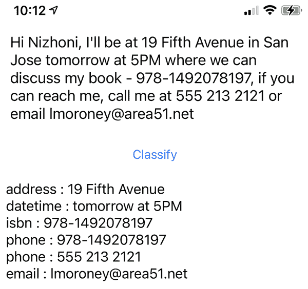
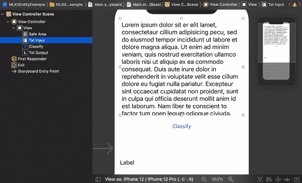
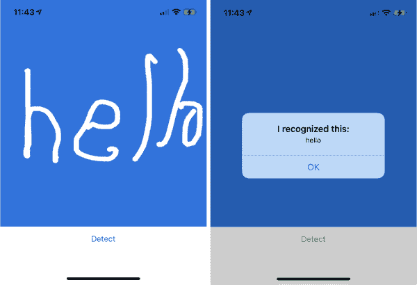
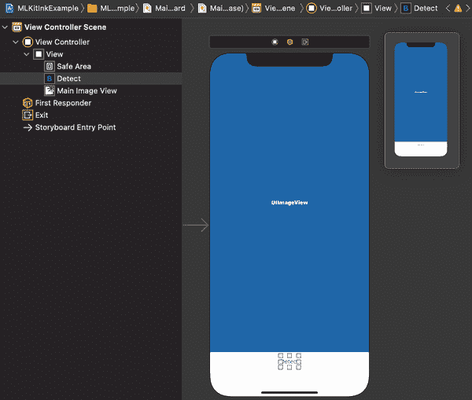
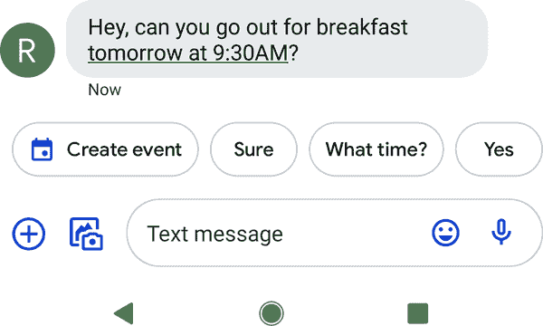
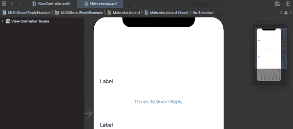
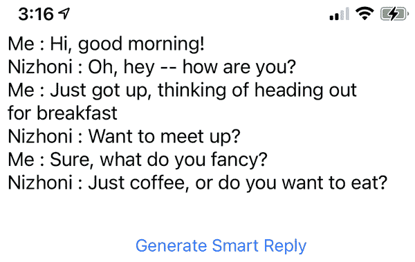
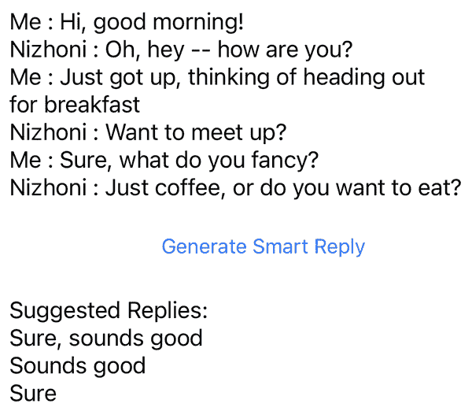

# 第七章：在 iOS 上使用 ML Kit 进行文本处理应用程序

在第六章中，您了解了如何在 iOS 应用程序中使用 ML Kit 处理一些计算机视觉场景，包括图像识别和物体检测。也许 ML 应用程序的下一个最大领域是执行自然语言处理任务。因此，在本章中，我们将看一些示例，了解 ML Kit 模型如何为您提供一些常见的机器学习任务，包括从文本中提取实体，例如识别电子邮件地址或日期；执行手写识别，将笔画转换为文本；以及分析对话以生成智能回复。如果您想创建使用自定义模型的其他自然语言处理概念的应用程序，例如分类文本，您需要构建自己的模型，我们将在后面的章节中探讨这一点。

# 实体提取

您经常需要从文本中提取重要信息。毫无疑问，您已经见过可以确定文本中是否有地址并自动生成该地址地图链接的应用程序，或者了解电子邮件地址并生成链接，让您启动电子邮件应用程序发送邮件至该地址的应用程序。这个概念称为*实体提取*，在本节中，您将探索一个可以为您执行此操作的即插即用模型。这是 ML 的一个非常酷的实现，因为如果考虑到一个基于规则的方法如何解决这个问题，您会期望编写大量的代码！

因此，请考虑图 7-1，我已向我的朋友 Nizhoni 发送了一条带有一些细节的消息。作为人类阅读这段话时，您会自动从中提取有价值的信息并解析它。您会看到诸如“明天下午 5 点”的词语，并自动推断日期和时间。为此编写代码会有大量的 if...then 语句！



###### 图 7-1\. 在 iOS 上运行实体提取

正如你在文本下面所看到的，生成了一个包含找到的实体的列表。例如，“明天下午 5 点”被提取为日期时间。其他如电话号码和电子邮件地址也被正确提取。通常一个值会匹配多个模式；例如，书籍的 ISBN 号以三位数字开头，这与电话号码的模式匹配，因此被检测为两个实体！

现在让我们探索一下如何创建这个应用程序！

## 步骤 1: 创建应用程序并添加 ML Kit Pods

使用 Xcode 创建一个新的应用程序。完成后，关闭 Xcode 并在 *.xcproject* 文件所在的目录中创建一个 Podfile。

编辑 Podfile，像这样包括 *GoogleMLKit/EntityExtraction* pod：

```
platform :ios, '10.0'
# Comment the next line if you're not using Swift and don't want to use dynamic
# frameworks
use_frameworks!

target 'MLKitEntityExample' do
        pod 'GoogleMLKit/EntityExtraction'
end
```

`target` 后面的值应该是你项目的名称，在这个例子中我创建了一个名为 *MLKitEntityExample* 的项目。

完成后，运行 `**pod install**`；CocoaPods 将更新您的项目以使用 ML Kit 依赖项，并生成一个 *.xcworkspace* 文件，您应该打开该文件以进行下一步操作。

## 第二步：创建带有操作和输出的故事板

正如您在图 7-1 中看到的那样，这个应用的用户界面非常简单。在布局中添加一个 TextView、一个 Button 和一个 Label 控件，布局类似于您在图 7-1 中看到的样子。确保在将其放置在故事板后，通过检查属性检查器中的可编辑框来使 TextView 可编辑。

当您完成时，您的故事板设计器应该类似于图 7-2。



###### 图 7-2\. 在故事板编辑器中设计用户界面

接下来，您应该为 TextView 和 Label 创建 outlets，分别命名为 `txtInput` 和 `txtOutput`。还要为按钮创建一个动作，并将其命名为 `doExtraction`。如果您不熟悉 outlets 和 actions 的过程，请返回第三章和第六章获取更多指导示例。

完成后，您的 `ViewController` 类应包含以下代码：

```
@IBOutlet weak var txtInput: UITextView!
@IBOutlet weak var txtOutput: UILabel!
@IBAction func doExtraction(_ sender: Any) {
}
```

## 第三步：允许您的视图控制器用于文本输入

当用户点击顶部的文本视图时，他们将能够通过设备键盘编辑其内容。但是，默认情况下，键盘在完成后不会自动消失。要实现此功能，您需要更新 `ViewController` 以成为 `UITextViewDelegate`，如下所示：

```
class ViewController: UIViewController, UITextViewDelegate {
```

完成后，您可以添加以下函数，以使键盘在用户按下 Enter 键时离开：

```
func textView(_ textView: UITextView,
              shouldChangeTextIn range: NSRange,
              replacementText text: String) -> Bool {

    if (text == "\n") {
        textView.resignFirstResponder()
        return false
    }
    return true
}
```

最后，您需要通过将以下代码添加到 `viewDidLoad` 函数中，告知 iOS，`txtInput` 控件将 TextView 事件委托给此 `ViewController`：

```
txtInput.delegate = self
```

现在，您可以允许用户输入文本了。接下来，让我们看看如何从这段文本中提取实体！

## 第四步：初始化模型

ML Kit 的实体提取器支持许多语言模型，因此您首先需要通过使用 `EntityExtractorOptions` 来定义您想要的语言模型。在本例中，我指定要使用英文实体提取器：

```
var entityExtractor =
  EntityExtractor.entityExtractor(options:
    EntityExtractorOptions(
modelIdentifier:EntityExtractionModelIdentifier.english))
```

支持多种不同的语言，完整列表请参见 [*https://developers.google.com/ml-kit/language/entity-extraction*](https://developers.google.com/ml-kit/language/entity-extraction)*.*

当用户按下按钮时，不能保证模型已在设备上，因此您可以在 `viewDidLoad` 中使用以下代码来下载它，并设置一个布尔标志指示它是否可用，稍后将进行检查：

```
entityExtractor.downloadModelIfNeeded(completion: { error in
    guard error == nil else {
        self.txtOutput.text = "Error downloading model, please restart app."
        return
    }
    self.modelAvailable = true
})
```

## 第五步：从文本中提取实体

之前，当您为按钮创建操作时，您获取了一个名为`doExtraction`的函数。在其中，您希望调用`extractEntities`，您将很快创建它，但仅当模型可用时。在步骤 3 中下载了模型，并且当完成时将`modelAvailable`设置为`true`，因此可以使用以下代码：

```
@IBAction func doExtraction(_ sender: Any) {
    if(modelAvailable){
        extractEntities()
    } else {
        txtOutput.text = "Model not yet downloaded, please try later."
    }
}
```

您现在可以创建`extractEntities`函数，并在其中使用刚刚创建的`entityExtractor`与`txtInput`中的文本一起获取文本中的实体。

首先创建用于提取实体的代码如下：

```
func extractEntities(){
    let strText = txtInput.text
    entityExtractor.annotateText(
        strText!,
          completion: {
          }
}
```

在这里，您将文本传递给`entityExtractor`的`annotateText`方法。它将在完成时给您一个回调，并且回调将包含结果和错误数据结构。结果将是一组注释的列表，每个注释将是一组实体的列表。

一个实体具有`entityType`属性，定义了注释类型，例如电子邮件、地址或 ISBN。实体具有一个范围属性，包含文本的位置和长度。因此，如果电子邮件地址位于第 20 个字符，并且长度为 15 个字符，则`annotation.range.location`将为 20，`annotation.range.length`将为 15。您可以使用这个来切割字符串以获取所需的文本。

这里是完整的代码：

```
func extractEntities(){
  let strText = txtInput.text
  entityExtractor.annotateText(strText!,
    completion: {
      results, error in
      var strOutput = ""
      for annotation in results! {
        for entity in annotation.entities{
          strOutput += entity.entityType.rawValue + " : "
          let startLoc = annotation.range.location
          let endLoc = startLoc + annotation.range.length - 1
          let mySubString = strText![startLoc...endLoc]
          strOutput += mySubString + "\n"
        }
      }
      self.txtOutput.text = strOutput
    })
}
```

Swift 字符串切片比你想象的更复杂！原因在于，攻击应用程序的常见方式是使用字符串和过于天真的字符串切片代码，这可能导致缓冲区下溢或溢出。因此，Swift 设计了`Mid()`或`Left()`等类型的函数来防范这种天真的字符串切片。在前面的代码中，我们计算了`startLoc`和`endLoc`，然后设置`mySubString`为从开始到结束的切片。这在 Swift 中是*不*支持的，需要进行扩展才能使其正常工作。请勿在任何生产应用程序中使用此代码，并在发布任何应用程序之前检查如何管理字符串！

这是字符串切片扩展的代码：

```
extension String {
  subscript(_ i: Int) -> String {
    let idx1 = index(startIndex, offsetBy: i)
    let idx2 = index(idx1, offsetBy: 1)
    return String(self[idx1..<idx2])
  }

  subscript (r: Range<Int>) -> String {
    let start = index(startIndex, offsetBy: r.lowerBound)
    let end = index(startIndex, offsetBy: r.upperBound)
    return String(self[start ..< end])
  }

  subscript (r: CountableClosedRange<Int>) -> String {
    let startIndex =  self.index(self.startIndex,
                           offsetBy: r.lowerBound)
    let endIndex = self.index(startIndex,
                       offsetBy: r.upperBound - r.lowerBound)
    return String(self[startIndex...endIndex])
  }
}
```

这是在 iOS 上使用 ML Kit 开始实体提取所需的全部内容。这只是初步探索，但希望这能让你了解 ML Kit 可以如何轻松完成这项任务！

# 手写识别

另一个例子是手写识别，如果用户用笔或手指在屏幕上绘制，你需要将他们的涂鸦转换为文本。幸运的是，ML Kit 也大大简化了这一过程，您将在本节中了解如何实现这一点。例如，考虑图 7-3，我用手指写了一些字母，应用程序检测到它们并将其识别为单词“hello”。



###### 图 7-3\. 应用程序，识别手写

使用 ML Kit 创建此类型的应用程序非常简单！让我们来探索一下。

## 步骤 1：创建应用程序并添加 ML Kit Pods

如前所述，请创建一个简单的单视图应用程序。完成后，在*.xcproject*相同目录下添加一个 Podfile。编辑 Podfile 以包含 ML Kit Digital Ink 库：

```
platform :ios, '10.0'
# Comment the next line if you're not using Swift and don't want to use dynamic
# frameworks
use_frameworks!

target 'MLKitInkExample' do
        pod 'GoogleMLKit/DigitalInkRecognition'
end
```

###### 注意

如果您的项目不称为*MLKitInkExample*，那么应将您的项目名称指定为`target`。运行`**pod install**`，然后打开为您生成的*.xcworkspace*。

## 步骤 2：创建故事板、操作和出口

绘图表面将是一个 UIImageView，因此请在故事板上绘制一个覆盖大部分屏幕的大图像视图。还添加一个按钮，并将其标签更改为“检测”，如图 7-4 所示。



###### 图 7-4\. 创建故事板

完成后，请为图像视图创建一个出口（称为`mainImageView`），并为按钮创建一个操作（称为`recognizeInk`）。在操作中添加一个调用名为`doRecognition()`的函数。如果 Xcode 抱怨该函数尚不存在，请不用担心。您很快会创建它。

您的代码应如下所示：

```
@IBAction func recognizeInk(_ sender: Any) {
    doRecognition()
}

@IBOutlet weak var mainImageView: UIImageView!
```

## 步骤 3：笔画、点和墨水

当使用 ML Kit 识别手写时，您将向其传递一个墨水对象。该对象由多个笔画组成，每个笔画都由多个点组成。例如，考虑字母 Z。它可能由三笔构成：一笔用于顶部线，一笔用于对角线，一笔用于底部线。墨水将是笔画的集合，每笔都将是用户绘制线条时收集的点的数量。

因此，在捕捉用户在屏幕上拖动手指时的输入之前，我们需要为我们设置这些数据结构：

```
private var strokes: [Stroke] = []
private var points: [StrokePoint] = []
```

你将看到稍后设置的墨水对象。

## 步骤 4：捕获用户输入

接下来，您将希望在用户用手指或笔在 UIImage 上绘制时收集用户的输入。这是通过覆盖三个不同函数`touchesBegan`、`touchesMoved`和`touchesEnded`来完成的。

第一个是`touchesBegan`，当用户开始绘制某些内容时触发。他们的手指首先触摸屏幕。在这里，我们希望初始化点数组，并以绘制开始的点开始它：

```
override func touchesBegan(_ touches: Set<UITouch>,
                          with event: UIEvent?) {

     guard let touch = touches.first else { return }
    lastPoint = touch.location(in: mainImageView)
    let t = touch.timestamp
    points = [StrokePoint.init(x: Float(lastPoint.x),
                               y: Float(lastPoint.y),
                               t: Int(t * 1000))]
}
```

因为记录笔画和笔画点的顺序对模型很重要，我们还需要一个时间戳，这样您就可以看到它在这里被收集并用于初始化`StrokePoint`。

捕获的下一个事件是`touchesMoved`事件，当用户的手指在抬起之前在表面上移动时发生。在这种情况下，我们希望从触摸位置获取当前点，但这次将其追加到点数组中，而不是创建新的数组。我们还需要像以前一样的时间戳。`drawLine`函数将从上一个点（即上一个点）绘制到当前点，然后将上一个点设置为当前点。

这是代码：

```
override func touchesMoved(_ touches: Set<UITouch>,
                          with event: UIEvent?) {
    guard let touch = touches.first else { return }
    let currentPoint = touch.location(in: mainImageView)
    let t = touch.timestamp
    points.append(StrokePoint.init(x: Float(currentPoint.x),
                                   y: Float(currentPoint.y),
                                   t: Int(t * 1000)))
    drawLine(from: lastPoint, to: currentPoint)
    lastPoint = currentPoint
}
```

当用户在笔画结束时从屏幕上移开手指时，将触发`touchesEnded`事件。这里没有“新”点要添加，因此您一直跟踪的`lastPoint`将成为列表中的最后一个点。您可以使用它创建一个新的`StrokePoint`，并将其添加到此笔画中的点列表中，从而完成笔画。

然后，通过使用收集自此触摸开始以来的点来初始化一个新的`Stroke`对象，最终笔画将添加到笔画列表中：

```
override func touchesEnded(_ touches: Set<UITouch>,
                          with event: UIEvent?) {
  guard let touch = touches.first else { return }
  let t = touch.timestamp
  points.append(StrokePoint.init(x: Float(lastPoint.x),
                                 y: Float(lastPoint.y),
                                 t: Int(t * 1000)))
  strokes.append(Stroke.init(points: points))
  drawLine(from: lastPoint, to: lastPoint)
}
```

我不会在这里展示绘制线条的代码，但您可以在本书的 GitHub 存储库中找到它。

## 第 5 步：初始化模型

现在，您已经有一个可以在`UIImage`上捕捉用户绘图并将其表示为一系列笔画的应用程序，您可以将所有这些传递给模型以获得关于它们的推断，这应该是将手写转换为文本的准确表示！

当然，在此之前，您需要一个模型！在这一步中，您将下载并初始化模型，以便稍后将您的笔画转换为 Ink 并从中推断。

首先，您需要检查模型是否可用。您可以通过指定语言并使用`DigitalInkRecognitionModelIdentifier`来查看它是否可用。以下是代码：

```
let languageTag = "en-US"
let identifier = DigitalInkRecognitionModelIdentifier(
                           forLanguageTag: languageTag)
```

如果此标识符为 nil，则表示存在问题，您需要检查您的设置或互联网连接。还要确保它是受支持的语言；支持的语言列表可以在[*ML Kit documentation*](https://oreil.ly/4ZoiJ)*.*中找到。

一旦您有一个工作模型，您可以下载它。您可以通过使用标识符初始化`DigitalInkRecognitionModel`对象，然后使用模型管理器下载它来实现这一点。要设置模型管理器，您需要初始化一个`conditions`对象，该对象控制模型的下载属性。因此，在这个例子中，我设置了一个允许使用蜂窝数据访问（而不仅仅是 WiFi）以及允许后台下载模型的条件：

```
let model = DigitalInkRecognitionModel.init(
               modelIdentifier: identifier!)
var modelManager = ModelManager.modelManager()

modelManager.download(model,
      conditions: ModelDownloadConditions.init(
             allowsCellularAccess: true,
             allowsBackgroundDownloading: true))
```

一旦模型下载完成，您就可以从中创建一个识别器对象。按照熟悉的模式，您定义一个选项对象（`DigitalInkRecognizerOptions`），在这种情况下，您使用刚刚下载的模型进行初始化。有了这个选项对象后，您就可以使用`DigitalInkRecognizer`从中实例化一个识别器。

这里是代码：

```
let options: DigitalInkRecognizerOptions =
                    DigitalInkRecognizerOptions.init(
                                        model: model)

recognizer = DigitalInkRecognizer.digitalInkRecognizer(
                                      options: options)
```

如果您已经完成到这一步，现在应该已经有一个可用的识别器了。我在这里有点走捷径，只是期望模型下载能够正常工作并在我实例化`DigitalInkRecognizerOptions`之前完成。当然，这可能会失败（例如，网络条件差），因此这不是最佳模式。最好是进行某种异步回调，仅在成功下载模型后初始化识别器，但出于本教程的目的，我希望保持简单。

## 步骤 6：进行墨水识别

现在您有了识别器，只需将笔画转换为墨水，将其传递给识别器，并解析您收到的结果。让我们来看看如何编写这段代码。

首先，这是如何将笔画转换为墨水：

```
let ink = Ink.init(strokes: strokes)
```

接下来，您可以使用识别器及其识别方法，传递墨水并捕获完成回调：

```
recognizer.recognize(
  ink: ink,
  completion: {
}
```

完成回调将包含结果和错误，请务必设置它们以开始您的完成回调。结果将是一个 `DigitalInkRecognitionResult`：

```
(result: DigitalInkRecognitionResult?, error: Error?) in
```

有效的结果会有许多候选项，其中包含多个潜在的匹配项。例如，如果您回顾图 7-3，我的“h”可能会被误认为是“n”，最后的“lo”可能会被误认为是“b”。引擎将按优先顺序返回各种候选项，因此可能会有“hello”、“nello”、“helb”、“nelb”等等。为了简单起见，此代码将仅采用第一个候选项，使用 `results.candidates.first`：

```
if let result = result, let candidate = result.candidates.first {
    alertTitle = "I recognized this:"
    alertText = candidate.text
} else {
    alertTitle = "I hit an error:"
    alertText = error!.localizedDescription
}
```

`alertTitle` 和 `alertText` 的值是将用于设置警报对话框的字符串。您可以在图 7-3 的右侧看到这一点。要注意的重要属性是 `candidate.text`，它是当前候选项的文本解释。由于我们只取第一个候选项，这是 ML Kit 确定为最有可能匹配的选项。

完成后，您只需显示警报框，清除图像，并重置笔画和点，以便再次尝试：

```
let alert = UIAlertController(title: alertTitle,
                message: alertText,
                preferredStyle: UIAlertController.Style.alert)

alert.addAction(
  UIAlertAction(
    title: "OK", style: UIAlertAction.Style.default, handler: nil))
self.present(alert, animated: true, completion: nil)
self.mainImageView.image = nil
self.strokes = []
self.points = []
```

这就是全部！试一试，做些实验！我很想看看它如何与其他语言配合工作！

# 智能回复对话

另一个有趣的例子是您可以在应用程序中使用的即插即用模型——智能回复模型。您可能已经使用过类似 LinkedIn 的网站，在与某人聊天时，会提供建议的回复。或者，如果您是 Android 用户，许多消息应用程序包括智能回复，正如您在图 7-5 中所看到的那样，我被邀请参加早餐，智能回复给出了一些建议的回复。它还进行了实体提取，获取了日期“明天上午 9:30”并将其转换为链接以创建日历条目！

除此之外，还有“‘当然’、“‘几点’和‘是’”的智能回复选项。这些选项是根据语境（这是一个问题）以及我在过去聊天中使用的俗语生成的。我在被邀请时经常说“当然”！

构建一个应用程序，使用 ML Kit 智能回复 API 来获得类似功能非常简单。让我们探讨如何做到这一点。



###### 图 7-5\. Android 即时消息中的智能回复

## 步骤 1：创建应用程序并集成 ML Kit

与以前一样，使用 Xcode 创建一个简单的单视图应用程序。完成后，将以下 Podfile 放置在与您的 *.xcproject 相同的目录中：

```
platform :ios, '10.0'

target 'MLKitSmartReplyExample' do
        pod 'GoogleMLKit/SmartReply'
end
```

在这种情况下，我的项目名为*MLKitSmartReplyExample*，所以请确保使用你的项目名作为`target`，而不是我的。 运行`**pod install**`，完成后打开*.xcworkspace*继续操作。

## 步骤 2：创建故事板、出口和操作

为了保持这个应用程序简单，创建一个包含两个标签和一个按钮的故事板。 最上面的标签将包含我和朋友之间的模拟对话。 当用户按下按钮时，智能回复模型将用于生成一个可能的回复。 回复将呈现在第二个标签中。 因此，从故事板的角度来看，您的 UI 应该像图 7-6 这样。

完成后，请为上方和下方的标签创建名为`conversationLabel`和`txtSuggestions`的出口。 对于按钮，请创建名为`generateReply`的操作，并在其中调用函数`getSmartReply()`。 如果 Xcode 抱怨，不要担心——你很快就会写这个函数。



###### 图 7-6\. 创建智能回复视图

完成后，您的代码应如下所示：

```
@IBOutlet weak var conversationLabel: UILabel!
@IBOutlet weak var txtSuggestions: UILabel!
@IBAction func generateReply(_ sender: Any) {
    getSmartReply()
}
```

## 步骤 3：创建模拟对话

看到模型运行的最快方法是进行一个我们可以传递给它的对话，所以让我们在这里创建一个简单的对话。 我创建了一个`initializeConversation()`函数，它创建了对话项目并将它们添加到`TextMessage`类型的数组中。

因此，在类级别上，您应初始化数组：

```
var conversation: [TextMessage] = []
```

然后，`initializeConversation`将开始填充数组。 `TextMessage`类型包含有关消息的详细信息，包括其内容、时间戳、发送者及其是否为本地用户（即您）或远程用户（即其他人）。 因此，为了创建对话，我编写了一个辅助函数，根据消息发送者（是我还是我的朋友）重载`addConversationItem`。 以下是完整函数：

```
private func initializeConversation(){
    let friendName = "Nizhoni"
    addConversationItem(item: "Hi, good morning!")
    addConversationItem(item: "Oh, hey -- how are you?",
                        fromUser: friendName)
    addConversationItem(item: "Just got up, thinking of
                               heading out for breakfast")
    addConversationItem(item: "Want to meet up?",
                        fromUser: friendName)
    addConversationItem(item: "Sure, what do you fancy?")
    addConversationItem(item: "Just coffee, or do you want to
                              eat?",
                        fromUser: friendName)
    conversationLabel.text = outputText
}
```

注意，一些对`addConversation`的调用有一个`fromUser:`参数，而另一些则没有。 那些没有的被模拟成来自我，而那些有的则被模拟成来自远程用户。 因此，这里实现了这些的`addConversation`重载。

首先，我们添加了一条来自我的对话项。 请注意，`TextMessage`创建时`userID`为`"Me"`，而不是传递给函数的内容，并且`isLocalUser`属性设置为`true`：

```
private func addConversationItem(item: String){
    outputText += "Me : \(item)\n"
    let message = TextMessage(text: item,
                      timestamp:Date().timeIntervalSince1970,
                      userID: "Me",
                      isLocalUser: true)

    conversation.append(message)
}
```

这是设置`fromUser:`属性时的重载。 在这种情况下，请注意`TextMessage`是使用从该属性传入的`userID`创建的，并且`isLocalUser`设置为`false`：

```
private func addConversationItem(item: String,
                                 fromUser: String){
    outputText += "\(fromUser) : \(item)\n"
    let message = TextMessage(text: item,
                      timestamp:Date().timeIntervalSince1970,
                      userID: fromUser,
                      isLocalUser: false)

    conversation.append(message)
}
```

在这两种情况下，`conversationLabel`将更新消息和用户，对话将更新消息。 您可以在 Figure 7-7 中看到这是什么样子。



###### 图 7-7\. 模拟对话

## 步骤 4：获取智能回复

现在您已经有了一个对话，并且它被存储为一个 `TextMessage` 类型的数组，您只需调用 `SmartReply.smartReply()` 并对该对话使用 `suggestReplies` 方法，以获取一组智能回复。在前面，在按钮动作中，您编写了调用 `getSmartReply()` 的代码。您现在可以创建该函数，并让它调用智能回复模型：

```
private func getSmartReply(){
    SmartReply.smartReply().suggestReplies(for: conversation)
    { result, error in
       guard error == nil, let result = result else { return }
```

这将为您的对话获取建议的回复，如果没有错误，它们将在结果变量中。 `result` 将是一个建议类型的列表，这些列表包含一个 `suggestion.text` 属性，其中包含建议的内容。因此，如果您想创建所有建议回复的文本列表，您只需使用以下代码：

```
var strSuggestedReplies = "Suggested Replies:"
if (result.status == .notSupportedLanguage) {
    // The conversation's language isn't supported, so
    // the result doesn't contain any suggestions.
    // You should output something helpful in this case
} else if (result.status == .success) {
    // Successfully suggested smart replies.
    for suggestion in result.suggestions {
        strSuggestedReplies = strSuggestedReplies +
                                  suggestion.text + "\n"
    }
}
self.txtSuggestions.text = strSuggestedReplies
```

在这里，如果结果状态是成功的，您可以看到我们循环遍历 `result.suggestions`，构建建议的回复列表。当您运行应用程序时，您将看到一个建议回复的列表。这在 Figure 7-8 中显示。



###### 图 7-8\. 查看建议的回复

在一个真实的应用程序中，您可以将它们制作成一个可选列表，当用户选择其中一个时，它将填充回复框与建议的文本，就像 Android 短信应用程序中显示的 Figure 7-5 一样！

这只是 Smart Reply 可能性的一个简单示例，希望这能展示出将其轻松整合到您的应用程序中有多么简单！

# 概要

本章介绍了多种情景，您可以在 ML Kit 中使用即插即用模型，在 iOS 应用程序中获得 ML 功能。您从实体检测开始，可以快速简便地解析字符串中的常见实体，如电子邮件或时间/日期。然后，您看了看如何使用数字墨水捕捉用户在屏幕上的笔划，并将其解析为文本——有效地识别手写！最后，您深入了解了 Smart Reply API，帮助您加快建议回复的速度。所有这些模型都在后端使用 TensorFlow Lite 运行（如果您眼尖的话，可能已经在调试器中看到了这方面的提及！），因此在 Chapter 8 中，我们将转换视角，全面了解这项技术如何在移动设备上实现 ML 功能。
