# 第八章：深入了解 TensorFlow Lite

在这本书中你所见过的所有机器学习技术的基础是 TensorFlow。这是一个允许你设计、训练和测试机器学习模型的框架；我们在第一章和第二章中对此进行了介绍。

TensorFlow 模型通常*不*设计为在移动场景下使用，需要考虑大小、电池消耗以及其他可能影响移动用户体验的因素。为此，TensorFlow Lite 有两个主要目标。第一个是能够*转换*现有的 TensorFlow 模型为更小更紧凑的格式，并优化其在移动设备上的表现。第二个目标是为各种移动平台提供高效的运行时，用于模型推断。在本章中，我们将探讨 TensorFlow Lite，并深入了解可用于转换使用 TensorFlow 训练的模型以及如何使用工具来优化它们的工具。

我们将从简要介绍为什么重要开始，然后我们可以动手去了解其细节和字节...

# 什么是 TensorFlow Lite？

创建 TensorFlow Lite 的原因是由多个因素驱动的。首先是个人设备数量的激增。运行 iOS 或 Android 的移动设备已经超过了传统的台式机或笔记本电脑，成为主要的计算设备，而嵌入式系统数量更是超过了移动设备。随之而来的是这些设备需要运行机器学习模型的需求也在增长。

但让我们在这里专注于智能手机，以及智能手机的用户体验。如果机器学习模型在服务器端，而没有移动运行时，那么用户必须以某种形式封装其功能，以便移动设备调用。例如，对于图像分类器，移动设备必须将图片发送到服务器，服务器进行推断，然后返回结果。这里显然存在一个*延迟*问题，除了*连接性*至关重要外。并非每个地方都有足够快速和便捷上传数兆字节数据的连接。

当然，还有*隐私*。许多场景涉及使用非常个人化的数据，比如前面提到的照片，要求它们上传到服务器以便功能正常运行可能会侵犯用户的隐私权，因此他们可能会拒绝使用您的应用。

拥有一个框架，使模型能够在设备上运行，这样数据就不会延迟传输到第三方，也不会依赖连接性，同时保护用户的隐私，对于机器学习在移动设备上成为可行方案至关重要。

进入 TensorFlow Lite。如介绍中所述，它专为您将 TensorFlow 模型转换为移动设备的紧凑格式以及在该移动平台上进行推理的运行时而设计。

特别令人兴奋的是，这种方法可以为全新的产品和场景带来全新的可能性。想象一下当新平台出现时会发生什么，以及随之而来的创新。例如，当智能手机首次登场时——一种装载了 GPS 或相机等传感器并连接到互联网的设备。想象一下在使用纸质地图时在一个主要使用不同语言的新地点四处寻找方向是多么困难！现在，您可以使用您的设备精确定位您的位置，告诉它您的目的地，它可以智能地为您规划到达那里的最快路径，并提供逐步指引——即使您在步行，使用增强现实界面来显示您要遵循的路线。虽然如果您能够以某种方式将笔记本电脑连接到互联网的话，您*可能*也能做到这一点，但实际上是不可行的。随着移动设备上 ML 模型的出现，一个全新的平台正在等待着有趣的场景实施——这些可能是*可以*不使用 ML 实现的事情，但在不使用模型时很可能过于困难。

例如，请考虑图 8-1，摄像头屏幕上有些我看不懂的中文文字。我在一家餐馆里，有些食物过敏。通过使用设备上的 ML 模型进行翻译，并且使用另一个模型来对摄像头视野中的文字进行识别，现在我可以实时、视觉地翻译我面前的内容了。

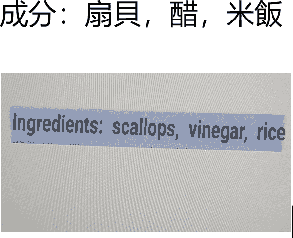

###### 图 8-1\. 摄像头屏幕上的实时翻译

想象一下如果没有机器学习，要做类似这样的事情是多么困难。如何编写代码来进行任何语言中任何字符的光学字符识别。然后，一旦你完成了这个，如何在不经过翻译服务器的情况下翻译它们。这简直是不可行的。但是机器学习，特别是设备上的机器学习，正在使这成为可能。

# TensorFlow Lite 入门指南

要理解 TensorFlow Lite，我认为最简单的方法是立即动手并开始使用它。让我们首先探索将 TensorFlow 模型转换为 TensorFlow Lite 格式的*转换器*。然后，我们将使用它创建的模型在一个简单的 Android 应用程序中实施它。

在第一章中，我们进行了一些称为机器学习的“Hello World”代码，使用非常简单的线性回归来建立一个模型，该模型可以预测两个数字 x 和 y 之间的关系，即 y = 2x − 1\. 简而言之，以下是在 TensorFlow 中训练模型的 Python 代码：

```
import tensorflow as tf
import numpy as np
from tensorflow.keras import Sequential
from tensorflow.keras.layers import Dense

layer_0 = Dense(units=1, input_shape=[1])
model = Sequential([layer_0])
model.compile(optimizer='sgd', loss='mean_squared_error')

xs = np.array([-1.0, 0.0, 1.0, 2.0, 3.0, 4.0], dtype=float)
ys = np.array([-3.0, -1.0, 1.0, 3.0, 5.0, 7.0], dtype=float)

model.fit(xs, ys, epochs=500)

print(model.predict([10.0]))
print("Here is what I learned: {}".format(layer_0.get_weights()))
```

在训练了 500 个时期之后，它在打印语句上产生了以下输出：

```
[[18.984955]]
Here is what I learned: [array([[1.9978193]], dtype=float32),
                         array([-0.99323905], dtype=float32)]
```

因此，预测如果 x 为 10，则 y 为 18.984955，这非常接近于我们使用 y = 2x − 1 公式预期的 19。这是因为神经网络中的单个神经元学习了权重为 1.9978193 和偏差为−0.99323905。因此，基于非常少量的数据，它推断出了 y = 1.9978193x − 0.99323905 的关系，这非常接近我们期望的 y = 2x − 1。

那么，现在我们能在 Android 上使其工作，而不是在云端或开发者工作站上运行吗？答案当然是肯定的。第一步是保存我们的模型。

## 保存模型

TensorFlow 使用多种不同的方法来保存模型，但在 TensorFlow 生态系统中最标准的是 SavedModel 格式。这将以*.pb*（protobuf）文件格式保存模型，作为冻结模型的表示，附带包含任何模型资产或变量的相关目录。这种方式的明显优势在于将架构与状态分离，因此如果需要，可以随时添加其他状态，或者更新模型而无需重新发送任何模型资产，这些资产本身可能相当庞大。

要使用这种格式保存，只需指定输出目录，然后像这样调用`tf.saved_model.save()`：

```
export_dir = 'saved_model/1'
tf.saved_model.save(model, export_dir)
```

您可以看到保存的目录结构在图 8-2 中。

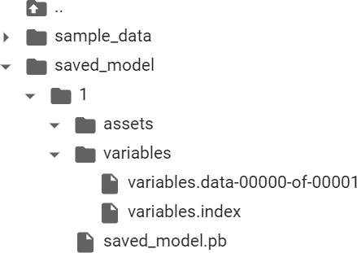

###### 图 8-2。保存模型后的目录结构

由于这是一个非常简单的模型，*variables*文件只有一个分片。更大的模型将被分割为多个分片，因此命名为*variables.data-00000-of-00001*。此模型不使用任何资产，因此该文件夹将为空。

## 转换模型

将模型转换为 TFLite 格式只需创建保存模型的转换器实例，并调用其转换方法即可。然后，通过将其字节写入文件流来保存模型。

以下是代码：

```
converter = tf.lite.TFLiteConverter.from_saved_model(export_dir)
tflite_model = converter.convert()

import pathlib
tflite_model_file = pathlib.Path('model.tflite')
tflite_model_file.write_bytes(tflite_model)
```

写入字节的过程将返回一个数字，这是写入的字节数。不同版本的转换器可能会更改这个数字，但在撰写本文时，写出了一个名为*model.tflite*的文件，大小为 896 字节。这包括整个训练过的模型，包括架构和学习的权重。

###### 注意

尽管使用如前所示的 Python API 是执行模型转换的推荐方法，但 TensorFlow 团队还提供了命令行解释器，如果您愿意，也可以使用该解释器。您可以在[*https://www.tensorflow.org/lite/convert*](https://www.tensorflow.org/lite/convert)了解更多信息。

## 使用独立解释器测试模型

在尝试在 iOS 或 Android 上使用该模型之前，您应该先使用 TensorFlow Lite 的独立解释器来检查它是否运行良好。这个解释器在 Python 环境中运行，因此也可以在可以运行 Python 的嵌入式系统上使用，比如基于 Linux 的树莓派！

下一步是将模型加载到解释器中，分配张量以用于将数据输入模型进行预测，并读取模型输出的预测结果。这是在使用 TensorFlow Lite 时，从程序员的角度来看，与使用 TensorFlow 有很大不同的地方。在 TensorFlow 中，您可以直接使用 `model.predict(`*`something`*`)` 并获取结果，但是由于 TensorFlow Lite 在非 Python 环境中不会有许多 TensorFlow 的依赖项，因此现在您需要更低级别地处理输入和输出张量，格式化您的数据以适应它们，并以对您的设备有意义的方式解析输出。

首先，加载模型并分配张量：

```
interpreter = tf.lite.Interpreter(model_content=tflite_model)
interpreter.allocate_tensors()
```

然后，您可以从模型获取输入和输出详细信息，从而开始理解它期望的数据格式以及它将向您提供的数据格式：

```
input_details = interpreter.get_input_details()
output_details = interpreter.get_output_details()
print(input_details)
```

您将会得到大量的输出！

首先，让我们检查输入参数。注意形状设置，它是一个类型为 [1,1] 的数组。还请注意类别，它是 `numpy.float32`。这些设置将决定输入数据的形状及其格式：

```
[{'name': 'serving_default_dense_input:0', 'index': 0,
  'shape': array([1, 1], dtype=int32),
  'shape_signature': array([1, 1], dtype=int32),
  'dtype': <class 'numpy.float32'>,
  'quantization': (0.0, 0),
  'quantization_parameters': {'scales': array([],
                              dtype=float32),
                              'zero_points': array([], dtype=int32),
                              'quantized_dimension': 0},
  'sparsity_parameters': {}}]
```

因此，为了格式化输入数据，您需要使用以下代码来定义输入数组的形状和类型，如果您想预测 x = 10.0 时的 y：

```
to_predict = np.array([[10.0]], dtype=np.float32)
print(to_predict)
```

围绕 10.0 的双括号可能会引起一些混淆——我在这里使用的记忆方法是说，这里有一个列表，给我们了第一个 [] 的设置，并且该列表只包含一个值，即 `[10.0]`，因此得到 `[[10.0]]`。也可能令人困惑的是，形状被定义为 `dtype=int32`，而您使用的是 `numpy.float32`。`dtype` 参数是定义形状的数据类型，而不是封装在该形状中的列表内容。对于后者，您将使用类别。

您还可以使用 `print(output_details)` 打印输出详细信息。

这些非常相似，您需要关注的是形状。因为它也是一个类型为 `[1,1]` 的数组，您可以期望答案会以类似于输入为 `[[x]]` 的方式为 `[[y]]`：

```
[{'name': 'StatefulPartitionedCall:0',
  'index': 3,
  'shape': array([1, 1], dtype=int32),
  'shape_signature': array([1, 1], dtype=int32),
  'dtype': <class 'numpy.float32'>,
  'quantization': (0.0, 0),
  'quantization_parameters': {'scales': array([], dtype=float32),
                              'zero_points': array([], dtype=int32),
                              'quantized_dimension': 0},
  'sparsity_parameters': {}}]
```

要让解释器进行预测，您需要将输入张量设置为要预测的值，并告知它要使用的输入值：

```
interpreter.set_tensor(input_details[0]['index'], to_predict)
interpreter.invoke()
```

输入张量是使用输入详细信息数组的索引来指定的。在这种情况下，您有一个非常简单的模型，只有一个输入选项，因此它是 `input_details[0]`，您将在索引处引用它。输入详细信息项 0 只有一个索引，索引为 0，并且它期望的形状如前所述为 `[1,1]`。因此，您将 `to_predict` 值放在其中。然后，使用 `invoke` 方法调用解释器。

您可以通过调用 `get_tensor` 并提供您想要读取的张量的详细信息来读取预测值：

```
tflite_results = interpreter.get_tensor(output_details[0]['index'])
print(tflite_results)
```

再次，只有一个输出张量，因此它将是 `output_details[0]`，您指定索引以获取其下的详细信息，其中将包含输出值。

所以，举例来说，假设你运行以下代码：

```
to_predict = np.array([[10.0]], dtype=np.float32)
print(to_predict)
interpreter.set_tensor(input_details[0]['index'], to_predict)
interpreter.invoke()
tflite_results = interpreter.get_tensor(output_details[0]['index'])
print(tflite_results)
```

您应该看到如下输出：

```
[[10.]]
[[18.975412]]
```

其中 10 是输入值，18.97 是预测值，非常接近于 19，即当 x=10 时 2x-1。为什么不是 19 的原因，请回顾第一章！

请注意，您可能已经在第一章中看到了稍微不同的结果（例如 18.984），这些结果由于两个主要原因而会发生。首先，神经元从不同的随机初始化状态开始，因此它们的最终值会略有不同。此外，在将模型压缩为 TFLite 模型时，会进行影响最终结果的优化。以后创建更复杂模型时，请记住这一点——重要的是要注意移动转换可能对准确性的影响。

现在，我们已经使用独立解释器测试了模型，并且它看起来表现如预期一样。下一步，让我们构建一个简单的 Android 应用程序，看看在那里使用模型是什么样子！

# 创建一个 Android 应用程序来托管 TFLite

使用 Android Studio 使用单个活动模板创建一个 Android 应用程序。如果您对此不熟悉，请阅读第三章中的所有步骤。在那里查找它们！

编辑您的*build.gradle*文件以包含 TensorFlow Lite 运行时：

```
implementation 'org.tensorflow:tensorflow-lite:2.4.0'
```

在这里我使用了版本 2.4.0。要获取最新版本，您可以查看[Bintray 网站](https://oreil.ly/Y3kb0)上提供的当前版本。

您还需要在`android{}`部分中添加一个新的设置，如下所示：

```
android{
...
    aaptOptions {
        noCompress "tflite"
    }
...
}
```

###### 注意

此步骤可防止编译器压缩您的*.tflite*文件。 Android Studio 会编译资源以减小其大小，从而减少从 Google Play 商店下载的时间。但是，如果压缩*.tflite*文件，则 TensorFlow Lite 解释器将无法识别它。为确保它不会被压缩，您需要为*.tflite*文件设置`aaptOptions`为`noCompress`。如果您使用了不同的扩展名（有些人只使用*.lite*），请确保在此处配置。

您现在可以尝试构建您的项目。 TensorFlow Lite 库将被下载和链接。

接下来，更新您的活动文件（您可以在布局目录中找到它）以创建一个简单的用户界面。这将包含一个编辑文本框，您可以在其中输入一个值，并且一个按钮，用于触发推断：

```
<?xml version="1.0" encoding="utf-8"?>
<LinearLayout 
    android:orientation="vertical"

    android:layout_height="match_parent"
    android:layout_width="match_parent">

    <LinearLayout
        android:layout_width="match_parent"
        android:layout_height="wrap_content">

        <TextView
            android:id="@+id/lblEnter"
            android:layout_width="wrap_content"
            android:layout_height="wrap_content"
            android:text="Enter X:  "
            android:textSize="18sp"></TextView>

        <EditText
            android:id="@+id/txtValue"
            android:layout_width="180dp"
            android:layout_height="wrap_content"
            android:inputType="number"
            android:text="1"></EditText>

        <Button
            android:id="@+id/convertButton"
            android:layout_width="wrap_content"
            android:layout_height="wrap_content"
            android:text="Convert">

        </Button>
    </LinearLayout>
</LinearLayout>
```

在开始编码之前，您需要将 TFLite 文件导入到您的应用程序中。接下来您可以看到如何做到这一点。

## 导入 TFLite 文件

首先要做的是在您的项目中创建一个*assets*文件夹。为此，请在项目资源管理器中导航至*app/src/main*文件夹，在*main*文件夹上右键单击，然后选择新建文件夹。将其命名为*assets*。将您在训练模型后下载的*.tflite*文件拖放到该目录中。如果您之前没有创建此文件，您可以在书籍的 GitHub 代码库中找到它。

如果你收到关于文件不在正确目录中的警告，即模型绑定被禁用，请安全地忽略它。模型绑定是我们稍后将探索的内容，它适用于许多固定场景：它允许你轻松地导入 *.tflite* 模型，而不需要本示例中所示的许多手动步骤。在这里，我们将深入到如何在 Android Studio 中使用 TFLite 文件的基本操作中。

将资产添加到 Android Studio 后，你的项目资源管理器应该看起来像图 8-3 一样。

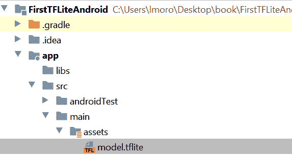

###### 图 8-3\. 将 TFLite 文件添加为资产文件

现在一切准备就绪，我们可以开始编码了！

## 编写 Kotlin 代码与模型接口

尽管你正在使用 Kotlin，但你的源文件位于 *java* 目录下！打开它，你会看到一个与你的包名相对应的文件夹。在这个文件夹中，你会看到 *MainActivity.kt* 文件。双击此文件以在代码编辑器中打开它。

首先，你需要一个帮助函数，从 *assets* 目录加载 TensorFlow Lite 模型：

```
private fun loadModelFile(assetManager: AssetManager,
                          modelPath: String): ByteBuffer {
    val fileDescriptor = assetManager.openFd(modelPath)
    val inputStream = FileInputStream(fileDescriptor.fileDescriptor)
    val fileChannel = inputStream.channel
    val startOffset = fileDescriptor.startOffset
    val declaredLength = fileDescriptor.declaredLength
    return fileChannel.map(FileChannel.MapMode.READ_ONLY,
startOffset, declaredLength)
}
```

由于 *.tflite* 文件实际上是解释器将用于构建内部神经网络模型的权重和偏置的二进制 blob，在 Android 术语中它是一个 `ByteBuffer`。此代码将从 `modelPath` 加载文件，并将其作为 `ByteBuffer` 返回。（请注意，早些时候你确保在编译时不压缩此文件类型，以便 Android 能够识别文件的内容。）

接着，在你的活动中，在类级别（即在类声明下方，不在任何类函数内部），你可以添加模型和解释器的声明：

```
private lateinit var tflite : Interpreter
private lateinit var tflitemodel : ByteBuffer
```

因此，在这种情况下，执行所有工作的解释器对象将被称为 `tflite`，而加载到解释器中作为 `ByteBuffer` 的模型将被称为 `tflitemodel`。

接下来，在 `onCreate` 方法中，当活动创建时调用，添加一些代码来实例化解释器，并加载 `model.tflite`：

```
try{
    tflitemodel = loadModelFile(this.assets, "model.tflite")
    tflite = Interpreter(tflitemodel)
} catch(ex: Exception){
    ex.printStackTrace()
}
```

同样，在 `onCreate` 中，还要添加两个你将与之交互的控件的代码——`EditText` 用于输入数值，和 `Button` 用于执行推断：

```
var convertButton: Button = findViewById<Button>(R.id.convertButton)
convertButton.setOnClickListener{
    doInference()
}
txtValue = findViewById<EditText>(R.id.txtValue)
```

此外，在下一个函数中将需要在类级别声明 `EditText`，以及 `tflite` 和 `tflitemodel`，因为它将在其中使用：

```
private lateinit var txtValue : EditText
```

最后，是时候进行推断了。你可以使用一个名为 `doInference` 的新函数来完成：

```
private fun doInference(){
}
```

在这个函数中，你可以收集输入数据，传递给 TensorFlow Lite 进行推断，然后显示返回的值。

###### 注意

在这种情况下，推断非常简单。对于复杂模型，可能会是一个长时间运行的过程，可能会阻塞 UI 线程，这是在构建你自己的应用程序时需要牢记的事项。

`EditText` 控件用于输入数字，将会提供一个字符串，你需要将其转换为浮点数：

```
var userVal: Float = txtValue.text.toString().toFloat()
```

正如您在第一章和第二章中回顾的，当将数据输入模型时，通常需要将其格式化为 NumPy 数组。作为 Python 的构造，NumPy 在 Android 上不可用，但在这种情况下您可以使用`FloatArray`。即使您只输入一个值，它仍然需要在一个数组中，粗略地近似一个张量：

```
var inputVal: FloatArray = floatArrayOf(userVal)
```

模型将向您返回一系列字节，需要解释。如您所知，模型输出一个浮点值，考虑到浮点数占据 4 字节，您可以设置一个 4 字节的`ByteBuffer`来接收输出。字节可以按多种方式排序，但您只需要默认的本地顺序：

```
var outputVal: ByteBuffer = ByteBuffer.allocateDirect(4)
outputVal.order(ByteOrder.nativeOrder())
```

要进行推断，您需要在解释器上调用运行方法，传递输入和输出值。然后它将从输入值读取并写入输出值：

```
tflite.run(inputVal, outputVal)
```

输出被写入到`ByteBuffer`中，其指针现在位于缓冲区的末尾。要读取它，您必须将其重置为缓冲区的开头：

```
outputVal.rewind()
```

现在，您可以将`ByteBuffer`的内容作为一个浮点数读取：

```
var inference:Float = outputVal.getFloat()
```

如果您想要向用户显示这个信息，可以使用`AlertDialog`：

```
val builder = AlertDialog.Builder(this)
with(builder)
{
    setTitle("TFLite Interpreter")
    setMessage("Your Value is:$inference")
    setNeutralButton("OK", DialogInterface.OnClickListener {
            dialog, id -> dialog.cancel()
    })
    show()
}
```

您现在可以运行应用并尝试自己！您可以在图 8-4 中看到结果，我输入了一个值为 10，模型给出了 18.984955 的推断结果，显示在一个警报框中。请注意，由于前面讨论的原因，您的值可能会有所不同。当训练模型时，神经网络开始时是随机初始化的，因此当它收敛时可能是从不同的起点开始的，因此您的模型可能会有稍微不同的结果。

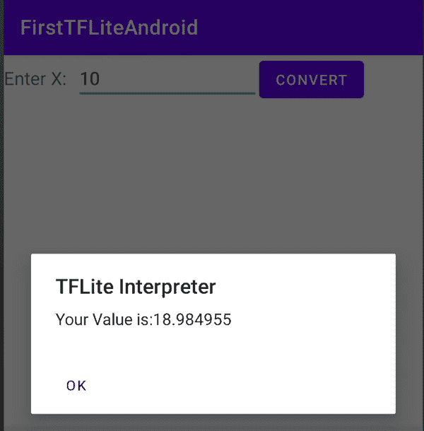

###### 图 8-4\. 运行推断

## 超越基础知识

这个示例非常简单——您有一个模型，它接受单个输入值并提供单个输出值。这两个值都是浮点数，占据 4 个字节的存储空间，因此您可以仅创建每个字节缓冲区中的 4 个字节，并知道它们包含单个值。因此，在使用更复杂的数据时，您需要努力将数据格式化为模型期望的格式，这将需要您进行大量的工程工作。让我们看一个使用图像的示例。在第九章中，我们将看到模型制造器，这是一个在 Android 或 iOS 上使用 TFLite 进行常见场景——包括像这样的图像分类的复杂性抽象的非常有用的工具，但我认为，探索如何管理模型的数据进出对于您超出常见情景的需求仍然是一种有用的练习！

例如，让我们从像图 8-5 中的图片开始，这是一张狗的简单图片，尺寸是 395 × 500 像素。这张图片用于一个可以区分猫和狗的模型。我不会详细介绍如何*创建*这个模型，但是这本书的仓库中有一个笔记本可以为你完成这部分工作，还有一个样例应用来处理推断。你可以在[*Chapter8_Lab2.ipynb*](https://oreil.ly/mohak)中找到训练代码，应用程序名为“cats_vs_dogs”。

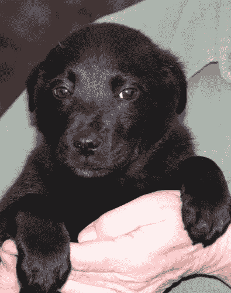

###### 图 8-5\. 解释狗的图片

首先需要做的事情是将其调整为 224 × 224 像素，即模型训练时使用的图片尺寸。在 Android 中可以使用 Bitmap 库来完成这个操作。例如，你可以创建一个新的 224 × 224 位图：

```
val scaledBitmap = Bitmap.createScaledBitmap(bitmap, 224, 224, false)
```

（在这种情况下，位图包含由应用程序加载为资源的原始图片。完整的应用程序可以在本书的 GitHub 仓库中找到。）

现在，图片尺寸已经调整到合适大小，接下来需要调整 Android 中的图片结构，使其与模型期望的结构一致。如果你回忆一下，本书前几章在训练模型时，输入的是归一化后的数值张量作为图片。例如，这样一张图片的尺寸为（224, 224, 3）：224 × 224 表示图片尺寸，3 表示颜色深度。这些数值也都归一化到了 0 到 1 之间。

因此，总结一下，你需要 224 × 224 × 3 个介于 0 和 1 之间的浮点值来表示这张图片。为了将其存储在一个`ByteArray`中，其中 4 个字节表示一个浮点数，你可以使用以下代码：

```
val byteBuffer = ByteBuffer.allocateDirect(4 * 224 * 224 * 3)
byteBuffer.order(ByteOrder.nativeOrder())
```

另一方面，我们的 Android 图片中，每个像素都以 32 位整数的 ARGB 值存储。一个特定像素可能看起来像 0x0010FF10。前两个值是透明度，可以忽略，其余的用于 RGB（例如，红色为 0x10，绿色为 0xFF，蓝色为 0x10）。到目前为止，你一直在做的简单归一化是将 R、G、B 通道值除以 255，这将得到红色的.06275，绿色的 1，和蓝色的.06275。

因此，为了进行这种转换，首先将我们的位图转换为一个 224 × 224 整数数组，并将像素复制进去。你可以使用`getPixels` API 来完成这个操作：

```
val intValues = IntArray(224 * 224)

scaledbitmap.getPixels(intValues, 0, 224, 0, 0, 224, 224)
```

你可以在[Android 开发者文档](https://oreil.ly/EFs1Q)中找到有关 getPixels API 的详细信息，解释了这些参数。

现在，您需要遍历此数组，逐个读取像素并将其转换为归一化浮点数。您将使用位移操作获取特定的通道。例如，考虑之前的值 0x0010FF10。如果您将其向右移动 16 位，您将得到 0x0010（FF10 被“丢弃”）。然后，“与”0xFF，您将得到 0x10，仅保留底部两个数字。类似地，如果您向右移动 8 位，您将得到 0x0010FF，并在其上执行“和”操作将给出 0xFF。这种技术（通常称为*掩码*）允许您快速轻松地剥离构成像素的相关位。您可以对整数使用`shr`操作来执行此操作，其中`input.shr(16)`读取“将输入向右移动 16 像素”：

```
var pixel = 0
for (i in 0 until INPUT_SIZE) {
  for (j in 0 until INPUT_SIZE) {
    val input = intValues[pixel++]
    byteBuffer.putFloat(((input.shr(16)  and 0xFF) / 255))
    byteBuffer.putFloat(((input.shr(8) and 0xFF) / 255))
    byteBuffer.putFloat(((input and 0xFF)) / 255))
  }
}
```

与以前一样，在处理输出时，您需要定义一个数组来保存结果。它不一定要是`ByteArray`；实际上，如果您知道结果通常是浮点数，您可以定义像`FloatArray`这样的东西。在这种情况下，使用猫与狗模型，您有两个标签，并且模型体系结构在输出层中定义了两个神经元，包含类别`cat`和`dog`的相应属性。回读结果时，您可以定义一个结构来包含输出张量，如下所示：

```
val result = Array(1) { FloatArray(2) }
```

请注意，它是包含两个项目数组的单个数组。还记得在使用 Python 时，您可能会看到像`[[1.0 0.0]]`这样的值——在这里也是一样的。`Array(1)`正在定义包含数组`[]`，而`FloatArray(2)`是`[1.0 0.0]`。这可能会有点令人困惑，但当您编写更多 TensorFlow 应用程序时，我希望您会习惯的！

与以前一样，您使用`interpreter.run`进行解释：

```
interpreter.run(byteBuffer, result)
```

现在，您的结果将是一个包含两个值的数组（分别是图像是猫或狗的概率）。您可以在 Android 调试器中查看它的外观，见图 8-6——在这里，您可以看到这张图片有 0.01 的概率是猫，0.99 的概率是狗！

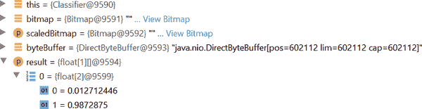

###### 图 8-6\. 解析输出值

当您使用 Android 创建移动应用程序时，这是最复杂的部分之一——除了创建模型之外，当然——您必须考虑到。特别是在 NumPy 的情况下，Python 如何表示值可能与 Android 的方式非常不同。您将不得不创建转换器来重新格式化数据，以便神经网络期望数据输入，并且您必须理解神经网络使用的输出模式，以便解析结果。

# 创建一个 iOS 应用程序来托管 TFLite

早些时候我们探索了在 Android 上创建一个用于托管简单 y = 2x − 1 模型的应用程序。接下来让我们看看如何在 iOS 上完成相同的操作。如果您想要跟随这个示例，您需要一台 Mac 电脑，因为开发工具是仅在 Mac 上可用的 Xcode。如果您还没有安装它，您可以从 App Store 安装。它将为您提供一切所需的内容，包括可以在上面运行 iPhone 和 iPod 应用程序的 iOS 模拟器，而无需实际设备。

## 第 1 步：创建一个基本的 iOS 应用程序

打开 Xcode 并选择文件 → 新建项目。您将被要求选择新项目的模板。选择单视图应用程序，这是最简单的模板（参见图 8-7），然后点击下一步。

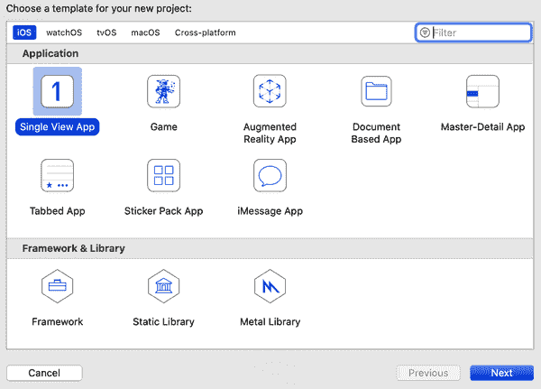

###### 图 8-7\. 在 Xcode 中创建一个新的 iOS 应用程序

然后，您将被要求选择新项目的选项，包括应用程序的名称。将其命名为*firstlite*，确保语言为 Swift，用户界面为 Storyboard（参见图 8-8）。

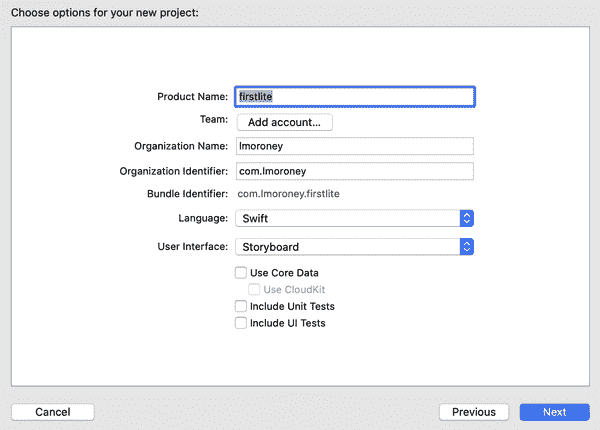

###### 图 8-8\. 选择新项目的选项

点击下一步创建一个基本的 iOS 应用程序，该应用程序将在 iPhone 或 iPad 模拟器上运行。接下来的步骤是将 TensorFlow Lite 添加到其中。

## 第 2 步：向您的项目添加 TensorFlow Lite

要向 iOS 项目添加依赖项，您可以使用名为[CocoaPods](https://cocoapods.org)的技术，这是一个具有数千个库的依赖管理项目，可以轻松集成到您的应用程序中。为此，您需要创建一个称为 Podfile 的规范文件，其中包含关于您的项目和要使用的依赖项的详细信息。这是一个名为*Podfile*的简单文本文件（没有扩展名），应放置在与 Xcode 为您创建的*firstlite.xcodeproj*文件相同的目录中。其内容应如下所示：

```
# Uncomment the next line to define a global platform for your project
platform :ios, '12.0'

target 'firstlite' do
  # Pods for ImageClassification
  pod 'TensorFlowLiteSwift'
end
```

重要的部分是这一行：`pod 'TensorFlowLiteSwift'`，它表示需要将 TensorFlow Lite Swift 库添加到项目中。

接下来，在 Terminal 中，切换到包含 Podfile 的目录，并输入以下命令：

```
> pod install
```

依赖项将被下载并添加到您的项目中，存储在一个名为*Pods*的新文件夹中。您还将添加一个*.xcworkspace*文件，如图 8-9 所示。将来打开项目时，请使用这个文件而不是*.xcodeproj*文件。

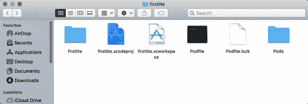

###### 图 8-9\. 运行 pod install 后的文件结构

您现在拥有一个基本的 iOS 应用程序，并已添加了 TensorFlow Lite 的依赖项。下一步是创建用户界面。

## 第 3 步：创建用户界面

Xcode 故事板编辑器是一个可视化工具，允许您创建用户界面。打开工作区后，您会在左侧看到源文件列表。选择*Main.storyboard*，并使用控件面板，将控件拖放到 iPhone 屏幕的视图上（在图 8-10 中可见）。

如果找不到控件面板，可以通过点击屏幕右上角的+号（在图 8-10 中突出显示）来访问它。使用它，添加一个标签，并将文本更改为“输入一个数字”。然后再添加一个标签，文本为“结果显示在此处”。添加一个按钮，将其标题更改为“Go”，最后再添加一个文本字段。排列它们的方式类似于图 8-10 中显示的样子。它不一定要很漂亮！

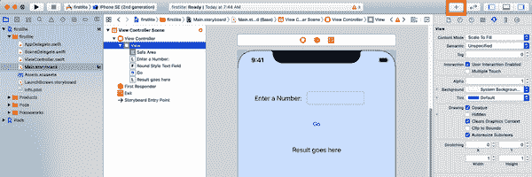

###### 图 8-10\. 向故事板添加控件

现在控件已布局好，您希望能够在代码中引用它们。在故事板术语中，您可以使用*出口*（当您希望访问控件以读取或设置其内容时）或*操作*（当您希望在用户与控件交互时执行一些代码时）来实现此目的。

将此连接起来的最简单方法是使用分割屏幕，将故事板放在一侧，底层代码*ViewController.swift*放在另一侧。您可以通过选择分割屏幕控件（在图 8-11 中突出显示），点击一侧选择故事板，然后点击另一侧选择*ViewController.swift*来实现此目的。

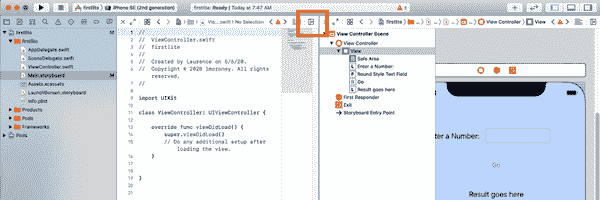

###### 图 8-11\. 分割屏幕

一旦完成这一步，您可以开始通过拖放来创建您的出口和操作。该应用程序将让用户在文本字段中输入一个数字，然后按“Go”按钮，然后对他们输入的值进行推断。结果将呈现在标签中，标签上写着“结果显示在此处”。

这意味着您需要读取或写入两个控件，读取文本字段的内容以获取用户输入的内容，并将结果写入“结果显示在此处”的标签中。因此，您需要两个出口。要创建它们，按住 Ctrl 键并将控件拖放到*ViewController.swift*文件中，将其放置在类定义的正下方。会弹出一个窗口询问您要定义它（见图 8-12）。

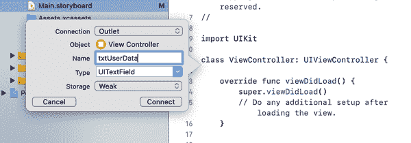

###### 图 8-12\. 创建一个出口

确保连接类型为出口，并创建一个称为`txtUserData`的文本字段的出口，以及一个称为`txtResult`的标签的出口。

接下来，将按钮拖放到*ViewController.swift*文件中。在弹出窗口中，确保连接类型为操作，事件类型为“Touch Up Inside”。使用此方法来定义一个名为`btnGo`的操作（见图 8-13）。

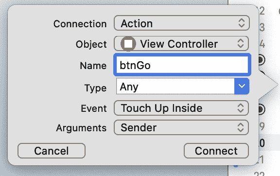

###### 图 8-13\. 添加一个操作

到目前为止，您的 *ViewController.swift* 文件应该是这样的——请注意 `IBOutlet` 和 `IBAction` 代码：

```
import UIKit

class ViewController: UIViewController {
    @IBOutlet weak var txtUserData: UITextField!

    @IBOutlet weak var txtResult: UILabel!
    @IBAction func btnGo(_ sender: Any) {
    }
    override func viewDidLoad() {
        super.viewDidLoad()
        // Do any additional setup after loading the view.
    }
}
```

现在 UI 部分已经搞定，下一步将是创建处理推断的代码。您将其放在与 `ViewController` 逻辑不同的 Swift 文件中。

## 步骤 4：添加和初始化模型推断类

为了将 UI 与底层模型推断分离，您将创建一个新的 Swift 文件，其中包含一个 `ModelParser` 类。这是将数据输入模型、运行推断并解析结果的所有工作都将在这里进行。在 Xcode 中，选择 文件 → 新建文件，选择 Swift 文件作为模板类型（图 8-14）。

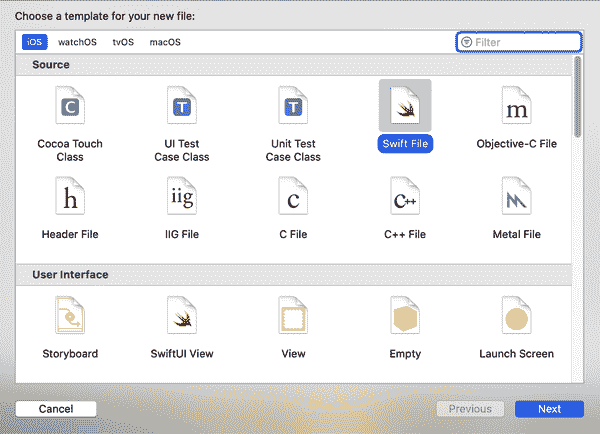

###### 图 8-14\. 添加一个新的 Swift 文件

调用此 *ModelParser* 并确保将其指向 *firstlite* 项目的复选框已选中（图 8-15）。

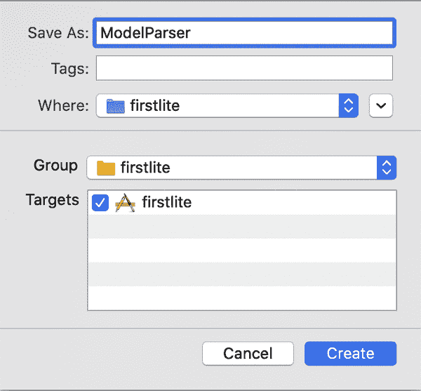

###### 图 8-15\. 将 ModelParser.swift 添加到您的项目

这将在您的项目中添加一个 *ModelParser.swift* 文件，您可以编辑以添加推断逻辑。首先确保文件顶部的导入包括 `TensorFlowLite`：

```
import Foundation
import TensorFlowLite
```

您将把一个指向模型文件 *model.tflite* 的引用传递给这个类——尽管您还没有添加它，但很快会添加：

```
typealias FileInfo = (name: String, extension: String)

enum ModelFile {
  static let modelInfo: FileInfo = (name: "model", extension: "tflite")
}
```

这个 `typealias` 和 `enum` 使得代码更加简洁。稍后您将看到它们的使用。接下来，您需要将模型加载到解释器中，因此首先将解释器声明为类的私有变量：

```
private var interpreter: Interpreter
```

Swift 要求变量进行初始化，在 `init` 函数中可以执行此操作。下面的函数将接受两个输入参数。第一个参数 `modelFileInfo` 是您刚刚声明的 `FileInfo` 类型。第二个参数 `threadCount` 是用于初始化解释器的线程数，我们将其设置为 1。在此函数中，您将创建对之前描述的模型文件的引用（*model.tflite*）：

```
  init?(modelFileInfo: FileInfo, threadCount: Int = 1) {
      let modelFilename = modelFileInfo.name

      guard let modelPath = Bundle.main.path
      (
          forResource: modelFilename,
          ofType: modelFileInfo.extension
      )
      else {
          print("Failed to load the model file")
          return nil
      }
```

当您将应用程序和资源编译成一个部署到设备上的包时，在 iOS 术语中使用的术语是“bundle”。因此，您的模型需要在 bundle 中，一旦获得模型文件的路径，您就可以加载它：

```
      do
      {
          interpreter = try Interpreter(modelPath: modelPath)
      }
      catch let error
      {
          print("Failed to create the interpreter")
          return nil
      }
```

## 步骤 5：执行推断

在 `ModelParser` 类内部，然后可以进行推断。用户将在文本字段中输入一个字符串值，该值将转换为浮点数，因此您需要一个接受浮点数的函数，将其传递给模型，运行推断并解析返回值。

首先创建一个名为 `runModel` 的函数。您的代码将需要捕获错误，所以请从 `do{` 开始：

```
  func runModel(withInput input: Float) -> Float? {
    do{
```

接下来，您需要在解释器上分配张量。这将初始化模型并准备进行推断：

```
try interpreter.allocateTensors()
```

然后，您将创建输入张量。由于 Swift 没有`Tensor`数据类型，您需要将数据直接写入`UnsafeMutableBufferPointer`中的内存。这些内容在[苹果的开发者文档](https://oreil.ly/EfDus)中有详细介绍。

您可以指定其类型为 Float，并写入一个值（因为只有一个 float），从名为 data 的变量地址开始。这将有效地将浮点数的所有字节复制到缓冲区中：

```
      var data: Float = input
      let buffer: UnsafeMutableBufferPointer<Float> =
               UnsafeMutableBufferPointer(start: &data, count: 1)
```

有了缓冲区中的数据，您可以将其复制到输入 0 的解释器中。您只有一个输入张量，因此可以将其指定为缓冲区：

```
      try interpreter.copy(Data(buffer: buffer), toInputAt: 0)
```

要执行推断，您需要调用解释器：

```
      try interpreter.invoke()
```

只有一个输出张量，因此您可以通过获取索引为 0 的输出来读取它：

```
      let outputTensor = try interpreter.output(at: 0)
```

与输入值时类似，您处理的是低级别内存，被称为*unsafe*数据。当使用典型数据类型时，它们在内存中的位置受操作系统严格控制，以防止溢出和覆盖其他数据。但是，在这种情况下，您自己直接将数据写入内存，因此存在违反边界的风险（因此称为*unsafe*）。

它是由`Float32`值组成的数组（虽然只有一个元素，但仍需视为数组），可以像这样读取：

```
      let results: [Float32] =
                          Float32 ?? []
```

如果您对`??`语法不熟悉，请注意，此语法用于通过将输出张量复制到其中来使结果成为`Float32`数组，并在失败时（通常是空指针错误）创建一个空数组。为了使此代码正常工作，您需要实现一个`Array`扩展；其完整代码稍后将会展示。

一旦您将结果存储在数组中，第一个元素将是您的结果。如果失败，只需返回`nil`：

```
      guard let result = results.first else {
        return nil
      }
      return result
    }
```

函数以`do{`开头，因此您需要捕获任何错误，并在这种情况下打印错误消息并返回`nil`：

```
    catch {
      print(error)
      return nil
    }
  }
}
```

最后，在*ModelParser.swift*中，您可以添加处理不安全数据并将其加载到数组中的`Array`扩展：

```
extension Array {
  init?(unsafeData: Data) {
    guard unsafeData.count % MemoryLayout<Element>.stride == 0
          else { return nil }
    #if swift(>=5.0)
    self = unsafeData.withUnsafeBytes {
      .init($0.bindMemory(to: Element.self))
    }
    #else
    self = unsafeData.withUnsafeBytes {
      .init(UnsafeBufferPointer<Element>(
        start: $0,
        count: unsafeData.count / MemoryLayout<Element>.stride
      ))
    }
    #endif  // swift(>=5.0)
  }
}
```

这是一个便捷的助手，如果您想直接从 TensorFlow Lite 模型中解析浮点数，您可以使用它。现在，解析模型的类已完成，下一步是将模型添加到您的应用程序中。

## 步骤 6：将模型添加到您的应用程序

要将模型添加到您的应用程序中，您需要在应用程序中创建一个*models*目录。在 Xcode 中，右键单击*firstlite*文件夹，然后选择新建组（图 8-16）。将新组命名为*models*。

您可以通过训练本章早些时候的简单 y = 2x – 1 样本来获取该模型。如果您尚未拥有它，可以使用书籍 GitHub 存储库中的 Colab。

一旦您有转换后的模型文件（称为*model.tflite*），您可以将其拖放到刚刚添加的模型组中的 Xcode 中。选择“复制项目（如有需要）”，并确保通过选中旁边的复选框将其添加到*firstlite*目标中（图 8-17）。

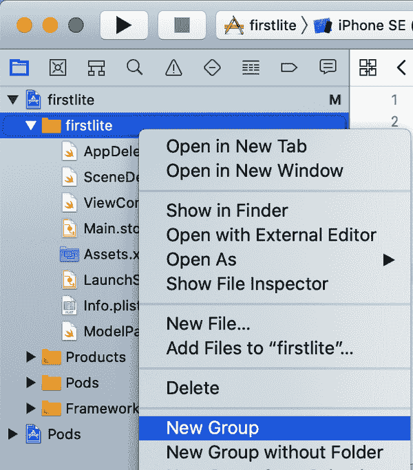

###### 图 8-16\. 向应用程序添加一个新组

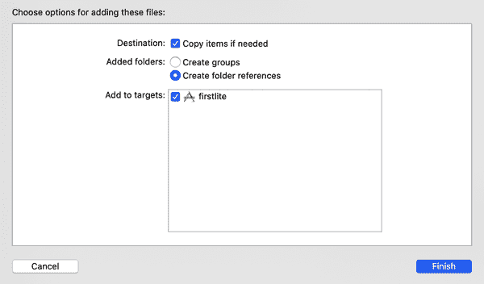

###### 图 8-17\. 将模型添加到你的项目中

模型现在将会在你的项目中，并且可用于推理。最后一步是完成用户界面逻辑，然后你就可以开始了！

## 第 7 步：添加 UI 逻辑

之前，你创建了包含 UI 描述的 storyboard，并开始编辑包含 UI 逻辑的 *ViewController.swift* 文件。由于推理工作的大部分现在已经被转移到 `ModelParser` 类中，UI 逻辑应该非常轻量级。

首先添加一个私有变量，声明 `ModelParser` 类的一个实例：

```
private var modelParser: ModelParser? =
    ModelParser(modelFileInfo: ModelFile.modelInfo)
```

之前，你在按钮上创建了一个名为 `btnGo` 的操作。当用户触摸按钮时，将调用它。更新为在用户执行该操作时执行名为 `doInference` 的函数：

```
@IBAction func btnGo(_ sender: Any) {
  doInference()
}
```

接下来，你将构建 `doInference` 函数：

```
private func doInference() {
```

用户将输入数据的文本字段称为 `txtUserData.` 读取这个值，如果它为空，只需将结果设置为 0.00，并且不需要进行任何推理：

```
  guard let text = txtUserData.text, text.count > 0 else {
    txtResult.text = "0.00"
    return
  }
```

否则，将其转换为浮点数。如果失败，则退出函数：

```
  guard let value = Float(text) else {
    return
  }
```

如果代码已经执行到这一点，你现在可以运行模型，将输入传递给它。`ModelParser` 将处理剩余的部分，返回一个结果或 `nil`。如果返回值是 `nil`，那么你将退出该函数：

```
  guard let result = self.modelParser?.runModel(withInput: value) else {
    return
  }
```

最后，如果你已经到达这一点，你有一个结果，所以你可以将它加载到标签中（称为 `txtResult`），通过将浮点数格式化为字符串：

```
  txtResult.text = String(format: "%.2f", result)
```

就是这样！模型加载和推理的复杂性已由 `ModelParser` 类处理，使你的 `ViewController` 非常轻量级。为了方便起见，这里是完整的列表：

```
import UIKit

class ViewController: UIViewController {
  private var modelParser: ModelParser? =
      ModelParser(modelFileInfo: ModelFile.modelInfo)
  @IBOutlet weak var txtUserData: UITextField!

  @IBOutlet weak var txtResult: UILabel!
  @IBAction func btnGo(_ sender: Any) {
    doInference()
  }
  override func viewDidLoad() {
    super.viewDidLoad()
    // Do any additional setup after loading the view.
  }
  private func doInference() {

    guard let text = txtUserData.text, text.count > 0 else {
      txtResult.text = "0.00"
      return
    }
    guard let value = Float(text) else {
      return
    }
    guard let result = self.modelParser?.runModel(withInput: value) else {
      return
    }
    txtResult.text = String(format: "%.2f", result)
  }

}
```

现在，你已经完成了使应用程序运行所需的一切。运行它，你应该可以在模拟器中看到它。在文本字段中输入一个数字，按按钮，你应该在结果字段中看到一个结果，如图 8-18 所示。

尽管这只是一个非常简单的应用程序的漫长旅程，但它应该为你提供一个很好的模板，帮助你理解 TensorFlow Lite 的工作原理。在这个步骤中，你看到了如何：

+   使用 pods 添加 TensorFlow Lite 依赖项

+   将 TensorFlow Lite 模型添加到你的应用程序中

+   将模型加载到解释器中

+   访问输入张量并直接写入它们的内存

+   从输出张量中读取内存，并将其复制到像浮点数组这样的高级数据结构中

+   使用 storyboard 和 view controller 将所有内容连接起来。

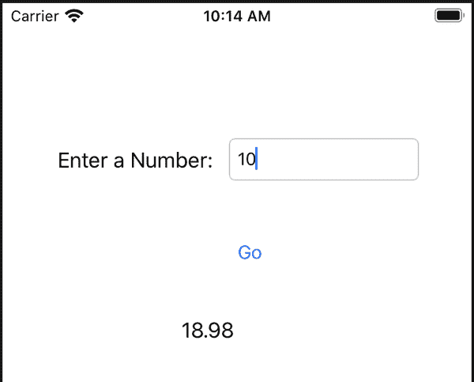

###### 图 8-18\. 在 iPhone 模拟器中运行应用程序

在下一节中，你将超越这个简单的场景，看看如何处理更复杂的数据。

## 超越“Hello World”：处理图像

在前面的示例中，您看到了如何创建一个使用 TensorFlow Lite 进行非常简单推断的完整应用程序。然而，尽管应用程序简单，但是将数据传入模型和解析模型输出的过程可能有些不直观，因为您正在处理低级的位和字节。随着您涉及更复杂的场景，例如管理图像，好消息是该过程并不那么复杂。

考虑创建一个模型来区分猫和狗。在本节中，您将看到如何使用经过训练的模型创建一个 iOS 应用程序（使用 Swift），该应用程序可以根据猫或狗的图像推断出图片内容。完整的应用程序代码可以在本书的 GitHub 存储库中找到，以及一个 Colab 笔记本来训练和将模型转换为 TFLite 格式。

首先，回顾一下图像的张量具有三个维度：宽度、高度和颜色深度。例如，使用基于 MobileNet 架构的猫狗移动样本时，尺寸为 224 × 224 × 3——每个图像为 224 × 224 像素，并具有三个颜色深度通道。请注意，每个像素在归一化后，每个通道的值都介于 0 和 1 之间，表示该像素在红色、绿色和蓝色通道上的强度。

在 iOS 中，图像通常表示为 `UIImage` 类的实例，该类具有一个有用的 `pixelBuffer` 属性，返回图像中所有像素的缓冲区。

在 `CoreImage` 库中，有一个 `CVPixelBufferGetPixelFormatType` API 可以返回像素缓冲区的类型：

```
let sourcePixelFormat = CVPixelBufferGetPixelFormatType(pixelBuffer)
```

这通常是一个 32 位图像，具有 alpha（即透明度）、红色、绿色和蓝色通道。然而，有多种变体，通常这些通道的顺序不同。您需要确保它是这些格式之一，因为如果图像存储在不同的格式中，其余的代码将无法正常工作：

```
assert(sourcePixelFormat == kCVPixelFormatType_32ARGB ||
  sourcePixelFormat == kCVPixelFormatType_32BGRA ||
  sourcePixelFormat == kCVPixelFormatType_32RGBA)
```

由于所需格式是 224 × 224，这是一个方形，接下来最好的做法是使用 `centerThumbnail` 属性将图像裁剪为其中心的最大方形，然后将其缩放到 224 × 224：

```
let scaledSize = CGSize(width: 224, height: 224)
guard let thumbnailPixelBuffer =
      pixelBuffer.centerThumbnail(ofSize: scaledSize)
      else {
          return nil
      }
```

现在您已将图像调整为 224 × 224，接下来的步骤是移除 alpha 通道。请记住，模型是在 224 × 224 × 3 上进行训练的，其中 3 表示 RGB 通道，因此没有 alpha 通道。

现在您有了像素缓冲区，需要从中提取 RGB 数据。这个辅助函数可以帮助您通过找到 alpha 通道并将其切片来实现这一目标：

```
private func rgbDataFromBuffer(_ buffer: CVPixelBuffer,

                                byteCount: Int) -> Data? {

    CVPixelBufferLockBaseAddress(buffer, .readOnly)
    defer { CVPixelBufferUnlockBaseAddress(buffer, .readOnly) }
    guard let mutableRawPointer =
          CVPixelBufferGetBaseAddress(buffer)
          else {
              return nil
          }

    let count = CVPixelBufferGetDataSize(buffer)
    let bufferData = Data(bytesNoCopy: mutableRawPointer,
                          count: count, deallocator: .none)

    var rgbBytes = Float
    var index = 0

    for component in bufferData.enumerated() {
        let offset = component.offset
        let isAlphaComponent =
              (offset % alphaComponent.baseOffset) ==
        alphaComponent.moduloRemainder

        guard !isAlphaComponent else { continue }

        rgbBytes[index] = Float(component.element) / 255.0
        index += 1
    }

    return rgbBytes.withUnsafeBufferPointer(Data.init)

}
```

这段代码使用了一个名为 `Data` 的扩展，它将原始字节复制到数组中：

```
extension Data {
  init<T>(copyingBufferOf array: [T]) {
    self = array.withUnsafeBufferPointer(Data.init)
  }
}
```

现在您可以将刚创建的缩略图像素缓冲区传递给 `rgbDataFromBuffer`：

```
guard let rgbData = rgbDataFromBuffer(
      thumbnailPixelBuffer,
      byteCount: 224 * 224 * 3
      ) else {
          print("Failed to convert the image buffer to RGB data.")
          return nil
      }
```

现在您有了模型期望的原始 RGB 数据格式，可以直接将其复制到输入张量中：

```
try interpreter.allocateTensors()
try interpreter.copy(rgbData, toInputAt: 0)
```

您随后可以调用解释器并读取输出张量：

```
try interpreter.invoke()
outputTensor = try interpreter.output(at: 0)
```

在狗与猫的情况下，输出为一个包含两个值的浮点数组，第一个值是图片为猫的概率，第二个值是为狗的概率。这与您之前看到的结果代码相同，并且使用了前面示例中的相同数组扩展：

```
let results = Float32 ?? []
```

如您所见，尽管这是一个更复杂的例子，但相同的设计模式适用。您必须理解您的模型架构，原始输入和输出格式。然后，您必须按照模型预期的方式结构化输入数据——这通常意味着将原始字节写入缓冲区，或者至少模拟使用数组。然后，您必须读取从模型出来的原始字节流，并创建一个数据结构来保存它们。从输出的角度来看，这几乎总是像我们在本章中看到的那样——一个浮点数数组。借助您实施的辅助代码，您已经完成了大部分工作！

我们将在第十一章中更详细地讨论这个例子。

# 探索模型优化

TensorFlow Lite 包含工具，可以使用代表性数据来优化您的模型，以及通过量化等过程。我们将在本节中探讨这些内容。

## 量化

量化的概念来自于理解模型中的神经元默认使用 float32 作为表示，但通常它们的值落在比 float32 范围小得多的范围内。以图 8-19 为例。

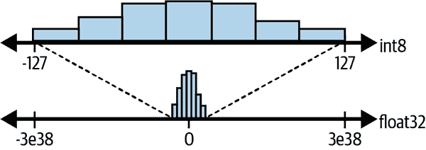

###### 图 8-19. 量化值

在这种情况下，图表底部是特定神经元可能具有的可能值的直方图。它们被归一化，所以它们围绕 0 分布，但最小值远大于 float32 的最小值，最大值远小于 float32 的最大值。如果，而不是拥有所有这些“空间”，直方图可以转换为一个更小的范围——比如从−127 到+127，然后相应地映射值。请注意，通过这样做，您显著减少了可以表示的*可能*值的数量，因此会冒降低精度的风险。研究表明，尽管可能会损失精度，但损失通常很小，但由于更简单的数据结构，模型大小以及推理时间的好处大大超过风险。

那么，值的范围可以在一个字节（256 个值）中实现，而不是 float32 的 4 个字节。考虑到神经网络可能有许多神经元，通常使用数十万或数百万个参数，仅使用四分之一的空间来存储它们的参数可以显著节省时间。

###### 注意

这也可以与优化为使用 int8 而不是 float32 数据存储的硬件结合使用，从而提供进一步的硬件加速推理优势。

这个过程被称为*量化*，并且在 TensorFlow Lite 中可用。让我们来探索它是如何工作的。

请注意，有多种量化方法，包括量化感知训练，在模型学习时考虑其中；修剪，用于减少模型中的连接以简化模型；以及我们将在这里探讨的后训练量化，在此过程中，您可以减少模型中权重和偏差的数据存储，如前所述。

在本章的源代码中，有一个名为*Chapter8Lab2*的笔记本，用于训练神经网络识别猫和狗的差异。我强烈建议您在跟随本节内容时一起进行。如果在您的国家可以访问，您可以使用[Colab](https://oreil.ly/xpEd0)；否则，您需要在 Python 环境或 Jupyter 笔记本环境中进行工作。

在您进行工作时，您可能会注意到您会得到一个看起来像这样的模型摘要：

```
Layer (type)                 Output Shape              Param #
=================================================================
keras_layer (KerasLayer)     (None, 1280)              2257984
_________________________________________________________________
dense (Dense)                (None, 2)                 2562
=================================================================
Total params: 2,260,546
Trainable params: 2,562
Non-trainable params: 2,257,984
```

请注意参数的数量：超过两百万！如果每个参数的存储减少 3 字节，通过量化可以将模型大小减少超过 6 MB！

因此，让我们探索如何对模型进行量化——这非常容易！您之前看到如何从保存的模型实例化转换器如下：

```
converter = tf.lite.TFLiteConverter.from_saved_model(CATS_VS_DOGS_SAVED_MODEL)
```

但在转换之前，您可以在转换器上设置一个优化参数，该参数接受指定优化类型的参数。最初设计时有三种不同类型的优化（默认或平衡，大小和速度），但选择量化类型的选项已经被弃用，因此目前您只能使用“默认”量化。

为了兼容性和未来的灵活性，方法签名仍然保留，但您只有一个选项（默认选项），可以像这样使用：

```
converter.optimizations = [tf.lite.Optimize.DEFAULT]
```

当我创建了未经优化的猫狗模型时，模型大小为 8.8 Mb。应用优化后，模型缩小为 2.6 Mb，节省了大量空间！

您可能会想知道这对准确性有什么影响。鉴于模型大小的变化，进行调查是很好的。

笔记本中有一些您可以自己尝试的代码，但当我调查时，我发现在 Colab 中未优化版本的模型每秒大约可以进行 37 次迭代（使用 GPU，因此针对浮点运算进行了优化！），而缩小版本每秒大约进行 16 次迭代。没有 GPU 时，性能下降了约一半，但重要的是，速度对于图像分类仍然很好，并且在设备上分类图像时不太可能需要这种性能！

更重要的是精度——在我测试的 100 张图像集中，未优化的模型正确识别了 99 张，而优化后的模型识别了 94 张。这里您将需要在是否以精度为代价优化模型之间做出权衡决定。尝试为自己的模型进行实验！请注意，在这种情况下，我只是进行了基本的量化。还有其他减小模型大小的方法，可能影响较小，所有方法都应该探索。接下来我们来看看使用代表性数据。

## 使用代表性数据

前面的示例展示了通过将浮点数（float32）的值有效地减少到整数（int8），从数据中有效去除“空白”，来进行量化。但是，该算法通常假设数据在 0 周围均匀分布，因为这是它从训练数据中学到的，如果您的测试或实际数据不是这样表示，可能会导致精度下降。我们看到，用少量测试图像，精度从 99/100 下降到 94/100。

您可以通过提供来自数据集的一些代表性数据来帮助优化过程，以便它更好地预测神经网络将来“看到”的数据类型。这将使您在大小与精度之间进行权衡——由于优化过程不会将所有值从 float32 转换为 int8，检测到数据集中一些值可能涉及过多的丢失数据，因此大小可能会稍大一些。

这样做非常简单——只需将您的数据子集作为代表性数据：

```
def representative_data_gen():
    for input_value, _ in test_batches.take(100):
        yield [input_value]
```

然后，将此指定为转换器的代表性数据集：

```
converter.representative_dataset = representative_data_gen
```

最后，指定所需的目标操作。通常会使用内置的`INT8`操作，如下所示：

```
converter.target_spec.supported_ops = [tf.lite.OpsSet.TFLITE_BUILTINS_INT8]
```

注意，在撰写本文时，全面支持的操作选择是实验性的。您可以在[TensorFlow 网站](https://oreil.ly/Kn1Xj)上找到详细信息。

使用这个过程转换后，模型大小略有增加（至 2.9 Mb，但仍远小于原始的 8.9 Mb），但迭代速度急剧下降（约每秒一个迭代）。然而，准确性提高到 98/100，接近原始模型的水平。

若要了解更多技术，并探索模型优化的结果，请查看[*https://www.tensorflow.org/lite/performance/model_optimization*](https://www.tensorflow.org/lite/performance/model_optimization)。

请自行尝试，但请注意，Colab 环境可能会有很大变化，您的结果可能与我的不同，特别是如果您使用不同的模型。我强烈建议查看在设备上推断速度和准确性如何，以获取更合适的结果。

# 总结

本章介绍了 TensorFlow Lite，以及它如何将使用 Python 训练的模型带入到诸如 Android 或 iOS 等移动设备中的工作原理。您看到了工具链和转换脚本，这些工具能够帮助您缩小模型并优化以适配移动设备，然后探索了如何编写 Android/Kotlin 或 iOS/Swift 应用程序来使用这些模型的一些场景。在超越简单模型的同时，您还开始了解作为应用程序开发者在将数据从移动环境的内部表示转换为 TensorFlow 模型中的基于张量的表示时需要考虑的一些因素。最后，您还探索了进一步优化和缩小模型的一些场景。在第九章中，您将学习一些用于创建比“Hello World”更复杂模型的场景，并在第十和十一章中，您将把这些模型引入到 Android 和 iOS 中！
