# 第九章：创建自定义模型

在早期章节中，您了解了如何使用现成的模型进行图像标注、目标检测、实体提取等。但您没有看到的是如何使用您自己创建的模型，以及*如何*您可能自己创建它们。在本章中，我们将研究创建模型的三种场景，然后在第十章和第十一章中，我们将探讨如何将这些模型整合到 Android 或 iOS 应用程序中。

从头开始创建模型可能会非常困难且非常耗时。这也是纯 TensorFlow 开发的领域，有许多其他书籍涵盖了这一点，比如我的书 *AI and Machine Learning for Coders*（O’Reilly）。如果您不是从头开始创建，并且特别是如果您专注于移动应用程序，则有一些工具可供您使用，我们将在本章中介绍其中的三个：

+   *TensorFlow Lite Model Maker*是首选选择*如果*您正在构建符合 Model Maker 支持场景的应用程序。它*不*是用于构建任何类型模型的通用工具，而是设计用于支持如图像分类、目标检测等常见用例。它涉及的神经网络特定编码几乎为零，因此如果您还不想学习这些内容，这是一个很好的起点！

+   使用*Cloud AutoML*创建模型，特别是 Cloud AutoML 中旨在最小化您需编写和维护的代码量的工具。与 TensorFlow Model Maker 类似，这里的场景侧重于核心常见的应用场景，如果您想要超出这些场景，您将需要进行一些自定义模型编码。

+   使用 TensorFlow 进行*迁移学习*创建模型。在这种情况下，您不需要从头开始创建模型，而是重用现有模型，为您的场景重新定位部分。当您接近神经网络建模时，这将需要您进行一些神经网络编码。如果您希望尝试一下创建深度学习模型的世界，这是一个绝佳的开始方式；大部分复杂性已经为您实现，但您可以灵活地构建新的模型类型。

另一个仅限 iOS 的场景是使用 Create ML 创建模型，它也使用迁移学习；我们将在第十三章中探讨这一点。我们还将探讨语言模型，除了模型本身，您的移动应用还需要理解关于模型的元数据，例如用于创建模型的单词字典。为了轻松开始，让我们首先探索 TensorFlow Lite Model Maker。

# 使用 TensorFlow Lite Model Maker 创建模型

TensorFlow Lite Model Maker 的一个核心场景是图像分类，它声称只需四行代码即可帮助您创建基本模型。此外，该模型将与 Android Studio 的导入功能兼容，因此您无需在资源文件夹中进行复杂操作，它还会生成起始代码。正如您将在第十章中看到的，使用 Model Maker 制作的模型在应用程序中使用起来要容易得多，因为将 Android 数据表示转换为模型所需张量的困难任务已被抽象化为帮助类，在使用 Android Studio 导入模型时自动生成。不幸的是，在撰写本文时，Xcode 尚无等效工具可用，因此您需要自己编写代码来处理大部分模型数据的输入/输出，但我们将通过一些示例帮助您在第十一章中开个好头。

使用 Model Maker 创建模型非常简单。您将使用 Python，我已为您创建了一个 Python 笔记本；它可以在[本书代码存储库](https://oreil.ly/9ImxO)中找到。

首先安装 `tflite-model-maker` 包：

```
!pip install -q tflite-model-maker
```

完成这些步骤后，您可以像这样导入 `tensorflow`、`numpy` 和 TensorFlow Lite Model Maker 的各种模块：

```
import numpy as np
import tensorflow as tf

from tflite_model_maker import configs
from tflite_model_maker import ExportFormat
from tflite_model_maker import image_classifier
from tflite_model_maker import ImageClassifierDataLoader
from tflite_model_maker import model_spec
```

要使用 Model Maker 训练模型，您需要数据，这可以是图像文件夹或 TensorFlow 数据集。因此，在本示例中，有一个可下载的包含五种不同类型花朵图片的文件。下载并解压缩后，将为花朵创建子目录。

下面是代码，其中 `url` 是包含花朵压缩包的位置。它使用 `tf.keras.utils` 库来下载和解压文件：

```
image_path = tf.keras.utils.get_file('flower_photos.tgz',
                                     url, extract=True)

image_path = os.path.join(os.path.dirname(image_path), 'flower_photos')
```

如果您想检查下载内容，可以执行以下操作：

```
os.listdir(image_path)
```

这将输出该路径的内容，包括子目录，应如下所示：

```
['roses', 'daisy', 'dandelion', 'LICENSE.txt', 'sunflowers', 'tulips']
```

Model Maker 将使用这些子目录作为标签名称来训练分类器。请记住，在图像分类中，训练数据是有标签的（即这是雏菊，这是玫瑰，这是向日葵等），神经网络会将每个图像的不同特征与标签匹配，以便随着时间的推移学会“看到”这些标记对象的不同之处。这类似于“当你看到这个特征时，它是向日葵；当你看到这个时，它是蒲公英”等。

你不应该用*所有*的数据来训练模型。一个最佳实践是保留一部分数据，以便验证模型是否真正理解了一般意义上不同类型的花之间的区别，或者它是否专门于它所见到的一切。这听起来有点抽象，可以这样理解：你希望你的模型能够识别出*它尚未见过的*玫瑰，而不仅仅是根据训练时使用的图像来识别玫瑰。一个简单的技术是只使用你数据的一部分 — 比如说 90% — 来进行训练。在训练过程中，剩余的 10%是不*可见*的。这 10%可以代表网络将来需要分类的内容，评估它在这方面的有效性比评估它在训练时的有效性更为重要。

要实现这一点，你需要为 Model Maker 创建一个数据加载器，从一个文件夹中获取数据。由于图像已经位于*image_page*文件夹中，你可以在`ImageClassifierDataLoader`对象上使用`from_folder`方法来获取数据集。然后，一旦你有了数据集，可以使用 split 方法将其分割；使用类似以下代码获取包含 90%图像的`train_data`和另外 10%图像的`test_data`：

```
data = ImageClassifierDataLoader.from_folder(image_path)
train_data, test_data = data.split(0.9)
```

你可能会得到以下类似的输出。请注意，3,670 是数据集中的总图像数，而不是用于训练的 90%图像数。标签数是不同类型的标签数 — 在这种情况下是五种 — 对应于五种不同类型的花。

```
INFO:tensorflow:Load image with size: 3670, num_label: 5,
labels: daisy, dandelion, roses, sunflowers, tulip
```

现在，为了训练你的模型，你只需要在图像分类器上调用`create`方法，它会完成其余的工作：

```
model = image_classifier.create(train_data)
```

这可能看起来有点太简单了 — 因为很多复杂性，比如定义模型架构、从现有模型进行迁移学习、指定损失函数和优化器，最后进行训练，全部封装在`image_classifier`对象内部。它是开源的，所以你可以通过查看[TensorFlow Lite Model Maker repo](https://oreil.ly/WYfXO)来深入了解。

输出会有很多内容，虽然一开始可能看起来有点陌生，但快速查看一下是很有必要的，以便理解。以下是完整的输出：

```
Model: "sequential_1"
_________________________________________________________________
Layer (type)                 Output Shape              Param #
=================================================================
hub_keras_layer_v1v2_1 (HubK (None, 1280)              3413024
_________________________________________________________________
dropout_1 (Dropout)          (None, 1280)              0
_________________________________________________________________
dense_1 (Dense)              (None, 5)                 6405
=================================================================
Total params: 3,419,429
Trainable params: 6,405
Non-trainable params: 3,413,024
_________________________________________________________________
None
Epoch 1/5
103/103 [====================] - 18s 151ms/step - loss: 1.1293 - accuracy: 0.6060
Epoch 2/5
103/103 [====================] - 15s 150ms/step - loss: 0.6623 - accuracy: 0.8878
Epoch 3/5
103/103 [====================] - 15s 150ms/step - loss: 0.6200 - accuracy: 0.9149
Epoch 4/5
103/103 [====================] - 15s 149ms/step - loss: 0.6011 - accuracy: 0.9219
Epoch 5/5
103/103 [====================] - 15s 149ms/step - loss: 0.5884 - accuracy: 0.9369
```

输出的第一部分是*模型架构*，告诉我们模型是如何设计的。这个模型有三层：第一层称为`hub_keras_layer_v1v2_1`，看起来有点神秘。我们稍后会回到这一点。第二层称为`dropout_1`，第三层（也是最后一层）称为`dense_1`。重要的是要注意最后一层的形状——它是`(None, 5)`，在 TensorFlow 术语中表示第一维可以是任何大小，第二维是 5。我们之前在哪里看到过 5？没错，这是数据集中的类别数量——我们有五种花。因此，这个输出将是包含五个元素的每个项目的数量。第一个数字用于处理所谓的*批量*推理。因此，如果您向模型提供一些图像，比如 20 张，它将为您提供一个 20 × 5 的单一输出，其中包含 20 张图像的推断结果。

你可能会想，为什么有五个值，而不是一个单一的值？回头看一下第二章，特别是猫和狗的例子（图 2-5），你会发现一个识别*n*类的神经网络的输出有*n*个神经元，每个神经元表示网络识别该类的概率。因此，在这种情况下，神经元的输出分别是五个类别的概率（即，神经元 1 代表雏菊，神经元 2 代表蒲公英，依此类推）。如果你想知道是什么决定了这个顺序——在这种情况下，它仅仅是按字母顺序排列。

那么其他层呢？好吧，我们从第一层开始，称为`hub_keras-layer_v1v2_1`。这是一个奇怪的名字！但提示在开头用了“hub”这个词。一种常见的模型训练形式是使用现有的预训练模型，并根据自己的需求进行调整。可以把它想象成子类化现有类并重写某些方法。有许多模型是在*数百万*张图片上进行训练的，因此它们在从这些图片中提取特征方面非常擅长。因此，与其从头开始，通常更容易使用它们已经学习过的特征，并将其与您的图片匹配。这个过程被称为*迁移学习*，而 TensorFlow Hub 存储了许多预训练模型或具有已学习特征（也称为特征向量）的模型部分，可以重复使用。这几乎就像是一个现有代码类库，但不是代码，而是已经知道如何执行某些任务的神经网络。因此，这个模型使用 TensorFlow Hub 中的现有模型并使用其特征。该模型的输出将是 1,280 个神经元，表示它尝试在您的图像中“识别”的 1,280 个特征。

这之后是一个“dropout”层，这是神经网络设计中常见的技巧，用于加快网络的训练速度。从高层次来看，它只是意味着“忽略一些神经元”！逻辑是，像花这样简单的东西，只有五类，不需要 1,280 个特征来识别，因此随机忽略其中一些更可靠！听起来有点奇怪，我知道，但当您更深入地了解模型的创建方式时（我的书 *AI 和机器学习编程者* 是一个很好的起点），这就会有点道理。

如果您已经阅读了本书的第一章和第二章，剩下的输出应该是有意义的。这是五次训练周期，在每个周期中，我们会对图像的类别进行猜测，并在所有图像上重复这个过程。这些猜测的好坏将用来优化网络并准备进行另一次猜测。在五个周期中，我们只执行这个循环五次。为什么这么少？嗯，因为我们使用的是之前描述过的迁移学习。神经网络中的特征并不是从零开始的——它们已经经过良好的训练。我们只需为我们的花朵微调它们，所以我们可以快速地完成。

当我们达到第 5 个周期的末尾时，我们可以看到准确率为 0.9369，所以这个模型在*训练集*上区分不同类型的花大约达到了 94%的准确度。如果你想知道前面的[===]是什么，以及一个数字，比如 103/103，这表明我们的数据正在被加载到模型中进行*批处理*训练。与逐个图像训练模型相比，TensorFlow 可以通过图像批处理训练来提高效率。请记住，在这种情况下，我们的数据集中有 3,670 张图像，并且我们用于训练的是其中的 90%？这将给我们训练用的 3,303 张图像。Model Maker 默认每批次 32 张图像，所以在训练过程中我们将获得 103 批次的 32 张图像。这是 3,296 张图像，因此每个周期我们将不使用 7 张图像。请注意，如果批次被随机化，每个周期中的每个批次将具有不同的图像集合，所以这七张图像最终会被使用！如果批处理训练，训练通常会更快，因此采用了这种默认方式。

记住，我们将数据的 10%作为测试集保留，这样我们可以评估模型在该数据上的表现，就像这样：

```
loss, accuracy = model.evaluate(test_data)
```

我们会看到一个结果有点像这样：

```
12/12 [=======================] - 5s 123ms/step - loss: 0.5813 - accuracy: 0.9292
```

这里的准确率显示，在测试集上——即网络之前*未曾见过*的图像上——我们的准确率约为 93%。我们有一个非常好的网络，不会过度拟合训练数据！这只是一个高层次的观察，当你深入构建更详细的模型时，你会希望探索更详细的指标——比如探索模型对每个图像类别的准确率（通常称为“混淆矩阵”），这样你就可以确定是否在过度补偿某些类型。这超出了本书的范围，但请查看 O'Reilly 的其他书籍，如我的*AI 和机器学习 for Coders*，以了解更多有关创建模型的细节。

现在，我们只需要导出训练好的模型。此时，我们有一个在 Python 环境中执行的*TensorFlow*模型。我们想要一个 TensorFlow *Lite*模型，可以在移动设备上使用。为此，Model Maker 工具提供了一个可以使用的导出：

```
model.export(export_dir='/mm_flowers/')
```

这将把模型转换为 TFLite 格式，类似于我们在第八章中看到的，但*还*会将元数据和标签信息编码到模型中。这为我们提供了一个单一文件解决方案，使得将模型导入到 Android Studio 以供 Android 开发者使用，并生成正确的标签细节变得更加容易。我们将在第十章中看到这一点。不幸的是，这是特定于 Android 的，所以 iOS 开发者也需要有标签文件。我们将在第十一章中探讨这一点。

如果你使用 Colab，你会在文件浏览器中看到*model.tflite*文件；否则，它将被写入你在 Python 代码中使用的路径。你将在第十章和 11 章中为 Android 和 iOS 应用程序使用它。

在那之前，让我们看看创建模型的其他选项，从 Cloud AutoML 开始。这是一个有趣的场景，因为正如其名称所示，它会自动生成 ML 模型。但除了不需要编写任何代码之外，它还需要一些时间来探索多个模型架构，以找到最适合你数据的模型。因此，使用它创建模型会更慢，但你将得到更精确和更优化的模型。它还支持多种格式输出，包括 TensorFlow Lite。

# 使用 Cloud AutoML 创建模型

AutoML 的目标是为您提供一套基于云的工具，让您尽可能少的编写代码和专业知识，让您训练自定义机器学习模型。有一些场景的工具可以使用：

+   *AutoML Vision*为你提供了图像分类或对象检测，并且你可以在云中运行推理或输出可用于设备的模型。

+   *AutoML Video Intelligence*让你能够检测和跟踪视频中的对象。

+   *AutoML Natural Language* 允许您理解文本的结构和情感。

+   *AutoML Translation* 允许您在不同语言之间翻译文本。

+   *AutoML Tables* 允许您使用结构化数据构建模型。

大多数情况下，这些工具设计用于在后端服务器上运行的模型。唯一的例外是 AutoML Vision，特别是称为 AutoML Vision Edge 的特定子集，它允许您训练能够在设备上运行的图像分类和标记场景。我们将在下面探讨这个。

## 使用 AutoML Vision Edge

AutoML Vision Edge 使用 Google Cloud 平台（GCP），因此，为了继续，您需要启用计费的 Google Cloud 项目。我不会在这里覆盖这些步骤，但您可以在 [GCP 网站](https://oreil.ly/9GBFq) 上找到它们。使用该工具需要您按照这些步骤仔细操作。

### 步骤 1: 启用 API

一旦您有了项目，在 Google Cloud 控制台中打开它。这可通过 [*console.cloud.google.com*](http://console.cloud.google.com) 访问。在左上角，您可以展开一个选项菜单，您将看到一个名为 API 和服务 的条目。参见 图 9-1。


###### 图 9-1\. 在 Cloud 控制台中选择 API 和服务选项

从这里，选择“库”以获取 Cloud API Library 屏幕。顶部有一个带有搜索栏的瓷砖列表。使用它来搜索“AutoML”，您将找到“Cloud AutoML API” 的条目。

选择这个选项，您将进入 Cloud AutoML API 的首页面。这里会提供有关模型的详细信息，包括定价。如果您希望使用它，请点击“启用”按钮以打开它。

### 步骤 2: 安装 gcloud 命令行工具

根据您的开发工作站，您可以选择多种安装 Cloud SDK（包括 gcloud 命令行工具）的选项。本章节我使用的是 Mac，所以我会按照那个安装它。（这些说明在 Linux 上也适用。）完整指南请查看 [Google Cloud 文档](https://oreil.ly/nDKra)。

要使用“交互式”安装程序，该程序会让你选择环境设置，请执行以下操作。在终端中输入以下命令：

```
curl https://sdk.cloud.google.com | bash
```

系统会询问您的目录。通常会使用您的主目录，默认情况下应该是这样，所以当询问时您可以直接回答“yes”以继续。还会询问是否将 SDK 命令行工具添加到您的 PATH 环境变量中。如果是，请确保选择“yes”。安装完成后，请重新启动您的终端/Shell。

完成后，在您的终端中发出以下命令：

```
gcloud init
```

您将通过一个流程引导来登录您的项目：会生成一个链接，点击链接后，浏览器将打开并要求您登录您的 Google 账号。之后，您将被要求授予 API 的权限。要使用它，您需要授予这些权限。

你还将被要求提供计算引擎资源将在其中运行的区域。你 *必须* 选择 us-central-1 实例，以便这些 API 正常工作，请确保这样做。请注意，这在将来可能会发生变化，但在撰写本文时，这是唯一支持这些 API 的区域。在选择其他选项之前，请查看[Edge 设备模型快速入门指南](https://oreil.ly/Sn0ip)。

如果你有多个 GCP 项目，你还将被要求选择适当的项目。一旦所有操作完成，你就可以准备好使用命令行工具与 AutoML！

### 第三步：设置一个服务账户

Cloud 支持多种身份验证类型，但 AutoML Edge *仅*支持基于服务账户的身份验证。因此，接下来你需要创建一个，并获取其密钥文件。你可以使用 Cloud 控制台完成这个操作。在菜单中打开 IAM 和管理部分（你可以在图 9-1 中看到它），然后选择服务账户。

屏幕顶部有一个“添加服务账户”的选项。选择它，然后你将被要求填写服务账户的详细信息。

在第一步中为其命名，在第二步中，你将被要求授予该服务账户对项目的访问权限。确保你在这里选择 AutoML 编辑器角色。你可以展开框并搜索该角色。参见图 9-2。

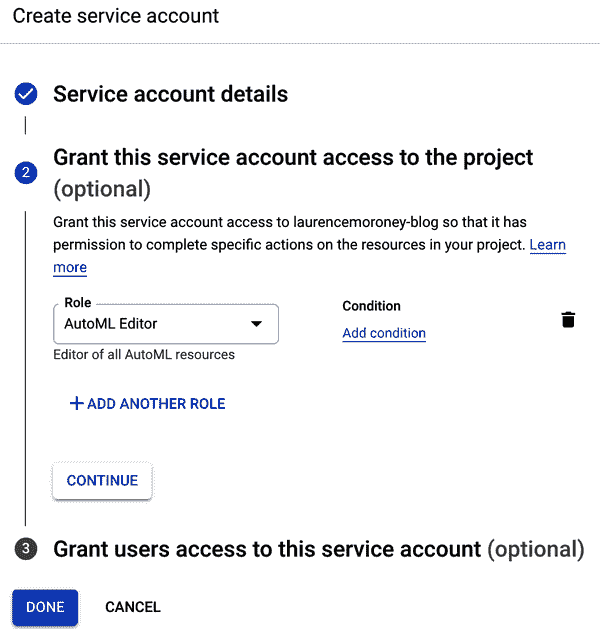

###### 图 9-2\. 服务账户详细信息

在第三步中，你将被要求输入服务账户用户和服务账户管理员角色。你可以在这里输入电子邮件地址，如果你只是第一次学习这个，可以为两者都输入你的电子邮件地址。

当你完成后，账户将被创建，并且你将返回到一个包含多个服务账户的页面。如果你是第一次这样做，可能只会有一个。无论如何，选择你刚刚创建的那个（你可以根据其名称找到它），然后你将进入服务账户详细信息页面。

屏幕底部有一个添加密钥按钮。选择它，你将看到多种密钥类型选项。选择 JSON，然后一个包含你的密钥的 JSON 文件将下载到你的计算机上。

返回到你的终端并设置这些凭据：

```
export GOOGLE_APPLICATION_CREDENTIALS=[[Path to JSON file]]
```

当你在那里时，这里有一个便捷的快捷方式来设置你的`PROJECT_ID`环境变量：

```
export PROJECT_ID=[[whatever your project id is ]]
```

### 第四步：设置一个 Cloud Storage 存储桶并将训练数据存储在其中

在使用 AutoML 训练模型时，数据也必须存储在云服务可以访问的地方。你将使用 Cloud Storage 存储桶来完成这项任务。你可以使用`gsutil`中的`mb`命令（用于创建存储桶）。之前你已经设置了`PROJECT_ID`环境变量来指向你的项目，所以这段代码将有效。请注意，你将使用`${PROJECT_ID}-vcm`的方式命名这个存储桶，与你的项目名称相同，但附加了`-vcm`：

```
gsutil mb -p ${PROJECT_ID}
          -c regional -l us-central1
          gs://${PROJECT_ID}-vcm/
```

然后你可以导出一个环境变量来指向这个存储桶：

```
export BUCKET=${PROJECT_ID}-vcm
```

我们在本章中一直在使用的花卉照片数据集位于公共云存储桶*cloud-ml-data/img/flower_photos*中，因此您可以使用此命令将它们复制到*您的*存储桶：

```
gsutil -m cp
       -R gs://cloud-ml-data/img/flower_photos/
       gs://${BUCKET}/img/
```

请注意，如果您是云服务的重度用户，并且在许多角色中使用了同一服务帐户，则可能存在冲突的权限，并且一些人报告说无法写入其 Cloud Storage 存储桶。如果您遇到此情况，请尝试确保您的服务帐户具有`storage.admin`、`storage.objectAdmin`和`storage.objectCreator`角色。

当我们在本章的早些时候使用模型制造器或 Keras 时，有工具根据其目录组织图像的标签，但处理像这样的 AutoML 时，它会更加原始。数据集提供了一个包含位置和标签的 CSV 文件，但它指向公共存储桶的 URL，因此您需要将其更新为您自己的 URL。此命令将从公共存储桶下载它，编辑它，并保存为名为*all_data.csv*的本地文件：

```
gsutil cat gs://${BUCKET}/img/flower_photos/all_data.csv
| sed "s:cloud-ml-data:${BUCKET}:" > all_data.csv
```

然后，这将把该文件上传到您的 Cloud Storage 存储桶：

```
gsutil cp all_data.csv gs://${BUCKET}/csv/
```

### 第 5 步：将您的图像转换为数据集并训练模型

此时，您的存储桶中有大量图像。接下来，您将把它们转换为可以用来训练模型的数据集。要做到这一点，请访问 AutoML Vision 仪表板，网址为[*https://console.cloud.google.com/vision/dashboard*](https://console.cloud.google.com/vision/dashboard)*.*。

您将看到卡片以开始使用 AutoML Vision、Vision API 或 Vision Product Search。选择 AutoML Vision 卡并选择开始。参见图 9-3。

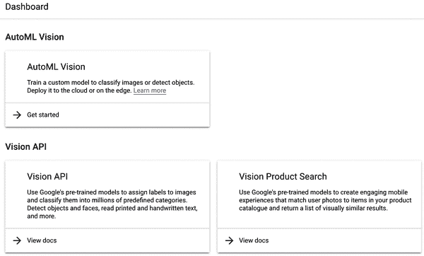

###### Figure 9-3\. AutoML Vision options

您将进入数据集列表，如果您没有经常使用 GCP，这里可能是空的，并在屏幕顶部看到一个按钮，上面写着新建数据集。单击它，您将收到一个对话框，要求您创建一个新数据集。可能至少会有三个选项：单标签分类、多标签分类或对象检测。选择单标签分类并选择创建数据集。参见图 9-4。

您将被要求选择要导入的文件。早些时候，您创建了一个包含数据集详细信息的 CSV 文件，因此请选择选择 Cloud Storage 上的 CSV，并在对话框中输入其 URL。它应该是类似*gs://project-name-vcm/csv/all_data.csv*。参见图 9-5。

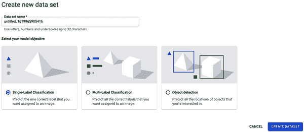

###### Figure 9-4\. 创建一个新数据集

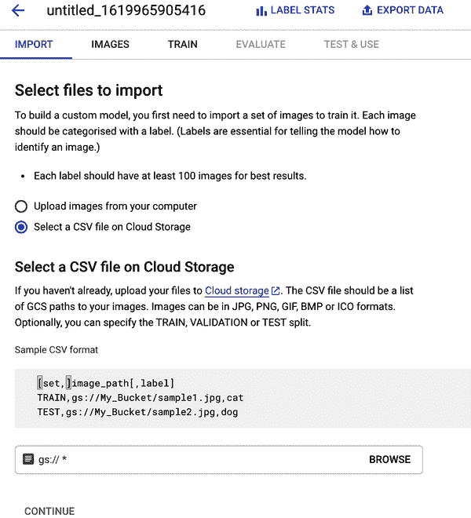

###### Figure 9-5\. 从 Cloud Storage 导入 CSV 文件

点击浏览来查找它。在执行此操作并选择继续后，您的文件将开始导入。您可以返回到数据集列表以查看这一点。参见图 9-6。

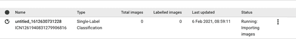

###### Figure 9-6\. 导入图像到数据集

这可能需要一些时间来完成，所以请留意左侧的状态。对于这个数据集，在完成时，它将给出警告，就像 图 9-7 中所示。

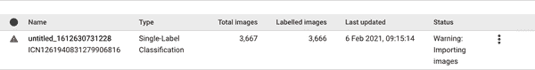

###### 图 9-7\. 数据上传完成时

一旦完成，您可以选择它，然后浏览数据集。参见 图 9-8。

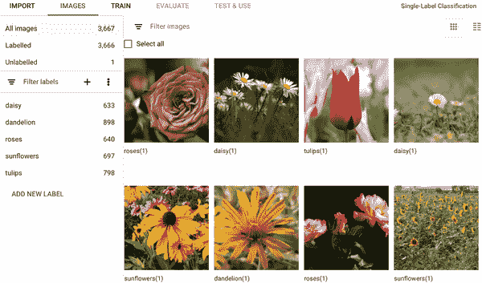

###### 图 9-8\. 探索花卉数据集

现在数据已导入，训练就像选择“训练”选项卡并选择“开始训练”那样简单。在随后的对话框中，请确保选择“Edge”作为您想要训练的模型类型，然后选择“继续”。参见 图 9-9。

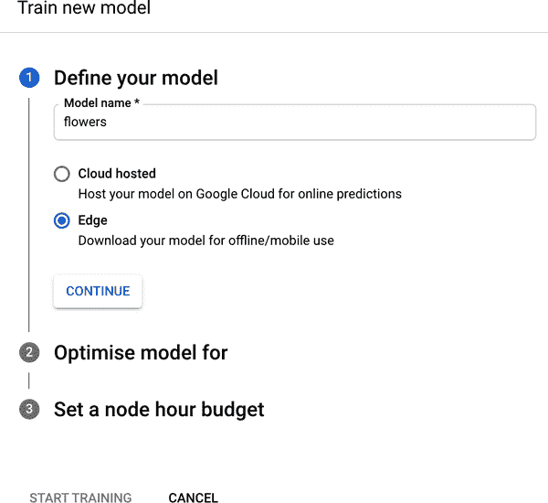

###### 图 9-9\. 定义模型

选择此选项后，您可以选择优化您的模型。这将让您选择一个更精确的更大型模型，或者一个更快但可能不那么准确的更小型模型，或者介于两者之间的某种模型。接下来，您可以选择要用来训练模型的计算小时数。默认为四个节点小时。选择这个选项，然后选择“开始训练”。训练可能需要一些时间，在完成时，AutoML 将通过电子邮件向您发送训练的详细信息！

### 步骤 6: 下载模型

一旦训练完成，您将收到来自 Google Cloud Platform 的电子邮件通知您准备就绪。当您通过邮件中的链接返回控制台时，您将看到训练结果。由于进行了神经架构搜索以找到最佳架构来分类这些花卉，这个训练可能需要相当长的时间——多达两到三个小时——而且您将在结果中看到这一点——精确度达到了 99%。参见 图 9-10。

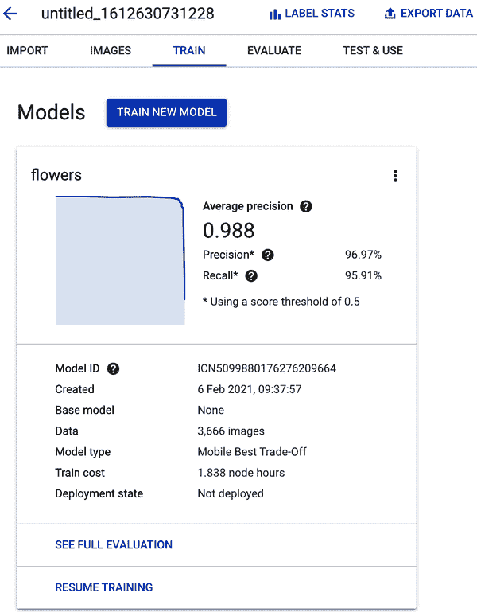

###### 图 9-10\. 训练完成

从这里，您可以转到“测试和使用”选项卡，可以将模型导出为多种格式，包括 TensorFlow Lite、TensorFlow.js 和 Core ML！选择适当的格式（本书大多数情况下使用 TensorFlow Lite，尽管我们将在后面章节中探索一些 Core ML），然后您可以下载它。参见 图 9-11。

除了这两种制作模型的方法——Model Maker 和 Cloud AutoML——这两种方法大多数情况下都避免了编写代码，并且有 API 处理模型训练，还有第三种方法值得探索，您将需要进行一些编码，但是 ML 模型大部分由他人创建，您可以利用他们的架构使用迁移学习。

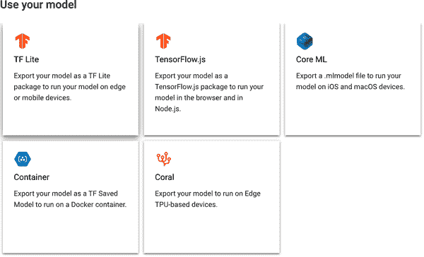

###### 图 9-11\. 模型的导出选项

# 使用 TensorFlow 和迁移学习创建模型

如前所述，迁移学习的概念可以支持快速开发机器学习模型。该概念是利用已在类似问题上训练过的神经网络的部分，然后覆盖它们以适应您自己的情景。例如，EfficientNet 模型架构是为 ImageNet 情景设计的，其中有 1,000 类图像；它经过数百万张图像的训练。为了自己训练这样一个模型所需的资源将非常昂贵，不论是时间还是金钱。当模型在如此大的数据集上训练时，它可以是一个非常高效的特征选择器。

这是什么意思？简而言之，典型的计算机视觉神经网络使用所谓的卷积神经网络（CNN）架构。 CNN 由许多滤波器组成，其中一旦滤波器应用于图像，它将对其进行转换。随着时间的推移，CNN 将学习有助于区分图像的滤波器。例如，图 9-12 显示了猫狗分类器中的图像示例，说明了 CNN 用来区分这些动物类型的图像区域。在这种情况下很明显，学习到了确定狗眼睛外观的滤波器，以及学习到了确定猫眼睛外观的其他滤波器。在网络的所有滤波器中，决定图片内容可能仅仅是这些滤波器的结果显示的内容。

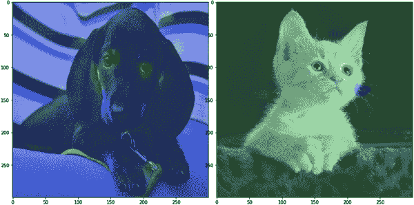

###### 图 9-12\. CNN 滤波器在不同图像中激活不同区域的示例

因此，使用像 EfficientNet 这样的现有网络，如果模型的创建者公开了已学习的滤波器（通常称为*特征向量*），您可以直接使用它们。逻辑上，如果它具有一组用于选择 1,000 类之间的滤波器，那么相同的滤波器组可能会为您的数据集提供一个合理的分类——在花朵的情况下，EfficientNet 的滤波器可能会被用于选择五类花之间的分类。因此，您不需要训练一个全新的神经网络；只需向现有的网络添加所谓的“分类头”。该头部可以是一个简单的单层，其中包含*n*个神经元，其中*n*是您数据中的类数——在花卉的情况下，这将是五个。

实际上，您的整个神经网络可能看起来像这样，并且可以用仅三行代码定义：

```
model = tf.keras.Sequential([
        feature_extractor,
        tf.keras.layers.Dense(5, activation='softmax')
])
```

要做到这一点，您必须定义特征提取器并从现有模型（如 EfficientNet）加载它。

这就是 TensorFlow Hub 派上用场的地方。它是一个模型和模型部件的存储库，包括特征提取器。您可以在[*tfhub.dev*](https://tfhub.dev)找到它。使用屏幕左侧的过滤器，您可以访问不同的模型类型——例如，如果您想要图像特征向量，您可以使用它们来获得一组[特征向量](https://oreil.ly/yWULK)。

当你拥有一个模型时，它会有一个网址—例如，优化为移动设备并在 ImageNet 上训练的 EfficientNet 模型可以在[*https://tfhub.dev/tensorflow/efficientnet/lite0/feature-vector/2*](https://tfhub.dev/tensorflow/efficientnet/lite0/feature-vector/2)找到。

您可以使用此 URL 与 TensorFlow Hub Python 库将特征向量下载为神经网络中的一层：

```
import tensorflow_hub as hub

url = "https://tfhub.dev/tensorflow/
            efficientnet/lite0/feature-vector/2"

feature_extractor =
     hub.KerasLayer(url, input_shape=(224, 224, 3))
```

就是这样—这就是你需要创建自己的模型架构并利用 EfficientNet 学习特征的所有内容！

通过这种方法，您可以创建使用最先进模型基础的模型！导出模型就像使用相同技术将其转换为 TensorFlow Lite 一样简单，您在第八章中看到了这些技术：

```
export_dir = 'saved_model/1'
tf.saved_model.save(model, export_dir)

converter =
    tf.lite.TFLiteConverter.from_saved_model(export_dir)

converter.optimizations = [tf.lite.Optimize.DEFAULT]

tflite_model = converter.convert()

import pathlib
tflite_model_file = pathlib.Path('model.tflite')
tflite_model_file.write_bytes(tflite_model)
```

我们将在第十章和第十一章探讨在 Android 和 iOS 中使用这些模型的情况。

迁移学习是一种强大的技术，我们在这里涵盖的仅仅是一个非常轻量级的介绍。要了解更多信息，请查阅 Aurelien Geron 的*Hands-On Machine Learning with Scikit-Learn, Keras, and TensorFlow*等书籍，或者 Andrew Ng 的优秀教程，如[“Transfer Learning”视频](https://oreil.ly/MDOEu)。

# 创建语言模型

在本章中，您看到了如何以多种方式创建模型，以及如何将它们转换为 TensorFlow Lite，以便它们可以部署到移动应用程序中，您将在下一章中看到。一个重要的细节是它们都是基于图像的模型，而对于其他模型类型，可能需要额外的元数据来与 TFLite 模型一起部署，以便您的移动应用程序可以有效地使用它们。在这里我们不会详细介绍训练自然语言处理（NLP）模型的内容—这只是一个关于将它们创建为移动应用程序的概念的高级概述。要了解有关创建和训练语言模型以及 NLP 工作原理的更详细步骤，请查看我的书*AI and Machine Learning for Coders*。

一个这样的例子是当你使用基于语言的模型时。构建文本分类器不是在文本本身上工作，而是在*encoded*文本上工作，你通常会创建一个单词字典，并使用它们构建分类器。

所以，例如，假设你有一个句子像“今天是个晴天”，而你想要在一个模型中使用它。一个高效的方法是用数字替换单词，这个过程称为*tokenizing*。然后，如果你也要对编码为“今天是个雨天”的句子进行编码，你可以重复使用一些标记，带有这样的字典：

```
{'today': 1, 'is': 2, 'a': 3, 'day': 4, 'sunny': 5, 'rainy': 6}
```

这将使您的句子看起来像这样：

```
[1, 2, 3, 5, 4] and [1, 2, 3, 6, 4]
```

所以当您训练您的模型时，您将用这些数据来训练它。

然而，当你稍后想要在你的移动应用程序中进行推理时，你的应用程序将需要相同的字典，否则它将无法将用户输入转换为模型训练时理解的数字序列（即它不会知道“sunny”应该使用令牌 5）。

另外，当你训练一个特定于语言的模型时，尤其是当你想要在语言中建立情感分析时，单词的标记将会映射到向量上，并且这些向量的方向将有助于确定情感。

请注意，这种技术并不限于情感分析。你可以使用这些向量来建立语义，其中具有类似含义的单词（如“cat”和“feline”）可以具有相似的向量，但具有不同含义的单词（如“dog”和“canine”）虽然相似，但与“cat”/“feline”的方向不同。但为了简单起见，我们将探索映射到有标签情感的单词。

考虑这两个句子：“我今天非常高兴”，你将其标记为积极情感，“我今天非常难过”，则为负面情感。

“I”、“am”、“very”和“today”这些单词在两个句子中都存在。单词“happy”出现在被标记为积极的句子中，“sad”出现在被标记为消极的句子中。当使用称为“嵌入”的机器学习层类型时，你所有的单词都将被转换为向量。向量的初始方向由情感决定；随着时间的推移，随着新的句子被输入模型，向量的方向将被微调。但在我们只有这两个句子的非常简单的情况下，这些向量可能看起来像图 9-13。

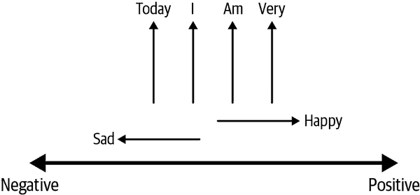

###### 图 9-13. 建立单词向量

因此，请考虑这个空间，其中向量的“方向”决定了情感。向右指向的向量具有积极情感，向左指向的向量具有消极情感。因为“today”、“I”、“am”和“very”这些单词在两个句子中都出现，它们的情感相互抵消，所以它们不指向任何方向。因为“happy”仅在标记为积极的句子中出现，它指向积极方向；类似地，“sad”指向消极方向。

当一个模型被训练在许多有标签的句子上时，类似这些向量是通过嵌入进行学习的，最终被用来对句子进行分类。

在本章早些时候，当我们探讨图像的迁移学习时，我们能够使用已经从其他模型中学习到的特征提取器。这些模型经过了对数百万张图片的训练，并且有许多标签，因此它们非常擅长学习可以被重复使用的特征。

同样的情况也发生在语言模型中，单词的向量可能已经被预先学习，你只需在你的场景中使用它们。这样可以节省训练模型时的大量时间和复杂性！

在下一节中，您将探讨如何使用 Model Maker 创建一个基于语言的模型，然后可以在 Android 或 iOS 应用程序中使用！

## 使用 Model Maker 创建语言模型

Model Maker 使使用几行代码创建基于语言的模型变得非常简单。本章的下载中有一个完整的笔记本，我们将在这里介绍亮点。在本例中，我们将使用我创建的一个数据文件，其中包含来自推文的情感。我在此代码列表中缩写了 URL 以使其适合，但完整的 URL 是[*https://storage.googleapis.com/laurencemoroney-blog.appspot.com/binary-emotion-withheaders.csv*](https://storage.googleapis.com/laurencemoroney-blog.appspot.com/binary-emotion-withheaders.csv)：

```
# Download the data CSV
data_url= 'https://storage.googleapis.com/laurencemoroney-blog.appspot.com/
             binary-emotion-withheaders.csv'

data_file = tf.keras.utils.get_file(
                     fname='binary-emotion-withheaders.csv',
                     origin=data_url)
```

接下来，Model Maker 将为您创建基础模型。它支持几种模型类型，随着时间的推移还会添加更多，但我们将使用的是最简单的模型——它使用从现有单词向量集进行的迁移学习：

```
spec = model_spec.get('average_word_vec')
```

可以使用`TextClassifierDataLoader`中的`from_csv`方法（在 Model Maker API 中可用）将 CSV 文件加载到训练数据集中，并且您需要指定 CSV 中包含文本的列以及包含标签的列。如果您检查 CSV 文件，您会看到一个名为“label”的列，其中包含负面情绪为 0 和正面情绪为 1 的内容。推文文本位于“tweet”列中。您还需要定义模型规范，以便 Model Maker 可以开始将这些推文中的单词映射到模型使用的嵌入向量。在前面的步骤中，您指定了模型规范使用平均单词向量模板：

```
# Load the CSV using DataLoader.from_csv to make the training_data
train_data = TextClassifierDataLoader.from_csv(
      filename=os.path.join(os.path.join(data_file)),
      text_column='tweet',
      label_column='label',
      model_spec=spec,
      delimiter=',',
      is_training=True)
```

现在，构建模型就像调用*text_classifier.create*一样简单，将数据、模型规范和训练的 epoch 数传递给它：

```
# Build the model
model = text_classifier.create(train_data, model_spec=spec, epochs=20)
```

因为您的模型不需要为每个单词学习嵌入，而是使用现有的嵌入，所以训练非常快速——在 Colab 中使用 GPU，我体验到大约每个 epoch 5 秒。经过 20 个 epoch 后，它将显示约 75%的准确性。

一旦模型训练完成，您可以简单地输出 TFLite 模型：

```
# Save the TFLite converted model
model.export(export_dir='/mm_sarcasm/')
```

为了方便 Android Studio 用户，这将标签*和*单词字典捆绑到模型文件中。您将在下一章中了解如何使用此模型，包括元数据。对于 iOS 开发人员，没有添加到 Xcode 的插件来处理内置元数据，因此您可以单独导出它，使用：

```
model.export(export_dir='/mm_sarcasm/',
             export_format=[ExportFormat.LABEL, ExportFormat.VOCAB])
```

这将生成一个名为*labels.txt*的文件，其中包含标签规范，另一个名为*vocab*（无扩展名），其中包含字典的详细信息。

如果您想检查用于创建模型的模型架构，可以通过调用`model.summary()`来查看：

```
Layer (type)                 Output Shape              Param #
=================================================================
embedding (Embedding)        (None, 256, 16)           160048
_________________________________________________________________
global_average_pooling1d (Gl (None, 16)                0
_________________________________________________________________
dense (Dense)                (None, 16)                272
_________________________________________________________________
dropout (Dropout)            (None, 16)                0
_________________________________________________________________
dense_1 (Dense)              (None, 2)                 34
=================================================================
Total params: 160,354
Trainable params: 160,354
Non-trainable params: 0
```

关键的事情是顶部的嵌入，其中 256 表示模型设计用于处理的句子长度—它期望每个句子长达 256 个单词。因此，当传递字符串到模型时，您不仅仅需要将它们编码为单词的标记，还需要将它们填充到 256 个标记。因此，如果您想要使用一个由 5 个单词组成的句子，您将不得不创建一个包含 256 个数字的列表，其中前 5 个是您的 5 个单词的标记，其余为 0。

这里的 16 是单词情感的维度数量。回顾图 9-13，我们展示了两个维度的情感—在这种情况下，为了捕捉更加微妙的含义，向量将会是 16 维的！

# 总结

在本章中，您看到了几种用于创建模型的工具，包括 TensorFlow Lite Model Maker、Cloud AutoML Edge 和 TensorFlow 与迁移学习。您还探讨了使用基于语言的模型时的一些微妙之处，例如需要一个关联的字典，以便您的移动客户端可以理解单词在模型中的编码方式。

希望这些内容让您对模型创建有所了解。本书的主要重点不是教授如何创建不同类型的模型，您可以查看我的另一本书《*AI 和机器学习与编程者*》来探索如何做到这一点。在第十章，您将会使用本章学到的模型，并看到如何在 Android 上实现它们，然后在第十一章中使用它们在 iOS 上。
