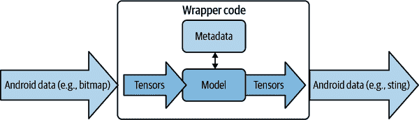
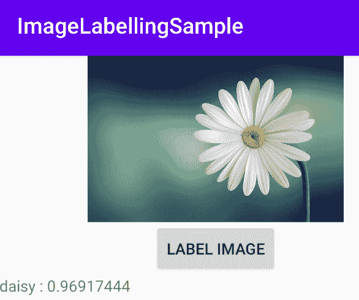
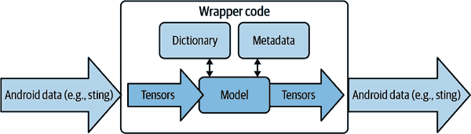

# 第十章：在 Android 中使用自定义模型

在第九章中，您看到了使用 TensorFlow Lite Model Maker、Cloud AutoML Vision Edge 和带有迁移学习的 TensorFlow 创建自定义模型的各种场景。在本章中，您将探讨如何在您的 Android 应用程序中使用和集成这些模型。不幸的是，将模型简单地放入应用程序中并使其“正常工作”通常并不简单。处理数据时经常会出现复杂情况，因为 Android 会以不同于 TensorFlow 的方式表示诸如图像和字符串等内容，而且模型的输出通常需要从基于张量的输出解析为 Android 中更具代表性的内容。我们将首先探讨这一点，然后再介绍如何在 Android 中使用图像和语言模型的一些示例。

# 将模型桥接到 Android

创建使用机器学习模型的应用程序时，您将拥有一个扩展名为*.tflite*的二进制 blob，您将将其合并到您的应用程序中。此二进制期望输入为张量（或其某种仿真），并将输出作为张量给出。这将是第一个挑战。此外，仅当存在关联的元数据时，模型才能正常工作。例如，如果您构建像第九章中的花卉分类器，模型将输出五个概率值，每个概率值与特定的花卉类型相匹配。然而，模型并不会输出像"玫瑰"这样的花卉类型，而是简单地给出一组数字，因此您需要相关的元数据来确定哪个输出值与哪种花卉相匹配。此外，如果您正在使用文本分类的语言模型，还需要理解模型训练时使用的单词字典。我们在本章中也将探讨这一点！

考虑在 Android 应用程序中使用模型的方式，看起来有点像图 10-1。



###### 图 10-1\. 在 Android 应用程序中使用模型的高级架构

因此，例如，让我们考虑我们在第八章中使用的简单模型，该模型学习了数字之间的关系为 y = 2x − 1=2X-1，并探索代码。

首先，让我们看看模型的输入。并不像将一个数字输入并得到一个数字输出那样简单。对于输入，模型期望一个 NumPy 数组，但在 Android 中并没有 NumPy。幸运的是，您可以使用低级基本类型的数组替代，并且在使用 Kotlin 时，`FloatArray`类型可以被解释器解析为浮点数的基本数组。因此，您可以使用以下代码，其中`userVal`是要输入到模型中的值：

```
var inputVal: FloatArray = floatArrayOf(userVal)
```

然后，一旦模型提供了推断，它将其作为一串字节返回。作为安卓开发者，你必须意识到这四个字节代表一个浮点数，并且你需要将它们转换为浮点数。记住，模型的输出在其最原始的形式下并不是一个浮点数；需要你将原始字节重新解释为一个浮点数：

```
var outputVal: ByteBuffer = ByteBuffer.allocateDirect(4)
outputVal.order(ByteOrder.nativeOrder())
tflite.run(inputVal, outputVal)
outputVal.rewind()
var f:Float = outputVal.getFloat()
```

因此，在安卓中使用模型时，你需要考虑到这一点，当然，对于像图片和字符串这样的更复杂的输入数据，你需要处理这样的低级细节。有一个例外情况，那就是当你使用 TensorFlow Lite 模型制造器生成元数据时，你可以在将模型导入到 Android Studio 时使用这些元数据，它将为你生成大部分包装器代码。我们将首先研究这一点。

# 从模型制造器输出构建图像分类应用程序

在 第九章 中，你探索了使用 TensorFlow Lite 模型制造器为五种不同类型的花创建图像分类器。因为你使用了这个工具，它为你生成了元数据——在这种情况下非常简单——因为它只是五种花的相关标签。确保在继续之前下载你使用 Colab 创建的模型并将其可用。

要查看如何将其集成到安卓应用程序中，请启动 Android Studio 并创建一个新应用程序。只需使用一个简单的单活动应用程序即可。

创建完应用程序后，可以通过右键单击 *Java* 文件夹（即使使用 Kotlin 也是这样命名）并选择 New → Other → TensorFlow Lite Model 添加一个新模块。参见 Figure 10-2。


###### 图 10-2\. 添加一个新模块

这将弹出导入 TensorFlow Lite 模型对话框，在其中你需要指定模型的位置。选择你下载的那个，并保持其他所有设置为默认，除了关于添加 TensorFlow Lite GPU 依赖项的底部复选框。确保勾选此项。参见 Figure 10-3。


###### 图 10-3\. 导入 TensorFlow Lite 模型

点击完成，模型将被导入，Gradle 文件将被更新并进行同步。完成后，你将看到为你创建的一些示例代码。稍后会用到这些代码。这样可以为你节省许多步骤，例如编辑 Gradle 文件、创建资产文件夹、复制模型等等。

接下来，你可以创建一个简单的布局文件，其中包含几张花的图片。我在下载中放了一个示例，其中包含了六张从资源加载的图片。以下是一个片段：

```
<?xml version="1.0" encoding="utf-8"?>
<LinearLayout

    android:layout_width="match_parent"
    android:layout_height="match_parent"
    android:orientation="vertical"
    android:padding="8dp"
    android:background="#50FFFFFF"
    >

    <LinearLayout android:orientation="horizontal"
        android:layout_width="match_parent"
        android:layout_height="0dp"
        android:gravity="center"
        android:layout_marginBottom="4dp"
        android:layout_weight="1">

        <ImageView
            android:id="@+id/iv_1"
            android:layout_width="0dp"
            android:layout_weight="1"
            android:scaleType="centerCrop"
            android:layout_height="match_parent"
            android:src="@drawable/daisy"
            android:layout_marginEnd="4dp"
            />

        ...
    </LinearLayout>

</LinearLayout>
```

ImageView 控件被称为 `iv_1` 到 `iv_6`。请注意，图像的源是 `@drawable/<*something*>`，例如 `@drawable/daisy`。UI 将从 *drawable* 目录加载具有该名称的图像。本书的 GitHub 包含完整的示例应用程序，包括几张图片。您可以在 *drawable* 文件夹中查看它们的 Figure 10-4。


###### Figure 10-4\. 将图像添加为可绘制对象

现在，在您的代码中，您可以初始化 ImageView 控件并为每个控件设置点击监听器。同一方法可以用于每一个：

```
override fun onCreate(savedInstanceState: Bundle?) {
    super.onCreate(savedInstanceState)
    setContentView(R.layout.activity_main)
    initViews()
}

private fun initViews() {
    findViewById<ImageView>(R.id.iv_1).setOnClickListener(this)
    findViewById<ImageView>(R.id.iv_2).setOnClickListener(this)
    findViewById<ImageView>(R.id.iv_3).setOnClickListener(this)
    findViewById<ImageView>(R.id.iv_4).setOnClickListener(this)
    findViewById<ImageView>(R.id.iv_5).setOnClickListener(this)
    findViewById<ImageView>(R.id.iv_6).setOnClickListener(this)
}
```

当您输入模型时，此方法可以实现代码的修改版本。这是整个方法，我们将逐步查看它：

```
override fun onClick(view: View?) {
    val bitmap = ((view as ImageView).drawable as BitmapDrawable).bitmap
    val model = Model.newInstance(this)

    val image = TensorImage.fromBitmap(bitmap)

    val outputs = model.process(image)
    val probability = outputs.probabilityAsCategoryList
    val bestMatch = probability.maxByOrNull { it -> it.score }
    val label = bestMatch?.label

    model.close()

    runOnUiThread { Toast.makeText(this, label, Toast.LENGTH_SHORT).show() }
```

首先，请注意 `onClick` 方法接受一个视图作为参数。这将是用户触摸的 ImageView 控件的引用。然后，它将创建一个 `bitmap` 变量，其中包含所选视图的内容，如下所示：

```
val bitmap = ((view as ImageView).drawable as BitmapDrawable).bitmap
```

将位图转换为张量的过程封装在 `TensorImage` 类的辅助 API 中，您只需这样做：

```
val image = TensorImage.fromBitmap(bitmap)
```

现在，我们将图像加载到张量中后，初始化一个模型并将图像传递给它就是这么简单：

```
val model = Model.newInstance(this)
val outputs = model.process(image)
```

记住，模型将返回五个输出——这些是图像包含每种特定类型花朵的概率。它们按字母顺序排列，因此第一个值将是图像包含雏菊的概率。为了得到分类，您必须找到值最高的神经元，然后使用其相应的标签。

模型通过 Model Maker 对标签进行了编码，因此您可以将模型的输出作为概率列表，将该列表排序，使最大值位于顶部，然后使用以下代码获取顶部值的标签：

```
val probability = outputs.probabilityAsCategoryList
val bestMatch = probability.maxByOrNull { it -> it.score }
val label = bestMatch?.label
```

现在您有了标签，所以显示它就像使用 `Toast` 一样简单：

```
runOnUiThread { Toast.makeText(this, label, Toast.LENGTH_SHORT).show()
```

真的就这么简单。我强烈建议在可能的情况下使用 Model Maker 来开发基于图像的应用程序，因为这样可以大大简化您的应用程序编码！

请注意，此方法仅适用于使用 TensorFlow Lite Model Maker 构建的基于图像的模型。如果要使用其他模型，例如基于文本的模型，则应改用 TensorFlow Lite 任务库。我们稍后会探讨这些内容。

# 使用 ML Kit 输出的模型制造者

在 Chapter 4 中，您看到了如何使用 ML Kit 的图像标记 API 作为计算机视觉的简易解决方案。它提供了一个通用的图像分类器，因此如果您向它展示一张花朵的图片，它将为您提供关于该图像的一些详细信息。请参见 Figure 10-5。

正如你所看到的，这告诉我们我们正在看一朵花瓣、一朵花、一棵植物和天空！虽然都准确无误，但如果我们有一个针对刚刚创建的自定义模型的即插即用解决方案，它能识别特定的花并将其标记为雏菊，那就太好了！

幸运的是，这并不太困难，我们只需几行代码就可以更新该应用程序。你可以从本书的 GitHub 页面获取它。

首先，你需要添加 ML Kit 自定义标注 API。所以，除了通过 build.gradle 添加图像标注库外，还简单地添加图像标注自定义库：

```
// You should have this already
implementation 'com.google.mlkit:image-labeling:17.0.1'
// Just add this
implementation 'com.google.mlkit:image-labeling-custom:16.3.1'
```


###### 图 10-5\. 运行通用图像分类器

在你的应用程序中会有一个资产目录，其中添加了一些你在第四章中使用的示例图像。在那里添加使用 TensorFlow Lite Model Maker 创建的*model.tflite*文件。你也可以添加一些花的图片。（该应用程序也位于本书的第十章目录下的[GitHub 页面](https://oreil.ly/iXFmG)。）

接下来，在你的活动的`onCreate`函数中，你将使用`LocalModel.Builder()`来创建一个本地模型，你将使用它来替代默认的 ML Kit 模型：

```
val localModel = LocalModel.Builder()
    .setAssetFilePath("model.tflite")
    .build()

val customImageLabelerOptions =
    CustomImageLabelerOptions.Builder(localModel)
      .setConfidenceThreshold(0.5f)
      .setMaxResultCount(5)
      .build()
```

对代码的最终更改是使用`ImageLabeling.getClient()`与你刚刚创建的选项。这在原始应用程序的`btn.setOnClickListener`中完成，因此你可以直接更新为以下内容：

```
val labeler = ImageLabeling.getClient(customImageLabelerOptions)
```

然后一切与原始应用程序相同——你将在图像上调用`labeler.process`并在其`onSuccessListener`中捕获输出：

```
btn.setOnClickListener {
  val labeler = ImageLabeling.getClient(customImageLabelerOptions)
  val image = InputImage.fromBitmap(bitmap!!, 0)
  var outputText = ""
  labeler.process(image)
    .addOnSuccessListener { labels ->
      // Task completed successfully
      for (label in labels) {
        val text = label.text
        val confidence = label.confidence
        outputText += "$text : $confidence\n"
      }
      txtOutput.text = outputText
}
```

现在，当你使用相同的雏菊图像运行应用程序时，你会看到在图 10-6 中它以接近 97% 的概率将图像分类为雏菊。



###### 图 10-6\. 使用自定义模型对雏菊进行分类

# 使用语言模型

当构建使用语言的模型时，模式与你在图 10-1 中看到的非常相似；这在图 10-7 中展示。

一个主要区别是，使用基于自然语言处理（NLP）的模型的你的应用程序需要与底层模型训练时使用的单词字典相同。回想一下第九章中，句子被分解为单词列表，而单词被赋予数值标记。为这些标记学习到向量以建立该单词的情感。例如，“dog”这个词可能被赋予标记 4，并且像[0, 1, 0, 1]这样的多维向量可以用于标记 4。字典然后可以用来将“dog”映射到你的应用程序中的 4。模型还在固定长度的句子上进行了训练，你的应用程序还需要知道这些数据。



###### 图 10-7\. 在应用程序中使用模型进行 NLP

如果您使用 TensorFlow Lite Model Maker 构建模型，则元数据和字典实际上已编译到*.tflite*文件中，以使您的生活更加轻松。

在本节的其余部分中，假设您有一个使用 Model Maker 训练的 NLP 模型，如在第九章中演示的情感分类器。您还可以在本章的存储库中找到一个示例，其中包含已为您实现的完整应用程序，包括模型。

# 创建用于语言分类的 Android 应用程序

使用 Android Studio 创建一个新的 Android 应用程序。只需将其制作成一个空活动即可。完成后，编辑 build.gradle 文件以包括 TensorFlow Lite 以及处理文本的 TensorFlow Lite 任务库：

```
implementation 'org.tensorflow:tensorflow-lite-task-text:0.1.0'
implementation 'org.tensorflow:tensorflow-lite:2.2.0'
implementation 'org.tensorflow:tensorflow-lite-metadata:0.1.0-rc1'
implementation 'org.tensorflow:tensorflow-lite-support:0.1.0-rc1'
implementation 'org.tensorflow:tensorflow-lite-gpu:2.2.0'
```

Gradle 同步后，您可以导入模型。通过右键单击项目资源管理器中的包名，然后选择新建 → 其他 → TensorFlow Lite 模型来使用与图 10-2 中显示的相同技术。接受所有默认选项，并在完成后如有必要再次进行 Gradle 同步。

### 创建布局文件

应用程序将具有非常简单的用户界面——一个带有用户输入文本的 EditText，一个触发推断的按钮，以及一个显示推断结果的 TextView。以下是代码：

```
<?xml version="1.0" encoding="utf-8"?>
<androidx.constraintlayout.widget.ConstraintLayout

    android:layout_width="match_parent"
    android:layout_height="match_parent"
    tools:context=".MainActivity">
    <ScrollView
        android:id="@+id/scroll_view"
        android:layout_width="match_parent"
        android:layout_height="0dp"
        app:layout_constraintTop_toTopOf="parent"
        app:layout_constraintBottom_toTopOf="@+id/input_text">

        <TextView
            android:id="@+id/result_text_view"
            android:layout_width="match_parent"
            android:layout_height="wrap_content" />
    </ScrollView>
    <EditText
        android:id="@+id/input_text"
        android:layout_width="0dp"
        android:layout_height="wrap_content"
        android:hint="Enter Text Here"
        android:inputType="textNoSuggestions"
        app:layout_constraintBaseline_toBaselineOf="@+id/ok_button"
        app:layout_constraintEnd_toStartOf="@+id/ok_button"
        app:layout_constraintStart_toStartOf="parent"
        app:layout_constraintBottom_toBottomOf="parent" />
    <Button
        android:id="@+id/ok_button"
        android:layout_width="wrap_content"
        android:layout_height="wrap_content"
        android:text="OK"
        app:layout_constraintBottom_toBottomOf="parent"
        app:layout_constraintEnd_toEndOf="parent"
        app:layout_constraintStart_toEndOf="@+id/input_text"
        />
</androidx.constraintlayout.widget.ConstraintLayout>
```

注意三个控件的名称——输出被称为`result_text_view`，输入被称为`input_text`，按钮被称为`ok_button`。

### 编写活动代码

在您的主活动中，编写代码非常简单。首先添加用于控制、分类器和模型的变量：

```
lateinit var outputText: TextView
lateinit var inputText: EditText
lateinit var btnOK: Button
lateinit var classifier: NLClassifier
var MODEL_NAME:String = "emotion-model.tflite"
```

然后，在您的`onCreate`中，您将初始化设置为`lateinit`的变量：

```
outputText = findViewById(R.id.result_text_view)
inputText = findViewById(R.id.input_text)
btnOK = findViewById(R.id.ok_button)
classifier = NLClassifier.createFromFile(applicationContext, MODEL_NAME);
```

当用户点击按钮时，您希望读取输入文本并将其传递给分类器。请注意，没有进行字典管理，因为所有内容都已内置到模型中。您只需获取一个字符串，并将其传递给`classifier.classify()`：

```
btnOK.setOnClickListener{
    val toClassify:String = inputText.text.toString()
    val results:List<Category> = classifier.classify(toClassify)
    showResult(toClassify, results)
}
```

模型将返回一个`Category`对象的列表。这些对象包含有关分类的数据，例如分数和标签。在这种情况下，0 是负情绪的标签，1 是正情绪的标签。这些将映射到`Category`对象中的标签属性，并且每个标签的可能性在分数属性中。由于有两个标签，因此有两个输出，因此您可以检查每个的可能性。

因此，为了显示结果，我们可以遍历列表并将它们打印出来。这在`showResult`方法中实现：

```
private fun showResult(toClassify: String, results: List<Category>) {
    // Run on UI thread as we'll updating our app UI
    runOnUiThread {
        var textToShow = "Input: $toClassify\nOutput:\n"
        for (i in results.indices) {
            val result = results[i]
            textToShow += java.lang.String.format(
                    "    %s: %s\n",
                    result.label,
                    result.score
            )
        }
        textToShow += "---------\n"

        outputText.text = textToShow
    }
}
```

就是这么简单。通过使用 Model Maker，您已将字典嵌入到模型中，并通过使用 Model Maker 的 Android API（包含在您的 build.gradle 文件中），还为您处理了转换到和从张量的复杂性，因此您可以专注于简化您的 Android 应用程序代码。

要看它如何运作，请参见 图 10-8，在那里我输入了“今天过得很美好，我玩得很开心，感觉很愉快！”这段文本。


###### 图 10-8\. 具有正面情绪的文本输入

如您所见，这句话是积极的，神经元 0（负面）的值非常低，而神经元 1（正面）的输出得分非常高。如果您输入负面文本，比如，“今天真糟糕，我过得很糟糕，感觉很难过”，那么输出将被反转。参见 图 10-9。


###### 图 10-9\. 带有负面情绪的输出

诚然，这只是一个非常简单的例子，但它展示了使用 Model Maker 和语言模型的潜力，以及如何使它们在 Android 中更易于使用。

如果您在训练模型时使用基于 BERT 的规范来使用 Model Maker，那么代码将几乎不需要修改——只需在 Android 代码中使用`BERTNLClassifier`类代替`NLClassifier`！BERT 将为您提供更好的文本分类，例如可以减少假阳性和假阴性。但这将以使用更大的模型为代价。

# 概要

在本章中，您了解了在 Android 应用程序中使用自定义模型的考虑因素。您看到了它并不像简单地将模型放入应用程序并使用那样简单，以及如何管理 Android 数据结构与模型内部使用的张量之间的转换。对于图像和自然语言处理模型的常见场景，Android 开发者的建议是使用 Model Maker 创建您的模型，并使用其关联的 API 处理数据转换。不幸的是，iOS 开发者没有这样的便利，因此他们需要更深入地进行研究。我们将在 第十一章 中深入探讨这一点。
