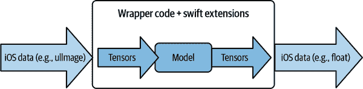
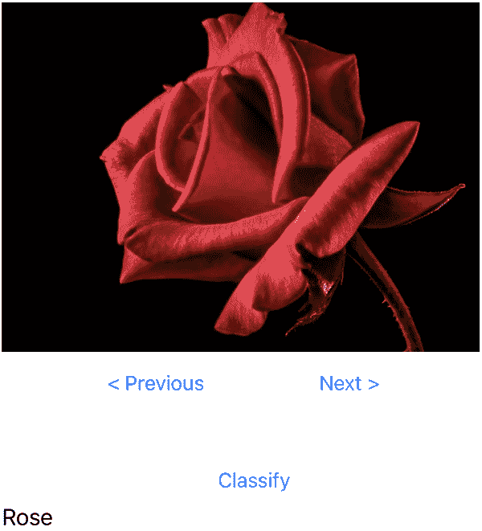
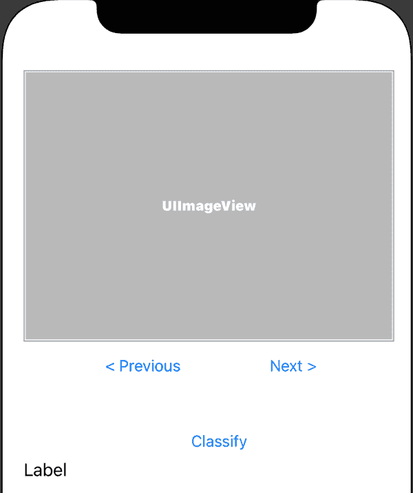
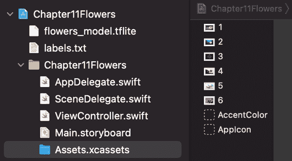
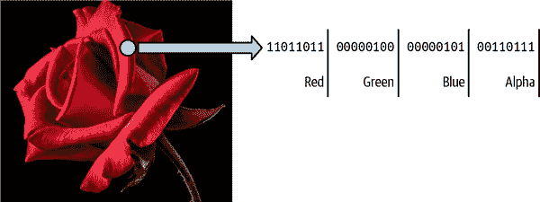
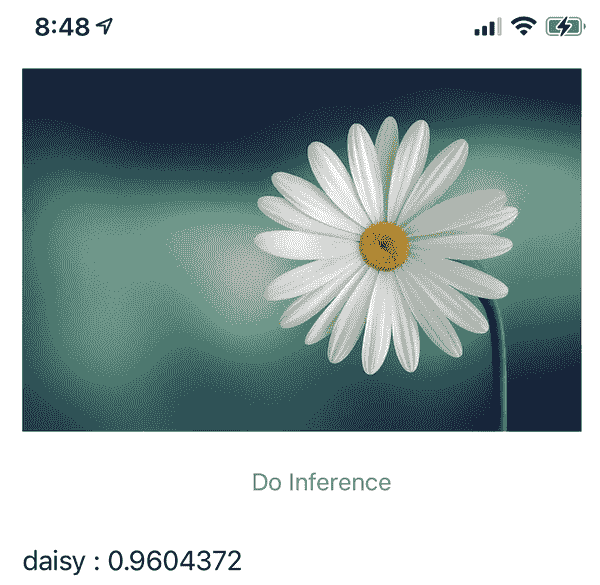
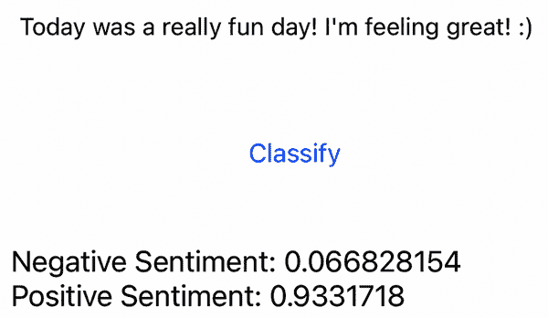

# 第十一章：在 iOS 中使用自定义模型

在第九章中，您已经查看了使用 TensorFlow Lite Model Maker、Cloud AutoML Vision Edge 和 TensorFlow 使用迁移学习创建自定义模型的各种场景。在本章中，您将看看如何将这些集成到 iOS 应用程序中。我们将专注于两种场景：图像识别和文本分类。如果您在阅读完第十章后来到这里，我们的讨论将非常相似，因为只需将模型放入应用程序中并不总是那么简单并且一切顺利。在 Android 中，使用 TensorFlow Lite Model Maker 创建的模型随附元数据和任务库，使集成变得更加容易。在 iOS 中，您没有同样级别的支持，并且将数据传递到模型并解析其结果将需要您以非常低级的方式处理将内部数据类型转换为模型理解的底层张量。完成本章后，您将了解如何基本完成这一操作，但是您的场景可能因数据而异！唯一的例外是，如果您正在使用 ML Kit 支持的自定义模型类型；我们将探讨如何在 iOS 中使用 ML Kit API 处理自定义模型。

# 将模型桥接到 iOS

当您训练模型并将其转换为 TensorFlow Lite 的 TFLite 格式时，您将获得一个二进制 blob，将其添加到您的应用程序作为资产。您的应用程序将加载这个二进制 blob 到 TensorFlow Lite 解释器中，您将需要在二进制级别为输入和输出张量编码。因此，例如，如果您的模型接受一个浮点数，您将使用具有该浮点数四个字节的 `Data` 类型。为了更轻松一些，我已经为本书的代码创建了一些 Swift 扩展。模式看起来会像图 11-1。



###### 图 11-1。在 iOS 应用程序中使用模型

所以，例如，如果您考虑在第八章中使用的简单模型，该模型学习到数字之间的关系是 y = 2x − 1，您将传递一个单个浮点数，它将推断出一个结果。例如，如果您传递值 10，它将返回值 18.98 或接近它。进入的值将是一个浮点数，但实际上，您需要将浮点数的四个字节加载到一个传递给模型的缓冲区中。因此，例如，如果您的输入在变量 data 中，您将使用以下代码将其转换为缓冲区：

```
let buffer: UnsafeMutableBufferPointer<Float> =
            UnsafeMutableBufferPointer(start: &data, count: 1)
```

这将创建一个指针，指向存储数据的内存，并且由于使用了通用的 `<Float>` 并且您说数目是 1，因此缓冲区将是从数据地址起始的四个字节。看到我所说的关于将内存中的字节变得非常底层！

将该缓冲区作为 `Data` 类型复制到第一个输入张量的解释器中，就像这样：

```
try interpreter.copy(Data(buffer: buffer), toInputAt: 0)
```

当你调用解释器时，推断将会发生：

```
try interpreter.invoke()
```

而且，如果您想要获取结果，您需要查看输出张量：

```
let outputTensor = try interpreter.output(at: 0)
```

你知道`outputTensor`包含一个`Float32`作为结果，所以你必须将`outputTensor`中的数据转换为`Float32`：

```
let results: [Float32] =
    Float32 ?? []
```

现在您可以访问结果了。在本例中，这是一个单一的值，非常简单。稍后，您将看到多个神经元输出的情况，例如在图像分类器中。

虽然这个示例非常简单，但对于更复杂的场景，您将使用相同的模式，所以在阅读本章时请牢记这一点。

您将把输入数据转换为底层数据的缓冲区。您将复制此缓冲区到解释器的输入张量中。您将调用解释器。然后，您将从输出张量中作为内存流读取数据，您将需要将其转换为可用的数据类型。如果您想要探索一个使用来自第八章中 y = 2x − 1 模型的迷你应用程序，您可以在本书的存储库中找到它。接下来，我们将看一个更复杂的例子——使用图像。虽然这种情况比您刚讨论的单浮点输入更复杂，但大部分模式是相同的，因为图像中的数据仍然非常结构化，并且读取底层内存的转换并不太困难。您将在本章末尾探索的最后一种模式是创建一个应用程序，该应用程序使用在自然语言处理（NLP）上训练的模型。在这种情况下，模型的输入数据——一个字符串——与模型识别的张量——一组标记化单词列表——完全不同，因此您将在那里更详细地探讨数据转换的方法论。但首先，让我们看一个基于自定义模型识别图像的图像分类器。

# 自定义模型图像分类器

本书前面（第六章）已经介绍了如何在 iOS 上使用 ML Kit 构建图像分类器。该基础模型预训练用于识别数百类图像，并且它表现良好，可以显示出图像中可能有猫的情况，或者，就像我们用来的狗的图像一样，模型将其同时识别为猫和狗！但对于大多数情况，您可能不希望能够识别通用图像；您需要更具体的内容。您想要构建一个应用程序，可以识别叶子上不同类型的作物疾病。您想要构建一个可以拍摄鸟类并告诉您其鸟类类型的应用程序，等等。

因此，在第八章中，您了解了如何使用 Python 中的 TensorFlow Lite Model Maker 快速训练一个模型，该模型可以从照片中识别五种不同种类的花。我们将以此作为模板，用于识别自定义模型的任何类型的应用程序。

由于这是一个基于图像的模型，使用 ML Kit 的自定义图像加载功能来构建应用程序有一个简单的解决方案，但在我们深入讨论之前，我认为看看在 iOS 和 Swift 中使用 ML Kit 不可用时如何使用模型是很好的。接下来的几个步骤中，您将会接触到低级别的内容，所以让我们做好准备吧！

## 步骤 1：创建应用程序并添加 TensorFlow Lite Pod

使用 Xcode，使用通常的流程创建一个简单的应用程序。如果您从本章开始阅读本书，请回顾一下 第三章 的过程。创建完应用程序后，关闭 Xcode，并在创建它的文件夹中添加一个名为 *podfile*（无扩展名）的文本文件，其中包含以下内容：

```
target 'Chapter11Flowers' do
  # Comment the next line if you're not using Swift and don't want to use dynamic
  # frameworks
  use_frameworks!

  # Pods for Chapter11Flowers
    pod 'TensorFlowLiteSwift'

end
```

在这种情况下，我的应用程序名称为 *Chapter11Flowers*，正如您所看到的，我们正在为其添加一个名为 *TensorFlowLiteSwift* 的 Pod。运行 `**pod install**` 让 CocoaPods 为您安装依赖项。完成后，您可以重新打开 Xcode 并加载为您创建的 *.xcworkspace* 文件（不是 *.xcproject*！）。

## 步骤 2：创建 UI 和图像资产

您可以看到自定义图像分类在一个具有非常简单用户界面的应用程序中是如何工作的。在 图 11-2 中，我们有一个应用程序运行时的屏幕截图片段。



###### 图 11-2\. 带有自定义图像模型的应用程序

该应用程序预装了几种不同类型的花朵，通过按“上一个”和“下一个”按钮，您可以在它们之间导航。按“分类”按钮，它将告诉您模型从图像中推断出的花朵类型。要使应用程序保持简单，我只是预装了一些花朵图像。要设计此内容，您可以打开 *Main.storyboard* 并设计故事板，使其看起来像 图 11-3。



###### 图 11-3\. 设计应用程序的故事板

使用 Ctrl+拖动，您可以将控件拖到 *ViewController.swift* 上创建输出和操作。

对于三个按钮，请创建名为 `prevButton`、`nextButton` 和 `classifyButton` 的操作。

您应该为名为 `imageView` 的 UIImageView 创建一个输出。您应该为名为 `lblOutput` 的 UILabel 创建一个输出。

定制模型设计用于识别五种花朵——雏菊、蒲公英、玫瑰、向日葵或郁金香。因此，您可以下载这些花朵的任何图像并嵌入到您的应用程序中。为了简化编码，请确保在将它们放入应用程序之前将图像重命名为 *1.jpg*、*2.jpg* 等。您还可以使用我在 GitHub 仓库中提供的图像。

要向应用程序添加图像，请打开 *Assets.xcassets* 文件夹，并将图像拖动到资源导航器中。例如，查看图 11-4。要将图像添加为资产，只需将其拖动到当前显示为 AppIcon 下方的区域，Xcode 将完成其余工作。



###### 图 11-4\. 将资产添加到您的应用程序

您可以看到，我有六张图像，我将它们命名为 *1.jpg*、*2.jpg* 等等，添加后它们变成了命名为资产 1、2 等等的资产。现在，您已经准备好开始编码了。

## 步骤 3: 加载并浏览图像资产

由于图像资产是编号的，现在通过上一张和下一张按钮加载和浏览它们变得很容易。通过一个称为 `currentImage` 的类级变量，它由上一张和下一张按钮更改，并且一个名为 `loadImage` 的函数也从 `viewDidLoad` 调用，您可以在资产中导航并渲染这些图像：

```
var currentImage = 1
// The previous button changes the value of the current image.
// If it's <=0, set it to 6 (we have 6 images)
@IBAction func prevButton(_ sender: Any) {
    currentImage = currentImage - 1
    if currentImage<=0 {
        currentImage = 6
    }
    loadImage()
}
// The next button changes the value of the current image.
// If it's >=7, set it to 1 (we have 6 images)
@IBAction func nextButton(_ sender: Any) {
    currentImage = currentImage + 1
    if currentImage>=7 {
        currentImage = 1
    }
    loadImage()
}

override func viewDidLoad() {
    super.viewDidLoad()
    // Do any additional setup after loading the view.
    loadImage()
}
```

`loadImage` 函数将只加载与 `currentImage` 同名的图像资产：

```
// The load image function takes the image from the bundle.
// The name within the bundle is just "1", "2" etc.
// so all you need to do is UIImage(named: "1") etc. --
// so String(currentImage) will do the trick
func loadImage(){
    imageView.image = UIImage(named: String(currentImage))
}
```

## 步骤 4: 加载模型

此时，您需要一个模型。您可以按照第八章中的步骤自己创建一个花朵模型，或者如果您愿意，只需使用我为您创建的一个模型，您可以在此应用的存储库中找到它。它将在此应用程序的文件夹中，我称之为 *Chapter11Flowers*。

要加载模型，您首先需要告诉解释器可以在哪里找到它。模型应包含在您的应用程序包中，因此您可以使用如下代码指定它：

```
let modelPath = Bundle.main.path(forResource: "flowers_model",
                                 ofType: "tflite")
```

TensorFlow Lite 解释器是您之前安装的 pods 的一部分，您需要导入其库以使用它：

```
import TensorFlowLite
```

然后，要实例化一个解释器，并让它加载您之前指定的模型，您可以使用这样的代码：

```
var interpreter: Interpreter
do{
    interpreter = try Interpreter(modelPath: modelPath!)
} catch _{
    print("Error loading model!")
    return
}
```

您现在已经加载了一个解释器到内存中并准备就绪。所以下一步您需要做的是提供一个它可以解释的图像！

## 步骤 5: 将图像转换为输入张量

这一步骤非常复杂，因此在深入研究代码之前，让我们通过可视化的方式来探索这些概念。参考图 11-1，您会注意到 iOS 可以将图像存储为 UIImage，这与模型训练识别的张量非常不同。因此，首先让我们了解一下图像通常如何存储在内存中。

图像中的每个像素由 32 位或 4 字节表示。这些字节是红色、绿色、蓝色和 alpha 通道的强度。参见图 11-5。



###### 图 11-5\. 图像如何存储在内存中

因此，例如，如果您的图像是 1000 × 1000 像素，那么用于存储它的内存将是一百万组并发的 4 字节。此块中的第一组 4 字节将是左上角的像素，下一个像素将是下一组字节，依此类推。

当您用 TensorFlow（Python 中）训练模型以识别图像时，您会使用代表图像的张量来训练模型。这些张量通常仅包含红、绿和蓝通道，而不包含 alpha 通道。此外，这些红、绿和蓝通道不是字节内容，而是*归一化*的字节内容。例如，在 Figure 11-4 中，突出显示的像素的红通道是 11011011，即 219。有许多方法可以进行归一化处理，但我们选择最简单的方法，即将其除以 255，因为字节的值范围在 0 到 255 之间，因此如果我们希望将其映射到 0 到 1 的范围内，我们只需除以 255。因此，这个像素的红通道将由值为 219/255 的浮点数表示。类似地，绿色和蓝色通道分别由 4/255 和 5/255 表示。（查看 Figure 11-4，您会看到绿色通道是 100，蓝色通道是 101，这分别是 4 和 5 的二进制表示）

但是 iOS 不允许我们像 TensorFlow 那样将数据结构化为张量，因此我们必须将张量的值写入原始内存，并使用[`Data`值类型](https://oreil.ly/BOO2S)进行映射。因此，对于图像，您需要逐像素地提取红/绿/蓝通道作为字节，并创建三个并发的浮点数，这些浮点数包含这些字节除以 255 的值。您将对图像中的每个像素执行此操作，并将生成的`Data`块传递给解释器，然后解释器将把它切片成适当的张量！在此之前，您还需要做的一件事是确保图像是模型所识别的正确尺寸。因此，对于我们的假设性 1000 × 1000 图像，我们需要将其调整大小为模型识别的大小。对于移动模型，通常是 224 × 224。

现在让我们回到代码！首先，您可以从`currentImage`变量创建一个`UIImage`：

```
let image = UIImage(named: String(currentImage))
```

`UIImage`类型暴露了一个`CVPixelBuffer`属性，可以让您执行诸如裁剪图像之类的操作，您可以像这样获取它：

```
var pixelBuffer:CVPixelBuffer
pixelBuffer = image!.pixelBuffer()!
```

有很多种方法可以将当前图像转换为 224 × 224，包括缩放它，但为了保持简单，我将使用像素缓冲区的`centerThumbnail`属性，它将在图像中找到最大的正方形，并将其重新缩放为 224 × 224：

```
// Crops the image to the biggest square in the center and
// scales it down to model dimensions.
let scaledSize = CGSize(width: 224, height: 224)
let thumbnailPixelBuffer =
        pixelBuffer.centerThumbnail(ofSize: scaledSize)
```

现在我们有了一个 224 × 224 的图像，但每像素仍然是 32 位。我们希望将其拆分为红色、绿色和蓝色通道，并将它们加载到数据缓冲区中。这个缓冲区的大小将是 224 × 224 × 3 字节，因此在下一步中，您将创建一个名为`rgbDataFromBuffer`的辅助函数，该函数接受像素缓冲区并切片通道，将它们排列为一系列字节。您将调用该函数，并让它返回一个类似于`Data`的对象：

```
let rgbData = rgbDataFromBuffer(
    thumbnailPixelBuffer!, byteCount: 1 * 224 * 224 * 3)
```

现在我们将进入非常低级的地方，请做好准备！接收 `CVPixelBuffer` 并返回 `Data` 的辅助函数的签名应如下所示：

```
private func rgbDataFromBuffer(
    _ buffer: CVPixelBuffer, byteCount: Int) -> Data? {
}
```

它返回一个 `Data?`，因为这是解释器希望我们发送的。稍后您将看到这一点。

首先，您需要获取一个指向内存地址的指针（在本例中称为 `mutableRawPointer`），该内存地址存放缓冲区。请记住，此缓冲区是您创建的图像的 224 × 224 裁剪部分：

```
CVPixelBufferLockBaseAddress(buffer, .readOnly)
defer { CVPixelBufferUnlockBaseAddress(buffer, .readOnly) }
guard let mutableRawPointer =
            CVPixelBufferGetBaseAddress(buffer)
               else {
                     return nil
               }
```

您还需要缓冲区的大小，我们将其称为 `count`。称其为 `count` 而不是 `size` 或类似名称可能看起来有点奇怪，但是正如您将在代码的下一行中看到的，当您创建 `Data` 对象时，它期望一个名为 `count` 的参数，这个 `count` 是字节的计数！无论如何，要获取缓冲区的大小，您可以像这样使用 `CVPixelBufferGetDataSize`：

```
let count = CVPixelBufferGetDataSize(buffer)
```

现在您有了指向像素缓冲区位置的指针以及其大小，您可以像这样创建一个 `Data` 对象：

```
let bufferData = Data(bytesNoCopy: mutableRawPointer,
                      count: count, deallocator: .none)
```

每个 8 位通道都需要从中提取出来，并转换为浮点数，然后除以 255 进行归一化。因此，对于我们的 `rgbData`，让我们首先创建一个与图像中的字节数相同大小的 `Float` 数组（记住它存储在 `byteCount` 参数中的 224 × 224 × 3 中）：

```
var rgbBytes = Float
```

现在您可以逐字节查看缓冲区数据。每四个字节中的一个将是 alpha 通道组件，因此您可以忽略它。否则，您可以读取字节，将其值除以 255 进行归一化，然后将归一化后的值存储在当前索引的 `rgbBytes` 中：

```
var index = 0
for component in bufferData.enumerated() {
  let offset = component.offset
  let isAlphaComponent = (offset % 4) == 3
  guard !isAlphaComponent else { continue }
  rgbBytes[index] = Float(component.element) / 255.0
  index += 1
}
```

现在您有了一系列归一化字节序列，对解释器来说看起来像包含图像的张量，您可以像这样返回它作为 `Data`：

```
return rgbBytes.withUnsafeBufferPointer(Data.init)
```

下一步将是将此 `Data` 对象传递给解释器并获得推理结果。

## 第六步：获取张量的推理结果

到此为止，我们已经将来自图像的数据格式化为一个 `Data`，其中包含每个像素的红色、绿色和蓝色通道作为包含每个通道归一化数据的 `Float`。当解释器读取此 `Data` 时，它将把它识别为输入张量，并逐浮点数读取。首先，让我们初始化解释器并为输入和输出张量分配内存。您将在应用程序中的 `getLabelForData` 函数中找到此代码：

```
// Allocate memory for the model's input tensors.
try interpreter.allocateTensors()
```

解释器将读取原始数据，因此我们必须将数据复制到解释器为其输入张量分配的内存位置：

```
// Copy the RGB data to the input tensor.
try interpreter.copy(data, toInputAt: 0)
```

请注意，我们在这里只处理单个图像输入和单个推理输出，这就是为什么我们将其放在输入 0 上的原因。您可以执行批量推理，一次加载多个图像以对它们进行推理，因此您可以将此处的 0 改为第 *n* 张图像的 *n*。

现在如果我们调用解释器，它将加载数据，对其进行分类，并将结果写入其输出张量：

```
// Run inference by invoking the `Interpreter`.
try interpreter.invoke()
```

我们可以通过其`.output`属性访问解释器的输出张量。与输入类似，在这种情况下，我们一次处理一张图像，因此其输出位于索引 0。如果我们批量处理图像，则第*n*张图像的推理将位于索引*n*处。

```
// Get the output tensor to process the inference results.
outputTensor = try interpreter.output(at: 0)
```

记住，这个模型是在五种不同类型的花上训练的，因此模型的输出将是五个值，每个值表示图像包含特定花的概率。按字母顺序排列，我们识别的花包括雏菊、蒲公英、玫瑰、向日葵和郁金香，因此这五个值将对应于这些花的概率。例如，第一个输出值将是图像包含雏菊的可能性，依此类推。

这些值是*概率*，因此它们的取值范围在 0 到 1 之间，并且被表示为浮点数。你可以读取输出张量并将其转换为数组，就像这样：

```
let resultsArray =
    outputTensor.data.toArray(type: Float32.self)
```

现在，如果你想确定图像中包含的最可能的花卉，你可以回到纯 Swift，获取最大值，找到该值的索引，并查找与该索引对应的标签！

```
// Pick the biggest value in the array
let maxVal = resultsArray.max()
// Get the index of the biggest value
let resultsIndex = resultsArray.firstIndex(of: maxVal!)
// Set the result to be the label at that index
let outputString = labels[resultsIndex!]
```

然后，你可以在用户界面中呈现输出字符串，以展示推理结果，就像我在图 11-2 中所做的那样。

就是这样！虽然在低级内存中使用指针和缓冲区处理起来有些复杂，但这是一个理解在原生类型和张量之间转换数据复杂性的好练习。

如果你不想做得那么底层，但仍在使用图像，还有另一种选择，即使用 ML Kit 并让其使用你的自定义模型而不是其标准模型。这也很容易做到！接下来你将看到。

# 在 ML Kit 中使用自定义模型

在第 6 章中，你看到了如何构建一个简单的应用程序，该应用程序使用 MLvKit 的图像标签 API 来识别数百种图像类别，但与前面的例子一样，无法处理更具体的事物，如花的类型。为此，你需要一个自定义模型。ML Kit 可以支持这一点，只需进行一些小的调整，你就可以让它加载你的自定义模型并运行推理，而不是使用其基础模型。本书的存储库包含原始应用程序（在第 6 章文件夹中）以及更新为自定义模型的应用程序（在第 11 章文件夹中）。

首先，更新你的 Podfile 以使用*GoogleMLKit/ImageLabelingCustom*而不是*GoogleMLKit/ImageLabeling*：

```
platform :ios, '10.0'
# Comment the next line if you're not using Swift and don't want to use dynamic
# frameworks
use_frameworks!

target 'MLKitImageClassifier' do
        pod 'GoogleMLKit/ImageLabelingCustom'
end
```

运行`**pod install**`之后，你的应用程序现在将使用`ImageLabelingCustom`库而不是通用的`ImageLabeling`库。要使用这些库，你需要导入它们，因此在你的视图控制器顶部，你可以添加：

```
// Import the MLKit Vision and Image Labeling libraries
import MLKit
import MLKitVision
// Update this to MLKitImageLabelingCustom if you are adapting the base model
// sample
import MLKitImageLabelingCommon
import MLKitImageLabelingCustom
```

对于自定义模型，你可以使用 MLKit 的`LocalModel`类型。你可以使用以下代码从包中加载你的自定义模型（*flowers_model.tflite*，如前面的演示）：

```
// Add this code to use a custom model
let localModelFilePath = Bundle.main.path(
        forResource: "flowers_model", ofType: "tflite")
let localModel = LocalModel(path: localModelFilePath!)
```

使用基础模型，你需要设置一个`ImageLabelerOptions`对象。对于自定义模型，你将需要使用`CustomImageLabelOptions`：

```
// Create Image Labeler options, and set the threshold to 0.4
// to ignore all classes with a probability of 0.4 or less
let options = CustomImageLabelerOptions(
                         localModel: localModel)
options.confidenceThreshold = 0.4
```

现在，你将使用自定义选项创建`ImageLabeler`对象，该对象将加载本地模型：

```
// Initialize the labeler with these options
let labeler = ImageLabeler.imageLabeler(options: options)
```

其他一切都与之前一样！与以前必须手动将原始图像转换为`Data`并将其表示为张量的示例相比，你现在使用的代码要少得多，并且你不必读取重新转换为数组以获取结果的输出内存。因此，如果你正在构建图像分类器，我强烈建议你使用 ML Kit（如果可以的话）。如果不能，我希望提供两种方法对你有用！

你可以在图 11-6 中看到更新后的应用程序的屏幕截图。这里我使用了雏菊的图片，ML Kit 的引擎使用我的自定义模型返回了雏菊的推断，概率为 0.96！



###### 图 11-6\. 使用自定义花卉模型的 ML Kit 应用程序

当在移动设备上构建基于 ML 的模型时，理解底层数据结构总是很有用的。我们将探索另一个使用自然语言处理的应用程序场景，这样你就可以更深入地了解如何在 Swift 中使用模型。我们将再次采用原始数据的方法，就像我们在图像示例中使用的那样，但这次我们将探索一个设计用于识别文本和文本情感的模型！

# 使用 Swift 构建自然语言处理应用程序

在着手构建应用程序之前，理解自然语言处理模型的基础工作是很有用的，这样你就能看到在设备上处理文本字符串和模型张量之间的数据交换如何工作。

首先，当你在一组文本（称为语料库）上训练模型时，你会将模型理解的词汇限制在*最多*这些语料库中的单词。因此，例如，在这个应用程序中使用的模型是在第八章 中使用数千条推文的文本进行训练的。只有这些推文集中使用的单词才会被模型识别。所以，例如，如果你想在你的应用程序中使用“反教会主义”的词来分类一个句子，那么这个词在语料库中并不存在，因此你的模型会忽略它。你需要的第一件事是模型训练时使用的词汇表，即它*确实*识别的单词集。第八章 中的笔记本中有代码来导出这个词汇表，以便可以下载并在你的应用程序中使用。此外，我说*最多*是指这些单词，因为如果你考虑一下，语料库中可能只有一两次使用的单词。你通常可以通过忽略那些单词来调整模型，使其更小、更好、更快。这超出了我们在这里所做的范围，因此在这种情况下，请假设词汇表将是语料库中所有单词的整体集合，当然，这应该是所有单词的一个小子集！

其次，模型不是在*单词*上训练的，而是在*代表这些单词的标记*上训练的。这些标记是数字，因为神经网络使用数字！它们在词汇表中进行索引，并且 TensorFlow 将按照单词的频率对词汇表进行排序。因此，例如，在 Twitter 语料库中，“今天”这个词是第 42 个最流行的。它将由数字 44 表示，因为标记 0 到 2 保留用于填充和超出词汇表范围的标记。因此，当你试图对用户输入的字符串进行分类时，你将需要将字符串中的每个单词转换为其相关的标记。同样，为此你将需要词典。

第三，由于你的单词将由标记表示，因此你不会向模型传递一个单词字符串，而是一个称为*序列*的标记列表。你的模型是在固定序列长度上进行训练的，因此如果你的句子比该长度短，你将不得不进行填充以适应。或者如果你的句子更长，你将不得不截断以适应。

这一切都发生在你将标记序列转换为底层张量之前！这里有很多步骤，所以我们将逐步探索它们，当我们构建应用程序时。

图 11-7 展示了实际应用程序的外观。有一个编辑文本字段，用户可以输入类似“今天是一个真正有趣的一天！我感觉很棒！:)”的文本，当用户触摸“分类”按钮时，模型将解析文本以获取情感。结果呈现——在这种情况下，你可以看到负面情感的概率约为 7%，而正面情感约为 93%。

让我们看看构建这样一个应用程序所需的必要步骤！我假设您已经创建了一个应用程序，像前面展示的那样添加了 TensorFlow Lite pod，并为输入添加了一个 UITextView（带有名为 `txtInput` 的 outlet），为输出添加了一个 UILabel（带有名为 `txtOutput` 的 outlet），并在按钮上创建了一个名为 `classifySentence` 的操作。完整的应用程序位于本书的仓库中，所以我只会回顾您需要执行的 NLP 特定编码工作。



###### 图 11-7\. 解析情感

## 第 1 步：加载词汇表

当您使用 Model Maker 创建模型时（请参阅 第八章），您能够从 Colab 环境中下载模型以及一个名为 *vocab* 的词汇文件。将该词汇文件重命名为 *vocab.txt* 并添加到您的应用中。确保它包含在包中，否则您的应用在运行时将无法读取它。

然后，要使用词汇表，您需要一个包含键-值对的字典。键是一个字符串（包含单词），值是一个`int`（包含单词的索引），如下所示：

```
var words_dictionary = [String : Int]()
```

然后，要加载字典，您可以编写一个名为 `loadVocab()` 的辅助函数。让我们探讨它的功能。首先，通过定义 `filePath`，将 *vocab.txt* 指定为您要加载的文件：

```
if let filePath = Bundle.main.path( forResource: "vocab",
                                    ofType: "txt") {}
```

如果找到了，那么括号内的代码将执行，所以您可以将整个文件加载到一个 `String` 中：

```
let dictionary_contents = try String(contentsOfFile: filePath)
```

然后，您可以按换行符分割这些行以获取一组行：

```
let lines = dictionary_contents.split(
                                  whereSeparator: \.isNewline)
```

您可以通过此进行迭代，以每行空格分割。在文件中，您将看到词汇表中每行都有一个单词和其后跟随的标记，用空格分隔。这可以为您提供键和值，因此您可以用它们加载 `words_dictionary`：

```
for line in lines{
    let tokens = line.components(separatedBy: " ")
    let key = String(tokens[0])
    let value = Int(tokens[1])
    words_dictionary[key] = value
}
```

为了方便起见，这里是完整的函数：

```
func loadVocab(){
// This func will take the file at vocab.txt and load it
// into a hash table called words_dictionary. This will
// be used to tokenize the words before passing them
// to the model trained by TensorFlow Lite Model Maker
    if let filePath = Bundle.main.path(
                         forResource: "vocab",
                         ofType: "txt") {
        do {
            let dictionary_contents =
               try String(contentsOfFile: filePath)
            let lines =
               dictionary_contents.split(
                      whereSeparator: \.isNewline)
            for line in lines{
                let tokens = line.components(separatedBy: " ")
                let key = String(tokens[0])
                let value = Int(tokens[1])
                words_dictionary[key] = value
            }
        } catch {
            print("Error vocab could not be loaded")
        }
    } else {
        print("Error -- vocab file not found")
    }
}
```

现在字典已加载到内存中，下一步是将用户的输入字符串转换为一系列标记。您将在接下来看到这一步。

###### 注意

接下来的几个步骤将使用一些用于处理低级内存的复杂 Swift 扩展。详细介绍这些扩展如何工作已超出本书的范围，通常情况下，这些是您可以在自己的应用程序中以几乎不需要修改的代码进行重用的代码。

## 第 2 步：将句子转换为序列

正如前面讨论的，在创建语言模型时，您需要对一系列标记进行训练。此序列长度固定，因此如果您的句子更长，您将对其进行修剪至该长度。如果较短，则填充至该长度。

语言模型的输入张量将是一系列 4 字节整数，因此，为了开始创建它，您将初始化您的序列为`Int32`，所有这些整数都是 0，在词汇表中，0 表示一个未找到的单词，在字典中用 `<Pad>` 表示（用于填充！）（注：如果您从仓库克隆了它，您将在应用的 `convert_sentence` 函数中看到此代码。）

```
var sequence = Int32
```

这里有一些 Swift 代码，可以将一个字符串拆分为单词，同时去除标点符号和多个空格：

```
sentence.enumerateSubstrings(
   in: sentence.startIndex..<sentence.endIndex,
   options: .byWords) {(substring, _, _, _) -> ()
                       in words.append(substring!) }
```

这将给你一个称为 `words` 的单词列表数据结构。循环遍历这个数据结构非常简单，如果单词作为 `words_dictionary` 中的键存在，你可以将它的值添加到序列中。请注意将其添加为 `Int32`：

```
var thisWord = 0
for word in words{
    if (thisWord>=SEQUENCE_LENGTH){
        break
    }
    let seekword = word.lowercased()
    if let val = words_dictionary[seekword]{
        sequence[thisWord]=Int32(val)
        thisWord = thisWord + 1
    }
}
```

一旦你完成这里，`sequence` 将会包含你的单词编码为 `Int32` 的序列。

## 步骤 3：扩展数组以处理不安全数据

你的序列是一个 `Int32` 数组，但是 Swift 会围绕这个做一些结构。为了让 TensorFlow Lite 能够读取它，需要按顺序读取原始字节，你可以通过扩展 `Array` 类型来处理这些不安全的数据。这是 Swift 的一个很好的特性，你可以扩展类型。下面是完整的代码：

```
extension Array {

init?(unsafeData: Data) {
    guard unsafeData.count % MemoryLayout<Element>.stride == 0 else
      { return nil }
    #if swift(>=5.0)
    self = unsafeData.withUnsafeBytes
      { .init($0.bindMemory(to: Element.self)) }
    #else
    self = unsafeData.withUnsafeBytes {
      .init(UnsafeBufferPointer<Element>(
        start: $0,
        count: unsafeData.count / MemoryLayout<Element>.stride
      ))
    }
    #endif  // swift(>=5.0)
  }
}
```

我不会详细说明这个函数做了什么，但最终的想法是它将使用 Swift 的 `init` 功能来初始化一个新的数组，其中包含 `Data` 构造函数中的 `unsafeBytes`。在 Swift 5.0+ 中，你可以使用 `bindMemory` 将底层内存复制到新数组；否则，你将使用 `unsafeData.withUnsafeBytes` 从原始缓冲区的开头复制，以及 `unsafeData` 的数量。

要使用你之前创建的序列创建一个输入张量，你可以简单地使用：

```
let tSequence = Array(sequence)
```

这将用于创建传递给解释器的 `Data` 类型。你将在下一步中看到这个。

## 步骤 4：将数组复制到数据缓冲区

现在你有了一个 `Int32` 数组，仅使用 `Int32` 的底层字节；它称为 `tSequence`。这需要复制到一个 `Data` 中，以便 TensorFlow 能够解析它。最简单的方法是扩展 `Data` 来处理你将从中复制的缓冲区。以下是扩展代码：

```
extension Data {
  init<T>(copyingBufferOf array: [T]) {
    self = array.withUnsafeBufferPointer(Data.init)
  }
}
```

这将仅通过从输入数组（称为 `array`）复制不安全的缓冲区数据来初始化 `Data`。要使用此数据创建新的 `Data`，可以使用以下代码：

```
let myData =
    Data(copyingBufferOf: tSequence.map { Int32($0) })
```

正如你所见，这将通过映射 `tSequence`，使用 `Int32` 类型来创建 `myData`。现在你有了 TensorFlow Lite 可以解释的数据！

## 步骤 5：对数据进行推理并处理结果

在第 4 步之后，你将得到 `myData`，它是一个包含组成表示你的句子的序列的 `Int32` 的原始数据缓冲区。因此，你现在可以通过分配张量来初始化解释器，然后将 `myData` 复制到第一个输入张量。如果你使用书中的代码，你将在 `classify` 函数中找到这段代码：

```
try interpreter.allocateTensors()
try interpreter.copy(myData, toInputAt: 0)
```

然后你将调用解释器，并获取 `outputTensor`：

```
try interpreter.invoke()
outputTensor = try interpreter.output(at: 0)
```

张量将输出一个包含两个值的数组，一个用于负面情感，一个用于正面情感。这些值在 0 到 1 之间，因此你需要将数组转换为 `Float32` 类型来访问它们：

```
let resultsArray = outputTensor.data
let results: [Float32] =
      Float32 ?? []
```

现在相对容易（终于！）通过读取数组中的前两个条目来访问这些值：

```
let negativeSentimentValue = results[0]
let positiveSentimentValue = results[1]
```

这些数值随后可以被处理，或者简单输出，就像我在这个应用中所做的那样；你可以在 图 11-7 中看到。

# 概要

在 iOS 上使用 TensorFlow 的机器学习模型需要你在加载数据到模型进行推断并解析时，进行相当低层次的内存管理。在本章中，你探索了如何处理图像，需要从底层图像中切片通道字节的红、绿和蓝色，对它们进行归一化，并将它们写入作为浮点值的 `Data` 缓冲区，使用 TensorFlow Lite 解释器加载。你还看到了如何解析模型的输出——以及为什么理解模型架构至关重要，在本例中，该模型具有五个输出神经元，包含了图像是五种不同花卉的概率。相比之下，你看到 ML Kit 通过使用其更高级别的 API，使这种场景变得更加容易，如果你正在构建被 ML Kit 场景覆盖的模型，我强烈推荐这种方法，而不是自己处理原始的位和字节！在另一个数据管理练习中，你还看到了一个简单的自然语言处理应用程序，其中你想要对字符串进行分类，以及如何首先对该字符串进行标记化，然后将其转换为序列，并将该序列的类型映射到一个原始缓冲区，然后将其传递给引擎。ML Kit 或任何其他高级 API 不支持这种情况，因此重要的是要动手探索如何实现！我希望这两个实例及为其创建的扩展能够使你在创建应用程序时更加轻松。在下一章中，我们将摆脱 TensorFlow Lite 转向 Core ML 和 Create ML 的 iOS 特定 API。
