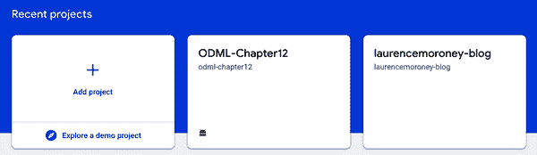

# 第十二章：使用 Firebase 将你的应用产品化

到目前为止，在本书中，你已经探索了如何使用机器学习创建模型，并学习了如何使用多种技术将其集成到 Android 或 iOS 应用中。你可以选择使用 TensorFlow Lite 低级 API 直接使用模型，并处理数据转换的过程。或者，针对多种常见场景，你可以利用 ML Kit 使用高级 API 和异步编程方法来构建更易于开发的响应式应用程序。然而，在所有这些情况下，你只是构建了一个非常简单的应用，在单个活动或视图中进行推断。

当谈到产品化应用时，你当然需要更进一步，而 Firebase 被设计为跨平台解决方案，旨在帮助你构建、增长和从你的应用中赚取收入。

尽管本书不涵盖 Firebase 的全面讨论，但 Firebase 中有一个重要功能在免费（即 Spark）层中可用，你可以真正利用它：自定义模型托管。

# 为什么使用 Firebase 自定义模型托管？

正如你在整本书中所看到的，为用户解决问题创建 ML 模型并不难。得益于诸如 TensorFlow 或 TensorFlow Lite 模型制作器这样的工具，这相对来说是相当简单的，它可以根据你的数据快速训练一个模型。难的是创建*正确*的模型，显而易见的假设是，要能够做到这一点，你需要不断地测试和更新你的模型，验证它如何执行，不仅从速度或准确性的角度来看，还要看它如何影响用户使用你的应用。正确的模型是否能带来更好的参与度？错误的模型是否意味着用户会放弃你的应用？它是否会导致与广告或应用内购买的更多互动？

Firebase 的目标是通过分析、A/B 测试、远程配置等手段帮助你回答所有这些问题。

但是在使用 ML 模型时，当然，为了能够有效地*提问*这些问题，你需要一种方法来部署多个模型，并根据这些模型对你的受众进行分割。你已经创建了一个模型的 v1 版本，并且它运行良好。你从用户那里学到了很多关于它的信息，并收集了新数据来创建一个新模型。你希望将其部署到一些用户那里进行测试，并进行仔细监控的推出。

你将如何继续进行？

那么，对于使用 ML 模型的开发者来说，Firebase 自定义模型托管可以是通往 Firebase 平台上其余服务的入口。在本章中，我们将探讨一个场景，称为“远程配置”，如果你感兴趣，你可以从那里扩展到平台上其他可用的服务。

因此，为了开始，让我们首先创建一个场景，在这个场景中，我们有多个模型，为此，我们将返回到 TensorFlow Lite 模型制作器。

###### 注意

在使用 Firebase 控制台时，您可能会注意到不同 API 的多个瓷砖。实际上，这些是用于 ML Kit 的，我们在之前的章节中已经涵盖过！它曾经是 Firebase 的一部分，然后独立出来，但在控制台中仍然可以找到与之相关的链接。

# 创建多个模型版本

对于这种情况，您可以使用 TensorFlow Lite Model Maker 创建多个模型的简单测试。不需要使用不同的数据集来查看不同模型的行为，您也可以使用不同的基础规格创建多个模型。由于 Model Maker 在底层使用迁移学习，它是创建不同模型的理想工具，您理论上可以将不同版本部署给不同用户，以查看哪种架构最适合您的情况。

如果我们回到之前章节中的“flowers”示例，我们可以获取我们的数据，并像这样将其分成训练集和验证集：

```
url = 'https://storage.googleapis.com/download.tensorflow.org/' + \
  'example_images/flower_photos.tgz'

image_path = tf.keras.utils.get_file('flower_photos.tgz', url,
                                     extract=True)
image_path = os.path.join(os.path.dirname(image_path),
                          'flower_photos')
data = DataLoader.from_folder(image_path)
train_data, validation_data = data.split(0.9)
```

然后，使用 TensorFlow Lite Model Maker，我们可以创建一个图像分类器并导出它，如下所示：

```
model = image_classifier.create(train_data,
                              validation_data=validation_data)
model.export(export_dir='/mm_flowers1/')
```

在*mm_flowers*目录中，现在会有一个 TensorFlow Lite 模型和相关元数据，您可以在您的应用程序中下载并使用，如第九章所探讨的。

您会注意到，您只需调用`image_classifier.create`而不定义任何类型的规格。这将使用 EfficientNet 模型作为默认的底层模型类型创建一个图像分类器模型。选择这种模型架构是因为它被认为是一种先进的图像分类器，适用于非常小的模型，因此非常适合移动设备。您可以在[*https://tfhub.dev/google/collections/efficientnet/1*](https://tfhub.dev/google/collections/efficientnet/1)了解更多关于 EfficientNet 的信息。

然而，有一个被称为 MobileNet 的模型架构系列，正如其名字所示，非常适合移动场景。因此，如果您*还*创建一个使用 MobileNet 作为基础架构的模型，并将其作为第二个模型，那将如何呢？您可以将基于 EfficientNet 的模型部署给一些用户，将基于 MobileNet 的模型部署给另一些用户。然后，您可以衡量这些模型的效果，帮助您决定向所有用户推出哪个版本。

因此，要在 TensorFlow Lite Model Maker 中创建一个 MobileNet 模型，您可以使用 spec 参数来覆盖默认设置，就像这样：

```
spec=model_spec.get('mobilenet_v2')

model = image_classifier.create(train_data, model_spec=spec,
                              validation_data=validation_data)
model.export(export_dir='/mm_flowers2/')
```

在模型训练完成后，您现在将会得到*另一个*基于 MobileNet 的 TFLite 模型，这个模型存在于*mm_flowers2*目录中。下载它并与第一个模型分开保管。您将在下一节将它们都上传到 Firebase。

# 使用 Firebase 模型托管

Firebase 模型托管使您能够在 Google 的基础设施中托管模型。这些模型可以被您的应用程序下载和使用，因此，如果您的用户已连接，您可以管理他们使用哪些模型以及如何下载它们。您将在本节中探索这一点，但首先，您需要创建一个项目。

## 步骤 1：创建 Firebase 项目

要使用 Firebase，您需要使用 Firebase 控制台创建一个 Firebase 项目。要开始使用，请访问[*http://firebase.google.com*](http://firebase.google.com)。您可以尝试演示并观看有关 Firebase 的视频。准备好后，点击“开始”。参见图 12-1。


###### 图 12-1\. 开始使用 Firebase

单击此按钮后，您将进入控制台页面，显示您现有项目的列表。如果这是您第一次使用，您将只看到“添加项目”按钮，如图 12-2 所示。



###### 图 12-2\. Firebase 控制台

注意，这些截图是使用 Firebase 控制台的美国版本进行的；您的体验可能略有不同，但基本概念是相同的。

单击“添加项目”按钮，您将进入一个向导，逐步指导您完成项目创建过程。您将从项目名称开始。参见图 12-3。


###### 图 12-3\. 给您的项目命名

如您所见，我将其命名为“multi-flowers”，但您可以选择任何您喜欢的名称！点击“继续”，它将询问您是否要为项目启用 Google Analytics。我建议保持默认设置，即启用它们。您可以在图 12-4 中看到这些分析功能的完整列表。

下一步是创建或使用 Google Analytics 帐户，如图 12-5 所示。


###### 图 12-4\. 添加 Google Analytics


###### 图 12-5\. 配置 Google Analytics

如果您还没有帐户，单击“选择帐户”下拉菜单将显示“创建新帐户”的选项。参见图 12-6。


###### 图 12-6\. 创建新的 Google Analytics 帐户

完成此操作后，您可以检查分析设置，接受条款后即可创建项目。参见图 12-7。


###### 图 12-7\. Google Analytics 配置选项

可能需要一些时间，但一旦 Firebase 完成操作并创建了您的项目，您将看到类似于图 12-8，但项目名称将替换为“multi-flowers”。


###### 图 12-8\. Firebase 完成创建您的项目

您现在可以使用此项目使用 Firebase 了！在下一步中，您将配置模型托管！

## 步骤 2：使用自定义模型托管

在上一节中，您已经经历了创建新的 Firebase 项目的步骤，可以用来托管多个模型。为此，请首先找到 Firebase 控制台中的机器学习部分。您应该在屏幕右侧看到一个黑色工具栏，其中包含所有 Firebase 工具。其中一个看起来像一个小机器人头像。参见 图 12-9。


###### 图 12-9\. 在 Firebase 控制台中找到机器学习入口

选择此选项，您将看到一个“开始使用”的选项。这将带您进入 Firebase 控制台的机器学习页面。屏幕顶部会显示三个标签页：API、自定义和 AutoML。选择自定义以查看 TensorFlow Lite 模型托管屏幕。参见 图 12-10。


###### 图 12-10\. 自定义模型托管

在屏幕中央，您将看到一个大蓝色按钮添加自定义模型。单击它，您将被带过一系列步骤来托管您的模型。确保您之前有两个模型，并完成这些步骤。

因此，例如，如果您有基于 EfficientNet 的模型，您可以通过称其为“flowers1”来开始上传。参见 图 12-11。


###### 图 12-11\. 开始托管一个模型

点击“继续”，然后您可以将第一个创建的模型拖放到表单上。之后，您将看到一个代码片段，您可以使用它来访问该模型。稍后会用到它。重复此过程以第二个模型，称之为“flowers2”，您将看到类似 图 12-12 的内容。


###### 图 12-12\. 托管多个模型

现在您已经拥有了模型，可以开始在您的应用程序中使用它们。在下一步中，您将看到如何将 Firebase 集成到 Android 应用程序中，以便您可以看到如何在应用程序中使用 flowers1。之后，您将通过远程配置进行扩展，以便某些用户获得 flowers1，而其他用户获得 flowers2。

## 步骤 3：创建一个基本的 Android 应用程序

在此步骤中，您将创建一个简单的 Android 应用程序，该应用程序将使用托管模型对花卉进行基本的模型推理。首先，使用 Android Studio 创建一个新的应用程序，使用空活动模板。将其命名为“multi-flowers”。本章节不会分享应用程序的所有代码，但如果您需要代码，可以在存储库中找到完整的应用程序。

要完成以下示例并展示六种不同的花卉图像，请编辑以下文件（请注意，它与 第十章 的 [flowers 示例](https://oreil.ly/KqJrM) 相同）。

这里有一个为简洁起见切掉的片段：

```
<?xml version="1.0" encoding="utf-8"?>
<LinearLayout

    android:layout_width="match_parent"
    android:layout_height="match_parent"
    android:orientation="vertical"
    android:padding="8dp"
    android:background="#50FFFFFF"
    >

    <LinearLayout android:orientation="horizontal"
        android:layout_width="match_parent"
        android:layout_height="0dp"
        android:gravity="center"
        android:layout_marginBottom="4dp"
        android:layout_weight="1">

        <ImageView
            android:id="@+id/iv_1"
            android:layout_width="0dp"
            android:layout_weight="1"
            android:scaleType="centerCrop"
            android:layout_height="match_parent"
            android:src="@drawable/daisy"
            android:layout_marginEnd="4dp"
            />

        <ImageView android:layout_width="0dp"
            android:id="@+id/iv_2"
            android:layout_weight="1"
            android:layout_height="match_parent"
            android:scaleType="centerCrop"
            android:layout_marginStart="4dp"
            android:src="@drawable/dandelion"/>

    </LinearLayout>

   ...

</LinearLayout>
```

您可能会注意到这些 ImageView 控件引用了蒲公英和雏菊等图像。您应将这些图像添加到布局目录中的应用程序中。您可以从存储库获取这些图像 [here](https://oreil.ly/8oqnb)。

如果现在启动应用程序，除了显示花朵之外，不会有太多其他操作。在继续之前，让我们来看看如何将 Firebase 添加到应用程序中！

## 步骤 4：将 Firebase 添加到应用中

Android Studio 包含 Firebase 集成，使您可以轻松在 Android 应用程序中使用 Firebase 功能。您可以在工具菜单中找到它。参见图 12-13。


###### 图 12-13\. 访问 Firebase 工具

选择此选项将带您到屏幕右侧的 Firebase 助手窗格。您将使用它来添加 Firebase 和 Firebase 远程配置到您的应用程序。使用助手查找远程配置。选择“设置 Firebase 远程配置”，如图 12-14 所示。


###### 图 12-14\. 使用远程配置

窗格将变成要遵循的一系列步骤，第一步是连接到 Firebase。按下此按钮。您的浏览器将打开并导航至 Firebase 控制台。从那里，您应该选择在本章前面创建的项目。您将看到一个类似图 12-15 的屏幕，显示您的 Firebase Android 应用程序已连接到 Firebase。


###### 图 12-15\. 将您的应用连接到 Firebase

点击连接按钮，当准备好时，返回 Android Studio，您将看到您的应用已连接。助手中的第二个选项是“将远程配置添加到您的应用程序。”点击按钮。会弹出一个对话框，告诉您包含远程配置所需的更改。它将向您的 build.gradle 添加条目，然后同步您的 Gradle 文件。

在继续之前，还要将 TensorFlow Lite、Vision 任务库和其他 Firebase 库添加到您的应用级 build.gradle 文件中：

```
implementation platform('com.google.firebase:firebase-bom:28.0.1')
implementation 'com.google.firebase:firebase-ml-modeldownloader-ktx'

implementation 'org.tensorflow:tensorflow-lite:2.3.0'
implementation 'org.tensorflow:tensorflow-lite-task-vision:0.1.0'
```

将 Firebase 连接到您的应用程序就是这么简单！

## 步骤 5：从 Firebase 模型托管获取模型

你之前将模型上传到 Firebase 模型托管中，其中 flowers1 是基于 EfficientNet 的模型的名称，flowers2 是基于 MobileNet 的模型的名称。

此应用程序的完整代码可以在 [*https://github.com/lmoroney/odmlbook/tree/main/BookSource/Chapter12/MultiFlowers*](https://github.com/lmoroney/odmlbook/tree/main/BookSource/Chapter12/MultiFlowers) 上找到。

创建一个从 Firebase 模型托管加载模型的函数。在其中，您应该设置一个 `CustomModelDownloadConditions` 对象，如下所示：

```
val conditions = CustomModelDownloadConditions.Builder()
    .requireWifi()
    .build()
```

###### 注意

在 GitHub 存储库的示例应用程序中，此功能称为 `loadModel`。

一旦完成了上述步骤，您可以使用 `FirebaseModelDownloader` 获取模型。这会公开一个 `getModel` 方法，允许您传入表示模型的字符串名称（即“flowers1”或“flowers2”），以及根据您之前创建的条件来下载模型。它还公开了一个 `addOnSuccessListener`，在模型成功下载时调用：

```
FirebaseModelDownloader.getInstance()
      .getModel(modelName,
                DownloadType.LOCAL_MODEL_UPDATE_IN_BACKGROUND,
                conditions)
            .addOnSuccessListener { model: CustomModel ->
            }
```

在`onSuccessListener`回调中，您可以实例化一个`ImageClassifier`，使用模型（`ImageClassifier`来自您在*build.gradle*中包含的 TensorFlow Lite 任务库）：

```
val modelFile: File? = model.file
if (modelFile != null) {

    val options: ImageClassifier.ImageClassifierOptions = ImageClassifier.
    ImageClassifierOptions.builder().setMaxResults(1).build()

    imageClassifier = ImageClassifier.createFromFileAndOptions(modelFile, options)

    modelReady = true

    runOnUiThread { Toast.makeText(this, "Model is now ready!",
                    Toast.LENGTH_SHORT).show() }
}
```

回调返回一个名为`model`的`CustomModel`实例，可以将其传递给`ImageClassifier`的`createFromFileAndOptions`以实例化模型。为了使后续编码更容易，我们使用选项仅返回一个结果。完成此操作后，模型已准备就绪，我们可以使用它进行推理。

使用任务 API 进行推理非常简单。我们将图像转换为`TensorImage`，并将其传递给`imageClassifier`的`classify`方法。它将返回一组结果，第一个条目将包含我们的答案，我们可以从中提取标签和分数：

```
override fun onClick(view: View?) {
  var outp:String = ""
  if(modelReady){
    val bitmap = ((view as ImageView).drawable as
                                     BitmapDrawable).bitmap
    val image = TensorImage.fromBitmap(bitmap)
    val results:List<Classifications> =
              imageClassifier.classify(image)

    val label = results[0].categories[0].label
    val score = results[0].categories[0].score
    outp = "I see $label with confidence $score"
  } else {
    outp = "Model not yet ready, please wait or restart the app."
  }

  runOnUiThread {
      Toast.makeText(this, outp, Toast.LENGTH_SHORT).show() }
}
```

现在，当您运行应用程序时，您将看到当用户选择一个花朵时，推理结果将弹出`Toast`。下一步是设置远程配置，以便不同用户获取不同的模型。

## 步骤 6: 使用远程配置

Firebase 中的（众多）服务之一是远程配置，可用于改进使用机器学习的应用程序。现在让我们来看看如何设置它，以便一些用户将获得`flowers1`模型，而其他用户将获得`flowers2`模型。

首先找到 Firebase 控制台中的远程配置部分。它看起来像两个分叉的箭头，如 Figure 12-16 所示。


###### Figure 12-16\. 在 Firebase 控制台中找到远程配置部分

完成此操作后，您将看到“添加参数”的能力，您需要在其中指定参数键和默认值。例如，您可以分别使用“model_name”和“flowers1”，如 Figure 12-17 所示。


###### Figure 12-17\. 初始化远程配置

现在，您可以从远程配置中读取“flowers1”作为模型名称，而不是将其硬编码到应用程序中。但这并不是非常有用的。远程配置真正显示其威力的地方在于，当您选择右上角的“为条件添加值”时。

选择此选项后，您将看到一个“定义新条件”的按钮。选择它，您将获得条件的对话框。参见 Figure 12-18。


###### Figure 12-18\. 定义新条件

完成条件命名后，您可以选择“适用于…”下拉列表，以指定条件。例如，如果您希望特定国家/地区的用户获得不同的值，您可以在“适用于…”对话框中选择国家/地区，并选择您想要的国家。在 Figure 12-19 中，您可以看到我选择了两个国家（爱尔兰和塞浦路斯），并相应地命名了条件。


###### Figure 12-19\. 按国家设置条件

点击“创建条件”后，你将返回到“添加参数”对话框，在那里你可以指定符合该条件的用户的值。例如，请参见图 12-20，我指定了 ireland_and_cyprus_users 队列的用户将得到 flowers2，而其他人将得到 flowers。


###### 图 12-20\. 为条件用户添加不同的值

这是一个有些傻乎乎的测试示例，因为我没有*任何*用户，更别说在爱尔兰或塞浦路斯有用户了。所以让我们稍微改变一下。通过点击条件右边的黑色“x”来删除 ireland_and_cyprus_users 队列。然后点击添加一个新参数。如果需要“发布更改”，则请执行此操作。

发布后，配置远程配置的对话框看起来会有些不同，但没关系，它仍然有效。使用“添加参数”按钮添加一个新参数，并称其为“random_users”。添加一个条件，适用于随机百分位并指定 50%。参见图 12-21。


###### 图 12-21\. 在 50%百分位数中添加随机用户

对于这些用户，请确保其值为 flowers2，其余为 flowers1。你的对话框应该看起来像图 12-22。


###### 图 12-22\. 给一半用户送花花 2

确保配置已发布，然后你可以继续下一步。

## 步骤 7：在你的应用程序中读取远程配置

返回你的应用程序并添加以下方法，它将获取远程配置的实例，读取它，然后从中获取模型名称的值。

首先设置一个远程配置对象，本例中仅设置为一小时后超时。然后使用`fetchAndActivate`方法从远程配置中读取变量。然后在运行时，Firebase 将确定此用户属于哪个队列，并根据远程变量为其分配 flowers1 或 flowers2 的值：

```
private fun initializeModelFromRemoteConfig(){
  mFirebaseRemoteConfig = FirebaseRemoteConfig.getInstance()
  val configSettings = FirebaseRemoteConfigSettings.Builder()
    .setMinimumFetchIntervalInSeconds(3600)
    .build()

  mFirebaseRemoteConfig.setConfigSettingsAsync(configSettings)
  mFirebaseRemoteConfig.fetchAndActivate()
    .addOnCompleteListener(this) { task ->
      if (task.isSuccessful) {
        val updated = task.result
        Log.d("Flowers", "Config params updated: $updated")
        Toast.makeText(this@MainActivity,
                       "Fetch and activate succeeded",
                       Toast.LENGTH_SHORT).show()

        modelName = mFirebaseRemoteConfig.getString("model_name")
      } else {
        Toast.makeText(this@MainActivity,
                       "Fetch failed - using default value",
                        Toast.LENGTH_SHORT).show()
        modelName = "flowers1"
      }
      loadModel()
      initViews()
    }
  }
```

完成后，将调用`loadModel()`和`initViews()`方法。回想一下，你之前在`onCreate`事件中调用了它们，所以请从那里删除它们，并用调用这个新方法替换它们：

```
override fun onCreate(savedInstanceState: Bundle?) {
    super.onCreate(savedInstanceState)
    setContentView(R.layout.activity_main)
    initializeModelFromRemoteConfig()
}
```

现在当你启动你的应用程序时，你将随机得到 flowers1 或 flowers2 作为模型的值！

## 下一步

鉴于现在一半的用户将会收到 flowers1，另一半将会收到 flowers2，例如，你可以添加分析来查看推断的性能并记录下来。哪些用户得到了更快的推断？或者，例如，你还可以检查用户活动，看看是哪些用户从你的应用中退出，以及是否是模型的结果。除了分析，你还可以运行 A/B 测试，根据行为进行预测等等！

虽然每个应用的需求都不同，但希望这能为你在使用 Firebase 扩展 ML 应用时提供一些灵感。如果你需要从能够使用分析、预测和远程配置等功能来扩展应用的案例中获得一些启发，可以查看[*https://firebase.google.com/use-cases*](https://firebase.google.com/use-cases)。

# 摘要

在本章中，你了解了如何使用 Firebase 模型托管与 TensorFlow Lite 模型，然后探索了如何利用 Firebase 的其他基础设施，从远程配置开始。通过这些技术的结合，例如，你可以管理不同受众中的多个模型版本或类型，并探索将模型传递给用户的最佳方法。我们只是触及了可能性的表面，我鼓励你探索其他选项！尽管我们刚刚在 Android 上探索了 Firebase，但这些 API 在 iOS 和 Web 上同样适用。

提到 iOS，关于设备端机器学习的书籍如果不涉及 iOS 特有的技术 Core ML 和 Create ML，就显得不完整了，因此你将在第十三章中探索它们！
