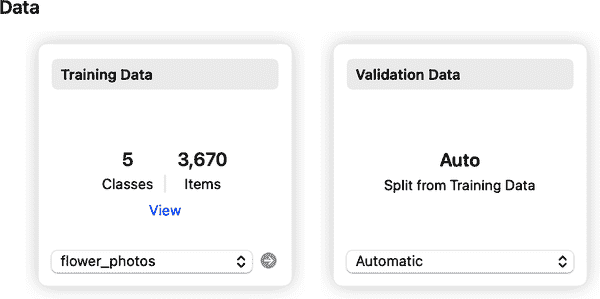

# 第十三章：为简单的 iOS 应用程序创建 ML 和 Core ML

到目前为止，您已经看到了将机器学习带到*多个*设备的技术，以便您可以使用单个 API 来访问 Android、iOS、嵌入式系统、微控制器等。这得益于 TensorFlow 生态系统，特别是 TensorFlow Lite，它支持 ML Kit，您可以将其用作更高级别的 API。虽然我们没有深入讨论嵌入式系统和微控制器，但概念是相同的，除了硬件限制随着尺寸的缩小而变得更小。要了解更多关于这个领域的信息，请参阅 Pete Warden 和 Daniel Situnayake（O’Reilly）的优秀著作 [*TinyML*](https://learning.oreilly.com/library/view/tinyml/9781492052036/)。

但是如果我不至少涵盖 Apple 的 iOS 特定的 Create ML 工具和 Core ML 库，我会觉得遗憾。这些工具旨在让您在为 iOS、iPadOS 或 MacOS 创建应用程序时使用 ML 模型。特别是 Create ML 是一个非常好的可视化工具，让您可以在没有任何先前 ML 编程经验的情况下创建模型。

我们将看几种场景，首先是创建一个类似之前使用 TensorFlow 和 TensorFlow Lite 做的花卉识别模型。

# 使用 Create ML 构建的 Core ML 图像分类器

我们将从创建我们的模型开始。我们可以使用 Create ML 工具无需编写代码来完成这个过程。您可以通过右键单击 Dock 中的 Xcode，然后在“打开开发者工具”菜单中找到 Create ML。请参阅 图 13-1。


###### 图 13-1\. 启动 Create ML

当工具启动时，首先会询问您 *想要* 存储完成的模型的位置。如果您不习惯这种方式，可能会感到有些突兀，因为通常在选择位置之前会通过模板选择类型。这让我几次以为这是来自另一个打开应用的文件对话框！从对话框中，在左下角选择新文档（图 13-2）。


###### 图 13-2\. 使用 Create ML 开始新模型

在选择位置并单击新文档后，您将获得一个模板列表，用于创建 Create ML 的模型类型。请参见 图 13-3。


###### 图 13-3\. 选择 Create ML 模板

在这种情况下，我们将进行图像分类模型，因此选择图像分类并单击“下一步”。您将被要求为项目命名，并填写其他细节，如作者、许可证、描述等。填写完毕后，单击“下一步”。

然后再次询问您想要 *哪里* 存储模型。您可以创建一个新文件夹并放入其中，或者只需单击“创建”。模型设计师将会打开。您可以在 图 13-4 中看到它。

若要在 Create ML 的模型设计师中训练模型，您需要一组图像。您需要将它们组织成每种要分类的特定类型项目的子文件夹（即标签），因此，例如，如果您考虑我们在本书中一直使用的花卉数据集，您的目录结构可能看起来像 图 13-5。如果您从 Google API 目录下载并解压这些花卉，它们已经处于这种结构中。您可以在 [*https://oreil.ly/RuN2o*](https://oreil.ly/RuN2o) 找到这些数据。


###### 图 13-4\. 模型设计师


###### 图 13-5\. 图像存储在带标签的子目录中

因此，在这种情况下，名为*daisy*的文件夹包含雏菊的图片，*dandelion*包含蒲公英的图片，依此类推。要训练数据集，请将此文件夹拖放到模型设计师的训练数据部分上。完成后，它应该看起来像 图 13-6。



###### 图 13-6\. 将数据添加到设计师

请注意，图 13-5 中显示了五个文件夹，这对应于 图 13-6 中显示的五个类别。在这些类别之间，共有 3,670 张图片。还请注意，该工具将通过从训练数据中分割来自动创建验证数据集。这为您节省了大量工作！在这种情况下，一部分图像将被保留在训练集之外，以便在每个 epoch 中使用先前未见过的图像对模型进行测试。这样，您可以更好地估计其准确性。

请注意，您可以在屏幕底部选择增强选项。这使您可以在训练过程中通过修改来人为扩展数据集的范围。例如，花卉的图片通常是*底部为茎，顶部为花瓣*的方式拍摄的。如果您的训练数据是这样定向的，那么只有采用相同方向的花朵图片才能准确分类。如果您给它一张侧躺的花朵图片，它可能无法准确分类。因此，与采取大量拍摄其他方向花朵图片的昂贵行动相比，您可以使用增强技术。例如，如果您勾选旋转框，那么在训练过程中，某些图像将被随机旋转，以模拟您拍摄新花朵图片的效果。如果您的模型过度拟合于训练数据——即它在识别看起来像训练数据的数据方面非常擅长，但对于其他图像效果不佳——则值得研究不同的增强设置。但目前您不需要它们。

准备好后，点击屏幕左上角的“训练”按钮。Create ML 将处理图片中的特征，并在几分钟后向你呈现一个训练好的模型。请注意，这里使用的是*迁移学习*，而不是从头开始训练，类似于 Model Maker，因此训练既准确*又*快速。

当模型在准确度指标上稳定一段时间后，通常被认为已经*收敛*，即继续训练不太可能使其变得更好，因此会提前停止。Create ML 用于训练模型的默认时代数是 25，但花卉模型可能会在大约 10 次时达到收敛状态，此时你会看到其准确度指标看起来有点像图 13-7。


###### 图 13-7\. 模型收敛

你可以点击评估选项卡，查看模型在每个不同类别上的表现。在左侧，你可以选择训练集、验证集或测试集。由于我在这个实例中没有创建测试集，所以我只有前两个，你可以在图 13-8 中看到训练结果。

在这种情况下，你可以看到有 594 张雏菊图片用于训练，39 张用于验证。其他花卉也有类似的分割。有两列，精确度和召回率，其中精确度是分类器正确分类图像的百分比，即在 594 个雏菊中，分类器 95%的时间能正确识别为雏菊。在这种情况下，召回率的值应该非常接近准确率值，通常只有当图片中除了特定花卉之外还有*其他*元素时才需要注意。由于这个数据集很简单，即一个雏菊图片*只*包含一个雏菊，或者玫瑰图片*只*包含一朵玫瑰，所以可以放心忽略它。你可以在[*维基百科*](https://oreil.ly/4dscv)上了解更多关于精确度和召回率的信息。


###### 图 13-8\. 探索训练准确度

你可以转到预览选项卡，并将图片拖放到其中以测试模型。例如，在图 13-9 中，我放入了不属于训练集或验证集的图片，并检查了分类结果。如你所见，它以 99%的置信度正确识别了这些郁金香。


###### 图 13-9\. 使用预览测试我的模型

最后，在输出选项卡中，你可以导出模型。你会看到左上角有一个名为“获取”的按钮。点击它，你将有选项保存 MLModel 文件。将其保存为类似*flowers.mlmodel*这样简单的名称，你将在下一步中在 iOS 应用中使用它。

## 制作一个使用 Create ML 模型的 Core ML 应用

现在让我们探讨这在应用程序中的表现。您可以在本书的存储库中获取完整的应用程序，因此我不会详细介绍如何设置用户界面。它将有六张存储为资产命名为“1”到“6”的图像，并有按钮允许用户在这些图像间切换，以及一个分类按钮来执行推理。您可以在 第 13-10 图 中看到此故事板。


###### 第 13-10 图。花卉分类器的故事板

## 添加 MLModel 文件

要添加您使用 Create ML 创建的 MLModel 文件，只需将其拖放到 Xcode 项目窗口中即可。Xcode 将导入该模型 *并* 为其创建一个 Swift 封装类。如果您在 Xcode 中选择该模型，您应该可以看到其包括标签列表、版本、作者等的许多详细信息。参见 第 13-11 图。


###### 第 13-11 图。浏览模型

您甚至可以像在 Create ML 中一样在预览选项卡中测试模型！在 Utilities 选项卡中，您还可以对模型进行加密并准备进行云部署。这超出了本书的范围；您可以在 [Apple 开发者网站](https://oreil.ly/NZdPM) 上找到详细信息。

最后，在屏幕顶部中心的 Model Class 部分，您可以看到自动生成的 Swift 模型类，本例中称为“flower”。您可以点击它查看自动生成的代码。需要注意的重要事项是名称——在本例中是“flower”，因为您稍后会用到它。

## 运行推理

当用户按下按钮时，我们希望加载当前图像，并将其传递给 Core ML 来调用我们的模型并进行推理。在深入研究这个过程的代码之前，最好先回顾一下使用的编码模式，因为它有些复杂。

### Core ML 推理模式

您可以在使用 Core ML 的应用程序中使用此模型。这个 API 已经被设计成在 iOS 应用程序中使用 ML 模型变得很容易，但是在理解使用 Core ML 构建 ML 的整体模式之前，它可能看起来有些复杂。

Core ML 的理念是尽可能确保异步性能，并且模型推理可能是一个瓶颈。由于 Core ML 设计为移动 API，它使用模式确保在进行模型推理时用户体验不会中断或中断。因此，在 Core ML 应用程序中使用像这样的图像模型，您会看到许多异步步骤。您可以在 第 13-12 图 中看到这一点。


###### 第 13-12 图。使用 Core ML 异步推理图像并更新 UI

模式是在调度队列内创建一个处理程序，以确保异步性。这由 Figure 13-12 中较大的向下箭头表示。这个处理程序将是一个`VNImageRequestHandler`，因为我们正在进行图像分类（VN 代表“VisioN”）。这个处理程序将执行分类请求。

分类请求（类型为`VNCoreMLRequest`）将初始化模型，并指定一个请求到模型，带有一个处理结果的回调函数。这个回调将在成功的`VNCoreMLRequest`时发生。

回调通常是异步的，因为它更新 UI，并读取分类结果（作为`VNClassificationObservation`），并将它们写入 UI。这由 Figure 13-12 中较小的调度队列箭头表示。

### 编写代码

现在让我们来探索这段代码。当用户执行按按钮的操作时，你将调用一个名为`interpretImage`的函数来启动推理工作流程，代码如下所示：

```
func interpretImage(){
    let theImage: UIImage = UIImage(named: String(currentImage))!
    getClassification(for: theImage)
}
```

这仅仅是从当前选定的图像创建一个 UIImage，并将其传递给名为`getClassification`的函数。这个函数将实现来自 Figure 13-10 的模式，所以让我们来探索一下。我已经缩短了输出字符串，以使这里打印的代码更易读：

```
func getClassification(for image: UIImage) {

    let orientation = CGImagePropertyOrientation(
        rawValue: UInt32(image.imageOrientation.rawValue))!
    guard let ciImage = CIImage(image: image)
      else { fatalError("...") }

    DispatchQueue.global(qos: .userInitiated).async {
        let handler = VNImageRequestHandler(
            ciImage: ciImage, orientation: orientation)
        do {
            try handler.perform([self.classificationRequest])
        } catch {
            print("...")
        }
    }
}
```

代码将首先获取我们的 UIImage，并将其转换为 CIImage。Core ML 是使用 Core Image 构建的，它要求图像以那种格式表示。因此，我们需要从那里开始。

然后，我们将调用我们的第一个 DispatchQueue，这是 Figure 13-10 中较大的外部之一。在其中，我们将创建我们的处理程序，并要求它在`classificationRequest`上执行其 perform 方法。我们还没有创建它，所以现在让我们来探索一下：

```
lazy var classificationRequest: VNCoreMLRequest = {
    do {
        let model = try VNCoreMLModel.init(for: flower().model)
        let request = VNCoreMLRequest(model: model,
          completionHandler: { [weak self] request, error in
            self?.processResults(for: request, error: error)
        })
        request.imageCropAndScaleOption = .centerCrop
        return request
    } catch {
        fatalError("...")
    }
}()
```

`classificationRequest`是一个`VNCoreMLRequest`，适用于它内部初始化的模型。请注意，`init`方法接受一个`flower()`类型，并从中读取`model`属性。这是当你导入 MLModel 时自动生成的类。参考 Figure 13-11，你会看到讨论过的自动生成的代码。你注意到了你的类的名称——在我的情况下是 flower——这就是你将在这里使用的。

一旦你有了模型，你可以创建`VNCoreMLRequest`，指定模型和完成处理函数，在这种情况下是`processResults`。现在你已经构建了`VNCoreMLRequest`，这是`getClassification`函数所需的。如果你回头看那个函数，你会看到它调用了`perform`方法；这段代码实现了这一点。如果运行成功，将调用`processResults`回调函数，那么让我们接着看：

```
func processResults(for request: VNRequest, error: Error?) {
  DispatchQueue.main.async {
    guard let results = request.results else {
            self.txtOutput.text = "..."
            return
        }

    let classifications = results as! [VNClassificationObservation]

    if classifications.isEmpty {
        self.txtOutput.text = "Nothing recognized."
    } else {
        let topClassifications =
            classifications.prefix(self.NUM_CLASSES)
        let descriptions = topClassifications.map
        { classification in

            return String(format: "  (%.2f) %@",
                          classification.confidence,
                          classification.identifier) }
        self.txtOutput.text = "Classification:\n" +
                              descriptions.joined(separator: "\n")
        }
    }
}
```

此函数以另一个 `DispatchQueue` 开始，因为它将更新用户界面。它接收来自初始请求的结果，如果它们有效，它可以将它们转换为一组 `VNClassificationObservation` 对象。然后只需遍历这些对象，获取每个分类的置信度和标识符，并输出它们。这段代码还将它们排序为前几个分类，为每个类别提供概率输出。`NUM_CLASSES` 是一个表示类别数量的常数，在花卉模型中我将其设置为 5。

就是这样。使用 Create ML 简化了制作模型的过程，而 Xcode 集成，包括类文件生成，使推理过程相对简单。复杂性必须通过尽可能使过程异步化来保持，以避免在运行模型推理时破坏用户体验！

您可以看到应用程序在一张玫瑰图片的推理结果，参见图 13-13。


###### 图 13-13\. 花卉的 Core ML 推理

接下来我们将探讨一个自然语言处理（NLP）的例子，首先是使用 Create ML 创建模型。

# 使用 Create ML 构建文本分类器

Create ML 允许您导入 CSV 文件进行分类，但您的文本必须在名为 “text” 的列中，因此如果您一直在跟随本书并使用情感情绪数据集，您需要稍作修改，或者使用我在本章节中提供的数据集。唯一的修改是将包含文本的第一列命名为 “text”。

在这一点上，您可以按照之前概述的步骤创建一个新的 Create ML 文档，但在这种情况下，请选择文本分类模板。与之前一样，您可以将数据拖放到数据字段中，您会看到有两类（在这种情况下用于正面和负面情感），共有超过 35,000 个条目。您应该像之前一样将验证数据与训练数据分开。

在参数部分，有多种算法选项。我发现选择迁移学习，并选择动态嵌入提取器可以获得非常好的结果。这将会很慢，因为所有嵌入都将从头开始学习，但可以得到非常好的结果。使用这些设置进行训练会很慢——对我来说，在 M1 Mac Mini 上，大约需要一个小时，但完成后，训练精度达到了 89.2%，经过 75 次迭代。

预览选项卡允许您输入一个句子，它将被自动分类！请参见图 13-14，我输入了一个明显是负面句子的例子，我们可以看到它以 98% 的置信度命中标签 0！


###### 图 13-14\. 测试负面情感

但当然，这并不是真的。我在写这一章节和玩弄这项技术时过得非常愉快，所以让我看看如果我改变文本来适应会发生什么！参见 Figure 13-15。


###### 图 13-15\. 具有正面情感的句子

正如你在那个案例中看到的那样，标签 1 以 94% 的置信度得分。真正酷的是，分类会随着你的输入即时更新！

总之，玩够了。让我们回到工作中来。要构建一个使用这个的应用程序，你首先需要导出你的模型。你可以在输出选项卡中这样做。使用“获取”按钮保存它，并给它一个容易记住的名称。在我的案例中，我称之为 *emotion.mlmodel*。

# 在应用程序中使用模型

像这样的语言模型在应用程序中使用起来非常简单。创建一个新的应用程序，并添加一个带有名为 `txtInput` 的输出口的 UITextView，一个带有名为 `txtOutput` 的输出口的 UILabel，以及一个带有名为 `classifyText` 的操作的按钮。你的故事板应该看起来像 Figure 13-16。


###### 图 13-16\. 一个简单语言应用程序的故事板

在 `classifyText` 操作中，添加一个调用 `doInference()` 的语句。这个函数目前还不存在；你马上会添加它。你的类顶部的代码应该是这样的：

```
@IBOutlet weak var txtInput: UITextView!
@IBOutlet weak var txtOutput: UILabel!
@IBAction func classifyText(_ sender: Any) {
    doInference()
}
```

要使用带有自然语言处理的 Core ML，你还应该确保导入这两个库：

```
import NaturalLanguage
import CoreML
```

现在你可以进行推断了。将你之前创建的模型拖放到 Xcode 中，它将为你生成一个与保存模型同名的类。在我的案例中，我称之为“emotion”，所以我会有一个同名的类。

你将从使用 `emotion` 创建一个 `mlModel` 类型开始，就像这样：

```
let mlModel = try emotion(
                  Configuration: MLModelConfiguration()).model
```

一旦你拥有了这个，你可以依次使用它来创建一个 `NLModel`（NL 代表自然语言）：

```
let sentimentPredictor = try NLModel(mlModel: mlModel)
```

你可以从 `txtInput` 中读取输入字符串，并将其传递给 `sentimentPredictor` 以获取其标签：

```
let inputText = txtInput.text
let label = sentimentPredictor.predictedLabel(for: inputText!)
```

此标签将是一个表示类别的字符串。正如你在这个模型的数据中看到的那样，它们是 `"0"` 和 `"1"`。因此，你可以简单地输出预测结果，如下所示：

```
if (label=="0"){
    txtOutput.text = "Sentiment: Negative"
} else {
    txtOutput.text = "Sentiment: Positive"
}
```

就是这样！正如你所看到的，自然语言库使这变得非常简单！你不必处理标记化或嵌入；只需给它一个字符串，你就完成了！

你可以在 Figure 13-17 中看到应用程序的运行情况。


###### 图 13-17\. 使用情感分类器

这只是一个非常简单的应用程序，但你可以看到你如何使用它来为你的应用程序创建新功能；例如，检测应用程序是否被用于发送垃圾邮件或有毒消息，并阻止用户发送它们。这可以与后端安全性结合使用，以确保最佳用户体验。

# 总结

本章向您介绍了 Create ML 中的两个模板——图像分类和文本情感分析，并指导您在没有机器学习经验的情况下训练模型，然后在简单的应用程序中使用它们。您看到了 Create ML 如何为您提供一个工具，可以非常快速地训练模型，通常使用迁移学习，并且其输出可以轻松集成到 Xcode 中，利用代码生成来封装机器学习模型的复杂性，让您专注于用户界面。在进行图像分类时，您经历了一个复杂的交互过程，确保在进行推断时不会破坏用户体验。尽管如此，对您来说编写一些管理推断的东西仍然相当容易；特别是，您无需担心图像格式以及将图像剥离成张量以传递给推断引擎。因此，如果您仅为 iOS 编写，并且不考虑其他平台，Create ML 和 Core ML 是一个很好的选择，绝对值得一试。
