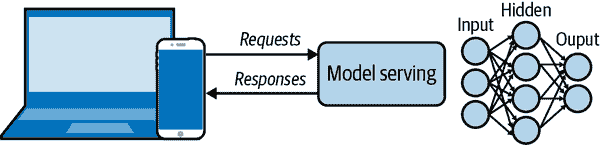
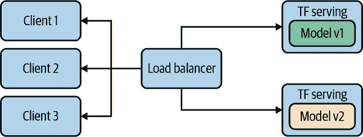
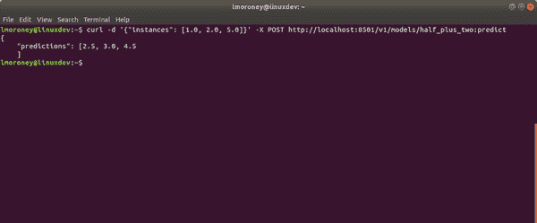
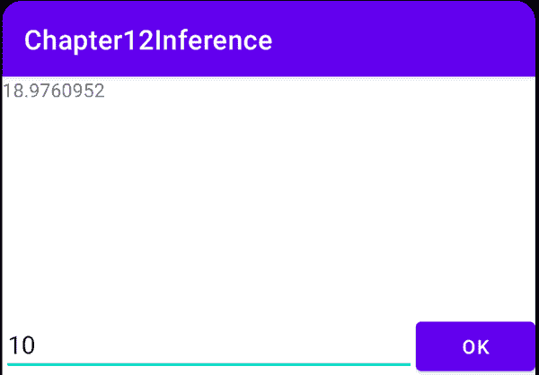
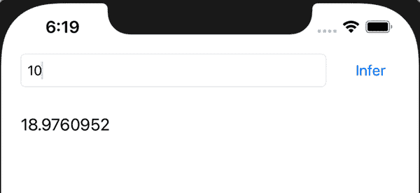

# 第十四章：从移动应用访问基于云的模型

在整本书中，您一直在创建模型并将其转换为 TensorFlow Lite 格式，以便在移动应用中使用。出于本书讨论的原因，这对于希望在移动设备上使用的模型非常有效，例如延迟和隐私。然而，也许有时您不想将模型部署到移动设备上——也许它对移动设备来说太大或太复杂，也许您希望频繁更新它，或者可能您不希望冒风险使其被逆向工程并且您的知识产权被他人使用。

在这些情况下，您将需要将模型部署到服务器上，在那里执行推断，然后由服务器管理客户端的请求，调用模型进行推断，并以结果响应。这一高层视图如图 14-1 所示。



###### 图 14-1。模型服务器架构的高层视图

此架构的另一个好处是管理模型漂移。当您将模型部署到设备时，如果用户无法或不愿更新他们的应用程序以获取最新模型，可能会出现多个模型的情况。考虑一下希望模型漂移的情况；也许拥有更高端硬件的人可以使用更大更精确的模型版本，而其他人则可以获得较小且稍微不太精确的版本。管理这一切可能很困难！但如果模型托管在服务器上，您就不必担心这些问题，因为您可以控制模型运行的硬件平台。服务器端模型推断的另一个优势是，您可以轻松地针对不同受众测试不同的模型版本。参见图 14-2。



###### 图 14-2。使用托管推断管理不同模型

在这里，您可以看到我有两个不同版本的模型（称为 Model v1 和 Model v2），这些模型通过负载均衡器部署到不同的客户端。在图中，我展示了这些模型是由 TensorFlow Serving 管理的，接下来我们将探讨如何安装和使用它，包括对其进行简单模型的训练和部署。

# 安装 TensorFlow Serving

TensorFlow Serving 可以使用两种不同的服务器架构进行安装。第一种是`tensorflow-model-server`，这是一个完全优化的服务器，使用特定于平台的编译器选项针对各种架构进行编译。总体而言，这是首选的选项，除非您的服务器机器不支持这些架构。另一种选择是`tensorflow-model-server-universal`，它使用基本的优化进行编译，应该可以在所有机器上工作，并且在`tensorflow-model-server`不可用时提供一个很好的备用选项。有多种方法可以安装 TensorFlow Serving，包括使用 Docker 和直接使用`apt`进行软件包安装。接下来我们将看看这两种选项。

## 使用 Docker 安装

[Docker](https://docker.com) 是一个工具，允许您将操作系统及其软件依赖项封装到一个简单易用的镜像中。使用 Docker 可能是快速启动并运行的最简单方式。要开始使用，使用 `docker pull` 命令获取 TensorFlow Serving 软件包：

```
docker pull tensorflow/serving
```

完成这些步骤后，从 GitHub 上克隆 TensorFlow Serving 代码：

```
git clone https://github.com/tensorflow/serving
```

这包括一些示例模型，包括一个称为 Half Plus Two 的模型，它接受一个值，并返回该值的一半加两。为此，首先设置一个名为 `TESTDATA` 的变量，其中包含示例模型的路径：

```
TESTDATA="$(pwd)/serving/tensorflow_serving/servables/tensorflow/testdata"
```

您现在可以从 Docker 镜像中运行 TensorFlow Serving：

```
docker run -t --rm -p 8501:8501 \
    -v "$TESTDATA/saved_model_half_plus_two_cpu:/models/half_plus_two" \
    -e MODEL_NAME=half_plus_two \
    tensorflow/serving &
```

这将在端口 8501 上实例化一个服务器——稍后在本章中您将详细了解如何做到这一点——并在该服务器上执行模型。然后，您可以访问 *http://localhost:8501/v1/models/half_plus_two:predict* 来访问该模型。

要传递您希望运行推断的数据，您可以将包含这些值的张量 POST 到此 URL。以下是使用 curl 的示例（如果在开发机器上运行，请在另一个终端中运行此命令）：

```
curl -d '{"instances": [1.0, 2.0, 5.0]}' \
    -X POST http://localhost:8501/v1/models/half_plus_two:predict
```

您可以在 Figure 14-3 中查看结果。



###### 图 14-3\. 运行 TensorFlow Serving 的结果

虽然 Docker 镜像确实很方便，但您可能也希望完全控制在本地安装它。接下来您将了解如何操作。

## 在 Linux 上直接安装

无论您使用 `tensorflow-model-server` 还是 `tensorflow-model-server-universal`，软件包名称都是相同的。因此，在开始之前最好删除 `tensorflow-model-server`，以确保您获取正确的版本。如果您想在自己的硬件上尝试此操作，我在 GitHub 仓库中提供了 [一个 Colab notebook](https://oreil.ly/CYiWc) 与相关代码：

```
apt-get remove tensorflow-model-server
```

然后将 [TensorFlow package source](https://oreil.ly/NDwab) 添加到您的系统：

```
echo "deb http://storage.googleapis.com/tensorflow-serving-apt stable tensorflow-model-server tensorflow-model-server-universal" |
tee /etc/apt/sources.list.d/tensorflow-serving.list && \
curl https://storage.googleapis.com/tensorflow-serving-apt/tensorflow-serving.release.pub.gpg | apt-key add -
```

如果您需要在本地系统上使用 `sudo`，可以像这样操作：

```
sudo echo "deb http://storage.googleapis.com/tensorflow-serving-apt stable tensorflow-model-server tensorflow-model-server-universal" |
sudo tee /etc/apt/sources.list.d/tensorflow-serving.list && \
curl https://storage.googleapis.com/tensorflow-serving-apt/tensorflow-serving.release.pub.gpg | sudo apt-key add -
```

接下来您需要更新 `apt-get`：

```
apt-get update
```

一旦完成这些步骤，您就可以使用 `apt` 安装模型服务器：

```
apt-get install tensorflow-model-server
```

您可以通过以下方式确保您使用的是最新版本：

```
apt-get upgrade tensorflow-model-server
```

现在该包应该已经准备好使用了。

# 构建和服务模型

在本节中，我们将完整演示创建模型、准备模型进行服务、使用 TensorFlow Serving 部署模型，然后运行推理的整个过程。

你将使用我们在整本书中探索的简单的“Hello World”模型：

```
import numpy as np
import tensorflow as tf
xs = np.array([-1.0,  0.0, 1.0, 2.0, 3.0, 4.0], dtype=float)
ys = np.array([-3.0, -1.0, 1.0, 3.0, 5.0, 7.0], dtype=float)
model = tf.keras.Sequential([tf.keras.layers.Dense(units=1, input_shape=[1])])
model.compile(optimizer='sgd', loss='mean_squared_error')
history = model.fit(xs, ys, epochs=500, verbose=0)
print("Finished training the model")
print(model.predict([10.0]))
```

这应该会非常快速地训练，并在被询问当 x 是 10.0 时预测 y 时给出约为 18.98 的结果。接下来，需要保存模型。你需要一个临时文件夹来保存它：

```
export_path = "/tmp/serving_model/1/"
model.save(export_path, save_format="tf")
print('\nexport_path = {}'.format(export_path))
```

你可以将其导出到任何目录，但我喜欢使用临时目录。注意，这里我将其保存在 */tmp/serving_model/1/* 中，但稍后在服务时我们只会使用 */tmp/serving_model/* ——这是因为 TensorFlow Serving 将根据数字查找模型版本，默认情况下会查找版本 1。

如果目录中有任何你正在保存模型的内容，最好在继续之前将其删除（避免此问题是我喜欢使用临时目录的一个原因！）。

TensorFlow Serving 工具包括一个名为 `saved_model_cli` 的实用程序，可用于检查模型。可以使用 show 命令调用它，并给出模型的目录以获取完整的模型元数据：

```
$> saved_model_cli show --dir {export_path} --all
```

此命令的输出将非常长，但将包含以下详细信息：

```
signature_def['serving_default']:
  The given SavedModel SignatureDef contains the following input(s):
    inputs['dense_input'] tensor_info:
        dtype: DT_FLOAT
        shape: (-1, 1)
        name: serving_default_dense_input:0
  The given SavedModel SignatureDef contains the following output(s):
    outputs['dense'] tensor_info:
        dtype: DT_FLOAT
        shape: (-1, 1)
        name: StatefulPartitionedCall:0
```

注意 `signature_def` 的内容，在这种情况下是 `serving_default`。稍后会用到这些内容。

还要注意输入和输出具有定义的形状和类型。在本例中，每个都是浮点数，形状为（–1，1）。你可以有效地忽略 –1，并记住模型的输入是浮点数，输出也是浮点数。

要使用命令行运行 TensorFlow 模型服务器，需要一些参数。首先需要在 `tensorflow_model_server` 命令中指定几个参数。`rest_api_port` 是你希望服务器运行的端口号。这里设置为 `8501`。然后，使用 `model_name` 选项为模型命名——这里我称其为 `helloworld`。最后，使用 `model_base_path` 将模型保存路径传递给服务器，该路径存储在 `MODEL_DIR` 操作系统环境变量中。以下是代码：

```
$> tensorflow_model_server --rest_api_port=8501 --model_name="helloworld" --
model_base_path="/tmp/serving_model/" > server.log 2>&1
```

脚本的结尾包含了将结果输出到 *server.log* 的代码。打开这个文件并查看它——你应该会看到服务器成功启动的消息，并显示它在 *localhost:8501* 导出 HTTP/REST API：

```
2021-02-19 08:56:22.271662:
  I tensorflow_serving/core/loader_harness.cc:87] Successfully loaded
  servable version {name: helloworld version: 1}
2021-02-19 08:56:22.303904:
  I tensorflow_serving/model_servers/server.cc:371] Running gRPC ModelServer
  at 0.0.0.0:8500 ...
2021-02-19 08:56:22.315093:
  I tensorflow_serving/model_servers/server.cc:391] Exporting HTTP/REST API
  at:localhost:8501 ...
[evhttp_server.cc : 238] NET_LOG: Entering the event loop ...
```

如果失败，应该会看到有关失败的通知。如果发生这种情况，可能需要重新启动系统。

如果你想测试服务器，可以在 Python 中执行以下操作：

```
import json
xs = np.array([[9.0], [10.0]])
data = json.dumps({"signature_name": "serving_default",
                   "instances": xs.tolist()})
print(data)
```

要将数据发送到服务器，您需要将其转换为 JSON 格式。因此，使用 Python 只需创建一个包含要发送的值的 NumPy 数组—在本例中是两个值的列表，即 9.0 和 10.0。每个值本身就是一个数组，因为正如您之前看到的，输入形状是（-1,1）。单个值应发送到模型，因此如果要发送多个值，应该是一个列表的列表，其中内部列表只包含单个值。

使用 Python 中的 `json.dumps` 来创建负载，其中包含两个名称/值对。第一个是要调用模型的签名名称，在本例中为 `serving_default`（正如您之前检查模型时所记得的）。第二个是 `instances`，这是您要传递给模型的值列表。

请注意，使用服务传递值到模型时，您的输入数据应该是一个值列表，即使只有一个单独的值也是如此。因此，例如，如果您想要使用此模型获取值 9.0 的推断，您仍然必须将其放入列表中，如 [9.0]。如果您想要获取两个值的推断，您可能期望看起来像 [9.0, 10.0]，但实际上是错误的！期望两个单独输入的两个推断应该是两个单独的列表，所以 [9.0], [10.0]。然而，您将它们作为单个 *批次* 传递给模型进行推断，因此批次本身应该是包含您传递给模型的列表的列表—如 [[9.0], [10.0]]。如果您仅传递单个值进行推断，请也牢记这一点。它将是在列表中，并且该列表将在一个列表中，像这样：[ [10.0] ]。

因此，为了让这个模型运行推断两次，并计算 x 值为 9.0 和 10.0 时的 y 值，所需的负载应如下所示：

```
{"signature_name": "serving_default", "instances": [[9.0], [10.0]]}
```

您可以使用 requests 库调用服务器执行 HTTP POST。请注意 URL 结构。模型名为 `helloworld`，您希望运行其预测。POST 命令需要数据，即您刚刚创建的负载，并且需要一个 `headers` 规范，告诉服务器内容类型是 JSON：

```
import requests
headers = {"content-type": "application/json"}
json_response = requests.post(
    'http://localhost:8501/v1/models/helloworld:predict',
    data=data, headers=headers)

print(json_response.text)
```

响应将是一个包含预测的 JSON 负载：

```
{
    "predictions": [[16.9834747], [18.9806728]]
}
```

请注意，Python 中的 `requests` 库还提供了一个 `json` 属性，您可以使用它来自动解码响应为 JSON `dict`。

# 从 Android 访问服务器模型

现在您有一个运行中并通过 REST 接口公开模型的服务器后，编写用于在 Android 上使用它的代码非常简单。我们将在这里探讨这个问题，在创建了一个只有单一视图的简单应用程序之后（请回顾 第四章 中几个示例），其中包含一个 EditText，您可以用来输入一个数字，一个标签，将呈现结果，并且一个按钮，用户可以按下以触发推断：

```
<ScrollView
    android:id="@+id/scroll_view"
    android:layout_width="match_parent"
    android:layout_height="0dp"
    app:layout_constraintTop_toTopOf="parent"
    app:layout_constraintBottom_toTopOf="@+id/input_text">
    <TextView
        android:id="@+id/result_text_view"
        android:layout_width="match_parent"
        android:layout_height="wrap_content" />
</ScrollView>

<EditText
    android:id="@+id/input_text"
    android:layout_width="0dp"
    android:layout_height="wrap_content"
    android:hint="Enter Text Here"
    android:inputType="number"
    app:layout_constraintBaseline_toBaselineOf="@+id/ok_button"
    app:layout_constraintEnd_toStartOf="@+id/ok_button"
    app:layout_constraintStart_toStartOf="parent"
    app:layout_constraintBottom_toBottomOf="parent" />
<Button
    android:id="@+id/ok_button"
    android:layout_width="wrap_content"
    android:layout_height="wrap_content"
    android:text="OK"
    app:layout_constraintBottom_toBottomOf="parent"
    app:layout_constraintEnd_toEndOf="parent"
    app:layout_constraintStart_toEndOf="@+id/input_text"
    />
```

该代码将使用一个名为 Volley 的 HTTP 库，该库可以处理来自服务器的请求和响应的异步处理。要使用此功能，请将以下代码添加到您的应用的 build.gradle 文件中：

```
implementation 'com.android.volley:volley:1.1.1'
```

然后，此活动的代码看起来可能会像这样——设置控件并创建一个按钮的`onClickListener`，该按钮将调用托管在 TensorFlow Serving 上的模型：

```
    lateinit var outputText: TextView
    lateinit var inputText: EditText
    lateinit var btnOK: Button
    override fun onCreate(savedInstanceState: Bundle?) {
        super.onCreate(savedInstanceState)
        setContentView(R.layout.activity_main)
        outputText = findViewById(R.id.result_text_view)
        inputText = findViewById(R.id.input_text)
        btnOK = findViewById(R.id.ok_button)
        btnOK.setOnClickListener {
            val inputValue:String = inputText.text.toString()
            val nInput = inputValue.toInt()
            doPost(nInput)

        }
    }
```

请记住，模型托管自*http://<server>:8501/v1/models/helloworld:predict* ——如果你正在使用开发人员框和在 Android 模拟器中运行 Android 代码，则可以使用服务器桥接到 10.0.2.2 而不是 localhost。

因此，当按下按钮时，将读取输入的值，转换为整数，然后传递给名为`doPost`的函数。让我们探讨一下该函数应该做什么。

首先，你将使用`Volley`来建立一个异步请求/响应队列：

```
val requestQueue: RequestQueue = Volley.newRequestQueue(this)
```

接下来，你需要设置托管服务的 URL。我使用的是 10.0.2.2 的服务器桥接，而不是 localhost，或者服务器名称，因为我正在开发人员框上运行服务器，并在模拟器上运行这个 Android 应用：

```
val URL = "http://10.0.2.2:8501/v1/models/helloworld:predict"
```

请记住，如果你想通过 JSON 将值传递给服务器，那么每组输入值都需要放在一个列表中，然后所有的列表都需要存储在另一个列表中，因此传递一个值例如 10 用于推理将会是这样的：`[ [10.0] ]`。

然后 JSON 有效负载将如下所示：

```
{"signature_name": "serving_default", "instances": [[10.0]]} 
```

我将包含值的列表称为*内部*列表，而包含该列表的列表称为*外部*列表。这两者都将被视为`JSONArray`类型：

```
val jsonBody = JSONObject()
jsonBody.put("signature_name", "serving_default")
val innerarray = JSONArray()
val outerarray = JSONArray()
innerarray.put(inputValue)
outerarray.put(innerarray)
jsonBody.put("instances", outerarray)
val requestBody = jsonBody.toString()
```

然后，为了让`requestQueue`管理通信，你将创建一个`StringRequest`对象的实例。在此之内，你将重写`getBody()`函数，将刚刚创建的`requestbody`字符串添加到请求中。你还将设置一个`Response.listener`来捕获异步响应。在该响应中，你可以获取预测数组，你的答案将是该列表中的第一个值：

```
val stringRequest: StringRequest =
  object : StringRequest(Method.POST, URL,
  Response.Listener { response ->
    val str = response.toString()
    val predictions = JSONObject(str).getJSONArray("predictions")
                                   .getJSONArray(0)
    val prediction = predictions.getDouble(0)
    outputText.text = prediction.toString()
  },
  Response.ErrorListener { error ->
    Log.d("API", "error => $error")
  })
  {
    override fun getBody(): ByteArray {
      return requestBody.toByteArray((Charset.defaultCharset()))
  }
}

requestQueue.add(stringRequest)
```

接着，Volley 将会完成其余的工作——将请求发送到服务器，并捕获异步响应；在这种情况下，`Response.Listener`将解析结果，并将值输出到 UI 中。你可以在图 14-4 中看到这一点。



###### 图 14-4\. 在 Android 应用中从 TensorFlow Serving 运行推理

请注意，在这种情况下，我们的响应非常简单，所以我们只是解码了一个字符串。对于返回的更复杂的 JSON 数据，最好使用诸如[GSON](https://oreil.ly/cm35R)之类的 JSON 解析库。

虽然这是一个非常简单的应用程序，但它提供了一个当运行远程推断时您期望任何 Android 应用程序使用的工作流程。需要记住的关键事项是 JSON 载荷的设计。确保你的数据是 JSON 数组，并且这些数组被托管在另一个数组中，因此即使是单个数字也将被上传为[[10.0]]。同样，模型的返回值将被编码为列表的列表，即使它只是一个单一的值！

请注意，此示例使用了一个未经身份验证的服务器。有各种技术可以用来在后端添加身份验证，然后在 Android 上使用这个。其中之一是[Firebase Authentication](https://oreil.ly/WTSaa)。

# 从 iOS 访问服务器模型

之前你在 TensorFlow Serving 上创建了一个模型并将其托管在那里，它可以在*http://<server>:8501/v1/models/helloworld:predict*处使用。在这个例子中，我的服务器在*192.168.86.26*上，所以我将创建一个简单的 iOS 应用程序，它可以访问服务器，传递数据，并得到一个推断。为了做到这一点，并获得一个单一值的推断，你需要向服务器发布一个看起来像这样的 JSON 载荷：

```
{"signature_name": "serving_default", "instances": [[10.0]]}
```

如果成功的话，你会收到一个包含推断结果的载荷返回：

```
{
    "predictions": [[18.9806728]]
}
```

因此，我们首先需要一个应用程序将载荷传递给服务器，并解析返回的内容。让我们探讨如何在 Swift 中完成这个操作。你可以在[书籍的存储库](https://oreil.ly/wPL4V)找到一个完整的工作应用程序。在本节中，我只是探索这个应用程序如何进行远程推断。

首先，在 Swift 中，如果你有等效的结构设置，解码 JSON 值是最容易的。因此，为了解码预测，你可以创建一个像这样的结构体：

```
struct Results: Decodable {
  let predictions: [[Double]]
}
```

现在，如果你有存储为双精度的值，你可以创建一个上传到服务器的载荷，像这样：

```
let json: [String: Any] =
    ["signature_name" : "serving_default", "instances" : [[value]]]

let jsonData = try? JSONSerialization.data(withJSONObject: json)
```

接下来，你可以将此载荷发布到 URL。你可以通过从 URL 创建一个请求，将请求设置为 POST 请求，并将 JSON 载荷添加到请求的主体中来完成这个操作。

```
// create post request
let url = URL(string: "http://192.168.86.26:8501/v1/models/helloworld:predict")!

var request = URLRequest(url: url)
request.httpMethod = "POST"

// insert json data to the request
request.httpBody = jsonData
```

请求/响应是异步的，因此不要在等待响应时锁定线程，而是使用一个任务：

```
let task = URLSession.shared.dataTask(with: request)
    { data, response, error in
```

使用前面创建的请求创建`URLSession`，这是一个向 URL 发送 JSON 主体包含输入数据的 POST 请求。这将给你带来响应载荷的数据，响应本身，以及任何错误信息。

你可以使用结果来解析响应。回想一下之前你创建了一个与 JSON 载荷格式匹配的结果结构体。因此在这里，你可以使用`JSONDecoder()`解码响应，并将预测加载到`results`中。由于这包含一个数组的数组，并且内部数组有推断的值，你可以在`results.predictions[0][0]`中访问它们。由于这是一个任务，并且我们将要更新一个 UI 项，因此必须在`DispatchQueue`内完成：

```
let results: Results =
    try! JSONDecoder().decode(Results.self, from: data)

            DispatchQueue.main.async{
                self.txtOutput.text = String(results.predictions[0][0])
            }
```

就是这样！在 Swift 中这非常简单，因为有用于解析输出的结构体，内部和外部列表可以使用 `[String : Any]` 格式设置。你可以在 图 14-5 中看到使用这种方法的应用程序样子。

与通过 Python 访问 TensorFlow Serving 模型类似，最重要的是确保输入和输出数据正确。最容易犯的错误是忘记有效载荷是列表的列表，因此在使用更复杂的数据结构时，请确保正确处理这一点！



###### 图 14-5\. 在 iOS 上访问 TensorFlow Serving 中的 2x − 1 模型

# 摘要

在本章中，您已经了解了 TensorFlow Serving 及其如何通过 HTTP 接口提供访问模型的环境。您了解了如何安装和配置 TensorFlow Serving，并将模型部署到其中。然后，您学习了如何通过构建超简单的 Android 和 iOS 应用程序来执行远程推理，这些应用程序接收用户输入，创建 JSON 负载，将其发送到 TensorFlow Serving 实例，并解析包含原始数据上模型推理的返回值。虽然场景非常基础，但它为任何需要通过 POST 请求发送 JSON 负载并解析响应的服务提供了框架。
