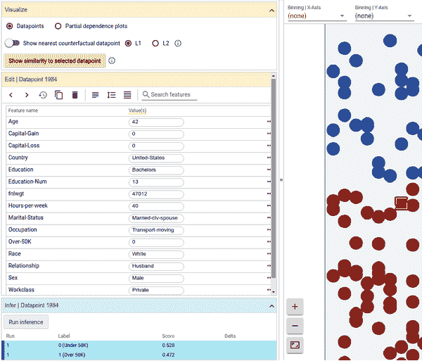
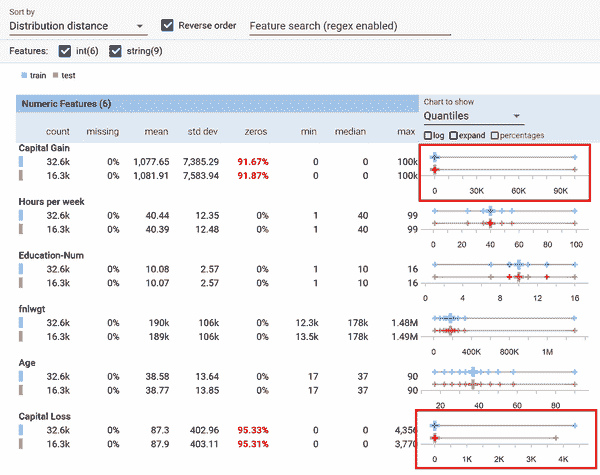
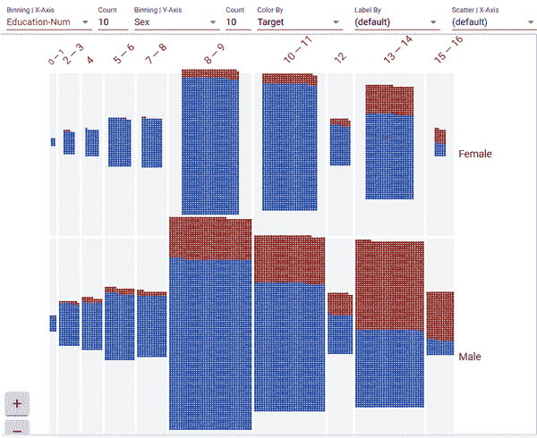
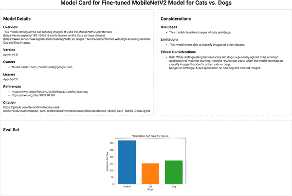
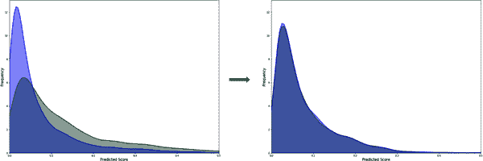
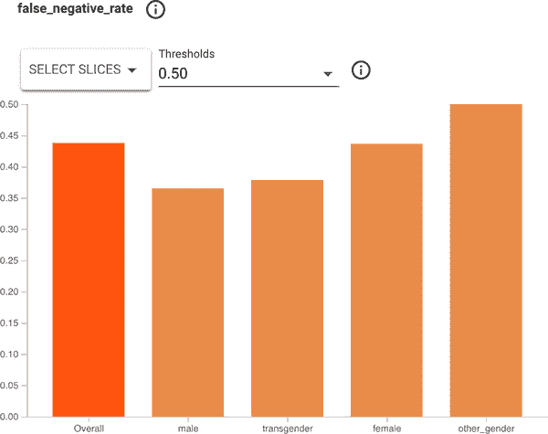
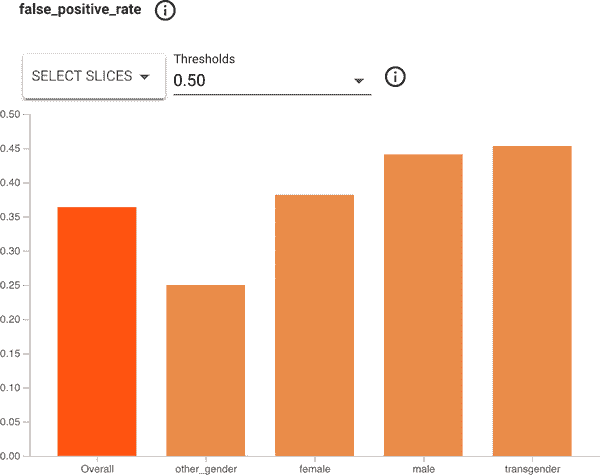

# 第十五章：移动应用的伦理、公平和隐私

虽然最近机器学习和人工智能的进展将伦理和公平的概念推向了聚光灯下，但需要注意的是，在计算机系统中，不平等和不公平一直是关注的话题。在我的职业生涯中，我见过许多例子，系统为一个场景而设计，但没有考虑到公平和偏见对整体影响的影响。

考虑这个例子：您的公司拥有客户数据库，并希望针对识别出的增长机会的特定邮政编码区域推出营销活动，以获得更多客户。为此，公司将向那些位于该邮政编码区域的与之建立联系但尚未购买任何东西的人发送折扣券。您可以编写如下 SQL 来识别这些潜在客户：

```
SELECT * from Customers WHERE ZIP=target_zip AND PURCHASES=0
```

这可能看起来是完全合理的代码。但考虑一下该邮政编码区域的人口统计数据。如果那里的大多数人属于特定种族或年龄组，会怎么样呢？与均衡增长您的客户群体不同，您可能会过度定位一个人群，或者更糟糕的是，通过向一种种族提供折扣而对另一种族进行歧视。随着时间的推移，持续这样的定位可能导致客户群体对社会人口统计数据偏向，最终将您的公司限制在主要为一个人群服务的困境中。在这种情况下，变量——邮政编码——是明确的，但是具有不那么明确的代理变量的系统在没有仔细监控的情况下仍可能发展为具有偏见的系统。

AI 系统的承诺是，您将能够更快地交付更强大的应用程序...但如果您这样做的代价是不减少系统中的偏见，那么您可能会通过使用 AI*加速*差距。

理解和在可能的情况下消除这一过程是一个庞大的领域，可以填写很多书籍，因此在这一章中，我们只会对您需要注意潜在偏见问题的地方进行概述，并介绍可以帮助您解决这些问题的方法和工具。

# 伦理、公平与隐私的责任 AI

构建一个 AI 系统，并将责任作为您 ML 工作流程的一部分，这意味着可以在每个步骤中都纳入负责任的 AI 实践。虽然有许多这样的模式，但我将遵循以下非常一般的步骤：

1.  定义问题：您的 ML 系统是为谁设计的

1.  构建和准备您的数据

1.  构建和训练您的模型

1.  评估您的模型

1.  部署和监控您的模型使用情况

让我们看看在您通过这些步骤时可用的一些工具。

## 负责地定义您的问题

当您创建一个解决问题的应用程序时，考虑应用程序存在可能引发的问题是很重要的。您可能会开发像鸟鸣检测器这样无害的东西，用于根据它们发出的声音对鸟类进行分类。但这可能如何影响您的用户呢？如果您的数据仅限于某一特定地区常见的鸟类，而该地区主要由单一人口统治，那会怎样？您可能会无意识地开发了一个只能供特定人口群体使用的应用程序。这是您想要的吗？对于这样的应用程序，也可能会引起可访问性问题。如果您的概念是您听到一只鸟在唱歌，然后您希望识别它……您假设这个人*能够*听到鸟叫声，因此您并未考虑到听力受损或无听力的人群。虽然这只是一个非常琐碎的例子，但将这一概念扩展到可以深刻影响某人生活的应用程序或服务。如果您的共享乘车应用程序避开了某些社区，从而排斥了某些人？如果您的应用程序对健康有所帮助，比如帮助管理药物，但对某一特定人群失败了呢？可以很容易地想象您如何通过应用程序造成*伤害*，即使这些后果是无意识的。因此，非常重要的是要对所有潜在用户保持警惕，并具备帮助指导您的工具。

不可能预测所有可能无意中引入偏见的情景，因此，在这种情况下，谷歌已准备好了[*人+AI 指南*](https://oreil.ly/enDYK)。该指南共有六章，从理解用户需求和定义成功开始，一直到数据准备、模型构建、公平收集反馈等。它在帮助您理解 AI 独特解决问题类型方面特别有用。我强烈建议在开始编写任何应用程序之前参考这本指南！

由创建本书的人们也拥有一套[AI 可探索资源](https://oreil.ly/ldhCV)，这些资源提供了交互式工作手册，帮助您发现数据中的隐藏偏见等问题。这些资源将引导您理解核心场景，不仅限于数据本身，还包括模型在训练后的行为。这些资源可以帮助您制定上线后模型测试的策略。

一旦您定义和理解了问题，并消除了其中潜在的偏见来源，下一步就是构建和准备您将在系统中使用的数据。同样，这也是可能无意中引入偏见的方式。

###### 注意

通常认为 AI 中的偏见仅仅归因于用于训练模型的数据。虽然数据通常是主要嫌疑人，但并不是唯一的。偏见可以通过特征工程、迁移学习以及其他许多方式渗入。通常你会被“出售”，告诉你通过修复数据来解决偏见，但不能简单地清理数据并宣布胜利。在设计系统时要记住这一点。在本章中我们将重点关注数据，因为这是可能的通用工具所在，但再次强调，避免认为偏见仅仅是通过数据引入的心态！

## 避免数据中的偏见

并非所有的数据偏见都容易发现。我曾参加过一个学生竞赛，参赛者利用生成对抗网络（GANs）挑战图像生成，预测基于面部上半部分的下半部分面貌。那时还未爆发 COVID-19 疫情，但在日本依然是流感季节，很多人会戴口罩来保护自己和他人。

初始想法是看是否能预测口罩下面的面部。为此，他们需要访问面部数据，因此使用了 IMDb 的数据集，其中包含带有年龄和性别标签的 [面部图像](https://oreil.ly/wR5Vl)。问题在于？考虑到数据源是 IMDb，这个数据集中绝大部分面孔都*不是*日本人。因此，他们的模型在预测*我的*面部时表现出色，但却不能预测他们自己的面部。在没有足够数据覆盖的情况下急于推出机器学习解决方案，这些学生产生了一个带有偏见的解决方案。这只是一个展示性的比赛，他们的工作非常出色，但它提醒我们，当并不需要或者没有足够数据来构建正确模型时，急于推出机器学习产品可能导致构建带有偏见的模型并造成未来严重的技术债务。

要发现潜在的偏见并不总是那么容易，市面上有许多工具可以帮助你避免这种情况。接下来我想介绍几款免费的工具。

### 什么如果工具

我最喜欢的之一是谷歌的 What-If 工具。它的目的是让您无需编写大量代码即可检查机器学习模型。通过这个工具，您可以同时检查数据和模型对数据的输出。它有一个[演练](https://oreil.ly/dX7Qm)，使用的是基于 1994 年美国人口普查数据集的大约 30,000 条记录训练的模型，用于预测一个人的收入可能是多少。例如，假设这被一个抵押贷款公司用来确定一个人是否有能力偿还贷款，从而决定是否向其发放贷款。

工具的一部分允许你选择一个推断值并查看导致该推断的数据点。例如，考虑 图 15-1。

此模型返回一个从 0 到 1 的低收入概率，值低于 0.5 表示高收入，其他表示低收入。此用户得分为 0.528，在我们的假设抵押申请场景中可能因收入太低而被拒绝。使用该工具，您可以实际改变用户的某些数据，例如他们的年龄，然后查看推断结果的影响。在这个例子中，将他们的年龄从 42 岁改变到 48 岁，使他们的得分超过 0.5 的阈值，结果从“拒绝”变为“接受”。请注意，用户的其他信息没有改变——只改变了年龄。这表明模型可能存在年龄偏见。

What-If 工具允许您尝试各种信号，包括性别、种族等细节。为了避免因为一个特定情况而改变整个模型，而实际问题出在某个客户身上而不是模型本身，该工具包括寻找最近的反事实情形的能力——也就是说，它会找到最接近的一组数据，这些数据会导致不同的推断结果，因此您可以开始深入挖掘您的数据（或模型架构）以找出偏见。

我只是在这里初探 What-If 工具的功能表面，但强烈建议您去了解一下。您可以在[该网站](https://oreil.ly/kgZkZ)上找到很多使用示例。其核心功能正如其名，它提供了在部署前测试“假设情景”的工具。因此，我相信它可以成为您机器学习工具箱中不可或缺的一部分。



###### 图 15-1。使用 What-If 工具

### Facets

[Facets](https://oreil.ly/I1x6L)是一个可以与 What-If 工具协同工作的工具，通过可视化技术深入挖掘您数据的工具。Facets 的目标是帮助您理解数据集中特征值的分布情况。如果您的数据被分割成多个子集用于训练、测试、验证或其他用途，这将特别有用。在这种情况下，您可能会发现一个子集中的数据偏向于某个特定特征，从而导致模型出现故障。该工具可以帮助您确定每个子集中每个特征的覆盖是否足够。

例如，使用与前一个示例中相同的美国人口普查数据集和 What-If 工具，稍加检查即可发现训练/测试分割非常良好，但使用资本增益和资本损失特征可能会对训练产生偏倚影响。请注意在 图 15-2 中检查分位数时，除这两个特征外，大的十字交叉点在所有特征上非常平衡。这表明这些值的大多数数据点为零，但数据集中有少量远高于零的值。以资本增益为例，你可以看到训练集中有 91.67% 的数据点为零，其余值接近 100k。这可能会导致训练偏倚，并可视为调试信号。这可能会引入偏向于人群中极小部分的偏见。



###### 图 15-2\. 使用 Facets 探索数据集

Facets 还包括一个称为 Facets Dive 的工具，可以根据多个轴向可视化数据集的内容。它可以帮助识别数据集中的错误，甚至是现有的偏见，以便你知道如何处理它们。例如，考虑 图 15-3，我在这里通过目标、教育水平和性别对数据集进行了分割。

红色表示“高收入预测”，从左到右是教育水平。几乎每种情况下男性高收入的概率都大于女性，特别是在更高教育水平下，这种对比变得非常明显。例如看看 13-15 列（相当于学士学位）：数据显示相同教育水平下男性高收入的比例远高于女性。虽然模型中还有许多其他因素来确定收入水平，但对高度受教育人群出现这种差异很可能是模型中偏见的一个指标。



###### 图 15-3\. 使用 Facets 进行深入分析

为了帮助你识别这类特征，以及使用 What-If 工具，我强烈建议使用 Facets 探索你的数据和模型输出。

### TensorFlow 模型卡工具包

如果你打算发布你的模型供他人使用，并希望透明地展示用于构建模型的数据，TensorFlow 模型卡工具包可以帮助你。该工具包的目标是提供关于模型元数据的背景信息和透明度。该工具包完全开源，因此你可以探索其工作原理，地址为 [*https://github.com/tensorflow/model-card-toolkit*](https://github.com/tensorflow/model-card-toolkit)。

要探索一个模型卡的简单示例，您可能熟悉著名的猫狗计算机视觉训练示例。为此制作的模型卡可能看起来像 Figure 15-4，透明地公布了模型的情况。尽管这个模型非常简单，但卡片显示了数据分割的示例，清楚地显示数据集中狗的数量比猫多，因此引入了偏差。此外，制作该模型的专家还能分享其他伦理考虑，例如它 *假设* 图像始终包含猫或狗，因此如果传递了不包含二者的图像，可能会有害。例如，它可以用来侮辱人类，将其分类为猫或狗。对我个人而言，这是一个重要的“啊哈！”时刻，因为在教授机器学习时，我从未考虑过这种可能性，现在需要确保它成为我的工作流的一部分！



###### 图 15-4\. 猫狗模型卡

可在 [GitHub](https://oreil.ly/LiEkn) 上找到一个更复杂的模型卡，展示了一个基于人口统计特征预测收入的模型。

在其中，您可以看到关于训练和评估集中人口统计信息的透明度，以及关于数据集的定量分析。因此，使用此模型的人可以 *预先警告* 关于模型可能引入其工作流的偏见，并可以相应地进行缓解。

### TensorFlow 数据验证

如果您使用 TensorFlow Extended（TFX），并且在 TFX 管道中拥有数据，则有 TFX 组件可以分析和转换它。它可以帮助您发现诸如缺失数据（例如具有空标签的特征）或超出您预期范围的值等其他异常情况。深入讨论 TensorFlow 数据验证超出了本书的范围，但您可以通过查阅 [TFDV 指南](https://oreil.ly/7qydA) 了解更多信息。

## 构建和训练您的模型

在探索数据及以上提到的任何模型之外，建立和训练您的模型时可以考虑的因素。再次强调，这些细节非常详细，并非所有内容都适用于您。我不会在这里详细介绍它们，但我会为您提供可以了解更多信息的资源链接。

### 模型修复

当您创建您的模型时，可能会引入导致模型使用结果偏见的偏见。这其中的一个来源是，您的模型可能在某些数据片段上表现不佳。这可能会造成巨大的伤害。例如，假设您为疾病诊断建立了一个模型，该模型对男性和女性表现非常出色，但对不表达性别或非二元性别的人表现不佳，原因是这些类别的数据较少。通常有三种方法可以解决这个问题——改变输入数据，通过更新架构对模型进行干预，或者对结果进行后处理。可以使用一种称为*MinDiff*的过程来使数据分布均衡，并在数据的各个片段之间平衡错误率。因此，在*训练*过程中，可以使分布差异变得更加接近，从而在未来的预测结果中，可以在数据的各个片段之间更加公平地进行。

所以，例如，考虑图 15-5。左边是未在训练过程中应用 MinDiff 算法的两个不同数据片段的预测分数。结果是预测的结果差异很大。右边重叠了相同的预测曲线，但它们彼此更加接近。



###### 图 15-5\. 使用 MinDiff

这种技术值得探索，详细的教程可以在[TensorFlow 网站](https://oreil.ly/3LgAl)找到。

### 模型隐私

在某些情况下，聪明的攻击者可以利用您的模型推断出模型训练所使用的一些数据。预防此类问题的一种方法是使用*差分隐私*训练模型。差分隐私的理念是防止观察者利用输出来判断某个特定信息是否用于计算中。例如，在一个模型上，该模型经过训练，可以从人口统计学中推断工资。如果攻击者知道某人在数据集中，他们可以知道该人的人口统计信息，然后将其输入模型中，由于他们的工资在训练集中，可以预期其工资的值非常精确。或者，例如，如果使用健康指标创建了一个模型，攻击者可能知道他们的邻居在训练集中，可以使用数据的一部分来推断关于他们目标的更多数据。

考虑到这一点，[TensorFlow 隐私](https://oreil.ly/anZhq)提供了使用差分隐私训练模型的优化器实现。

### 联邦学习

对移动开发者最感兴趣但目前尚未广泛可用的可能是联合学习。在这种情况下，您可以根据用户的使用方式持续更新和改进您的模型。因此，用户正在与您分享他们的个人数据，以帮助您改进模型。一个这样的用例是使他们的键盘自动预测他们正在输入的单词。每个人都不同，所以如果我开始输入“anti”，我可能在输入抗生素，也可能在输入“反教会主义”，键盘应该足够智能，基于*我的*先前使用提供建议。考虑到这一点，联合学习技术应运而生。这里的隐私影响显而易见 — 您需要能够以一种不会被滥用的方式提供给用户分享非常个人化的信息 — 例如他们键入的单词。

正如我所提到的，这个 API 目前还不是您可以在应用程序中使用的开放 API，但您可以使用 TensorFlow Federated 进行模拟。

[TensorFlow Federated](https://oreil.ly/GpiID)（TFF）是一个开源框架，在模拟服务器环境中提供联合学习功能。目前仍处于实验阶段，但值得关注。TFF 设计有两个核心 API。第一个是联合学习 API，为现有模型添加联合学习和评估能力提供一组接口。例如，它允许您定义受分布式客户端学习值影响的分布式变量。第二个是联合核心 API，在函数式编程环境中实现了联合通信操作。它是现有部署场景的基础，如 Google 键盘[Gboard](https://oreil.ly/csPTi)。

## 评估您的模型

除了上述在训练和部署过程中用于评估模型的工具之外，还有几个其他值得探索的工具。

### 公平性指标

公平性指标工具套件旨在计算和可视化分类模型中常见的公平性指标，如假阳性和假阴性，以比较不同数据切片中的性能。如前所述，它已集成到 What-If 工具中，如果您想要开始使用它，也可以单独使用开源的 [fairness-indicators package](https://oreil.ly/I9A2f)。

所以，例如，当使用公平性指标来探索在基于人类评论标记的模型中的假阴性率时，人类试图标记评论是由男性、女性、跨性别者或其他创作者写的，最低的错误率出现在男性中，最高的则出现在“其他性别”中。参见图 15-6。



###### 图 15-6\. 从文本模型中推断性别的公平性指标

当在相同模型和相同数据中查看假阳性时，在图 15-7 中，结果发生了翻转。该模型更有可能对男性或跨性别者做出假阳性判断。



###### 图 15-7\. Fairness Indicators 提示的假阳性

使用此工具，您可以探索您的模型并调整架构、学习或数据，以尝试平衡它。您可以在[*https://github.com/tensorflow/fairness-indicators*](https://github.com/tensorflow/fairness-indicators)中自行探索此示例。

### TensorFlow 模型分析

TensorFlow 模型分析（TFMA）是一个旨在评估 TensorFlow 模型的库。在撰写本文时，它处于预发布阶段，所以在您阅读本文时可能会有所改变！有关如何使用它和如何入门的详细信息，请访问[TensorFlow 网站](https://oreil.ly/oduzl)。它特别有助于您分析训练数据的切片以及模型在这些数据上的表现。

### 语言可解释性工具包

如果你正在构建使用语言的模型，语言可解释性工具（LIT）将帮助你理解像是你的模型在哪些类型的示例上表现不佳，或是推动预测的信号，帮助你确定不良训练数据或对抗行为。您还可以测试模型的一致性，如果更改文本的风格、动词时态或代词等方面。如何设置和使用它的详细信息请参见[*https://pair-code.github.io/lit/tutorials/tour*](https://pair-code.github.io/lit/tutorials/tour/)。

# Google 的 AI 原则

TensorFlow 是由 Google 的工程师们创建的，是公司产品和内部系统中许多现有项目的一部分。在它开源后，发现了许多机器学习领域的新方向，ML 和 AI 领域的创新步伐是惊人的。考虑到这一点，Google 决定发布一份[公开声明](https://oreil.ly/OAqyB)，概述了其关于如何创建和使用 AI 的原则。这些原则是负责任采用的重要指南，值得深入探讨。总结起来，这些原则包括：

对社会有益

AI 的进展是变革性的，随着这种变化的发生，目标是考虑所有社会和经济因素，只有在总体上可能的收益超过可预见的风险和不利因素时才进行。 

避免创建或加强不公平的偏见

如本章讨论的那样，偏见可能会悄悄地侵入任何系统中。AI——尤其是在其转变行业的情况下——提供了消除现有偏见以及确保不会产生新偏见的机会。我们应当对此保持警觉。

被构建和测试以确保安全

谷歌继续开发强大的安全和保护实践，以避免人工智能带来的意外伤害。这包括在受限环境中开发 AI 技术，并在部署后持续监控其运行。

对人民负责。

目标是建立受适当人类指导和控制的人工智能系统。这意味着必须始终提供适当的反馈、申诉和相关解释的机会。能够实现这一点的工具将成为生态系统的重要组成部分。

结合隐私设计原则。

人工智能系统必须包含确保充分隐私和告知用户其数据使用方式的保障措施。提供通知和同意的机会应当是明显的。

坚持高标准的科学卓越。

当科技创新以科学严谨和开放调查与合作的承诺进行时，其表现最佳。如果人工智能要帮助揭示关键科学领域的知识，它应当朝着那些领域期望的高科学卓越标准努力。

符合这些原则的使用方式应该是可用的。

尽管这一点可能有点抽象，但重要的是要强调这些原则不是孤立存在的，也不仅仅是给构建系统的人。它们也旨在为您构建的系统如何使用提供指导。要注意某人可能会以您未曾预料的方式使用您的系统，因此为您的用户制定一套原则也很重要！

# 总结。

这也是您成为移动和 Web AI 和 ML 工程师旅程中的一个航标的结束，但您真正构建可以改变世界的解决方案的旅程可能才刚刚开始。希望这本书对您有所帮助，虽然我们没有深入探讨任何特定主题，但我们能够概括和简化机器学习与移动开发领域之间的复杂性。

我坚信，如果人工智能要实现其全部的积极潜力，关键在于使用低功率、小型模型，专注于解决常见问题。尽管研究越来越大，但我认为每个人都可以利用的真正增长潜力在于越来越小的模型，而这本书为你提供了一个平台，可以看到如何利用这一点！

我期待看到您构建的作品，并且如果您能给我分享的机会，我会非常乐意。在 Twitter 上联系我 @lmoroney。
