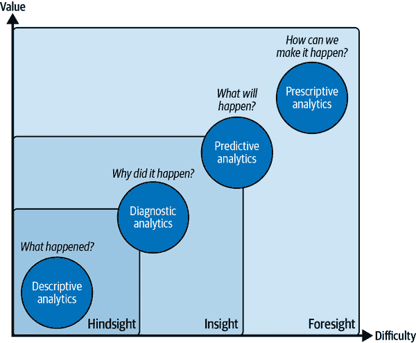

# 第一章：利用 AI 创造商业价值

在本章中，我们将探讨为什么 AI 在商业智能（BI）中的采用比以往任何时候都更加重要，以及 AI 如何可以被 BI 团队利用。为此，我们将确定 AI 可以支持 BI 任务和流程的典型领域，并探讨底层的机器学习（ML）能力。在本章的最后，我们将介绍一个实用的框架，让您能够将 AI/ML 能力映射到 BI 问题领域。

# AI 如何改变 BI 景观

在过去的 30 年中，BI 已经逐渐成为公司数据驱动文化的推动力量，至少直到关注点转向数据科学、机器学习和人工智能。这是怎么发生的？对于您的 BI 组织意味着什么？

回顾 70 年代决策支持系统第一时代的开始，我们看到由 IT 专家使用的技术系统从小规模（按今天的标准）数据集中获得洞察力。这些系统逐渐演变，最终在 1980 年代末被称为*BI*。数据分析是新兴的，因此即使是最基本的洞察力也显得令人瞠目。突然间，决策不再基于直觉，而是基于实际数据，这使得在复杂的商业场景中能够做出更安全和更大胆的决策。

二代 BI 始于 2000 年代中期，以自助式分析为主导。大量新工具和技术使非技术人员能够更轻松地切分数据、创建可视化效果，并从日益庞大的数据源中提取洞察力。这些主要由大型软件供应商如 Oracle、SAP 和 Microsoft 提供，同时也促进了像 Tableau Software 这样的小众 BI 公司的增长。电子表格软件也越来越多地整合到整体数据分析生态系统中，例如，通过允许业务用户通过 Microsoft Excel 中的数据透视表访问 Microsoft SQL Server 系统上的在线分析处理（OLAP）立方体。

如今大多数大公司仍然停留在 BI 的第二阶段。为什么会这样？首先，近年来许多技术努力都集中在技术上管理底层数据的指数级增长，这些数据是 BI 系统设计用来处理和从中获取洞察力的。其次，数据量的增加，主要是由互联网和数字服务的增长驱动（见图 1-1），导致了越来越多缺乏数据素养的人，这些人熟练掌握处理高维数据集和相应工具（在这种情况下，不是 Excel）的能力。


###### 图 1-1\. 近年数据增长。来源：[Statista](https://oreil.ly/aYY04)

相较于消费市场，AI 应用在专业 BI 空间中仍然服务不足。这可能是因为 AI 和 BI 人才分布在组织中的不同团队中，如果它们曾经碰面，它们很难有效地进行沟通。这主要是因为这两个团队通常使用不同的语言，并且有不同的优先级：BI 专家通常不会过多地讨论训练和测试数据，而数据科学家很少聊 SQL Server Integration Services (SSIS)包和 ETL（抽取、转换、加载）流程。

然而，基于以下持续的趋势，AI 在 BI 中的采用需求将不可避免地增加：

从数据中获取快速答案的需求

为了保持竞争力并实现增长，组织需要数据驱动的见解。数据分析师面对着探索这个或那个指标，或者检查这个或那个数据集的询问而感到不堪重负。与此同时，业务用户需要从数据中快速、轻松地获取答案的需求也在增加。如果他们可以向谷歌或亚马逊 Alexa 询问某家公司当前的股价，为什么他们不能向他们的专业 BI 系统询问昨天的销售数据呢？

见解的民主化

业务用户已经习惯于通过自助 BI 解决方案从数据中获取见解。然而，今天的数据往往过于庞大和复杂，以至于不能纯粹依靠业务部门的自助分析来处理。数据量、种类和速度的增加使得非技术用户难以使用本地计算机上的熟悉工具来分析数据，甚至有时几乎不可能。为了在整个组织中继续推广见解的民主化，需要易于使用的 BI 系统，并自动向最终用户展示见解。

ML 服务的可访问性

尽管 AI 在组织内的使用持续增加，但对于更好的预测或更好的预测的期望也在增加。这在 BI 领域尤为明显；低代码或无代码平台使得将机器学习技术提供给非数据科学家比以往任何时候都更容易，并迫使 BI 团队成员将预测性见解整合到其报告中。数据科学领域的同样进展也预计会在 BI 领域中更早或更晚发生。

为了更好地了解 BI 团队如何利用 AI，让我们简要回顾由[Gartner](https://oreil.ly/GGxKR)发布的分析见解模型（Figure 1-2）。

每个 BI 或报告基础设施的核心功能是通过对历史数据进行描述性和诊断性分析来提供回顾和洞察力。这两种方法对所有进一步的分析过程至关重要。

首先，组织需要了解过去发生了什么，以及从数据角度驱动这些事件的原因。这通常被称为*基本报告*，具有一些洞察功能。技术难度和复杂性相对较低，但信息的内在价值也相对较低。不要误会：可靠和结构化的报告仍然是业务数据分析最重要的支柱，因为它为更高级别的概念奠定了基础，并引发进一步分析的问题或问题。事实上，洞察模型的每个阶段都包含所有先前的阶段。在弄清楚您的历史数据之前，您无法进行预测性分析。



###### 图 1-2\. 洞察类型和分析方法。来源：[Gartner](https://oreil.ly/GGxKR)

考虑以下例子。某电信公司有订阅每月服务的客户。每月会有一定数量的客户选择不续订服务合约，退出业务关系——这种现象称为*客户流失*。

商业智能系统最基本的要求是了解过去有多少客户流失，以及这种流失如何随时间发展。*描述性分析*将为我们提供必要的信息，以了解流失率随时间的变化情况，以及我们是否确实存在问题。表 1-1 给出了这种情况可能看起来如何的一个示例。

表 1-1\. 时间序列的流失率（描述性分析）

|   | Q1 | Q2 |
| --- | --- | --- |
| **月份** | 2022 年 1 月 | 2022 年 2 月 | 2022 年 3 月 | 2022 年 4 月 | 2022 年 5 月 | 2022 年 6 月 |
| **流失率** | 24% | 26% | 22% | 29% | 35% | 33% |

这些信息的内在价值相当有限。在这个层面上，分析实际上无法真正解释发生的现象或者如何处理它。但至少它能指示我们是否存在问题：从表中我们可以看出，Q2 的流失率似乎显著高于 Q1，因此可能值得进一步研究。

这就是*诊断分析*发挥作用的地方。我们现在可以深入挖掘，将交易销售数据与更多关于客户的信息丰富起来，例如客户年龄组，如表 1-2 所示。

表 1-2\. 时间序列和客户细分的流失率

| 客户年龄 | Q1 流失率 | Q2 流失率 |
| --- | --- | --- |
| 18–29 | 29% | 41% |
| 30–49 | 28% | 30% |
| 50–64 | 24% | 25% |
| 65 岁及以上 | 20% | 19% |

这种分析将告诉我们，65 岁及以上的客户的流失率似乎保持稳定。另一方面，年轻客户更有可能流失，并且这一趋势在 Q2 有所增加。经典的商业智能系统可以让我们跨多个变量分析这些数据，以了解到底发生了什么。

在许多情况下，企业可以通过这些分析单独找到导致手动操作或决策的有价值模式。这就是为什么这个阶段仍然如此关键，并且将始终非常重要的原因。

*预测分析*将分析推向更深层次，并回答一个问题：鉴于我们从过去所知的所有模式都在重复，未来会发生什么？因此，预测分析为数据增加了另一层价值和复杂性，正如您可以在表 1-3 中看到的那样。

表 1-3\. 估计客户流失概率（预测分析）

| 客户 ID | 年龄 | 计划 | 价格 | 活跃月数 | 流失概率 |
| --- | --- | --- | --- | --- | --- |
| 12345 | 24 | A | $9.95 | 13 | 87% |
| 12346 | 23 | B | $19.95 | 1 | 95% |
| 12347 | 45 | B | $19.95 | 54 | 30% |

随着我们离开历史数据的领域，复杂性增加了。我们不再以真假的二元术语提供见解，而是引入某些事件发生概率（流失概率）。同时，我们增加了价值，因为我们将我们从过去所知的一切纳入假设，以预测这将如何影响未来行为。

例如，基于未来流失概率和历史销售数据，我们可以计算公司未来几个季度的预测销售风险，并将其纳入我们的财务计划。或者，我们可以选择那些具有高流失概率的客户，采取有针对性的措施来减少流失风险。

但是我们应该采取哪些行动呢？欢迎来到*指导性分析*！表 1-4 展示了在实践中可能的情况。在这种情况下，我们增加了另一个维度，*下一个最佳优惠*，它包括了根据客户个人资料和历史购买行为推荐的特定折扣或产品升级。

表 1-4\. 建议行动（指导性分析）

| 客户 ID | 年龄 | 计划 | 价格 | 经过月数 | 流失概率 | 下一个最佳优惠 |
| --- | --- | --- | --- | --- | --- | --- |
| 12345 | 24 | A | $9.95 | 13 | 87% | 年度合同优惠 |
| 12346 | 23 | B | $19.95 | 1 | 95% | 升级 |
| 12347 | 45 | B | $19.95 | 54 | 30% | 无 |

当我们研究拥有成千上万客户的组织时，很明显，要从宏观角度优化这些任务，我们需要依赖微观层面的自动化。仅仅通过手动处理所有这些微小的决策并监控我们对每个客户行动的效果是不可能的。这些微小决策的投资回报率（ROI）太低，无法证明手动努力的必要性。

AI 和 BI 完美结合的地方在于此。考虑到 AI 可以指示每位客户的流失可能性，并建议下一步最佳行动。现在，我们可以将这些信息与经典的 BI 指标（如客户的历史收入或客户的忠诚度）结合起来，从而对这些对业务影响最大且成功机会最高的行动做出明智的决策。

因此，AI 和 BI 之间的关系可以用以下公式简要概括：

+   *人工智能* + *商业智能* = *决策智能*

最有效的 AI 驱动的 BI 应用是将自动化和人工决策相结合。我们将在第二部分实际探讨这一点。现在，让我们具体看看 AI 如何系统地帮助我们改进我们的 BI。

# BI 的常见 AI 使用案例

AI 通常可以通过以下三种方式为 BI 增加价值：

+   自动化洞见并使分析过程更加用户友好

+   更好地计算预测和预测

+   使 BI 系统能够从非结构化数据源中提取洞见

图 1-3 提供了这些应用领域如何映射到各种分析方法的高级概述。


###### 图 1-3\. AI 能力如何支持分析方法

让我们更详细地探讨这些领域。

## 自动化和易用性

使 BI 工具本身更加智能和易用将使其对非技术用户更加可用，减少分析师的工作量。这种易用性通常通过底层自动化来实现。

智能算法使得在几秒钟内筛选大量数据并为业务用户或分析师提供有趣的模式或洞见成为可能。如图 1-4 所示，这些例行程序特别适合描述性和诊断分析阶段。

AI 可以帮助发现许多变量之间的有趣相关性或异常观察结果，这是人类可能会忽略的。在许多情况下，AI 还能比人类更好地查看多个指标的组合，而人类通常一次只能专注于一个指标。但自动化和易用性也触及到预测分析阶段，例如通过使用户更轻松地训练和部署自定义 ML 模型。


###### 图 1-4\. AI 驱动的 BI：自动化与易用性（应用层）

这里有一件重要的事情需要注意：在这个阶段，AI 的能力通常是集成到应用层中的，也就是您的 BI 软件。因此，您通常不能通过几行 Python 代码将这些能力添加到 BI 平台（与我们在第 7、8 和 9 章讨论的 AI 驱动预测和解锁非结构化数据形成对比）。如果您正在使用像 Microsoft Power BI 或 Tableau 这样的现代 BI 平台，您会在这些工具中找到这些 AI 功能。有时，它们可能是隐藏的，或者发生得如此无缝，以至于您甚至没有注意到 AI 在这里发挥作用。

本节其余部分描述了 AI 在幕后工作，使分析师的生活更加轻松。

### 利用自然语言处理与数据交互

通过使用 AI 驱动的自然语言处理（NLP）技术，机器能够更好地解释和处理用户的文本输入。例如，假设您想了解上个月的销售结果或去年与今年美国的销售情况。您可能会输入以下查询：

```
How were my sales in Texas in the last 5 years?
```

或者

```
Sales $ in Texas last year vs Sales $ in Texas this year
```

不需要复杂的代码或查询语言。这种类似于 Q&A 的输入方式使得 BI 对非技术用户更加可访问，对于无法预测每个业务用户可能提出的问题的分析师来说，这也更加方便。大多数用户对这种方法应该很熟悉，因为它类似于使用 Google 等搜索引擎。

无论您的 BI 工具是否内置了 Q&A 工具，这些实现并非都同样有效。事实上，为了确保这些功能在生产环境中可靠运行，需要解决巨大的复杂性问题。分析师必须追踪业务用户提出的问题类型，并验证生成的输出是否正确。必须定义同义词和领域特定术语，以确保系统能正确解释用户提示。与所有 IT 系统一样，这些内容需要持续维护。希望系统能够改进，从而减少背景中所需的手动工作量。

### 总结分析结果

即使图表看起来似乎不言自明，将关键见解总结在一两行自然语言中也是一个好习惯，可以减少误解的风险。但是，真的有人喜欢在报告或演示文稿中为图表下面似乎显而易见的描述写作吗？大多数人并不喜欢，而这正是 AI 可以帮助的地方。

AI 驱动的自然语言处理不仅可以帮助您解释自然语言输入，还可以根据数据为您生成摘要文本。这些自动生成的文本将包括有关数据的描述性特征以及显著的变化或连续性。以下是 Power BI 自动生成图表说明的示例：

```
Sales $ for Texas increased for the last 5 years on record and it experienced the longest period of growth in Sales between 2010 and 2014.
```

正如你所见，这些小型由 AI 生成的文本片段可以让你作为分析师的生活更轻松，并且在向其他利益相关者传达洞见时节省大量时间。此外，它们可以帮助满足屏幕阅读器的辅助要求。

### 使用自动化在数据中找出模式

你已经看到了 NLP 的能力如何帮助你高效地从数据中获取描述性洞见。下一个逻辑步骤是找出过去发生某些观察的原因，比如为什么德克萨斯州的销售额会增加这么多？

使用诊断性分析，通常需要搜索数据集以探索基础数据分布中的有意义变化。在这个例子中，您可能想要找出某种产品或某个事件是否推动了整体变化。这个过程很快会变得单调乏味和繁琐。AI 可以帮助您减少*洞见时间*（TTI）。

算法非常擅长识别数据中的潜在模式并将其显现出来。例如，使用 AI 强化工具如分解树或关键影响者分析，您可以快速找出数据中哪些特征导致了整体观察到的效果——即时。在第五章和第六章中，我们将看到使用 Power BI 中 AI 强化功能的三个具体示例，以使您作为数据分析师或业务用户的生活更轻松。

## 更好的预测和预测

虽然描述性和诊断性分析一直是每个商业智能系统的核心，但迫切的欲望始终是不仅要理解过去，还要预见未来。正如您在图 1-5 中所见，AI 增强功能可以支持最终用户应用强大的预测性和规定性分析方法，基于历史数据实现更好的*预测*和*预测*。

这将增加复杂性，因为我们离开了过去的二进制数据领域，引入了关于未来的概率猜测，自然包含许多不确定性。同时，展望价值增加：如果我们即将预测未来，我们可以在现在做出更好的决策。


###### 图 1-5\. AI 强化的商业智能：更好的预测和预测（分析层）

现在，也许你之前听说过统计方法，比如回归或自回归积分移动平均（ARIMA），可能是在高中或基础大学课程中听过，现在你可能想知道 AI 有何大不同。请注意以下两个方面：

AI 可以在更多数据和较少人为监督的情况下生成更好的预测。

AI 在其核心利用诸如线性回归之类的老式技术。但同时，AI 可以通过使用随机方法快速找到最优解，而无需大量人工监督，将这些技术应用于复杂数据集。专门用于时间序列预测的算法被设计用于识别大量时间序列数据中的模式。AI 尝试通过特征选择和最小化损失函数来优化预测。这可以导致在短时间范围内获得更好或更准确的预测，或者试图在较长时间内更准确地预测。更复杂的非线性模型可以导致更精细和最终更好的预测结果。

AI 可以在规模上计算预测，以优化决策制定。

预测下一个季度客户总数是不错的。但更好的是根据最近的数据计算数据库中每个客户的流失可能性。有了这些信息，我们不仅可以知道哪些客户可能在下个月流失，还可以优化我们的决策制定。例如，我们可以确定在下个月将流失的所有客户中，应该以市场营销活动为目标的客户。将 ML 与 BI 结合为组织创造了潜在的巨大价值主张。随着自动机器学习（AutoML）和 AI 作为服务（AIaaS）等新技术的推进，我们将在第三章进一步探讨这些 AI 潜力，组织可以减少由于没有足够的数据科学家或 ML 从业者而造成的瓶颈。

AI 增强预测能力或更好的预测能力可以在现有 BI 软件（应用层）中作为一个不可或缺的部分找到。这些能力也可以独立应用，直接在数据库层面（分析层）上进行。这使得它们始终可用，无论您使用哪种 BI 工具。我们在第七章和第八章中探讨如何应用这些技术。

## 利用非结构化数据

BI 系统通常使用来自企业数据仓库等关系数据库的表格数据。然而，随着所有渠道数字化的增加，我们看到非结构化数据（如文本、图像或音频文件）的使用显著增加。从历史上看，这些形式难以大规模分析供 BI 用户使用。AI 正在改变这一情况。

AI 利用诸如计算机视觉或 NLP 等技术可以增加可用和机器可读数据的广度和深度，以访问新的、先前未开发的数据源。*非结构化数据*，例如原始文本文件、PDF 文档、图像和音频文件可以转换为与给定架构匹配的结构化格式，例如表格或 CSV 文件，然后可以通过 BI 系统进行消耗和分析。由于这是在数据摄取层发生的事情，这一过程最终将影响 BI 平台的所有阶段（见图 1-6）。

通过将这些文件纳入我们的分析中，我们可以获得更多信息，这些信息可能导致更好的预测或更好地理解关键驱动因素。第八章将为您演示这在实践中的工作方式。


###### 图 1-6\. AI 驱动的 BI：解锁摄取层的非结构化数据

# 对 AI 和机器学习的直觉理解

我们已经讨论了 AI 如何与 BI 一起使用。但要实际构建 AI 驱动的产品或服务，我们需要深入挖掘并理解 AI 的本质以及它能够（和不能够）实现的内容。

那么 AI 到底是什么？如果你问 10 个人，你可能会得到 11 个答案。在本书的过程中，了解这个术语实际含义是非常重要的。

让我们首先承认，术语*人工智能*并不新鲜。事实上，这个术语可以追溯到 20 世纪 50 年代的军事研究实验室。自那时以来，研究人员尝试了许多方法来实现使计算机或机器复制人类智能的目标。如图 1-7 所示，自其创建以来，AI 已经形成了两个广泛的领域：通用 AI 和狭义 AI。


###### 图 1-7\. 人工智能的发展

*通用 AI*，或*强人工智能*，是指旨在解决系统以前从未见过或暴露过的任何给定问题的技术，类似于人类大脑的工作方式。通用 AI 仍然是一个热门的研究课题，但它仍然相当遥远；研究人员仍然不确定是否会达到这一目标。

另一方面，*狭义 AI*指的是一种相对特定的解决方案，能够解决其设计和训练的单一、明确定义的问题。狭义 AI 在最近的研究和实际或业务相关领域中推动了我们所见的所有 AI 突破。

在狭义人工智能的核心，有一种方法在商业影响和发展进展方面突出：机器学习。事实上，在本书中谈论 AI 时，我们看到了通过机器学习实现的解决方案。这就是为什么我在本书中会将*AI*和*ML*互换使用，并将 AI 视为一个相当广义的术语，具有相当直接的意义：AI 是一个工具，用于构建（看似）智能的实体，能够通过机器学习解决特定任务。

现在 AI 和 ML 之间的关系希望已经有了一些更清晰的认识，让我们讨论一下 ML 的实际内容。*ML 是一种编程范式，旨在为特定目的找出数据中的模式*。机器学习通常有两个阶段：*学习*（训练）和*推断*（也称为*测试*或*预测*）。

机器学习的核心思想是在历史数据中找到模式，以解决特定任务，例如将观察结果分类、评分概率或找到物品之间的相似性。机器学习的典型用例是分析历史客户交易数据，计算客户流失的个体概率。通过推断，我们的目标是根据从历史数据中学到的一切，为新数据点计算预测。

为了增强您对机器学习的理解，让我们拆解我们定义的核心组件：

一种编程范式

传统软件是通过编写规则来构建特定程序的。如果您开发了一个客户支持系统，您需要定义客户提交支持票后应该发生的所有逻辑（例如通过电子邮件通知支持代理）。您记录所有规则，将它们放入程序中，并发布软件。

然而，机器学习颠覆了这种编程范式。与其将规则硬编码到系统中，不如提供足够的输入示例和期望的输出（标签），让机器学习算法为您提出规则集。虽然这种设置不适合构建客户支持系统，但对于某些规则未知或难以描述的场景非常有效。例如，如果您想根据诸如工单文本、客户类型和工单创建日期等多种特征对客户支持工单进行优先级排序，机器学习算法可以仅通过查看过去的工单如何进行优先级排序来为您提出优先级模型。与手工制作复杂的 if-then-else 逻辑不同，机器学习算法将在一定的计算时间和计算资源下找出解决方案。

数据中的模式发现

为了在数据中找到有用的模式，三个重要的概念共同发挥作用：算法、训练和模型。一个 ML *模型* 是一组规则或数学函数，将在给定特定数据输入时计算输出值。可以将其视为一堆加权的 if-then-else 语句。ML *算法* 描述了机器必须遵循的计算过程，以获得这个模型。而术语 *训练* 意味着在现有数据集上多次迭代，以找到特定数据集的最佳模型，从而产生低预测误差并对新的未见数据输入具有良好的泛化能力，以便该模型可以用于特定目的。

一个特定的目的

ML 任务通常根据它们试图解决的问题进行分类。主要领域包括监督学习和无监督学习。虽然这不是一本关于 ML 基础知识的书籍，但我们在第三章中稍微详细地涵盖了它们。

如果我们考虑所有的组成部分，在实际情况中，机器学习从业者的任务是尽可能收集与感兴趣情况相关的数据，选择并优化算法来创建情况模型，然后训练模型以确保其足够准确以便有用。

有关 AI 和 ML 最大的误解之一是，企业领导经常认为 AI 和 ML 难以实施。虽然设计和维护特定的高性能 ML 系统是一项复杂的任务，但我们也必须承认 AI 已经变得商品化和商业化，即使非 ML 专家也可以使用现有的代码库或无代码或低代码解决方案构建性能良好的 ML 解决方案。在第四章中，您将了解更多关于这些技术的信息，以便您可以自己实施 ML 解决方案，而无需数据科学家或 ML 工程师的帮助。

*AI* 这个术语对于那些真正不了解其含义的人来说可能显得可怕和令人畏惧。事实上，我们离《终结者》和通用人工智能还有很长的路要走。如果你希望在你的组织内部获得更广泛的接受和采用 AI 解决方案，你需要用友好和非技术性语言来解释 AI 是什么。将 AI 视为自动化或能够基于过去的学习实施更好决策的方式应该让你足够放心，以便发现潜在的良好用例并与同事分享这种精神。

# 将 AI 用例想法映射到业务影响

现在您已经更多地了解了 AI 以及它如何应用于 BI，您可能已经对将 AI 应用于自己的用例有一些想法。为了找出哪些潜力最大且值得深入研究，我们将看一下一个您可以用来进行精确定位的故事映射框架。这个框架受到敏捷项目管理技术的启发，应该能帮助您结构化思维过程。

这个 AI 故事映射框架的核心思想是对比过程的当前实施与 AI 支持的实施。这种技术将为您提供一个高层次的全面概述，说明不同之处，您需要改变哪些事物，并且最重要的是，帮助您结构化思维过程。

创建故事板很简单。拿一张空白纸，将其分成一个包含四列和两行的表格。四个上方的方框将映射您的当前过程，而下方的方框将描述未来预期的实施。从左到右命名列：设置、行动、结果、结果。图 1-8 展示了您的纸张应该如何看起来。


###### 图 1-8\. 故事板模板

要创建您的故事板，您需要从左到右填充列。您从第一行开始，概述给定过程的当前实施方式如何沿以下维度运作：

设置

描述了过程如何开始，并列出您的假设、资源或起始标准。

行动

包含所有由设置中列出的资源执行的任务和操作项。

结果

描述了过程的实际工件。确切地说，正在生成、创建或修改什么？

结果

包含结果对业务的影响，以及结果的后续步骤。例如，在仪表板中显示报告是一个结果，但仅仅这样做并没有任何影响。影响是根据仪表板显示的信息，以及由谁执行这些信息而产生的。

在下一步中，您将对预期未来实施做同样的操作。最终，您将对比新旧方法，更清楚地了解事物将如何变化以及这些变化可能产生的影响。为了更好地说明这项练习的工作原理，图 1-9 展示了我们客户流失用例的故事板示例。


###### 图 1-9\. 故事板示例

让我们一起走过我们的故事板示例。我们将从左上角开始，为现有过程的当前设置铺平道路。

目前，客户流失是由销售人员检测到的，他们在定期会议中与现有客户交谈时获得反馈，或者由客户支持员工接收到来自客户的反馈，称某些事情并不如他们希望的那样运行，或者他们遇到其他问题。在下一步中，客户支持或销售人员尝试直接与客户解决问题，例如提供入职帮助。

这个过程的主要结果是客户支持（希望能够）解决客户的现有痛点和问题。痛点可能会报告给管理层或投诉管理系统。因此，一旦问题解决，客户很有可能会继续使用当前的服务。

让我们将这一点与启用 AI 的实施对比，从左下角开始，然后向右进行。在我们的设置中，我们将收集关于客户使用各种产品和服务方式的历史数据，并标记流失和未流失的客户。我们还将邀请销售和客户服务的工作人员与分析师分享他们的领域专业知识。

我们的下一步行动将是分析历史数据，以确定数据集中是否可以识别客户流失的关键驱动因素。如果可以，我们将开发一个预测模型，为我们数据库中的每个客户计算个体流失风险，并提供为什么可能发生流失的见解。

结果，这些流失风险评分和流失原因将被呈现给业务部门。这些信息可以与其他指标（如客户收入）混合，并在客户关系管理（CRM）或商业智能（BI）系统中呈现报告。

有了这些信息，客户支持现在可以主动联系有高流失风险的客户，并尝试在客户实际上发出支持票据或完全不发出支持票据的情况下解决问题或消除障碍。因此，随着时间的推移，整体流失率应该会降低，因为组织可以更好地规模化地解决客户流失的原因。

通过现有和新流程的 story map，你应该更有信心描述可能的 AI 解决方案的外观，它可能带来的好处，以及是否值得采用新方法，即通过替换或与现有流程融合来实现。作为练习，使用 storyboard 模板并映射两到三个 AI 使用案例的想法。哪些想法对你来说似乎最有前景？

总结来说，storyboard 的目的是为每个使用案例提供一个简单的一页，直观地对比现有解决方案与新解决方案之间的差异和好处。使用 storyboard 将有助于你构建思维过程，并在优先考虑 AI 使用案例时提供坚实的起点。

# 摘要

在本章中，您了解到人工智能如何改变商业智能（BI）领域，这是由业务用户需要从数据中更快地获取答案、对洞察力民主化需求增长，以及整体机器学习工具可大规模使用性的增加所推动的。我们探讨了 AI 如何通过自动化和更好的可用性、改进的预测能力以及对新数据来源的访问来支持 BI，从而赋予人们做出更好决策的能力。到目前为止，您应该对 AI 和机器学习的工作方式及其今天的能力有了基本的理解。您还学会了使用一个框架来帮助结构化您的思维过程，并构思机器学习用例的想法。

在下一章中，我们将深入探讨 AI 系统的设计及在您的商业智能服务中实施这些技术之前需要考虑的因素。
