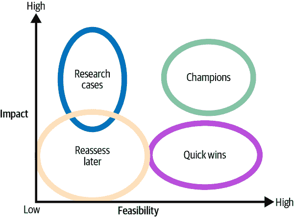

# 第二章：从 BI 到决策智能：评估 AI 项目的可行性

在前一章中，您了解了 ML 能力如何推动业务影响。但是，要创建优先考虑用例的路线图，并对哪些用例作为优先考虑进行知情决策，我们需要考虑另一维度的标准：可行性。

本章将深入探讨 ML 基础知识，以帮助您评估特定 AI 用例的复杂性和整体可行性。我们将基于数据、基础设施/架构和伦理三个主要主题探讨可行性。因此，您将能够创建首个基于 AI 的 BI 用例路线图的版本。

# 优先考虑数据

AI 项目需要与经典 BI 项目不同的思维方式。大多数 BI 项目通常以相对直接的方式完成，往往遵循传统的瀑布模型：定义要展示的指标，设计数据模型，集成数据，并确保它正常运行（通常已经足够困难了）。如有必要，进行迭代。完成工作。

AI 项目的主要区别在于，即使在理想情况下，结果也是高度不确定的。我们简单地不知道 AI 模型是否能在我们的数据上运行，并且是否足够好以提供价值，直到我们用真实数据进行测试。

因此，AI 项目通常需要在类似敏捷的项目框架中进行多个较短的迭代周期，如数据挖掘的跨行业标准过程（CRISP-DM）所示，如图 2-1。例如，CRISP-DM 建议在业务理解和数据理解阶段之间进行迭代，直到找到值得解决并有可能解决的业务问题，考虑到您拥有的数据。类似地，可能首次看起来数据看起来不错，但是在评估阶段才意识到无法开发出足够好的模型。这时您需要回到业务理解阶段，尝试重新阐述问题陈述。

###### 图 2-1。CRISP-DM 模型。来源：[维基媒体共享资源](https://oreil.ly/qBdhY)

在处理 AI 项目并实现投资回报率的常见方法是先开发最小可行解决方案或原型，仅在验证原型后才启动大规模项目。我们在第四章中更详细地讨论了这个主题。

尽管如此，在构建原型之前，您可以进行某些事情。考虑您想要解决的问题以及将用于解决问题的数据。在这个阶段，您无需担心像数据库或数据格式之类的技术复杂性。相反，我建议您从高层次查看数据，并用简单的语言描述您试图实现的目标。

在我们先前的客户流失示例中，您的目标描述可能如下所示：

+   *我们想主要使用 CRM 和企业资源规划（ERP）系统中的历史数据来预测下个月的客户流失。*

你关于这个用例的*基本数据问题*可能如下：

+   您的用例需要什么数据？

+   这些数据是否可用？如果可用，具体有哪些（表格、媒体文件、文本）？

+   您是否可以访问这些数据？

+   谁可以访问它？

+   公司拥有它吗，还是你需要购买它？

+   你是否有法律权限使用这些数据？

所有这些问题仍然与像“这不在数据仓库中”或“我们不能分期 PNG 文件”等问题无关。如果您无法回答这些关于数据的基本问题，建议不要继续进行数据评估。而是更好地专注于回答这些问题：您如何获取数据？您需要与谁交谈？等等。

但是假设你可以回答这些基本问题，并且数据在理论上似乎是可用的。在这种情况下，在创建原型之前，值得更详细地探索一些数据特征。

并不存在系统性地完成这一工作的黄金标准。然而，一个流行的框架是 4V 框架，我喜欢它的简单性。我们将在下一节更详细地探讨这个框架。

# 使用 4V 框架评估数据准备情况

*4V 框架*帮助你更好地理解数据的特征，而不需要过于技术化地考虑体积、多样性、速度和准确性这四个维度。在特定阶段，这种方法应该能帮助你考虑哪些用例更实际或不太实际。再次强调，在你回答更基本的问题之后，例如你是否真的拥有这些数据，以及你是否被允许使用它之后，你应该进行这种分析。

*Volume*表示在任何给定时间内可用的数据量。您可以以至少两种方式解释这一点：首先，作为观察值（示例、行数），其次，作为数据中包含的信息深度（属性、列数）。

不同类型的 ML 需要不同数量的数据，因此合理估计“足够”数据是困难的。然而，为了给您至少提供一个粗略的概念，表 2-1 列出了各种 ML 技术的数据要求。

在大多数情况下，随着数据量的增加，模型表现会更好。因此，几乎总是希望增加更多数据量。然而，单独的数据量并不能自动增加价值。

表 2-1\. ML 技术的数据要求

| ML 能力 | 按经验法则所需的数据量 |
| --- | --- |
| 回归 | 约 100 个示例 |
| 分类 | 适度特征维度（10 个变量）每个类别约 1,000 个示例 |
| 图像分类/检测 | 每个类别约 100 个明显不同类别的示例（例如猫与狗）更相似类别的示例为 1,000 至 10,000 个（例如狗的品种） |
| 文本/NLP | 例如情感分析或实体检测的每类任务中约 500 个示例 |

现在，让我们讨论一下*多样性*。您组织中的大部分数据甚至都不是以表格形式存储的。例如，原始文本、图像或日志文件属于通常称为*非结构化数据*的类别。这些数据没有适合您目的的可靠模式。这对于下游分析过程是有问题的。BI 系统通常需要以关系模式存储的数据。即使大多数 ML 算法也期望您的数据是结构化（表格）形式。因此，非结构化数据可能需要进行广泛的预处理——或者使用 AI 服务将其转换为结构化数据（您将在后面章节中看到）。

然而，多样性在表格数据的背景下也可以被解释，并且指的是您的数据如何很好地代表现实世界，包括边缘情况，以及它是否总体上具有代表性。例如，您的数据集中是否观察到所有类别标签的观测？根据您对这个术语的理解方式，多样性可能是一个目标，也可能是一个需要避免的因素。无论如何，您需要选择一个与您的组织相匹配的一致方法，并选择一个评估框架，以便以同样的方式评估不同的用例。

*速度*是数据产生和通过您系统流动的速率。您是否处理的是每天可能更新一次的批处理数据？还是处理持续更新的流式数据？数据的速度影响两件事：技术需求和数据漂移。流式数据往往对您的基础设施提出更高的要求。高速数据需要更密切地监控数据变化。如果由于速度而导致的数据快速变化，可能会难以在任何时间点上保持一致的真实视图。

*真实性*指的是数据作为现实世界的表现的准确性。数据是否存在不一致性、不完整性或模糊性？真实性是关于您的数据是否足够适合其预期用途。在 ML 的情况下，这首先意味着数据是否包含真实情况——您是否有数据标签？如果您的数据不包含标签，那么随着时间的推移，获取它们的唯一方式就是购买一个标注服务或等待业务过程生成带有标签的数据作为输出。

## 结合 4V 以评估数据的准备情况

通过综合考虑所有的 4V，您可以开始看到您的数据在特定用例中的相对优势和劣势。表 2-2 总结了您应该针对每个类别询问自己的一些关键问题及您可能用来评估它们的刻度。

表 2-2\. 评估数据在 4V 模型中的关键问题

| 维度 | 问题 | 可能的分数从...到... |
| --- | --- | --- |
| 数量 | 你有多少可用数据？将会产生多少数据？ | 少量（1） | 大量（5） |
| 多样性 | 数据是否包含足够的多样性来捕获甚至是罕见事件？数据是否包含太多的多样性，从而带有过多噪音并需要大量数据清理？ | 不期望的多样性（1）代表性差的数据（1） | 期望的多样性（5）高度代表性的数据（5） |
| 速度 | 相关数据源产生或更新的频率如何？数据源是否更新频繁，以便及时重新训练模型，以减少数据漂移的风险？ | 低速度（1）数据漂移风险高（1） | 高速度（5）数据漂移风险低（5） |

| 真实性 | 数据的准确性如何？数据的完整性如何？

数据的一致性如何？

您有标签吗？| 数据质量差（1）无标签（1）

不适合使用（1）| 高数据质量（5）所有示例均正确标记（5）

适合使用（5）|

有了这些分数，例如，您可以创建网状图。图 2-2 展示了客户流失示例的可能网状图。

###### 图 2-2\. 客户流失使用案例的示例网状图

该图表可以解释如下：

数量得分，5 分中的 5 分

我们有一个庞大的客户群体，涉及购买行为的多个属性，我们认为数据量足够用于训练 ML 模型。

多样性得分，5 分中的 3 分

尽管我们所有的数据都是表格化的，对于 ML 模型来说应该很容易消化，但我们预计长期高价值客户的例子很少。另一方面，我们可能有大量新客户，他们的信息可能不在 CRM 系统中，也没有其他地方捕获到，例如购买偏好。

速度得分，5 分中的 4 分

我们 CRM 和 ERP 系统中的数据应该是最新的，并且至少每天更新。我们假设这足够频繁，以避免数据漂移。

真实性得分，5 分中的 4 分

我们可以从数据本身获取真实标签（`Churned`），因此不需要标注服务。此外，我们预期 CRM 系统中的数据大部分是正确的，因为有数据治理流程在运行。

从数据角度来看，这张网图表明这个阶段存在一个可行的使用案例，并允许我们将这种方法与其他使用案例进行比较。

# 选择制造或购买 AI 服务

构建 AI 解决方案是一个耗时的过程，需要大量持续维护。图 2-3 展示了一个示例流程，展示了构建端到端 AI 解决方案所需的所有步骤。

当您考虑到这一点及其涉及的复杂性时，有时最好的 AI 解决方案是根本不开发 AI 解决方案。好消息是您不一定需要自己完成所有这些步骤。一种选择可能是仅开发自己的一些组件，另一种选择则完全依赖现成的 AI 服务。最终，像任何其他业务决策一样，AI 解决方案是一个买或者自制的选择。

###### 图 2-3\. AI 系统的高级架构

为了给您一个关于 AI 相关的买或者自制模式的概述，让我们看看您作为企业可以选择的各种阶段（见图 2-4），并简要回顾它们的优缺点。

###### 图 2-4\. AI 系统的买或者自制模式

## AI 作为服务

使用*AI 作为服务*（*AIaaS*），您租用一个完全管理的 AI 服务，通常按使用量付费（例如 API 调用）。例如，您可以将一张图片发送到 API，并收到一个 JSON 文档，其中包含识别出的图像中的标签。

优点是您无需开发或维护任何东西。您只需支付您使用的内容，并且通常可以使用免费套餐来尝试 AI 服务，在花钱之前查看服务与您的数据的匹配情况。此外，AIaaS 的服务不需要您提供训练数据。供应商已经针对特定用例（例如面部识别或情感检测）对 AI 服务进行了训练，您可以直接进入推理模式。

由于有各种各样的 AI 服务可用于不同的常见用例，所以相对容易切换服务，因此您可以尝试多种服务而无需风险。此外，AI 服务不需要机器学习专业知识或技能。如果提供图形用户界面（GUI），业务用户可以在不需要密集培训的情况下使用该服务。

AIaaS 服务的最大缺点通常是它们通常是封闭盒子：您不知道服务内部发生了什么。您只获取输入和输出，没有更多信息。此外，您无法自行修改 AI。因此，如果您想专门处理自己的数据或使用不同于服务提供的标签，通常您无能为力。因此，像 Microsoft Azure Cognitive Services，Google Cloud Vision AI 和 Amazon Rekognition 等现成的 AI 服务通常非常适合一般用例（例如检测用户评论中的情感），但对于更具体的用例很快就会变得不适用。例如，通常不能使用 AI 服务从文本数据中提取特定的产品名称。

最后但同样重要的是，您需要信任提供服务的公司。每次 API 查询都删除数据可能不符合该公司的最佳利益，因此您通常缺乏对数据的灵活性和控制。

以下是 AIaaS 的优缺点总结：

优势

+   速度：快速实施

+   成本：按使用付费模型

+   即时可扩展性：能够快速扩展到（几乎）任何规模

+   服务始终在不断改进

+   不需要或只需要很少的机器学习知识

缺点

+   总是需要在线连接

+   通常需要云设置/项目

+   对模型没有控制（封闭系统）

+   在特定数据上表现不佳

+   规模化后成本高昂

+   隐私问题

## 平台即服务

*平台即服务*（*PaaS*）对于大多数企业来说是最佳选择。通过 PaaS，您可以访问托管的机器学习平台，在这里您可以训练自己的模型或通过市场访问预训练的模型。通常情况下，您按许可证、使用次数或两者的组合付费。

如果你想从头开始构建模型，大多数机器学习平台都会支持你，提供像 AutoML 这样的工具。AutoML 使用机器学习本身来为给定数据集找到最合适的模型，因此即使是经验较少的从业者也可以通过点击鼠标快速创建一个良好的初始机器学习模型。我们稍后在本书中会详细探讨这种方法。当然，对于像 AutoML 这样的概念，你需要提供自己的训练数据。

如果您没有或只有很少的训练数据，大多数机器学习平台提供市场，在这里您可以购买各种用途的现成 AI 模型。这些被称为*预训练模型*。在某些情况下，您可以对这些模型进行微调以适应您的数据，这比从头开始训练模型需要的训练数据少得多。例如，不需要成千上万张图片来构建一个从头开始的计算机视觉模型，只需每类大约一打图片就能产生良好的结果，具体取决于用例。

许多 PaaS 产品还支持更高级的功能，如定制标记服务或支持部署和监控您的模型。在大多数情况下，机器学习平台运行在云端（例如 Azure Machine Learning Studio、Amazon SageMaker 和 Google Vertex AI），但许多供应商也支持本地环境，例如 DataRobot 或 H2O。

以下是 PaaS 的主要优缺点：

优点

+   使用便捷：在大多数情况下，您无需担心基础设施问题，因为 PaaS 供应商已经提供。

+   速度：不需要进行基础设施设置和维护，节省了大量时间，非机器学习专家的入职速度更快。

缺点

+   规模化后成本高昂：如果需要训练多个模型或应用场景，费用可能会很快上涨。

+   供应商锁定：您被锁定在一个平台上训练和部署模型。如果需要更换平台怎么办？

对于大多数希望尝试机器学习的公司来说，我认为这是一个完美的开始方式。PaaS 为您提供了一个维护良好且易于使用的基础设施，同时仍然灵活以适应您的独特需求。您可以快速进行实验，而无需处理过多的额外工作。

## 基础设施即服务

通过*基础设施即服务*（*IaaS*），你可以按使用付费的方式从云服务提供商租用存储、计算和网络服务。你可以部署任何 ML 框架。对于愿意大量投资于 ML 和软件人才，但不希望处理基础设施硬件负担的公司来说，IaaS 方法是有意义的。通常建议在你的组织在开发和维护 ML 模型方面达到一定成熟水平时采用这种方法。

IaaS 提供的示例包括大型云供应商如亚马逊网络服务（AWS）、微软 Azure 和谷歌云平台（GCP），你可以仅通过几行代码或简单的 Shell 脚本就能提供庞大的基础设施资源。从消费者视频流服务到商业车队管理系统等现代数字服务都依赖于这些能力。

这里是 IaaS 的优缺点概述：

优点

+   高灵活性：易于扩展和缩减。这使得你可以根据业务需求快速调整资源。

+   避免锁定：如果你只是使用基础设施，当需要降低成本或提高服务质量时，可以相对轻松地更换服务提供商。

+   焦点在数据科学：在 IaaS 场景中，你对数据和软件拥有完全控制权。因此，你可以专注于 ML 算法的开发，而不被基础设施相关问题分散注意力，同时拥有完全的可定制性。

缺点

+   需要云专家：管理云基础设施需要专业知识。如果你没有这样的人才，这将是一个关键的瓶颈。

+   需要 ML 专家：因为你不依赖预构建的 ML 平台，所以需要自行进行软件集成，这是耗时且需要专业知识的。

IaaS 非常适合那些希望专注于数据科学和软件开发，同时具备快速扩展和缩减能力的公司。

## 端到端的所有权

通过*端到端的所有权*，你需要对一切负责——基础设施硬件、网络、软件框架和数据库。有趣的事实是：许多公司不知不觉地从这里开始，因为他们已经在本地运行基础设施，并让他们的数据科学家在他们的计算机上使用 Jupyter Notebook。如果你试图在没有适当的平台管理的情况下大规模实施，这种方法很快就会遇到瓶颈。

端到端的所有权通常是最复杂的场景，如果你要为超过少数用例做这件事，它也是资源消耗最大的。为了证明这种额外开销的必要性，你的公司至少需要一个非常强大的 AI 用例，这将决定公司的成败（例如特斯拉的自动驾驶）。如果你想创建初步的概念验证（PoC），但不允许将数据移至云端，或者你的公司政策不允许采用 ML 平台，端到端的所有权是必需的。

以下是端到端拥有权的利弊：

优点

+   完全控制

+   完全灵活性

缺点

+   需要前期投资

+   复杂的设置和启动

+   资源密集

+   需要专家

###### 注意

在选择您的 AI 基础设施方法时，请记住，并非每家公司都需要从头到尾拥有整个流程。您需要的级别取决于您的用例、预算以及最重要的是可用的人才。

ML 解决方案不是一次性过程，而是需要持续的开发和维护。请仔细考虑您希望专注于哪些部分以及您将如何从中受益。

在我们的客户流失分析示例中，我们可能会选择托管的 ML 平台，因为我们需要为此用例构建自己的模型（没有 AI 可以作为服务进行客户流失分析而不经过培训），并且我们的源系统数据可能可以轻松上传到 ML 平台。

# AI 系统的基本架构

现在我们已经涵盖了关于数据和基础设施设置的 AI 用例的可行性方面，让我们简要介绍现代 AI 系统的一般架构。我保证我们不会在这里过于技术化。但如果您了解如何构建 AI 用例，您将更好地评估特定 AI 用例的技术可行性。

在顶层，我们通常可以识别三个构建 AI 解决方案的层次：数据层、分析层和用户层，如图 2-5 所示。

###### 图 2-5\. AI 解决方案的高级层次

这种高级框架足以让我们理解以下内容：

+   我们要为用户解决的问题以及结果应该如何看起来（用户层）

+   我们将用于此的 ML 功能（分析层）

+   我们需要的数据以及进行处理的数据（数据层）

当然，底层技术架构要复杂得多，但这种高度抽象将让您走得更远。在本书的后面部分，您将找到我们涵盖的用例的这些高级架构，因此您可以快速了解解决方案的工作原理。让我简要解释每个层次及其含义，然后是两个示例架构。

## 用户层

第一层是*用户层*，通常是开始的一个良好步骤。这是我们确定要解决的问题以及我们的解决方案应该是什么的地方。我们是否要托管用户可以访问的 Web 服务？或者我们的最终结果是在 BI 中显示特定预测的仪表板？明确我们的最终结果将为我们的 AI 用例提供所需的范围，即使在开发过程中期望的结果可能会发生变化。以下是一些在用户层中可以使用的流行元素：

+   API

+   Web 应用程序

+   仪表板或其他 BI 集成

+   文件（例如 Excel，CSV）

+   旧版连接器（例如 SAP，自定义企业软件）

## 数据层

紧随本章介绍，让我们首先查看我们要在用户层中使用的数据，然后再深入到分析的技术细节中。*数据层* 包含描述我们要使用的数据源或源系统的组件。一些示例组件如下：

+   数据库

+   媒体文件

+   数据仓库

+   API

+   文件（例如，CSV）

+   用户输入

+   遗留连接器（例如，SAP，定制企业软件）

此外，我们可以使用数据层高层次地描述在应用 ML 服务之前我们打算如何处理数据。步骤包括但不限于以下内容：

+   标记数据

+   合并数据

+   聚合数据

+   重塑数据

+   模拟数据

如何使用完全取决于您的用例。对于某些用例，关于数据源及其处理的推理将是主要部分，而对于其他用例，则可能更加关注用户或分析层。

## 分析层

现在我们已经界定了问题和我们的数据，是时候进入我们架构的中间部分了，这里是我们的 ML 能力发挥魔力的地方：*分析层*。请注意，这里并不一定需要整合 ML 能力。相反，您也可以考虑完全填充中间层，而不使用 ML，以获得一个初步基准。您可以应用任何业务规则或启发法吗？是否存在其他现有模型？如果有，集成它们并将它们组合为您的基础架构。

创建完毕后，您可以开始用 ML 支持的功能替换基线组件。这样，您将清楚地知道您的 ML 支持方法可能增加价值的地方。

请注意，您的架构不一定是单向的，这意味着数据可以在各层之间来回流动。如果我们简要看两个示例，您将看到这意味着什么。第一个架构示例，显示在图 2-6 中，说明了客户流失用例的可能设置。

###### 图 2-6\. 客户流失用例的示例架构

让我们逆序浏览这个架构，从用户层开始。从左上角的框中，Power BI：报告流失表，我们可以看到最终结果应该是在 Microsoft Power BI 中显示预测的流失表的报告。为此，我们将提供一个数据模型（不同表及其关系），用户可以在 Power BI 中看到（因此仍在用户层）。Power BI 从 Azure Blob Storage 访问数据。

进入分析层之后，来自 Azure Blob 存储的数据来自一个批量推断作业，该作业使用二元分类器为通过 CRM、ERP 和 Web 跟踪系统的预处理管道处理过的数据创建流失真/假标签。为了获得模型，我们使用了相同的数据源进行训练；合并、标记和清理它们；并使用这些数据来训练执行预测的二元分类器。

即使没有编写一行代码，甚至没有接触到任何数据源，我们也可以使用这个架构与业务利益相关者讨论，并提出这样的问题：

+   这是解决方案预期的方式吗？

+   我们认为这将有多复杂？

+   我们能够发布的最小可行产品或原型是什么？

+   这符合我们做的故事映射吗？

让我们再看看另一个架构。 图 2-7 展示了一个聊天机器人用例的示例，数据在各层之间来回流动。在左上角，您可以看到最终用户交互应该是网站上的聊天应用程序，通常通过类似“今天我能帮你什么？”的提示开始对话。用户用一个问题回应，我们将其存储在数据库中并附加一些元数据（时间戳、用户信息，如果允许的话）。

与存储数据并行，我们将用户文本输入到实时 NLP 模型中进行实体识别，从用户输入中提取实体。这些实体可以是一般性主题，如计费或技术问题，也可以是产品名称等更详细的实体。对于这个简单的聊天机器人，实体被用来触发业务规则。这可能是一个针对客户提到的实体相关的预写答案的响应，或者询问澄清问题。

用户用另一个输入回应，并且该过程持续到用户离开聊天为止。当用户离开聊天时，他们会被邀请参加调查并被要求提供反馈。这些反馈存储在我们的数据库中，并与我们收集的先前聊天历史结合。我们清理这些数据并分配标签；即，我们在历史对话中标记实体。然后我们可以使用这些标签重新训练 NLP 实体识别模型，改进现有解决方案。

###### 图 2-7. 聊天机器人用例架构示例

正如您从这个用例中所看到的，架构可以是双向的，数据可以在层之间来回流动。这种高级框架在规划 AI 项目和与技术和非技术利益相关者讨论用例想法方面帮助了我很多。我希望这个框架在您考虑下一个 AI 用例时也能对您有所帮助。

# 道德考量

我们将讨论的最后一个主题是评估我们 AI 使用案例的可行性的伦理问题。 *AI 伦理* 是一个快速发展的领域。即使您在直觉上不会考虑它（“我不想伤害任何人！”我听到你说），考虑伦理问题仍然至关重要，至少在原则上是如此。在本节中，我为您提供了一个简洁的框架，帮助您确定哪些 AI 使用案例可能是关键的或不太关键的领域。

让我们立即搞清楚：当我们谈论 AI 伦理时，我们谈论的是高度专业化的工具，并非自我意识实体，它们考虑其行为后果（因此豁免其自身的责任）。因此，我们需要评估 AI 技术正在适应的使用案例或应用程序，而不是评估 AI 服务本身。因此，最终要对它们负责的是那些负责任的人，并且他们必须承担责任。

在几乎每一个人工智能使用案例中，都必须在解决方案实施之前和之后解决潜在的伦理考量。在某些情况下，这些问题非常严重，以至于使用案例无法继续进行。在其他情况下，您需要对使用案例进行改变，以确保道德安全。在还有其他使用案例的情况下，大规模歧视人群的风险非常低。关键是，作为企业领导者或试图考虑开发人工智能解决方案的人，您有责任在尝试第一个原型之前进行这样的思考过程。

*关键* 在这种情况下具有两个方面：

伦理关键性

从对其他人没有影响的应用到涉及一个或多个人的生死的应用程序范围

隐私重要性

从非个人机器数据到与个人有关的数据，再到基于隐私类别的高度敏感个人数据的范围

图 2-8 展示了这一框架。这里提供了一些应用程序的示例并进行了分类。

此图表的左下角中的应用程序似乎是最无害的，因为没有个人参考数据就足够了，其结果对其他人几乎没有或没有任何影响。许多物联网（IoT）应用程序属于此类别，例如，想象一下工厂中的质量控制，其中基于 AI 的系统确定工件是否符合质量标准。当处理对人类风险很小的物品时（考虑计算机键盘），制造商可以在不涉及广泛的伦理考虑的情况下执行 AI 的质量要求。

然而，当产品对人们的生活产生重大影响时，即使没有使用个人数据，该应用场景在道德上也是关键的。例如，医药品测试。在医学实验的某个阶段，数据经过高度匿名化处理，无法将数据点与特定个体关联起来。现在想象一下，您正在评估开发一种新的 AI 服务，该服务可以预测某一患者群体中药物是否会成功，而不是进行手动统计分析。尽管这种服务所需的数据不包括个人数据，但整个应用场景在道德上是关键的，因为最终结果（使用 AI 生成）可能决定了人们生死存亡的差异。

![评估 AI 应用场景的道德和隐私相关重要性框架（来源：“AI 伦理学”，作者 Tobias Zwingmann 和 Tobias Gärtner [Springer]）](Images/apbi_0208.png)

###### 图 2-8\. 评估 AI 应用场景的道德和隐私相关重要性框架（来源：“AI 伦理学”，作者 Tobias Zwingmann 和 Tobias Gärtner [Springer]）

让我们看看图表右上角的另一个极端。这些是最高风险区域，需要最仔细的道德考虑。它们包括直接定制或建立在个人数据基础上、直接影响人们生活（大规模）的应用场景。情报服务属于这一类别，信用评级也是如此。如果您的算法在生产中出现问题，并为数百万客户提供服务，您可能会阻止许多人获取财务资源或住房和购物等其他服务，这些基于评级数据。或者，在另一个极端，您正在让许多人获得他们不应该拥有的资源，并且在长期内会导致个人和公司的损失。

如果我们的客户流失用例是一个 B2B 流失预测器，我们可以将其放置在图表的中间左侧部分。在这种情况下，我们将计算帐户（公司）的流失概率，而不是个体客户（人）。这使数据与个体相关，但不像商业对消费者（B2C）的流失示例那样直接。无论如何，我们的流失预测器对个人的影响相对较小。在最坏的情况下，一些个人可能会收到表现不佳（或没有）的个性化报价，以激励他们留下。

在开发 AI 应用场景时，您应该注意两个方面——实现应用场景所需的个人数据量，以及您的解决方案将对人们产生的影响。这两类都应帮助您确定哪些应用场景需要更深入的道德参与，哪些看起来不那么关键。

无论你采取这种方法还是其他方法，我强烈建议你为评估机器学习使用案例开发和实施一个一致的伦理框架。这个框架不必非常复杂，并导致双位数精度的结果。它可以是广泛的，并高度定制以适应你的需求。最重要的是，它必须是一致的和全面的。你的客户和你的业务将为此而感激。

# 创建一个优先使用案例路线图

在本节结束时，你应该能够基于数据、基础设施/架构和伦理三个主题来评估你的使用案例的可行性。这将为你提供我们在第一章中通过故事映射练习确定的影响评分的第二维度。现在我们可以为每个使用案例创建一个简单的图表，显示其影响力和可行性，如图 2-9 所示。

###### 图 2-9\. 具有使用案例示例的可行性与影响力矩阵

正如你可能已经注意到的，我在本章中没有使用正式的评分指标来计算每个使用案例的实际数值。你可以这样做，更复杂的方法确实会这样做，但我的建议是从简单开始，将所有想法或使用案例相对比。哪种使用案例可能会产生最大的影响？哪种使用案例相对容易实施，哪种更具挑战性？

遵循这个系统将为你提供四种类型的使用案例，可以映射到你的图表中，如图 2-10 所示。

###### 图 2-10\. 使用案例片段

这些使用案例领域包括：

冠军

具有高影响力和高可行性的使用案例。这些应该是你的首要任务，并推动你的机器学习路线图。

快速成功

具有与冠军类似高可行性，但业务影响较低的使用案例。由于这些使用案例通常较少复杂，因此更容易实施。然而，它们可以是一个很好的展示，并展示机器学习和人工智能应用的价值。可以将其视为可以使用现成的 AI 服务的领域，例如。

研究案例

这些领域具有很大的影响力，但通常在短期内难以实现。要么是因为你没有数据，或者尚不被允许使用（但有望解除限制），或者存在某些技术上的限制。然而，由于这些使用案例对你的业务潜在影响如此之大，不要忽视它们；要始终将它们放在你的视野中。

日后重新评估

这些用例可能会消耗大量资源，但对业务价值贡献不大。它们应该被搁置一旁，并在稍后重新评估。低影响和低可行性的用例在技术变革时可以迅速成为成功案例。例如，不久前，为客户支持票据创建自动化优先级排名是复杂的。然而，随着人工智能服务的新发展，这一过程可能会突然变得可行，这对您的业务可能是一个有趣的快速胜利。

我们如何评估我们的流失用例？很难说，因为我们目前还没有太多信息。停下来思考一下：你会把它放在哪个类别里？

根据我们目前所知，我会认为技术可行性相对较高，这使得流失用例成为快速胜利或冠军的良好候选者。根据第一章的故事板以及我对其他流失用例的经验，如果做得正确，我估计影响将会很大。因此，我更倾向于冠军。您同意吗？

总之，以下是一些关于将您的图表翻译成优先级用例路线图的指导和最佳实践。

## 结合冠军和快速胜利

设定宏伟的目标是好的，但偶尔实现它们会更好。再次强调，AI 项目往往是开放式的，你永远不知道事情是否会如预期那样进行。因此，始终在管道中保留一些具有相对较短开发时间和成功实施可能性较高的用例是明智的，即使影响不是那么大。

## 确定共同的数据来源

如果必须在用例之间进行选择，请选择使用相同数据源的用例，而不是一次混合太多数据领域。例如，我宁愿基于 CRM 数据运行三个用例，而不是查看来自生产设施的 CRM 和传感器数据。每次引入新的数据源，您很可能会发现新的问题领域，这是您之前没有预料到的。一旦彻底了解了一个数据源，应尽可能地利用它。

## 制定引人入胜的愿景

您是否认为您的公司有一个杀手级用例，但在技术上仍然难以实现？您是否认为您的公司在人工智能领域具有竞争优势，但尚未能够利用它？把它放在您的路线图上，但要明确指出，可能还有很长的路要走。打造一个引人入胜的故事并追求一个宏大的目标将为您提供一个强大的叙事，以对齐其他（不那么复杂，影响不那么大）的用例，直到最终实现目标。俗话说，罗马不是一天建成的。但是，你现在可以从马克西姆斯大马戏团开始。

# 摘要

在本章中，你学会了如何通过考虑数据、基础设施/架构和伦理来评估人工智能用例的可行性。你应该知道如何使用 4V 框架进行初步数据评估，并了解在选择像 AIaaS 或 PaaS 这样的机器学习基础设施时的选项。我们还看了一个你可以用来描述人工智能用例的高层架构。

我们已经涵盖了很多内容，但你已经为自己独立开发成功的基于人工智能的原型奠定了完美的基础。在我们深入讨论人工智能在各种商业智能场景中的实际应用之前，下一章将重新审视一些基础的机器学习概念，这些概念对你从本书中构建自己的人工智能应用至关重要。
