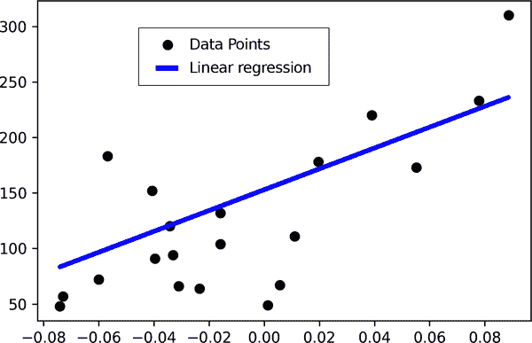
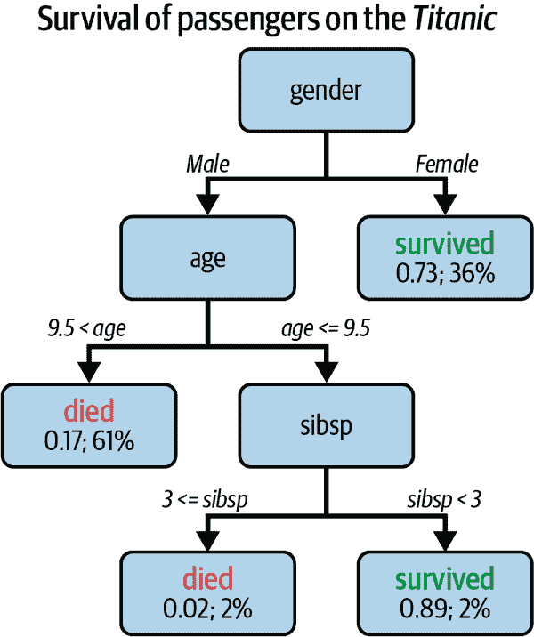
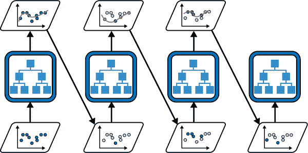
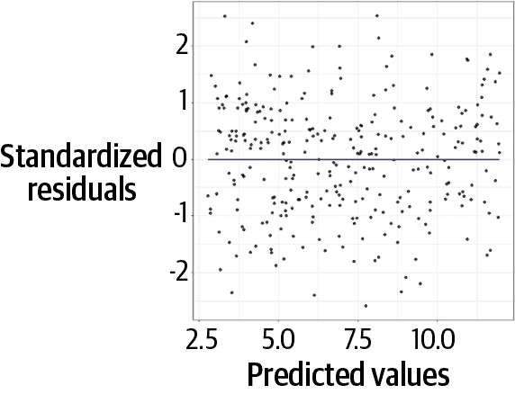
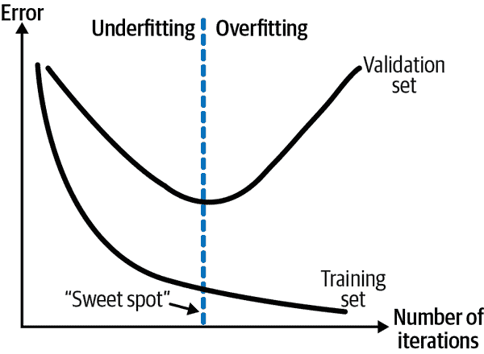
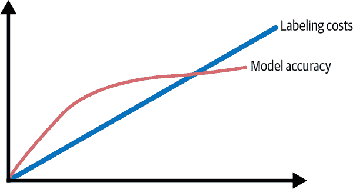
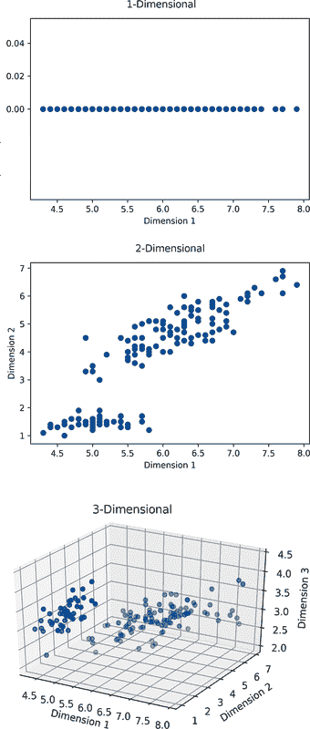
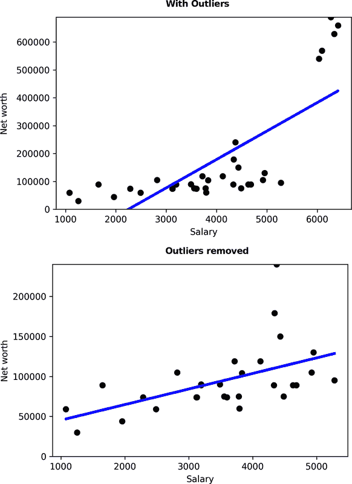

# 第三章：机器学习基础

本章包含了您需要了解的关于机器学习的一切——至少对于本书来说是如此。它也是您进一步学习的一个很好的起点。接下来的部分将为您提供足够的知识，以便跟随本书中的用例，并帮助您构建自己的第一个原型。我们将涵盖监督机器学习、流行的 ML 算法和关键术语，并且您将学会如何评估 ML 模型。

如果您已经熟悉这些主题，可以将本章视为复习。让我们开始学习监督机器学习！

# 监督机器学习过程

让我们考虑一个简单的例子：想象一下，您想要出售自己的房子，并且正在考虑如何确定上市价格。为了得到一个真实的价格，您很可能会查看其他类似房屋以及它们的售价。为了得出一个良好的估计，您可能还会比较您的房子与其他房屋在一些关键特征方面的情况，例如总体大小、卧室数量、位置和年龄。不知不觉中，您已经像一个监督机器学习系统一样行事了。

*监督学习* 是基于已知真实值的历史数据训练 ML 模型的过程。例如，如果您想要像我们的示例那样估计（或预测）房地产价格，监督学习算法会查看历史房价（标签）以及描述房屋的其他信息（特征）。监督机器学习与 *无监督机器学习* 相对，后者未知真实值，计算机必须将数据点分组成相似类别。*聚类* 是无监督机器学习的一个常见例子。

大多数企业机器学习问题属于监督学习范畴。我将通过展示关键步骤来为您介绍监督机器学习的基本过程，这样您以后可以在我们从第七章开始构建第一个 ML 模型时应用这些步骤。

## 步骤 1：收集历史数据

为了让 ML 算法学习，它必须有历史数据。因此，您需要收集数据并以计算机能够高效处理的形式提供它。

大多数算法期望您的数据是整洁的。*整洁数据* 具有三个特征：

+   每个观察结果都在其自己的行中。

+   每个变量都在其自己的列中。

+   每个测量值都是一个单元。

图 3-1 展示了整洁数据的示例。将数据整理成整洁形式可能是整个机器学习工作流程中最繁琐的过程，这取决于数据的来源。

![整洁数据（来源：数据科学的 R，由哈德利·威克姆和加勒特·格罗勒蒙德 [O’Reilly]）](Images/apbi_0301.png)

###### 图 3-1\. 整洁数据。来源：[数据科学的 R](https://www.oreilly.com/library/view/r-for-data/9781491910382) 由哈德利·威克姆和加勒特·格罗勒蒙德（O'Reilly）

## 步骤 2：确定特征和标签

您的算法试图做的一切就是构建一个模型，该模型将根据输入的*x*来预测某些输出*y*。让我们简要解释这个概念。

*标签*（也称为*目标*、*输出*或*因变量*）是基于其他变量进行预测的变量。这些其他变量在机器学习术语中称为*特征*（或*属性*、*输入*或*自变量*）。例如，如果您想要预测房价，房价将是您的标签，而卧室数、大小和位置等变量将是您的特征。在监督学习设置中，您有包含一定数量观测值的历史数据，这些数据包含了特征和标签，也称为*训练样本*。

如果您的标签是数值型，这个过程称为*回归*问题。如果您的标签是分类的，这个过程称为*分类*问题。

不同的算法用于分类和回归问题。在“流行的机器学习算法”中，我将介绍三种流行的算法，这些算法足以满足我们的原型开发目的。

## 第三步：将数据分割为训练集和测试集

当您的数据整理成整洁的形式并且已经定义了特征和标签后，通常需要将数据集分割为训练集和测试集。*训练集*是历史数据集的一部分，用于训练机器学习模型（通常占数据的 70%至 80%）。*测试集*（或*保留集*）是您数据的一部分，将用于最终评估您的机器学习模型。

在大多数 AutoML 场景中，您不需要手动处理这个分割，因为 AutoML 工具会自动处理。然而，有时 AutoML 服务无法猜测出最佳的数据分割方式，因此您需要手动调整（例如，在时间序列数据的情况下）。这就是为什么理解数据分割的重要性，为什么需要它们，以及为什么只能在测试集上评估您的模型的原因。

您将数据分割，因为您希望模型不仅在它已知的数据上表现良好，而且在来自相同分布的新的未见数据上也能表现良好。这就是为什么保留一些数据用于最终评估非常重要的原因。您模型在测试集上的表现将成为对新的未见数据的性能指标。

## 第四步：使用算法找到最佳模型

在这一步中，您尝试找到最能代表您的数据并具有最高预测能力的模型。您可以通过尝试多种具有多个参数的机器学习算法来实现这一点。再次，让我们快速浏览这个概念。

*模型*是您的机器学习训练过程的最终产物。它是一个任意复杂的函数，用于计算任何给定输入值的输出值。

让我们考虑一个简单的例子。您的模型可能如下所示：

```
y = 200x + 1000
```

这是一个简单线性回归模型的方程式。给定任何`x`的输入值（例如，房屋大小），该公式将通过将尺寸乘以 200 并加上 1000 来计算最终价格`y`。当然，ML 模型通常比这复杂得多，但思想是一样的。

那么，计算机如何在给定一些历史输入和输出数据的情况下提出这样的公式呢？需要两个组成部分。首先，我们需要为计算机提供*算法*（在本例中为线性回归算法）。计算机将知道输出必须类似于回归方程：

```
y = b1x + b0
```

计算机将使用历史训练数据来找出此问题的最佳参数`b1`和`b0`。这个参数估计过程在 ML 中称为*学习*或*训练*。我们可以通过各种方式实现和加速大数据集的这个学习过程，但它们超出了本书的范围，对我们的目的来说是不必要的。

您唯一需要知道的是，您需要定义一个 ML 算法来在训练数据上训练模型。这是像数据科学家或 ML 专家这样的专家可以胜任的地方。在我们的案例中，我们将主要依赖 AutoML 解决方案来为我们找到最佳模型。

## 步骤 5：评估最终模型

当我们的训练过程完成时，一个模型将在测试集上展现出最佳性能。不同的评估标准用于不同的机器学习问题，我们将在“机器学习模型评估”中进一步探讨。

重要的是要理解这些指标的工作原理，因为您将需要指定这些指标给 AutoML 服务以找到最佳模型。再次强调，不用担心；您的 AutoML 服务会建议一个很好的首选评估指标。

## 步骤 6：部署

一旦您决定了一个模型，通常希望将其部署到某个地方，以便用户或应用程序可以使用它。这个 ML 过程的技术术语是*推断*、*预测*或*评分*。在这个阶段，您的模型不再学习，而是在接收新的输入值时仅计算输出。

这种工作方式取决于您的设置。通常，模型被托管为一个接受输入数据并返回预测的 HTTP API（*在线预测*）。或者，该模型可以用于一次评分大量数据，这称为*批处理预测*。

## 步骤 7：执行维护

虽然 ML 模型的开发过程在部署后已经结束，但这个过程实际上永远不会结束。随着数据模式的变化，模型需要重新训练，我们需要观察 ML 模型的初始性能是否可以随时间保持高水平。

在原型阶段我们不必处理这些问题，但重要的是注意到机器学习模型在部署后需要大量的维护，这是您在可行性分析中需要考虑的。我们将在第十一章进一步探讨这个话题。

现在您已经从高层次理解了监督机器学习的一般过程，让我们来看看用于训练分类和回归问题模型的最流行的机器学习算法。

# 流行的机器学习算法

在本节中，我将向您介绍三种流行的机器学习算法家族：线性回归、决策树和集成方法。如果您了解这三类算法，您将能够解决大约 90%的商业监督学习问题。

表 3-1 概述了这些算法类别，然后我们将更详细地研究它们。

表 3-1\. 流行的机器学习算法

| 算法类别 | 用于 | 性能 | 可解释性 |
| --- | --- | --- | --- |
| 线性回归 | 回归问题 | 从低到高 | 高 |
| 决策树 | 回归和分类问题 | 平均 | 高 |
| 集成方法（bagging 和 boosting） | 高 | 低 |
| 高 | 低 |

## 线性回归

*线性回归* 是理解机器学习中最基本算法之一，因为它支持许多概念。逻辑回归、回归树、时间序列分析，甚至神经网络都在其核心使用线性回归。

线性回归的工作原理很简单，但很难掌握。给定一些数值输入数据，回归算法将拟合一个线性函数，计算（预测）相应的数值输出数据。

回归的两个主要假设很重要：

+   特征之间应该相互独立（特征之间的相关性应该很低）。

+   特征与结果变量之间的关系应该是线性的（例如，当一个变量增加时，输出变量也应该以固定模式增加或减少）。

图 3-2 展示了一个简单线性回归的示例：x 轴上的输入变量预测了 y 轴上的变量。图中的点是观察到的实际数据点（标签），它们对应历史数据集中每个 x 值。回归的预测将是直线上每个 x 值的 y 值。当然，这只是一个用于说明目的的基本示例。线性回归不仅仅适用于单一输入变量，还可以模拟比直线更复杂的形状（例如，多项式回归）。



###### 图 3-2\. 简单线性回归

正如你在 表 3-1 的第一行中所见，线性回归的模型性能可以从非常低到非常高不等。这是因为线性回归算法的性能严重依赖于数据以及数据如何符合线性回归的假设。如果输入变量确实是独立的，并且与输出变量具有线性关系，那么回归可以击败任何神经网络。

话虽如此，如果您的数据包含非线性模式，回归并不是一个好选择。例如，如果满足某个特定值，然后突然与目标变量的关系发生变化。这类 if-then-else 规则可以通过其他算法更好地建模，比如决策树。

## 决策树

与回归模型相比，基于树的模型可以处理分类和数值数据（回归树），正如你在 表 3-1 中所见。*决策树* 在各个级别、变量之后分割数据，直到数据片段变得足够小，你可以进行预测。想象决策树是一个层次化的 if-then 规则序列。

决策树通常是一种非常通用的算法，可以作为几乎任何表格数据集的首选基线模型。决策树易于分享和解释，即使对非技术相关的利益相关者也是如此。然而，单个决策树在某些情况下未必能够在所有情况下取得最佳结果，因为这种算法是“贪婪”的。这意味着它会首先在数据显示最大差异的地方进行分裂。这一过程并不在所有情况下都是理想的。

图 3-3 展示了一个预测 *泰坦尼克号* 上乘客生存情况的决策树示例，这是一个流行的研究数据集。你从上到下阅读树，每个节点代表一个决策步骤。



###### 图 3-3\. 决策树

因为决策树是贪婪的，它会首先在 `gender` 上进行第一次分裂。如果你从泰坦尼克号数据集中随机选取一名女性乘客，那么这个人幸存的可能性为 73%。作为第一个猜测，这并不差。对于男性，树看起来复杂一些。预测将是 `died` 或 `survived`，考虑到诸如人的 `age` 和兄弟姐妹或配偶的数量 (`sibsp`) 等多个因素。

我们在这里不会深入详细讨论。重要的是你理解决策树的工作原理，因为我们将在下一个概念中继续深入探讨：集成学习。

## 集成学习方法

线性回归和决策树都相当直观，它们的工作方式相对容易解释。*集成方法* 则处于谱系的另一端。正如你在 表 3-1 中所见，集成方法通常提供较高的预测能力。然而，解释它们做出决策的方式并不那么简单。

线性回归和决策树通常被认为是*弱学习器*，这意味着它们在数据关系变得更复杂时表现不佳。例如，回归无法处理非线性数据，而决策树在数据集中的每个变量只能进行一次分裂。

要应对这些问题，集成方法允许你将多个弱学习器组合成一个在复杂数据集上表现强大的强学习器。集成学习的两种典型方法是装袋（bagging）和提升（boosting），它们通过组合弱学习器的方式进行区分。

*装袋*（来自*自助法聚合*）试图通过分别训练多个弱学习器并使用平均过程将它们组合起来。图 3-4 展示了装袋的工作原理图。在中间层，您可以看到四个模型，它们都在同一训练数据集上进行训练。例如，这可能是四棵决策树，具有不同的树深度或最小节点大小参数。对于每个数据点，这四个模型都将进行个别预测（顶层）。最终预测将是这四个结果的聚合（例如，在分类示例中的多数投票，或在回归问题中的平均值）。


###### 图 3-4\. 装袋

一种流行的装袋集成方法称为*随机森林*。这种方法将决策树分成多个子树，以减少它们之间的相关性。

*提升* 相反，是顺序地将模型添加到集成中，每个模型都纠正其前任的错误。这是一种流行且强大的技术。两种流行的提升方法是 AdaBoost（自适应提升）和梯度提升。

图 3-5 展示了装袋的概念概述。训练过程从左下角开始，第一个模型（例如决策树）训练并给出了一个具有相对高误差的第一次预测（左上角）。接下来，训练另一个决策树，它试图纠正前一个模型的错误（底行左边的第二个模型）。这个过程重复进行多次，直到误差变得越来越小，找到一个表现良好的模型。图 3-5 有三次迭代，最终在右下角得到最终模型。



###### 图 3-5\. 提升

正如您从这个例子中看到的，集成方法比线性回归或决策树更难解释。然而，在大多数情况下，它们提供了更好的性能。

您应采取的方法取决于您的目标。如果对于您的项目来说，解释性不如准确性重要，那么选择像自适应增强这样的强学习器通常是更好的选择。另一方面，如果您的机器学习模型需要用户或其他利益相关者深入理解和解释，那么选择稍微不太准确的模型，如决策树或线性回归，可能是更好的选择。如果犹豫不决，如果简单模型提供类似性能，则选择简单模型。

# 深度学习

到目前为止，我们已经涵盖的算法在通常在电子表格或数据仓库中找到的结构化表格数据上表现良好。对于其他数据类型，如图像或文本，您需要不同的算法。这个领域通常被称为*深度学习*。

在这里我们不会详细讨论这个问题。我们将稍后使用来自 Azure 认知服务的 AI 服务，这些服务基于深度学习技术，但我们不打算自己构建它们。对于我们的目的来说，了解这些深度学习概念的一般概念及其工作原理就足够了。

*深度学习*指的是各种专门处理*高维数据集*（即具有许多特征的数据）的机器学习方法和技术。并没有明确的正式定义说明“浅层”机器学习在哪里结束，“深度”学习开始，但大多数情况下关键在于数据类型。

考虑以下示例：即使您构建了一个超高维销售预测器，您可能也不会从您的表格 CRM 数据中创建超过几十个，甚至数百个特征。现在想象一下，您正在分析用于对象检测的图像。即使对于分辨率为 300×300 像素的相当小的图像，您也会得到 90000 个维度（每个像素一个维度）。对于彩色红、绿和蓝（RGB）图片，这个数量会增加三倍。

您可以看到，即使在可能有 1000 列（维度）的高维表格数据和每张图片都有 90000 个维度的小图像表示之间仍存在显著差异。这就是为什么深度学习通常用于像图像、视频和非结构化文本文件这样的非表格数据的原因。

深度学习分为两大类：计算机视觉（处理图片或视频数据）和自然语言处理（处理文本数据）。

## 自然语言处理

您可能已经听说过能够解释人类语言、比以往更准确地进行翻译甚至完全自动生成新文本的 AI 服务。已经在数十亿人类文本示例上进行了训练的大型语言模型，结合一种称为[transformers](https://oreil.ly/kDnMj)的突破性技术，将 NLP 领域从一个小的研究领域推向了 AI 开发中最热门的领域之一。

我们不会在本书中自行训练 NLP 模型，但你将接触使用最先进的语言模型来规模化分析语言数据。这不仅仅适用于书面文本。NLP 技术还非常适合分析口语。这个领域通常被称为*语音转文本*。

## 计算机视觉

*计算机视觉*是一种技术，使得机器能够“看到”和解释图像和视频文件。一种名为*卷积神经网络*（*CNNs*）的技术近年来在这个领域取得了令人难以置信的突破。应用范围从在图像中识别如汽车、自行车、街道标志、动物和人类等商品实体，到人脸识别和从图像中提取文本结构。

这是一个变化多端、充满活力的领域。在第九章中，我们将使用计算机视觉 AI 服务来检测和计数图像文件中的汽车。

## 强化学习

我想要重点介绍的最后一个深度学习类别是*强化学习*。我们将在第八章中看到强化学习服务的实际应用。强化学习的工作方式与监督学习或无监督学习有所不同，并已成为一个独立的领域。

强化学习模型学习方式的原因在于它们学习的方式。强化学习方法不依赖于历史数据，而是需要持续涌入新数据流，以便模型可以根据系统当前状态和允许模型操作的策略学习最佳策略。

强化学习已经取得了重大突破，能够击败像围棋和*星际争霸*这样的世界级人类选手。但正如你后面将发现的那样，它也是个性化用户体验和随时间学习用户需求以及如何与用户交互的绝佳方式。

# 机器学习模型评估

通过你迄今为止从本书中获得的知识，你应该足够自信能够从原型阶段到真实世界应用 ML 模型。然而，还缺少一个组成部分。那就是如何评估你的模型实际运行效果的方法。

能够测量 ML 模型性能的能力在原型设计阶段和后期投产阶段至关重要。我们选择的评估指标不应该有所不同，只是指标值不同。那么我们如何评估 ML 模型的性能呢？

欢迎来到评估指标的世界！评估指标有两个计算目的：

+   为了比较模型之间的优劣，以找到最佳的预测模型

+   持续测量模型在新的未见数据上的真实性能

模型评估的基本思想始终如一：我们将模型预测的值与地面真相中模型应该预测的值（例如数据集中的标签）进行比较。这听起来直观简单，但实际上涵盖了相当多的复杂性。事实上，仅仅是评估指标本身就可以写成一本书。

在我们的情况下，我们将保持简洁，重点关注您在处理机器学习算法时可能会遇到的最重要概念。我们针对分类和回归问题使用不同的评估指标。

## 评估回归模型

记住，回归模型预测连续数值变量，如收入、数量和大小。评估回归模型最流行的指标是*均方根误差*（*RMSE*）。它是回归预测值（*ŷ*）平均平方误差的平方根。RMSE 可以定义如下：

<math><mrow><mrow><mtext mathvariant="italic">RMSE</mtext><mo>=</mo><msqrt><mfrac><mrow><mstyle displaystyle="true" scriptlevel="0"><msubsup><mrow><mi mathvariant="normal">Σ</mi></mrow><mrow><mi>i</mi><mo>=</mo><mn>1</mn></mrow><mrow><mi>n</mi></mrow></msubsup><msup><mrow><mo>(</mo><msub><mrow><mi>y</mi></mrow><mrow><mi>i</mi></mrow></msub><mo>−</mo><msub><mrow><mover><mrow><mi>y</mi></mrow><mrow><mo>^</mo></mrow></mover></mrow><mrow><mi>i</mi></mrow></msub><mo>)</mo></mrow><mrow><mn>2</mn></mrow></msup></mstyle></mrow><mrow><mstyle displaystyle="true" scriptlevel="0"><mi>n</mi></mstyle></mrow></mfrac></msqrt></mrow></mrow></math>

RMSE 衡量了模型的整体准确度，并可以用来比较各个回归模型之间的表现。数值越小，模型的表现似乎越好。RMSE 的结果与原始预测值的规模一致。例如，如果你的模型预测房价的美元数值，并且看到 RMSE 为 256.6，那么这意味着“模型的预测平均偏差为 256.6 美元”。

在回归评估的背景下，你还会看到另一个流行的度量指标，*决定系数*，也称为*R-squared*统计量。R-squared 的取值范围是从 0 到 1，用来衡量模型中数据变化的比例。当你想评估模型与数据的拟合程度时，这个指标非常有用。R-squared 的公式如下：

<math><mrow><mrow><msup><mrow><mi>R</mi></mrow><mrow><mn>2</mn></mrow></msup><mo>=</mo><mn>1</mn><mo>−</mo><mfrac><mrow><mstyle displaystyle="true" scriptlevel="0"><msubsup><mrow><mi mathvariant="normal">Σ</mi></mrow><mrow><mi>i</mi><mo>=</mo><mn>1</mn></mrow><mrow><mi>n</mi></mrow></msubsup><msup><mrow><mo>(</mo><msub><mrow><mi>y</mi></mrow><mrow><mi>i</mi></mrow></msub><mo>−</mo><msub><mrow><mover><mrow><mi>y</mi></mrow><mrow><mo>^</mo></mrow></mover></mrow><mrow><mi>i</mi></mrow></msub><mo>)</mo></mrow><mrow><mn>2</mn></mrow></msup></mstyle></mrow><mrow><mstyle displaystyle="true" scriptlevel="0"><msubsup><mrow><mi mathvariant="normal">Σ</mi></mrow><mrow><mi>i</mi><mo>=</mo><mn>1</mn></mrow><mrow><mi>n</mi></mrow></msubsup><msup><mrow><mo>(</mo><msub><mrow><mi>y</mi></mrow><mrow><mi>i</mi></mrow></msub><mo>−</mo><mover><mrow><mi>y</mi></mrow><mrow><mo>¯</mo></mrow></mover><mo>)</mo></mrow><mrow><mn>2</mn></mrow></msup></mstyle></mrow></mfrac></mrow></mrow></math>

这可以解释为模型解释的方差与目标变量总方差之比的一减。通常情况下，R-squared 值越高，模型越好。R-squared 值为 1 意味着模型能够解释数据中的所有方差。

虽然汇总统计数据是比较不同模型的好方法，但仅仅依靠这些指标来判断我们的回归是否按预期工作仍然很困难。因此，在回归建模中的一个良好方法是查看回归误差的分布，即我们模型的*残差*。残差的分布为我们提供了关于回归模型表现的良好视觉反馈。

残差图将预测值与残差作为简单的散点图绘制。理想情况下，残差图应该看起来像 图 3-6，以支持以下假设：

线性性

残差图中的点应该随机分布，而不应该显示出太多的曲线。

异方差性

预测值在各个预测值上的点的分布应该基本相同。



###### 图 3-6\. 残差分析

残差图将展示你的数据中回归模型表现良好和表现不佳的部分。根据你的使用情况，你可以决定这是否是一个问题，或者在考虑所有其他因素时是否仍然可接受。仅仅查看汇总统计数据不能带给你这些见解。在评估回归模型时，始终注意残差是一个好主意。

## 评估分类模型

如果预测值不是数值而是分类的话，我们如何评估预测模型的性能呢？我们不能简单地应用从回归模型中学到的度量标准。为了理解原因，让我们看一下 表 3-2 中的数据。

该表显示了分类问题的真实标签（目标列）以及分类模型的相应输出（预测和“概率输出”列）。

表 3-2\. 分类输出示例

| 目标 | 预测 | 概率输出 |
| --- | --- | --- |
| 1 | 1 | 0.954 |
| 1 | 0 | 0.456 |
| 0 | 0 | 0.012 |
| 0 | 1 | 0.567 |
| 0 | 0 | 0.234 |
| … | … | … |

如果你看看前四行，你会看到可能会发生的四件事：

+   真实标签为 `1`，我们的预测是 `1`（正确预测）。

+   真实标签为 `0`，我们的预测是 `0`（正确预测）。

+   真实标签为 `1`，我们的预测不是 `1`（预测错误）。

+   真实标签为 `0`，我们的预测不是 `0`（预测错误）。

如果我们有超过两个类别，这四种结果也会发生。我们可以简单地观察数据集中每个类别的这四种结果。

评估分类模型性能的最流行方式是在 *混淆表* 或 *混淆矩阵* 中展示这四种结果，如 表 3-3 所示。

表 3-3\. 混淆矩阵

|   |   | 预测类别 |
| --- | --- | --- |
|   |   | 负面 | 正面 |
| **实际类别** | 负面 | 2,388 真负例 (TN) | 558 假正例 (FP) |
| 正面 | 415 假负例 (FN) | 2,954 真正例 (TP) |

这个混淆表告诉我们，在我们的例子分类问题中，有 2,388 个观察结果实际标签为 `0`，我们的模型正确预测了它们。这些观察结果被称为 *真负例*，因为模型正确地预测了负类标签。同样，有 2,954 个观察结果被我们的模型标识为 *真正例*，因为实际和预测的结果都有正类标签（在本例中是数字 `1`）。

但是我们的模型也犯了两种错误。首先，它错误地将负类预测为正类（558 个案例），也称为 *I 型错误*。其次，模型错误地预测了实际上是正的 415 个案例为负。这些错误称为 *II 型错误*。统计学家在给这些事物命名时没有那么有创意。

现在，我们可以从这个混淆表中计算各种指标。你会经常看到和听到的最流行指标是准确率。*准确率* 描述了我们的模型多频繁地正确，基于所有预测。我们可以通过将正确预测的数量除以所有预测的数量来轻松计算模型的准确率：

<math><mrow><mrow><mtext>ACC</mtext><mo>=</mo><mstyle displaystyle="true" scriptlevel="0"><mfrac><mrow><mstyle displaystyle="true" scriptlevel="0"><mtext>TP</mtext><mo>+</mo><mtext>TN</mtext></mstyle></mrow><mrow><mtext>TP</mtext><mo>+</mo><mtext>TN</mtext><mo>+</mo><mtext>FP</mtext><mo>+</mo><mtext>FN</mtext></mrow></mfrac></mstyle></mrow></mrow></math>

对于表 3-3 中的混淆矩阵，准确度为 (2,388 + 2,954) / (2,954 + 2,388 + 558 + 415) = 0.8459，这意味着我们模型的预测在所有情况下都正确率达到了 84.59%。

虽然准确度是一个广泛使用和受欢迎的度量标准，但它有一个重要的限制：准确度仅适用于平衡分类问题。想象一个这样的例子：我们想预测信用卡欺诈，这在所有信用卡交易中只发生在 0.1% 的情况下。如果我们的模型一直预测没有欺诈，它将得到令人惊讶的 99.9% 的准确度分数，因为在大多数情况下它都是正确的。

虽然这个模型具有优秀的准确度度量标准，但显然这个模型完全没有用。这就是为什么混淆矩阵允许我们计算更多更平衡地正确识别正负类别标签的度量标准。

我们可以看一下的第一个度量标准是*精确度*。它衡量了真正例的比例（预测的真标签实际上是真的）。精确度，也称为*正预测值*（*PPV*），定义如下：

<math><mrow><mrow><mtext>PPV</mtext><mo>=</mo><mfrac><mrow><mstyle displaystyle="true" scriptlevel="0"><mtext>TP</mtext></mstyle></mrow><mrow><mstyle displaystyle="true" scriptlevel="0"><mtext>TP</mtext><mo>+</mo><mtext>FP</mtext></mstyle></mrow></mfrac></mrow></mrow></math>

在我们的例子中，精确度为 2,954 / (2,954 + 558) = 0.8411。这个数值可以解释为当模型将数据点标记为正类别（`1`）时，它在所有情况下都是正确的 84%。如果一个假阳性的成本非常高而一个假阴性的成本较低（例如，我们要决定是否向在线用户展示昂贵的广告），我们将选择这个度量标准。

另一个关注正类别但具有稍有不同焦点的度量标准是*召回率*，有时也称为*敏感性*或*真正率*（*TPR*）。它给出了所有正类别中被正确分类为正类别的百分比。召回率定义如下：

<math><mrow><mrow><mtext>TPR</mtext><mo>=</mo><mfrac><mrow><mstyle displaystyle="true" scriptlevel="0"><mtext>TP</mtext></mstyle></mrow><mrow><mstyle displaystyle="true" scriptlevel="0"><mtext>TP</mtext><mo>+</mo><mtext>FN</mtext></mstyle></mrow></mfrac></mrow></mrow></math>

在我们的示例中，这将是 2,954 / (2,954 + 415) = 0.8768。这个数值表示模型能够识别数据集中 87.68% 的所有正类别。我们会选择这个度量标准来优化我们的模型，以便在数据集中找到正类别（例如，用于欺诈检测）。在成本极高的情况下错过这些正类别（假阴性）时，使用召回率作为评估度量是合理的。

如果您不想倾向于精确度或召回率，并且准确性似乎不能很好地捕捉您的问题，您可以考虑另一种常用的度量标准，称为*F 分数*。尽管其技术名称，但此度量标准相对直观，因为它结合了精确度和召回率。最流行的 F 分数是 F1 分数，它只是精确度和召回率的调和平均数。

因此，如果已知精确度和召回率，我们可以轻松计算 F1 分数：

<math><mrow><mrow><msub><mrow><mtext>F</mtext></mrow><mrow><mn>1</mn></mrow></msub><mo>=</mo><mn>2</mn><mo>×</mo><mstyle displaystyle="true" scriptlevel="0"><mfrac><mrow><mtext>PPV</mtext><mo>×</mo><mtext>TPR</mtext></mrow><mrow><mtext>PPV</mtext><mo>+</mo><mtext>TPR</mtext></mrow></mfrac></mstyle><mo>=</mo><mstyle displaystyle="true" scriptlevel="0"><mfrac><mrow><mn>2</mn><mtext>TP</mtext></mrow><mrow><mn>2</mn><mtext>TP</mtext><mo>+</mo><mtext>FP</mtext><mo>+</mo><mtext>FN</mtext></mrow></mfrac></mstyle></mrow></mrow></math>

在我们的情况下，因此 F1 分数将是 2 × (0.8411 × 0.8768) / (0.8411 + 0.8768) = 0.8586。

一个更高的 F1 分数表明模型表现更好，但它究竟告诉了我们什么呢？嗯，F1 分数并不能像前面的指标那样用一句话轻松解释，但通常是评估模型质量的一个好去处。由于 F1 分数使用精确度和召回率的调和平均数而非算术平均数，如果其中一个非常低，它将倾向于较低分数。

想象一个极端的例子，精确度为 0，召回率为 1。算术平均数将返回 0.5 的分数，大致翻译为“如果一个很好，但另一个很差，那么平均值还行。”而调和平均数在这种情况下将为 0。F1 分数不会将高低数值平均化，而是在召回率或精确度极低时发出警告。这更接近你对联合表现指标的期望。

## 评估多分类模型

我们用于二分类问题的指标也适用于*多分类问题*（其中有超过两个类别要预测）。例如，请考虑以下目标和预测值：

```
targets = [1, 3, 2, 0, 2, 2]
predicted = [1, 2, 2, 0, 2, 0]
```

二分类和多分类问题之间唯一的区别在于，您将计算每个类别（0、1、2、3）的评估指标，并将其与所有其他类别进行比较。您可以使用不同的方法进行此操作，通常称为*微观*和*宏观*值。

*微观分数*通常通过将所有真正例、假负例和假正例总数一起计算，然后仅通过彼此除以彼此来计算指标。*宏观分数*则首先计算每个标签的精确度、召回率等，然后计算所有标签的平均值。这些方法产生类似但仍然不同的结果。

例如，我们为四个分类标签的虚拟系列的微观 F1 分数为 0.667，宏观 F1 分数为 0.583。如果愿意，可以尝试手动计算这些数字，以促进对这些指标的理解。

微观或宏观度量都没有好坏之分。这只是基于不同方法计算同一摘要统计的不同方式。在你处理更复杂的多类问题后，这些细微差别会变得更加关键。

还有更多的性能指标可供参考，但这超出了本书的范围。例如，到目前为止，我们甚至还没有看过考虑模型概率输出的性能指标，比如 ROC 曲线下的面积（*AUC*）。

在评估指标方面并不存在银弹。重要的是，你至少要高层次地理解这些指标试图捕捉什么，并确定哪个指标对你的用例实用。你还需要知道何时停止训练更复杂和（表面上）准确的 ML 模型是足够好的。我们将在下一节深入探讨这一点。

# 机器学习的常见陷阱

机器学习是解决许多现代问题的强大工具，但像任何其他工具一样，容易被误用并导致糟糕的结果。本节概述了一些初学者应避免的错误。

## 陷阱 1：在不需要时使用机器学习

如果你手里有一把锤子，看什么都像钉子。你最糟糕的做法是利用你新学到的机器学习知识，寻找看起来适合的商业问题。相反，应该从相反的角度来看待：一旦确定了一个相关的商业问题，再考虑机器学习是否能帮助解决它。

即便如此，从一个简单的基线开始是很重要的。这个基线对于获取一个 ML 算法需要超越的性能基准至关重要。如果你以前从未进行过客户流失分析，你不应该从一个基于 ML 的方法开始，而是使用简单的启发式方法或硬编码规则。这些方法复杂度低，业务利益相关者容易理解。一旦发现它们的表现显著优于你的基线解决方案，再转向 ML 模型。

## 陷阱 2：过于贪心

不要贪图在训练集上最大化性能指标。这可能导致你的模型在未曾见过的新数据上表现不佳。这听起来可能违反直觉，但在训练时应更加保守，特别是在较小的数据集上，这可以更好地推广模型到未见数据的泛化能力。这个概念也被称为*奥卡姆剃刀*：当你犹豫不决时，简单的解决方案比复杂的解决方案更好。

## 陷阱 3：构建过于复杂的模型

建立过于复杂的模型往往与前述观点相辅相成：为了达到高准确度，经验不足的人往往倾向于创建过于复杂的模型，例如神经网络。在许多情况下，比起高度复杂且高准确度的模型，更偏向于一个准确度较低但复杂度较低的模型。

复杂模型存在两个缺点：

+   在生产环境中，复杂模型可能难以维护和调试。如果出现问题或者你的模型预测出现偏差（这种情况肯定会偶尔发生），相较于简单模型，高度复杂的模型更难纠正。

+   复杂模型可能导致*过拟合*：你的模型在训练数据上表现良好，但在新数据上表现不佳。预测分析就是要找到一个甜点（见图 3-7），在这个甜点上，训练（历史数据）和测试（新数据）中的预测误差大致相等。为了避免过拟合，你应该始终监控模型在新数据上的表现以及模型的复杂度。



###### 图 3-7\. 训练误差与测试误差

## 陷阱 4：没有在数据足够时停止

在你的组织中很少会有完全标记完美的机器学习数据。正如你已经了解到的，通常情况下，我们拥有的示例（观察结果）越多，效果就越好。然而，经验表明，机器学习算法会在某一点达到平台期，在这一点之后，额外的训练示例不再显著提高准确性。这种效应在图 3-8 中有所体现。

当你达到这一点时，再多花费在数据标记上的资金就变得不划算了。因此，设定一个明确的目标非常重要。你的模型需要多准确才能使用？阈值可以从“比基准值更好的任何情况”到“需要 99.99%的准确度”，例如在医疗案例中。了解你的目标和想要实现的内容可以帮助你避免高昂的成本。



###### 图 3-8\. 模型准确度与标记成本

## 陷阱 5：陷入维度灾难

虽然“数据越多越好”的原则适用于观察（行），但对于特征（列）来说可能会适得其反。想象一下以下的例子。

你想基于大小、卧室数量和位置（邮政编码）来预测美国房价。大小和卧室可以建模为两个独立的特征（列），这样可以将数据集的维度增加一个数量级，如图 3-9 所示。

然而，一旦你开始使用邮政编码，大多数机器学习算法要求你将此类分类变量编码为一个单列特征，其宽度与唯一值的数量完全相同。这会将数据的维度增加不仅仅是一阶，而是 41692 阶（可能的美国邮政编码数量），因为它将是单列，每个示例包含值`0`或`1`。

大多数机器学习算法将难以在数据中找到实际模式，因为数据太稀疏。没有绝对的规则能帮助你避免维度灾难，但这里有一些建议：

+   在向数据集添加新特征时要小心，不要犹豫地删除冗余或无关的特征。有时这一步骤可能很困难，因为你可能需要扎实的领域专业知识。

+   尝试通过将这些依赖关系编码为单一属性来减少属性之间的关系数量。例如，不要有两个属性，价格和大小，你可以计算一个新的属性，每平方英尺价格。数据集中变量之间的依赖关系越少，机器学习算法就越容易理解它们。



###### 图 3-9\. 跨多个维度的数据点

## Pitfall 6: 忽略异常值

*异常值*是远高于数据集平均值的数据点。例如，想象一个包含人们工资和净值的数据集。如果绘制数据，它可能看起来像图 3-10 顶部的图表。



###### 图 3-10\. 带异常值（顶部）和不带异常值（底部）的样本数据

您可以看到*工资*和*净值*之间似乎存在很强的相关性。但有一些数据点与所有其他数据点相距甚远。这些数据点代表的是工资高，但净值更高的人群。在这种情况下，回归线（虚线）偏向这些异常值，导致其他所有数据点拟合效果不佳。一旦我们移除这些高净值个体组（在图 3-10 左括号下）后，回归线似乎更好地适应了其余数据点。

对许多算法来说，异常值的影响可能非常巨大，尤其是那些处理回归任务的算法。这意味着你应该密切注意检测数据集中的异常值。

## Pitfall 7: 对云基础设施理所当然

在本书中，我大胆地假设您可以访问云计算进行模型训练和推理。但让我们面对现实：在许多公司中，情况可能并非如此（尚）。尽管云计算的采用速度正在迅速增长，但大多数公司仍然主要使用本地解决方案。造成这种情况的原因很多，但一个重要原因是害怕失去数据控制权。

我强烈建议您至少尝试使用云计算（AIaaS 或 ML 平台）进行原型设计，即使是使用非关键数据，正如下一章所述。虽然这可能还不是您组织中的惯常做法，但它将使您快速启动，并与前沿的 ML 工作流程和工具保持联系。这还将使您能够与团队讨论云计算如何成为一个有利于整体 AI/ML 战略的投资。

# 摘要

在本章中，您学习了监督式机器学习的基本概念，并了解了哪些算法对机器学习非常重要。我们还涉及了深度学习、计算机视觉和自然语言处理。

当然，您在机器学习方面还有很多东西要学习，但这些页面将为您提供构建自己的 ML 驱动原型所需的一切。我希望您现在对此有了一些信心。如果没有，不要担心！

等到我们接近实际应用案例时，本章的概念可能会对您更易于理解，因为它们将与某些实践联系在一起。如果您想深入了解机器学习，我推荐阅读以下任何一本书：

+   [*机器学习设计模式*](https://www.oreilly.com/library/view/machine-learning-design/9781098115777) 由 Valliappa Lakshmanan 等人（O’Reilly）

+   [*Python 机器学习入门*](https://www.oreilly.com/library/view/introduction-to-machine/9781449369880) 由 Andreas C. Müller 和 Sarah Guido（O’Reilly）

+   [*构建机器学习驱动的应用*](https://www.oreilly.com/library/view/building-machine-learning/9781492045106) 由 Emmanuel Ameisen（O’Reilly）

我还建议您收藏本章，并在需要时随时回来温习机器学习基础知识。
